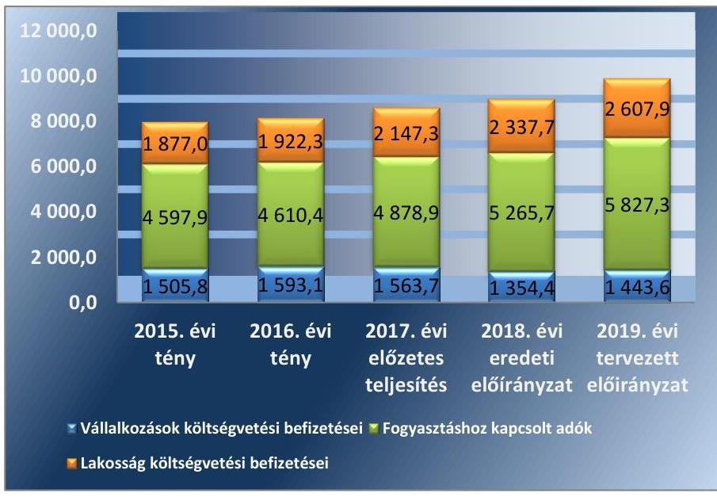

# Jelentés 

## Vélemény a 2019. évi költségvetésről

Vélemény Magyarország 2019. évi központi költségvetéséről szóló törvényjavaslatról
2018.

---

# Jelentés 

## Vélemény a 2019. évi költségvetésről

Vélemény Magyarország 2019. évi központi költségvetéséről szóló törvényjavaslatról
2018. 06 hó 26 nap

---

|   | AZ ELLENŐRZÉST FELÜGYELTE:  |
| --- | --- |
|   | HOLMAN MAGDOLNA JULIANNA felügyeleti vezető  |
|   | AZ ELLENŐRZÉST VEZETTE ÉS A VÉGREHAJTÁSÁÉRT FELELŐS:  |
|   | DR. SIMON JÓZSEF ellenőrzésvezető  |
|   | A PROGRAM ÖSSZEÁLLÍTÁSÁÉRT FELELŐS:  |
|   | TÓTPÁL SZABOLCS osztályvezető  |
|   | A TÉMÁHOZ KAPCSOLÓDÓ KORÁBBI SZÁMVEVŐSZÉKI JELENTÉSEK:  |
|   | - címe: Vélemény Magyarország 2018. évi központi költségvetéséről szóló törvényjavaslatról  |
|   | - sorszáma: 17085  |
|  Jelentéseink az Országgyúlés számítógépes hálózatán és az Interneten a www.asz.hu címen is olvashatóak. | - címe: Vélemény Magyarország 2017. évi központi költségvetéséről szóló törvényjavaslatról  |
|   | - sorszáma: 16062  |
|   | IKTATÓSZÁM: EL-0732-342/2018  |
|   | TÉMASZÁM: 2490  |
|   | ELLENŐRZÉS-AZONOSÍTÓ SZÁM: V0843  |

---

# TARTALOMJEGYZÉK 

- ÖSSZEGZÉS ..... 5
- A VÉLEMÉNYADÁS CÉLJA ..... 6
- A VÉLEMÉNYADÁS TERÜLETE ..... 7
- A VÉLEMÉNYADÁS HÁTTERE, INDOKOLTSÁGA ..... 8
- A VÉLEMÉNYADÁS LÉNYEGES KÉRDÉSKÖREI ..... 9
- A VÉLEMÉNYADÁS HATÓKÖRE ÉS MÓDSZEREI ..... 10
- ÁSZ VÉLEMÉNYEK ..... 12
- KÖVETKEZTETÉSEK ..... 29
- MELLÉKLETEK ..... 31
I. sz. melléklet: Értelmező szótár ..... 31
II. sz. melléklet: A költségvetés részben megalapozott, nem megalapozott és kockázatos kiadási előirányzatai ..... 33
III. sz. melléklet: A költségvetésben pozitív kockázatot hordozó bevételi előirányzatok ..... 34
- RÖVIDÍTÉSEK JEGYZÉKE ..... 35

---

.

---

# ÖSSZEGZÉS 

A 2019. évi központi költségvetésről szóló törvényjavaslat tervezése szabályszerűen történt. A bevételek és a kiadások tudatos tervezése által a költségvetési törvényjavaslat egésze megalapozott. Az előirányzatok kialakítása támogatja a költségvetés rövid és középtávú stabilitását, emellett hozzájárul a fenntartható gazdasági növekedés megvalósításához.

## A véleményadás társadalmi indokoltsága

A véleményadás során kiemelt kérdést jelent, hogy az Állami Számvevőszékről szóló 2011. évi LXVI. törvény 5. § (1) bekezdése alapján az Állami Számvevőszék törvényi kötelezettségének teljesítésével támogassa a megalapozott döntéshozatalt annak érdekében, hogy az Országgyűlés a követelményeknek megfelelő költségvetési törvényt fogadhasson el.

A véleményadás keretében az Állami Számvevőszék rámutat a 2019. évi költségvetéséről szóló törvényjavaslatban azonosított kockázatokra, amely kezelése hatékonyan és megfelelő időben megtörténhet. A véleményadás megállapításai támogatják a költségvetés tervezéséért felelős intézményeket és szervezeteket, illetve a költségvetési szerveket is a megalapozott költségvetési tervek elkészítésében.

## Főbb megállapítások, következtetések

A 2019. évi központi költségvetésről szóló törvényjavaslat elkészítése során a tervezést végző szervezetek a jogszabályi és egyéb belső előírások szerint jártak el. A költségvetési törvényjavaslat szerkezete és tartalma összhangban van a jogszabályi előírásokkal, ezáltal teljesül a felelős költségvetési gazdálkodás követelménye.

A feltételezett gazdasági növekedés elérése mellett a GDP arányos hiány és államadósság-mutató, egy kivétellel, megfelel a jogszabályi előírásoknak. Az 1,7\%-os tervezett strukturális deficit nem felel meg a középtávú költségvetési hiánycélnak. Az államadósság-mutató 2,6 százalékpontos csökkenése a 2019. évben is jelentős implicit tartalékot jelent a magyar költségvetés számára a gazdasági növekedés esetleges lassulása esetén. Ezáltal biztosítható az állam-adósság-mutató folyamatos csökkenése, amely számos pozitív hatást gyakorol a makrogazdasági tényezőkre.

A Magyarország 2019. évi központi költségvetéséről szóló törvényjavaslat bevételi előirányzatai teljes körűen megalapozottak, a kiadási előirányzatok 92,5\%-a megalapozott, 7,49\%-a részben és a fennmaradó 0,01\%-a nem megalapozott. A véleményadás által feltárt kockázatok megfelelő és a tervezés időszakában megtett költségvetési intézkedésekkel kezelhetőek, továbbá az Országvédelmi Alapban rendelkezésre álló forrás elegendő biztonsági tartalékot jelent a fennmaradó költségvetési kockázatok kivédésére.

---

# A VÉLEMÉNYADÁS CÉLJA 

A VÉLEMÉNYADÁS CÉLJA annak értékelése, hogy a központi költségvetésről szóló törvényjavaslat öszszeállítása megfelel-e a jogszabályi előírásoknak, a törvényjavaslat bevételi és kiadási előirányzatait, valamint a költségvetési évet követő három év tervezett előirányzatainak keretszámait a makrogazdasági előrejelzéseket is figyelembe véve tervezték-e meg; biztosították-e a tervezésnél alkalmazott módszerek, háttérszámítások, hatástanulmányok, valamint az állami szabályozó eszközök javasolt módosításai a törvényjavaslat megalapozottságát.

Az értékelés kiterjed továbbá arra is, hogy az Alaptörvényben és a Magyarország gazdasági stabilitásról szóló törvényben foglaltak alapján érvényesül-e államadósság-szabály, számításba vették-e az EU tagság pénzügyi, gazdasági hatásait.

---

# A VÉLEMÉNYADÁS TERÜLETE 

A VÉLEMÉNYADÁS során az Állami Számvevőszék értékeli, hogy a központi költségvetésről szóló törvényjavaslat összeállítása szabályszerűen történt-e; Magyarország 2019. évi központi költségvetéséről szóló törvényjavaslat bevételi és kiadási előirányzatai, valamint a költségvetési évet követő három év tervezett előirányzatai keretszámainak megtervezése szabályszerű volt-e, a tervezett előirányzatok megalapozottak, illetve alátámasztottak-e, az Alaptörvényben és a Magyarország gazdasági stabilitásról szóló törvényben foglaltak alapján érvényesül-e az államadósságszabály.

---

# A VÉLEMÉNYADÁS HÁTTERE, INDOKOLTSÁGA 

Az Állami Számvevőszék törvényi kötelezettségének teljesítésével véleményezi a költségvetési törvényjavaslatot rámutatva annak kockázataira. Ezáltal támogatja az országgyűlési képviselőket a jogszabályi követelményeknek megfelelő költségvetési törvény elfogadásában.

Az Állami Számvevőszék a 2019. évi központi költségvetés véleményezéséhez kapcsolódó elemzésekben véleményt nyilvánít a 2019. évi költségvetési törvényjavaslatról, az államadósság-mutató kidolgozására vonatkozó eljárásokról, a tervezett államadósság összegét megalapozó számításokról, azok alátámasztottságáról, valamint a 2019. évi költségvetési törvényjavaslat parlamenti zárószavazását megelőzően az Alaptörvényben és a Magyarország gazdasági stabilitásról szóló törvényben rögzített államadósság szabály érvényesüléséről, vagyis arról, hogy a törvényjavaslat elfogadásához szükséges feltételek teljesültek-e.

---

# A VÉLEMÉNYADÁS LÉNYEGES KÉRDÉSKÖREI 

1. A központi költségvetésről szóló törvényjavaslat összeállítása az irányadó szabályoknak megfelelően történt-e?
2. A Magyarország 2019. évi központi költségvetéséről szóló törvényjavaslatban foglalt bevételi és kiadási előirányzatok meg-alapozottak-e?

---

# A VÉLEMÉNYADÁS HATÓKÖRE ÉS MÓDSZEREI 

## A véleményadás típusa

Értékelés.

## A véleményadással érintett időszak

A 2019. év.

## A véleményadás tárgya

A 2019. évi központi költségvetésről szóló törvényjavaslat összeállításának szabályszerűsége, a tervezés megalapozottsága, az előirányzatok megalapozottsága, alátámasztottsága, teljesíthetősége, illetve elegendősége, valamint az államadósság-szabály érvényesülése.

## A véleményadásban érintett szervezetek

Agrárminisztérium, Államadósság Kezelő Központ Zrt., Belügyminisztérium, Emberi Erőforrások Minisztériuma, Honvédelmi Minisztérium, Igazságügyi Minisztérium, Innovációs és Technológiai Minisztérium, Külgazdasági és Külügyminisztérium, Magyar Államkincstár, Miniszterelnökség, Miniszterelnöki Kabinetiroda, Miniszterelnöki Kormányiroda, Nemzeti Adó- és Vámhivatal, Nemzeti Egészségbiztosítási Alapkezelő, Nemzeti vagyon kezeléséért felelős tárca nélküli miniszter, Pénzügyminisztérium.

## A véleményadás jogalapja

Az ÁSZ tv. 1. § (3), 5. § (1) bekezdéseiben foglaltak.

## A véleményadás módszerei

A véleményadást a végrehajtáshoz készített program kérdései, a véleményadási időszakban hatályos jogszabályok és az Állami Számvevőszék irányadó módszertanának figyelembevételével végeztük (Módszertani útmutató a Magyarország központi költségvetéséről szóló törvényjavaslat véleményezését megalapozó ellenőrzéshez).

---

Az Állami Számvevőszék véleményének kialakításához szükséges bizonyítékok megszerzése az ellenőrzött szervezetek által rendelkezésre bocsátott dokumentumokra, adatokra alapozva megfigyelés, szemle (szemrevételezés), kérdésfeltevés (információkérés), valamint elemző eljárás útján történt. A bizonyítékként felhasználható adatforrások közé tartoztak egyrészt a szakmai program részletes szempontjainál felsorolt adatforrások, másrészt minden egyéb - a vélemény kialakítása folyamán feltárt, a véleményadás szempontjából információt tartalmazó - dokumentum.

A véleményadáshoz az adatszolgáltatásra kötelezett szervezetek a tanúsítványok és monitoring táblázatok kitöltésével, valamint az Állami Számvevőszék által kért dokumentumok megküldésével szolgáltattak adatokat.

A véleményadás lefolytatása során figyelembe vettük a T/629. számú Magyarország 2019. évi központi költségvetésének megalapozásáról, a T/625. számú az egyes adótörvények és más kapcsolódó törvények módosításáról, továbbá a T/627. számú szociális hozzájárulási adóról szóló törvényjavaslatot, valamint az Európai Bizottság részére a Kormány által benyújtott Magyarország 2018-2022. évekre vonatkozó Konvergencia Programot.

---

# 1. A központi költségvetésről szóló törvényjavaslat összeállítása az irányadó szabályoknak megfelelően történt-e? 

Összegző vélemény

A központi költségvetésről szóló törvényjavaslat összeállítása az irányadó szabályokkal összhangban történt. A költségvetési törvényjavaslat - egy kivétellel - teljesíti a hiány- és az állam-adósság-szabállyal kapcsolatos előírásokat.

### 1.1. számú vélemény

A központi költségvetésről szóló törvényjavaslat összeállítása és tartalma a jogszabályi előírásoknak megfelel.

A 2019. évi központi költségvetésről szóló törvényjavaslat a megelőző két év költségvetési törvényjavaslatainak felépítésével megegyező szerkezetben mutatja be a tervezett költségvetési előirányzatokat. A központi költségvetés átláthatóságát és az adatok összehasonlíthatóságát biztosítva az előirányzatok hazai működési, illetve felhalmozási és uniós fejlesztési kiadások és bevételek szerinti bontásban is rendelkezésre állnak.

A költségvetésről szóló törvényjavaslatban az Áht. előírását betartva az Áht. 14. § (3) - (4) bekezdései alá tartozó fejezetek kizárólag központi kezelésű előirányzatokat tartalmaznak, továbbá az Áht. előírásaival összhangban a költségvetési szervek a fejezeteken belül címet alkotnak.

Az államháztartásért felelős miniszter az Áht. rendelkezéseinek megfelelően a fejezetet irányító szervekkel való egyeztetések és a kormányzati szektorba sorolt egyéb szervezetek, valamint a besorolás szempontjából statisztikai módszertani vizsgálat alá vett jogi személyek adatszolgáltatásai alapján állította össze a költségvetési törvényjavaslatot.

A központi költségvetésről szóló törvényjavaslat tervezése során meghatározásra kerültek a 2019. évi központi költségvetés összeállításához szükséges makrogazdasági paraméterek. A Kormány a 2019. évre vonatkozóan - összhangban az aktuális Konvergencia Programmal - 4,1\%-os gazdasági növekedést határozott meg. Ennek realizálódásához hozzájárul a háztartások fogyasztási kiadásainak 4,8\%-os, a bruttó állóeszköz-felhalmozás 7,5\%-os, valamint az export 6,9\%-os tervezett bővülése. Továbbá a központi költségvetés bevételi és kiadási oldalát is jelentősen befolyásoló bruttó bér- és keresettömeg 10,3\%-os növekedésével számol a Kormány. A fogyasztói árszínvonal emelkedése a központi költségvetésről szóló törvényjavaslat szerint 2,7\%-os lesz a 2019. évben.

A Kormány az Európai Bizottság részére 2018. április 30-ig benyújtotta Magyarország 2018-2022. évekre vonatkozó Konvergencia Programját. A költségvetési törvényjavaslat tartalma összhangban van a Konvergencia Programmal.

---

### 1.2. számú vélemény

## A költségvetési törvényjavaslatban meghatározott hiánycél megfelel a Gst. 3/A. § (2) bekezdés b) pontja szerinti követelménynek, azonban nem teljesíti a középtávú költségvetési hiánycélt.

A központi költségvetésről szóló törvényjavaslat a központi alrendszer pénzforgalmi hiányát 998,4 Mrd Ft-ban - a 2018. évhez képest 362,2 Mrd Ft-tal kedvezőbb szinten - határozza meg, amely a nullszaldósan tervezett múködési költségvetés mellett a felhalmozási költségvetés 402,1 Mrd Ft-os és az európai uniós fejlesztési költségvetés 596,3 Mrd Ftos tervezett hiányából tevődik össze.

A 2019. évben az államháztartás pénzforgalmi hiánya a központi költségvetésről szóló törvényjavaslat szerint a GDP 2,7\%-a lesz. Ennek értékét leginkább a központi költségvetés 2,2\%-os GDP arányos hiánya határozza meg, a helyi önkormányzatok 0,5\%-os hiánya és a TB Alapok, valamint az elkülönített állami pénzalapok nullszaldós egyenlege mellett.

Az államháztartás pénzforgalmi hiányából kiindulva a központi költségvetésről szóló törvényjavaslat általános indokolása levezeti a kormányzati szektor uniós módszertan szerinti hiányát, összhangban a 479/2009/EK rendelet előírásaival. Eszerint a kormányzati szektor hiánya a bruttó hazai termék előre jelzett értékének 1,8\%-át jelenti, amely 0,6 százalékpontos javulást jelent a 2018. évre tervezett hiánymutatóhoz képest. A 2019. évre meghatározott érték alatta marad a Gst. 3/A § (2) bekezdés b) pontjában meghatározott 3\%-os értéknek, ezáltal megfelel a jogszabályi előírásnak.

Az uniós módszertan szerint számított hiányt meghatározó két tényezőre vonatkozóan érzékenységvizsgálatot végeztünk. Ennek során értékeltük, hogy a gazdasági és költségvetési feltételek milyen változása esetén teljesül a Gst. 3/A (2) bekezdés b) pontja szerinti feltétel. Az érzékenység vizsgálat eredményét az 1. táblázat mutatja be.

1. táblázat

A HIÁNYCÉL TELJESÜLÉSÉNEK IMPLICIT TARTALÉKA A 2019. ÉVBEN (MRD FT)

|   | 2018. év
Tervezett | 2019. év
Tervezett | 2019. év |   |
| --- | --- | --- | --- | --- |
|   |  |  | Maximális hiánytervezett hiány | Maximális hiánytervezett hiány  |
|  Nominális GDP | 40900,3 | 43935,0 | 1318,0 | 527,2  |
|  Hiány | 981,6 | 790,8 |  |   |

Forrás: ÁSZ számítás Magyarország 2019. évi központi költségvetéséről szóló törvényjavaslat adatai alapján

Az érzékenységvizsgálat eredménye azt mutatja, hogy az uniós előírás szerinti követelmény akkor nem teljesülne, ha - a tervezett GDP növekedés mellett - a hiány további 527,2 Mrd Ft-ot meghaladó mértékben nőne, vagy pedig a nominális GDP - a tervezett hiány mellett - nem érné el a 26 360,0 Mrd Ft-ot. A hiány teljesülése szempontjából tehát a 2019. évi tervezett nominális GDP jelentős nagyságrendú implicit tartalékot tartalmaz.

Az implicit tartalék 2019. évi nagyságrendjében jelentős emelkedés figyelhető meg az előző évhez képest, amely nagyobb biztonságot jelent a Gst. 3/A (2) bekezdés b) pontjának betartásához az esetlegesen bekövetkező, kedvezőtlen gazdasági, illetve költségvetési folyamatok esetén.

---

A Kormány az Áht. 22. § (3) bekezdés d) pontja előírásának megfelelően a központi költségvetésről szóló törvényjavaslat indokolásában ismertette a kormányzati szektornak a Gst. 1. § e) pontja szerinti strukturális egyenlegét. Az 1,8\%-os uniós módszertan szerinti hiánynak a költségvetési törvényjavaslat indokolásában foglaltak szerint 1,7\%-os strukturális deficit felel meg. A 2019. évre tervezett strukturális egyenleg a Gst. 3/A § (2) bekezdés a) pontjában előírtak ellenére nincs összhangban az 1,5\%-os középtávú költségvetési hiánycéllal.

Magyarország 2018-2022. évekre szóló Konvergencia Programja a középtávú uniós módszertan szerint számított költségvetési hiánycél teljesítését a 2020. évtől jelzi előre.

# 1.3. számú vélemény 

A központi költségvetésről szóló törvényjavaslat alapján teljesülnek az államadósság-mutatóval kapcsolatos jogszabályi előírások.

Az államadósság-mutató számításakor a Gst. 2. § (1) bekezdés a) pontja értelmében a konszolidált korrigált államadósságot vették figyelembe, amelynek 2019. december 31-i várható értéke 30 890,9 Mrd Ft. A mutató nevezőjében a Gst. 2. § (1) bekezdés b) pontja szerinti bruttó hazai termék értékét rögzítették. Ebből következően a számított államadósság-mutató 2019. december 31-i várható értéke 70,3\%.

A mutató értéke az Alaptörvény 36. cikk (5) bekezdésében meghatározott legalább 0,1\%-os csökkenésre vonatkozó követelménynek - a 2018. évi GDP arányos 72,9\%-os érték figyelembe vételével - eleget tesz. A mutató értékének csökkenése a 2018. év végi várható értékhez képest 2,6 százalékpontot jelent.

Mivel az infláció és a GDP növekedési üteme közül kizárólag a gazdasági növekedés üteme haladja meg a 2019. évben a kormányzati prognózis szerint a 3\%-os értéket, ezért a Gst. 4. § (2) bekezdése alapján az államadó-sság-mutatót úgy kell meghatározni, hogy az államadósság-mutatónak a 2018. évhez viszonyított csökkenése legalább 0,1 százalékpontot érjen el. E kritériumnak a központi költségvetésről szóló törvényjavaslat megfelel.

A kormányzati szektor adósságának a költségvetési év utolsó napjára vonatkozó tervezett értékének meghatározásához a Gst. 2. § (1) bekezdés a) pontja által érintett szervezetek adatot szolgáltattak az államháztartásért felelős miniszter számára.

A központi költségvetés adósságát kezelő ÁKK Zrt. elkészítette a 2019. évi finanszírozási tervet, illetve az ezt megalapozó adattáblát és számításokat. A 2019. év végére a központi alrendszer Gst. szerint korrigált adóssága várhatóan 29 888,1 Mrd Ft-ra nő. A konszolidált, korrigált államadósság 2018. évi várható összege 28 480,4 Mrd Ft.

A 2019. évi költségvetésről szóló törvényjavaslat szerint az önkormányzati alrendszer adósságának 2018. évi várható értéke 185,0 Mrd Ft, a 2019. évre vonatkozóan tervezett adóssága 230,0 Mrd Ft. A 2019. évre tervezett önkormányzati adósság a teljes államadósság 0,7\%-a.

A Gst. 2. § (4) bekezdése szerint a kormányzati szektorba sorolt egyéb szervezetek adósságának 2019. évi tervezett értéke 1 312,5 Mrd Ft, amely 54,4 Mrd Ft-tal elmarad a 2018. év végi várható értéktől.

A 2019. évi költségvetési törvényjavaslat végrehajtását alapvetően befolyásolja az elfogadásakor alkalmazott makrogazdasági prognózisok és e

---

paraméterek változása. Ezért is kiemelt jelentőségű az ilyen hatások kivédését szolgáló, elegendő nagyságú implicit tartalék rendelkezésre állásának értékelése.

Az implicit tartalék nagyságát az általunk végzett érzékenység-vizsgálat alapján a 2. táblázat szemlélteti, amely bemutatja, hogy mekkora mozgásteret tartalmaz az államadósság-mutató összetevőire (konszolidált, korrigált államadósság és nominális GDP) a prognózis, az államadósság-szabály teljesülése mellett. Az érzékenység vizsgálat elvégzéséhez a központi költségvetésről szóló törvényjavaslatban meghatározott adatokat használtuk fel.
2. táblázat

| AZ ÁLLAMADÓSSÁG-KEZELÉS IMPLICIT TARTALÉKA A 2019. ÉVBEN (MRD FT) |  |  |  |  |  |
| :--: | :--: | :--: | :--: | :--: | :--: |
|  | 2018. év várható | 2019. év   tervezett | 2019. év |  |  |
|  |  |  | Maximális állam-adósság | Minimális nominális GDP | Minimális reál GDP növekedés |
| Nominális GDP | 40900,3 | 43935,0 | 31984,7 | 42432,6 | $3,7 \%$ |
| Államadósság | 29816,3 | 30890,9 |  |  | 1093,8 |

Forrás: ÁsZ számítás Magyarország 2019. évi központi költségvetéséről szóló törvényjavaslat adatai alapján

A számítás alapján az államadósság-szabály akkor nem teljesülne, ha az államadósság - a tervezett GDP növekedés mellett - további, 1 093,8 Mrd Ft-ot meghaladó mértékben növekedne, vagy a GDP növekedési üteme - a tervezett államadósságszint mellett - nem érné el a 3,7\%ot.

# 2. A Magyarország 2019. évi központi költségvetéséről szóló törvényjavaslatban foglalt bevételi és kiadási előirányzatok megalapozottak-e? 

Összegző vélemény

### 2.1. számú vélemény

A 2019. évi központi költségvetésről szóló törvényjavaslat bevételi előirányzatai teljes körűen megalapozottak, a kiadási előirányzatok megalapozottak.

## A fejezetek tervezéséért felelős szervezetek a tervezési eljárást szabályszerűen hajtották végre.

A fejezetek tervezéséért felelős szervezetek a tervezési eljárás során az Áht., az Ávr., valamint egyes fejezetek esetében az ágazati jogszabályok vonatkozó rendelkezései, továbbá az államháztartásért felelős miniszter által közzétett szempontok figyelembevételével jártak el.

A 2019. évi központi költségvetés tervezése során a PM valamennyi fejezetet irányító szervezet részére előzetesen megküldte a költségvetés keretszámait. A 2019. évre vonatkozó bevételek és kiadások előirányzatainak tervezése e keretszámokra tekintettel történt. A fejezetet irányító szervek véglegezték a tervezési dokumentumokat és az előirányzatok értékét minden esetben rögzítették a Költségvetési Adatcserélő Rendszerben.

---

# 2.2. számú vélemény 

A központi költségvetésről szóló törvényjavaslatban szereplő előirányzatok esetében a véleményadás a bevételi főösszeg 87,2\%-ra, a kiadási főösszegnek pedig a 80,3\%-ára terjedt ki. Az ellenőrzött bevételi előirányzatok 100,0\%-a, valamint a kiadási előirányzatok 92,5\%-a megalapozott, 7,49\%-a részben és a fennmaradó 0,01\%-a nem megalapozott.

## A központi költségvetés ellenőrzött közvetlen bevételei megalapozottak.

A 2019. évi központi költségvetésről szóló törvényjavaslat keretében az adó- és adó jellegű bevételek tervezésénél a PM figyelembe vette a 2018. évi várható és a tervezett előirányzatok bázisát képező 2017. évi bevételek előzetes teljesítési adatait.

A 2019. évi központi költségvetés közvetlen bevételi előirányzatainak tervezése során a PM figyelembe vette a makrogazdasági mutatókra vonatkozó gazdasági előrejelzéseket, a gazdasági növekedés, a fogyasztási és egyéb piaci tendenciák feltételezett hatásait, valamint az adózói létszám várható alakulását.

A 2019. évre vonatkozóan a közvetlen bevételi előirányzatok tervezett értéke 4,5\%-os növekedést mutat az idei évhez képest.

A 2015-2019. évek között az adószerkezet alakulását az 1. ábra szemlélteti.

1. ábra

Forrás: Kincstár és NAV adatszolgáltatás alapján ÁSZ szerkesztés
Az 1. ábra alapján megállapítható, hogy várhatóan a 2019. évben tovább folytatódik az elmúlt években tapasztalt tendencia, amely szerint a közvetlen adóbevételek esetén növekszik a fogyasztáshoz kapcsolt adókból és a lakosság befizetéseiből származó bevételek értéke. Továbbá megfigyelhető, hogy a gazdasági növekedés fellendülése tovább erősítette e folyamatot az előző két évben.

A közvetlen típusú adóbevételek esetében nem számoltak a tervezés során a gazdaság fehérítéséből származó pozitív hatásokkal. A központi költségvetésről szóló törvényjavaslat célként tűzi ki az adómorál, az adózók és az adóhatóság kapcsolatrendszerének javítását, valamint az önkéntes

---

jogkövetés további ösztönzését, ennek eszközeit azonban nem részletezi. A központi költségvetés gazdálkodásának fenntarthatósága szempontjából azonban alapvető fontosságúak a gazdaság fehérítését szolgáló intézkedések. Emiatt szükséges az eddig megtett intézkedések hatásainak felmérése, illetve ezen eredmények alapján átgondolt folytatásuk.

A 2019. évi központi költségvetés közvetlen bevételi előirányzatai megalapozottak, a Kormány makrogazdasági előrejelzéseinek megvalósulása esetén az előirányzott adóbevételek teljesülése nem hordoz kockázatot.

A társasági adó 2019. évi előirányzata 399,5 Mrd Ft, amely 29,9 Mrd Fttal haladja meg a 2018. évi előirányzatot. Az előirányzat tervezése során a PM a GDP növekedési üteme alapján levezethető adóalap növekedést, valamint az igénybe vett adókedvezmények értékének emelkedését vette figyelembe. Az igénybe vett adókedvezmények bővülése elsősorban a sportcélú támogatások, valamint a fejlesztési és az energiahatékonyságot szolgáló beruházások esetében várható. Ez utóbbi paraméterek támogatása a gazdasági növekedés biztosításának egyik fontos eszköze.

Az általános forgalmi adó 2019. évi előirányzata 4 285,8 Mrd Ft, amely 11,6\%-kal magasabb a 2018. évi előirányzatnál. Az adónemből származó tervezett bevétel növekedést jellemzően az infláció tervezett értéke mellett a teljesülést meghatározó fontosabb összetevők bővülése indokolja, a lakossági fogyasztás mellett, a lakossági beruházások és az uniós forrásfelhasználáshoz kapcsolódó vásárlások értékének növekedésével számoltak a tervezés során.

A 2019. évi átlagos adószint (22\%) megegyezik az idei évi értékkel. Az előirányzat egyetlen áfakulcs csökkentő intézkedéssel számol. Az ultramagas hőmérsékleten hőkezelt tej és az ESL tej esetében az áfakulcs a költségvetési törvényjavaslat szerint 18,0\%-ról 5,0\%-ra mérséklődik. Mindez együttesen várhatóan 19,0 Mrd Ft összegű adóbevétel csökkentő hatást gyakorol a 2019. évben.

A jövedéki adó 2019. évi előirányzata 1 136,3 Mrd Ft, amely 37,0 Mrd Ft-tal haladja meg a 2018. évi előirányzatot. Az előirányzat tervezésekor a gazdasági növekedés feltételezett ütemével, valamint a lakossági fogyasztás makrogazdasági paraméterekben meghatározott értékével számoltak.

Az üzemanyagok, valamint a dohány termékek esetén szintén a gazdaság további élénkülésével számoltak. Az alkoholtermékek esetében ugyanakkor a forgalom és ezáltal az adóbevétel csökkenését vették figyelembe, amelynek indoka az adókulcs elmúlt időszakban történt emelkedése.

A személyi jövedelemadó 2019. évi előirányzata 2 361,0 Mrd Ft, amely a 2018. évi törvényi előirányzatot 264,8 Mrd Ft-tal (12,6\%-kal) haladja meg.

Az adónemből származó bevételek növekedésének legfontosabb forrása a 2019. évben az összevontan adózó jövedelmek 13,8\%-os tervezett növekedése.

Az előirányzat kialakításánál számoltak a kétgyermekeseknél érvényesülő családi adóalap kedvezmény növekedésével. Ennek hatásaként a családi adóalap kedvezmény igénybe vett értéke várhatóan 246,7 Mrd Ft-tal emelkedik.

A 2018. évhez képest magasabb adóbevétel tervezése során az elkülönülten adózó jövedelmek növekedésével számoltak, amely további 14,0 Mrd Ft-tal növeli a várható bevétel értékét a 2019. évben.

---

### 2.3. számú vélemény

## Az uniós források tervezése az előírásoknak és a fejezet tervezéséért felelős szervezet belső szabályozása szerint történt.

Az Európai Unió 2014 és 2020 közötti hétéves költségvetési keretéből 21,9 Mrd EUR (6 900 Mrd Ft) beruházási, 3,45 Mrd EUR (1 087 Mrd Ft) vidékfejlesztési és 39 millió EUR halászati támogatási összegben részesül Magyarország. A rendelkezésre álló összes forrás lehívása mellett elsődleges cél a gazdaságfejlesztési célú támogatások arányának növelése, a vállalkozások versenyképességének javítása.

A 2018. évhez hasonlóan az uniós bevételek nem az adott programnak megfelelő előirányzaton, hanem a Költségvetés közvetlen bevételei és kiadásai fejezetben jelennek meg. E tervezési technika rugalmas finanszírozást tesz lehetővé, amely által az uniós bevételek érkezésének ütemétől függetleníthető az európai uniós fejlesztési költségvetésből finanszírozott kiadások teljesítése.

A 2019. évi központi költségvetés tervezése során a felelős fejezetek a 2014-2020. évi költségvetési ciklus alatt felhasználható uniós és hazai forrás bevételeit és kiadásait megtervezték. Az uniós bevételek 2019. évi tervezett értéke 1 359,3 Mrd Ft, a kiadások tervezett értéke 1 955,7 Mrd Ft. Az utólagos megtérülés várható értéke alapján a tervezett szükséges költségvetési megelőlegezés 476,4 Mrd Ft, amely nagyságrendileg megegyezik a 2018. évre előirányzott értékkel.

A fejezet irányító szervek a vállalt nemzeti társfinanszírozás összegét a Kormány és az Európai Unió Bizottsága által jóváhagyott éves vagy több évre szóló szakmai programokban vállalt kötelezettségek figyelembevételével tervezték meg, továbbá a programok benyújtásakor megjelölt finanszírozási eszközt a költségvetés tervezésekor biztosították.

A Kormány szándékának megfelelően a jelentősebb nagyságrendű, 2014-2020 közötti időszakra vonatkozó, európai uniós források esetén jellemzően a pályázati lehetőségek meghirdetése teljes körűen megtörtént.

Az uniós források felhasználásával kapcsolatos további jellemzőket mutatja be a 3. táblázat.
3. táblázat

# AZ UNIÓS FORRÁSOK FELHASZNÁLÁSÁNAK ALAKULÁSA 2018. ÁPRILIS 9.-I ADATOK ALAPJÁN 

| OP | Meghirdetett pályázatok az   indikativ keret százalékában | Megítélt támogatás az   meghirdetett összeg   százalékában |
| :-- | :--: | :--: |
| EFOP | $110,6 \%$ | $89,0 \%$ |
| GINOP | $107,5 \%$ | $81,9 \%$ |
| IKOP | $100,0 \%$ | $130,8 \%$ |
| KEHOP | $112,2 \%$ | $90,1 \%$ |
| KÖFOP | $110,3 \%$ | $100,3 \%$ |
| MAHOP | $100,0 \%$ | $12,5 \%$ |
| RSZTOP | $105,9 \%$ | $100,0 \%$ |
| TOP | $116,3 \%$ | $76,6 \%$ |
| VEKOP | $113,6 \%$ | $82,2 \%$ |
| VP | $105,5 \%$ | $90,1 \%$ |
| Összesen | $108,6 \%$ | $90,9 \%$ |

---

A 3. táblázat alapján megállapítható, hogy az előző évhez képest kiegyenlítettebb lett a meghirdetett pályázatok keretén belül a megítélt támogatások aránya. Jelentősebb elmaradás mindössze a MAHOP esetében mutatható ki.

A meghirdetett támogatások vonatkozásában a kifizetési, és egyúttal a felhasználási arány átlagosan 48,3\% volt 2018. április 9-én. Az egyes programokat külön-külön vizsgálva a VP (17,5\%) és a MAHOP (12,5\%) kivételével mindegyik program legalább 40,0\%-os teljesítési aránnyal rendelkezett.

Az uniós programok kiadásain belül továbbra is jellemző, hogy az előleg típusú kifizetések részaránya a magasabb. A kifizetett számlák összértéke az uniós programoknál együttesen 1019,0 Mrd Ft volt, a kifizetett előlegek 3 665,0 Mrd Ft-os értékével szemben. Az aktuális programozási ciklus során kifizetett előlegek kapcsán 12,7\%-ban került sor az előlegek teljesítés alapján történő elszámolására. Az uniós programok megvalósításának nyomon követése kiemelt kérdést jelent, mert a programok teljesítésének függvényében prognosztizálható a bevételek jövőbeli teljesülési szintje.

Az európai uniós támogatások esetén a költségvetés számára lehetséges kockázatot jelent a támogatások Európai Bizottság felé történő elszámolásának késedelme. Mindez azt eredményezi a központi költségvetés számára, hogy saját forrásból kell megelőlegezni az uniós bevételeket. A kifizetésre kerülő, tervezettnél magasabb összegű támogatás negatívan érinti a pénzforgalmi hiány alakulását és ezáltal a központi költségvetés pénzügyi mozgásterét.

Az uniós támogatások kiadási oldalán a pályázatok megvalósításának elhúzódása jelenthet kockázatot, mert a pályázatok által megvalósított gazdaságfejlesztési, hatékonyságnövelő beruházások hatásai nem rögtön jelentkeznek, az addicionális előnyök realizálása jellemzően a megvalósítást követő években valósulhat meg. Ezáltal a 2019. évet követő gazdasági növekedés támogatása érdekében már a jelenben is szükséges a pályázati rendszer tudatos menedzselése, az eddigi kormányzati törekvések folytatása.

# 2.4. számú vélemény 

A 2019. évi központi költségvetésről szóló törvényjavaslatban szereplő beruházási előirányzatok tervezése szabályszerűen történt.

A központi költségvetésről szóló törvényjavaslat jelentős nagyságrendű beruházási és fejlesztési programok megvalósítását tűzi ki célként. Az elmúlt éveknek megfelelően a tervezett beruházások a címrendi tagolás mellett a megvalósításuk forrása szerint kategorizált formában is megjelennek a 2019. évi központi költségvetésről szóló törvényjavaslatban. A központi költségvetésből finanszírozott beruházások a hazai, az európai uniós forrásból megvalósítandó beruházások az európai uniós fejlesztési költségvetésben szerepelnek.

A hazai felhalmozási költségvetés 2019. évi tervezett bevételi főösszege 1 634,5 Mrd Ft, a kiadási főösszeg 2 036,6 Mrd Ft. Pozitív változást jelent az idei évhez képest, hogy a hazai fejlesztési költségvetés keretében magasabb összegű bevétel áll rendelkezésre a törvényjavaslat szerint. Mindez jelentősen támogatja a hazai felhalmozási költségvetés fenntartható megvalósítását.

A hazai és az uniós fejlesztési költségvetés alapján megállapítható, hogy a beruházásokra rendelkezésre álló források nagyságrendje a 2019. évben

---

összességében eléri a GDP 9\%-át. Ezen belül a 2019. évben először valósul meg a költségvetési törvényjavaslat alapján, hogy a beruházások finanszírozásánál az uniós forrásokhoz képest magasabb legyen a hazai felhalmozási kiadások értéke.

A 2019. évi költségvetési törvényjavaslatban a hazai falhalmozási költségvetésben tervezett beruházások funkciók szerinti megoszlását a 4. táblázat mutatja be.
4. táblázat

# A HAZAI FELHALMOZÁSI KÖLTSÉGVETÉS FŐBB BERUHÁZÁSAI FUNKCIÓK SZERINT A 2019. ÉVBEN* 

| Funkciók | Összeg   Mrd Ft |
| :-- | --: |
| Közösségi feladatok, szolgáltatások | 940,2 |
| Gazdaságfejlesztés | 386,2 |
| Közlekedési és távközlési tevékenységek és szolgáltatások | 336,4 |
| Lakásügyek | 222,9 |
| Szórakoztató, oktatási, kulturális, vallási tevékenységek és szolgáltatások | 106,0 |
| Egészségügy | 44,9 |
| Összesen | 2036,6 |

Forrás: A 2019. évi költségvetési törvényjavaslat alapján ÁSZ szerkesztés
*/ A többcélú beruházások a leginkább jellemző kategória szerint csoportosítva.
A táblázat adatai alapján megállapítható, hogy a funkció szerinti csoportosítás szerint kiemelkedő nagyságrendet képviselnek a közösségi feladatok, szolgáltatások fejlesztését célzó, valamint a gazdasági jellegű funkciókhoz kapcsolódó beruházások. Ez utóbbi kategóriába tartozó beruházások különösen fontosak a jövőbeli gazdasági növekedés biztosítása szempontjából.

A beruházások összetételének megítélését nehezíti, hogy a költségvetési törvényjavaslat nem mutatja be a legnagyobb nagyságrendet képviselő 668,3 Mrd Ft összegű egyéb felhalmozási kiadások a költségvetési szerveknél sor részletes tartalmát.

A hazai felhalmozási költségvetés áttekinthetőségét és az egyes beruházások átláthatóságát javítaná, ha rendelkezésre állna a költségvetési törvényjavaslatban a beruházások felhasználási cél szerinti bontása.

A kormányzati programok sajátossága, hogy megvalósításuk több évet igényel. Az egyes évek költségvetési törvényjavaslatában minden esetben, így a 2019. évre vonatkozó törvényjavaslatban is, csak az adott évre vonatkozó kiadások jelennek meg.

A hazai forrásból megvalósítandó programok között a 2019. évben kiemelt jelentőségű - az előző években már megkezdett - Paks II. projekt (106,1 Mrd Ft), a Modern Városok Program (135,0 Mrd Ft), a Kiemelt közúti beruházások (313,2 Mrd Ft) és a Liget Budapest projekt (25,6 Mrd Ft). Minden projekt esetében tartalmazza a 2019. évi költségvetési törvényjavaslat az előirányzatokat, amelyek alátámasztottak.

A kiemelt beruházási projektek esetében jellemző, hogy az előkészítési feladatok nem zárultak le teljes körűen. Ezek alapján lehetséges a beruházásokra szánt előirányzatok alulteljesülése. A megvalósítás esetleges időbeli késedelme ugyanakkor a későbbi gazdasági növekedésre gyakorolhat pozitív hatást.

---

# 2.5. számú vélemény 

A 2019. évi költségvetési törvényjavaslat 119,7 Mrd Ft nagyságrendú kockázatot hordoz magában.

A X. Igazságügyi Minisztérium fejezetén belül a Magán és egyéb jogi személyek kártérítése előirányzat a 2019. évre vonatkozóan 1,0 Mrd Ft-ban került megtervezésre. Az előirányzatból kerül finanszírozásra az igazságügyi miniszter feladatkörébe tartozó, az Emberi Jogok Európai Bírósága által hozott ítéletek, illetve határozatok alapján, az államot terhelő fizetési kötelezettségek megtérítésével kapcsolatos kifizetések, valamint a „büntetések az intézkedések az egyes kényszerintézkedések és a szabálysértési elzárás végrehajtásáról" szóló 2013. évi CCXL. törvény szerinti alapvető jogokat sértő elhelyezési körülmények miatti kártalanítás, illetve a kártalanításból történő - törvény szerinti - kielégítések megfizetése.

Az előirányzat tervezett értéke megegyezik a 2018. évi előirányzattal. Az előirányzat 1,0 Mrd Ft kockázatot hordoz, mert a fejezetet irányító szerv számításai szerint a benyújtott bírósági keresetek számát és időbeli lefutását figyelembe véve az előző évekhez hasonló, 2,0 Mrd Ft nagyságrendű teljesülés várható a 2019. évben.

Az XII. Agrárminisztérium fejezethez tartozó Állat-, növény- és GMO kártalanítás előirányzat felhasználásának célja az élelmiszerláncról és hatósági felügyeletről szóló törvényben foglalt feladatok végrehajtásához szükséges források biztosítása. Az előirányzat jellegéből adódóan a bekövetkező káresemények száma és összegszerűsége előre nem látható.

Az előirányzat 2019. évi tervezett értéke 1,2 Mrd Ft, amely megegyezik az idei évre vonatkozó előirányzattal. Az előző években az előirányzat minden évben túlteljesült. A 2016. évben 3,3 Mrd Ft, a 2017. évben 11,4 Mrd Ft volt a kiadások értéke. Az idei év eddigi teljesítési adatai alapján a 2018. évi várható teljesítés 2,5 Mrd Ft.

A korábbi évek, valamint a 2018. évi várható teljesítési adatok alapján - hasonlóan az elmúlt három évben készült ÁSZ vélemény megállapításához - az előirányzat nem megalapozott, kockázatosnak minősül. A kockázat mértéke 1,3 Mrd Ft.

A XVII. Innovációs és Technológiai Minisztérium fejezetben található Autóbusszal végzett személyszállítási közszolgáltatások költségtérítése kiadási előirányzat tervezett értéke - a 2018. évi előirányzattal megegyezően - a 2019. évre 65,3 Mrd Ft.

Az ÁSZ által az elmúlt két évben a központi költségvetési törvényjavaslatról készített véleménye keretében feltárt tervezési hiba továbbra is fennáll, mivel a rendelkezésre álló forrás nincs összhangban a 2012. évi XLI. törvény rendelkezésével, a rendelkezésre álló források nem biztosítanak teljes körű fedezetet a közfeladat ellátásához. A kiadási előirányzat részben megalapozott és kockázatot hordoz.

Az előirányzat a 2019. évre vonatkozóan 42,9 Mrd Ft kockázatot hordoz, mert az előirányzat keretszámának véglegesítése során nem számoltak a 2019. évben várhatóan jelentkező energia áremelkedés, bérfejlesztés és az egyéb működési költségek emelkedésének hatásával. Ha az előző évekről áthúzódó kiadások rendezése a 2018. évben nem történik meg, a kockázat összege eléri a 112,9 Mrd Ft-ot.

---

A Vasúti személyszállítási közszolgáltatások költségtérítése előirányzat keretében a 2019. évi költségvetési törvényjavaslat 168,4 Mrd Ft-ot határoz meg, amely a 2018. évi előirányzathoz képest 2,1\%-os (3,4 Mrd Ft-os) forrásbővülést tartalmaz.

A személyszállítási szolgáltatásokról szóló 2012. évi XLI. törvény szerint a lakosság helyközi vasúti személyszállítási közszolgáltatásokkal történő ellátása, a szolgáltatás feltételeinek biztosítása az állam feladata, amelyet a MÁV-START Zrt.-vel, illetve a GYSEV Zrt.-vel, mint vasúti személyszállítási tevékenységet végző társaságokkal kötött közszolgáltatási szerződés alapján lát el. Az előirányzat a szolgáltatók és az állam között létrejött közszolgáltatási szerződésben meghatározott közszolgáltatással kapcsolatban felmerülő, bevételekkel nem fedezett, indokolt költségeihez nyújtandó költségtérítést finanszírozza.

A rendelkezésre álló forrás nincs összhangban a 2012. évi XLI. törvény rendelkezésével, a rendelkezésre álló források nem biztosítanak teljes körű fedezetet a közfeladat ellátásához. A kiadási előirányzat részben megalapozott és kockázatot hordoz.

A vasúttársaságoknál a 2019. évet érintő várható többletkiadás a 2018. évhez képest 14,5 Mrd Ft, amelyből a 2019. évi forrásbővülés 3,4 Mrd Ftot biztosít. Amennyiben az előző évekről áthúzódó kiadások rendezése a 2018. évben nem történik meg, a kockázat összege 23,1 Mrd Ft-tal magasabb lesz.

A XVIII. Külgazdasági és Külügyminisztérium fejezethez tartozó Beruházás ösztönzési célelőirányzaton a magyarországi székhellyel, fióktelephelylyel rendelkező, kiemelt ágazatok beruházását preferáló támogatásokra a 2018. évi előirányzattal megegyezően - a 2019. évi költségvetési törvényjavaslat szerint szintén 50,0 Mrd Ft forrás áll rendelkezésre.

Az előirányzat aktuálisan 98 darab támogatási szerződést finanszíroz. Az együttesen vállalt kötelezettségek értéke 142,3 Mrd Ft. Az idei év során további 40-50 támogatási szerződés megkötése várható.

Az előirányzat tervezett értékével - az előző évi ÁSZ véleményadáshoz hasonlóan - kapcsolatban két kockázati tényező merül fel. Egyrészt a 2019. évi várható teljesülés jelentősen, 50,0 Mrd Ft-tal meghaladhatja a tervezett értéket.

Másrészt az idei évben megkötendő szerződések esetén a folyamatban lévő éven túli kötelezettségvállalások értéke a Beruházás ösztönzési célelőirányzat esetében meghaladhatja a 2019. évi törvényjavaslat 27. § 2) bekezdésében szereplő 150,0 Mrd Ft-ot. Ezen előírás alapján a felső határnál magasabb összegű kötelezettségvállalás nem szabályszerű. A kötelezettségvállalásra vonatkozó előírás betartása ugyanakkor csak akkor lehetséges, ha az előirányzat túlteljesül a 2018., illetve a 2019. évben.

A kötött segélyhitelezés előirányzat 2019. évre tervezett értéke 15,0 Mrd Ft, amely a 2018. évi előirányzathoz képest 7,0 Mrd Ft-os növekedést jelent.

Az előirányzat az Eximbank Zrt. által folyósítható kötött segélyhitelek feltételeiről és a segélyhitelnyújtás részletes szabályairól szóló 232/2003. (XII. 16.) Korm. rendelet 13. §-ában foglaltak szerint egyedi kormánydöntések alapján vállalt nemzetközi kötelezettségekhez kapcsolódó állami támogatás - kamat- és adományelem támogatás - finanszírozására szolgál. A

---

# 2.6. számú vélemény 

kötött segélyhitel program egyik célja a magyar export növekedésének támogatása.

Az előirányzat 2019. évi tervezett összege a közfeladat ellátásához várhatóan nem lesz elegendő. Az Eximbank Zrt. által készített kimutatás szerint az állami támogatás összértéke 18,2 Mrd Ft értékű lesz, amelyen belül 13,1 Mrd Ft-ot tesz ki a díj- és 5,1 Mrd Ft-ot a kamattámogatás. Ez alapján az előirányzat 3,2 Mrd Ft kockázatot hordoz.

Az Eximbank Zrt. kamatkiegyenlítése előirányzat kiadásainak 2019. évre tervezett értéke 20,5 Mrd Ft, amely az előző évhez képest 5,1 Mrd Ft-tal kisebb összeget jelent.

A központi kezelésű előirányzat célja, hogy a magyar exportőrök számára hatékony finanszírozási és biztosítási konstrukciók álljanak rendelkezésre. A nyújtott hitelek kamatának, valamint az e célt szolgáló finanszírozási költségek különbözetének forrását az Eximbank Zrt. részére a központi költségvetés biztosítja (kamatkiegyenlítési rendszer).

Az előirányzat számításokkal alátámasztott, azonban a közfeladat ellátásához nem elegendő. A tervezett és a várható kiadás alapján a kockázat mértéke 0,5 Mrd Ft.

## A központi tartalék előirányzatok tervezése szabályszerűen történt.

A központi költségvetésről szóló törvényjavaslatban a központi alrendszer tartalék-előirányzatai az idei évben a XI. Miniszterelnökség fejezet helyett a XV. Pénzügyminisztérium fejezetben kerültek megtervezésre. A tartalék jellegű előirányzatok összege együttesen 361,5 Mrd Ft. A jogcímcsoporton belül található előirányzatok közül az Országvédelmi Alap (OVA) tekinthető valódi költségvetési tartaléknak, lévén a többi tartalék nem használható fel szabadon a költségvetési kockázatok kezelése érdekében.

Az Országvédelmi Alap kiadási előirányzatát, a 2018. évi előirányzattal megegyezően, 60,0 Mrd Ft összegben határozták meg. Felhasználhatóságáról a Kormány határozatban dönt az EDP jelentéshez kapcsolódó ütemezésben, az EDP hiány figyelembevételével, ami nem haladhatja meg a GDP 1,8\%-át, azaz az EU módszertan szerinti költségvetési hiánycélt. Az első jelentést követően (2019. március 31.) legfeljebb 30,0 Mrd Ft használható fel, a fenti feltételek teljesülése esetén.

## Meghatározott célokra tervezett tartalékok

A rendkívüli kormányzati intézkedésekre a 2019. évi központi költségvetésről szóló törvényjavaslat 165,0 Mrd Ft kiadást tartalmaz, amely az idei évi tervezés során 55,0 Mrd Ft-tal emelkedett a tervezés kezdete során meghatározott keretszámhoz képest. Nagyságrendi kialakítása szabályszerű, mert az előirányzat értéke magasabb, mint a 2019. évi költségvetés kiadási főösszegének (20 578,5 Mrd Ft) 0,5\%-a. A tervezett összegből kerülnek finanszírozásra a bevándorlással összefüggő többletkiadások, valamint a gazdasági növekedést veszélyeztető tényezők okozta kiadások.

A Céltartalékok alcímen belül a közszférában foglalkoztatottak bér-kompenzációjára (külön kezelve a helyi önkormányzatokat érintő kiadásokat) és a különféle kifizetésekre fordítható előirányzat a 2018. évi kiadási előirányzattal megegyező összegben került megtervezésre. Jelentős mértékű növekedés tapasztalható a költségvetési törvényjavaslatban az ágazati életpályák és bérintézkedések előirányzatnál. Az előző években indított

---

# 2.7. számú vélemény 

bér felzárkóztató programok folytatódása mellett meghatározó összegű (51,9 Mrd Ft) az új, kormánytisztviselői életpálya program.

Ezen előirányzatok teljesülése külön szabályozás nélkül eltérhet a törvényi előirányzattal, ezért a gazdálkodás során, év közben, folyamatosan szükséges nyomon követni a bérintézkedések pénzügyi hatásait.

## Az adósságszolgálattal kapcsolatos bevételek és kiadások megalapozottak.

A 2019. évi központi költségvetésről szóló törvényjavaslatban az XLI. Adósságszolgálattal kapcsolatos bevételek és kiadások fejezet előirányzott kiadási összege 1 021,6 Mrd Ft, amely a 2018. évi előirányzatnál 8,2 Mrd Fttal kisebb.

Az adósság finanszírozásával kapcsolatos kiadások szempontjából meghatározó tényezőt jelent az adósságállomány folyamatos növekedése, amely alapvetően a kamatkiadások növekedésének irányába hat. A fejezet 2019. évre tervezett kiadásainak döntő részét ( $96,8 \%$-át) a kamatkiadások teszik ki. A költségvetés adósságával kapcsolatos bruttó pénzforgalmi kamatkiadások előirányzata a 2019. évben 989,3 Mrd Ft, amely a 2019. évre várt GDP 2,2\%-át jelenti. A 2019. évre tervezett előirányzat a 2018. évi előirányzathoz képest 11,0 Mrd Ft összegű növekedést mutat. Az előirányzat számításokkal alátámasztott, azonban ehhez közgazdasági indoklás nem áll rendelkezésre.

Az adósságszolgálattal kapcsolatos bevételek 2019. évi költségvetési törvényjavaslatban előirányzott bevételi főösszege 37,5 Mrd Ft, amely 36,0 Mrd Ft-tal (51,0\%-kal) elmarad a 2018. évi bevételi előirányzattól. A 2019. évi költségvetési törvényjavaslat alapján az adósságszolgálattal kapcsolatos nettó kamatkiadás ezek alapján 951,8 Mrd Ft, mely 47,0 Mrd Fttal (5,2\%-kal) több az előző évinél, azonban a GDP arányában így is csökkenő tendenciát mutat.

A központi költségvetés devizában fennálló adósságának mérséklődése, a devizakitettség csökkenő tendenciája összhangban van a Kormány célkitúzésével. Az adósságállomány deviza arányának csökkenésével mérséklődik az árfolyam kockázat, ami a kamatbevételek és kamatkiadások tervezését, a tervszámok teljesülését támogatja.

## 2.8. számú vélemény

A költségvetés közvetlen kiadásainak tervezése szabályszerűen történt, az ellenőrzött kiadási előirányzatok alátámasztottak, nem hordoznak kockázatot.

A költségvetés közvetlen kiadásainak 2019. évre tervezett értéke 1 289,9 Mrd Ft, amely 66,6 Mrd Ft-tal alacsonyabb az idei évre vonatkozó kiadási főösszeghez képest. Jelentősebb változás a 2018. évi előirányzathoz képest az egyéb lakástámogatások ( $+6,0 \mathrm{MrdFt}$ ), a szociálpolitikai menetdíj támogatás ( $-7,0 \mathrm{MrdFt}$ ), a filmszakmai közvetett támogatások mozgókép törvény szerinti kiegészítő finanszírozása ( $+28,5 \mathrm{MrdFt}$ ) előirányzatok esetén történt.

A lakástámogatások címen belül a legfontosabb támogatási formák közé tartozik a családi otthonteremtési kedvezmény (CSOK), a lakás-takarékpénztári támogatás, valamint az adó-visszatérítési támogatás. Az egyes tá-

---

# 2.9. számú vélemény 

mogatási formákat külön-külön megtervezték, számításokat, előrejelzéseket készítettek az igénylők, illetve az igénybe vevők számára és az igénylés jellemzőire vonatkozóan.

A CSOK 2019. évre tervezett összegéhez 10 ezer új lakást vásárló, illetve 22 ezer használt lakást vásárló igénylővel számoltak. E célra összesen 106,2 Mrd Ft áll majd rendelkezésre. A CSOK támogatási jogcím, figyelembe véve az igénylők számának alakulását és az igénylések évek közötti áthúzódó hatását, további növekményre ad lehetőséget.

Az Állam által vállalt kezesség és viszontgarancia érvényesítése kiadási előirányzatának 2019. évi tervezett összege 22,9 Mrd Ft, amely mindössze 0,8 Mrd Ft-tal magasabb a 2018. évi előirányzatnál.

A címen történt növekedés indoka jellemzően a Garantiqa Hitelgarancia Zrt. növekvő hitelportfóliója. A 2018. évi 12,0 Mrd Ft kiadási előirányzathoz képest a 2019. évre 14,0 Mrd Ft összeget terveztek a fizetési kötelezettségek fedezeteként. A tervezett portfolió növekedés célja a kis- és közepes méretű vállalkozások hitelhez jutásának, a preferált gazdasági ágazatok további fejlesztésének, valamint az innovatív beruházások támogatása, a gazdasági növekedés fenntarthatósága érdekében.

A jogcímcsoport keretében tervezett forrás összességében elegendő a közfeladatok ellátására.

## Az állami vagyonnal kapcsolatos bevételi és kiadási előirányzatok megalapozottak.   A Nemzeti Foglalkoztatási Alaphoz tartozó bevételi és kiadási előirányzatok megalapozottak.   A Nemzeti Földalap bevételi és kiadási előirányzatai megalapozottak.

Az állami vagyonnal kapcsolatos bevételek 2019. évi tervezett előirányzata 57,9 Mrd Ft, ami a 2018. évi előirányzat 95,5\%-a. A 2019. évi tervezett bevételek 27,5\%-át, 15,9 Mrd Ft-ot az ingatlanokkal és ingóságokkal, 61,1\% át, 35,4 Mrd Ft-ot a társaságokkal kapcsolatos bevételek és 11,4\%-át, 6,6 Mrd Ft-ot az egyéb bevételek jelentik.

Az állami vagyonnal kapcsolatos kiadások 2019. évre tervezett összege 170,9 Mrd Ft, amelynek 57,9\%-át (99,0 Mrd Ft) a múködési kiadások teszik ki. Az ingatlanokkal és ingóságokkal kapcsolatos kiadások előirányzatát 51,9 Mrd Ft, a társaságokkal kapcsolatos kiadások előirányzatát 88,6 Mrd Ft, az államot korábbi tulajdonosi döntéseihez kapcsolódóan terhelő kiadások előirányzatát 11,3 Mrd Ft, a vagyongazdálkodás egyéb kiadásait 14,1 Mrd Ft összegben tervezték meg.

A kiadási előirányzatok 2019. évi tervezett értékének kialakításánál figyelembe vették az állami vagyon fenntartásával, múködtetésével, illetve állagmegóvásával kapcsolatos kiadásokat. A bevételi előirányzatok 2019. évi tervezése keretében felmérték az állami vagyon hasznosításával, a társaságok múködtetésével kapcsolatos, valamint az egyéb bevételek értékét.

A 2019. évi költségvetési törvényjavaslat alapján a Nemzeti Foglalkoztatási Alap (NEFA) 2019. évi bevételi főösszege 453,9 Mrd Ft, a kiadási főöszszege 484,8 Mrd Ft, a tervezett deficit ezek alapján 30,9 Mrd Ft, amely a 2018. évben tervezett hiány 45,2\%-a.

A NEFA költségvetésének egyensúlyi irányba való elmozdulásában elsősorban a tervezett bevételek növekedése jelent pozitív változást. A 2019.

---

évi tervezett bevételi előirányzat a 2018. évi törvényi eredeti előirányzatnál 23,4\%-kal, 86,1 Mrd Ft-tal magasabb. Ennek fő indoka, hogy 2019. évtől a szociális hozzájárulási adóbevételből ismét részesül a NEFA, ennek mértéke 2,47\%, ennek várható összege 68,0 Mrd Ft.

A NEFA kiadási előirányzatai esetében az aktív támogatásokra a 2018. évivel megegyező összeg áll majd rendelkezésre. A szakképzési és felnőttképzési támogatásokra, az álláskeresési ellátásokra és a bérgarancia kifizetésekre ugyanakkor magasabb összeg áll rendelkezésre a 2019. évben az idei évhez képest.

A kiadási előirányzatok tervezett értéke a foglalkoztatási helyzet további javítását, valamint a szakképzett munkavállalók létszámának növelését szolgálja. További előnye a kiadások ilyen módon történő elosztásának, hogy a munkaerő-piacon elhelyezkedni szándékozó munkavállalót ösztönzi az önképzésre, amely a rugalmas munkaerő-piac, ezáltal pedig a gazdasági növekedés egyik fontos feltétele.

Ezzel szemben a Start-munkaprogram 2019. évi tervezett előirányzata 180,0 Mrd Ft, amely jelentősen, 45,0 Mrd Ft-tal alacsonyabb az idei évhez képest. Az előirányzat tervezett értékének alakulását a munkanélküliségi ráta folyamatos csökkenése indokolja, lehetővé téve a takarékos gazdálkodást.

A Nemzeti Földalap (NFA) 2019. évre tervezett kiadási előirányzata 21,5 Mrd Ft, amellyel szemben a bevételek tervezett összege 7,7 Mrd Ft. Ez alapján az NFA fejezet tervezett hiánya a 2019. évben 13,8 Mrd Ft, az idei évre vonatkozó 11,5 Mrd Ft-hoz képest.

A bevételi előirányzatok tervezése során figyelembe vették a földértékesítési program lezárásának bevételcsökkentő, az előző évekről áthúzódó, pénzügyileg még rendezett szerződések, a hasznosított területek növekedésének, valamint a piaci hozamok emelkedésének bevételnövelő hatását.

A kiadási előirányzatok tervezése a megvételre javasolt területek nagyságával, valamint az életjáradék termőföldért alcím esetében a várható halandósági arány és a nyugdíjak emelkedésének tervezett mértékével összhangban történt.

# 2.10. számú vélemény 

A társadalombiztosítás pénzügyi alapjainál az ellenőrzött bevételek és kiadások tervezése szabályszerűen történt, a bevételi előirányzatok teljes körűen, illetve a kiadási előirányzatok - egy kivétellel megalapozottak.

A TB Alapok 2019. évi tervezett bevételi és kiadási főösszege 5 893,1 Mrd Ft, amely a 2018. évi előirányzathoz képest 3,7\%-kal magasabb összegben került megtervezésre. Az Ny. Alap 2019. évi tervezett bevételi és kiadási előirányzata 3 451,0 Mrd Ft, míg az E. Alap esetében a főösszeg 2 442,1 Mrd Ft.

A 2019. évi központi költségvetésről szóló törvényjavaslatban az idei évhez képest változást jelent a TB Alapok bevételei esetében, hogy a szociális hozzájárulási adóból az Ny. Alap 70,22\%-kal és az E. Alap 27,31\%-kal részesedik. További változás, hogy a törvényjavaslat szerint a szociális hozzájárulási adó mértéke 2 százalékponttal 17,5\%-ra csökken. Ugyanakkor pozitív hatást gyakorol a bevételekre a szociális hozzájárulási adó keretében az igénybe vehető kedvezmények tervezett szűkítése.

---

Az E. Alap bevételeit érintő tervezett változás, hogy a szociális hozzájárulási adó szabályozásának tervezett módosítása által az egészségügyi hozzájárulás, mint adónem megszűntetésre kerül. A korábban, az egészségügyi hozzájárulásból származó bevételek kiesését a növekvő szociális hozzájárulási adóbevétel kompenzálja az ezzel kapcsolatban benyújtott, különálló szociális hozzájárulási adóról szóló törvényjavaslat alapján.

A TB Alapok bevételeinek tervezése során figyelembe vették a makrogazdasági paramétereken belül a bruttó bér- és keresettömeg 10,3\%-os tervezett növekedését, valamint a KIVA adónemet választók létszámának növekedéséből, valamint a családi adókedvezmény mértékének emeléséből származó bevételt csökkentő hatást. Ezek alapján a TB Alapok bevételi előirányzatai megalapozottak és nem hordoznak kockázatot.

Az Ny. Alapból teljesítendő nyugdíjkifizetések tervezése során figyelembe vették a tervezett 2,7\%-os infláció kiadásnövelő és - a nők 40 éves munkaviszonya alapján választható öregségi nyugdíjellátásban részesülők számának növekedése mellett - a nyugdíjasok létszámának 0,5\%-os csökkenéséből származó kiadáscsökkentő tényezőt. A fejezet tervezéséért felelős Kincstár a várható kifizetés nagyságrendjének megfelelő nyugdíjprémium céltartalékot képzett a 2019. évre vonatkozóan.

Az E. Alap kiadási tételei között a 2019. évre az egészségbiztosítás pénzbeli ellátásainak előirányzatait a költségvetési törvényjavaslat 680,5 Mrd Ft összegben határozta meg, amely a bázis évhez képest 19,2 Mrd Ft-os emelkedést jelent. Ezen belül a csecsemőgondozási díj, a terhességi- gyermekágyi segély 4,3 Mrd Ft-tal, a táppénz 10,3 Mrd Ft-tal, a GYED 26,9 Mrd Fttal emelkedik. A volumenében meghatározó rokkantsági, rehabilitációs ellátások tervezett értéke a 2018. évi törvényi előirányzathoz képest 22,2 Mrd Ft-tal alacsonyabb, értéke 286,8 Mrd Ft.

A természetbeli ellátások előirányzataira a törvényjavaslat szerint átlagosan 6,4\%-kal jut több forrás, a bázis évhez viszonyítva 104,1 Mrd Ft-tal magasabb összegben. A 2019. évi költségvetési törvényjavaslat 1740,4 Mrd Ft összegű előirányzatot tartalmaz ezen alcímen. Ezen belül a háziorvosi ügyeleti ellátásra 10,0 Mrd Ft-tal, az összevont szakellátásra 100,1 Mrd Ft-tal, a gyógyszertámogatásra 24,9 Mrd Ft-tal magasabb összeg áll rendelkezésre a költségvetési törvényjavaslat szerint.

Az összevont szakellátás előirányzata 911,0 Mrd Ft a 2019. évi költségvetési törvényjavaslatban. A 2018. évi várható kiadás becslése során közel 14,0 Mrd Ft-tal kisebb kiadási szint került érvényesítésre a NEAK által számított, alátámasztott értékhez képest. Ezáltal a 2019. évi költségvetés tervezése során báziskockázat lépett fel. Az előirányzat a 2019. évben alultervezett, ezáltal részben alátámasztott. A báziskockázat 2019. évre becsült nagysága 8,7 Mrd Ft.

# 2.11. számú vélemény 

## A helyi önkormányzatoknak nyújtott támogatási előirányzatok megalapozottak.

A 2019. évi költségvetési törvényjavaslat a helyi önkormányzatok támogatására 737,3 Mrd Ft kiadási előirányzatot tervez, amely a 2018. évi 705,4 Mrd Ft eredeti előirányzathoz képest 4,5\%-os növekedést mutat.

A helyi önkormányzatok általános múködésének és ágazati feladatainak támogatása cím előirányzatait a költségvetési törvényjavaslatban meghatározott feladatmutatók és a hozzárendelt fajlagos támogatások alapján, a

---

mögöttes ágazati jogszabályokban meghatározott számítási mód alkalmazásával állapították meg. Ezek alapján a kiadási előirányzatok alátámasztottak, kockázatot nem hordoznak.

---

# KÖVETKEZTETÉSEK 

A költségvetési egyensúly érdekében tett lépések megteremtik annak lehetőségét, hogy a fenntartható gazdasági növekedés érdekében is hatékony lépések szülessenek. A megkezdett fejlesztések folytatása mellett legalább ennyire fontos a kormányzati intézkedéseknek a gazdasági ciklushoz való igazítása, a recessziós időszakra való felkészülés.

A költségvetési és gazdaságpolitikai célok teljesíthetősége érdekében kiemelt fontosságú a rendelkezésre álló hazai és uniós források felhasználása során a gazdaságfejlesztési célok priorizálása. A gazdasági növekedés megvalósítása nem képzelhető el jól képzett és a felmerülő igényekre rugalmasan reagálni képes munkaerő nélkül.

A megkezdett kiemelt kormányzati beruházások esetén szükséges figyelembe venni, hogyan lehet ezek által a gazdasági növekedés lefutását időben kisimítani, a gazdaság túlfűtése nélkül. A 2019. évi költségvetésben tervezett beruházási előirányzatok esetleges alulteljesülése ezen ok alapján a jövőben gazdasági növekedést dinamizáló erőként alkalmazható.

A központi költségvetés a gazdasági fejlődés érdekében nemcsak aktív eszközöket tud felhasználni, hanem a saját gazdálkodásával is számos pozitív hatást gyakorolhat a piaci folyamatokra. Ezek közül is meghatározó jelentőségű a 2019. évben is az államháztartás keretei között zajló bérfejlesztések nagyságrendje és üteme, az adópolitikai intézkedések hatékonyságának további javítása, a kormányzati fejlesztési programok megvalósítása, valamint a közfeladatok ellátása során a teljesítményszemlélet és hatékonyság elvének fokozottabb érvényesítése. Ezen intézkedések révén tovább javíthatóak a költségvetés egyensúlyi mutatói, emellett a gazdasági növekedés hosszú távú fenntarthatósága is biztosíthatóvá válik.

A jelenlegi intenzív gazdasági növekedés révén folyamatosan bővülő költségvetési bevételek emellett lehetőség teremtenek olyan biztonsági tartalék képzésére, amely a későbbi váratlan helyzetek, illetve külső ok miatt fellépő gazdasági sokkok, körülmények (például migráció) kezelését teszi lehetővé.

---

.

---

# MELLÉKLETEK 

- I. SZ. MELLÉKLET: ÉRTELMEZŐ SZÓTÁR
államadósság-mutató
államadósság-szabály
előirányzatok alátámasztottsága
előirányzatok megalapozottsága
előirányzatok teljesíthetősége
felülről nyitott előirányzatok
infláció
kockázatos előirányzat
konszolidált adósság

Konvergencia Program

Az államadósság-mutató olyan százalékban kifejezett, egy tizedesig kerekített hányados, amely számlálójában az államháztartás központi alrendszerének, az államháztartás önkormányzati alrendszerének, és a kormányzati szektorba sorolt egyéb szervezetek egymással szembeni kötelezettségek kiszűrésével számított (konszolidált) adósságának, nevezőjében a nemzeti és regionális számlák európai rendszeréről szóló tanácsi rendeletben meghatározottak szerint számított bruttó hazai terméknek a Gst. szerinti értéke szerepel.
Az Országgyűlés nem fogadhat el olyan központi költségvetésről szóló törvényt, amelynek eredményeképpen az államadósság meghaladná a teljes hazai össztermék felét. Mindaddig, amíg az államadósság a teljes hazai össztermék felét meghaladja, az Országgyűlés csak olyan központi költségvetésről szóló törvényt fogadhat el, amely az államadósság a teljes hazai össztermékhez viszonyított arányának csökkentését tartalmazza. (Forrás: Alaptörvény, Az állam fejezet 36. cikk (4) és (5) bekezdése)
Egy előirányzat alátámasztott, amennyiben az irányító szerv vagy az előirányzatot kezelő szerv felmérte a várható teljesítéseket és előirányzat-maradványokat; az előirányzat kialakítását dokumentáló módszertan, modellek, számítások, hatástanulmányok, stratégia rendelkezésre állnak, a számítások alátámasztják a kialakított költségvetési előirányzatot; a jogszabályi háttere biztosított, valamint a szervezeti és szerkezeti változásoknak megfelelően alakították ki az előirányzatot; megfelel a makrogazdasági előrejelzéseknek, a gazdaságpolitikai céloknak. (Forrás: Módszertani útmutató a Magyarország központi költségvetéséről szóló törvényjavaslat véleményezését megalapozó ellenőrzéshez.)
Egy kiadási előirányzat megalapozottsága azt jelenti, hogy a tervezett kiadás összege alátámasztott és elegendő a közfeladat ellátásához. A bevételi előirányzat akkor megalapozott, ha összege alátámasztott és teljesíthető. (Forrás: Módszertani útmutató a Magyarország központi költségvetéséről szóló törvényjavaslat véleményezését megalapozó ellenőrzéshez.)
A bevételi előirányzat teljesíthető, ha az előirányzat az előző évi tendenciákkal és a várható értékkel összhangban van, vagy túlteljesülés várható. (Forrás: Módszertani útmutató a Magyarország központi költségvetéséről szóló törvényjavaslat véleményezését megalapozó ellenőrzéshez.)
A központi alrendszer azon - a költségvetési törvény mellékletében felsorolt - előirányzatai, amelyek telje-sülése módosítás nélkül eltérhet (felfelé) az előirányzattól. az árszínvonal tartós emelkedése, a pénz vásárlóerejének romlása mellett nincs szabályozási háttere, számítási háttere, stratégia, hatástanulmány; nem teljesíthető előirányzat
A Gst. 2. § (1) bekezdésének a) pontja értelmében az államháztartás központi alrendszerének, az államháztartás önkormányzati alrendszerének, és a kormányzati szektorba sorolt egyéb szervezetek egymással szembeni kötelezettségek kiszűrésével számított adóssága.
Az 1997. június 16-án és június 17-én elfogadott Stabilitási és Növekedési Paktum egyik fő célja a Gazdasági és Monetáris Unió megteremtésének további lépéseihez szükséges költségvetési fegyelem biztosítása. Az euró-övezeti tagállamok által készített stabilitási, illetve az egyéb tagállamok által beterjesztett konvergencia program a

---

tagállamok középtávú költségvetési stratégiáját ismerteti, azaz azt, hogy az egyes tagállamok a Paktummal összhangban miként kívánnak középtávon rendezett költségvetési egyenleget elérni vagy megőrizni.
kormányzati szektor Az uniós statisztika szerinti „kormányzati szektor" magában foglalja a „központi kormányzatot", a „tartományi kormányzatot", a „helyi önkormányzatot" és a „társadalombiztosítási alapokat". A magyar terminológia szerinti költségvetési szerveken kívül egyéb, meghatározott feltételeknek eleget tevő szervezetek is a kormányzati szektorhoz, azon belül meghatározott alszektorokba tartoznak.
Költségvetési Tanács Magyarországon az állami költségvetés készítésének folyamatát felügyelő független testület. A Költségvetési Tanácsnak nincs vétójoga költségvetési kérdésekben, de saját számításokat végez, javaslatokat tesz és feladata, hogy tekintélye súlyával őrködjön az állami költségvetések magalapozottsága és átláthatósága felett.
Középtávú Terv A kormány december 31-éig egyedi határozatban megállapítja a központi költségvetés - a központi költségvetésről szóló törvényben megállapított fejezetek szerinti bontású - költségvetési bevételeinek és költségvetési kiadásainak, valamint költségvetési egyenlegének a költségvetési évet követő három évre tervezett összegét. (Forrás: Áht. 29. § (1) bekezdése)
makrogazdasági előrejelzések
A kormány által készített makrogazdasági előrejelzések.
meghatározó előirányzat A költségvetési egyenlegcél betartására meghatározó hatást gyakorló, a központi alrendszer bevételi, illetve kiadási főösszegének 0,5\%-át elérő, vagy meghaladó összegű előirányzatok, amelyek körének kialakítását további szűrők támogatják.
részben megalapozott előirányzat
Partnerségi Megállapodás A kormány által készített elöirányzat
strukturális egyenleg
teljesíthető előirányzat
Tervezési Tájékoztató

Magyarország Partnerségi Megállapodása a 2014-2020-as fejlesztési időszakra a kormányzati szektornak a gazdaság ciklikus hatásaitól és egyedi tételektől megtisztított egyenlege
az előző évi tendenciákkal és várható értékkel a kialakított előirányzat összhangban van
Az államháztartásért felelős miniszter által kidolgozott, a központi költségvetési tervezés részletes ütemtervét, kereteit, tartalmi követelményeit, így különösen a tervezés során érvényesítendő számszerű és szabályozási követelményeket, a tervezéshez használt dokumentumokat, módszertani elveket, feltevéseket és paramétereket, továbbá az előírt adatszolgáltatások teljesítésének módját meghatározó dokumentum. (Forrás: Áht. 13. § (1) bekezdése)

---

II. SZ. MELLÉKLET: A KÖLTSÉGVETÉS RÉSZBEN MEGALAPOZOTT, NEM MEGALAPOZOTT ÉS KOCKÁZATOS KIADÁSI ELÓIRÁNYZATAI

| Megnevezés | 2019. évi előirányzat | Részben megalapozott | Nem megalapozott | Tülteljesülés kockázata |
| :--: | :--: | :--: | :--: | :--: |
| X. Igazságügyi Minisztérium |  |  |  |  |
| 20/2/28 Magán- és egyéb jogi személyek kártérítése | 1000,0 | 1000,0 |  | 2000,0 |
| XII. Agrárminisztérium |  |  |  |  |
| 20/6 Állat-, növény- és GMO kártalanítás | 1200,0 |  | 1200,0 | 1300,0 |
| XVII. Innovációs és Technológiai Minisztérium |  |  |  |  |
| 21/1/1/2 Vasúti személyszállítási közszolgáltatások költségtérítése | 168 372,1 | 168 372,1 |  | 11 100,0 |
| 21/1/1/3 Autóbusszal végzett személyszállítási közszolgáltatások költségtérítése | 65300,3 | 65300,3 |  | 42 900,0 |
| XVIII. Külgazdasági és Külügyminisztérium |  |  |  |  |
| 7/1/1 Beruházás ösztönzési célelőirányzat | 50000,0 | 50000,0 |  | 50 000,0 |
| 7/1/2 Kötött segélyhitelezés | 15 025,2 | 15 025,2 |  | 3 200,0 |
| 8/1/1/1 Eximbank Zrt. kamatkiegyenlítése | 20 500,0 | 20 500,0 |  | 500,0 |
| LXXII. Egészségbiztosítási Alap |  |  |  |  |
| 3/1/18 Összevont szakellátás | 911 329,0 | 911 329,0 |  | 8 700,0 |
| Összesen (Mrd Ft) | 1232,7 | 1231,5 | 1,2 | 119,7 |

A táblázat a meghatározó előirányzatok vonatkozásában készült.
Forrás: ÁSZ szerkesztés

---

III. SZ. MELLÉKLET: A KÖLTSÉGVETÉSBEN POZITÍV KOCKÁZATOT HORDOZÓ BEVÉTELI ELŐIRÁNYZATOK

| Kiváltó tényező megnevezése | Előirányzat megnevezése | Pozitív kockázat   értéke   (Mrd Ft) |
| :-- | :-- | :--: |
| Gazdaságfehéredési hatás | Általános forgalmi adó | $20,0-25,0$ |
| Gazdaságfehéredési hatás | Megtett úttal arányos útdíj | $5,0-8,0$ |
| Összesen |  | $25,0-33,0$ |

Forrás: ÁSZ szerkesztés

---

# RÖVIDÍTÉSEK JEGYZÉKE 

Alaptörvény
ÁFA
Áht.
ÁKK Zrt.
ÁSZ
Ávr.
CSOK
E. Alap

EDP
EFOP
EGT
EU
FM
GDP
GINOP
GMO
Gst.
GYED
IKOP
KEHOP
Kincstár
KIVA
KÖFOP
KT
költségvetési törvényjavaslat
MAHOP
NAV
NEAK
NEFA
Ny. Alap
OP
OVA
PM
RSZTOP
SZJA
TB Alapok
TOP
VEKOP
VP

Magyarország Alaptörvénye
Általános Forgalmi Adó
2011. évi CXCV. törvény az államháztartásról

Államadósság Kezelő Központ Zártkörűen Múködő Részvénytársaság
Állami Számvevőszék
368/2011. (XII. 31.) Korm. rendelet az államháztartásról szóló törvény végrehajtásáról
Családi Otthonteremtési Kedvezmény
Egészségbiztosítási Alap
Európai Unió Túlzott Hiány Eljárása (Excessive Deficit Procedure)
Emberi Eröforrás Fejlesztési OP
Európai Gazdasági Térség
Európai Unió
Földmúvelésügyi Minisztérium
Bruttó Hazai Termék (Gross Domestic Product)
Gazdaságfejlesztés és Innovációs OP
Genetikailag Módosított Organizmusok
2011. évi CXCIV. törvény Magyarország gazdasági stabilitásáról

Gyermekgondozási díj
Integrált Közlekedésfejlesztési Operatív Program
Környezet és Energetikai Hatékonysági OP
Magyar Államkincstár
Kisvállalati adó
Közigazgatás- és Közszolgáltatás Fejlesztési OP
Költségvetési Tanács
T/503. számú törvényjavaslat Magyarország 2019. évi központi költségvetéséről
Magyar Halgazdasági Operatív Program
Nemzeti Adó- és Vámhivatal
Nemzeti Egészségbiztosítási Alapkezelő
Nemzeti Foglalkoztatási Alap
Nyugdijbiztosítási Alap
Operatív Program
Ország
Pénzügyminisztérium
Rászoruló Személyeket Támogató OP
Személyi Jövedelemadó
Társadalombiztosítási Alapok
Terület és Településfejlesztési OP
Versenyképes Közép-Magyarország Operatív Program
Vidékfejlesztési Program

---

# ÁLLAMI SZÁMVEVŐSZÉK 

1052 Budapest, Apáczai Csere János utca 10.
Levélcím: 1364 Budapest 4. Pf. 54
Telefon: +36 14849100 Telefax: +36 14849200
www.asz.hu