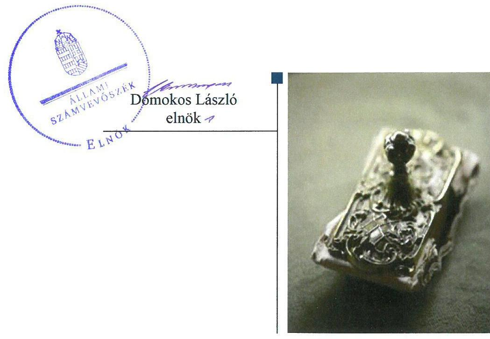
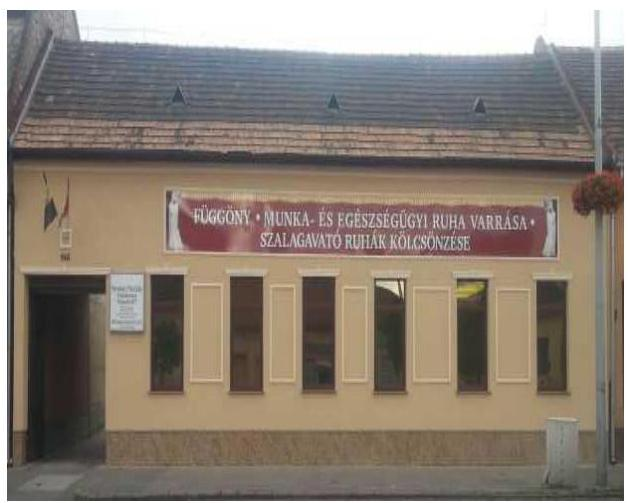
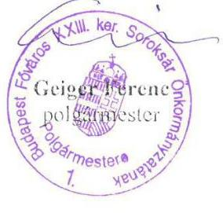
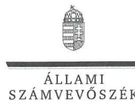
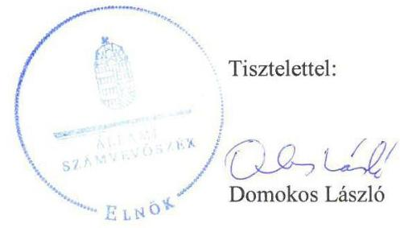
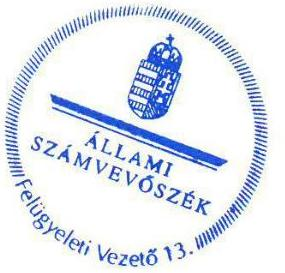
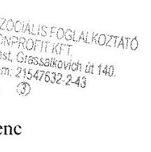

# Jelenetés 

## Az önkormányzatok gazdasági társaságai

Az önkormányzatok többségi tulajdonában lévő gazdasági társaságok gazdálkodásának ellenőrzése - Soroksári Szociális Foglalkoztató Nonprofit Kft.
2018. 04. hó 04. nap

---

# AZ ELLENŐRZÉST FELÜGYELTE: 

KLINGA LÁSZLÓ felügyeleti vezető

## AZ ELLENŐRZÉST VEZETTE ÉS A VÉGREHAJTÁSÁÉRT FELELŐS:

RÁCZKEVI KATALIN ellenőrzésvezető

## A PROGRAM ÖSSZEÁLLÍTÁSÁÉRT FELELŐS:

TÓTPÁL SZABOLCS osztályvezető

IKTATÓSZÁM: V-1374-068/2016.
TÉMASZÁM: 2447

## ELLENŐRZÉS-AZONOSÍTÓ SZÁM: V079357

Jelentéseink az Országgyűlés számítógépes hálózatán és az Interneten a www.asz.hu címen is olvashatóak.

---

# TARTALOMJEGYZÉK 

- ÖSSZEGZÉS ..... 5
- AZ ELLENŐRZÉS CÉLJA ..... 6
- AZ ELLENŐRZÉS TERÜLETE ..... 7
- AZ ELLENŐRZÉS HÁTTERE, INDOKOLTSÁGA ..... 8
- A JELENTÉS LÉNYEGES KÉRDÉSKÖREI ..... 9
- AZ ELLENŐRZÉS HATÓKÖRE ÉS MÓDSZEREI ..... 10
- MEGÁLLAPÍTÁSOK ..... 12
- JAVASLATOK ..... 15
- MELLÉKLETEK ..... 17
I. sz. melléklet: Értelmező szótár ..... 17
- FÜGGELÉK: ÉSZREVÉTELEK ..... 19
- RÖVIDÍTÉSEK JEGYZÉKE ..... 25

---

.

---

# ÖSSZEGZÉS 

Budapest Főváros XXIII. kerület Soroksár Önkormányzatának a Soroksári Szociális Foglalkoztató Nonprofit Kft. feletti tulajdonosi joggyakorlása szabályszerű volt. A Társaság gazdálkodási szabályzatai megfeleltek a jogszabályi előírásoknak, ugyanakkor a Társaság vagyongazdálkodási tevékenysége nem volt szabályszerű. A Társaság bevételeinek és ráfordításainak elszámolása szabályszerű volt. A Társaság a közérdekű adatok közzétételével biztosította működésének és gazdálkodásának átláthatóságát.

## Az ellenőrzés társadalmi indokoltsága

Magyarországon az intézménycentrikus közfeladat-ellátás jellemző, de egyre jelentősebb a költségvetésen kívüli feladatellátás térnyerése. Helyi szinten ennek legfontosabb szereplői az önkormányzati tulajdonban lévő gazdasági társaságok, amelyeknek ellenőrzése kiemelten fontos a közfeladat ellátása és a közvagyon megőrzése, megóvása érdekében. Ezért alapvető követelmény, hogy a társaságok gazdálkodása, működése szabályszerű és átlátható legyen. Az ellenőrzés rendet, a rend értéket teremt.

A Soroksári Szociális Foglalkoztató Nonprofit Kft. ellenőrzésére a társadalmilag közérdeklődésre számot tartó, hátrányos helyzetű csoportok társadalmi esélyegyenlőségének elősegítésével kapcsolatban ellátott sajátos feladatellátására tekintettel került sor, az Állami Számvevőszék Stratégiájában megfogalmazott célokkal összhangban.

## Főbb megállapítások, következtetések

Az Önkormányzat a Társaság feletti tulajdonosi joggyakorlásának kereteit a jogszabályoknak megfelelően kialakította, tulajdonosi jogait szabályszerűen gyakorolta. A Társaság egyszerűsített éves beszámolóit és közhasznúsági mellékleteit az FB írásos jelentésének birtokában szabályszerűen jóváhagyta. Az Alapító a Társaságot a belső ellenőrzésen keresztül ellenőrizte, érvényesítve a tulajdonosi kontrollt.

A Társaság a jogszabályi előírásoknak megfelelően elkészítette a számviteli szabályzatait, szabályozottsága megfelelő volt. A Társaság vagyongazdálkodása nem volt szabályszerű, mivel a beszámolóinak mérlegtételeit leltárral nem támasztotta alá. Az értékcsökkenési leírás elszámolása során nem tartották be a belső szabályzatban előírtakat. A Társaság az Alapító által előírt éves pénzügyi terveket nem készítette el.

A bevételek, az anyagjellegű és személyi jellegű ráfordítások elszámolása az ellenőrzött időszakban szabályszerű volt.

A Társaság közérdekű adataira, valamint a vezető tisztségviselőre és a felügyelőbizottsági tagokra vonatkozó közzétételi kötelezettségének a jogszabályi előírásoknak megfelelően eleget tett, ezzel az átláthatóságot biztosította.

---

# AZ ELLENŐRZÉS CÉLJA 

AZ ELLENŐRZÉS CÉLJA annak értékelése volt, hogy az Önkormányzat vagyongazdálkodási tevékenysége során szabályszerűen gyakorolta-e tulajdonosi jogait. A Társaság szabályozottsága, gazdálkodása, vagyongazdálkodási tevékenysége, bevételeinek és ráfordításainak elszámolása megfelelt-e a jogszabályi és tulajdonosi előírásoknak, valamint a Társaság kötelezettségállománya jelentett-e kockázatot a működésre.

---

# AZ ELLENŐRZÉS TERÜLETE

## Budapest Főváros XXIII. Kerület Soroksár Önkormányzata, és a kizárólagos tulajdonában lévő Soroksári Szociális Foglalkoztató Nonprofit Korlátolt Felelősségű Társaság

**BUDAPEST FŐVÁROS XXIII. KERÜLET SOROKSÁR ÖNKORMÁNYZATA** 2007. december 4-én 5,7 M Ft jegyzett tőkével, kizárólagos tulajdonosként alapította a Soroksári Szociális Foglalkoztató Nonprofit Korlátolt Felelősségű Társaságot. A Társaság1 felett a tulajdonosi jogokat az Alapító2 gyakorolta. A jegyzett tőkében és a tulajdonosi szerkezetben az alapítás óta nem volt változás.

Az ellenőrzött időszakban a polgármester3 és a jegyző4 személye nem változott.

### A SOROKSÁRI SZOCIÁLIS FOGLALKOZTATÓ NONPROFIT KFT.

közhasznú szervezet, az ellenőrzött időszakban közfeladatot látott el. A Társaság a hátrányos helyzetű csoportok társadalmi esélyegyenlőségének, a rehabilitációs foglalkoztatás és a munkaerőpiacon hátrányos helyzetű rétegek képzésének, foglalkoztatásának elősegítésére jött létre.

Tevékenysége karnis és függöny gyártása, forgalmazása, valamint báli és szalagavató ruhák készítése és kölcsönzése volt.

A Társaság 2013. évben 21,9 M Ft, 2014-ben 26,6 M Ft, 2015-ben 22,9 M Ft, 2016-ban 22,8 M Ft költségvetési támogatást kapott a megváltozott munkaképességű, rehabilitációra szoruló dolgozók foglalkoztatása érdekében munkabér és járulékai fedezetére. Ezen kívül az Önkormányzat5-tal kötött támogatási megállapodások1-46 alapján 2013-2014 években évi 21,0 M Ft, 2015-2016 években évi 26,0 M Ft célszerinti támogatásban részesült feladatainak ellátására.

Az ügyvezető7 2010-óta látja el feladatát. A Társaság könyvvizsgálatra, valamint – mint egyszerűsített éves beszámolót készítő vállalkozás – önköltség-számítási szabályzat készítésére nem volt kötelezett.

A foglalkoztatottak átlagos állományi létszáma a 2013. évben 28 fő, a 2016. évben 31 fő, ezen belül a megváltozott munkaképességű foglalkoztatottak száma mindkét évben 21 fő volt.

A Társaság az ellenőrzött időszakban nem minősült kormányzati szektorba sorolt egyéb szervezetnek, vagyonkezelésbe vett eszköze nem volt.

---

# AZ ELLENŐRZÉS HÁTTERE, INDOKOLTSÁGA 

Az önkormányzatok többségi tulajdonában álló gazdasági társaságok ellenőrzése kiemelten fontos a vagyon megőrzése, megóvása érdekében. Alapvető követelmény, hogy gazdálkodásuk, működésük szabályszerű, és az általuk szolgáltatott adatok megbízhatóak legyenek. A feladatellátás költségeinek, ráfordításainak alakulása a lakosság széles rétegét érinti.

Az ÁSZ ${ }^{8}$ ellenőrzései feltárhatják, hogy az önkormányzat a feladatellátásához rendelt vagyon működtetését a tulajdonostól elvárható gondossággal végezte-e, a feladatot ellátó gazdasági társasággal a létesítő okiratban, szolgáltatási szerződésben foglaltakat betartatta-e, a társaság betartotta-e.

Az ellenőrzés eredményeképp meghatározhatóvá válnak a költségvetési hiányt befolyásoló szervezetek kockázatai, lehetővé válik ezen kockázatok csökkentése. Az ellenőrzés rávilágíthat arra, hogy a gazdasági társaság a vagyon használatával biztosította-e a szolgáltatás folytatásának feltételeit, az önkormányzat tulajdonosi felügyelete hozzájárult-e a szabályszerű gazdálkodáshoz és feladatellátáshoz. A megállapítások alapján megfogalmazott számvevőszéki javaslatok hasznosítása elősegítheti a meglévő hibák megszüntetését. A jó gyakorlatok bemutatásával az ÁSZ hozzájárulhat a követendő megoldások megismertetéséhez, terjesztéséhez.

---

# A JELENTÉS LÉNYEGES KÉRDÉSKÖREI 

1. Az önkormányzat tulajdonosi joggyakorlása szabályszerű volt-e?
2. A gazdasági társaság szabályozottsága, bevételeinek, ráfordításainak elszámolása és vagyongazdálkodási tevékenysége szabályszerű volt-e?

---

# AZ ELLENŐRZÉS HATÓKÖRE ÉS MÓDSZEREI 

## Az ellenőrzés típusa

Megfelelőségi ellenőrzés.

## Az ellenőrzött időszak

Az ellenőrzött időszak 2013. január 1-jétől 2016. december 31-ig tart.

## Az ellenőrzés tárgya

Soroksári Szociális Foglalkoztató Nonprofit Korlátolt Felelősségű Társaság gazdálkodásának szabályozottsága és szabályszerűsége, valamint Budapest Főváros XXIII. Kerület Soroksár Önkormányzata tulajdonosi joggyakorlása.

Az ellenőrzés kiterjedt minden olyan körülményre és adatra, amely az ÁSZ jogszabályban meghatározott feladatainak teljesítéséhez, valamint a program végrehajtása folyamán felmerült újabb összefüggések feltárásához szükséges.

## Az ellenőrzött szervezet

Budapest Főváros XXIII. Kerület Soroksár Önkormányzata, és a Soroksári Szociális Foglalkoztató Nonprofit Korlátolt Felelősségű Társaság

## Az ellenőrzés jogalapja

Az ellenőrzés jogszabályi alapját az ÁSZ tv ${ }^{9}$. 1. § (3) bekezdése és 5. § (3)(4)-(5) bekezdései képezték.

## Az ellenőrzés módszerei

Az ellenőrzést a nemzetközi standardokat irányadónak tekintve az ellenőrzési program ellenőrzési kérdései, az ellenőrzött időszakban hatályos jogszabályok, az ellenőrzés szakmai szabályok és módszertanok figyelembe vételével végeztük.

Az ellenőrzés ideje alatt az ellenőrzött szervezettel történő kapcsolattartást az ÁSZ Szervezeti és Működési Szabályzatának vonatkozó előírásai alapján biztosítottuk.

---

Az ellenőrzési kérdések megválaszolásához szükséges bizonyítékok megszerzése a következő ellenőrzési eljárások alkalmazásával történt: megfigyelés, kérdésfeltevés (információkérés), összehasonlítás, valamint elemzés. Az ellenőrzési bizonyítékként felhasználható adatforrások közé tartoztak egyrészt az ellenőrzési programban felsorolt adatforrások, másrészt adatforrás minden - az ellenőrzés során - feltárt, az ellenőrzés szempontjából információkat tartalmazó dokumentum.

Az ellenőrzést a kérdésekre adott válaszok kiértékelésével, valamint a megjelölt adatforrások, a csatolt tanúsítványok felhasználásával, továbbá az adott időszakban hatályos jogszabályok figyelembe vételével folytattuk le.

A bevételek és ráfordítások elszámolása, valamint a vagyonnyilvántartás terén a szabályszerű működést véletlen mintavétellel ellenőriztük. Kockázati alapon a ráfordítások elszámolásának és a vagyonnyilvántartásának ellenőrzése minden évben a három legnagyobb összegű tétellel kiegészült. A jogszabályoknak és a belső előírásoknak megfelelőnek, azaz szabályszerűnek tekintettük az adott területet, amennyiben a minta ellenőrzésének eredménye alapján 95%-os bizonyossággal a teljes sokaságban a hibaarány kisebb volt, mint 10%, nem megfelelőnek értékeltük, ha a hibaarány a 10%-ot meghaladta.

---

# 1. Az önkormányzat tulajdonosi joggyakorlása szabályszerű volt-e? 

Összegző megállapítás

A tulajdonosi joggyakorlás kereteit az Önkormányzat szabályszerűen kialakította, a tulajdonosi jogokat szabályszerűen gyakorolta.

AZ ÖNKORMÁNYZAT az ellenőrzött időszakban rendelkezett az Mötv. ${ }^{10}$ előírásainak megfelelően - a Társaság által ellátott feladatokat is tartalmazó - gazdasági programmal ${ }^{11}$.

Az Önkormányzat a Társaság működtetésének, valamint az önkormányzati vagyon megőrzésének feltételeit, az ellenőrzött időszakban az Alapító okirat ${ }_{1-5}{ }^{12}$ és az évenként megkötött támogatási megállapodások ${ }_{1-4}$ keretén belül szabályozta.

Az Alapító a Gt. ${ }^{13}$, a Ptk. ${ }^{14}$ és a Taktv. ${ }^{15}$ előírásainak megfelelően FB16-t hozott létre.

Az FB a Gt. 34. § (4) bekezdése, valamint - 2014. március 15. napjától - a Ptk. 3:122 § (3) bekezdése előírása ellenére az ellenőrzött időszakban ügyrenddel nem rendelkezett. A Társaság ügyvezetője részére az Alapító okirat ${ }_{1-5}$-ban, valamint az éves támogatási szerződésekben beszámolási kötelezettséget írtak elő a Társaság gazdálkodásáról, valamint a támogatásokkal való elszámolásról.

Az Önkormányzat a Társaság ügyvezetője részére az Alapító okirat ${ }_{1-5}$ ban előírta az éves pénzügyi terv elkészítését és az Alapító elé történő beterjesztését.

A TÁRSASÁG FELETTI TULAJDONOSI JOGOK gyakorlásának rendjét az Alapító a Gt. és a Ptk. előírásainak megfelelően az Alapító okirat ${ }_{1-5}$-ban, az Önkormányzati SZMSZ ${ }_{1-2}{ }^{17}$-ben, a Társasági SZMSZ ${ }^{18}$-ben, a vagyonrendeletben ${ }^{19}$, egymással összhangban meghatározta.

Az Alapító a Gt., illetve a Ptk. előírásának megfelelően a FB írásos véleményének birtokában minden ellenőrzött évben megtárgyalta és elfogadta a Társaság egyszerűsített éves beszámolóját, valamint a közhasznúsági mellékletet.

A MONITORING TEVÉKENYSÉGÉNEK ellátása keretében az Alapító a Társaság feladatellátását ellenőrizte, az ügyvezetőt a Társaság pénzügyi helyzetéről beszámoltatta, a támogatási szerződésekben előírtaknak megfelelően a felhasznált támogatásokkal elszámoltatta.

## AZ ÖNKORMÁNYZAT BELSŐ ELLENŐRZÉS KERETÉBEN a 2014. és a 2016. években ellenőrizte a Társaság gazdálkodását, működését, valamint a megkötött szerződések szabályszerűségét. A

---

belső ellenőr a Társaság gazdálkodását, működését mindkét év ellenőrzése során szabályszerűnek, megfelelőnek minősítette. Az ügyvezető a belső ellenőr javaslatainak végrehajtása érdekében intézkedési terveket és beszámolókat készített.

Az Alapító a Taktv. 5. § (3) bekezdésében előírt kötelezettsége ellenére a vezető tisztségviselők, felügyelőbizottsági tagok, valamint az Mt. ${ }^{20}$ 208. §-ának hatálya alá eső munkavállalók javadalmazása, valamint a jogviszony megszűnése esetére biztosított juttatások módjának, mértékének elveiről, annak rendszeréről szabályzatot nem alkotott.

# 2. A gazdasági társaság szabályozottsága, bevételeinek, ráfordításainak elszámolása és vagyongazdálkodási tevékenysége szabályszerű volt-e? 

Összegző megállapítás

A Társaság gazdálkodásának szabályozottsága megfelelt a jogszabályi előírásoknak. A vagyongazdálkodási tevékenysége nem volt szabályszerű. A bevételek és ráfordítások elszámolása szabályszerű volt.
2.1. számú megállapítás

A Társaság gazdálkodásának szabályozottsága megfelelt a jogszabályi előírásokban foglaltaknak. A bevételek, az anyagjellegű és a személyi jellegű ráfordítások elszámolása szabályszerű volt.

A SZÁMVITELI POLITIKA ${ }^{21}$ és az annak keretében elkészített, a Társaság eszközeinek és forrásainak értékelési szabályzata ${ }^{22}$, valamint pénzkezelési szabályzat ${ }^{23}$ az ellenőrzött
 időszakban megfeleltek a Számv. tv. előírásainak.

A Társaság ellenőrzött időszakban hatályos számlarendjei ${ }^{24}$, valamint bizonylati rendje ${ }^{25}$ megfelelt a jogszabályi előírásoknak.

A BEVÉTELEK AZ ANYAGJELLEGŰ ÉS A SZEMÉLYI JELLEGŰ RÁFORDÍTÁSOK elszámolása szabályszerű volt.
2.2. számú megállapítás

A Társaság vagyongazdálkodása nem volt szabályszerű, a beszámolók mérlegét nem támasztotta alá leltárral. A vagyonnyilvántartás nem volt szabályszerű, az értékcsökkenési leírást nem szabályszerűen számolták el. A vagyonváltozást eredményező döntéshez az Alapító jóváhagyását nem kérték.

A Társaság az ellenőrzött időszakban a Számv. tv. 46. § (3) bekezdés, valamint 69. § (1) bekezdés előírásai, továbbá a Leltározási és selejtezési szabályzata I. fejezet 1. pont első bekezdése ellenére nem állított össze olyan leltárt, amely tételesen és ellenőrizhető módon tartalmazta valamennyi a mérleg fordulónapján meglévő eszközeit és forrásait mennyiségben és értékben és ezáltal nem biztosították a mérlegtételek leltárral megalapozott alátámasztását.

A Számv. tv. 69. § (2) bekezdés, valamint a Leltározási és selejtezési szabályzat ${ }^{26}$ I. fejezet 1.2 pont (5) bekezdése előírása ellenére a mérlegtételek

---

alátámasztásának keretében a főkönyvi könyvelés és az analitikus nyilvántartások adatai közötti egyeztetést az üzleti év fordulónapjára vonatkozóan nem végezték el.

A Leltározási és selejtezési szabályzat a Számv. tv. 69. § (3) bekezdésében előírtakkal ellentétben a tárgyi eszközök mennyiségi felvétellel történő leltározását - a legalább három évenkénti gyakoriság helyett - 10 évenkénti gyakorisággal írta elő.

A VAGYONNYILVÁNTARTÁSA nem volt szabályszerű, mert a tárgyi eszközök leltározása nem felelt meg az előírásoknak. A Társaság az értékcsökkenési leírás elszámolása során nem tartotta be az Eszközök és források értékelési szabályzatának 4.2. pontjában foglaltakat, mert az idegen ingatlanon végzett beruházás után meghatározott 6%-os amortizáció helyett 20%-os leírási kulcsot alkalmaztak.

A Társaság 2015. évben egy Opel Vivaro kishaszongépjármű beszerzésére zárt végű pénzügyi lízing szerződést kötött, azonban a társasági SZMSZ III. 1. pontjában előírtak ellenére a lízing szerződés megkötéséhez az Alapító írásbeli jóváhagyását nem kérte.

# 2.3. számú megállapítás 

A Társaság teljesítette beszámolási, adatszolgáltatási kötelezettségét. Tervezési feladatainak nem tett eleget, az üzleti tervezés hiánya miatt a működés megalapozottsága nem volt biztosított. Közzétételi kötelezettségének a jogszabályoknak megfelelően eleget tett.

BESZÁMOLÁSI KÖTELEZETTSÉGÉNEK eleget tett az ellenőrzött időszakban, a Társaság egyszerűsített éves beszámolóit a jogszabályban előírt határidőben elkészítette, az Alapító által jóváhagyott beszámolókat közzétette.

A Társaság az ellenőrzött időszakban a közhasznú tevékenységének ellátására kapott támogatások felhasználásáról a támogatási szerződésekben foglaltak szerint beszámolt az Önkormányzat részére.

A Társaság ügyvezetője az ellenőrzött időszakban az Alapító okirat 1-5 14. pontjában előírt éves pénzügyi terv elkészítéséről és az Alapító elé történő beterjesztéséről nem gondoskodott.

KÖZÉRDEKŰ ADATAIT a Társaság az Info tv. ${ }^{27}$-ben előírtaknak megfelelően közzétette. A Taktv. 2. §-a szerinti előírásnak megfelelően a vezető tisztségviselőre és a felügyelőbizottsági tagokra vonatkozó adatokat honlapján közzétette.

A Társaság az Info tv. 35. § (1) - (2) bekezdései szerinti kötelezettség teljesítésének részletes szabályait az Info. tv. 35. § (3) bekezdésében előírtakkal ellentétben belső szabályzatban nem állapította meg.

A Társaság, az Info tv.-ben előírtak szerint a belső adatvédelmi és adatbiztonsági szabályzatot elkészítette, a belső adatvédelmi felelőst kijelölte.

---

# JAVASLATOK 

Az ÁSZ tv. 33. § (1) bekezdésében foglaltak értelmében az ellenőrzött szervezet vezetője köteles a jelentésben foglalt megállapításokhoz kapcsolódó intézkedési tervet összeállítani és azt a jelentés kézhezvételétől számított 30 napon belül az ÁSZ részére megküldeni. Amennyiben az ellenőrzött szervezet vezetője nem küldi meg határidőben az intézkedési tervet, vagy továbbra sem elfogadható intézkedési tervet küld, az Állami Számvevőszék elnöke az ÁSZ tv. 33. § (3) bekezdése a) és b) pontjaiban foglaltakat érvényesítheti.

## Soroksári Szociális Foglalkoztató Nonprofit Kft. ügyvezetőjének

1. Intézkedjen a beszámoló mérleg tételeinek alátámasztásához a Számv. tv. előírásainak megfelelő leltár összeállítására, valamint a főkönyvi könyvelés és az analitikus nyilvántartás adatai közötti egyeztetés elvégzésére.
(2.2. sz. megállapítás 1. és 2. bekezdései alapján)
2. Intézkedjen a Társaság leltározási és selejtezési szabályzatának a Számv. tv. előírásai figyelembevételével történő módosításáról.
(2.2. sz. megállapítás 3. bekezdése alapján)
3. Intézkedjen annak érdekében, hogy az értékcsökkenési leírás elszámolása során tartsák be a Társaság eszközök és források értékelési szabályzatának előírásait.
(2.2. sz. megállapítás 4. bekezdés 2. mondat alapján)
4. Gondoskodjon az Alapító írásbeli jóváhagyásához kötött szerződések esetében a társasági SZMSZ-ben előírtak betartásáról.
(2.2. sz. megállapítás 5. bekezdése alapján)
5. Intézkedjen az Info tv.-ben előírt szabályozási kötelezettség teljesítéséről.
(2.3. sz. megállapítás 5. bekezdése alapján)

---

# Budapest Főváros XXIII. kerület Soroksár Önkormányzata polgármesterének 

1. Kezdeményezze, hogy a felügyelőbizottság állapítsa meg ügyrendjét a jogszabályi előírásoknak megfelelően.
(1. sz. megállapítás 4. bekezdés 1. mondata alapján)
2. Intézkedjen, hogy a Társaság legfőbb szerve (Képviselő-testület) a vezető tisztségviselők, felügyelőbizottsági tagok, valamint az Mt. 208. §-ának hatálya alá eső munkavállalók javadalmazása, valamint a jogviszony megszünése esetére biztosított juttatások módjának, mértékének elveire, annak rendszerére vonatkozó szabályzatát megalkossa.
(1. sz. megállapítás 10. bekezdése alapján)

---

# MELLÉKLETEK 

- I. SZ. MELLÉKLET: ÉRTELMEZŐ SZÓTÁR
gazdasági társaság
közfeladat
nonprofit gazdasági társaság
tulajdonosi joggyakorló

Ptk. 3.88. § (1) bekezdése szerint „a gazdasági társaságok üzletszerű közös gazdasági tevékenység folytatására, a tagok vagyoni hozzájárulásával létrehozott, jogi személyiséggel rendelkező vállalkozások, amelyekben a tagok a nyereségből közösen részesednek, és a veszteséget közösen viselik".
Jogszabályban meghatározott állami vagy önkormányzati feladat, amit a feladat címzettje közérdekből, haszonszerzési cél nélkül, jogszabályban meghatározott követelményeknek és feltételeknek megfelelve végez, ideértve a lakosság közszolgáltatásokkal való ellátását, valamint e feladatok ellátásához szükséges infrastruktúra biztosítását is; (Civil tv ${ }^{28}$ 2.§ 19. pont, hatályos 2014. december 31-ig)
Az Áht. ${ }^{29}$ 2015. január 1-jétől hatályos 3/A. §-a szerint közfeladat a jogszabályban meghatározott állami vagy önkormányzati feladat, melynek ellátása költségvetési szervek alapításával és működtetésével vagy az azok ellátásához szükséges pénzügyi fedezet e törvényben meghatározott eszközökkel, részben vagy egészben történő biztosításával valósul meg, az ellátásában államháztartáson kívüli szervezet jogszabályban meghatározott rendben közreműködhet.
A gazdasági társaság nem jövedelemszerzésre irányuló közös gazdasági tevékenység folytatására is alapítható (nonprofit gazdasági társaság). Nonprofit gazdasági társaság bármely társasági formában alapítható és működtethető. A gazdasági társaság nonprofit jellegét a gazdasági társaság cégnevében a társasági forma megjelölésénél fel kell tüntetni. Nonprofit gazdasági társaság üzletszerű gazdasági tevékenységet csak kiegészítő jelleggel folytathat, a gazdasági társaság tevékenységéből származó nyereség a tagok (részvényesek) között nem osztható fel, az a gazdasági társaság vagyonát gyarapítja. (Gt. 4. § (1), (3) bekezdés, hatályos 2014. március 15-ig)
A Cégtv. ${ }^{30}$ 9/F. § (2) bekezdése szerint „az a gazdasági társaság minősül nonprofit gazdasági társaságnak és cégnevében az a gazdasági társaság tüntetheti fel a nonprofit jelleget, amelynek létesítő okirata tartalmazza, hogy a gazdasági társaság tevékenységéből származó nyereség a tagok között nem osztható fel, hanem az a gazdasági társaság vagyonát gyarapítja."
Tulajdonosi joggyakorló, aki a nemzeti vagyon felett az államot vagy a helyi önkormányzatot megillető tulajdonosi jogok és kötelezettségek összességének gyakorlására jogosult. (Nvtv. ${ }^{31}$ 3. § (1) bekezdés 17. pontja)

---

.

---

# FÜGGELÉK: ÉSZREVÉTELEK 

A jelentéstervezetet a Számvevőszék 15 napos észrevételezésre megküldte az ellenőrzött szervezetek vezetőinek az ÁSZ tv. 29. § (1) bekezdése előírásának megfelelően.

Budapest Főváros XXIII. kerület Soroksár Önkormányzata polgármesterének észrevételét és az arra adott választ a függelék tartalmazza. A Soroksári Szociális Foglalkoztató Nonprofit Kft. ügyvezetője az ÁSZ tv 29. § (2) bekezdésében foglalt észrevételézési jogával nem élt, írásban jelezte, hogy észrevételt nem tesz.

[^0]
[^0]:    * 29. § (1) Az Állami Számvevőszék az ellenőrzési megállapításait megküldi az ellenőrzött szervezet vezetőjének vagy az általa megbízott személynek, és annak, akinek személyes felelősségét állapította meg.
    (2) Az ellenőrzött szervezet vezetője és a felelősként megjelölt személy az ellenőrzés megállapításaira tizenöt napon belül írásban észrevételt tehet.
    (3) Az Állami Számvevőszék az észrevételre a beérkezésétől számított harminc napon belül írásban válaszol. A figyelembe nem vett észrevételeket köteles a jelentésben feltüntetni, és megindokolni, hogy azokat miért nem fogadta el.

---

Budapest Főváros XXIII. kerület Soroksár Önkormányzatának POLGÁRMESTERE
1239 Budapest, Grassalkovich út 162.

Állami Számvevőszék

Budapest
Domokos László
elnök

Tisztelt Elnök Úr!

Köszönettel megkaptam „Az önkormányzatok gazdasági társaságai - Az önkormányzatok többségi tulajdonában lévő gazdasági társaságok gazdálkodásának ellenőrzése - Soroksári Szociális Foglalkoztató Nonprofit Kft." címmel készített számvevőszéki jelentéstervezetet. (Ikt.szám: EL-0342-623/2018.)

A jelentéstervezettel kapcsolatban egyetlen kiegészítést tennék:
A polgármester felé tett 2. számú javaslattal kapcsolatban jelezném, hogy a javaslat által hiányolt, a vezető tisztségviselők, felügyelőbizottsági tagok, valamint az Mt. 208. §-ának hatálya alá eső munkavállalók javadalmazása, valamint a jogviszony megszünése esetére biztosított juttatások módjának, mértékének elveire, annak rendszerére vonatkozó szabályzatot a Képviselő-testület megalkotta, és a 106/2017. (III.14.) határozatával elfogadta.

Amennyiben lehetséges, kérem a javaslatban megfogalmazott feladatot teljesítettnek tekinteni szíveskedjenek.

A jelentéstervezet egyéb részeivel kapcsolatban észrevételt nem kívánok tenni.

Budapest, 2018. június 04.

Tisztelettel:

---

ELNÖK

Ikt.szám: EL-0542-028/2018.

# Geiger Ferenc úr 

polgármester
Budapest Főváros XXIII. Kerület Soroksár Önkormányzata

## Budapest

## Tisztelt Polgármester Úr!

Köszönettel vettem „Az önkormányzatok gazdasági társaságai - Az önkormányzatok többségi tulajdonában lévő gazdasági társaságok gazdálkodásának ellenőrzése - Soroksári Szociális Foglalkoztató Nonprofit Kft." címü ellenőrzésről készített számvevőszéki jelentéstervezetre megküldött észrevételeit.
Az Állami Számvevőszék észrevételekre vonatkozó álláspontját a felügyeleti vezető által készített részletes tájékoztatás tartalmazza, amelyet levelemhez mellékeltem.
Tájékoztatom Polgármester urat, hogy az Állami Számvevőszék a figyelembe nem vett észrevételeket az Állami Számvevőszékről szóló 2011. évi LXVI. törvény 29. § (3) bekezdésében előírtak szerint köteles a jelentésében feltüntetni és megindokolni, hogy azokat miért nem fogadta el.

Budapest, 2018. 06. 25.

Melléklet: Tájékoztatás az észrevételek kezeléséről

---

# Tájékoztatás az észrevétel kezeléséről 

Megköszönöm Polgármester úrnak „Az önkormányzatok gazdasági társaságai - Az önkormányzatok többségi tulajdonában lévő gazdasági társaságok gazdálkodásának ellenőrzése - Soroksári Szociális Foglalkoztató Nonprofit Kft." címmel készített jelentés-tervezetre tett észrevételét. Az észrevétel kezeléséről az alábbi tájékoztatást adom:

## 1. A jelentéstervezet 2. számú javaslatához füzött észrevétele kapcsán

Polgármester úr észrevételében - a vezető tisztségviselők, felügyelőbizottsági tagok, valamint az Mt. 208. §-ának hatálya alá eső munkavállalók javadalmazása, valamint a jogviszony megszűnése esetére biztosított juttatások módjának, mértékének elveire, annak rendszerére vonatkozó szabályzatot kapcsolatban - adott tájékoztatást köszönettel tudomásul vettem. Az észrevétel az ellenőrzött 2013-2016. évekre tett megállapítást nem vitatta, megállapításunkat megerősítette, így a jelentéstervezet módosítása nem indokolt. Tájékoztatom, hogy az ÁSZ tv. 33. § (1) bekezdésében foglaltak értelmében az ellenőrzött szervezet vezetője köteles a jelentésben foglalt megállapításokhoz kapcsolódó intézkedési tervet összeállítani és azt a jelentés kézhezvételétől számított 30 napon belül az ÁSZ részére megküldeni.

Budapest, 2018. június 25.

Klinga László
felügyeleti vezető

---

# $\times 35$ 

Soroksári Szociális Foglalkoztató Nonprofit Kft
1238 Budapest, Grassalkovich út 140.
+36308561683, Tel/Fax:0612860045, email: info@xoson.hu

Domokos László úr
elnök

Állami Számvevőszék
Apáczai Csere János utca 10
1052
Tisztelt Elnök Úr!
A Soroksári Szociális Foglalkoztató Nonprofit Kft gazdálkodásának ellenőrzéséről szóló EL-0542-022/2018 ikt. sz. jelentéstervezetét 2018. május 17-én megkaptuk. Elfogadjuk az abban foglalt megállapításokat és javaslatokat, észrevételt nem kívánunk tenni.

Munkájukat ezúton is köszönjük!

Budapest, 2018. május 31.
Tisztelettel:

---

.

---

# RÖVIDÍTÉSEK JEGYZÉKE 

${ }^{1}$ Társaság
${ }^{2}$ Alapító
${ }^{3}$ polgármester
${
 }^{4}$ jegyző
${ }^{5}$ Önkormányzat
${ }^{6}$ támogatási megállapodások ${ }_{1-4}$

Soroksári Szociális Foglalkoztató Nonprofit Korlátolt Felelősségű Társaság
Budapest Főváros XXIII. Kerület Soroksár Önkormányzat Képviselő-testülete, mint a Soroksári Szociális Foglalkoztató Nonprofit Korlátolt Felelősségű Társaság legfőbb szerve
Budapest Főváros XXIII. Kerület Soroksár Önkormányzatának polgármestere Budapest Főváros XXIII. Kerület Soroksár Önkormányzatának jegyzője
Budapest Főváros XXIII. Kerület Soroksár Önkormányzata
támogatási megállapodás1: a Társaság megállapodása az Önkormányzattal a 2013. évre nyújtott támogatásról, létrejött: 2013. március 20-án az önkormányzat és a társaság között
támogatási megállapodás2: a Társaság megállapodása az Önkormányzattal a 2014. évre nyújtott támogatásról, létrejött: 2014. április 15-én az önkormányzat és a társaság között
támogatási megállapodás3: a Társaság megállapodása az Önkormányzattal a 2015. évre nyújtott támogatásról, létrejött: 2015. február 25-én az önkormányzat és a társaság között
támogatási megállapodás4: a Társaság megállapodása az Önkormányzattal a 2016. évre nyújtott támogatásról, létrejött: 2016. február 23-án az önkormányzat és a társaság között
Soroksári Szociális Foglalkoztató Nonprofit Korlátolt Felelősségű Társaság ügyvezető igazgatója
Állami Számvevőszék
2011. évi LXVI. törvény az Állami Számvevőszékről (hatályos 2011. július 1-jétől)
2011. évi CLXXXIX. törvény Magyarország helyi önkormányzatairól

Budapest Főváros XXIII. kerület Soroksár Önkormányzatának gazdasági programja 2011-2014. és Budapest Főváros XXIII. kerület Soroksár Önkormányzatának gazdasági programja, fejlesztési terve 2015-2019.
alapító okirat1 Nonprofit Korlátolt Felelősségű társaság létrehozásáról (hatályos: 2012. január 17-től 2013. április 9-ig)

Alapító okirat2 Nonprofit Korlátolt Felelősségű társaság létrehozásáról (hatályos: 2013. április 9-től 2013. június 4-ig)

Alapító okirat3 Nonprofit Korlátolt Felelősségű társaság létrehozásáról (hatályos: 2013. június 4-től 2015. június 9-ig)

Alapító okirat4 Nonprofit Korlátolt Felelősségű társaság létrehozásáról (hatályos: 2015. június 9-től 2016. november 9-ig)

Alapító okirat5 Nonprofit Korlátolt Felelősségű társaság létrehozásáról (hatályos: 2016. november 9-től)
2006. évi IV. törvény a gazdasági társaságokról (hatályos: 2014. március 14-ig) 2013. évi V. törvény a Polgári Törvénykönyvről (hatályos: 2014. március 15-től) 2009. évi CXXII. törvény a köztulajdonban álló gazdasági társaságok takarékosabb működéséről
Soroksári Szociális Foglalkoztató Nonprofit Korlátolt Felelősségű Társaság felügyelő bizottsága
szervezeti és működési szabályzat1: Budapest Főváros XXIII. kerület Soroksár Önkormányzata Képviselő-testületének többször módosított 49/2012. (XII.21.)

---

${ }^{18}$ Társasági SZMSZ
${ }^{19}$ vagyonrendelet
${ }^{20}$ Mt.
${ }^{21}$ számviteli politika
${ }^{22}$ a Társaság eszközeinek és forrásainak értékelési szabályzata
${ }^{23}$ pénzkezelési szabályzat
${ }^{24}$ számlarend
${ }^{25}$ bizonylati rend
${ }^{26}$ Leltározási és selejtezési szabályzat
${ }^{27}$ Info tv.
${ }^{28}$ Civil tv.
${ }^{29}$ Áht.
${ }^{30}$ Cégtv.
${ }^{31}$ Nvtv.
önkormányzati rendelete a Képviselő-testület Szervezeti és Működési Szabályzatáról (hatályos: 2013. január 1-től 2014. november 6-ig) szervezeti és működési szabályzat2: Budapest Főváros XXIII. kerület Soroksár Önkormányzata Képviselő-testületének többször módosított 25/2014. (IX.14.) önkormányzati rendelete a Képviselő-testület Szervezeti és Működési Szabályzatáról (hatályos: 2014. november 6-tól)
Soroksári Szociális Foglalkoztató Nonprofit Korlátolt Felelősségű Társaság Szervezeti és Működési Szabályzata (hatályos: 2003. január 1-től)
Budapest Főváros XXIII. kerület Soroksár Önkormányzata Képviselő-testületének többször módosított 43/2011. (IX.18.) önkormányzati rendelete az Önkormányzat vagyonáról, a vagyontárgyak feletti tulajdonosi jogok gyakorlásáról (hatályos: 2012. január 1-től)
2012. évi I. tv. a munka törvénykönyvéről (hatályos: 2012. július 1-jétől

A Társaság Számviteli politikája (hatályos: 2011. július 1-től 2016. július 1-ig), a Társaság Számviteli politikája (hatályos: 2016. július 1-től)

A Társaság Eszközeinek és forrásainak értékelési szabályzata (hatályos: 2011. július 11-től)
A Társaság Pénzkezelési szabályzata (hatályos: 2012. december 15-től)
A Társaság Számlarendje (hatályos: 2011. július 7-től 2016. január 1-ig) és a Társaság Számlarendje (hatályos: 2016. január 1-től)
A Társaság bizonylati és irattározási szabályzata (hatályos: 2011. július 1-jétől)
A Társaság leltározási és selejtezési szabályzata (hatályos: 2011. július 1-jétől)
2011. évi CXII. tv. az információs önrendelkezési jogról és az információszabadságról (hatályos: 2011. július 27-től)
2011. évi CLXXV. törvény az egyesülési jogról, a közhasznú jogállásról, valamint a civil szervezetek működéséről és támogatásáról (hatályos: 2011. december 22-től)
2011. évi CXCV. törvény az államháztartásról (hatályos: 2012. január 1-jétől)
2006. évi V. törvény a cégnyilvánosságról, a bírósági cégeljárásról és a végelszámolásról (hatályos: 2016. január 4-től)
2011. évi CXCVI. törvény a nemzeti vagyonról (hatályos: 2012. január 1-jétől)

---

ÁLLAMI SZÁMVEVŐSZÉK
1052 Budapest, Apáczai Csere János utca 10.
Levélcím: 1364 Budapest 4. Pf. 54
Telefon: +36 14849100 Telefax: +36 14849200
www.asz.hu
