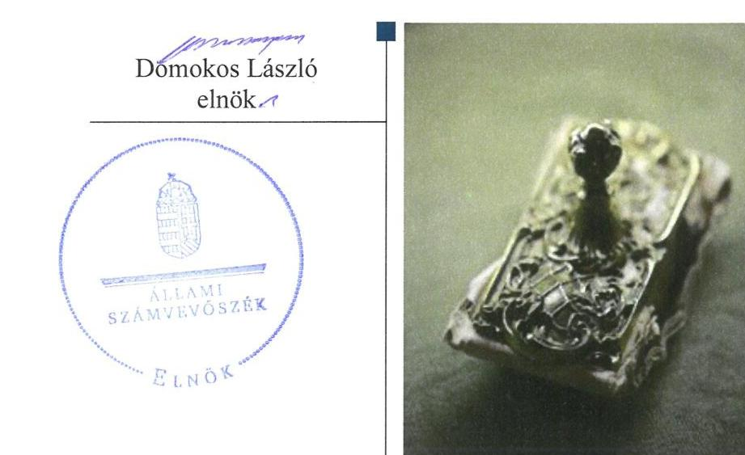
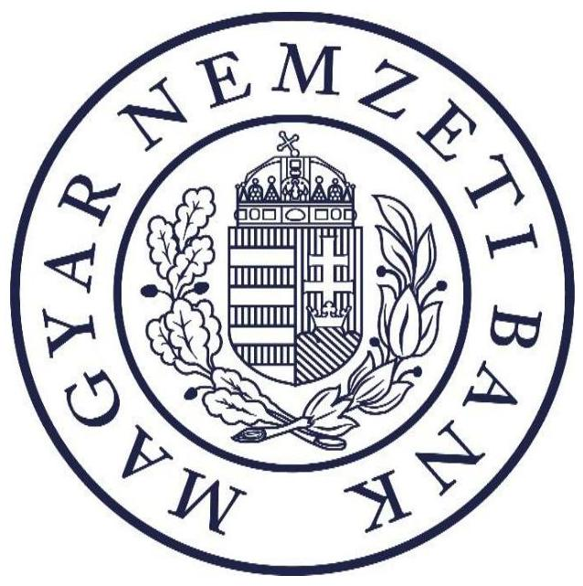
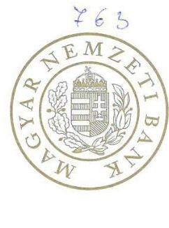
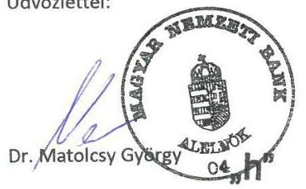
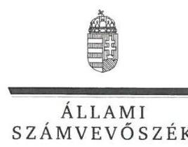
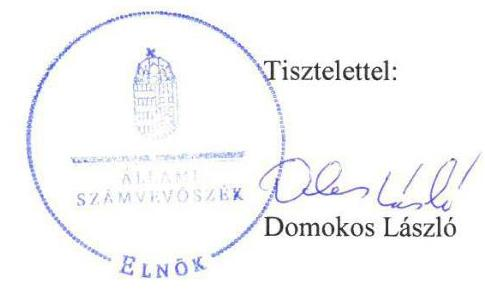
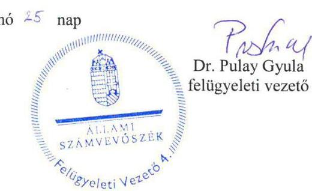

# Jelentés 

## A Magyar Nemzeti Bank múködése szabályszerűségének ellenőrzése

2018.

---

# Jelenetés 

## A Magyar Nemzeti Bank múködése szabályszerűségének ellenőrzése

2018. 04. hó 11. nap

---

|  AZ ELLENŐRZÉST FELÜGYELTE: |  |  |  |  |   |
| --- | --- | --- | --- | --- | --- |
|   |  |  |  |  | DR. PULAY GYULA ZOLTÁN felügyeleti vezető  |
|   |  |  |  |  | AZ ELLENŐRZÉST VEZETTE ÉS A VÉGREHAJTÁSÁÉRT FELELŐS:  |
|   |  |  |  |  | DR. SIMON JÓZSEF ellenőrzésvezető  |
|   |  |  |  |  | A PROGRAM ÖSSZEÁLLÍTÁSÁÉRT FELELŐS:  |
|   |  |  |  |  | TÓTPÁL SZABOLCS osztályvezető  |
|   |  |  |  |  | A TÉMÁHOZ KAPCSOLÓDÓ KORÁBBI SZÁMVEVŐSZÉKI JELENTÉSEK:  |
|   |  |  |  |  | - címe: Jelentés - A Magyar Nemzeti Bank működése szabályszerűségének ellenőrzése  |
|   |  |  |  |  | - sorszáma: 17114  |
|  Jelentéseink az Országgyűlés számítógépes hálózatán és az Interneten a www.asz.hu címen is olvashatóak. |  |  |  |  | - címe: Jelentés - A Magyar Nemzeti Bank működése szabályszerűségének ellenőrzése  |
|   |  |  |  |  | - sorszáma: 16116  |
|  |   |   |   |   |   |
|   |  |  |  |  | IKTATÓSZÁM: EL-0579-047/2018  |
|   |  |  |  |  | TÉMASZÁM: 2462  |
|   |  |  |  |  | ELLENŐRZÉS-AZONOSÍTÓ SZÁM: V0807  |

---

# TARTALOMJEGYZÉK 

- ÖSSZEGZÉS ..... 5
- AZ ELLENŐRZÉS CÉLJA ..... 6
- AZ ELLENŐRZÉS TERÜLETE ..... 7
- AZ ELLENŐRZÉS HÁTTERE, INDOKOLTSÁGA ..... 9
- A JELENTÉS LÉNYEGES KÉRDÉSKÖREI ..... 10
- AZ ELLENŐRZÉS HATÓKÖRE ÉS MÓDSZEREI ..... 11
- MEGÁLLAPÍTÁSOK ..... 13
- JAVASLATOK ..... 22
- MELLÉKLETEK ..... 23
I. sz. melléklet: Értelmező szótár ..... 23
II. sz. melléklet: Az MNB vagyonának alakulása 2016-ban (M Ft) ..... 26
III. sz. melléklet: Az MNB müködési költségeinek, ráfordításainak alakulása 2016-ban (E Ft) ..... 27
- FÜGGELÉK: ÉSZREVÉTELEK ..... 29
- RÖVIDÍTÉSEK JEGYZÉKE ..... 45

---

.

---

# ÖSSZEGZÉS 

A Magyar Nemzeti Bank müködése és gazdálkodása a 2016. évben szabályozott és szabályszerű volt. A felügyelő, ellenőrző és szabályozó tevékenysége elősegítette a pénzügyi közvetítőrendszer szabályszerű müködését, és biztosította a rendszerkockázati tényezők nyomon követését és kontrollját.

## Az ellenőrzés társadalmi indokoltsága

Az egyszemélyes részvénytársasági formában múködő Magyar Nemzeti Bank Magyarország központi bankja, felelős a monetáris politikáért és 2013. október 1-jétől ellátja a pénzügyi közvetítő rendszer felügyeletét. A részvényesi jogokat az államháztartásért felelős miniszter gyakorolja.

Az Állami Számvevőszék törvényi kötelezettsége a Magyar Nemzeti Bank gazdálkodásának és az alapvető feladatai közé nem tartozó tevékenységének ellenőrzése, amelynek teljesítésével segíti az Országgyűlés munkáját, tájékoztatja az érdekelteket és a szélesebb közvéleményt a Magyar Nemzeti Bank müködésének és gazdálkodásának szabályszerűségéről. Az ellenőrzés hozzájárul az Állami Számvevőszék Stratégiájában megfogalmazott küldetése megvalósításához, a közpénzügyek átláthatóságának, rendezettségének előmozdításához.

## Főbb megállapítások, következtetések

A Magyar Nemzeti Bank irányítási rendszerének kialakítása és múködtetése - 2016. november 15-től a szanálási hatósági feladatkör irányítási, hatásköri kialakítását kivéve - összhangban volt a jogszabályi előírásokkal. Gondoskodott a Pénzügyi Békéltető Testület müködéséhez szükséges feltételek biztosításáról. A Magyar Nemzeti Bank elnöke a Magyar Nemzeti Bank tevékenységével kapcsolatos beszámolási és tájékoztatási kötelezettségének szabályszerűen eleget tett. A Felügyelőbizottság és a belső ellenőrzés múködése, valamint a kizárólagos és többségi tulajdonában álló gazdasági társaságok feletti tulajdonosi joggyakorlás szabályszerű volt. A Magyar Nemzeti Bank szabályszerű múködésének feltételei rendelkezésre álltak.

A müködési költségekre, valamint a beruházásokra vonatkozó éves terv elkészítéséről a Magyar Nemzeti Bank gondoskodott, azonban az éves terv nem teljes mértékben felelt meg a jogszabályi előírásnak, mert nem állt rendelkezésre a 2016. évi terv az alapvető és egyéb feladatok vonatkozásában elkülönítetten, részletes bontásban. A beszerzések és a beruházások megvalósítása, továbbá az ezekhez kapcsolódó elszámolások szabályszerűek voltak. A nyújtott támogatások tervezése, kifizetése és elszámolása szabályszerűen valósult meg. A jogszabályi előírások szerint történtek a központi költségvetéssel összefüggő elszámolások. Mindezek alapján biztosított volt a gazdálkodás szabályszerűsége.

A Magyar Nemzeti Bank elnöke a pénzügyi közvetítőrendszer felügyeletével kapcsolatos szabályozási tevékenysége összhangban volt a jogszabályi előírásokkal. A Magyar Nemzeti Bank nyilvános elektronikus információs rendszerének múködtetése szabályszerű volt. A Magyar Nemzeti Bank a pénzügyi közvetítőrendszer felügyeletéhez kapcsolódó engedélyezési, ellenőrzési, fogyasztóvédelmi eljárásai, valamint a felügyeleti biztosok kirendelésével kapcsolatos eljárásai során szabályszerűen járt el. A Magyar Nemzeti Bank tevékenysége biztosította a pénzügyi közvetítőrendszer szabályszerű felügyeletét. Ugyanakkor a megszüntetett piacfelügyeleti eljárások esetén a törvényi előírás ellenére nem történt meg a személyes adatok megsemmisítése, ezáltal nem volt törvényes a személyes adatok kezelése.

A Magyar Nemzeti Bank a szanálási tervezés előkészítésével és a szanálás végrehajtásával kapcsolatos tevékenységét szabályszerűen végezte. A szanálási hatósági feladatok ellátásával hozzájárult a pénzügyi rendszer múködőképességének és stabilitásának fenntartásához. Ugyanakkor nem gondoskodott az egyedi szanálási tervek készítéséről, ezáltal nem állt rendelkezésre ez, az egyes pénzügyi intézmények válsághelyzetére való felkészülést segítő felügyeleti eszköz.

---

# AZ ELLENŐRZÉS CÉLJA 

AZ ELLENŐRZÉS CÉLJA a Magyar Nemzeti Bank alapfeladatai közé nem tartozó tevékenységei és gazdálkodása tekintetében annak értékelése, hogy a Magyar Nemzeti Bank irányítási, döntéshozatali és ellenőrzési rendszere szabályozottan és szabályszerűen működött-e; a Magyar Nemzeti Bank gazdálkodása és a központi költségvetéssel történő elszámolások szabályozottak és szabályszerűek voltak-e; a pénzügyi közvetítőrendszert felügyelő, ellenőrző és szabályozó tevékenysége, valamint szanálási hatósági tevékenysége megfelelt-e a jogszabályi előírásoknak.

---

# AZ ELLENŐRZÉS TERÜLETE 

## Magyar Nemzeti Bank, Magyar Államkincstár

A MAGYAR NEMZETI BANK 1924. június 24-én kezdte meg múködését. Részvénytársasági formában múködő jogi személy, részvénye a magyar állam tulajdonában van. Az államot, mint részvényest, az államháztartásért felelős miniszter képviseli.

Az Alaptörvény 41. cikke kimondja, hogy a Magyar Nemzeti Bank Magyarország központi bankja, sarkalatos törvényben meghatározott módon felelős a monetáris politikáért. Alapvető feladatain túl szanálási hatóságként jár el, kizárólagosan ellátja a pénzügyi közvetítőrendszer felügyeletét, valamint a Pénzügyi Békéltető Testület útján ellátja a fogyasztó és a pénzügyi közvetítőrendszer szervezetei közötti - szolgáltatás igénybevételére vonatkozó - jogviszony létrejöttével és teljesítésével kapcsolatos vitás ügyek bírósági eljáráson kívüli rendezését.

Jogállását, elsődleges célját, alapvető, valamint alapvető feladatai közé nem tartozó egyéb feladatait és szervezeti felépítését a Magyar Nemzeti Bankról szóló 2013. évi CXXXIX. törvény szabályozza. A törvényben foglalt feladatai ellátása, valamint kötelességei teljesítése során független. A Magyar Nemzeti Bank tagja a Központi Bankok Európai Rendszerének, valamint a Pénzügyi Felügyeletek Európai Rendszerének is.

A Magyar Nemzeti Bank szervezeti egységeinek minősülnek az Igazgatóság, a Monetáris Tanács, a Pénzügyi Stabilitási Tanács, a Pénzügyi Békéltető Testület és a szakmai feladatokat végrehajtó igazgatóságok.

A Magyar Nemzeti Bank Igazgatósága felelős a Magyar Nemzeti Bankról szóló 2013. évi CXXXIX. törvényben meghatározott feladatkörök tekintetében egyrészt a Monetáris Tanács, másrészt a Pénzügyi Stabilitási Tanács döntéseinek végrehajtásáért, továbbá a Magyar Nemzeti Bank múködésének irányításáért. Az Igazgatóság tagjai a Magyar Nemzeti Bank elnöke, mint az Igazgatóság elnöke, és a Magyar Nemzeti Bank alelnökei.

A Magyar Nemzeti Bank elnökét a miniszterelnök javaslatára a köztársasági elnök nevezte ki 2013. március 4-i hatállyal hat éves időtartamra. Az elnök munkáját az ellenőrzött időszakban három alelnök segítette.

A Magyar Nemzeti Bank elnöke a szervezet tevékenységéről féléves rendszerességgel beszámol az Országgyűlés gazdasági ügyekért felelős állandó bizottságának.

Az éves beszámoló alapján a 2016. évben 333534 M Ft bevételt és 279253 M Ft ráfordítást számolt el. A könyvviteli mérleg adatai alapján 2015. december 31-ről 2016. december 31-re a Magyar Nemzeti Bank mérlegfőösszege 11495507 M Ft-ról 10054901 M Ft-ra csökkent. A változás főbb indokai közé tartozik a devizahitelek forintosítása, az önfinanszírozási program által a devizatartalékok alacsonyabb állománya, valamint a forintárfolyam kiegyenlítési tartalékának csökkenése.

---

A MAGYAR ÁLLAMKINCSTÁR a Magyar Nemzeti Banknál kincstári egységes számlát vezet, amelynek célja a kincstári körbe tartozó intézmények körében a pénzforgalmi elszámolások zavartalan lebonyolítása. A kincstári egységes számla mindenkori egyenlege után a Magyar Nemzeti Bank kamatot fizet a központi költségvetés javára. Folyószámlahitelt vagy bármely más hitelt a közszektor számára nem nyújthat, továbbá e szereplőktől adósságinstrumentumot közvetlenül nem vásárolhat. Emellett a Magyar Államkincstár végzi a Magyar Nemzeti Bank éves eredménye alapján fizetett osztalék költségvetési elszámolását.

---

# AZ ELLENŐRZÉS HÁTTERE, INDOKOLTSÁGA 

AZ ÁLLAMI SZÁMVEVŐSZÉK Az ÁSZ tv. ${ }^{1}$ 5. § (10) bekezdése szerint ellenőrzi az MNB ${ }^{2}$ gazdálkodását és a Magyar Nemzeti Bankról szóló 2013. évi CXXXIX. törvényben foglaltak alapján folytatott, az alapvető feladatok körébe nem tartozó tevékenységét. Az ÁSZ ${ }^{3}$ rendszeresen értékeli az MNB gazdálkodását, a szabályszerű működés feltételeinek érvényesülését, valamint a központi költségvetéssel összefüggő elszámolások szabályszerűségét.

AZ ORSZÁGGYŰLÉS LEGFŐBB PÉNZÜGYI ÉS GAZDASÁGI ELLENŐRZŐ SZERVEKÉNT az ÁSZ jogosult ellenőrizni fontos államigazgatási, államhatalmi vagy felügyeleti szervek gazdálkodását és működését. Az „ellenőrök ellenőreként" az ÁSZ munkájának eredményei hatványozottan jelentkezhetnek, hiszen megállapításai az ellenőrzők tevékenységének szabályszerűbbé és hatékonyabbá tételében hasznosulhatnak. Ez is indokolja, hogy a pénzügyi közvetítőrendszer felügyeletét is ellátó MNB ellenőrzésére minden évben sor kerül.

AZ ELLENŐRZÉS ALAPVETŐ HOZADÉKA az Országgyűlés munkájának támogatása, az érdekeltek és a szélesebb közvélemény tájékoztatása az MNB működésének és gazdálkodásának szabályszerűségéről. Az ellenőrzés rámutathat a belső szabályozás és a szabályszerű múködés hiányosságaira. Az ellenőrzött szervezet vonatkozásában az ellenőrzés megállapításai és javaslatai hozzájárulhatnak a működés szabályozottságában, a kontrollok kialakításában esetlegesen fellépő hiányosságok kiküszöböléséhez, a belső szabályzatok és a gyakorlat felülvizsgálatához. A közvélemény számára hiteles információt nyújt az MNB működéséről és gazdálkodásáról, alapfeladatai közé nem sorolt feladatainak ellátásáról, a közpénzekkel való felelős gazdálkodásról, ezzel hozzájárul az általános szakmai tájékozottság javításához.

---

# A JELENTÉS LÉNYEGES KÉRDÉSKÖREI 

1.     - Az MNB irányítási, beszámolási és ellenőrzési rendszere szabályozottan és szabályszerűen müködött-e?
2.     - Az MNB gazdálkodása és a központi költségvetéssel történő elszámolások szabályszerűek voltak-e?
3.     - Az MNB pénzügyi közvetítörendszert felügyelő, ellenőrző és szabályozó tevékenysége összhangban volt-e a jogszabályi elöírásokkal?
4.     - Az MNB a szanálási hatósági feladatait szabályszerűen látta-e el?

---

# AZ ELLENŐRZÉS HATÓKÖRE ÉS MÓDSZEREI 

## Az ellenőrzés típusa

Szabályszerúségi ellenőrzés.

## Az ellenőrzött időszak

A 2016. január 1-jétől 2016. december 31-ig terjedő időszak. Az éves beszámoló készítése, jóváhagyása, a beszámolóval kapcsolatos tájékoztatási kötelezettség teljesítése kapcsán az ellenőrzött időszak kiterjedt a 2017. évre is.

## Az ellenőrzés tárgya

Az MNB irányítási, döntéshozatali és ellenőrzési rendszere, továbbá gazdálkodása, valamint a központi költségvetéssel való elszámolásai. Az ellenőrzés tárgyát képezte még az MNB pénzügyi közvetítőrendszert felügyelő, ellenőrző és szabályozó tevékenysége, valamint szanálási hatósági tevékenysége is.

Az ellenőrzés kiterjedt minden olyan körülményre és adatra, amely az ÁSZ jogszabályban meghatározott feladataiban, valamint a program végrehajtása folyamán felmerült újabb összefüggések feltárásához szükséges.

## Az ellenőrzött szervezetek

Magyar Nemzeti Bank, Magyar Államkincstár

## Az ellenőrzés jogalapja

Az ÁSZ tv. 1. § (3) bekezdésében foglaltak alapján az ÁSZ általános hatáskörrel végzi a közpénzekkel és az állami és önkormányzati vagyonnal való felelős gazdálkodás ellenőrzését, valamint az ÁSZ tv. 5. § (10) bekezdésében foglaltak alapján ellenőrzi az MNB gazdálkodását és az MNB tv. ${ }^{4}$-ben foglaltak alapján folytatott, az alapvető feladatok körébe nem tartozó tevékenységét. Az MNB tv. 4. § (8)-(10) bekezdései tartalmazzák az MNB egyéb feladatait.

---

# Az ellenőrzés módszerei 

Az ÁSZ az ellenőrzést az ÁSZ hivatalos honlapján (www.asz.hu) az ellenőrzés szakmai szabályai között közzétett, a jelen ellenőrzésre irányadó módszertani útmutatók alapján, az ellenőrzési programban foglalt értékelési szempontok szerint hajtotta végre. Az ÁSZ az ellenőrzést a program kérdéseire adott válaszok kiértékelésével, valamint a programban ismertetett ellenőrzési kérdések, kritériumok, adatforrások között megjelölt adatforrások, a program III. sz. mellékletben felsorolt tanúsítványok felhasználásával, továbbá az adott időszakban hatályos jogszabályok figyelembevételével folytatta le.

Az ellenőrzés ideje alatt az ellenőrzött szervezettel történő kapcsolattartás az ÁSZ SZMSZ5-ének vonatkozó előírásai alapján biztosított volt.

Az ellenőrzési kérdések megválaszolásához szükséges bizonyítékok megszerzése a következő ellenőrzési eljárások alkalmazásával történt: megfigyelés, szemle (szemrevételezés), kérdésfeltevés (információkérés), mintavételezés, valamint elemző eljárás.

Az ÁSZ statisztikai módszereken alapuló véletlen mintavételt alkalmazott. Mintavétellel ellenőrizte a működési költségekkel összefüggő beszerzések és elszámolások, az informatikai és nem informatikai tárgyú beruházások és beruházási kiadások elszámolásának, a nyújtott támogatások tervezésének, kifizetésének és elszámolásának, a pénzügyi közvetítőrendszer felügyeletéhez kapcsolódó engedélyezési, ellenőrzési, fogyasztóvédelmi, valamint a piacfelügyeleti eljárások lefolytatásának szabályszerűségét.

Tételes mintavétellel ellenőrizte az ÁSZ az Értéktár Programhoz kapcsolódó beruházások megvalósításának és a beruházási kiadások elszámolásának, a felügyeleti biztosok kirendelésének, valamint a csoportszintú szanálási tervezéssel kapcsolatos feladatok szabályszerűségét.

A minta alapján a sokaságban előforduló hibaarányt becsültük. „Szabályszerű" értékelést kapott az ellenőrzött terület, amennyiben 95\%-os bizonyossággal a teljes sokaságban a hibaarány legfeljebb 10\%. „Nem szabályszerű" volt az értékelés, amennyiben a hibaarány meghaladta a 10\%ot.

---

# 1. Az MNB irányítási, beszámolási és ellenőrzési rendszere szabályozottan és szabályszerűen múködött-e? 

Összegző megállapítás

Az MNB irányítási, beszámolási és ellenőrzési rendszere szabályozottan és szabályszerűen múködött.

Az MNB irányítási rendszerének kialakítása és múködtetése - 2016. november 15-től a szanálási hatósági feladatkör szervezeti keretét kivéve - a jogszabályi előírások szerint történt.

AZ ALAPVETŐ FELADATOK KÖRÉBE NEM TARTOZÓ TEVÉKENYSÉGEK ELLÁTÁSÁRA VONATKOZÓ SZERVEZETI KERETEKET az MNB 2016. november 14-ig az MNB SZMSZ1-7-ben az MNB tv. rendelkezéseivel összhangban alakította ki. 2016. november 15-től az MNB SZMSZ8-9 ${ }^{7}$ nem felelt meg az MNB tv. 4. § (15) bekezdésében foglalt előírásnak, mert a szanálási hatósági feladatkör ellátását nem az MNB elnökének vagy bármelyik alelnökének közvetlen alárendeltségében és irányításában határozta meg. A Szanálási igazgatóság a szanálásért felelős ügyvezető igazgató közvetlen irányítása alá tartozott.

A PÉNZÜGYI KÖZVETÍTŐRENDSZER FELÜGYELETÉVEL KAPCSOLATOS FELADATOK ellátásának szervezeti keretei összhangban voltak az MNB tv. rendelkezéseivel.

A PST ${ }^{8}$ az MNB egyéb feladatai tekintetében az MNB tv. előírásait betartva múködött. A PST a szanálási hatósági és a pénzügyi közvetítőrendszer felügyeletével kapcsolatos döntéseit - az MNB tv. előírásával összhangban - az MT9 által meghatározott stratégiai keretek között hozta meg.

Az Igazgatóság a PST szanálási hatósági feladatai, valamint a pénzügyi közvetítőrendszer felügyelete tekintetében hozott döntéseit az MNB tv. előírásainak megfelelően végrehajtotta.

Az MNB a jogszabályi előírások szerint biztosította a Pénzügyi Békéltető Testület múködéséhez szükséges feltételeket.

A PBT ${ }^{10}$ múködéséhez szükséges pénzügyi fedezetet az MNB az MNB tv.ben foglalt előírás szerint biztosította.

A PBT múködésének rendjét az MNB tv. előírásával összhangban a PBT elnöke szabályzatban alakította ki. A PBT múködési rend ${ }_{1-2}{ }^{11}$-je tartalmazta az összeférhetetlenségi szabályokat az MNB tv. előírásával összhangban. A PBT tagjai megfeleltek az MNB tv. által előírt végzettségi követelményeknek.

A PBT elnöke az MNB tv. rendelkezése szerint a PBT tevékenységéről éves összefoglaló tájékoztatót - ezen belül a határon átnyúló fogyasztói

---

# 1.3. számú megállapítás 

1.4. számú megállapítás
jogviták rendezésével összefüggő tevékenységéről készült beszámolót készített.

## A jogszabályi előírások szerint teljesült az MNB tevékenységével kapcsolatos beszámolási és tájékoztatási kötelezettség.

Az MNB elnöke az MNB tevékenységéről az éves beszámoló tartalmának megfelelően, féléves rendszerességgel beszámolt az Országgyűlés gazdasági ügyekért felelős állandó bizottságának az MNB tv. rendelkezésével összhangban.

Az MNB elnöke - az MNB tv. előírásával összhangban - az MNB működésének irányításával összefüggő, a működés szempontjából kiemelten fontos, az Igazgatóság MNB tv. 12. § szerinti jogkörében meghozott döntéseivel kapcsolatban előírt tájékoztatási kötelezettségének a részvényesi jogokat gyakorló miniszter felé eleget tett.

Az Igazgatóság határozatban döntött az MNB tv. rendelkezése szerint az MNB számviteli beszámolójáról, valamint a beszámolót határidőben megküldte a részvényesi jogokat gyakorló miniszternek.

Az MNB elkészítette az MNB tv. rendelkezésével összhangban a prudenciális ${ }^{12}$-, valamint a fogyasztóvédelmi kockázati jelentést ${ }^{13}$.

## A Felügyelőbizottság és a belső ellenőrzés az előírások szerint múködött.

Az $\mathrm{FB}^{14}$ döntéshozatali rendje összhangban volt a $\mathrm{Ptk} .{ }^{15}$ és a részvényes által jóváhagyott FB ügyrend ${ }^{16}$-ben rögzített előírásokkal. Az FB - a Ptk. előírásával összhangban - az MNB beszámolójáról és üzleti jelentéséről írásbeli jelentést készített. Az FB tagjai az MNB tv. előírása szerinti tájékoztatási kötelezettségüknek az Országgyűlés, illetve az államháztartásért felelős miniszter felé eleget tettek.

A belső ellenőrzési szervezet függetlensége biztosított volt a belső ellenőrzés rendjéről szóló utasítás ${ }^{17}$-ban szereplő előírásnak megfelelően. A belső ellenőrzés előre meghatározott és - az MNB tv. előírásaival összhangban az FB, valamint az Igazgatóság által - jóváhagyott ellenőrzési terv szerint végezte munkáját a belső ellenőrzés rendjéről szóló utasítás előírásával összhangban.

## Az MNB többségi és kizárólagos tulajdonában álló gazdasági társaságok feletti tulajdonosi joggyakorlás az előírások szerint történt.

AZ MNB TULAJDONOSI JOGGYAKORLÁSA a kizárólagos és többségi tulajdonában álló gazdasági társaságai felett szabályozott volt, a tulajdonosi döntések meghozatala és végrehajtása a Ptk. előírásai szerint történt.

Az MNB tulajdoni részesedésekkel kapcsolatos befektetési döntései összhangban voltak az MNB tv.-ben szereplő rendelkezésekkel, valamint az Igazgatóság ügyrend ${ }^{18}$-jének előírásaival.

Az MNB kizárólagos, valamint többségi tulajdonosi részesedéseinek együttes értéke 2016. január 1-jéről 2016. december 31-re 57,2 Mrd Ft-ról 56,9 Mrd Ft-ra csökkent.

Az 1. táblázat mutatja be a kizárólagos és a többségi tulajdonban álló gazdasági társaságokban való részesedések főbb adatait.

---

1. táblázat

# AZ MNB KIZÁRÓLAGOS ÉS TÖBBSÉGI TULAJDONOSI RÉSZESEDÉSEI 2016.12.31-ÉN

|  Megnevezés | Tulajdons hányad
$(\%)$ | Könyv szerinti
érték
(M FT)  |
| --- | --- | --- |
|  MARK Zrt. | 100,0 | 19298,0  |
|  Pénzjegynyomda Zrt. | 100,0 | 10627,0  |
|  GIRO Elszámolásforgalmi Zrt. | 100,0 | 9779,0  |
|  MNB-Biztonsági Zrt. | 100,0 | 740,0  |
|  Magyar Pénzverő Zrt. | 100,0 | 575,0  |
|  MNB-Jóléti Kft. | 100,0 | 569,0  |
|  Pénzügyi Stabilitási és Felszámoló NKft. | 100,0 | 50,0  |
|  Budapesti Értéktőzsde Zrt. | 81,4 | 14619,0  |
|  KELER Zrt. | 53,3 | 643,0  |

## 2. Az MNB gazdálkodása és a központi költségvetéssel történő elszámolások szabályszerűek voltak-e?

Összegző megállapítás

### 2.1. számú megállapítás

Az MNB gazdálkodása - a múködési költségekre és beruházásokra vonatkozó éves terv kialakítását kivéve -, valamint a központi költségvetéssel történő elszámolások szabályszerűek voltak.

A működési költségek éves tervét az MNB kialakította, azonban ennek részletezettsége nem felelt meg a jogszabályi előírásnak. A beszerzések és a kapcsolódó elszámolások szabályszerűek voltak.

## A MÚKÖDÉSI KÖLTSÉGEKRE VONATKOZÓAN

ÉVES TERVET készített az MNB a pénzügyi év kezdete előtt. Az MNB tv. 131. § (5) bekezdésében szereplő rendelkezés ellenére azonban nem tartalmazta kellő részletezettséggel az alapvető és egyéb feladatok szerint elkülönített múködési költségeket az éves terv. Az Igazgatóság által jóváhagyott éves terv az alapvető és egyéb feladatok vonatkozásában kizárólag a múködési költségek főösszegét tartalmazta.

A BESZERZÉSI ELJÁRÁSOK során betartották a Kbt. ${ }_{1-2}{ }^{19}$-nek a közbeszerzés értékének meghatározására vonatkozó előírásait. Az üzemeltetési és az egyéb költségekkel kapcsolatos számviteli elszámolások a Számv. tv. ${ }^{20}$ rendelkezéseivel összhangban voltak.

A beruházások éves tervét az MNB összeállította, azonban ennek részletezettsége nem felelt meg a jogszabályi előírásnak. A beruházások megvalósítása és a kapcsolódó elszámolások szabályszerűek voltak.

A BERUHÁZÁSOKRA VONATKOZÓ ÉVES TERV a pénzügyi tervezés dokumentumán belül külön fejezetben jelent meg. Az MNB tv. 131. § (5) bekezdésében szereplő rendelkezés ellenére azonban

---

az éves terv nem tartalmazta kellő részletezettséggel az alapvető és egyéb feladatok szerint elkülönített adatokat a beruházásokra vonatkozóan. Az Igazgatóság által jóváhagyott éves terv az alapvető és egyéb feladatok vonatkozásában kizárólag a beruházási költségek főösszegét tartalmazta.

A beruházásokról szóló döntések meghozatala szabályszerű volt, mert az MNB tv., az SZMSZ1-9, valamint az Igazgatóság ügyrendjében foglalt előírásokat betartották.

A BERUHÁZÁSI ELJÁRÁSOK LEFOLYTATÁSA során betartották a Kbt..2-nek a szerződések megkötésére vonatkozó előírásait. A beruházási eljárásokkal kapcsolatos számviteli elszámolások összhangban voltak a Számv. tv.-ben rögzített előírásokkal.

AZ ÉRTÉKTÁR PROGRAM keretében megvalósított műtárgyvásárlásokat az Igazgatóság jóváhagyta az MNB tv., az SZMSZ1-9, valamint az Igazgatóság ügyrendjében foglalt előírások szerint. Az Igazgatóság határozatait a Tanácsadó testület ${ }^{21}$ által készíttetett szakértői vélemények alapján hozta meg.
2.3. számú megállapítás

### 2.4. számú megállapítás

Az MNB által nyújtott támogatások tervezése, kifizetése és elszámolása szabályszerű volt.

AZ MNB ÁLTAL NYÚJTOTT TÁMOGATÁSOK éves tervét - az MNB tv. rendelkezésével összhangban - az Igazgatóság határozatával elfogadta.

A nem az ITB ${ }^{22}$ hatáskörébe tartozó támogatások esetében az Igazgatóság egyedi döntéseket hozott. A támogatáshoz szükséges döntéseket az SZMSZ1-9-ben, az ITB ügyrend ${ }_{1-3}{ }^{23}$-ben és a múködésről szóló elnöki utasítás ${ }_{1-4}{ }^{24}$-ban előírtaknak megfelelően készítették elő. Az ITB támogatási javaslatát az Igazgatóság minden esetben határozattal jóváhagyta.

A támogatásokhoz kapcsolódó gazdasági múveletek elszámolása összhangban volt a Számv. tv. rendelkezéseivel.

Az MNB központi költségvetéssel összefüggő elszámolásai szabályszerűek voltak.

Az MNB tv. előírásával összhangban kimutatott összeget helyezte el az MNB a forint árfolyam-, valamint a deviza-értékpapírok kiegyenlítési tartalékaként. Az éves beszámoló kiegészítő melléklete tartalmazta az MNBr. ${ }^{25}$ előírásának megfelelően a kiegyenlítési tartalék összetételét, elemeinek változását.

A kiegyenlítési tartalékok alakulását a 2. táblázat mutatja be.
2. táblázat

| A KIEGYENLÍTÉSI TARTALÉKOK ALAKULÁSA A 2015-2016. ÉVBEN (M FT) |  |  |  |
| :--: | :--: | :--: | :--: |
| Megnevetés | Állomány   2015. év végén | Állomány   2016. év végén | Változás |
| Forintárfolyam kiegyenlítési tartaléka | 312599 | 182459 | $-130140$ |
| Deviza-értékpapírok kiegyenlítési tartaléka | 28510 | 17354 | $-11156$ |
| Kiegyenlítési tartalékok összesen | 341109 | 199813 | $-141296$ |

---

A KESZ ${ }^{26}$ és az ÁKK Zrt. ${ }^{27}$ pénzforgalmi számlájának kamatelszámolása szabályszerű volt. Az MNB a KESZ mindenkori egyenlege után legfeljebb a pénzforgalmi számlaszerződésben rögzített mértékű kamatot fizette a központi költségvetés javára az MNB tv. előírásával összhangban.

Az MNB a Magyar Államkincstár kincstári számláinak összevont egyenlege után fizetett kamatok összegét, valamint a központi költségvetés által elhelyezett egyéb betétek kamatait az MNBr. előírásával összhangban a kamatráfordítások között mutatta ki.

Az MNB az MNB tv. előírásának megfelelően az előző évi eredménnyel kiegészített eredménytartalékból az Igazgatóság által meghozott döntés alapján 50,0 Mrd Ft osztalékot fizetett. Az MNB az osztalékfizetési kötelezettség központi költségvetéssel történő elszámolása során szabályszerűen járt el, mert a befizetést az MNBr. előírásaival összhangban eredménytartalék csökkentő tételként számolta el. A Magyar Államkincstár az MNB által fizetett osztalékot az Áht. ${ }^{28}$ előírásának megfelelően finanszírozási bevételként tartotta nyilván.

# 3. Az MNB pénzügyi közvetítőrendszert felügyelő, ellenőrző és szabályozó tevékenysége összhangban volt-e a jogszabályi előírásokkal? 

Összegző megállapítás

Az MNB pénzügyi közvetítőrendszert felügyelő, ellenőrző és szabályozó tevékenysége során betartotta a jogszabályi előírásokat.
3.1. számú megállapítás

Az MNB a nyilvános elektronikus információs rendszer múködtetése során szabályszerűen járt el.

A NYILVÁNOS ELEKTRONIKUS INFORMÁCIÓS RENDSZER működtetésének keretében az MNB honlap ${ }^{29}$-ján keresztül folyamatosan és átlátható módon biztosította, hogy az MNB tv. 39. §ában meghatározott törvények hatálya alá tartozó személyek és szervezetek által, a nyilvánosság felé nyújtandó információk elérhetőek legyenek.

Az MNB a honlapján - az MNB tv. előírásának megfelelően - közzétette az MNB tv. 43. § (2) bekezdésében meghatározott információkat és dokumentumokat.
3.2. számú megállapítás

Az MNB elnöke a pénzügyi közvetítőrendszer felügyeletével összefüggő szabályozó tevékenységét a jogszabályi előírások szerint látta el.

A PÉNZÜGYI KÖZVETÍTŐRENDSZER FELÜGYELETÉVEL KAPCSOLATOS SZABÁLYOZÁSI KÖRNYEZETET az MNB elnöke kialakította az MNB tv. felhatalmazása alapján.

Az MNB tv. rendelkezésével összhangban az MNB elnöke rendeletben meghatározta a felügyeleti eljárások díjának megfizetésének rendjét, kiszá-

---

# 3.3. számú megállapítás 

mítása módját és feltételeit, valamint a lefolytatott engedélyezési, nyilvántartásba vételi, valamint a tevékenység módosítására vonatkozó eljárások igazgatási szolgáltatási díj mértékének és fizetésének részletes szabályait.

## Az MNB a pénzügyi közvetítőrendszer felügyeletéhez kapcsolódó engedélyezési eljárásai során szabályszerűen járt el.

AZ ENGEDÉLYEZÉSI ELJÁRÁSOK során az MNB tv. hiánypótlásra és az ügyintézési határidőre vonatkozó előírásait az MNB betartotta. Az MNB az engedélyezési eljárások tekintetében közzétételi kötelezettségének - az MNB tv. rendelkezésével összhangban - honlapján keresztül eleget tett.

Az MNB-hez benyújtott, engedélyezési eljárásokhoz kapcsolódó kérelmek típusonkénti számát a 3. táblázat mutatja be.
3. táblázat

A 2016. ÉVBEN BENYÚJTOTT ENGEDÉLYEZÉSI KÉRELMEK TÍPUSONKÉNTI MEGOSZLÁSA

| Megnevezés | Eljárások száma (db) |
| :-- | :--: |
| Nyilvántartásba vételi kérelem | 267 |
| Engedélyezési kérelem | 104 |
| Törlési kérelem | 78 |
| Jóváhagyási kérelem | 50 |
| Összesen: | 499 |

3.4. számú megállapítás

Az MNB pénzügyi közvetítőrendszer felügyeletéhez kapcsolódó ellenőrzési eljárásai során szabályszerűen járt el.

AZ ELLENŐRZÉSI ELJÁRÁSOK helyszíni ellenőrzéseihez kapcsolódó megállapításokat az MNB tv. által előírt tartalommal és határidőn belül vizsgálati jelentésben, illetve csoportvizsgálati jelentésben rögzítette az MNB. Az MNB a vizsgálatot lezáró döntését az MNB tv. által meghatározott határidőn belül hozta meg, és biztosította az ellenőrzött szervezetek számára az MNB tv.-ben előírt határidő alkalmazásával az észrevételezési lehetőséget.

Az MNB által lefolytatott pénzügyi közvetítőrendszer felügyeletéhez kapcsolódó ellenőrzési eljárások számát a 4. táblázat mutatja be.
4. táblázat

A 2016. ÉVBEN LEZÁRT ELLENŐRZÉSI ELJÁRÁSOK

| Megnevezés | Elvégzett vizsgálatok száma (db) |
| :-- | :--: |
| Átfogó vizsgálat | 72 |
| Célvizsgálat | 23 |
| Határozatok teljesülésének vizsgálata | 13 |
| Témavizsgálat | 3 |
| Összesen: | 111 |

Az MNB az ellenőrzési eljárások lefolytatása során betartotta az MNB tv. rendelkezéseit az ügyfélre kiszabható bírság mértékére, továbbá a bírság megállapításával kapcsolatos korlátozó feltételekre vonatkozóan.

---

# 3.5. számú megállapítás 

Az MNB a felügyeleti biztosok kirendelése során szabályszerűen járt el.

A FELÜGYELETI BIZTOSOK KIRENDELÉSE az MNB tv. és a 2014-226. számú alelnöki utasítás ${ }^{30}$-nak megfelelően a szervezetek felszámolását végző PSFN Kft. ${ }^{31}$ jelölése alapján történt.

Az MNB határozatban állapította meg - az MNB tv. előírásával összhangban - a kirendelt felügyeleti biztosok szerepét és feladatait. Az MNB az eljárások során hozott végzést és határozatot az MNB tv. által előírt módon és tartalommal honlapján közzétette.
3.6. számú megállapítás

Az MNB a pénzügyi közvetítőrendszer szervezetei körében indított fogyasztóvédelmi eljárások lefolytatása során szabályszerűen járt el.

A FOGYASZTÓVÉDELMI ELJÁRÁSOK indítása esetén az MNB betartotta az MNB tv. rendelkezéseit. Az MNB a fogyasztóvédelmi eljárások keretében a próbaügyletek kötése során szabályszerűen járt el, összhangban az MNB tv. előírásaival.

Az MNB által lefolytatott fogyasztóvédelmi eljárások típusonkénti számát az 5. táblázat mutatja be.
5. táblázat

A 2016. ÉVBEN LEFOLYTATOTT FOGYASZTÓVÉDELMI ELJÁRÁSOK

| Megnevezés | Határozattal lezárt   eljárások száma (db) | Végzéssel lezárt   eljárások száma (db) |
| :-- | :--: | :--: |
| Kérelemre indított ellenőrzési eljárás | 227 | 103 |
| Hivatalból indított ellenőrzési eljárás | 184 | 159 |
| Összesen: | 411 | 262 |

A 2016. ÉVBEN LEFOLYTATOTT FOGYASZTÓVÉDELMI ELJÁRÁSOK

Az MNB a fogyasztóvédelmi ellenőrzések során hozott határozatában jogsértő magatartás esetén - az MNB tv. által előírt jogkövetkezményeket szabályszerűen alkalmazta.

A fogyasztóvédelmi bírságok kiszabásának mértéke és meghatározási módja az MNB tv. rendelkezéseivel összhangban állt.
3.7. számú megállapítás

Az MNB a piacfelügyeleti eljárások lefolytatása során szabályszerűen járt el. Az eljárások megszűnését követően azonban nem gondoskodott a jogszerűen már nem kezelhető adatok megsemmisítéséről.

PIACFELÜGYELETI ELJÁRÁSOK az MNB tv. által meghatározott esetekben indultak. Az MNB tv. által előírt módon és tartalommal honlapján közzétette a piacfelügyeleti eljárás keretében hozott határozatokat.

Az MNB az MNB tv. 90. § (5) bekezdésében foglalt előírás ellenére az előírt határidőre nem semmisítette meg azokat a személyes adatokat, amelyek kezelésére e bekezdés rendelkezései szerint már nem volt jogosult.

---

Jogsértő magatartás esetén a piacfelügyeleti eljárások során az MNB az MNB tv. által meghatározott jogkövetkezményeket szabályszerűen alkalmazta. A piacfelügyeleti eljárások során a kiadott határozatban megállapított piacfelügyeleti bírság mértéke összhangban volt az MNB tv. által előírt mértékkel.

# 4. Az MNB a szanálási hatósági feladatait szabályszerűen látta-e el? 

## Összegző megállapítás

Az MNB szanálási hatósági feladatait, a szanálási tervezés tevékenység kivételével, szabályszerűen látta el.

### 4.1. számú megállapítás

Az MNB a szanálási tervezés előkészítésével kapcsolatos tevékenységét szabályszerűen végezte. Az MNB egyedi szanálási tervkészítési kötelezettségének nem tett eleget.

## A SZANÁLÁSI HATÓSÁGI FELADATOK ELLÁTÁSA

szabályozott volt, a belső szabályozást az SZMSZ ${ }_{1-9}$, a PST ügyrend ${ }_{1-6}{ }^{32}$, valamint a Szanálási Kézikönyv ${ }_{1-2}{ }^{33}$ rögzítette.

Az MNB gondoskodott a szanálási feladatok ellátásáért felelős szervezeti egységnek az MNB más alapvető és egyéb feladatait ellátó szervezeti egységektől való működési függetlenségéről.

A Szantv. ${ }^{34}$ 4. § (1) bekezdése alapján a szanálási feladatkörében eljáró MNB-nek az összevont alapú felügyelet alá nem tartozó intézményekre egyedi, az összevont alapú felügyelet alá tartozó intézményekre csoportszintű szanálási tervet kellett készítenie.

EGYEDI SZANÁLÁSI TERVKÉSZÍTÉSI KÖTELEZETTSÉGÉNEK az MNB a Szantv. 4. § (1) bekezdésében szereplő rendelkezés ellenére nem tett eleget. Az MNB szanálási tervezés előkészítésével kapcsolatos tevékenysége a rendszeres adatszolgáltatásokból rendelkezésére álló adatok elemzésére, az adatszolgáltatási kötelezettség előírására, továbbá a csoportszintű szanálási tervezés előkészítésére, és a szanálási kollégiumokban való részvételre terjedt ki.

A Szantv. 4. § (2) bekezdés b) pontja alapján a pénzügyi intézmények jellemzői alapján jogosult meghatározni az MNB a szanálási tervek elkészítésének ütemezését. 2016. december 6-ig volt hatályos a PST 185/2014. (IX. 23.) számú határozata, amely a 2015. év folyamán tizenöt, elsődlegesen a magyarországi székhelyű, külföldi pénzügyi csoporthoz nem tartozó hitelintézetekre és befektetési vállalkozásokra, ezt követően pedig az összes többi Szantv. hatálya alá tartozó intézményre egyedi szanálási terv készítését irányozta elő. A PST 219/2016. (XII. 07.) számú határozatával elfogadta a szanálási tervek készítésének státuszáról és ütemezéséről szóló tájékoztatást, amelyben rögzítették, hogy az ütemezéstől eltérően az előirányzott szanálási tervek nem készültek el.

### 4.2. számú megállapítás

Az MNB a szanálási tevékenységét szabályszerűen végezte.
SZANÁLÁSI ELJÁRÁST az MNB kizárólag az MKB Zrt.-nél folytatott le. A PST a H-SZN-I-23/2016. (III. 31.) számú határozatával döntött az

---

MKB Zrt. piaci értékesítéséről. A vagyonértékesítési eszköz alkalmazásakor a Szantv.-ben foglalt követelmények érvényesültek.

A szanálásra okot adó körülmények megszűnése és a szanálási célok teljesülése miatt az MNB - a Szantv. előírásával összhangban - az MKB Zrt. szanálás lefolytatására irányuló eljárását a H-SZN-I-75/2016. számú határozattal 2016. június 30-i hatállyal megszüntette.

---

# JAVASLATOK 

Az ÁSZ tv. 33. § (1) bekezdésében foglaltak értelmében az ellenőrzött szervezet vezetője köteles a jelentésben foglalt megállapításokhoz kapcsolódó intézkedési tervet összeállítani és azt a jelentés kézhezvételétől számított 30 napon belül az ÁSZ részére megküldeni. Amennyiben az ellenőrzött szervezet vezetője nem küldi meg határidőben az intézkedési tervet, vagy továbbra sem elfogadható intézkedési tervet küld, az Állami Számvevőszék elnöke az ÁSZ tv. 33. § (3) bekezdése a) és b) pontjaiban foglaltakat érvényesítheti.

## A Magyar Nemzeti Bank elnökének

1. Gondoskodjon piacfelügyeleti eljárások esetében azon személyes adatok megsemmisítéséről, amelyek kezelésére az MNB már nem jogosult.
(3.7. sz. megállapítás 2. bekezdése alapján)
2. Intézkedjen az egyedi szanálási tervek elkészítéséről.
(4.1. sz. megállapítás 4. bekezdés 1. mondata alapján)

---

# MELLÉKLETEK 

- I. SZ. MELLÉKLET: ÉRTELMEZŐ SZÓTÁR
átfogó vizsgálat
befektetési vállalkozás
beruházás
csoportvizsgálat
értékpapír

Értéktár program
fogyasztó

A Banknak az MNB tv. 4. § (9) bekezdése szerinti felügyeleti feladata ellátása érdekében, az MNB tv. 64. § (2) bekezdése szerinti gyakorisággal végzett, az MNB tv. 39. §ában meghatározott törvények hatálya alá tartozó személy és szervezet múködésére és tevékenységére vonatkozó, törvényben, MNB rendeletben és egyéb jogszabályban - ideértve az MNB tv. 40. §-ában hivatkozott uniós jogi aktusokat is - foglalt rendelkezések betartásának meghatározott vizsgálati szempontrendszer szerinti ellenőrzése céljából lefolytatott ellenőrzési eljárás. (Forrás: A Magyar Nemzeti Bank ellenőrzési eljárásainak alapvető szabályairól szóló 2014-106. elnöki utasítás 3. §) Az, aki a Bszt. ${ }^{35}$ szerinti, tevékenység végzésére jogosító engedély alapján, harmadik személy részére, ellenérték fejében, rendszeres gazdasági tevékenység keretében befektetési szolgáltatást nyújt, vagy befektetési tevékenységet végez.
A tárgyi eszköz beszerzése, létesítése, saját vállalkozásban történő előállítása, a beszerzett tárgyi eszköz üzembe helyezése, rendeltetésszerű használatbavétele érdekében az üzembe helyezésig, a rendeltetésszerű használatbavételig végzett tevékenység (szállítás, vámkezelés, közvetítés, alapozás, üzembe helyezés, továbbá mindaz a tevékenység, amely a tárgyi eszköz beszerzéséhez hozzákapcsolható, ideértve a tervezést, az előkészítést, a lebonyolítást, a hitel igénybevételt, a biztosítást is); beruházás a meglévő tárgyi eszköz bővítését, rendeltetésének megváltoztatását, átalakítását, élettartamának, teljesítőképességének közvetlen növelését eredményező tevékenység is, az előbbiekben felsorolt, e tevékenységhez hozzákapcsolható egyéb tevékenységekkel együtt. (Számv. tv. 3. § (4) 7. pont)
Az MNB tv. 39. §-ában meghatározott törvények hatálya alá tartozó olyan személynél és szervezetnél, amelyre kiterjed az összevont alapú felügyelet, az MNB tv. 64. § (4) bekezdése szerint az összes csoporttag vonatkozásában együttesen végzett átfogó, cél-, illetve utóvizsgálat. (Forrás: A Magyar Nemzeti Bank ellenőrzési eljárásainak alapvető szabályairól szóló 2014-106. elnöki utasítás 3. §)
Ha valaki írásban, nem elektronikus formában vagy elektronikus formában rögzített és értékpapírszámlán nyilvántartott (dematerializált) módon egyoldalúan kötelezettséget vállal arra, hogy ő maga vagy a nyilatkozatában megjelölt más személy a nyilatkozatban rögzített jog gyakorlását a nyilatkozatban meghatározott feltételek szerint az okirat vagy az értékpapírszámla által jogosultként igazolt személy részére biztosítja, vagy az okiratban, illetve az elektronikus úton rögzített nyilatkozat szerinti szolgáltatást az okirat vagy az értékpapírszámla által jogosultként igazolt személy részére teljesíti, az okirat, illetve a nyilatkozatot rögzítő elektronikus jelsorozat értékpapírnak minősül. Az értékpapírban rögzített jog gyakorlása vagy követelés érvényesítése, továbbá a jog vagy követelés bizonyítása, illetve átruházása kizárólag az értékpapír által lehetséges. (Ptk. 6:565. § (1) és (3) bekezdés)
Az MNB nemzeti értékmegőrzést és értékteremtést célzó támogatási programja. Az MNB törvény alkalmazásában az önálló foglalkozásán és gazdasági tevékenységén kívül eső célok érdekében eljáró természetes személy.

---

kiegyenlítési tartalék

Kincstári Egységes
Számla
MNB alapvető feladatai közé nem tartozó feladatok (MNB egyéb feladatai)

MNB részvényese
osztalék

Pénzügyi Békéltető Testület
prudenciális felügyelet
szanálás

Társadalmi Felelősségválla lási Stratégia
tulajdonosi joggyakorló

Az MNB a forintárfolyam kiegyenlítési tartalékába helyezi a külföldi pénznemben fennálló követeléseinek és kötelezettségeinek a tárgyév utolsó napján érvényes hivatalos árfolyamon történő értékeléséből származó árfolyamnyereséget, illetve árfolyamveszteséget. Az MNB a devizában fennálló, értékpapíron alapuló követelések piaci értékelése alapján megállapított különbözetet - a nyitóállomány visszavezetése után - a deviza-értékpapírok kiegyenlítési tartalékába helyezi. (MNB tv. 147. § (1)-(5) bekezdés)
A Kincstári Egységes Számla a fizetési-számlavezetési tevékenységgel összefüggő pénzforgalom lebonyolítását szolgálja; (Áht. 77. § (1) és (2) bekezdése)
Az MNB tv. 4. § (8)-(10) bekezdései alapján:
„(8) Az MNB külön törvényben meghatározott jogkörében szanálási hatóságként jár el.
(9) Az MNB ellátja pénzügyi közvetítőrendszer felügyeletét a) a pénzügyi közvetítőrendszer zavartalan, átlátható és hatékony müködésének biztosítása,b) a pénzügyi közvetítőrendszer részét képező személyek és szervezetek prudens müködésének elősegítése, a tulajdonosok gondos joggyakorlásának felügyelete,c) az egyes pénzügyi szervezeteket, illetve a pénzügyi szervezetek egyes szektorait fenyegető, nemkívánatos üzleti és gazdasági kockázatok feltárása, a már kialakult egyedi vagy szektoriális kockázatok csökkentése vagy megszüntetése, illetve az egyes pénzügyi szervezetek prudens müködésének biztosítása érdekében megelőző intézkedések alkalmazása, d) a pénzügyi szervezetek által nyújtott szolgáltatásokat igénybevevők érdekeinek védelme, a pénzügyi közvetítőrendszerrel szembeni közbizalom erősítése céljából.
(10) Az MNB - a Pénzügyi Békéltető Testület útján - ellátja a fogyasztó és a 39. §-ban meghatározott törvények hatálya alá tartozó szervezetek vagy személyek között létrejött - szolgáltatás igénybevételére vonatkozó - jogviszony létrejöttével és teljesítésével kapcsolatos vitás úgy bírósági eljáráson kívüli rendezését."
Az MNB részvénye a magyar állam tulajdonában van. A magyar Államot, mint részvénytulajdonost az államháztartásért felelős miniszter képviseli. Az MNB tv. értelmében az MNB-ben közgyűlés nem múködik. A részvényes a kizárólagos hatáskörébe tartozó ügyekben: az alapító okirat megállapítása és módosítása; a könyvvizsgáló megválasztása és visszahívása; a könyvvizsgáló díjazásának megállapítása írásban dönt.
A Számv. tv. szerint pénzügyi műveletek bevételei között osztalék jogcímen kimutatott összeg, feltéve, hogy annak összegét az osztalékot megállapító társaság (ideértve a kezelt vagyont) nem számolja az adózás előtti eredmény terhére ráfordításként; (Tao tv. ${ }^{36}$ 4. § 28/b. pont)
Az MNB tv. 96. § (2) bekezdése alapján az MNB által működtetett szakmailag független testület, amely az elnökből és a békéltető testületi tagokból áll.
A pénzügyi intézmények biztonságos müködésére vonatkozó (prudenciális) felügyelet. (az MNB tv. 4. § (9) bekezdésében 2013. október 1-jétől az MNB kizárólagos jogosultsági körébe rendelt feladat.)
A szanálás a fizetésképtelenség miatt válsághelyzetbe került pénzügyi intézmény vagy csoport közérdekből történő, hatósági kényszerrel megvalósuló szerkezetátalakítása a pénzügyi stabilitás fenntartása és az ügyfelek érdekében.
Az MNB Társadalmi Felelősségvállalási Stratégiája (elfogadva a 143/2014. (06.16.) számú igazgatósági határozattal)
Aki a nemzeti vagyon felett az államot, vagy a helyi önkormányzatot megillető tulajdonosi jogok és kötelezettségek összességének gyakorlására jogosult. (Nemzeti vagyonról szóló 2011. évi CXCVI. törvény 3. § (1) bekezdés 17. pont)

---

vagyonértékesítés
a szanálás alatt álló intézmény által kibocsátott tagsági részesedés, illetve a szanálás alatt álló intézmény eszközeinek, forrásainak, jogainak és kötelezettségeinek törvény szerinti, a szanálási feladatkörében eljáró MNB általi, áthidaló intézménynek nem minősülő átvevőre történő átruházása (Szantv. 3. § 62. pont)

---

II. SZ. MELLÉKLET: AZ MNB VAGYONÁNAK ALAKULÁSA 2016-BAN (M FT)

|  Ssz. | Megnevetés | 2015. december 31. | 2016. december 31.  |
| --- | --- | --- | --- |
|  1. | Követelések forintban | 1446828 | 1590537  |
|  2. | Központi költségvetéssel szembeni követelések | 39178 | 39178  |
|  3. | Hitelintézetekkel szembeni követelések | 1405552 | 1548530  |
|  4. | Egyéb követelések | 2098 | 2829  |
|  5. | Követelések devizában | 9843344 | 8286460  |
|  6. | Arany- és devizatartalék | 9436975 | 7557282  |
|  7. | Központi költségvetéssel szembeni devizakövetelések | 0 | 0  |
|  8. | Hitelintézetekkel szembeni devizakövetelések | 6962 | 62  |
|  9. | Egyéb devizakövetelések | 399407 | 729116  |
|  10. | Banküzemi eszközök | 109638 | 108684  |
|  11. | ebből: Befektetett eszközök | 107137 | 108271  |
|  12. | Aktív időbeli elhatárolások | 95697 | 69220  |
|  13. | Eszközök összesen | 11495507 | 10054901  |

|  Ssz. | Megnevetés | 2015. december 31. | 2016. december 31.  |
| --- | --- | --- | --- |
|  1. | Kötelezettségek forintban | 9527734 | 7833804  |
|  2. | Központi költségvetés betétei | 403624 | 785648  |
|  3. | Hitelintézetek betétei | 4772252 | 2408122  |
|  4. | ebből: irányadó eszköz | 2986826 | 899987  |
|  5. | Forgalomban lévő bankjegy és érme | 4304879 | 4580614  |
|  6. | Egyéb betétek és kötelezettségek | 46979 | 59420  |
|  7. | Kötelezettségek devizában | 1407934 | 1798115  |
|  8. | Központi költségvetés betétei | 416115 | 544616  |
|  9. | Hitelintézetek betétei | 58378 | 75866  |
|  10. | Egyéb kötelezettségek devizában | 933441 | 1177633  |
|  11. | Céltartalék | 1978 | 689  |
|  12. | Banküzem egyéb forrásai | 17839 | 17847  |
|  13. | Passzív időbeli elhatárolások | 31044 | 32483  |
|  14. | Saját tőke | 508978 | 371963  |
|  15. | Jegyzett tőke | 10000 | 10000  |
|  16. | Eredménytartalék | 63417 | 107869  |
|  17. | Értékelési tartalék | 0 | 0  |
|  18. | Forintárfolyam kiegyenlítési tartaléka | 312599 | 182459  |
|  19. | Deviza-értékpapírok kiegyenlítési tartaléka | 28510 | 17354  |
|  20. | Tárgyévi eredmény | 94452 | 54281  |
|  21. | Források összesen | 11495507 | 10054901  |
|  ${ }^{a} 2015.12 .31$-hez: A 2016. évi mérlegszerkezetnek megfelelően., Banküzem egyéb forrásaihoz és Tárgyévi eredményéhez: Az új mérlegszerkezetnek megfelelően a 2015. december 31-re az osztalékkötelezettség visszarendezésre került a Banküzem egyéb forrásai sorról a Tárgyévi eredmény sorra Forrás: MNB 2016. évi éves jelentése |  |  |   |

---

|  Ssz. | Megnevezés | 2016. évi terv | 2016. évi tény  |
| --- | --- | --- | --- |
|  1. | Személyi jellegú ráfordítások | 23334010,2 | 21146478,1  |
|  1.1 | Állományba tartozók bérköltsége | 14537510,0 | 13144342,6  |
|  1.2 | Egyéb bérköltség | 442756,6 | 530324,6  |
|  1.3. | Személyi jellegú egyéb kifizetések | 3379461,6 | 2852555,2  |
|  1.3.1 | Választható béren kívüli juttatások | 997300,4 | 894441,7  |
|  1.3.2 | Alapjuttatások és jóléti költségek | 1872433,7 | 1536815,6  |
|  1.3.3 | Egyéb nem rendszeres kifizetés | 202792,1 | 144919,2  |
|  1.3.4 | Reprezentáció | 222207,8 | 211749,0  |
|  1.3.5 | Kiküldetéshez kapcsolódó költségek | 84727,6 | 64629,6  |
|  1.4 | Járulékok | 4974282,0 | 4619255,7  |
|  2. | IT költségek | 2207846,5 | 2025485,4  |
|  2.1. | Hardver és telekommunikációs eszközök | 259703,1 | 225894,0  |
|  2.2 | Szoftverek | 1343464,5 | 1197411,2  |
|  2.3 | Adatátviteli díjak | 144710,0 | 162641,0  |
|  2.4 | Hírszolgálati díjak | 398157,6 | 416836,8  |
|  2.5 | Tanácsadói díjak | 61811,3 | 22702,4  |
|  3. | Üzemeltetési költségek | 7387405,3 | 6948805,1  |
|  3.1 | Ingatlan költségek | 6625048,3 | 6237843,9  |
|  3.2 | Készpénzlogisztikai gépek, berendezések | 209591,7 | 209152,5  |
|  3.3 | Egyéb gépek, tárgyi eszközök | 109557,7 | 102975,4  |
|  3.4 | Járművek | 88535,5 | 92599,5  |
|  3.5 | Telefon, posta | 138428,7 | 104742,6  |
|  3.6 | Pénzszállítás | 46702,9 | 29596,1  |
|  3.7 | Nyomtatványok, irodaszerek | 37634,8 | 35486,0  |
|  3.8 | Vagyonbiztosítás | 3235,1 | 3982,8  |
|  3.9 | Tanácsadói díjak | 29091,9 | 22962,1  |
|  3.10 | Egyéb költségek | 99578,7 | 109464,2  |
|  4. | Értékcsökkenés | 3068271,5 | 2950752,0  |
|  5. | Egyéb költségek | 5726217,3 | 3240234,3  |
|  5.1 | Hatósági díjak | 600,0 | 13972,8  |
|  5.2 | Tagsági díjak | 615297,2 | 606077,6  |
|  5.3 | Jogi költségek | 810000,0 | 300963,4  |
|  5.4 | Audit | 37827,2 | 38965,3  |
|  5.5 | Közgazdasági tanácsadás, adatvásárlás | 476529,0 | 431299,7  |
|  5.6 | Kommunikáció | 1781271,0 | 279095,1  |
|  5.7 | Újság, szakkönyv | 106416,0 | 87548,6  |
|  5.8 | Konferenciák | 29427,3 | 48746,4  |
|  5.9 | Egyéb kiküldetési költségek | 497736,3 | 394889,5  |
|  5.10 | Oktatás | 306162,8 | 164520,5  |
|  5.11 | Emberi erőforrások egyéb költségei | 72060,4 | 18319,1  |
|  5.12 | Egyéb vegyes költségek | 992890,2 | 855836,3  |
|  6. | Átvezetések | $-930294,8$ | $-916851,1$  |
|  7. | Költségek összesen | 40793456,1 | 35394903,8  |
|  8. | Tartalék | 611901,8 | 0  |
|  9. | Költségek főösszege | 41405357,9 | 35394903,8  |

---

.

---

# FÜGGELÉK: ÉSZREVÉTELEK 

A jelentéstervezetet a Számvevőszék 15 napos észrevételezésre megküldte az ellenőrzött szervezetek vezetőinek az ÁSZ tv. 29. §* (1) bekezdése előírásának megfelelően.

Az ÁSZ a jelentéstervezetet a Magyar Nemzeti Bank elnökének és a Magyar Államkincstár elnökének küldte meg.
A beérkezett észrevétel alapján a Számvevőszék módosította a jelentést.
A függelék tartalmazza a Magyar Nemzeti Bank elnöke által megküldött észrevételeket és az azokra adott válaszokat.

[^0]
[^0]:    * 29. § (1) Az Állami Számvevőszék az ellenőrzési megállapításait megküldi az ellenőrzött szervezet vezetőjének vagy az általa megbízott személynek, és annak, akinek személyes felelősségét állapította meg.
    (2) Az ellenőrzött szervezet vezetője és a felelősként megjelölt személy az ellenőrzés megállapításaira tizenöt napon belül írásban észrevételt tehet.
    (3) Az Állami Számvevőszék az észrevételre a beérkezésétől számított harminc napon belül írásban válaszol. A figyelembe nem vett észrevételeket köteles a jelentésben feltüntetni, és megindokolni, hogy azokat miért nem fogadta el.

---

# MAtolcsy György Elnök 

Állami Számvevőszék
Domokos László elnök úr részére

Budapest
Apáczai Csere János u. 10.
1052

Tárgy: Észrevételek küldése az MNB ellenőrzésről szóló jelentéstervezethez

## MEGYAR NEMZETI BANK

Iktatószám: 34401-8/2018.
Budapest, 2018. 05. 25.

## ÁLLAMI SZÁMVEVŐSZÉK

Be- 30523124717
Érkezeit: 2018 MAJ 31.
Iktatószám: 81-0579-041/2018
Melléklet:

Tisztelt Elnök Úr!

Mellékelten küldöm az Magyar Nemzeti Bank észrevételeit az Állami Számvevőszék „A Magyar Nemzeti Bank müködése szabályszerűségének ellenőrzése" című, EL-0579-041/2018. számú jelentéstervezetére.

Üdvözlettel:

Melléklet:

1. számú melléklet: Észrevételek az Állami Számvevőszék „A Magyar Nemzeti Bank müködése szabályszerűségének ellenőrzése" című, EL-0579-041/2018. számú számvevőszéki jelentés tervezetéhez
2. számú függelék: A Magyar Nemzeti Bank 2017. szeptember 17-én kelt, Nemzetgazdasági Minisztériumnak címzett, 188224-1/2017. iksz.-ú, adatkezeléssel kapcsolatos jogszabályi rendelkezés hatályon kívül helyezésének kezdeményezése tárgyú levele

---

1. számú melléklet

Iktatószám: 34401-7/2018.
Budapest, 2018. 05. 25.

# ÉSZREVÉTELEK 

az Állami Számvevőszék „A Magyar Nemzeti Bank müködése szabályszerűségének ellenőrzése" című, EL-0579-041/2018. számú számvevőszéki jelentés tervezetéhez
1.1. számú megállapítás: Az MNB irányítási rendszerének kialakítása és működtetése - 2016. november 15-től a szanálási hatósági feladatkör szervezeti keretét kivéve - a jogszabályi előírások szerint történt.
„2016. november 15-től az MNB SZMSZ nem felelt meg az MNB tv. 4. § (15) bekezdésében foglalt előírásnak, mert a szanálási hatósági feladatkör ellátását nem az MNB elnökének vagy bármelyik alelnökének közvetlen alárendeltségében és irányításában határozta meg. A Szanálási igazgatóság a szanálásért felelős ügyvezető igazgató közvetlen irányítása alá tartozott."

## Észrevétel:

A Magyar Nemzeti Bankról szóló 2013. évi CXXXIX. törvény (MNBtv.) 2014. július 21-től hatályos 4. § (15) bekezdése szerint a (8) bekezdésben meghatározott feladatkör [szanálási feladatkör] ellátásánál gondoskodni kell a szanálási feladatok ellátásáért felelős szervezeti egységnek az MNB más feladatait ellátó szervezeti egységétől való működési függetlenségről, ideértve azt is, hogy ezen feladatkört kizárólag az MNB elnökének vagy bármelyik alelnökének közvetlen alárendeltségében és irányításában lehet ellátni.

Az ÁSZ megállapítása szerint ezen előírásnak az SZMSZ 2016. november 15-től nem felelt meg.
Álláspontunk szerint az SZMSZ a 2016. november 15-ével kezdődő időszakban is megfelelt az MNBtv. 4. § (15) bekezdés szerinti követelménynek, így az Állami Számvevőszék 1.1. pontban tett megállapítását nem tekintjük helytállónak. Ebben az időszakban a szanálási feladatokat ellátó szakterület az elnök közvetlen alárendeltségében és irányítása alatt működött. Az elnök közvetlen irányítása alá tartozó szervezeti egységeket az SZMSZ függeléke tartalmazza, mely a szanálási szakterületet is az elnök (Elnök) közvetlen irányítása alá sorolja.

A szakterület belső felépítése az alábbi volt: főosztály(ok) / igazgatóság / szanálásért felelős ügyvezető igazgató. A szanálásért felelős ügyvezető igazgató a szanálási munkaszervezet része, az SZMSZ rendelkezései szerint nem különül el a munkaszervezettől, amit az SZMSZ két alábbi rendelkezése egyértelműen mutat.

Egyrészt az elnök a munkaszervezet első számú vezetőjeként, közvetlenül irányította a szanálási területet, hiszen a vizsgált időszakban hatályos MNB SZMSZ I.4.2.1. pontja akként rendelkezik, hogy az elnök feladatköre „a közvetlenül alá tartozó szervezeti egységek szakmai irányítása, illetve felügyelete, a felügyelt szervezetlegység-vezetők tevékenységének irányítása a Bank belső ellenőrzési szervezetének kivételével". Mindebből következően az irányítás az elnök feladatköre, ezen belül a feladat kiosztás, amely nem azonos az irányítással, lehet közvetett.

Másrészt a vizsgált időszakban hatályos MNB SZMSZ I.4.2.4. pontja szerint az ügyvezető igazgatók az igazgatóság és a Pénzügyi Stabilitási Tanács hatáskörébe tartozó kérdésekben a Pénzügyi Stabili-

---

tási Tanács határozatainak, valamint az igazgatósági tagok döntéseinek legmagasabb szintű végrehajtói. Az MNB SZMSZ 1.3. pontja szerint a szanálásért felelős ügyvezető igazgató támogatja az Elnök szanálással kapcsolatos munkáját, irányítja az MNB tv.-ben, valamint külön törvényben részletesen is meghatározott szanálási feladatok végrehajtását.

Álláspontunk szerint ezzel a megoldással az irányítás az elnök feladatköre, míg az így - és a megfelelő szinten történő döntéshozatalnak - megfelelően kijelölt keretek között a végrehajtás irányítása az ügyvezető igazgató feladata, aki maga is a szanálási munkaszervezet része.

A szanálásért felelős ügyvezető igazgató alá kizárólag a szanálási szakterület tartozott, ugyanakkor a munkakör az adott időszakban nem volt betöltve. Mindez azonban nem befolyásolja a szakterület szervezeti felépítésének, irányítási, döntéshozatali rendszerének helyzetét, megítélését a tekintetben, hogy az mindvégig az Elnök közvetlen alárendeltségében és irányítása alatt állt az SZMSZ rendelkezései szerint. Amennyiben az SZMSZ-ben szereplő szanálásért felelős ügyvezető igazgatói munkakörre úgy lehetne tekinteni, mint ami közvetetté tenné a szakterület elnöknek való alárendeltségét, illetve az elnök általi irányítást, úgy ez a szanálási szakterület igazgatóiról és főosztályvezetőiről is elmondható lenne, vagyis ezzel azt állítanánk, hogy a szanálási szakterület ügyintézőit csak és kizárólag közvetlenül az MNB valamelyik alelnöke vagy az elnöke irányíthatná. Álláspontunk szerint az MNBtv. 4. § (15) bekezdés célja nem a szanálási szakterület hatékony munkaszervezését támogató belső szervezeti felépítés, működési rend akadályozása.

A fentiek alapján és figyelemmel arra, hogy az MNBtv. a szanálási feladatkör elnöki vagy alelnöki közvetlen alárendeltségéről és irányításáról rendelkezik, amely elvárást az MNB Szervezeti és Müködési Szabályzata és kapcsolódó belső szabályai teljesítik, kérjük a jelentéstervezet 1.1. számú megállapítása indokolásának fent idézett részét mellőzni.
2.1. számú megállapítás: A müködési költségek éves tervét az MNB kialakította, azonban ennek részletezettsége nem felet meg a jogszabályi előírásnak.
„Az MNB tv. 131. § (5) bekezdésben szereplő rendelkezés ellenére azonban a müködési költségek alapvető és egyéb feladatok szerinti elkülönített, részletes adatait az éves terv nem tartalmazta."
2.2. számú megállapítás: A beruházások éves tervét az MNB összeállította, azonban ennek részletezettsége nem felet meg a jogszabályi előírásnak. A beruházások megvalósítása és a kapcsolódó elszámolások szabályszerűek.
„Az MNB tv. 131. § (5) bekezdésben szereplő rendelkezés ellenére azonban az éves terv nem tartalmazta az alapvető és egyéb feladatok szerint elkülönített részletes adatokat a beruházásokra vonatkozóan."

# „ÖSSZEGZÉS, főbb megállapítások, következtetések" című fejezet 

2. bekezdéshez: „A müködési költségekre, valamint a beruházásokra vonatkozó éves terv elkészítéséről a Magyar Nemzeti Bank gondoskodott, azonban az éves terv nem felelt meg a jogszabályi előírásnak, mert nem állt rendelkezésre az éves terv az alapvető és egyéb feladatok vonatkozásában elkülönítetten, részletes bontásban."

---

# Észrevétel: 

A fenti kijelentésekkel kapcsolatban fontosnak tartjuk megjegyezni, hogy nem pontos az az állítás, miszerint nem állt rendelkezésre az éves terv az alapvető és egyéb feladatok vonatkozásában elkülönítetten és részletes bontásban.

Az alapvető és egyéb feladatok tekintetében elkülönítetten készül éves terv az MNB müködési költségeire és beruházásaira vonatkozóan is, mindössze az adatok részletezettsége az ÁSZ véleménye szerint nem volt elegendően mély, ezért kérjük a megfogalmazás pontosítását.

Az ÁSZ részére 2017. július 25 -én megküldött 114385-10/2017 iktatószámú intézkedési tervben a figyelemfelhívás 3. pontjára tett intézkedés tartalmazta, hogy a kapcsolódó belső szabály a Gazdálkodási kézikönyv „R. fejezetének" vonatkozó része az utasítás 2017. évi módosításakor, 2017. április 10-i hatállyal módosításra került az alábbiak szerint:
„54. A pénzügyi terv igazgatósági előterjesztésében - a Jbt.-ben meghatározottakhoz igazodva részletesen ki kell mutatni az alapvető és egyéb feladatok müködési költségeinek és beruházási kiadásainak előirányzatát, ami a müködési költségek esetében a felhasználó szervezeti egységekre történő költségfelosztáson, a beruházásoknál az egyes előirányzatok tevékenységekhez történő hozzárendelésén alapul."

A fentiek alapján a 2017. évi terv már az előírt részletezettséggel került elkészítésre mind a beruházások, mind a müködési költségek tekintetében.

Mindezek alapján az alábbi szövegjavaslatokat tesszük:
2.1. megállapítás: „Az MNB tv. 131. § (5) bekezdésben szereplő rendelkezés ellenére azonban nem tartalmazta kellő részletezettséggel az alapvető és egyéb feladatok szerint elkülönített müködési költségeket az éves terv."
2.2. megállapítás: „Az MNB tv. 131. § (5) bekezdésben szereplő rendelkezés ellenére azonban az éves terv nem tartalmazta kellő részletezettséggel az alapvető és egyéb feladatok szerint elkülönített adatokat a beruházásokra vonatkozóan."

Összegzés, főbb megállapítások, következtetések 2. bekezdéséhez: „A müködési költségekre, valamint a beruházásokra vonatkozó éves terv elkészítéséről a Magyar Nemzeti Bank gondoskodott, azonban az éves terv nem teljes mértékben felelt meg a jogszabályi előírásnak, mert nem állt rendelkezésre a 2016. évi terv az alapvető és egyéb feladatok vonatkozásában részletes bontásban."
3.7. számú megállapítás: Az MNB a piacfelügyeleti eljárások lefolytatása során szabályszerűen járt el. Az eljárások megszűnését követően azonban nem gondoskodott a jogszerűen már nem kezelhető adatok megsemmisítéséről.

## Észrevétel:

Az ÁSZ megállapítása szerint az MNB az MNB tv. 90. § (5) bekezdésében foglalt előírás ellenére az előírt határidőre nem semmisítette meg azokat a személyes adatokat, amelyek kezelésére e bekezdés rendelkezései szerint már nem volt jogosult. Az MNB a jelentéstervezet megállapításával nem ért egyet az alábbiak szerint.

---

Az információs önrendelkezési jogról és az információszabadságról szóló 2011. évi CXII. törvény (Info tv.) 17. § (2) bekezdés d) pontja szerint a személyes adatot törölni kell, ha az adatkezelés célja megszűnt, vagy az adatok tárolásának törvényben meghatározott határideje lejárt.

Az Info tv. 17. § (3) bekezdése szerint azonban a hivatkozott bekezdés (2) bekezdés d) pontjában meghatározott esetben a törlési kötelezettség nem vonatkozik azon személyes adatra, amelynek adathordozóját a levéltári anyag védelmére vonatkozó jogszabály értelmében levéltári őrizetbe kell adni.
A köziratokról, a közlevéltárakról és a magánlevéltári anyag védelméről szóló 1995. évi LXVI. törvény (Ltv.) hatálya kiterjed a közfeladatot ellátó szervek irattári anyagára [2. § a) pont], közfeladatot ellátó szerv: az állami vagy helyi önkormányzati feladatot, valamint jogszabályban meghatározott egyéb közfeladatot ellátó szerv és személy [3. § b) pont].

Az Ltv. 9. § (1) bekezdése szerint a közfeladatot ellátó szerv köteles
c) az ügyintézés során a selejtezhető, valamint a maradandó értékű, s ezért nem selejtezhető iratokat az irattári terv megfelelő tételébe besorolni, a tétel jelét az iraton feltüntetni, és azt a nyilvántartásba bejegyezni;
e) az elintézett ügyek iratait - az irattári terv szerinti rendszerezés és válogatás pontosságának ellenőrzése mellett - irattárában elhelyezni, s irattári anyagának szakszerű és biztonságos megőrzéséről, valamint használatra bocsátásáról gondoskodni;
f) irattári anyagának selejtezhető részét, az irattári tervben megjelölt irattári őrzési idő letelte után, a szerv nem selejtezhető iratainak átvételére jogosult közlevéltár (a továbbiakban: illetékes közlevéltár) engedélyével kiselejtezni.

Az Ltv. 9. § (4) bekezdése értelmében az Ltv.-ben meghatározott követelmények teljesítésének részletes szabályait a közfeladatot ellátó szerv által készített egyedi, vagy a részére kötelezően előírt egységes iratkezelési szabályzat és irattári terv (a továbbiakban együtt: iratkezelési szabályzat) tartalmazza.

Az ellenőrzött időszakban, 2016. január 1. napjától 2016. december 31. napjáig a Magyar Nemzeti Bank Iratkezelési Szabályzatáról szóló 2015-311. főigazgatói utasítás (Iratkezelési Szabályzat) volt az MNB egyedi iratkezelési szabályzata. Az Iratkezelési Szabályzat III.2. pont (2) bekezdése szerint az Iratkezelési Szabályzat részét képezi az Irattári Terv (9. számú melléklet), amely a Bank tevékenységét reprezentáló irattári tételek szerint tartalmazza az azokba sorolt iratok kötelezően előírt megőrzési időtartamát, a selejtezhetőséget vagy a levéltári átadás határidejét.

---

Az Irattári Terv II. Különös Részének 4. pontja az alábbiakról rendelkezik:

| Irattári tételszám | Irattári tétel megnevezése | Selejtezhetőség | Selejtezési/   levéltári át-   adási idő (év) |
| :-- | :-- | :-- | :-- |
| 204120 | A Bank által helyszínen végzett ellenőrzés   iratai, megbízólevelek, jegyzőkönyvek, jelen-   tések, vizsgálati szempontok, intézkedési   tervek, nyomon követéssel kapcsolatos leve-   lezések, egyéb iratok stb. (pl. átfogó vizsgá-   lat) | NS | 15 |
| 204150 | Hivatalból indított vizsgálat (pl. célvizsgálat) | NS | 15 |
| 204170 | Jogosulatlan tevékenység felderítése, belső   tőkeszámítás vizsgálata (témavizsgálat) | NS | 15 |

Az Iratkezelési Szabályzat értelmező rendelkezései értelmében selejtezés: „a lejárt megőrzési határidejű iratok vagy selejtezési eljárás alá vonható iratok kiemelése az irattári anyagból és megsemmisítésre történő előkészítése", valamint megsemmisítés: „a kiselejtezett irat végleges megsemmisítése, a benne foglalt információ helyreállításának lehetőségét kizáró módon történő hozzáférhetetlenné tétele, törlése, amely következtében az irat tartalma nem rekonstruálható".

Az Iratkezelési Szabályzat IX.8.9. (1)-(2) bekezdései szerint az irattárból iratokat megsemmisítés céljából kiemelni kizárólag iratselejtezés útján szabad, valamint iratot selejtezni az Irattári Tervben rögzített őrzési idő elteltével az iratkezelés felügyeletét ellátó vezető által kijelölt, legalább 3 tagú selejtezési bizottság javaslata szerint elkészített jegyzőkönyv alapján lehet. Az Iratkezelési Szabályzat IX.8.10. (1) bekezdése alapján a megsemmisítésre csak a selejtezési jegyzőkönyvre vezetett levéltári hozzájárulás kézhezvétele után, a jóváhagyó záradékban foglaltak figyelembevételével kerülhet sor.

Tekintettel arra, hogy a megállapítással érintett (a piacfelügyeleti eljárások során keletkezett) iratok besorolása - követve az Iratkezelési Szabályzat és a kapcsolódó Irattári Terv rendelkezéseit - a fent meghatározott irattári tételszámokhoz kapcsolódóan történt meg, ezért azok levéltári átadására a 15 évben meghatározott határidő vonatkozik.

A fentiek alapján a piacfelügyeleti eljárásokhoz kapcsolódó személyes adatokra - mivel adathordozójukat a levéltári anyag védelmére vonatkozó jogszabály értelmében levéltári őrizetbe kell adni - az Info tv. 17. § (3) bekezdése alapján törlési kötelezettség nem vonatkozik, amennyiben az MNB megsemmisítené a nevezett adatokat, úgy megsértené az Info tv. és az Ltv. vonatkozó rendelkezését.

A korábbi - a mellékelt levélben részletesen ismertetett (1. számú függelék) - érvrendszer megismétlését mellőzve, az MNB utal rá, hogy 2017 szeptemberében - részben az Info tv. 17. § (3) bekezdésével, valamint más jogszabályi rendelkezésekkel kapcsolatban fennálló inkonzisztencia miatt kezdeményezte az MNB tv. - 2017. december 31. napjáig hatályos - 90. § (5) bekezdésének hatályon kívül helyezését. Az MNB korábban már 2015 őszén, 2016 tavaszán, 2016 őszén is az NGM elé tárta a problémakört, a minisztérium illetékes munkatársai 2016. február 25. napján (szóbeli) ígéretet tettek a helyzet rendezésére. Bár az NGM válaszlevelében az MNB javaslatát a maga teljességében nem tartotta támogathatónak, azonban az érintett MNB tv.-beli jogszabályhely utóbbi időszakban bekövetkezett módosításai során az MNB egyes korábbi érvei láthatólag beépítésre

---

kerültek. Mivel értelmezésünk szerint az elmúlt időszakban elért előrehaladás ellenére a kérdés teljes mértékben megnyugtató módon továbbra sem rendezett, ezért a problémát az NGM-mel történő egyeztetések során továbbra is napirenden tartjuk.

# 4.1. számú megállapítás: Az MNB a szanálási tervezés előkészítésével kapcsolatos tevékenységét szabályszerűen végezte. AZ MNB az egyedi szanálási tervkészítési kötelezettségének nem tett eleget. 

## Észrevétel:

A 2015-ös év vonatkozásában folytatott ÁSZ ellenőrzési eljárás a jelen jelentéstervezet 4.1. pontjának megállapításait (Szantv. kötelezettség mulasztása, PST ütemezési döntés végre nem hajtása) azonos lényegi tartalommal rögzítette. A 2015. évi hiányosságokat az MNB nem vitatta, azok haladéktalan korrekciójára, ismételt felmerülésük megakadályozására intézkedési terv került kidolgozásra és végrehajtásra. A 2015-ös évre vonatkozó megállapítások 2016. évre vonatkozó vizsgálati jelentésben történő ismételt rögzítése nem indokolt, különösen, mivel a végrehajtott intézkedések folytán azok 2016-ra vonatkozó érvényessége véleményünk szerint nem megalapozott. Többek között a 2016-os évben készült el a hazai pénzügyi stabilitás szempontjából legnagyobb jelentőséggel bíró OTP Csoport szanálási terve, mely mind az OTP Csoport jelentőségét, mind komplexitását, nemzetközi kiterjedtségét tekintve a legfontosabb és legösszetettebb feladatot jelentette az MNB szanálási tervezésében.

A jelentéstervezet 4.1. pontja utolsó bekezdésének megállapítása a PST 185/2014. (IX. 23.) számú határozatának végre nem hajtását rögzíti. A hivatkozott PST határozat 2015. év folyamán tizenöt, elsődlegesen a magyarországi székhelyű, külföldi pénzügyi csoporthoz nem tartozó hitelintézetekre és befektetési vállalkozásokra, ezt követően pedig az összes többi Szantv. hatálya alá tartozó intézményre egyedi szanálási terv készítését irányozta elő. A PST határozat a jelen ellenőrzés vonatkozási időszakát jelentő 2016-os évre, illetve a 2015-öt követő időszakra nem tartalmazott ütemezést, így a PST határozat 2015-öt követő időszakra vonatkozó előírásainak megsértése véleményünk szerint nem értelmezhető. A 2015-ös év vonatkozásában értelmezhető megállapításnak a 2016. évi vonatkozási időszakra lefolytatott ellenőrzés megállapításaként történő rögzítése álláspontunk szerint nem helytálló ezért, kérjük azt mellőzni.

A PST 241937-4/2016. számú döntésével tudomásul vette, hogy az előterjesztésben foglalt szanálási tervek az előterjesztés szerinti készültségi állapotban vannak, továbbá, a 241937-2/2016. számú döntésével jóváhagyta a szanálási tervezés és szanálhatósági vizsgálatok 2017. évi ütemezését. Mindez alapján megállapítható, hogy a szanálási tervezés szabályszerűen folyt a vizsgált 2016. évben.

A jelentéstervezet a 4.1. pontban rögzíti, hogy „Az MNB szanálási tervezés előkészítésével kapcsolatos tevékenysége a rendszeres adatszolgáltatásokból rendelkezésére álló adatok elemzésére, az adatszolgáltatási kötelezettség előírására, továbbá a csoportszintú szanálási tervezés előkészítésére, és a szanálási kollégiumokban való részvételre terjedt ki." Ezt pontosítani tartjuk szükségesnek, a Szantv. logikája és az MNB szakmai álláspontja szerint a szanálási tervezés a szanálás előkészítésének a részét képezi, a szanálási tervek a szanálási tervezési folyamat produktumát jelentik. Ebből adódóan a jelentéstervezetben megnevezett tevékenység a szanálási tervezés szerves részét képezi, nem annak előkészítését jelenti. Ezt támasztja alá a Szantv. 105. §-nak (1) bekezdése is, mely alapján a szanálási feladatkörében eljáró MNB a Szantv.-ben meghatározott feladatait, így a szanálási tervek

---

készítésére vonatkozó feladatát a Felügyelet felügyeleti tevékenységéből származó adatok, dokumentumok, valamint a hivatalosan ismert tények ellenőrzésével és elemzésével végzi, ezen túl a 105. § (3) bekezdése alapján rendszeres vagy rendkívüli adatszolgáltatási kötelezettséget írhat elő vagy helyszíni ellenőrzést tarthat.

A szanálási tervek elkészítésének ütemezéséről döntést hozó 2014. évi PST határozat tekintetében annak 2016. évre vonatkozó határidőinek hiánya mellett is fontosnak tartjuk hangsúlyozni, hogy a szanálási tervezés feladatait az MNB a vizsgált 2016-os évben is végezte (az OTP Csoport fentebb említett, szanálási tervvel zárt tervezési feladatain túl, általánosan), melynek keretében egyrészt rendkívüli adatszolgáltatási kötelezettség került előírásra a teljes intézményi kör részére, az adatszolgáltatási kötelezettség teljesítésre került és az adatszolgáltatás kiértékelésre, elemzésre került, melynek eredményei a szanálási tervezésben hasznosultak. A szanálási tervezés eredményét jelentő szanálási terv elkészítésére a Szantv. nem tartalmaz határidőt. Ezt támasztja alá az is, hogy a szanálási kollégium keretei között, a szanálási tervezéshez kapcsolódó együttes határozatok meghozatala érdekében az Európai Bizottság 2016/1075. rendeletének 61. cikke rögzíti, miszerint maguknak a csoportszintű szanálási hatóságnak és a leányvállalatok szanálási hatóságainak kell megállapodniuk az együttes határozathozatali eljárás (és így a csoportszintű szanálási terv kidolgozásához szükséges) lépéseinek ütemtervéről.

A Szanálási kézikönyv előírásaival összhangban 2016-ban a Szanálási Igazgatóság a 241937-2-2016 iktatószámú PST előterjesztésben javaslatot tett a szanálási tervek elkészítésének ütemezésére, amit a PST döntésével elfogadott. A PST az alábbi ütemezést határozta meg a szanálási tervek elkészítésére vonatkozóan:

1. táblázat: A szanálási tervezés 2017. évl ütemczése

|  intézmény | szanálati terv készítése | kapcsolódó helyszínt vizsgálat  |
| --- | --- | --- |
|  Budapest Bank | 2016. október-2017. II.félév | megtörtént  |
|  Szövetkezeti Integráció | 2017. I.félév-2018. I. félév | 2017. februárit követöen, EIR adatszoba kialakításához igazodva (korábbi PST döntés alapján 2016-ban indult eljárás)  |
|  OTP csoport | 2015-2017.I.félév | 2017.januárban a 2017. februárra tervezett Joint Decision cláirásához igazodva (korábbi PST döntés alapján)  |
|  Erste Bank | 2017.I.félév-2018.I.félév | ICAAP felülvizsgálattal párhuzamosan. Átfogó vizsgálat Q4-ben, de csoport szintü tervezéshez 1. félèves vizsgálat indokcit az MPE stratégia miatt.  |
|  Raiffeisen Bank | 2017.I.félév-2018.I.félév | ICAAP felülvizsgálattal párhuzamosan. Átfogó vizsgálat Q4-ben, de csoport szintü tervezéshez 1. félèves vizsgálat indokcit az MPE stratégia miatt.  |
|  Sberbank | 2017.I.félév-2018.I.félév | ICAAP felülvizsgálattal párhuzamosan  |
|  Befektetési vállalkozások | 2017.II.félév |   |

Ezért álláspontunk szerint a szanálási tervezés és így az annak eredményét jelentő szanálási tervek készítésének Szantv-ben rögzített kötelezettségét az MNB a vonatkozási időszakban minden jog-

---

szabálynak és hatályos belső szabálynak, PST döntésnek megfelelően teljesítette. Ennek megfelelően kérjük a jelentéstervezet 4.1. pontjának 4. bekezdése 1. mondatába foglalt megállapítás, valamint a 4.1 számú megállapítás 2. mondatának mellőzését, valamint az összegző megállapítás helyesbítését és annak megállapítását, hogy az MNB a szanálási tervezési tevékenységet is szabályszerűen látta el.

A II. sz. melléklet: AZ MNB vagyonának alakulása 2016-ban (M Ft) 26. oldal:

# Észrevétel: 

A táblázatban a 14. sorszámú Saját tőke összege 2015. december 31-re vonatkozóan nem helyesen szerepel, kérjük 458978 helyett 508 978-re az összeget javítani a forrás alapján.

A 2016. évi beszámolóban megváltozott a mérlegszerkezet, a 20. sorszámú Mérleg szerinti eredményt a Tárgyévi eredmény megnevezés váltotta a Számviteli törvény módosításának megfelelően.

Ezzel összefüggésben javasoljuk a mérleghez füzött megjegyzések átvételét is, hogy a 2016. évi beszámoló új mérlegszerkezetével összhangban legyen a kiadott jelentés is. A javasolt megjegyzések:
*2015.12.31-hez: A 2016. évi mérlegszerkezetnek megfelelően.
** Banküzem egyéb forrásaihoz és Tárgyévi eredményhez: Az új mérlegszerkezetnek megfelelően a 2015. december 31-re az osztalékkötelezettség visszarendezésre került a Banküzem egyéb forrásai sorról a Tárgyévi eredmény sorra.

Pontosító jellegú javaslatok a megszövegezéshez
A 7. oldal tetején:

## Észrevétel:

A Magyar Nemzeti Bank feliratú logót az MNB a 2016. évben már nem használta. Kérjük az MNB aktuális logójának feltüntetését.

A 7. oldal utolsó bekezdése:

## Észrevétel:

A Magyar Nemzeti Bank vagyona helyett a Magyar Nemzeti Bank mérlegfőösszege megfogalmazást javasoljuk használni.

A 13. oldal utolsó előtti bekezdés:

## Észrevétel:

A „PBT működési rend ${ }^{11 "}$ kifejezés nem teljesen pontos. A rövidítések jegyzéke szerint a vizsgált időszakban két müködési rend volt érvényben, ezért javasoljuk a „PBT müködési rend ${ }_{1,2}{ }^{11 "}$ megjelölés használatát.

---

A 17. oldal második bekezdés:

# Észrevétel: 

Javasoljuk az „ÁKK Zrt." megnevezés helyett az „ÁKK" megnevezést használni a 27-es rövidítés jegyzéknek megfelelően.

Észrevételeink beépítését, valamint a kapcsolódó javaslatok törlését, illetve módosítását kérjük a jelentéstervezet megállapításainak véglegesítése során.

1. számú függelék: A Magyar Nemzeti Bank 2017. szeptember 17-én kelt, Nemzetgazdasági Minisztériumnak címzett, 188224-1/2017. iksz.-ú, adatkezeléssel kapcsolatos jogszabályi rendelkezés hatályon kívül helyezésének kezdeményezése tárgyú levele

---

ELNÖK

Ikt.szám: EL-0579-046/2018.

Dr. Matolesy György úr
elnök
Magyar Nemzeti Bank

# Budapest 

## Tisztelt Elnök Úr!

„A Magyar Nemzeti Bank müködése szabályszerűségének ellenőrzése" címmel készített számvevőszéki jelentéstervezetre a 34401-8/2018. iktatószámú levelében megküldött észrevételeit köszönettel megkaptam.
Az Állami Számvevőszék észrevételekre vonatkozó álláspontjáról a felügyeleti vezető által készített részletes tájékoztatást csatoltan megküldöm.
Tájékoztatom Elnök urat, hogy a számvevőszéki jelentésben - az Állami Számvevőszékről szóló 2011. évi LXVI. törvény 29. § (3) bekezdése alapján - a figyelembe nem vett észrevételeket szerepeltetjük az elutasítás indokának feltüntetésével.

Budapest, 2018. 06. hó 15 nap

Melléklet: Tájékoztatás az el nem fogadott észrevételekról

---

# Tájékoztatás az észrevételek kezeléséről 

„A Magyar Nemzeti Bank müködése szabályszerüségének ellenörzése" címủ jelentéstervezetre a 34401-8/2018. iktatószámú levelében megküldött észrevételeit áttekintettem. Az észrevételek kezeléséről az alábbi tájékoztatást adom.

## 1.) Az 1.1 számú megállapításához megfogalmazott észrevételre adott válasz

Az 1.1. számú megállapításra, illetve az azt alátámasztó 1. bekezdésére tett észrevételét nem fogadtuk el. Az MNB Szervezeti és Müködési Szabályzata (SZMSZ) 2016. november 15 -től a Magyar Nemzeti Bankról szóló 2013. évi CXXXIX. törvény (MNB tv.) 4. § (8) bekezdésében meghatározott feladatkör irányítását egyértelműen a szanálásért felelős ügyvezető igazgatónál határozta meg és nem az MNB elnökének vagy bármelyik alelnökének közvetlen alárendeltségében és irányításában, ellentétben az MNB tv. 4. § (15) bekezdésében foglaltakkal.
Az MNB tv. 4. § (15) bekezdése e feladatok ellátásával kapcsolatosan közvetlen irányítást rögzít: MNB tv. 4. § (15) „A (8) bekezdésben meghatározott feladatkör ellátásánál gondoskodni kell a szanálási feladatok ellátásáért felelós szervezeti egységnek az MNB más feladatait ellátó szervezeti egységétől való müködési függetlenségről, ideértve azt is, hogy ezen feladatkört kizárólag az MNB elnökének vagy bármelyik alelnökének közvetlen alárendeltségében és irányitásában lehet ellátni."
A hivatkozott SZMSZ rögzíti, hogy melyek azok a szervezeti egységek, amelyek az elnök irányítása, és melyek azok, amelyek az elnök közvetlen irányítása alá tartoznak. Az elnök közvetlen irányítása alá tartozó szervezeti egységek között nem szerepel az MNB tv. 4. § (8) bekezdésében nevesített feladatkör.
MNB SZMSZ 2016. november 15.:
„1. Az elnök irányitása alá tartozó szervezeti egységek
1.1. Az elnök kösvetlen irányitása alá tartozó szervezeti egységek
1.1.1. Elnöki kabinet
1.1.2. Oktatási igazgatóság
1.2. A személyügyekért felelös ügyvezetö igazgató irányitása alá tartozó szervezeti egységek
1.3. A szanálásért felelös ügyvezetö igazgató irányitása alá tartozó szervezeti egységek

A szanálásért felelös ügyvezető igazgató támogatja az elnök szanálással kapcsolatos munkáját, felel az MNB tv.-ben, valamint külön törvényben részletesen is meghatározott szanálási feladatok végrehajtásáért.
1.3.1. Szanálási igazgatóság

A Szanálási igazgatóság gondoskodik a szanálási tervek elkészitéséről, a helyreállitási tervek véleményezéséről, a szanálási kollégiumok müködtetéséről és az ilyen kollégiumok munkájában való részvételről, a szanálási elemzési és reorganizációs feladatok ellátásáról. Feladata a szanáláshoz kapcsolódó jogi és szabályozási feladatok ellátása, az intézményi kapcsolatok ápolása és a Bank nemzetközi szanálási kapcsolatrendszerének kiépitése és gondozása."

---

2016. szeptember 1-jétől, majd a módosított SZMSZ szerint is 2016. október 1-jétől 2016. november 15-ig tartozott a monetáris politikáért, pénzügyi stabilitásért és hitelősztönzésért felelős alelnők közvetlen irányítása alá tartozó szervezeti egységek közé a Szanálási tervezési és reorganizációs igazgatóság, valamint a Szanálási jogi és szabályozási igazgatóság.
2.) A 2.1. számú és a 2.2. számú megállapítást, valamint az ezzel kapcsolatosan a Főbb megállapítások, következtetéseket érintően megfogalmazott észrevételre adott válasz
Az észrevételt elfogadjuk, a javasolt módosítást elvégezzük, így az ellenőrzött szervezet által tett észrevétel alapján a jelentésben az alábbi módon kerülnek a megállapítások szerepeltetésre:
2.1. megállapítás alatti első bekezdés 2. mondata:
„Az MNB tv. 131. § (5) bekezdésében szereplő rendelkezés ellenére azonban nem tartalmazta kellő részletezettséggel az alapvető és egyéb feladatok szerint elkülönített müködési költségeket az éves terv."
2.2. megállapítás alatti első bekezdés 2. mondata:
„Az MNB tv. 131. § (5) bekezdésében szereplő rendelkezés ellenére azonban az éves terv nem tartalmazta kellő részletezettséggel az alapvető és egyéb feladatok szerint elkülönített adatokat a beruházásokra vonatkozóan."
Főbb megállapítások, következtetések 2. bekezdés 1. mondata:
„A működési költségekre, valamint a beruházásokra vonatkozó éves terv elkészítéséről a Magyar Nemzeti Bank gondoskodott, azonban az éves terv nem teljes mértékben felelt meg a jogszabályi előírásnak, mert nem állt rendelkezésre a 2016. évi terv az alapvető és egyéb feladatok vonatkozásában elkülönítetten, részletes bontásban.

# 3.) A 3.7. számú megállapításhoz megfogalmazott észrevételre adott válasz 

A 3.7. számú megállapításra, illetve az azt alátámasztó 2. bekezdésére tett észrevételét nem fogadtuk el. Az észrevételében leírtak is alátámasztják az MNB tv.-ben előírtak be nem tartását. Az észrevételében foglaltak további jogi szabályozásra, az azok közötti ellentmondásra hívja fel a figyelmet, melynek alátámasztásaként csatolta az MNB 2017. szeptember 27-én kelt, Nemzetgazdasági Minisztériumnak címzett, ,,adatkezeléssel kapcsolatos jogszabályi rendelkezés hatályon kivül helyezésének kezdeményezése" tárgyú levelét.

## 4.) A 4.1. számú megállapításhoz megfogalmazott észrevételre adott válasz

A 4.1. számú megállapítás egyedi szanálási terv készítésére (4.1 számú megállapítás 4. bekezdés első mondata) tett észrevételét nem fogadtuk el. Megállapításunk nem a szanálási tervkészítési kötelezettség határidejének be nem tartására vonatkozott, hanem arra, hogy az MNB-nek a pénzügyi közvetítőrendszer egyes szereplőinek biztonságát erősítő intézményrendszer továbbfejlesztéséről szóló 2014. évi XXXVII. törvény (Szantv.) 4. § (1) bekezdése és a Pénzügyi Stabilitási Tanács 185/2014. (IX. 23.) határozata értelmében szanálási tervkészítési kötelezettsége állt fenn, amelynek 2016-ban (sem) tett eleget. Megállapításunk továbbá az rögzíti, hogy egyedi szanálási

---

tervet az ellenőrzött időszakban az MNB nem készített. Az észrevételében jelzett, az OTP Csoportra vonatkozó elkészített szanálási tervet nem bocsátotta az ellenőrzés rendelkezésére. A jelentéstervezetben kizárólag az egyedi szanálási tervkészítési kötelezettség elmulasztását állapítottuk meg.
A Pénzügyi Stabilitási Tanács 185/2014. (IX. 23.) határozatával kapcsolatos (4.1. számú megállapítás utolsó bekezdése) megállapítást továbbra is fenntartjuk, mert a Pénzügyi Stabilitási Tanács 185/2014. (IX. 23.) határozata tartalmazta a szanálási tervek készítésének ütemezését 2015. évet követő időszakra (azaz 2016. évre) is az alábbi módon:
„Javaslatunk szerint 2014. november 15-ig a Takarékbank kivételével a rendszerszinten jelentős intézményekre, majd 2015 során a magyarországi székhelyü, külföldi pénzügyi csoporthoz nem tartozó hitelintézetekre és befektetési vállalkozásokra, ezt követően pedig az összes többi szanálási törvény hatálya alá tartozó intézményre készítünk egyedi alap szanálási tervet."

A jelentéstervezet II. sz. mellékletére, illetve a jelentéstervezetre tett további pontositő jellegủ javaslatait köszönettel vettük, azok közül valamennyit elfogadtuk, és a számvevőszéki jelentés készítésénél figyelembe vesszük.

Budapest, 2018.

---

.

---

# RÖVIDÍTÉSEK JEGYZÉKE 

${ }^{1}$ ÁSZ tv.
${ }^{2}$ MNB
${ }^{3}$ ÁSZ
${ }^{4}$ MNB tv.
${ }^{5}$ ÁSZ SZMSZ
${ }^{6}$ MNB SZMSZ ${ }_{1}$
MNB SZMSZ ${ }_{2}$
MNB SZMSZ ${ }_{2}$
MNB SZMSZ ${ }_{4}$
MNB SZMSZ ${ }_{5}$
MNB SZMSZ ${ }_{6}$
MNB SZMSZ ${ }_{7}$
${ }^{7}$ MNB SZMSZ ${ }_{8}$
MNB SZMSZ ${ }_{9}$
${ }^{8}$ PST
${ }^{9}$ MT
${ }^{10}$ PBT
${ }^{11}$ PBT múködési rend ${ }_{1}$
PBT múködési rend ${ }_{2}$
${ }^{12}$ Prudenciális jelentés
${ }^{13}$ Fogyasztóvédelmi kockázati jelentés
${ }^{14} \mathrm{FB}$
${ }^{15}$ Ptk.
${ }^{16} \mathrm{FB}$ ügyrend
${ }^{17}$ Belső ellenőrzés rendjéről szóló utasítás
${ }^{18}$ Igazgatóság ügyrend
${ }^{19} \mathrm{Kbt} .{ }_{1}$

Kbt. 2

Állami Számvevőszékről szóló 2011. évi LXVI. törvény (hatályos 2011. július 1-jétől)
Magyar Nemzeti Bank
Állami Számvevőszék
2013. évi CXXXIX. törvény a Magyar Nemzeti Bankról (hatályos 2013. szeptember 27-től)
Állami Számvevőszék Szervezeti és Működési Szabályzata
Magyar Nemzeti Bank Szervezeti és Működési Szabályzata (hatályos 2015. december 1-jétől 2016. január 31-ig)
Magyar Nemzeti Bank Szervezeti és Működési Szabályzata (hatályos 2016. február 1-jétől 2016. február 14-ig)
Magyar Nemzeti Bank Szervezeti és Működési Szabályzata (hatályos 2016. február 15-től 2016. június 30-ig)
Magyar Nemzeti Bank Szervezeti és Működési Szabályzata (hatályos 2016. július 1-jétől 2016. augusztus 31-ig)
Magyar Nemzeti Bank Szervezeti és Működési Szabályzata (hatályos 2016. szeptember 1-jétől 2016. szeptember 28-ig)
Magyar Nemzeti Bank Szervezeti és Működési Szabályzata (hatályos 2016. szeptember 29-től 2016. szeptember 30-ig)
Magyar Nemzeti Bank Szervezeti és Működési Szabályzata (hatályos 2016. október 1-jétől 2016. november 14-ig)
Magyar Nemzeti Bank Szervezeti és Működési Szabályzata (hatályos 2016. november 15-től 2016. november 30-ig)
Magyar Nemzeti Bank Szervezeti és Működési Szabályzata (hatályos 2016. december 1-jétől)
Pénzügyi Stabilitási Tanács
Monetáris Tanács
Pénzügyi Békéltető Testület
Pénzügyi Békéltető Testület elnökének 3/2015. számú utasítása (hatályos 2015. augusztus 3-tól 2016. június 31-ig)
Pénzügyi Békéltető Testület elnökének 1/2016. számú utasítása (hatályos 2016. július 1-jétól 2016. december 31-ig)
Magyar Nemzeti Bank - Makroprudenciális jelentés 2016. október
Magyar Nemzeti Bank - Pénzügyi fogyasztóvédelmi jelentés 2016.
Magyar Nemzeti Bank Felügyelőbizottsága
2013. évi V. törvény a Polgári Törvénykönyvről (hatályos 2014. március 15-től)
Magyar Nemzeti Bank Felügyelőbizottságának Ügyrendje (hatályos 2015. július 28-tól)
2014-103. alelnöki utasítás a belső ellenőrzés rendjéről (hatályos 2014. március 11-től)
a Magyar Nemzeti Bank Igazgatóságának Ügyrendje (hatályos 2015. szeptember 2-től)
2011. évi CVIII. törvény a közbeszerzésekről (hatályos 2011. augusztus 21-től 2015. október 31-ig)
2015. évi CXLIII. törvény a közbeszerzésekről (hatályos 2015. november 1-jétől)

---

${ }^{20}$ Számv. tv.
${ }^{21}$ Tanácsadó testület
${ }^{22}$ ITB
${ }^{23}$ ITB ügyrend ${ }_{1}$

ITB ügyrend ${ }_{2}$

ITB ügyrend ${ }_{3}$
${ }^{24}$ Működésről szóló elnöki utasítás ${ }_{1}$

Múködésről szóló elnöki utasítás2

Múködésről szóló elnöki utasítás3

Múködésről szóló elnöki utasítás4
${ }^{25}$ MNBr.
${ }^{26}$ KESZ
${ }^{27}$ ÁKK Zrt.
${ }^{28}$ Áht.
${ }^{29}$ honlap
${ }^{30}$ 2014-226. számú alelnöki utasítás
${ }^{31}$ PSFN Kft.
${ }^{32}$ PST ügyrend ${ }_{1}$

PST ügyrend ${ }_{2}$

PST ügyrend ${ }_{3}$

PST ügyrend ${ }_{4}$

PST ügyrend ${ }_{5}$

PST ügyrend ${ }_{6}$
${ }^{33}$ Szanálási Kézikönyv ${ }_{1}$

Szanálási Kézikönyv ${ }_{2}$
${ }^{34}$ Szantv.
${ }^{35}$ Bszt.
${ }^{36}$ TAO tv.
2000. évi C. törvény a számvitelről (hatályos 2001. január 1-jétől)

Magyar Nemzeti Bank Értéktár Programjának Tanácsadó Testülete
Magyar Nemzeti Bank Ismeretterjesztési és Támogatási Bizottság
Ismeretterjesztési és Támogatási Bizottság Ügyrendje (hatályos 2015. december 16-tól 2016. szeptember 27-ig)
Ismeretterjesztési és Támogatási Bizottság Ügyrendje (hatályos 2016. szeptember 28-tól 2016. december 13-ig)
Ismeretterjesztési és Támogatási Bizottság Ügyrendje (hatályos 2016. szeptember 14-től)
2015-118. elnöki utasítás az egyes belső múködési kérdésekről (hatályos 2015. december 16-tól 2016. február 14-ig)
2016-101. elnöki utasítás az egyes belső múködési kérdésekről (hatályos 2016. február 15-től 2016. szeptember 27-ig)
2016-114. elnöki utasítás az egyes belső múködési kérdésekről (hatályos 2016. szeptember 28-tól 2016. november 7-ig)
2016-115. elnöki utasítás az egyes belső múködési kérdésekről (hatályos 2016. november 8-tól)
221/2000. (XII. 19.) Korm. rendelet a Magyar Nemzeti Bank éves beszámoló készítési és könyvvezetési kötelezettségének sajátosságairól (hatályos 2001. január 1-jétől)
Kincstári Egységes Számla
Államadósság Kezelő Központ Zrt.
2011. évi CXCV. törvény az államháztartásról (hatályos 2011. december 31-től)

A Magyar Nemzeti Bank hivatalos honlapja (www.mnb.hu)
a felügyeleti biztos kirendelésével és a kirendelés megszüntetésével kapcsolatos feladatokról szóló 2014-226. számú alelnöki utasítás (hatályos 2014. július 30-tól)
Pénzügyi Stabilitási és Felszámoló Nonprofit Kft.
Pénzügyi Stabilitási Tanács Ügyrendje (hatályos 2015. október 20-tól 2016. február 17-ig)
Pénzügyi Stabilitási Tanács Ügyrendje (hatályos 2016. február 18-tól 2016. április 5-ig)
Pénzügyi Stabilitási Tanács Ügyrendje (hatályos 2016. április 6-tól 2016. május 8ig)
Pénzügyi Stabilitási Tanács Ügyrendje (hatályos 2016. május 9-től 2016. szeptember 28-ig)
Pénzügyi Stabilitási Tanács Ügyrendje (hatályos 2016. szeptember 29-től 2016. november 29-ig)
Pénzügyi Stabilitási Tanács Ügyrendje (hatályos 2016. november 30-tól)
2015-239. alelnöki utasítás a Magyar Nemzeti Bank Szanálási Kézikönyvéről (hatályos 2016. január 1-jétől 2016. augusztus 23-ig)
2016-225. alelnöki utasítás a Magyar Nemzeti Bank Szanálási Kézikönyvéről (hatályos 2016. augusztus 24-től)
2014. évi XXXVII. törvény a pénzügyi közvetítőrendszer egyes szereplőinek biztonságát erősítő intézményrendszer továbbfejlesztéséről (hatályos 2014. július 21-től)
2007. évi CXXXVIII. törvény a befektetési vállalkozásokról és az árutőzsdei szolgáltatókról, valamint az általuk végezhető tevékenységek szabályairól (hatályos 2007. december 1-jétől)
1996. évi LXXXI. törvény a társasági adóról és az osztalékadóról (hatályos 1997. január 1-jétől)

---

ÁLLAMI SZÁMVEVŐSZÉK
1052 Budapest, Apáczai Csere János utca 10.
Levélcím: 1364 Budapest 4. Pf. 54
Telefon: +36 14849100 Telefax: +36 14849200
www.asz.hu