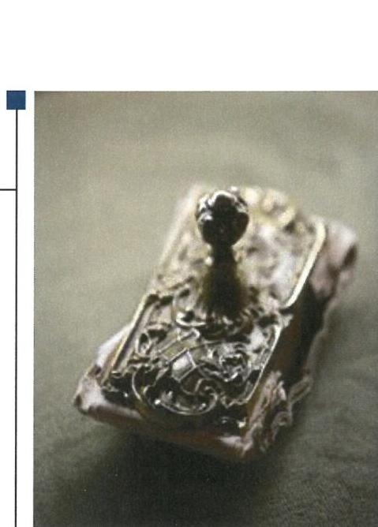

# Jelentés 

## Az önkormányzatok gazdasági társaságai

Az önkormányzatok többségi tulajdonában lévő gazdasági társaságok gazdálkodásának ellenőrzése - Kisteleki Térségi Egészségügyi Központ Nonprofit Kft.
2018.

---

# Jelentés 

## Az önkormányzatok gazdasági társaságai

Az önkormányzatok többségi tulajdonában lévő gazdasági társaságok gazdálkodásának ellenőrzése - Kisteleki Térségi Egészségügyi Központ Nonprofit Kft.
2018. augurhus hó 7. nap

Dömokos László
elnök

---

# AZ ELLENŐRZÉST FELÜGYELTE:

- **KLINGA LÁSZLŐ** felügyeleti vezető
- **AZ ELLENŐRZÉST VEZETTE ÉS A VÉGREHAJTÁSÁÉRT FELELŐS:**
  - **RÁCZKEVI KATALIN** ellenőrzésvezető
  - **A PROGRAM ÖSSZEÁLLÍTÁSÁÉRT FELELŐS:**
    - **TÓTPÁL SZABOLCS** osztályvezető

**IKTATÓSZÁM:** EL-0150-067/2018.

**TÉMASZÁM:** 2447

**ELLENŐRZÉS-AZONOSÍTÓ SZÁM:** V079340

Jelentéseink az Országgyűlés számítógépes hálózatán és az Interneta a www.asz.hu címen is olvashatóak.

---

# TARTALOMJEGYZÉK 

■ ÖSSZEGZÉS ..... 5
■ AZ ELLENŐRZÉS CÉLJA ..... 6
■ AZ ELLENŐRZÉS TERÜLETE ..... 7
■ AZ ELLENŐRZÉS HÁTTERE, INDOKOLTSÁGA ..... 8
■ A JELENTÉS LÉNYEGES KÉRDÉSKÖREI ..... 9
■ AZ ELLENŐRZÉS HATÓKÖRE ÉS MÓDSZEREI ..... 10
■ MEGÁLLAPÍTÁSOK ..... 12
■ JAVASLATOK ..... 15
■ MELLÉKLETEK ..... 17
I. sz. melléklet: Értelmező szótár ..... 17
II sz. melléklet: A Társaság főbb gazdálkodási adatai 2013-2016. években M Ft. ..... 18
■ FÜGGELÉK: ÉSZREVÉTELEK ..... 19
■ RÖVIDÍTÉSEK JEGYZÉKE ..... 21

---

.

---

# ÖSSZEGZÉS 

A Kisteleki Térségi Egészségügyi Központ Nonprofit Kft. feletti tulajdonosi joggyakorlás kialakításával és szabályszerű gyakorlásával Kistelek Városi Önkormányzat megteremtette a Társaság szabályszerű müködésének feltételeit. A Társaság vagyongazdálkodási tevékenysége, bevételeinek és ráfordításainak elszámolása szabályszerű volt. Közzétételi kötelezettségének eleget tett, ezzel biztositotta müködésének és gazdálkodásának átláthatóságát. A Társaság a kormányzati szektorba sorolt szervezetekre előirt adatszolgáltatási kötelezettséget nem teljesítette.

## Az ellenőrzés társadalmi indokoltsága

Magyarországon az intézménycentrikus közfeladat-ellátás jellemző, de egyre jelentősebb a költségvetésen kívüli feladatellátás térnyerése. Helyi szinten ennek legfontosabb szereplői az önkormányzati tulajdonban lévő gazdasági társaságok, amelyeknek ellenőrzése kiemelten fontos a közfeladat ellátása és a közvagyon megőrzése, megóvása érdekében. Ezért alapvető követelmény, hogy a társaságok gazdálkodása, múködése szabályszerű és átlátható legyen. Az ellenőrzés rendet, a rend értéket teremt.

A Kisteleki Térségi Egészségügyi Központ Nonprofit Kft.-t a Kisteleki kistérség tagtelepülésein élő mintegy 18 ezer fős lakosság szakorvosi járóbeteg ellátásának biztosítására alapították. A Társaság Kistelek és térsége egészségügyi ellátásában meghatározó szerepet töltött be az ellátott feladatain keresztül.

## Főbb megállapítások, következtetések

A Kistelek Városi Önkormányzat a tulajdonosi joggyakorlás kereteit szabályszerűen alakította ki, a Társaság feletti tulajdonosi jogokat szabályszerűen gyakorolta.

A Társaság a számviteli politika keretében előírt szabályzatokkal rendelkezett, a Társaság múködésének rendjét Szervezeti és Müködési Szabályzatban megfelelően rögzítették.

A Társaság vagyongazdálkodása, a vagyon nyilvántartása, bevételei, ráfordításai és az értékcsökkenések elszámolása szabályszerű volt.

Az egyszerűsített éves beszámolóit a Társaság az ellenőrzött időszakban határidőben elkészítette és közzétette.
A Társaság a kormányzati szektorba sorolt szervezetek számára előírt adatszolgáltatási kötelezettséget nem teljesítette.

A közérdekú adatok megismerésére irányuló kérelmek teljesítésének rendjére vonatkozó szabályzatot a Társaság az előírás ellenére nem készített.

A Társaság a közérdekú adatokra vonatkozó közzétételi kötelezettségét az ellenőrzött időszakban teljesítette, így a müködés átláthatósága biztosított volt.

---

# AZ ELLENŐRZÉS CÉLJA 

AZ ELLENŐRZÉS CÉLJA annak értékelése volt, hogy az Önkormányzat a vagyongazdálkodási tevékenysége során szabályszerűen gyakorolta-e tulajdonosi jogait. A Társaság szabályozottsága, gazdálkodása és vagyongazdálkodási tevékenysége, bevételeinek és ráfordításainak elszámolása megfelelt-e a jogszabályi és tulajdonosi előírásoknak, a Társaság kötelezettségállománya je-lentett-e kockázatot a múködésre, valamint a gazdálkodás átláthatósága és elszámoltathatósága érdekében biztosítva volt-e a szolgáltatás dijának megalapozottsága szabályszerű önköltségszámítással. Az ellenőrzés célja továbbá annak megítélése volt, hogy a kormányzati szektorba sorolt önkormányzati tulajdonban (résztulajdonban) lévő Táraság gazdálkodásának a kormányzati szektor hiányára és az államadósságra befolyással bíró elemei a jogszabályi előírásoknak megfeleltek-e.

---

# **Kistelek Városi Önkormányzat és a többségi tulajdonában lévő Kisteleki Térségi Egészségügyi Központ Nonprofit Kft.**

1. táblázat

|  A TÁRSASÁG ÁRBEVÉTELÉNEK ALALKULÁSA (2013-2016. ÉVEK) |  |  |  |   |
| --- | --- | --- | --- | --- |
|  Megnevezés | 2013. | 2014. | 2015. | 2016.  |
|  Árbevétel (M Ft) | 217,0 | 218,2 | 239,1 | 252,6  |
|  Ebből OEP-finanszírozás (M Ft) | 214,4 | 217,3 | 230,2 | 236,2  |
|  OEP-bevétel aránya (%) | 98,8 | 99,6 | 96,3 | 93,5  |

*Forrás: A Társaság főkönyvi kivonatai*

**KISTELEK VÁROSI ÖNKORMÁNYZAT** a Kisteleki Térségi Egészségügyi Központ Nonprofit Kft.-t 2009. június 4-én alapította kizárólagos tulajdonosként. Az ellenőrzött időszakot megelőzően az Önkormányzat¹ a Társaság² -ban lévő üzletrészeinek 26%-át a Kisteleki Térségi Járóbeteg Szakellátó Kft.-re átruházta. Az Önkormányzat tulajdonosi részesedése a Társaságban (74%) az ellenőrzött időszakban nem változott. A Társaság jegyzett tőkéje alapításkor 0,5 M Ft volt, melyet a Tulajdonosok³ 2016. január 15-én a jogszabályban előírtaknak megfelelően 3,0 M Ft-ra megemeltek.

## **A KISTELEKI TÉRSÉGI EGÉSZSÉGÜGYI KÖZPONT NONPROFIT KFT.**

területi kötelezettségű OEP⁴ finanszírozott szakorvosi járóbeteg, valamint egynapos sebészeti ellátást biztosított a Kisteleki kistérség lakossága számára, amely az Mötv. alapján közfeladatnak minősült. A Társaság az ellenőrzött időszakban vállalkozási tevékenységet nem végzett. A Társaság árbevétele a 2013. évi 217 M Ft-ról 2016. évre 252,6 M Ft-ra növekedett, amelyből az OEP-finaszírozás részaránya 2013-ban 98,8%, 2014-ben 99,6%, 2015-ben 96,3%, 2016-ban 93,5% volt. A fennmaradó egyéb bevételei továbbszámlázott költségek megtérüléséből származtak.

Vagyonkezelt eszköze a Társaságnak az ellenőrzött időszakban nem volt, a feladatellátást az Önkormányzat által a Társaság ingyenes használatába adott eszközökkel, valamint a Társaság saját eszközeivel biztosította.

Az Önkormányzat a feladatok ellátására a Társasággal Egészségügyi ellátási szerződés⁵-t kötött. A Társaság az ellenőrzött időszakban rendelkezett az egészségügyi szolgáltatások végzésére feljogosító működési engedéllyel.

A Társaság a Számv. tv.⁶ előírásai alapján mentesült az önköltségszámítási szabályzat készítésének kötelezettsége alól.

A Társaság az ellenőrzött időszakban a kormányzati szektorba sorolt egyéb szervezetek közé tartozott.

A Taggyűlés⁷ döntése alapján 2014. október 20-ig kettős ügyvezetővel, ezt követően egy ügyvezetővel működött, az Ügyvezető⁸ személye az ellenőrzött időszakban nem változott. A foglalkoztatottak száma 2013. évben 48 fő, 2016. évben 50 fő volt.

A Polgármester⁹ és a Jegyző¹⁰ személye az ellenőrzött időszakban nem változott.

---

# AZ ELLENŐRZÉS HÁTTERE, INDOKOLTSÁGA 

Az önkormányzatok többségi tulajdonában álló gazdasági társaságok ellenőrzése kiemelten fontos a vagyon megőrzése, megóvása érdekében. Alapvető követelmény, hogy gazdálkodásuk, működésük szabályszerű, és az általuk szolgáltatott adatok megbízhatóak legyenek. A feladatellátás költségeinek, ráfordításainak alakulása a lakosság széles rétegét érinti.

Az ÁSZ ${ }^{11}$ ellenőrzései feltárhatják, hogy az Önkormányzat a feladatellátásához rendelt vagyon működtetését a tulajdonostól elvárható gondossággal végezte-e, a feladatot ellátó Társasággal a létesítő okiratban, szolgáltatási szerződésben foglaltakat betartatta-e, a Társaság betartotta-e.

Az ellenőrzés eredményeképp meghatározhatóvá válnak a költségvetési hiányt befolyásoló szervezetek kockázatai, lehetővé válik ezen kockázatok csökkentése. Az ellenőrzés rávilágíthat arra, a hogy a gazdasági társaság a vagyon használatával biztosította-e a szolgáltatás folytatásának feltételeit, az önkormányzat tulajdonosi felügyelete hozzájárult-e a szabályszerű gazdálkodáshoz és feladatellátáshoz. A megállapítások alapján megfogalmazott számvevőszéki javaslatok hasznosítása elősegítheti a meglévő hibák megszüntetését. A jó gyakorlatok bemutatásával az ÁSZ hozzájárulhat a követendő megoldások megismertetéséhez, terjesztéséhez.

---

# A JELENTÉS LÉNYEGES KÉRDÉSKÖREI 

1. Az Önkormányzat tulajdonosi joggyakorlása szabályszerű volt-e?
2. A Társaság szabályozottsága, bevételeinek, ráfordításainak elszámolása és vagyongazdálkodási tevékenysége szabályszerű volt-e?

---

# AZ ELLENŐRZÉS HATÓKÖRE ÉS MÓDSZEREI 

## Az ellenőrzés típusa

Megfelelőségi ellenőrzés.

## Az ellenőrzött időszak

Az ellenőrzött időszak 2013. január 1-jétől 2016. december 31-ig tartott.

## Az ellenőrzés tárgya

Kistelek Városi Önkormányzat tulajdonosi joggyakorlása, valamint a Kisteleki Térségi Egészségügyi Központ Nonprofit Kft. gazdálkodásának szabályozottsága és szabályszerűsége.

Az ellenőrzés kiterjedt minden olyan körülményre és adatra, amely az ÁSZ jogszabályban meghatározott feladatainak teljesítéséhez, valamint a program végrehajtása folyamán felmerült újabb összefüggések feltárásához szükséges.

## Az ellenőrzött szervezet

Kistelek Városi Önkormányzat és a Kisteleki Térségi Egészségügyi Központ Nonprofit Kft.

## Az ellenőrzés jogalapja

Az ellenőrzés jogszabályi alapját az ÁSZ tv. ${ }^{12} 1 . \S$ (3) bekezdése és 5. § (3)(4)-(5) bekezdései képezték.

## Az ellenőrzés módszerei

Az ellenőrzést a nemzetközi standardokat irányadónak tekintve az ellenőrzési program ellenőrzési kérdései, az ellenőrzött időszakban hatályos jogszabályok, az ellenőrzés szakmai szabályok és módszertanok figyelembe vételével végeztük.

Az ellenőrzés ideje alatt az ellenőrzött szervezettel történő kapcsolattartást az ÁSZ Szervezeti és Múködési Szabályzatának vonatkozó előírásai alapján biztosítottuk.

Az ellenőrzési kérdések megválaszolásához szükséges bizonyítékok megszerzése a következő ellenőrzési eljárások alkalmazásával történt:

---

megfigyelés, kérdésfeltevés (információkérés), összehasonlítás, valamint elemzés. Az ellenőrzési bizonyítékként felhasználható adatforrások közé tartoztak egyrészt az ellenőrzési programban felsorolt adatforrások, másrészt adatforrás minden - az ellenőrzés során - feltárt, az ellenőrzés szempontjából információkat tartalmazó dokumentum.

Az ellenőrzést a kérdésekre adott válaszok kiértékelésével, valamint a megjelölt adatforrások, a csatolt tanúsítványok felhasználásával, továbbá az adott időszakban hatályos jogszabályok figyelembe vételével folytattuk le.

A bevételek és ráfordítások elszámolása, valamint a vagyonnyilvántartás terén a szabályszerű múködést véletlen mintavétellel ellenőriztük. Kockázati alapon a ráfordítások elszámolásának és a vagyonnyilvántartásának ellenőrzése minden évben a három legnagyobb összegű tétellel kiegészült. A jogszabályoknak és a belső előírásoknak megfelelőnek, azaz szabályszerűnek tekintettük az adott területet, amennyiben a minta ellenőrzésének eredménye alapján 95\%-os bizonyossággal a teljes sokaságban a hibaarány kisebb volt, mint 10\%, nem megfelelőnek értékeltük, ha a hibaarány a 10\%ot meghaladta.

---

# 1. Az Önkormányzat tulajdonosi joggyakorlása szabályszerű volt-e? 

Összegző megállapítás

A tulajdonosi joggyakorlás kereteit az Önkormányzat szabályszerűen kialakította, a tulajdonosi jogokat szabályszerűen gyakorolta a Társaság felett.

AZ ÖNKORMÁNYZAT az ellenőrzött időszakban rendelkezett az Mötv. ${ }^{13}$ előírásának megfelelő - a Társaság által ellátott feladatokat is tartalmazó - gazdasági programmal, továbbá a Kisteleki kistérségre kidolgozott, a Társaság tevékenységének fejlesztési irányait is meghatározó egészségfejlesztési programmal ${ }^{14}$.

A TULAJDONOSI JOGGYAKORLÁS KERETEIT a Vagyongazdálkodási rendeletben ${ }^{15}$, az Egészségügyi ellátási szerződésben, valamint a Társasági szerződés ${ }_{1-4}{ }^{16}$-ben egymással összhangban meghatározták. A tervezési, a beszámolási és vagyongazdálkodási feladatokat a Taggyűlés által jóváhagyott társasági SZMSZ ${ }_{1,2}{ }^{17}$-ben előírták.

A Tulajdonosok a Társasági szerződés ${ }_{1-4}$-ben a Gt. ${ }^{18}$, illetve a Ptk. ${ }^{19}$ előírásainak megfelelően kijelölték a három tagú $\mathrm{FB}^{20}$-t, valamint alapítói döntés alapján a személyében felelős könyvvizsgálót.

A BESZÁMOLÓK ELFOGADÁSA az ellenőrzött időszakban a jogszabályi előírások alapján történt, a Taggyűlés az FB és a könyvvizsgáló írásbeli jelentésének birtokában döntött.

Az Ügyvezető a 2013-2016. években az SZMSZ ${ }_{1,2}$ II. fejezet 1. pontjában foglalt előírásnak megfelelően a Társaság üzleti terveit elkészítette, azokat a Taggyűlés jóváhagyta.

A Taggyűlés a Taktv. ${ }^{21}$ 5. § (3) bekezdésében előírt, a vezető tisztségviselők, FB tagok, valamint az Mt. ${ }^{22}$ 208. §-ának hatálya alá eső munkavállalók javadalmazása, valamint a jogviszony megszűnése esetére biztosított juttatások módjának, mértékének elveiről, annak rendszeréről szóló szabályzatot megalkotta.

---

# 2. A Társaság szabályozottsága, bevételeinek, ráfordításainak elszámolása és vagyongazdálkodási tevékenysége szabályszerű volt-e? 

Összegző megállapítás

A Társaság szabályozottsága megfelelt a jogszabályi követelményeknek. A Társaság bevételinek és ráfordításainak elszámolása, vagyongazdálkodása szabályszerű volt, beszámolási kötelezettségét teljesítette. A jogszabályban előírt adatszolgáltatási kötelezettségét nem teljesítette. Közzétételi kötelezettségének eleget tett.
2.1. számú megállapítás

A Társaság a jogszabályokban előírt szabályzatokkal rendelkezett. Bevételei és ráfordításai elszámolása szabályszerű volt.

A SZÁMVITELI POLITIKÁT ${ }^{23}$, a Leltározási szabályzatot ${ }^{24}$, az Értékelési szabályzatot ${ }^{25}$, a Pénzkezelési szabályzatot ${ }^{26}$, valamint a Számlarendet ${ }^{27}$ a Társaság az ellenőrzött időszakra vonatkozóan a Számv. tv. ${ }^{28}$ előírásainak megfelelően elkészítette.

SZERVEZETI ÉS MŰKÖDÉSI SZABÁLYZATBAN a gyógyintézetek működési rendjéről, illetve szakmai vezető testületéről szóló rendelet ${ }^{29} 3 . \S$ (3) bekezdés a) pontjában előírtaknak megfelelően a Társaság múködési rendjét meghatározták.

ADATKEZELÉSI SZABÁLYZATÁT ${ }^{30}$ a Társaság az Eüak. ${ }^{31}$ 32. § (2) bekezdés h) pontjában foglaltaknak megfelelően elkészítette.

A BEVÉTELEK ELSZÁMOLÁSA a 2013-2016. években szabályszerűen történt.

AZ ANYAGJELLEGŰ RÁFORDÍTÁSOK és a személyi jellegű ráfordítások elszámolása szabályszerű volt.
2.2. számú megállapítás

A Társaság a szabályszerű vagyongazdálkodás feltételeit kialakította, vagyonnyilvántartása és az értékcsökkenés elszámolása megfelelt az előírásoknak.

AZ EGYSZERŰSÍTETT ÉVES BESZÁMOLÓK mérlegtételeit a Társaság minden ellenőrzött évben alátámasztotta a Számv. tv. 69. § (1) bekezdésében előírt leltárral.

A VAGYONNYILVÁNTARTÁSA megfelelő volt, az értékcsökkenési leírás elszámolása a jogszabálynak és a belső előírásainak megfelelt.

---

# 2.3. számú megállapítás 

A Társaság egyszerűsített éves beszámolóit elkészítette és közzétette. Kormányzati szektorba sorolt szervezetként az előírt adatszolgáltatási kötelezettséget a 2013-2016. években nem teljesítette. Közérdekú adatait közzétette.

A BESZÁMOLÓKAT a Számv. tv.-ben előírt határidőben a Társaság letétbe helyezte és közzétette.

KORMÁNYZATI SZEKTORBA SOROLT egyéb szervezetként a Társaság nem teljesítette az Ávr. ${ }^{32}$ 5. mellékletének 23. pontjában előírt adatszolgáltatási kötelezettségét, ezzel nem teljesítette az Áht. ${ }^{33}$ 107. § (1) bekezdésének előírását.

Kormányzati szektorba sorolt egyéb szervezetként a Társaságnak 20132016. években adósságot keletkeztető ügylete nem volt.

A KÖZÉRDEKŰ ADATOK megismerésére irányuló igények teljesítésének rendjét tartalmazó szabályzatot az Infotv. ${ }^{34}$ 30. § (6) bekezdésében foglalt előírás ellenére a Társaság nem készített. Az Infotv.-ben előírt közzétételi kötelezettsége teljesítésének rendjét 2016-ban szabályozta.

## A KÖZÉRDEKŰ ADATOK ÉS A KÖZÉRDEKBŐL NYILVÁNOS ADATOK MEGISMERÉSÉT a Társaság biztosította, az Infotv.-ben előírt közérdekú tartalmakat, valamint a Taktv.ben meghatározott, a vezető tisztségviselőkre, FB tagokra, illetve a bankszámla feletti rendelkezésre jogosult munkavállalókra vonatkozó, valamint a pénzeszközei felhasználásával, vagyonával történő gazdálkodással kapcsolatos közérdekú adatokat a honlapján közzétette.

---

# JAVASLATOK 

Az ÁSZ tv. 33. § (1) bekezdésében foglaltak értelmében az ellenőrzött szervezet vezetője köteles a jelentésben foglalt megállapításokhoz kapcsolódó intézkedési tervet összeállítani és azt a jelentés kézhezvételétől számított 30 napon belül az ÁSZ részére megküldeni. Amennyiben az ellenőrzött szervezet vezetője nem küldi meg határidőben az intézkedési tervet, vagy továbbra sem elfogadható intézkedési tervet küld, az Állami Számvevőszék elnöke az ÁSZ tv. 33. § (3) bekezdése a) és b) pontjaiban foglaltakat érvényesítheti.

## Kisteleki Térségi Egészségügyi Központ Nonprofit Kft. ügyvezetőjének

1. Gondoskodjon a kormányzati szektorba sorolt egyéb szervezetekre vonatkozó adatszolgáltatási kötelezettség teljesitéséről a jogszabályi előírásoknak megfelelően.
(2.3. sz. megállapítás 2. bekezdése alapján)
2. Intézkedjen a közérdekü adatok megismerésére irányuló igények teljesítésének rendjét rögzítő szabályzat elkészítéséről a jogszabályi előírásoknak megfelelően.
(2.3. sz. megállapítás 4. bekezdés 1. mondata alapján)

---

.

---

# MELLÉKLETEK 

- I. SZ. MELLÉKLET: ÉRTELMEZŐ SZÓTÁR
gazdasági társaság
közfeladat
nonprofit gazdasági társaság
tulajdonosi joggyakorló

A Ptk. 3:88. § (1) bekezdése szerint „a gazdasági társaságok üzletszerű közös gazdasági tevékenység folytatására, a tagok vagyoni hozzájárulásával létrehozott, jogi személyiséggel rendelkező vállalkozások, amelyekben a tagok a nyereségből közösen részesednek, és a veszteséget közösen viselik".
Jogszabályban meghatározott állami vagy önkormányzati feladat, amit a feladat címzettje közérdekből, haszonszerzési cél nélkül, jogszabályban meghatározott követelményeknek és feltételeknek megfelelve végez, ideértve a lakosság közszolgáltatásokkal való ellátását, valamint e feladatok ellátásához szükséges infrastruktúra biztosítását is; (Civil tv. ${ }^{35}$ 2.§ 19. pont, hatályos 2014. december 31-ig)
Az Áht. 2015. január 1-jétől hatályos 3/A. §-a szerint közfeladat a jogszabályban meghatározott állami vagy önkormányzati feladat, melynek ellátása költségvetési szervek alapításával és múködtetésével vagy az azok ellátásához szükséges pénzügyi fedezet e törvényben meghatározott eszközökkel, részben vagy egészben történő biztosításával valósul meg, az ellátásában államháztartáson kívüli szervezet jogszabályban meghatározott rendben közremúködhet.
A gazdasági társaság nem jövedelemszerzésre irányuló közös gazdasági tevékenység folytatására is alapítható (nonprofit gazdasági társaság). Nonprofit gazdasági társaság bármely társasági formában alapítható és múködtethető. A gazdasági társaság nonprofit jellegét a gazdasági társaság cégnevében a társasági forma megjelölésénél fel kell tüntetni. Nonprofit gazdasági társaság üzletszerű gazdasági tevékenységet csak kiegészítő jelleggel folytathat, a gazdasági társaság tevékenységéből származó nyereség a tagok (részvényesek) között nem osztható fel, az a gazdasági társaság vagyonát gyarapítja. (Gt. 4. § (1), (3) bekezdés, hatályos 2014. március 15-ig)
A Cégtv. ${ }^{36}$ 9/F. § (2) bekezdése szerint „az a gazdasági társaság minősül nonprofit gazdasági társaságnak és cégnevében az a gazdasági társaság tüntetheti fel a nonprofit jelleget, amelynek létesítő okirata tartalmazza, hogy a gazdasági társaság tevékenységéből származó nyereség a tagok között nem osztható fel, hanem az a gazdasági társaság vagyonát gyarapítja."
Tulajdonosi joggyakorló, aki a nemzeti vagyon felett az államot vagy a helyi önkormányzatot megillető tulajdonosi jogok és kötelezettségek összességének gyakorlására jogosult. (Nvtv. 3. § (1) bekezdés 17. pontja)

---

| Mégnevezés | 2013.01.01. | 2013.12.31. | 2014.12.31. | 2015.12.31. | 2016.12.31. |
| :--: | :--: | :--: | :--: | :--: | :--: |
| A. Befektetett eszközök | 35,8 | 41,9 | 82,2 | 79,0 | 67,3 |
| ebből: II. Tárgyi eszközök | 29,2 | 36,7 | 76,4 | 74,9 | 64,7 |
| B. Forgóeszközök | 36,0 | 76,7 | 62,9 | 45,9 | 58,2 |
| ebből: II. Követelések | 33,2 | 46,0 | 49,9 | 37,8 | 54,7 |
| C. Aktív időbeli elhatárolások | 19,8 | 20,8 | 17,5 | 42,4 | 9,2 |
| Eszközök összesen | 91,6 | 139,3 | 162,5 | 167,4 | 134,7 |
| D. Saját tőke | 24,6 | 22,2 | 19,7 | 17,7 | 17,2 |
| I. Jegyzett tőke | 0,5 | 0,5 | 0,5 | 0,5 | 3,0 |
| IV. Eredménytartalék | 3,3 | 3,7 | 3,8 | 3,9 | 2,0 |
| V. Lekötött tartalék | 0 | 0 | 0 | 0 | 0 |
| VII. Mérleg szerinti eredmény | 0,4 | 0,2 | 0,1 | 0,5 | 2,1 |
| E. Céltartalékok | 0 | 0 | 0 | 0 | 0 |
| F. Kötelezettségek | 53,9 | 97,6 | 85,2 | 17,7 | 64,9 |
| G. Passzív időbeli elhatárolások | 13,1 | 19,6 | 57,6 | 59,5 | 52,7 |
| Források összesen | 91,6 | 139,3 | 162,5 | 167,4 | 137,4 |

Forrás: A Társaság egyszerúsilett éves beszámolói 2013-2016.

---

# FÜGGELÉK: ÉSZREVÉTELEK 

A jelentéstervezetet a Számvevőszék 15 napos észrevételezésre megküldte az ellenőrzött szervezetek vezetőinek az ÁSZ tv. 29. §* (1) bekezdése előírásának megfelelően.

Az ellenőrzött szervezetek vezetői az ÁSZ. tv. 29. § (2) bekezdésében foglalt észrevételezési jogukkal nem éltek, a jelentéstervezetre észrevételt nem tettek.

[^0]
[^0]:    * 29. § (1) Az Állami Számvevőszék az ellenőrzési megállapításait megküldi az ellenőrzött szervezet vezetőjének vagy az általa megbízott személynek, és annak, akinek személyes felelősségét állapította meg.
    (2) Az ellenőrzött szervezet vezetője és a felelősként megjelölt személy az ellenőrzés megállapításaira tizenöt napon belül írásban észrevételt tehet.
    (3) Az Állami Számvevőszék az észrevételre a beérkezésétől számított harminc napon belül írásban válaszol. A figyelembe nem vett észrevételeket köteles a jelentésben feltüntetni, és megindokolni, hogy azokat miért nem fogadta el.

---

.

---

# RÖVIDÍTÉSEK JEGYZÉKE 

${ }^{1}$ Önkormányzat
${ }^{2}$ Társaság
${ }^{3}$ Tulajdonosok
${ }^{4}$ OEP
${ }^{5}$ Egészségügyi ellátási szerződés
${ }^{6}$ Számv. tv.
${ }^{7}$ Taggyúlés
${ }^{8}$ Ügyvezető
${ }^{9}$ Polgármester
${ }^{10}$ Jegyző
${ }^{11}$ ÁSZ
${ }^{12}$ ÁSZ tv.
${ }^{13}$ Mötv.
${ }^{14}$ Egészségfejlesztési program
${ }^{15}$ Vagyongazdálkodási rendelet
${ }^{16}$ Társasági szerződés:
Társasági szerződés: ${ }_{2}$
Társasági szerződés: ${ }_{3}$
Társasági szerződés:
${ }^{17}$ SZMSZ:
SZMSZ ${ }_{2}$
${ }^{18} \mathrm{Gt}$.
${ }^{19}$ Ptk.
${ }^{20} \mathrm{FB}$
${ }^{21}$ Taktv.
${ }^{22} \mathrm{Mt}$.

Kistelek Városi Önkormányzat
Kisteleki Térségi Egészségügyi Központ Nonprofit Kft.
Kisteleki Városi Önkormányzat 74\%,-os tulajdoni hányaddal és Kisteleki Térségi Járóbeteg Szakellátó Kft. 26\%-os tulajdoni hányaddal
Országos Egészségbiztosítási Pénztár
az Önkormányzat, mint a járóbeteg szakellátás fenntartója és a Társaság, mint feladatellátó között a területi beutalási rend szerinti járóbeteg szakellátás, az egynapos sebészeti ellátás, valamint a sürgősségi ellátás Társaság általi működtetésére határozatlan időre létrejött szerződés, a 2013. december 6-i módosítás alapján (hatályos 2009. június 21-től)
a számvitelről szóló 2000. évi C. törvény
Kisteleki Térségi Egészségügyi Központ Nonprofit Kft. taggyűlése
a Kisteleki Térségi Egészségügyi Központ Nonprofit Kft. ügyvezetője
Kistelek Városi Önkormányzat polgármestere
Kistelek Városi Önkormányzat jegyzője
Állami Számvevőszék
az Állami Számvevőszékről szóló 2011. évi LXVI. törvény
Magyarország helyi önkormányzatairól szóló 2011. évi CLXXXIX. törvény (hatályos 2012. január 1-jétől)

Egészségfejlesztési programterv, Kisteleki Kistérség 2013., (a 103/2013. (V. 28.) Kt. sz. határozattal elfogadott dokumentum)
Kistelek Város Önkormányzat képviselő-testületének 2/2013. (II. 18.) Kt. számú rendelete az önkormányzat vagyonáról (hatályos 2013. február 18-tól)
a Társaság taggyűlése által 2012. szeptember 10. napján jóváhagyott Társasági Szerződés,
a Társaság taggyűlése által 2014. október 20. napján jóváhagyott Társasági Szerződés,
a Társaság taggyűlése által 2016. január 15. napján jóváhagyott Társasági Szerződés,
a Társaság taggyűlése által 2016. szeptember 23. napján jóváhagyott Társasági Szerződés
a Társaság 2/2012.09.10. számú taggyűlési határozatával jóváhagyott Szervezeti és Működési Szabályzata (hatályos 2012. szeptember 10-től 2015. január 14-ig)
a Társaság 1/2015.01.11. számú taggyűlési határozatával jóváhagyott Szervezeti és Múködési Szabályzata (hatályos 2015. január 15-től)
a gazdasági társaságokról szóló 2006. évi IV. törvény (hatályos 2014. március 15 -ig)
a Polgári Törvénykönyvről szóló 2013. évi V. törvény
a Társaság felügyelő bizottsága
a köztulajdonban álló gazdasági társaságok takarékosabb müködéséről szóló 2009. évi CXXII. törvény
a munka törvénykönyvéről szóló 2012. évi I. törvény

---

${ }^{23}$ Számviteli politika: Kisteleki Térségi Egészségügyi Központ Nonprofit Kft. Számviteli politika és értékelési szabályzat szöveges számlakerettel (hatályos 2011. szeptember 13-tól 2015. december 31-ig)
Számviteli politika: Kisteleki Térségi Egészségügyi Központ Nonprofit Kft. Számviteli politika 2016. (hatályos 2016. január 1-jétől)
${ }^{24}$ Leltározási szabályzat: Kisteleki Térségi Egészségügyi Központ Nonprofit Kft. Leltározási szabályzata 2011 (hatályos 2011. szeptember 13-tól 2015. december 31-ig)
Leltározási szabályzat: Kisteleki Térségi Egészségügyi Központ Nonprofit Kft. Leltározási és leltárkészítési szabályzata 2016 (hatályos 2016. január 1-jétől)
${ }^{25}$ Értékelési szabályzat: Kisteleki Térségi Egészségügyi Központ Nonprofit Kft. Számviteli politika és értékelési szabályzat szöveges számlakerettel (hatályos 2011. szeptember 13-tól 2015. december 31-ig)

Értékelési szabályzat: Kisteleki Térségi Egészségügyi Központ Nonprofit Kft. értékelési szabályzata 2016 (hatályos 2016. január 1-jétől)
${ }^{26}$ Pénzkezelési szabályzat: Kisteleki Térségi Egészségügyi Központ Nonprofit Kft. pénzkezelési szabályzata 2011 (hatályos 2011. szeptember 13-tól 2015. december 31-ig)
Pénzkezelési szabályzat: Kisteleki Térségi Egészségügyi Központ Nonprofit Kft. pénzkezelési szabályzata 2016 (hatályos 2016. január 1-jétől)
${ }^{27}$ Számlarend: Kisteleki Térségi Egészségügyi Központ Nonprofit Kft. Számviteli politika és értékelési szabályzat szöveges számlakerettel (hatályos 2011. szeptember 13-tól 2012. december 31-ig)

Számlarend: Kisteleki Térségi Egészségügyi Központ Nonprofit Kft. Számlarend 2013 (hatályos 2013. január 1-jétől 2015. december 31-ig)

Számlarend: Kisteleki Térségi Egészségügyi Központ Nonprofit Kft. Számlarend 2013 (hatályos 2016. január 1-jétől)
a számvitelről szóló 2000. évi C. törvény
a gyógyintézetek működési rendjéről, illetve szakmai vezető testületéről szóló 43/2003. (VII. 29.) ESzCsM rendelet
${ }^{30}$ Adatkezelési szabályzat: Kisteleki Térségi Egészségügyi Központ Nonprofit Kft. Adatkezelési szabályzata 2012 (hatályos 2012. október 1-jétől)
${ }^{31}$ Eüak. 1997. évi XLVII. törvény az egészségügyi és a hozzájuk kapcsolódó személyes adatok kezeléséről és védelméről (hatályos: 1998. január 1-jétől)
${ }^{32}$ Ávr. az államháztartásról szóló törvény végrehajtásáról szóló 368/2011. (XII. 31.) Korm. rendelet
${ }^{33}$ Áht. az államháztartásról szóló 2011. évi CXCV. törvény
${ }^{34}$ Infotv. az információs önrendelkezési jogról és az információszabadságról szóló 2011. évi CXII. törvény
${ }^{35}$ Civil tv. az egyesülési jogról, a közhasznú jogállásról, valamint a civil szervezetek múködéséről és támogatásáról szóló 2011. évi CLXXV. törvény
${ }^{36}$ Cégtv. a cégnyilvánosságról, a bírósági cégeljárásról és a végelszámolásról szóló 2006. évi V. törvény

---

# ÁLLAMI SZÁMVEVŐSZÉK 

1052 Budapest, Apáczai Csere János utca 10.
Levélcím: 1364 Budapest 4. Pf. 54
Telefon: +36 14849100 Telefax: +36 14849200
www.asz.hu