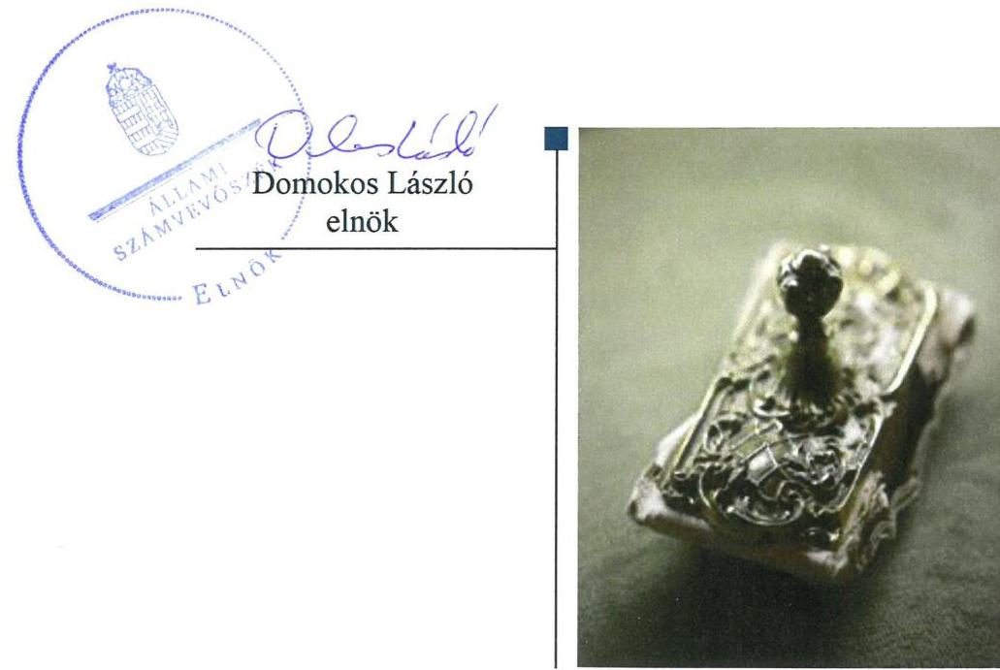
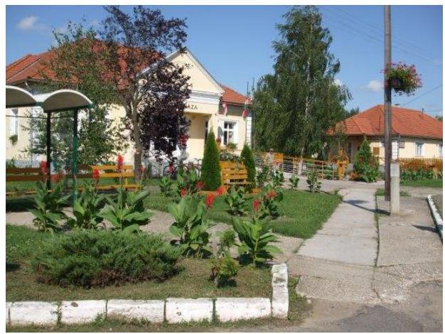
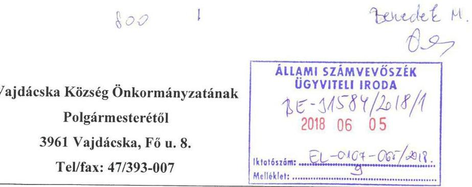
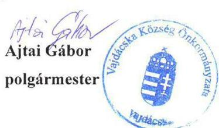
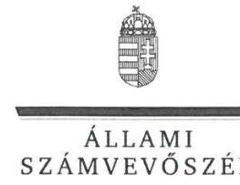
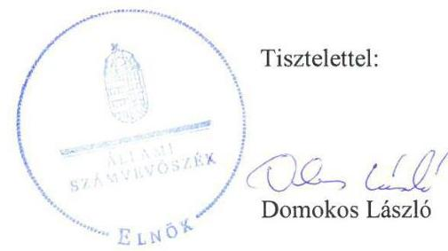
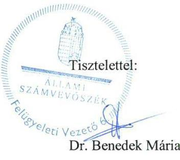

# Jelentés 

## Önkormányzatok integritás- és belső kontrollrendszere

Az önkormányzatok belső kontrollrendszere kialakításának és működtetésének ellenőrzése Vajdácska Község Önkormányzata 2018. 07. hó 18. nap

---

# AZ ELLENŐRZÉST FELÜGYELTE:

DR. BENEDEK MÁRIA felügyeleti vezető

## AZ ELLENŐRZÉST VEZETTE ÉS A VÉGREHAJTÁSÁÉRT FELELŐS:

BÍRÓ ZSOLT ellenőrzésvezető

## A PROGRAM ÖSSZEÁLLÍTÁSÁÉRT FELELŐS:

TÓTPÁL SZABOLCS osztályvezető

IKTATÓSZÁM: EL-0107-067/2018

TÉMASZÁM: 2444

ELLENŐRZÉS-AZONOSÍTÓ SZÁM: V078909, V078403

Jelentéseink az Országgyűlés számítógépes hálózatán és az Interneten a www.asz.hu címen is olvashatóak.

---

# TARTALOMJEGYZÉK 

■ ÖSSZEGZÉS ..... 5
■ AZ ELLENŐRZÉS CÉLJA ..... 6
■ AZ ELLENŐRZÉS TERÜLETE ..... 7
■ AZ ELLENŐRZÉS HÁTTERE, INDOKOLTSÁGA ..... 8
■ A JELENTÉS LÉNYEGES KÉRDÉSKÖREI ..... 10
■ AZ ELLENŐRZÉS HATÓKÖRE ÉS MÓDSZEREI ..... 11
■ MEGÁLLAPÍTÁSOK ..... 13
■ JAVASLATOK ..... 18
■ MELLÉKLETEK ..... 23
I. sz. melléklet: Értelmező szótár ..... 23
■ FÜGGELÉK: ÉSZREVÉTELEK ..... 25
■ RÖVIDÍTÉSEK JEGYZÉKE ..... 37

---

.

---

# ÖSSZEGZÉS 

Az Állami Számvevőszék Vajdácska Község Önkormányzatának ellenőrzése során megállapította, hogy a belső kontrollrendszer kialakítása és működtetése nem volt szabályszerű. A kontrollkörnyezet kialakítása megfelelt a jogszabályi előírásoknak. A kockázatkezelési rendszer, az információs és kommunikációs rendszer, valamint a monitoring rendszer, azon belül a belső ellenőrzés kialakítása és működtetése nem volt szabályszerű, így a hiányosságok miatt nem volt biztosított a közpénzfelhasználás szabályossága, és az átlátható működés. Az integritás kontrollok kiépítettsége nem volt egyensúlyban a fellépő kockázatok szintjével.

## Az ellenőrzés társadalmi indokoltsága

Magyarország Alaptörvénye az önkormányzatoktól is elvárja a kiegyensúlyozott, átlátható és fenntartható költségvetési gazdálkodás elvének érvényesítését, továbbá a nemzeti vagyonnal való rendeltetésszerű és felelős módon való gazdálkodást. A belső kontrollrendszer kialakítása és működtetése nélkül nem valósítható meg a közpénzek, a közvagyon szabályos, gazdaságos, hatékony és eredményes felhasználása. Az Állami Számvevőszék stratégiájában megfogalmazódott, hogy támogatja az integritás alapú, átlátható és elszámoltatható közpénzfelhasználás megteremtését. Mindezekre tekintettel, a közpénzzel gazdálkodó szervezetek esetében a belső kontrollrendszer megfelelő működése ellenőrzését prioritásként kezeli az Állami Számvevőszék.

A vagyonnal való felelős gazdálkodáshoz elengedhetetlen, hogy Vajdácska Község Önkormányzatánál a belső kontrollrendszer kialakítása és működtetése megfelelő legyen, érvényesüljön az integritás szemlélet.

## Főbb megállapítások, következtetések

Vajdácska Község Önkormányzata a jogszabályi előírásoknak megfelelően kialakította működésének szervezeti kereteit, rendelkezett szervezeti és működési szabályzattal, valamint szabályozta a vagyonnal történő gazdálkodás szabályait. A Vajdácskai Közös Önkormányzati Hivatal rendelkezett alapító okirattal, valamint szervezeti és működési szabályzattal, a jegyző a gazdálkodási feladatok ellátásának rendjét, módját az ügyrendben szabályozta. A jegyző a kontrolltevékenységek kereteinek kialakítása során meghatározta a gazdálkodási jogkörök kijelölésére, gyakorlására vonatkozó szabályokat. A kontrolltevékenységek gyakorlása során a pénzügyi ellenjegyzés nem volt szabályszerű.

A jegyző az ellenőrzött időszakban nem mérte fel a Vajdácskai Közös Önkormányzati Hivatal tevékenységeiben rejlő kockázatokat, nem határozta meg a szükséges intézkedéseket és azok teljesítésének nyomon követését. A jegyző belső szabályzatban nem rendezte a közérdekű adatok megismerésére irányuló kérelmek intézésének, továbbá a kötelezően közzéteendő adatok nyilvánosságra hozatalának rendjét, nem készítette el az adatvédelmi és adatbiztonsági szabályzatot, egyedi iratkezelési szabályzatot, valamint nem gondoskodott a jogszabályban előírt közzétételi kötelezettségről. A monitoring rendszer kialakítása és működtetése nem volt szabályszerű, mivel a jegyző nem vezetett nyilvántartást a külső ellenőrzésekről, továbbá a belső ellenőrzési vezető a 2017. évre ellenőrzési tervet nem állított össze, így a hiányosságok miatt nem volt biztosított Vajdácska Község Önkormányzatánál a közpénzfelhasználás szabályossága és átláthatósága.

A Vajdácskai Roma Nemzetiségi Önkormányzat gazdálkodásával kapcsolatos feladatok ellátása megfelelt a jogszabályi előírásoknak.

Vajdácska Község Önkormányzatánál az integritással összefüggő kontrollok és a korrupciós kockázatok szintje nem volt összhangban, a kontrollrendszer nem támogatta az integritás szemlélet érvényesülését.

---

# AZ ELLENŐRZÉS CÉLJA 

AZ ELLENŐRZÉS CÉLJA annak megállapítása volt, hogy szabályszerűen történt-e Vajdácska Község Önkormányzata belső kontrollrendszerének kialakítása és működtetése, az biztosította-e a közpénzfelhasználás szabályosságát, a közpénzekkel és a nemzeti vagyonnal történő szabályszerű és felelős gazdálkodást, a beszámolási és adatszolgáltatási kötelezettségek szabályszerű teljesítését. Az ellenőrzés keretében értékeltük Vajdácska Község Önkormányzata korrupciós kockázatainak kezelését szolgáló integritás kontrollok kiépítettségét és az integritás szemlélet érvényesülését.

---

# **AZ ELLENŐRZÉS TERÜLETE**

## **Vajdácska Község Önkormányzata**

A Borsod-Abaúj-Zemplén megyében fekvő Vajdácska község lakónépessége a Központi Statisztikai Hivatal Magyarország közigazgatási helynévkönyve alapján 2016. január 1-jén 1303 fő volt. Vajdácska Község Önkormányzata hét tagú Képviselőtestületének munkáját egy állandó bizottság, az Ügyrendi Bizottság segítette. Vajdácska Község Önkormányzata a Vajdácskai Közös Önkormányzati Hivatalon kívül egy intézménnyel és két társulással, valamint kettő kisebbségi tulajdonában álló gazdasági társasággal látta el a feladatait. A közvilágítás közfeladatot a KÖZVIL Első Magyar Közvilágítási Zártkörűen Működő Részvénytársaság látta el, amelyben 3,5 millió Ft névértékű részvénnyel rendelkezett Vajdácska Község Önkormányzata. A településen Vajdácskai Roma Nemzetiségi Önkormányzat működött.

A polgármester a 2014. évi önkormányzati választások óta tölti be tisztségét. A jegyző 2011. április 1-je óta látja el feladatait. A Vajdácskai Közös Önkormányzati Hivatal szervezeti egységekre nem tagolódott, elkülönített gazdasági szervezettel nem rendelkezett, a foglalkoztatott köztisztviselők száma 2016. év végén 11 fő volt. A Vajdácskai Közös Önkormányzati Hivatal 2013. január 1-jétől működik, Vajdácska és Erdőhorváti Községek Körjegyzőségéből Makkoshotyka és Viss községek csatlakozásával jött létre.

Vajdácska Község Önkormányzata 2016. évi összevont beszámolója szerint 356,7 millió Ft költségvetési bevételt ért el, valamint 344,4 millió Ft költségvetési kiadást teljesített. A könyvviteli mérleg szerinti eszközvagyona 2016. december 31-én 665,4 millió Ft volt. Vajdácska Község Önkormányzatának nem volt költségvetési évben esedékes kötelezettség állománya, a költségvetési évet követően esedékes kötelezettség állomány 6,2 millió Ft-ot tett ki, pénzintézettel szembeni kötelezettségük nem volt.

---

# AZ ELLENŐRZÉS HÁTTERE, INDOKOLTSÁGA 

A demokratikus társadalmakban alapvető igény, hogy a közpénzeket, a közvagyont használók tevékenységükről elszámoljanak, ahhoz egyértelmű és érvényesíthető felelősségi szabályok társuljanak. Ennek a jogos igénynek az érvényesítéséhez meg kell teremteni azokat a folyamatokat, rendszereket, amelyek nélkülözhetetlenek az elszámoltatáshoz. Az elszámoltatás eredményes működtetéséhez szükség van a megfelelő információs, kontroll-, értékelési- és beszámolási rendszerek kialakítására. A belső kontrollok kiépítettsége hozzájárul az integritási szemlélet kialakításához és érvényesüléséhez. A belső kontrollrendszer kialakítása és működtetése nélkül nem valósítható meg a közpénzek, a közvagyon szabályos, gazdaságos, hatékony és eredményes felhasználása.

A BELSŐ KONTROLLRENDSZER azt a célt szolgálja, hogy az államháztartás szervei működésük és gazdálkodásuk során a tevékenységeket szabályszerűen, gazdaságosan, hatékonyan, eredményesen hajtsák végre, teljesítsék elszámolási kötelezettségeiket és megvédjék az erőforrásokat a veszteségektől, a károktól, a nem rendeltetésszerű használattól. A belső kontrollrendszer magában foglalja mindazon szabályokat, eljárásokat, gyakorlati módszereket és szervezeti struktúrákat, kockázatkezelési technikákat, kontrolltevékenységeket, amelyek segítséget nyújtanak a szervezetnek céljai eléréséhez. A belső kontrollrendszer szabályozása háromszintű, a törvényi előírásokat az Áht. ${ }^{1}$ és az Mötv. ${ }^{2}$, a rendeleti szintű szabályozást az Ávr. ${ }^{3}$ és a Bkr. ${ }^{4}$ tartalmazza, amelyeket útmutatói szinten az $\mathrm{NGM}^{5}$ által kiadott standardok és kézikönyvek támogatnak.

A MEGFELELŐ BELSŐ KONTROLLRENDSZER jelentősen csökkenti a hibák és szabálytalanságok kockázatát. Az ÁSZ ${ }^{6}$ célja, hogy javuljon az ellenőrzött önkormányzatok belső kontrollrendszerének szabályozottsága, működésének megfelelősége, szabályszerűsége, hozzájárulva ezzel az egyensúlyi helyzet fenntarthatóságának biztosításához, biztosítva az önkormányzatnál a közpénzfelhasználás szabályosságát, a közpénzekkel és a nemzeti vagyonnal történő szabályszerű, gazdaságos, hatékony és eredményes gazdálkodást. Az ÁSZ ellenőrzés tapasztalatai nem csupán a közvetlenül ellenőrzött önkormányzatokat támogathatják, hanem a „jó gyakorlat" elterjesztésével azok az önkormányzatok is átvehetik a pozitív példákat, ahol az ÁSZ nem végez ellenőrzést.

## AZ ELLENŐRZÉS VÁRHATÓ HASZNOSULÁSA

NÉGY SZINTEN valósul meg. A törvényalkotás számára összegzett tapasztalatok állnak rendelkezésre a belső kontrollrendszer önkormányzati területen való kialakításáról, működtetéséről és hatásairól. Az ellenőrzés az ellenőrzött számára visszajelzést ad a belső kontrollrendszer kialakításában és működésében lévő hiányosságokról, javaslataival hozzájárul azok kiküszöböléséhez. Az ellenőrzés megállapításait és javaslatait más szervezetek is hasznosíthatják a rendezett gazdálkodási keretek kialakításához. A társadalom számára jelzi, hogy közpénz nem maradhat ellenőrizetlenül, az ÁSZ értékteremtő rend kialakításához és megőrzéséhez hozzájáruló tevékenysége pozitív hatással lesz a szervezetről kialakított összkép formálásában.

---

# A JELENTÉS LÉNYEGES KÉRDÉSKÖREI 

1.- Az önkormányzat belső kontrollrendszerének kialakítása és működtetése szabályszerű volt-e, az biztosította-e az önkormányzatnál a közpénzfelhasználás szabályosságát, a nemzeti vagyonnal történő felelős gazdálkodást?
2.- Érvényesült-e az integritás szemlélet és ennek megfelelően kiépítették-e az integritás kontrollrendszert az önkormányzatnál?

---

# AZ ELLENŐRZÉS HATÓKÖRE ÉS MÓDSZEREI 

## Az ellenőrzés típusa

Megfelelőségi ellenőrzés.

## Az ellenőrzött időszak

2016. január 1. és december 31. közötti időszak

## Az ellenőrzés tárgya

A helyi önkormányzatnak, mint éves költségvetési beszámoló készítésére kötelezett szervezetnek és polgármesteri hivatalának belső kontrollrendszere. Az integritás szemlélet érvényesülése.

Az ellenőrzés kiterjedt minden olyan körülményre és adatra, amely az ÁSZ jogszabályban meghatározott feladatainak teljesítéséhez, valamint a program végrehajtása folyamán felmerült újabb összefüggések feltárásához szükséges volt.

## Az ellenőrzött szervezet

Vajdácska Község Önkormányzata

## Az ellenőrzés jogalapja

Az ÁSZ tv. ${ }^{7} 1$. § (3) bekezdésében foglaltak alapján az ÁSZ általános hatáskörrel végzi a közpénzekkel és az állami és önkormányzati vagyonnal való felelős gazdálkodás ellenőrzését. Az ÁSZ tv. 5. § (2) bekezdése alapján az államháztartás gazdálkodásának ellenőrzése keretében az ÁSZ ellenőrzi a helyi önkormányzatok gazdálkodását, valamint az ÁSZ tv. 5. § (6) bekezdése alapján ellenőrzése során értékeli az államháztartás számviteli rendjének betartását és a belső kontrollrendszer működését.

## Az ellenőrzés módszerei

Az ÁSZ az ellenőrzést az ellenőrzési program szempontjai, kérdései, az ellenőrzött időszakban hatályos jogszabályok, az ellenőrzés szakmai szabályok és módszertanok figyelembe vételével végezte.

Az ellenőrzés ideje alatt az ellenőrzött szervezettel történő kapcsolattartást az ÁSZ SZMSZ ${ }^{8}$-ének vonatkozó előírásai alapján biztosította.

---

Az ellenőrzési kérdések megválaszolásához szükséges bizonyítékok megszerzése az ellenőrzött által rendelkezésre bocsátott dokumentumokra, adatokra alapozva megfigyelés, szemle (szemrevételezés), kérdésfeltevés (információkérés), valamint elemző eljárással történt. A minták kiválasztása rétegzett, véletlen mintavételi eljárással történt. Az ellenőrzési bizonyítékként felhasználható adatforrások közé tartoztak egyrészt az ellenőrzési program részletes szempontjainál felsorolt adatforrások, másrészt minden - az ellenőrzés folyamán feltárt, az ellenőrzés szempontjából információt tartalmazó - dokumentum.

Az ellenőrzés lefolytatásához az önkormányzat a tanúsítványok kitöltésével, valamint az ÁSZ által kért dokumentumok megküldésével szolgáltatott adatokat. A rendelkezésre bocsátott adatok, információk kontrollja az ellenőrzés keretében történt. Az egységes értelmezést támogatta a program mellékletét képező fogalomtár és rövidítésjegyzék.

Az önkormányzat belső kontrollrendszere jogszabályi előírások szerinti kialakításának és működtetésének szabályszerűségét, az erre irányuló ellenőrzési kérdésekre adott válaszok összesítése alapján pillérenként (kontrollkörnyezet, kockázatkezelési rendszer, kontrolltevékenységek, információs és kommunikációs rendszer, monitoring rendszer) és összesítetten is értékeltük. Az önkormányzat belső kontrollrendszere egyes pilléreinek kialakítása és működtetése „szabályszerű", amennyiben az értékelt területen az elért igen válaszok százalékban kifejezett, egész számra kerekített aránya meghaladta a 85%-ot, „nem szabályszerű", ha nem haladta meg a 60%-ot. Ha a 85%-ot nem haladta meg, de 60%-nál nagyobb volt az igen válaszok aránya, akkor a minősítés „részben szabályszerű". Az önkormányzat belső kontrollrendszerének összesített értékelése megegyezik a pillérenként (kontrollterületenként) alkalmazott százalékos értékelésekkel, a következő eltérésekkel. A kontrollrendszer
 egésze esetében a „szabályszerű" értékelésnek a százalékos értéken felül további feltétele, hogy egyik kontrollterület sem kaphat „nem szabályszerű" értékelést, a „részben szabályszerű" értékelés további feltétele, hogy legfeljebb egy ellenőrzött kontrollterület lehet „nem szabályszerű" értékelésű. Az összesített értékelés a százalékos értéktől függetlenül „nem szabályszerű", ha az ellenőrzött kontrollterületek közül több mint egynek „nem szabályszerű" az értékelése.

A közszféra integritás alapú kultúrájának kialakítása, megerősítése és működése szorosan összefügg a belső kontrollrendszer működésével, ezért az ellenőrzés kiterjedt annak értékelésére is, hogy a belső kontrollrendszer kialakítása és működtetése hogyan hatott az integritás szemlélet érvényesülésére. Az integritás szemlélet érvényesülésének értékelése az önkormányzat által kitöltött tanúsítvány alapján történt.

---

# 1. Az önkormányzat belső kontrollrendszerének kialakítása és működtetése szabályszerű volt-e, az biztosította-e az önkormányzatnál a közpénzfelhasználás szabályosságát, a nemzeti vagyonnal történő felelős gazdálkodást? 

Összegző megállapítás

### 1.1. számú megállapítás

A belső kontrollrendszer kialakítása és működtetése nem volt szabályszerű, az nem biztosította az Önkormányzatnál ${ }^{9}$ a közpénzfelhasználás szabályosságát, a nemzeti vagyonnal történő felelős gazdálkodást.

A kontrollkörnyezet kialakítása megfelelt a jogszabályi előírásoknak.

Az Önkormányzat rendelkezett SZMSZ ${ }^{10}$-el, a vagyonnal történő gazdálkodás rendjét vagyonrendeletben ${ }^{11}$ szabályozta. A Közös Hivatal ${ }^{12}$ az Áht.-ban és az Ávr.-ben előírtaknak megfelelően rendelkezett hatályos és egységes szerkezetbe foglalt alapító okirattal, valamint hivatali SZMSZ ${ }^{13}$-el. A Közös Hivatal gazdálkodási feladatainak ellátásának rendjét, módját az Áht.-ban és az Ávr.-ben előírtaknak megfelelően Ügyrendben ${ }^{14}$ szabályozták. A Közös Hivatal a Számv. tv. ${ }^{15}$-ben, illetve az Áhsz. ${ }^{16}$-ben meghatározottak szerint rendelkezett Számviteli politikával ${ }^{17}$, Számlarenddel ${ }^{18}$, Leltározási és leltárkészítési szabályzattal ${ }^{19}$, Pénzkezelési szabályzattal ${ }^{20}$, valamint önköltség-számítási szabályzattal ${ }^{21}$.

Az Önkormányzat rendelkezett Közbeszerzési szabályzattal²2, amely tartalmazta a Kbt. ${ }^{23}$ hatálya alá tartozó beszerzések eljárásrendjét.

A kontrollkörnyezet kialakításának hiányosságait az 1. táblázat tartalmazza.

## A KONTROLLKÖRNYEZET KIALAKÍTÁSÁNAK HIÁNYOSSÁGAI

Sorszám
1. A Képviselő-testület ${ }^{24}$ az Önkormányzat 2015-2019. közötti időszakra vonatkozó gazdasági programját a Htv ${ }^{25}$. 138. § (1) bekezdés a) pontjában és a Mötv. 116. § (2) bekezdésében előírtak ellenére nem határozta meg.
2. A Mötv. 82. § (1) és a Kttv. 43. § (4) bekezdésében foglaltak ellenére a polgármester nem gondoskodott munkaköri leírásról a jegyző részére.
3. A jegyző a Kttv. 75. § (1) bekezdés d) pontjában foglaltak ellenére a Közös Hivatal pénzügyi számviteli feladatot ellátó köztisztviselők közül kettő esetében a munkaköri leírásban a munkakör betöltésével kapcsolatos követelményeket nem rögzítette.

---

|  Sorszám |  |  |  |  |  |  |  |  |  |  |  |  |  |  |  |  |  |  |  |  |  |  |   |
| --- | --- | --- | --- | --- | --- | --- | --- | --- | --- | --- | --- | --- | --- | --- | --- | --- | --- | --- | --- | --- | --- | --- | --- |
|  4. |  |  |  |  |  |  |  |  |  |  |  |  |  |  |  |  |  |  |  |  |  |  |   |
|   |  |  |  |  |  |  |  |  |  |  |  |  |  |  |  |  |  |  |  |  |  |  |   |
|   |  |  |  |  |  |  |  |  |  |  |  |  |  |  |  |  |  |  |  |  |  |  |   |
|   |  |  |  |  |  |  |  |  |  |  |  |  |  |  |  |  |  |  |  |  |  |  |   |
|  5. |  |  |  |  |  |  |  |  |  |  |  |  |  |  |  |  |  |  |  |  |  |  |  |   |

1. számú megállapítás

A jogszabály az Eszközök és források értékelési szabályzatában ${ }^{26}$ az Áhsz. 50. § (2) bekezdés b) pont előírása ellenére nem rögzítette követeléstípusonként a kis összegű követelések év végi meghatározásának elveit, dokumentálásának szabályait. A jegyző az Ávr. 13. § (2) bekezdés b) és e) pontjában előírtak ellenére belső szabályzatban nem rendezte a beszerzések lebonyolításával kapcsolatos eljárásrendet és a reprezentációs kiadások felosztását, azok teljesítésének és elszámolásának szabályait.

Forrás: ÁSZ

# 1.2. számú megállapítás

A kockázatkezelési rendszer kialakítása és működtetése nem felelt meg a jogszabályi előírásoknak.

A Közös Hivatal Belső Kontrollrendszer Szabályzatában ${ }^{27}$ a Bkr. előírásának megfelelően 2016. szeptember 30-ig meghatározták a kockázatkezeléssel kapcsolatos szabályokat, módszereket és irányítási eszközöket.

A kockázatkezelési rendszer kialakításának és működtetésének hiányosságait a 2. táblázat tartalmazza. 2. táblázat

|  A KOCKÁZATKEZELÉSI RENDSZER KIALAKÍTÁSÁNAK ÉS MŰKÖDTETÉSÉNEK HIÁNYOSSÁGAI |   |
| --- | --- |
|  Sorszám |  |  |  |  |  |  |  |  |  |  |  |  |  |  |  |  |  |  |  |  |  |  |   |
|  1. | A jegyző a Bkr. 6. § (4) bekezdés előírása ellenére 2016. október 1-jétől az integrált kockázatkezelés eljárásrendjét nem szabályozta. |  |  |  |  |  |  |  |  |  |  |  |  |  |  |  |  |  |  |  |  |   |
|  2. | A jegyző a Bkr. 7. § (1)-(2) bekezdések előírása ellenére a kockázatkezelési rendszert, 2016. október 1-jétől integrált kockázatkezelési rendszert nem működtetett, mivel nem mérte fel és nem állapította meg a Közös Hivatal tevékenységében rejlő, szervezeti célokkal összefüggő kockázatokat és nem határozta meg a szükséges intézkedéseket, valamint azok teljesítésének folyamatos nyomon követésének módját. |  |  |  |  |  |  |  |  |  |  |  |  |  |  |  |  |  |  |  |   |

Forrás: ÁSZ

## 1.3. számú megállapítás

A kontrolltevékenységek kereteinek kialakítása és működtetése megfelelt a jogszabályi előírásoknak és a belső szabályozásban foglaltaknak.

Az Önkormányzat rendelkezett Gazdálkodási szabályzattal ${ }^{28}$, melyben a polgármester és a jegyző az Ávr. előírásainak megfelelően meghatározta a gazdálkodási jogkörök kijelölésére, gyakorlására és az összeférhetetlenségre vonatkozó szabályokat. A jogosultak kötelezettségvállalási, teljesítésigazolási és utalványozási jogkör gyakorlására történő kijelölése megfelelt az Ávr.-ben foglalt előírásoknak.

A pénzügyi ellenjegyzők és az érvényesítők személyét az Ávr. előírásainak megfelelően a jegyző jelölte ki. A pénzügyi ellenjegyzésre, illetve az érvényesítésre jogosultak rendelkeztek az Ávr.-ben előírt végzettséggel és pénzügyi-számviteli képesítéssel. A Közös Hivatalban naprakészen vezették a gazdálkodási jogkörök gyakorlóinak aláírás mintáit tartalmazó nyilvántartást.

A kontrolltevékenység kialakításának és működtetésének hiányosságait a 3. táblázat tartalmazza.

---

# A KONTROLLTEVÉKENYSÉG KIALAKÍTÁSÁNAK ÉS MŰKÖDTETÉSÉNEK HIÁNYOSSÁGAI 

## Sorszám

1. 

A jegyző 2016. október 1-től a Bkr. 6. § (4) bekezdések ellenére nem szabályozta a szervezeti integritást sértő események kezelésének eljárásrendjét.
2. A kötelezettségvállalásra az Áht. 37. § (1) bekezdésében előírtak ellenére pénzügyi ellenjegyzés nélkül került sor.

Forrás: ÁSZ

### 1.4. számú megállapítás

Az információs és kommunikációs rendszer kialakítása és működtetése nem volt szabályszerű.

A jegyző nem alakította ki az Önkormányzat információs és kommunikációs rendszerét.

Az információs és kommunikációs folyamatok kialakításának és működtetésének hiányosságait az 4. táblázat tartalmazza.
4. táblázat

## AZ INFORMÁCIÓS ÉS KOMMUNIKÁCIÓS FOLYAMATOK KIALAKÍTÁSÁNAK ÉS MŰKÖDTETÉSÉNEK HIÁNYOSSÁGAI

Sorszám
1. 

A jegyző a Bkr. 9. § (1) bekezdésében foglaltak ellenére nem alakított ki és nem működtetett olyan rendszereket, amelyek biztosították, hogy a megfelelő információk a megfelelő időben eljussanak az illetékes szervezethez, illetve személyhez
2. A jegyző az Ávr. 13. § (2) bekezdés h) pontjában előírtak ellenére a közérdekű adatok megismerésére irányuló kérelmek intézésének, továbbá a kötelezően közzéteendő adatok nyilvánosságra hozatalának rendjét belső szabályzatban nem rendezte.
3. A jegyző az Info. tv. ${ }^{29}$ 37. § (1) bekezdésében, előírtak ellenére nem gondoskodott az Info. tv. 1. melléklet II/1 pontjában előírt szervezeti és működési szabályzat, az Info tv. 1. sz. melléklet III/1. pontjában előírt éves költségvetés és a számviteli törvény szerinti éves költségvetés beszámoló közzétételéről.
4. A jegyző az Info tv. 24. § (3) bekezdésében rögzítettek ellenére nem készítette el az adatvédelmi és adatbiztonsági szabályzatot.
5. A jegyző nem alakította ki az Info tv. 7. § (2) bekezdésének előírása ellenére azokat az eljárási szabályokat, amelyek e törvény, valamint az egyéb adat- és titokvédelmi szabályok érvényre juttatásához szükségesek.
6. A jegyző az Ltv. ${ }^{30}$ 10. § (1) bekezdés c) pontjában előírtak ellenére egyedi iratkezelési szabályzatot nem adott ki.

Forrás: ÁSZ

### 1.5. számú megállapítás

Monitoring rendszer, ezen belül a belső ellenőrzési rendszer kialakítása és működtetése a jogszabályi előírásoknak nem felelt meg.

A Bkr. előírásának megfelelően a hivatali SZMSZ-ben szabályozták, hogy a Közös Hivatal, valamint a hozzá rendelt önállóan működő költségvetési szervek belső ellenőrzését társulás keretében biztosítják. A belső ellenőrzés szervezeti és funkcionális függetlensége biztosított volt, az Önkormányzat rendelkezett Stratégiai Ellenőrzési Tervvel a 2015-2018. évekre vonatkozóan.

A monitoring rendszer kialakításának és működtetésének hiányosságait az 5. táblázat tartalmazza.

---

5. táblázat

# A MONITORING RENDSZER KIALAKÍTÁSÁNAK ÉS MŰKÖDTETÉSÉNEK HIÁNYOSSÁGAI 

Sorszám | Részmegállapítások | Megjegyzések
:--: | :--: | :--: |
| 1. | A jegyző a Bkr. 14. § (1) bekezdés előírása ellenére éves bontásban nem vezetett nyilvántartást a külső ellenőrzések javaslatai alapján készült intézkedési tervek végrehajtásáról. |  |
| 2. | A belső ellenőrzési vezető a Bkr. 22. § (1) bekezdés b) pontjában foglaltak ellenére az Önkormányzat 2017. évi ellenőrzési tervét nem állította össze. |  |
|

 3. | A belső ellenőrzési vezető a Bkr. 47. § (1) bekezdés előírása ellenére éves bontásban nem vezetett nyilvántartást, amellyel az Önkormányzat belső ellenőrzési jelentéseiben tett megállapításokat, javaslatokat, a vonatkozó intézkedési terveket és azok végrehajtását nyomon követi. |  |

Forrás: ÁSZ

## 1.6. számú megállapítás

A belső kontrollrendszer kialakításával és működésével kapcsolatban a jegyzői nyilatkozatban ${ }^{31}$ tett értékelést jelen ellenőrzés megállapításai nem támasztották alá.

A jegyző a jogszabály által előírt 2016. évre vonatkozó nyilatkozatában megfelelőnek értékelte a Közös Hivatal belső kontrollrendszerének kialakítását és működtetését. A jegyző nyilatkozatában foglaltakat jelen ellenőrzés nem támasztotta alá, mivel az Önkormányzat belső kontrollrendszerének kialakítása és működtetése az ÁSZ értékelése szerint nem volt szabályszerű.

A Bkr. előírásainak megfelelően a 2016. évi éves ellenőrzési jelentést a belső ellenőrzési vezető elkészítette és határidőben megküldésre került a jegyző részére.

A belső kontrollrendszer minőségét értékelő nyilatkozattal és az éves ellenőrzési jelentéssel kapcsolatos hiányosságokat a 6. táblázat tartalmazza.
6. táblázat

## A BELSŐ KONTROLLRENDSZER MINŐSÉGÉT ÉRTÉKELŐ NYILATKOZATTAL ÉS AZ ÉVES ELLENŐRZÉSI JELENTÉSSEL KAPCSOLATOS HIÁNYOSSÁGOK

Sorszám | Részmegállapítások | Megjegyzések
:--: | :--: |
| 1. | A polgármester a Bkr. 1. melléklete szerinti jegyzői nyilatkozatot a Bkr. 11. § (2a) bekezdés előírása ellenére nem terjesztette a Képviselő-testület elé a 2016. évi zárszámadási rendelettervezettel együtt. |  |
| 2. | A polgármester a 2016. évi éves ellenőrzési jelentést a Bkr. 49. § (3a) bekezdés előírása ellenére nem terjesztette a Képviselő-testület elé jóváhagyásra a 2016. évi zárszámadási rendelettervezettel egyidejűleg. |  |

Forrás: ÁSZ

## 1.7. számú megállapítás

A Roma Nemzetiségi Önkormányzat ${ }^{32}$ gazdálkodásával kapcsolatos feladatok ellátása megfelelt a jogszabályi előírásoknak.

Az Önkormányzat az ellenőrzött időszakban rendelkezett a Roma Nemzetiségi Önkormányzattal történő együttműködésre vonatkozó, hatályos együttműködési megállapodással, valamint Gazdálkodási szabályzattal, amely tartalmazta a gazdálkodás és egyéb feladatellátás részletes szabályait.

A Roma Nemzetiségi Önkormányzat gazdálkodásával kapcsolatos önkormányzati feladatok ellátásának hiányosságát a 7. táblázat tartalmazza.

---

7. táblázat

# A ROMA NEMZETISÉGI ÖNKORMÁNYZAT GAZDÁLKODÁSÁVAL KAPCSOLATOS ÖNKORMÁNYZATI FELADATELLÁTÁS HIÁNYOSSÁGAI 

Sorszám
Részmegállapítás
Megjegyzés

1. A belső ellenőrzési vezető Bkr. 22. § (1) bekezdés b) pontja ellenére a jóváhagyott 2016. évi ellenőrzési tervben előírt ellenőrzési feladatot nem hajtotta végre.

Forrás: ÁSZ

## 2. Érvényesült-e az integritás szemlélet és ennek megfelelően kiépítették-e az integritás kontrollrendszert az önkormányzatnál?

## Összegző megállapítás

## Az integritási kontrollok kiépítettsége nem volt egyensúlyban a fellépő kockázatok szintjével.

Az Önkormányzat nem működtette a jogszabályok által előírt integritást erősítő kontrollokat. Az Önkormányzat nem rendelkezett a reprezentációs kiadások felosztását, azok teljesítésének és elszámolásának szabályzatával, iratkezelési szabályzattal, titokvédelmi szabályzattal, a szervezeten belüli közérdekű bejelentők védelméről és panaszokat kezelő szabályzatokkal, valamint belső ellenőrzési tervekkel.

Az Önkormányzat nem határozta meg az általa követendő értékeket, így az integritás erősítését sem.

Az Önkormányzat nem működtette az integritást erősítő, jogszabályok által nem előírt kontrollokat. Nem működött dolgozói érdekképviselet, az új munkatársak kiválasztásánál nem alkalmaztak vizsgát, tudásfelmérő tesztet, nem működött a munkahelyi rotáció, nem alkalmazták a „négy szem elvét", illetve az elmúlt három évben nem volt korrupcióellenes képzés.

Az Önkormányzat nem működtetett kockázatkezelési rendszert, nem végzett kockázatelemzéseket.

---

# JAVASLATOK 

Az ÁSZ tv. 33. § (1) bekezdésében foglaltak értelmében az ellenőrzött szervezet vezetője köteles a jelentésben foglalt megállapításokhoz kapcsolódó intézkedési tervet összeállítani és azt a jelentés kézhezvételétől számított 30 napon belül az ÁSZ részére megküldeni. Amennyiben az ellenőrzött szervezet vezetője nem küldi meg határidőben az intézkedési tervet, vagy továbbra sem elfogadható intézkedési tervet küld, az Állami Számvevőszék elnöke az ÁSZ tv. 33. § (3) bekezdése a) és b) pontjaiban foglaltakat érvényesítheti.

## a polgármesternek:

1. Intézkedjen arról, hogy a Htv. és a Mötv. előírásának megfelelően a Képviselő-testület meghatározza az önkormányzat gazdasági programját.
(1. táblázat 1. sz. megállapítás alapján)
2. Gondoskodjon a Mötv.-ben és a Kttv.-ben foglaltaknak megfelelően munkaköri leírásról a jegyző részére.
(1. táblázat 2. sz. megállapítás alapján)
3. Gondoskodjon a Bkr. előírásának megfelelően a 1. melléklet szerinti vezetői nyilatkozatnak a zárszámadási rendelet tervezettel együtt történő képviselő-testület elé terjesztéséről.
(6. táblázat 1. sz. megállapítás alapján)
4. Intézkedjen a Bkr. előírásának megfelelően az éves összefoglaló ellenőrzési jelentés zárszámadási rendelettervezettel egyidejűleg történő képviselő-testület elé terjesztéséről jóváhagyásra.
(6. táblázat 2. sz. megállapítás alapján)
5. Intézkedjen az Állami Számvevőszék ellenőrzése során feltárt hiányosságok és/vagy szabálytalanságok tekintetében a munkajogi felelősség tisztázására irányuló eljárás megindításáról, és ennek eredménye ismeretében tegye meg a szükséges intézkedéseket.
(1. táblázat 3-5., 2. táblázat 1-2., 3. táblázat 1-2., 4. táblázat 1-6., 5. táblázat 1-3., 7. táblázat 1. sz. megállapítás alapján)

---

# a jegyzőnek: 

1. Intézkedjen a Kttv. előírásának megfelelően a Közös Hivatal pénzügyiszámviteli feladatot ellátó valamennyi köztisztviselő munkaköri leírásában a munkakörök betöltésével kapcsolatos követelmények rögzítéséről.
(1. táblázat 3. sz. megállapítás alapján)
2. Gondoskodjon arról, hogy az Áhsz. előírásának megfelelően követeléstípusonként a kis összegű követelések év végi meghatározásának elvei, dokumentálásának szabályai az eszközök és források értékelési szabályzatában rögzítésre kerüljenek.
(1. táblázat 4. sz. megállapítás alapján)
3. Gondoskodjon arról, hogy az Ávr. előírásainak megfelelően belső szabályzatban rendezze a beszerzések lebonyolításával kapcsolatos eljárásrendet és a reprezentációs kiadások felosztását, azok teljesítésének és elszámolásának szabályait.
(1. táblázat 5. sz. megállapítás alapján)
4. Intézkedjen a Bkr. előírásának megfelelően az integrált kockázatkezelés eljárásrendjének szabályozásáról.
(2. táblázat 1. sz. megállapítás alapján)
5. Intézkedjen a Bkr. előírásának megfelelően integrált kockázatkezelési rendszer működtetéséről. Mérje fel és állapítsa meg a költségvetési szerv tevékenységében rejlő és szervezeti célokkal összefüggő kockázatokat, valamint határozza meg az egyes kockázatokkal kapcsolatban szükséges intézkedéseket, valamint azok teljesítésének folyamatos nyomon követésének módját.
(2. táblázat 2. sz. megállapítás alapján)
6. Intézkedjen a Bkr. előírásának megfelelően a szervezeti integritást sértő események kezelésének eljárásrendje szabályozásáról.
(3. táblázat 1. sz. megállapítás alapján)
7. Intézkedjen arról, hogy az Áht. előírásának megfelelően a kötelezettségvállalásra a Kormány rendeletében foglalt kivételekkel pénzügyi ellenjegyzés után, a pénzügyi teljesítés esedékességét megelőzően, írásban kerüljön sor.
(3. táblázat 2. sz. megállapítás alapján)

---

8. Intézkedjen a Bkr. előírásának megfelelően olyan rendszer kialakításáról és működtetéséről, amely biztosítja, hogy a megfelelő információk a megfelelő időben eljussanak az illetékes szervhez, illetve személyhez.
(4. táblázat 1. sz. megállapítás alapján)
9. Gondoskodjon arról, hogy az Ávr. előírásának megfelelően a közérdekű adatok megismerésére irányuló kérelmek intézésének, továbbá a kötelezően közzéteendő adatok nyilvánosságra hozatalának rendjét belső szabályzatban rendezze.
(4. táblázat 2. sz. megállapítás alapján)
10. Intézkedjen az Info tv. előírásának megfelelően a szervezeti és működési szabályzat, az éves költségvetés, és a számviteli törvény szerinti éves költségvetés beszámoló közzétételéről.
(4. táblázat 3. sz. megállapítás alapján)
11. Gondoskodjon az Info tv. előírásának megfelelően adatvédelmi és adatbiztonsági szabályzat elkészítéséről.
(4. táblázat 4. sz. megállapítás alapján)
12. Gondoskodjon az Info tv. előírásának megfelelően e törvény, valamint az egyéb adat- és titokvédelmi szabályok érvényre juttatásához szükséges eljárási szabályok kialakításáról.
(4. táblázat 5. sz. megállapítás alapján)
13. Intézkedjen az Ltv. előírásának megfelelően egyedi iratkezelési szabályzat kiadásáról.
(4. táblázat 6. sz. megállapítás alapján)
14. Gondoskodjon a Bkr. előírásának megfelelően éves bontásban nyilvántartás vezetéséről a külső ellenőrzések javaslatai alapján készült intézkedési tervek végrehajtásáról a Bkr. szerinti tartalommal.
(5. táblázat 1. sz. megállapítás alapján)
15. Intézkedjen arról, hogy a belső ellenőrzési vezető a Bkr. előírásának megfelelően éves ellenőrzési tervet állítson össze.
(5. táblázat 2. sz. megállapítás alapján)

---

16. Intézkedjen arról, hogy a Bkr. előírásának megfelelően a belső ellenőrzési vezető éves bontásban nyilvántartást vezessen, amellyel a belső ellenőrzési jelentésekben tett megállapításokat, javaslatokat, a vonatkozó intézkedési terveket és azok végrehajtását nyomon követi.
(5. táblázat 3. sz. megállapítás alapján)
17. Intézkedjen arról, hogy a Bkr. előírásának megfelelően a belső ellenőrzési vezető az éves ellenőrzési tervben előírt ellenőrzési feladatot végrehajtsa.
(7. táblázat 1. sz. megállapítás alapján)

---

.

---

# MELLÉKLETEK 

- I. SZ. MELLÉKLET: ÉRTELMEZŐ SZÓTÁR

ÁSZ Integritás Projekt
belső ellenőrzés
belső kontrollrendszer
belső kontrollrendszer pillérei, kontrollterületei
helyi önkormányzat

Az Állami Számvevőszék 2009-ben indította el a „Korrupciós kockázatok feltérképezése - Integritás alapú közigazgatási kultúra terjesztése" című, európai uniós forrásból megvalósított kiemelt projektjét (Integritás Projekt). Az Integritás Projekt célja, hogy felmérje a közszféra intézményei korrupciós kockázatoknak való kitettségét, illetőleg az azok mérséklésére hivatott kontrollok szintjét. Az Állami Számvevőszék a projekt révén az integritás szemlélet minél szélesebb körrel történő megismertetését, gyakorlatba ültetését kívánja elérni. Az integritás követelményeinek megfelelő szervezeti működést előnyben részesítő közigazgatási kultúra elterjesztését és a korrupció elleni fellépést az ÁSZ önmagára nézve is stratégiai jelentőségű célként fogalmazta meg. A projekt a felmérésben résztvevő intézmények számára helyzetükről egyfajta „tükörképet" mutat be, ami alapot teremt a jövőbeni pozitív irányú elmozduláshoz. (Forrás: a http://integritas.asz.hu honlapon közzétett, a 2013. évi Integritás felmérés eredményeiről készült összefoglaló tanulmány)
Független, tárgyilagos bizonyosságot adó és tanácsadó tevékenység, amelynek célja, hogy az ellenőrzött szervezet működését fejlessze és eredményességét növelje, az ellenőrzött szervezet céljai elérése érdekében rendszerszemléletű megközelítéssel és módszeresen értékeli, illetve fejleszti az ellenőrzött szervezet irányítási és belső kontrollrendszerének hatékonyságát. (Forrás: Bkr. 2. § b) pontja)
A belső kontrollrendszer a kockázatok kezelése és tárgyilagos bizonyosság megszerzése érdekében kialakított folyamatrendszer, amely azt a célt szolgálja, hogy a működés és gazdálkodás során a tevékenységeket szabályszerűen, gazdaságosan, hatékonyan, eredményesen hajtsák végre, az elszámolási kötelezettségeket teljesítsék, megvédjék az erőforrásokat a veszteségektől, károktól és nem rendeltetésszerű használattól. (Forrás: Áht. 69. § (1) bekezdése)
A kontrollkörnyezet, a (integrált) kockázatkezelési rendszer, a kontrolltevékenységek, az információs és kommunikációs rendszer, valamint a nyomon követési (monitoring) rendszer. (Forrás: Bkr. 3. §-a)
A helyi önkormányzat jogi személy. Az önkormányzati feladatok ellátását a képviselőtestület és szervei biztosítják. A képviselőtestület szervei: a polgármester, a főpolgármester, a megyei közgyűlés elnöke, a képviselő-testület bizottságai, a részönkormányzat testülete, a önkormányzati hivatal, a megyei önkormányzati hivatal, a közös önkormányzati hivatal, a jegyző, továbbá a társulás. A képviselő-testület a feladatkörébe tartozó közszolgáltatások ellátására - jogszabályban meghatározottak szerint - költségvetési szervet, a polgári perrendtartásról szóló törvény szerinti gazdálkodó szervezetet (a továbbiakban: gazdálkodó szervezet), nonprofit szervezetet és egyéb szervezetet (a továbbiakban együtt: intézmény) alapíthat, továbbá szerződést köthet természetes és jogi személlyel vagy jogi személyiséggel nem rendelkező szervezettel. A helyi önkormányzat éves költségvetési beszámolója magába foglalja a helyi önkormányzat - nem költségvetési szerveihez tartozó - feladataihoz kapcsolódó bevételeket és kiadásokat. A helyi önkormányzat összevont (konszolidált) költségvetési beszámolóját a helyi önkormányzatra és költségvetési szerveire vonatkozóan külön-külön beérkezett éves költségvetési beszámolók alapján a Kincstár [i]készíti el és küldi meg az önkormányzatnak. (Forrás: Mötv. 41. § (1), (2), (6) bekezdései; Áhsz. 2. § (1) bekezdése, 6. § (1) bekezdés a) és f) pontja, 30. §-a, 37. § (1) és (6) bekezdése)

---

információs és kommunikációs rendszer
integritás
irányító szerv és annak vezetője
kockázatkezelési rendszer
kontrollkörnyezet
kontrolltevékenységek
költségvetési szerv vezetője (Bkr. alkalmazásában) közös önkormányzati hivatal
önkormányzati hivatal
társulás

A költségvetési szerv vezetője által kialakított és működtetett olyan rendszer, mely biztosítja, hogy a megfelelő információk a megfelelő időben eljutnak az illetékes szervezethez, szervezeti egységhez, illetve személyhez. (Forrás: Bkr. 9. § (1) bekezdés)
Az integritás elvek, értékek, cselekvések, módszerek, intézkedések

 konzisztenciáját jelenti: olyan magatartásmódot, amely meghatározott értékeknek felel meg. Az integritás a közszféra esetében a társadalom által elvárt nyilvánossági, átláthatósági, illetve jogi/etikai normáknak történő megfelelést jelenti. (Forrás: a http://integritas.asz.hu honlapon közzétett „A 2012. évi integritás felmérés eredményeinek összefoglalója" című dokumentum 3. oldal 1. bekezdése)
A közös önkormányzati hivatal kivételével a helyi önkormányzat által irányított költségvetési szerv esetén a képviselő-testület, közgyűlés és a polgármester, főpolgármester, megyei közgyűlés elnöke. A közös önkormányzati hivatal esetén a közös önkormányzati hivatal székhelye szerinti helyi önkormányzat képviselő-testülete és annak polgármestere.(Forrás: Áht. 2. § (1) bekezdés i), ia) és ib) pontja)
Olyan irányítási eszközök és módszerek összessége, melynek elemei a szervezeti célok elérését veszélyeztető tényezők (kockázatok) azonosítása, elemzése, csoportosítása, nyomon követése, valamint szükség esetén a kockázati kitettség mérséklése. (Forrás: Bkr. 2. § m) pontja)
A költségvetési szerv vezetője által kialakított olyan elvek, eljárások, belső szabályzatok összessége, amelyben világos a szervezeti struktúra, egyértelműek a felelősségi, hatásköri viszonyok és feladatok, meghatározottak az etikai elvárások a szervezet minden szintjén, átlátható a humánerőforrás-kezelés. (Forrás: Bkr. 6. § (1) bekezdés)
A költségvetési szerv vezetője által a szervezeten belül kialakított (kontroll) tevékenységek, melyek biztosítják a kockázatok kezelését, hozzájárulnak a szervezet céljainak eléréséhez. (Forrás: Bkr. 8. § (1) bekezdés)
Helyi önkormányzat esetén a jegyző, főjegyző, társulás esetén a társulási megállapodásban meghatározott önkormányzat jegyzője. (Forrás: Bkr. 2. § n) pont nb) alpont)
települési képviselő-testület más települési képviselő-testülettel társult képviselő-testületet alakíthat, amely esetén a képviselő-testületek részben vagy egészben egyesítik a költségvetésüket, közös önkormányzati hivatalt tartanak fenn és intézményeiket közösen működtetik. (Forrás: Mötv. 56. § (1)-(2) bekezdései)
a polgármesteri hivatal, a főpolgármesteri hivatal, a megyei önkormányzati hivatal és a közös önkormányzati hivatal (Forrás: Áht. 1. § 18. pont)
A helyi önkormányzatok képviselő-testületei megállapodhatnak abban, hogy egy vagy több önkormányzati feladat- és hatáskör, valamint a polgármester és a jegyző államigazgatási feladat- és hatáskörének hatékonyabb, célszerűbb ellátására jogi személyiséggel rendelkező társulást hoznak létre. A társulási tanács munkaszervezeti feladatait (döntések előkészítése, végrehajtás szervezése) eltérő megállapodás hiányában a társulás székhelyének polgármesteri hivatala látja el. (Forrás: Mötv. 87. §, 95. § (4) bekezdés)

---

# FÜGGELÉK: ÉSZREVÉTELEK 

A jelentéstervezetet a Számvevőszék 15 napos észrevételezésre megküldte az ellenőrzött szervezet vezetőjének az ÁSZ tv. 29. § (1) bekezdése előírásának megfelelően.

A függelék tartalmazza az ellenőrzött észrevételeit, illetve a figyelembe nem vett észrevételek elutasításának indoklását.

[^0]
[^0]:    * 29. § (1) Az Állami Számvevőszék az ellenőrzési megállapításait megküldi az ellenőrzött szervezet vezetőjének vagy az általa megbízott személynek, és annak, akinek személyes felelősségét állapította meg.
    (2) Az ellenőrzött szervezet vezetője és a felelősként megjelölt személy az ellenőrzés megállapításaira tizenöt napon belül írásban észrevételt tehet.
    (3) Az Állami Számvevőszék az észrevételre a beérkezésétől számított harminc napon belül írásban válaszol. A figyelembe nem vett észrevételeket köteles a jelentésben feltüntetni, és megindokolni, hogy azokat miért nem fogadta el.

---

Szám: V/2461-2/2018.

Tárgy: Észrevétel jelentéstervezetre

# Állami Számvevőszék 

Budapest
Apáczai Csere János utca 10.
1052

## Tisztelt Domokos László Elnök Úr!

Vajdácska Község Önkormányzatánál az „Önkormányzatok integritás- és belső kontrollrendszere - Az önkormányzatok belső kontrollrendszere kialakításának és működtetésének ellenőrzése - Vajdácska Község Önkormányzata" címmel végzett ellenőrzésről készült jelentéstervezetben foglalt megállapításokra az alábbi észrevételt teszem:

- Az 1. táblázat 3. pontjának megállapítása szerint a pénzügyi számviteli feladatot ellátó köztisztviselők közül kettő esetében a munkaköri leírásban a munkakör betöltésével kapcsolatos követelmények nem kerültek rögzítésre.
A pénzügyi számviteli feladatot ellátó 4 fő köztisztviselő munkaköri leírása egységes minta alapján készült, mely munkaköri leírásoknak a 13. pontja tartalmazza a munkakör betöltésével kapcsolatos követelményeket. E munkaköri leírások az Állami Számvevőszék Elektronikus Adatszolgáltatási Rendszerében feltöltésre kerültek. (mellékelve)
- A 4. táblázat 6. pontja szerint a jegyző egyedi iratkezelési szabályzatot nem adott ki. Önkormányzatunk a vizsgált időszakban rendelkezett Egyedi Iratkezelési Szabályzattal, mely szabályzat a Borsod-Abaúj-Zemplén Megyei Levéltár Igazgatója által 2007. április 4. napján, az Észak-magyarországi Regionális Közigazgatási Vezetője által 2007. április 20. napján került jóváhagyásra.

Ezen szabályzatot önkormányzatunk nem töltötte fel elektronikus rendszerükbe. (mellékelve)

---

- Az 5. táblázat 2. pontja alapján az Önkormányzat 2017. évre ellenőrzési tervet nem állított össze.
Vajdácska Község Önkormányzatának Képviselő-testülete a 2017. évi belső ellenőrzési tervet 2017. április 17. napján megtartott ülésén 215/2017.(IV.10.) határozatával jóváhagyta. Ezen határozat és a tervezet a helyszíni vizsgálat során bemutatásra került. (mellékelve)
- A 6. táblázat 2. pontja alapján a polgármester a 2016. éves ellenőrzési jelentést a 2016. évi zárszámadási rendelet-tervezettel egyidejűleg nem terjesztette a képviselő-testület elé.
A 2016. évi zárszámadást és 2016. évi belső ellenőrzési jelentést a képviselő-testület 2018. május 18. napján du. 17. órai kezdettel megtartott ülésén tárgyalta és határozataival elfogadta.

1. napirendi pontként került tárgyalásra a 2016. évi belső ellenőrzési jelentés és 3. napirendi pontként a 2016. évi zárszámadás.
Ezen jegyzőkönyv és jelentés a helyszíni vizsgálat során tudomásom szerint bemutatásra került. (Mellékelve az ülés jegyzőkönyve és az ellenőrzési jelentés.)

Tisztelt Elnök Úr!

Vajdácska Község Önkormányzata Erdőhorváti, Makkoshotyka és Viss településekkel együtt hozta létre Közös Önkormányzati Hivatalát.
A hivatalban dolgozó köztisztviselők jóváhagyott létszáma 11,5 fő, ezzel szemben 10 fő köztisztviselő (beleértve a jegyző és aljegyző személyét is) látja el a feladatokat a 4 település vonatkozásában.
A feltárt hiányosságok függvényében mindenképpen fontos a létszám betöltése, hogy a feladatoknak maradéktalanul eleget tudjunk tenni.(Info. tv-nek való megfelelés, önkormányzati honlapok működtetéséhez adatszolgáltatás, anyagok megküldése, nyilvántartások vezetése stb.) Az önkormányzati honlapok működtetésére külső cég megbízásra került.
A beszerzések lebonyolítására vonatkozóan 2017. 05. 10. napjától rendelkezünk szabályzattal, bár ezen szabályzat nem tartalmazza a reprezentációs kiadások felosztásának és elszámolásának szabályait, ezért e tekintetben annak kiegészítését kezdeményezem.
A közérdekű adatok megismerésére irányuló kérelmek intézésének, továbbá a kötelezően közzéteendő adatok nyilvánosságra hozatalának rendjéről önkormányzatunk megalkotta szabályzatát, mely 2018. 02. 01. napján lépett hatályba.

---

Az ASP rendszer bevezetésével 2017. 06. 30. napjával a Vajdácskai Közös Önkormányzati Hivatal vonatkozásában Informatikai Biztonsági Szabályzat került kiadásra, valamint az új iratkezelési rendszernek megfelelően elkészült az egyedi iratkezelési szabályzat, mely Borsod-Abaúj-Zemplén Megyei Kormányhivatal részére jóváhagyásra megküldésre került 2017. évben.

A korrupcióellenes képzés biztosítása érdekében a 2018. évi képzési tervbe, mint korrupciómegelőzés témájú képzés „6. Az integrált kockázatkezelési rendszer alapjai: Folyamatmenedzsment és integrált kockázatmenedzsment a gyakorlatban „, felvételre került. Mellékelem a Nemzeti Közszolgálati Egyetem tájékoztatását és a 2018. évi képzési tervet.

Tisztelt Elnök Úr!

Önkormányzatunknak is fontos, hogy feladatait hatékonyan, szabályszerűen lássa el, ezért köszönjük munkájukat és a feltárt hiányosságok alapján a szükséges intézkedéseket megtesszük, hogy feladatainkat a jogszabályi előírásoknak megfelelően végezzük.

Vajdácska, 2018. május 31.

Tisztelettel:

---

# Ajtai Gábor úr 

polgármester
Vajdácska Község Önkormányzata

## Vajdácska

## Tisztelt Polgármester Úr!

Köszönettel megkaptam az Állami Számvevőszékhez 2018. június 5. napján érkezett "Önkormányzatok integritás- és belső kontrollrendszere - Az önkormányzatok belső kontrollrendszere kialakításának és működtetésének ellenőrzése - Vajdácska Község Önkormányzata" című számvevőszéki jelentéstervezetben foglalt megállapításokra tett észrevételét.

Tájékoztatom Polgármester urat, hogy a figyelembe nem vett észrevételeket - az Állami Számvevőszékről szóló 2011. évi LXVI. törvény 29. § (3) bekezdése alapján - a jelentésben szerepeltetjük azok indokainak feltüntetésével együtt.

Az Állami Számvevőszék észrevételekre vonatkozó álláspontjáról a felügyeleti vezető által készített részletes tájékoztatást csatoltan megküldöm.

Budapest, 2018. 06 hó 28 nap

Melléklet: Tájékoztatás a figyelembe nem vett észrevételekről, azok indokairól

---

# Tájékoztatás 

a figyelembe nem vett észrevételekről, azok indokairól

| 1. | Észrevétel: | Az észrevétel 1. oldal 1. gondolatjelnél, az ÁSZ jelentéstervezet 13. oldal Megállapítások fejezet 1. táblázat 3. pontjában foglalt megállapításra és a jegyzőnek címzett 1. számú javaslatra vonatkozik: „A jegyző a Kttv. 75. § (1) bekezdés d) pontjában foglaltak ellenére a Közös Hivatal pénzügyi számviteli feladatot ellátó köztisztviselők közül kettő esetében a munkaköri leírásban a munkakör betöltésével kapcsolatos követelményeket nem rögzítette."   „Intézkedjen a Kttv. előírásának megfelelően a Közös Hivatal pénzügyi-számviteli feladatot ellátó valamennyi köztisztviselő munkaköri leírásában a munkakörök betöltésével kapcsolatos követelmények rögzítéséről."   Észrevétel: „Az 1. táblázat 3. pontjának megállapítása szerint a pénzügyi számviteli feladatot ellátó köztisztviselők közül kettő esetében a munkaköri leírásban a munkakör betöltésével kapcsolatos követelmények nem kerültek rögzítésre. A pénzügyi számviteli feladatot ellátó 4 fő köztisztviselő munkaköri leírása egységes minta alapján készült, mely munkaköri leírásoknak a 13. pontja tartalmazza a munkakör betöltésével kapcsolatos követelményeket. E munkaköri leírások az Állami Számvevőszék Elektronikus Adatszolgáltatási Rendszerében feltöltésre kerültek, (mellékelve)" |
| :--: | :--: | :--: |
|  | Válasz: | Az ÁSZ az észrevételt nem veszi figyelembe. |
|  | Indokolás: | Az észrevétel nem megalapozott. Az észrevétel alapján az Önkormányzat által az adatszolgáltatás folyamán beküldött dokumentumok felülvizsgálata során az ÁSZ megállapította, hogy a jegyző két köztisztviselő - pénzügyi főelőadó, igazgatási főmunkatárs/anyakönyvvezető - 2011. évben, a körjegyzőség idején készült munkaköri leírását nem aktualizálta. A két munkaköri leírás a Kttv. |

---

|  |  | 75. § (1) bekezdés d) pont előírása ellenére nem tartalmazta a munkakör betöltésével kapcsolatos követelményeket: végzettség, szakképzettség, szakképesítés, tapasztalat, képességek.   Fentiek figyelembevételével az ÁSZ fenntartja a jelentéstervezetben a munkaköri leírások vonatkozásában tett megállapítását. |
| :--: | :--: | :--: |
| 2. | Észrevétel: | Az észrevétel 1. oldal 2. gondolatjelnél, az ÁSZ jelentéstervezet 15. oldal Megállapítások fejezet 4. táblázat 6. pontjában foglalt megállapításra és a jegyzőnek címzett 13. számú javaslatra tett észrevétel: „A jegyző az Ltv. 10. § (1) bekezdés c) pontjában előírtak ellenére egyedi iratkezelési szabályzatot nem adott ki."   „Intézkedjen az Ltv. előírásának megfelelően egyedi iratkezelési szabályzat kiadásáról."   Észrevétel: „A 4. táblázat 6. pontja szerint a jegyző egyedi iratkezelési szabályzatot nem adott ki. Önkormányzatunk a vizsgált időszakban rendelkezett Egyedi Iratkezelési Szabályzattal, mely szabályzat a Borsod-Abaúj-Zemplén Megyei Levéltár Igazgatója által 2007. április 4. napján, az Észak-magyarországi Regionális Közigazgatási Vezetője által 2007. április 20. napján került jóváhagyásra. Ezen szabályzatot önkormányzatunk nem töltötte fel elektronikus rendszerükbe. (mellékelve) " |
|  | Válasz: | Az ÁSZ az észrevételt nem veszi figyelembe. |
|  | Indokolás: | Az észrevétel nem megalapozott. Az EL-0050-002/2017. számú ellenőrzési program alapján lefolytatott ellenőrzés során az ÁSZ megállapítását az Önkormányzat által az adatszolgáltatás folyamán az ellenőrzés rendelkezésére bocsátott dokumentumokban szereplő adatok, információ alapján tette meg. Az észrevétel alapján az Önkormányzat által beküldött dokumentumok felülvizsgálata során az ÁSZ megállapította, hogy az Önkormányzat az ellenőrzés során az adatszolgáltatásra biztosított időszakon belül nem bocsátotta az ÁSZ ellenőrzés rendelkezésére az Önkormányzat - jelen észrevétel mellékleteként megküldött - iratkezelési szabályzatát.   Fentiek figyelembevételével az ÁSZ fenntartja az iratkezelési szabályzat vonatkozásában tett megállapítását. |
| 3. | Észrevétel: | Az észrevétel 2. oldal 1. gondolatjelnél, az ÁSZ jelentéstervezet 16. oldal Megállapítások fejezet 5. táblázat |

---

  |  | 2. pontjában foglalt megállapításra és a jegyzőnek címzett 15. számú javaslatra tett észrevétel: „A belső ellenőrzési vezető a Bkr. 22. § (1) bekezdés b) pontjában foglaltak ellenére az Önkormányzat 2017. évi ellenőrzési tervét nem állította össze."   „Intézkedjen arról, hogy a belső ellenőrzési vezető a Bkr. előírásának megfelelően éves ellenőrzési tervet állítson össze."   Észrevétel: „Az 5. táblázat 2. pontja alapján az Önkormányzat 2017. évre ellenőrzési tervet nem állított össze. Vajdácska Község Önkormányzatának Képviselő-testülete a 2017. évi belső ellenőrzési tervet 2017. április 17. napján megtartott ülésén 215/2017. (IV. 10.) határozatával jóváhagyta. Ezen határozat és a tervezet a helyszíni vizsgálat során bemutatásra került. (mellékelve)" |
| :--: | :--: | :--: |
|  | Válasz: | Az ÁSZ az észrevételt nem veszi figyelembe. |
|  | Indokolás: | Az észrevétel nem megalapozott. Az EL-0050-002/2017. számú ellenőrzési program alapján lefolytatott ellenőrzés során az ÁSZ megállapítását az Önkormányzat által az adatszolgáltatás folyamán az ellenőrzés rendelkezésére bocsátott dokumentumokban szereplő adatok, információ alapján tette meg. Az észrevétel alapján az Önkormányzat által beküldött dokumentumok, valamint a helyszíni adatbetekintésről készült jegyzőkönyv felülvizsgálatára sor került. Az EL-0107-035/2017. iktatószámú jegyzőkönyvben foglaltak szerint az Önkormányzat részéről kizárólag a 2016. és 2017. évi ellenőrzési tervek megalapozásához készített kockázatelemzés, illetve a 14/2015. (XII.14.) RNÖ határozat, a nemzetiségi önkormányzat határozata a rá vonatkozó 2016. évi belső ellenőrzési terv jóváhagyásáról került bemutatásra az ÁSZ ellenőrzés részére. Az ÁSZ megállapította, hogy az Önkormányzat az ellenőrzés során nem bocsátotta az ÁSZ ellenőrzés rendelkezésére az Önkormányzat 2017. évi ellenőrzési tervét.   Fentiek figyelembevételével az ÁSZ fenntartja az Önkormányzat 2017. évi ellenőrzési tervére vonatkozóan tett megállapítását. |
| 4. | Észrevétel: | Az észrevétel 2. oldal 2. gondolatjelnél, az ÁSZ jelentéstervezet 16. oldal Megállapítások fejezet 6. táblázat 2. pontjában foglalt megállapításra és a polgármester- |

---

|  | nek címzett 4. számú javaslatra tett észrevétel: „A polgármester a 2016. évi éves ellenőrzési jelentést a Bkr. 49. § (3a) bekezdés előírása ellenére nem terjesztette a Képviselő-testület elé jóváhagyásra a 2016. évi zárszámadási rendelettervezettel egyidejűleg."   „Intézkedjen a Bkr. előírásának megfelelően az éves összefoglaló ellenőrzési jelentés zárszámadási rendelettervezettel egyidejűleg történő képviselő-testület elé terjesztéséről jóváhagyásra."   Észrevétel: „A 6. táblázat 2. pontja alapján a polgármester a 2016. éves ellenőrzési jelentést a 2016. évi zárszámadási rendelettervezettel egyidejűleg nem terjesztette a képviselő-testület elé. A 2016. évi zárszámadást és 2016. évi belső ellenőrzési jelentést a képviselő-testület 2018. május 18. napján du. 17. órai kezdettel megtartott ülésén tárgyalta és határozataival elfogadta. 1. napirendi pontként került tárgyalásra a 2016. évi belső ellenőrzési jelentés és 3. napirendi pontként a 2016. évi zárszámadás. Ezen jegyzőkönyv és jelentés a helyszíni vizsgálat során tudomásom szerint bemutatásra került. (Mellékelve az ülés jegyzőkönyve és az ellenőrzési jelentés.)." |
| :--: | :--: |
| Válasz: | Az ÁSZ az észrevételt nem veszi figyelembe. |
| Indokolás: | Az észrevétel részben megalapozott. Az EL-0050-002/2017. számú ellenőrzési program alapján lefolytatott ellenőrzés során az ÁSZ a 2016. évi éves ellenőrzési jelentésre tett megállapítását az Önkormányzat által az adatszolgáltatás folyamán az ellenőrzés rendelkezésére bocsátott dokumentumokban szereplő adatok, információ alapján tette meg. Az Önkormányzat észrevételében nem a 2016. évi éves ellenőrzési jelentésre, hanem a 2016. évi belső ellenőrzési jelentés bemutatására történik hivatkozás. Ennek ellenére az észrevétel alapján az Önkormányzat által beküldött dokumentumok, valamint a helyszíni adatbetekintésről készült jegyzőkönyv felülvizsgálatára sor került. Az EL-0107-035/2017. iktatószámú jegyzőkönyvben foglaltak szerint az Önkormányzat részéről kizárólag az észrevételben hivatkozott 4/2017. (V.19.) számú 2016. évi zárszámadásról szóló rendelet és kapcsolódó előterjesztés került bemutatásra az ÁSZ ellenőrzés részére. A jegyzőkönyvben foglaltak és az ellenőrzés rendelkezésére bocsátott dokumentumok alapján az ÁSZ megállapította, hogy az Önkormányzat |

---

|  |  | az ellenőrzés során nem bocsátotta a 2016. évi éves ellenőrzési jelentést az ÁSZ ellenőrzés rendelkezésére.   Fentiek figyelembevételével az ÁSZ fenntartja az Önkormányzat 2016. évi éves ellenőrzési jelentésére vonatkozóan tett megállapítását. |
| :--: | :--: | :--: |
| 5. | Tájékoztatás: | Az észrevétel jelentéstervezetre tárgyú levél 2. oldalán a „Tisztelt Elnök úr!" megszólítást követő tájékoztatás az ÁSZ jelentéstervezetben foglalt ellenőrzési megállapításokhoz kapcsolódóan:   Tájékoztatás: „Vajdácska Község Önkormányzata Erdőhorváti, Makkoshotyka és Viss településekkel együtt hozta létre Közös Önkormányzati Hivatalát. A hivatalban dolgozó köztisztviselők jóváhagyott létszáma 11,5 fő, ezzel szemben 10 fő köztisztviselő (beleérve a jegyző és aljegyző személyét is) látja el a feladatokat a 4 település vonatkozásában. A feltárt hiányosságok függvényében mindenképpen fontos a létszám betöltése, hogy a feladatoknak maradéktalanul eleget tudjunk tenni. (Info. tv-nek való megfelelés, önkormányzati honlapok működtetéséhez adatszolgáltatás, anyagok megküldése, nyilvántartások vezetése stb.) Az önkormányzati honlapok működtetésére külső cég megbízásra került. A beszerzések lebonyolítására vonatkozóan 2017. 05. 10. napjától rendelkezünk szabályzattal, bár ezen szabályzat nem tartalmazza a reprezentációs kiadások felosztásának és elszámolásának szabályait, ezért e tekintetben annak kiegészítését kezdeményezem. A közérdekű adatok megismerésére irányuló kérelmek intézésének, továbbá a kötelezően közzéteendő adatok nyilvánosságra hozatalának rendjéről önkormányzatunk megalkotta szabályzatát, mely 2018. 02. 01. napján lépett hatályba. Az ASP rendszer bevezetésével 2017. 06. 30. napjával a Vajdácskai Közös Önkormányzati Hivatal vonatkozásában Informatikai Biztonsági Szabályzat került kiadásra, valamint az új iratkezelési rendszernek megfelelően elkészült az egyedi iratkezelési szabályzat, mely Borsod-Abaúj-Zemplén Megyei Kormányhivatal részére jóváhagyásra megküldésre került 2017. évben. A korrupcióellenes képzés biztosítása érdekében a 2018. évi képzési tervbe, mint korrupciómegelőzés témájú képzés "6. Az integrált kockázatkezelési rendszer alapjai: Folyamatmenedzsment és integrált kockázatmenedzsment a gyakorlatban " felvételre került. Mellékelem a Nemzeti Közszolgálati Egye- |

---

|  |  | tem tájékoztatását és a 2018. évi képzési tervet. Önko-   minyzatunknak is fontos, hogy feladatait hatékonyan,   szabályszerűen lássa el, ezért köszönjük munkájukat és a   feltárt hiányosságok alapján a szükséges intézkedéseket   megtesszük, hogy feladatainkat a jogszabályi előírások-   nak megfelelően végezzük." |
| :--: | :--: | :--: |
|  | Válasz: | Az ÁSZ az Önkormányzat leveléből a fentiekben fog-   laltakat nem tekinti észrevételnek. |
|  | Indoko-   lás: | Vajdácska Község Önkormányzata levelének fent idézett   bekezdéseiben tájékoztatást ad működésének egyes ele-   meiről, amely az ÁSZ megállapításaihoz kapcsolódóan   nem tartalmaz érdemi megállapítást, észrevételt. |

Az Önkormányzat részére megküldött ellenőrzés előkészítéséről szóló, 2017. május 25. napján keltezett EL-0107-002/2017 iktatószámú, illetve 2017. július 26. napján keltezett EL-0107-006/2017 iktatószámú kiértesítő levelekben foglaltak szerint az Önkormányzat tájékoztatást kapott arról, hogy az ÁSZ tv. 28. § (1)-(2) bekezdésében foglaltak alapján a levelek 2. számú mellékletében szereplő - az ellenőrzés lefolytatása érdekében szükséges - dokumentumokat, valamint tanúsítványokat, az adatszolgáltatásról szóló teljességi és hitelességi nyilatkozatot a bekért adatokra vonatkozóan a törvényben meghatározott módon, soron kívül, de legkésőbb öt munkanapon belül bocsássa az ÁSZ rendelkezésére.

A 2017. augusztus 14. napján keltezett, az Önkormányzat részére megküldött ellenőrzés megkezdéséről szóló kiértesítő levélben foglaltak alapján az Önkormányzat tájékoztatást kapott arról, hogy az ellenőrzés a mellékelt EL-0050-002/2017. számú ellenőrzési program szerint kerül lefolytatásra. A mellékelt ellenőrzési program alapján lefolytatott ellenőrzés során az ÁSZ megállapításait az Önkormányzat által az adatszolgáltatás folyamán az ellenőrzés rendelkezésére bocsátott dokumentumokban szereplő adatok, információ alapján tette meg.

Fentiekre tekintettel a 2018. június 5. napján érkezett észrevételhez mellékelten megküldött dokumentumokat az ÁSZ az ÁSZ tv.-ben rögzítettek alapján nem tekinti az adatszolgáltatásra meghatározott időn belül az ellenőrzés rendelkezésére bocsátott dokumentumoknak.

Budapest, 2018. 06 hó 25 nap

---

.

---

# RÖVIDÍTÉSEK JEGYZÉKE 

${ }^{1}$ Áht.
${ }^{2}$ Mötv.
${ }^{3}$ Ávr.
${ }^{4}$ Bkr.
${ }^{5}$ NGM
${ }^{6}$ ÁSZ
${ }^{7}$ ÁSZ tv
${ }^{8}$ ÁSZ SZMSZ
${ }^{9}$ Önkormányzat
${ }^{10}$ önkormányzati SZMSZ
${ }^{11}$ vagyonrendelet
${ }^{12}$ Közös Hivatal
${ }^{13}$ hivatali SZMSZ
${ }^{14}$ Ügyrend
${ }^{15}$ Számv.tv.
${ }^{16}$ Áhsz.
${ }^{17}$ Számviteli politika
${ }^{18}$ Számlarend
${ }^{19}$ Leltározási és leltárkészítési szabályzat
${ }^{20}$ Pénzkezelési szabályzat
${ }^{21}$ Önköltség-számítási szabályzat
${ }^{22}$ Közbeszerzési szabályzat
${ }^{23} \mathrm{Kbt}$.
${ }^{24}$ Képviselő-testület
${ }^{25} \mathrm{Htv}$.
az államháztartásról szóló 2011. évi CXCV. törvény
Magyarország helyi önkormányzatairól szóló 2011. évi CLXXXIX. törvény (hatályos 2012. január 1-jétől)
368/2011 (XII.31.) Korm. rendelet az államháztartásról szóló törvény végrehajtásáról (hatályos 2012. január 1-jétől)
370/2011. (XII. 31.) Korm. rendelet a költségvetési szervek belső kontrollrendszeréről és belső ellenőrzéséről (hatályos 2012. január 1-jétől)
Nemzetgazdasági Minisztérium
Állami Számvevőszék
2011. évi LXV. törvény az Állami Számvevőszékről (hatályos 2011. július 1-jétől)
Az Állami Számvevőszék elnökének 3/2016. (XII.29.) ÁSZ utasítása az Állami Számvevőszék Szervezeti és Működési Szabályzatáról (Hatályos 2017. január 1-jétől)
Vajdácska Község Önkormányzata
Vajdácska Község Önkormányzata Képviselő-testületének 7/2014. (XI.28.) számú rendelete Vajdácska Község Önkormányzatának Szervezeti és Működési Szabályzatáról Vajdácska Község Önkormányzata Képviselő-testületének 6/2013. (IV. 26.) önkormányzati rendelete az önkormányzat vagyonáról, a vagyonhasznosítás rendjéről, a Képviselő-testület 3/2014. (II. 20.) önkormányzati rendelete a 6/2013. (IV. 26.) önkormányzati rendelet módosításáról
Vajdácskai Közös Önkormányzati Hivatal
Vajdácskai Közös Önkormányzati Hivatal Szervezeti és Működési szabályzata (hatályos 2013. szeptember 11-től)

Vajdácskai Közös Önkormányzati Hivatal Gazdálkodási feladatok ügyrendje (hatályos 2015. július 1-jétől)
2000. évi C. törvény a számvitelről
4/2013. (I. 11.) Korm. rendelet az államháztartás számviteléről (hatályos 2014. január 1-jétől)
Vajdácska Község Önkormányzata, Vajdácskai Közös Önkormányzati Hivatal Számviteli politikája (hatályos 2015. június 1-jétől)
Vajdácska Község Önkormányzata, Vajdácskai Közös Önkormányzati Hivatal Számlarendje (hatályos 2015. június 1-jétől)

Vajdácska Község Önkormányzata, Vajdácskai Közös Önkormányzati Hivatal Eszközök és források leltározási és leltárkészítési szabályzata (hatályos 2015. június 1-jétől)
Vajdácska Község Önkormányzata, Vajdácskai Közös Önkormányzati Hivatal Pénzkezelési szabályzata (hatályos 2015. június 1-jétől)
Vajdácska Község Önkormányzata, Vajdácskai Közös Önkormányzati Hivatal Önköltségszámítási szabályzata (hatályos 2015. november 1-jétől)
Vajdácska Község Önkormányzatának Közbeszerzési szabályzata (a Képviselő-testület 2012. július 6-án fogadta el)
2015. évi CXLIII. törvény a közbeszerzésekről (hatályos 2015. november 1-jétől)

Vajdácska Község Önkormányzatának Képviselő-testülete
1991. évi XX. törvény a helyi önkormányzatok és szerveik, a köztársasági megbízottak, valamint egyes centrális alárendeltségű szervek feladat- és hatásköreiről

---

${ }^{26}$ Eszközök és források értékelési szabályzata
${ }^{27}$ Belső Kontrollrendszer Szabályzat
${ }^{28}$ Gazdálkodási szabályzat
${ }^{29}$ Info tv.
${ }^{30}$ Ltv.
${ }^{31}$ nyilatkozat
${ }^{32}$ Roma Nemzetiségi Önkormányzat

Vajdácska Község Önkormányzata, Vajdácskai Közös Önkormányzati Hivatal Eszközök és források értékelési szabályzata (hatályos 2015. június 1-jétől)
Vajdácskai Közös Önkormányzati Hivatal Belső Kontrollrendszer Szabályzata (hatályos 2015. július 1-jétől)

Vajdácska Község Önkormányzata, Vajdácskai Közös Önkormányzati Hivatal Gazdálkodási szabályzata (hatályos 2015. július 1-jétől)
2011. évi CXII. törvény az információs önrendelkezési jogról és az információ szabadságról (hatályos 2012. január 1-jétől)
1995. évi LXVI. törvény a köziratokról, a közlevéltárakról és a magánlevéltári anyag védelméről
a Bkr. 1. melléklete szerinti nyilatkozat
Vajdácskai Roma Nemzetiségi Önkormányzat

---

# ÁLLAMI SZÁMVEVŐSZÉK 

1052 Budapest, Apáczai Csere János utca 10.
Levélcím: 1364 Budapest 4. Pf. 54
Telefon: +36 14849100 Telefax: +36 14849200
www.asz.hu

