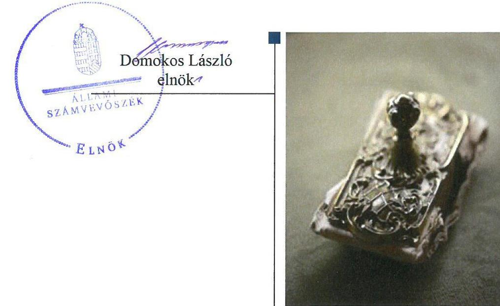
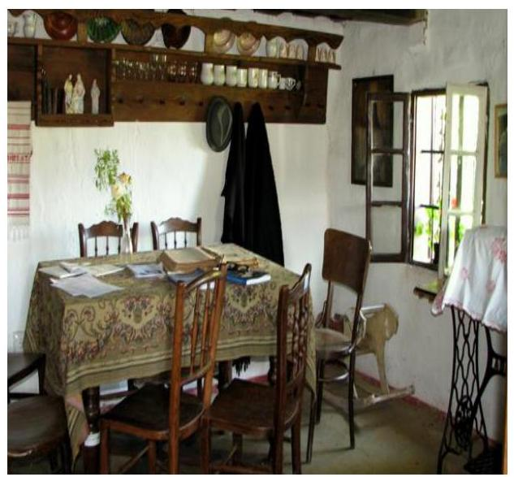
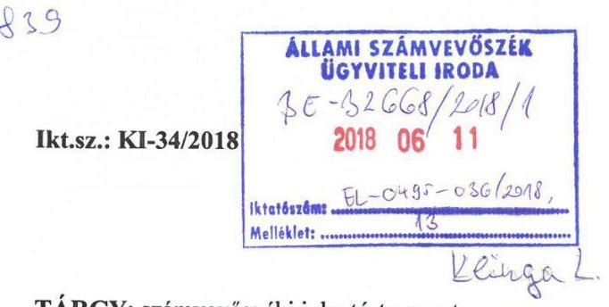
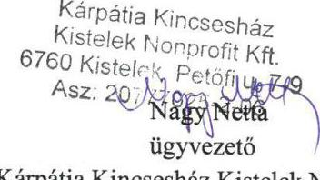
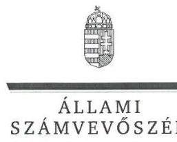
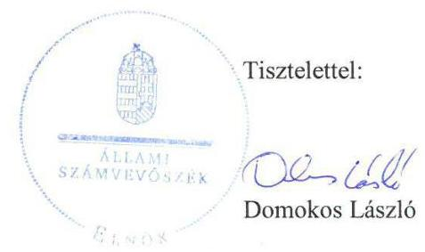
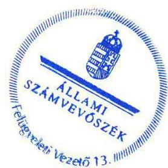

# Jelentés 

## Az önkormányzatok gazdasági társaságai

Az önkormányzatok többségi tulajdonában lévő gazdasági társaságok gazdálkodásának ellenőrzése - „Kárpátia Kincsesház Kistelek" Térségi Humán Innovációs, Oktatási és Közszolgáltató Közhasznú Nonprofit Kft. 2018.

---

# Jelentés 

## Az önkormányzatok gazdasági társaságai

Az önkormányzatok többségi tulajdonában lévő gazdasági társaságok gazdálkodásának ellenőrzése - „Kárpátia Kincsesház Kistelek" Térségi Humán Innovációs, Oktatási és Közszolgáltató Közhasznú Nonprofit Kft.
2018. 00. hó 00. nap

---

# AZ ELLENŐRZÉST FELÜGYELTE:

- **KLINGA LÁSZLÓ** felügyeleti vezető
- **AZ ELLENŐRZÉST VEZETTE ÉS A VÉGREHAJTÁSÁÉRT FELELŐS:**
  - **RÁCZKEVI KATALIN** ellenőrzésvezető
  - **A PROGRAM ÖSSZEÁLLÍTÁSÁÉRT FELELŐS:**
    - **TÓTPÁL SZABOLCS** osztályvezető

**IKTATÓSZÁM:** EL-0234-070/2018.

**TÉMASZÁM:** 2447

**ELLENŐRZÉS-AZONOSÍTÓ SZÁM:** V079392

Jelentéseink az Országgyűlés számítógépes hálózatán és az Interneten a www.asz.hu címen is olvashatóak.

---

# TARTALOMJEGYZÉK 

■ ÖSSZEGZÉS ..... 5
■ AZ ELLENŐRZÉS CÉLJA ..... 6
■ AZ ELLENŐRZÉS TERÜLETE ..... 7
■ AZ ELLENŐRZÉS HÁTTERE, INDOKOLTSÁGA ..... 8
■ A JELENTÉS LÉNYEGES KÉRDÉSKÖREI ..... 9
■ AZ ELLENŐRZÉS HATÓKÖRE ÉS MÓDSZEREI ..... 10
■ MEGÁLLAPÍTÁSOK ..... 12
■ JAVASLATOK ..... 15
■ MELLÉKLETEK ..... 17
I. sz. melléklet: Értelmező szótár ..... 17
■ FÜGGELÉK: ÉSZREVÉTELEK ..... 19
■ RÖVIDÍTÉSEK JEGYZÉKE ..... 29

---

.

---

# ÖSSZEGZÉS 

A „Kárpátia Kincsesház Kistelek" Térségi Humán Innovációs, Oktatási és Közszolgáltató Közhasznú Nonprofit Kft. feletti tulajdonosi joggyakorlás kialakításával és szabályszerű gyakorlásával Kistelek Városi Önkormányzat megteremtette a Társaság szabályszerű működésének feltételeit. A Társaság szabályozottsága, vagyongazdálkodási tevékenysége szabályszerű volt. A bevételeinek elszámolása megfelelt az előírásoknak, a ráfordítások elszámolása nem volt szabályszerű. Közzétételi kötelezettségének a Társaság nem tett eleget, ezzel a működés és a gazdálkodás átláthatóságát nem biztosította.

## Az ellenőrzés társadalmi indokoltsága

Magyarországon az intézménycentrikus közfeladat-ellátás jellemző, de egyre jelentősebb a költségvetésen kívüli feladatellátás térnyerése. Helyi szinten ennek legfontosabb szereplői az önkormányzati tulajdonban lévő gazdasági társaságok, amelyeknek ellenőrzése kiemelten fontos a közfeladat ellátása és a közvagyon megőrzése, megóvása érdekében. Ezért alapvető követelmény, hogy a társaságok gazdálkodása, működése szabályszerű és átlátható legyen. Az ellenőrzés rendet, a rend értéket teremt.

A Kistelek és térsége közművelődési feladatainak ellátásában meghatározó szerepet betöltő „Kárpátia Kincsesház Kistelek" Térségi Humán Innovációs, Oktatási és Közszolgáltató Közhasznú Nonprofit Kft. ellenőrzésére tevékenységének jellegére tekintettel került sor az Állami Számvevőszék Stratégiájában megfogalmazott célokkal összhangban.

## Főbb megállapítások, következtetések

A Kistelek Városi Önkormányzat a tulajdonosi joggyakorlás kereteit a szabályszerűen alakította ki, a Társaság feletti tulajdonosi jogokat szabályszerűen gyakorolta.

A Társaság a számviteli politika keretében előírt szabályzatokkal rendelkezett, azonban az ellenőrzött időszakban a Számv. tv. előírása ellenére számlarendet nem készített.

A 2013. és 2015. évi mérleg alátámasztásához a Társaság a Számv. tv. előírása ellenére nem készített olyan leltárt, amely tételesen és ellenőrizhető módon tartalmazta valamennyi eszközét és forrását mennyiségben és értékben. A 2014. és a 2016. évben a mérlegeket leltárral alátámasztották. Az értékcsökkenés elszámolása szabályszerű volt.

A Társaság bevételeinek elszámolása szabályszerű volt, az anyagjellegű ráfordítások elszámolását alátámasztó bizonylatok esetében a bizonylat megőrzési kötelezettségnek nem tett eleget, a személyi jellegű ráfordításokat bizonylatokkal nem támasztotta alá.

A Társaság a beszámolóit az ellenőrzött időszakban a jogszabályban előírt határidőben elkészítette és közzétette. A 2015. évi közhasznúsági mellékletet az előírásoknak megfelelően elkészítette és közzétette. A 2013-2014. évekre közhasznúsági melléklet nem készült, a 2016. évi közhasznúsági mellékletet nem tette közzé.

A közérdekű adatok közzétételére valamint a megismerésére irányuló kérelmek rendjére vonatkozó szabályzatot a Társaság nem készített. A közérdekű adatokra vonatkozó közzétételi kötelezettséget az ellenőrzött időszakban nem teljesítette, így a működés átláthatósága nem volt biztosított.

---

# AZ ELLENŐRZÉS CÉLJA 

AZ ELLENŐRZÉS CÉLJA annak értékelése volt, hogy az Önkormányzat a vagyongazdálkodási tevékenysége során szabályszerűen gyakorolta-e tulajdonosi jogait. A Társaság szabályozottsága, gazdálkodása és vagyongazdálkodási tevékenysége, bevételeinek és ráfordításainak elszámolása megfelelt-e a jogszabályi és tulajdonosi előírásoknak, a Társaság kötelezettségállománya jelentett-e kockázatot a működésre, valamint a gazdálkodás átláthatósága és elszámoltathatósága érdekében biztosítva volt-e a szolgáltatás díjának megalapozottsága szabályszerű önköltségszámítással.

---

# AZ ELLENŐRZÉS TERÜLETE 

## Kistelek Városi Önkormányzat és a kizárólagos tulajdonában lévő „Kárpátia Kincsesház Kistelek" Térségi Humán Innovációs, Oktatási és Közszolgáltató Közhasznú Nonprofit Kft.

KISTELEK VÁROSI ÖNKORMÁNYZAT Képviselő-testülete a „Kárpátia Kincsesház Kistelek" Térségi Humán Innovációs, Oktatási és Közszolgáltató Közhasznú Nonprofit Kft.-t 2000. augusztus 3-án alapította kizárólagos tulajdonosként a közművelődési feladatai ellátására. A Társaság ${ }^{1}$ jegyzett tőkéje 3,0 M Ft volt, ami az ellenőrzött időszakban nem változott.

## A „KÁRPÁTIA KINCSESHÁZ KISTELEK" TÉRSÉGI HUMÁN INNOVÁCIÓS, OKTATÁSI ÉS KÖZSZOLGÁLTATÓ KÖZHASZNÚ

NONPROFIT KFT. főtevékenysége az ellenőrzött időszakban ismeretterjesztő foglalkozások, szakkörök, kulturális és egyéb rendezvények tartása, kulturális programok szervezése, művelődési központ és helytörténeti gyűjtemény üzemeltetése volt, amelyek az Mötv. ${ }^{2}$ alapján közfeladatnak minősültek. A feladat-ellátást szolgáló ingatlanokat az Önkormányzat ${ }^{3}$ a Társaság ingyenes használatába adta, üzemeltetésük során a Társaság saját eszközeivel gazdálkodott, vagyonkezelt eszköze nem volt.

A Társaság jogszabály alapján könyvvizsgálatra nem volt kötelezett, azonban alapítói döntés alapján könyvvizsgáló működött.

Az Önkormányzat a feladatok ellátására 2013-ban 3,0 M Ft, 2014-ben 6,4 M Ft, 2015-ben 18,0 M Ft, 2016-ban 8,2 M Ft támogatási összeget folyósított a Társaság részére. Ezen kívül a Társaság 2013. évben ifjúsági ház kialakítására 19,8 M Ft, 2015-ben az Iskola a természetben címú TÁMOP4 ${ }^{4}$ projekt megvalósítására 273,2 M Ft pályázati forrást nyert el, továbbá közfoglalkoztatásra a 2014-2016. években összesen 7,8 M Ft költségvetési támogatást kapott.

A Polgármester ${ }^{5}$ és a Jegyző ${ }^{6}$ személye az ellenőrzött időszakban nem változott.

A Társaság nem tartozott a kormányzati szektorba sorolt egyéb szervezetek közé.

A Társaság a Számv.tv. ${ }^{7}$ előírásai alapján mentesült az önköltségszámítási szabályzat készítésének kötelezettsége alól.

Az Ügyvezető ${ }^{8}$ személye 2007. június 16. napjától változatlan. A foglalkoztatottak száma 2013. évben 5 fő, 2016. évben 9 fő volt.

---

# AZ ELLENŐRZÉS HÁTTERE, INDOKOLTSÁGA 

Az önkormányzatok többségi tulajdonában álló gazdasági társaságok ellenőrzése kiemelten fontos a vagyon megőrzése, megóvása érdekében. Alapvető követelmény, hogy gazdálkodásuk, működésük szabályszerű, és az általuk szolgáltatott adatok megbízhatóak legyenek. A feladatellátás költségeinek, ráfordításainak alakulása a lakosság széles rétegét érinti.

Az ÁSZ ${ }^{9}$ ellenőrzései feltárhatják, hogy az Önkormányzat a feladatellátásához rendelt vagyon működtetését a tulajdonostól elvárható gondossággal végezte-e, a feladatot ellátó Társasággal a létesítő okiratban, szolgáltatási szerződésben foglaltakat betartatta-e, a Társaság betartotta-e.

Az ellenőrzés eredményeképp meghatározhatóvá válnak a költségvetési hiányt befolyásoló szervezetek kockázatai, lehetővé válik ezen kockázatok csökkentése. Az ellenőrzés rávilágíthat arra, hogy a gazdasági társaság a vagyon használatával biztosította-e a szolgáltatás folytatásának feltételeit, az önkormányzat tulajdonosi felügyelete hozzájárult-e a szabályszerű gazdálkodáshoz és feladatellátáshoz. A megállapítások alapján megfogalmazott számvevőszéki javaslatok hasznosítása elősegítheti a meglévő hibák megszüntetését. A jó gyakorlatok bemutatásával az ÁSZ hozzájárulhat a követendő megoldások megismertetéséhez, terjesztéséhez.

---

# A JELENTÉS LÉNYEGES KÉRDÉSKÖREI 

1. Az Önkormányzat tulajdonosi joggyakorlása szabályszerű volt-e?
2. A Társaság szabályozottsága, bevételeinek, ráfordításainak elszámolása és vagyongazdálkodási tevékenysége szabályszerű volt-e?

---

# AZ ELLENŐRZÉS HATÓKÖRE ÉS MÓDSZEREI 

## Az ellenőrzés típusa

Megfelelőségi ellenőrzés.

## Az ellenőrzött időszak

Az ellenőrzött időszak 2013. január 1-jétől 2016. december 31-ig tartott.

## Az ellenőrzés tárgya

Kistelek Városi Önkormányzat tulajdonosi joggyakorlása, valamint a „Kárpátia Kincsesház Kistelek" Térségi Humán Innovációs, Oktatási és Közszolgáltató Közhasznú Nonprofit Kft. gazdálkodásának szabályozottsága és szabályszerűsége.

Az ellenőrzés kiterjedt minden olyan körülményre és adatra, amely az ÁSZ jogszabályban meghatározott feladatainak teljesítéséhez, valamint a program végrehajtása folyamán felmerült újabb összefüggések feltárásához szükséges.

## Az ellenőrzött szervezet

Kistelek Városi Önkormányzat és a „Kárpátia Kincsesház Kistelek" Térségi Humán Innovációs, Oktatási és Közszolgáltató Közhasznú Nonprofit Kft.

## Az ellenőrzés jogalapja

Az ellenőrzés jogszabályi alapját az ÁSZ tv. ${ }^{10}$ 1. § (3) bekezdése és 5. § (3)(4)-(5) bekezdései képezték.

## Az ellenőrzés módszerei

Az ellenőrzést a nemzetközi standardokat irányadónak tekintve az ellenőrzési program ellenőrzési kérdései, az ellenőrzött időszakban hatályos jogszabályok, az ellenőrzés szakmai szabályok és módszertanok figyelembe vételével végeztük.

Az ellenőrzés ideje alatt az ellenőrzött szervezettel történő kapcsolattartást az ÁSZ Szervezeti és Működési Szabályzatának vonatkozó előírásai alapján biztosítottuk.

---

Az ellenőrzési kérdések megválaszolásához szükséges bizonyítékok megszerzése a következő ellenőrzési eljárások alkalmazásával történt: megfigyelés, kérdésfeltevés (információkérés), összehasonlítás, valamint elemzés. Az ellenőrzési bizonyítékként felhasználható adatforrások közé tartoztak egyrészt az ellenőrzési programban felsorolt adatforrások, másrészt adatforrás minden - az ellenőrzés során - feltárt, az ellenőrzés szempontjából információkat tartalmazó dokumentum.

Az ellenőrzést a kérdésekre adott válaszok kiértékelésével, valamint a megjelölt adatforrások, a csatolt tanúsítványok felhasználásával, továbbá az adott időszakban hatályos jogszabályok figyelembe vételével folytattuk le.

A bevételek és a személyi jellegű ráfordítások terén a szabályszerű működést véletlen mintavétellel ellenőriztük, a vagyonnyilvántartás terén tételes ellenőrzés történt. Az anyagjellegű és egyéb ráfordítások elszámolására az ellenőrzött gazdasági társaság adatokat nem szolgáltatott. A jogszabályoknak és a belső előírásoknak megfelelőnek, azaz szabályszerűnek tekintettük a mintavétellel ellenőrzött területet, amennyiben a minta ellenőrzésének eredménye alapján 95%-os bizonyossággal a teljes sokaságban a hibaarány kisebb volt, mint 10%, nem megfelelőnek értékeltük, ha a hibaarány a 10%-ot meghaladta.

---

# 1. Az Önkormányzat tulajdonosi joggyakorlása szabályszerű volt-e? 

Összegző megállapítás

A tulajdonosi joggyakorlás kereteit az Önkormányzat szabályszerűen kialakította, a tulajdonosi jogokat szabályszerűen gyakorolta a Társaság felett.

AZ ÖNKORMÁNYZAT az ellenőrzött időszakban rendelkezett az Mötv. 116. § (1) bekezdése előírásának megfelelő - a Társaság által ellátott közművelődési feladatokat tartalmazó - gazdasági programmal.

A TULAJDONOSI JOGGYAKORLÁS KERETEIT a Társaság Alapító okiratában ${ }^{11}$, a Vagyongazdálkodási rendeletben ${ }^{12}$, a Közművelődési megállapodás ${ }_{1,2}{ }^{13}$-ban, valamint a Támogatási szerződés ${ }_{1-4}{ }^{14}$-ben egymással összhangban meghatározták. Az Önkormányzat a Közművelődési megállapodás ${ }_{1,2}$-ban, valamint a Támogatási szerződés ${ }_{1-4}$-ben a tervezés, a beszámolás és a szolgáltatás ellátását biztosító rendelkezéseket rögzítette. Az Önkormányzat a feladatellátásra átadott önkormányzati pénzeszközök felhasználásáról a Társaságot elszámoltatta.

A Társaságnál az ellenőrzött időszakban 3 tagú FB${ }^{15}$ működött. Az FB által 2013. január 2-án megállapított ügyrendet az Alapító ${ }^{16}$ a Gt. ${ }^{17}$ előírásainak megfelelően jóváhagyta. Az FB tagokat az Alapító határozott időre választotta, azonban megbízatásuk folytonosságát nem biztosították, mert az FB tagok 2013. január 1. és 2013. június 28. között a Gt. 141. § (2) bekezdésében előírtak, illetve 2016. június 29. és 2016. november 16. között a Ptk. ${ }^{18}$ 3:26. § (1) bekezdésében előírtak ellenére az Alapító megbízásával nem rendelkeztek.

A BESZÁMOLÓK ELFOGADÁSA az ellenőrzött időszakban a jogszabályi előírások alapján történt, az Alapító az FB és a könyvvizsgáló írásbeli jelentésének birtokában döntött.

A Közművelődési törvény ${ }^{19}$ 77. §-ának hatályos előírása alapján az Önkormányzat 2000. június 5-én megalkotta közművelődési rendeletét, amelyben a díjköteles szolgáltatások körét és a díjak megállapításához szükséges paramétereket meghatározta. Üzleti terv készítési kötelezettséget az Alapító nem írt elő Társaság részére, azonban a Társaság az ellenőrzött években elkészítette és az Alapító jóváhagyta az üzleti terveket.

Az Alapító a Taktv. ${ }^{20}$ 5. § (3) bekezdésében előírt kötelezettsége ellenére a vezető tisztségviselők, FB tagok, valamint az Mt. 208. §-ának hatálya alá eső munkavállalók javadalmazása,
 valamint a jogviszony megszűnése esetére biztosított juttatások módjának, mértékének elveiről, annak rendszeréről szabályzatot nem alkotott.

---

# 2. A Társaság szabályozottsága, bevételeinek, ráfordításainak elszámolása és vagyongazdálkodási tevékenysége szabályszerű volt-e? 

Összegző megállapítás

2.1. számú megállapítás

A Társaság számviteli szabályozottsága megfelelt a jogszabályi követelményeknek. A Társaság bevételeinek elszámolása és vagyongazdálkodása szabályszerű volt. A személyi jellegű ráfordítások elszámolása nem volt szabályszerű. A közérdekű adatok közzétételi kötelezettségének nem tett eleget.

A Társaság a számviteli politika keretében előírt szabályzatokkal rendelkezett, azonban számlarendet nem készített. Bevételei elszámolása szabályszerű volt, a személyi jellegű ráfordítások elszámolása nem volt szabályszerű.

A számviteli politikát ${ }^{21}$, valamint annak keretében a Leltározási szabályzatot ${ }^{22}$, az Értékelési szabályzatot ${ }^{23}$, valamint a Pénzkezelési szabályzatot ${ }^{24}$ az ellenőrzött időszakra vonatkozóan Társaság a Számv. tv. előírásainak megfelelően elkészítette.

A Társaság a Számv. tv. 161. § (1) bekezdés előírása ellenére az ellenőrzött időszakra vonatkozóan számlarendet nem készített, ezáltal a könyvvezetés a Számv.tv.-ben előírt beszámoló készítését maradéktalanul nem biztosította.

A Társaság ügyvezetője az Alapító okirat 8.1. pontjában foglalt előírás ellenére nem készítette el a Társaság szervezeti és működési szabályzatát.

A bevételek elszámolása az ellenőrzött időszakban szabályszerű volt.

Az anyagjellegű ráfordítások elszámolása során a Társaság a 2013-2016. években az 52. és 53. főkönyvi számlacsoport tekintetében a könyvviteli elszámolást közvetetten alátámasztó számviteli bizonylatokkal nem rendelkezett, így a Számv. tv. 169. § (2) bekezdésében előírt bizonylat megőrzési kötelezettségének nem tett eleget.

A személyi jellegű ráfordítások elszámolása nem felelt meg a Számv. tv. 165. § (1) bekezdésében foglalt bizonylati elvre és bizonylati fegyelemre vonatkozó előírásoknak, mert a gazdasági események nem voltak bizonylattal (munkaszerződés, munkaszerződés módosítása, igazolt jelenléti ív, szabadságengedély, táppénzes igazolás, teljesítésigazolás) alátámasztva.

A Társaság a 2015-2016. években a béren kívüli juttatásokhoz kapcsolódó adófizetési kötelezettség megállapítása során nem tartotta be az Szja tv. ${ }^{25}$ 71. § (4) bekezdésében előírtakat, mivel az étkezési utalvány juttatás esetében nem állt rendelkezésére a munkavállalóknak adott juttatásra vonatkozó nyilatkozata.

---

2.2. számú megállapítás

A Társaság vagyongazdálkodása szabályszerű volt, vagyonnyilvántartása megfelelt az előírásoknak. A 2013. és 2015. évi beszámolót nem támasztotta alá leltárral, a 2014. és 2016. évi mérlegbeszámolók megfeleltek az előírásoknak.

A Társaság a 2013. évi mérlegének „Tárgyi eszközök" sorához a Számv. tv. 69. § (1) bekezdés előírása ellenére nem állított össze olyan leltárt, amely tételesen és ellenőrizhető módon tartalmazta valamennyi, a mérleg fordulónapján meglévő eszközközeit mennyiségben és értékben, mert beruházások állományát a Leltározási szabályzat; I. 4. pontjának előírása ellenére nem leltározták.

A 2015. évben a pénzkészlet tekintetében az analitikus és a főkönyvi nyilvántartás közötti egyeztetést nem végezték el. A Társaság mérlegének „Pénzeszközök" mérlegsora a Számv. tv. 69. § (2) bekezdés előírása ellenére a számviteli nyilvántartás szerinti értéket és nem a felvett leltár szerinti értékadatot tartalmazta.

A könyvvizsgáló a 2013. és a 2015. évben a leltárral kapcsolatos hiányosságok ellenére korlátozás nélküli hitelesítő záradékot adott ki.

A beszámolók mérlegtételeit a 2014. és a 2016. években szabályszerű leltárral alátámasztották.

A vagyonnyilvántartása megfelelt az előírásoknak. Az értékcsökkenési leírás elszámolása a jogszabálynak és a belső előírásoknak megfelelt.
2.3. számú megállapítás

A Társaság egyszerűsített éves beszámolóit határidőben letétbe helyezte és közzétette. A közhasznúsági mellékleteit a 2015. évi kivételével nem tette közzé. Közérdekű adatainak közzétételéről nem gondoskodott.

A beszámolókat a Számv. tv.-ben előírt határidőben letétbe helyezték és közzétették.

Közhasznúsági mellékletet a Társaság a 2013. és 2014. években nem készített, valamint a 2016. évit nem tette közzé, ezáltal megsértette a Civil tv. ${ }^{26}$ 46. § (1) bekezdését. 2015. évre a közhasznúsági mellékletet szabályszerűen elkészítette és közzétette.

A közérdekű adatok megismerésére irányuló igények teljesítésének rendjét tartalmazó szabályzatot a Társaság az Infotv. ${ }^{27}$ 30. § (6) bekezdésében foglalt előírás ellenére nem készített. A Társaság az Infotv. 35. § (1)-(2) bekezdései szerinti kötelezettség teljesítésének részletes szabályait az Infotv. 35. § (3) bekezdésében előírtakkal ellentétben belső szabályzatban nem állapította meg.

Az Infotv. 37. § (1) bekezdésében előírtak ellenére az előírt közérdekű adatokat nem tette közzé a honlapján.

A Taktv. 2. § (1) bekezdésében meghatározott, a vezető tisztségviselőkre, FB tagokra, illetve a bankszámla feletti rendelkezésre jogosult munkavállalókra vonatkozó közérdekű adatokat nem tette közzé.

---

# JAVASLATOK 

Az ÁSZ tv. 33. § (1) bekezdésében foglaltak értelmében az ellenőrzött szervezet vezetője köteles a jelentésben foglalt megállapításokhoz kapcsolódó intézkedési tervet összeállítani és azt a jelentés kézhezvételétől számított 30 napon belül az ÁSZ részére megküldeni. Amennyiben az ellenőrzött szervezet vezetője nem küldi meg határidőben az intézkedési tervet, vagy továbbra sem elfogadható intézkedési tervet küld, az Állami Számvevőszék elnöke az ÁSZ tv. 33. § (3) bekezdése a) és b) pontjaiban foglaltakat érvényesítheti.

## „Kárpátia Kincsesház Kistelek" Térségi Humán Innovációs, Oktatási és Közszolgáltató Közhasznú Nonprofit Társaság ügyvezetőjének

1. Intézkedjen a Számv.tv.-ben foglaltaknak megfelelően a számlarend elkészítéséről.
(2.1. sz. megállapítás 2. bekezdése alapján)
2. Intézkedjen a szervezeti és működési szabályzat elkészítéséről az Alapító okirat előírásainak megfelelően.
(2.1. sz. megállapítás 3. bekezdése alapján)
3. Intézkedjen az anyagjellegű ráfordítások elszámolását alátámasztó számviteli bizonylatokra vonatkozó, Számv.tv.-ben előírt megőrzési kötelezettség teljesítéséről.
(2.1. sz. megállapítás 5. bekezdése alapján)
4. Intézkedjen a személyi jellegű ráfordítások Számv.tv.-ben előírtaknak megfelelő bizonylattal történő alátámasztásáról.
(2.1. sz. megállapítás 6. bekezdése alapján)
5. Intézkedjen a béren kívüli juttatásokhoz kapcsolódó adófizetési kötelezettség Szja tv. szerinti megállapításáról.
(2.1.sz. megállapítás 7. bekezdése alapján)
6. Intézkedjen a közhasznúsági melléklet közzétételéről a Civil tv.-ben előírtaknak megfelelően.
(2.3. sz. megállapítás 2. bekezdés 1. mondat 2. tagmondata alapján)

---

7. Intézkedjen a közérdekű adatok megismerésére irányuló igények teljesítése rendjét rögzítő szabályzatok elkészítéséről az Infotv. előírásainak megfelelően.
(2.3. sz. megállapítás 3. bekezdés 1. mondata alapján)
8. Intézkedjen az Infotv.-ben előírt kötelezettség teljesítése részletes szabályainak belső szabályzatban történő megállapításáról.
(2.3. sz. megállapítás 3. bekezdés 2. mondata alapján)
9. Gondoskodjon az Infotv.-ben előírtak szerint a Társaság honlapján a közérdekű adatok közzétételéről.
(2.3. sz. megállapítás 4. bekezdése alapján)
10. Intézkedjen a Taktv.-ben meghatározott, vezető tisztségviselőkre, felügyelőbizottsági tagokra, illetve a bankszámla feletti rendelkezésre jogosult munkavállalókra vonatkozó közérdekű tartalmak közzétételéről.
(2.3. sz. megállapítás 5. bekezdése alapján)

# Kistelek Városi Önkormányzat polgármesterének 

1. Kezdeményezze a legfőbb szervnél (Képviselő-testület) a Társaság vezető tisztségviselői, a felügyelőbizottsági tagok, valamint az Mt. 208. §-ának hatálya alá eső munkavállalók javadalmazására, valamint a jogviszony megszűnése esetére biztosított juttatások módjának, mértékének elveire, annak rendszerére vonatkozó szabályzat megalkotását.
(1. sz. megállapítás 6. bekezdése alapján)

---

# MELLÉKLETEK 

- I. SZ. MELLÉKLET: ÉRTELMEZŐ SZÓTÁR
gazdasági társaság
közfeladat
nonprofit gazdasági társaság
tulajdonosi joggyakorló

A Ptk. 3:88. § (1) bekezdése szerint „a gazdasági társaságok üzletszerű közös gazdasági tevékenység folytatására, a tagok vagyoni hozzájárulásával létrehozott, jogi személyiséggel rendelkező vállalkozások, amelyekben a tagok a nyereségből közösen részesednek, és a veszteséget közösen viselik".
Jogszabályban meghatározott állami vagy önkormányzati feladat, amit a feladat címzettje közérdekből, haszonszerzési cél nélkül, jogszabályban meghatározott követelményeknek és feltételeknek megfelelve végez, ideértve a lakosság közszolgáltatásokkal való ellátását, valamint e feladatok ellátásához szükséges infrastruktúra biztosítását is; (Civil tv 2.§ 19. pont, hatályos 2014. december 31-ig)
Az Áht. ${ }^{28}$ 2015. január 1-jétől hatályos 3/A. §-a szerint közfeladat a jogszabályban meghatározott állami vagy önkormányzati feladat, melynek ellátása költségvetési szervek alapításával és működtetésével vagy az azok ellátásához szükséges pénzügyi fedezet e törvényben meghatározott eszközökkel, részben vagy egészben történő biztosításával valósul meg, az ellátásában államháztartáson kívüli szervezet jogszabályban meghatározott rendben közreműködhet.
A gazdasági társaság nem jövedelemszerzésre irányuló közös gazdasági tevékenység folytatására is alapítható (nonprofit gazdasági társaság). Nonprofit gazdasági társaság bármely társasági formában alapítható és működtethető. A gazdasági társaság nonprofit jellegét a gazdasági társaság cégnevében a társasági forma megjelölésénél fel kell tüntetni. Nonprofit gazdasági társaság üzletszerű gazdasági tevékenységet csak kiegészítő jelleggel folytathat, a gazdasági társaság tevékenységéből származó nyereség a tagok (részvényesek) között nem osztható fel, az a gazdasági társaság vagyonát gyarapítja. (Gt. 4. § (1), (3) bekezdés, hatályos 2014. március 15-ig)
A Cégtv. ${ }^{29}$ 9/F. § (2) bekezdése szerint „az a gazdasági társaság minősül nonprofit gazdasági társaságnak és cégnevében az a gazdasági társaság tüntetheti fel a nonprofit jelleget, amelynek létesítő okirata tartalmazza, hogy a gazdasági társaság tevékenységéből származó nyereség a tagok között nem osztható fel, hanem az a gazdasági társaság vagyonát gyarapítja."
Tulajdonosi joggyakorló, aki a nemzeti vagyon felett az államot vagy a helyi önkormányzatot megillető tulajdonosi jogok és kötelezettségek összességének gyakorlására jogosult. (Nvtv. ${ }^{30}$ 3. § (1) bekezdés 17. pontja)

---

.

---

# FÜGGELÉK: ÉSZREVÉTELEK 

A jelentéstervezetet a Számvevőszék 15 napos észrevételezésre megküldte az ellenőrzött szervezetek vezetőinek az ÁSZ tv. 29. § (1) bekezdése előírásának megfelelően.

Kistelek Városi Önkormányzat polgármestere az ÁSZ tv 29. § (2) bekezdésében foglalt észrevételezési jogával nem élt, a jelentéstervezetre észrevételt nem tett. A „Kárpátia Kincsesház Kistelek" Térségi Humán Innovációs, Oktatási és Közszolgáltató Közhasznú Nonprofit Kft. ügyvezetőjének észrevételét és az arra adott választ a függelék tartalmazza.

[^0]
[^0]:    * 29. § (1) Az Állami Számvevőszék az ellenőrzési megállapításait megküldi az ellenőrzött szervezet vezetőjének vagy az általa megbízott személynek, és annak, akinek személyes felelősségét állapította meg.
    (2) Az ellenőrzött szervezet vezetője és a felelősként megjelölt személy az ellenőrzés megállapításaira tizenöt napon belül írásban észrevételt tehet.
    (3) Az Állami Számvevőszék az észrevételre a beérkezésétől számított harminc napon belül írásban válaszol. A figyelembe nem vett észrevételeket köteles a jelentésben feltüntetni, és megindokolni, hogy azokat miért nem fogadta el.

---

# ÁLLAMI SZÁMVEVŐSZÉK 

DOMOKOS LÁSZLÓ
elnök

Budapest 4.
pf.: 54
1364

TÁRGY: számvevőszéki jelentéstervezet észrevételezése
ÁSz iktatószám: EL-0495-034/2018.

## Tisztelt Elnök Úr!

Alulírott Nagy Netta, mint a Kárpátia Kincsesház Kistelek Térségi Humán Innovációs, Oktatási és Közszolgáltató Közhasznú Nonprofit Kft. ügyvezetője az alábbi

## észrevételt

terjesztem elő „Az önkormányzatok többségi tulajdonában lévő gazdasági társaságok gazdálkodásának ellenőrzése" keretében a Kárpátia Kincsesház Kistelek Térségi Humán Innovációs, Oktatási és Közszolgáltató Közhasznú Nonprofit Kft-nél lefolytatott ellenőrzés eredményeként készült jelentéstervezet egyes megállapításaira:

## 1. számú (összegző) megállapítás:

> Az Alapító a Taktv. 5.§ (3) bekezdésében előírt kötelezettsége ellenére a vezető tisztségviselők, FB tagok, valamint az Mt. 208. §-ának hatálya alá elő munkavállalók javadalmazása, valamint a jogviszony megszűnése esetére biztosított juttatások módjának, mértékének elveiről, annak rendszeréről szabályzatot nem alkotott.

## Észrevétel:

Kistelek Városi Önkormányzat Képviselő-testülete 2018. április 11-én tartott ülésén kizárólagos tulajdonában álló gazdasági társaságok Javadalmazási szabályzatát, mely szabályzat hatálya annak II. pontjában külön nevesítve is - kiterjed a Kárpátia Kincsesház Kistelek Térségi Humán Innovációs, Oktatási és Közszolgáltató Közhasznú Nonprofit Korlátolt Felelősségű Társaságra. A tárgybéli határozat, valamint szabályzat másolati példánya az észrevétel mellékleteként csatolásra kerül.
> Az FB tagokat az Alapító határozott időre választotta, azonban megbízatásuk folytonosságát nem biztosították, mert az FB tagok 2013. január 1-június 28. között a Gt. 141. § (2) bekezdésében előírtak, illetve 2016. június 29-november 16. között a Ptk. 3:26 § (1) bekezdésében előírtak ellenére az Alapító megbízásával nem
 rendelkeztek.

---

# A) 

A Felügyelő Bizottság tagjai feladatukat a 2013. január 1-június 28., továbbá a 2016. június 29-november 16. között időszakban is változatlanul ellátták. Amint a Képviselő-testület döntött megválasztásukról, a változás a cégbíróságnál is bejegyzésre került.

### 2.1. számú megállapítás:

> A Társaság a Számv. tv. 161. § (1) bekezdés előírása ellenére az ellenőrzött időszakra vonatkozóan számlarendet nem készített, ezáltal a könyvvezetés a Számv. tv-ben előírt beszámoló készítését maradéktalanul nem biztosította.

## Észrevétel:

A hiányzó számlarend elkészíttetésének megkezdéséről az ügyvezető gondoskodott.
> A Társaság ügyvezetője az Alapító okirat 8.1. pontjában foglalt előírás ellenére nem készített el a Társaság szervezeti és működési szabályzatát.

## Észrevétel:

Az ügyvezető elkészítette a Társaság Szervezeti és Működési Szabályzatát (továbbiakban SZMSZ) és Kistelek Város Jegyzőjének továbbította, a soron következő Képviselő-testületi ülésen történő előterjesztésre, valamint az Alapító által történő jóváhagyásra. Az SZMSZ tervezet közzétételre került a www.kistelek.hu weboldalon.(Lásd: Önkormányzat - Dokumentumtár Kárpátia Kincsesház menüjében.)
Az szabályzat tervezet másolati példánya az észrevétel mellékleteként csatolásra kerül.
> Az anyagi jellegű ráfordítások elszámolása során a Társaság a 2013-2016. években az 52. és 53. főkönyvi számlacsoport tekintetében a könyvviteli elszámolást közvetetten alátámasztó számviteli bizonylatokkal nem rendelkezett, így a Számv. tv. 169.§ (2) bekezdésében előírt bizonylat megőrzési kötelezettségének nem tett eleget.

## Észrevétel:

A Számvevőszéktől kapott hivatalos levelek alapján értelmezésem szerint könyvviteli elszámolást közvetetten alátámasztó, és részletező számviteli bizonylatokat a Tisztelt Számvevőszék mintavételezés keretében három dokumentumcsoportban (Bevételek, Személyi jellegű ráfordítások, és Eszközök) kért, 2018. január 8-án kelt, EL-0234-044/2017 iktatószámú levelében. Az anyag jellegű ráfordítások elszámolásával kapcsolatban kért közvetett számviteli bizonylatok valószínűleg elkerülték figyelmünket. Természetesen az 52. és 53. főkönyvi számlacsoporthoz tartozó ráfordítások bizonylatai a könyvelésben rendelkezésre állnak.
Az 52. és 53. főkönyvi számlacsoporthoz tartozó főkönyvi kartonokat jelen észrevételhez csatoljuk.
> A személyi jellegű ráfordítások elszámolása nem felelt meg a Számv. tv. 165. § (1) bekezdésében foglalt bizonylatelv és bizonylatfegyelemre vonatkozó előírásoknak, mert a gazdasági események nem voltak bizonylattal (munkaszerződés, munkaszerződés módosítása, igazolt jelenléti ív, szabadságengedély, táppénzes igazolás, teljesítésigazolás) alátámasztva.

## Észrevétel:

A Tisztelt Számvevőszék megállapítása azt a látszatot kelti, mintha a Társaság a foglalkoztatással és a személyi jellegű ráfordításokkal kapcsolatos bizonylatokat nem készítette volna el. A

---

Számvevőszék 2018. január 8-án kelt, EL-0234-044/2017 iktatószámú levelében 5 napos határidőt adott 125 mintatétel komplett dokumentációjának feltöltésére. Az ügyvezető betegsége, és az ügyintéző külföldi tartózkodása miatt kérelmeztük a határidő meghosszabbítását, eredménytelenül, így a fenti dokumentumokat egy nap alatt gyűjtöttük ki az írattárból, szkenneltük, és töltöttük fel az ÁSZ adatbázisába. A „teljességi nyilatkozatban" jeleztük, a körülményekhez képest igyekeztünk teljesíteni az előírt adatszolgáltatást, ami azonban nem teljes. Munkaszerződések, munkaszerződés módosítások, jelenléti ívek, szabadságengedélyek, táppénzes igazolások, teljesítésigazolások, ha hiányosan is, de benyújtásra kerültek, és a Társaság könyvelési dokumentumai között rendelkezésre állnak.
Kérjük megjelölni, hogy mikor, és milyen formában tudjuk a rendelkezésükre bocsátani.
> A Társaság a 2015-2016. években a béren kívüli juttatásokhoz kapcsolódó adófizetési kötelezettség megállapítása során nem tartotta be az Szja tv. 71. § (4) bekezdésében előírtakat, mivel az étkezési utalvány juttatás esetében nem állt rendelkezésre a munkavállalóknak adott juttatásra vonatkozó nyilatkozata.

# Észrevétel: 

A munkavállalók étkezési utalvány juttatásra vonatkozó nyilatkozatát a vonatkozó időszakra, jelen észrevétel mellékleteként csatoljuk.

### 2.2. számú megállapítás:

## A Társaság

> A Társaság a 2013. évi mérlegének „Tárgyi eszköz" sorához a Számv. tv. 69.§ (1) bekezdés előírása ellenére nem állított össze olyan leltárt, amely tételesen és ellenőrizhető módon tartalmazta valamennyi, a mérleg fordulónapján meglévő eszközeit mennyiségben és értékben, mert beruházások állományát a Leltározási szabályzat; I.4. pontjának előírása ellenére nem leltározták.

## Észrevétel:

2013. évben az épülő Ifjúsági Ház (15.115.444.-Ft összegben) beruházás befejezetlen beruházásként került feltüntetésre. Ez nyilatkozatban rögzítésre került. A beruházás befejezését követően 2014.07.14-én került aktiválásra.
A nyilatkozat másolata az észrevétel mellékleteként csatolásra kerül.
> A 2015. évben a pénzkészlet tekintetében az analitikus és főkönyvi nyilvántartás közötti egyeztetést nem végezték el. A Társaság mérlegének „Pénzeszközök" mérlegsora a Számv. tv. 69§ (2) bekezdés előírása ellenére a számviteli nyilvántartás szerinti értéket és nem a felvett leltár szerinti értékadatot tartalmazta.

## Észrevétel:

A 2015. december 31-én kelt Pénztárjelentésen mutatkozó - 125.000 forintos egyenleg a pénztárprogram kezeléséből adódik, az utolsó bevételi tétel a bevételezést követően, címletenként nem lett hozzárendelve a pénztárban lévő pénzösszeghez, így az a jelentésen hiányként mutatkozott. Az adminisztrációs hiba észlelésekor megszámolásra került a kasszában lévő pénzmennyiség, hiány nem keletkezett. Erről feljegyzés készült. A főkönyvi nyilvántartásba a pénztárban (kasszában) lévő valós pénzmennyiség került feltüntetésre.
A feljegyzés másolata az észrevétel mellékleteként csatolásra kerül.

---

> A könyvvizsgáló a 2013. és a 2015. évben a leltárral kapcsolatos hiányosságok ellenére korlátozás nélküli hitelesítő záradékot adott ki.

# Észrevétel: 

A 2013. és 2015. évi leltárak a mérlegkészítéskor elkészültek. A könyvvizsgálat részére értelemszerűen a vizsgálat során átadásra kerültek.
A leltárakat mellékletként csatoljuk az észrevételekhez.

## 2.3. számú megállapítás

> A Társaság 2013-2014. évi beszámolóinak kiegészítő mellékletei nem feleltek meg a Számv. tv. 93.§ (3) bekezdésében előírtaknak, mert azok nem tartalmazták a végleges jelleggel folyósított támogatásokat, azok elszámolásait, a támogatások jogcímenkénti felhasználását, a rendelkezésre álló összeg megbontásban. Az ellenőrzés további éveiben a kiegészítő mellékletek tartalma megfelelő volt.

## Észrevétel:

Az egyszerűsített éves beszámoló kiegészítő mellékletének tartalmát a számviteli törvény 96. § (4) írja elő. Ez a pont nem tartalmazza a $93 \S$ (3) bekezdést.
> Közhasznúsági mellékletet a Társaság a 2013. és 2014. években nem készített, valamint a 2016. évit nem tette közzé, ezáltal megsértette a Civil tv. 46.§ (1) bekezdését. 2015. évre a közhasznúsági mellékletet szabályszerűen elkészítette és közzétette.

## Észrevétel:

A könyvvizsgálat rendelkezésére bocsátottuk a vizsgálat során a 2016. évi közhasznúsági mellékletet. Kezdeményeztük az http://c-beszamolo.im.gov.hu/kozzetetel fajekoztatast/avitas oldalon történő feltöltését, azonban az ott kapott tájékoztatás szerint a beszámoló mellékleteinek pótlólagos feltöltésére, csak kivételes esetekben és jogszabály alapján, a 11/2009. (IV.28.) IRM-MeHVM-PM egy. rendelet 3.§. (8) bekezdés által előírt esetekben van lehetőség.
A Tisztelt Számvevőszék utasítására ismételten megkíséreljük a feltöltést.
A 2013. és 2014. évre vonatkozó közhasznúsági mellékleteket elkészítettük és a www.kistelek.hu weboldalon közzétettük. (Önkormányzat - Dokumentumtár - Kárpátia Kincsesház Egyszerűsített éves beszámoló 2013.,2014.)
> A közérdekű adatok megismerésére irányuló igények teljesítésének rendjét tartalmazó szabályzatot a Társaság az Infotv. ${ }^{27}$ 30.§ (6) bekezdésében foglalt előírás ellenére nem készített. A Társaság az Infotv. 35.§ (1)-(2) bekezdései szerinti kötelezettség teljesítésének részletes szabályait az Infotv. 35.§ (3) bekezdésében előírtakkal ellentétben belső szabályzat nem állapította meg.

## Észrevétel:

Az ügyvezető elkészítette a Társaság Közzétételi Szabályzatát és Kistelek Város Jegyzőjének továbbította, a soron következő Képviselő-testületi ülésen történő előterjesztésre, valamint az Alapító által történő jóváhagyásra. Az Közzétételi Szabályzat tervezet közzétételre került a www.kistelek.hu weboldalon. (Önkormányzat - Dokumentumtár - Kárpátia Kincsesház Közzétételi szabályzat)
Az szabályzat tervezet másolati példánya az észrevétel mellékleteként csatolásra kerül.
> Az Infotv. 37.§ (1) bekezdésében előírtak ellenére az előírt közérdekű adatokat nem tette közzé a honlapján.

---

# Észrevétel: 

Az ügyvezető a fenti közérdekű adatok közzétételéről a www.kistelek.hu weboldalra történő feltöltéssel gondoskodott. (Önkormányzat - Közérdekű adatok - Kárpátia Kincsesház)
> A Taktv. 2.§ (1) bekezdésében meghatározott, vezető tisztségviselőkre, FB tagokra, illetve bankszámla feletti rendelkezésre jogosult munkavállalókra vonatkozó közérdekű adatokat nem tette közzé.

## Észrevétel:

Az ügyvezető a fenti közérdekű adatok közzétételéről a www.kistelek.hu weboldalra történő feltöltéssel gondoskodott. (Önkormányzat - Közérdekű adatok - Kárpátia Kincsesház)

Kérem Tisztelt Elnök Urat a fenti észrevételek figyelembevételére a végleges jelentés kialakítása során.

Amennyiben a fentebb írottakon túl további információkra van szükségük, úgy e tekintetben állok rendelkezésükre.
Egyebekben megköszönöm Elnök Úr, valamint az ellenőrzés lefolytatásában részt vevő munkatársak minden részletre kiterjedő, alapos munkáját.

Kistelek, 2018. június 7.
Tisztelettel:

Kárpátia Kincsesház Kistelek Nonprofit Kft.

---

ELNÖK

# Nagy Netta úrhölgy 

ügyvezető
Kárpátia Kincsesház Kistelek Térségi Humán Innovációs, Oktatási és Közszolgáltató Közhasznú Nonprofit Kft.

## Kistelek

## Tisztelt Ügyvezető Úrhölgy!

Köszönettel vettem „Az önkormányzatok gazdasági társaságai - Az önkormányzatok többségi tulajdonában lévő gazdasági társaságok gazdálkodásának ellenőrzése - Kárpátia Kincsesház Kistelek Térségi Humán Innovációs, Oktatási és Közszolgáltató Közhasznú Nonprofit Kft." című ellenőrzésről készített számvevőszéki jelentéstervezetre megküldött észrevételeit.
Az Állami Számvevőszék észrevételekre vonatkozó álláspontját a felügyeleti vezető által készített részletes tájékoztatás tartalmazza, amelyet levelemhez mellékeltem.
Tájékoztatom Ügyvezető úrhölgyet, hogy az Állami Számvevőszék a figyelembe nem vett észrevételeket az Állami Számvevőszékről szóló 2011. évi LXVI. törvény 29. § (3) bekezdésében előírtak szerint köteles a jelentésében feltüntetni és megindokolni, hogy azokat miért nem fogadta el.

Budapest, 2018. 04. hó 04. nap

Melléklet: Tájékoztatás az észrevételek kezeléséről

---

# Tájékoztatás az észrevételek kezeléséről 

Megköszönöm Ügyvezető úrhölgynek „Az önkormányzatok gazdasági társaságai - Az önkormányzatok többségi tulajdonában lévő gazdasági társaságok gazdálkodásának ellenőrzése Kárpátia Kincsesház Kistelek Térségi Humán Innovációs, Oktatási és Közszolgáltató Közhasznú Nonprofit Kft." címmel készített jelentés-tervezetre tett észrevételeit. Az észrevételek kezeléséről az alábbi tájékoztatást adom:

## 1. A jelentéstervezet 1. számú megállapítás 6. bekezdéséhez, a 2.1. számú megállapítás 2. és 3. bekezdéséhez, és a 2.3. számú megállapítás 3., 4., 5., és 6. bekezdéséhez fűzött észrevétele kapcsán

Ügyvezető úrhölgy észrevételében - a javadalmazási szabályzat megalkotásáról, a számlarend elkészítésére tett intézkedésekről, a szervezeti és működési szabályzat elkészítésére és hatályba helyezésére tett intézkedésekről, a 2013. és 2014. évi közhasznúsági melléklet utólagos elkészítéséről, a 2016. évi közhasznúsági melléklet közzétételének pótlására tett intézkedésekről, a közzétételi szabályzat hatályba léptetésére tett intézkedésekről, valamint a közérdekű adatok utólagos közzétételéről - adott tájékoztatását köszönettel tudomásul vettem.

Az észrevételek az ellenőrzött 2013-2016. évekre tett megállapításokat nem vitatták, megállapításainkat megerősítette, így a jelentéstervezet módosítása nem indokolt. Tájékoztatom, hogy az Állami Számvevőszékről szóló 2011. évi LXVI. törvény (továbbiakban ÁSZ tv.) 33. § (1) bekezdésében foglaltak értelmében az ellenőrzött szervezet vezetője köteles a jelentésben foglalt megállapításokhoz kapcsolódó intézkedési tervet összeállítani és azt a jelentés kézhezvételétől számított 30 napon belül az Állami Számvevőszék (továbbiakban: ÁSZ) részére megküldeni.

## 2. A jelentéstervezet 2.1. számú megállapítás 5., 6., 7. bekezdéséhez, a 2.2. számú megállapítás 1. bekezdéséhez fűzött észrevétele kapcsán

Ügyvezető úrhölgy észrevételében jelezte, hogy a jelentéstervezetben hiányosságként megállapított 52. és 53. főkönyvi számlacsoportra tartozó ráfordítások bizonylatai, a személyi jellegű ráfordítások elszámolását alátámasztó bizonylatok (munkaszerződés, munkaszerződés módosítások, jelenléti ívek, szabadságengedélyek, táppénzes igazolások, teljesítésigazolások) a Társaságnál rendelkezésre állnak, valamint a munkavállalók étkezési utalvány juttatására vonatkozó nyilatkozatokat, és a 2013. évi leltár hiányosságához kapcsolódó, beruházások mérlegértékére vonatkozó nyilatkozatot az észrevétel mellékleteként megküldték.

---

Az ÁSZ az ellenőrzését a megküldött ellenőrzési programnak megfelelően, a rendelkezésre bocsátott adatok és dokumentumok (bizonyítékok) alapján végezte. Az ÁSZ tv. 28. § (2) bekezdése alapján a közreműködésre felhívott szervezet az ÁSZ részére - annak kérésére soron kívül, de legkésőbb öt munkanapon belül - az ellenőrzés lefolytatása érdekében a szükséges adatokat és dokumentumokat rendelkezésre bocsátja. A bekért dokumentumok között - mint azt Ön sem vitatja - az 52. és
 53. főkönyvi számlacsoporthoz tartozó ráfordítások bizonylatai, a munkavállalók étkezési utalvány juttatására vonatkozó nyilatkozatok nem kerültek feltöltésre, valamint a személyi jellegű ráfordítások elszámolását alátámasztó bizonylatok, és a 2013. évi leltár dokumentumok teljes körűen nem kerültek feltöltésre. A hiányzó dokumentumokat a bekért adatokra vonatkozó teljességi és hitelességi nyilatkozat nem tartalmazta. Fentiekre tekintettel észrevételét nem fogadom el, így a jelentéstervezet megállapításának módosítása nem indokolt.

# 3. A jelentéstervezet 1. számú megállapítás 3. bekezdés 2. mondatához füzött észrevétele kapcsán 

Ügyvezető úrhölgy észrevételében jelezte, hogy a Felügyelő Bizottság tagjai feladatukat a 2013. január 1.-2013. június 28. és 2016. június 29.-2016. november 16. közötti időszakban is változatlanul ellátták. A Felügyelő Bizottság tagjainak Képviselő-testület általi megválasztását követően a változást a cégbíróságnál bejegyeztették.

A jelentéstervezet a Felügyelő Bizottság tagjai megbízatása folytonosságának hiányára tett megállapítást. Az alapító (Képviselő-testület) a felügyelő bizottsági tagokat határozott időszakra választotta. A határozott idejű megbízatásuk lejártát követő, és az újbóli megbízást megelőző időszakokra vonatkozóan nem rendelkeztek az alapító megbízásával. A jelentéstervezet a felügyelő bizottsági tagok feladatellátásának, valamint az újbóli kijelölésük (Képviselő-testület általi megválasztásuk) cégbírósági bejegyzésének szabálytalanságára vonatkozó megállapítást nem tartalmazott. Az észrevétel a megállapítást nem érinti, így a jelentéstervezet megállapításának módosítása nem indokolt.

## 4. A jelentéstervezet 2.2. számú megállapítás 2. bekezdéséhez füzött észrevétele kapcsán

Ügyvezető úrhölgy észrevételében a pénztári pénzkészlet 2015. december 31.-i számviteli nyilvántartás szerinti és leltár szerinti záróértékének eltérésére adott magyarázatot.

Észrevételében az eltérésre vonatkozó megállapítást nem vitatja, így a jelentéstervezet módosítása nem indokolt.

---

# 5. A jelentéstervezet 2.3. számú megállapítás 2. bekezdéséhez füzött észrevétele kapcsán 

Ügyvezető úrhölgynek a 2013. és 2014. évi beszámolók kiegészítő mellékletének hiányosságára vonatkozó megállapításra tett észrevételét elfogadom, azt a jelentéstervezetben nem szerepeltetem.

Budapest, 2018. június 26.

Klinga László felügyeleti vezető

---

# RÖVIDÍTÉSEK JEGYZÉKE 

${ }^{1}$ Társaság
${ }^{2}$ Mötv.
${ }^{3}$ Önkormányzat
${ }^{4}$ TÁMOP
${ }^{5}$ Polgármester
${ }^{6}$ Jegyző
${ }^{7}$ Számv. tv.
${ }^{8}$ Ügyvezető
${ }^{9}$ ÁSZ
${ }^{10}$ ÁSZ tv.
${ }^{11}$ Alapító okirat

[^0]„Kárpátia Kincsesház Kistelek" Térségi Humán Innovációs, Oktatási és Közszolgáltató Közhasznú Nonprofit Kft.
Magyarország helyi önkormányzatairól szóló 2011. évi CLXXXIX. törvény (hatályos 2012. január 1-jétől)

Kistelek Városi Önkormányzat
Társadalmi Megújulás Operatív Program
Kistelek Városi Önkormányzat polgármestere
Kistelek Városi Önkormányzat jegyzője
a számvitelről szóló 2000. évi C. törvény
a „Kárpátia Kincsesház Kistelek" Térségi Humán Innovációs, Oktatási és Közszolgáltató Közhasznú Nonprofit Kft. ügyvezetője
Állami Számvevőszék
az Állami Számvevőszékről szóló 2011. évi LXVI. törvény
a Társaság Alapító okirata „Kárpátia Kincsesház Kistelek" Térségi Humán Innovációs, Oktatási és Közszolgáltató Közhasznú Nonprofit Kft. többször módosított alapító okirata (első egységes szerkezetű alapító okirat kelte: 2013. június 28.)
Módosítások: Alapító okirat 1. sz. módosítása a 142/2013. (VI. 28.) Kt.sz. határozattal az FB tisztségviselők megválasztására tekintettel (hatályos 2013. június 28 -tól); Alapító okirat 2. sz. módosítása a 16/2014. (II. 03.) Kt.sz. határozattal a Társaság székhelyének és telephelyeinek változása miatt (hatályos 2014. február 3-tól); Alapító okirat 3. sz. módosítása a 76/2014. (V. 29.) Kt.sz. határozattal az ügyvezetőre és az FB-re vonatkozó összeférhetetlenségi szabályok változása miatt (hatályos 2014. május 29-től); Alapító okirat 4. sz. módosítása a 115/2015. (VII. 15.) Kt.sz. határozattal a könyvvizsgáló személyének változására tekintettel (hatályos 2015. július 15-től); Alapító okirat 5. sz. módosítása a 172/2016. (XI.16.) Kt.sz. határozattal az FB tagok újraválasztása miatt (hatályos 2016. november 16-tól).
Kistelek Város Önkormányzat képviselő-testületének 2/2013. (II. 18.) Kt. számú rendelete az önkormányzat vagyonáról (hatályos 2013. február 18-tól)
Kistelek Városi Önkormányzat mint feladatátadó és a „Kárpátia Kincsesház Kistelek" Térségi Humán Innovációs, Oktatási és Közszolgáltató Közhasznú Nonprofit Kft. mint feladatellátó között 2011. május 17-én létrejött közművelődési feladatellátási megállapodás (hatályos 2011. május 17-től 2014. április 30-ig)
Kistelek Városi Önkormányzat mint feladatátadó és a „Kárpátia Kincsesház Kistelek" Térségi Humán Innovációs, Oktatási és Közszolgáltató Közhasznú Nonprofit Kft. mint feladatellátó között 2014. áprilisban létrejött közművelődési feladatellátási megállapodás (hatályos 2014. május 1-jétől)
az Önkormányzat mint fenntartó (a képviseletében eljáró Polgármester) és a Társaság mint szolgáltató (a képviseletében eljáró Ügyvezető) között létrejött szerződés a 2013. évi önkormányzati támogatás összegéről és folyósításáról, kelte: 2013. március 1.
az Önkormányzat mint fenntartó (a képviseletében eljáró Polgármester) és a Társaság mint szolgáltató (a képviseletében eljáró Ügyvezető) között létrejött szerződés a 2014. évi önkormányzati támogatás összegéről és folyósításáról, kelte: 2014. február 28.

[^0]:    ${ }^{1}$ Társaság
    ${ }^{2}$ Mötv.
    ${ }^{3}$ Önkormányzat
    ${ }^{4}$ TÁMOP
    ${ }^{5}$ Polgármester
    ${ }^{6}$ Jegyző
    ${ }^{7}$ Számv. tv.
    ${ }^{8}$ Ügyvezető
    ${ }^{9}$ ÁSZ
    ${ }^{10}$ ÁSZ tv.
    ${ }^{11}$ Alapító okirat

---

Támogatási szerződés3

Támogatási szerződés4
${ }^{15} \mathrm{FB}$
${ }^{16}$ Alapító
${ }^{17}$ Gt.
${ }^{18}$ Ptk.
${ }^{19}$ Közművelődési törvény
${ }^{20}$ Taktv.
${ }^{21}$ Számviteli politika 1
Számviteli politika 2
Számviteli politika 3
Számviteli politika 4
${ }^{22}$ Leltározási szabályzat ${ }_{1}$
Leltározási szabályzat ${ }_{2}$
Leltározási szabályzat ${ }_{3}$
Leltározási szabályzat ${ }_{4}$
${ }^{23}$ Értékelési szabályzat ${ }_{1}$
Értékelési szabályzat ${ }_{2}$
Értékelési szabályzat ${ }_{3}$
${ }^{24}$ Pénzkezelési szabályzat ${ }_{1}$
Pénzkezelési szabályzat ${ }_{2}$
Pénzkezelési szabályzat ${ }_{3}$
Pénzkezelési szabályzat ${ }_{4}$
${ }^{25}$ Szja tv.
${ }^{26}$ Civil tv.
${ }^{27}$ Infotv.
${ }^{28}$ Áht.
az Önkormányzat mint fenntartó (a képviseletében eljáró Polgármester) és a Társaság mint szolgáltató (a képviseletében eljáró Ügyvezető) között létrejött szerződés a 2015. évi önkormányzati támogatás összegéről és folyósításáról, kelte: 2015. február 23.
az Önkormányzat mint fenntartó (a képviseletében eljáró Polgármester) és a Társaság mint szolgáltató (a képviseletében eljáró Ügyvezető) között létrejött szerződés a 2016. évi önkormányzati támogatás összegéről és folyósításáról, kelte: 2016. február 29.
a Társaság Felügyelőbizottsága
Kistelek Városi Önkormányzat Képviselő-testülete, mint a Társaság legfőbb szerve
a gazdasági társaságokról szóló 2006. évi IV. törvény (hatályos 2014. március 15-ig)
a Polgári Törvénykönyvről szóló 2013. évi V. törvény
a muzeális intézményekről, a nyilvános könyvtári ellátásról és a közművelődésről szóló 1997. évi CXL. törvény
a köztulajdonban álló gazdasági társaságok takarékosabb működéséről szóló 2009. évi CXXII. törvény

Számviteli politika 2013., Kárpátia Kincsesház Kistelek Nonprofit Kft., kelt 2013. január 1.
Számviteli politika 2014., Kárpátia Kincsesház Kistelek Nonprofit Kft., kelt 2014. január 1.
Számviteli politika 2015., Kárpátia Kincsesház Kistelek Nonprofit Kft., kelt 2015. január 1.
Számviteli politika 2016., Kárpátia Kincsesház Kistelek Nonprofit Kft., kelt 2016. január 1.
Leltárkészítési és leltározási szabályzat, Kárpátia Kincsesház Kistelek Nonprofit Kft., kelt 2013. január 1.
Leltárkészítési és leltározási szabályzat, Kárpátia Kincsesház Kistelek Nonprofit Kft., kelt 2014. január 1.
Leltárkészítési és leltározási szabályzat, Kárpátia Kincsesház Kistelek Nonprofit Kft., kelt 2015. január 1.
Leltárkészítési és leltározási szabályzat, Kárpátia Kincsesház Kistelek Nonprofit Kft., kelt 2016. január 1.
Értékelési szabályzat, Kárpátia Kincsesház Kistelek Nonprofit Kft., kelt 2013. január 1.
Értékelési szabályzat, Kárpátia Kincsesház Kistelek Nonprofit Kft., kelt 2015. január 1.
Értékelési szabályzat, Kárpátia Kincsesház Kistelek Nonprofit Kft., kelt 2016. január 1.
Pénzkezelési szabályzat, Kárpátia Kincsesház Kistelek Nonprofit Kft., kelt 2013. január 1.
Pénzkezelési szabályzat, Kárpátia Kincsesház Kistelek Nonprofit Kft., kelt 2014. január 1.
Pénzkezelési szabályzat, Kárpátia Kincsesház Kistelek Nonprofit Kft., kelt 2015. január 1.
Pénzkezelési szabályzat, Kárpátia Kincsesház Kistelek Nonprofit Kft., kelt 2016. január 1.
a személyi jövedelemadóról szóló 1995. évi CXVII. törvény
az egyesülési jogról, a közhasznú jogállásról, valamint a civil szervezetek működéséről és támogatásáról szóló 2011. évi CLXXV. törvény
az információs önrendelkezési jogról és az információszabadságról szóló 2011. évi CXII. törvény
az államháztartásról szóló 2011. évi CXCV. törvény

---

${ }^{29}$ Cégtv.
${ }^{30} \mathrm{Nvtv}$.
a cégnyilvánosságról, a bírósági cégeljárásról és a végelszámolásról szóló 2006. évi V. törvény
a nemzeti vagyonról szóló 2011. évi CXCVI. törvény

---

# ÁLLAMI SZÁMVEVŐSZÉK 

1052 Budapest, Apáczai Csere János utca 10.
Levélcím: 1364 Budapest 4. Pf. 54
Telefon: +36 14849100 Telefax: +36 14849200
www.asz.hu
