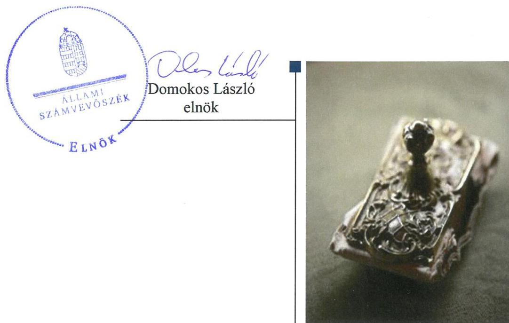
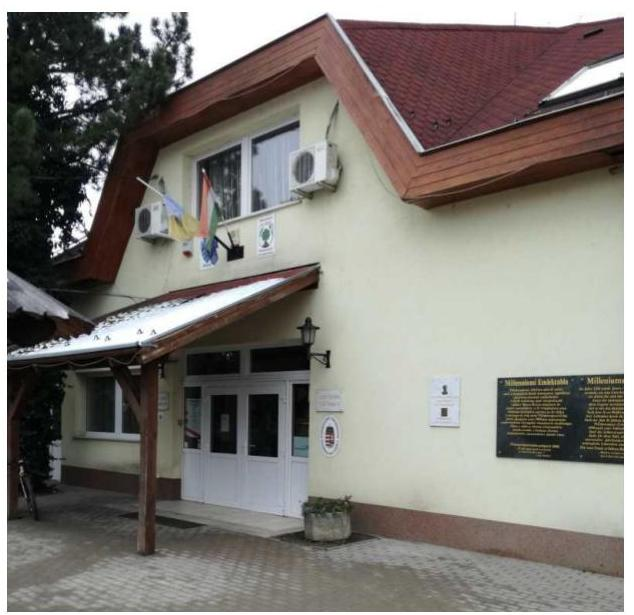

ÁLLAMI
SZÁMVEVŐSZÉK

# Jelentés 

## A nyilvános könyvtári ellátás működésének ellenőrzése

Reichel József Múvelődési Ház és
Könyvtár
2018.

---

# Jelentés 

## A nyilvános könyvtári ellátás működésének ellenőrzése

Reichel József Múvelődési Ház és Könyvtár
2018. 09. hó 04. nap

---

# AZ ELLENŐRZÉST FELÜGYELTE:

- VARGA EDIT felügyeleti vezető
- AZ ELLENŐRZÉST VEZETTE ÉS A VÉGREHAJTÁSÁÉRT FELELŐS:
  - **ÓDOR ZOLTÁN TAMÁS** ellenőrzésvezető
  - A PROGRAM ÖSSZEÁLLÍTÁSÁÉRT FELELŐS:
    - **TÓTPÁL SZABOLCS** osztályvezető

**IKTATÓSZÁM:** EL-0374-022/2018

**TÉMASZÁM:** 2466

**ELLENŐRZÉS-AZONOSÍTÓ SZÁM:** V080901

Jelentéseink az Országgyűlés számítógépes hálózatán és az Interneten a www.asz.hu címen is olvashatóak.

---

# TARTALOMJEGYZÉK 

■ ÖSSZEGZÉS ..... 5
■ AZ ELLENŐRZÉS CÉLJA ..... 6
■ AZ ELLENŐRZÉS TERÜLETE ..... 7
■ AZ ELLENŐRZÉS HÁTTERE, INDOKOLTSÁGA ..... 8
■ A JELENTÉS LÉNYEGES KÉRDÉSKÖREI ..... 9
■ AZ ELLENŐRZÉS HATÓKÖRE ÉS MÓDSZEREI ..... 10
■ MEGÁLLAPÍTÁSOK ..... 12
■ JAVASLATOK ..... 17
■ MELLÉKLETEK ..... 21
I. sz. melléklet: Értelmező szótár ..... 21
■ FÜGGELÉK: ÉSZREVÉTELEK ..... 23
■ RÖVIDÍTÉSEK JEGYZÉKE ..... 25

---

.

---

# ÖSSZEGZÉS 

Pilisborosjenő Község Önkormányzata az alapítói jogait szabályszerűen gyakorolta, de az Intézményhez kapcsolódó egyéb szabályozási, irányítói feladatait nem látta el szabályszerűen. A Reichel József Múvelődési Ház és Könyvtár belső kontrollrendszere nem teremtette meg az átlátható, elszámoltatható és ellenőrizhető közpénzfelhasználás feltételeit. A vagyongazdálkodás átláthatóságát nem biztosította. A jogszabályokban előírt közérdekű adatok, dokumentumok közzétételéről nem gondoskodott, így az átláthatóság nem érvényesült. Az integritás szemléletet nem érvényesítette, nem alakította ki a megfelelő védelmet a korrupciós veszélyekkel szemben.

## Az ellenőrzés társadalmi indokoltsága

Törvényben deklarált célja szerint a könyvtári ellátás fenntartása és fejlesztése az állampolgárok és a társadalom egésze szempontjából szükséges, a könyvtári és információs szolgáltatás állami fenntartása stratégiai fontosságú. A könyvtárak felbecsülhetetlen nemzeti értékeket, az egyetemes kultúrához kapcsolódó dokumentumokat, gyűjteményeket őriznek. A helyi önkormányzati fenntartású közgyűjtemény a nemzeti vagyon körébe tartozik, ezért kiemelten indokolt az Állami Számvevőszék ezen a területen történő ellenőrzése is.

## Főbb megállapítások, következtetések, javaslatok

A Fenntartó jogszabályi előírásoknak megfelelően gondoskodott a helyi közművelődési és kulturális tevékenység biztosítása érdekében a Reichel József Művelődési Ház és Könyvtár alapítói és fenntartói feladatainak megszervezéséről, biztosította a szabályszerű működés személyi és tárgyi feltételeit, munkáltatói jogait megfelelően gyakorolta. A Fenntartó egyéb, a nyilvános könyvtári ellátáshoz, a könyvtári működéshez kapcsolódó szabályozási, irányítói, döntési és jóváhagyási jogkörét azonban nem megfelelően látta el.

Az Intézmény szabályzatai teljes körűségének hiánya miatt a kontrollkörnyezet kialakítása nem volt szabályszerű. Nem mérték fel a tevékenységben, gazdálkodásban rejlő kockázatokat, nem alakítottak ki és nem működtettek kockázatkezelési rendszert. Az Intézmény vezetője nem alakította ki a szervezet információs-rendszerét, közzétételi kötelezettségét hiányosan teljesítette. Az Intézmény monitoring rendszerének kialakítása nem történt meg, a belső ellenőrzési rendszer kialakítása szabályszerű volt.

Az Intézmény feladatellátásához szolgáló vagyont a Fenntartó meghatározta, a vagyon kezelését szabályozta, de vagyongazdálkodása szabályos leltárazás hiánya valamint a könyvtári állomány leltárazásának elmaradása miatt nem volt szabályszerű. Éves költségvetési beszámolóinak mérlegtételeit leltárral nem támasztotta alá.

Az integritás szemlélet erősítése érdekében az Könyvtárnak intézkedéseket kell tennie, mivel a belső kontrollrendszere - kialakításában és működtetésében feltárt hiányosságok és hibák miatt - nem támogatja a közpénzek átlátható felhasználását, az integritás kultúra kialakítását.

Az Állami Számvevőszék a jelentésben foglalt megállapítások alapján a Reichel József Múvelődési Ház és Könyvtár Vezetőjének a belső kontrollrendszer szabályszerű kialakítása és működtetésére, a korrupciós kockázatok kezelésére, valamint a pénzügyi és vagyongazdálkodás szabályszerűségére vonatkozóan négy javaslatot fogalmazott meg. Pilisborosjenő Község Önkormányzata polgármesterének egy javaslatot tett az Állami számvevőszék a fenntartói feladatok szabályszerű ellátása érdekében, további - belső kontrollrendszer szabályszerű kialakítására, működtetésére vonatkozó - egy javaslat címzettje Pilisborosjenő Község Önkormányzatának jegyzője. A javaslatokat megalapozó megállapításokra az érintetteknek 30 napon belül intézkedési tervet kell készíteniük.

---

# AZ ELLENŐRZÉS CÉLJA 

Az ellenőrzés célja annak megállapítása volt, hogy a nyilvános könyvtárak pénzügyi és vagyongazdálkodása, a könyvtárak által kezelt vagyon nyilvántartása és megőrzése, a belső kontrollrendszer kialakítása és működtetése, valamint az intézményfenntartói feladatok ellátása szabályszerűen történt-e, érvényesült-e az integritás szemlélet.

---

# **Az Ellenőrzés Területe**

## **Reichel József Művelődési Ház és Könyvtár**

Az Intézmény^{1} a Pest megyében fekvő Pilisborosjenő községben látta el feladatait, amely a falu szülöttének, Reichel József operaénekesnek a nevét viseli. A község állandó lakosainak száma a KSH^{2} adatai alapján 2017. január 1-jén 3697 fő volt.

A Fenntartó^{3} Képviselő-testülete az Intézményét 1999. november 22-én alapította, amelynek közfeladata a nyilvános könyvtári ellátás biztosítása és a helyi közművelődési tevékenység támogatása volt. Az intézmény szervezett kulturális, közhasznú szolgáltatásokat, programokat, valamint szervezte és lebonyolította az állami és társadalmi ünnepségeket.

Az ellenőrzött időszakban az Intézmény vezetőjének személyében változás nem történt.

Az Intézmény pénzügyi-gazdálkodási tevékenységét a Pilisborosjenői Polgármesteri Hivatal látta el. A polgármester^{4} 2014 óta töltötte be tisztségét, a jegyző^{5} személyében 2016. évben változás történt. Az Intézmény és a Hivatal^{6} közötti munkamegosztási, felelősségvállalási, éves költségvetési feladatok, pénzügyi és gazdálkodási feladatok szabályozása céljából a felek együttműködési megállapodást kötöttek.

Az Intézmény átlagos statisztikai állományi létszáma az ellenőrzött években 4 fő volt, gazdálkodásának főbb adatait a 1. számú táblázat mutatja be.

1. táblázat

|  Megnevezés | 2014. év | 2015. év | 2016. év  |
| --- | --- | --- | --- |
|  Költségvetési bevételek | 2,6 | 2,2 | 2,1  |
|  Költségvetési kiadások | 15,0 | 14,5 | 16,2  |
|  Finanszírozási bevételek | 12,5 | 12,3 | 14,2  |
|  Működés eredménye | -0,4 | -1,5 | -0,85  |

*Forrás: éves költségvetési beszámolók (Magyar Államkincstár)*

---

# AZ ELLENŐRZÉS HÁTTERE, INDOKOLTSÁGA 

A könyvtárak fenntartására fordított közpénz nagysága, a nyilvános könyvtárak fenntartóinak sokszínűsége, a nyilvános könyvtárak, és a feladatellátó helyek számossága, valamint a könyvtárak által kezelt speciális vagyoni kör, továbbá a témakört érintően azonosított kockázatok alátámasztották a nyilvános könyvtárak ellenőrzésének szükségességét. Az egyes ellenőrzések megállapításaival és egy időszak ellenőrzési eredményeinek elemzésével az ÁSZ ${ }^{7}$ ráirányíthatja a jogalkotók figyelmét a központi alrendszerben vagy annak egy ágazatában esetlegesen felmerülő pénzügyi, szabályozási feszültségekre.

---

# A JELENTÉS LÉNYEGES KÉRDÉSKÖREI 

1. Az Intézmény fenntartója a feladatait szabályszerűen látta-e el?
2. Az Intézmény belső kontrollrendszerének kialakítása és működtetése megfelelő volt-e?
3. Az Intézmény pénzügyi és vagyongazdálkodása szabályszerű volt-e?

---

# AZ ELLENŐRZÉS HATÓKÖRE ÉS MÓDSZEREI 

## Az ellenőrzés típusa

Megfelelőségi ellenőrzés.

## Az ellenőrzött időszak

A 2014 - 2016. évek, a belső kontrollrendszer tekintetében 2016. év.

## Az ellenőrzés tárgya

Az Intézmény fenntartásával kapcsolatos feladatok ellátása. Az intézmény belső kontrollrendszerének kialakítása és működtetése. A pénzügyi és vagyongazdálkodás szabályszerűsége. Az intézmény egyes pénzügyi és vagyongazdálkodási feladatainak, beszámolási és adatszolgáltatási kötelezettségének teljesítése. Az integritás szemlélet érvényesülése az intézményekben.

## Az ellenőrzött szervezet

Reichel József Múvelődési Ház és Könyvtár, Pilisborosjenő Község Önkormányzata

## Az ellenőrzés jogalapja

Az Állami Számvevőszékről szóló 2011. évi LXVI. törvény 1. § (3) bekezdése, az 5. § (2)-(3) bekezdései, a (4) bekezdés a) pontja, továbbá az (6) bekezdése

## Az ellenőrzés módszerei

Az ÁSZ az ellenőrzést az ÁSZ hivatalos honlapján (www.asz.hu) az ellenőrzés szakmai szabályai közt közzétett, a jelen ellenőrzésre irányadó módszertani útmutatók alapján, az ellenőrzési programban foglalt értékelési szempontok szerint hajtotta végre. Az ellenőrzést az ÁSZ a program kérdéseire adott válaszok kiértékelésével, valamint a programban ismertetett ellenőrzési kérdések, kritériumok, adatforrások között megjelölt adatforrások, a program III. sz. mellékletben felsorolt tanúsítványok felhasználásával, továbbá az adott időszakban hatályos jogszabályok figyelembevételével folytatta le.

---

Az ÁSZ, az ellenőrzés ideje alatt az ellenőrzött szervezettel történő kapcsolattartást az ÁSZ SZMSZ ${ }^{6}$-ének vonatkozó előírásai alapján biztosította.

Az ellenőrzési kérdések megválaszolásához szükséges bizonyítékok megszerzése a következő ellenőrzési eljárások alkalmazásával történt: megfigyelés, szemle (szemrevételezés), kérdésfeltevés (információkérés), mintavételezés, valamint elemző eljárás. Az ÁSZ statisztikai módszereken alapuló mintavételt alkalmazott, a minták értékelését a teljes sokaságra történő kivetítéssel végezte.

---

# 1. Az Intézmény fenntartója a feladatait szabályszerűen látta-e el? 

Összegző megállapítás

A Fenntartó alapító jogait szabályszerűen gyakorolta, azonban az Intézményhez kapcsolódó szabályozási, irányítói feladatait nem látta el szabályszerűen.

A Fenntartó az Áht. rendelkezéseinek megfelelően megalkotta SZMSZ-ét ${ }^{9}$., amely az Ávr ${ }^{10}$. vonatkozó előírásai szerint tartalmazta az Intézmény megnevezését. Az Intézmény Alapító Okiratát ${ }^{11}$ az Áht ${ }^{12}$.-nak megfelelően a Fenntartó kiadta, a módosításokat elvégezte, valamint az intézményi SZMSZ-t ${ }^{13}$ és annak módosításait határozataiban jóváhagyta.

Az Intézmény működésének tárgyi és személyi feltételeit a Fenntartó biztosította, munkáltatói jogait megfelelően gyakorolta.

A Fenntartó egyéb szabályozási, irányítói, döntési és jóváhagyási jogkörét nem megfelelően gyakorolta, mert:
$\longrightarrow$ a Kult. tv. ${ }^{14}$ 68. § (1) a) pontja ellenére nem határozta meg az Intézmény használati szabályzatát;
$\longrightarrow$ a Kult. tv. 68. § (1) d) pontja ellenére nem hagyta jóvá az Intézmény fejlesztésére vonatkozó terveket;
$\longrightarrow$ a Kult. tv. 68. § (1) e) pontja ellenére nem értékelte országos könyvtári szakértői névjegyzékben szereplő szakértők közreműködésével az Intézmény szakmai tevékenységét.

## 2. Az Intézmény belső kontrollrendszerének kialakítása és működtetése megfelelő volt-e?

## Összegző megállapítás

Az Intézmény belső kontrollrendszerének kialakítása és működtetése nem volt megfelelő.
2.1. számú megállapítás

A kontrollkörnyezet kialakítása nem volt szabályszerű.
Az Intézmény gazdálkodási feladatait a Hivatal látta el. A Hivatal rendelkezett az Ávr. előírásainak megfelelően jóváhagyott ügyrenddel ${ }^{15}$, valamint a felek közötti munkamegosztást szabályozó együttműködési megállapodással ${ }^{16}$. A Fenntartó az általa készített pénzügyi és gazdálkodási szabályzatok hatályát - Kötelezettségvállalás Szabályzat ${ }^{17}$ és az Informatikai biztonsági szabályzat ${ }^{18}$ kivételével - az Intézményre nem terjesztette ki.

A kontrollkörnyezet kialakítása nem felelt meg a jogszabályi előírásoknak, mert:

---

Az Intézmény vezetője nem gondoskodott:

- az etikai elvárások meghatározásáról, azok megismertetéséről a Bkr ${ }^{19}$. 6. § (1) bekezdés c) pontjában foglaltak ellenére;
- a Bkr. 6. § (3) bekezdésében előírt ellenőrzési nyomvonal kialakításáról;
- a Bkr. 6. § (4) bekezdésében előírt szabálytalanságkezelési, majd a szervezeti integritást sértő események kezelésének eljárásrendjének kialakításáról;
- az Ltv. ${ }^{20}$ 9. § (4) bekezdésében előírt iratkezelési szabályzat kialakításáról;
- az Ávr. 13. § (2) bekezdésének h) pontjában előírt kötelezően közzéteendő adatok nyilvánosságra hozatali rendjének kiadásáról.
A Fenntartó:
- a gazdálkodási feladatellátása során az Ávr. 60. § (3) bekezdése ellenére a kötelezettségvállalást, pénzügyi ellenjegyzést, teljesítés igazolást, érvényesítést, utalványozást végző személyek aláírás-mintáiról nem vezetett naprakész nyilvántartást;
- nem gondoskodott az Info.tv.7.§ (3) bekezdése ellenére adatok védelmét szolgáló intézkedésekről.

# 2.2. számú megállapítás 

## A kockázatkezelési rendszer kialakítására és működtetésére nem került sor.

Az Intézmény vezetője a Bkr. 3. § (b) pontjának és a 7. § (1) bekezdésének 2016. szeptember 30-ig hatályos előírása ellenére nem alakított ki és nem működtetett kockázatkezelési rendszert, valamint a Bkr. 3. § b) pontjának és a Bkr. 7. § (1) bekezdésének 2016. október 1-től hatályos előírása ellenére nem alakította ki és nem működtette az integrált kockázatkezelési rendszert.

## A kontrolltevékenységek működtetése nem felelt meg a jogszabályban és a belső szabályzatokban foglaltaknak.

Az Intézmény vezetője, 2016. szeptember 30-ig a Bkr. 8. § (2)
 bekezdésében előírtak ellenére nem biztosította a folyamatba épített, előzetes, utólagos és vezetői ellenőrzést.
2016. október 1-től a kontrolltevékenység részeként a Bkr. 8. § (2) bekezdésében előírt, a szervezeti célok elérését veszélyeztető kockázatok csökkentésére irányuló kontrollok kiépítését az Intézmény vezetője nem biztosította, mert az Együttműködési megállapodásban előírtak ellenére nem készült el az Intézmény gazdálkodási folyamataihoz és szakmai feladatellátáshoz kapcsolódó FEUVE ${ }^{21}$ vagy az azzal egyenértékű szabályozás.

Az Intézmény belső szabályzataiban, a Bkr.-nek megfelelően, a felelősségi körök meghatározásával szabályozták az engedélyezési, jóváhagyási és kontroll- és beszámolási eljárásokat.

---

# 2.4. számú megállapítás 

Az információs és kommunikációs folyamatok kialakítására és működtetésére nem került sor.

Az Intézmény vezetője a Bkr. 9. § (1) bekezdése ellenére, nem alakított ki és nem működtetett olyan rendszereket, melyek biztosítják, hogy a megfelelő információk a megfelelő időben eljussanak az illetékes szervezethez, szervezeti egységhez, illetve személyhez, valamint a Bkr. 9. § (2) bekezdése ellenére nem határozta meg a beszámolási szinteket, határidőket és módokat.

Az Intézmény vezetője az Info. tv. 37.§ (1) bekezdés szerinti az elektronikus közzétételi kötelezettségének nem tett eleget, az Info. tv. 1. mellékletében felsorolt, általános közzétételi listán meghatározott adatokat nem, vagy nem teljes körűen tette közzé a honlapján ${ }^{22}$. Az általános közzétételi listán meghatározott adatok közül az alábbiak nem kerültek közzétételre:
—II. Tevékenységre, működésre vonatkozó adatok - Az Intézményre vonatkozó alapvető jogszabályok, a szervezeti és működési szabályzat vagy ügyrend, az adatvédelmi és adatbiztonsági szabályzat.
— III. Gazdálkodási adatok - Intézménynél foglalkoztatottak létszámára és személyi juttatásaira vonatkozó összesített adatok, illetve összesítve a vezetők és vezető tisztségviselők összesített illetménye, munkabére, és rendszeres juttatásai, valamint költségtérítése, az egyéb alkalmazottaknak nyújtott juttatások fajtája és mértéke.
2.5. számú megállapítás

## A monitoring rendszer kialakítása nem történt meg, a belső ellenőrzési rendszer kialakítása szabályszerű volt.

Az Intézmény vezetője a Bkr. 10. §-a előírásainak ellenére nem alakította ki a szervezet tevékenységének, a célok megvalósításának folyamatos és eseti nyomon követését biztosító rendszert.

A belső ellenőrzést végző szervezet jogállását, annak feladatait az SZMSZ, valamint a Fenntartó és a belső ellenőrzést ellátó szervezet közötti megbízási szerződésben ${ }^{23}$ szabályozták a Bkr. alapján. A belső ellenőr Bkr. szerinti szervezeti és funkcionális függetlenségét biztosították. A Fenntartó által jóváhagyott a 2016. évi belső ellenőrzési tervben az Intézmény ellenőrzöttként nem szerepelt.
2.6. számú megállapítás

## Az Intézmény vezetője nem lépett fel a korrupciós kockázatok kezelése, a korrupciós veszélyek elhárítása érdekében.

Az Intézmény az Info. tv. ${ }^{24}$ 37. § (1) bekezdésében, valamint az Info.tv. 1. mellékletének II./5. pontjában foglalt közzétételi kötelezettsége ellenére a közszolgáltatás igénybevételének rendje nem volt elérhető, ezért az általa nyújtott közszolgáltatás igénybevételének feltételei nem voltak megismerhetők.

---

A korrupciós kockázatot növelte, hogy az Intézmény tekintetében, — az Ávr. 13. § (2) bekezdés d) pontjában előírtak ellenére az Intézmény az anyag- és eszközgazdálkodás számviteli politikában nem szabályozott kérdéseinek szabályozása nem történt meg;

- az Intézmény az Ávr. 13. § (2) bekezdés c) pontjában foglaltak ellenére nem szabályozta a belföldi kiküldetések elrendelésével, lebonyolításával és elszámolásával kapcsolatos kérdéseket, valamint az Ávr. 13. § (2) bekezdés e) pontja ellenére a reprezentációs kiadások felosztásának és azok elszámolásának szabályait;
- vagyonnyilatkozat tételre köteles személyek körét 2007. évi CLII. tv. 4. § a) pontjában foglaltak ellenére nem határozták meg az intézményi SZMSZ-ben;

# 3. Az Intézmény pénzügyi és vagyongazdálkodása szabályszerű volt-e? 

## Összegző megállapítás

### 3.1. számú megállapítás

### 3.2. számú megállapítás

A pénzügyi és vagyon gazdálkodás nem volt szabályszerű.

A bevételek beszedése és elszámolása megfelelt, a kiadási előirányzatok felhasználása nem felelt meg a jogszabályi előírásoknak.

Az Intézmény ingatlanait esetenként bérbeadással hasznosította, az ebből származó bevételek elszámolása szabályszerű volt.

A kiadási előirányzatok felhasználásánál az ellenőrzött években a gazdálkodási jogkörök gyakorlása nem volt megfelelő, mert,
— az Ávr.57.§ (3) bekezdése ellenére a teljesítés igazolását nem az arra jogosult személy végezte;
— az Ávr. 57. § (1) bekezdése ellenére nem történt meg a teljesítésigazolás;
— az Ávr. 57. § (1) bekezdése ellenére a teljesítésigazolás érvényes kötelezettségvállalás hiányában történt.

Az Intézmény a fizetési kötelezettségeit teljesítette, az előirányzatmaradvány megállapítása szabályszerű volt.

Az Intézmény a fizetési kötelezettségeit a 2015. év kivételével teljesítette, év végi nyitott számlatartozása nem volt.

Az Intézmény a tárgyévi előirányzat-maradványát az Áhsz. ${ }^{25}$ és az Ávr. rendelkezéseinek megfelelően szabályszerűen állapította meg, a maradvány kimutatását az éves költségvetési beszámoló részeként az ellenőrzött években elkészítette.

Az Intézmény a beszámolási kötelezettségét nem a jogszabályi előírásoknak megfelelően teljesítette, mert a beszámolóit leltárral nem támasztotta alá, így a vagyongazdálkodás nem volt szabályszerű.

A jogszabályi előírásoknak megfelelően elkészített, 2014-2016. évi elemi költségvetések esetében az Intézmény nem igazolta, hogy a költségvetések

---

szabályszerű jóváhagyása az Ávr. 33. § (1) bekezdésében leírtaknak megfelelően megtörtént.

Az Intézmény a Számv. tv. 14.§ (5) bekezdésének a) pontja ellenére nem rendelkezett saját, eszközök és a források leltárkészítési és leltározási szabályzattal, a Fenntartó a Leltározási szabályzatának ${ }^{26}$ hatályát nem terjesztette ki az Intézményre. Az Áhsz. 22. §-ban és a Számv. tv. 69.§ (1) bekezdésében előírtak ellenére az Intézmény az éves költségvetési beszámolóinak mérlegtételeit leltárral nem támasztotta alá.

A feladatellátást szolgáló vagyon körét a Fenntartó az Intézmény Alapító okiratában meghatározta, a használt vagyonnal történő gazdálkodás kereteit, annak kezelését és üzemeltetését a Fenntartó a Vagyonrendeletében ${ }_{1.2}{ }^{27}$ szabályozta. Az Intézmény a rendelkezésére bocsátott vagyont az Áhsz-ben leírtaknak és a vagyonkezelés szabályainak megfelelően a könyvviteli elszámolásaiban nyilvántartotta.

# 3.4. számú megállapítás Az Intézmény a könyvtári állomány leltározását nem végezte el. 

A könyvtári gyűjtemény elemzését, állapotfelmérését és tulajdonvédelmét szolgáló állomány leltározás nem történt meg, ezzel az Intézmény megsértette a 3/1975. KM-PM rendelet ${ }^{28}$ 4. § (1) bekezdése szerinti, a könyvtári állomány időszaki leltározása elvégzésére vonatkozó kötelezettségét.

---

# JAVASLATOK 

Az ÁSZ tv. 33. § (1) bekezdésében foglaltak értelmében az ellenőrzött szervezet vezetője köteles a jelentésben foglalt megállapításokhoz kapcsolódó intézkedési tervet összeállítani és azt a jelentés kézhezvételétől számított 30 napon belül az ÁSZ részére megküldeni. Amennyiben az ellenőrzött szervezet vezetője nem küldi meg határidőben az intézkedési tervet, vagy továbbra sem elfogadható intézkedési tervet küld, az Állami Számvevőszék elnöke az ÁSZ tv. 33. § (3) bekezdés a) és b) pontjaiban foglaltakat érvényesítheti.

## Reichel József Művelődési Ház és Könyvtár Vezetőjének

1. A belső kontrollrendszer szabályszerű kialakítása és működtetése érdekében intézkedjen:
a) az etikai elvárások meghatározásáról és azoknak az alkalmazottakkal való megismertetéséről;
(2.1. sz. megállapítás 3. bekezdés 1. francia bekezdése alapján)
b) ellenőrzési nyomvonal elkészítéséről;
(2.1. sz. megállapítás 3. bekezdés 2. francia bekezdése alapján)
c) a szervezeti integritást sértő események kezelésének eljárásrendjének;
(2.1. sz. megállapítás 3. bekezdés 3. francia bekezdése alapján)
d) iratkezelési szabályzat elkészítéséről;
(2.1. sz. megállapítás 3. bekezdés 4. francia bekezdése alapján)
e) a kötelezően közzéteendő adatok nyilvánosságra hozatali rendjének kiadásáról;
(2.1. sz. megállapítás 3. bekezdés 5. francia bekezdése alapján)
f) az integrált kockázatkezelési rendszer kialakításáról és működtetéséről;
(2.2. sz. megállapítás 1. bekezdése alapján)
g) a szervezeti célok elérését veszélyeztető kockázatok csökkentésére irányuló kontrollok kiépítéséről;
(2.3. sz. megállapítás 1. bekezdése alapján)

---

h) a szervezeten belüli és szervezeten kívülre történő információátadás rendszerének kialakításáról, a beszámolási szintek, határidők és módok meghatározásáról.
(2.4. sz. megállapítás 1. bekezdése alapján)
2. A korrupciós kockázatok kezelése, a korrupciós veszélyek elhárítása érdekében intézkedjen:
a) az Intézmény által nyújtott közszolgáltatások igénybevételi feltételeinek megismerhetőségéről;
(2.6. sz. megállapítás 1. bekezdés alapján)
b) az anyag- és eszközgazdálkodás számviteli politikában nem szabályozott kérdéseinek szabályozásáról;
(2.6. sz. megállapítás 2. bekezdés 1. francia bekezdés alapján)
c) a belföldi kiküldetések elrendelésének, lebonyolításának és elszámolásának szabályozásáról, valamint, a reprezentációs kiadások felosztása és azok elszámolása rendjének kialakításáról;
(2.6. sz. megállapítás 2. bekezdés 2. francia bekezdés alapján)
d) vagyonnyilatkozat tételre köteles személyek körének az Intézmény SZMSZ-ében történő meghatározásáról.
(2.6. sz. megállapítás 2. bekezdés 3. francia bekezdés alapján)
3. A szabályszerű pénzügyi gazdálkodás érdekében gondoskodjon a teljesítésigazolás szabályszerű gyakorlásáról.
(3.1. sz. megállapítás 2. bekezdés 1-3. francia bekezdései alapján)
4. A vagyonnal való szabályszerű gazdálkodás érdekében gondoskodjon az Intézmény:
a) elemi költségvetésének jóváhagyásáról;
(3.3. sz. megállapítás 1. bekezdés alapján)
b) eszközök és a források leltárkészítési és leltározási szabályzatának elkészítéséről;
(3.3. sz. megállapítás 2. bekezdés 1. mondata alapján)
c) éves költségvetési beszámolója mérlegének leltárral történő alátámasztásáról;
(3.3. sz. megállapítás 2. bekezdés 2. mondata alapján)

---

d) a könyvtári állomány időszaki leltározásáról.
(3.4. sz. megállapítás 1. bekezdés alapján)

# Pilisborosjenő Község Önkormányzata Polgármesterének 

1. Fenntartói feladatai szabályszerű ellátása érdekében intézkedjen az Intézmény:
a) használati szabályzatának meghatározásáról;
(1. sz. megállapítás 3. bekezdés 1. francia bekezdése alapján)
b) fejlesztésére vonatkozó terv(ek) jóváhagyásáról;
(1. sz. megállapítás 3. bekezdés 2. francia bekezdése alapján)
c) szakmai tevékenységének az országos könyvtári szakértői névjegyzékben szereplő szakértők közreműködésével történő értékeléséről.
(1. sz. megállapítás 3. bekezdés 3. francia bekezdése alapján)

## Pilisborosjenő Község Önkormányzata Jegyzőjének

1. A belső kontrollrendszer szabályszerű kialakítása és működtetése érdekében intézkedjen:
a) a kötelezettségvállalást, pénzügyi ellenjegyzést, teljesítés igazolást, érvényesítést, utalványozást végző személyek aláírás-mintáinak naprakész nyilvántartásáról;
(2.1. sz. megállapítás 4. bekezdés 1. francia bekezdése alapján)
b) az adatok védelméről.
(2.1. sz. megállapítás 4. bekezdés 2. francia bekezdése alapján)

---

.

---

# MELLÉKLETEK 

I. SZ. MELLÉKLET: ÉRTELMEZŐ SZÓTÁR

Könyvtár a muzeális intézményekről, a nyilvános könyvtári ellátásról és a közművelődésről szóló 1997. évi CXL törvényben (Kult. tv-ben) meghatározott könyvtári dokumentumok rendszeres gyűjtését, feltárását, megőrzését és használatát biztosító szervezet.
Könyvtári dokumentum a könyvtár által állományba vett, alap- és kiegészítő feladatai ellátásához szükséges könyv, időszaki kiadvány, egyéb kiadvány, valamint minden szöveg-, kép-, adat- és hangrögzítés - beleértve a könyvtár állományába vett elektronikus dokumentumot is kivéve az Ltv. hatálya alá tartozó, irattári jellegű levéltári anyagnak minősülő dokumentumot.
Könyvtári szakember a könyvtáros, a könyvtári informatikus, a könyvtári asszisztens, a segéd könyvtáros továbbá a könyvtári feladatok ellátásához szükséges más felső- vagy középfokú végzettséggel rendelkező személy. A könyvtáros felsőfokú szakirányú végzettséggel rendelkező szakember.
Kulturális javak az élettelen és élő természet keletkezésének, fejlődésének, az emberiség, a magyar nemzet, Magyarország történelmének kiemelkedő és jellemző tárgyi, képi, hangrögzített, írásos emlékei, és egyéb bizonyítékai - az ingatlanok kivételével -, a művészeti alkotások.
Nyilvános könyvtári ellátás a nyilvános könyvtárak által nyújtott szolgáltatások és az e szolgáltatások nyújtását elősegítő központi szolgáltatások összessége, amelyek biztosítják az információhoz való szabad hozzáférést.
Könyvtári szolgáltatási feladatok a könyvtár gyűjteményének használókhoz való eljuttatása, a nyitva tartás, a könyvtári tájékoztatás, a könyvtárhoz kapcsolódó, a könyvtárhasználókat érintő bármely tevékenységforma, továbbá a könyvtár által nyújtott helybeni vagy elektronikus szolgáltatások igénybe vétele, használata, a könyvtárak közönségkapcsolati és egyéb tevékenységével összefüggő feladatai, az intézmény kommunikációs tevékenysége és a formális, nem formális és informális képzésekben, továbbképzésekben való részvétele (51/2014. (XII. 10.) EMMI rendelet)

---

.

---

# FÜGGELÉK: ÉSZREVÉTELEK 

A jelentéstervezetet a Számvevőszék 15 napos észrevételezésre megküldte az ellenőrzött szervezetek vezetőinek az ÁSZ tv. 29. §* (1) bekezdése előírásának megfelelően.

Az ÁSZ a jelentéstervezetet észrevételezésre megküldte a Reichel József Múvelődési Ház és Könyvtár intézményvezetőjének és Pilisborosjenő Község Önkormányzata polgármesterének.
A
 Reichel József Művelődési Ház és Könyvtár intézményvezetője és Pilisborosjenő Község polgármestere az ÁSZ tv. 29. § (2) bekezdésében foglalt észrevételezési jogával nem élt, a törvényes határidőn belül észrevételt nem tett.

[^0]
[^0]:    * 29. § (1) Az Állami Számvevőszék az ellenőrzési megállapításait megküldi az ellenőrzött szervezet vezetőjének vagy az általa megbízott személynek, és annak, akinek személyes felelősségét állapította meg.
    (2) Az ellenőrzött szervezet vezetője és a felelősként megjelölt személy az ellenőrzés megállapításaira tizenöt napon belül írásban észrevételt tehet.
    (3) Az Állami Számvevőszék az észrevételre a beérkezésétől számított harminc napon belül írásban válaszol. A figyelembe nem vett észrevételeket köteles a jelentésben feltüntetni, és megindokolni, hogy azokat miért nem fogadta el.

---

.

---

# RÖVIDÍTÉSEK JEGYZÉKE 

${ }^{1}$ Intézmény
${ }^{2} \mathrm{KSH}$
${ }^{3}$ Fenntartó
${ }^{4}$ polgármester
${ }^{5}$ jegyző
${ }^{6}$ Hivatal
${ }^{7}$ ÁSZ
${ }^{8}$ ÁSZ SZMSZ
${ }^{9}$ SZMSZ
${ }^{10}$ Ávr
${ }^{11}$ Alapító Okirat
${ }^{12}$ Áht.
${ }^{13}$ Intézményi SZMSZ
${ }^{14}$ Kult. tv.
${ }^{15}$ ügyrend
${ }^{16}$ együttműködési megállapodás
${ }^{17}$ Kötelezettségvállalás Szabályzat
${ }^{18}$ Informatikai biztonsági szabályzat
${ }^{19}$ Bkr.
${ }^{20}$ Ltv.
${ }^{21}$ FEUVE
${ }^{22}$ honlap
${ }^{23}$ megbízási szerződés
${ }^{24}$ Info. tv.
${ }^{25}$ Áhsz.
${ }^{26}$ Leltározási szabályzat ${ }_{1-2}$

Reichel József Művelődési Ház és Könyvtár
Központi Statisztikai Hivatal
Pilisborosjenő Község Önkormányzata
Pilisborosjenő Község Önkormányzatának Polgármestere
Pilisborosjenői Polgármesteri Hivatal Jegyzője
Pilisborosjenői Polgármesteri Hivatal
Állami Számvevőszék
Az Állami Számvevőszék elnökének 4/2017. (XII.29.) ÁSZ utasítása az Állami Számvevőszék Szervezeti és Működési Szabályzatáról
A fenntartó - Pilisborosjenő Község Önkormányzat Képviselő-testülete és Szervei Szervezeti és Működési Szabályzata (hatályos 2013. május 1-től)
368/2011. (XII. 31.) Korm. rendelet az államháztartásról szóló törvény végrehajtásáról (hatályos 2012. január 1-jétől)
Alapító Okirat (Reichel József Művelődési Ház és Könyvtár, hatályos 2012. március 13-tól)
2011. évi CXCV. törvény az államháztartásról (hatályos 2012. január 1-jétől)

A Reichel József Művelődési Ház és Könyvtár Szervezeti és Működési Szabályzata (Hatályos 2012. április 1-jétől)
2001. évi LXIV. törvény a kulturális örökség védelméről
(hatályos 2001. október 10-től)
A Polgármesteri Hivatal Ügyrendje (hatályos 2014. március 26-tól)
Együttműködési Megállapodás (a Pilisborosjenői Polgármesteri Hivatal és a
Reichel József Művelődési Ház és Könyvtár között, hatályos 2014. március 17-től)
A Kötelezettségvállalás és utalványozás rendjéről szóló közös szabályzat (hatályos 2012. május 10-től)

Pilisborosjenő Község Önkormányzatának és Intézményeinek Informatikai Biztonsági Szabályzata (hatályos 2014. február 25-től)
370/2011. (XII. 31.) Korm. rendelet - a költségvetési szervek belső kontrollrendszeréről és belső ellenőrzéséről (hatályos 2012. január 1-jétől) 1995. évi LXVI. törvény a köziratokról, a közlevéltárakról és a magánlevéltári anyag védelméről (hatályos 1996. január 1-jétől)
Folyamatba épített, előzetes, utólagos és vezetői ellenőrzés szabályzata
Reichel József Művelődési Ház és Könyvtár honlapja
www. muvhaz.pilisborosjeno.hu
Megbízási szerződés Pilisborosjenő Polgármesteri Hivatal és a Gerlang Ellenőrzési Iroda Kft. között (aláírva 2016. január 5-én)
2011. évi CXII. törvény az információs önrendelkezési jogról és az információszabadságról (Hatályos: 2011. július 26-tól)
4/2013. (I. 11.) Korm. rendelet az államháztartás számviteléről
Pilisborosjenő Község Önkormányzatának Polgármesteri Hivatala Leltárkészítési és leltározási szabályzata, hatályos: 2005. július 20-tól;
Pilisborosjenő Község Önkormányzatának Polgármesteri Hivatala Eszközök és források leltározási és leltárkészítési szabályzata, hatályos: 2015. december 1-től;

---

${ }^{27}$ Vagyonrendelet ${ }_{1-2}$
${ }^{28} \mathrm{KM}-\mathrm{PM}$ rendelet

Pilisborosjenő Község Önkormányzat Képviselő-testületének 6/2013. (II.26.) számú önkormányzati rendelete az Önkormányzat vagyonáról és a vagyongazdálkodás szabályairól, hatályos: 2013. február 27-től:
Pilisborosjenő Község Önkormányzat Képviselő-testületének 6/2013. (II.26.) számú önkormányzati rendelete (egységes szerkezetben a 13/2014. (IX.30.) Önk. számú rendelettel) az Önkormányzat vagyonáról és a vagyongazdálkodás szabályairól, módosítás hatályos: 2014. október 1-től:
3/1975. (VIII. 17.) KM-PM együttes rendelet a könyvtári állomány ellenőrzéséről (leltározásáról) és az állományból történő törlésről szóló szabályzat kiadásáról

---

ÁLLAMI SZÁMVEVŐSZÉK
1052 Budapest, Apáczai Csere János utca 10.
Levélcím: 1364 Budapest 4. Pf. 54
Telefon: +36 14849100 Telefax: +36 14849200
www.asz.hu
