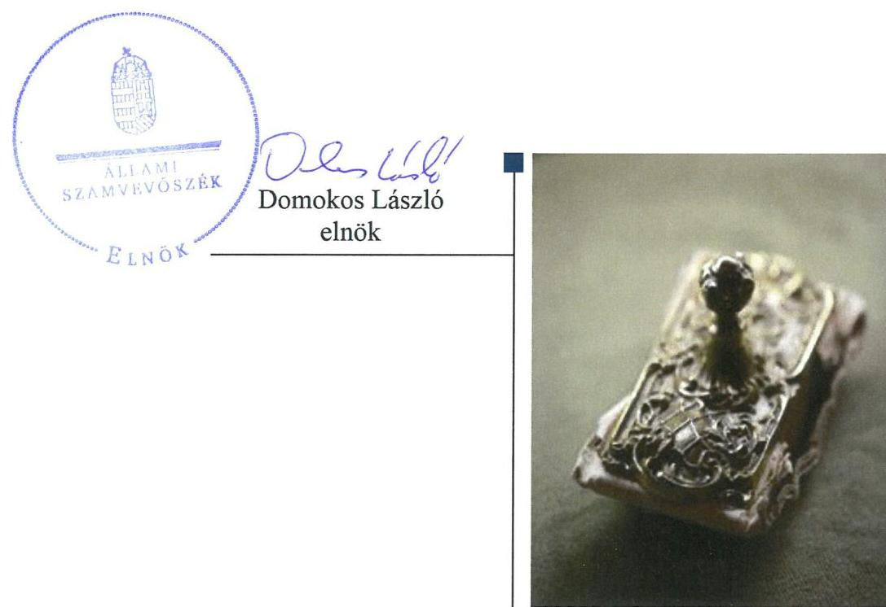
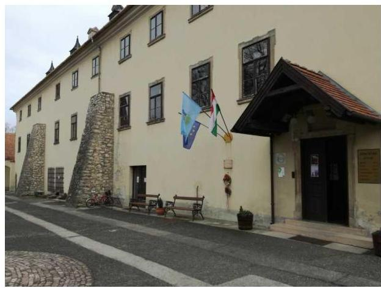

# Jelentés 

## A nyilvános könyvtári ellátás működésének ellenőrzése

Devecseri Városi Könyvtár és
Művelődési Ház
2018. 09. hó 04. nap

---

# AZ ELLENŐRZÉST FELÜGYELTE:

- VARGA EDIT felügyeleti vezető
- AZ ELLENŐRZÉST VEZETTE ÉS A VÉGREHAJTÁSÁÉRT FELELŐS:
  - DR. KOKAVECZ PÁL ellenőrzésvezető
- A PROGRAM ÖSSZEÁLLÍTÁSÁÉRT FELELŐS:
  - TÓTPÁL SZABOLCS osztályvezető

**IKTATÓSZÁM:** EL-0375-030/2018

**TÉMASZÁM:** 2466

**ELLENŐRZÉS-AZONOSÍTÓ SZÁM:** V080902

Jelentéseink az Országgyűlés számítógépes hálózatán és az Interneten a www.asz.hu címen is olvashatóak.

---

# TARTALOMJEGYZÉK 

■ ÖSSZEGZÉS ..... 5
■ AZ ELLENŐRZÉS CÉLJA ..... 6
■ AZ ELLENŐRZÉS TERÜLETE ..... 7
■ AZ ELLENŐRZÉS HÁTTERE, INDOKOLTSÁGA ..... 8
■ A JELENTÉS LÉNYEGES KÉRDÉSKÖREI ..... 9
■ AZ ELLENŐRZÉS HATÓKÖRE ÉS MÓDSZEREI ..... 10
■ MEGÁLLAPÍTÁSOK ..... 12
■ JAVASLATOK ..... 16
■ MELLÉKLETEK ..... 19
I. sz. melléklet: Értelmező szótár ..... 19
■ FÜGGELÉK: ÉSZREVÉTELEK ..... 21
■ RÖVIDÍTÉSEK JEGYZÉKE ..... 23

---

.

---

# ÖSSZEGZÉS 

Devecser Város Önkormányzata az alapítói jogait szabályszerűen gyakorolta, de az Intézményhez kapcsolódó egyéb irányítói, valamint gazdálkodási feladatait nem látta el szabályszerűen. A Devecseri Városi Könyvtár és Művelődési Ház belső kontrollrendszere nem teremtette meg az átlátható, elszámoltatható és ellenőrizhető közpénzfelhasználás feltételeit. A vagyongazdálkodása nem volt szabályszerű. A jogszabályokban előírt közérdekű adatok, dokumentumok közzétételéről nem gondoskodott, így az átláthatóság nem érvényesült.

## Az ellenőrzés társadalmi indokoltsága

Törvényben deklarált célja szerint a könyvtári ellátás fenntartása és fejlesztése az állampolgárok és a társadalom egésze szempontjából szükséges, a könyvtári és információs szolgáltatás állami fenntartása stratégiai fontosságú. A könyvtárak felbecsülhetetlen nemzeti értékeket, az egyetemes kultúrához kapcsolódó dokumentumokat, gyűjteményeket őriznek. A helyi önkormányzati fenntartású közgyűjtemény a nemzeti vagyon körébe tartozik, ezért kiemelten indokolt az Állami Számvevőszék ezen a területen történő ellenőrzése is.

## Főbb megállapítások, következtetések, javaslatok

Devecser Város Önkormányzata az alapítói, fenntartói kötelezettségeinek megfelelően, szabályszerűen látta el feladatait, gondoskodott az intézmény működésének személyi és tárgyi feltételeiről, azonban az egyéb irányítói feladatát nem végezte el tekintettel a munkaterv-jóváhagyás elmaradására.

A Devecseri Városi Könyvtár és Művelődési Ház nem alakította ki a jogszabályoknak megfelelő belső kontrollrendszert, mivel a kockázatkezelési rendszer, az információs és kommunikációs rendszer és a monitoring rendszer kialakítása nem történt meg, továbbá a kontrollkörnyezet kialakítása és a kontrolltevékenység gyakorlása nem volt szabályszerű. Nem lépett fel a korrupciós kockázatok kezelése, a korrupciós veszélyek elhárítása érdekében, valamint nem intézkedett az integritás szemlélet érvényre juttatásáról.

Az Intézmény bevételeinek beszedése és elszámolása, valamint a kiadási előirányzatok felhasználása nem felelt meg a jogszabályi előírásoknak. A költségvetési beszámolók mérlegében szereplő vagyonelemek állományát leltárral nem támasztotta alá, így a vagyongazdálkodás nem volt szabályszerű.

Az Állami Számvevőszék a jelentésben foglalt megállapítások alapján a Devecseri Városi Könyvtár és Művelődési Ház vezetőjének a belső kontrollrendszer szabályszerű kialakítására és működtetésére valamint a vagyongazdálkodás szabályszerűségére vonatkozóan két javaslatot fogalmazott meg. Devecser Város Önkormányzata polgármesterének egy javaslatot tett az Állami Számvevőszék a fenntartói feladatok szabályszerű ellátása érdekében, további egy - a számviteli elszámolások szabályszerűségére vonatkozó - javaslat címzettje Devecser Város Önkormányzatának jegyzője volt. A javaslatokat megalapozó megállapításokra az érintetteknek 30 napon belül intézkedési tervet kell készíteniük.

---

# AZ ELLENŐRZÉS CÉLJA 

Az ellenőrzés célja annak megállapítása, hogy a nyilvános könyvtárak pénzügyi és vagyongazdálkodása, a könyvtárak által kezelt vagyon nyilvántartása és megőrzése, a belső kontrollrendszer kialakítása és működtetése, valamint az intézményfenntartói feladatok ellátása szabályszerűen történt-e, érvényesült-e az integritás szemlélet.

---

### **Devecseri Városi Könyvtár és Művelődési Ház**

A Veszprém megyében található Devecseri Városi Könyvtár és Művelődési Házat 2004. április 1-jén alapították, a fenntartója Devecser Város Önkormányzata.

Az Intézmény¹ a műemlékvédelem alatt álló Esterházy kastély épületében működött, közművelődési intézményként közgyűjteményi, nyilvános könyvtári feladatokat látott el. Alapfeladatai között szerepelt könyvek, audiovizuális dokumentumok gyűjtése, feldolgozása, közhasznú információs szolgáltatás nyújtása, dokumentum kölcsönzés, olvasóterem működtetése, kiállítások, előadások szervezése, kistelepülések könyvtári ellátása. Az Intézmény muzeális könyvtári dokumentumokkal nem rendelkezett. Gazdálkodási feladatait együttműködési megállapodás² keretében a Devecseri Közös Önkormányzati Hivatal³, belső ellenőrzését külső szolgáltató látta el. Az Intézmény vezetőjének személye az ellenőrzött időszakban 2016. november 1-jén változott, Devecser Város Önkormányzata vezetőjének és jegyzőjének személyében az ellenőrzött időszakban változás nem történt.

Az Intézmény az ellenőrzött időszakban 8 főt foglalkoztatott, a helyi feladatai mellett a Könyvtárellátási Szolgáltató Rendszer működéséről szóló 39/2013. (V.31.) számú EMMI⁴ rendelet alapján az Eötvös Károly Megyei Könyvtárral kötött együttműködési megállapodás szerint még további 39 kistelepülési könyvtár ellátását is biztosította.

Az Intézmény gazdálkodására jellemző főbb adatokat az alábbi 1. táblázat mutatja be.

1. táblázat

|  AZ INTÉZMÉNY GAZDÁLKODÁSÁNAK FŐBB ADATAI (M FT) |  |   |
| --- | --- | --- |
|   | 2014. | 2016.  |
|  Bevételek | 74,3 | 64,8  |
|  Kiadások | 74,6 | 67,1  |
|  Működési eredmény | -0,3 | -2,3  |
|  Mérleg főösszeg | 8,3 | 4,9  |

*Forrás: éves beszámolók*

---

# AZ ELLENŐRZÉS HÁTTERE, INDOKOLTSÁGA 

A könyvtárak fenntartására fordított közpénz nagysága, a nyilvános könyvtárak fenntartóinak sokszínűsége, a nyilvános könyvtárak, és a feladatellátó helyek számossága, valamint a könyvtárak által kezelt speciális vagyoni kör, továbbá a témakört érintően azonosított kockázatok alátámasztották a nyilvános könyvtárak ellenőrzésének szükségességét. Az egyes ellenőrzések megállapításaival és egy időszak ellenőrzési eredményeinek elemzésével az ÁSZ⁵ ráirányíthatja a jogalkotók figyelmét az esetlegesen felmerülő pénzügyi, szabályozási feszültségekre.

---

# A JELENTÉS LÉNYEGES KÉRDÉSKÖREI 

1. Az Intézmény fenntartója a feladatait szabályszerűen látta-e el?
2. Az Intézmény belső kontrollrendszerének kialakítása és működtetése megfelelő volt-e?
3. Az Intézmény pénzügyi és vagyongazdálkodása szabályszerű volt-e?

---

# AZ ELLENŐRZÉS HATÓKÖRE ÉS MÓDSZEREI 

## Az ellenőrzés típusa

Megfelelőségi ellenőrzés.

## Az ellenőrzött időszak

A 2014-2016. évek, belső kontrollrendszer tekintetében a 2016. év.

## Az ellenőrzés tárgya

Az intézmény fenntartásával kapcsolatos feladatok ellátása. Az intézmény belső kontrollrendszerének kialakítása és működtetése. A pénzügyi és vagyongazdálkodás szabályszerűsége. Az intézmény egyes pénzügyi és vagyongazdálkodási feladatainak, beszámolási és adatszolgáltatási kötelezettségének teljesítése. Az integritás szemlélet érvényesülése az intézményben.

## Az ellenőrzött szervezet

Devecser Város Önkormányzata, valamint a Devecseri Városi Könyvtár és Művelődési Ház.

## Az ellenőrzés jogalapja

Az Állami Számvevőszékről szóló 2011. évi LXVI. törvény 1. § (3) bekezdése, az 5. § (2)-(3) bekezdései, a (4) bekezdés a) pontja, továbbá az (6) bekezdése.

## Az ellenőrzés módszerei

Az ÁSZ az ellenőrzést az ÁSZ hivatalos honlapján (www.asz.hu) az ellenőrzés szakmai szabályai közt közzétett, a jelen ellenőrzésre irányadó módszertani útmutatók alapján, az ellenőrzési programban foglalt értékelési szempontok szerint hajtotta végre. Az ellenőrzést az ÁSZ a program kérdéseire adott válaszok kiértékelésével, továbbá az adott időszakban hatályos jogszabályok figyelembevételével folytatta le.

Az ÁSZ, az ellenőrzés ideje alatt az ellenőrzött szervezettel történő kapcsolattartást az ÁSZ SZMSZ®-ének vonatkozó előírásai alapján biztosította.

---

Az ellenőrzési kérdések megválaszolásához szükséges bizonyítékok megszerzése a következő ellenőrzési eljárások alkalmazásával történt: megfigyelés, szemle (szemrevételezés), kérdésfeltevés (információkérés), mintavételezés, valamint elemző eljárás. Az ÁSZ statisztikai módszereken alapuló mintavételt alkalmazott, a minták értékelését a teljes sokaságra történő kivetítéssel végezte.

---

# 1. Az Intézmény fenntartója a feladatait szabályszerűen látta-e el? 

Összegző megállapítás

Az Intézmény fenntartója a fenntartói jogokat szabályszerűen gyakorolta, fenntartói, irányítási feladatait szabályszerűen ellátta, egyéb irányítói feladatát nem végezte el.

A Fenntartó⁷ az alapítói jogait szabályszerűen gyakorolta. Az Intézmény alapító okiratát¹⁻³ kiadta, abban a feladatait meghatározta, az SZMSZ⁹-ét jóváhagyta, működésének személyi és tárgyi feltételeit biztosította, a könyvtárhasználati szabályzatot¹⁰ elkészítette. Az Intézmény fejlesztésére vonatkozó terveket a Fenntartó gazdasági programjai¹¹ keretében elfogadta és jóváhagyta.

A 2014-2016. évekre vonatkozóan az éves munkatervek jóváhagyása a Kult. tv¹². 78. § (5) bekezdés b) pontjának előírása ellenére nem történt meg.

## 2. Az Intézmény belső kontrollrendszerének kialakítása és működtetése megfelelő volt-e?

## Összegző megállapítás

Az Intézmény belső kontrollrendszerének kialakítása és működtetése nem volt szabályszerű.
2.1. számú megállapítás

A kontrollkörnyezet kialakítása nem volt szabályszerű.
A Fenntartó az általa készített pénzügyi és gazdálkodási szabályzatok hatályát az Intézményre kiterjesztette.

Az Intézmény vezetője nem alakította ki a jogszabályi előírásoknak megfelelő kontrollkörnyezetet, mert:
$\longrightarrow$ a Bkr.¹³ 6. § (1) bekezdés c) pontjának előírása ellenére nem határozta meg az etikai elvárásokat;
$\longrightarrow$ a Bkr. 6. § (4) bekezdésének előírása ellenére nem alakította ki az Intézmény működésével összefüggő szabálytalanságok kezelésének eljárásrendjét, valamint 2016. október 1-től az integrált kockázatkezelés eljárásrendjét;
$\longrightarrow$ a Bkr. 6. § (3) bekezdésének előírása ellenére nem készítette el az Intézmény ellenőrzési nyomvonalát;
$\longrightarrow$ az Ávr.¹⁴. 13. § (2) bekezdés h) pontja és az Info tv.¹⁵. 35. § (3) bekezdése előírása ellenére a kötelezően közzéteendő adatok nyilvánosságra hozatalának rendjét, valamint az Ávr. 13. § (2) bekezdés h)

---

pontja és az Info tv. 30. § (6) bekezdése előírása ellenére a közérdekű adatok megismerésére irányuló igények teljesítésének rendjét nem szabályozta.

# 2.2. számú megállapítás 

## A kockázatkezelési rendszer kialakítására és működtetésére nem került sor.

Az Intézmény vezetője a Bkr. 3. § b) pontjának és a 7. § (1) bekezdésének 2016. szeptember 30-ig hatályos előírása ellenére nem alakított ki és nem működtetett kockázatkezelési rendszert, valamint a Bkr. 3. § b) pontjának és a Bkr. 7. § (1) bekezdésének 2016. október 1-től hatályos előírása ellenére nem alakította ki és nem működtette az integrált kockázatkezelési rendszert.

### 2.3. számú megállapítás

## A kontrolltevékenység gyakorlása nem felelt meg a jogszabályokban és a belső szabályzatokban foglaltaknak.

Kötelezettségvállalásra, a teljesítés igazolásra vonatkozó gazdálkodási jogkörök kialakítása a jogszabályi előírásoknak megfelelően történt.

A teljesítés igazolások gyakorlata nem volt szabályszerű, mert:
$\longrightarrow$ az Ávr. 57. § (1) és (3) bekezdései, valamint a Gazdálkodási Szabályzat¹⁶ IV. fejezetének előírásainak ellenére a teljesítések igazolásakor az igazolás dátuma, a teljesítés megtörténtére történő utalás, valamint a teljesítéseket igazoló dokumentumok nem álltak rendelkezésre;
$\longrightarrow$ az Ávr. 57. § (4) bekezdés, valamint a Fenntartóval létrejött együttműködési megállapodás II. 3. fejezet 1. pontjának előírása ellenére a teljesítés igazolására nem az arra kijelölt személy által került sor.

### 2.4. számú megállapítás

## Az információs és kommunikációs folyamatok kialakítására nem került sor.

Az Intézmény vezetője a Bkr. 3. § d) pontja előírása ellenére a belső kontrollrendszer keretében a szervezet minden szintjén érvényesülő információs és kommunikációs rendszer kialakításáról és működtetéséről nem gondoskodott.

Az Intézmény vezetője a 305/2005. (XII.25.) Korm. rendelet¹⁷ 2. § (2) bekezdés b) pontjában foglaltak ellenére nem gondoskodott arról, hogy az Intézmény saját honlapján¹⁸ valamennyi, az általános, különös és egyedi közzétételi listák szerint kötelezően közzéteendő közérdekű adat elérhető legyen.

Az Intézmény vezetője az Info tv. 37. § (1) bekezdés szerinti az elektronikus közzétételi kötelezettségének nem tett eleget, az Info tv. 1. mellékletében felsorolt, általános közzétételi listán meghatározott adatokat nem, vagy nem teljes körűen tette közzé a honlapján. Az általános közzétételi listán meghatározott adatok
 közül az alábbiak nem kerültek közzétételre:
$\longrightarrow$ I. Szervezeti, személyzeti adatok esetén: a 11. pont szerinti, a közfeladatot ellátó szerv felettes, felügyeleti szervének meghatározott adatai;
$\longrightarrow$ II. Tevékenységre, működésre vonatkozó adatok esetén: a 13. pont szerinti, a közérdekű adatok megismerésére irányuló igények intézésének rendje;

---

# 2.5. számú megállapítás 

III. Gazdálkodási adatok esetén: az 1. pont szerinti éves költségvetési beszámoló, továbbá a 2. pont szerinti személyi juttatásokra vonatkozó összesített adatok.

## A monitoring rendszer kialakítása nem történt meg, az intézmény a belső ellenőrzési kötelezettségének eleget tett.

Az Intézmény vezetője a Bkr. 3. § e) pontja és a 10. § előírásainak ellenére nem alakította ki a szervezet tevékenységének, a célok megvalósításának nyomon követését biztosító rendszert.

Az Intézmény a jogszabályban előírt belső ellenőrzési kötelezettségnek eleget tett. A 2016. évben egy ellenőrzés történt, amelynek jegyzőkönyve az Intézmény vezetőjének szóló javaslatot nem tartalmazott.

Az Intézmény vezetője nem intézkedett az integritási szemlélet érvényesítése érdekében.

Az Intézmény vezetője az Ávr. 13. § (2) bekezdés c) és e) pontja szerint a kiküldetések, valamint a reprezentációs kiadások elszámolásának szabályait belső szabályzatban nem rendezte.

Az intézményi SZMSZ nem tartalmazott a vagyonnyilatkozat-tételi kötelezettségre vonatkozó előírást, megszegve ezzel a 2007. évi. CLII. tv. ${ }^{19} 4 . \S$ a) pontjában foglaltakat.

## 3. Az Intézmény pénzügyi és vagyongazdálkodása szabályszerű volt-e?

## Összegző megállapítás

### 3.1. számú megállapítás

A pénzügyi és vagyongazdálkodás nem volt szabályszerű.
A bevételek beszedése és elszámolása, a kiadási előirányzatok felhasználása nem felelt meg a jogszabályi előírásoknak.

A gazdasági események Fenntartó által történő számviteli elszámolása a jogszabályi előírásoknak megfelelő nyilvántartási számlákon történt. A kötelezettségvállalásokat az adott kiadáshoz tartozó szabad előirányzat terhére nyilvántartásba vették.

Az Intézmény az olvasószolgálati bevételek beszedését megbízható és hiteles bizonylatokkal nem támasztotta alá, megszegve ezzel a Számv. tv. 165. § (1) bekezdésében foglaltakat, míg a Hivatal a Számv. tv. 165. § (2) bekezdés előírása ellenére a számviteli (könyvviteli) nyilvántartásokba nem szabályszerűen kiállított bizonylat alapján jegyzett be adatokat. A beszerzésekre vonatkozó megrendelések az általános adatokon és feltételeken túlmenően nem tartalmazták a szakmai, műszaki teljesítés minőségi jellemzőinek meghatározását, valamint a kifizetés határidejét, megszegve ezzel az Ávr. 50. § (1) bekezdés a) és c) pontjaiban foglaltakat.

---

# 3.2. számú megállapítás 

Az Intézmény a fizetési kötelezettségeit teljesítette, az előirányzatmaradvány megállapítása szabályszerű volt.

Az Intézmény a fizetési kötelezettségeit az ellenőrzött időszakban teljesítette, év végi nyitott számlatartozása nem volt. A tárgyévi előirányzat-maradvány összegeket az Áhsz ${ }^{20}$. és az Ávr. rendelkezéseinek megfelelően szabályszerűen állapította meg.
3.3. számú megállapítás

Az Intézmény a beszámolási kötelezettségét nem a jogszabályi előírásoknak megfelelően teljesítette, mert a beszámolóit leltárral nem támasztotta alá, így a vagyongazdálkodás nem volt szabályszerű.

Az Intézmény a költségvetési beszámolóit határidőben elkészítette, azonban azokat a Számv. tv. 69. § (1) bekezdésében, valamint az Áhsz. 22. §-ban foglaltaknak megfelelő leltárral nem támasztotta alá, így az Intézmény vagyongazdálkodása nem volt szabályszerű.

Az Intézmény vezetője:
$\longrightarrow$ a leltározásokat utasításban nem rendelte el, megszegve ezzel a hatályos Leltározási és leltárkészítési Szabályzat ${ }^{21}$ 2.5. pontjában foglaltakat;
$\longrightarrow$ a Leltározási és leltárkészítési Szabályzat 2.4. pontja előírása ellenére leltározási ütemtervet nem készített;
$\longrightarrow$ leltárellenőrt nem jelölt ki, megszegve ezzel a Leltározási és leltárkészítési Szabályzat 1. pontjában foglaltakat;
$\longrightarrow$ a leltározás befejezéséről a Leltározási és leltárkészítési Szabályzat 6. számú melléklete szerinti jegyzőkönyv nem készült.

Az Intézmény a könyvtári állományáról összesített nyilvántartást vezetett, azonban az összesített nyilvántartásba vehető dokumentumok körét nem határozta meg, megszegve ezzel a 3/1975. (VIII. 17.) KM-PM rendelet ${ }^{22} 2 . \S (7)$ bekezdésében foglaltakat.

---

# JAVASLATOK 

Az ÁSZ tv. 33. § (1) bekezdésében foglaltak értelmében az ellenőrzött szervezet vezetője köteles a jelentésben foglalt megállapításokhoz kapcsolódó intézkedési tervet összeállítani és azt a jelentés kézhezvételétől számított 30 napon belül az ÁSZ részére megküldeni. Amennyiben az ellenőrzött szervezet vezetője nem küldi meg határidőben az intézkedési tervet, vagy továbbra sem elfogadható intézkedési tervet küld, az Állami Számvevőszék elnöke az ÁSZ tv. 33. § (3) bekezdés a) és b) pontjaiban foglaltakat érvényesítheti.

## Devecseri Városi Könyvtár és Művelődési Ház Vezetőjének

1. A belső kontrollrendszer szabályszerű kialakítása és működtetése érdekében intézkedjen:
a) az etikai elvárások meghatározásáról;
(2.1. sz. megállapítás 2. bekezdés 1. francia bekezdése alapján)
b) az integrált kockázatkezelés eljárásrendjének kialakításáról;
(2.1. sz. megállapítás 2. bekezdés 2. francia bekezdése alapján)
c) az ellenőrzési nyomvonal elkészítéséről;
(2.1. sz. megállapítás 2. bekezdés 3. francia bekezdése alapján)
d) a kötelezően közzéteendő adatok nyilvánosságra hozatalára vonatkozó, valamint a közérdekű adatok megismerésére irányuló igények teljesítésére vonatkozó szabályozásáról;
(2.1. sz. megállapítás 2. bekezdés 4. francia bekezdése alapján)
e) az integrált kockázatkezelési rendszer kialakításáról és működtetéséről;
(2.2. sz. megállapítás 1. bekezdése alapján)
f) a teljesítésigazolás jogszabályi és belső szabályozási előírásoknak megfelelő gyakorlásáról;
(2.3. sz. megállapítás 2. bekezdés 1., 2. francia bekezdése alapján)
g) a szervezet minden szintjén érvényesülő információs és kommunikációs rendszer kialakításáról és működtetéséről;
(2.4. sz. megállapítás 1. bekezdése alapján)

---

h) jogszabályi előírásoknak megfelelően a kötelezően közzéteendő közérdekű adatok, és az általános közzétételi listán meghatározott adatok közzétételéről és elérhetőségéről;
(2.4. sz. megállapítás 2., 3. bekezdése alapján)
i) a szervezet tevékenységének, a célok megvalósításának nyomon követését biztosító rendszer kialakításáról és működtetéséről;
(2.5. sz. megállapítás 1. bekezdése alapján)
j) a reprezentációs kiadások elszámolásának, valamint a kiküldetések elrendelésének és lebonyolításának szabályozásáról;
(2.6. sz. megállapítás 1. bekezdése alapján)
k) jogszabályi előírásoknak megfelelő tartalmú szervezeti és működési szabályzat elkészítéséről.
(2.6. sz. megállapítás 2. bekezdése alapján)
2. A szabályszerű vagyongazdálkodás érdekében intézkedjen:
a) a bevételek beszedése során a bizonylatok jogszabályi előírásoknak megfelelő kiállításáról;
(3.1. sz. megállapítás 2. bekezdés 1. mondat 1. tagmondata alapján)
b) a megrendelések jogszabályi előírásoknak megfelelő tartalmú írásba foglalásáról;
(3.1. sz. megállapítás 2. bekezdés 2. mondata alapján)
c) a leltározás szabályszerű végrehajtásáról
(3.3. sz. megállapítás 1. bekezdés alapján)
d) az összesített nyilvántartásba vehető dokumentumok körének szabályszerű meghatározásáról
(3.3. sz. megállapítás 3. bekezdés alapján)

---

# Devecser Város Önkormányzata Polgármesterének 

1. Fenntartói feladatai szabályszerű ellátása érdekében intézkedjen az Intézmény:
a) éves munkatervének jóváhagyásáról
(1. sz. megállapítás 2. bekezdése alapján)
b) jogszabályi előírásoknak megfelelő tartalmú szervezeti és működési szabályzatának jóváhagyásáról.
(2.6. sz. megállapítás 2. bekezdése alapján)

## Devecser Város Önkormányzata Jegyzőjének

1. Intézkedjen a bevételek szabályszerű számviteli elszámolásáról.
(3.1. sz. megállapítás 2. bekezdés 1. mondat
2. tagmondata alapján)

---

# MELLÉKLETEK 

- I. SZ. MELLÉKLET: ÉRTELMEZŐ SZÓTÁR

Könyvtár a muzeális intézményekről, a nyilvános könyvtári ellátásról és a közművelődésről szóló 1997. évi CXL törvényben (Kult. tv-ben) meghatározott könyvtári dokumentumok rendszeres gyűjtését, feltárását, megőrzését és használatát biztosító szervezet.
Könyvtári dokumentum a könyvtár által állományba vett, alap- és kiegészítő feladatai ellátásához szükséges könyv, időszaki kiadvány, egyéb kiadvány, valamint minden szöveg-, kép-, adat- és hangrögzítés - beleértve a könyvtár állományába vett elektronikus dokumentumot is - kivéve az Ltv. ${ }^{23}$ hatálya alá tartozó, irattári jellegű levéltári anyagnak minősülő dokumentumot.
Könyvtári szakember a könyvtáros, a könyvtári informatikus, a könyvtári asszisztens, a segéd könyvtáros, továbbá a könyvtári feladatok ellátásához szükséges más felső- vagy középfokú végzettséggel rendelkező személy. A könyvtáros felsőfokú szakirányú végzettséggel rendelkező szakember.
Kulturális javak az élettelen és élő természet keletkezésének, fejlődésének, az emberiség, a magyar nemzet, Magyarország történelmének kiemelkedő és jellemző tárgyi, képi, hangrögzített, írásos emlékei, és egyéb bizonyítékai - az ingatlanok kivételével -, a művészeti alkotások.
Nyilvános könyvtári ellátás a nyilvános könyvtárak által nyújtott szolgáltatások és az e szolgáltatások nyújtását elősegítő központi szolgáltatások összessége, amelyek biztosítják az információhoz való szabad hozzáférést.
Könyvtári szolgáltatási feladatok a könyvtár gyűjteményének használókhoz való eljuttatása, a nyitva tartás, a könyvtári tájékoztatás, a könyvtárhoz kapcsolódó, a könyvtárhasználókat érintő bármely tevékenységforma, továbbá a könyvtár által nyújtott helybeni vagy elektronikus szolgáltatások igénybe vétele, használata, a könyvtárak közönségkapcsolati és egyéb tevékenységével összefüggő feladatai, az intézmény kommunikációs tevékenysége és a formális, nem formális és informális képzésekben, továbbképzésekben való részvétele (51/2014. (XII. 10.) EMMI rendelet)

---

.

---

# FÜGGELÉK: ÉSZREVÉTELEK 

A jelentéstervezetet a Számvevőszék 15 napos észrevételezésre megküldte az ellenőrzött szervezetek vezetőinek az ÁSZ tv. 29. § (1) bekezdése előírásának megfelelően.

Az ÁSZ a jelentéstervezetet észrevételezésre megküldte a Devecseri Városi Könyvtár és Művelődési Ház intézményvezetőjének és Devecser Város Önkormányzata polgármesterének.
A Devecseri Városi Könyvtár és Művelődési Ház intézményvezetője és Devecser Város polgármestere az ÁSZ tv. 29. § (2) bekezdésében foglalt észrevételezési jogával nem élt, a törvényes határidőn belül észrevételt nem tett.

[^0]
[^0]:    * 29. § (1) Az Állami Számvevőszék az ellenőrzési megállapításait megküldi az ellenőrzött szervezet vezetőjének vagy az általa megbízott személynek, és annak, akinek személyes felelősségét állapította meg.
    (2) Az ellenőrzött szervezet vezetője és a felelősként megjelölt személy az ellenőrzés megállapításaira tizenöt napon belül írásban észrevételt tehet.
    (3) Az Állami Számvevőszék az észrevételre a beérkezésétől számított harminc napon belül írásban válaszol. A figyelembe nem vett észrevételeket köteles a jelentésben feltüntetni, és megindokolni, hogy azokat miért nem fogadta el.

---

.

---

# RÖVIDÍTÉSEK JEGYZÉKE 

${ }^{1}$ Intézmény
${ }^{2}$ Együttműködési Megállapodás
${ }^{3}$ Hivatal
${ }^{4}$ EMMI
${ }^{5}$ ÁSZ
${ }^{6}$ ÁSZ SZMSZ
${ }^{7}$ Fenntartó
${ }^{8}$ Alapító okirat ${ }_{1-3}$
${ }^{9}$ SZMSZ
${ }^{10}$ Könyvtárhasználati Szabályzat
${ }^{11}$ Gazdasági Program
${ }^{12}$ Kult. tv.
${ }^{13}$ Bkr.
${ }^{14}$ Ávr.
${ }^{15}$ Info tv.
${ }^{16}$ Gazdálkodási Szabályzat
${ }^{17}$ 305/2005. (XII.25.) Korm. rendelet
${ }^{18}$ honlap
${ }^{19}$ 2007. évi CLII. tv.
${ }^{20}$ Áhsz.
${ }^{21}$ Leltározási és leltárkészítési Szabályzat

Devecseri Városi Könyvtár és Művelődési Ház
3113-4/2013. számú Együttműködési megállapodás módosítás (kelt: 2013. február 28. hatályos: 2013. március 1-jétől), jóváhagyta Devecser Város Önkormányzatának Képviselő-testülete a 60/2013. (II. 27.) számú határozatával Devecseri Közös Önkormányzati Hivatal
Emberi Erőforrások Minisztériuma
Állami Számvevőszék
Az Állami Számvevőszék elnökének 4/2017. (XII.29.) ÁSZ utasítása az Állami Számvevőszék Szervezeti és Működési Szabályzatáról
Devecser Város Önkormányzata
Devecser Város Önkormányzata Képviselő-testületének 119/2012. (II. 27.), 86/2014. (IV. 29.), 40/2015. (II. 5.) számú határozataival jóváhagyott, könyvtári Alapító okirat
A Devecseri Városi Könyvtár és Művelődési Ház Szervezeti és Működési Szabályzata (Devecser Város Önkormányzatának Képviselő-testülete 305/2008. (XI. 26.) határozatával jóváhagyva 2008. december 1-től, 223/2009. (VIII. 27.) határozatával jóváhagyva a 2. számú melléklet módosítása 2009. szeptember 1-től, valamint 45/2015. (II. 12.) határozatával jóváhagyva 2015. február 12-től)
Devecseri Városi Könyvtár SZMSZ 2015. 3. sz. melléklete: Könyvtárhasználati Szabályzat
Devecser Város Önkormányzatának Gazdasági programja a 2011-2014. évekre (Devecser Város Önkormányzatának Képviselő-testülete a 218/2011. (IV.12.) határozatával jóváhagyta), valamint Devecser Város Önkormányzata Képviselőtestületének Gazdasági programja 2015-2019. évekre (Devecser Város Önkormányzatának Képviselő-testülete a 100/2015.(IV.15.) Kt. határozatával jóváhagyta)
1997. évi CXL törvény a muzeális intézményekről, a nyilvános könyvtári ellátásról és a közművelődésről (hatályos: 1998. január 1-től)
370/2011. (XII.31.) Korm. rendelet a költségvetési szervek belső kontrollrendszeréről és belső ellenőrzéséről (hatályos: 2012. január 1-től)
368/2011. (XII.31.) Korm. rendelet az államháztartásról szóló törvény végrehajtásáról
2011. évi CXII. törvény az információs önrendelkezési jogról és az információszabadságról
Devecseri Önkormányzati Hivatal Gazdálkodási Szabályzat, érvényes: 2015. január 1-től
305/2005. (XII.25.) Korm. rendelet a közérdekű adatok elektronikus közzétételére, az egységes közadat kereső rendszerre, valamint a központi jegyzék adattartalmára, az adatintegrációra vonatkozó
 részletes szabályokról
www.vkdevecser.hu
2007. évi CLII. törvény egyes vagyonnyilatkozat-tételi kötelezettségekről 4/2013. (I. 11.) Kormányrendelet az államháztartás számviteléről
Devecseri Közös Önkormányzati Hivatal leltározási és leltárkészítési Szabályzat (hatályos: 2014. január 1-től)

---

${ }^{22}$ 3/1975. KM-PM rendelet
${ }^{23}$ Ltv. tv.

3/1975. (VIII. 17.) KM-PM együttes rendelet a könyvtári állomány ellenőrzéséről (leltározásáról) és az állományból történő törlésről szóló szabályzat kiadásáról 1995. évi LXVI. törvény a köziratokról, a közlevéltárakról és a magánlevéltári anyag védelméről

---

ÁLLAMI SZÁMVEVŐSZÉK
1052 Budapest, Apáczai Csere János utca 10.
Levélcím: 1364 Budapest, Pf. 54
Telefon: +36 1 4849100 Telefax: +36 1 4849200
www.asz.hu
