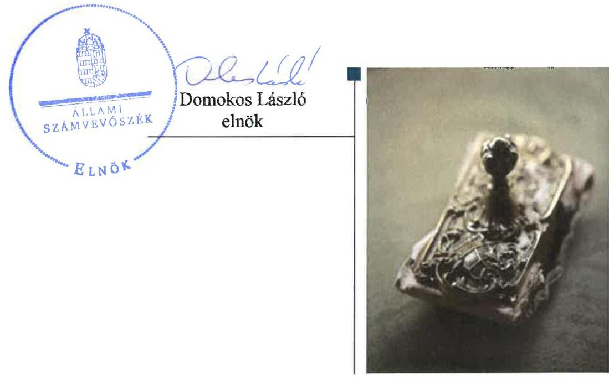
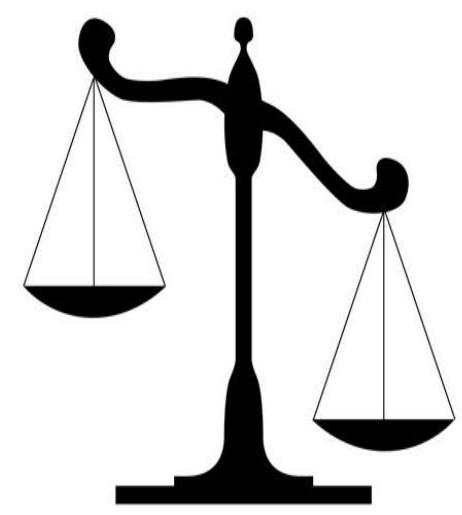
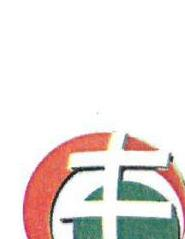
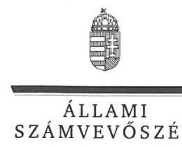
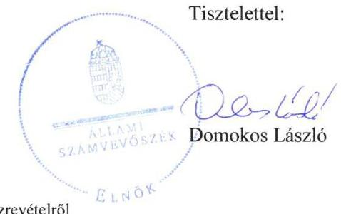
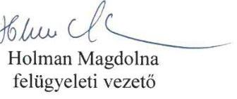

# Jelentés

A költségvetési támogatásban részesülő pártalapítványok 2015–2016. évi gazdálkodása törvényességének ellenőrzése

Jobbik Magyarországért Alapítvány 2018.

---

# Jelentés 

## A költségvetési támogatásban részesülő pártalapítványok 2015-2016. évi gazdálkodása törvényességének ellenőrzése

Jobbik Magyarországért Alapítvány 2018. 07. hó 30. nap

---

# AZ ELLENŐRZÉST FELÜGYELTE:

- **HOLMAN MAGDOLNA JULIANNA** felügyeleti vezető
- **AZ ELLENŐRZÉST VEZETTE ÉS A VÉGREHAJTÁSÁÉRT FELELŐS:**
  - **DR. GYŐRI GABRIELLA** ellenőrzésvezető
- **A PROGRAM ÖSSZEÁLLÍTÁSÁÉRT FELELŐS:**
  - **TÓTPÁL SZABOLCS** osztályvezető
- **IKTATÓSZÁM:** EL-0334-042/2018
- **TÉMASZÁM:** 2465
- **ELLENŐRZÉS-AZONOSÍTÓ SZÁM:** V081002

Jelentéseink az Országgyűlés számítógépes hálózatán és az Interneta a www.asz.hu címen is olvashatóak.

---

# TARTALOMJEGYZÉK 

■ ÖSSZEGZÉS ..... 5
■ AZ ELLENŐRZÉS CÉLJA ..... 6
■ AZ ELLENŐRZÉS TERÜLETE ..... 7
■ AZ ELLENŐRZÉS HÁTTERE, INDOKOLTSÁGA ..... 8
■ A JELENTÉS LÉNYEGES KÉRDÉSKÖREI ..... 9
■ AZ ELLENŐRZÉS HATÓKÖRE ÉS MÓDSZEREI ..... 10
■ MEGÁLLAPÍTÁSOK ..... 13
■ JAVASLATOK ..... 17
■ MELLÉKLETEK ..... 19
I. sz. melléklet: Értelmező szótár ..... 19
II. sz. melléklet: Az ÁSZ 16138 számú jelentéséhez kapcsolódó intézkedési terv végrehajtása ..... 20
■ FÜGGELÉK: ÉSZREVÉTELEK ..... 23
■ RÖVIDÍTÉSEK JEGYZÉKE ..... 31

---

.

---

# ÖSSZEGZÉS 

A Jobbik Magyarországért Alapítvány a szabályszerü gazdálkodás feltételeit megteremtette. A könyvvezetés és gazdálkodás során a 2015. évben betartotta, 2016. évben nem tartotta be a jogszabályi előirásokat. A Jobbik Magyarországért Alapítvány a tevékenységéről szóló 2015-2016. évi jelentéseket, valamint a számviteli beszámolókat a jogszabályi előirásoknak megfelelően közzétette. A végrehajtott intézkedések eredményeként a gazdálkodás szabályozottsága javult, azonban a támogatások elszámolása területén további intézkedések szükségesek.

## Az ellenőrzés társadalmi indokoltsága

A politikai kultúra fejlesztése érdekében tudományos, ismeretterjesztő, kutatási, oktatási tevékenység folytatása céljából a pártok költségvetési támogatásra jogosult alapítványt hozhatnak létre. Jogszabályi előírások alapján a pártalapítványok gazdálkodása törvényességének ellenőrzésére az Állami Számvevőszék jogosult, ezért kétévente ellenőrzi a költségvetésből támogatásban részesülő pártalapítványoknak a gazdálkodását.

Az Állami Számvevőszék stratégiájában megfogalmazta, hogy az államháztartáson kívülre nyújtott költségvetési támogatások és az ingyenes vagyonjuttatás ellenőrzésével hozzájárul ahhoz, hogy a közpénzeket a civil szervezetek is átlátható módon használják fel. A pártalapítványok gazdálkodása szabályszerűségének bemutatásával az ellenőrzés értékteremtő módon járul hozzá az Állami Számvevőszék stratégiai céljainak megvalósításához, a nyilvánosság megfelelő tájékoztatásához.

## Főbb megállapítások, következtetések, javaslatok

A Jobbik Magyarországért Alapítvány alapító okirata és a gazdálkodására vonatkozó belső szabályozás megfelelt a jogszabályi előírásoknak, ami megteremtette a közpénzekkel való átlátható és ellenőrizhető gazdálkodás alapjait.

A kapott költségvetési támogatások elszámolása megfelelt a jogszabályi előírásoknak. A ráfordítások elszámolása a 2015. évben szabályszerű volt, a 2016. évben nem volt szabályszerű, mert a Jobbik Magyarországért Alapítvány a könyvviteli nyilvántartásban költségelszámolást megalapozó bizonylatok nélkül rögzített gazdasági eseményeket. A Jobbik Magyarországért Alapítvány az ellenőrzött időszakban szabályszerűen nyújtott támogatást harmadik fél részére.

A Jobbik Magyarországért Alapítvány a 2015-2016. évi tevékenységéről a jogszabályi előírásoknak megfelelően elkészítette az éves jelentést, valamint a számviteli beszámolókat. A Jobbik Magyarországért Alapítvány teljesítette az éves jelentés, illetve a beszámoló közzétételével kapcsolatos kötelezettségét.

A Jobbik Magyarországért Alapítvány a korábbi számvevőszéki jelentésben foglalt megállapításokhoz öt pontból álló intézkedési tervet készített. Az intézkedési tervben foglalt feladatok közül hármat határidőben végrehajtott, kettőt részben hajtott végre.

---

# AZ ELLENŐRZÉS CÉLJA 

Az ellenőrzés célja annak megállapítása volt, hogy a pártalapítvány törvényesen gazdálkodott-e, az éves számviteli beszámolók és a pártalapítvány tevékenységéről szóló éves jelentések a jogszabályi előírásoknak megfeleltek-e, a könyvvezetés és gazdálkodás során a vonatkozó jogszabályi rendelkezéseket, belső előírásokat betartották-e. Továbbá az ellenőrzés célja annak értékelése volt, hogy az előző számvevőszéki jelentésben fogalt intézkedést igénylő megállapításokkal összhangban készített intézkedési tervben meghatározott feladatokat az ellenőrzött szervezet végrehajtotta-e.

---

# AZ ELLENŐRZÉS TERÜLETE 

## Jobbik Magyarországért Alapítvány

Az ellenőrzés a Párt tv ${ }^{1}$. alapján a politikai kultúra fejlesztése érdekében tudományos, ismeretterjesztő, kutatási, oktatási tevékenység folytatása céljából, a Ptk. ${ }^{2}$ szerinti létesítő/alapító okiraton alapuló bírósági nyilvántartásba vétellel létrejött pártalapítványok gazdálkodására terjedt ki. A pártalapítványok törvényes gazdálkodásának (könyvvezetése, beszámolása, jelentéstétele) szabályait alapvetően a Pártalapítványi tv³-en túl a Számv. tv ${ }^{4}$. és annak a végrehajtási rendelete a Számviteli vhr. ${ }^{5}$ határozták meg.

A Jobbik Magyarországért Mozgalom - a Párt tv.-ben és a Pártalapítványi tv.-ben biztosított lehetőséggel élve - 2011ben megalapította a Gyarapodó Magyarországért Alapítványt, amelyet a Fővárosi Törvényszék 2011. március 29-én vett nyilvántartásba 14.Pk.60.040/2011/5. számon. Az alapítvány neve a 2015. június 2-i alapító okirat módosítása óta Jobbik Magyarországért Alapítvány.
A Pártalapítvány ${ }^{6}$ alapító okirata ${ }^{7}$ szerinti célja: a politikai kultúra fejlesztése a magyar nemzettudat, a nemzeti elkötelezettség és a keresztény identitás jegyében. Ennek keretében tudományos, kutatási, oktatási, ismeretterjesztő tevékenységek támogatása.

A Pártalapítvány:
az ellenőrzött időszakban évente 266,2 M Ft költségvetési támogatásban részesült, egyéb támogatást nem kapott;
a 2015-2016. években gazdasági-vállalkozási tevékenységet nem folytatott;
a Ptk. ${ }_{1}$ és az egyesülési jogról, a közhasznú jogállásról, valamint a civil szervezetek múködéséről és támogatásáról szóló 2011. évi CLXXV. törvény alapján 2013. évben alapította a Kiegyensúlyozott Médiáért Alapítványt, melyet a Fővárosi Törvényszék 2014. január 17-i végzéssel vett nyilvántartásba.
A Pártalapítványnál az ellenőrzött időszakban külső ellenőrzés nem volt.

---

# AZ ELLENŐRZÉS HÁTTERE, INDOKOLTSÁGA 

Társadalmi elvárás a közpénzek értékelvű, rendeltetésszerű felhasználása, a közpénzekből nyújtott támogatások átláthatóságának megteremtése, amelyhez az ÁSZ ${ }^{8}$ az államháztartásból nyújtott támogatások ellenőrzésével kíván hozzájárulni. A Párt tv. 9/A § (1) bekezdése alapján a politikai kultúra fejlesztése érekében tudományos, ismeretterjesztő, kutatási, oktatási tevékenység folytatása céljából létrehozott pártalapítványok gazdálkodása törvényességének ellenőrzése - Pártalapítványi tv. 4. § (2) bekezdése értelmében - az ÁSZ feladata. E törvény 4. § (4) bekezdése alapján az ÁSZ kétévente - kötelező jelleggel - ellenőrzi azoknak a pártalapítványoknak a gazdálkodását, amelyek költségvetési támogatásban részesültek.

Az ÁSZ, mint az Országgyűlés ellenőrző szerve a pártalapítványok gazdálkodása törvényességének/szabályszerűségének értékelésével hozzájárul ahhoz, hogy a társadalom objektív képet alkothasson a pártalapítványok működéséről. Az ellenőrzés eredményeinek célzott felhasználói a nyilvánosság, a jogalkotó, továbbá a pártalapítványok esetén azok alapítója és szervei. A jelentésben foglalt megállapítások, következtések és javaslatok alapján a törvényalkotók konkrét lépéseket tehetnek a pártalapítványokra vonatkozó szabályozások megváltoztatása, átláthatóbbá, ellenőrizhetőbbé tétele irányába. Az ellenőrzött szervezetek szintjén a hiányosságok, szabálytalanságok feltárása, az ennek kapcsán megfogalmazott megállapítások elősegíthetik a pártalapítványok szabályszerű gazdálkodását.

Az ÁSZ tv. ${ }^{9}$ 33. § (1) bekezdése értelmében a számvevőszéki jelentések intézkedést igénylő megállapításaihoz és javaslataihoz kapcsolódóan az ellenőrzött szervezet vezetője intézkedési tervet köteles összeállítani, és az ÁSZ részére megküldeni. Az intézkedési tervben foglaltak megvalósítását az ÁSZ törvény 33. § (7) bekezdésében foglaltak alapján - az ÁSZ utóellenőrzés keretében ellenőrizheti. Az utóellenőrzések keretében - az intézkedések értékelése során - az ÁSZ figyelembe veszi az ellenőrzött szervezetek működési feltételeiben, valamint a jogszabályi előírásokban bekövetkezett változásokat. Az ÁSZ az utóellenőrzés során értékeli, hogy az érintett számvevőszéki jelentésben foglalt intézkedést igénylő megállapításokkal és javaslatokkal összhangban, az ellenőrzött szervezet által készített intézkedési tervben meghatározott feladatokat a feladatra kijelöltek végrehajtották-e. Az intézkedések végrehajtásával az adott terület szabályszerű működése vonatkozásában a kockázatok csökkenhetnek, azonban hoszszabb távon az intézkedési tervben foglaltak végrehajtásával önmagában nem szűnnek meg, csak akkor, ha beépülnek az ellenőrzött szervezet működésébe, azokat folyamatosan karbantartják, figyelembe véve, illetve kezelve a változásokat. Emellett az intézkedések végrehajtásáig újabb kockázatok merülhetnek fel a szabályszerű működés vonatkozásában, amelyek kezelése szintén kiemelten fontos az ellenőrzött szervezet számára.

---

# A JELENTÉS LÉNYEGES KÉRDÉSKÖREI 

1.     - A Jobbik Magyarországért Alapítvány gazdálkodásának törvényessége biztositott volt-e?
2.     - A Jobbik Magyarországért Alapítvány könyvvezetése és gazdálkodása során a vonatkozó jogszabályi rendelkezéseket és belső elöírásokat betartották-e?
3.     - A Jobbik Magyarországért Alapítvány tevékenységéről szóló éves jelentések, az éves számviteli beszámolók a jogszabályi elöírásoknak megfeleltek-e?
4. A Jobbik Magyarországért Alapítvány a számvevőszéki jelentésben foglalt intézkedést igénylő megállapításokkal összhangban készített intézkedési tervben meghatározott feladatokat végrehajtotta-e?

---

# AZ ELLENŐRZÉS HATÓKÖRE ÉS MÓDSZEREI 

## Az ellenőrzés típusa

Szabályszerúségi ellenőrzés.

## Az ellenőrzött időszak

2015. január 1 - 2016. december 31.

Az utóellenőrzés tekintetében a 16138 számú ÁSZ jelentés közzétételének napjától (2016. szeptember 22.) jelen ellenőrzésről szóló kiértesítő levél keltének (2017. november 1.) napjáig tartó időszak.

## Az ellenőrzés tárgya

Az ellenőrzés tárgyát képezte a pártalapítvány gazdálkodása, a könyvvezetés szabályozása és gyakorlata szabályszerűsége, az éves számviteli beszámolókra és az alapítvány tevékenységéről szóló éves jelentésekre vonatkozó kötelezettség teljesítése, valamint a gazdálkodáshoz kapcsolódó ellenőrzések javaslatainak hasznosítására irányuló tevékenység.

Az ÁSZ tv. 2011. július 1-jei hatálybalépését követően a számvevőszéki jelentésben foglalt intézkedést igénylő megállapításokkal és javaslatokkal összhangban - az ellenőrzött szervezet által - készített intézkedési tervben foglaltak végrehajtásának ellenőrzése. Az utóellenőrzéssel érintett intézkedések végrehajtása elmaradásának következtében továbbra is fennálló szabálytalanságok értékelése a közpénzek, közvagyon veszélyeztetettségi kockázata valószínűsített hatására vonatkozóan. Az ellenőrzés kiterjedt minden olyan körülményre és adatra, amely az ÁSZ jogszabályban meghatározott feladatainak teljesítéséhez, valamint a program végrehajtása folyamán felmerült újabb összefüggések feltárásához szükséges.

## Az ellenőrzött szervezet

Jobbik Magyarországért Alapítvány

## Az ellenőrzés jogalapja

Az Alaptörvény ${ }^{10}$ 43. cikk (1) bekezdése, ÁSZ tv. 1. § (3) bekezdése, 5. § (3) bekezdése, 33. § (1)-(2) és (7) bekezdései, a Pártalapítványi tv. 4. § (2) és (4) bekezdései.

---

# Az ellenőrzés módszerei 

Az ellenőrzést az ÁSZ az Ellenőrzési program szempontjai, az ellenőrzött időszakban hatályos jogszabályok, a jelen ellenőrzésre irányadó ÁSZ módszertan figyelembe vételével végezte.

A pártalapítvány tevékenységéről szóló éves jelentési-, beszámoló- és közzétételi kötelezettséget a 2014. évben létrehozott alapítványok esetében a 2014. év tekintetében is ellenőrizte az ÁSZ. A 2014. évben alapított pártalapítványok esetében az alapítás szabályszerűségét is értékelte.

Az ellenőrzés ideje alatt az ellenőrzött szervezettel történő kapcsolattartás az ÁSZ SZMSZ ${ }^{11}$-ének vonatkozó előírásai alapján történt.

Az ellenőrzési kérdések megválaszolásához szükséges bizonyítékok megszerzése az ellenőrzött által rendelkezésre bocsátott dokumentumokra, adatokra alapozva megfigyelés, szemle (szemrevételezés), kérdésfeltevés (információkérés), mintavételezés, valamint elemző eljárás útján történt. A mintavételezés véletlen mintavételi eljárással történt.

Az ellenőrzési bizonyítékként felhasználható adatforrások közé tartoztak egyrészt az Ellenőrzési program részletes szempontjainál felsorolt adatforrások, másrészt minden egyéb - az ellenőrzés folyamán - feltárt, az ellenőrzés szempontjából információt tartalmazó dokumentum.

Az ellenőrzés lefolytatásához az ellenőrzött a tanúsítványok elektronikus kitöltésével, valamint az ÁSZ által kért dokumentumok elektronikus megküldésével szolgáltatott adatokat. Az így rendelkezésre bocsátott adatok, információk, a tanúsítványok adatai valódiságának kontrollja az ellenőrzés keretében történt.

Az utóellenőrzés megállapításait az ÁSZ rendelkezésére álló dokumentumok, valamint az ÁSZ adatbekérésére szerint, az ellenőrzött szervezet által elektronikusan rendelkezésre bocsátott dokumentumok, adatok alapján kellett megfogalmazni. Az utóellenőrzés esetében az intézkedési tervekben előírt feladatokat, azok végrehajthatósága, illetve végrehajtása szempontjából az alábbiak szerint kellett értékelni:
„határidőben végrehajtott" a feladat, ha a teljesítés dokumentáltan, az intézkedési tervben előírt határidőben és tartalommal megtörtént;
„határidőn túl végrehajtott" a feladat, ha annak teljesítése az intézkedési tervben meghatározott módon, de az abban előírt határidőn túl történt meg;
„részben végrehajtott" a feladat, amelynek végrehajtása nem teljes körűen az intézkedési tervben előírt módon történt meg;
„nem végrehajtott" a feladat, ha a végrehajtás nem történt meg, vagy amennyiben a teljesítést/végrehajtást nem dokumentálták, dokumentumokkal nem tudták igazolni annak teljesítését;
„okafogyottá vált" a feladat, ha végrehajtására - meghatározott esemény bekövetkezése, továbbá külső körülmény, a múködést érintő feltétel változása miatt - már nincs szükség, illetve lehetőség, és egyértelműen megállapítható, hogy az intézkedést szükségessé tevő körülmény a jövőben nem fordulhat elő;

---

$\longrightarrow$ „nem időszerü" az a feladat, amelynek ellenőrzési időszakon belüli végrehajtására azért nem került (kerülhetett) sor, mert az intézkedés alapjául szolgáló esemény nem következett be, de annak jövőbeni előfordulása lehetséges, a végrehajtása nem volt esedékes, vagy a végrehajtás határideje még nem járt le.

---

# 1. A Jobbik Magyarországért Alapítvány gazdálkodásának törvényessége biztosított volt-e? 

Összegző megállapítás

### 1.1. számú megállapítás

1.2. számú megállapítás

A Pártalapítvány a szabályszerű gazdálkodás feltételeit kialakította.

A Pártalapítvány gazdálkodása szervezeti kereteinek kialakítása a jogszabályokban előírtaknak megfelelt.

Az alapító okirat - a Ptk. ${ }_{2}$, a Párt tv., és a Pártalapítványi tv. rendelkezéseivel összhangban - rögzítette a Pártalapítvány célját, az induló vagyont, a vagyon felhasználási módját, kezelésének a szabályait, a Pártalapítvány kezelő szervének hatáskörét, eljárási szabályait.

A kezelő szerv (Kuratórium ${ }^{12}$ ) múködésének részletes szabályait az alapító okirattal összhangban az SZMSZ ${ }_{1-3}{ }^{13}$, illetve a Kuratóriumi Úgyrend ${ }^{14}$ tartalmazta.

A Pártalapítvány könyvvezetési- és nyilvántartási rendszerét a Számv. tv. és a Számviteli vhr. előírásainak megfelelően alakította ki, beszámolási kötelezettségét egyszerűsített éves beszámoló készítésével teljesítette.

A Pártalapítvány gazdálkodására vonatkozó belső szabályozás megfelelt a Számv. tv. előírásainak.

A Pártalapítvány gazdálkodására vonatkozó szabályzatok - Számviteli politika ${ }_{1-2}{ }^{15}$, Értékelési szabályzat ${ }_{1-2}{ }^{16}$, Leltározási szabályzat ${ }_{1-2}{ }^{17}$, Pénzkezelési szabályzat ${ }^{18}$, Számlarend ${ }_{1-2}{ }^{19}$ - megfeleltek a Számv. tv. és a Számviteli vhr. előírásainak.

A Pártalapítvány a 2015- 2016. években nem alakította ki - az Info. tv. ${ }^{20}$ 7. § (2) bekezdésének előírása ellenére - az adatok biztonságának és védelmének érvényre juttatásához szükséges eljárási szabályokat.

---

# 2. A Jobbik Magyarországért Alapítvány könyvvezetése és gazdálkodása során a vonatkozó jogszabályi rendelkezéseket és belső előírásokat betartották-e? 

Összegző megállapítás

A Pártalapítvány könyvvezetése és gazdálkodása a 2015. évben megfelel, a 2016. évben nem felelt meg a vonatkozó jogszabályi rendelkezéseknek.
2.1. számú megállapítás

A Pártalapítvány által az ellenőrzött időszakban elfogadott támogatások számviteli elszámolása megfelelt a jogszabályi előírásoknak.

A kapott támogatások számviteli elszámolása megfelelt az alapító okirat, a Számv. tv, a Számviteli vhr., a Számviteli politika ${ }_{1-2}$ valamint a Számalrend ${ }_{1,2}$ előírásainak.
2.2. számú megállapítás

A Pártalapítvány ráfordításainak elszámolása a 2015. évben szabályszerű volt, a 2016. évben nem volt szabályszerű. A Pártalapítvány az ellenőrzött időszakban a támogatásokat szabályszerűen nyújtotta.

A 2015. évi ráfordítások elszámolása szabályszerű volt. A 2016. évben a ráfordítások elszámolása nem volt szabályszerű, mert - a Számv. tv. 165. § (1)-(2) bekezdéseinek előírása ellenére - a könyvviteli nyilvántartásban bizonylat nélkül rögzítettek gazdasági eseményeket.

A Pártalapítvány az ellenőrzött időszakban, a Kuratórium ügyrendjében, valamint a Bírálati szabályzatban ${ }^{21}$ foglaltaknak megfelelően nyújtott támogatást. A Pártalapítvány harmadik fél részére a 2015. évben 173,4 M Ft, a 2016. évben 197,3 M Ft támogatást nyújtott. A támogatások kifizetését a számviteli nyilvántartásokban a Számviteli vhr. előírásai szerint rögzítették.

A Pártalapítvány, betartva a Párt tv. rendelkezéseit, az alapító párt részére vagyoni hozzájárulást nem nyújtott.

## 3. A Jobbik Magyarországért Alapítvány tevékenységéről szóló éves jelentések, az éves számviteli beszámolók a jogszabályi előírásoknak megfeleltek-e?

Összegző megállapítás

A Pártalapítvány 2015-2016. évi tevékenységéről szóló éves jelentések és éves számviteli beszámolók közzétételével kapcsolatos kötelezettségét a jogszabályi előírásoknak megfelelően teljesítette.

A Pártalapítvány a tevékenységéről szóló 2015. és 2016. évi éves jelentéseket - a Pártalapítványi tv. előírásainak megfelelve - elkészítette, azokat a Kuratórium határidőben jóváhagyta és gondoskodott a Pártalapítványi tv.-nek megfelelően közzétételükről a Magyar Közlöny mellékleteként

---

megjelenő Hivatalos Értesítőben, továbbá az éves jelentéseket a Pártalapítvány a honlapján is közzétette.

A 2015-2016. években a Pártalapítvány eleget tett - Számv.tv., a Számviteli vhr. és a Számviteli politika ${ }_{1-2}$ előírásai alapján - az egyszerűsített éves beszámoló készítési kötelezettségének. A 2015-2016. évi számviteli beszámolók elkészítéséhez, a mérlegtételek alátámasztásához a Számv. tv.-ben és a Leltározási szabályzat ${ }_{1-2}$-ben foglalt leltározást a Pártalapítvány elvégezte, a leltárt összeállította.

A Kuratórium - az ellenőrzött időszakban - a számviteli beszámolókat jóváhagyta. A beszámolók közzétételére a Számviteli vhr. szerinti határidőben került sor.

# 4. A Jobbik Magyarországért Alapítvány a számvevőszéki jelentésben foglalt intézkedést igénylő megállapításokkal összhangban készített intézkedési tervben meghatározott feladatokat végrehajtotta-e? 

Összegző megállapítás

A Pártalapítvány a korábbi számvevőszéki jelentésben foglalt intézkedést igénylő megállapításokkal összhangban készített intézkedési tervben meghatározott feladatokat többségében végrehajtotta.

A 16138 számú számvevőszéki jelentésben ${ }^{22}$ megfogalmazott megállapításokhoz a Kuratórium - az ÁSZ tv.-ben rögzített határidőben - az intézkedési tervet ${ }^{23}$ elkészítette és az ÁSZ részére megküldte, amelyet az ÁSZ elnöke elfogadott. A Kuratórium a feladatok végrehajtásáról kettő kivételével határidőben és teljes körűen gondoskodott.

Határidőben megvalósult intézkedések:

- A Számv. tv.-nek megfelelően határozták meg az ingatlanok menynyiségi felvétellel történő leltározását, a módosított leltározási szabályzatot a Kuratórium határozatával jóváhagyta, a számlarend javasolt kiegészítését határozatával elfogadta. A „tartalom elsődlegessége a formával szemben" számviteli alapelv az ellenőrzött időszakban érvényesült, a Kuratórium elnöke az alapelv betartásának ellenőrzésére felkérte a könyvvizsgálót az intézkedési tervben vállaltak szerint.
- A gondoskodtak arról, hogy a kötelezettségvállalást az arra felhatalmazott személy végezze.
- Az éves jelentésekben gondoskodtak a cél szerinti juttatások teljes körű bemutatásáról.
Részben végrehajtott feladatok:
- Az intézkedési tervben a támogatási szerződések kuratóriumi döntésnek megfelelő megkötésével kapcsolatos feladatok folyamatos ellenőrzését, továbbá azok munkafolyamatainak az SZMSZ-ben történő rögzítését vállalták 2016. november 30-ig. Az SZMSZ ezzel kapcsolatos módosítását a Kuratórium a vállalt határidőt követően,

---

2016. december 29-én hagyta jóvá. A támogatási szerződések alapítványi igazgató kézjegyével ellátását a Pártalapítvány nem hajtotta végre.
— Az intézkedési tervben a támogatással való elszámolás hiánya miatti szankciók érvényesítésével kapcsolatos feladatok folyamatos ellenőrzését, továbbá azok munkafolyamatainak az SZMSZ-ben történő rögzítését vállalták 2016. november 30-ig. Az SZMSZ ezzel kapcsolatos módosítását a Kuratórium a vállalt határidőt követően, 2016. december 29-én hagyta jóvá. Az elszámolási kötelezettség teljesítésével kapcsolatos havi jelentések elkészítésének feladatát a Pártalapítvány nem hajtotta végre.
Az intézkedési tervben meghatározott feladatokat, határidőket, felelősöket és a feladatok végrehajtását a II. számú melléklet mutatja be.

---

# JAVASLATOK 

Az ÁSZ tv. 33. § (1) bekezdésében foglaltak értelmében az ellenőrzött szervezet vezetője köteles a jelentésben foglalt megállapításokhoz kapcsolódó intézkedési tervet összeállítani és azt a jelentés kézhezvételétől számított 30 napon belül az ÁSZ részére megküldeni. Amennyiben az ellenőrzött szervezet vezetője nem küldi meg határidőben az intézkedési tervet, vagy továbbra sem elfogadható intézkedési tervet küld, az Állami Számvevőszék elnöke az ÁSZ tv. 33. § (3) bekezdése a) és b) pontjaiban foglaltakat érvényesítheti.

## A Jobbik Magyarországért Alapítvány Kuratóriuma elnökének

1. Intézkedjen az Info tv.-ben elöírtak érvényre juttatásához szükséges eljárási szabályok kialakítására.
(1.2. sz. megállapítás 2. bekezdése alapján)
2. Intézkedjen, hogy a számviteli nyilvántartásokba az adatok csak a Számv. tv.-nek megfelelő bizonylat alapján kerüljenek bejegyzésre.
(2.2. sz. megállapítás 1. bekezdése alapján)

---

.

---

# MELLÉKLETEK 

- I. SZ. MELLÉKLET: ÉRTELMEZŐ SZÓTÁR
alapítvány
gazdálkodó tevékenység
gazdasági-vállalkozási
tevékenység
költségvetésből juttatott/nyújtott forrás/támogatás
pártalapítvány

Az alapítvány az alapító által az alapító okiratban meghatározott tartós cél folyamatos megvalósítására létrehozott jogi személy. Az alapító az alapító okiratban meghatározza az alapítványnak juttatott vagyont és az alapítvány szervezetét. Alapítvány nem alapítható gazdasági-vállalkozási tevékenység folytatására. Az alapítvány az alapítványi cél megvalósításával közvetlenül összefüggő gazdasági tevékenység végzésére jogosult. Alapítvány nem lehet korlátlan felelősségű tagja más jogalanynak, nem létesíthet alapítványt és nem csatlakozhat alapítványhoz. (Forrás: Ptk. 3:378. §, 3:379. § (1) - (3) bekezdés)
azon tevékenységek összessége, amelyek a civil szervezet vagyoni, pénzügyi, jövedelmi helyzetére kiható gazdasági eseményt eredményeznek. (Forrás: Ectv ${ }^{24}$. 2. § 10. pont.)
A jövedelem- és vagyonszerzésre irányuló vagy azt eredményező, üzletszerűen végzett gazdasági tevékenység, kivéve az adomány (ajándék) elfogadását, a létesítő okiratban meghatározott cél szerinti tevékenységet (ideértve a közhasznú tevékenységet is), - 2015. november 28-tól - a pénzeszközök betétbe, értékpapírba, társasági részesedésbe történő elhelyezését és az ingatlan megszerzését, használatának átengedését és átruházását. (Forrás: Ectv. 2. § 11. pont.)
a pártalapítványoknak a Párt tv. 9/A. § (1) bekezdése és a Pártalapítványi tv. 1. § előírásainak értelmében, az éves költségvetési törvények szerint-jellemzően az 1. számú melléklet 1. Országgyűlés fejezet 9. Pártalapítványok támogatás címen - az állami költségvetésből juttatott forrás/támogatás. az államháztartás központi alrendszeréből - a Tb alap kivételével - ellenérték nélkül, pénzben nyújtott költségvetési támogatás (Forrás: Áht ${ }^{25}$. 1. § 14. pont)
a politikai kultúra fejlesztése érdekében, tudományos, ismeretterjesztő, kutatási és oktatási tevékenység folytatása céljából pártok által létrehozott, külön jogszabályban - a Pártalapítványi tv. 1. § és 3. § (1) bekezdésében- meghatározott, jogi személynek minősülő egyéb szervezet (Forrás: Párt tv. 9/A. § (1) bekezdés, Pártalapítványi tv. 1. §, Számv. tv. 3. § (1) bekezdése 4. pont, Számviteli vhr. 2. § (1) bekezdés k) pont, 4. § (1) bekezdés)

---

# II. SZ. MELLÉKLET: AZ ÁSZ 16138 SZÁMÚ JELENTÉSÉHEZ KAPCSOLÓDÓ INTÉZKEDÉSI TERV VÉGREHAJTÁSA

|  Sorszám | Intézkedési
tervben
meghatározott feladat | Az intézkedési
tervben
meghatározott
határidő | Az intézkedési
tervben meghatározott feladat felelőse | A feladat végrehajtása  |
| --- | --- | --- | --- | --- |
|  Határidőben végrehajtott feladatok |  |  |  |   |
|  1. | A leltározási szabályzat módosításának előkészítését a gazdasági igazgató elvégzi 2016. 11.30-ig, majd beterjeszti a kuratórium elé, amely dönt annak elfogadásáról. A módosítást ellenőrzi az Alapítvány könyvvizsgálója. Valamennyi alkalmazásra kijelölt számla számjelének és megnevezésének a számlarendben történő szerepeltetésének és a tartalom elsődlegessége a formával szemben számviteli alapelvnek a könyvvezetés során történő érvényesítésének ellenőrzését az Alapítvány gazdasági igazgatója végzi negyedéves rendszerességgel, valamint felkéri ennek ellenőrzésére az Alapítvány könyvvizsgálóját is az éves könyvvizsgálat keretében. | 2016.12.31 a leltározási szabályzat módosítása vonatkozásában, egyébként folyamatos 2016.11.01-től | kuratórium elnöke | A leltározási szabályzat és a számlarend Számv. tv.-nek megfelelő módosításáról a Kuratórium határidőben döntött. A Pártalapítvány gazdasági igazgatója az ellenőrzési feladatot végrehajtotta, a könyvvezetés során érvényesült a „tartalom elsődlegessége a formával szemben" számviteli alapelv. A Pártalapítvány könyvvizsgálója a feladat elvégzésére vonatkozó felkérést tartalmazó levelet átvette.  |
|  2. | A jövőben az alapítványi igazgató ellenőrzi, hogy a kötelezettségvállalásra az SZMSZ-ben arra felhatalmazott személy által került-e sor. Amennyiben eltérést észlel, úgy az eltérésre felhívja a kuratórium figyelmét. | 2016.11.01-től folyamatos | kuratórium elnöke | A Pártalapítványi igazgató az ellenőrzést végrehajtotta.  |
|  3. | A számviteli feladatokat végző vállalkozó tájékoztatása megtörtént annak érdekében, hogy az éves jelentésekbe a Pártalapítványi törvény előírásának megfelelően a GYMA által nyújtott cél szerinti juttatások az éves jelentésbe teljes körűen bemutatásra kerüljenek. A tárgyévi éves jelentés kuratórium általi elfogadását megelőzően a kuratórium ellenőrzi ennek megfelelő végrehajtását, valamint felhívja az Alapítvány könyvvizsgálóját is ennek ellenőrzésére. | 2017.05.31 | kuratórium elnöke | A könyvvizsgáló 2017. március 1-jén, a számviteli feladatokat végző vállalkozó 2016. december 1-jén vette át a levelet, amelyek a feladat végrehajtására vonatkozó kuratóriumi döntést tartalmazták. Az éves jelentésekben gondoskodtak a cél szerinti juttatások teljes körű bemutatásáról.  |

---

|  4. | A támogatási szerződéseket aláírásuk előtt az alapítványi igazgató ellenőrzi, különös tekintettel a vonatkozó kuratóriumi döntés meghozatalára, valamint annak összegére. Amennyiben az elkészített szerződést rendben találja, kézjegyével ellátja jelezve a kuratórium elnöke számára a szerződés megfelelőségét. Az alapítványi igazgató módosítja a Szervezeti és Müködési Szabályzatot fenti munkafolyamatot belefoglalva abba. | 2016.11.30 az SZMSZ módosítása vonatkozásában, egyébként folyamatos 2016.11.01-től | kuratórium elnöke | Az SZMSZ módosítására a vállalt határidőn túl került sor, a 2016. 12.29.-én jóváhagyott SZMSZ1 8. pontja tartalmazta a feladat elvégzésének munkafolyamatát. A támogatási szerződéseket a kuratóriumi döntéssel összhangban kötötték meg, azonban a 2016. november 1-je után kötött szerződéseket az alapítványi igazgató kézjegyével nem látta el.  |
| --- | --- | --- | --- | --- |
|  5. | Az alapítványi igazgató havonta jelentést készít a kuratórium részére az elszámolási kötelezettségüket határidőre nem teljesítő támogatottakról. Amennyiben a kuratórium nem ülésezik adott hónapban, a jelentést a kuratórium elnöke részére juttatja el. Fenti jelentés alapján az Alapítvány meg tudja tenni a támogatási szerződésekben foglalt, a támogatással való elszámolás hiányára előírt szankciók támogatottakkal szembeni érvényesítése érdekében szükséges lépéseket. Az alapítványi igazgató előkészíti a Szervezeti és Müködési Szabályzat módosítását fenti munkafolyamat belefoglalva abba, ezt követően beterjeszti a kuratórium számára, amely dönt annak elfogadásáról. | 2016.11.30 az SZMSZ módosítása vonatkozásában, egyébként folyamatos 2016.11.01-től | kuratórium elnöke | Az SZMSZ módosítására a vállalt határidőn túl került sor, a 2016. 12.29.-én jóváhagyott SZMSZ1 8. pontja tartalmazta a feladat elvégzésének munkafolyamatát. Az elszámolási kötelezettség teljesítésével összefüggő havi jelentéseket a Pártalapítvány nem készítette el.  |

---

.

---

# FÜGGELÉK: ÉSZREVÉTELEK 

A jelentéstervezetet a Számvevőszék 15 napos észrevételezésre megküldte az ellenőrzött szervezet vezetőjének az ÁSZ tv. 29. §* (1) bekezdése előírásának megfelelően.
A függelék tartalmazza az ellenőrzött észrevételeit, illetve az el nem fogadott észrevételek elutasításának indoklását.

* 29. § (1) Az Állami Számvevőszék az ellenőrzési megállapításait megküldi az ellenőrzött szervezet vezetőjének vagy az általa megbízott személynek, és annak, akinek személyes felelősségét állapította meg.
(2) Az ellenőrzött szervezet vezetője és a felelősként megjelölt személy az ellenőrzés megállapításaira tizenöt napon belül írásban észrevételt tehet.
(3) Az Állami Számvevőszék az észrevételre a beérkezésétől számított harminc napon belül írásban válaszol. A figyelembe nem vett észrevételeket köteles a jelentésben feltüntetni, és megindokolni, hogy azokat miért nem fogadta el.

---

Jobbik Magyarországér
Budapest, Villányi út 20/B 1113

# Címzett: Holman Magdolna felügyeleti vezető részére 

Állami Számvevőszék
Tárgy: Észrevételek a Jelentéstervezethez.

Előzmény: EL-0556-012/2018, KI-
$45979 / 2018 / 1$

Tisztelt Felügyeleti Vezető Asszony!

A Jobbik Magyarországért Alapítvány (továbbiakban: Alapítvány) 2018. május 28-án átvette az EL-0556-012/2018-as iktatószámú levelükben küldött Számvevőszéki Jelentéstervezetet, amelynek kapcsán az Állami Számvevőszékről szóló 2011. évi LXVI. törvény (ÁSZ tv.) 29. § (2) bekezdés előírása alapján ellenőrzött szervezet vezetője az ellenőrzés megállapításaira tizenöt napon belül írásban észrevételt tehet. Észrevételeink előkészítéshez konzultáltunk az Alapítvány könyvvizsgálójával, valamint 2018. június 4-én pontosító kérdéssel fordultunk az Állami Számvevőszékhez (továbbiakban: ÁSZ), azonban utóbbitól a 2018. június 7-én érkezett KI-45979/2018/1 iktatószámú levélben érdemi választ nem kaptunk.

A jelentés tervezetben foglalt megállapítások 3 csoportba sorolhatók.

1. Az intézkedési tervben foglalt feladatok végrehajtása
2. A belső szabályozás hiányossága
3. A jogszabályi előírások megsértése a 2016. évi ráfordítások elszámolása tekintetében.

Az 1. pontban foglaltak közül két megállapítás szerepel:
a. Az első szerint „A támogatási szerződések alapítványi igazgató kézjegyével ellátását a Pártalapítvány nem hajtotta végre".A vizsgált időszakot (2015-2016) követően a 2017-es évtől az Alapítvány igazgatója a belső szabályzat szerint eljárva a támogatási szerződéseket szignálja. Így az további intézkedést nem igényel, az Alapítvány müködési gyakorlatává vált.

---

b. A második szerint, hogy „Az elszámolási kötelezettség" (támogatások) „teljesítésével kapcsolatos havi jelentések elkészítésének feladatát a Pártalapítvány nem hajtotta végre." Az Alapítvány igazgatójának 2017. december 5-i nyilatkozata a Számvevőszéket tájékoztatja arról, hogy a Szervezeti és Müködési Szabályzat 2016, december 29-i módosítását követően, folyamatos naprakész tájékoztatás áll a kuratórium tagjai részére, akiket a rendes ügymenet szerint erről folyamatosan tájékoztatnak (így a kuratóriumi üléseken szóban, amennyiben nem havi gyakorisággal ülésezik, akkor pedig a kuratóriumi elnökét külön, valamint az összegző táblázat elérhető folyamatosan a tagok számára).
Összegezve: a két intézkedési tervben meghatározott feladat ugyan késéssel, de végre lett hajtva.

A 2. pontban az ÁSZ az Info. tv. 7.§ (2) bekezdésére hivatkozva az adatok biztonságának és védelmének érvényre juttatásához szükséges eljárási szabályok kialakításának hiányát kifogásolja. E megállapításra a GDPR rendelkezéseivel összhangban a kuratórium új szabályokat fog elfogadni, az erre vonatkozó vállalását az intézkedési tervben a későbbiekben rögzíteni fogja.

A 3. pontban foglalt megállapítás a következő: „A ráfordítások elszámolása ... a 2016. évben nem volt szabályszerű, mert a Jobbik Magyarországért Alapítvány - a számvitelről szóló 2000. évi C. sz. törvény 165.§ (1)-(2) bekezdéseinek előirása ellenére - a könyvviteli nyilvántartásban költségelszámolást megalapozó bizonylatok nélkül rögzített gazdasági eseményeket."
Az idézett jogszabály a következőképpen rendelkezik:
„165. § (1) Minden gazdasági múveletről, eseményről, amely az eszközök, illetve az eszközök forrásainak állományát vagy összetételét megváltoztatja, bizonylatot kell kiállítani (készíteni). A gazdasági múveletek (események) folyamatát tükröző összes bizonylat adatait a könyvviteli nyilvántartásokban rögzíteni kell.
(2) A számviteli (könyvviteli) nyilvántartásokba csak szabályszerűen kiállított bizonylat alapján szabad adatokat bejegyezni. Szabályszerű az a bizonylat, amely az adott gazdasági múveletre (eseményre) vonatkozóan a könyvvitelben rögzítendő és a más jogszabályban elöirt adatokat a valóságnak megfelelően, hiánytalanul tartalmazza, megfelel a bizonylat általános alaki és tartalmi követelményeinek, és amelyet - hiba esetén - elöirásszerüen javitottak.

---

A megállapítás a fentiek alapján a bizonylati elv megsértését tartalmazza. A jelentés tervezet nem tér ki arra, hogy hány esetben, milyen értékre vonatkozóan, illetve pontosan mely könyvelt gazdasági múveletek esetében azonosítja a törvényi előírás megsértését az ellenőrzés, és az erre vonatkozó 2018. június 4-i levelünkre se kaptunk érdemi választ. Ugyanakkor tény, hogy a jelentés tervezet a sérelmezett bizonylati körből az Alapítvány által nyújtott támogatásokat kiveszi. A 14. oldalon a 2.2. pontban ugyanis pont az idézett megállapítást követően a következő mondat szerepel: „A Pártalapítvány az ellenőrzött időszakban a támogatásokat szabályszerűen nyújtotta." Ebből azt a következtetés lehet levonni, hogy a feltételezett bizonylat hiányos, vagy nem szabályszerűen bizonylatolt ráfordítás kört az alapítvány működési ráfordításai között kell keresni. Ezek lehetnek létező, de be nem kért és nyújtott bizonylatok, bizonylat nélkül elvégzett kis értékre vonatkozó vegyes jellegű könyvelések, mint kerekítési különbözetek, beszámítások. Az Alapítvány könyvvizsgálója a 2016. évi egyszerűsített éves beszámoló könyvvizsgálata során ilyet nem állapított meg. Ilyen megállapítás esetén az ellenőrzés alá vont észrevételi joga érdemi gyakorlása érdekében az ellenőrző szervtől elvárható lenne, hogy a tervezetben, vagy egy ahhoz csatolt mellékletben a bizonylati hiányokat, vagy a létező bizonylatok alaki és tartalmi hiányosságára vonatkozó megállapításait tételesen rögzítse, ezzel lehetőséget adva az ellenőrzöttnek arra, hogy tartalmi, tényleges észrevételt tehessen. Ez ebben a jelentés tervezetben nem így van.
Mindezek fényében kérjük, a ráfordítások elszámolására vonatkozó megállapítás megalapozását. A Jobbik Magyarországért Alapítvány Számviteli Politika 7.2 pontja szerint a hiba feltárásának évében a feltárt hibát a szabályzatban foglaltak alapján minősíteni kell, illetve a G. bekezdés alapján az önrevíziót végre kell hajtani. Mivel a tervezet nem tartalmazza, hogy hány esetben, milyen értékre vonatkozóan, illetve pontosan mely könyvelt gazdasági műveletek esetében azonosítja a törvényi előírás megsértését az ellenőrzés, így a Jobbik Magyarországért Alapítvány a számviteli politikában foglaltakat nem tudja végrehajtani. Összefoglalóan konkrétumok hiányában a megállapítást elfogadni nem tudjuk, mert az esetleges hiányosságok kijavítására nem áll rendelkezésre elegendő információ, a megfogalmazott javaslatokra adandó intézkedési tervben a későbbiekben nem tudunk pontosan meghatározni.

---

Amennyiben szükséges a 2016. évre vonatkozó ráfordítás jellegű tételeket teljességében csatoljuk a szabályszerűnek talált támogatási anyagok kivételével, amelyet már teljességében az adatbekéréskor benyújtottunk.

Budapest, 2018. június 11.
Tisztelettel:
Szabó Gábor
kuratóriumi elnök

---

ELNÖK

Ikt.szám: EL-0556-015/2018.

# Szabó Gábor úr 

Kuratórium elnöke
Jobbik Magyarországért Alapítvány

## Budapest

## Tisztelt Elnök Úr!

„A költségvetési támogatásban részesülö pártalapítványok 2015-2016. évi gazdálkodása törvényességének ellenörzése - Jobbik Magyarországért Alapitvány" címủ számvevőszéki jelentéstervezetre tett észrevételét köszönettel megkaptam.

Az Állami Számvevőszék észrevételekre vonatkozó álláspontjáról a felügyeleti vezető által készített tájékoztatást csatoltan megküldőm.

Tájékoztatom Elnök urat, hogy a jelentésben - az Állami Számvevőszékről szóló 2011. évi LXVI. törvény 29. § (3) bekezdése alapján - a figyelembe nem vett észrevételeket szerepeltetjük az elutasítás indokának feltüntetésével együtt.

Budapest, 2018. O4. hó 03. nap

Melléklet: Tájékoztatás el nem fogadott észrevételről

---

# Tájékoztatás el nem fogadott észrevételről 

„A költségvetési támogatásban részesülő pártalapítványok 2015-2016. évi gazdálkodása törvényességének ellenörzése - Jobbik Magyarországért Alapitvány" címủ számvevőszéki jelentéstervezetre tett észrevételét áttekintettük, annak kezeléséről az alábbi tájékoztatást adom.

Levelében az észrevételeit három csoportba sorolta, 1-3. sorszám alatt.

1. Nem fogadtuk el az 1. pont a) és b) alpontjaiban, az intézkedési tervben foglalt feladatok végrehajtására tett megállapításokra irányuló észrevételét, mert az a jelentéstervezet megállapításait nem módosítja. Örömmel vettük tájékoztatását, mely szerint az ellenőrzött időszakot követően már intézkedéseket tettek a feltárt szabálytalanságok kezelésére.
2. Nem fogadtuk el az észrevétele 2. pontjában, az Info tv. 7. § (2) bekezdés alapján az adatok biztonságának és védelmének érvényre juttatásához szükséges eljárási szabályok kialakításának hiányára tett megállapításra irányuló észrevételét. Észrevétele a feltárt hiányosságok jövőbeni kezelésére vonatkozó előzetes tájékoztatást tartalmazza, mely a jelentéstervezet megállapításait és javaslatait nem módosítja.
3. Nem fogadtuk el a 3. pontban, a ráfordítások elszámolásának szabálytalanságára tett észrevételét. A jelentéstervezet „Az ellenőrzés módszerei" fejezetben tartalmazta, hogy az ellenőrzési kérdések megválaszolásához szükséges bizonyítékok megszerzése az ellenőrzött által rendelkezésre bocsátott dokumentumokra, adatokra alapozva megfigyelés, szemle (szemrevételezés), kérdésfeltevés (információkérés), mintavételezés, valamint elemző eljárás útján történt. A mintavételezés véletlen mintavételi eljárással történt, a Jobbik Magyarországért Alapítvány (továbbiakban: Alapítvány) által rendelkezésre bocsátott adatokból. Az Állami Számvevőszék (ÁSZ) az ÁSZ által bekért és az Alapítvány által rendelkezésre bocsátott, Teljességi és hitelességi nyilatkozattal alátámasztott dokumentumok alapján a statisztikai módszerek figyelembevételével elvégzett kiértékelés alapján tette meg a jelentéstervezetben rögzített megállapításokat.

Budapest, 2018. 04. hó 03. nap

---

.

---

# RÖVIDÍTÉSEK JEGYZÉKE 

${ }^{1}$ Párt tv.
${ }^{2}$ Ptk. 1

Ptk. 2
${ }^{3}$ Pártalapítványi tv.
${ }^{4}$ Számv. tv.
${ }^{5}$ Számviteli vhr.
${ }^{6}$ Pártalapítvány
${ }^{7}$ alapító okirat
${ }^{8}$ ÁSZ
${ }^{9}$ ÁSZ tv.
${ }^{10}$ Alaptörvény
${ }^{11}$ ÁSZ SZMSZ
${ }^{12}$ Kuratórium
${ }^{13}$ SZMSZ 1

SZMSZ2
SZMSZ3
${ }^{14}$ Kuratórium Ügyrend
${ }^{15}$ Számviteli politika 1
Számviteli politika 2
${ }^{16}$ Értékelési Szabályzat 1
Értékelési Szabályzat 2
${ }^{17}$ Leltározási szabályzat 1
Leltározási szabályzat 2
${ }^{18}$ Pénzkezelési szabályzat
${ }^{19}$ Számlarend 1
1989. évi XXXIII. törvény a pártok működéséről és gazdálkodásáról (hatályos: 1989. október 30-tól)
1959. évi IV. törvény a Polgári törvénykönyvről (hatálytalan: 2014. március 15 -től)
2013. évi V. törvény a Polgári törvénykönyvről (hatályos: 2014. március 15-től)
2003. évi XLVII. törvény a pártok müködését segítő tudományos, ismeretterjesztő, kutatási, oktatási tevékenységet végző alapítványokról (hatályos: 2003. július 1-jétől)
2000. évi C. törvény a számvitelről (hatályos: 2001. január 1-jétől)

224/2000. (XII. 19.) Korm. rendelet a számviteli törvény szerinti egyes egyéb szervezetek beszámoló készítési és könyvvezetési kötelezettségének sajátosságairól (hatályos: 2001. január 1-jétől 2016. december 31-ig)
Gyarapodó Magyarországért Alapítvány (hatályos 2015. június 2-ig)
Jobbik Magyarországért Alapítvány (hatályos: 2015. június 2-től)
Jobbik Magyarországért Alapítvány 2015. január 14-én kelt módosításokkal egységes szerkezetbe foglalt alapító okirata
Állami Számvevőszék
2011. évi LXVI. törvény az Állami Számvevőszékről (hatályos: 2011. július 1-jétől)

Magyarország alaptörvénye (kihirdetve: 2011. április 25-én)
Állami Számvevőszék Szervezeti és Működési Szabályzata
Jobbik Magyarországért Alapítvány Kuratóriuma
Gyarapodó Magyarországért Alapítvány Szervezeti és Müködési Szabályzata ${ }_{1}$ (hatályos: 2015. október 12-ig)
Jobbik Magyarországért Alapítvány Szervezeti és Müködési Szabályzata ${ }_{2}$ (hatályos: 2015. október 12-2016. december 29-ig)
A Jobbik Magyarországért Alapítvány Szervezeti és Müködési Szabályzata ${ }_{3}$ (hatályos: 2016. december 29-től)
Gyarapodó Magyarországért Alapítvány Kuratóriumának Ügyrendje és Müködési Szabályzata (hatályos: 2012. december 17-től)
Gyarapodó Magyarországért Alapítvány Számviteli politika (hatályos: 2015. december 31-ig)
Jobbik Magyarországért Alapítvány Számviteli politika (hatályos: 2016. január 1-jétől)
Gyarapodó Magyarországért Alapítvány eszközök és források értékelési szabályzata (hatályos: 2015. december 31-ig)
Jobbik Magyarországért Alapítvány eszközök és források értékelési szabályzata (hatályos: 2016. január 1-jétől)
Gyarapodó Magyarországért Alapítvány leltározási szabályzata (hatályos: 2016. december 28-ig)
Jobbik Magyarországért Alapítvány leltározási szabályzata (hatályos: 2016. december 29-től)
Gyarapodó Magyarországért Alapítvány pénzkezelési szabályzata (hatályos: 2011. április 1-jétől)

Gyarapodó Magyarország Alapítvány Számlarend (hatályos: 2015.december 31-ig)

---

| Számlarend: | Jobbik Magyarországért Aalapítvány Számlarend: (hatályos: 2016. január 1-jétől) |
| :--: | :--: |
| ${ }^{20}$ Info. tv. | 2011. évi CXII. törvény az információs önrendelkezési jogról és az információszabadságról (hatályos: 2011. július 27-től) |
| ${ }^{21}$ Bírálati szabályzat | Gyarapodó Magyarországért Alapítvány Bírálati Szabályzata (hatályos: 2012. március 21-től) |
| ${ }^{22}$ 16138. számú számvevőszéki jelentés | A költségvetési támogatásban részesülő pártalapítványok 2013-2014. évi gazdálkodása törvényességének ellenőrzése a Gyarapodó Magyarországért Alapítványnál |
| ${ }^{23}$ intézkedési terv | Jobbik Magyarországért Alapítvány Kuratóriumának a 16138. számú számvevőszéki jelentés javaslatainak hasznosítása érdekében 2016. október 20-án jóváhagyott intézkedési terve |
| ${ }^{24}$ Ectv. | 2011. évi CLXXV. törvény az egyesülési jogról, a közhasznú jogállásról, valamint a civil szervezetek múködéséről és támogatásáról (hatályos: 2011. december 22-től) |
| ${ }^{25}$ Áht. | 2011. évi CXCV. törvény az államháztartásról (hatályos: 2011. december 31-től) |

---

# ÁLLAMI SZÁMVEVŐSZÉK 

1052 Budapest, Apáczai Csere János utca 10.
Levélcím: 1364 Budapest 4. Pf. 54
Telefon: +36 14849100 Telefax: +36 14849200
www.asz.hu