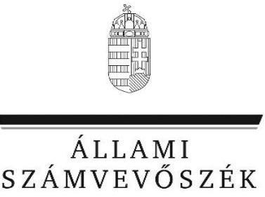

# Jelentés

A költségvetési támogatásban részesülő pártalapítványok 2015–2016. évi gazdálkodása törvényességének ellenőrzése

Megújuló Magyarországért Alapítvány 2018.

---

# Jelentés 

## A költségvetési támogatásban részesülő pártalapítványok 2015-2016. évi gazdálkodása törvényességének ellenőrzése

Megújuló Magyarországért Alapítvány 2018. 07. hó 30. nap
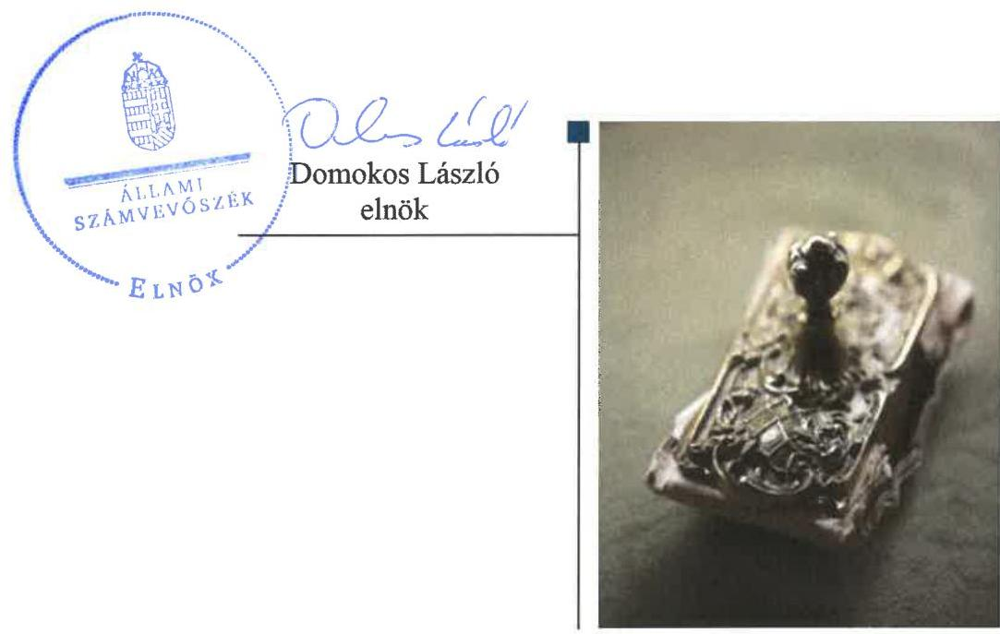

---

# AZ ELLENŐRZÉST FELÜGYELTE: 

HOLMAN MAGDOLNA JULIANNA felügyeleti vezető

## AZ ELLENŐRZÉST VEZETTE ÉS A VÉGREHAJTÁSÁÉRT FELELŐS:

DR. GYŐRI GABRIELLA ellenőrzésvezető

## A PROGRAM ÖSSZEÁLLÍTÁSÁÉRT FELELŐS:

TÓTPÁL SZABOLCS osztályvezető

IKTATÓSZÁM: EL-0339-034/2018

TÉMASZÁM: 2465

## ELLENŐRZÉS-AZONOSÍTÓ SZÁM: V081007

Jelentéseink az Országgyűlés számítógépes hálózatán és az Interneten a www.asz.hu címen is olvashatóak.

---

# TARTALOMJEGYZÉK 

■ ÖSSZEGZÉS ..... 5
■ AZ ELLENŐRZÉS CÉLJA ..... 6
■ AZ ELLENŐRZÉS TERÜLETE ..... 7
■ AZ ELLENŐRZÉS HÁTTERE, INDOKOLTSÁGA ..... 8
■ A JELENTÉS LÉNYEGES KÉRDÉSKÖREI ..... 9
■ AZ ELLENŐRZÉS HATÓKÖRE ÉS MÓDSZEREI ..... 10
■ MEGÁLLAPÍTÁSOK ..... 12
■ JAVASLATOK ..... 15
■ MELLÉKLETEK ..... 17
I. sz. melléklet: Értelmező szótár ..... 17
■ FÜGGELÉK: ÉSZREVÉTELEK ..... 19
■ RÖVIDÍTÉSEK JEGYZÉKE ..... 27

---

.

---

# ÖSSZEGZÉS 

A Megújuló Magyarországért Alapítvány 2015-2016. évi gazdálkodási kereteinek kialakítása megfelel a jogszabályi előírásoknak. A könyvvezetés és a gazdálkodás nem volt szabályszerű. Az Alapítvány a jogszabályok által előírt éves jelentéstételi és közzétételi kötelezettségét nem teljesítette, ezáltal nem biztosította az átláthatóságot. A vagyoni helyzetet bemutató 2015-2016. évekre vonatkozó egyszerűsített éves beszámolókat leltárral nem támasztotta alá, így nem érvényesült a számviteli törvény szerinti valódiság elve.

## Az ellenőrzés társadalmi indokoltsága

A politikai kultúra fejlesztése érdekében tudományos, ismeretterjesztő, kutatási, oktatási tevékenység folytatása céljából a pártok költségvetési támogatásra jogosult alapítványt hozhatnak létre. Jogszabályi előírások alapján a pártalapítványok gazdálkodása törvényességének ellenőrzésére az Állami Számvevőszék jogosult, ezért kétévente ellenőrzi a költségvetésből támogatásban részesülő pártalapítványoknak a gazdálkodását.

Az Állami Számvevőszék stratégiájában megfogalmazta, hogy az államháztartáson kívülre nyújtott költségvetési támogatások és az ingyenes vagyonjuttatás ellenőrzésével hozzájárul ahhoz, hogy a közpénzeket a civil szervezetek is átlátható módon használják fel. A pártalapítványok gazdálkodása szabályszerűségének bemutatásával az ellenőrzés értékteremtő módon járul hozzá az Állami Számvevőszék stratégiai céljainak megvalósításához, a nyilvánosság megfelelő tájékoztatásához.

## Főbb megállapítások, következtetések, javaslatok

A Megújuló Magyarországért Alapítvány szervezeti kereteinek kialakítása és a gazdálkodásra vonatkozó belső szabályozás a 2015. és 2016. években megfelel a jogszabályi előírásoknak.

A Megújuló Magyarországért Alapítvány a támogatásokat szabályszerűen fogadta el, de azok könyvviteli elszámolása a 2016. évben nem felelt meg a jogszabályi előírásoknak. A ráfordítások elszámolása a 2015. és 2016. években nem volt szabályszerű, mert a könyvviteli elszámolást közvetlenül alátámasztó bizonylatok a jogszabályban előírt követelményeknek nem feleltek meg, illetve a könyvviteli nyilvántartásban költségelszámolást megalapozó bizonylatok nélkül rögzítettek gazdasági eseményeket.

A Megújuló Magyarországért Alapítvány 2014. és 2015. évi tevékenységéről szóló jelentések összeállítása és közzététele nem felelt meg a jogszabályi előírásoknak, továbbá a 2016. évi tevékenységről nem készített éves jelentést. A 2014. évről hiteles számviteli beszámolóval nem rendelkezett, a 2015. és a 2016. évi számviteli beszámolókat a jogszabályi előírások ellenére leltárral nem támasztották alá.

Következtetés:
A Jelentés 2.1. számú megállapításában foglaltak szerint a Pártalapítvány a 2016. évben a Pártalapítványi tv. 3. § (4) bekezdés a) pontjában meghatározott összeghatárt meghaladó támogatásokat fogadott el összesen 2,77 M Ft értékben. A támogatásokat nyújtó személyek azonosításához szükséges adatokat és a támogatás összegét azonban a Pártalapítványi tv. 3. § (4) bekezdés előírásának ellenére - a támogatás beérkezést követő 30 napon belül a Pártalapítvány honlapján - nem tette közzé. A Pártalapítványi tv. 3. § (5) bekezdésének előírása alapján a (3)-(4) bekezdés rendelkezéseinek megsértésével elfogadott támogatást - az Állami Számvevőszék felhívására - 15 napon belül a központi költségvetésnek be kell fizetni. A központi költségvetésnek befizetendő 2,77 M Ft befizetéséről szóló felhívást a Megújuló Magyarország Alapítvány részére az Állami Számvevőszék megküldte, erről a Magyar Államkincstárt értesítette.

---

# AZ ELLENŐRZÉS CÉLJA

Az ellenőrzés célja annak megállapítása volt, hogy a pártalapítvány törvényesen gazdálkodott-e, az éves számviteli beszámolók és a pártalapítvány tevékenységéről szóló éves jelentések a jogszabályi előírásoknak megfeleltek-e, a könyvvezetés és gazdálkodás során a vonatkozó jogszabályi rendelkezéseket és belső előírásokat betartották-e.

---

# AZ ELLENŐRZÉS TERÜLETE 

## Megújuló Magyarországért Alapítvány

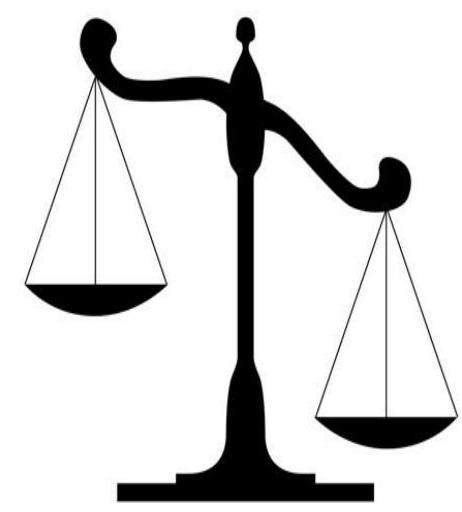

Az ellenőrzés a Párt tv. ${ }^{1}$ alapján a politikai kultúra fejlesztése érdekében tudományos, ismeretterjesztő, kutatási, oktatási tevékenység folytatása céljából, a Ptk. ${ }^{2}$ szerinti létesítő/alapító okiraton alapuló bírósági nyilvántartásba vétellel létrejött pártalapítványok gazdálkodására terjedt ki. A pártalapítványok törvényes gazdálkodásának (könyvvezetése, beszámolása, jelentéstétele) szabályait alapvetően a Pártalapítványi tv. ${ }^{3}$-en túl, a Számv. tv. ${ }^{4}$ és annak a végrehajtási rendelete a Számviteli vhr. ${ }^{5}$ határozták meg.

A Párbeszéd Magyarországért Párt alapította a Megújuló Magyarországért Alapítványt, melyet a civil szervezetek névjegyzékébe 2014. augusztus 29-én jegyeztek be. Az Alapító ${ }^{6}$ az alapító okirat ${ }_{1,2}$-ben ${ }^{7}$ a Pártalapítványi tv. rendelkezéseivel összhangban fogalmazta meg a Pártalapítvány ${ }^{8}$ célját, amely a politikai kultúra fejlesztése érdekében történő tudományos, ismeretterjesztő, kutatási és oktatási tevékenység volt.

A Pártalapítvány a törvényi előírásoknak megfelelően a 2014. évben 11,8 M Ft, 2015-2016. években egyaránt 23,6 M Ft költségvetési támogatásban részesült. A Pártalapítvány az ellenőrzött időszakban gazdasági-vállalkozási tevékenységet nem végzett, gazdasági társaságban részesedése nem volt. A Pártalapítványnál az ellenőrzött időszakban külső ellenőrzés lefolytatására nem került sor.

---

# AZ ELLENŐRZÉS HÁTTERE, INDOKOLTSÁGA 

Társadalmi elvárás a közpénzek értékelvű, rendeltetésszerű felhasználása, a közpénzekből nyújtott támogatások átláthatóságának megteremtése, amelyhez az ÁSZ ${ }^{9}$ az államháztartásból nyújtott támogatások ellenőrzésével kíván hozzájárulni. A Párt tv. 9/A § (1) bekezdése alapján a politikai kultúra fejlesztése érdekében tudományos, ismeretterjesztő, kutatási, oktatási tevékenység folytatása céljából létrehozott pártalapítványok gazdálkodása törvényességének ellenőrzése - a Pártalapítványi tv. 4. § (2) bekezdése értelmében - az ÁSZ feladata. E törvény 4. § (4) bekezdése alapján az ÁSZ kétévente - kötelező jelleggel - ellenőrzi azoknak a pártalapítványoknak a gazdálkodását, amelyek költségvetési támogatásban részesültek.

Az ÁSZ, mint az Országgyűlés ellenőrző szerve a pártalapítványok gazdálkodása törvényességének/szabályszerűségének értékelésével hozzájárul ahhoz, hogy a társadalom objektív képet alkothasson a pártalapítványok működéséről. Az ellenőrzés eredményeinek célzott felhasználói a nyilvánosság, a jogalkotó, továbbá a pártalapítványok esetén azok alapítója és szervei. A jelentésben foglalt megállapítások, következtetések és javaslatok alapján a törvényalkotók konkrét lépéseket tehetnek a pártalapítványokra vonatkozó szabályozások megváltoztatása, átláthatóbbá, ellenőrizhetőbbé tétele irányába. Az ellenőrzött szervezetek szintjén a hiányosságok, szabálytalanságok feltárása, az ennek kapcsán megfogalmazott megállapítások elősegíthetik a pártalapítványok szabályszerű gazdálkodását.

---

# A JELENTÉS LÉNYEGES KÉRDÉSKÖREI 

1. A Megújuló Magyarországért Alapítvány gazdálkodásának törvényessége biztosított volt-e?
2. A Megújuló Magyarországért Alapítvány könyvvezetése és gazdálkodása során a vonatkozó jogszabályi rendelkezéseket és belső előírásokat betartották-e?
3. A Megújuló Magyarországért Alapítvány tevékenységéről szóló éves jelentések, az éves számviteli beszámolók a jogszabályi előírásoknak megfeleltek-e?

---

# AZ ELLENŐRZÉS HATÓKÖRE ÉS MÓDSZEREI 

## Az ellenőrzés típusa

Szabályszerűségi ellenőrzés.

## Az ellenőrzött időszak

2014. augusztus 29 - 2016. december 31.

## Az ellenőrzés tárgya

Az ellenőrzés tárgyát képezte a pártalapítvány gazdálkodása, a könyvvezetés szabályozása és gyakorlata szabályszerűsége, az éves számviteli beszámolókra és az alapítvány tevékenységéről szóló éves jelentésekre vonatkozó kötelezettség teljesítése.

Az ellenőrzés kiterjedt minden olyan körülményre és adatra, amely az ÁSZ jogszabályban meghatározott feladatainak teljesítéséhez, valamint a program végrehajtása folyamán felmerült újabb összefüggések feltárásához szükséges volt.

## Az ellenőrzött szervezet

Megújuló Magyarországért Alapítvány

## Az ellenőrzés jogalapja

Az Alaptörvény 43. cikk (1) bekezdése, ÁSZ tv. 1. § (3) bekezdése, 5. § (3) bekezdése, a Pártalapítványi tv. 4. § (2) és (4) bekezdései.

## Az ellenőrzés módszerei

Az ellenőrzést az ÁSZ az Ellenőrzési program szempontjai, az ellenőrzött időszakban hatályos jogszabályok, a jelen ellenőrzésre irányadó ÁSZ módszertan figyelembe vételével végezte.

A pártalapítvány tevékenységéről szóló éves jelentési-, beszámoló- és közzétételi kötelezettséget a 2014. évben létrehozott alapítványok esetében a 2014. év tekintetében is ellenőrizte az ÁSZ. A 2014. évben alapított pártalapítványok esetében az alapítás szabályszerűségét is értékelte.

Az ellenőrzés ideje alatt az ellenőrzött szervezettel történő kapcsolattartás az ÁSZ SZMSZ ${ }^{10}$-ének vonatkozó előírásai alapján történt.

---

Az ellenőrzési kérdések megválaszolásához szükséges bizonyítékok megszerzése az ellenőrzött által rendelkezésre bocsátott dokumentumokra, adatokra alapozva megfigyelés, szemle (szemrevételezés), kérdésfeltevés (információkérés), mintavételezés, valamint elemző eljárás útján történt. A mintavételezés véletlen mintavételi eljárással történt.

Az ellenőrzési bizonyítékként felhasználható adatforrások közé tartoztak egyrészt az Ellenőrzési program részletes szempontjainál felsorolt adatforrások, másrészt minden egyéb - az ellenőrzés folyamán - feltárt, az ellenőrzés szempontjából információt tartalmazó dokumentum.

Az ellenőrzés lefolytatásához az ellenőrzött a tanúsítványok elektronikus kitöltésével, valamint az ÁSZ által kért dokumentumok elektronikus megküldésével szolgáltatott adatokat. Az így rendelkezésre bocsátott adatok, információk, a tanúsítványok adatai valódiságának kontrollja az ellenőrzés keretében történt.

---

# 1. A Megújuló Magyarországért Alapítvány gazdálkodásának törvényessége biztosított volt-e? 

Összegző megállapítás

A Pártalapítvány a szabályszerű gazdálkodás feltételeit kialakította.

### 1.1. számú megállapítás

A Pártalapítvány gazdálkodása szervezeti kereteinek kialakítása a jogszabályokban előírtaknak megfelelt.

A gazdálkodás szervezeti kereteit az alapító okirat ${ }_{1,2}$-ben, az SZMSZ ${ }_{1-3}{ }^{11}$ -ben, a Kuratórium ügyrendjében ${ }^{12}$ és a Felügyelő Bizottság ügyrendjében ${ }^{13}$ a Pártalapítványi tv.-ben, a Párt tv.-ben és a Ptk.-ban előírtaknak megfelelően alakították ki.

A Pártalapítvány - a Számv. tv. és a Számviteli vhr. előírásainak megfelelően és a Számviteli politikában ${ }^{14}$ rögzített módon - egyszerűsített éves beszámoló készítését és kettős könyvvitel vezetését választotta.

### 1.2. számú megállapítás

A Pártalapítvány gazdálkodására vonatkozó belső szabályozás a 2015. és 2016. években megfelelt a jogszabályi előírásoknak.

A Számv. tv. 14. § (3)-(5) bekezdéseiben előírt számviteli politikát és az annak keretében elkészítendő szabályzatokat a Pártalapítvány 2014-ben a megalakulását követő 90 napon belül a Számv. tv. 14. § (11) bekezdésének rendelkezése ellenére nem készítette el. A gazdálkodásra vonatkozó belső szabályokat a 2015. február 20-tól hatályos Számviteli politika és annak mellékletei a Számv. tv. előírásainak megfelelően tartalmazták.

A Pártalapítvány - a Pártalapítványi tv.-vel és Számv. tv.-vel összhangban - az alapító okirat ${ }_{1,2}$-ben, Adománygyűjtési kódexben ${ }^{15}$, Számviteli politikában és Számlarend ${ }_{1,2}{ }^{16}$-ben kialakította a támogatások elfogadásának, nyilvántartásának és elszámolásának rendjét.

A Pártalapítvány az Adatvédelmi és adatkezelési szabályzatban ${ }^{17}$ kialakította az Info tv. ${ }^{18}$ rendelkezéseinek érvényesítéséhez szükséges belső szabályozást.

---

# 2. A Megújuló Magyarországért Alapítvány könyvvezetése és gazdálkodása során a vonatkozó jogszabályi rendelkezéseket és belső előírásokat betartották-e? 

Összegző megállapítás

2.1. számú megállapítás

A Pártalapítvány könyvvezetése és gazdálkodása nem felelt meg a vonatkozó jogszabályi rendelkezéseknek.

A Pártalapítvány által az ellenőrzött időszakban elfogadott támogatások számviteli elszámolása nem felelt meg a jogszabályi előírásoknak.

A támogatást nyújtó személye minden esetben beazonosítható volt és a befizetések - a Pártalapítványi tv.-nek megfelelően - átutalással történtek.

A Pártalapítvány a 2016. évben a Pártalapítványi tv. 3. § (4) bekezdés a) pontjában meghatározott összeghatárt meghaladó támogatásokat fogadott el összesen 2,77 M Ft értékben. A támogatásokat nyújtó személyek azonosításához szükséges adatokat és a támogatás összegét azonban a Pártalapítványi tv. 3. § (4) bekezdés előírásának ellenére - a támogatás beérkezést követő 30 napon belül a Pártalapítvány honlapján - nem tette közzé.

A támogatások számviteli elszámolása
 a 2016. évben nem volt szabályszerű, mert a továbbutalási céllal kapott támogatást a Pártalapítvány a Számviteli vhr. 16. § (6) bekezdésében foglaltak ellenére nem egyéb bevételként mutatta ki.

## 2.2. számú megállapítás

A Pártalapítvány ráfordításainak elszámolása 2015. és 2016. években nem volt szabályszerű.

A ráfordítások elszámolása a 2015-2016. években nem volt szabályszerű, mert:

- a kifizetéseket alátámasztó bizonylatok nem feleltek meg a Számv. tv. 167. § (1) bekezdés c) és h) pontjaiban előírt követelményeknek, mert nem tartalmazták az utalványozó és a rendelkezés végrehajtását igazoló személy aláírását, valamint az érintett könyvviteli számlákra történő hivatkozást; illetve
- a Számv. tv. 165. § (1)-(2) bekezdéseinek előírása ellenére a könyvviteli nyilvántartásban bizonylat nélkül rögzítettek gazdasági eseményeket.
A Pártalapítvány a Párt. tv. rendelkezéseit betartva az alapító párt részére vagyoni hozzájárulást nem nyújtott.

---

# 3. A Megújuló Magyarországért Alapítvány tevékenységéről szóló éves jelentések, az éves számviteli beszámolók a jogszabályi előírásoknak megfeleltek-e? 

## Összegző megállapítás

A Pártalapítvány tevékenységéről szóló éves jelentések és az éves számviteli beszámolók a 2014-2016. években nem feleltek meg a jogszabályi előírásoknak.

A Pártalapítvány 2014-2015. évi tevékenységéről készült éves jelentések nem tartalmazták a Pártalapítványi tv. 3/A. § (3) bekezdés c) pontjában előírt vagyon felhasználásával kapcsolatos kimutatást. A Pártalapítvány a 2014-2015. években nem tartotta be a Pártalapítványi tv. 3/A. § (5) bekezdésében foglaltakat, mert a 2014. évről szóló éves jelentést az előírt június 30-i határidőig nem tette közzé, a 2015. évi jelentést a saját honlapján nem tette közzé. A Pártalapítvány a 2016. évi tevékenységéről a Pártalapítványi tv. 3/A. § (1) bekezdésében foglaltak ellenére nem készített éves jelentést.

A Pártalapítvány nem rendelkezett - a Számv. tv. 96. § (1) bekezdésének rendelkezésében foglaltakra tekintettel a Számv. tv. 20. § (6) bekezdésének előírása ellenére - a képviseletére jogosult személy által aláírt 2014. évi számviteli beszámolóval.

A Pártalapítvány a 2015-2016. évi beszámolók elkészítéséhez, a mérlegtételek alátámasztásához - a Számv. tv. 69. § (1) bekezdésében foglaltak ellenére - nem állított össze leltárt, amely tételesen, ellenőrizhető módon tartalmazta a mérleg fordulónapján meglévő eszközöket és forrásokat mennyiségben és értékben.

Az ellenőrzött időszakban készített számviteli beszámolókat a Kuratórium jóváhagyta. A Pártalapítvány a 2015-2016. évi - Számv. tv.-nek nem megfelelő - beszámolóit a Számviteli vhr. alapján közzétette.

---

# JAVASLATOK 

Az ÁSZ tv. 33. § (1) bekezdésében foglaltak értelmében az ellenőrzött szervezet vezetője köteles a jelentésben foglalt megállapításokhoz kapcsolódó intézkedési tervet összeállítani és azt a jelentés kézhezvételétől számított 30 napon belül az ÁSZ részére megküldeni. Amennyiben az ellenőrzött szervezet vezetője nem küldi meg határidőben az intézkedési tervet, vagy továbbra sem elfogadható intézkedési tervet küld, az Állami Számvevőszék elnöke az ÁSZ tv. 33. § (3) bekezdés a) és b) pontjaiban foglaltakat érvényesítheti.

## A Megújuló Magyarországért Alapítvány Kuratóriuma elnökének

1. Intézkedjen a kapott támogatások tekintetében a Pártalapítványi tv. szerinti közzétételi kötelezettség teljesítésére.
(2.1. sz. megállapítás 2. bekezdése alapján)
2. Intézkedjen, hogy a továbbutalási céllal kapott támogatások a jogszabályi előírásnak megfelelően az egyéb bevételek között kerüljenek kimutatásra.
(2.1. sz. megállapítás 3. bekezdése alapján)
3. Intézkedjen, hogy a számviteli nyilvántartásokba az adatok csak a Számv. tv.-nek megfelelő bizonylat alapján kerüljenek bejegyzésre.
(2.2. sz. megállapítás 1. bekezdése alapján)
4. Intézkedjen a Pártalapítvány tevékenységéről szóló jelentés Pártalapítványi tv. szerinti elkészítéséről és közzétételéről.
(3. sz. összegző megállapítás 1. bekezdése alapján)
5. Intézkedjen a Számv. tv. által előírt beszámoló törvényi előírás szerinti elkészítéséről.
(3. sz. összegző megállapítás 2. bekezdése alapján)
6. Intézkedjen a könyvek üzleti év végi zárásához, a beszámoló elkészítéséhez, a mérleg tételek alátámasztásához a Számv. tv. által előírt leltár összeállítására.
(3. sz. összegző megállapítás 3. bekezdése alapján)

---

.

---

# MELLÉKLETEK 

## I. SZ. MELLÉKLET: ÉRTELMEZŐ SZÓTÁR

alapítvány

gazdálkodó tevékenység
gazdasági-vállalkozási tevékenység
költségvetésből juttatott/nyújtott forrás/támogatás
pártalapítvány

Az alapítvány az alapító által az alapító okiratban meghatározott tartós cél folyamatos megvalósítására létrehozott jogi személy. Az alapító az alapító okiratban meghatározza az alapítványnak juttatott vagyont és az alapítvány szervezetét. Alapítvány nem alapítható gazdasági-vállalkozási tevékenység folytatására. Az alapítvány az alapítványi cél megvalósításával közvetlenül összefüggő gazdasági tevékenység végzésére jogosult. Alapítvány nem lehet korlátlan felelősségű tagja más jogalanynak, nem létesíthet alapítványt és nem csatlakozhat alapítványhoz. (Forrás: Ptk. 3:378. §, 3:379. § (1) - (3) bekezdés)
azon tevékenységek összessége, amelyek a civil szervezet vagyoni, pénzügyi, jövedelmi helyzetére kiható gazdasági eseményt eredményeznek. (Forrás: Ectv. 2. § 10. pont.)
A jövedelem- és vagyonszerzésre irányuló vagy azt eredményező, üzletszerűen végzett gazdasági tevékenység, kivéve az adomány (ajándék) elfogadását, a létesítő okiratban meghatározott cél szerinti tevékenységet (ideértve a közhasznú tevékenységet is), - 2015. november 28-tól - a pénzeszközök betétbe, értékpapírba, társasági részesedésbe történő elhelyezését és az ingatlan megszerzését, használatának átengedését és átruházását. (Forrás: Ectv. 2. § 11. pont.)
a pártalapítványoknak a Párt tv. 9/A. § (1) bekezdése és a Pártalapítványi tv. 1. § előírásainak értelmében, az éves költségvetési törvények szerint - jellemzően az 1. számú melléklet 1. Országgyülés fejezet 9. Pártalapítványok támogatás címen - az állami költségvetésből juttatott forrás/támogatás.
az államháztartás központi alrendszeréből - a Tb alap kivételével - ellenérték nélkül, pénzben nyújtott költségvetési támogatás (Forrás: Áht. 1. § 14. pont)
a politikai kultúra fejlesztése érdekében, tudományos, ismeretterjesztő, kutatási és oktatási tevékenység folytatása céljából pártok által létrehozott, külön jogszabályban - a Pártalapítványi tv. 1. § és 3. § (1) bekezdésében - meghatározott, jogi személynek minősülő egyéb szervezet (Forrás: Párt tv. 9/A. § (1) bekezdés, Pártalapítványi tv. 1. §, Számv. tv. 3. § (1) bekezdés 4. pont, Számviteli vhr. 2. § (1) bekezdés k) pont, 4. § (1) bekezdés)

---

.

---

# FÜGGELÉK: ÉSZREVÉTELEK 

A jelentéstervezetet a Számvevőszék 15 napos észrevételezésre megküldte az ellenőrzött szervezet vezetőjének az ÁSZ tv. 29. § (1) bekezdése előírásának megfelelően.

A függelék tartalmazza az ellenőrzött észrevételeit, illetve az el nem fogadott észrevételek elutasításának indoklását.

[^0]
[^0]:    * 29. § (1) Az Állami Számvevőszék az ellenőrzési megállapításait megküldi az ellenőrzött szervezet vezetőjének vagy az általa megbízott személynek, és annak, akinek személyes felelősségét állapította meg.
    (2) Az ellenőrzött szervezet vezetője és a felelősként megjelölt személy az ellenőrzés megállapításaira tizenöt napon belül írásban észrevételt tehet.
    (3) Az Állami Számvevőszék az észrevételre a beérkezésétől számított harminc napon belül írásban válaszol. A figyelembe nem vett észrevételeket köteles a jelentésben feltüntetni, és megindokolni, hogy azokat miért nem fogadta el.

---

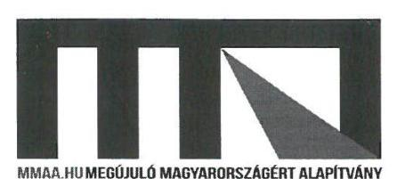

Állami Számvevőszék

Budapest
Apáczai Csere János utca 10.
1052
Postcím: 1364 Budapest 4. Pf.: 54

Tisztelt Állami Számvevőszék!
Alulírott Tordai Bence (született: Budapest, 1981. 01. 26., édesanyja neve: Szabó Ágnes, lakcíme: 1028 Budapest, Attila utca 3/A), mint a Megújuló Magyarországért Alapítvány (székhelye: 1061 Budapest, Paulay Ede utca 50. 2. emelet, nyilv. száma: 01-01-0011958 Fővárosi Törvényszék, adószám: 18619610-1-41) - a továbbiakban: Alapítvány - az Állami Számvevőszék felé is igazoltan, 2017. december 31. napjával megválasztott elnöke, az Alapítvány képviseletében, hivatkozással az EL-0496-008/2018. iktatószámú, 2465 témaszámú és V081007 ellenőrzési-azonosító számú, 2018. május 28. napján átvett jelentéstervezetre, 15 napon belül, figyelemmel az Állami Számvevőszékről szóló 2011. évi LXVI. törvény 29. § (2) bekezdésére, az alábbi

# észrevételt 

teszem.
Köszönettel vettük az Állami Számvevőszék vizsgálatát, mivel az az Alapítvány működésének és gazdálkodásának ellenőrzésével, valamint ellenőrzési tapasztalatain alapuló megállapításaival, javaslataival hozzájárult ahhoz, hogy Alapítványunk gazdálkodását és működését még jobban hozzá tudjuk igazítani a hatályos jogszabályi rendelkezésekhez.

Mindemellett a jelentéstervezet néhány megállapításával nem értünk egyet, ezért kérnénk, hogy azokat felülvizsgálni, illetve pontosítani szíveskedjenek.

---

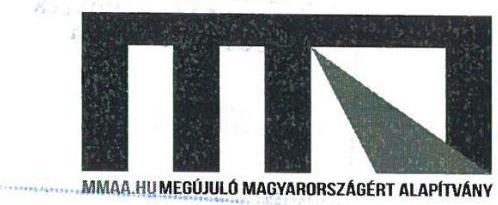

A jelentéstervezet 5. oldala 1. bekezdésében az a megállapítás szerepel, hogy az Alapítvány könyvvezetése és gazdálkodása nem volt szabályszerű.

A jelentéstervezet összegző megállapítás, 14. oldal 1. bekezdése szerint az Alapítvány 2014-2015. évben készült éves beszámolója nem tartalmazza a Pártalapítványi tv. 3/A§ (3) bekezdés c.) pontjában előírt vagyon felhasználásával kapcsolatos kimutatást.

Alapítványunk 2016. évben a könyvelő irodát váltott. Az eljárás során dokumentumokkal is igazoltunk, hogy az Alapítvány Kuratóriuma is megállapította azt a tényt, hogy az Alapítvány működési és gazdasági folyamatait könyvelő gazdasági társaság nem a vonatkozó törvényeknek 100%-ban megfelelő éves beszámolót, számviteli dokumentumot adott át az Alapítványnak.

Ezért az Alapítvány könyvelő váltással, véleményünk szerint mindent megtett annak érdekében, hogy ezt a kisebb jelentőségű hibát kiküszöbölje.

A Pártalapítványi tv. nem tartalmaz olyan mellékletet, mint a pártok működéséről és gazdálkodásáról szóló 1989. évi XXXIII. törvény 1. 2-es melléklete. A törvény csak felsorolást tartalmaz, és mind a 2014., mind a 2015., mind pedig a 2016. évi beszámoló ennek megfelelő adatokat tartalmazott.

Ezért a megállapításnak véleményünk szerint azt kellene tartalmaznia, hogy az Alapítvány éves beszámolója tartalmazza a Pártalapítványi tv-ben foglaltakat, de nem megfelelő bontásban és főcím megosztással.

Mindezeken felül természetesen az Alapítvány Kuratóriuma intézkedett és intézkedési tervünkben tételesen ki is mutatjuk a megfelelő korrekció végrehajtásának ütemezését.

A jelentéstervezet 13. oldal 2.1. számú megállapításának 2. bekezdésében csupán azt a ténymegállapítást tartalmazza, hogy 30 napon belül nem történt meg a támogatásoknak az Alapítvány honlapján történő közzététele, az a megállapítás azonban nem szerepel benne, hogy 30 napon túli határidővel, de ezen közzétételi kötelezettségének az Alapítvány maradéktalanul eleget tett.

Kérjük, hogy a végleges jelentésben ezt a megállapítást szerepeltetni szíveskedjenek.

---

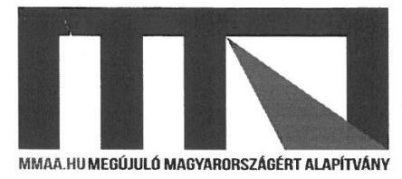

A jelentéstervezet 13. oldal 2.2. számú megállapítás, 2. bekezdésében foglaltakkal nem értünk maradéktalanul egyet.

Alapítványunknál valamennyi becsatolt számlán teljesítési igazolás szerepel. Amennyiben úgy értékeli a Tisztelt Állami Számvevőszék, hogy a bizonylatoknak az utalványozó és a rendelkezés végrehajtását igazoló személy aláírását is tartalmaznia kellene, azt az Alapítvány pótolja. Azonban a becsatolt SZMSZ alapján egyértelmű, hogy a teljesítést igazoló és az utalványozó személy ugyanaz, mégpedig a Kuratórium elnöke vagy helyettesítését ellátó alelnöke (ügyvezető alelnöke). Másnak ilyen jogosultsága az Alapítványban, munkavállaló és egyéb jogosult hiányában nincs.

A megállapítás tényként rögzíti, hogy a bizonylatok nem tartalmazzák az utasítást végrehajtó megjelölését. A vizsgálat során becsatolt szabályzatok, szerződések alapján egyértelműen megállapítható, hogy a könyvelési feladatokat az Alapítvány külső könyvelő irodához helyezte ki. Mindamellett az Alapítvány a jelenleg készülő intézkedési tervében a vonatkozó számviteli törvényi előírás végrehajtására intézkedést vezet be.

A jelentéstervezet 13. oldal 2.2. számú megállapítás 3. bekezdésében foglaltakkal nem értünk egyet.

Alapítványunk minden gazdasági eseményről megfelelő dokumentummal rendelkezik, kizárólag benyújtott és kibocsátott számlák alapján fogad befizetéseket és teljesít utalásokat és kifizetéseket.

Amennyiben a közel 600 db irat benyújtása során a Tisztelt Állami Számvevőszék azt állapította meg, hogy valamennyi gazdasági esemény nem megfelelően lett dokumentálva, kérjük, hogy azt ne ilyen általános megfogalmazással rögzítse jelentésében, hanem tételesen írja le, hogy melyik volt az a gazdasági esemény, amely bizonylat nélkül került rögzítésre, hiszen Alapítványunk a legkisebb tétel kifizetését is számlával igazolta az eljárás során. Nagyban segítené a munkánkat a jelentés ilyen jellegű pontosítása.

Alapítványunk a jelentéstervezet 14. oldal 1. bekezdésében szereplő megállapítással ellentétben készített éves jelentést a 2016. évre, amelynek elfogadását a
 becsatolt kuratóriumi jegyzőkönyv is alátámasztja. Ennek megfelelően kérjük a végleges jelentésből az erre vonatkozó mondat elhagyását.

---

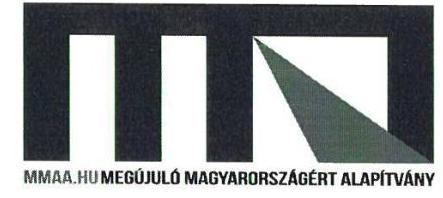

Reméljük, hogy a végleges jelentés kidolgozása során figyelembe tudják venni észrevételeinket.

Ugyanakkor ismételten köszönjük az Állami Számvevőszéknek előremutató, és szabályszerű működésünket elősegítő jelentéstervezetét és későbbi végleges jelentését.

Budapest, 2018. június 12.
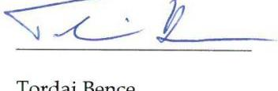

Tordai Bence
a Kuratórium elnöke
Megújuló Magyarországért Alapítvány

---

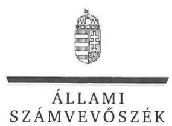

ELNÖK

# Tordai Bence úr 

Kuratórium elnöke
Megújuló Magyarországért Alapítvány

## Budapest

## Tisztelt Elnök Úr!

„A költségvetési támogatásban részesülő pártalapítványok 2015-2016. évi gazdálkodása törvényességének ellenőrzése - Megújuló Magyarországért Alapítvány" című számvevőszéki jelentéstervezetre tett észrevételét köszönettel megkaptam.

Az Állami Számvevőszék észrevételekre vonatkozó álláspontjáról a felügyeleti vezető által készített tájékoztatást csatoltan megküldöm.

Tájékoztatom Elnök urat, hogy a jelentésben - az Állami Számvevőszékről szóló 2011. évi LXVI. törvény 29. § (3) bekezdése alapján - a figyelembe nem vett észrevételeket szerepeltetjük az elutasítás indokának feltüntetésével együtt.

Budapest, 2018. 07. hó 17. nap

Tisztelettel:
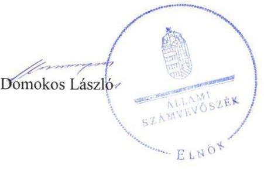

Melléklet: Tájékoztatás el nem fogadott észrevételről

---

# Tájékoztatás el nem fogadott észrevételről 

„A költségvetési támogatásban részesülő pártalapítványok 2015-2016. évi gazdálkodása törvényességének ellenőrzése - Megújuló Magyarországért Alapítvány" című számvevőszéki jelentéstervezetre tett észrevételét áttekintettük, annak kezeléséről az alábbi tájékoztatást adom.

1. A jelentéstervezet 5. oldal 1. bekezdésére és a 14. oldal 1. bekezdés 1. mondatában, a 2014-2015. évi tevékenységről készült éves jelentésekhez kapcsolódóan a vagyon felhasználásával kapcsolatos kimutatások hiányát rögzítő megállapításra tett észrevételét nem fogadtam el. Észrevételében maga is elismeri, hogy a könyvelés vezetésével megbízott „nem a vonatkozó törvényeknek 100%-ban megfelelő éves beszámolót, számviteli dokumentumot adott át az Alapítványnak." Így észrevétele a jelentéstervezet megállapításait nem módosítják. A jelentéstervezet a 2016. évi beszámoló tartalmára tekintetében nem tartalmaz törvényi előírás be nem tartására vonatkozó megállapítást.
2. A jelentéstervezet 13. oldal 2.1. számú megállapításának 2. bekezdésében a támogatásokat nyújtó személyek azonosításához szükséges adatoknak és a támogatás összegének 30 napon belüli közzététel hiányát rögzítő megállapításunkra tett észrevételét, - miszerint határidőn túl a közzétételnek a Pártalapítvány eleget tett - nem fogadtam el. Észrevétele nem változtat azon a tényen, hogy a Pártalapítvány a 2770 ezer Ft értékű támogatást a Pártalapítványi tv. 3. § (4) bekezdés a) pontjának rendelkezése megsértésével fogadta el. A Pártalapítványi tv. 3. § (4) bekezdésének előírása szerint „Az alapítvány számára támogatást nyújtó személy azonosításához szükséges adatok és a támogatás összege közérdekből nyilvános adatnak minősül, és azt a támogatás beérkezését követő harminc napon belül az alapítvány honlapján közzé kell tenni, ha a) a támogatás összege az ötszázezer forintot, vagy b) külföldről származó támogatás összege a százezer forintnak megfelelő értéket meghaladja." Észrevételében Ön is elismerte, hogy nem tartotta be a jogszabályt, így észrevétele a jelentéstervezet megállapítását nem módosítja.
3. A jelentéstervezet 13. oldal 2.2. számú megállapítás, 2. bekezdésében az utalványozó és a rendelkezés végrehajtását igazoló személy aláírásának hiányát rögzítő megállapításra, valamint a jelentéstervezet 13. oldal 2.2. számú megállapítás 3. bekezdésében a gazdasági események bizonylatok nélküli rögzítésére tett megállapításra észrevételét nem fogadtam el. A jelentéstervezet „Az ellenőrzés módszerei" fejezetben tartalmazta, hogy az ellenőrzési kérdések megválaszolásához szükséges bizonyítékok megszerzése az ellenőrzött által rendelkezésre bocsátott dokumentumokra, adatokra alapozva megfigyelés, szemle (szemrevételezés), kérdésfeltevés (információkérés), mintavételezés, valamint elemző eljárás útján történt. A mintavételezés véletlen mintavételi eljárással történt, a Pártalapítvány által rendelkezésre bocsátott adatokból. Az Állami Számvevőszék a bekért és a Pártalapítvány által rendelkezésre bocsátott, Teljességi és hitelességi nyilatkozattal alátámasztott dokumentumok alapján a statisztikai módszerek figyelembevételével elvégzett kiértékelés alapján tette meg a jelentéstervezetben rögzített megállapításokat. A Pártalapítvány ellenőrzött időszakban hatályos SZMSZ-ei csak az utalványozói és kötelezettségvállalói szerepköröket szabályozták, ugyanakkor a teljesítés igazolásáról, vagyis a rendelkezés végrehajtását igazoló személyről nem rendelkeznek. Az Állami Számvevőszék részére rendelkezésre bocsátott dokumentumok közül több esetben az nem tartalmazta a Számv. tv. 167. § (1) bekezdés c) pontjában előírt jogosult aláírását, valamint több esetben a könyvelésben rögzített gazdasági eseményt bizonylattal nem támasztották alá. Az ellenőrzés során nyilatkoztak arról, hogy az Állami Számvevőszék részére átadott dokumentumok, adatok a bekért adatokra vonatkozóan teljes körű információt tartalmaznak, valamint nyilatkoztak annak hiánytalanságáról is. Mindezek alapján az észrevétele a jelentéstervezet megállapítását nem módosítja.
4. Nem fogadtam el a jelentéstervezet 14. oldal 1. bekezdésének utolsó mondatában a 2016. évi tevékenységhez kapcsolódó éves jelentés elkészítésének hiányára vonatkozóan rögzített megállapításra tett észrevételét. Pártalapítványi tv 3/A. § (1) bekezdésének előírása szerint „Az alapítvány köteles az éves beszámoló jóváhagyásával egyidejűleg tevékenységéről jelentést készíteni". A Pártalapítvány 2016. évre vonatkozóan a beszámolót küldte meg az ÁSZ részére, az éves jelentést nem. A Pártalapítvány által hivatkozott és az általa beküldött 4/2017/05.11 kuratóriumi határozatot tartalmazó hiteles jegyzőkönyv sem a Pártalapítvány 2016. évi tevékenységéről szóló jelentés elfogadását rögzíti, hanem „A Kuratórium elfogadja az MMAA 2016. évi éves beszámolóját." A Pártalapítvány által hitelesen aláírt Teljességi és hitelességi nyilatkozat sem tartalmaz jelentést, csak beszámolót 2016-ra. Mindezek alapján észrevétele a megállapítást nem módosítja.

A fentieken túl örömmel vettük tájékoztatását, hogy az ellenőrzött időszakot követően már intézkedéseket tettek a feltárt szabálytalanságok kezelésére.

Budapest, 2018. 04. hó 11. nap
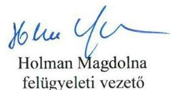

---

# RÖVIDÍTÉSEK JEGYZÉKE 

${ }^{1}$ Párt tv.
${ }^{2}$ Ptk.
${ }^{3}$ Pártalapítványi tv.
${ }^{4}$ Számv. tv
${ }^{5}$ Számviteli vhr.
${ }^{6}$ Alapító
${ }^{7}$ alapító okirat ${ }_{1}$
alapító okirat ${ }_{2}$
${ }^{8}$ Pártalapítvány
${ }^{9}$ ÁSZ
${ }^{10}$ ÁSZ SZMSZ
${ }^{11}$ SZMSZ ${ }_{1}$
SZMSZ ${ }_{2}$
SZMSZ ${ }_{3}$
${ }^{12}$ Kuratórium ügyrendje
${ }^{13}$ Felügyelő Bizottság ügyrendje
${ }^{14}$ Számviteli politika
${ }^{15}$ Adománygyűjtési kódex
${ }^{16}$ Számlarend ${ }_{1}$
Számlarend $_{2}$
${ }^{17}$ Adatkezelési és adatvédelmi szabályzat
${ }^{18}$ Info tv.
1989. évi XXXIII. törvény a pártok működéséről és gazdálkodásáról (hatályos: 1989. október 30-tól)
a 2013. évi V. törvény a Polgári Törvénykönyvről (hatályos: 2014. március 15-től) 2003. évi XLVII. törvény a pártok működését segítő tudományos, ismeretterjesztő, kutatási, oktatási tevékenységet végző alapítványokról (hatályos: 2003. július 1-jétől)
2000. évi C. törvény a számvitelről (hatályos: 2001. január 1-jétől)
224/2000. (XII.19) Korm. rendelet a számviteli törvény szerinti egyes egyéb szervezetek beszámoló készítési és könyvvezetési kötelezettségének sajátosságairól (hatályos: 2001. január 1-jétől 2016. december 31-ig))
Párbeszéd Magyarországért Párt
Megújuló Magyarországért Alapítvány Alapító Okirata (hatályos: 2014. július 3-tól 2016. szeptember 30-ig)

Megújuló Magyarországért Alapítvány Alapító Okirat (hatályos: 2016. október 1-jétől)
Megújuló Magyarországért Alapítvány
Állami Számvevőszék
Állami Számvevőszék Szervezeti és Működési Szabályzata
Megújuló Magyarországért Alapítvány Szervezeti és Működési Szabályzata (hatályos: 2014. szeptember 1-jétől 2015. február 19-ig)
Megújuló Magyarországért Alapítvány Szervezeti és Működési Szabályzata (hatályos: 2015. február 20-tól 2016. május 26-ig)
Megújuló Magyarországért Alapítvány Szervezeti és Működési Szabályzata (hatályos: 2016. május 27-től)
Megújuló Magyarországért Alapítvány Kuratóriumának ügyrendje (hatályos: 2014. szeptember 15-től)
Megújuló Magyarországért Alapítvány Felügyelő Bizottságának ügyrendje (hatályos: 2015. március 2-től)
Megújuló Magyarországért Alapítvány Számviteli politikája (hatályos: 2015. február 20-tól)

Megújuló Magyarországért Alapítvány Adománygyűjtési és adományszervezési kódexe (hatályos: 2015. február 20-tól)
Megújuló Magyarországért Alapítvány Számlarendje (hatályos: 2014. szeptember 15-től 2015. december 31-ig)
Megújuló Magyarországért Alapítvány Számlarendje (hatályos: 2016. január 1-jétől)
Megújuló Magyarországért Alapítvány Adatkezelési és adatvédelmi szabályzata (hatályos: 2015. február 20-tól)
az információs önrendelkezési jogról és az információszabadságról szóló 2011. évi CXII. törvény (hatályos: 2011. július 27-től)

---

# ÁLLAMI SZÁMVEVŐSZÉK 

1052 Budapest, Apáczai Csere János utca 10.
Levélcím: 1364 Budapest 4. Pf. 54
Telefon: +36 14849100 Telefax: +36 14849200
www.asz.hu
