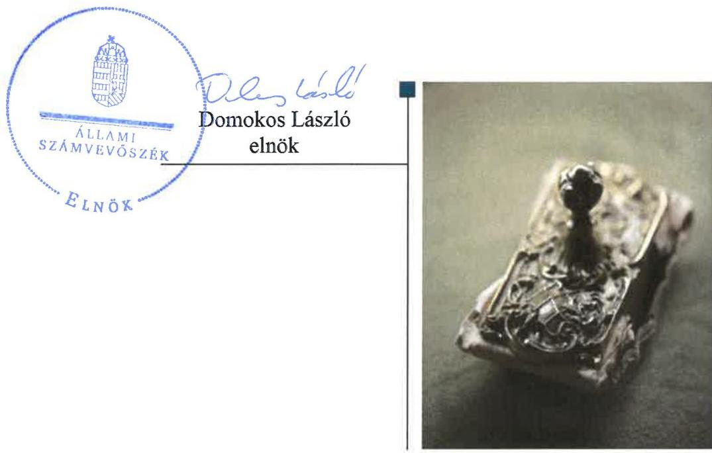
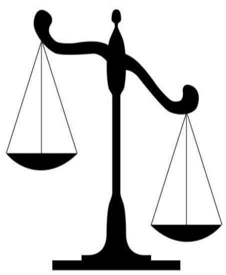
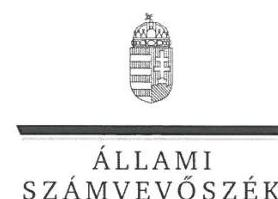
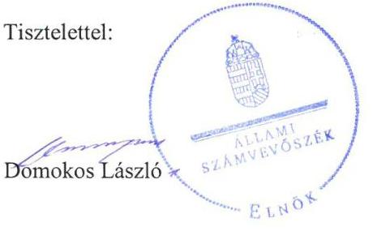

# Jelentés

A költségvetési támogatásban részesülő pártalapítványok 2015–2016. évi gazdálkodása törvényességének ellenőrzése

A Liberális Magyarországért Alapítvány 2018.

---

# Jelentés 

## A költségvetési támogatásban részesülő pártalapítványok 2015-2016. évi gazdálkodása törvényességének ellenőrzése

A Liberális Magyarországért Alapítvány 2018. 04. hó 30. nap

---

# AZ ELLENŐRZÉST FELÜGYELTE:

- **HOLMAN MAGDOLNA JULIANNA** felügyeleti vezető
- **AZ ELLENŐRZÉST VEZETTE ÉS A VÉGREHAJTÁSÁÉRT FELELŐS:**
  - **DR. GYŐRI GABRIELLA** ellenőrzésvezető
- **A PROGRAM ÖSSZEÁLLÍTÁSÁÉRT FELELŐS:**
  - **TÓTPÁL SZABOLCS** osztályvezető
- **IKTATÓSZÁM:** EL-0338-031/2018
- **TÉMASZÁM:** 2465
- **ELLENŐRZÉS-AZONOSÍTÓ SZÁM:** V081006

Jelentéseink az Országgyűlés számítógépes hálózatán és az Interneta a www.asz.hu címen is olvashatóak.

---

# TARTALOMJEGYZÉK 

■ ÖSSZEGZÉS ..... 5
■ AZ ELLENŐRZÉS CÉLJA ..... 6
■ AZ ELLENŐRZÉS TERÜLETE ..... 7
■ AZ ELLENŐRZÉS HÁTTERE, INDOKOLTSÁGA ..... 8
■ A JELENTÉS LÉNYEGES KÉRDÉSKÖREI ..... 9
■ AZ ELLENŐRZÉS HATÓKÖRE ÉS MÓDSZEREI ..... 10
■ MEGÁLLAPÍTÁSOK ..... 12
■ JAVASLATOK ..... 14
■ MELLÉKLETEK ..... 15
I. sz. melléklet: Értelmező szótár ..... 15
■ FÜGGELÉK: ÉSZREVÉTELEK ..... 17
■ RÖVIDÍTÉSEK JEGYZÉKE ..... 23

---

.

---

# ÖSSZEGZÉS 

A Liberális Magyarországért Alapítvány gazdálkodása szabályozási környezetének kialakítása nem volt szabályszerű. A Pártalapítvány a 2014-2016. évekre vonatkozó - jogszabályok által előirt - számviteli beszámoló elkészítési és éves jelentés közzétételi kötelezettségének nem tett eleget, ezáltal nem biztositotta az átlátható és elszámoltatható gazdálkodást.

## Az ellenőrzés társadalmi indokoltsága

A politikai kultúra fejlesztése érdekében tudományos, ismeretterjesztő, kutatási, oktatási tevékenység folytatása céljából a pártok költségvetési támogatásra jogosult alapítványt hozhatnak létre. Jogszabályi előírások alapján a pártalapítványok gazdálkodása törvényességének ellenőrzésére az Állami Számvevőszék jogosult, ezért kétévente ellenőrzi a költségvetésből támogatásban részesülő pártalapítványoknak a gazdálkodását.

Az Állami Számvevőszék stratégiájában megfogalmazta, hogy az államháztartáson kívülre nyújtott költségvetési támogatások és az ingyenes vagyonjuttatás ellenőrzésével hozzájárul ahhoz, hogy a közpénzeket a civil szervezetek is átlátható módon használják fel. A pártalapítványok gazdálkodása szabályszerűségének bemutatásával az ellenőrzés értékteremtő módon járul hozzá az Állami Számvevőszék stratégiai céljainak megvalósításához, a nyilvánosság megfelelő tájékoztatásához.

## Főbb megállapítások, következtetések, javaslatok

A Liberális Magyarországért Alapítvány gazdálkodására vonatkozó belső szabályozás nem felelt meg a jogszabályi előírásoknak, ezáltal nem teremtették meg a közpénzekkel való átlátható és ellenőrizhető gazdálkodás alapjait.

A Liberális Magyarországért Alapítvány a könyvvezetése során nem tartotta be a vonatkozó jogszabályi rendelkezéseket, mert a költségvetési támogatások felhasználása nem volt átlátható.

A Liberális Magyarországért Alapítvány a 2014-2016. évi számviteli beszámoló elkészítési és éves jelentés közzétételi kötelezettséget nem teljesítette.

---

# AZ ELLENŐRZÉS CÉLJA 

Az ellenőrzés célja annak megállapítása volt, hogy a pártalapítvány törvényesen gazdálkodott-e, az éves számviteli beszámolók és a pártalapítvány tevékenységéről szóló éves jelentések a jogszabályi előírásoknak megfeleltek-e, a könyvvezetés és gazdálkodás során a vonatkozó jogszabályi rendelkezéseket, belső előírásokat betartották-e.

---

# AZ ELLENŐRZÉS TERÜLETE 

## A Liberális Magyarországért Alapítvány

Az ellenőrzés a Párt tv. ${ }^{1}$ alapján a politikai kultúra fejlesztése érdekében tudományos, ismeretterjesztő, kutatási, oktatási tevékenység folytatása céljából, a Ptk. ${ }^{2}$ szerinti létesítő/alapító okiraton alapuló bírósági nyilvántartásba vétellel létrejött pártalapítványok gazdálkodására terjedt ki. A pártalapítványok törvényes gazdálkodásának (könyvvezetése, beszámolása, jelentéstétele) szabályait alapvetően a Pártalapítványi tv. ${ }^{3}$-en túl a Számv. tv. ${ }^{4}$ és annak a végrehajtási rendelete, a Számviteli vhr. $1^{5}$ határozták meg.

A Magyar Liberális Párt - a Párt tv.-ben és a Pártalapítványi tv.-ben biztosított lehetőséggel élve - 2014. szeptember 29-én hozta létre a Liberális Magyarországért Alapítványt, amelyet a Szolnoki Törvényszék 16-01-0001190 számon, 2014. szeptember 30-án vett nyilvántartásba. Az induló vagyon összegét az Alapító ${ }^{6} 0,2 \mathrm{M}$ Ft-ban határozta meg, mely az ellenőrzött időszakban nem változott.

A Pártalapítvány ${ }^{7}$ alapító okirat ${ }^{8}$ szerinti célja a demokratikus értékek terjesztése és fenntartása, a liberális gondolat erősítése és támogatása, az alapvető emberi jogok és az egyéni szabadságjogok védelme.

A Pártalapítvány tevékenységének ellátásához a 2014. évben a 1652/2014. (XI.17.) Korm. határozat ${ }^{9}$ alapján 2,1 M Ft, a 2015. és a 2016. évben a zárszámadási törvény ${ }_{1,2}$-ben ${ }^{10}$ foglalt adatok alapján 4,3 M Ft 4,3 M Ft költségvetési támogatásban részesült.

A Pártalapítvány az ellenőrzött időszakban - a Ptk. előírásaival összhangban - nem volt más jogalany korlátlan felelősségű tagja, illetve nem létesített alapítványt és nem csatlakozott más alapítványhoz. A Pártalapítvány az ellenőrzött időszakban gazdasági-vállalkozási tevékenységet nem végzett. A Pártalapítványnál az ellenőrzött időszakban külső ellenőrzés lefolytatására nem került sor.

---

# AZ ELLENŐRZÉS HÁTTERE, INDOKOLTSÁGA 

Társadalmi elvárás a közpénzek értékelvű, rendeltetésszerű felhasználása, a közpénzekből nyújtott támogatások átláthatóságának megteremtése, amelyhez az ÁSZ ${ }^{11}$ az államháztartásból nyújtott támogatások ellenőrzésével kíván hozzájárulni. A Párt tv. 9/A § (1) bekezdése alapján a politikai kultúra fejlesztése érdekében tudományos, ismeretterjesztő, kutatási, oktatási tevékenység folytatása céljából létrehozott pártalapítványok gazdálkodása törvényességének ellenőrzése - a Pártalapítványi tv. 4. § (2) bekezdése értelmében - az ÁSZ feladata. E törvény 4. § (4) bekezdése alapján az ÁSZ kétévente - kötelező jelleggel - ellenőrzi azoknak a pártalapítványoknak a gazdálkodását, amelyek költségvetési támogatásban részesültek.

Az ÁSZ, mint az Országgyűlés ellenőrző szerve a pártalapítványok gazdálkodása törvényességének/szabályszerűségének értékelésével hozzájárul ahhoz, hogy a társadalom objektív képet alkothasson a pártalapítványok működéséről. Az ellenőrzés eredményeinek célzott felhasználói a nyilvánosság, a jogalkotó, továbbá a pártalapítványok esetén azok alapítója és szervei. A jelentésben foglalt megállapítások, következtések és javaslatok alapján a törvényalkotók konkrét lépéseket tehetnek a pártalapítványokra vonatkozó szabályozások megváltoztatása, átláthatóbbá, ellenőrizhetőbbé tétele irányába. Az ellenőrzött szervezetek szintjén a hiányosságok, szabálytalanságok feltárása, az ennek kapcsán megfogalmazott megállapítások elősegíthetik a pártalapítványok szabályszerű gazdálkodását.

---

# A JELENTÉS LÉNYEGES KÉRDÉSKÖREI 

1. A Liberális Magyarországért Alapítvány gazdálkodásának törvényessége biztositott volt-e?
2. A Liberális Magyarországért Alapítvány könyvvezetése és gazdálkodása során a vonatkozó jogszabályi rendelkezéseket és belső elöírásokat betartották-e?
3. A Liberális Magyarországért Alapítvány tevékenységéről szóló éves jelentések, az éves számviteli beszámolók a jogszabályi elöírásoknak megfeleltek-e?

---

# AZ ELLENŐRZÉS HATÓKÖRE ÉS MÓDSZEREI 

## Az ellenőrzés típusa

Szabályszerúségi ellenőrzés.

## Az ellenőrzött időszak

2014. szeptember 30. - 2016. december 31.

## Az ellenőrzés tárgya

Az ellenőrzés tárgyát képezte a pártalapítvány gazdálkodása, a könyavezetés szabályozása és gyakorlata szabályszerűsége, az éves számviteli beszámolókra és az alapítvány tevékenységéről szóló éves jelentésekre vonatkozó kötelezettség teljesítése.

Az ellenőrzés kiterjedt minden olyan körülményre és adatra, amely az ÁSZ jogszabályban meghatározott feladatainak teljesítéséhez, valamint a program végrehajtása folyamán felmerült újabb összefüggések feltárásához szükséges volt.

## Az ellenőrzött szervezet

A Liberális Magyarországért Alapítvány

## Az ellenőrzés jogalapja

Az Alaptörvény 43. cikk (1) bekezdése, ÁSZ tv. 1. § (3) bekezdése, 5. § (3) bekezdése, a Pártalapítványi tv. 4. § (2) és (4) bekezdései.

## Az ellenőrzés módszerei

Az ellenőrzést az ÁSZ az Ellenőrzési program szempontjai, az ellenőrzött időszakban hatályos jogszabályok, a jelen ellenőrzésre irányadó ÁSZ módszertan figyelembe vételével végezte.

A pártalapítvány tevékenységéről szóló éves jelentési-, beszámoló- és közzétételi kötelezettséget a 2014. évben létrehozott alapítványok esetében a 2014. év tekintetében is ellenőrizte az ÁSZ. A 2014. évben alapított pártalapítványok esetében az alapítás szabályszerűségét is értékelte.

Az ellenőrzés ideje alatt az ellenőrzött szervezettel történő kapcsolattartás az ÁSZ SZMSZ ${ }^{12}$-ének vonatkozó előírásai alapján történt.

---

Az ellenőrzési kérdések megválaszolásához szükséges bizonyítékok megszerzése az ellenőrzött által rendelkezésre bocsátott dokumentumokra, adatokra alapozva megfigyelés, szemle (szemrevételezés), kérdésfeltevés (információkérés), mintavételezés, valamint elemző eljárás útján történt. A mintavételezés véletlen mintavételi eljárással történt.

Az ellenőrzési bizonyítékként felhasználható adatforrások közé tartoztak egyrészt az Ellenőrzési program részletes szempontjainál felsorolt adatforrások, másrészt minden egyéb - az ellenőrzés folyamán - feltárt, az ellenőrzés szempontjából információt tartalmazó dokumentum.

Az ellenőrzés lefolytatásához az ellenőrzött a tanúsítványok elektronikus kitöltésével, valamint az ÁSZ által kért dokumentumok elektronikus megküldésével szolgáltatott adatokat. Az így rendelkezésre bocsátott adatok, információk, a tanúsítványok adatai valódiságának kontrollja az ellenőrzés keretében történt.

---

# 1. A Liberális Magyarországért Alapítvány gazdálkodásának törvényessége biztosított volt-e? 

Összegző megállapítás

A Pártalapítvány a szabályszerű gazdálkodás feltételeit nem alakította ki.

### 1.1. számú megállapítás

A Pártalapítvány alapító okiratában a gazdálkodás szervezeti kereteinek kialakítása a jogszabályokban előírtaknak megfelelően történt.

Az alapító okirat a Párt. tv., a Pártalapítványi tv. és a Ptk. rendelkezéseivel összhangban rögzítette az alapítványi célokat, fő tevékenységeket, a Pártalapítvány céljára rendelt vagyont és annak felhasználási módját, a Kuratórium ${ }^{13}$ tagjainak kijelölését, a gazdálkodással kapcsolatos feladatokat, döntési hatáskört és a képviseleti jog gyakorlását.
1.2. számú megállapítás

A Pártalapítvány gazdálkodására vonatkozó belső szabályozás nem felelt meg a jogszabályi előírásoknak.

A Pártalapítvány a Számv. tv.-ben előírt Számviteli politikát ${ }^{14}$ és annak keretében az értékelési szabályzatot ${ }^{15}$, leltározási és leltárkészítési ${ }^{16}$, valamint pénzkezelési szabályzatot ${ }^{17}$ a megalakulást követő 90 napon belül elkészítette és azokat a Kuratórium jóváhagyta.

A Számlarend ${ }^{18}$ 2014. szeptember 30. és 2015. július 4. között a rendkívüli ráfordításokra vonatkozó előírásokat nem a Számv. tv. 86. § (6) bekezdésének megfelelően szabályozta.

A Pártalapítvány az ellenőrzött időszakban - az Info. tv. ${ }^{19}$ 7. § (2) bekezdésében előírtak ellenére - nem alakította ki az adat- és titokvédelmi szabályok érvényre juttatásához szükséges eljárási szabályokat.

## 2. A Liberális Magyarországért Alapítvány könyvvezetése és gazdálkodása során a vonatkozó jogszabályi rendelkezéseket és belső előírásokat betartották-e?

## Összegző megállapítás

A Pártalapítvány a könyvvezetése és gazdálkodása során nem tartotta be a vonatkozó jogszabályi rendelkezéseket.

A Számv. tv. 161/A. § (2) bekezdésében és a Számviteli vhr.: 17. § (8) bekezdésében előírt nyilvántartási (könyvvezetési) rendszer kialakítási, továbbrészletezési kötelezettségének az ellenőrzött időszakban a Pártalapítvány nem tett eleget. Emiatt a Pártalapítvány nem biztosította a Pártala-

---

pítványi tv. 3/A. § (3) bekezdés b) pontjában előírt költségvetési támogatások felhasználására vonatkozó kimutatás és az abban szereplő összegek felhasználása átláthatóságát, ellenőrizhetőségét.

# 3. A Liberális Magyarországért Alapítvány tevékenységéről szóló éves jelentések, az éves számviteli beszámolók a jogszabályi előírásoknak megfeleltek-e? 

Összegző megállapítás

A 2014-2016. években a Pártalapítvány a tevékenységéről szóló éves jelentés közzétételi kötelezettségének nem tett eleget és a Számv tv. által előírt beszámolóval nem rendelkezett.

A Pártalapítvány az éves jelentés közzétételi kötelezettségét a 2014-2016. évekre vonatkozóan - a Pártalapítványi tv. 3/A. § (5) bekezdésében előírtak ellenére - saját honlapján nem teljesítette.

A Pártalapítvány az ellenőrzött időszakban nem tett eleget a Számv. tv. 4. § (1) bekezdése szerinti beszámolási kötelezettségének, mert a 2014., 2015., 2016. évi számviteli beszámolójának részét képező mérleget és eredmény-kimutatást a Számv. tv. 96. § (1) bekezdésében foglaltakra tekintettel a Számv. tv. 20. § (6) bekezdésében foglaltak ellenére a Pártalapítvány képviseletére jogosult személy - a Kuratórium elnöke - annak ellenére nem írta alá, hogy azokat a Kuratórium megtárgyalta.

A Pártalapítvány a Számv. tv. 20. § (6) bekezdésében foglaltaknak nem megfelelő 2014-2016. évi beszámolót tett közzé a közhiteles nyilvántartásban.

---

# JAVASLATOK 

Az ÁSZ tv. 33. § (1) bekezdésében foglaltak értelmében az ellenőrzött szervezet vezetője köteles a jelentésben foglalt megállapításokhoz kapcsolódó intézkedési tervet összeállítani és azt a jelentés kézhezvételétől számított 30 napon belül az ÁSZ részére megküldeni. Amennyiben az ellenőrzött szervezet vezetője nem küldi meg határidőben az intézkedési tervet, vagy továbbra sem elfogadható intézkedési tervet küld, az Állami Számvevőszék elnöke az ÁSZ tv. 33. § (3) bekezdése a) és b) pontjaiban foglaltakat érvényesítheti.

## A Liberális Magyarországért Alapítvány Kuratóriuma elnökének

1. Intézkedjen az Info tv.-ben elöirtak érvényre juttatásához szükséges eljárási szabályok kialakítására.
(1.2. sz. megállapítás 3. bekezdése alapján)
2. Intézkedjen a jogszabályban elöirt olyan nyilvántartási rendszer kialakítására, amely biztosítja, hogy a közpénzek felhasználásával kapcsolatos információk rendelkezésre álljanak.
(2. sz. összegző megállapítás 1. bekezdése alapján)
3. Intézkedjen a Pártalapítvány tevékenységéről szóló jelentés Pártalapítványi tv. szerinti közzétételéről.
(3. sz. összegző megállapítás 1. bekezdése alapján)
4. Intézkedjen a Számv tv. által elöirt beszámoló törvényi elöirás szerinti elkészitéséről.
(3. sz. megállapítás 2. bekezdése alapján)

---

# MELLÉKLETEK 

## I. SZ. MELLÉKLET: ÉRTELMEZŐ SZÓTÁR

alapítvány
gazdálkodó tevékenység
gazdasági-vállalkozási tevékenység
költségvetésből juttatott/nyújtott forrás/támogatás
pártalapítvány

Az alapítvány az alapító által az alapító okiratban meghatározott tartós cél folyamatos megvalósítására létrehozott jogi személy. Az alapító az alapító okiratban meghatározza az alapítványnak juttatott vagyont és az alapítvány szervezetét. Alapítvány nem alapítható gazdasági-vállalkozási tevékenység folytatására. Az alapítvány az alapítványi cél megvalósításával közvetlenül összefüggő gazdasági tevékenység végzésére jogosult. Alapítvány nem lehet korlátlan felelősségű tagja más jogalanynak, nem létesíthet alapítványt és nem csatlakozhat alapítványhoz. (Forrás: Ptk. 3:378. §, 3:379. § (1) (3) bekezdés)
azon tevékenységek összessége, amelyek a civil szervezet vagyoni, pénzügyi, jövedelmi helyzetére kiható gazdasági eseményt eredményeznek. (Forrás: Ectv. 2. § 10. pont.)
A jövedelem- és vagyonszerzésre irányuló vagy azt eredményező, üzletszerűen végzett gazdasági tevékenység, kivéve az adomány (ajándék) elfogadását, a létesítő okiratban meghatározott cél szerinti tevékenységet (ideértve a közhasznú tevékenységet is), - 2015. november 28-tól - a pénzeszközök betétbe, értékpapírba, társasági részesedésbe történő elhelyezését és az ingatlan megszerzését, használatának átengedését és átruházását. (Forrás: Ectv. 2. § 11. pont.)
a pártalapítványoknak a Párt tv. 9/A. § (1) bekezdése és a Pártalapítványi tv. 1. § előírásainak értelmében, az éves költségvetési törvények szerint-jellemzően az 1. számú melléklet 1. Országgyűlés fejezet 9. Pártalapítványok támogatás címen - az állami költségvetésből juttatott forrás/támogatás. az államháztartás központi alrendszeréből - a Tb alap kivételével - ellenérték nélkül, pénzben nyújtott költségvetési támogatás (Forrás: Áht. 1. § 14. pont)
a politikai kultúra fejlesztése érdekében, tudományos, ismeretterjesztő, kutatási és oktatási tevékenység folytatása céljából pártok által létrehozott, külön jogszabályban - a Pártalapítványi tv. 1. § és 3. § (1) bekezdésében- meghatározott, jogi személynek minősülő egyéb szervezet (Forrás: Párt tv. 9/A. § (1) bekezdés, Pártalapítványi tv. 1. §, Számv. tv. 3. § (1) bekezdése 4. pont, Számviteli vhr.; 2. § (1) bekezdés k) pont, 4. § (1) bekezdés)

---

.

---

# FÜGGELÉK: ÉSZREVÉTELEK 

A jelentéstervezetet a Számvevőszék 15 napos észrevételezésre megküldte az ellenőrzött szervezet vezetőjének az ÁSZ tv. 29. §* (1) bekezdése előírásának megfelelően.

A függelék tartalmazza az ellenőrzött észrevételeit, illetve az el nem fogadott észrevételek elutasításának indoklását.

[^0]
[^0]:    * 29. § (1) Az Állami Számvevőszék az ellenőrzési megállapításait megküldi az ellenőrzött szervezet vezetőjének vagy az általa megbízott személynek, és annak, akinek személyes felelősségét állapította meg.
    (2) Az ellenőrzött szervezet vezetője és a felelősként megjelölt személy az ellenőrzés megállapításaira tizenöt napon belül írásban észrevételt tehet.
    (3) Az Állami Számvevőszék az észrevételre a beérkezésétől számított harminc napon belül írásban válaszol. A figyelembe nem vett észrevételeket köteles a jelentésben feltüntetni, és megindokolni, hogy azokat miért nem fogadta el.

---

# Állami Számvevőszék   Holman Magdolna főtitkár részére 

1364 Budapest 4.
Pf.: 54.

## Tisztelt Állami Számvevőszék!

Az Állami Számvevőszék (továbbiakban ÁSZ is) A Liberális Magyarországért Alapítvány (továbbiakban ALMA) 2015-2016. évi gazdálkodása törvényességének ellenőrzéséről készült jelentéstervezetre (továbbiakban Jelentéstervezet) a 2011. évi LXVI. törvény (továbbiakban ÁSZ tv.) 29.§ (2) bekezdése alapján az alábbi észrevétellel kívánok élni.

Elsődlegesen jelzem, hogy az ÁSZ tv. 29.§-a az alábbit tartalmazza:
"(1) Az Állami Számvevôszék az ellenôrzési megállapításait megküldi az ellenôrzött szervezẹt vezetôének vagy az általa megbízott személynek, és annak, akinek személyes felelősségét állapította meg.
(2) Az ellenôrzött szervezẹt vezetôje és a felelősként megjelölt személy az ellenôrzés megállapításaira tizenöt napon belül írásban észrevételt tehet.
(3) Az Állami Számvevôszék az észrevételre a beérkezésétôl számított harminc napon belül írásban válaszol. A figyelembe nem vett észrevételeket köteles a jelentésben feltüntetni, és megindokolni, hogy azokat miért nem fogadta el."

A Jelentéstervezet 2018. június 8. napán került kézbesítô útján továbbításra az ALMA felé, így a 15 napos határidő betartásra került, az észrevételt az ALMA elnöke teszi meg.

## Saját honlapon történő köttééétel

Az ALMA nem rendelkezik saját honlappal, a kapcsolattartásra és információközlésre csak egy Facebook oldalt használ.

A 2003. évi, a pártok múködését segitő tudományos, ismeretterjesztő, kutatási, oktatási tevékenységet végző alapítványokról szóló XLVII. törvény elốírja, hogy
„3/A. § (1) Az alapítvány köteles az éves beszámoló jóváhagyásával egyidejüleg tevékenységirôl jelentést készíteni."
valamint
„(5) Az alapítvány köteles az (1) bekezdésben meghatározott jelentését a tárgyévet követő évben, legkésőbb június 30áig a Magyar Közlöny mellékleteként megjelenő Hivatalos Értesítôben, továbbá saját honlapján közzétenni."

A törvény arról rendelkezik, hogy a jelentést a honlapon közzé kell tenni. Olyan külön szabály viszont nincs elốírva, ami arra vonatkozna, hogy a pártalapítványnak rendelkeznie kell saját honlappal. Ezért ez az (5). bekezdés feltételes módban értelmezhetô, hogy amennyiben van honlap, csak abban az esetben kell ott is közzétenni a jelentést.

Az ALMA tehát betartotta a törvényi elốirásokat, a Hivatalos Értesítôben történt közzététel elegendô.

---

# Beszámoló közzététel 

Az ÁSZ 3. számú megállapítása szerint az ALMA nem tett eleget a Számviteli törvény szerinti beszámolási kötelezettségének, mert a közzétett beszámolókat a Kuratórium elnöke nem írta alá.

A pártalapítványok beszámolójának közzétételét a 2011. évi, a civil szervezetek bírósági nyilvántartásáról és az ezzel összefüggő eljárási szabályokról szóló CLXXXI. törvény szabályozza.

A közzététel szabályait a 39. § és a 40 . § határozza meg, ami lehetőséget biztosít az elektronikus úton történő közzétételre is. Ez az ÁNYK nyomtatványkitöltő programba betöltött űrlapon történik.
„40. § (1) Ha a szervezet a beszámolót elektronikus úton küldi meg az OBH részére, ennek során nincs belye a papír alapú beszámoló képi formátumú elektronikus okirattá történő átalakításának."

Az ÁNYK nyomtatványkitöltő programba betöltött elektronikus űrlapot nyilvánvalóan nincs lehetőség kézzel, tollal aláirni. Ez kizárólag papírra történő kinyomtatás után történhet meg.

A fenti törvényi bekezdés viszont egyértelművé teszi, hogy egy ilyen kinyomtatott, kézzel és tollal aláirt beszámolót nincs lehetőség beszkennelni, ennél fogva ezt az aláirt, szkennelt verziót sem lehet elektronikusan feltölteni a kitöltőprogramhoz csatolmányként.

Tehát az elektronikus beküldési módszer választása esetén elegendő a programban kitöltött űrlapot beküldeni, aláírás nélkül.

Ha azt feltételezzük, hogy az ÁSZ megállapítása helyes, tehát mindenképpen kell aláírás, az azt jelentené, hogy a pártalapítványoknak valójában nincs választási lehetőségük a beszámolójuk közzétételére vonatkozóan. Ennek szabályosan kizárólag papír alapon tehetnének eleget.

Ezzel szemben az OBH előírásai minden szervezetnek megadják a választási lehetőséget az elektronikus úton történő közzétételre is, nincs meghatározva kivétel, akire nem vonatkozna ez a lehetőség.

Tehát a pártalapítványok is szabadon dönthetnek arról, hogy beszámolójukat papír alapon - aláírva vagy pedig elektronikusan - nem aláírva - küldik meg az OBH-nak.

Ettől függetlenül az ALMA természetesen rendelkezett egy, a Számviteli tv. 20.§ (6) előírásainak megfelelő, a kuratóriumi elnök által papíron aláírt példánnyal. A közzététel viszont elektronikusan történt, tehát az ÁSZ ellenőrzés birtokába értelemszerủen nem kerülhetett egy ilyen aláírt példány.

A 2011. évi, a civil szervezetek bírósági nyilvántartásáról és az ezzel összefüggő eljárási szabályokról szóló CLXXXI. törvény az alábbiakról is határoz:

---

„40. § (4) A beszámolót a szervezetnek - a szervezet nyilvántartásba bejegyzett képesseldje kivételével meghatalmazassal igazolt - képeiselḡe külli meg az OBH részére."
valamint
„40. § (5) Ha a szervezet a beszámolóról - külön jogszabály szerint arra feljogositott által aláirt - papir alapú okirat alapján határozott, úgy a (4) bekezdés szerinti személy egeben igazolja, hogy az ezt követüen elektronikus úton megküldött beszámoló megegyezik a jóváhagvott beszámolóval."

Az ALMA papír alapú okirat alapján határozott a beszámoló elfogadásáról. Az erről szóló határozatok szerepelnek az ellenőrzés rendelkezésére bocsátott kuratóriumi jegyzőkönyvekben.

Tehát az aláírás nélküli elektronikus közzététel is megfelel a törvényi előírásoknak, mert az így megküldött beszámoló megegyezik a papír alapú, a kuratóriumi elnök aláírásával ellátott, előzőleg jóváhagyott beszámolóval.

Mindezen észrevételek alapján kérjük, hogy a Jelentéstervezet 3. pontjában leírt megállapításait módosítani szíveskedjenek.

Budapest, 2018. június 20.
A Liberális Magyarországért Alapítvány
Szekhely: 5000 Szalmok, Kosszorg utca 4.
Levételé: olm. 1051 Budapest, Hertageronás utca 18.
Nyilvántartási szám: 1190
Azizzzám: 18822739-1-18
Barászámuszám: 10918001-00000077-69790005
A Liberális Magyarországért Alapítvány

---

# Boruzs András úr 

Kuratórium elnöke
A Liberális Magyarországért Alapítvány

## Szolnok

## Tisztelt Elnök Úr!

„A költségvetési támogatásban részesüló pártalapitványok 2015-2016. évi gazdálkodása törvényességének ellenörzése - A Liberális Magyarországért Alapitvány" címủ számvevőszéki jelentéstervezetre tett észrevételét köszönettel megkaptam.

Az Állami Számvevőszék észrevételekre vonatkozó álláspontjáról a felügyeleti vezető által készített tájékoztatást csatoltan megküldöm.

Tájékoztatom Elnök urat, hogy a jelentésben - az Állami Számvevőszékről szóló 2011. évi LXVI. törvény 29. § (3) bekezdése alapján - a figyelembe nem vett észrevételeket szerepeltetjük az elutasítás indokának feltüntetésével együtt.

Budapest, 2018. 07 hó 44 nap

Melléklet: Tájékoztatás el nem fogadott észrevételről

---

# Tájékoztatás el nem fogadott észrevételről 

„A költségvetési támogatásban részesülő pártalapítványok 2015-2016. évi gazdálkodása törvényességének ellenőrzése - A Liberális Magyarországért Alapítvány" címủ számvevőszéki jelentéstervezetre tett észrevételét áttekintettük, annak kezeléséről az alábbi tájékoztatást adom.

1. A jelentéstervezet 13. oldal 3. számú összegző megállapítás 1. bekezdésében, a 20142016. évekre vonatkozó éves jelentések közzétételi kötelezettségének nem teljesítését rögzítő megállapításra tett észrevételét nem fogadtam el. A Pártalapítványi tv. 3/A §. (5) bekezdésében foglaltak szerint „Az alapítvány köteles az (1) bekezdésben meghatározott jelentését a tárgyévet követő évben, legkésőbb június 30 -áig a Magyar Közlöny mellékleteként megjelenő Hivatalos Értesitőben, továbbá saját honlapján közzétenni". A Pártalapítvány Állami Számvevőszék részére beküldött, 2014. szeptember 29-tól hatályos Alapító Okiratának 7.4. pontja utolsó bekezdése is tartalmazza, hogy ,....Az Alapítvány köteles a jelentését a tárgyévet követő évben legkésőbb június 30 -áig a Magyar Közlöny mellékleteként megjelenő Hivatalos Értesitőben, továbbá saját honlapján közzétenni.". A Pártalapítványi tv. 3/A § (5) bekezdésében rendelkezik a saját honlapon való közzétételről, amely kötelezettséget a Pártalapítvány alapítója is előírta a Pártalapítvány részére. Mivel észrevételében foglaltak szerint „az ALMA nem rendelkezik saját honlappal", ezen kötelezettségének nem tett eleget, így az észrevétel a jelentéstervezet megállapítását nem módosítja.
2. A jelentéstervezet 13. oldal 3. számú összegző megállapítás 2. bekezdésében, a 20142016. évekre vonatkozó számviteli beszámolók aláírásának hiányát rögzítő megállapításra tett észrevételét nem fogadtam el. A civil szervezetek bírósági nyilvántartásáról és az ezzel összefüggő eljárási szabályokról szóló 2011. évi CLXXXI. törvény 40. § (3) bekezdése alapján „A számviteli törvény és az Ectv. szerinti beszámoló elektronikus okiratként történő elkészitése nem jogosít a beszámoló összeállítását (formáját, szerkezetét, tagolását) illetően a számviteli törvényben és az Ectv.-ben elöirt rendelkezésektől való eltérésre." A Számv. tv. 20. § (6) bekezdése pedig azt írja elő, hogy „Az éves beszámoló részét képező mérleget, eredménykimutatást és kiegészitő mellékletet a hely és a kelet feltüntetésével a vállalkozó képviseletére jogosult személy köteles aláirni." A jelentéstervezetben a bekért és a Pártalapítvány által rendelkezésre bocsátott, Teljességi és hitelességi nyilatkozattal alátámasztott dokumentumok értékelése alapján kerültek rögzítésre a megállapítások. Mindezek alapján az észrevétel a jelentéstervezet megállapítását nem módosítja.

Budapest, 2018. OY hó JJ, nap

Holman Magdolna felügyeleti vezető

---

# RÖVIDÍTÉSEK JEGYZÉKE 

${ }^{1}$ Párt tv.
${ }^{2}$ Ptk.
${ }^{3}$ Pártalapítványi tv.
${ }^{4}$ Számv. tv.
${ }^{5}$ Számviteli vhr. 1

Számviteli vhr. 2
${ }^{6}$ Alapító
${ }^{7}$ Pártalapítvány
${ }^{8}$ alapító okirat
${ }^{9}$ 1652/2014. (XI. 17.) Korm. határozat
${ }^{10}$ zárszámadási törvény1
zárszámadási törvény2
${ }^{11}$ ÁSZ
${ }^{12}$ ÁSZ SZMSZ
${ }^{13}$ Kuratórium
${ }^{14}$ Számviteli politika
${ }^{15}$ értékelési szabályzat
${ }^{16}$ leltározási és leltárkészítési szabályzat
${ }^{17}$ pénzkezelési szabályzat
${ }^{18}$ Számlarend
${ }^{19}$ Info. tv.
1989. évi XXXIII. törvény a pártok működéséről és gazdálkodásáról (hatályos: 1989. október 30-tól)
2013. évi V. törvény a Polgári Törvénykönyvről (hatályos: 2014. március 15-től)
2003. évi XLVII. törvény a pártok működését segítő tudományos, ismeretterjesztő, kutatási, oktatási tevékenységet végző alapítványokról (hatályos: 2003. július 1-jétől)
2000. évi C. törvény a számvitelről (hatályos: 2001. január 1-jétől)
224/2000. (XII. 19.) Korm. rendelet a számviteli törvény szerinti egyes egyéb szervezetek beszámoló készítési és könyvvezetési kötelezettségének sajátosságairól (hatályos: 2001. január 1-jétől 2016. december 31-ig)
479/2016. (XII. 28.) Korm. rendelet a számviteli törvény szerinti egyes egyéb szervezetek beszámoló készítési és könyvvezetési kötelezettségének sajátosságairól (hatályos: 2017. január 1-jétől)
Magyar Liberális Párt
A Liberális Magyarországért Alapítvány
A Liberális Magyarországért Alapítvány alapító okirata (kelt: 2014. szeptember 29-én)
1652/2014. (XI. 17.) Korm. határozat a 2013. évi költségvetési maradványok egy részének felhasználásáról és a pártalapítványok tartalékának átcsoportosításáról 2016. évi CXXII. törvény a Magyarország 2015. évi központi költségvetéséről szóló 2014. évi C. törvény végrehajtásáról
2017. évi CLXX. törvény a Magyarország 2016. évi központi költségvetéséről szóló 2015. évi C. törvény végrehajtásáról
Állami Számvevőszék
Állami Számvevőszék Szervezeti és Működési Szabályzata
A Liberális Magyarországért Alapítvány Kuratóriuma
A Liberális Magyarországért Alapítvány Számviteli politikája (hatályos: 2014. szeptember 30-tól)
A Liberális Magyarországért Alapítvány Eszközök és források értékelési szabályzata (hatályos: 2014. szeptember 30-tól)
A Liberális Magyarországért Alapítvány Eszközök és források leltározási és leltárkészítési szabályzata (hatályos: 2014. szeptember 30-tól)
A Liberális Magyarországért Alapítvány pénzkezelési szabályzata (hatályos: 2014. szeptember 30-tól)
A Liberális Magyarországért Alapítvány számlarendje. (hatályos: 2014. szeptember 30-tól)
2011. évi CXII. törvény az információs önrendelkezési jogról és az információszabadságról (hatályos: 2011. július 27-től)

---

# ÁLLAMI SZÁMVEVŐSZÉK 

1052 Budapest, Apáczai Csere János utca 10.
Levélcím: 1364 Budapest 4. Pf. 54
Telefon: +36 14849100 Telefax: +36 14849200
www.asz.hu