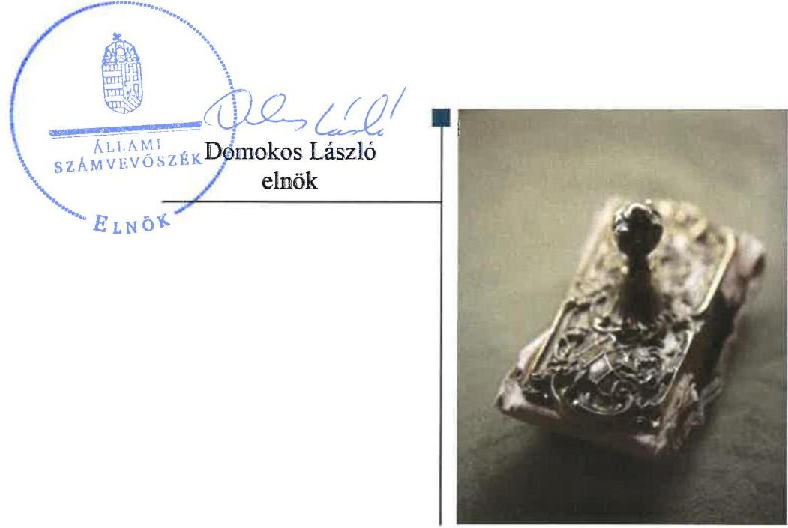
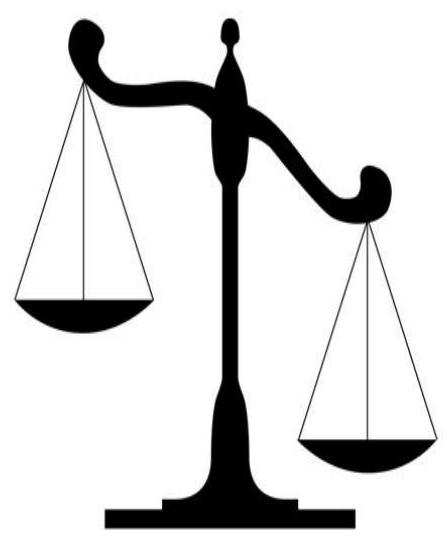

# Jelentés

A költségvetési támogatásban részesülő pártalapítványok 2015–2016. évi gazdálkodása törvényességének ellenőrzése

Váradi András Alapítvány 2018.

18188 www.asz.hu

---

# Jelentés 

A költségvetési támogatásban részesülő pártalapítványok 2015-2016. évi gazdálkodása törvényességének ellenőrzése

Váradi András Alapítvány
2018. 07. hó 30. nap

---

# AZ ELLENŐRZÉST FELÜGYELTE:

- **HOLMAN MAGDOLNA JULIANNA** felügyeleti vezető
- **AZ ELLENŐRZÉST VEZETTE ÉS A VÉGREHAJTÁSÁÉRT FELELŐS:**
  - **DR. GYŐRI GABRIELLA** ellenőrzésvezető
- **A PROGRAM ÖSSZEÁLLÍTÁSÁÉRT FELELŐS:**
  - **TÓTPÁL SZABOLCS** osztályvezető
- **IKTATÓSZÁM:** EL-0337-031/2018
- **TÉMASZÁM:** 2465
- **ELLENŐRZÉS-AZONOSÍTÓ SZÁM:** V081005

Jelentéseink az Országgyűlés számítógépes hálózatán és az Interneta a www.asz.hu címen is olvashatóak.

---

# TARTALOMJEGYZÉK 

■ ÖSSZEGZÉS ..... 5
■ AZ ELLENŐRZÉS CÉLJA ..... 6
■ AZ ELLENŐRZÉS TERÜLETE ..... 7
■ AZ ELLENŐRZÉS HÁTTERE, INDOKOLTSÁGA ..... 8
■ A JELENTÉS LÉNYEGES KÉRDÉSKÖREI ..... 9
■ AZ ELLENŐRZÉS HATÓKÖRE ÉS MÓDSZEREI ..... 10
■ MEGÁLLAPÍTÁSOK ..... 12
■ JAVASLATOK ..... 15
■ MELLÉKLETEK ..... 17
I. sz. melléklet: Értelmező szótár ..... 17
■ FÜGGELÉK: ÉSZREVÉTELEK ..... 19
■ RÖVIDÍTÉSEK JEGYZÉKE ..... 21

---

.

---

# ÖSSZEGZÉS 

A Váradi András Alapítvány gazdálkodásának szabályozási környezetét nem a jogszabályi előírásoknak megfelelően alakította ki. A könyvvezetése és gazdálkodása során a vonatkozó jogszabályi előírásokat nem tartotta be. A vagyoni helyzetet bemutató 2015-2016. évekre vonatkozó egyszerűsített éves beszámolókat leltárral nem támasztotta alá, így nem érvényesült a számviteli törvény szerinti valódiság elve.

## Az ellenőrzés társadalmi indokoltsága

A politikai kultúra fejlesztése érdekében tudományos, ismeretterjesztő, kutatási, oktatási tevékenység folytatása céljából a pártok költségvetési támogatásra jogosult alapítványt hozhatnak létre. Jogszabályi előírások alapján a pártalapítványok gazdálkodása törvényességének ellenőrzésére az Állami Számvevőszék jogosult, ezért kétévente ellenőrzi a költségvetésből támogatásban részesülő pártalapítványoknak a gazdálkodását.

Az Állami Számvevőszék stratégiájában megfogalmazta, hogy az államháztartáson kívülre nyújtott költségvetési támogatások és az ingyenes vagyonjuttatás ellenőrzésével hozzájárul ahhoz, hogy a közpénzeket a civil szervezetek is átlátható módon használják fel. A pártalapítványok gazdálkodása szabályszerűségének bemutatásával az ellenőrzés értékteremtő módon járul hozzá az Állami Számvevőszék stratégiai céljainak megvalósításához, a nyilvánosság megfelelő tájékoztatásához.

## Főbb megállapítások, következtetések, javaslatok

A Váradi András Alapítvány szervezeti kereteinek kialakítása a jogszabályokban előírtaknak megfelelt, azonban a gazdálkodásra vonatkozó belső szabályzatkészítési kötelezettségének a jogszabályi előírások ellenére nem tett eleget.

A Váradi András Alapítvány könyvvezetése és gazdálkodása során a vonatkozó jogszabályi rendelkezéseket nem tartotta be, mert a ráfordítások elszámolása során az utalványozást illetve a végrehajtás igazolását elmulasztotta.

A Váradi András Alapítvány 2015-2016. évi egyszerűsített éves beszámolói a jogszabályi előírásoknak nem feleltek meg. A 2014. évi tevékenységéről készített jelentését a jogszabályi előírás ellenére saját honlapján nem tette közzé.

---

# AZ ELLENŐRZÉS CÉLJA

Az ellenőrzés célja annak megállapítása volt, hogy a pártalapítvány törvényesen gazdálkodott-e, az éves számviteli beszámolók és a pártalapítvány tevékenységéről szóló éves jelentések a jogszabályi előírásoknak megfeleltek-e, a könyvvezetés és gazdálkodás során a vonatkozó jogszabályi rendelkezéseket és belső előírásokat betartották-e.

---

# AZ ELLENŐRZÉS TERÜLETE 

## Váradi András Alapítvány

Az ellenőrzés a Párt tv. ${ }^{1}$ alapján a politikai kultúra fejlesztése érdekében tudományos, ismeretterjesztő, kutatási, oktatási tevékenység folytatása céljából, a Ptk. ${ }^{2}$ szerinti létesítő/alapító okiraton alapuló bírósági nyilvántartásba vétellel létrejött pártalapítványok gazdálkodására terjedt ki. A pártalapítványok törvényes gazdálkodásának (könyvvezetése, beszámolása, jelentéstétele) szabályait alapvetően a Pártalapítványi tv. ${ }^{3}$-en túl, a Számv. tv. ${ }^{4}$ és annak a végrehajtási rendelete a Számviteli vhr. ${ }^{5}$ határozták meg.

Az Együtt - a Korszakváltók Pártja 2014. május 27-én alapította meg az Együtt Magyarországért Alapítványt, amely 2015ben vette fel a Váradi András nevet.

A Pártalapítvány ${ }^{6}$ az alapító okirat ${ }_{1-4}{ }^{7}$-ben foglaltak szerint és a Pártalapítványi tv. rendelkezéseivel összhangban politikai kultúra fejlesztése érdekében történő tudományos, ismeretterjesztő, kutatási és oktatási tevékenységet folytatott. A Pártalapítványt a Fővárosi Törvényszék 0100/Pk.60.299/2014. számú - 2014. július 9-én jogerőre emelkedett - végzésével vette nyilvántartásba.

A Pártalapítvány 100 ezer Ft alapítói vagyonnal jött létre, döntéshozó, képviselő és vagyonkezelő szerve a Kuratórium ${ }^{8}$ volt.

A Pártalapítvány a 2014. évben 20,6 M Ft, a 2015-2016. években 41,3 M - 41,3 M Ft költségvetési támogatásban részesült. A Pártalapítvány az ellenőrzött időszakban gazdasági-vállalkozási tevékenységet nem végzett. A Pártalapítvány az ellenőrzött időszakban nem volt korlátlan felelősségű tagja más jogalanynak, nem létesített alapítványt és nem csatlakozott alapítványhoz. A Pártalapítványnál az ellenőrzött időszakban külső ellenőrzés lefolytatására nem került sor.

---

# AZ ELLENŐRZÉS HÁTTERE, INDOKOLTSÁGA 

Társadalmi elvárás a közpénzek értékelvű, rendeltetésszerű felhasználása, a közpénzekből nyújtott támogatások átláthatóságának megteremtése, amelyhez az ÁSZ ${ }^{9}$ az államháztartásból nyújtott támogatások ellenőrzésével kíván hozzájárulni. A Párt tv. 9/A § (1) bekezdése alapján a politikai kultúra fejlesztése érdekében tudományos, ismeretterjesztő, kutatási, oktatási tevékenység folytatása céljából létrehozott pártalapítványok gazdálkodása törvényességének ellenőrzése - a Pártalapítványi tv. 4. § (2) bekezdése értelmében - az ÁSZ feladata. E törvény 4. § (4) bekezdése alapján az ÁSZ kétévente - kötelező jelleggel - ellenőrzi azoknak a pártalapítványoknak a gazdálkodását, amelyek költségvetési támogatásban részesültek.

Az ÁSZ, mint az Országgyűlés ellenőrző szerve a pártalapítványok gazdálkodása törvényességének/szabályszerűségének értékelésével hozzájárul ahhoz, hogy a társadalom objektív képet alkothasson a pártalapítványok működéséről. Az ellenőrzés eredményeinek célzott felhasználói a nyilvánosság, a jogalkotó, továbbá a pártalapítványok esetén azok alapítója és szervei. A jelentésben foglalt megállapítások, következtések és javaslatok alapján a törvényalkotók konkrét lépéseket tehetnek a pártalapítványokra vonatkozó szabályozások megváltoztatása, átláthatóbbá, ellenőrizhetőbbé tétele irányába. Az ellenőrzött szervezetek szintjén a hiányosságok, szabálytalanságok feltárása, az ennek kapcsán megfogalmazott megállapítások elősegíthetik a pártalapítványok szabályszerű gazdálkodását.

---

# A JELENTÉS LÉNYEGES KÉRDÉSKÖREI 

1. A Váradi András Alapítvány gazdálkodásának törvényessége biztositott volt-e?
2. A Váradi András Alapítvány könyvvezetése és gazdálkodása során a vonatkozó jogszabályi rendelkezéseket és belső előírásokat betartották-e?
3. A Váradi András Alapítvány tevékenységéről szóló éves jelentések, az éves számviteli beszámolók a jogszabályi előírásoknak megfeleltek-e?

---

# AZ ELLENŐRZÉS HATÓKÖRE ÉS MÓDSZEREI 

## Az ellenőrzés típusa

Szabályszerúségi ellenőrzés.

## Az ellenőrzött időszak

2014. május 27 - 2016. december 31.

## Az ellenőrzés tárgya

Az ellenőrzés tárgyát képezte a pártalapítvány gazdálkodása, a könyovezetés szabályozása és gyakorlata szabályszerűsége, az éves számviteli beszámolókra és a pártalapítvány tevékenységéről szóló éves jelentésekre vonatkozó kötelezettség teljesítése.

Az ellenőrzés kiterjedt minden olyan körülményre és adatra, amely az ÁSZ jogszabályban meghatározott feladatainak teljesítéséhez, valamint a program végrehajtása folyamán felmerült újabb összefüggések feltárásához szükséges volt.

## Az ellenőrzött szervezet

Váradi András Alapítvány

## Az ellenőrzés jogalapja

Az Alaptörvény ${ }^{10}$ 43. cikk (1) bekezdése, ÁSZ tv. ${ }^{11}$ 1. § (3) bekezdése, 5. § (3) bekezdése, a Pártalapítványi tv. 4. § (2) és (4) bekezdései.

## Az ellenőrzés módszerei

Az ellenőrzést az ÁSZ az Ellenőrzési program szempontjai, az ellenőrzött időszakban hatályos jogszabályok, a jelen ellenőrzésre irányadó ÁSZ módszertan figyelembe vételével végezte.

A pártalapítvány tevékenységéről szóló éves jelentési-, beszámoló- és közzétételi kötelezettséget a 2014. évben létrehozott alapítványok esetében a 2014. év tekintetében is ellenőrizte az ÁSZ. A 2014. évben alapított pártalapítványok esetében az alapítás szabályszerűségét is értékelte.

Az ellenőrzés ideje alatt az ellenőrzött szervezettel történő kapcsolattartás az ÁSZ SZMSZ ${ }^{12}$-ének vonatkozó előírásai alapján történt.

---

Az ellenőrzési kérdések megválaszolásához szükséges bizonyítékok megszerzése az ellenőrzött által rendelkezésre bocsátott dokumentumokra, adatokra alapozva megfigyelés, szemle (szemrevételezés), kérdésfeltevés (információkérés), mintavételezés, valamint elemző eljárás útján történt. A mintavételezés véletlen mintavételi eljárással történt.

Az ellenőrzési bizonyítékként felhasználható adatforrások közé tartoztak egyrészt az Ellenőrzési program részletes szempontjainál felsorolt adatforrások, másrészt minden egyéb - az ellenőrzés folyamán - feltárt, az ellenőrzés szempontjából információt tartalmazó dokumentum.

Az ellenőrzés lefolytatásához az ellenőrzött a tanúsítványok elektronikus kitöltésével, valamint az ÁSZ által kért dokumentumok elektronikus megküldésével szolgáltatott adatokat. Az így rendelkezésre bocsátott adatok, információk, a tanúsítványok adatai valódiságának kontrollja az ellenőrzés keretében történt.

---

# 1. A Váradi András Alapítvány gazdálkodásának törvényessége biztosított volt-e? 

Összegző megállapítás

A Pártalapítvány a szabályszerű gazdálkodás feltételeit nem alakította ki.

### 1.1. számú megállapítás

A Pártalapítvány gazdálkodása szervezeti kereteinek kialakítása a jogszabályokban előírtaknak megfelelt.

A 2014-2016. években hatályos alapító okirat ${ }_{1-4}$ megfelelt a Párt tv.-ben, a Pártalapítványi tv.-ben, valamint a Ptk.-ban előírt tartalmi követelményeknek. Az alapító okirat ${ }_{1-4}$-ben a Ptk. előírásaival összhangban meghatározták a Kuratórium hatáskörét és eljárási szabályait.

### 1.2. számú megállapítás

A Pártalapítvány gazdálkodására vonatkozó belső szabályozás nem felelt meg a jogszabályi előírásoknak.

A Számv. tv. 14. § (4)-(5) bekezdéseiben előírt számviteli politikát és az annak keretében elkészítendő szabályzatokat a Pártalapítvány 2014-ben a megalakulását követő 90 napon belül a Számv. tv. 14. § (11) bekezdésének rendelkezése ellenére nem készítette el.

A Pártalapítvány a 2014-2016. években nem gondoskodott:
$\longrightarrow$ a Számv. tv. 161. § (1) bekezdésének előírása ellenére a számlarend elkészítéséről;
$\longrightarrow$ az Info tv. ${ }^{15}$ 7. § (2) bekezdésében foglaltak ellenére az adat- és titokvédelmi szabályok érvényre juttatásához szükséges eljárási szabályok kialakításáról;
$\longrightarrow$ a Számviteli vhr. 17. § (8) bekezdésében foglaltak ellenére nyilvántartási rendszerének olyan részletezéséről, hogy abból a közpénzek felhasználásával kapcsolatos információk is rendelkezésre álljanak.

---

# 2. A Váradi András Alapítvány könyvvezetése és gazdálkodása során a vonatkozó jogszabályi rendelkezéseket és belső előírásokat betartották-e? 

Összegző megállapítás

2.1. számú megállapítás

A Pártalapítvány könyvvezetése és gazdálkodása során a vonatkozó jogszabályi rendelkezéseket nem tartotta be.

A Pártalapítvány által az ellenőrzött időszakban elfogadott támogatások számviteli elszámolása megfelelt a jogszabályi előírásoknak.

A nem költségvetésből származó támogatások elfogadásának szabályait az Alapító ${ }^{14}$ a Pártalapítványi tv.-nyel összhangban rögzítette az alapító okirat ${ }_{1-4}$-ben. A támogatások elfogadása az ellenőrzött időszakban megfelelt a Pártalapítványi tv. rendelkezéseinek, a számviteli elszámolásuk megfelelt a Számv. tv. előírásainak.
2.2. számú megállapítás

A Pártalapítvány ráfordításainak elszámolása az ellenőrzött időszakban nem volt szabályszerű.

A ráfordítások elszámolása a 2015-2016. években nem volt szabályszerű, mert a könyvviteli elszámolást alátámasztó bizonylatok nem feleltek meg a Számv. tv. 167. § (1) bekezdés c) és h) pontjaiban előírt követelményeknek, mert nem tartalmazták az utalványozó és a rendelkezés végrehajtását igazoló személy aláírását, valamint a könyvviteli számlákra történő hivatkozást.

A Pártalapítvány a Párt. tv. rendelkezéseit betartva az alapító párt részére vagyoni hozzájárulást nem nyújtott.

## 3. A Váradi András Alapítvány tevékenységéről szóló éves jelentések, az éves számviteli beszámolók a jogszabályi előírásoknak megfeleltek-e?

Összegző megállapítás

A Pártalapítvány tevékenységéről szóló 2014. évi éves jelentés nem felelt meg a jogszabályi előírásoknak. Az éves számviteli beszámolók a 2015-2016. években nem feleltek meg a jogszabályi előírásoknak.

A Pártalapítvány nem tartotta be a Pártalapítványi tv. 3/A. § (5) bekezdésében foglaltakat, mert a 2014. évi tevékenységéről készített jelentést saját honlapján nem tette közzé. A Pártalapítvány a 2015-2016. évi tevékenységéről szóló éves jelentéseket a Pártalapítványi tv. előírásainak megfelelő szerkezetben, tartalommal állította össze és tette közzé.

A Pártalapítvány a 2015-2016. évi beszámolók elkészítéséhez, a mér legtételek alátámasztásához - a Számv. tv. 69. § (1) bekezdésében foglal-

---

tak ellenére - nem állított össze leltárt, amely tételesen, ellenőrizhető módon tartalmazta a mérleg fordulónapján meglévő eszközöket és forrásokat mennyiségben és értékben.

Az ellenőrzött időszakban készített számviteli beszámolókat a Kuratórium jóváhagyta. A Pártalapítvány a 2014. évi egyszerűsített éves beszámoló tekintetében nem tett eleget a közzétételi kötelezettségének, mert az egyszerűsített éves beszámolóját a Számviteli vhr. 20. § (2) bekezdése ellenére május 31-ig nem tette közzé. A Pártalapítvány a 2015-2016. évi - a Számv. tv. 96. § (1) bekezdésében foglaltaknak nem megfelelő - beszámolóit a Számviteli vhr. alapján közzétette.

---

# JAVASLATOK 

Az ÁSZ tv. 33. § (1) bekezdésében foglaltak értelmében az ellenőrzött szervezet vezetője köteles a jelentésben foglalt megállapításokhoz kapcsolódó intézkedési tervet összeállítani és azt a jelentés kézhezvételétől számított 30 napon belül az ÁSZ részére megküldeni. Amennyiben az ellenőrzött szervezet vezetője nem küldi meg határidőben az intézkedési tervet, vagy továbbra sem elfogadható intézkedési tervet küld, az Állami Számvevőszék elnöke az ÁSZ tv. 33. § (3) bekezdése a) és b) pontjaiban foglaltakat érvényesítheti.

## A Váradi András Alapítvány Kuratóriuma elnökének

1. Intézkedjen az Számv. tv.-ben elöirt számlarend elkészitésére.
(1.2. sz. megállapítás 2. bekezdése 1. francia bekezdése alapján)
2. Intézkedjen az Info tv.-ben elöirtak érvényre juttatásához szükséges eljárási szabályok kialakítására.
(1.2. sz. megállapítás 2. bekezdése 2. francia bekezdése alapján)
3. Intézkedjen a jogszabályban elöirt olyan nyilvántartási rendszer kialakítására, amely biztositja, hogy a közpénzek felhasználásával kapcsolatos információk rendelkezésre álljanak.
(1.2. sz. megállapítás 2. bekezdése 3. francia bekezdése alapján)
4. Intézkedjen a kiadások elszámolása során a Számv. tv. elöirásainak betartására.
(2.2. sz. megállapítás 1. bekezdése alapján)
5. Intézkedjen a könyvek üzleti év végi zárásához, a beszámoló elkészitéséhez, a mérleg tételeinek alátámasztásához a törvény által elöirt leltár összeállítására.
(3. sz. összegző megállapítás 2. bekezdése alapján)

---

.

---

# MELLÉKLETEK 

- I. SZ. MELLÉKLET: ÉRTELMEZŐ SZÓTÁR
alapítvány
gazdálkodó tevékenység
gazdasági-vállalkozási
tevékenység
költségvetésből juttatott/nyújtott forrás/támogatás
pártalapítvány

Az alapítvány az alapító által az alapító okiratban meghatározott tartós cél folyamatos megvalósítására létrehozott jogi személy. Az alapító az alapító okiratban meghatározza az alapítványnak juttatott vagyont és az alapítvány szervezetét. Alapítvány nem alapítható gazdasági-vállalkozási tevékenység folytatására. Az alapítvány az alapítványi cél megvalósításával közvetlenül összefüggő gazdasági tevékenység végzésére jogosult. Alapítvány nem lehet korlátlan felelősségű tagja más jogalanynak, nem létesíthet alapítványt és nem csatlakozhat alapítványhoz. (Forrás: Ptk. 3:378. §, 3:379. § (1) - (3) bekezdés)
azon tevékenységek összessége, amelyek a civil szervezet vagyoni, pénzügyi, jövedelmi helyzetére kiható gazdasági eseményt eredményeznek. (Forrás: Ectv. 2. § 10. pont.)
A jövedelem- és vagyonszerzésre irányuló vagy azt eredményező, üzletszerűen végzett gazdasági tevékenység, kivéve az adomány (ajándék) elfogadását, a létesítő okiratban meghatározott cél szerinti tevékenységet (ideértve a közhasznú tevékenységet is), - 2015. november 28-tól - a pénzeszközök betétbe, értékpapírba, társasági részesedésbe történő elhelyezését és az ingatlan megszerzését, használatának átengedését és átruházását. (Forrás: Ectv. 2. § 11. pont.)
a pártalapítványoknak a Párt tv. 9/A. § (1) bekezdése és a Pártalapítványi tv. 1. § előírásainak értelmében, az éves költségvetési törvények szerint-jellemzően az 1. számú melléklet 1. Országgyűlés fejezet 9. Pártalapítványok támogatás címen - az állami költségvetésből juttatott forrás/támogatás. az államháztartás központi alrendszeréből - a Tb alap kivételével - ellenérték nélkül, pénzben nyújtott költségvetési támogatás (Forrás: Áht. 1. § 14. pont)
a politikai kultúra fejlesztése érdekében, tudományos, ismeretterjesztő, kutatási és oktatási tevékenység folytatása céljából pártok által létrehozott, külön jogszabályban - a Pártalapítványi tv. 1. § és 3. § (1) bekezdésében- meghatározott, jogi személynek minősülő egyéb szervezet (Forrás: Párt tv. 9/A. § (1) bekezdés, Pártalapítványi tv. 1. §, Számv. tv. 3. § (1) bekezdése 4. pont, Számviteli vhr. 2 § (1) bekezdés k) pont, 4. § (1) bekezdés)

---

.

---

# FÜGGELÉK: ÉSZREVÉTELEK 

A jelentéstervezetet a Számvevőszék 15 napos észrevételezésre megküldte az ellenőrzött szervezet vezetőjének az ÁSZ tv. 29. §* (1) bekezdése előírásának megfelelően.

A Ptk. 3:7. § előírása szerint „A jogi személy székhelye a jogi személy bejegyzett irodája, ahol a jogi személynek biztosítania kell a részére címzett jognyilatkozatok fogadását és a jogi személy jogszabályban meghatározott iratainak elérhetőségét."

A 2011. évi CLXXXI. törvény 86. § (1) bekezdése szerint közhitelesnek minősülő civil szervezetek névjegyzékében a pártalapítvány székhelye: 1065 Budapest, Nagymező utca 4. 3./1. Erre a címre a Számvevőszék hivatalos postai küldeményként megküldte a jelentéstervezetet 15 napos észrevételezésre. A jelentéstervezet két alkalommal „nem kereste" jelzéssel jött vissza a postai szolgáltatótól, így az ellenőrzött szervezet a jelentéstervezetre észrevételt nem tett.

[^0]
[^0]:    * 29. § (1) Az Állami Számvevőszék az ellenőrzési megállapításait megküldi az ellenőrzött szervezet vezetőjének vagy az általa megbízott személynek, és annak, akinek személyes felelősségét állapította meg.
    (2) Az ellenőrzött szervezet vezetője és a felelősként megjelölt személy az ellenőrzés megállapításaira tizenöt napon belül írásban észrevételt tehet.
    (3) Az Állami Számvevőszék az észrevételre a beérkezésétől számított harminc napon belül írásban válaszol. A figyelembe nem vett észrevételeket köteles a jelentésben feltüntetni, és megindokolni, hogy azokat miért nem fogadta el.

---

.

---

# RÖVIDÍTÉSEK JEGYZÉKE 

${ }^{1}$ Párt tv.
${ }^{2}$ Ptk.
${ }^{3}$ Pártalapítványi tv.
${ }^{4}$ Számv. tv
${ }^{5}$ Számviteli vhr.
${ }^{6}$ Pártalapítvány
${ }^{7}$ alapító okirat ${ }_{1}$
alapító okirat2
alapító okirat3
alapító okirat4
${ }^{8}$ Kuratórium
${ }^{9}$ ÁSZ
${ }^{10}$ Alaptörvény
${ }^{11}$ ÁSZ tv.
${ }^{12}$ ÁSZ SZMSZ
${ }^{13}$ Info tv.
${ }^{14}$ Alapító
1989. évi XXXIII. törvény a pártok működéséről és gazdálkodásáról (hatályos: 1989. október 30-tól)
a 2013. évi V. törvény a Polgári Törvénykönyvről (hatályos: 2014. március 15-től) 2003. évi XLVII. törvény a pártok müködését segítő tudományos, ismeretterjesztő, kutatási, oktatási tevékenységet végző alapítványokról (hatályos: 2003. július 1-jétől)
2000. évi C. törvény a számvitelről (hatályos: 2001. január 1-jétől) 224/2000. (XII.19) Korm. rendelet a számviteli törvény szerinti egyes egyéb szervezetek beszámoló készítési és könyvvezetési kötelezettségének sajátosságairól (hatályos: 2001. január 1-jétől 2016. december 31-ig))
Váradi András Alapítvány (jogelőd szervezete az Együtt Magyarországért Alapítvány)
Együtt Magyarországért Alapítvány 2014. május 27-én kelt alapító okirata
Együtt Magyarországért Alapítvány 2014. július 28-án kelt alapító okirata
Váradi András Alapítvány 2015. március 11-én kelt alapító okirata
Váradi András Alapítvány 2016. október 5-én kelt alapító okirata
Váradi András Alapítvány Kuratóriuma
Állami Számvevőszék
Magyarország Alaptörvénye (kihirdetve: 2011. április 25-én)
2011. évi LXVI. törvény az Állami Számvevőszékről (hatályos: 2011. július 1-jétől)

Állami Számvevőszék Szervezeti és Működési Szabályzata
2011. évi CXII. törvény az információs önrendelkezési jogról és az információszabadságról (hatályos: 2011. július 27-től)
Együtt - A Korszakváltók Pártja

---

# ÁLLAMI SZÁMVEVŐSZÉK 

1052 Budapest, Apáczai Csere János utca 10.
Levélcím: 1364 Budapest 4. Pf. 54
Telefon: +36 14849100 Telefax: +36 14849200
www.asz.hu