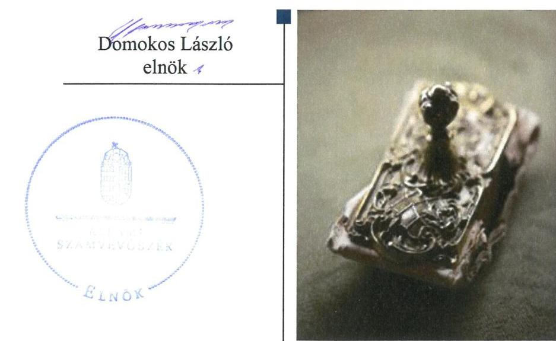
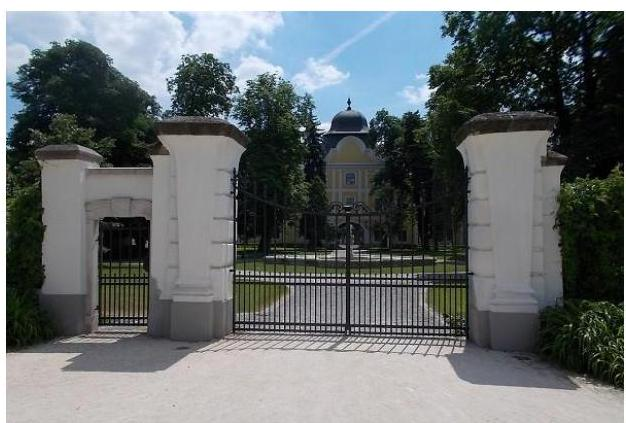

# Jelentés 

## Az önkormányzatok gazdasági társaságai

Az önkormányzatok többségi tulajdonában lévő gazdasági társaságok gazdálkodásának ellenőrzése - Széchenyi Zsigmond Kárpátmedencei Magyar Vadászati Múzeum Beruházó Nonprofit Közhasznú Kft.
2018.

---

# Jelentés 

## Az önkormányzatok gazdasági társaságai

Az önkormányzatok többségi tulajdonában lévő gazdasági társaságok gazdálkodásának ellenőrzése - Széchenyi Zsigmond Kárpátmedencei Magyar Vadászati Múzeum Beruházó Nonprofit Közhasznú Kft.
2018. július 24. nap

---

# AZ ELLENŐRZÉST FELÜGYELTE:

- **HOLMAN MAGDOLNA JULIANNA** felügyeleti vezető
- **AZ ELLENŐRZÉST VEZETTE ÉS A VÉGREHAJTÁSÁÉRT FELELŐS:**
  - **HOFMEISTER LÁSZLÓ** ellenőrzésvezető
  - **A PROGRAM ÖSSZEÁLLÍTÁSÁÉRT FELELŐS:**
    - **TÓTPÁL SZABOLCS** osztályvezető

**IKTATÓSZÁM:** EL-0120-049/2018

**TÉMASZÁM:** 2447

**ELLENŐRZÉS-AZONOSÍTÓ SZÁM:** V-079310

Jelentéseink az Országgyűlés számítógépes hálózatán és az Interneten a www.asz.hu címen is olvashatóak.

---

# TARTALOMJEGYZÉK 

■ ÖSSZEGZÉS ..... 5
■ AZ ELLENŐRZÉS CÉLJA ..... 6
■ AZ ELLENŐRZÉS TERÜLETE ..... 7
■ AZ ELLENŐRZÉS HÁTTERE, INDOKOLTSÁGA ..... 8
■ A JELENTÉS LÉNYEGES KÉRDÉSKÖREI ..... 9
■ AZ ELLENŐRZÉS HATÓKÖRE ÉS MÓDSZEREI ..... 10
■ MEGÁLLAPÍTÁSOK ..... 12
■ JAVASLATOK ..... 14
■ MELLÉKLETEK ..... 15
I. sz. melléklet: Értelmező szótár ..... 15
■ FÜGGELÉK: ÉSZREVÉTELEK ..... 17
■ RÖVIDÍTÉSEK JEGYZÉKE ..... 19

---

.

---

# ÖSSZEGZÉS 

Hatvan Város Önkormányzata a tulajdonosi joggyakorlás kereteit szabályszerűen alakította ki, tulajdonosi jogait szabályszerűen gyakorolta. A Széchenyi Zsigmond Kárpát-medencei Magyar Vadászati Múzeum Beruházó Nonprofit Közhasznú Kft. vagyongazdálkodása nem volt szabályszerű. A Társaság kormányzati szektor hiányára befolyást gyakorló gazdálkodása szabályszerű volt.

## Az ellenőrzés társadalmi indokoltsága

Magyarországon az önkormányzatok kötelező és önként vállalt feladataik ellátása során egyre szélesebb körben alkalmazzák a költségvetési szerveken kívüli feladatellátást, ezáltal az önkormányzati tulajdonú gazdasági társaságok is kiemelt fontosságú szerephez jutnak a lakossági szolgáltatások biztosításában. Az önkormányzatok többségi tulajdonában álló gazdasági társaságok ellenőrzése kiemelt jelentőségű, mivel működésük hatással van a tulajdonos önkormányzat gazdálkodására, gazdálkodásának egyes elemei befolyásolják az önkormányzati alszektor hiányát és az államadósságot.

Az Állami Számvevőszék stratégiájában célul tűzte ki az államháztartáson kívül működő szervezetek ellenőrzését, mely hozzájárul a közpénzek szabályos, átlátható, elszámoltatható és eredményes felhasználásához. A stratégiával összhangban került sor a Széchenyi Zsigmond Kárpát-medencei Magyar Vadászati Múzeum Beruházó Nonprofit Közhasznú Kft. ellenőrzésére a 2013-2016. évekre vonatkozóan.

## Főbb megállapítások, következtetések, javaslatok

Az Önkormányzat a Társaság feletti tulajdonosi joggyakorlásának kereteit a jogszabályoknak megfelelően alakította ki, tulajdonosi jogait szabályszerűen gyakorolta.

A Társaság vagyongazdálkodása nem volt szabályszerű, mert az egyszerűsített éves beszámolók mérlegtételeit nem támasztotta alá leltárral, ezáltal nem biztosította a vagyon védelmét.

A Társaság kormányzati szektor hiányát befolyásoló bevételeinek és ráfordításainak elszámolása szabályszerű volt. A 2016. évben adósságot keletkeztető ügylet nem volt, így az államadósságot nem növelte. A Társaság a kormányzati szektorba tartozásból eredő adatszolgáltatási kötelezettségének nem tett eleget.

---

# AZ ELLENŐRZÉS CÉLJA 

Az ellenőrzés célja annak értékelése volt, hogy az önkormányzat vagyongazdálkodási tevékenysége során szabályszerűen gyakorolta-e tulajdonosi jogait, a gazdasági társaság gazdálkodása és vagyongazdálkodási tevékenysége, bevételeinek és ráfordításainak elszámolása megfelel-e a jogszabályi és tulajdonosi előírásoknak. Az ellenőrzés célja továbbá annak megítélése, hogy a kormányzati szektorba sorolt önkormányzati tulajdonban lévő gazdálkodó szervezet gazdálkodásának a kormányzati szektor hiányára és az államadósságra befolyással bíró elemei a jogszabályi előírásoknak megfeleltek-e.

---

# **AZ ELLENŐRZÉS TERÜLETE**

## **Hatvan Város Önkormányzata és a kizárólagos tulajdonában lévő Széchenyi Zsigmond Kárpát-medencei Magyar Vadászati Múzeum Beruházó Nonprofit Közhasznú Kft.**

A Társaság1-ot az Önkormányzat2 alapította 2011. július 26-án 1,0 M Ft törzstőkével, mely 2014. január 7-től 3,0 M Ft-ra emelkedett, ezt követően 2016. december 31-éig nem változott.

A Társaságot a hatvani Grassalkovich-kastély rekonstrukciójának lebonyolítására hozta létre az Önkormányzat. A rekonstrukció végrehajtását követően a kastélyt kiállítási és múzeumi céllal működtették. A Társaságot különböző közszolgáltatások elvégzésével is megbízta a tulajdonosi joggyakorló, ennek megfelelően 2013. és 2016. évek között tevékenysége kiterjedt településfejlesztési, településüzemeltetési feladatellátására, kulturális szolgáltatások nyújtására és felsőoktatási képzés üzemeltetési hátterének a biztosítására. A feladatok ellátásához szükséges eszközöket vagyonkezelési szerződés3-ek keretében bocsátotta az Önkormányzat a Társaság rendelkezésére. A Társaság által kezelt vagyon összege 0,6 Mrd Ft és 2,7 Mrd Ft között alakult.

A Társaság 2015. december 30-tól tartozott a kormányzati szektorba sorolt egyéb szervezetek körébe.

A polgármester és a jegyző személyében a 2013-2016. években egy-egy alkalommal történt változás. A jelenlegi polgármester a 2014. október 12-ei önkormányzati választások óta tölti be tisztségét, a hivatalban lévő jegyző 2013. március 1-jétől látja el feladatait. A Társaság ügyvezetőjének személye nem változott.

---

# AZ ELLENŐRZÉS HÁTTERE, INDOKOLTSÁGA 

Az önkormányzatok többségi tulajdonában álló gazdasági társaságok ellenőrzése kiemelten fontos a vagyon megőrzése, megóvása érdekében, valamint a kormányzati szektor elszámolásaiban megjelenő önkormányzati tulajdonú gazdálkodó szervezetek esetében, amelyekkel szemben alapvető követelmény, hogy gazdálkodásuk, működésük szabályszerű, az általuk szolgáltatott adatok minél megbízhatóbbak legyenek.

A feladatellátás költségeinek, ráfordításainak alakulása a lakosság széles rétegét érinti. Az ellenőrzés várható hasznosulásaként ellenőrzéseink feltárhatják, hogy az önkormányzat a feladatellátásához rendelt vagyon működtetését a tulajdonostól elvárható gondossággal végezte-e, a feladatot ellátó gazdasági társaság a létesítő okiratban, szolgáltatási szerződésben foglaltak betartásával biztosította-e a feladat ellátását. Az ellenőrzés rávilágíthat arra, hogy a gazdasági társaság a vagyon használatával biztosította-e a szolgáltatás folytatásának feltételeit, az önkormányzat tulajdonosi felügyelete hozzájárult-e a szabályszerű gazdálkodáshoz és feladatellátáshoz.

A megállapítások alapján megfogalmazott számvevőszéki javaslatok hasznosítása elősegítheti a meglévő hibák megszüntetését. A jó gyakorlatok bemutatásával az Állami Számvevőszék hozzájárul a követendő megoldások megismertetéséhez, terjesztéséhez.

---

# A JELENTÉS LÉNYEGES KÉRDÉSKÖREI 

1.     - A tulajdonosi jogok gyakorlása szabályszerű volt-e?
2.     - A gazdasági társaság gazdálkodása, vagyongazdálkodása, valamint a kormányzati szektor hiányát befolyásoló bevételek és ráfordítások elszámolása szabályszerű volt-e?

---

# AZ ELLENŐRZÉS HATÓKÖRE ÉS MÓDSZEREI 

## Az ellenőrzés típusa

Megfelelőségi ellenőrzés.

## Az ellenőrzött időszak

2013. január 1-jétől 2016. december 31-ig.

## Az ellenőrzés tárgya

Hatvan Város Önkormányzatának tulajdonosi joggyakorlása, valamint a Széchenyi Zsigmond Kárpát-medencei Magyar Vadászati Múzeum Beruházó Nonprofit Közhasznú Kft. gazdálkodásának szabályozottsága és szabályszerűsége volt az ellenőrzés tárgya.

Az ellenőrzés kiterjedt minden olyan körülményre és adatra, amely az ÁSZ4 jogszabályban meghatározott feladatainak teljesítéséhez, valamint a program végrehajtása folyamán felmerült újabb összefüggések feltárásához szükséges volt.

## Az ellenőrzött szervezet

Hatvan Város Önkormányzata és a Széchenyi Zsigmond Kárpát-medencei Magyar Vadászati Múzeum Beruházó Nonprofit Közhasznú Kft.

## Az ellenőrzés jogalapja

Az ellenőrzés jogalapját az ÁSZ. tv.5 1. § (3) bekezdése és 5. § (3)-(5) bekezdései képezik.

## Az ellenőrzés módszerei

Az ellenőrzést a nemzetközi standardokat irányadónak tekintve az ellenőrzési program ellenőrzési kérdései, az ellenőrzött időszakban hatályos jogszabályok, az ellenőrzés szakmai szabályok és módszertanok figyelembe vételével végeztük.

Az ellenőrzés ideje alatt az ellenőrzött szervezettel történő kapcsolattartást az ÁSZ Szervezeti és Működési Szabályzatának vonatkozó előírásai alapján biztosítottuk.

---

Az ellenőrzési kérdések megválaszolásához szükséges bizonyítékok megszerzése a következő ellenőrzési eljárások alkalmazásával történt: megfigyelés, kérdésfeltevés (információkérés), összehasonlítás, valamint elemző eljárás. Az ellenőrzési bizonyítékként felhasználható adatforrások közé tartoztak egyrészt az ellenőrzési programban felsorolt adatforrások, másrészt az ellenőrzés folyamán feltárt, az ellenőrzés szempontjából információkat tartalmazó dokumentumok.

Az ellenőrzést a kérdésekre adott válaszok kiértékelésével, valamint a megjelölt adatforrások, tanúsítványok felhasználásával, továbbá az adott időszakban hatályos jogszabályok figyelembe vételével folytattuk le.

A bevételek és ráfordítások elszámolása terén a szabályszerű működést véletlen mintavétellel ellenőriztük. A mintavétellel ellenőrzött területek esetében minden egyes tétel vonatkozásában a szabályszerűségre vonatkozó kérdéseket tettünk fel, amelyek eredménye összesítésre került. A minta alapján a sokaságban előforduló hibaarányt becsültük. Szabályszerűnek értékeltünk egy ellenőrzött területet, amennyiben 95\%-os bizonyossággal a teljes sokaságban a hibaarány legfeljebb 10\%, nem megfelelőnek, amennyiben 10\%-nál magasabb arányt képviselt. Abban az esetben, ha a teljes sokaság tekintetében a 10\%-os hibaarányhoz való viszony megítélésének megbízhatósága nem érte el a 95\%-ot, annak elérése érdekében értékelésünket további szempontokkal egészítettük ki, és figyelembe vettük a feltárt hibák értékét. A ráfordítások elszámolására vonatkozó véletlen mintavételt kockázati alapú kiválasztással egészítettük ki, amelynek során évente a három legnagyobb összegű tételt értékeltük.

---

# 1. A tulajdonosi jogok gyakorlása szabályszerű volt-e? 

Összegző megállapítás

A tulajdonosi joggyakorlás kereteinek kialakítása és a tulajdonosi jogok gyakorlása szabályszerű volt.

A TULAJDONOSI JOGGYAKORLÁS KERETEIT az Önkormányzat az SZMSZ6-ben, a Vagyonrendelet7-ben, valamint az Alapító okiratban8 a Gt.9 és a Ptk.10 előírásaival összhangban alakította ki. Az Önkormányzat a közfeladatok ellátását a Társasággal megkötött közszolgáltatási szerződéssel11 biztosította, a feladatellátásához szükséges vagyont vagyonkezelési szerződésekkel átadta.

Az Alapító12 mint legfőbb szerv a Taktv.13 5. § (3) bekezdésében előírtakkal ellentétben nem szabályozta a vezető tisztségviselők, a felügyelőbizottsági tagok, valamint az Mt.14 208. §-ának hatálya alá eső munkavállalók javadalmazását, valamint a jogviszony megszűnése esetére biztosított juttatások módját, mértékének elveit, annak rendszerét.

A TULAJDONOSI JOGOKAT a Társaságnál a Vagyonrendelet előírásának megfelelően az Alapító gyakorolta. A kizárólagos hatáskörébe tartozó ügyekben az Alapító a jogszabályoknak és a belső előírásoknak megfelelően döntött.

A háromtagú FB15 tagjainak kijelölése, továbbá a független könyvvizsgáló megválasztása szabályos volt. Az FB az ellenőrzött időszakban a Gt. 34. § (4) és a Ptk. 3:122. § (3) bekezdése, valamint az Alapító okirat előírása ellenére ügyrenddel nem rendelkezett.

Az Alapító elfogadta a Társaság üzleti tervét, egyszerűsített éves beszámolóját és közhasznúsági jelentését, döntései során birtokában volt az FB és a könyvvizsgáló írásos véleményének. Az Alapító a Társaság 2014. és 2016. évi nyereségét eredménytartalékba helyezte.

A TÁRSASÁG ELLENŐRZÉSÉT az Önkormányzat a 2013. évben végezte el a Társaság számviteli szabályzatai és a 2016. évben a vagyonkezelt eszközök nyilvántartásának szabályszerűségére vonatkozóan.

---

# 2. A gazdasági társaság gazdálkodása, vagyongazdálkodása, valamint a kormányzati szektor hiányát befolyásoló bevételek és ráfordítások elszámolása szabályszerű volt-e? 

Összegző megállapítás

A Társaság vagyongazdálkodása nem volt szabályszerű, mert az egyszerűsített éves beszámolók mérlegtételeit leltárral nem támasztotta alá. A Társaság kormányzati szektor hiányára befolyást gyakorló gazdálkodása szabályszerű volt.

AZ EGYSZERŰSÍTETT ÉVES BESZÁMOLÓT a Társaság a Számv. tv.16 előírásának megfelelő formában és határidőben elkészítette, a letétbe helyezési és közzétételi kötelezettséget szabályszerűen teljesítette, ugyanakkor a 2013-2016. évi egyszerűsített éves beszámolók mérlegtételeinek leltárral való alátámasztásáról nem gondoskodott a Számv. tv. 69. § (1) bekezdésében előírtak ellenére, ezért azok nem feleltek meg a Számv. tv. 15. § (3) bekezdésében előírt valódiság elvének, mely szerint a beszámolóban szereplő tételeknek a valóságban is megtalálhatóknak, bizonyíthatóknak, kívülállók által is megállapíthatóknak kell lenniük.

A könyvvizsgáló a leltározás hiánya ellenére az egyszerűsített éves beszámolót minden évben korlátozás nélküli hitelesítő záradékkal látta el.

A KORMÁNYZATI SZEKTOR hiányát befolyásoló bevételek és ráfordítások elszámolása szabályszerű volt.

A Társaság a Stabilitási tv.17 szerinti, adósságot keletkeztető ügyletet nem kötött, az államadósságot nem növelte.

A Társaság mint kormányzati szektorba sorolt egyéb szervezet nem teljesítette az Áht.18 107. § (1) bekezdésében és az Ávr.19 167/M. § (1) bekezdésében előírt, az Ávr. 5. melléklet 23. pontja szerinti adatszolgáltatási kötelezettségét.

---

# JAVASLATOK 

Az ÁSZ tv.
 33. § (1) bekezdésében foglaltak értelmében az ellenőrzött szervezet vezetője köteles a jelentésben foglalt megállapításokhoz kapcsolódó intézkedési tervet összeállítani és azt a jelentés kézhezvételétől számított 30 napon belül az ÁSZ részére megküldeni. Amennyiben az ellenőrzött szervezet vezetője nem küldi meg határidőben az intézkedési tervet, vagy továbbra sem elfogadható intézkedési tervet küld, az Állami Számvevőszék elnöke az ÁSZ tv. 33. § (3) bekezdése a) és b) pontjaiban foglaltakat érvényesítheti.

## Hatvan Város polgármesterének

1. Kezdeményezze a Társaság legfőbb szervénél a vezető tisztségviselők, felügyelőbizottsági tagok, valamint az Mt. 208. §-ának hatálya alá eső munkavállalók javadalmazása, valamint a jogviszony megszünése esetére biztosított juttatások módjának, mértékének elveire, annak rendszerére vonatkozó szabályzat megalkotását.
(1. sz. összegző megállapítás 2. bekezdése alapján)
2. Kezdeményezze a Felügyelő Bizottság elnökénél az ügyrend elkészítését és jóváhagyásra történő előterjesztését.
(1. sz. összegző megállapítás 4. bekezdés 2. mondata alapján)

## A Széchenyi Zsigmond Kárpát-medencei Magyar Vadászati Múzeum Beruházó Nonprofit Közhasznú Kft. ügyvezetőjének

1. Intézkedjen a könyvek üzleti év végi zárásához, a beszámoló elkészítéséhez, a mérleg tételeinek alátámasztásához a Számv. tv. által előírt leltár összeállítására.
(2. sz. összegző megállapítás 1. bekezdése alapján)
2. Intézkedjen a kormányzati szektorba sorolt egyéb szervezetek számára az Áht. és az Ávr. által előírt adatszolgáltatási kötelezettség teljesítésére.
(2. sz. összegző megállapítás 5. bekezdése alapján)

---

# MELLÉKLETEK 

- I. SZ. MELLÉKLET: ÉRTELMEZŐ SZÓTÁR
gazdasági társaság
kormányzati szektorba sorolt egyéb szervezet
nonprofit gazdasági társaság

A Ptk. 3:88. § (1) bekezdése szerint „a gazdasági társaságok üzletszerű közös gazdasági tevékenység folytatására, a tagok vagyoni hozzájárulásával létrehozott, jogi személyiséggel rendelkező vállalkozások, amelyekben a tagok a nyereségből közösen részesednek, és a veszteséget közösen viselik".
Az Áht. 3. § (2) és (3) bekezdésében foglaltakon kívül az Európai Közösséget létrehozó szerződéshez csatolt, a túlzott hiány esetén követendő eljárásról szóló jegyzőkönyv alkalmazásáról szóló 2009. május 25-i 479/2009/EK rendelet (a továbbiakban: 479/2009/EK rendelet) szerint a kormányzati szektorba sorolt szervezet (Áht. 1. § (12))
a cégnyilvánosságról, a bírósági cégeljárásról és a végelszámolásról szóló 2006. évi V. törvény 9/F. § (2) bekezdése szerint „az a gazdasági társaság minősül nonprofit gazdasági társaságnak és cégnevében az a gazdasági társaság tüntetheti fel a nonprofit jelleget, amelynek létesítő okirata tartalmazza, hogy a gazdasági társaság tevékenységéből származó nyereség a tagok között nem osztható fel, hanem az a gazdasági társaság vagyonát gyarapítja." (hatályos 2014. március 15-től)

---

.

---

# FÜGGELÉK: ÉSZREVÉTELEK 

A jelentéstervezetet a Számvevőszék 15 napos észrevételezésre megküldte az ellenőrzött szervezet vezetőjének az ÁSZ tv. 29. § (1) bekezdése előírásának megfelelően.

Hatvan Város polgármestere és a Széchenyi Zsigmond Kárpát-medencei Magyar Vadászati Múzeum Beruházó Nonprofit Közhasznú Kft. ügyvezetője az ÁSZ tv. 29. § (2) bekezdésében foglalt észrevételezési jogukkal nem éltek, a törvényes határidőn belül észrevételt nem tettek.

[^0]
[^0]:    * 29. § (1) Az Állami Számvevőszék az ellenőrzési megállapításait megküldi az ellenőrzött szervezet vezetőjének vagy az általa megbízott személynek, és annak, akinek személyes felelősségét állapította meg.
    (2) Az ellenőrzött szervezet vezetője és a felelősként megjelölt személy az ellenőrzés megállapításaira tizenöt napon belül írásban észrevételt tehet.
    (3) Az Állami Számvevőszék az észrevételre a beérkezésétől számított harminc napon belül írásban válaszol. A figyelembe nem vett észrevételeket köteles a jelentésben feltüntetni, és megindokolni, hogy azokat miért nem fogadta el.

---

.

---

# RÖVIDÍTÉSEK JEGYZÉKE 

${ }^{1}$ Társaság
${ }^{2}$ Önkormányzat
${ }^{3}$ vagyonkezelési szerződés ${ }_{1}$
vagyonkezelési szerződés ${ }_{2}$
vagyonkezelési szerződés ${ }_{3}$
vagyonkezelési szerződés ${ }_{4}$
${ }^{4}$ ÁSZ
${ }^{5}$ ÁSZ. tv.
${ }^{6}$ SZMSZ
${ }^{7}$ Vagyonrendelet
${ }^{8}$ Alapító okirat
${ }^{9}$ Gt.
${ }^{10}$ Ptk.
${ }^{11}$ közszolgáltatási szerződés ${ }_{1}$
közszolgáltatási szerződés ${ }_{2}$
közszolgáltatási szerződés ${ }_{3}$
közszolgáltatási szerződés ${ }_{4}$
${ }^{12}$ Alapító
${ }^{13}$ Taktv.

Széchenyi Zsigmond Kárpát-medencei Magyar Vadászati Múzeum Beruházó Nonprofit Közhasznú Kft.
Hatvan Város Önkormányzata
Vagyonkezelési szerződés Hatvan Város Önkormányzata és a Széchenyi Zsigmond Kárpát-medencei Magyar Vadászati Múzeum Beruházó Nonprofit Közhasznú Kft. között (hatályos 2012. május 16-tól)
Vagyonkezelési szerződés Hatvan Város Önkormányzata és a Széchenyi Zsigmond Kárpát-medencei Magyar Vadászati Múzeum Beruházó Nonprofit Közhasznú Kft. között (hatályos 2013. augusztus 29-től)
Vagyonkezelési szerződés Hatvan Város Önkormányzata és a Széchenyi Zsigmond Kárpát-medencei Magyar Vadászati Múzeum Beruházó Nonprofit Közhasznú Kft. között (hatályos 2013. november 13-tól)
Vagyonkezelési szerződés Hatvan Város Önkormányzata és a Széchenyi Zsigmond Kárpát-medencei Magyar Vadászati Múzeum Beruházó Nonprofit Közhasznú Kft. között (hatályos 2014. február 28-tól)
Állami Számvevőszék
Az Állami Számvevőszékről szóló 2011. évi LXVI. törvény (hatályos 2011. július 1-jétől)
Hatvan Város Önkormányzatának Szervezeti és Működési Szabályzata (hatályos 2013. március 1-jétől, módosítások: 2013. március 29., 2013. április 26., 2013. június 28., 2013. szeptember 27., 2014. március 14., 2014. június 27., 2014. szeptember 12., 2014. október 24., 2014. december 12., 2015. szeptember 4., 2015. október 30., 2016. január 29., 2016. február 2., 2016. július 1., 2016. augusztus 16., 2016. október 28.)
Hatvan Város Önkormányzatának vagyongazdálkodási rendelete (hatályos: 2013. február 1-jétől, módosítások: 2013. április 19., 2013. augusztus 30., 2013. november 1., 2013. november 29., 2014. május 30., 2014. október 31., 2015. május 1., 2015. szeptember 4., 2016. április 29., 2016. szeptember 30., 2016. október 28., 2016. november 25., 2016. december 6., 2016. december 16.)
Széchenyi Zsigmond Kárpát-medencei Magyar Vadászati Múzeum Beruházó Nonprofit Közhasznú Kft. Alapító okirata (hatályos 2013. május 30-tól, módosítások: (2013. november 28., 2014. április 24., 2014. július 25., 2015. május 8., 2015. május 29., 2015. szeptember 3., 2015. december 2.)
2006. évi IV. törvény a gazdasági társaságokról (hatálytalan 2014. március 15-től) 2013. évi V. törvény a Polgári Törvénykönyvről (hatályos 2014. március 15-től) Közszolgáltatási szerződés: 527/2014. Képviselő-testületi határozat a település fejlesztési, településrendezési feladatokról (hatályos 2014. június 26-tól)
Közszolgáltatási szerződés: 800/2014. Képviselő-testületi határozat az intézményi területekről, közutakról, járdákról (hatályos 2014. október 30-tól)
Közszolgáltatási szerződés: 836/2015. Képviselő-testületi határozat a vadászati élménytárról (hatályos 2015. december 17-től)
Közszolgáltatási szerződés: 838/2015. Képviselő-testületi határozat a felsőoktatási központról (hatályos 2015. december 17-től)
Hatvan Város Önkormányzatának Képviselő-testülete
2009. évi CXXII. törvény a köztulajdonban álló gazdasági társaságok takarékosabb működéséről (hatályos 2009. december 4-től)

---

${ }^{14}$ Mt.
${ }^{15}$ FB
${ }^{16}$ Számv. tv.
${ }^{17}$ Stabilitási tv.
${ }^{18}$ Áht.
${ }^{19}$ Ávr.
2012. évi I. törvény a munka törvénykönyvéről (hatályos 2012. július 1-jétől) Széchenyi Zsigmond Kárpát-medencei Magyar Vadászati Múzeum Beruházó Nonprofit Közhasznú Kft. felügyelőbizottsága
2000. évi C. törvény a számvitelről (hatályos 2001. január 1-jétől)
2011. évi CXCIV. törvény Magyarország gazdasági stabilitásáról (hatályos 2011. december 30-tól)
2011. évi CXCV. törvény az államháztartásról (hatályos 2012. január 1-jétől)

368/2011. (XII.31.) Korm. rendelet az államháztartásról szóló törvény végrehajtásáról (hatályos 2012. január 1-jétől)

---

# ÁLLAMI SZÁMVEVŐSZÉK 

1052 Budapest, Apáczai Csere János utca 10.
Levélcím: 1364 Budapest 4. Pf. 54
Telefon: +36 14849100 Telefax: +36 14849200
www.asz.hu
