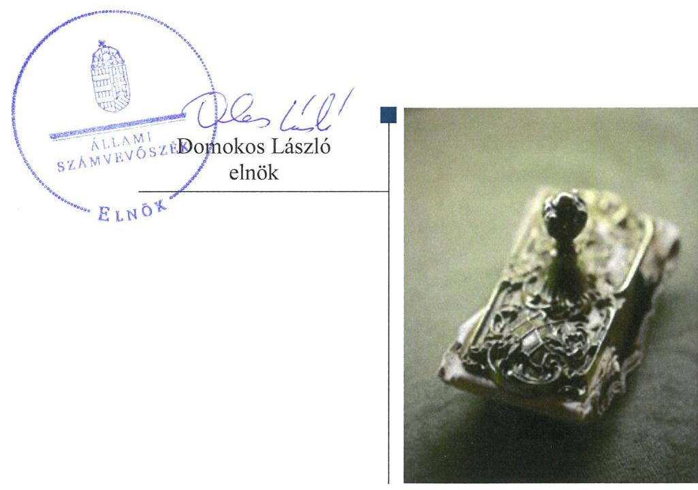
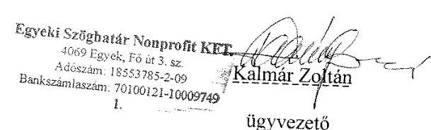
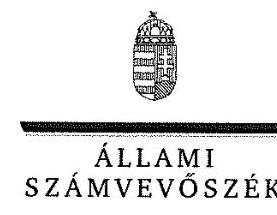
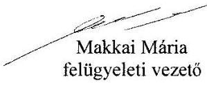

# Jelentés 

## Az önkormányzatok gazdasági társaságai

Az önkormányzatok többségi tulajdonában lévő gazdasági társaságok gazdálkodásának ellenőrzése - EGYEKI SZÖGHATÁR Szociális és Településüzemeltetési Nonprofit Kft.
2018.

---

# Jelentés 

## Az önkormányzatok gazdasági társaságai

Az önkormányzatok többségi tulajdonában lévő gazdasági társaságok gazdálkodásának ellenőrzése - EGYEKI SZÖGHATÁR Szociális és Településüzemeltetési Nonprofit Kft.
2018. 07. hó 31. nap

---

# AZ ELLENŐRZÉST FELÜGYELTE:

## MAKKAI MÁRIA felügyeleti vezető

## AZ ELLENŐRZÉST VEZETTE ÉS A VÉGREHAJTÁSÁÉRT FELELŐS:

### GELENCSÉR ZSOLT ellenőrzésvezető

### A PROGRAM ÖSSZEÁLLÍTÁSÁÉRT FELELŐS:

### TÓTPÁL SZABOLCS osztályvezető

IKTATÓSZÁM: EL-0196-046/2018.

TÉMASZÁM: 2447

ELLENŐRZÉS-AZONOSÍTÓ SZÁM: V079363

Jelentéseink az Országgyűlés számítógépes hálózatán és az Interneten a www.asz.hu címen is olvashatóak.

---

# TARTALOMJEGYZÉK 

■ ÖSSZEGZÉS ..... 5
■ AZ ELLENŐRZÉS CÉLJA ..... 6
■ AZ ELLENŐRZÉS TERÜLETE ..... 7
■ AZ ELLENŐRZÉS HÁTTERE, INDOKOLTSÁGA ..... 8
■ A JELENTÉS LÉNYEGES KÉRDÉSKÖREI ..... 9
■ AZ ELLENŐRZÉS HATÓKÖRE ÉS MÓDSZEREI ..... 10
■ MEGÁLLAPÍTÁSOK ..... 12
■ JAVASLATOK ..... 14
■ MELLÉKLETEK ..... 17
I. sz. melléklet: Értelmező szótár ..... 17
■ FÜGGELÉK: ÉSZREVÉTELEK ..... 19
■ RÖVIDÍTÉSEK JEGYZÉKE ..... 25

---

.

---

# ÖSSZEGZÉS 

Az EGYEKI SZÖGHATÁR Szociális és Településüzemeltetési Nonprofit Kft. gazdálkodásának szabályozottsága nem felelt meg a jogszabályi előírásoknak, gazdálkodása, vagyongazdálkodása nem volt szabályszerű, az elszámoltathatóság nem volt biztosított. A közérdekű adatok közzétételi kötelezettségének nem tett eleget, így gazdálkodása nem volt átlátható.

## Az ellenőrzés társadalmi indokoltsága

Magyarországon az önkormányzatok kötelező és önként vállalt feladataik vonatkozásában is egyre szélesebb körben alkalmazzák a költségvetésen kívüli feladatellátást, ezáltal az önkormányzati tulajdonú gazdasági társaságok is kiemelt fontosságú szerephez jutottak.

Ezzel összhangban került sor Egyek Nagyközség Önkormányzata és a 100%-os tulajdonában álló EGYEKI SZÖGHATÁR Szociális és Településüzemeltetési Nonprofit Korlátolt Felelősségű Társaság szabályozottságának, gazdálkodása és vagyongazdálkodási tevékenysége szabályszerűségének, valamint az Önkormányzat tulajdonosi joggyakorlása 2013-2016. évi szabályszerűségének ellenőrzésére.

## Főbb megállapítások, következtetések, javaslatok

Egyek Nagyközség Önkormányzata a 100%-os tulajdonában álló EGYEKI SZÖGHATÁR Szociális és Településüzemeltetési Nonprofit Korlátolt Felelősségű Társaság tekintetében a tulajdonosi joggyakorlás kereteit szabályszerűen alakította ki, a tulajdonosi jogokat szabályszerűen gyakorolta. Az Alapító a jogszabályi előírásokat betartva döntött az egyszerűsített éves beszámolók elfogadásáról.

Az EGYEKI SZÖGHATÁR Szociális és Településüzemeltetési Nonprofit Korlátolt Felelősségű Társaság gazdálkodásának szabályozottsága nem felelt meg a jogszabályi előírásoknak, számviteli politikáját 2013. november 1-ig nem alkotta meg, számlarendjét 2016. szeptember 1-én készítette el, adatvédelmi és adatbiztonsági szabályzattal nem rendelkezett. A vagyonnal való gazdálkodása nem volt szabályszerű, mert egyszerűsített éves beszámolóját leltárral egyik ellenőrzött évben sem támasztotta alá, így a valódiság elve sérült.

A Társaságnál a bevételeket és ráfordításokat nem szabályszerűen számolták el. A társaság a közérdekű adatok jogszabályban meghatározott közzétételi kötelezettségének nem tett eleget.

A megállapítások alapján az Állami Számvevőszék Egyek Nagyközség Önkormányzata polgármesterének kettő javaslatot, az EGYEKI SZÖGHATÁR Szociális és Településüzemeltetési Nonprofit Korlátolt Felelősségű Társaság ügyvezetőjének hét javaslatot fogalmazott meg.

---

# AZ ELLENŐRZÉS CÉLJA 

AZ ELLENŐRZÉS CÉLJA annak értékelése volt, hogy az önkormányzat vagyongazdálkodási tevékenysége során szabályszerűen gyakorolta-e tulajdonosi jogait; a gazdasági társaság szabályozottsága, gazdálkodása és vagyongazdálkodási tevékenysége, bevételeinek és ráfordításainak elszámolása megfelelt-e a jogszabályi és tulajdonosi előírásoknak; a gazdasági társaság kötelezettségállománya jelent-e kockázatot a működésre, valamint a gazdálkodás átláthatósága és elszámoltathatósága érdekében biztosítva volt-e a szolgáltatás díjának megalapozottsága szabályszerű önköltségszámítással.

---

# AZ ELLENŐRZÉS TERÜLETE 

## Egyek Nagyközség Önkormányzata és a 100%-os tulajdonában álló EGYEKI SZÖGHATÁR Szociális és Településüzemeltetési Nonprofit Korlátolt Felelősségű Társaság

A TÁRSASÁGOT 1998. április 8-án alapította Egyek Nagyközség Önkormányzata, 3,0 M Ft törzstőkével, amely az ellenőrzött időszak alatt nem változott. A Társaság működése során az alábbi közfeladatokat látta el:
$\longrightarrow$ Szociális, gyermekjóléti és gyermekvédelmi szolgáltatások.
$\longrightarrow$ Helyi környezet és természetvédelmi feladatok közül a szennyvíz gyűjtése és kezelése, nem veszélyes hulladék gyűjtése, ártalmatlanítása.
$\longrightarrow$ Helyi közfoglalkoztatás keretében a közhasznú és közcélú munkavégzés feladatainak megszervezése, koordinálása, irányítása.
$\longrightarrow$ A közforgalom számára megnyitott út, híd, alagút fejlesztéséhez, fenntartásához és üzemeltetéséhez kapcsolódó tevékenység ellátása.
A Társaság tevékenységi körébe a közétkeztetés, az idősek, fogyatékosok bentlakás nélküli szociális ellátása, egyéb közösségi és társadalmi tevékenység, az Önkormányzat és intézményei ingatlanainak és építményeinek üzemeltetése, a közétkeztetéshez és ingatlan- és építményüzemeltetéshez kapcsolódó nem veszélyes hulladék kezelése, ártalmatlanítása az önkormányzati tulajdonú nem lakás céljára szolgáló helyiségek bérbeadása, valamint a munkaerőpiacon hátrányos helyzetű munkavállalók munkaerőpiacra történő visszakerülésének segítése tartozott. Az Önkormányzat a feladatellátáshoz szükséges ingó és ingatlan vagyont üzemeltetésre átadta, vagyonkezelésbe adott vagyon nem volt. A Társaság közhasznú jogállású volt az ellenőrzött időszakban. A Társaság nem volt önköltségszámítási szabályzat készítésére kötelezett. A Társaság nem tartozott a kormányzati szektorba sorolt szervezetek közé.

A polgármester és a jegyző személyében nem történt változás, a Társaság ügyvezetőjének személye négyszer változott az ellenőrzött időszak alatt.

---

# AZ ELLENŐRZÉS HÁTTERE, INDOKOLTSÁGA 

## AZ ÖNKORMÁNYZATOK TÖBBSÉGI TULAJDONÁBAN ÁLLÓ GAZDASÁGI TÁRSASÁGOK ELLENŐRZÉSE kiemelten fontos a vagyon megőrzése, megóvása érdekében, valamint a kormányzati szektor elszámolásaiban megjelenő önkormányzati tulajdonú gazdálkodó szervezetek esetében, amelyekkel szemben alapvető követelmény, hogy gazdálkodásuk, működésük szabályszerű, az általuk szolgáltatott adatok minél megbízhatóbbak legyenek. A feladatellátás költségeinek, ráfordításainak alakulása a lakosság széles rétegét érinti.

Az Állami Számvevőszék ellenőrzései feltárhatják, hogy az önkormányzat a feladatellátásához rendelt vagyon működtetését a tulajdonostól elvárható gondossággal végezte-e, a feladatot ellátó gazdasági társaság a létesítő okiratban, szolgáltatási szerződésben foglaltak betartásával biztosította-e a feladat ellátását. Az ellenőrzés rávilágíthat arra, hogy a gazdasági társaság a vagyon használatával biztosította-e a szolgáltatás folytatásának feltételeit, az önkormányzat tulajdonosi felügyelete hozzájárult-e a szabályszerű gazdálkodáshoz és feladatellátáshoz.

---

# A JELENTÉS LÉNYEGES KÉRDÉSKÖREI 

1. Az Önkormányzat tulajdonosi joggyakorlása szabályszerű volt-e?
2. A gazdasági társaság szabályozottsága, gazdálkodása és vagyongazdálkodási tevékenysége szabályszerű volt-e?

---

# AZ ELLENŐRZÉS HATÓKÖRE ÉS MÓDSZEREI 

## Az ellenőrzés típusa

Megfelelőségi ellenőrzés.

## Az ellenőrzött időszak

2013. január 1-jétől 2016. december 31-ig tartó időszak.

## Az ellenőrzés tárgya

Egyek Nagyközség Önkormányzata - a többségi tulajdonában álló EGYEKI SZÖGHATÁR Szociális és Településüzemeltetési Nonprofit Korlátolt Felelősségű Társaság feletti tulajdonosi joggyakorlása, valamint a Társaság gazdálkodásának szabályozottsága és szabályszerűsége.

## Az ellenőrzött szervezet

Egyek Nagyközség Önkormányzata, valamint a EGYEKI SZÖGHATÁR Szociális és Településüzemeltetési Nonprofit Korlátolt Felelősségű Társaság.

## Az ellenőrzés jogalapja

Az ellenőrzés jogszabályi alapját az ÁSZ tv. 1. § (3) bekezdése és 5. § (3)-(4)-(5) bekezdései képezték.

## Az ellenőrzés módszerei

Az ellenőrzést a nemzetközi standardokat irányadónak tekintve az ellenőrzési program ellenőrzési kérdései, az ellenőrzött időszakban hatályos jogszabályok, az ellenőrzés szakmai szabályok és módszertanok figyelembe vételével végeztük.

Az ellenőrzés ideje alatt az ellenőrzött szervezettel történő kapcsolattartást az ÁSZ Szervezeti és Működési Szabályzatának vonatkozó előírásai alapján biztosítottuk.

Mintavétellel ellenőriztük a bevételek és ráfordítások elszámolását, a vagyonnyilvántartás és az értékcsökkenés elszámolását pedig teljes körű ellenőrzés alá vontuk. Az ellenőrzött minták alapján a sokaságban előforduló hibaarányt becsültük. „Szabályszerűnek" értékeltünk egy ellenőrzött

---

területet, amennyiben 95%-os bizonyossággal a teljes sokaságban a hibaarány legfeljebb 10%-os, „nem szabályszerűnek", amennyiben 10%-nál magasabb arányt képviselt. A mintavételt megelőzően az anyagjellegű ráfordítások valamint a tárgyi eszközök növekedési tételeinek sokaságaiból évente kiemeltük a 3-3 legnagyobb összegű tételt annak biztosítására, hogy az ellenőrzés a véletlen mintavétel mellett a legnagyobb értékű tételek ellenőrzésére biztosan kiterjedjen.

Az ellenőrzési kérdések megválaszolásához szükséges bizonyítékok megszerzése a következő ellenőrzési eljárások alkalmazásával történt: megfigyelés, kérdésfeltevés (információkérés), összehasonlítás, valamint elemző eljárás. Az ellenőrzési bizonyítékként felhasználható adatforrások közé tartoztak egyrészt az ellenőrzési programban felsorolt adatforrások, másrészt adatforrás lehetett még minden - az ellenőrzés folyamán - feltárt, az ellenőrzés szempontjából információkat tartalmazó dokumentum.

Az ellenőrzést a kérdésekre adott válaszok kiértékelésével, valamint a megjelölt adatforrások, a csatolt tanúsítványok felhasználásával, továbbá az adott időszakban hatályos jogszabályok figyelembe vételével folytattuk le.

---

# 1. Az Önkormányzat tulajdonosi joggyakorlása szabályszerű volt-e? 

Összegző megállapítás

A tulajdonosi joggyakorlás kereteinek kialakítása és a tulajdonosi joggyakorlás szabályszerű volt.

A TULAJDONOSI JOGOKAT az Önkormányzat Vagyonrendelete ${ }^{2}$ értelmében a Képviselő-testület gyakorolta. Az Alapító ${ }^{3}$ döntött a Társaság éves pénzügyi terveinek elfogadásáról. A gazdálkodást évközi és év végi beszámolók keretében ellenőrizte az Alapító. A Társaság egyszerűsített éves beszámolóját az Alapító a Felügyelőbizottság és a könyvvizsgáló jelentésének ismeretében tárgyalta és fogadta el. Belső ellenőrzés a Társaságnál 2014. évben történt, az ellenőrzés megállapításaira intézkedtek. Az Alapító a Taktv. ${ }^{4}$ 5. § (3) bekezdése előírásait megsértve nem készítette el a vezető tisztségviselők, felügyelőbizottsági tagok, valamint az Mt. 208. §-ának hatálya alá eső munkavállalók javadalmazása, valamint a jogviszony megszűnése esetére biztosított juttatások módjának, mértékének elveiről, annak rendszeréről szóló szabályzatot.

A FELÜGYELŐBIZOTTSÁG tagjait az Alapító megválasztotta. A Felügyelőbizottság minden évben írásbeli jelentést készített Társaság egyszerűsített éves beszámolóiról az Alapító részére. A Felügyelőbizottság a Ptk. ${ }^{6}$ 3:122. § (3) bekezdésében foglaltak ellenére az ügyrendjét nem alakította ki.

## 2. A gazdasági társaság szabályozottsága, gazdálkodása és vagyongazdálkodási tevékenysége szabályszerű volt-e?

## Összegző megállapítás

A Társaság gazdálkodásának szabályozottsága nem felelt meg a jogszabályi előírásoknak, gazdálkodása és vagyongazdálkodása nem volt szabályszerű.

SZÁMVITELI SZABÁLYZATAIT a Társaság 2013. január 1-től 2013. október 30-ig nem készítette el, ezzel megsértette a Számv. ${ }^{7}$ tv. 14. § (3) bekezdését. A 2013. november 1-től érvényes számviteli politika, eszközök és források leltárkészítési és leltározási szabályzata, az eszközök és források értékelési szabályzata valamint a pénzkezelési szabályzat megfelelt a Számv. tv. előírásainak.

SZÁMLARENDET a Társaság 2013. január 1-től 2016. augusztus 31-ig nem készített, ezzel nem tett eleget a Számv. tv. 161. § előírásának. A

---

2016. szeptember 1-től hatályos számlarend nem tartalmazta minden alkalmazásra kijelölt számla számjelét és megnevezését, amivel megsértették a Számv. tv. 161. § (2) bekezdés a) pontját.

A KÖZHASZNÚ ÉS NEM KÖZHASZNÚ tevékenységből származó bevételek és ráfordítások elkülönítésének módját nem szabályozták. Ezáltal nem gondoskodtak a Számv. tv. 161/A § (1) bekezdésében foglalt olyan belső szabályok kialakításáról, amely a mérleg és eredmény kimutatás alátámasztásán túlmenően a kiegészítő melléklet adatainak közvetlen alátámasztására is alkalmas.

# ADATVÉDELMI ÉS ADATBIZTONSÁGI SZABÁLY-

ZATOT az Info ${ }^{8}$ tv. 24. § (3) bekezdésének előírása ellenére a Társaság nem készített, így nem volt biztosított a kezelésében álló adatok megfelelő védelme. Az Info tv. 37. § (1) bekezdésében előírt, az 1. sz. melléklet szerinti közzétételi kötelezettségét a Társaság nem teljesítette, ezáltal nem biztosította tevékenysége átláthatóságát.

EGYSZERŰSÍTETT ÉVES BESZÁMOLÓIT a Társaság nem szabályszerűen készítette el. A kiegészítő mellékletben bemutatta a közhasznúsági tevékenységét, azonban nem készítette el a 350/2011. (XII.30.) Korm. rendelet ${ }^{9}$ 12. § (1) bekezdésében szereplő közhasznúsági mellékletet.

A Társaság nem készítette el egyszerűsített éves beszámolóihhoz a mérleg tételeit alátámasztó, a mérleg fordulónapján meglévő eszközeit és forrásait mennyiségben és értékben tartalmazó leltárakat, amivel megsértette a Számv.tv. 69. § (1) bekezdését, és nem biztosította a mérleg valódiságát. A hiányzó leltárak ellenére a könyvvizsgáló korlátozás nélküli hitelesítő záradékot tartalmazó könyvvizsgálói jelentést adott ki a beszámolókról. A beszámolók letétbe helyezési, közzétételi kötelezettségének a Társaság eleget tett.

A BEVÉTELEK ÉS RÁFORDÍTÁSOK elszámolása nem volt szabályszerű, mert a Társaság 2013. január 1-től 2016. szeptember 1-ig nem rendelkezett számlarenddel,
 ennek következtében nem volt megállapítható a gazdasági események megfelelő számlákra történő könyvelése.

A személyi jellegű ráfordítások elszámolása a Számv.tv. 165. § (2) bekezdésében előírtak ellenére bizonylattal nem volt alátámasztott, mert hiányzott az összesített bérfeladás bizonylata.

A tárgyi eszközök állományba vételekor az üzembe helyezést hitelt érdemlően nem dokumentálták, így nem teljesült a Számv.tv. 52. § (2) bekezdésének előírása. Az üzembe helyezési dokumentumok hiánya miatt az értékcsökkenés elszámolásának kezdő időpontja nem volt megállapítható.

A Társaság működésével összefüggésben a Lakás tv. ${ }^{10}$, a Szoc.tv. ${ }^{11}$, és a gyermekek védelméről ${ }^{12}$ szóló tv. írt elő rendelet alkotási és díj megállapítási kötelezettséget az Önkormányzat számára, amelynek az Önkormányzat eleget tett. A Társaság az Önkormányzat által megállapított árakat alkalmazta.

---

# JAVASLATOK 

Az ÁSZ tv. 33. § (1) bekezdésében foglaltak értelmében az ellenőrzött szervezet vezetője köteles a jelentésben foglalt megállapításokhoz kapcsolódó intézkedési tervet összeállítani és azt a jelentés kézhezvételétől számított 30 napon belül az ÁSZ részére megküldeni. Amennyiben az ellenőrzött szervezet vezetője nem küldi meg határidőben az intézkedési tervet, vagy továbbra sem elfogadható intézkedési tervet küld, az Állami Számvevőszék elnöke az ÁSZ tv. 33. § (3) bekezdése a) és b) pontjaiban foglaltakat érvényesítheti.

## Egyek Nagyközség polgármesterének

1. Kezdeményezze a vezető tisztségviselők, felügyelőbizottsági tagok, valamint az Mt. 208. §-ának hatálya alá eső munkavállalók javadalmazása, valamint a jogviszony megszünése esetére biztosított juttatások módjának, mértékének elveire, annak rendszerére vonatkozó szabályzat megalkotását.
(1. számú megállapítás 1. bekezdés utolsó mondata alapján)
2. Kezdeményezze, hogy a felügyelőbizottság állapítsa meg ügyrendjét és az Alapító a jogszabályi előírásoknak megfelelően hagyja jóvá.
(1. számú megállapítás 2. bekezdés utolsó mondata alapján)

## az EGYEKI SZÖGHATÁR Szociális és Településüzemeltetési Nonprofit Kft. ügyvezetőjének

1. Intézkedjen a számlarend módosításáról, hogy az feleljen meg a Számv. tv. előírásainak.
(2. számú megállapítás 2. bekezdés második mondata alapján)
2. Intézkedjen a könyvvezetésre, bizonylatolásra vonatkozó olyan belső szabályok kialakításáról, amely a mérleg és az eredménykimutatás alátámasztásán túlmenően a kiegészítő melléklet adatainak közvetlen alátámasztására is alkalmas.
(2. számú megállapítás 3. bekezdése alapján)
3. Intézkedjen a jogszabályi előírásoknak megfelelően az adatvédelmi és adatbiztonsági szabályzat elkészítéséről.
(2. számú megállapítás 4. bekezdés első tagmondata alapján)

---

4. | Intézkedjen az Info. tv. 1. mellékletében előírt adatok közzétételéről   (2. számú megállapítás 4. bekezdés második mondata alapján)
5. | Intézkedjen a jogszabályi előírásoknak megfelelően beszámoló jóváhagyásával egyidejűleg a közhasznúsági melléklet elkészítéséről.
(2. számú megállapítás 5. bekezdés második mondata alapján)
6. | Intézkedjen a Számv. tv. előírásainak megfelelően az egyszerűsített éves beszámolók mérlegtételeit alátámasztó leltár elkészítéséről.
(2. számú megállapítás 6. bekezdés első mondata alapján)
7. | Intézkedjen a személyi jellegű ráfordítások és az értékcsökkenés jogszabályi előírásoknak megfelelő elszámolásáról, valamint az eszközök üzembe helyezésének Számv. tv. előírásainak megfelelő dokumentálásáról.
(2. számú megállapítás 8-9. bekezdései alapján)

---

.

---

# MELLÉKLETEK 

- I. SZ. MELLÉKLET: ÉRTELMEZŐ SZÓTÁR
gazdasági társaság
nemzeti vagyon
nonprofit gazdasági társaság

Ptk 3.88. § (1) bekezdése szerint „a gazdasági társaságok üzletszerű közös gazdasági tevékenység folytatására, a tagok vagyoni hozzájárulásával létrehozott, jogi személyiséggel rendelkező vállalkozások, amelyekben a tagok a nyereségből közösen részesednek, és a veszteséget közösen viselik".
Nvtv. 1. § (2) bekezdése szerint többek között:
„az állam vagy a helyi önkormányzat kizárólagos tulajdonában álló dolgok, az a) pont hatálya alá nem tartozó, állam vagy a helyi önkormányzat tulajdonában lévő dolog,
az állam vagy a helyi önkormányzat tulajdonában lévő pénzügyi eszközök, továbbá az államot vagy a helyi önkormányzatot megillető társasági részesedések, az államot vagy a helyi önkormányzatot megillető bármely vagyoni értékkel rendelkező jogosultság, amelyet jogszabály vagyoni értékű jogként nevesít."
Civil tv. 9/F. § (2) bekezdése szerint „az a gazdasági társaság minősül nonprofit gazdasági társaságnak és cégnevében az a gazdasági társaság tüntetheti fel a nonprofit jelleget, amelynek létesítő okirata tartalmazza, hogy a gazdasági társaság tevékenységéből származó nyereség a tagok között nem osztható fel, hanem az a gazdasági társaság vagyonát gyarapítja." (hatályos 2014. március 15-től)

---

.

---

# FÜGGELÉK: ÉSZREVÉTELEK 

A jelentéstervezetet a Számvevőszék 15 napos észrevételezésre megküldte az ellenőrzött szervezetek vezetőinek az ÁSZ tv. 29. § (1) bekezdése előírásának megfelelően.

Az ÁSZ a jelentéstervezetet észrevételezésre megküldte Egyek Nagyközség Önkormányzata polgármesterének és az EGYEKI SZÖGHATÁR Szociális és Településüzemeltetési Nonprofit Korlátolt Felelősségű Társaság ügyvezetőjének.
Egyek Nagyközség polgármestere észrevételezési jogával nem élt. Az EGYEKI SZÖGHATÁR Szociális és Településüzemeltetési Nonprofit Korlátolt Felelősségű Társaság ügyvezetőjének észrevételét és az arra adott választ a függelék alább tartalmazza.

[^0]
[^0]:    * 29. § (1) Az Állami Számvevőszék az ellenőrzési megállapításait megküldi az ellenőrzött szervezet vezetőjének vagy az általa megbízott személynek, és annak, akinek személyes felelősségét állapította meg.
    (2) Az ellenőrzött szervezet vezetője és a felelősként megjelölt személy az ellenőrzés megállapításaira tizenöt napon belül írásban észrevételt tehet.
    (3) Az Állami Számvevőszék az észrevételre a beérkezésétől számított harminc napon belül írásban válaszol. A figyelembe nem vett észrevételeket köteles a jelentésben feltüntetni, és megindokolni, hogy azokat miért nem fogadta el.

---

# Egyeki Szöghatár Nonprofit Számvevőszék

4069 Egyek, Fő út 3.
Tel. / Fax: 06 52 378 023
e-mail: szoghatar@gmail.com

923
Hablac M

BECKELIRODA
2018 06 27

Észrevétel

Az ÁSZ tv. 29§ (2) bekezdése szerint az ellenőrzés megállapításaira

**Domokos László Úr az ÁSZ Elnöke részére**

Tisztelt Elnök Úr

Megköszönöm eddigi munkájukat és élve a felkínált lehetőséggel, szeretnék röviden néhány észrevételt tenni. Az alábbiakat a Kft könyvvizsgálója és a főkönyvelője által tett megállapítások felhasználásával írom.

A Kft ügyvezetését 2016. szeptember 1. óta, kisebb megszakítással végzem. Egy sajnálatos és téves cégbírósági ügy miatt néhány hónapra sajnos meg kellett szakítanom a folyamatos cégvezetést. Ez idő alatt egy ügyvivő ügyvezető volt megbízva. A tévedések tisztázása után, a cégbíróság azonnali hatállyal visszaállított pozíciómba, ahol azóta is én végzem az ügyvezetői feladatokat. Az ÁSZ által vizsgált időszak 2013-2016. Ez idő alatt a Kft-nek több ügyvezetője volt, akik személyenként is, viszonylag rövid ideig végezték a munkát. Az ÁSZ vizsgálat lefolytatásához szükséges adatgyűjtés előtt próbáltam tájékozódni a vizsgált időszakban történtekkel kapcsolatban. Végül megállapítottam, hogy a vezetőváltások alkalmával az átadás-átvételek minden bizonnyal nem voltak körültekintően lefolytatva, ezért bizonyos önök által kért dokumentumokat nem lehetett fellelni. Ennek a konkrét folyamatát, okát én nem ismerem. A kollégáimmal, akik szintén nem rég óta dolgoznak a Kft-ben, mindent elkövettünk annak érdekében, hogy a kért dokumentumokat a lehető legalaposabban szolgáltassuk az ÁSZ részére. Amit a Kft-nél jelenleg meg lehetett találni, mindent a rendelkezésére bocsájtottunk.

A könyvvizsgálónk az alábbi észrevételeket tette (nem szó szerint idézve):

A vizsgált időszak ügyvezető- és könyvelőváltásai során az átadás-átvételek nem megfelelően történtek, ezért nem lehetett minden kért dokumentumot szolgáltatni.

Az ÁSZ azon megállapításai, hogy a Társaság nem készített mérleget alátámasztó leltárakat nem felel meg a valóságnak. A könyvvizsgálói dokumentációban ezen leltárak másolatai, illetve munkaanyagai megtalálhatók, a könyvvizsgálói munka során azokat ellenőriztem. Valószínű, hogy ezek a leltárak nem kerültek megküldésre. Megküldöm az erre vonatkozó dokumentumokat.

A hiányzó szabályzatok nyilván az ügyvezetői, könyvelői váltásnak estek áldozatul, a 2013. évi beszámoló összeállításakor hatályos szabályzatokkal rendelkezett a Cég.

A főkönyvelő által (lentebb) említett közhasznúsági jelentések elkészültek, azok a testületi anyag részeként előterjesztésre kerültek, nem ismert miért, mi alapján kifogásolja azt az ÁSZ.

A bérfeladás bizonylatai szintén rendelkezésre álltak, nálam a könyvvizsgálói dokumentációban ezek megtalálhatók, megküldöm az erre vonatkozó dokumentumokat is.

A tárgyi eszközök üzembe helyezési bizonylatait, valamint a számlarend hiányosságait valóban pótolni szükséges.

20

---

# EGYEKI SZÖGHATÁR NONPROFIT KFT. 

4069 Egyek, Fő út 3.
Tel. / Fax: 0652 378 023
e-mail: szoghatar@gmail.com

Az említett dokumentumok ezen a linken "Észrevételhez.zip" néven elérhetőek: https://drive.google.com/open?id=1H7WfWIVlAxBwZepfhnE823GTQA6aleC

## A főkönyvelőnk az alábbi észrevételeket tette (szintén nem szó szerint idézve):

A szervezet 2013. évi szabályzatai nincsenek elkészítve. Sajnos nem ismerem a 2013. évi működést, és könyvelési anyagot.

A számlarendnél a 2016. éviéket csatolom és csatolok hozzá egy 2016. évben ténylegesen használatos számlatükröt is. (Ha igénylik, e-mailben megküldjük.) Az előző évekét nem tudom megcsinálni, mert nem ismerem.

Beszámoló közhasznúsági melléklete: A hivatkozott jogszabályi helyek nem írnak elő kötelező formát. A beszámoló részét képezi a KÖZHASZNÚSÁGI JELENTÉS 2016, amely ennek megfelelő adattartalommal bír.

A beszámolót alátámasztó leltárak megvannak, de valószínű, hogy nem lettek feltöltve, és így az ÁSZ nem kapta meg őket.

A személyi jellegű ráfordítások elszámolását alátámasztó összesített bérfeladási lista meg nem léte kapcsán nem vagyok teljesen tisztában, vagy az lehet, hogy ezek sem lettek becsatolva az ÁSZ-nak küldendő anyagban, vagy ha a bérfeladás vegyes napló alapbizonylatára gondolnak, akkor viszont azt mondhatom, hogy ez azért nem készül, mert a könyvelő program automatikus feladást készít, nem készül külön alapbizonylat, ami alapján manuálisan rögzítésre kerülne a főkönyvben a bérfeladás.

A tárgyi eszközök üzembe helyezésének bizonylatai pótolhatóak.

Megköszönöm eddigi munkájukat és további sikeres együttműködést kívánva maradok tisztelettel:

Egyek 2018.06.21.

---

ELNÖK

Ikt.szám: EL-0544-019/2018.

# Kalmár Zoltán úr 

ügyvezető

EGYEKI SZÖGHATÁR Szociális és Településüzemeltetési Nonprofit Kft.

## Egyek

## Tisztelt Ügyvezető Úr!

„Az önkormányzatok gazdasági társaságai - Az önkormányzatok többségi tulajdonában lévő gazdasági társaságok gazdálkodásának ellenőrzése - EGYEKI SZÖGHATÁR Szociális és Településüzemeltetési Nonprofit Kft." címmel készített számvevőszéki jelentéstervezetre tett észrevételét köszönettel megkaptam.

Az Állami Számvevőszék észrevételre vonatkozó álláspontjáról a felügyeleti vezető által készített részletes tájékoztatást mellékelten megküldöm.

Tájékoztatom Ügyvezető urat, hogy a számvevőszéki jelentésben - az Állami Számvevőszékről szóló 2011. évi LXVI. törvény 29. § (3) bekezdése alapján - a figyelembe nem vett észrevételeket szerepeltetjük, annak indoklásával, hogy azokat az Állami Számvevőszék miért nem fogadta el.

Budapest, 2018. 07. 04.

Tisztelettel:

Melléklet: Tájékoztatás az észrevétel kezeléséről

---

# Tájékoztatás   az észrevétel kezeléséről 

„Az önkormányzatok gazdasági társaságai - Az önkormányzatok többségi tulajdonában lévő gazdasági társaságok gazdálkodásának ellenőrzése - EGYEKI SZÖGHATÁR Szociális és Településüzemeltetési Nonprofit Kft." című jelentéstervezetre 2018. június 27-én érkezett észrevételt áttekintettük, annak kezelésével kapcsolatban a következő tájékoztatást adom.

1. A számviteli szabályzatokkal, a számlarenddel, az éves beszámolók mérlegtételeit alátámasztó leltárakkal, a személyi jellegű ráfordítások elszámolását alátámasztó bizonylatokkal, valamint a tárgyi eszközök üzembe helyezési bizonylataival kapcsolatban megfogalmazott észrevételre adott válasz
Tájékoztatom Ügyvezető urat, hogy az ÁSZ megállapításai az Állami Számvevőszékről szóló 2011. évi LXVI. törvénynek (ÁSZ tv.) megfelelően minden esetben az ellenőrzés során bekért és az arra nyitva álló határidőn belül rendelkezésre bocsátott dokumentumokon alapulnak. A dokumentumok rendelkezésre bocsátására az ÁSZ tv. 28. § (2) bekezdése alapján az adatbekérő levél kézhezvételét követően öt munkanapon belül volt lehetősége. Az észrevételben leírtak megerősítik az ÁSZ vonatkozó megállapításait. Fentiek alapján az észrevételt nem fogadjuk el, a jelentéstervezet módosítása nem indokolt.

## 2. A közhasznúsági melléklet elkészítésével kapcsolatban megfogalmazott észrevételre adott válasz

Az észrevétel rögzíti, hogy a Társaság „közhasznúsági jelentései elkészültek, azok a testületi anyag részeként előterjesztésre kerültek, valamint a 2016. évi közhasznúsági jelentés a beszámoló részét képezi." Továbbá, az észrevétel vitatja az ÁSZ azon megállapítását, mely szerint a Társaság „nem
 készítette el a 350/2011. (XII.30.) Korm. rendelet 12. § (1) bekezdésében szereplő közhasznúsági mellékletet.". Az észrevétel szerint „A hivatkozott jogszabályi helyek nem írnak elő kötelező formát." és a 2016. évi közhasznúsági jelentés megfelelő adattartalommal bír.
Tájékoztatom, hogy az ÁSZ megállapításai minden esetben az ellenőrzött szervezet által az arra nyitva álló határidőn belül rendelkezésre bocsátott dokumentumokon alapulnak. A Társaság az észrevételben hivatkozott dokumentumokat nem bocsátotta az ÁSZ rendelkezésére, továbbá az ÁSZ megállapításában hivatkozott jogszabály előírása, hogy a közhasznú szervezet közhasznúsági mellékletét a „rendelet Mellékletének megfelelő, erre a célra rendszeresített formanyomtatványon készíti el." Fentiek szerint az észrevételt nem fogadjuk el, az ÁSZ megállapítása helytálló, módosítása nem indokolt.
Budapest, 2018. $\sim$ hó ${ }^{11}$ nap

---

.

---

# RÖVIDÍTÉSEK JEGYZÉKE 

${ }^{1}$ Társaság
${ }^{2}$ vagyonrendelet
${ }^{3}$ Alapító
${ }^{4}$ Tak.tv.
${ }^{5} \mathrm{Mt}$.
${ }^{6}$ Ptk.
${ }^{7}$ Számv.tv
${ }^{8}$ Info tv.
${ }^{9}$ 350/2011. (XII.30.) Korm. rendelet
${ }^{10}$ Lakás tv.
${ }^{11}$ Szoc. tv.
${ }^{12}$ Gyvt.

EGYEKI SZÖGHATÁR Szociális, Kereskedelmi és Szolgáltató Közhasznú Társaság Egyek Nagyközség Önkormányzat Képviselő-testületének 22/2006. (VIII.31.) számú rendelete az Önkormányzat vagyonáról

Egyek Nagyközség Önkormányzata
a köztulajdonban álló gazdasági társaságok takarékosabb működéséről szóló 2009. évi CXXII. törvény
2012. évi I. törvény a munka törvénykönyvéről
a polgári törvénykönyvről szóló 2013. évi V. törvény
a számvitelről szóló 2000. évi C. törvény
az információs önrendelkezési jogról és az információszabadságról szóló 2011. évi CXII. törvény
350/2011. (XII. 30.) Korm. rendelet a civil szervezetek gazdálkodása, az adománygyűjtés és a közhasznúság egyes kérdéseiről
a lakások és helyiségek bérletére, valamint az elidegenítésükre vonatkozó egyes szabályokról szóló 1993. évi LXXVIII. törvény
a szociális igazgatásról és szociális ellátásokról szóló 1993. évi III. törvény a gyermekek védelméről és a gyámügyi igazgatásról szóló 1997. évi XXXI. törvény

---

# ÁLLAMI SZÁMVEVŐSZÉK 

1052 Budapest, Apáczai Csere János utca 10.
Levélcím: 1364 Budapest 4. Pf. 54
Telefon: +36 14849100 Telefax: +36 14849200
www.asz.hu
