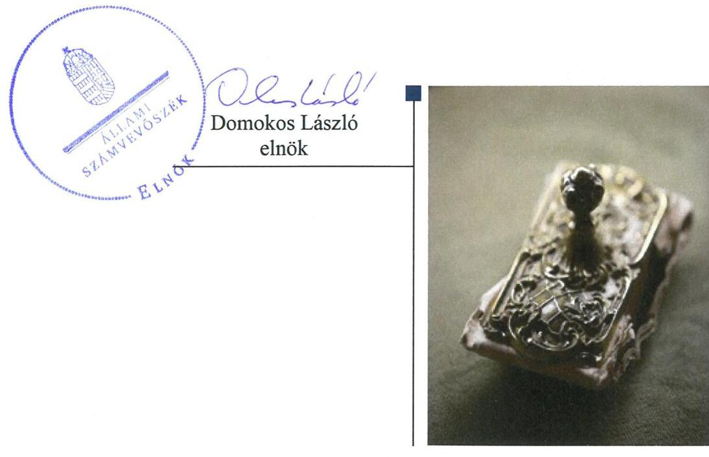
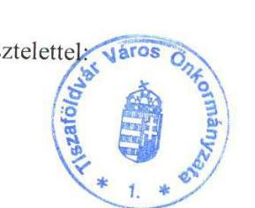
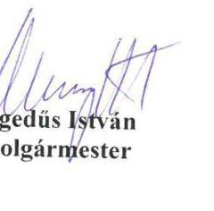
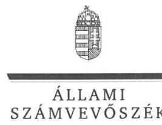
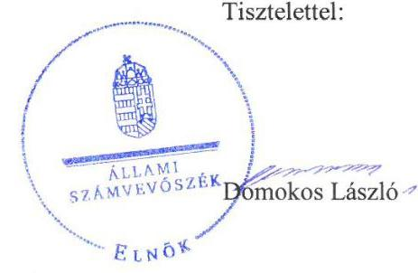
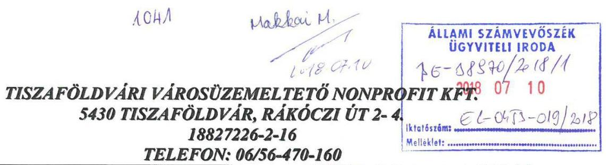
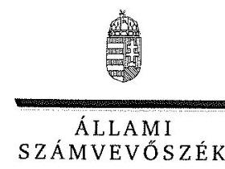
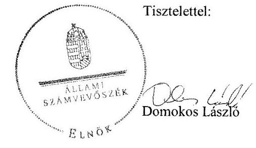

# Jelentés 

## Az önkormányzatok gazdasági társaságai

Az önkormányzatok többségi tulajdonában lévő gazdasági társaságok gazdálkodásának ellenőrzése - Tiszaföldvári Városüzemeltető Nonprofit Kft.

2018. 08. hó 08. nap

---

# Jelentés 

## Az önkormányzatok gazdasági társaságai

Az önkormányzatok többségi tulajdonában lévő gazdasági társaságok gazdálkodásának ellenőrzése - Tiszaföldvári Városüzemeltető Nonprofit Kft.
2018. 08. 08. nap

---

# AZ ELLENŐRZÉST FELÜGYELTE:

## MAKKAI MÁRIA felügyeleti vezető

## AZ ELLENŐRZÉST VEZETTE ÉS A VÉGREHAJTÁSÁÉRT FELELŐS:

### GELENCSÉR ZSOLT ellenőrzésvezető

### A PROGRAM ÖSSZEÁLLÍTÁSÁÉRT FELELŐS:

### TÓTPÁL SZABOLCS osztályvezető

---

**IKTATÓSZÁM:** EL-0157-041/2018.

**TÉMASZÁM:** 2447

**ELLENŐRZÉS-AZONOSÍTÓ SZÁM:** V079347

---

Jelentéseink az Országgyűlés számítógépes hálózatán és az Interneten a www.asz.hu címen is olvashatóak.

---

# TARTALOMJEGYZÉK 

■ ÖSSZEGZÉS ..... 5
■ AZ ELLENŐRZÉS CÉLJA ..... 6
■ AZ ELLENŐRZÉS TERÜLETE ..... 7
■ AZ ELLENŐRZÉS HÁTTERE, INDOKOLTSÁGA ..... 8
■ A JELENTÉS LÉNYEGES KÉRDÉSKÖREI ..... 9
■ AZ ELLENŐRZÉS HATÓKÖRE ÉS MÓDSZEREI ..... 10
■ MEGÁLLAPÍTÁSOK ..... 12
■ JAVASLATOK ..... 14
■ MELLÉKLETEK ..... 17
I. sz. melléklet: Értelmező szótár ..... 17
■ FÜGGELÉK: ÉSZREVÉTELEK ..... 19
■ RÖVIDÍTÉSEK JEGYZÉKE ..... 31

---

.

---

# ÖSSZEGZÉS 

A Tiszaföldvári Városüzemeltető Nonprofit Kft. gazdálkodásának szabályozottsága nem felelt meg a jogszabályi előírásoknak. Gazdálkodása, vagyongazdálkodása nem volt szabályszerű, az elszámoltathatóság nem volt biztosított. A közérdekű adatokat nem tette közzé, így gazdálkodása nem volt átlátható.

## Az ellenőrzés társadalmi indokoltsága

Magyarországon az önkormányzatok kötelező és önként vállalt feladataik vonatkozásában is egyre szélesebb körben alkalmazzák a költségvetésen kívüli feladatellátást, ezáltal az önkormányzati tulajdonú gazdasági társaságok is kiemelt fontosságú szerephez jutottak. Ezen belül kiemelt jelentőségű számos önkormányzati gazdasági társaság működése abból a szempontból is, hogy gazdálkodásának egyes elemei befolyásolják az önkormányzati alszektor hiányát és az államadósságot.

Ezzel összhangban került sor Tiszaföldvár Város Önkormányzata és a 100%-os tulajdonában álló Tiszaföldvári Városüzemeltető Nonprofit Kft. szabályozottságának, gazdálkodása és vagyongazdálkodási tevékenysége szabályszerűségének, valamint az Önkormányzat tulajdonosi joggyakorlása 2013-2016. évi szabályszerűségének ellenőrzésére.

## Főbb megállapítások, következtetések, javaslatok

Tiszaföldvár Város Önkormányzata a 100%-os tulajdonában álló Tiszaföldvári Városüzemeltető Nonprofit Kft. tekintetében a tulajdonosi joggyakorlás kereteit szabályszerűen alakította ki, a tulajdonosi jogokat szabályszerűen gyakorolta. Az Alapító a jogszabályi előírásoknak megfelelően a Felügyelőbizottság, és a könyvvizsgáló jelentésének ismeretében döntött az egyszerűsített éves beszámolók elfogadásáról.

Tiszaföldvári Városüzemeltető Nonprofit Kft. gazdálkodásának szabályozottsága nem volt megfelelő, számlarendje, pénzkezelési szabályzata nem felelt meg a jogszabályi előírásoknak. Az egyszerűsített éves beszámoló mérlegadatait leltárral nem támasztotta alá, ezáltal a valódiság elve sérült. Bevételeinek és ráfordításainak elszámolása nem volt szabályszerű. Közérdekű adatainak közzétételéről nem gondoskodott.

A megállapítások alapján az Állami Számvevőszék Tiszaföldvár Város Önkormányzata polgármesterének egy javaslatot, a Tiszaföldvári Városüzemeltető Nonprofit Kft. ügyvezetőjének hat javaslatot fogalmazott meg.

---

# AZ ELLENŐRZÉS CÉLJA 

AZ ELLENŐRZÉS CÉLJA annak értékelése volt, hogy az önkormányzat vagyongazdálkodási tevékenysége során szabályszerűen gyakorolta-e tulajdonosi jogait; a gazdasági társaság szabályozottsága, gazdálkodása és vagyongazdálkodási tevékenysége, bevételeinek és ráfordításainak elszámolása megfelel-e a jogszabályi és tulajdonosi előírásoknak; a gazdasági társaság kötelezettségállománya jelent-e kockázatot a működésre, valamint a gazdálkodás átláthatósága és elszámoltathatósága érdekében biztosítva volt-e a szolgáltatás díjának megalapozottsága szabályszerű önköltségszámítással. Az ellenőrzés célja volt továbbá annak megítélése, hogy a kormányzati szektorba sorolt önkormányzati tulajdonban (résztulajdonban) lévő gazdálkodó szervezetek gazdálkodásának a kormányzati szektor hiányára és az államadósságra befolyással bíró elemei a jogszabályi előírásoknak megfeleltek-e.

---

# AZ ELLENŐRZÉS TERÜLETE 

## Tiszaföldvár Város Önkormányzata és a kizárólagos tulajdonában álló Tiszaföldvári Városüzemeltető Nonprofit Korlátolt Felelősségű Társaság

A TÁRSASÁGOT 2008. december 31-i dátummal jegyezte be a cégbíróság, az 1996-ban alapított Tiszaföldvár Város Önkormányzatának Foglalkoztatást Elősegítő Közhasznú Társaság jogutódjaként. A Társaság alapítója és 100%-os tulajdonosa Tiszaföldvár Város Önkormányzata volt. A Társaság 3,0 M Ft-os jegyzett tőkéje az ellenőrzött időszak alatt nem változott.

A Társaság feladatába tartozott a közreműködés a foglalkoztatás megoldásában. Ennek során közhasznú foglalkoztatás keretében a következő közfeladatok ellátását végezte: épített és természeti környezet védelme, vízrendezés és csapadékvíz
elvezetés, a helyi közutak és közterek fenntartása, köztisztaság és településtisztaság biztosítása, köztemető fenntartása. A Társaság üzletszerű gazdálkodási tevékenységként végezte a városi strandfürdő, illetve a buszpályaudvar üzemeltetését és a Földvári Hírlap kiadását. A Társaság közhasznú jogállású volt. Az Önkormányzat a feladat-ellátáshoz szükséges ingó és ingatlan vagyont üzemeltetésre a Társaság rendelkezésére bocsátotta, a Társaságnak vagyonkezelésbe vett vagyona nem volt. A Társaság nem volt önköltségszámítási szabályzat készítésére kötelezett.

A polgármester, a jegyző és az ügyvezető személye nem változott az ellenőrzött időszakban. A Társaság az ellenőrzött időszakban a kormányzati szektorba sorolt egyéb szervezetek közé tartozott.

---

# AZ ELLENŐRZÉS HÁTTERE, INDOKOLTSÁGA 

## AZ ÖNKORMÁNYZATOK TÖBBSÉGI TULAJDONÁBAN ÁLLÓ GAZDASÁGI TÁRSASÁGOK ELLENŐR-

ZÉSE kiemelten fontos a vagyon megőrzése, megóvása érdekében, valamint a kormányzati szektor elszámolásaiban megjelenő önkormányzati tulajdonú gazdálkodó szervezetek esetében, amelyekkel szemben alapvető követelmény, hogy gazdálkodásuk, működésük szabályszerű, az általuk szolgáltatott adatok minél megbízhatóbbak legyenek. A feladatellátás költségeinek, ráfordításainak alakulása a lakosság széles rétegét érinti.

Az Állami Számvevőszék ellenőrzései feltárhatják, hogy az önkormányzat a feladatellátásához rendelt vagyon működtetését a tulajdonostól elvárható gondossággal végezte-e, a feladatot ellátó gazdasági társaság a létesítő okiratban, szolgáltatási szerződésben foglaltak betartásával biztosította-e a feladat ellátását. Az ellenőrzés eredményeképp meghatározhatóvá válnak a költségvetési hiányt befolyásoló szervezetek kockázatai, lehetővé válik ezen kockázatok csökkentése. Az ellenőrzés rávilágíthat arra, hogy a gazdasági társaság a vagyon használatával biztosította-e a szolgáltatás folytatásának feltételeit, az önkormányzat tulajdonosi felügyelete hozzájárult-e a szabályszerű gazdálkodáshoz és feladatellátáshoz.

---

# A JELENTÉS LÉNYEGES KÉRDÉSKÖREI 

1. Az Önkormányzat tulajdonosi joggyakorlása szabályszerű volt-e?
2. A gazdasági társaság szabályozottsága, gazdálkodása és vagyongazdálkodási tevékenysége szabályszerű volt-e?

---

# AZ ELLENŐRZÉS HATÓKÖRE ÉS MÓDSZEREI 

## Az ellenőrzés típusa

Megfelelőségi ellenőrzés.

## Az ellenőrzött időszak

2013. január 1-jétől 2016. december 31-ig tartó időszak.

## Az ellenőrzés tárgya

Tiszaföldvár Város Önkormányzata - a kizárólagos tulajdonában álló — Tiszaföldvári Városüzemeltető Nonprofit Korlátolt Felelősségű Társaság feletti tulajdonosi joggyakorlása, valamint a Társaság gazdálkodásának szabályozottsága és szabályszerűsége, továbbá a Társaság gazdálkodásának a kormányzati szektor hiányára és az államadósságra befolyással bíró elemei.

## Az ellenőrzött szervezet

Tiszaföldvár Város Önkormányzata, valamint a Tiszaföldvári Városüzemeltető Nonprofit Korlátolt Felelősségű Társaság.

## Az ellenőrzés jogalapja

Az ellenőrzés jogszabályi alapját az ÁSZ tv. 1. § (3) bekezdése és 5. § (3)-(4)-(5) bekezdései képezték.

## Az ellenőrzés módszerei

Az ellenőrzést a nemzetközi standardokat irányadónak tekintve az ellenőrzési program ellenőrzési kérdései, az ellenőrzött időszakban hatályos jogszabályok, az ellenőrzés szakmai szabályok és módszertanok figyelembe vételével végeztük.

Az ellenőrzés ideje alatt az ellenőrzött szervezettel történő kapcsolattartást az ÁSZ Szervezeti és Működési Szabályzatának vonatkozó előírásai alapján biztosítottuk.

Mintavétellel ellenőriztük a bevételek és ráfordítások elszámolását, a vagyonnyilvántartás és az értékcsökkenés elszámolását pedig teljes körű ellenőrzés alá vontuk. Az ellenőrzött minták alapján a sokaságban előforduló hibaarányt becsültük. „Szabályszerűnek" értékeltünk egy ellenőrzött

---

területet, amennyiben 95%-os bizonyossággal a teljes sokaságban a hibaarány legfeljebb 10%-os, „nem szabályszerűnek", amennyiben 10%-nál magasabb arányt képviselt. A mintavételt megelőzően az anyagjellegű ráfordítások valamint a tárgyi eszközök növekedési tételeinek sokaságaiból évente kiemeltük a 3-3 legnagyobb összegű tételt annak biztosítására, hogy az ellenőrzés a véletlen mintavétel mellett a legnagyobb értékű tételek ellenőrzésére biztosan kiterjedjen.

Az ellenőrzési kérdések megválaszolásához szükséges bizonyítékok megszerzése a következő ellenőrzési eljárások alkalmazásával történt: megfigyelés, kérdésfeltevés (információkérés), összehasonlítás, valamint elemző eljárás. Az ellenőrzési bizonyítékként felhasználható adatforrások közé tartoztak egyrészt az ellenőrzési programban felsorolt adatforrások, másrészt adatforrás lehetett még minden - az ellenőrzés folyamán - feltárt, az ellenőrzés szempontjából információkat tartalmazó dokumentum.

Az ellenőrzést a kérdésekre adott válaszok kiértékelésével, valamint a megjelölt adatforrások, a csatolt tanúsítványok felhasználásával, továbbá az adott időszakban hatályos jogszabályok figyelembe vételével folytattuk le.

---

# 1. Az Önkormányzat tulajdonosi joggyakorlása szabályszerű volt-e? 

Összegző megállapítás

A tulajdonosi joggyakorlás kereteinek kialakítása és a tulajdonosi joggyakorlás szabályszerű volt.

A TULAJDONOSI JOGOKAT az Önkormányzat Vagyonrendelete ${ }^{3}$ értelmében a Képviselő-testület ${ }^{4}$ gyakorolta. Az Alapító ${ }^{5}$ évente döntött a Társaság üzleti tervéről, a tervek teljesítését év közben és év végén beszámolók keretében ellenőrizte. Az Alapító a Társaság éves beszámolóit és a közhasznúsági mellékletet a Ptk. ${ }^{6}$ szabályainak megfelelően a Felügyelőbizottság ${ }^{7}$ és a könyvvizsgáló véleményének ismeretében fogadta el, döntött az adózott eredmény eredménytartalékba helyezéséről.

A FELÜGYELŐBIZOTTSÁG tagjait az Alapító megválasztotta, az ügyrendjét elfogadta. A Felügyelőbizottság az éves beszámolóról minden évben jelentést készített a tulajdonosi joggyakorló részére.

Az Alapító a Taktv. ${ }^{8}$ 5. § (3) bekezdése előírásait megsértve nem készítette el a vezető tisztségviselők, felügyelőbizottsági tagok, valamint az $\mathrm{Mt}^{9}$. 208. §-ának hatálya alá eső munkavállalók javadalmazása, valamint a jogviszony megszűnése esetére biztosított juttatások módjának, mértékének elveiről, annak rendszeréről szóló szabályzatot.

## 2. A gazdasági társaság szabályozottsága, gazdálkodása és vagyongazdálkodási tevékenysége szabályszerű volt-e?

## Összegző megállapítás

A Társaság gazdálkodásának szabályozottsága nem felelt meg a jogszabályi előírásoknak. A Társaság gazdálkodása, vagyongazdálkodása nem volt elszámoltatható.

SZÁMVITELI POLITIKÁT, az eszközök és a források leltárkészítési és leltározási szabályzatát, valamint az eszközök és a források értékelési szabályzatát a Társaság elkészítette a Számv. tv. előírásainak megfelelően. Pénzkezelési szabályzattal a Társaság rendelkezett, azonban a szabályzat a Számv.tv. ${ }^{10} 14$ § (8) pontjában foglaltaknak nem felelt meg, mert nem tartalmazta a pénzforgalom bankszámlán történő lebonyolításának rendjét.

SZÁMLARENDJÉT a Társaság elkészítette, azonban a számlarend nem tartalmazta minden alkalmazásra kijelölt számla számjelét és megnevezését, a számla tartalmát, továbbá a számla értéke növekedésének, csökkenésének jogcímeit, a számlát érintő gazdasági eseményeket, azok

---

más számlákkal való kapcsolatát, valamint a főkönyvi számla és az analitikus nyilvántartás kapcsolatát, ezzel sérültek a Számv.tv. 161. § (2) bekezdés a)-c) pontjaiban szereplő előírások.

AZ EGYSZERŰSÍTETT ÉVES BESZÁMOLÓIT és a közhasznúsági mellékleteket a Társaság elkészítette, a beszámolók nem voltak szabályszerűek. A mérlegtételek alátámasztásához nem készített a Számv.tv. 69. § (1) bekezdésében meghatározott leltárt az eszközökre és forrásokra. A hiányzó leltárak ellenére a könyvvizsgáló korlátozás nélküli hitelesítő záradékot tartalmazó könyvvizsgálói jelentést adott ki a beszámolókról. A beszámolók letétbe helyezési-, közzétételi kötelezettségnek a Társaság eleget tett.

A KÖZÉRDEKŰ ADATOK közzétételére vonatkozó, az Info.tv ${ }^{11}$ 37.§ (1) bekezdésében foglalt kötelezettségének a Társaság nem tett eleget, mert az Info tv. 1. sz. melléklet szerinti általános közzétételi listában meghatározott adatokat nem tette közzé.

A BEVÉTELEK ÉS RÁFORDÍTÁSOK elszámolása a Társaságnál nem volt szabályszerű. A számlarend hiányosságai miatt a bevételek és ráfordítások - köztük a kormányzati szektor hiányára befolyást gyakorló bevételek és ráfordítások -, valamint a vagyongazdálkodással összefüggő tételek elszámolásai esetében nem volt megállapítható a megfelelő számlákra történő könyvelés. A gyakorlatban a közhasznú és nem közhasznú tevékenységgel összefüggésben a bevételeket tevékenységenként külön főkönyvi számlákon számolta el a Társaság, a költségeket munkaszámokkal különítette el.

# A TEVÉKENYSÉG ÉS A CÉLOK MEGVALÓSÍTÁSÁNAK NYOMON KÖVETÉSÉT BIZTOSÍTÓ RENDSZERT a Társaság 2014. január 1-től a Bkr. ${ }^{12}$ 10. §-ában foglalt kötelezettség ellenére nem alakította ki. 

DÍJMEGÁLLAPÍTÁSI és rendeletalkotási kötelezettségének az Önkormányzat a Társaság tevékenységével kapcsolatban eleget tett, a Társaság a megállapított díjakat alkalmazta.

A Társaság - mint a kormányzati szektorba sorolt egyéb szervezet nem tett eleget az Áht. ${ }^{13}$
 107§ (1) bekezdése által előírt kötelezettségének, mert nem teljesítette 2014. december 31-ig az Ávr.14. 7. sz. melléklet 28. és 29. pontja, 2015. január 1-től az Ávr. 5. sz. mellékletének 23. pontja szerinti adatszolgáltatást.

---

# JAVASLATOK 

Az ÁSZ tv. 33. § (1) bekezdésében foglaltak értelmében az ellenőrzött szervezet vezetője köteles a jelentésben foglalt megállapításokhoz kapcsolódó intézkedési tervet összeállítani és azt a jelentés kézhezvételétől számított 30 napon belül az ÁSZ részére megküldeni. Amennyiben az ellenőrzött szervezet vezetője nem küldi meg határidőben az intézkedési tervet, vagy továbbra sem elfogadható intézkedési tervet küld, az Állami Számvevőszék elnöke az ÁSZ tv. 33. § (3) bekezdés a) és b) pontjaiban foglaltakat érvényesítheti.

## Tiszaföldvár Város polgármesterének

1. Kezdeményezze a vezető tisztségviselők, felügyelőbizottsági tagok, valamint az Mt. 208. §-ának hatálya alá eső munkavállalók javadalmazása, valamint a jogviszony megszünése esetére biztosított juttatások módjának, mértékének elveire, annak rendszerére vonatkozó szabályzat megalkotását.
(1. sz. megállapítás 3. bekezdése alapján)

## A Tiszaföldvári Városüzemeltető Nonprofit Kft. ügyvezetőjének

1. Intézkedjen a pénzkezelési szabályzat módosításáról, hogy az feleljen meg a hatályos Számv. tv. előírásainak.
(2. sz. megállapítás 1. bekezdés második mondata alapján)
2. Intézkedjen a számlarend módosításáról, hogy az feleljen meg a hatályos Számv. tv. előírásainak.
(2. sz. megállapítás 2. bekezdése alapján)
3. Intézkedjen a jogszabályi előírásoknak megfelelően a mérleg tételeinek leltárral való alátámasztásáról.
(2. sz. megállapítás 3. bekezdés második mondata alapján)
4. Intézkedjen az Info. tv. 1. mellékletében előírt adatok közzétételéről.
(2. sz. megállapítás 4. bekezdése alapján)

---

5. Intézkedjen a Társaság tevékenységének és a célok megvalósításának nyomon követését biztosító rendszer kialakításáról.
(2. sz. megállapítás 6. bekezdése alapján)
6. Intézkedjen a Társaság Áht.-ben előírt adatszolgáltatási kötelezettségének teljesítéséről.
(2. sz. megállapítás 8. bekezdése alapján)

---

.

---

# MELLÉKLETEK 

- I. SZ. MELLÉKLET: ÉRTELMEZŐ SZÓTÁR
gazdasági társaság
kormányzati szektorba sorolt egyéb szervezet
nonprofit gazdasági társaság

Ptk. 3:88. § (1) bekezdése szerint „a gazdasági társaságok üzletszerű közös gazdasági tevékenység folytatására, a tagok vagyoni hozzájárulásával létrehozott, jogi személyiséggel rendelkező vállalkozások, amelyekben a tagok a nyereségből közösen részesednek, és a veszteséget közösen viselik”.
az Áht. 3. § (2) és (3) bekezdésében foglaltakon kívül az Európai Közösséget létrehozó szerződéshez csatolt, a túlzott hiány esetén követendő eljárásról szóló jegyzőkönyv alkalmazásáról szóló 2009. május 25-i 479/2009/EK rendelet (a továbbiakban: 479/2009/EK rendelet) szerint a kormányzati szektorba sorolt szervezet (Áht. 1. § (12))
Civil tv. 9/F. § (2) bekezdése szerint „az a gazdasági társaság minősül nonprofit gazdasági társaságnak és cégnevében az a gazdasági társaság tüntetheti fel a nonprofit jelleget, amelynek létesítő okirata tartalmazza, hogy a gazdasági társaság tevékenységéből származó nyereség a tagok között nem osztható fel, hanem az a gazdasági társaság vagyonát gyarapítja.” (hatályos 2014. március 15-től)

---

.

---

# FÜGGELÉK: ÉSZREVÉTELEK 

A jelentéstervezetet a Számvevőszék 15 napos észrevételezésre megküldte az ellenőrzött szervezetek vezetőinek az ÁSZ tv. 29. § (1) bekezdése előírásának megfelelően.

Az ÁSZ a jelentéstervezetet észrevételezésre megküldte Tiszaföldvár Város Önkormányzata polgármesterének és a Tiszaföldvári Városüzemeltető Nonprofit Kft. ügyvezetőjének.
Tiszaföldvár Város Önkormányzata polgármesterének és a Tiszaföldvári Városüzemeltető Nonprofit Kft. ügyvezetőjének észrevételeit és az azokra adott választ a függelék alább tartalmazza.

[^0]
[^0]:    * 29. § (1) Az Állami Számvevőszék az ellenőrzési megállapításait megküldi az ellenőrzött szervezet vezetőjének vagy az általa megbízott személynek, és annak, akinek személyes felelősségét állapította meg.
    (2) Az ellenőrzött szervezet vezetője és a felelősként megjelölt személy az ellenőrzés megállapításaira tizenöt napon belül írásban észrevételt tehet.
    (3) Az Állami Számvevőszék az észrevételre a beérkezésétől számított harminc napon belül írásban válaszol. A figyelembe nem vett észrevételeket köteles a jelentésben feltüntetni, és megindokolni, hogy azokat miért nem fogadta el.

---

# Tiszaföldvár Város Önkormányzata 5430 Tiszaföldvár, Bajesy Zs. út 2. Tel.: 56/470-017 Fax: 56/470-001 E-mail: polgarmester@tiszafoldvar.hu 

Szám:A/5644-2/2018.

Tárgy: A Tiszaföldvári Városüzemeltető Nonprofit Kft. gazdálkodásának ellenőrzése
Hiv. szám: EL-0453-015/2018.
Melléklet: 1 db. javadalmazási szabályzat

## Állami Számvevőszék   Domokos László elnök

## Budapest

Tisztelt Elnök Úr!
Az Állami Számvevőszék a Tiszaföldvári Városüzemeltető Nonprofit Korlátolt Felelősségű Társaság gazdálkodásának ellenőrzése céljából ellenőrzést folytatott, melynek jelentéstervezetét megküldték részemre.

Az Állami Számvevőszékről szóló 2011. évi LXVI. törvény 29.§ (2) bekezdése alapján az ellenőrzés Tiszaföldvár Város Önkormányzatát (a továbbiakban: Önkormányzat), mint alapító tulajdonost érintő, a tulajdonosi joggyakorlás szabályszerűségére vonatkozó megállapításaira az alábbi észrevételt teszem:

A jelentéstervezet összegző megállapítása szerint az alapító Önkormányzat a köztulajdonban álló gazdasági társaságok takarékosabb működéséről szóló 2009. évi CXXII. törvény 5.§ (3) bekezdése előírásait megsértve nem készítette el a vezető tisztségviselők, felügyelőbizottsági tagok, valamint az Mt. 208. §-ának hatálya alá eső munkavállalók javadalmazása, valamint a jogviszony megszűnése esetére biztosított juttatások módjának, mértékének elveiről, annak rendszeréről szóló szabályzatot.

Az Önkormányzat a szabályzatot még 2010. júniusában elkészítette, amit a képviselő-testület a 301/2010(VI.24.) számú határozatával fogadott el. Valószínűleg az ellenőrzés lefolytatásához csatolt iratok között nem került a szabályzat feltöltésre, amiért elnézésüket kérem.

Jelen levelemhez mellékelem a szabályzatot és az azt elfogadó képviselő-testületi határozatot.
A határozat és a szabályzat benyújtásra került a Jász-Nagykun-Szolnok Megyei Cégbírósághoz (ma Szolnoki Törvényszék Cégbírósága), valamint a képviselőtestület jegyzőkönyvei kötelező jelleggel benyújtásra kerülnek a Jász-Nagykun-Szolnok Megyei Kormányhivatalhoz, így a szabályzat elfogadásának megtörténtét a cégbíróságnál és kormányhivatalnál egyaránt ellenőrizni tudják.

Kérem a hiányosságra utaló megállapítást a jelentéstervezetből szíveskedjenek törölni.
Tiszaföldvár, 2018. július 4.

---

ELNÖK

Ikt.szám: EL-0453-018/2018.

# Hegedüs István úr 

polgármester
Tiszaföldvár Város Önkormányzata

Tiszaföldvár

## Tisztelt Polgármester Úr!

„Az önkormányzatok gazdasági társaságai - Az önkormányzatok többségi tulajdonában lévő gazdasági társaságok gazdálkodásának ellenőrzése - Tiszaföldvári Városüzemeltető Nonprofit Kft.” címmel készített számvevőszéki jelentéstervezetre tett észrevételét köszönettel megkaptam.

Az Állami Számvevőszék észrevételre vonatkozó álláspontjáról a felügyeleti vezető által készített részletes tájékoztatást mellékelten megküldöm.

Tájékoztatom Polgármester urat, hogy a számvevőszéki jelentésben - az Állami Számvevőszékről szóló 2011. évi LXVI. törvény 29. § (3) bekezdése alapján - a figyelembe nem vett észrevételeket szerepeltetjük, annak indoklásával, hogy azokat az Állami Számvevőszék miért nem fogadta el.

Budapest, 2018. 07. hó 2. nap

Melléklet: Tájékoztatás az észrevétel kezeléséről

---

# Tájékoztatás   az észrevétel kezeléséről 

„Az önkormányzatok gazdasági társaságai - Az önkormányzatok többségi tulajdonában lévő gazdasági társaságok gazdálkodásának ellenőrzése - Tiszaföldvári Városüzemeltető Nonprofit Kft.” címû jelentéstervezetre 2018. július 9-én érkezett észrevételt áttekintettük, annak kezelésével kapcsolatban a következő tájékoztatást adom.

## Az 1. számú megállapítás harmadik bekezdésével kapcsolatban megfogalmazott észrevételre adott válasz

Az észrevétel szerint Tiszaföldvár Város Önkormányzata 2010. júniusában elkészítette a javadalmazási szabályzatot, amit a képviselő-testület 301/2010. (VI. 24.) számú határozatával elfogadott. Az érintett határozatot és a javadalmazási szabályzatot az észrevétel melléklete tartalmazta. Az észrevétel szerint valószínűleg a szabályzat az ellenőrzés lefolytatásához csatolt iratok között nem került feltöltésre.
Tájékoztatom, hogy az Állami Számvevőszék ellenőrzési megállapításai az Állami Számvevőszékről szóló 2011. évi LXVI. törvénynek (ÁSZ tv.) megfelelően minden esetben az ellenőrzés során bekért és az arra nyitva álló határidőn belül rendelkezésre bocsátott dokumentumokon alapul.
Az ÁSZ a Tiszaföldvári Városüzemeltető Nonprofit Kft. részére megküldött, EL-0157-008/2017. iktatószámú adatbekérő levele tartalmazta a javadalmazási szabályzat bekérését. A dokumentumok rendelkezésre bocsátására az ÁSZ tv. 28. § (2) bekezdése alapján az adatbekérő levél kézhezvételét követően öt munkanapon belül volt lehetősége a társaságnak. A társaság adatszolgáltatása nem tartalmazta a javadalmazási szabályzatot. A társaság ügyvezetője által 2017. november 10-én aláírt teljességi és hitelességi nyilatkozat 2/b. számú melléklete szerint -„Nyilatkozom, hogy az EL-0157-008/2017. ikt. sz. adatbekérő levélben kért adatok kapcsán a Tiszaföldvári Városüzemeltető Nonprofit Kft. szervezet részéről az Állami Számvevőszék által bekért dokumentumok, adatok közül az alábbiak nincsenek meg, ezért azokat az ÁSZ részére nem küldtem meg, azokat nem tudom az ÁSZ rendelkezésére bocsátani.” - a javadalmazási szabályzatot nem küldték meg. Az ügyvezető nyilatkozata alátámasztja, hogy az ÁSZ megalapozottan fogalmazta meg a javadalmazási szabályzat elkészítésére vonatkozó javaslatot, amelynek címzettje a jogszabályi előírásnak megfelelően - a köztulajdonban álló gazdasági társaságok takarékosabb működéséről szóló 2009. évi CXXII. törvény 5. § 3. bekezdése - az alapító Önkormányzat képviselőjeként Polgármester úr volt. Mindezek alapján az ÁSZ megállapítása helytálló, a jelentéstervezet módosítása nem indokolt.
Budapest, 2018. 07. hó 20. nap
$\leftrightarrows \rightarrow$ L
Makkai Mária
felügyeleti vezető

---

Állami Számvevőszék
Domokos László elnök úr részére

Ikt. szám: KL- 63/2018.
Tárgy: Észrevétel ÁSZ jelentéstervezetre
Hiv. szám: EL-0453-016/2018.

# 1364 Budapest   PF 54. 

## Tisztelt Elnök Úr!

Az Állami Számvevőszék által a Tiszaföldvári Városüzemeltető Nonprofit Kft. gazdálkodásának ellenőrzése tárgyában készített Számvevőszéki jelentéstervezet megállapításaira az ÁSZ tv. 29.§ (2) bekezdése alapján észrevételeket kívánok tenni.
Az ellenőrzési programban felsorolt adatforrásokat, kért dokumentumokat rendelkezésre bocsátottuk.

## 2. pont 1. bekezdéséhez:

A Pénzkezelési Szabályzattal a Társaság rendelkezik, ami tartalmazza a pénzforgalom bankszámlán történő lebonyolításának rendjét. Szabályozza három külön pontban a bank és pénztár kapcsolatát: Pénzkezelési Szabályzat 2. oldal 1. pont 2. bekezdés: „A pénztár pénzellátása, a pénztár készpénzkészletének forrása”, 4. oldal: „Pénztárellenőrzés”, 5. oldal 3. pont 2. bekezdés: „Készpénz ellátmány felvétele” (bankkártya, csekk, bankkártya használatra jogosult személyek). A lényeges pontokat tehát szabályoztuk, de a szabályzatunkat módosítjuk, és a pénzforgalom bankszámlán történő lebonyolításának rendjét külön, önálló pontokban részleteztük.

## 2. pont 2. bekezdéséhez:

A Számlarendünk véleményünk szerint teljeskörűen tartalmazza az általunk használt számlák számjelét, megnevezését. A számla tartalmát a számla megnevezése alatt, a számla fogalma címszónál, a számla értéke növekedésének, csökkenésének jogcímeit a gazdasági események címszónál szerepeltetjük.
Például: „381. Pénztár, alatta A számla fogalma: Itt kell kimutatnunk a pénztárban lévő készpénz-állományt és annak mozgását, továbbá az elektronikus pénzeszközök állományát és annak változásait.

---

Gazdasági események:
Eszközvásárlás, előleg fizetése, előleg érkezése, kötelezettség kiegyenlítése, készpénz felvétel betétszámlákról, készpénz befizetése betétszámlákra, követelés kiegyenlítése. Az elektronikus pénzeszköz állományváltozása, saját tőke befizetése, egyéb készpénzfizetés vagy készpénz bevételezés.
Leggyakoribb kapcsolódó főkönyvi számlák:
11. Immateriális javak, 161. Befejezetlen beruházások, 311. Követelések áruszállításból, szolgáltatásból (vevők), 45-47. Rövid lejáratú kötelezettségek, stb.,

További példa:
511. Vásárolt anyagok költségei

A számla fogalma:
Ezen főkönyvi számlán kerül besorolásra az üzleti évben felhasznált vásárolt anyagok, nyersanyagok, alapanyagok, segédanyagok, üzemanyagok, építőanyagok stb. értékvesztéssel csökkentett, az értékvesztés visszaírt összegével növelt bekerülési értékét, továbbá a vásárolt növendék-, hízó- és egyéb állatok bekerülési értékét.
Gazdasági események:
Az anyagfelhasználás (anyagvásárlás), növendék-, hízó- és egyéb állatok vásárlása.
A fentiek a folyamatosan vezetett mennyiségi és értékben nyilvántartás esetén értendők. Egyéb évközi nyilvántartás alkalmazásakor a számlarend 21-22. számláinál megadott. Gazdasági események: elszámolása is érinti az 511-es számlát.
A leggyakoribb kapcsolódó főkönyvi számlák:
221 Segédanyagok, 222. Üzem- és fűtőanyagok, 223. Fenntartási anyagok, 224. Építőanyagok, 228. Anyagok árkülönbözete, 381. Pénztár, 384. Elszámolási betétszámla, 392. Költségek, ráfordítások aktív időbeli elhatárolása, 454. Szállítók, 482. Költségek, ráfordítások passzív időbeli elhatárolása.”

A kifogásolt főkönyvi számla és az analitikus nyilvántartás kapcsolatát társaságunk nem a Számlarendjében, hanem a Számviteli Politikájában szabályozta. Például a 2016. január 1-jétől hatályos Számviteli Politikájának VI.5.2. Részletező (analitikus) nyilvántartások, VI.5.3. Analitikus és főkönyvi adatok egyeztetése pontjai tartalmazzák. Erről még a VII. pont is rendelkezik.

# 2. pont 3. bekezdéséhez: 
A társaság
 a mérlegtételeket álláspontunk szerint alátámasztotta mérlegsorok leltárával és csatoltuk az ezt igazoló dokumentumokkal (leltárak,

---

leltárösszesítők) az első adatkéréskor 2017. június hónapban. Dokumentumok menüpont 02. pont 3. pontjához: Az éves beszámoló (közte leltár és leltárt alátámasztó dokumentumok) sorába „Mérleg 2013, 2014, 2015, 2016.” elnevezéssel.
A. Befektetett eszközök: Dokumentumok menüpont 02. pont 4. pontjához: A társaság által kezelt vagyon nyilvántartása, vagyonleltár ponthoz töltöttük fel: Tárgyi eszköz leltár 2013., 2014., 2015., 2016. év, Tárgyi eszköz kartonok 2013., 2014., 2015., 2016. elnevezéssel, amelyek az alábbiakat tartalmazzák:
Leltározási ütemterv, Leltározási utasítás, Leltáregyeztetési jegyzőkönyv, Leltárfelvételi ív 2. számú Készletleltárhoz, Mezei leltár, Leltárfelvételi lap kis és nagyértékű tárgyi eszköz leltár.
I. Készletek: Dokumentumok menüpont 02. pont 4. pontjához: A társaság által kezelt vagyon nyilvántartása, vagyonleltár ponthoz töltöttük fel.
II. Követelések: Dokumentumok menüpont 02. pont 3. pontjához: Az éves beszámoló (közte leltár és leltárt alátámasztó dokumentumok) sorába „Mérleg 2013, 2014, 2015, 2016.” elnevezéssel.
IV. Pénzeszközök: Dokumentumok menüpont 02. pont 3. pontjához: Az éves beszámoló (közte leltár és leltárt alátámasztó dokumentumok) sorába „Mérleg 2013, 2014, 2015, 2016.” elnevezéssel.
C. Aktív időbeli elhatárolások: Dokumentumok menüpont 02. pont 3. pontjához: Az éves beszámoló (közte leltár és leltárt alátámasztó dokumentumok) sorába „Mérleg 2013, 2014, 2015, 2016.” elnevezéssel.
D. Saját tőke: Dokumentumok menüpont 02. pont 3. pontjához: Az éves beszámoló (közte leltár és leltárt alátámasztó dokumentumok) sorába „Mérleg 2013, 2014, 2015, 2016.” elnevezéssel.
VII. Adózott eredmény: eredmény-kimutatás alapján.
E. Céltartalékok: Dokumentumok menüpont 02. pont 3. pontjához: Az éves beszámoló (közte leltár és leltárt alátámasztó dokumentumok) sorába „Mérleg 2013, 2014, 2015, 2016.” elnevezéssel.
F. Kötelezettségek: (rövid lejáratú kötelezettségek): Dokumentumok menüpont 02. pont 3. pontjához: Az éves beszámoló (közte leltár és leltárt alátámasztó dokumentumok) sorába „Mérleg 2013, 2014, 2015, 2016.” elnevezéssel.

---

G. Passzív időbeli elhatárolások: Dokumentumok menüpont 02. pont 3. pontjához: Az éves beszámoló (közte leltár és leltárt alátámasztó dokumentumok) sorába „Mérleg 2013, 2014, 2015, 2016.” elnevezéssel.

Mérlegsorok leltára például: A mérleg soraival megegyező főkönyvi számlák és egyenlegének felsorolását tartalmazza.

Például:
Egyéb kötelezettségek analitika című táblázatban szereplő összeg, a Mérleg Forrás oldalának III. Rövid lejáratú kötelezettségek sorával megegyező összeg., Jegyzőkönyv Pénztár leltár, Strand pénztárleltár, Bankszámla egyeztetés, Bankszámlakivonat összesen a Mérleg Eszköz oldalának IV. Pénzeszközök sorával megegyező összeg.
Átmenő aktívák analitika tábla (3 db) összesen Mérleg C. Aktív időbeli elhatárolások sorával egyezik meg.
A bekért és becsatolt, mérlegsorokat alátámasztó leltárak, leltárösszesítők egyezőek a Mérleg soraival, analitikával, leltárakkal, csak nem abban a sorrendben kerültek feltöltésre.

Véleményünk szerint a Számviteli törvény 69. § (1) bekezdésében foglaltakat társaságunk betartotta, a mérleg tételeinek alátámasztásához megfelelő leltárt állított össze, mely tartalmazza a mérleg fordulónapján meglévő eszközeinket és forrásainkat mennyiségben és értékben.

# 2. pont 4. bekezdéséhez: 

A közérdekű adatok közzétételére vonatkozóan a társaság nem rendelkezett saját honlappal, a kötelezettségünk teljesítésére létrehozzuk azt 30 napon belül, ahol az Info tv. 1. sz. melléklete szerinti általános közzétételi listában meghatározott adatokat közzé tesszük.

## 2. pont 5. bekezdéséhez:

A bevételek és ráfordítások elszámolása: a számlarendnél leírtak szerint a megfelelő főkönyvi számlákon történő könyvelés szabályszerűsége ellenőrizhető volt. A bevételek és ráfordítások, valamint a vagyongazdálkodással összefüggő tételek elszámolásai esetén ezáltal megállapítható a megfelelő számlákra történő könyvelés.

## 2. pont 6. bekezdéséhez:

A tevékenység és célok megvalósításának nyomon követését biztosító rendszert a társaság a jövőben kidolgozza.

---

# 2. pont 7. bekezdéséhez: 

A díj megállapítási és rendeletalkotási kötelezettségének a társaság eleget tett, a tevékenységével kapcsolatban megállapított díjakat alkalmazza. A jövőben az Áht. 107.§ (1) bekezdése által előírt kötelezettségünknek eleget teszünk.

Kérem, hogy az észrevételeket legyenek szívesek figyelembe venni a jelentéstervezet véglegesítése során.

Tiszaföldvár, 2018. 07. 04.
Tiszaföldvári
Városüzemeltető Nonprofit KFT.
5430 Tiszaföldvár, Rákóczi út 2-4. sz.
Adószám: 18827226-2-16
TTP: 11745176-20003397
Ollé László
ügyvezető igazgató

---

ELNÖK

Ikt.szám: EL-0453-020/2018.

# Ollé László úr 

ügyvezető

Tiszaföldvári Városüzemeltető Nonprofit Kft.

## Tiszaföldvár

## Tisztelt Ügyvezető Úr!

..Az önkormányzatok gazdasági társaságai - Az önkormányzatok többségi tulajdonában lévő gazdasági társaságok gazdálkodásának ellenőrzése - Tiszaföldvári Városüzemeltető Nonprofit Kft." címmel készített számvevőszéki jelentéstervezetre tett észrevételét köszönettel megkaptam.

Az Állami Számvevőszék észrevételre vonatkozó álláspontjáról a felügyeleti vezető által készített részletes tájékoztatást mellékelten megküldöm.

Tájékoztatom Ügyvezető urat, hogy a számvevőszéki jelentésben - az Állami Számvevőszékről szóló 2011. évi LXVI. törvény 29. § (3) bekezdése alapján - a figyelembe nem vett észrevételeket szerepeltetjük, annak indoklásával, hogy azokat az Állami Számvevőszék miért nem fogadta el.

Budapest, 2018. 07. hó 24. nap

Melléklet: Tájékoztatás az észrevétel kezeléséről

---

# Tájékoztatás   az észrevétel kezeléséről 

„Az önkormányzatok gazdasági társaságai - Az önkormányzatok többségi tulajdonában lévő gazdasági társaságok gazdálkodásának ellenőrzése - Tiszaföldvári Városüzemeltető Nonprofit Kft." című jelentéstervezetre 2018. július 10-én érkezett észrevételt áttekintettük, annak kezelésével kapcsolatban a következő tájékoztatást adom.

- A 2. számú megállapítás első bekezdésével kapcsolatban megfogalmazott észrevételre adott válasz
Az észrevétel szerint a Társaság Pénzkezelési Szabályzatában három külön pontban szabályozza a bank és pénztár kapcsolatát. Az ÁSZ megállapítása a Számv. tv. 14. § (8) bekezdés - „A pénzkezelési szabályzatban rendelkezni kell legalább a pénzforgalom (készpénzben, illetve bankszámlán történő) lebonyolításának rendjéről" - előírása szerint a pénzforgalom bankszámlán történő lebonyolításának rendjére vonatkozik. Mindezek alapján az észrevételt nem fogadjuk el, az ÁSZ megállapítása helytálló, a jelentéstervezet módosítása nem indokolt.
- A 2. számú megállapítás második bekezdésével kapcsolatban megfogalmazott észrevételre adott válasz
Az észrevétel szerint a Társaság számlarendje teljes körűen tartalmazza a használt számlák számjelét, megnevezését. Továbbá tájékoztat arról, hogy „A számla tartalmát a számla megnevezése alatt, a számla fogalma címszónál, a számla értéke növekedésének, csökkenésének jogcímeit a gazdasági események címszónál szerepeltetjük" és „A kifogásolt főkönyvi számla és az analitikus nyilvántartás kapcsolatát társaságunk nem a Számlarendjében, hanem a Számviteli Politikájában szabályozta."
Tájékoztatom, hogy az ÁSZ megállapításai az Állami Számvevőszékről szóló 2011. évi LXVI. törvénynek (ÁSZ tv.) megfelelően minden esetben az ellenőrzés során bekért és az arra nyitva álló határidőn belül rendelkezésre bocsátott dokumentumokon alapulnak. A Társaság által az ellenőrzött időszakra rendelkezésre bocsátott számlarend nem tartalmazta minden alkalmazott számla számjelét és megnevezését. Továbbá az észrevételben foglaltak megerősítik az ÁSZ arra vonatkozó megállapítását, mely szerint a számlarend a Számv. tv. 161. § (2) bekezdés c) pontja ellenére nem tartalmazta a főkönyvi számla és az analitikus nyilvántartás kapcsolatát. Fentiek alapján az észrevételt nem fogadjuk el, az ÁSZ megállapítása helytálló, nem indokolt a jelentéstervezet módosítása.
- A 2. számú megállapítás harmadik bekezdés, második mondatával kapcsolatban megfogalmazott észrevételre adott válasz
Az észrevételben foglaltak szerint a Társaság mérlegtételeit leltárral alátámasztotta és csatolta az ezt igazoló dokumentumokat az ÁSZ részére az első adatbekéréskor.

---

Tájékoztatom Ügyvezető urat, hogy a Társaság által rendelkezésre bocsátott dokumentumokat az ÁSZ értékelte és megállapította, hogy a 2014-2016. évekre vonatkozóan a leltár egyeztetéséről készített jegyzőkönyv kiállítása megelőzte a leltárt alátámasztó dokumentumok keletkezését. Fentiek alapján az ÁSZ megállapítása, mely szerint a Társaság „mérlegtételek alátámasztásához nem készített a Számv.tv. 69. § (1) bekezdésében meghatározott leltárt az eszközökre és forrásokra" megalapozott, az észrevételt nem fogadjuk el, a jelentéstervezet módosítása nem indokolt.

- A 2. számú megállapítás ötödik bekezdésével kapcsolatban megfogalmazott észrevételekre adott válasz
Az észrevétel szerint a bevételek és ráfordítások, valamint a vagyongazdálkodással összefüggő tételek elszámolásai esetén megállapítható a megfelelő számlákra történő könyvelés.
Tájékoztatom, hogy a Társaság által rendelkezésre bocsátott dokumentumok alapján, tekintettel a számlarend hiányosságaira - a második pontban leírtak szerint - az ÁSZ megállapítása helytálló. Az észrevételt nem fogadjuk el, a jelentéstervezet módosítása nem indokolt.
- A 2. számú megállapítás negyedik, hatodik és hetedik bekezdésével kapcsolatban megfogalmazott észrevételekre adott válasz
Az észrevételek megerősítik - a közérdekű adatok közzétételének elmaradására, a tevékenységek és célok megvalósításának nyomon követését biztosító rendszer hiányára, valamint kormányzati szektorba sorolt egyéb szervezetként az adatszolgáltatási kötelezettség teljesítésének elmaradására vonatkozó - az ÁSZ megállapításokat, a Társaság által a megállapítások alapján teendő jövőbeni intézkedésekről tájékoztatnak. Fentiek alapján a jelentéstervezet módosítása nem indokolt.

Budapest, 2018. 07. hó 24. nap

Makkai Mária
felügyeleti vezető

---

# RÖVIDÍTÉSEK JEGYZÉKE 

${ }^{1}$ Társaság
${ }^{2}$ Önkormányzat
${ }^{3}$ vagyonrendelet
${ }^{4}$ Képviselő-testület
${ }^{5}$ Alapító
${ }^{6}$ Ptk.
${ }^{7}$ Felügyelőbizottság
${ }^{8}$ Tak.tv.
${ }^{9} \mathrm{Mt}$.
${ }^{10}$ Számv. tv.
${ }^{11}$ Info.tv.
${ }^{12}$ Bkr.
${ }^{13}$ Áht.
${ }^{14}$ Ávr.

Tiszaföldvári Városüzemeltető Nonprofit Korlátolt Felelősségű Társaság
Tiszaföldvár Város Önkormányzata
Tiszaföldvár Város Önkormányzat Képviselő-testületének 7/2012. (III.30.) önkormányzati rendelete az önkormányzat vagyonáról és a vagyongazdálkodás szabályairól (hatályos: 2014.július 31-ig)
Tiszaföldvár Város Önkormányzat Képviselő-testületének 17/2014. (VII.31.) önkormányzati rendelete az önkormányzat vagyonáról és a vagyongazdálkodás szabályairól (hatályos: 2014. augusztus 1-től)
Tiszaföldvár Város Önkormányzat Képviselő-testülete
Tiszaföldvár Város Önkormányzata
a polgári törvénykönyvről szóló 2013. évi V. törvény
Tiszaföldvári Városüzemeltető Nonprofit Korlátolt Felelősségű Társaság Felügyelőbizottsága
a köztulajdonban álló gazdasági társaságok takarékosabb működéséről szóló 2009. évi CXXII. törvény
2012. évi I. törvény a munka törvénykönyvéről
2000. évi C. törvény a számvitelről
az információs önrendelkezési jogról és az információszabadságról szóló 2011. évi CXII. törvény
370/2011. (XII. 31.) Korm. rendelet - a költségvetési szervek belső kontrollrendszeréről és belső ellenőrzéséről
2011. évi CXCV. törvény az államháztartásról

368/2011. Korm. rendelet az államháztartásról szóló törvény végrehajtásáról

---

# ÁLLAMI SZÁMVEVŐSZÉK 

1052 Budapest, Apáczai Csere János utca 10.
Levélcím: 1364 Budapest 4. Pf. 54
Telefon: +36 14849100 Telefax: +36 14849200
www.asz.hu
