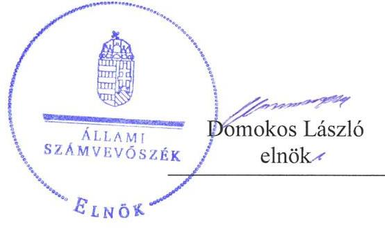
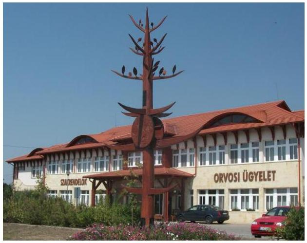

# Jelentés 

## Az önkormányzatok gazdasági társaságai

Az önkormányzatok többségi tulajdonában lévő gazdasági társaságok gazdálkodásának ellenőrzése - Bodrogközi Járóbeteg Szakrendelő Nonprofit Kft.
2018.

---

# Jelentés 

## Az önkormányzatok gazdasági társaságai

Az önkormányzatok többségi tulajdonában lévő gazdasági társaságok gazdálkodásának ellenőrzése - Bodrogközi Járóbeteg Szakrendelő Nonprofit Kft.
2018. O\& hó O\& nap

---

# AZ ELLENŐRZÉST FELÜGYELTE: 

PETŐ KRISZTINA felügyeleti vezető

## AZ ELLENŐRZÉST VEZETTE ÉS A VÉGREHAJTÁSÁÉRT FELELŐS:

SALAMIN VIKTOR ellenőrzésvezető

## A PROGRAM ÖSSZEÁLLÍTÁSÁÉRT FELELŐS:

TÓTPÁL SZABOLCS osztályvezető

IKTATÓSZÁM: EL-0139-061/2018.
TÉMASZÁM: 2447

## ELLENŐRZÉS-AZONOSÍTÓ SZÁM: V079329

Jelentéseink az Országgyúlés számítógépes hálózatán és az Interneten a www.asz.hu címen is olvashatóak.

---

# TARTALOMJEGYZÉK 

■ ÖSSZEGZÉS ..... 5
■ AZ ELLENŐRZÉS CÉLJA ..... 6
■ AZ ELLENŐRZÉS TERÜLETE ..... 7
■ AZ ELLENŐRZÉS HÁTTERE, INDOKOLTSÁGA ..... 8
■ A JELENTÉS LÉNYEGES KÉRDÉSKÖREI ..... 9
■ AZ ELLENŐRZÉS HATÓKÖRE ÉS MÓDSZEREI ..... 10
■ MEGÁLLAPÍTÁSOK ..... 12
■ JAVASLATOK ..... 16
■ MELLÉKLETEK ..... 19
I. sz. melléklet: Értelmező szótár ..... 19
■ FÜGGELÉK: ÉSZREVÉTELEK ..... 21
■ RÖVIDÍTÉSEK JEGYZÉKE ..... 23

---

.

---

# ÖSSZEGZÉS 

Cigánd Város Önkormányzata tulajdonosi joggyakorlása nem volt szabályszerű. A Bodrogközi Járóbeteg Szakrendelő Nonprofit Kft. gazdálkodása, vagyongazdálkodása nem volt szabályszerű, így nem biztosították az elszámoltathatóságot. A Társaság közzétételi kötelezettségének nem tett eleget, ezért működése nem volt átlátható.

## Az ellenőrzés társadalmi indokoltsága

Magyarországon az intézmény-centrikus közfeladat-ellátás jellemző, de egyre jelentősebb a költségvetésen kívüli feladatellátás térnyerése. Helyi szinten ennek legfontosabb szereplői az önkormányzati tulajdonban lévő gazdasági társaságok, amelyeknek ellenőrzése kiemelten fontos a közfeladat ellátása és a közvagyon megőrzése, megóvása érdekében. Ezért alapvető követelmény, hogy gazdálkodásuk, működésük szabályszerű és átlátható legyen.

Az Állami Számvevőszék az ellenőrzése során arra kereste a választ, hogy 2013-2016. között szabályszerű volt-e a Társaság gazdálkodása és az Önkormányzat ehhez kapcsolódó tulajdonosi joggyakorlása. Az ellenőrzés rendet, a rend értéket teremt. Ezért bízunk abban, hogy a jelentésben foglalt megállapítások és az ezek alapján megfogalmazott számvevőszéki javaslatok hasznosítása elősegíti a feltárt hiányosságok orvoslását.

## Főbb megállapítások, következtetések, javaslatok

Cigánd Város Önkormányzata tulajdonosi joggyakorlása nem volt szabályszerű.
A Bodrogközi Járóbeteg Szakrendelő Nonprofit Kft. gazdálkodása, vagyongazdálkodása nem volt szabályszerű, mert az éves beszámolók mérlegtételeit leltár nem támasztotta alá. A Társaságnál a bevételek és ráfordítások elszámolása nem volt szabályszerű. Mindezek alapján a gazdálkodás, vagyongazdálkodás elszámoltathatóságát nem biztosították.

A Társaság a jogszabályban előírt közérdekű adatok és közérdekből nyilvános adatok megismerését nem biztosította, ezért működése nem volt átlátható.

A megállapítások alapján az ÁSZ Cigánd Város Önkormányzata polgármesterének négy javaslatot, a Bodrogközi Járóbeteg Szakrendelő Nonprofit Kft. ügyvezetőjének 11 javaslatot fogalmazott meg, amelyre 30 napon belül intézkedési tervet kell készíteni.

---

# AZ ELLENŐRZÉS CÉLJA 

AZ ELLENŐRZÉS CÉLJA annak értékelése volt, hogy az Önkormányzat ${ }^{1}$ vagyongazdálkodási tevékenysége során szabályszerűen gyakorolta-e tulajdonosi jogait; a Társaság ${ }^{2}$ szabályozottsága, gazdálkodása és vagyongazdálkodási tevékenysége, bevételeinek és ráfordításainak elszámolása megfelelt-e a jogszabályi és tulajdonosi előírásoknak; a Társaság kötelezettségállománya jelent-e kockázatot a működésre, valamint a gazdálkodás átláthatósága és elszámoltathatósága érdekében biztosított volt-e a szolgáltatás díjának megalapozottsága szabályszerű önköltségszámítással. Az ellenőrzés célja továbbá annak megítélése, hogy a kormányzati szektorba sorolt önkormányzati tulajdonban (résztulajdonban) lévő gazdálkodó szervezetek gazdálkodásának a kormányzati szektor hiányára és az államadósságra befolyással bíró elemei a jogszabályi előírásoknak megfeleltek-e.

---

# **AZ ELLENŐRZÉS TERÜLETE**

## **Cigánd Város Önkormányzata és a többségi tulajdonában lévő Bodrogközi Járóbeteg Szakrendelő Nonprofit Kft.**

**CIGÁND VÁROS ÖNKORMÁNYZATA** és tizenöt község önkormányzatából álló tulajdonosi közösség 2008. szeptember 10-én alapította meg a Bodrogközi Járóbeteg Szakrendelő Nonprofit Kft.-t 53,0 M Ft összegű törzstőkével a területi ellátási kötelezettsége alá eső település lakosainak általános-, valamint szakorvosi járóbeteg-ellátása biztosítása érdekében. Az Önkormányzat az ellenőrzött időszakban két gazdasági társaságban rendelkezett többségi tulajdonnal, illetve a Cigánd Településüzemeltetési Kft.-nek kizárólagos tulajdonosa volt. A Társaság az ellenőrzött időszakban nem közhasznú jogállású nonprofit gazdasági társaság volt. A Társaság az Mötv.3 13. § (1) bekezdés 4. pontja szerint az *"egészségügyi alapellátás, az egészséges életmód segítését célzó szolgáltatások"* közfeladatot látta el. 2013-2016. években a jegyző személye egy alkalommal változott. A polgármester a 2010. évi önkormányzati választások óta töltötte be tisztségét.

### **A BODROGKÖZI JÁRÓBETEG SZAKRENDELŐ NONPROFIT KFT.**

által ellátott feladatok biztosítása érdekében az Önkormányzat 39,4 M Ft összegű tulajdonában álló ingatlant apport címén a Társaság rendelkezésére bocsátott. A Társaság saját vagyonával gazdálkodott, használatában, kezelésében vagyon nem volt, kapcsolt vállalkozásban lévő részesedéssel nem rendelkezett. A Társaság az önköltség rendjére vonatkozó szabályzat készítésének kötelezettsége alól a Számv. tv.4 előírásai alapján mentesült. 2015. december 30-tól kormányzati szektorba sorolt egyéb szervezetnek minősül.

A Társaság 2013. évben veszteségesen működött, a veszteség rendezése érdekében 2014. június 26-án a Taggyűlés5 az 53,0 M Ft összegű törzstőke 3,0 M Ft összegre történő leszállításáról döntött. A tulajdonosi szerkezet a törzstőke leszállítását követően nem változott, az Önkormányzat a Társaságban 99,2%-os részesedéssel rendelkezett.

---

# AZ ELLENŐRZÉS HÁTTERE, INDOKOLTSÁGA 

AZ ÖNKORMÁNYZATOK TÖBBSÉGI TULAJDONÁBAN ÁLLÓ GAZDASÁGI TÁRSASÁGOK ellenőrzése kiemelten fontos a vagyon megőrzése, megóvása érdekében, valamint a kormányzati szektor elszámolásaiban megjelenő önkormányzati tulajdonú gazdálkodó szervezetek esetében, amelyekkel szemben alapvető követelmény, hogy gazdálkodásuk, működésük szabályszerű, az általuk szolgáltatott adatok minél megbízhatóbbak legyenek. A feladatellátás költségeinek, ráfordításainak alakulása a lakosság széles rétegét érinti.

Ellenőrzéseink feltárhatják, hogy az önkormányzat a feladatellátásához rendelt vagyon működtetését a tulajdonostól elvárható gondossággal végezte-e, a feladatot ellátó gazdasági társaság a létesítő okiratban, szolgáltatási szerződésben foglaltak betartásával biztosította-e a feladat ellátását. Az ellenőrzés eredményeképp meghatározhatóvá válnak a költségvetési hiányt befolyásoló szervezetek kockázatai, lehetővé válik ezen kockázatok csökkentése. Az ellenőrzés rávilágíthat arra, hogy a gazdasági társaság a vagyon használatával biztosította-e a szolgáltatás folytatásának feltételeit, az önkormányzat tulajdonosi felügyelete hozzájárult-e a szabályszerű gazdálkodáshoz és feladatellátáshoz. A megállapítások alapján megfogalmazott számvevőszéki javaslatok hasznosítása elősegítheti a meglévő hibák megszüntetését. A jó gyakorlatok bemutatásával az ÁSZ ${ }^{6}$ hozzájárulhat a követendő megoldások megismertetéséhez, terjesztéséhez.

---

# A JELENTÉS LÉNYEGES KÉRDÉSKÖREI 

1. Az Önkormányzat tulajdonosi joggyakorlása szabályszerű volt-e?
2. A gazdasági társaság szabályozottsága, gazdálkodási, vagyongazdálkodási tevékenysége szabályszerű volt-e?
3. A gazdasági társaság adatszolgáltatási és közzétételi kötelezettségét teljesítette-e?

---

# AZ ELLENŐRZÉS HATÓKÖRE ÉS MÓDSZEREI 

## Az ellenőrzés típusa

Megfelelőségi ellenőrzés.

## Az ellenőrzött időszak

Az ellenőrzött időszak 2013. január 1-jétől 2016. december 31-ig tartott.

## Az ellenőrzés tárgya

Cigánd Város Önkormányzata többségi tulajdonában lévő Bodrogközi Járóbeteg Szakrendelő Nonprofit Kft. feletti tulajdonosi joggyakorlása, valamint a Bodrogközi Járóbeteg Szakrendelő Nonprofit Kft. gazdálkodásának szabályozottsága és szabályszerűsége.

Az ellenőrzés kiterjedt minden olyan körülményre és adatra, amely az ÁSZ jogszabályban meghatározott feladatainak teljesítéséhez, valamint a program végrehajtása folyamán felmerült újabb összefüggések feltárásához szükséges.

## Az ellenőrzött szervezet

Cigánd Város Önkormányzata, valamint a Bodrogközi Járóbeteg Szakrendelő Nonprofit Kft.

## Az ellenőrzés jogalapja

Az ellenőrzés jogszabályi alapját az ÁSZ tv. ${ }^{7}$ 1. § (3) bekezdése és 5. § (3)(5) bekezdései képezték.

## Az ellenőrzés módszerei

Az ellenőrzést az ellenőrzési program ellenőrzési kérdései, az ellenőrzött időszakban hatályos jogszabályok, az ellenőrzés szakmai szabályok és módszertanok figyelembe vételével végeztük.

Az ellenőrzés ideje alatt az ellenőrzött szervezettel történő kapcsolattartást az ÁSZ Szervezeti és Működési Szabályzatának vonatkozó előírásai alapján biztosítottuk.

Az ellenőrzési kérdések megválaszolásához szükséges bizonyítékok megszerzése a következő ellenőrzési eljárások alkalmazásával történt:

---

megfigyelés, kérdésfeltevés (információkérés), összehasonlítás, valamint elemző eljárás. Az ellenőrzési bizonyítékként felhasználható adatforrások közé tartoztak egyrészt az ellenőrzési programban felsorolt adatforrások, másrészt adatforrás lehet még minden - az ellenőrzés folyamán - feltárt, az ellenőrzés szempontjából információkat tartalmazó dokumentum.

Az ellenőrzést a kérdésekre adott válaszok kiértékelésével, valamint a megjelölt adatforrások, a csatolt tanúsítványok felhasználásával, továbbá az adott időszakban hatályos jogszabályok figyelembe vételével folytattuk le.

A bevételek és ráfordítások elszámolásait, valamint a vagyonnyilvántartás terén a szabályszerű működést mintavétellel ellenőriztük. A minták kiválasztása rétegzett mintavétel alkalmazásával történt. A mintavétellel ellenőrzött területek esetében minden egyes tétel vonatkozásában a szabályszerűségre vonatkozó kérdéseket tettünk fel. Szabályszerűnek értékeltünk egy ellenőrzött területet, amennyiben 95\%-os bizonyossággal a teljes sokaságban a hibaarány legfeljebb 10\%, nem megfelelőnek, amennyiben 10\%-nál magasabb arányt képviselt. Abban az esetben, ha a teljes sokaság tekintetében a 10\%-os hibaarányhoz való viszony megítélésének megbízhatósága nem érte el a 95\%-ot, annak elérése érdekében értékelésünket további szempontokkal egészítettük ki, és figyelembe vettük a feltárt hibák típusát és súlyát. A ráfordítások elszámolására és a vagyonnyilvántartásra vonatkozó véletlen mintavételt kockázati alapú kiválasztással egészítettük ki, amelynek során évente a három legnagyobb összegű tételt választottuk ki.

---

# 1. Az Önkormányzat tulajdonosi joggyakorlása szabályszerű volt-e? 

Összegző megállapítás A tulajdonosi jogok gyakorlása nem volt szabályszerű.

A TULAJDONOSI JOGOK GYAKORLÁSÁNAK KERETEIT az önkormányzati vagyon vonatkozásában az Önkormányzat Vagyongazdálkodási rendeletben ${ }^{8}$ szabályozta.

Az Önkormányzat az Mötv. 116. § (1) bekezdésében és az SZMSZ ${ }^{9}$ 8. § (2) bekezdésében foglaltakkal ellentétben a 2013. évre vonatkozóan nem, a 2014. évtől rendelkezett Gazdasági programmal ${ }^{10}$. Az Önkormányzat az Nvtv. ${ }^{11}$ 9. § (1) bekezdésében előírtakkal ellentétben közép- és hosszú távú vagyongazdálkodási tervvel nem rendelkezett.

A Taggyűlés a Taktv. ${ }^{12}$ 4. § (1) bekezdésében előírt kötelezettségének nem tett eleget, FB13-t nem hozott létre, ezáltal a Taggyűlés a 2013-2015. évi beszámolók elfogadásáról a Társasági szerződés ${ }^{14}$ 2-4. X. fejezete 1. címe 38. b), f) pontjában foglaltak ellenére az FB írásbeli jelentése hiányában döntött.

A Taggyűlés a Taktv. 5. § (3) bekezdésében foglaltak ellenére nem alkotott szabályzatot a vezető tisztségviselők, felügyelőbizottsági tagok, valamint az Mt. 208. §-ának hatálya alá eső munkavállalók javadalmazása, valamint a jogviszony megszűnése esetére biztosított juttatások módjának, mértékének elveiről, annak rendszeréről.

## 2. A gazdasági társaság szabályozottsága, gazdálkodási, vagyongazdálkodási tevékenysége szabályszerű volt-e?

## Összegző megállapítás

2.1. számú megállapítás

A Társaság gazdálkodása, vagyongazdálkodása nem volt szabályszerű.

A gazdálkodás alapvető szabályozási feltételeinek kialakítása nem felelt meg a jogszabályok előírásainak.

A Társaság az ellenőrzött időszakban rendelkezett Számviteli politikával ${ }^{15}$, Számlarenddel ${ }^{16}$, Bizonylati szabályzattal ${ }^{17}$, Értékelési szabályzattal ${ }^{18}$, Leltározási szabályzattal ${ }^{19}$, Selejtezési szabályzattal ${ }^{20}$, Pénzkezelési szabályzattal ${ }^{21}$ és Közérdekű adatok szabályzatával ${ }^{22}$.

A SZÁMVITELI POLITIKA1-4 nem felelt meg a Számv. tv. 52. § (2) bekezdésében foglaltaknak, mert a maradványérték meghatározásakor nem vették figyelembe az egyedi értékelés elvét. A Társaság a Számv. tv. 14. § (11) bekezdésének előírása ellenére 90 napon belül nem vezette át a Számv. tv. 14. § (4) bekezdésének 2015. július 4-ei módosítását, abban nem

---

szerepeltette, hogy mit tekint kivételes nagyságú vagy előfordulású bevételnek, költségnek, ráfordításnak.

A Pénzkezelési szabályzat ${ }_{1-4}$ a Számv. tv. 14. § (8) bekezdésében előírtak ellenére nem tartalmazta a pénzkezelés személyi és tárgyi feltételeit, a felelősségi szabályokat, valamint a napi készpénz záró állomány maximális mértékét.

SZERVEZETI ÉS MŰKÖDÉSI SZABÁLYZATTAL a Társaság a gyógyintézetek működési rendjéről, illetve szakmai vezető testületéről szóló 43/2003. (VII. 29.) ESZCSM rendelet 3. § (3) bekezdés a) pontjában foglaltak ellenére nem rendelkezett.

ADATVÉDELMI szabályzattal a Társaság a 1997. évi XLVII. ${ }^{23}$ törvény 32. § (2)
 bekezdés h) pontjában foglaltak ellenére nem rendelkezett.

A Társaság fenntartó által jóváhagyott térítési díj szabályzattal ${ }^{24}$ az Eütv. ${ }^{25}$ 1. § (6) bekezdésében előírtak ellenére nem rendelkezett.

A Társaság megsértette a Bkr. ${ }^{26}$ 10. §-ban foglaltakat, mivel 2016. január 1. és 2016. szeptember 30. közötti időszakban a szervezet tevékenységének, a célok megvalósításának nyomon követését biztosító rendszer keretében belső ellenőrzést nem alakított ki.

# 2.2. számú megállapítás 

A 2013-2016. évi beszámolók megalapozottsága nem volt biztosított.

A mérleget alátámasztó leltár a 2013-2016. években nem felelt meg a Számv. tv. 69. § (1) bekezdésében előírtaknak, a mérleg leltárral történő alátámasztása nem volt biztosított. A Társaság a 2013-2016. években a Számv. tv. 69. § (3) bekezdésében előírtakkal ellentétben legalább háromévente mennyiségi felvételezéssel történt leltárkészítési kötelezettségének nem tett eleget.

A mérlegtételeket alátámasztó leltár dokumentációk nem feleltek meg a Társaság Leltározási szabályzatának 3.1. pontjában előírt alaki követelményeknek, mert nem tartalmazták a bizonylat sorszámát, a bizonylatot kiállító szervezeti egység megjelölését, a leltározók, leltárellenőrök aláírását. A Társaság a Leltározási szabályzat 7. pontjában előírtak ellenére a leltár kiértékelését és záró jegyzőkönyv elkészítését nem végezte el.
2013. évben a Társaság saját tőkéje a jegyzett tőke fele alá csökkent. A Taggyűlés az 5/2014. (06.26.) taggyűlési határozattal döntött a Társaság jegyzett tőkéjének leszállításáról, amelynek következtében a Társaság jegyzett tőkéje 53,0 M Ft-ról a törvényi minimumra, 3,0 M Ft-ra csökkent. A tőkeleszállítást a cégbíróság 2015. január 12-ei határidővel bejegyezte.

A Társaság a 2015. évi éves egyszerűsített beszámolójában, valamint a 2015. december 31-jei fordulónappal elkészített leltárában a jegyzett tőke összegét 53,0 M Ft-tal szerepeltette, ezáltal a 2015. évi beszámolója a Számv. tv. 4. § (2) bekezdésében és 18. §-ban foglaltaktól eltérően nem mutatott megbízható és valós képet.
2015. évben a Taggyűlés a beszámolót annak ellenére fogadta el, hogy a Társaság a Számv. tv. 88. § (7) bekezdésében meghatározottaktól eltérően a kiegészítő mellékletben nem mutatta be az adózott eredmény felhasználására vonatkozó javaslatot. A 2016. évi beszámoló elfogadásáról a

---

Ptk. ${ }^{27}$ 3:109. § (2) bekezdésében, továbbá a Társasági szerződés ${ }_{3,4}$ X. fejezete 1. címe 38. b) pontjában és a Társasági szerződés 39. b) pontjában előírtak ellenére a Taggyűlés helyett az ügyvezető döntött.

# 2.3. számú megállapítás 

A Társaság bevételeinek és ráfordításainak elszámolása nem volt szabályszerű.

Az értékesítés nettó árbevételének elszámolása - sem a kormányzati szektor hiányára befolyással bíró elemei, sem az egyéb elemei tekintetében - nem volt szabályszerű, mivel a Számv. tv. 169. § (2) bekezdésében előírt bizonylat megőrzési kötelezettségnek nem tettek eleget. A Társasági szerződés 38. z. és 58. j. pontjában foglaltakkal ellentétben a 100 E Ft bruttó értékű ügyletek megkötésére taggyúlési határozat hiányában került sor.

Az anyagjellegű ráfordítások elszámolása - sem a kormányzati szektor hiányára befolyással bíró elemei, sem az egyéb elemei tekintetében - nem volt szabályszerű, mivel a Számv. tv. 169. § (2) bekezdésében előírt bizonylat megőrzési kötelezettségnek nem tettek eleget. A könyvviteli elszámolást közvetlenül alátámasztó bizonylatról hiányzott az érintett könyvviteli számlákra történő hivatkozás, ezzel a Társaság megsértette a Számv. tv. 167. § (1) bekezdés h) pontjában foglaltakat. A Társasági szerződés 38. z. és 58. j. pontjában foglaltakkal ellentétben a 100 E Ft bruttó értékű ügyletek megkötésére taggyúlési határozat hiányában került sor.

A személyi jellegű ráfordítások elszámolása nem volt szabályszerű, mivel a Számv. tv. 169. § (2) bekezdésében előírt bizonylat megőrzési kötelezettségnek nem tettek, továbbá a Számv. tv. 167. § (1) bekezdés h) pontjában foglaltakkal ellentétben a könyvviteli elszámolást közvetlenül alátámasztó bizonylatról hiányzott az érintett könyvviteli számlákra történő hivatkozás.

A tárgyi eszközök nyilvántartásba vétele és az értékcsökkenés összegének elszámolása nem volt szabályszerű. A Számv. tv. 52. § (2) bekezdésében előírtakkal ellentétben a tárgyi eszközök nyilvántartásba vétele során az üzembe helyezést hitelt érdemlően nem dokumentálták, ezért az értékcsökkenés számításának kezdő időpontja nem volt megállapítható, a bekerülési érték nem volt alátámasztott.

## 3. A gazdasági társaság adatszolgáltatási és közzétételi kötelezettségét teljesítette-e?

Összegző megállapítás A Társaság közzétételi kötelezettségének nem tett eleget.
A közérdekű adatok és a közérdekből nyilvános adatok megismerésének lehetőségét - erre irányuló igény alapján - a Társaság az Info tv. ${ }^{28}$ 26. § (1) bekezdésében előírtak ellenére nem biztosította, honlapján nem tette közzé az Info tv. 37. § (1) bekezdés előírása alapján az Info tv. 1. mellékletében meghatározott adatokat. A Társaságnak az

---

Info tv. 30. § (6) bekezdése alapján a közérdekű adatok megismerésére irányuló igények teljesítésének rendjét rögzítő szabályzatkészítési kötelezettsége volt, melynek nem tett eleget.

A Társaság 2015. december 30-át követően nem teljesítette az Áht. ${ }^{29}$ 107. § (1) bekezdésében és az Ávr. ${ }^{30}$ 167/M. § (1) bekezdésében előírt, az Ávr. 7. melléklet 28-29. pontja, valamint a 2015. január 1-jétől hatályos rendelet 5. melléklet 23. pontja szerinti adatszolgáltatási kötelezettségét, annak ellenére, hogy kormányzati szektorba sorolt társaság volt.

---

# JAVASLATOK 

Az ÁSZ tv. 33. § (1) bekezdésében foglaltak értelmében az ellenőrzött szervezet vezetője köteles a jelentésben foglalt megállapításokhoz kapcsolódó intézkedési tervet összeállítani és azt a jelentés kézhezvételétől számított 30 napon belül az ÁSZ részére megküldeni. Amennyiben az ellenőrzött szervezet vezetője nem küldi meg határidőben az intézkedési tervet, vagy továbbra sem elfogadható intézkedési tervet küld, az Állami Számvevőszék elnöke az ÁSZ tv. 33. § (3) bekezdés a) és b) pontjaiban foglaltakat érvényesítheti.

## Cigánd Város Önkormányzata polgármesterének

1. Intézkedjen az Önkormányzat közép- és hosszú távú vagyongazdálkodási tervének elkészítéséről és jóváhagyás céljából a Képviselő-testület elé terjesztéséről a jogszabályi előírásnak megfelelően.
(1. összegző megállapítás 2. bekezdésének második mondata alapján)
2. Kezdeményezze a Taggyűlésnél felügyelőbizottság létrehozását.
(1. összegző megállapítás 3. bekezdésének 1. mondata alapján)
3. Kezdeményezze a Taggyűlésnél a jogszabályban előírt, a vezető tisztségviselők, felügyelőbizottsági tagok, valamint az Mt. 208. §-ának hatálya alá eső munkavállalók javadalmazása, valamint a jogviszony megszünése esetére biztosított juttatások módjának, mértékének elveiről, annak rendszeréről szóló szabályzat megalkotását, különös tekintettel a Taktv.-ben előírtakra.
(1. összegző megállapítás 4. bekezdése alapján)
4. Kezdeményezze a Taggyűlésnél a Társaság Számv. tv. szerinti beszámolójának jóváhagyását.
(2.2. számú megállapítás 5. bekezdésének 2. mondata alapján)

---

# Bodrogközi Járóbeteg Szakrendelő Nonprofit Korlátolt Felelősségű Társaság ügyvezetőjének 

1. Intézkedjen a Társaság számviteli politikájának, pénzkezelési szabályzatának jogszabályi előírásoknak megfelelő kiegészítéséről
(2.1. számú megállapítás 2-3. bekezdései alapján)
2. Intézkedjen a Társaság szervezeti és működési szabályzatának jogszabályi előírásoknak megfelelő elkészítéséről.
(2.1. számú megállapítás 4. bekezdése alapján)
3. Intézkedjen a Társaság adatvédelmi szabályzatának, a közérdekű adatok megismerésére irányuló igények teljesítésének rendjét rögzítő szabályzatának jogszabályi előírásoknak megfelelő elkészítéséről.
(2.1. számú megállapítás 5. bekezdése, 3. összegző megállapítás 2. bekezdésének 2. mondata alapján)
4. Gondoskodjon a Társaság hatáskörében megállapítható térítési díjak megállapításának, nyilvánosságra hozatalának és befizetésének rendjét, valamint a szolgáltató által megállapított térítési díj mérséklésére, illetve elengedésére vonatkozó rendelkezéseket tartalmazó szabályzatának elkészítéséről és jóváhagyásáról.
(2.1. számú megállapítás 7. bekezdése alapján)
5. Intézkedjen a jogszabályi előírásoknak megfelelően a beszámoló elkészítéséhez a mérleg tételeinek leltárral való alátámasztásáról, a mennyiségi felvétellel történő leltározás elvégzéséről a jogszabályban és a belső szabályzatban előírtaknak megfelelően.
(2.2. számú megállapítás 1-2. bekezdései alapján)
6. Intézkedjen a könyvviteli elszámolást közvetlenül alátámasztó számviteli bizonylatok jogszabályban előírt, visszakereshető módon történő megőrzéséről.
(2.3. számú megállapítás 1. bekezdésének 1. mondata, 2.3. számú megállapítás 2. bekezdésének 1. mondata és 2.3. számú megállapítás 3. bekezdése 1. mondatának 1. tagmondata alapján)

---

7. Intézkedjen, hogy a 100 E Ft bruttó értékű jogügyleteket a Társasági szerződés előírásának megfelelően kössék meg.
(2.3. számú megállapítás 1. bekezdésének 2. mondata és 2.3. számú megállapítás 2. bekezdésének 3. mondata alapján)
8. Intézkedjen az anyagjellegű és személyi jellegű ráfordítások elszámolásával kapcsolatos gazdasági események jogszabályi előírásoknak megfelelő bizonylatokkal történő alátámasztásáról.
(2.3. számú megállapítás 2. bekezdésének
9. mondata és 2.3. számú megállapítás 3. bekezdése 2. tagmondata alapján)
10. Intézkedjen az üzembe helyezés hitelt érdemlő módon történő dokumentálásáról.
(2.3. számú megállapítás 4. bekezdésének 2. mondata alapján)
11. Intézkedjen a jogszabályi előírásoknak megfelelően az Info tv. 1. melléklete szerinti általános közzétételi listában meghatározott, a Társaság tekintetében releváns valamennyi adat közzététele iránt.
(3. összegző megállapítás 2. bekezdésének
12. mondata alapján)
12. Intézkedjen a jogszabályi előírásoknak megfelelően a Társaság adatszolgáltatási kötelezettségének teljesítéséről.
(3. összegző megállapítás 3. bekezdése alapján)

---

# MELLÉKLETEK 

- I. SZ. MELLÉKLET: ÉRTELMEZŐ SZÓTÁR
gazdasági társaság
gazdálkodó szervezet
kezesség
nonprofit gazdasági társaság
vagyonkezelő

Ptk 3:88. § (1) bekezdése szerint „a gazdasági társaságok üzletszerű közös gazdasági tevékenység folytatására, a tagok vagyoni hozzájárulásával létrehozott, jogi személyiséggel rendelkező vállalkozások, amelyekben a tagok a nyereségből közösen részesednek, és a veszteséget közösen viselik".
A Ptk. 685. § c) pontja szerint gazdálkodó szervezet: „az állami vállalat, az egyéb állami gazdálkodó szerv, a szövetkezet, a lakásszövetkezet, az európai szövetkezet, a gazdasági társaság, az európai részvénytársaság, az egyesülés, az európai gazdasági egyesülés, az európai területi együttműködési csoportosulás, az egyes jogi személyek vállalata, a leányvállalat, a vízgazdálkodási társulat, az erdő birtokossági társulat, a végrehajtói iroda, az egyéni cég, továbbá az egyéni vállalkozó." (2014. 03. 15-ig hatályos)
A kezességre vonatkozó előírásokat a Ptk. 6:416-430. §-ai tartalmazzák. Kezességi szerződéssel a kezes kötelezettséget vállal a jogosulttal szemben, hogyha a kötelezett nem teljesít, maga fog helyette a jogosultnak teljesíteni. Kezesség egy vagy több, fennálló vagy jövőbeli, feltétlen vagy feltételes, meghatározott vagy meghatározható összegű pénzkövetelés vagy pénzben kifejezhető értékkel rendelkező egyéb kötelezettség biztosítására vállalható.
Civil tv. ${ }^{31}$ 9/F. § (2) bekezdése szerint „az a gazdasági társaság minősül nonprofit gazdasági társaságnak és cégnevében az a gazdasági társaság tüntetheti fel a nonprofit jelleget, amelynek létesítő okirata tartalmazza, hogy a gazdasági társaság tevékenységéből származó nyereség a tagok között nem osztható fel, hanem az a gazdasági társaság vagyonát gyarapítja." (hatályos 2014. március 15-től)
vagyonkezelő:
a) az állam tulajdonában álló nemzeti vagyon tekintetében:
aa) költségvetési szerv,
ab) helyi önkormányzat, önkormányzati társulás,
ac) önkormányzati intézmény,
ad) köztestület,
ae) az állam, az aa)-ac) alpontban meghatározott személyek együtt vagy külön-külön 100%-os tulajdonában álló gazdálkodó szervezet,
af) az ae) alpont szerinti gazdálkodó szervezet 100%-os tulajdonában álló gazdálkodó szervezet,
ag) a törvény által kijelölt egyedileg meghatározott jogi személy.
b) a helyi önkormányzat tulajdonában álló nemzeti vagyon tekintetében:
ba) önkormányzati társulás,
bb) költségvetési szerv vagy önkormányzati intézmény,
bc) köztestület,
bd) az állam, a helyi önkormányzat, a ba)-bb) alpontban meghatározott személyek együtt vagy külön-külön 100%-os tulajdonában álló gazdálkodó szervezet,
be) a bd) alpont szerinti gazdálkodó szervezet 100%-os tulajdonában álló gazdálkodó szervezet.
c) az egyházi jogi személy a tevékenysége ellátásához szükséges nemzeti vagyon tekintetében. (Forrás: Nvtv. 3. § (1) bekezdés 19. pontja)

---

.

---

# FÜGGELÉK: ÉSZREVÉTELEK 

A jelentéstervezetet a Számvevőszék 15 napos észrevételezésre megküldte az ellenőrzött szervezetek vezetőinek az ÁSZ tv. 29. § (1) bekezdése előírásának megfelelően.

Cigánd Város Önkormányzatának polgármestere és a Bodrogközi Járóbeteg Szakrendelő Nonprofit Kft. ügyvezetője nem élt észrevételezési jogával.

[^0]
[^0]: * 29.
 § (1) Az Állami Számvevőszék az ellenőrzési megállapításait megküldi az ellenőrzött szervezet vezetőjének vagy az általa megbízott személynek, és annak, akinek személyes felelősségét állapította meg.
    (2) Az ellenőrzött szervezet vezetője és a felelősként megjelölt személy az ellenőrzés megállapításaira tizenöt napon belül írásban észrevételt tehet.
    (3) Az Állami Számvevőszék az észrevételre a beérkezésétől számított harminc napon belül írásban válaszol. A figyelembe nem vett észrevételeket köteles a jelentésben feltüntetni, és megindokolni, hogy azokat miért nem fogadta el.

---

.

---

# RÖVIDÍTÉSEK JEGYZÉKE 

${ }^{1}$ Önkormányzat
${ }^{2}$ Társaság
${ }^{3}$ Mőtv.
${ }^{4}$ Számv. tv.
${ }^{5}$ Taggyűlés
${ }^{6}$ ÁSZ
${ }^{7}$ ÁSZ tv.
${ }^{8}$ Vagyongazdálkodási rendelet
${ }^{9}$ SZMSZ
${ }^{10}$ Gazdasági program
${ }^{11}$ Nvtv.
${ }^{12}$ Taktv.
${ }^{13} \mathrm{FB}$
${ }^{14}$ Társasági szerződés:

Társasági szerződés:
Társasági szerződés:
Társasági szerződés ${ }_{4}$
${ }^{15}$ Számviteli Politika:
Számviteli Politika:
Számviteli Politika:
Számviteli Politika ${ }^{4}$
${ }^{16}$ Számlarend:
Számlarend:
Számlarend ${ }_{4}$

Cigánd Város Önkormányzata
Bodrogközi Járóbeteg Szakrendelő Nonprofit Korlátolt Felelősségű Társaság 2011. évi CLXXXIX. törvény Magyarország helyi önkormányzatairól (Hatályos: 2012. január 1-jétől)
2000. évi C. törvény a számvitelről (Hatályos 2001. január 1-jétől)
a Bodrogközi Járóbeteg Szakrendelő Nonprofit Korlátolt Felelősségű Társaság legfőbb szerve
Állami Számvevőszék
2011. évi LXVI. törvény az Állami Számvevőszékről (Hatályos: 2011. július 1-jétől)

Cigánd Város Önkormányzata Képviselő-testületének 13/2012. önkormányzati rendelete a vagyongazdálkodásról
Cigánd Város Önkormányzata Képviselő-testületének 14/2011. (VI.16.) önkormányzati rendelete a Szervezeti és Működési Szabályzatról
Cigánd Város Önkormányzatának gazdasági programja a 2014-2018. évekre vonatkozóan
2011. évi CXCVI. törvény a nemzeti vagyonról szóló (Hatályos: 2011. december 31-étől)
2009. évi CXXII. törvény a köztulajdonban álló gazdasági társaságok takarékosabb működéséről (Hatályos 2009. december 4-étől)
Felügyelő Bizottság
a Bodrogközi Járóbeteg Szakrendelő Nonprofit Korlátolt Felelősségű Társaság Társasági szerződése (Hatályos 2008. október 1-jétől)
a Bodrogközi Járóbeteg Szakrendelő Nonprofit Korlátolt Felelősségű Társaság Társasági szerződése (Hatályos 2008. október 28-ától)
a Bodrogközi Járóbeteg Szakrendelő Nonprofit Korlátolt Felelősségű Társaság Társasági szerződése (Hatályos 2013. január 25-étől)
a Bodrogközi Járóbeteg Szakrendelő Nonprofit Korlátolt Felelősségű Társaság Társasági szerződése (Hatályos 2014. február 15-étől)
a Bodrogközi Járóbeteg Szakrendelő Nonprofit Korlátolt Felelősségű Társaság Számviteli Politikája (Hatályos: 2013. január 1-jétől)
a Bodrogközi Járóbeteg Szakrendelő Nonprofit Korlátolt Felelősségű Társaság Számviteli Politikája (Hatályos: 2014. január 1-jétől)
a Bodrogközi Járóbeteg Szakrendelő Nonprofit Korlátolt Felelősségű Társaság Számviteli Politikája (Hatályos: 2015. január 1-jétől)
a Bodrogközi Járóbeteg Szakrendelő Nonprofit Korlátolt Felelősségű Társaság Számviteli Politikája (Hatályos: 2016. január 1-jétől)
a Bodrogközi Járóbeteg Szakrendelő Nonprofit Korlátolt Felelősségű Társaság Számlarendje (Hatályos: 2013. január 1-jétől)
a Bodrogközi Járóbeteg Szakrendelő Nonprofit Korlátolt Felelősségű Társaság Számlarendje (Hatályos: 2014. január 1-jétől)
a Bodrogközi Járóbeteg Szakrendelő Nonprofit Korlátolt Felelősségű Társaság Számlarendje (Hatályos: 2015. január 1-jétől)
a Bodrogközi Járóbeteg Szakrendelő Nonprofit Korlátolt Felelősségű Társaság Számlarendje (Hatályos: 2016. január 1-jétől)

---

${ }^{17}$ Bizonylati szabályzat ${ }_{1}$

Bizonylati szabályzat ${ }_{2}$
${ }^{18}$ Értékelési szabályzat ${ }_{1}$

Értékelési szabályzat ${ }_{2}$
${ }^{19}$ Leltározási szabályzat ${ }_{1}$

Leltározási szabályzat ${ }_{2}$
${ }^{20}$ Selejtezési szabályzat ${ }_{1}$

Selejtezési szabályzat ${ }_{2}$
${ }^{21}$ Pénzkezelési szabályzat ${ }_{1}$

Pénzkezelési szabályzat ${ }_{2}$
Pénzkezelési szabályzat ${ }_{3}$
Pénzkezelési szabályzat ${ }_{4}$
${ }^{22}$ Közérdekű adatok szabályzata ${ }_{1}$

Közérdekű adatok szabályzata ${ }_{2}$
${ }^{23}$ 1997. évi XLVII. törvény
${ }^{24}$ térítési díj szabályzat
${ }^{25}$ Eütd.
${ }^{26}$ Bkr.
${ }^{27}$ Ptk.
${ }^{28}$ Info tv.
${ }^{29}$ Áht.
${ }^{30}$ Ávr.
${ }^{31}$ Civil tv.
a Bodrogközi Járóbeteg Szakrendelő Nonprofit Korlátolt Felelősségű Társaság Bizonylati szabályzata (Hatályos: 2012. január 4-étől)
a Bodrogközi Járóbeteg Szakrendelő Nonprofit Korlátolt Felelősségű Társaság Bizonylati szabályzata (Hatályos: 2015. január 1-jétől)
a Bodrogközi Járóbeteg Szakrendelő Nonprofit Korlátolt Felelősségű Társaság Értékelési szabályzata (Hatályos: 2012. január 4-étől)
a Bodrogközi Járóbeteg Szakrendelő Nonprofit Korlátolt Felelősségű Társaság Értékelési szabályzata (Hatályos: 2015. január 1-jétől)
a Bodrogközi Járóbeteg Szakrendelő Nonprofit Korlátolt Felelősségű Társaság Leltározási szabályzata (Hatályos: 2012. január 1-jétől)
a Bodrogközi Járóbeteg Szakrendelő Nonprofit Korlátolt Felelősségű Társaság Selejtezési szabályzata (Hatályos: 2012. január 4-étől)
a Bodrogközi Járóbeteg Szakrendelő Nonprofit Korlátolt Felelősségű Társaság Pénzkezelési szabályzata (Hatályos: 2015. január 1-jétől)
a Bodrogközi Járóbeteg Szakrendelő Nonprofit Korlátolt Felelősségű Társaság Pénzkezelési szabályzata (Hatályos: 2013. január 1-jétől)
a Bodrogközi Járóbeteg Szakrendelő Nonprofit Korlátolt Felelősségű Társaság Pénzkezelési szabályzata (Hatályos: 2014. január 1-jétől)
a Bodrogközi Járóbeteg Szakrendelő Nonprofit Korlátolt Felelősségű Társaság Pénzkezelési szabályzata (Hatályos: 2015. január 1-jétől)
a Bodrogközi Járóbeteg Szakrendelő Nonprofit Korlátolt Felelősségű Társaság Pénzkezelési szabályzata (Hatályos: 2016. január 1-jétől)
a Bodrogközi Járóbeteg Szakrendelő Nonprofit Korlátolt Felelősségű Társaság Közérdekű adatok szabályzata (Hatályos: 2012. január 4-étől)
a Bodrogközi Járóbeteg Szakrendelő Nonprofit Korlátolt Felelősségű Társaság Közérdekű adatok szabályzata (Hatályos: 2015. január 1-jétől)
1997. évi XLVII. törvény az egészségügyi és a hozzájuk kapcsolódó személyes adatok kezeléséről és védelméről (Hatályos: 1998. január 1-jétől)
Az állami és önkormányzati tulajdonban lévő egészségügyi szolgáltató hatáskörében megállapítható térítési díjak megállapításának, nyilvánosságra hozatalának és befizetésének rendjére, valamint a szolgáltató által megállapított térítési díj mérséklésével, illetve elengedésével kapcsolatos rendelkezésekre vonatkozó - fenntartó által jóváhagyott - szabályzat.
284/1997. (XII. 23.) Korm. rendelet a térítési díj ellenében igénybe vehető egyes egészségügyi szolgáltatások térítési díjáról (Hatályos: 1998. január 1-jétől)
370/2011. (XII.31.) Korm. rendelet a költségvetési szervek belső kontrollrendszeréről és belső ellenőrzéséről (Hatályos: 2012. január 1-jétől) 2013. évi V. törvény a Polgári Törvénykönyvről (Hatályos: 2014. március 15-étől) 2011. CXII. törvény az információs önrendelkezési jogról és az információszabadságról (Hatályos: 2011. július 27-étől)
2011. évi CXCV. törvény az államháztartásról (Hatályos: 2011. december 31-étől) 368/2011 (XII.31) Korm. rendelet az államháztartásról szóló törvény végrehajtásáról (Hatályos: 2012. január 1-jétől)
2011. évi CLXXV. törvény az egyesülési jogról, a közhasznú jogállásról, valamint a civil szervezetek működéséről és támogatásáról (Hatályos: 2011. december 22-étől)

---

ÁLLAMI SZÁMVEVŐSZÉK
1052 Budapest, Apáczai Csere János utca 10.
Levélcím: 1364 Budapest 4. Pf. 54
Telefon: +36 14849100 Telefax: +36 14849200
www.asz.hu
