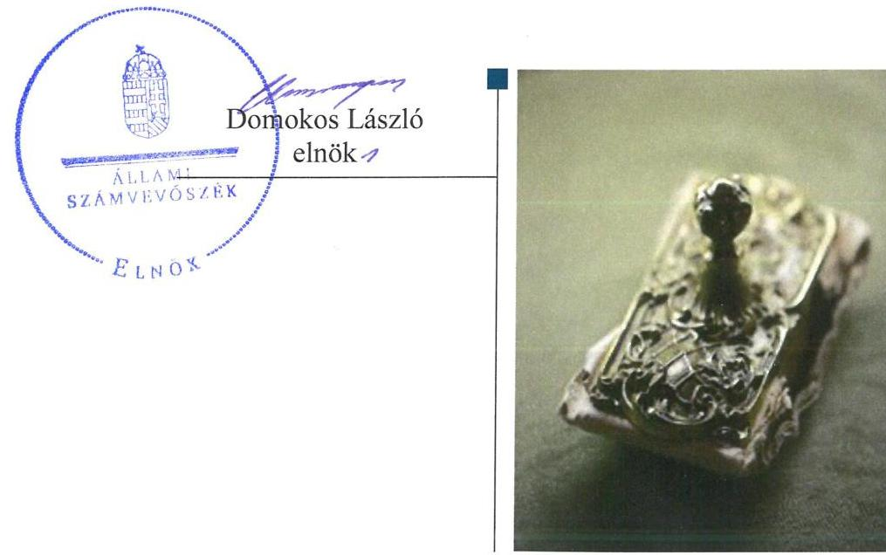
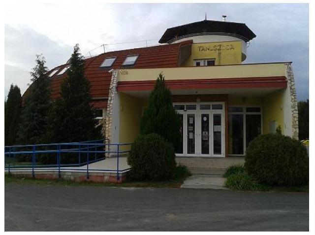

# Jelentés 

## Az önkormányzatok gazdasági társaságai

Az önkormányzatok többségi tulajdonában lévő gazdasági társaságok gazdálkodásának ellenőrzése - Bátonyterenyei
Közművelődési, Városi Könyvtár és Létesítményüzemeltető Nonprofit Kft. 2018.

---

# Jelentés 

## Az önkormányzatok gazdasági társaságai

Az önkormányzatok többségi tulajdonában lévő gazdasági társaságok gazdálkodásának ellenőrzése - Bátonyterenyei
Közművelődési, Városi Könyvtár és Létesítményüzemeltető Nonprofit Kft.
2018. augusztus 8. nap

---

# AZ ELLENŐRZÉST FELÜGYELTE:

DR. NAGY IMRE felügyeleti vezető

# AZ ELLENŐRZÉST VEZETTE ÉS A VÉGREHAJTÁSÁÉRT FELELŐS:

DR. NAGY JUDIT ellenőrzésvezető

# A PROGRAM ÖSSZEÁLLÍTÁSÁÉRT FELELŐS:

TÓTPÁL SZABOLCS osztályvezető

---

**IKTATÓSZÁM:** EL-0142-101/2018

**TÉMASZÁM:** 2067

**ELLENŐRZÉS-AZONOSÍTÓ SZÁM:** V079332

---

Jelentéseink az Országgyűlés számítógépes hálózatán és az Interneten a www.asz.hu címen is olvashatóak.

---

# TARTALOMJEGYZÉK 

■ ÖSSZEGZÉS ..... 5
■ AZ ELLENŐRZÉS CÉLJA ..... 6
■ AZ ELLENŐRZÉS TERÜLETE ..... 7
■ AZ ELLENŐRZÉS HÁTTERE, INDOKOLTSÁGA ..... 9
■ A JELENTÉS LÉNYEGES KÉRDÉSKÖREI ..... 10
■ AZ ELLENŐRZÉS HATÓKÖRE ÉS MÓDSZEREI ..... 11
■ MEGÁLLAPÍTÁSOK ..... 13
■ JAVASLATOK ..... 16
■ MELLÉKLETEK ..... 19
I. sz. melléklet: Értelmező szótár ..... 19
■ FÜGGELÉK: ÉSZREVÉTELEK ..... 21
■ RÖVIDÍTÉSEK JEGYZÉKE ..... 23

---

.

---

# ÖSSZEGZÉS 

Bátonyterenye Város Önkormányzata a tulajdonosi joggyakorlás kereteit szabályszerűen alakította ki, azonban jogait nem gyakorolta szabályszerűen. A Bátonyterenyei Közművelődési, Városi Könyvtár és Létesítményüzemeltető Nonprofit Korlátolt Felelősségű Társaság vagyongazdálkodása nem volt szabályozott és szabályszerű, így nem volt biztosított az elszámoltathatóság és a vagyonnal való felelős gazdálkodás. A társaság nem tett eleget a közérdekű adatokra vonatkozó közzétételi kötelezettségének, ezért nem volt biztosított működésének és gazdálkodásának átláthatósága.

## Az ellenőrzés társadalmi indokoltsága

Magyarországon az intézmény-centrikus közfeladat-ellátás jellemző, de egyre jelentősebb a költségvetésen kívüli feladatellátás térnyerése. Helyi szinten ennek legfontosabb szereplői az önkormányzati tulajdonban lévő gazdasági társaságok, amelyeknek ellenőrzése kiemelten fontos a közfeladat ellátása és a közvagyon megőrzése, megóvása érdekében. Ezért alapvető követelmény, hogy gazdálkodásuk, működésük szabályszerű és átlátható legyen.

A 2015 végétől kormányzati szektorba sorolt Bátonyterenyei Közművelődési, Városi Könyvtár és Létesítményüzemeltető Nonprofit Kft. a bátonyterenyei tanuszoda üzemeltetésére jött létre. Ellenőrzésünk tapasztalatai a település lakosságának érdeklődésére tarthatnak számot.

## Főbb megállapítások, következtetések, javaslatok

Bátonyterenye Város Önkormányzata a tulajdonosi joggyakorlás kereteit szabályszerűen alakította ki, azonban a Felügyelőbizottság nem rendelkezett elfogadott ügyrenddel. Tulajdonosi joggyakorlása során a saját tőke és a jegyzett tőke jogszabályban meghatározott helyzetét nem szabályszerűen rendezte.

Bátonyterenyei Közművelődési, Városi Könyvtár és Létesítményüzemeltető Nonprofit Kft. működését megalapozó szabályozottságát nem alakította ki, továbbá nem alakított ki belső ellenőrzést, valamint a tevékenységének és a célok megvalósításának nyomon követését biztosító rendszert, amelyre a kormányzati szektorba tartozás miatt volt kötelezett. Számviteli beszámolói nem voltak leltárral alátámasztottak. A gazdálkodási tevékenysége nem volt szabályszerű. A közvagyonnal való felelős gazdálkodás nem volt biztosított.

A Bátonyterenyei Közművelődési, Városi Könyvtár és Létesítményüzemeltető Nonprofit Kft. bevételeinek és ráfordításainak elszámolása nem volt szabályszerű, bizonylati alátámasztottság hiányában.

A Bátonyterenyei Közművelődési, Városi Könyvtár és Létesítményüzemeltető Nonprofit Kft. az előírt, közérdekű adatokra vonatkozó közzétételi kötelezettségét nem teljesítette. A kormányzati szektorba tartozásból eredő adatszolgáltatási kötelezettségének nem tett eleget.

Az Állami Számvevőszék a jelentésben foglalt megállapítások alapján Bátonyterenyei Közművelődési, Városi Könyvtár és Létesítményüzemeltető Nonprofit Kft. ügyvezetőjének a szabályozottsággal, a számviteli elszámolásokkal, a mérleg leltárral való alátámasztásával, a közzétételi kötelezettségekkel, valamint a kormányzati szektorba sorolt szervezeteknek előírt követelmények teljesítésével kapcsolatban 10 javaslatot fogalmazott meg. Bátonyterenye Város Önkormányzata polgármesterének egy javaslatot tett az Állami Számvevőszék a felügyelőbizottsági ügyrenddel összefüggésben. A javaslatokat megalapozó megállapításokra az érintetteknek 30 napon belül intézkedési tervet kell készíteniük.

---

# AZ ELLENŐRZÉS CÉLJA 

Az ellenőrzés célja annak értékelése, hogy az önkormányzat vagyongazdálkodási tevékenysége során szabályszerűen gyakorolta-e tulajdonosi jogait. A gazdasági társaság szabályozottsága, gazdálkodása és vagyongazdálkodási tevékenysége, bevételeinek és ráfordításainak elszámolása megfelelt-e a jogszabályi és tulajdonosi előírásoknak. A gazdasági társaság kötelezettségállománya jelentett-e kockázatot a működésre. Az ellenőrzés célja volt továbbá annak megítélése, hogy az önkormányzatok többségi tulajdonában lévő gazdasági társaságok gazdálkodásának a kormányzati szektor hiányára és az államadósságra befol-
yással bíró elemei a jogszabályi előírásoknak megfeleltek-e.

---

# AZ ELLENŐRZÉS TERÜLETE 

## Bátonyterenye Város Önkormányzata és a Bátonyterenyei Közművelődési, Városi Könyvtár és Létesítményüzemeltető Nonprofit Kft.

Bátonyterenye város Nógrád megyében található, lakossága ${ }^{1}$ 2016. január 1-én 12221 fő volt.

Bátonyterenye Város Önkormányzata önként vállalt feladatként, 2003. június 28-án tanuszoda ${ }^{2}$ létrehozása és üzemeltetése céljából közhasznú társaságot ${ }^{3}$ alapított.

A közhasznú társaság átalakulásával jött létre 2009. június 26-án a Bátonyterenyei Tanuszoda Létesítményüzemeltető Nonprofit Kft., mely közhasznú minősítését 2013. január 31-től elveszítette. 2017. május 1-től a Társaság ${ }^{4}$ nevének és tevékenységi körének módosulásával jött létre a Bátonyterenyei Közművelődési, Városi Könyvtár és Létesítményüzemeltető Nonprofit Kft. A Társaság a Ctv. ${ }^{5}$ 9/F. § értelmében nonprofit működést folytatott, osztalékot az alapító okiratban ${ }_{1-7}{ }^{6}$ meghatározottak alapján nem fizetett, nyereségét eredménytartalékba helyezte.

A Társaság a Köznevelési tv. ${ }^{7}$ 2. § (1) bekezdése és az Mötv. ${ }^{8}$ 13. § (1) bekezdés 15. pontja alapján a tanuszoda működtetésével közfeladatot látott el.

A Társaság főtevékenysége sportlétesítmények működtetése volt, megbízási szerződés ${ }^{9}$ alapján 2015. január 5-étől a Társaság végezte az Önkormányzat ${ }^{10}$ tulajdonában álló tornacsarnok üzemeltetéséhez kapcsolódó gondnoki és takarítói feladatokat is.

A Társaság működéséhez nem kapott vagyonkezelésbe vagyont, tulajdonosi részesedéssel más gazdasági társaságban nem rendelkezett, az Önkormányzattal nem kötött feladat-ellátási szerződést. Az alapító okirat ${ }_{1-7}$ be foglalva, az Önkormányzat mellékszolgáltatásként több ingatlant adott a Társaság tulajdonába, ezen véglegesen átadott eszközök forgalmi értéke 70,5 M Ft volt.

Az Önkormányzat 2014. évre 5,0 M Ft összegű, 2016. évre 14,1 M Ft összegű működési támogatást biztosított a Társaság számára.

A Nemzetgazdasági Miniszter a Társaságot 2015. december 30-án a kormányzati szektorba sorolt egyéb szervezetek közé sorolta ${ }^{11}$, ezáltal a Bkr. ${ }^{12}$ 1. §. (2) bekezdésének d) alpontja alapján a Társaság a Bkr. alanyává vált.

A Társaság mérlegfőösszege - az egyszerűsített éves beszámolók adatai alapján -, 2016. december 31-én 345,9 M Ft volt, 2013-ról 2016-ra az értékesítés nettó árbevétele 12,1 M Ft-ról 20,7 M Ft-ra nőtt.

Könyvvizsgálatra a Társaság a Számv. tv. ${ }^{13}$ 155. § (3) bekezdése alapján nem volt kötelezett. A könyvvizsgáló személyét az Alapító ${ }^{14}$ az alapító okiratban meghatározta. A Társaság árképzését jogszabály nem szabályozta.

---

Az Ügyvezető ${ }^{15}$ személye 2016. június 30-án változott. A polgármester ${ }^{16}$ a 2010. októberi általános önkormányzati választásoktól töltötte be hivatalát, a jegyző ${ }_{1}{ }^{17}$ 2013. február 28-ig, a jegyző ${ }_{2}{ }^{18}$ 2014. június 15-ig, a jegyző ${ }_{3}{ }^{19}$ 2014. október 30-ig, a jegyző ${ }_{4}{ }^{20}$ 2014. november 1-től látta el feladatait.

---

# AZ ELLENŐRZÉS HÁTTERE, INDOKOLTSÁGA 

AZ ÖNKORMÁNYZATI TULAJDONÚ GAZDASÁGI TÁRSASÁGOK ellenőrzése kiemelten fontos a vagyon megőrzése, megóvása érdekében, valamint a kormányzati szektor elszámolásaiban megjelenő önkormányzati tulajdonú gazdálkodó szervezetek esetében, amelyekkel szemben alapvető követelmény, hogy gazdálkodásuk, működésük szabályszerű, az általuk szolgáltatott adatok minél megbízhatóbbak legyenek.

A feladatellátás költségeinek, ráfordításainak alakulása a lakosság széles rétegét érinti. Az ellenőrzés várható hasznosulásaként ellenőrzéseink feltárhatják, hogy az önkormányzat a feladatellátásához rendelt vagyon működtetését a tulajdonostól elvárható gondossággal végezte-e, a feladatot ellátó gazdasági társaság a létesítő okiratban, szolgáltatási szerződésben foglaltak betartásával biztosította-e a feladat ellátását. Az ellenőrzés rávilágíthat arra, hogy a gazdasági társaság a vagyon használatával biztosí-totta-e a szolgáltatás folytatásának feltételeit, az önkormányzat által végzett tulajdonosi ellenőrzés hozzájárult-e a szabályszerű gazdálkodáshoz és feladatellátáshoz.

A megállapítások alapján megfogalmazott számvevőszéki javaslatok hasznosítása elősegítheti a meglévő hibák megszüntetését. A jó gyakorlatok bemutatásával az Állami Számvevőszék hozzájárul a követendő megoldások megismertetéséhez, terjesztéséhez.

---

# A JELENTÉS LÉNYEGES KÉRDÉSKÖREI 

1.- Az önkormányzati tulajdonosi joggyakorlás szabályszerű volt-e?
2.- A kormányzati szektorba sorolt gazdasági társaság szabályozottsága, gazdálkodása, vagyongazdálkodása szabályszerű volt-e?

---

# AZ ELLENŐRZÉS HATÓKÖRE ÉS MÓDSZEREI 

## Az ellenőrzés típusa

Megfelelőségi ellenőrzés.

## Az ellenőrzött időszak

2013. január 1-jétől 2016. december 31-ig.

## Az ellenőrzés tárgya

Bátonyterenye Város Önkormányzata tulajdonosi joggyakorlása, valamint a Bátonyterenyei Közművelődési, Városi Könyvtár és Létesítményüzemeltető Nonprofit Kft. gazdálkodásának szabályozottsága és szabályszerűsége.

Az ellenőrzés kiterjedt minden olyan körülményre és adatra, amely az ÁSZ ${ }^{21}$ jogszabályban meghatározott feladatainak teljesítéséhez, valamint a program végrehajtása folyamán felmerült újabb összefüggések feltárásához szükséges.

## Az ellenőrzött szervezet

Bátonyterenyei Közművelődési, Városi Könyvtár és Létesítményüzemeltető Nonprofit Kft. és a kizárólagos tulajdonos Bátonyterenye Város Önkormányzata

## Az ellenőrzés jogalapja

Az ellenőrzés jogszabályi alapját az ÁSZ tv. 1.§ (3) bekezdése és az 5. § (3)(5) bekezdései képezték.

## Az ellenőrzés módszerei

Az ellenőrzést a nemzetközi standardokat irányadónak tekintve az ellenőrzési program ellenőrzési kérdései, az ellenőrzött időszakban hatályos jogszabályok, az ellenőrzés szakmai szabályok és módszertanok figyelembe vételével végeztük.

Az ellenőrzés ideje alatt az ellenőrzött szervezettel történő kapcsolattartást az ÁSZ Szervezeti és Működési Szabályzatának vonatkozó előírásai alapján biztosítottuk.

---

Az ellenőrzési kérdések megválaszolásához szükséges bizonyítékok megszerzése a következő ellenőrzési eljárások alkalmazásával történt: megfigyelés, kérdésfeltevés (információkérés), összehasonlítás, valamint elemző eljárás. Az ellenőrzési bizonyítékként felhasználható adatforrások közé tartoztak egyrészt az ellenőrzési programban felsorolt adatforrások, másrészt adatforrás lehet még minden - az ellenőrzés folyamán - feltárt, az ellenőrzés szempontjából információkat tartalmazó dokumentum.

Az ellenőrzést a kérdésekre adott válaszok kiértékelésével, valamint a megjelölt adatforrások, a csatolt tanúsítványok felhasználásával, továbbá az adott időszakban hatályos jogszabályok figyelembe vételével folytattuk le.

A bevételek és ráfordítások elszámolása, valamint a vagyonnyilvántartás terén a szabályszerű működést véletlen mintavétellel ellenőriztük.

A mintavétellel ellenőrzött területek esetében minden egyes tétel vonatkozásában a szabályszerűségre vonatkozó kérdéseket tettünk fel, amelyek eredménye összesítésre került. Az ellenőrzött minták alapján a sokaságban előforduló átlagos hibaarányt becsültük. „Szabályszerűnek" értékeltünk egy ellenőrzött területet, amennyiben 95\%-os bizonyossággal a teljes sokaságban az átlagos hibaarány legfeljebb 10\%, nem megfelelőnek, amennyiben 10\%-nál magasabb arányt képviselt. Abban az esetben, ha a teljes sokaság tekintetében a 10\%-os hibaarányhoz való viszony megítélésének megbízhatósága nem érte el a 95\%-ot, annak elérése érdekében értékelésünket további szempontokkal egészítettük ki, és figyelembe vettük a feltárt hibák típusát és súlyát. A ráfordítások elszámolására és a vagyonnyilvántartásra vonatkozó véletlen mintavételt kockázati alapú kiválasztással egészítettük ki, amelynek során a három legnagyobb összegű tételt választottuk ki.

---

# 1. Az önkormányzati tulajdonosi joggyakorlás szabályszerű volt-e? 

Összegző megállapítás

Az Önkormányzat a tulajdonosi joggyakorlás kereteit szabályszerűen alakította ki, de a Felügyelőbizottság ügyrenddel nem rendelkezett. Az Önkormányzat tulajdonosi jogait nem szabályszerűen gyakorolta.

Az Önkormányzat a Képviselő-testület ${ }^{22}$ szervezetét, feladatai ellátásának részletes belső rendjét és módját az önkormányzati SZMSZ ${ }^{23}$-ben határozta meg, amely 6/2. sz. mellékletének 1.6. pontjában szerepelt a Társaság, mint egyike azon gazdálkodó szervezeteknek, amelyek tekintetében az Önkormányzat alapítói, tulajdonosi jogokat gyakorolt.

Vagyongazdálkodási rendeletét ${ }^{24}$ az Önkormányzat megalkotta, amelynek 7. § és 9. §-a a jogszabályok szerint rendelkezett a tulajdonosi joggyakorlásról.

Az Alapító az alapítói okiratok ${ }_{1-7}$-ban meghatározta a Felügyelőbizottság $^{25}$ tagjait, ezzel eleget téve a Gt. ${ }^{26} 19 . \S$ (4) bekezdése és a Taktv. ${ }^{27} 4 . \S$ előírásainak. A Felügyelőbizottság ügyrendjét a Gt. 34.
 § (4) bekezdése és a Ptk. ${ }^{28} 3: 122 . \S$ (3) bekezdése előírásai ellenére nem állapította meg, és így azt az Alapító nem hagyta jóvá.

A Felügyelőbizottság a Társaság 2013-2016. évi egyszerűsített éves beszámolóit megtárgyalta, határozatai ${ }^{29}$ az egyszerűsített éves beszámolók Alapító általi elfogadása során rendelkezésre álltak. Ezenkívül a Felügyelőbizottság negyedévente megtárgyalta a bevételek-kiadások alakulását, véleményezte az üzleti tervet, ezzel eleget téve az alapító okirat ${ }_{1} 14.1$. pontjában, az alapító okirat ${ }_{2-7} 18.5$. pontjában foglalt előírásoknak.

Az egyszerűsített éves beszámolók elfogadásáról az Alapító szabályszerűen döntött. ${ }^{30}$

Az Önkormányzat a Nvtv. ${ }^{31}$ 10. § (2) bekezdése előírásában foglaltak ellenére nem élt a Társaság gazdálkodásának ellenőrzési jogával.

A Társaság saját tőkéje 2013-2015. években negatív volt, nem érte el a Ptk. 3:189. § (1) bekezdés b) pontja előírásai szerinti mértéket. A könyvvizsgáló jelentéseiben felhívta a figyelmet a tőkehelyzet rendezésének szükségességére. Az egyszerűsített éves beszámolók elfogadása kapcsán, valamint az azzal egyidejűleg elfogadott üzleti tervekben az Ügyvezető is jelezte az intézkedés szükségességét, ezzel eleget téve a Ptk. 3:189. (1) bekezdésében foglalt kötelezettségének.

Az Önkormányzat által teljesített pótbefizetések ${ }_{1-4}{ }^{32}$ 2013-2014. években nem érték el a Ptk. 3:189. § (1) bekezdés b) pontja előírásának megfelelés érdekében szükséges mértéket és ellentétesek voltak a Gt. 120. § (1) bekezdés c) pontjában, illetve a Ptk. 3:183. § (1) bekezdésében foglalt előírással, mert az alapító okirat ${ }_{1-2}$ a pótbefizetést nem tette lehetővé. Az

---

Alapító a tőkehelyzetet 2015-ben, tőkeemeléssel szabályszerűen rendezte. ${ }^{33}$

A vezető tisztségviselők, a felügyelőbizottsági tagok és az Mt. ${ }^{34}$ 208. § hatálya alá tartozó munkavállalók javadalmazására, valamint a jogviszony megszűnése esetére biztosított juttatások módjának, mértékének legfőbb elveiről, annak rendszeréről a Képviselő-testület a Taktv. 5. § (3) bekezdése előírásai szerint Javadalmazási szabályzatot ${ }^{35}$ alkotott, amely megfelelt a törvényi előírásoknak.

# 2. A kormányzati szektorba sorolt gazdasági társaság szabályozottsága, gazdálkodása, vagyongazdálkodása szabályszerű volt-e? 

Összegző megállapítás

A Társaság szabályozottsága, gazdálkodása és vagyongazdálkodása nem volt szabályszerű. Közzétételi kötelezettségeit nem teljesítette.
2.1. számú megállapítás

A Társaság szabályozottsága nem felelt meg a jogszabályi előírásoknak. Ezenkívül nem alakította ki és nem működtette a kormányzati szektorba tartozás miatt előírt operatív tevékenységtől független belső ellenőrzést, tevékenységének és a célok megvalósításának nyomon követését biztosító rendszert.

A Társaság a Számv. tv. 14. § (3) bekezdése előírása szerint rendelkezett Számviteli politikával, de az nem tartalmazta a Számv. tv. 14. § (4) bekezdés 2015. július 4-től hatályos előírása szerint a kivételes nagyságú vagy előfordulású bevételnek, költségnek, ráfordításnak a meghatározását.

A Társaság számviteli politikájának 13.-14. pontja nem tartalmazta a tárgyi eszközök értékcsökkenés elszámolásához az eszközök hasznos élettartamának meghatározását, ezáltal nem tett eleget a Számv. tv. 14. § (4) bekezdésében foglaltaknak, a gazdálkodóra jellemző szabályok, előírások, módszerek számviteli politikában való rögzítése követelménynek.

A Társaság a Számv. tv. 14. § (5) bekezdése előírásai szerint elkészítette szabályzatait.

A Leltározási szabályzat ${ }^{36}$ II.1. pontjában és a Számv. tv. 69. § (3) bekezdésében foglalt - legalább három évente előírt mennyiségi felvétellel elvégzett leltározás - előírás ellenére a Leltározási szabályzat IV.1.2. pontja a tárgyi eszközök esetén a mennyiségi felvétellel elvégzendő leltározást 5 évenkénti gyakorisággal határozta meg.

A Pénzkezelési szabályzat ${ }^{37}$ megfelelt a jogszabályi előírásoknak.
A Társaság a számlarendjét nem készítette el a Számv. tv. 161. § (1) bekezdés előírása ellenére.

A közérdekű adatok megismerésére irányuló igények teljesítésének rendjét meghatározó szabályzattal nem rendelkezett a Társaság, így nem tett eleget az Info. tv. ${ }^{38}$ 30. § (6) bekezdésében foglaltaknak.

A Bkr. 10. §, valamint 54/A §-ban foglaltak ellenére a Társaság nem alakította ki a szervezet tevékenységének, a célok megvalósításának nyomon követését biztosító rendszert.

---

### 2.2. számú megállapítás

### 2.3. számú megállapítás

A Társaság gazdálkodása és vagyongazdálkodása nem volt szabályszerű, mivel egyszerűsített éves beszámolói leltárral nem voltak alátámasztottak.

A Társaság a 2013-2016. üzleti évek egyszerűsített éves beszámolóit a Számv. tv.-nek megfelelő leltárakkal nem támasztotta alá, ezzel nem tett eleget a Számv. tv. 69. § (1) bekezdésében, valamint a Leltározási szabályzatában foglaltaknak. A leltárak hiánya ellenére a könyvvizsgáló az egyszerűsített éves beszámolókat minden évben korlátozás nélküli hitelesítő záradékkal látta el.

A Társaság bevételeinek és ráfordításainak elszámolása nem volt szabályszerű.

A Társaság bevételeinek, valamint az anyagjellegű ráfordításainak, a pénzügyi műveletek ráfordításainak és az egyéb ráfordításoknak, valamint az értékcsökkenési leírás számviteli elszámolása nem volt szabályszerű, mert a számviteli elszámolást alátámasztó bizonylatok nem tartalmazták, a Számv. tv. 167. § (1) bekezdés h) pont előírása ellenére, a könyvelés módjára, az érintett könyvviteli számlákra történő hivatkozást.

A 2015-ben történt tőkeemelés követően a veszteségpótláshoz nem szükséges pótbefizetések visszafizetésére nem került sor, ami ellentétes a Ptk. 3:183. § (5) bekezdésében foglaltakkal.

A Társaság a Gst. ${ }^{39}$ tv. szerinti adósságot keletkeztető ügyletet 2016-ban nem kötött az egyszerűsített éves beszámolója szerint.

## A Társaság az előírt közzétételi kötelezettségét nem teljesítette. A kormányzati szektorba tartozás okán előírt adatszolgáltatási kötelezettségének nem tett eleget.

A Társaság az Áht. ${ }^{40}$ 107. § (1) bekezdései alapján 2015. december 30-tól az Ávr. ${ }^{41} 5$. melléklete 23-24. pontjai és a 6. melléklet 19. pontja szerinti adatszolgáltatás teljesítésére volt kötelezett az államháztartásért felelős miniszter, illetve a Kincstár ${ }^{42}$ felé, amelynek azonban nem tett eleget. Így nem biztosította a kormányzati szektor hiányát befolyásoló elemek ellenőrizhetőségét.

A Társaság a Taktv. 2. § (1) bekezdésének ca) pontjában előírtak ellenére a Társaság vezető tisztségviselőinek és a vezető állású munkavállalóinak nyújtott pénzbeli juttatások összegét a honlapján nem tette közzé.

A Társaság nem tett eleget az Info. tv. 37. § (1) bekezdésében előírt közzétételi kötelezettségének, nem tette közzé az Info. tv. 1. mellékletében előírtakat.

---

# JAVASLATOK 

Az ÁSZ tv. 33. § (1) bekezdésében foglaltak értelmében az ellenőrzött szervezet vezetője köteles a jelentésben foglalt megállapításokhoz kapcsolódó intézkedési tervet összeállítani és azt a jelentés kézhezvételétől számított 30 napon belül az ÁSZ részére megküldeni. Amennyiben az ellenőrzött szervezet vezetője nem küldi meg határidőben az intézkedési tervet, vagy továbbra sem elfogadható intézkedési tervet küld, az Állami Számvevőszék elnöke az ÁSZ tv. 33. § (3) bekezdés a) és b) pontjaiban foglaltakat érvényesítheti.

## Bátonyterenyei Közművelődési, Városi Könyvtár és Létesítményüzemeltető Nonprofit Kft. Ügyvezetőjének

1. Intézkedjen a jogszabályi előírásoknak és azok változásának megfelelő számviteli politika készítéséről.
(2.1. számú megállapítás 1-2. bekezdése alapján)
2. Intézkedjen arról, hogy az eszközök és források leltározási és leltárkészítési szabályzata a jogszabályban foglalt előírásoknak megfelelően tartalmazza a mennyiségi felvétel alapján történő leltározás gyakoriságát.
(2.1. számú megállapítás 4. bekezdése alapján)
3. Intézkedjen a jogszabályi előírásoknak megfelelő számlarend kiadásáról.
(2.1. számú megállapítás 6. bekezdése alapján)
4. Tegyen eleget az Info tv.-ben foglalt előírások szerint a közérdekű adatok megismerésére irányuló igények teljesítésének rendjét meghatározó szabályozás elkészítési kötelezettségének.
(2.1. számú megállapítás 7. bekezdése alapján)
5. Intézkedjen a jogszabályban előírt, a szervezet tevékenységének, a célok megvalósításának nyomon követését biztosító rendszer kialakításáról.
(2.1. számú megállapítás 8. bekezdése alapján)
6. Intézkedjen a jogszabályban és a leltározási szabályzatban előírtaknak megfelelően az éves egyszerűsített beszámoló mérlegtételeinek leltárral történő alátámasztásáról.
(2.2. számú megállapítás 1. bekezdése alapján)

---

7. Intézkedjen, hogy a Társaság bevételeinek, ráfordításainak és értékcsökkenési leírásának bizonylatain a jogszabályban előírtaknak megfelelően tüntessék fel a könyvelés módjára, az érintett főkönyvi számlákra történő hivatkozást.
(2.3. számú megállapítás 1. bekezdése alapján)
8. Intézkedjen a kormányzati szektorba sorolt szervezetek részére a jogszabályok által előírt adatszolgáltatási kötelezettség teljesítéséről.
(2.4. számú megállapítás 1. bekezdése alapján)
9. Intézkedjen a Taktv.-ben előírtaknak megfelelően a közérdekből nyilvános adatoknak a Társaság honlapján történő maradéktalan közzétételéről.
(2.4. számú megállapítás 2. bekezdése alapján)
10. Intézkedjen az Info. tv. előírásai alapján a közzétételi kötelezettség szabályszerű teljesítéséről.
(2.4. számú megállapítás 3. bekezdése alapján)

# Bátonyterenye Város Önkormányzata Polgármesterének 

1. Kezdeményezze a felügyelő bizottsági ügyrend elkészítését és jóváhagyását.
(1. számú megállapítás 3. bekezdés 2. mondata alapján)

---

.

---

# MELLÉKLETEK 

- I. SZ. MELLÉKLET: ÉRTELMEZŐ SZÓTÁR
gazdasági társaság
kormányzati szektorba sorolt egyéb szervezet
közszolgáltatás
nemzeti vagyon
nonprofit gazdasági társaság

Ptk. 3:88 § (1) bekezdése szerint „a gazdasági társaságok üzletszerű közös gazdasági tevékenység folytatására, a tagok vagyoni hozzájárulásával létrehozott, jogi személyiséggel rendelkező vállalkozások, amelyekben a tagok a nyereségből közösen részesednek, és a veszteséget közösen viselik".
az Áht. 3. § (2) és (3) bekezdésében foglaltakon kívül az Európai Közösséget létrehozó szerződéshez csatolt, a túlzott hiány esetén követendő eljárásról szóló jegyzőkönyv alkalmazásáról szóló 2009. május 25-i 479/2009/EK rendelet (a továbbiakban: 479/2009/EK rendelet) szerint a kormányzati szektorba sorolt szervezet (Áht. 1. § (12))
Az Ebktv. ${ }^{43}$ 3. § d) pontja a következőképpen határozza meg a közszolgáltatást: „szerződéskötési kötelezettség alapján a lakosság alapvető szükségleteinek ellátására irányuló szolgáltatás, így különösen a villamos energia-, gáz-, hő-, víz-, szenny-víz- és hulladékkezelési, köztisztasági, postai és távközlési szolgáltatás, továbbá a menetrend alapján közlekedő járművekkel végzett közforgalmú személyszállítás".
Nvtv. 1. § (2) bekezdése szerint többek között:
„az állam vagy a helyi önkormányzat kizárólagos tulajdonában álló dolgok, az a) pont hatálya alá nem tartozó, állam vagy a helyi önkormányzat tulajdonában lévő dolog,
az állam vagy a helyi önkormányzat tulajdonában lévő pénzügyi eszközök, továbbá az államot vagy a helyi önkormányzatot megillető társasági részesedések, az államot vagy a helyi önkormányzatot megillető bármely vagyoni értékkel rendelkező jogosultság, amelyet jogszabály vagyoni értékű jogként nevesít."
Civil tv. 9/F. § (2) bekezdése szerint „az a gazdasági társaság minősül nonprofit gazdasági társaságnak és cégnevében az a gazdasági társaság tüntetheti fel a nonprofit jelleget, amelynek létesítő okirata tartalmazza, hogy a gazdasági társaság tevékenységéből származó nyereség a tagok között nem osztható fel, hanem az a gazdasági társaság vagyonát gyarapítja." (hatályos 2014. március 15-től)

---

.

---

# FÜGGELÉK: ÉSZREVÉTELEK 

A jelentéstervezetet a Számvevőszék 15 napos észrevételezésre megküldte az ellenőrzött szervezetek vezetőinek az ÁSZ tv. 29. §* (1) bekezdése előírásának megfelelően.

A Bátonyterenyei Közművelődési, Városi Könyvtár és Létesítményüzemeltető Nonprofit Kft. ügyvezetője és Bátonyterenye Város Önkormányzata polgármestere nem éltek az ÁSZ tv. 29. § (2) bekezdésében foglalt észrevételezési jogukkal, a törvényes határidőn belül észrevételt nem tettek.

[^0]
[^0]:    * 29. § (1) Az Állami Számvevőszék az ellenőrzési megállapításait megküldi az ellenőrzött szervezet vezetőjének vagy az általa megbízott személynek, és annak, akinek személyes felelősségét állapította meg.
    (2) Az ellenőrzött szervezet vezetője és a felelősként megjelölt személy az ellenőrzés megállapításaira tizenöt napon belül írásban észrevételt tehet.
    (3) Az Állami Számvevőszék az észrevételre a beérkezésétől számított harminc napon belül írásban válaszol. A figyelembe nem vett észrevételeket köteles a jelentésben feltüntetni, és megindokolni, hogy azokat miért nem fogadta el.

---

.

---

# RÖVIDÍTÉSEK JEGYZÉKE 

${ }^{1}$ KSH által közzétett adatok
${ }^{2}$ Tanuszoda
${ }^{3}$ Közhasznú társaság
${ }^{4}$ Társaság
${ }^{5}$ Ctv.
${ }^{6}$ Alapító okirat ${ }_{1}$
Alapító okirat ${ }_{2}$

Alapító okirat ${ }_{4}$

Alapító okirat

 ${ }_{5}$

Alapító okirat ${ }_{6}$

Alapító okirat ${ }_{8}$

Alapító okirat ${ }_{1}$

${ }^{7}$ Köznevelési tv.
${ }^{8}$ Mt.
${ }^{9}$ Megbízási szerződés
${ }^{10}$ Önkormányzat
${ }^{11}$ Kormányzati szektorba sorolás

Magyarország Közigazgatási Helynévkönyve (2016. január 1.)
Bátonyterenyei Kistérségi Tanuszoda
Bátonyterenyei Tanuszoda Létesítményüzemeltető Közhasznú társaság, 85/2003. (VI. 28.) Ör. Sz. határozattal alapítva, az ellenőrzött társaság jogelődje (2003. június 28. és 2009. június 17. között)
Bátonyterenyei Tanuszoda Létesítményüzemeltető Nonprofit Korlátolt Felelősségű Társaság, mint a Bátonyterenyei Közművelődési, Városi Könyvtár és Létesítményüzemeltető Nonprofit Kft. jogelődje
2006. évi V. törvény a cégnyilvánosságról, a bírósági cégeljárásról és a végelszámolásról (hatályos: 2006. július 1-től)
Bátonyterenyei Tanuszoda Létesítményüzemeltető Nonprofit Korlátolt Felelősségű Társaság 2012. július 1-től hatályos alapító okirata
Bátonyterenyei Tanuszoda Létesítményüzemeltető Nonprofit Korlátolt Felelősségű Társaság 2014. június 1-től hatályos alapító okirata a Bátonyterenye Város Önkormányzata Képviselő-testületének 30/2014. (V. 28.) sz. illetve 35/2014. (V. 28.) sz. határozata alapján
Bátonyterenyei Tanuszoda Létesítményüzemeltető Nonprofit Korlátolt Felelősségű Társaság 2015. január 23-tól hatályos alapító okirata a Bátonyterenye Város Önkormányzata Képviselő-testületének 2/2015. (I. 23.) sz. határozata alapján
Bátonyterenyei Tanuszoda Létesítményüzemeltető Nonprofit Korlátolt Felelősségű Társaság 2014. június 1-től hatályos alapító okirata a Bátonyterenye Város Önkormányzata Képviselő-testületének 30/2014. (V. 28.) sz. illetve 35/2014. (V. 28.) sz. határozata alapján
Bátonyterenyei Tanuszoda Létesítményüzemeltető Nonprofit Korlátolt Felelősségű Társaság 2015. január 23-tól hatályos alapító okirata a Bátonyterenye Város Önkormányzata Képviselő-testületének 68/2015. (VI. 24.) sz. határozata alapján
Bátonyterenyei Tanuszoda Létesítményüzemeltető Nonprofit Korlátolt Felelősségű Társaság 2016. március 31-től hatályos alapító okirata a Bátonyterenye Város Önkormányzata Képviselő-testületének 30/2014. (V.28.) sz. illetve 34/2016. (III. 28.) sz. határozata alapján
Bátonyterenyei Tanuszoda Létesítményüzemeltető Nonprofit Korlátolt Felelősségű Társaság 2016. június 29-től hatályos alapító okirata a Bátonyterenye Város Önkormányzata Képviselő-testületének 75/2016. (VI. 29.) sz. illetve 76/2016. (VI. 29.) sz. határozata alapján
Bátonyterenyei Tanuszoda Létesítményüzemeltető Nonprofit Korlátolt Felelősségű Társaság 2016. november 15-től hatályos alapító okirata a Bátonyterenye Város Önkormányzata Képviselő-testületének 30/2014. (V.28.) sz. illetve 138/2016. (IX. 15.) sz. határozata alapján
2011. évi CXC. törvény a nemzeti köznevelésről (hatályos: 2012. szeptember 1-től)
2011. évi CLXXXIX. törvény Magyarország helyi önkormányzatairól (hatályos: 2012. január 1-től)

Bátonyterenye Város Önkormányzata és a Bátonyterenyei Tanuszoda Létesítményüzemeltető NKft. között 2015. január 5-én kelt, 2016. március 30-án módosított megbízási szerződés a Tornacsarnok üzemeltetésére.
Bátonyterenye Város Önkormányzata
A 2015. december 30-án megjelent Hivatalos Értesítő 2015/66. sz. I. rész B. Helyi önkormányzatok alszektorba tartozó szervezetek 21. sz. helyén

---

${ }^{12}$ Bkr.
${ }^{13}$ Számv. tv.
${ }^{14}$ Alapító
${ }^{15}$ Ügyvezető
${ }^{16}$ Polgármester
${ }^{17}$ Jegyzék
${ }^{18}$ Jegyzék
${ }^{19}$ Jegyzék
${ }^{20}$ Jegyzék
${ }^{21}$ ÁSZ
${ }^{22}$ Képviselő-testület
${ }^{23}$ Önkormányzati SZMSZ
${ }^{24}$ Vagyongazdálkodási rendelet
${ }^{25}$ Felügyelőbizottság
${ }^{26}$ Gt.
${ }^{27}$ Taktv.
${ }^{28}$ Ptk.
${ }^{29}$ Felügyelő-bizottsági határozatok az egyszerűsített éves beszámolók elfogadásáról
3/2014., 1/2015., 1/2016., 3/2017. (V. 15.) számokon
${ }^{30}$ Az egyszerűsített éves beszámolókat és üzleti terveket elfogadó határozatok
Bátonyterenye Város Önkormányzata Képviselő-testületének 29/2014.
(V. 28.) Öhsz. határozata a Bátonyterenyei Tanuszoda Létesítményüzemeltető Nonprofit Korlátolt Felelősségű Társaság 2013. évi beszámolójának és 2014. évi üzleti tervének elfogadásáról
Bátonyterenye Város Önkormányzata Képviselő-testületének 56/2015.
(V. 26.) Öhsz. határozata a Bátonyterenyei Tanuszoda Létesítményüzemeltető Nonprofit Korlátolt Felelősségű Társaság 2014. évi beszámolójának és 2015. évi üzleti tervének elfogadásáról
Bátonyterenye Város Önkormányzata Képviselő-testületének 115/2016.
(IX. 21.) sz. határozata a Bátonyterenyei Tanuszoda Létesítményüzemeltető Nonprofit Korlátolt Felelősségű Társaság 2015. évi beszámolójának és 2016. évi üzleti tervének elfogadásáról
Bátonyterenye Város Önkormányzata Képviselő-testületének 64/2017.
(V. 30.) Öhsz. határozata a Bátonyterenyei Tanuszoda Létesítményüzemeltető Nonprofit Korlátolt Felelősségű Társaság 2016. évi beszámolójának elfogadásáról
2011. évi CXCVI. törvény a nemzeti vagyonról (hatályos: 2012. január 1-től)

---

${ }^{32}$ Pótbefizetés 1

Pótbefizetés 2

Pótbefizetés 3

Pótbefizetés 4
${ }^{33}$ Határozat a tőkeemelésről
${ }^{34}$ Mt.
${ }^{35}$ Javadalmazási szabályzat ${ }_{1}$
${ }^{35}$ Javadalmazási szabályzat ${ }_{2}$

Bátonyterenye Város Önkormányzata Képviselő-testületének a 73/2013. (V. 29.) Öhsz. határozata alapján 37 M Ft

Bátonyterenye Város Önkormányzata Képviselő-testületének a 51/2014. (VI. 25.) Öhsz. határozata alapján 10,9 M Ft

Bátonyterenye Város Önkormányzata Képviselő-testületének a 3/2015. (I. 23.) Öhsz. határozata alapján 22,9 M Ft

Bátonyterenye Város Önkormányzata Képviselő-testületének a 4/2015. (I. 23.) Öhsz. határozata alapján 36,0 M Ft

Bátonyterenye Város Önkormányzata Képviselő-testületének a 138/2016. (XI. 15.) sz. határozata
2012. évi I. törvény a munka törvénykönyvéről (hatályos: 2012. július 1-től)

Bátonyterenyei Tanuszoda Létesítményüzemeltető Nonprofit Kft. Javadalmazási szabályzata (hatályos: 2008. április 28-tól 2013. április 30-ig)
Bátonyterenyei Tanuszoda Létesítményüzemeltető Nonprofit Kft. Javadalmazási szabályzata (hatályos: 2013. április 30-tól), melyet Bátonyterenye Város Önkormányzata Képviselő-testülete a 47/2013. (IV. 30.) Öhsz. határozatában hagyott jóvá
Bátonyterenyei Tanuszoda Létesítményüzemeltető Nonprofit Kft. Eszközök és források leltározási és leltárkészítési szabályzata (hatályos 2013. január 1-től)
Bátonyterenyei Tanuszoda Létesítményüzemeltető Nonprofit Kft. Pénzkezelési szabályzata (hatályos 2013. január 1-től)
2011. évi CXII. törvény az információs önrendelkezési jogról és az információszabadságról (hatályos: 2011. július 27-től)
2011. évi CXCIV. törvény Magyarország gazdasági stabilitásáról (hatályos: 2011. december 30-tól)
2011. évi CXCV. törvény az államháztartásról (hatályos 2011. december 30-tól) 368/2011. (XII. 31.) Korm. rendelet az államháztartásról szóló törvény végrehajtásáról
Magyar Államkincstár
2003. évi CXXV. törvény az egyenlő bánásmódról és az esélyegyenlőség előmozdításáról (hatályos: 2004. január 27-től)

---

ÁLLAMI SZÁMVEVŐSZÉK
1052 Budapest, Apáczai Csere János utca 10.
Levélcím: 1364 Budapest 4. Pf. 54
Telefon: +36 14849100 Telefax: +36 14849200
www.asz.hu
