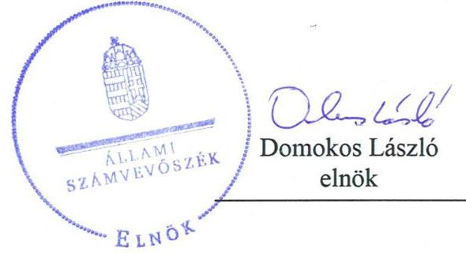
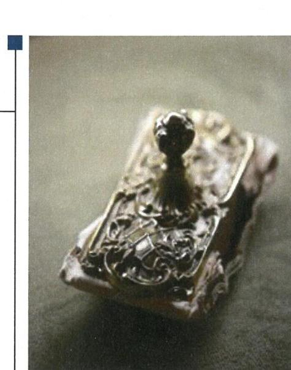
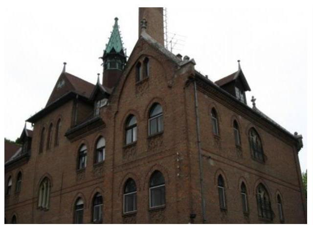
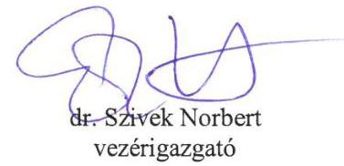
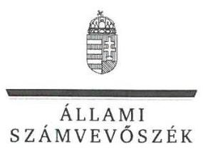
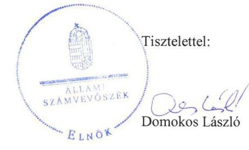
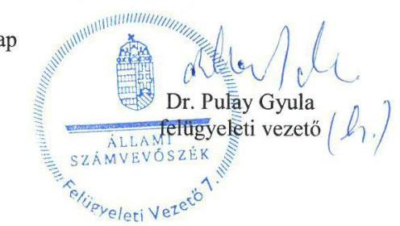

# Jelentés 

## Az állami tulajdonú gazdasági társaságok ellenőrzése

Az állami tulajdonú gazdasági társaságok ellenőrzése - OMSZI Intézményfenntartó Közhasznú Nonprofit Kft.
2018.

18194
www.asz.hu

---

# Jelentés 

## Az állami tulajdonú gazdasági társaságok ellenőrzése

Az állami tulajdonú gazdasági társaságok ellenőrzése - OMSZI Intézményfenntartó Közhasznú Nonprofit Kft.
2018. 08. hó 16. nap

---

# AZ ELLENŐRZÉST FELÜGYELTE:

DR. PULAY GYULA felügyeleti vezető

## AZ ELLENŐRZÉST VEZETTE ÉS A VÉGREHAJTÁSÁÉRT FELELŐS:

KEREKES PÉTER ellenőrzésvezető

A PROGRAM ÖSSZEÁLLÍTÁSÁÉRT FELELŐS:

TÓTPÁL SZABOLCS osztályvezető

IKTATÓSZÁM: EL-0642-016/2018.

TÉMASZÁM: 2469

ELLENŐRZÉS-AZONOSÍTÓ SZÁM: V-081422

Jelentéseink az Országgyűlés számítógépes hálózatán és az Interneten a www.asz.hu címen is olvashatóak.

---

# TARTALOMJEGYZÉK 

■ ÖSSZEGZÉS ..... 5
■ AZ ELLENŐRZÉS CÉLJA ..... 6
■ AZ ELLENŐRZÉS TERÜLETE ..... 7
■ AZ ELLENŐRZÉS HÁTTERE, INDOKOLTSÁGA ..... 8
■ A JELENTÉS LÉNYEGES KÉRDÉSKÖREI ..... 9
■ AZ ELLENŐRZÉS HATÓKÖRE ÉS MÓDSZEREI ..... 10
■ MEGÁLLAPÍTÁSOK ..... 12
■ JAVASLATOK ..... 14
■ MELLÉKLETEK ..... 17
I. sz. melléklet: Értelmező szótár ..... 17
■ FÜGGELÉK: ÉSZREVÉTELEK ..... 19
■ RÖVIDÍTÉSEK JEGYZÉKE ..... 25

---

.

---

# ÖSSZEGZÉS 

Az OMSZI Intézményfenntartó Közhasznú Nonprofit Kft. működésének szabályozottsága nem felelt meg a jogszabályi előírásoknak. A vagyongazdálkodása nem volt szabályszerű, ezáltal nem biztosította az elszámoltathatóságot és az átláthatóságot.

## Az ellenőrzés társadalmi indokoltsága

Az Állami Számvevőszék kiemelt célja, hogy az államháztartáson kívülre nyújtott költségvetési támogatások és ingyenes vagyonjuttatások, valamint az államháztartáson kívül működő feladatellátó rendszerek ellenőrzéseivel hozzájáruljon ahhoz, hogy a közpénzeket az államháztartáson kívül működő szervezetek is átlátható, rendezett módon használják fel.

Az állami tulajdonú gazdálkodó szervezetek a nemzeti vagyon részét képezik. Az állami vagyonnal való gazdálkodást illetően a tulajdonosi joggyakorlás feladata az állami vagyon átlátható, rendeltetésszerű és felelős használatának biztosítása. Az állami tulajdonú gazdasági társaságok feladata az állami vagyon átlátható, hatékony, költségtakarékos működtetése, értékének megőrzése, állagának védelme, értéknövelő használata, hasznosítása.

Minden közpénzt, közvagyont használó szervezettel szemben társadalmi igény, hogy tevékenységükről elszámoljanak. Ezt figyelembe véve és az Állami Számvevőszék Stratégiájával összhangban került sor az állami tulajdonban álló OMSZI Intézményfenntartó Közhasznú Nonprofit Kft. ellenőrzésére.

## Főbb megállapítások, következtetések, javaslatok

A Magyar Nemzeti Vagyonkezelő Zrt. a tulajdonosi joggyakorlás kereteit szabályszerűen kialakította, és a tulajdonosi jogokat szabályszerűen gyakorolta.

Az OMSZI Intézményfenntartó Közhasznú Nonprofit Kft. működésének szabályozottsága nem volt megfelelő, mert nem készítette el a leltározási és az értékelési szabályzatát, valamint a számviteli politikája nem felelt meg a törvényi előírásoknak.

Az egyszerűsített éves beszámolók mérlegsorai nem voltak leltárral alátámasztva, ezért a mérleg valódisága nem volt biztosított.

Az OMSZI Intézményfenntartó Közhasznú Nonprofit Kft. nem teljesítette a törvényben előírt kötelezettségét a közérdekű adatok közzétételére, ezért a működése nem volt átlátható.

A megállapítások alapján az Állami Számvevőszék az OMSZI Intézményfenntartó Közhasznú Nonprofit Kft. ügyvezetőjének hét javaslatot fogalmazott meg.

---

# AZ ELLENŐRZÉS CÉLJA 

jogszabályi előírásoknak megfeleltek-e.

Az ellenőrzés célja annak értékelése volt, hogy a tulajdonosi jogok gyakorlása szabályszerű volt-e. A gazdálkodó szervezet szabályozottsága, gazdálkodása és vagyongazdálkodási tevékenysége megfelelt-e a jogszabályi és a tulajdonosi előírásoknak. A vagyonváltozást eredményező döntések esetében a tulajdonosi jogok gyakorlója és a gazdálkodó szervezet szabályszerűen jártak-e el. Az ellenőrzés célja továbbá annak megítélése volt, hogy a kormányzati szektorba sorolt állami tulajdonban lévő gazdálkodó szervezetek gazdálkodásának a kormányzati szektor hiányára és az államadósságra befolyással bíró elemei a

---

# AZ ELLENŐRZÉS TERÜLETE 

## OMSZI Intézményfenntartó Közhasznú Nonprofit Kft. és a Magyar Nemzeti Vagyonkezelő Zrt.

Az OMSZI Intézményfenntartó Közhasznú Nonprofit Kft.-t az Oktatási Minisztérium alapította 2004-ben. A Társaság ${ }^{1}$ 100%-os állami tulajdonban van, a tulajdonosi jogokat a Magyar Nemzeti Vagyonkezelő Zrt. gyakorolja.

A Társaság közfeladatot lát el, tevékenységének célja, hogy támogassa a nyugdíjas pedagógusok és művészek szociális otthonokban való ellátását, biztosítsa pályakezdő színészek lakhatását, emellett két óvodát és bölcsődét is fenntart.

A Társaság a Számv. tv. ${ }^{2}$ 155. § (3) bekezdése alapján könyvvizsgálatra nem volt kötelezett, de az Alapító okirat ${ }^{3}$ független könyvvizsgáló kijelöléséről rendelkezett.

A Társaság működéséről, vagyoni, pénzügyi és jövedelmi helyzetéről egyszerűsített éves beszámolókat készített.

A Társaságnak a Számv. tv. 14. § (6) bekezdése alapján az önköltségszámítás belső rendjére vonatkozó belső szabályzat készítésére nem állt fenn kötelezettsége.

A Társaság nem rendelkezett tulajdonosi részesedéssel más gazdasági társaságban. A Társaság kormányzati szektorba sorolt egyéb szervezetnek minősült.

A Társaságnak 2013. január 1. és 2016. augusztus 31. között vagyonkezelésre átvett, vagy saját tulajdonú ingatlana nem volt, a feladatellátáshoz hasznosított ingatlanok vagyonkezelője a $\mathrm{KIH}^{4}$ volt. Az 251/2016. (VIII.24.) Korm. rendelet ${ }^{5}$ a hasznosított ingatlanokat 2016. szeptember 1-től a Társaság vagyonkezelésébe rendelte.

---

# AZ ELLENŐRZÉS HÁTTERE, INDOKOLTSÁGA 

Az Európai Unióban 1994. év óta hatályos túlzott hiány eljárás mindig kihívást jelentett a tagállamok számára. Az állami tulajdonú gazdálkodó szervezetek ellenőrzése kiemelten fontos a vagyon megőrzése, megóvása érdekében, valamint a kormányzati szektor elszámolásaiban megjelenő állami tulajdonú gazdálkodó szervezetek esetében, amelyekkel szemben alapvető követelmény, hogy gazdálkodásuk, működésük szabályszerű, az általuk szolgáltatott adatok minél megbízhatóbbak legyenek. Gazdálkodásuk jellemzően a közérdeklődés és a média figyelmének középpontjában áll, amihez hozzájárul a gazdálkodásuk körébe tartozó - közvetlen vagy közvetett állami tulajdonú, tehát végső soron a nemzeti vagyon részét képező - vagyon nagysága, illetve az általuk ellátott közszolgáltatások/közfeladatok minősége és hatékonysága.

Az ellenőrzés rámutathat az állami tulajdonú gazdálkodó szervezetek gazdálkodási tevékenységével jó gyakorlatokra és szabálytalanságokra. Felhívhatja a figyelmet a jogszabályi követelmények teljesítéséhez szükséges feltételek hiányosságaira, hozzájárulhat az államháztartáson kívüli, de (közvetlenül vagy közvetve) állami vagyont használó gazdálkodó szervezetek tevékenységének átláthatóságához. Ellenőrzésünk eredményeképpen javaslatainkkal, megállapításainkkal hozzájárulhatunk a nemzeti vagyonnal való gazdálkodás átláthatóságának, elszámoltathatóságának javításához.

---

# A JELENTÉS LÉNYEGES KÉRDÉSKÖREI 

1. A tulajdonosi joggyakorlás szabályszerű volt-e?
2. A gazdasági társaság működésének szabályozottsága és vagyongazdálkodása szabályszerű volt-e?
3. A kormányzati szektorba sorolt gazdasági társaság gazdálkodásának a kormányzati szektor hiányára és az államadósságra befolyással bíró elemei megfeleltek-e a jogszabályi előírásoknak?

---

# AZ ELLENŐRZÉS HATÓKÖRE ÉS MÓDSZEREI 

## Az ellenőrzés típusa

Megfelelőségi ellenőrzés.

## Az ellenőrzött időszak

A 2013 - 2016. évek, a 2016. évi beszámoló jóváhagyásáig tartó időszak.

## Az ellenőrzés tárgya

A 100%-os állami tulajdonban lévő Társaság feletti tulajdonosi joggyakorlás, valamint a Társaság gazdálkodásának szabályozottsága és szabályszerűsége.

Az ellenőrzés kiterjed minden olyan körülményre és adatra, amely az ÁSZ ${ }^{6}$ jogszabályban meghatározott feladatainak teljesítéséhez, valamint a program végrehajtása folyamán felmerült újabb összefüggések feltárásához szükséges.

## Az ellenőrzött szervezet

OMSZI Intézményfenntartó Közhasznú Nonprofit Kft. és a Magyar Nemzeti Vagyonkezelő Zrt.

## Az ellenőrzés jogalapja

Az ellenőrzés jogszabályi alapját az ÁSZ tv. ${ }^{7}$ 1. § (3) bekezdése és 5. § (3)(4)-(5) bekezdései képezik.

## Az ellenőrzés módszerei

Az ellenőrzést a nemzetközi standardokat irányadónak tekintve az ellenőrzési program ellenőrzési kérdései, az ellenőrzött időszakban hatályos jogszabályok, az ellenőrzés szakmai szabályok és módszertanok figyelembe vételével végeztük.

Az ellenőrzés ideje alatt az ellenőrzött szervezettel történő kapcsolattartást az ÁSZ Szervezeti és Működési Szabályzatának vonatkozó előírásai alapján biztosítottuk.

Az ellenőrzési kérdések megválaszolásához szükséges bizonyítékok megszerzése a következő ellenőrzési eljárások alkalmazásával történt:

---

megfigyelés, kérdésfeltevés (információkérés), összehasonlítás, valamint elemző eljárás. Az ellenőrzési bizonyítékként felhasználható adatforrások közé tartoztak egyrészt az ellenőrzési programban felsorolt adatforrások, másrészt adatforrás lehetett még minden - az ellenőrzés folyamán - feltárt, az ellenőrzés szempontjából információkat tartalmazó dokumentum.

Az ellenőrzést a kérdésekre adott válaszok kiértékelésével, valamint a megjelölt adatforrások, a tanúsítványok felhasználásával, továbbá az adott időszakban hatályos jogszabályok figyelembe vételével folytattuk le.

---

# 1. A tulajdonosi joggyakorlás szabályszerű volt-e? 

## Összegző megállapítás

## A tulajdonosi joggyakorlás szabályszerű volt.

Az MNV Zrt. ${ }^{8}$ a Társaság feletti tulajdonosi joggyakorlásának rendjét az SZMSZ ${ }^{9}$-ében, a Társasági Monitoring Szabályzatában ${ }^{10}$, a Tulajdonosi Ellenőrzési Szabályzatában ${ }^{11}$ és az Alapítói okiratban határozta meg.

Az MNV Zrt. az Alapító okiratban előírtaknak megfelelően létrehozta a felügyelőbizottságot, amely rendelkezett ügyrenddel.

Az MNV Zrt. a Társaság egyszerűsített éves beszámolóit és közhasznúsági mellékleteit a felügyelőbizottság írásbeli jelentésének és a könyvvizsgálói jelentés birtokában jóváhagyta.

## 2. A gazdasági társaság működésének szabályozottsága és vagyongazdálkodása szabályszerű volt-e?

## Összegző megállapítás

2.1. számú megállapítás

## A Társaság működésének szabályozottsága és vagyongazdálkodása nem volt szabályszerű.

## A Társaság működésének szabályozottsága nem volt szabályszerű.

A Társaság nem készítette el a Számv. tv. 14. § (5) bekezdés a) pontjában előírt leltárkészítési és leltározási szabályzatát, valamint a Számv. tv. 14. § (5) bekezdés b) pontjában előírt értékelési szabályzatát.

A Társaság a Számv. tv. 14. § (11) bekezdés előírása ellenére, a Számviteli politikáján ${ }^{12}$ 2016. december 31-éig nem vezette keresztül a Számv. tv. 2015. július 4-én hatályba lépett, a rendkívüli eredmény, illetve a mérleg szerinti eredmény fogalmát megszüntető módosításait.

## A Társaság vagyongazdálkodási tevékenysége nem volt szabályszerű.

A Társaság egyszerűsített éves beszámolói nem voltak szabályszerűek, mert a Számv. tv. 69. § (1) bekezdésben előírtak ellenére a mérlegtételeket nem támasztotta alá az eszközöket és forrásokat tételesen, ellenőrizhető módon tartalmazó leltárakkal.

A Társaság a használatba vett ingatlanokat a Számv. tv. 160. § (5) bekezdésében előírtak ellenére nem tartotta nyilván a 0-s számlaosztályban.

A 251/2016. (VIII. 24.) Korm. rendelet 1. § (7) bekezdésének értelmében a Társaság használatában lévő ingatlanok létesítménygazdálkodási feladatait, valamint a kapcsolódó vagyonkezelői jogokat és kötelezettségeket az addigi vagyonkezelő, a KIH 2016. szeptember 1-jei megszűnésével a Társasághoz rendelte. A Miniszterelnökség 2016. évi beszámolója szerint az

---

ingatlanok átadása megtörtént, azonban ezt az ellenőrzött időszak végéig a Társaság nem könyvelte, nem tüntette fel az egyszerűsített éves beszámolójában, illetve kiegészítő mellékletében sem jelenítette meg, amellyel megsértette a Számv. tv. 15. § (2) bekezdésben előírt teljesség elvét.

A hiányosságok ellenére a könyvvizsgáló az egyszerűsített éves beszámolókat korlátozás nélküli hitelesítő záradékkal látta el.

# 2.3. számú megállapítás 

A Társaság nem biztosította az átláthatóságot.
A Társaság a 2013-2015. évről készült egyszerűsített éves beszámolóit a Számv. tv. 153. § (1) bekezdésben előírt határidőben, a 2016. évről készült egyszerűsített éves beszámolóját a határidő után tette közzé.

A Társaság megsértette az Info. tv. ${ }^{13}$ 37. § (1) bekezdésben foglaltakat, mivel az Info. tv. 1. mellékletében számára előírt adatok közül a szervezeti és személyzeti adatok, valamint a tevékenységre, működésre vonatkozó adatok közzétételéről nem gondoskodott.

## 3. A kormányzati szektorba sorolt gazdasági társaság gazdálkodásának a kormányzati szektor hiányára és az államadósságra befolyással bíró elemei megfeleltek-e a jogszabályi előírásoknak?

Összegző megállapítás A Társaság gazdálkodásában nem voltak a kormányzati szektor hiányára befolyással bíró elemek.

A Társaság a Stabilitási tv. ${ }^{14}$ szerinti adósságot keletkeztető ügyletet nem kötött. Nem vett fel a kormányzati szektoron kívülről hitelt, nem bocsátott ki kötvényt, kötelezettségvállaláshoz kapcsolódóan nem vállalt garanciát és kezességet.

---

# JAVASLATOK 

Az ÁSZ tv. 33. § (1) bekezdésében foglaltak értelmében az ellenőrzött szervezet vezetője köteles a jelentésben foglalt megállapításokhoz kapcsolódó intézkedési tervet összeállítani és azt a jelentés kézhezvételétől számított 30 napon belül az ÁSZ részére megküldeni. Amennyiben az ellenőrzött szervezet vezetője nem küldi meg határidőben az intézkedési tervet, vagy továbbra sem elfogadható intézkedési tervet küld, az Állami Számvevőszék elnöke az ÁSZ tv. 33. § (3)
 bekezdése a) és b) pontjaiban foglaltakat érvényesítheti.

## Az OMSZI Intézményfenntartó Közhasznú Nonprofit Kft. ügyvezetőjének

1. Intézkedjen a jogszabályi előírásoknak megfelelően a leltárkészítési és leltározási szabályzat elkészítéséért.
(2.1. sz. megállapítás 1. bekezdése alapján)
2. Intézkedjen a jogszabályi előírásoknak megfelelően az értékelési szabályzat elkészítéséért.
(2.1. sz. megállapítás 1. bekezdése alapján)
3. Intézkedjen a számviteli politika jogszabályi előírásoknak megfelelő módosítása iránt.
(2.1. sz. megállapítás 2. bekezdése alapján)
4. Intézkedjen a jogszabályi előírásoknak megfelelően az egyszerűsített éves beszámoló mérlegtételeinek - az eszközöket és forrásokat tételesen, ellenőrizhető módon tartalmazó - leltárral történő alátámasztásáról.
(2.2. sz. megállapítás 1. bekezdése alapján)
5. Intézkedjen a használatba vett ingatlanok jogszabályi előírásoknak megfelelő nyilvántartásba vételéről.
(2.2. sz. megállapítás 2. és 3. bekezdése alapján)
6. Intézkedjen az egyszerűsített éves beszámolóinak határidőben történő közzétételéért.
(2.3. sz. megállapítás 1. bekezdése alapján)

---

7. Intézkedjen a szervezeti és személyzeti adatok, valamint a tevékenységre, működésre vonatkozó adatok jogszabályi előírásoknak megfelelő közzétételéről.
(2.3. sz. megállapítás 2. bekezdése alapján)

---

.

---

# MELLÉKLETEK 

- I. SZ. MELLÉKLET: ÉRTELMEZŐ SZÓTÁR
állami vagyon
a) Az állam tulajdonában lévő dolog, valamint a dolog módjára hasznosítható természeti erő,
b) az a) pont hatálya alá nem tartozó mindazon vagyon, amely vonatkozásában törvény az állam kizárólagos tulajdonjogát nevesíti,
c) az állam tulajdonában lévő tagsági jogviszonyt megtestesítő értékpapír, illetve az államot megillető egyéb társasági részesedés,
d) az államot megillető olyan immateriális, vagyoni értékkel rendelkező jogosultság, amelyet jogszabály vagyoni értékű jogként nevesít.
e) az állam tulajdonában lévő pénzügyi eszközök

## 2013. június 27-ig:

Az állami vagyont az MNV Zrt. maga kezeli, vagy szerződés - így különösen bérlet, haszonbérlet, megbízás - alapján központi költségvetési szervnek, természetes vagy jogi személynek, vagy jogi személyiséggel nem rendelkező gazdálkodó szervezetnek hasznosításra átengedi.
Forrás: Vtv. ${ }^{15}$ 23. § (1) bekezdése

## 2013. június 28-ától:

Az állami vagyonnal az MNV Zrt. maga gazdálkodik, vagy szerződés - így különösen bérlet, haszonbérlet, megbízás - alapján központi költségvetési szervnek, természetes vagy jogi személynek, vagy jogi személyiséggel nem rendelkező gazdálkodó szervezetnek hasznosításra átengedi, illetőleg vagyonkezelésbe, haszonélvezetbe adja. Forrás: Vtv. 23. § (1) bekezdése.
a Ptk. ${ }^{16}$ 3:88. § (1) bekezdése szerint „a gazdasági társaságok üzletszerű közös gazdasági tevékenység folytatására, a tagok vagyoni hozzájárulásával létrehozott, jogi személyiséggel rendelkező vállalkozások, amelyekben a tagok a nyereségből közösen részesednek, és a veszteséget közösen viselik".
2013. június 27-ig:

Az állami vagyont az MNV Zrt. maga kezeli, vagy szerződés - így különösen bérlet, haszonbérlet, megbízás - alapján központi költségvetési szervnek, természetes vagy jogi személynek, vagy jogi személyiséggel nem rendelkező gazdálkodó szervezetnek hasznosításra átengedi. Az állami vagyonra vonatkozóan az MNV Zrt. kizárólag az Nvtv.-ben ${ }^{17}$ meghatározott személyekkel köthet vagyonkezelési szerződést.
Forrás: Vtv. 23. § (1), 27. § (1)

## 2013. június 28-ától:

Az állami vagyonnal az MNV Zrt. maga gazdálkodik, vagy szerződés - így különösen bérlet, haszonbérlet, megbízás - alapján központi költségvetési szervnek, természetes vagy jogi személynek, vagy jogi személyiséggel nem rendelkező gazdálkodó szervezetnek hasznosításra átengedi, illetőleg vagyonkezelésbe, haszonélvezetbe adja. Az állami vagyonra vonatkozóan az MNV Zrt. kizárólag az Nvtv.-ben meghatározott személyekkel köthet vagyonkezelési szerződést.
Forrás: Vtv. 23. § (1), 27. § (1)
Az a szervezet, amely az Áht. ${ }^{18}$ alapján nem része az államháztartásnak, azonban az Európai Közösséget létrehozó szerződéshez csatolt, a túlzott hiány esetén követendő eljárásról szóló jegyzőkönyv alkalmazásáról szóló 2009. május 25-i 479/2009/EK rendelet szerint a kormányzati szektorba tartozik.

---

MNV Zrt.
KZ 100%-ban állami tulajdonban álló gazdasági társaságok közül kijelölheti.
Forrás: Vtv. 3. § (1) és (2)

# 2013. június 28-ától: 

A rábízott állami vagyon felett az államot megillető tulajdonosi jogok és kötelezettségek összességét - a hatályos szabályozás szerint - az állami vagyon felügyeletéért felelős miniszter (jelenleg a nemzeti fejlesztési miniszter) gyakorolja. A miniszter feladatát nagy részben az MNV Zrt., mint tulajdonosi joggyakorló szervezet útján látja el.
nonprofit gazdasági társaság Ctv. ${ }^{19}$ 9/F. § (2) bekezdése szerint „az a gazdasági társaság minősül nonprofit gazdasági társaságnak és cégnevében az a gazdasági társaság tüntetheti fel a nonprofit jelleget, amelynek létesítő okirata tartalmazza, hogy a gazdasági társaság tevékenységéből származó nyereség a tagok között nem osztható fel, hanem az a gazdasági társaság vagyonát gyarapítja." (hatályos 2014. március 15-től)
tulajdonosi jogok gyakorlója 1.

## 2013. június 27-ig:

Az állami vagyon felett a Magyar Államot megillető tulajdonosi jogok és kötelezettségek összességét - ha törvény eltérően nem rendelkezik - az állami vagyon felügyeletéért felelős miniszter (a továbbiakban: miniszter) gyakorolja, aki e feladatát a Magyar Nemzeti Vagyonkezelő Zártkörűen Működő Részvénytársaság (a továbbiakban: MNV Zrt.), a Magyar Fejlesztési Bank, illetve a tulajdonosi joggyakorló szervezet útján látja el. A miniszter miniszteri rendeletben, a törvényben meghatározott állami vagyoni kör tekintetében, meghatározott időtartamra, a joggyakorlás egyes szabályainak meghatározásával - az őt megillető tulajdonosi jogok és kötelezettségek összességének, illetve azok meghatározott részének gyakorlóját az Áht. szerinti központi költségvetési szervek, ezek intézménye, továbbá a 100%-ban állami tulajdonban álló gazdasági társaságok közül kijelölheti.
Forrás: Vtv. 3. § (1) és (2)

## 2013. június 28-ától:

A rábízott állami vagyon felett az államot megillető tulajdonosi jogok és kötelezettségek összességét tulajdonosi joggyakorlóként:
a) ha törvény vagy miniszteri rendelet eltérően nem rendelkezik, a Magyar Nemzeti Vagyonkezelő Zártkörűen Működő Részvénytársaság (a továbbiakban: MNV Zrt.), b) törvényben kijelölt személy vagy
c) az állami vagyon felügyeletéért felelős miniszter (a továbbiakban: miniszter) által rendeletben kijelölt személy gyakorolja.
[...] A miniszter e törvény felhatalmazása alapján - a meghatározott célok hatékonyabb elérése érdekében, miniszteri rendeletben, az ott meghatározott állami vagyoni kör tekintetében, meghatározott időtartamra - e törvény keretei között, a joggyakorlás egyes szabályainak meghatározásával - az államot megillető tulajdonosi jogok és kötelezettségek összességének, illetve azok meghatározott részének gyakorlóját az Áht. szerinti központi költségvetési szervek, ezek intézménye, továbbá a 100%-ban állami tulajdonban álló gazdasági társaságok közül kijelölheti.
Forrás: Vtv. 3. § (1) és (2)
2.

Aki a nemzeti vagyon felett az államot vagy a helyi önkormányzatot megillető tulajdonosi jogok és kötelezettségek összességének gyakorlására jogosult
Forrás: Nvtv. 3. § (1) 17. pontja

---

# FÜGGELÉK: ÉSZREVÉTELEK 

A jelentéstervezetet a Számvevőszék 15 napos észrevételezésre megküldte az ellenőrzött szervezetek vezetőinek az ÁSZ tv. 29. § (1) bekezdése előírásának megfelelően.

Az ÁSZ a jelentéstervezetet az OMSZI Intézményfenntartó Közhasznú Nonprofit Kft. ügyvezetőjének és a Magyar Nemzeti Vagyonkezelő Zrt. vezérigazgatójának küldte meg.
Észrevételt a Magyar Nemzeti Vagyonkezelő ZRt. vezérigazgatója tett, észrevételeit és az azokra adott választ a függelék tartalmazza.

[^0]
[^0]:    * 29. § (1) Az Állami Számvevőszék az ellenőrzési megállapításait megküldi az ellenőrzött szervezet vezetőjének vagy az általa megbízott személynek, és annak, akinek személyes felelősségét állapította meg.
    (2) Az ellenőrzött szervezet vezetője és a felelősként megjelölt személy az ellenőrzés megállapításaira tizenöt napon belül írásban észrevételt tehet.
    (3) Az Állami Számvevőszék az észrevételre a beérkezésétől számított harminc napon belül írásban válaszol. A figyelembe nem vett észrevételeket köteles a jelentésben feltüntetni, és megindokolni, hogy azokat miért nem fogadta el.

---

# MNV   Magyar Nemzeti   Vagyonkezelő Zrt   Vezérigazgató   Állami Számvevőszék   Domokos László   elnök 

1052 Budapest
Apáczai Cs. J. u. 10.

Ikt. sz.: MNV/01/8461/ 4 /2018.
Hiv. sz.: EL-0642-012/2018.

Tisztelt Elnök Úr!
Tájékoztatom, hogy a 2018. június 18. napján, „Az állami tulajdonban (résztulajdonban) lévő gazdálkodó szervezetek vagyonmegőrzési és gazdálkodási tevékenységének ellenőrzése - OMSZI Intézményfenntartó Közhasznú Nonprofit Kft." tárgyában kézhez vett, EL-0642-012/2018. ikt. sz. levél mellékleteként megküldött Jelentés-tervezetre az alábbi észrevételeket tesszük.

## ,2.2. számú megállapítás" / 12-13. oldal:

A megállapításban foglaltakkal összefüggésben szeretnénk jelezni, hogy a hivatkozott, (már hatályon kívül helyezett) a Közigazgatási és Igazságügyi Hivatal megszüntetéséről, valamint egyes kapcsolódó kormányrendeletek módosításáról szóló 251/2016. (VIII. 24.) Korm. rendelet (a továbbiakban: Korm. rendelet) - amely a beolvadásos különválással megszűnt Közigazgatási és Igazságügyi Hivatal vagyonkezelői jogait és kötelezettségeit az OMSZI Intézményfenntartó Közhasznú Nonprofit Kft.-hez (a továbbiakban: OMSZI NKft.) rendelte - az MNV Zrt. korábban is kifejtett jogi álláspontja értelmében nem volt alkalmasnak tekinthető a vagyonkezelői jogokban és kötelezettségekben való jogutódlás, mint joghatás kiváltásához.

Az államháztartásról szóló 2011. évi CXCV. törvény (Áht.) 11. §-a úgy rendelkezik, hogy költségvetési szerv jogutódja kizárólag költségvetési szerv lehet (a különváló költségvetési szervből a különváló szervezeti egységek az átalakítás során már működő költségvetési szervbe mint jogutódokba olvadnak be - beolvadásos különválás), a polgári törvénykönyvről szóló 2013. évi V. törvény (Ptk.) pedig úgy rendelkezik, hogy gazdasági társaság csak gazdasági társasággá, egyesüléssé, szövetkezetté alakulhat át és ilyen szervezetekkel egyesülhet (Id. Ptk. 3:133. § és 3:136. §).

A nemzeti vagyonról szóló 2011. évi CXCVI. törvény (Nvtv.) 11. § (1) bekezdése értelmében vagyonkezelői jog - a törvényben történő kijelölés kivételével (vagy legalább ilyen külön törvény által lehetővé tett egyéb felhatalmazás keretében tett intézkedés, pl. jogutódlási rendelkezés hiányában) vagyonkezelési szerződéssel jön létre, így az ingatlanok tekintetében az OMSZI NKft. nem minősül vagyonkezelőnek. Az MNV Zrt. jelenleg is ennek figyelembevételével rendezi az ingatlanok jogi helyzetét.

Tájékoztatom egyidejűleg Elnök Urat arról, hogy az egyes állami tulajdonban álló gazdasági társaságok

---

felett az államot megillető tulajdonosi jogok és kötelezettségek összességét gyakorló személyek kijelöléséről szóló 1/2018. (VI.25.) NVTNM rendeletben foglaltaknak megfelelően, az OMSZI NKft. tulajdonosi jogait a 2018. június 26. és 2022. december 31. közötti időszakban az Emberi Erőforrások Minisztériuma gyakorolja.

Kérem Elnök Urat, hogy a jelentés véglegesítése során jelen észrevételeinket szíveskedjenek figyelembe venni.

Budapest, 2018. július „ 3. "
Üdvözlettel:

---

ELNÖK

Ikt.szám: EL-0642-014/2018.

# Dr. Szívek Norbert úr 

vezérigazgató
Magyar Nemzeti Vagyonkezelő Zrt.

## Budapest

## Tisztelt Vezérigazgató Úr!

„Az állami tulajdonú gazdasági társaságok ellenőrzése - OMSZI Intézményfenntartó Közhasznú Nonprofit Kft. " címmel készített számvevőszéki jelentéstervezetre a Magyar Nemzeti Vagyonkezelő Zrt. észrevételeit köszönettel megkaptam.
Az Állami Számvevőszék észrevételekre vonatkozó álláspontjáról a felügyeleti vezető által készített részletes tájékoztatást csatoltan megküldöm.
Tájékoztatom Vezérigazgató urat, hogy a számvevőszéki jelentésben - az Állami Számvevőszékről szóló 2011. évi LXVI. törvény 29. § (3) bekezdése alapján - a figyelembe nem vett észrevételeket szerepeltetjük az elutasítás indokának feltüntetésével.
Köszönjük szépen Vezérigazgató úr tájékoztatását a tulajdonosi joggyakorló személyében bekövetkezett változásról. Erre való tekintettel a jelentés végleges változatát megküldöm majd az emberi erőforrások miniszterének is.

Budapest, 2018. 04. hó 34. nap

Melléklet: Tájékoztatás az észrevételek kezeléséről

---

# Tájékoztatás az észrevételek kezeléséről 

„Az állami tulajdonú gazdasági társaságok ellenőrzése - OMSZI Intézményfenntartó Közhasznú Nonprofit Kft. " című jelentéstervezetre az MNV/01/8461/4/2018. iktatószámú levélben megküldött észrevételeit áttekintettem. Az észrevételek kezeléséről az alábbi tájékoztatást adom.

## 1.) Az 2.2. számú megállapítás 3. bekezdéséhez megfogalmazott észrevételre adott válasz

A Közigazgatási és Igazságügyi Hivatal megszüntetéséről, valamint egyes kapcsolódó kormányrendeletek módosításáról szóló 251/2016. (VIII. 24.) Korm. rendelet 1. § (1) bekezdése kimondja, hogy a Közigazgatási és Igazságügyi Hivatal (a továbbiakban: KIH) 2016. szeptember 1-jével beolvadásos különválással megszűnik, továbbá az 1. § (2) bekezdése szerint a KIH általános jogutódja - a (3)-(10) bekezdésben meghatározott
 kivétellel - a Miniszterelnökség. A kormányrendelet tehát a KIH jogutódjaként a Miniszterelnökséget nevezi meg, mellyel eleget tesz az állambáztartásról szóló 2011. évi CXCV. törvény (a továbbiakban: Áht.) 11. § előírásainak.
Az Áht. 11. § (3b) bekezdés b) pontja úgy fogalmaz, hogy különváló költségvetési szervből a különváló szervezeti egységek az átalakítás során már működő költségvetési szervbe, mint jogutódokba olvadnak be. Azonban az OMSZI NKft. esetében nem költségvetési szerv szervezeti egységei kerülnek átvételre, hanem 8 ingatlan vagyonkezelői joga, ugyanis a 251/2016. (VIII. 24.) Korm. rendelet 1. § (7) bekezdése úgy fogalmaz, hogy a KIH létesítménygazdálkodási feladatai, valamint a kapcsolódó vagyonkezelői jogok és kötelezettségek tekintetében adja át az OMSZI NKft.-nek a 8 ingatlan kezelését. Az Áht. 11. § az általános jogutódlást és maguknak a szervezeti egységeknek a jogutódlását szabályozza, a 251/2016. (VIII. 24.) Korm. rendelet 1. § (7) bekezdése viszont egyes feladatok és a vagyonkezelői jog átadásáról dönt.

Mindezek alapján a jelentéstervezethez füzött észrevételt, valamint az MNV Zrt. jogutódlással kapcsolatos álláspontját nem fogadjuk el.
Észrevételében szerepel továbbá, hogy a nemzeti vagyonról szóló 2011. évi CXCVI. törvény (a továbbiakban Nvtv.) 11. § (1) bekezdése értelmében vagyonkezelői jog - a törvényben történő kijelölés kivételével (vagy legalább ilyen külön törvény által lehetővé tett egyéb felhatalmazás keretében tett intézkedés, pl. jogutódlási rendelkezés hiányában) - vagyonkezelői szerződéssel jön létre, így az ingatlanok tekintetében az OMSZI NKft. az MNV Zrt. álláspontja szerint nem minősül vagyonkezelőnek.
Az Nvtv. 11. § (1) bekezdése valóban úgy határoz, hogy a vagyonkezelői jog az (5) bekezdésben meghatározott kivétellel (törvényi kijelölés) vagyonkezelői szerződéssel jön létre, tehát a kezelt vagyon használatba vétele előtt a tulajdonosi joggyakorló és a vagyonkezelő vagyonkezelési szerződésben rendezi az ingatlan használatának kérdéseit, ha a vagyonkezelőt és a vagyonkezelés kereteit nem törvény jelöli ki. Ez viszont nem azt jelenti, hogy a vagyonkezelői szerződés

---

megkötésének alapja kizárólag törvényi elrendelés lehet. Mindezek alapján nem világos, hogy mi akadályozta meg az OMSZI NKft.-t abban, hogy a vagyonkezelői szerződést megkösse tekintettel arra, hogy a Miniszterelnökség 2016. évi beszámolója szerint az ingatlanok átadása megtörtént, az OMSZI használja azokat, ennek ellenére könyvelésében, beszámolójában nem jelenik meg.

Budapest, 2018. 04. hó 34. nap

---

# RÖVIDÍTÉSEK JEGYZÉKE 

${ }^{1}$ Társaság
${ }^{2}$ Számv. tv.
${ }^{3}$ Alapító okirat
${ }^{4}$ KIH
${ }^{5}$ 251/2016. (VIII. 24.) Korm. rendelet
${ }^{6}$ ÁSZ
${ }^{7}$ Ász tv.
${ }^{8}$ MNV Zrt.
${ }^{9}$ SZMSZ
${ }^{10}$ Társasági Monitoring Szabályzat
${ }^{11}$ Tulajdonosi Ellenőrzési Szabályzat
${ }^{12}$ Számviteli politika
${ }^{13}$ Info. tv.
${ }^{14}$ Stabilitási tv.
${ }^{15}$ Vtv.
${ }^{16}$ Ptk.
${ }^{17}$ Nvtv.
${ }^{18}$ Áht.
${ }^{19}$ Ctv.

OMSZI Intézményfenntartó Közhasznú Nonprofit Kft.
2000. évi C. törvény a számvitelről (hatályos: 2001. január 1-jétől)

Az OMSZI Intézményfenntartó Közhasznú Nonprofit Kft. alapító okirata (hatályos 2013. január 18-tól, 2014. június 27-től, 2015. június 26-tól és 2016. július 8-tól)

Közigazgatási és Igazságügyi Hivatal
251/2016. (VIII. 24.) Korm. rendelet a Közigazgatási és Igazságügyi Hivatal megszüntetéséről, valamint egyes kapcsolódó kormányrendeletek módosításáról Állami Számvevőszék
2011. évi LXVI. törvény az Állami Számvevőszékről (hatályos: 2011. július 1-jétől) Magyar Nemzeti Vagyonkezelő Zrt.

A Magyar Nemzeti Vagyonkezelő Zrt. szervezeti és működési szabályzata (hatályos 2012. október 10-től, módosítva 2013. március 16-án, 2013. április 22-én, 2013. június 17-én, 2013. július 1-jén és 2016. április 8-án)
A Magyar Nemzeti Vagyonkezelő Zrt. Társasági Monitoring Szabályzata (hatályos 2013. december 19-től, majd 2016. augusztus 2-től)

A Magyar Nemzeti Vagyonkezelő Zrt. Tulajdonosi Ellenőrzési Szabályzata (hatályos 2011. október 5-től, 2013. augusztus 7-től, 2013. október 5-től, 2014. szeptember 10-től, majd 2016. szeptember 21-től)
OMSZI Intézményfenntartó Közhasznú Nonprofit Kft. számviteli politikája (hatályos 2013. március 29-től)
2011. évi CXII. törvény az információs önrendelkezési jogról és az információszabadságról (hatályos 2011. július 27-től)
2011. évi CXCIV. törvény Magyarország gazdasági stabilitásáról (hatályos 2011. december 31-től)
2007. évi CVI. törvény az állami vagyonról
2013. évi V. törvény a Polgári Törvénykönyvről (hatályos 2014. március 15-től) 2011. évi CXCVI. törvény a nemzeti vagyonról
2011. évi CXCV. törvény az államháztartásról (hatályos 2011. december 30-tól) 2006. évi V. törvény a cégnyilvánosságról, a bírósági cégeljárásról és a végelszámolásról (hatályos 2006. július 1-jétől)

---

# ÁLLAMI SZÁMVEVŐSZÉK 

1052 Budapest, Apáczai Csere János utca 10.
Levélcím: 1364 Budapest 4. Pf. 54
Telefon: +36 14849100 Telefax: +36 14849200
www.asz.hu
