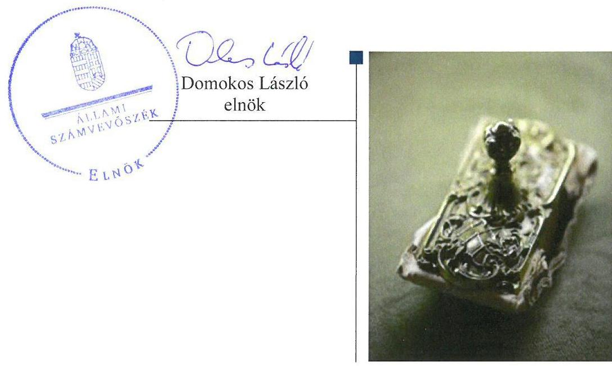

# Jelentés 

## Az állami tulajdonú gazdasági társaságok ellenőrzése

Az állami tulajdonú gazdasági társaságok ellenőrzése - Lechner Tudásközpont Területi, Építészeti és Informatikai Nonprofit Kft.
2018.

---

# J elentés 

## Az állami tulajdonú gazdasági társaságok ellenőrzése

Az állami tulajdonú gazdasági társaságok ellenőrzése - Lechner Tudásközpont Területi, Építészeti és Informatikai Nonprofit Kft.
2018. 08. hó 10. nap

---

# AZ ELLENŐRZÉST FELÜGYELTE:

DR. PULAY GYULA felügyeleti vezető

## AZ ELLENŐRZÉST VEZETTE ÉS A VÉGREHAJTÁSÁÉRT FELELŐS:

KEREKES PÉTER ellenőrzésvezető

A PROGRAM ÖSSZEÁLLÍTÁSÁÉRT FELELŐS:

TÓTPÁL SZABOLCS osztályvezető

IKTATÓSZÁM: EL-0649-017/2018.

TÉMASZÁM: 2469

ELLENŐRZÉS-AZONOSÍTÓ SZÁM: V-081417

Jelentéseink az Országgyűlés számítógépes hálózatán és az Interneta a www.asz.hu címen is olvashatóak.

---

# TARTALOMJEGYZÉK 

■ ÖSSZEGZÉS ..... 5
■ AZ ELLENŐRZÉS CÉLJA ..... 6
■ AZ ELLENŐRZÉS TERÜLETE ..... 7
■ AZ ELLENŐRZÉS HÁTTERE, INDOKOLTSÁGA ..... 8
■ A JELENTÉS LÉNYEGES KÉRDÉSKÖREI ..... 9
■ AZ ELLENŐRZÉS HATÓKÖRE ÉS MÓDSZEREI ..... 10
■ MEGÁLLAPÍTÁSOK ..... 12
■ JAVASLATOK ..... 14
■ MELLÉKLETEK ..... 15
I. sz. melléklet: Értelmező szótár ..... 15
■ FÜGGELÉK: ÉSZREVÉTELEK ..... 17
■ RÖVIDÍTÉSEK JEGYZÉKE ..... 19

---

.

---

# ÖSSZEGZÉS 

A Lechner Tudásközpont Területi, Építészeti és Informatikai Nonprofit Kft. müködésének szabályozottsága nem felelt meg a jogszabályi elöírásoknak. A vagyongazdálkodása nem volt szabályszerű, ezáltal nem biztosította az elszámoltathatóságot.

## Az ellenőrzés társadalmi indokoltsága

Az Állami Számvevőszék kiemelt célja, hogy az államháztartáson kívülre nyújtott költségvetési támogatások és ingyenes vagyonjuttatások, valamint az államháztartáson kívül múködő feladatellátó rendszerek ellenőrzéseivel hozzájáruljon ahhoz, hogy a közpénzeket az államháztartáson kívül múködő szervezetek is átlátható, rendezett módon használják fel.

Az állami tulajdonú gazdálkodó szervezetek a nemzeti vagyon részét képezik. Az állami vagyonnal való gazdálkodást illetően a tulajdonosi joggyakorlás feladata az állami vagyon átlátható, rendeltetésszerű és felelős használatának biztosítása. Az állami tulajdonú gazdasági társaságok feladata az állami vagyon átlátható, hatékony, költségtakarékos működtetése, értékének megőrzése, állagának védelme, értéknövelő használata, hasznosítása.

Minden közpénzt, közvagyont használó szervezettel szemben társadalmi igény, hogy tevékenységükről elszámoljanak. Ezt figyelembe véve és az Állami Számvevőszék Stratégiájával összhangban került sor az állami tulajdonban álló Lechner Tudásközpont Területi, Építészeti és Informatikai Nonprofit Kft. ellenőrzésére.

## Főbb megállapítások, következtetések, javaslatok

A Magyar Nemzeti Vagyonkezelő Zrt. a tulajdonosi joggyakorlás kereteit szabályszerűen kialakította. A Magyar Nemzeti Vagyonkezelő Zrt. és az általa 2013. szeptember 9-től 2014. november 9-ig megbízott Belügyminisztérium a tulajdonosi jogokat - a javadalmazási szabályzat megalkotását kivéve - szabályszerűen gyakorolta. Az ugyancsak megbízási szerződés alapján 2014. november 10-től eljáró Miniszterelnökség tulajdonosi joggyakorlása szabályszerű volt.

A Lechner Tudásközpont Területi, Építészeti és Informatikai Nonprofit Kft. múködésének szabályozottsága nem volt megfelelő, mert a számviteli politikája nem felelt meg a törvényi előírásoknak.

Az egyszerűsített éves beszámolók mérlegsorai nem voltak leltárral alátámasztva, ezért a mérleg valódisága nem volt biztosított.

A megállapítások alapján az Állami Számvevőszék a Lechner Tudásközpont Területi, Építészeti és Informatikai Nonprofit Kft. ügyvezetőjének három javaslatot fogalmazott meg.

---

# AZ ELLENŐRZÉS CÉLJA 

jogszabályi előírásoknak megfeleltek-e.

Az ellenőrzés célja annak értékelése volt, hogy a tulajdonosi jogok gyakorlása szabályszerű volt-e. A gazdálkodó szervezet szabályozottsága, gazdálkodása és vagyongazdálkodási tevékenysége megfelelt-e a jogszabályi és a tulajdonosi előírásoknak. A vagyonváltozást eredményező döntések esetében a tulajdonosi jogok gyakorlója és a gazdálkodó szervezet szabályszerűen jártak-e el. Az ellenőrzés célja továbbá annak megítélése volt, hogy a kormányzati szektorba sorolt állami tulajdonban lévő gazdálkodó szervezetek gazdálkodásának a kormányzati szektor hiányára és az államadósságra befolyással bíró elemei a

---

# AZ ELLENŐRZÉS TERÜLETE 

## Lechner Tudásközpont Területi, Építészeti és Informatikai Nonprofit Kft., a Magyar Nemzeti Vagyonkezelő Zrt., a Belügyminisztérium és a Miniszterelnökség

A Lechner Tudásközpont Területi, Építészeti és Informatikai Nonprofit Kft.-t a VÁTI Magyar Regionális Fejlesztési és Urbanisztikai Nonprofit Kft. alapította 2013. január 7-én, és 100\%os tulajdonosa volt 2013. június 13-ig. A Társaság ${ }^{1}$ 2013. június 14-én került 100\%-os közvetlen állami tulajdonba. Fő tevékenysége mérnöki tevékenység, műszaki tanácsadás. Közszolgáltatási szerződés alapján ellátta 2013. június 3-tól az építésügyi dokumentációs országos tervtár működtetését, 2014. május 9-től az egységes közműnyilvántartó rendszer üzemeltetését.

A Társaság feletti tulajdonosi jogokat 2013. június 14. és 2013. szeptember 8. között az MNV Zrt. ${ }^{2}$ gyakorolta. A tulajdonosi jogok gyakorlását az MNV Zrt.-vel kötött megbízási szerződés alapján 2013. szeptember 9-től 2014. november 9-ig a Belügyminisztérium, 2014. november 10-től a Miniszterelnökség látta el.

A Társaság a Számv. tv. ${ }^{3}$ 155. § (3) bekezdése alapján könyvvizsgálatra nem volt kötelezett, de az Alapító okirat ${ }^{4}$ független könyvvizsgáló kijelöléséről rendelkezett.

A Társaság működéséről, vagyoni, pénzügyi és jövedelmi helyzetéről egyszerűsített éves beszámolókat készített.

A Társaság nem rendelkezett tulajdonosi részesedéssel más gazdasági társaságban. A Társaság 2015. december 30-tól kormányzati szektorba sorolt egyéb szervezetnek minősült.

A Társaság az ellenőrzött időszakban rendelkezett vagyonkezelésre átvett ingatlanokkal.

---

# AZ ELLENŐRZÉS HÁTTERE, INDOKOLTSÁGA 

Az Európai Unióban 1994. év óta hatályos túlzott hiány eljárás mindig kihívást jelentett a tagállamok számára. Az állami tulajdonú gazdálkodó szervezetek ellenőrzése kiemelten fontos a vagyon megőrzése, megóvása érdekében, valamint a kormányzati szektor elszámolásaiban megjelenő állami tulajdonú gazdálkodó szervezetek esetében, amelyekkel szemben alapvető követelmény, hogy gazdálkodásuk, múködésük szabályszerű, az általuk szolgáltatott adatok minél megbízhatóbbak legyenek. Gazdálkodásuk jellemzően a közérdeklődés és a média figyelmének középpontjában áll, amihez hozzájárul a gazdálkodásuk körébe tartozó - közvetlen vagy közvetett állami tulajdonú, tehát végső soron a nemzeti vagyon részét képező - vagyon nagysága, illetve az általuk ellátott közszolgáltatások/közfeladatok minősége és hatékonysága.

Az ellenőrzés rámutathat az állami tulajdonú gazdálkodó szervezetek gazdálkodási tevékenységével jó gyakorlatokra és szabálytalanságokra. Felhívhatja a figyelmet a jogszabályi követelmények teljesítéséhez szükséges feltételek hiányosságaira, hozzájárulhat az államháztartáson kívüli, de (közvetlenül vagy közvetve) állami vagyont használó gazdálkodó szervezetek tevékenységének átláthatóságához. Ellenőrzésünk eredményeképpen javaslatainkkal, megállapításainkkal hozzájárulhatunk a nemzeti vagyonnal való gazdálkodás átláthatóságának, elszámoltathatóságának javításához.

---

# A JELENTÉS LÉNYEGES KÉRDÉSKÖREI 

1. A tulajdonosi joggyakorlás szabályszerű volt-e?
2. A gazdasági társaság müködésének szabályozottsága és vagyongazdálkodása szabályszerű volt-e?
3. A kormányzati szektorba sorolt gazdasági társaság gazdálkodásának a kormányzati szektor hiányára és az államadósságra befolyással bíró elemei megfeleltek-e a jogszabályi előírásoknak?

---

# AZ ELLENŐRZÉS HATÓKÖRE ÉS MÓDSZEREI 

## Az ellenőrzés típusa

Megfelelőségi ellenőrzés.

## Az ellenőrzött időszak

A 2013. június 14-től a 2016. évi beszámoló jóváhagyásáig tartó időszak

## Az ellenőrzés tárgya

A 100\%-os állami tulajdonban lévő Társaság feletti tulajdonosi joggyakorlás, valamint a Társaság gazdálkodásának szabályozottsága és szabályszerűsége.

Az ellenőrzés kiterjed minden olyan körülményre és adatra, amely az ÁSZ ${ }^{5}$ jogszabályban meghatározott feladatainak teljesítéséhez, valamint a program végrehajtása folyamán felmerült újabb összefüggések feltárásához szükséges.

## Az ellenőrzött szervezet

Lechner Tudásközpont Területi, Építészeti és Informatikai Nonprofit Kft., a Magyar Nemzeti Vagyonkezelő Zrt., a Belügyminisztérium és a Miniszterelnökség

## Az ellenőrzés jogalapja

Az ellenőrzés jogszabályi alapját az ÁSZ tv. ${ }^{6}$ 1. § (3) bekezdése és 5. § (3)(4)-(5) bekezdései képezik.

## Az ellenőrzés módszerei

Az ellenőrzést a nemzetközi standardokat irányadónak tekintve az ellenőrzési program ellenőrzési kérdései, az ellenőrzött időszakban hatályos jogszabályok, az ellenőrzés szakmai szabályok és módszertanok figyelembe vételével végeztük.

Az ellenőrzés ideje alatt az ellenőrzött szervezettel történő kapcsolattartást az ÁSZ Szervezeti és Múködési Szabályzatának vonatkozó előírásai alapján biztosítottuk.

---

Az ellenőrzési kérdések megválaszolásához szükséges bizonyítékok megszerzése a következő ellenőrzési eljárások alkalmazásával történt: megfigyelés, kérdésfeltevés (információkérés), összehasonlítás, valamint elemző eljárás. Az ellenőrzési bizonyítékként felhasználható adatforrások közé tartoztak egyrészt az ellenőrzési programban felsorolt adatforrások, másrészt adatforrás lehetett még minden - az ellenőrzés folyamán - feltárt, az ellenőrzés szempontjából információkat tartalmazó dokumentum.

Az ellenőrzést a kérdésekre adott válaszok kiértékelésével, valamint a megjelölt adatforrások, a tanúsítványok felhasználásával, továbbá az adott időszakban hatályos jogszabályok figyelembe vételével folytattuk le.

---

# 1. A tulajdonosi joggyakorlás szabályszerű volt-e? 

Összegző megállapítás

Az MNV Zrt. és a Belügyminisztérium a tulajdonosi jogokat - a javadalmazási szabályzat megalkotását kivéve - szabályszerűen gyakorolta. A Miniszterelnökség tulajdonosi joggyakorlása szabályszerű volt.

Az MNV Zrt. a Társaság feletti tulajdonosi joggyakorlásának rendjét az SZMSZ ${ }^{7}$-ében, a Társasági Monitoring Szabályzatában ${ }^{8}$, a Tulajdonosi Ellenőrzési Szabályzatában ${ }^{9}$ és a Megbízási szerződésekben ${ }^{10}$ határozta meg.

Az MNV Zrt. az Alapító okiratban előírtaknak megfelelően létrehozta a felügyelőbizottságot, amely rendelkezett ügyrenddel.

A Belügyminisztérium illetve a Miniszterelnökség a tulajdonosi jogokat a megbízási szerződések szerint gyakorolták. A Társaság 2013. évi egyszerűsített éves beszámolóját és közhasznúsági mellékletét a Belügyminisztérium, a 2014-2016. évi egyszerűsített éves beszámolóit és közhasznúsági mellékleteit a Miniszterelnökség a felügyelőbizottság írásbeli jelentéseinek és a könyvvizsgálói jelentések birtokában jóváhagyta.

A Társaság legfőbb szerve 2016. május 31-ig a Taktv. ${ }^{11}$ 5. § (3) bekezdésében előírtak ellenére nem alkotta meg a vezető tisztségviselők, felügyelőbizottsági tagok, valamint az Mt. 208. §-ának hatálya alá eső munkavállalók javadalmazása, valamint a jogviszony megszűnése esetére biztosított juttatások módjának, mértékének elveire, annak rendszerére vonatkozó szabályzatát. A Miniszterelnökség által megalkotott, 2016. június 1-től hatályos Javadalmazási szabályzat ${ }^{12}$ megfelel a Taktv. előírásainak.

## 2. A gazdasági társaság múködésének szabályozottsága és vagyongazdálkodása szabályszerű volt-e?

## Összegző megállapítás

A Társaság múködésének szabályozottsága és vagyongazdálkodása nem volt szabályszerű.

A Társaság a Számv. tv. 14. § (11) bekezdés előírása ellenére, a Számviteli politikáján ${ }^{13}$ 2016. december 31-ig nem vezette keresztül a Számv. tv. 2015. július 4-én hatályba lépett, a rendkívüli eredmény, illetve a mérleg szerinti eredmény fogalmát megszüntető módosításait.

A Számv. tv. 14. § (4) bekezdésében előírtak ellenére a Társaság a gazdálkodóra jellemző, a 254/2007. Korm. rendelet ${ }^{14}$ 17. § (1) bekezdésben előírt, a vagyonkezelésre vonatkozó szabályokat nem rögzítette a Számviteli politika keretében, nem szabályozta a vagyonkezelésében lévő eszközök elkülönített nyilvántartását.

A Társaság egyszerűsített éves beszámolói nem voltak szabályszerűek, mert a Számv. tv. 69. § (1) bekezdésben előírtak ellenére a mérlegtételeket

---

nem támasztotta alá az eszközöket és forrásokat tételesen, ellenőrizhető módon tartalmazó leltárakkal.

A hiányosságok ellenére a könyvvizsgáló az egyszerűsített éves beszámolókat korlátozás nélküli hitelesítő záradékkal látta el.

# 3. A kormányzati szektorba sorolt gazdasági társaság gazdálkodásának a kormányzati szektor hiányára és az államadósságra befolyással bíró elemei megfeleltek-e a jogszabályi előírásoknak? 

Összegző megállapítás A Társaság gazdálkodásában nem voltak a kormányzati szektor hiányára befolyással bíró elemek.

A Társaság a Stabilitási tv. ${ }^{15}$ szerinti adósságot keletkeztető ügyletet nem kötött. Nem vett fel a kormányzati szektoron kívülről hitelt, nem bocsátott ki kötvényt, kötelezettségvállaláshoz kapcsolódóan nem vállalt garanciát és kezességet.

---

# JAVASLATOK 

Az ÁSZ tv. 33. § (1) bekezdésében foglaltak értelmében az ellenőrzött szervezet vezetője köteles a jelentésben foglalt megállapításokhoz kapcsolódó intézkedési tervet összeállítani és azt a jelentés kézhezvételétől számított 30 napon belül az ÁSZ részére megküldeni. Amennyiben az ellenőrzött szervezet vezetője nem küldi meg határidőben az intézkedési tervet, vagy továbbra sem elfogadható intézkedési tervet küld, az Állami Számvevőszék elnöke az ÁSZ tv. 33. § (3) bekezdése a) és b) pontjaiban foglaltakat érvényesítheti.

## A Lechner Tudásközpont Területi, Építészeti és Informatikai Nonprofit Kft. ügyvezetőjének

1. Intézkedjen a számviteli politika jogszabályi előírásoknak megfelelő módosítása iránt.
(2. összegző megállapítás 1. bekezdés alapján)
2. Intézkedjen a vagyonkezelésben lévő eszközök elkülönített nyilvántartásának szabályozásáról.
(2. összegző megállapítás 2. bekezdés alapján)
3. Intézkedjen a jogszabályi előírásoknak megfelelően az egyszerüsített éves beszámoló mérlegtételeinek - az eszközöket és forrásokat tételesen, ellenőrizhető módon tartalmazó - leltárral történő alátámasztásáról.
(2. összegző megállapítás 3. bekezdés alapján)

---

# MELLÉKLETEK 

- I. SZ. MELLÉKLET: ÉRTELMEZŐ SZÓTÁR
állami vagyon
a) Az állam tulajdonában lévő dolog, valamint a dolog módjára hasznosítható természeti erő,
b) az a) pont hatálya alá nem tartozó mindazon vagyon, amely vonatkozásában törvény az állam kizárólagos tulajdonjogát nevesíti,
c) az állam tulajdonában lévő tagsági jogviszonyt megtestesítő értékpapír, illetve az államot megillető egyéb társasági részesedés,
d) az államot megillető olyan immateriális, vagyoni értékkel rendelkező jogosultság, amelyet jogszabály vagyoni értékű jogként nevesít.
e) az állam tulajdonában lévő pénzügyi eszközök

## 2013. június 27-ig:

Az állami vagyont az MNV Zrt. maga kezeli, vagy szerződés - így különösen bérlet, haszonbérlet, megbízás - alapján központi költségvetési szervnek, természetes vagy jogi személynek, vagy jogi személyiséggel nem rendelkező gazdálkodó szervezetnek hasznosításra átengedi.
Forrás: Vtv. ${ }^{16}$ 23. § (1) bekezdése

## 2013. június 28-ától:

Az állami vagyonnal az MNV Zrt. maga gazdálkodik, vagy szerződés - így különösen bérlet, haszonbérlet, megbízás - alapján központi költségvetési szervnek, természetes vagy jogi személynek, vagy jogi személyiséggel nem rendelkező gazdálkodó szervezetnek hasznosításra átengedi, illetőleg vagyonkezelésbe, haszonélvezetbe adja. Forrás: Vtv. 23. § (1) bekezdése.
2013. június 27-ig:

Az állami vagyont az MNV Zrt. maga kezeli, vagy szerződés - így különösen bérlet, haszonbérlet, megbízás - alapján központi költségvetési szervnek, természetes vagy jogi személynek, vagy jogi személyiséggel nem rendelkező gazdálkodó szervezetnek hasznosításra átengedi. Az állami vagyonra vonatkozóan az MNV Zrt. kizárólag az Nvtv ${ }^{17}$-ben meghatározott személyekkel köthet vagyonkezelési szerződést.
Forrás: Vtv. 23. § (1), 27. § (1)

## 2013. június 28-ától:

Az állami vagyonnal az MNV Zrt. maga gazdálkodik, vagy szerződés - így különösen bérlet, haszonbérlet, megbízás - alapján központi költségvetési szervnek, természetes vagy jogi személynek, vagy jogi személyiséggel nem rendelkező gazdálkodó szervezetnek hasznosításra átengedi, illetőleg vagyonkezelésbe, haszonélvezetbe adja. Az állami vagyonra vonatkozóan az MNV Zrt. kizárólag az Nvtv-ben meghatározott személyekkel köthet vagyonkezelési szerződést.
Forrás: Vtv. 23. § (1), 27. § (1)
A Ptk. 18 3:88. § (1) bekezdése szerint „a gazdasági társaságok üzletszerű közös gazdasági tevékenység folytatására, a tagok vagyoni hozzájárulásával létrehozott, jogi személyiséggel rendelkező vállalkozások, amelyekben a tagok a nyereségből közösen részesednek, és a veszteséget közösen viselik".
kormányzati szektorba sorolt egyéb szervezet

Az a szervezet, amely az Áht. ${ }^{19}$ alapján nem része az államháztartásnak, azonban az Európai Közösséget létrehozó szerződéshez csatolt, a túlzott hiány esetén követendő eljárásról szóló jegyzőkönyv alkalmazásáról szóló 2009. május 25-i 479/2009/EK rendelet szerint a kormányzati szektorba tartozik.

---

MNV Zrt.
KZ 100\%-ban állami tulajdonban álló gazdasági társaságok közül kijelölheti.
Forrás: Vtv. 3. § (1) és (2)

# 2013. június 28-ától: 

A rábízott állami vagyon felett az államot megillető tulajdonosi jogok és kötelezettségek összességét - a hatályos szabályozás szerint - az állami vagyon felügyeletéért felelős miniszter (jelenleg a nemzeti fejlesztési miniszter) gyakorolja. A miniszter feladatát nagy részben az MNV Zrt., mint tulajdonosi joggyakorló szervezet útján látja el.
nonprofit gazdasági társaság Ctv. ${ }^{20}$ 9/F. § (2) bekezdése szerint „az a gazdasági társaság minősül nonprofit gazdasági társaságnak és cégnevében az a gazdasági társaság tüntetheti fel a nonprofit jelleget, amelynek létesítő okirata tartalmazza, hogy a gazdasági társaság tevékenységéből származó nyereség a tagok között nem osztható fel, hanem az a gazdasági társaság vagyonát gyarapítja." (hatályos 2014. március 15-től)
tulajdonosi jogok gyakorlója 1.

## 2013. június 27-ig:

Az állami vagyon felett a Magyar Államot megillető tulajdonosi jogok és kötelezettségek összességét - ha törvény eltérően nem rendelkezik - az állami vagyon felügyeletéért felelős miniszter (a továbbiakban: miniszter) gyakorolja, aki e feladatát a Magyar Nemzeti Vagyonkezelő Zártkörűen Működő Részvénytársaság (a továbbiakban: MNV Zrt.), a Magyar Fejlesztési Bank, illetve a tulajdonosi joggyakorló szervezet útján látja el. A miniszter miniszteri rendeletben, a törvényben meghatározott állami vagyoni kör tekintetében, meghatározott időtartamra, a joggyakorlás egyes szabályainak meghatározásával - az őt megillető tulajdonosi jogok és kötelezettségek összességének, illetve azok meghatározott részének gyakorlóját az Áht. szerinti központi költségvetési szervek, ezek intézménye, továbbá a 100\%-ban állami tulajdonban álló gazdasági társaságok közül kijelölheti.
Forrás: Vtv. 3. § (1) és (2)

## 2013. június 28-ától:

A rábízott állami vagyon felett az államot megillető tulajdonosi jogok és kötelezettségek összességét tulajdonosi joggyakorlóként:
a) ha törvény vagy miniszteri rendelet eltérően nem rendelkezik, a Magyar Nemzeti Vagyonkezelő Zártkörűen Működő Részvénytársaság (a továbbiakban: MNV Zrt.), b) törvényben kijelölt személy vagy
c) az állami vagyon felügyeletéért felelős miniszter (a továbbiakban: miniszter) által rendeletben kijelölt személy gyakorolja.
[...] A miniszter e törvény felhatalmazása alapján - a meghatározott célok hatékonyabb elérése érdekében, miniszteri rendeletben, az ott meghatározott állami vagyoni kör tekintetében, meghatározott időtartamra - e törvény keretei között, a joggyakorlás egyes szabályainak meghatározásával - az államot megillető tulajdonosi jogok és kötelezettségek összességének, illetve azok meghatározott részének gyakorlóját az Áht. szerinti központi költségvetési szervek, ezek intézménye, továbbá a 100\%-ban állami tulajdonban álló gazdasági társaságok közül kijelölheti.
Forrás: Vtv. 3. § (1) és (2)
2.

Aki a nemzeti vagyon felett az államot vagy a helyi önkormányzatot megillető tulajdonosi jogok és kötelezettségek összességének gyakorlására jogosult
Forrás: Nvtv. 3. § (1) 17. pontja

---

# FÜGGELÉK: ÉSZREVÉTELEK 

A jelentéstervezetet a Számvevőszék 15 napos észrevételezésre megküldte az ellenőrzött szervezet vezetőjének az ÁSZ tv. 29. §* (1) bekezdése előírásának megfelelően.
Az ellenőrzött szervezetek vezetői a jelentéstervezetre észrevételt nem tettek.

[^0]
[^0]:    * 29. § (1) Az Állami Számvevőszék az ellenőrzési megállapításait megküldi az ellenőrzött szervezet vezetőjének vagy az általa megbízott személynek, és annak, akinek személyes felelősségét állapította meg.
    (2) Az ellenőrzött szervezet vezetője és a felelősként megjelölt személy az ellenőrzés megállapításaira tizenöt napon belül írásban észrevételt tehet.
    (3) Az Állami Számvevőszék az észrevételre a beérkezésétől számított harminc napon belül írásban válaszol. A figyelembe nem vett észrevételeket köteles a jelentésben feltüntetni, és megindokolni, hogy azokat miért nem fogadta el.

---

.

---

# RÖVIDÍTÉSEK JEGYZÉKE 

${ }^{1}$ Társaság
${ }^{2}$ MNV Zrt.
${ }^{3}$ Számv. tv.
${ }^{4}$ Alapító okirat
${ }^{5}$ ÁSZ
${ }^{6}$ Ász tv.
${ }^{7}$ SZMSZ
${ }^{8}$ Társasági Monitoring Szabályzat
${ }^{9}$ Tulajdonosi Ellenőrzési Szabályzat
${ }^{10}$ Megbízási szerződések
${ }^{11}$ Taktv.
${ }^{12}$ Javadalmazási szabályzat
${ }^{13}$ Számviteli politika
${ }^{14}$ 254/2007. Korm. rendelet
${ }^{15}$ Stabilitási tv.
${ }^{16} \mathrm{Vtv}$.
${ }^{17} \mathrm{Nvtv}$.
${ }^{18} \mathrm{Ptk}$.
${ }^{19}$ Áht.
${ }^{20} \mathrm{Ctv}$.

Lechner Tudásközpont Területi, Építészeti és Informatikai Nonprofit Kft. Magyar Nemzeti Vagyonkezelő Zrt.
2000. évi C. törvény a számvitelről (hatályos: 2001. január 1-jétől)

A Lechner Tudásközpont Területi, Építészeti és Informatikai Nonprofit Kft. alapító okirata (hatályos 2013. január 7-től, 2013. január 31-től, 2013. április 15-től, 2013. május 31-től, 2013. június 14-től, 2013. október 21-től, 2014. december 8 -tól, 2016. március 10-től, 2016. október 3-tól és 2016. november 11-től)
Állami Számvevőszék
2011. évi LXVI. törvény az Állami Számvevőszékről (hatályos: 2011. július 1-jétől)

A Magyar Nemzeti Vagyonkezelő Zrt. szervezeti és működési szabályzata (hatályos 2012. október 10-től, módosítva 2013. március 16-án, 2013. április 22én, 2013. június 17-én, 2013. július 1-jén és 2016. április 8-án)
A Magyar Nemzeti Vagyonkezelő Zrt. Társasági Monitoring Szabályzata (hatályos 2013. december 19-től, majd 2016. augusztus 2-től)

A Magyar Nemzeti Vagyonkezelő Zrt. Tulajdonosi Ellenőrzési Szabályzata (hatályos 2011. október 5-től, 2013. augusztus 7-től, 2013. október 5-től, 2014. szeptember 10-től, majd 2016. szeptember 21-től
SZT-39.913 számú megbízási szerződés társasági részesedéshez kapcsolódó tulajdonosi jogok gyakorlására (hatályos 2013. szeptember 9-től 2014. november 9 -ig)
ST-102669 számú megbízási szerződés a Lechner Lajos Tudásközpont Nonprofit Kft. állami tulajdonú társasági részesedéséhez kapcsolódó tulajdonosi jogok gyakorlására (hatályos 2014. november 10-től)
2009. évi CXXII. törvény a köztulajdonban álló gazdasági társaságok takarékosabb müködéséről (hatályos 2009. december 4-től)
Lechner Tudásközpont Területi, Építészeti és Informatikai Nonprofit Kft. javadalmazási szabályzata (hatályos 2016. június 1-jétől)
Lechner Tudásközpont Területi, Építészeti és Informatikai Nonprofit Kft. számviteli politikája (hatályos 2013. június 19-től, módosítva 2014. április 15-én) 254/2007. (X. 4.) Korm. rendelet az állami vagyonnal való gazdálkodásról (hatályos 2007. október 4-től)
2011. évi CXCIV. törvény Magyarország gazdasági stabilitásáról (hatályos 2011. december 31-től)
2007. évi CVI. törvény az állami vagyonról
2011. évi CXCVI. törvény a nemzeti vagyonról
2013. évi V. törvény a Polgári Törvénykönyvről (hatályos 2014. március 15-től)
2011. évi CXCV. törvény az államháztartásról (hatályos 2011. december 30-tól)
2006. évi V. törvény a cégnyilvánosságról, a bírósági cégeljárásról és a végelszámolásról (hatályos 2006. július 1-jétől)

---

# ÁLLAMI SZÁMVEVŐSZÉK 

1052 Budapest, Apáczai Csere János utca 10.
Levélcím: 1364 Budapest 4. Pf. 54
Telefon: +36 14849100 Telefax: +36 14849200
www.asz.hu