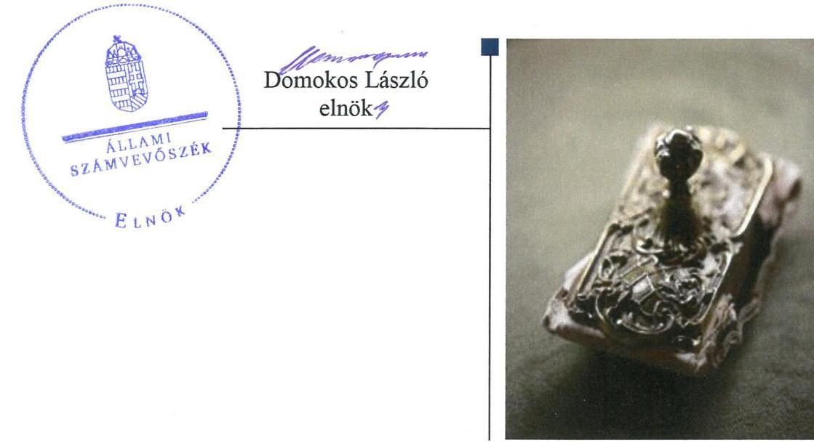
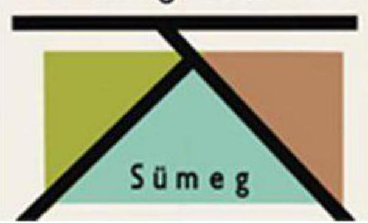

# Jelentés 

## Az önkormányzatok gazdasági társaságai

Az önkormányzatok többségi tulajdonában lévő gazdasági társaságok gazdálkodásának ellenőrzése - Sümegi Közszolgáltató Kft. 2018.

---

# Jelentés 

## Az önkormányzatok gazdasági társaságai

Az önkormányzatok többségi tulajdonában lévő gazdasági társaságok gazdálkodásának ellenőrzése - Sümegi Közszolgáltató Kft.
2018. 08. hó 08. nap

---

# AZ ELLENŐRZÉST FELÜGYELTE:

- **KLINGA LÁSZLÓ** felügyeleti vezető
- **AZ ELLENŐRZÉST VEZETTE ÉS A VÉGREHAJTÁSÁÉRT FELELŐS:**
- **MODER BEATRIX** ellenőrzésvezető
- **A PROGRAM ÖSSZEÁLLÍTÁSÁÉRT FELELŐS:**
- **TÓTPÁL SZABOLCS** osztályvezető
- **IKTATÓSZÁM:** EL-0233-038/2018
- **TÉMASZÁM:** 2447
- **ELLENŐRZÉS-AZONOSÍTÓ SZÁM:** V079391

Jelentéseink az Országgyűlés számítógépes hálózatán és az Interneten a www.asz.hu címen is olvashatóak.

---

# TARTALOMJEGYZÉK 

■ ÖSSZEGZÉS ..... 5
■ AZ ELLENŐRZÉS CÉLJA ..... 6
■ AZ ELLENŐRZÉS TERÜLETE ..... 7
■ AZ ELLENŐRZÉS HÁTTERE, INDOKOLTSÁGA ..... 8
■ A JELENTÉS LÉNYEGES KÉRDÉSKÖREI ..... 9
■ AZ ELLENŐRZÉS HATÓKÖRE ÉS MÓDSZEREI ..... 10
■ MEGÁLLAPÍTÁSOK ..... 12
■ JAVASLATOK ..... 15
■ MELLÉKLETEK ..... 17
I. sz. melléklet: Értelmező szótár ..... 17
■ FÜGGELÉK: ÉSZREVÉTELEK ..... 19
■ RÖVIDÍTÉSEK JEGYZÉKE ..... 21

---

.

---

# ÖSSZEGZÉS 

Sümeg Város Önkormányzatának a Sümegi Közszolgáltató Kft. feletti tulajdonosi joggyakorlása nem volt szabályszerű. A Társaság szabályozottsága megfelelt a jogszabályi előírásoknak, azonban gazdálkodása és vagyongazdálkodási tevékenysége nem volt szabályszerű, így az elszámoltathatóságot nem biztosította. A köztulajdonban álló gazdasági társaságok átláthatósági követelményei nem érvényesültek.

## Az ellenőrzés társadalmi indokoltsága

Magyarországon az intézmény-centrikus közfeladat-ellátás jellemző, de egyre jelentősebb a költségvetésen kívüli feladatellátás térnyerése. Helyi szinten ennek legfontosabb szereplői az önkormányzati tulajdonban lévő gazdasági társaságok, amelyeknek ellenőrzése kiemelten fontos a közfeladat ellátása és a közvagyon megőrzése, megóvása érdekében. Ezért alapvető követelmény, hogy a társaságok gazdálkodása, működése szabályszerű és átlátható legyen. Az ellenőrzés rendet, a rend értéket teremt.

A Sümegi Közszolgáltató Kft.-vel az ellátott feladatain keresztül a város lakosságának széles köre került kapcsolatba.

## Főbb megállapítások, következtetések

Az Önkormányzat a Társaság feletti tulajdonosi jogait nem gyakorolta szabályszerűen. Az Alapító a 2016. évben a jogszabályi előírások ellenére felügyelő bizottság működtetéséről nem gondoskodott, illetve a 2013-2015. években az FB a jogszabályban és Alapító okirat ${ }_{1-2}$-ben előírt feladatait nem látta el, ezért az Alapító a Társaság 2013-2016. évi beszámolóit írásos FB vélemények hiányában fogadta el. Az Alapító a jogszabályi kötelezettsége ellenére a javadalmazási, juttatási rendszerről szabályzatot nem alkotott.

A Társaság a pénzügyi-számviteli feladatellátás szabályait kialakította, megteremtve ezzel a szabályszerű könyvvezetés feltételeit. A ráfordítások elszámolása megfelelt a jogszabályi előírásoknak. A bevételek elszámolása azonban nem volt szabályszerű, mert a Társaság által kiszámlázott bevételek összegét bizonylattal nem támasztották alá.

A Társaság vagyongazdálkodása nem volt szabályszerű, mert a vagyon nyilvántartása, a mérleg leltári alátámasztása nem felelt meg a jogszabályi előírásoknak, így a 2013-2016. évek között a beszámoló mérlegének valódiságát nem biztosította.

A Társaság a közzététel rendjét szabályzatban nem rögzítette, a jogszabályokban előírt közzétételi kötelezettségét nem teljesítette, a gazdálkodás átláthatóságát nem biztosította.

A megállapítások alapján az Állami Számvevőszék a Sümegi Közszolgáltató Kft. ügyvezetőjének hét, Sümeg Város polgármesterének három javaslatot fogalmazott meg.

---

# AZ ELLENŐRZÉS CÉLJA 

AZ ELLENŐRZÉS CÉLJA annak értékelése volt, hogy az Önkormányzat vagyongazdálkodási tevékenysége során szabályszerűen gyakorolta-e a tulajdonosi jogait. A Társaság szabályozottsága, gazdálkodása és vagyongazdálkodási tevékenysége, bevételeinek és ráfordításainak elszámolása megfelelt-e a jogszabályi és tulajdonosi előírásoknak, a gazdasági társaság kötelezettségállománya jelentett-e kockázatot a működésére, valamint a gazdálkodás átláthatósága és elszámoltathatósága érdekében biztosítva volt-e a szolgáltatás díjának megalapozottsága szabályszerű önköltségszámítással.

---

# AZ ELLENŐRZÉS TERÜLETE 

## Sümeg Város Önkormányzata és a kizárólagos tulajdonában lévő Sümegi Közszolgáltató Kft.

## Közszolgáltató Kft.

SÜMEG VÁROS ÖNKORMÁNYZATA a kizárólagos tulajdonában lévő Sümegi Közszolgáltató Korlátolt Felelősségű Társaságot 1997. január 1-jén alapította, a Sümegi Közszolgáltató Vállalat jogutódjaként.

A jegyzett tőke összege az alapításkor 8,0 M Ft volt, amelyet 2002-ben 12,0 M Ft-ra, majd 2014-ben 17,0 M Ft-ra emeltek.

Az ellenőrzött időszakban a Társaság ${ }^{1}$ feladata volt az Önkormányzat² fenntartásában működő intézmények hőleadó központjainak zavartalan működését biztosító karbantartási munkák elvégzése. A Keretmegállapodásban ${ }^{3}$ foglaltak alapján feladatai közé tartozott továbbá a Mötv. ${ }^{4}$-ben meghatározott közfeladatok közül az Önkormányzat tulajdonában lévő lakások és nem lakás célú helyiségek bérbeadói jogainak gyakorlása, az önkormányzati ingatlanok eseti felújítása és karbantartása, valamint közterületek fenntartása.

A Társaság az ellenőrzött időszakban a feladatok ellátását saját vagyonával biztosította, vagyonkezelésbe vett vagyonnal nem rendelkezett, önkormányzati támogatásban nem részesült.

A Társaság az ellenőrzött években gazdálkodása során pozitív eredményeket ért el, amelyeket a 2014. év kivételével eredménytartalékba helyezett, így a saját tőke összege a 2013. évi 61,4 M Ft-ról a 2016. év végére 69,7 M Ft-ra emelkedett. A 2014. évben az Alapító ${ }^{5} 15,0$ M Ft osztalék kifizetéséről döntött.

A foglalkoztatottak átlagos statisztikai létszáma a 2013. évi 17 főről a 2016. év végére 41,2%-kal 24 főre emelkedett.

Az éves beszámolók adatai alapján a Társaság - 0,7 M Ft pénzbeli hozzájárulással - 10%-os tulajdonosi részesedéssel rendelkezett az NHSZ Sümeg Nonprofit Kft. ${ }^{6}$-ben.

A Társaság a 2013-2016. években nem minősült kormányzati szektorba sorolt szervezetnek, továbbá a Számv. tv. ${ }^{7}$ előírásai alapján önköltségszámítási szabályzat készítésére, valamint könyvvizsgálatra nem volt kötelezett.

Az ellenőrzött időszakban a jegyző ${ }^{8}$ és a Társaság ügyvezetőjének ${ }^{9}$ személyében változás nem történt, a polgármester ${ }^{10}$ személye 2014. október 22-étől változott.

---

# AZ ELLENŐRZÉS HÁTTERE, INDOKOLTSÁGA 

AZ ÖNKORMÁNYZATOK TÖBBSÉGI TULAJDONÁBAN ÁLLÓ GAZDASÁGI TÁRSASÁGOK ellenőrzése kiemelten fontos a vagyon megőrzése, megóvása érdekében. Alapvető követelmény, hogy gazdálkodásuk, működésük szabályszerű, és az általuk szolgáltatott adatok megbízhatóak legyenek. A feladatellátás költségeinek, ráfordításainak alakulása a lakosság széles rétegét érinti.

Az ÁSZ ${ }^{11}$ ellenőrzései feltárhatják, hogy az önkormányzat a feladatellátásához rendelt vagyon működtetését a tulajdonostól elvárható gondossággal végezte-e, a feladatot ellátó gazdasági társasággal a létesítő okiratban, szolgáltatási szerződésben foglaltakat betartatta-e, a társaság betartotta-e.

Az ellenőrzés rávilágíthat arra, hogy a gazdasági társaság a vagyon használatával biztosította-e a szolgáltatás folytatásának feltételeit, az önkormányzat tulajdonosi felügyelete hozzájárult-e a szabályszerű gazdálkodáshoz és feladatellátáshoz. A megállapítások alapján megfogalmazott számvevőszéki javaslatok hasznosítása elősegítheti a meglévő hibák megszüntetését. A jó gyakorlatok bemutatásával az ÁSZ hozzájárulhat a követendő megoldások megismertetéséhez, terjesztéséhez.

---

# A JELENTÉS LÉNYEGES KÉRDÉSKÖREI 

1. Az Önkormányzat tulajdonosi joggyakorlása szabályszerű volt-e?
2. A Társaság szabályozottsága, gazdálkodása és vagyongazdálkodási tevékenysége szabályszerű volt-e?

---

# AZ ELLENŐRZÉS HATÓKÖRE ÉS MÓDSZEREI 

## Az ellenőrzés típusa

Megfelelőségi ellenőrzés.

## Az ellenőrzött időszak

Az ellenőrzött időszak 2013. január 1-jétől 2016. december 31-ig tartott.

## Az ellenőrzés tárgya

Sümeg Város Önkormányzata kizárólagos tulajdonában lévő Sümegi Közszolgáltató Kft. feletti tulajdonosi joggyakorlása, valamint a Sümegi Közszolgáltató Kft. gazdálkodásának szabályozottsága és szabályszerűsége.

Az ellenőrzés kiterjed minden olyan körülményre és adatra, amely az ÁSZ jogszabályban meghatározott feladatainak teljesítéséhez, valamint a program végrehajtása folyamán felmerült újabb összefüggések feltárásához szükséges.

## Az ellenőrzött szervezet

- Sümeg Város Önkormányzata
- Sümegi Közszolgáltató Kft.

## Az ellenőrzés jogalapja

Az ellenőrzés jogszabályi alapját az ÁSZ tv. ${ }^{12}$ 1. § (3) bekezdése és 5. § (3)-(4)-(5) bekezdései képezték.

## Az ellenőrzés módszerei

Az ellenőrzést a nemzetközi standardokat irányadónak tekintve az ellenőrzési program ellenőrzési kérdései, az ellenőrzött időszakban hatályos jogszabályok, az ellenőrzés szakmai szabályok és módszertanok figyelembe vételével végeztük.

Az ellenőrzés ideje alatt az ellenőrzött szervezettel történő kapcsolattartást az ÁSZ Szervezeti és Működési Szabályzatának vonatkozó előírásai alapján biztosítottuk.

---

Az ellenőrzési kérdések megválaszolásához szükséges bizonyítékok megszerzése a következő ellenőrzési eljárások alkalmazásával történt: megfigyelés, kérdésfeltevés (információkérés), összehasonlítás, valamint elemzés. Az ellenőrzési bizonyítékként felhasználható adatforrások közé tartoznak egyrészt az ellenőrzési programban felsorolt adatforrások, másrészt adatforrás minden - az ellenőrzés során - feltárt, az ellenőrzés szempontjából információkat tartalmazó dokumentum.

Az ellenőrzést a kérdésekre adott válaszok kiértékelésével, valamint a megjelölt adatforrások, a csatolt tanúsítványok felhasználásával, továbbá az adott időszakban hatályos jogszabályok figyelembe vételével folytattuk le.

A bevételek és ráfordítások elszámolása, valamint a vagyonnyilvántartás terén a szabályszerű működést véletlen mintavétellel és irányított kiválasztással ellenőriztük. A jogszabályoknak és a belső előírásoknak megfelelőnek, azaz szabályszerűnek tekintettük az adott területet, amennyiben a minta ellenőrzésének eredménye alapján 95%-os bizonyossággal a teljes sokaságban a hibaarány kisebb volt, mint 10%, nem megfelelőnek értékeltük, ha a hibaarány a 10%-ot meghaladta. A ráfordítások elszámolására és a vagyonnyilvántartásra vonatkozó véletlen mintavételt kockázati alapú kiválasztással egészítettük ki, amelynek során évente a három legnagyobb összegű tételt választottuk ki.

---

# 1. Az Önkormányzat tulajdonosi joggyakorlása szabályszerű volt-e? 

Összegző megállapítás

A Társaság feletti tulajdonosi jogok gyakorlása nem volt szabályszerű.

A TULAJDONOSI JOGGYAKORLÁS SZABÁLYAIT az Önkormányzat a Vagyonrendelet ${ }^{13}$-ben és az Alapító okirat ${ }_{1-2}{ }^{14}$-ben - a Gt. ${ }^{15}$ és a Ptk. ${ }^{16}$ előírásaival összhangban - határozta meg.

Az Alapító okirat ${ }_{1-2}$-ben meghatározták a Társaság által végezhető tevékenységek körét, az Alapító hatáskörébe utalt feladatokat, és a 2013-2015 években - a Taktv. ${ }^{17}$ előírásaival összhangban - három tagból álló FB${ }^{18}$ létrehozásáról rendelkeztek. Az Alapító az FB-t 2016. január 28-ai hatállyal - alapítói határozattal - megszüntette, ezt követően a Taktv. 4. § (1) bekezdésében előírtakkal ellentétben az FB kötelező létrehozásáról nem gondoskodott.

Az Alapító a Taktv. 5. § (3) bekezdésében előírt kötelezettsége ellenére a vezető tisztségviselők, FB tagok, valamint az Mt. 208. §-ának hatálya alá eső munkavállalók javadalmazása, valamint a jogviszony megszűnése esetére biztosított juttatások módjának, mértékének elveiről, annak rendszeréről szabályzatot nem alkotott.

A TULAJDONOSI JOGOKAT a Társaság felett az Alapító nem gyakorolta szabályszerűen, a tulajdonosi kontrollt nem érvényesítette. A 2013-2015. években az FB az Alapító okirat ${ }_{1-2}$ 14. pontjában, illetve 2014. március 14-ig a Gt. 33. § (1) bekezdésében, 2014. március 15-től a Ptk. 3:26. § (1) bekezdésében és a Ptk. 3:27. § (1) bekezdésben foglalt feladatait nem látta el. Az Alapító a Gt. 35. §. (3) bekezdésében és a Ptk. 3:120. § (2) bekezdésében előírtak ellenére a Társaság 2013-2016. évi beszámolóit az FB írásbeli jelentésének hiányában fogadta el.

A Társaság által ellátott - önkormányzati tulajdonú lakások és nem lakás célú helyiségek hasznosításával kapcsolatos - közfeladatra vonatkozó rendeletalkotási és díj megállapítási kötelezettségének az Önkormányzat - a Lakás tv. ${ }^{19}$ előírásainak megfelelően - eleget tett.

---

# 2. A Társaság szabályozottsága, gazdálkodása és vagyongazdálkodási tevékenysége szabályszerű volt-e? 

Összegző megállapítás

### 2.1. számú megállapítás

A Társaság szabályozottsága megfelelt a jogszabályi előírásoknak, azonban a gazdálkodási és vagyongazdálkodási tevékenysége nem volt szabályszerű.
A Társaság gazdálkodásának szabályozottsága és a ráfordítások elszámolása megfelelt a jogszabályi előírásoknak, a bevételek elszámolása azonban nem volt szabályszerű.

A SZÁMVITELI SZABÁLYZATOK elkészítéséről - Számv. tv. előírásainak megfelelően - gondoskodtak. Elkészítették a Társaság sajátosságainak megfelelő Számviteli politikát ${ }^{20}$, Leltározási szabályzatot ${ }^{21}$, Értékelési szabályzatot ${ }^{22}$, valamint Pénzkezelési szabályzatot ${ }^{23}$. A Társaság rendelkezett a Számv. tv.-ben előírt tartalmi követelményeknek megfelelő Számlarenddel ${ }^{24}$, és az abban foglaltakat alátámasztó Bizonylati renddel ${ }^{25}$.

A BEVÉTELEK elszámolása nem volt szabályszerű, mivel a kiszámlázott bevételek összegét a Számv.
 tv. 165. § (1)-(2) bekezdéseiben foglaltak ellenére bizonylatok – szerződés, megállapodás – nem támasztották alá.

A ráfordítások elszámolása megfelelt a Számv. tv. előírásainak, a ráfordításokat az elszámolást alátámasztó bizonylatok alapján, a megfelelő főkönyvi számlákra szabályosan számolták el. A személyi jellegű ráfordítások elszámolását szabályos munkaszerződések alapozták meg, a számfejtett bruttó bér összege megfelelt a szerződésekben foglaltaknak.
2.2. számú megállapítás

A Társaság vagyongazdálkodása nem felelt meg a jogszabályi előírásoknak.

A vagyon nyilvántartása és az értékcsökkenés elszámolása nem volt szabályszerű, mivel a Számv. tv. 52. § (2) bekezdésében előírtak ellenére a tárgyi eszközök üzembe helyezését, ennek keretében az eszközök rendeltetésszerű hasznosításának kezdő időpontját hitelt érdemlő módon nem dokumentálták.

A Társaság a 2013. évi mérlegében 17,0 M Ft jegyzett tőkét, és -5,0 M Ft jegyzett, de még be nem fizetett tőkét szerepeltetett, annak ellenére, hogy az Alapító a Társaság törzstőkéjét a beszámoló készítését követően, 2014. március 21.-i hatállyal emelte 17,0 M Ft-ra. A Társaság a Számv. tv. 35. § (4) bekezdésében foglaltak ellenére a jegyzett tőke változását nem a cégjegyzésbe való bejegyzés alapján, a bejegyzés időpontjával rögzítette a könyvviteli nyilvántartásában, így a 2013. évi beszámoló a Számv. tv. 4. § (2) bekezdésében előírtak ellenére a Társaság jegyzett tőkéjéről nem a valós képet mutatta.

A számviteli beszámoló mérlegét az ellenőrzött években a Számv. tv. 69. § (1) bekezdésében előírtak ellenére leltárral nem támasztották alá. A 2013. évi beszámolóhoz kapcsolódó könyvvizsgálói

---

mulasztás okán az ÁSZ elévülés miatt nem tesz értesítést az érintett szervezet felé.
2.3. számú megállapítás

A Társaság az éves beszámolási feladatait nem szabályszerűen teljesítette. A közzétételi kötelezettségének nem tett eleget, a közérdekű adatok nyilvánosságát nem biztosította.

A Társaság a 2013-2014. évi beszámolókat a Számv. tv. 153. § (1) bekezdésében foglaltak ellenére az Alapító jóváhagyását megelőzően, az adózott eredmény felhasználására vonatkozó határozat nélkül helyezte letétbe. A 2015-2016. évi beszámolók közzététele és letétbe helyezése, a Számv. tv. előírásaival összhangban, az Alapítói jóváhagyást követően történt.

A közérdekű adatok közzétételének részletes szabályait a Társaság az Infotv. ${ }^{16} 35 . \S$ (3) bekezdésében foglalt előírások ellenére belső szabályzatban nem határozta meg.

A Társaság az Infotv. 37. § (1) bekezdésében előírtak ellenére – az éves beszámolók kivételével – nem tette közzé az 1. sz. melléklet szerinti közzétételi listák adatait. Nem tett eleget továbbá a Taktv. 2. § (1) bekezdésében előírt közzétételi kötelezettségének.

---

# JAVASLATOK 

Az ÁSZ tv. 33. § (1) bekezdésében foglaltak értelmében az ellenőrzött szervezet vezetője köteles a jelentésben foglalt megállapításokhoz kapcsolódó intézkedési tervet összeállítani és azt a jelentés kézhezvételétől számított 30 napon belül az ÁSZ részére megküldeni. Amennyiben az ellenőrzött szervezet vezetője nem küldi meg határidőben az intézkedési tervet, vagy továbbra sem elfogadható intézkedési tervet küld, az Állami Számvevőszék elnöke az ÁSZ tv. 33. § (3) bekezdése a) és b) pontjaiban foglaltakat érvényesítheti.

## Sümegi Közszolgáltató Kft. ügyvezetőjének

1. Intézkedjen a kiszámlázott bevételek összegének bizonylattal történő alátámasztásáról a Számv. tv.-ben előírtaknak megfelelően.
(2.1. sz. megállapítás 2. bekezdése alapján)
2. Intézkedjen az értékcsökkenés szabályszerű elszámolása érdekében a tárgyi eszközök üzembe helyezésének a Számv. tv.-ben előírtaknak megfelelő, hitelt érdemlő módon történő dokumentálásáról.
(2.2. sz. megállapítás 1. bekezdése alapján)
3. Intézkedjen a beszámoló mérleg tételeinek alátámasztásához a Számv. tv.-ben előírtaknak megfelelő leltár összeállításáról.
(2.2. sz. megállapítás 3. bekezdése alapján)
4. Intézkedjen a tárgyi eszközök leltározási szabályzatban rögzített, folyamatos leltározás módszerével történő mennyiségi leltározásának meghatározott időtartamon belüli elvégzéséről.
(2.2. sz. megállapítás 3. bekezdése alapján)
5. Intézkedjen az Infotv.-ben előírt kötelezettség teljesítés részletes szabályainak belső szabályzatban történő megállapításáról.
(2.3. sz. megállapítás 2. bekezdése alapján )
6. Intézkedjen az Infotv.-ben előírt közzétételi kötelezettség teljes körű teljesítéséről.
(2.3. sz. megállapítás 3. bekezdés 1. mondata alapján )
7. Gondoskodjon a Taktv.-ben előírt közzétételi kötelezettség teljesítéséről.
(2.3. sz. megállapítás 3. bekezdés 2. mondata alapján)

---

# Sümeg Város Önkormányzata polgármesterének 

1. Kezdeményezze, hogy az Alapító a Taktv. előírásainak megfelelően hozza létre a felügyelő bizottságot.
(1. sz. megállapítás 2. bekezdés 2. mondata alapján)
2. Kezdeményezze az Alapítónál a Taktv.-ben előírt, a Társaság vezető tisztségviselői, a felügyelő bizottsági tagok, valamint az Mt. 208. §-ának hatálya alá eső munkavállalók javadalmazása, valamint a jogviszony megszünése esetére biztosított juttatások módjának, mértékének elveire, annak rendszerére vonatkozó szabályzat megalkotását.
(1. sz. megállapítás 3. bekezdése alapján)
3. Intézkedjen arról, hogy az Alapító a Társaság éves beszámolójáról a felügyelő bizottság írásbeli jelentésének birtokában döntsön a Ptk. előírásainak megfelelően.
(1. sz. megállapítás 4. bekezdés 3. mondata alapján)

---

# MELLÉKLETEK 

- I. SZ. MELLÉKLET: ÉRTELMEZŐ SZÓTÁR
belső ellenőrzés
gazdasági társaság
kormányzati szektorba sorolt egyéb szervezet
tulajdonosi joggyakorló
vagyongazdálkodás

Független, tárgyilagos bizonyosságot adó és tanácsadó tevékenység, amelynek célja, hogy az ellenőrzött szervezet működését fejlessze és eredményességét növelje, az ellenőrzött szervezet céljai elérése érdekében rendszerszemléletű megközelítéssel és módszeresen értékeli, illetve fejleszti az ellenőrzött szervezet irányítási és belső kontrollrendszerének hatékonyságát. (Forrás: Bkr. ${ }^{27}$ 2. § b) pontja) Ptk. 3:88. § (1) bekezdése szerint „a gazdasági társaságok üzletszerű közös gazdasági tevékenység folytatására, a tagok vagyoni hozzájárulásával létrehozott, jogi személyiséggel rendelkező vállalkozások, amelyekben a tagok a nyereségből közösen részesednek, és a veszteséget közösen viselik".
Az Áht. ${ }^{28}$ 1. § 12. pontja értelmében az a szervezet, amely az Áht. alapján nem része az államháztartásnak, azonban az Európai Közösséget létrehozó szerződéshez csatolt, a túlzott hiány esetén követendő eljárásról szóló jegyzőkönyv alkalmazásáról szóló 2009. május 25-i 479/2009/EK rendelet szerint a kormányzati szektorba tartozik és a szervezet megnevezését az államháztartásért felelős miniszter a Hivatalos Értesítőben és a Kormány honlapján közzétette.
Aki a nemzeti vagyon felett az államot vagy a helyi önkormányzatot megillető tulajdonosi jogok és kötelezettségek összességének gyakorlására jogosult. (Forrás: Nvtv. ${ }^{29}$ 3. § (1) bekezdés 17. pontja)
A nemzeti vagyongazdálkodás feladata a nemzeti vagyon rendeltetésének megfelelő, az állam, az önkormányzat mindenkori teherbíró képességéhez igazodó, elsődlegesen a közfeladatok ellátásához és a mindenkori társadalmi szükségletek kielégítéséhez szükséges, egységes elveken alapuló, átlátható, hatékony és költségtakarékos működtetése, értékének megőrzése, állagának védelme, értéknövelő használata, hasznosítása, gyarapítása, továbbá az állam vagy a helyi önkormányzat feladatának ellátása szempontjából feleslegessé váló vagyontárgyak elidegenítése. (Forrás: Nvtv. 7. § (2) bekezdése)

---

.

---

# FÜGGELÉK: ÉSZREVÉTELEK 

A jelentéstervezetet a Számvevőszék 15 napos észrevételezésre megküldte az ellenőrzött szervezetek vezetőinek az ÁSZ tv. 29. §*(1) bekezdése előírásának megfelelően.

Az ellenőrzött szervezetek vezetői az ÁSZ. tv. 29. § (2) bekezdésében foglalt észrevételezési jogukkal nem éltek, a jelentéstervezetre észrevételt nem tettek.

[^0]
[^0]:    * 29. § (1) Az Állami Számvevőszék az ellenőrzési megállapításait megküldi az ellenőrzött szervezet vezetőjének vagy az általa megbízott személynek, és annak, akinek személyes felelősségét állapította meg.
    (2) Az ellenőrzött szervezet vezetője és a felelősként megjelölt személy az ellenőrzés megállapításaira tizenöt napon belül írásban észrevételt tehet.
    (3) Az Állami Számvevőszék az észrevételre a beérkezésétől számított harminc napon belül írásban válaszol. A figyelembe nem vett észrevételeket köteles a jelentésben feltüntetni, és megindokolni, hogy azokat miért nem fogadta el.

---

.

---

# RÖVIDÍTÉSEK JEGYZÉKE 

${ }^{1}$ Társaság
${ }^{2}$ Önkormányzat
${ }^{3}$ Keretmegállapodás
${ }^{4}$ Mötv.
${ }^{5}$ Alapító
${ }^{6}$ NHSZ Sümeg Nonprofit Kft.
${ }^{7}$ Számv. tv.
${ }^{8}$ jegyző
${ }^{9}$ ügyvezető
${ }^{10}$ polgármester
${ }^{11}$ ÁSZ
${ }^{12}$ ÁSZ tv.
${ }^{13}$ Vagyonrendelet
${ }^{14}$ Alapító okirat ${ }_{1-2}$
${ }^{15}$ Gt.
${ }^{16}$ Ptk.
${ }^{17}$ Taktv.
${ }^{18} \mathrm{FB}$
${ }^{19}$ Lakás tv.
${ }^{20}$ Számviteli politika
${ }^{21}$ Leltározási szabályzat
${ }^{22}$ Értékelési szabályzat
${ }^{23}$ Pénzkezelési szabályzat
${ }^{24}$ Számlarend
${ }^{25}$ Bizonylati rend
${ }^{26}$ Infotv.

Sümegi Közszolgáltató Korlátolt Felelősségű Társaság
Sümeg Város Önkormányzata
Sümeg Város Önkormányzata Képviselő-testületének 139/2009. (IV. 28.) önkormányzati határozatával elfogadott Keretmegállapodás (hatályos 2009. április 29-től)
2011. évi CLXXXIX. törvény Magyarország helyi önkormányzatairól (hatályos 2012. január 1-jétől) Sümeg Város Önkormányzata, mint a Sümegi Közszolgáltató Korlátolt Felelősségű Társaság legfőbb szerve
A társaság neve 2007. augusztus 24-ig Otto-97. Környezetvédelmi Kft., 2014. március 12-ig Remondis Sümeg Kft, 2014. június 30-ig NHSZ Sümeg Kft., 2014. július 1-je óta NHSZ Sümeg Nonprofit Kft.
2000. évi C. törvény a számvitelről (hatályos 2001. január 1-jétől)

Sümegi Közös Önkormányzati Hivatal jegyzője
Sümegi Közszolgáltató Kft. ügyvezetője
Sümeg Város Önkormányzat polgármestere
Állami Számvevőszék
2011. évi LXVI. törvény az Állami Számvevőszékről (hatályos 2011. július 1-jétől)

Sümeg Város Önkormányzat Képviselő-testületének 17/2012. (VI. 29.); 12/2013. (VI. 28.); 1/2014. (I. 31); 8/2014. (VIII. 29.); 12/2014. (IX. 26.); 5/2015. (III. 27.); 11/2015. (IX. 25.); 4/2016. (II. 26.); 11/2016. (V. 2.) rendeletekkel módosított 6/2012. (II. 24.) önkormányzati rendelete az Önkormányzati vagyon használatáról, hasznosításáról, és forgalmának rendjéről (hatályos 2012. február 24-től)
Alapító okirat1: Sümegi Közszolgáltató Kft. 2013. január 30-án kelt Alapító okirata módosításokkal egységes szerkezetben (hatályos 2014. április 8-ig)
Alapító okirat2: Sümegi Közszolgáltató Kft. 2014. április 9-én kelt Alapító okirata módosításokkal egységes szerkezetben (hatályos 2014. április 9-től)
2006. évi IV. törvény a gazdasági társaságokról (hatályos 2014. március 14-ig)
2013. évi V. törvény a Polgári Törvénykönyvről (hatályos 2014. március 15-étől)
2009. CXXII. törvény a köztulajdonban álló gazdasági társaságok takarékosabb működéséről (hatályos 2009. október 3-től)
Sümegi Közszolgáltató Kft. felügyelő-bizottsága
1993. évi LXXVIII. törvény a lakások és helyiségek bérletére, valamint az elidegenítésükre vonatkozó egyes szabályokról
Sümegi Közszolgáltató Kft. Számviteli Politika (hatályos 2001. január 1-jétől, módosítva 2002. február 1-jén, 2005. augusztus 2-án, 2016. január 1-jén)
Sümegi Közszolgáltató Kft. Leltározási szabályzat (hatályos 2001. január 1-jétől, módosítva 2010. január 1-jén)
Sümegi Közszolgáltató Kft. Eszközök és források értékelési szabályzata (hatályos 2001. január 1-jétől, módosítva 2016. január 13-án)
Sümegi Közszolgáltató Kft. Pénzkezelési szabályzat (hatályos 2008. július 1-jétől, módosítva 2009. február 23-án, 2012. január 1-jén, 2012. december 1-jén, 2013. január 1-jén)

Sümegi Közszolgáltató Kft. Számlarend (hatályos 2012. január 1-jétől)
Sümegi Közszolgáltató Kft. Bizonylati rend és szabályzat (hatályos 2008. július 1-jétől)
2011. évi CXII. törvény az információs önrendelkezési jogról és az információszabadságról (hatályos 2011. július 27-től)

---

${ }^{27}$ Bkr.
${ }^{28}$ Áht.
${ }^{29}$ Nvtv. 370/2011. (XII. 31.) Korm. rendelet a költségvetési szervek belső kontrollrendszeréről és belső ellenőrzéséről (hatályos 2012. január 1-jétől)
2011. évi CXCV. törvény az államháztartásról (hatályos 2012. január 1-jétől)
2011. évi CXCVI. törvény a nemzeti vagyonról (hatályos 2012. január 1-jétől)

---

# ÁLLAMI SZÁMVEVŐSZÉK 

1052 Budapest, Apáczai Csere János utca 10.
Levélcím: 1364 Budapest 4. Pf. 54
Telefon: +36 14849100 Telefax: +36 14849200
www.asz.hu
