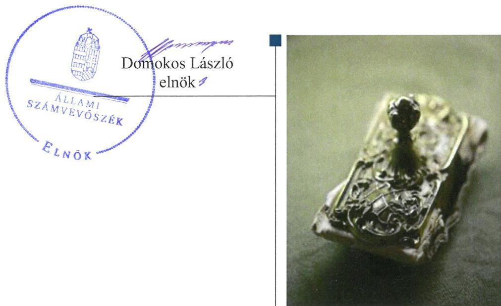
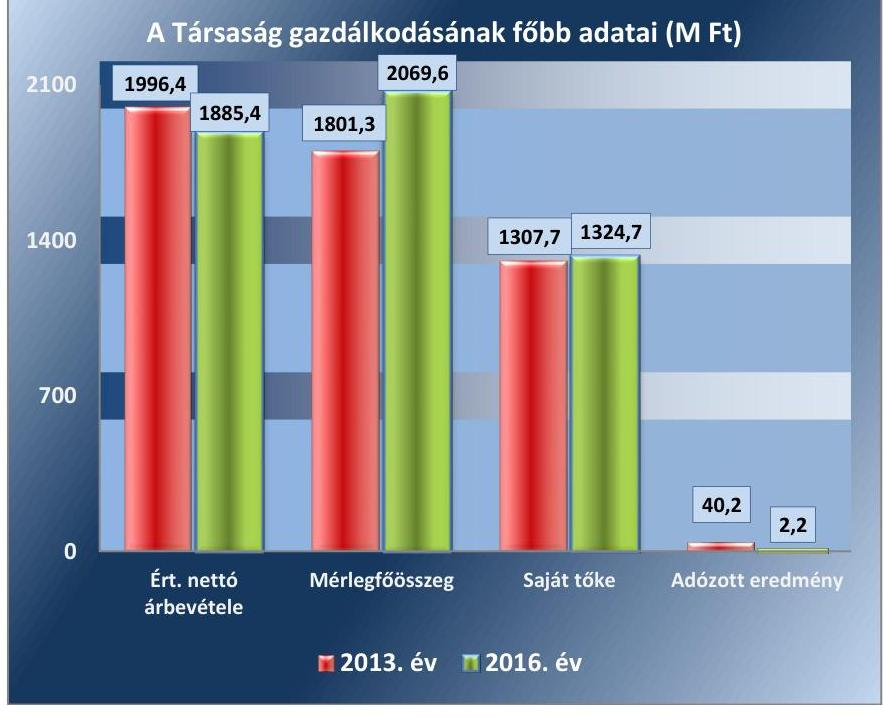
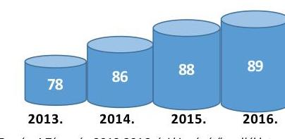
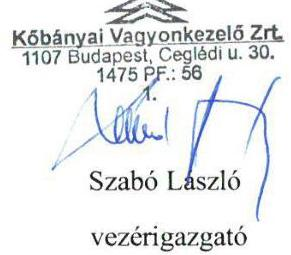
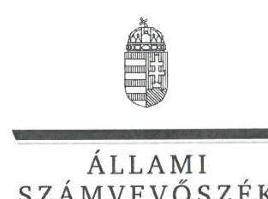
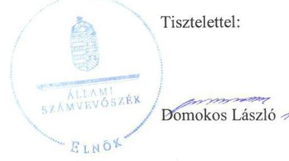
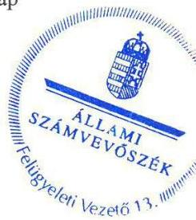
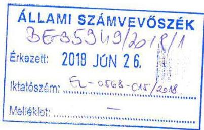
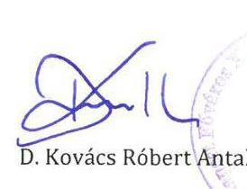

# Jelentés 

## Az önkormányzatok gazdasági társaságai

Az önkormányzatok többségi tulajdonában lévő gazdasági társaságok gazdálkodásának ellenőrzése - Kőbányai Vagyonkezelő Zrt. 2018.

---

# J elentés 

## Az önkormányzatok gazdasági társaságai

Az önkormányzatok többségi tulajdonában lévő gazdasági társaságok gazdálkodásának ellenőrzése - Kőbányai Vagyonkezelő Zrt.
2018. 08. hó 08. nap

---

# AZ ELLENŐRZÉST FELÜGYELTE:

- **KLINGA LÁSZLÓ** felügyeleti vezető
- **AZ ELLENŐRZÉST VEZETTE ÉS A VÉGREHAJTÁSÁÉRT FELELŐS:**
- **MODER BEATRIX** ellenőrzésvezető
- **A PROGRAM ÖSSZEÁLLÍTÁSÁÉRT FELELŐS:**
- **TÓTPÁL SZABOLCS** osztályvezető
- **IKTATÓSZÁM:** EL-0122-040/2018
- **TÉMASZÁM:** 2447
- **ELLENŐRZÉS-AZONOSÍTÓ SZÁM:** V079312

Jelentéseink az Országgyűlés számítógépes hálózatán és az Interneta a www.asz.hu címen is olvashatóak.

---

# TARTALOMJEGYZÉK 

■ ÖSSZEGZÉS ..... 5
■ AZ ELLENŐRZÉS CÉLJA ..... 6
■ AZ ELLENŐRZÉS TERÜLETE ..... 7
■ AZ ELLENŐRZÉS HÁTTERE, INDOKOLTSÁGA ..... 9
■ A JELENTÉS LÉNYEGES KÉRDÉSKÖREI ..... 10
■ AZ ELLENŐRZÉS HATÓKÖRE ÉS MÓDSZEREI ..... 11
■ MEGÁLLAPÍTÁSOK ..... 13
■ JAVASLATOK ..... 16
■ MELLÉKLETEK ..... 17
I. sz. melléklet: Értelmező szótár ..... 17
II. sz. melléklet: A Társaság főbb mérlegadatai a 2013-2016. években (M Ft) ..... 18
■ FÜGGELÉK: ÉSZREVÉTELEK ..... 19
■ RÖVIDÍTÉSEK JEGYZÉKE ..... 25

---

.

---

# ÖSSZEGZÉS 

A Kőbányai Vagyonkezelő Zrt. feletti tulajdonosi joggyakorlás kereteinek kialakításával és szabályszerű gyakorlásával Budapest Főváros X. kerület Kőbányai Önkormányzat megteremtette a Társaság szabályszerű, átlátható müködésének feltételeit. A Társaság szabályozottsága, gazdálkodása és vagyongazdálkodási tevékenysége megfelelt a jogszabályi előirásoknak, az elszámoltathatóságot és átláthatóságot biztositotta.

## Az ellenőrzés társadalmi indokoltsága

Magyarországon az intézmény-centrikus közfeladat-ellátás jellemző, de egyre jelentősebb a költségvetésen kívüli feladatellátás térnyerése. Helyi szinten ennek legfontosabb szereplői az önkormányzati tulajdonban lévő gazdasági társaságok, amelyeknek ellenőrzése kiemelten fontos a közfeladat ellátása és a közvagyon megőrzése, megóvása érdekében. Ezért alapvető követelmény, hogy a társaságok gazdálkodása, múködése szabályszerű és átlátható legyen. Az ellenőrzés rendet, a rend értéket teremt.

A Kőbányai Vagyonkezelő Zrt.-vel az ellátott feladatain keresztül a kerület lakosságának széles köre került kapcsolatba.

## Főbb megállapítások, következtetések

Az Önkormányzat a Társaság feletti tulajdonosi joggyakorlásának kereteit a jogszabályoknak megfelelően alakította ki, tulajdonosi jogait szabályszerűen gyakorolta, a Társaság feladatellátásához kapcsolódó rendeletalkotási, illetve díjmegállapítási kötelezettségnek eleget tett.

A Társaság a gazdálkodással kapcsolatos számviteli szabályozását kialakította, megteremtve ezzel a szabályszerű könyvvezetés feltételeit, azonban a Számlarend nem tartalmazta a jogszabályban előírt valamennyi tartalmi elemet. A bevételek, valamint a személyi jellegú és a kormányzati hiányt nem befolyásoló ráfordítások elszámolása szabályszerű volt.

A Társaság a vagyonával szabályszerűen gazdálkodott, a vagyon nyilvántartása és az értékcsökkenés elszámolása megfelelt a jogszabályi előírásoknak, valamint a mérlegben kimutatott eszközöket és forrásokat szabályszerű leltárral támasztotta alá.

A tervezési, beszámolási kötelezettségek teljesítése a jogszabályi előírásokkal és a tulajdonosi elvárásokkal összhangban történt.

A közérdekú adatok közzétételének kisebb hiányossága mellett a gazdálkodás nyilvánosságát biztosították, azonban a közzététel rendjét szabályzatban nem rögzítették.

A megállapítások alapján az Állami Számvevőszék a Kőbányai Vagyonkezelő Zrt. vezérigazgatójának 3 javaslatot fogalmazott meg.

---

# AZ ELLENŐRZÉS CÉLJA 

AZ ELLENŐRZÉS CÉLJA annak értékelése volt, hogy az Önkormányzat vagyongazdálkodási tevékenysége során szabályszerűen gyakorolta-e a tulajdonosi jogait. A Társaság szabályozottsága, gazdálkodása és vagyongazdálkodási tevékenysége, bevételeinek és ráfordításainak elszámolása megfelelt-e a jogszabályi és tulajdonosi előírásoknak. Értékeltük, hogy a gazdasági társaság kötelezettségállománya jelentett-e kockázatot a működésre, a gazdálkodás átláthatósága és elszámoltathatósága érdekében biztosítva volt-e a szolgáltatás dijának megalapozottsága szabályszerű önköltségszámítással, valamint a Társaság gazdálkodásának a kormányzati szektor hiányára és az államadósságra befolyással bíró elemei a jogszabályi előírásoknak megfeleltek-e.

---

# **A Z ELLENŐRZÉS TERŰLETE**

## **Budapest Főváros X. kerület Kőbányai Önkormányzat és a kizárólagos tulajdonában lévő Kőbányai Vagyonkezelő Zrt.**

### **Budapest Főváros X. kerület Kőbányai Önkormányzat**

A kizárólagos tulajdonában lévő Kőbányai Vagyonkezelő Zártkörűen Működő Részvénytársaságot 1992. december 31-én – a X. kerületi ingatlankezelő vállalat jogutódjaként – alapította, a jegyzett tőke alapításkori összege 135,0 M Ft volt.

A Társaságba1 2011. augusztus 7-én beolvadt a Kőbánya-Gergely Utca Ingatlanfejlesztő Kft., ezáltal a Társaság jegyzett tőkéje 1160 M Ft-ra emelkedett, amely az ellenőrzött időszakban nem változott.

A Társaság – az Mötv.2 13. § (1) bekezdése szerinti közfeladatként – ellátta az Önkormányzat3 tulajdonában lévő lakások, nem lakás céljára szolgáló helyiségek, intézmények, közterületek üzemeltetési, hasznosítási, karbantartási, felújítási, beruházási feladatait, valamint a parkolás üzemeltetéssel kapcsolatos feladatokat. Ezen túlmenően vállalkozási tevékenységként saját tulajdonú ingatlanok bérbeadását, mérnöki- műszaki ellenőri tevékenység ellátását, valamint társasházak részére kezelői, ügyviteli szolgáltatásokat végeztek.

A Társaság gazdálkodásának főbb adatait a 2013. és 2016. évek vonatkozásában az 1. ábra szemlélteti, a Társaság főbb mérlegadatait a 2013-2016. években a II. számú melléklet tartalmazza.

1. ábra

*Forrás a Társaság 2013. és 2016. évi beszámolói*

---

2. ábra

A foglalkoztatottak átlagos állományi létszáma (fő)

A Társaság vagyonkezelésbe vett vagyonnal az ellenőrzött években nem rendelkezett, saját vagyona mellett a feladat ellátásához szükséges eszközöket az Önkormányzat - Közszolgáltatási Keretszerződés ${ }_{1-4}{ }^{4}$ útján - üzemeltetésre ingyenesen bocsátotta rendelkezésére. A Társaság a Közszolgáltatási Keretszerződés ${ }_{1-4}$ szerinti feladatok ellátására az Önkormányzattól 2013-ban 1780,2 M Ft, 2014-ben 2193,6 M Ft, 2015-ben 2023,4 M Ft, 2016-ban 2033,6 M Ft bevételben részesült.

A Társaságnak az ellenőrzött években a Gst. ${ }^{5}$ szerinti adósságot keletkeztető ügylete nem volt. Az ellenőrzött években osztalékfizetés nem történt, az elért 0,2 M Ft és 40,2 M Ft közötti pozitív eredményeket eredménytartalékba helyezték, a saját tőke összege a 2013. évi 1307,7 M Ftról a 2016. év végére 1324,7 M Ft-ra emelkedett.

Az ellenőrzött időszakban a Társaság vezérigazgatójának ${ }^{6}$ és a polgármester ${ }^{7}$ személyében változás nem történt, a jegyző ${ }^{8}$ személye 2014. december 1-jétől változott.

A Társaság az NGM közlemények ${ }^{9}$ alapján 2015. december 30-ától kormányzati szektorba sorolt szervezetnek minősült.

---

# AZ ELLENŐRZÉS HÁTTERE, INDOKOLTSÁGA 

AZ ÖNKORMÁNYZATOK TÖBBSÉGI TULAJDONÁBAN ÁLLÓ GAZDASÁGI TÁRSASÁGOK ellenőrzése kiemelten fontos a vagyon megőrzése, megóvása érdekében. Alapvető követelmény, hogy gazdálkodásuk, múködésük szabályszerű, és az általuk szolgáltatott adatok megbízhatóak legyenek. A feladatellátás költségeinek, ráfordításainak alakulása a lakosság széles rétegét érinti.

Az ÁSZ ${ }^{10}$ ellenőrzései feltárhatják, hogy az önkormányzat a feladatellátásához rendelt vagyon múködtetését a tulajdonostól elvárható gondossággal végezte-e, a feladatot ellátó gazdasági társasággal a létesítő okiratban, szolgáltatási szerződésben foglaltakat betartatta-e, a társaság betartotta-e.

Az ellenőrzés eredményeképp meghatározhatóvá válnak a költségvetési hiányt befolyásoló szervezetek kockázatai, lehetővé válik ezen kockázatok csökkentése. Az ellenőrzés rávilágíthat arra, a hogy a gazdasági társaság a vagyon használatával biztosította-e a szolgáltatás folytatásának feltételeit, az önkormányzat tulajdonosi felügyelete hozzájárult-e a szabályszerű gazdálkodáshoz és feladatellátáshoz. A megállapítások alapján megfogalmazott számvevőszéki javaslatok hasznosítása elősegítheti a meglévő hibák megszüntetését. A jó gyakorlatok bemutatásával az ÁSZ hozzájárulhat a követendő megoldások megismertetéséhez, terjesztéséhez.

---

# A JELENTÉS LÉNYEGES KÉRDÉSKÖREI 

1.- Az Önkormányzat tulajdonosi joggyakorlása szabályszerű volt-e?
2.- A Társaság szabályozottsága, gazdálkodása és vagyongazdálkodási tevékenysége szabályszerű volt-e?

---

# AZ ELLENŐRZÉS HATÓKÖRE ÉS MÓDSZEREI 

## Az ellenőrzés típusa

Megfelelőségi ellenőrzés.

## Az ellenőrzött időszak

Az ellenőrzött időszak 2013. január 1-jétől 2016. december 31-ig tartott.

## Az ellenőrzés tárgya

Budapest Főváros X. kerület Kőbányai Önkormányzat kizárólagos tulajdonában lévő Kőbányai Vagyonkezelő Zrt. feletti tulajdonosi joggyakorlása, valamint a Kőbányai Vagyonkezelő Zrt. gazdálkodásának szabályozottsága és szabályszerűsége.

Az ellenőrzés kiterjed minden olyan körülményre és adatra, amely az ÁSZ jogszabályban meghatározott feladatainak teljesítéséhez, valamint a program végrehajtása folyamán felmerült újabb összefüggések feltárásához szükséges.

## Az ellenőrzött szervezet

Budapest Főváros X. kerület Kőbányai Önkormányzat
Kőbányai Vagyonkezelő Zrt.

## Az ellenőrzés jogalapja

Az ellenőrzés jogszabályi alapját az ÁSZ tv. ${ }^{11} 1 . \S$ (3) bekezdése és 5. § (3)-(4)-(5) bekezdései képezték.

## Az ellenőrzés módszerei

Az ellenőrzést a nemzetközi standardokat irányadónak tekintve az ellenőrzési program ellenőrzési kérdései, az ellenőrzött időszakban hatályos jogszabályok, az ellenőrzés szakmai szabályok és módszertanok figyelembe vételével végeztük.

Az ellenőrzés ideje alatt az ellenőrzött szervezettel történő kapcsolattartást az ÁSZ Szervezeti és Müködési Szabályzatának vonatkozó előírásai alapján biztosítottuk.

---

Az ellenőrzési kérdések megválaszolásához szükséges bizonyítékok megszerzése a következő ellenőrzési eljárások alkalmazásával történt: megfigyelés, kérdésfeltevés (információkérés), összehasonlítás, valamint elemzés. Az ellenőrzési bizonyítékként felhasználható adatforrások közé tartoznak egyrészt az ellenőrzési programban felsorolt adatforrások, másrészt adatforrás minden - az ellenőrzés során - feltárt, az ellenőrzés szempontjából információkat tartalmazó dokumentum.

Az ellenőrzést a kérdésekre adott válaszok kiértékelésével, valamint a megjelölt adatforrások, a csatolt tanúsítványok felhasználásával, továbbá az adott időszakban hatályos jogszabályok figyelembe vételével folytattuk le.

A bevételek és ráfordítások elszámolása, valamint a vagyonnyilvántartás terén a szabályszerű múködést véletlen mintavétellel és irányított kiválasztással ellenőriztük. A jogszabályoknak és a belső előírásoknak megfelelőnek, azaz szabályszerűnek tekintettük az adott területet, amennyiben a minta ellenőrzésének eredménye alapján 95\%-os bizonyossággal a teljes sokaságban a hibaarány kisebb volt, mint 10\%, nem megfelelőnek értékeltük, ha a hibaarány a 10\%-ot meghaladta. A ráfordítások elszámolására és a vagyonnyilvántartásra vonatkozó véletlen mintavételt kockázati alapú kiválasztással egészítettük ki, amelynek során évente a három legnagyobb összegű tételt választottuk ki.

---

# 1. Az Önkormányzat tulajdonosi joggyakorlása szabályszerű volt-e? 

Összegző megállapítás

A tulajdonosi joggyakorlás kereteinek kialakítása és a Társaság feletti tulajdonosi jogok gyakorlása szabályszerű volt.

## A TULAJDONOSI JOGGYAKORLÁS SZABÁLYAIT

az Önkormányzat a Vagyonrendelet ${ }^{12}$-ben határozta meg. A Létesítő okirat ${ }_{1-7}{ }^{13}$-ben - a Gt. ${ }^{14}$ és a Ptk. ${ }^{15}$ előírásaival összhangban - meghatározták az Alapító ${ }^{16}$ kizárólagos hatáskörébe tartozó feladatokat, valamint a Taktv. ${ }^{17}$ előírásával összhangban 2014. október 31-ig hat, ezt követően öt tagból álló $\mathrm{FB}^{18}$ létrehozásáról rendelkeztek. A Társaság az ellenőrzött években a Számv. tv. ${ }^{19}$-ben foglaltak alapján könyvvizsgálatra volt kötelezett, a könyvvizsgáló személyét, megbízatásának időtartamát, kötelezettségeit a Létesítő okirat ${ }_{1-7}$ tartalmazta.

A Gazdasági program ${ }_{1-2}{ }^{20}$-ben az Mötv.-ben foglaltakkal összhangban meghatározták a Társaság feladatellátásához kapcsolódó középtávú fejlesztési elképzeléseket.

A Javadalmazási szabályzat ${ }_{1-2}$-t ${ }^{21}$ az Alapító a Taktv.-ben előírtaknak megfelelően megalkotta.

A TULAJDONOSI JOGOK GYAKORLÁSA a Gt., a Ptk. és a Létesítő okirat ${ }_{1-7}$ előírásával összhangban történt. Az Alapító kijelölte az FB tagjait és a könyvvizsgálót, továbbá az FB véleménye alapján elfogadta a Társaság éves üzleti terveit, az FB és a könyvvizsgáló írásos jelentésének birtokában döntött a Társaság 2013-2016. évi éves beszámolójának, valamint üzleti jelentésének elfogadásáról.

Az Önkormányzat belső ellenőrzése az Áht. ${ }^{22}$-ban foglalt lehetőséggel élve a 2015. évben a Társaság vagyongazdálkodásának rendszerellenőrzése során az üzemeltetés és bérbeadás rendjét, valamint a leltározás és selejtezés folyamatait ellenőrizte. A feltárt hiányosságok megszüntetését célzó javaslatokra a vezérigazgató intézkedési tervet készített, a feladatok végrehajtásáról az Önkormányzatnak beszámolt.

A Társaság lakás és helyiség gazdálkodási, valamint parkolás üzemeltetési feladataihoz kapcsolódó rendeletalkotási és díj megállapítási kötelezettségét az Önkormányzat - a Lakás tv. ${ }^{23}$ és a Jármúvel várakozásról szóló Főv. Kgy rendelet ${ }^{24}$ előírásainak eleget téve - teljesítette.

A Társaság feladatellátásának részletes szabályait a Közszolgáltatási Keretszerződés ${ }_{1-4}$-ben és az Éves közszolgáltatási szerződés ${ }_{1-4}{ }^{25}$-ben rögzítették. A szerződésekben az ellátandó feladatokon felül meghatározták az Önkormányzat által üzemeltetésre, fenntartásra, hasznosításra átadott ingatlanokat, a közszolgáltatási tevékenység ellentételezésének díjszámítási módszerét, az elszámolási, beszámolási, tájékoztatási kötelezettségek

---

módját és gyakoriságát. A részletes előírások a számon kérhetőség biztosításával erősítették a Társaság feletti tulajdonosi kontrollt.

# 2. A Társaság szabályozottsága, gazdálkodása és vagyongazdálkodási tevékenysége szabályszerű volt-e? 

## Összegző megállapítás

2.1. számú megállapítás
2.2. számú megállapítás

A Társaság szabályozottsága, valamint gazdálkodási és vagyongazdálkodási tevékenysége szabályszerű volt.

A Társaság gazdálkodásának szabályozottsága megfelelt a jogszabályi előírásoknak. A bevételek, a személyi jellegú ráfordítások és a kormányzati hiányt nem befolyásoló ráfordítások elszámolása szabályszerű volt.

A GAZDÁLKODÁS SZABÁLYOZÁSA keretében a Társaság rendelkezett a Számv. tv. előírásainak megfelelő Számviteli politika1-3mal ${ }^{26}$, Leltárkészítési és leltározási szabályzat ${ }_{1-2}$-vel ${ }^{27}$, Értékelési szabály-zat ${ }_{1-3}$-mal ${ }^{28}$, Pénzkezelési szabályzat ${ }_{1-3}$-mal ${ }^{29}$, valamint Önköltség számítási szabályzat ${ }_{1-3}$-mal ${ }^{30}$.

A Számlarend ${ }_{1-3}{ }^{31}$ a Számv. tv. 161. § (2) bekezdés b) pontjában foglaltak ellenére nem tartalmazta minden alkalmazott számla vonatkozásában a számla értéke növekedésének, csökkenésének jogcímeit, a számlát érintő gazdasági eseményeket, azok más számlákkal való kapcsolatát.

A BEVÉTELEK elszámolása szabályszerű bizonylatok alapján, a megfelelő főkönyvi számlákra történt. A kiszámlázott díjak megállapítása a vonatkozó önkormányzati rendeletekben foglaltaknak megfelelő volt.

A SZEMÉLYI JELLEGŰ, ÉS A KORMÁNYZATI HIÁNYT NEM BEFOLYÁSOLÓ RÁFORDÍTÁSOK elszámolása szabályszerű volt, a gazdasági eseményeket a megfelelő főkönyvi számlákra szabályosan számolták el. A személyi jellegú ráfordítások elszámolását szabályos munkaszerződések alapozták meg, a cafeteria juttatás kifizetéséhez szükséges munkavállalói nyilatkozatok rendelkezésre álltak.

A Társaság vagyongazdálkodása megfelelt a jogszabályi rendelkezéseknek.

A VAGYON NYILVÁNTARTÁSA és az értékcsökkenési leírás elszámolása megfelelt a jogszabályi előírásoknak. Az eszközök besorolása, bekerülési értékének meghatározása a Számv. tv.-ben foglaltak szerint szabályszerűen történt, a terv szerinti és terven felüli értékcsökkenést a Számv. tv.-ben és belső szabályzatokban foglaltaknak megfelelően határozták meg és számolták el.

Az éves beszámolók mérlegadatait a Számv. tv. előírásainak megfelelő leltárral támasztották alá.

---

# 2.3. számú megállapítás 

A Társaság a beszámolási feladatait szabályszerűen teljesítette, közzétételi kötelezettségének hiányosan tett eleget.

AZ ALAPÍTÓ ÁLTAL JÓVÁHAGYOTT ÉVES BESZÁMOLÓK, könyvvizsgálói jelentések közzétételét és letétbe helyezését a Társaság a Számv. tv. előírásainak megfelelően, határidőben teljesítette.

A Társaság a Bkr. ${ }^{32}$ előírásának megfelelően a szervezet tevékenységének, a célok megvalósításának nyomon követését biztosító rendszert az operatív tevékenység folyamatos nyomon követésével - féléves és éves működési jelentések, valamint a Minőségirányítási kézikönyv1.3-ban ${ }^{33}$ szabályozottak szerinti ellenőrzésekkel, vezetői értékelésekkel - kialakította és múködtette.

KÖZÉRDEKŰ ADATOK közzétételének részletes szabályait az Infotv. ${ }^{34}$ 35. § (3) bekezdésében foglalt előírások ellenére a Társaság belső szabályzatban nem határozta meg. A Társaság a Taktv. szerinti adatokat közzétette, azonban az Infotv. 37. § (1) bekezdésben előírt közzétételi kötelezettségét hiányosan teljesítette, mert nem tette közzé az Infotv. 1. számú melléklet III.2. pontjában meghatározott - foglalkoztatottak létszámára és személyi juttatásaira, a vezetők és vezető tisztségviselők illetményére, munkabérére, rendszeres juttatásaira, költségtérítésére és az egyéb alkalmazottaknak nyújtott juttatások fajtájára és mértékére vonatkozó összesített - adatokat.

---

# JAVASLATOK 

Az ÁSZ tv. 33. § (1) bekezdésében foglaltak értelmében az ellenőrzött szervezet vezetője köteles a jelentésben foglalt megállapításokhoz kapcsolódó intézkedési tervet összeállítani és azt a jelentés kézhezvételétől számított 30 napon belül az ÁSZ részére megküldeni. Amennyiben az ellenőrzött szervezet vezetője nem küldi meg határidőben az intézkedési tervet, vagy továbbra sem elfogadható intézkedési tervet küld, az Állami Számvevőszék elnöke az ÁSZ tv. 33. § (3) bekezdése a) és b) pontjaiban foglaltakat érvényesítheti.

## Kőbányai Vagyonkezelő Zrt. vezérigazgatójának

1. Intézkedjen a számlarend Számv.tv.-ben foglaltaknak megfelelő kiegészitéséről.
(2.1. sz. megállapítás 2. bekezdése alapján)
2. Intézkedjen az Infotv.-ben elöirt kötelezettség teljesitése részletes szabályainak belső szabályzatban történő megállapításáról.
(2.3. sz. megállapítás 3. bekezdés 1. mondata alapján)
3. Intézkedjen az Infotv.-ben elöirt közzétételi kötelezettség teljes körü teljesitéséről.
(2.3. sz. megállapítás 3. bekezdés 2. mondata alapján)

---

# MELLÉKLETEK 

- I. SZ. MELLÉKLET: ÉRTELMEZŐ SZÓTÁR
belső ellenőrzés
gazdasági társaság
kormányzati szektorba sorolt egyéb szervezet
tulajdonosi joggyakorló
vagyongazdálkodás

Független, tárgyilagos bizonyosságot adó és tanácsadó tevékenység, amelynek célja, hogy az ellenőrzött szervezet múködését fejlessze és eredményességét növelje, az ellenőrzött szervezet céljai elérése érdekében rendszerszemléletű megközelítéssel és módszeresen értékeli, illetve fejleszti az ellenőrzött szervezet irányítási és belső kontrollrendszerének hatékonyságát. (Forrás: Bkr. 2. § b) pontja) Ptk. 3:88. § (1) bekezdése szerint „a gazdasági társaságok üzletszerű közös gazdasági tevékenység folytatására, a tagok vagyoni hozzájárulásával létrehozott, jogi személyiséggel rendelkező vállalkozások, amelyekben a tagok a nyereségből közösen részesednek, és a veszteséget közösen viselik".
Az Áht. 1. § 12. pontja értelmében az a szervezet, amely az Áht. alapján nem része az államháztartásnak, azonban az Európai Közösséget létrehozó szerződéshez csatolt, a túlzott hiány esetén követendő eljárásról szóló jegyzőkönyv alkalmazásáról szóló 2009. május 25-i 479/2009/EK rendelet szerint a kormányzati szektorba tartozik és a szervezet megnevezését az államháztartásért felelős miniszter a Hivatalos Értesítőben és a Kormány honlapján közétette.
Aki a nemzeti vagyon felet az államot vagy a helyi önkormányzatot megillető tulajdonosi jogok és kötelezettségek összességének gyakorlására jogosult. (Forrás: Nvtv. ${ }^{35}$ 3. § (1) bekezdés 17. pontja)
A nemzeti vagyongazdálkodás feladata a nemzeti vagyon rendeltetésének megfelelő, az állam, az önkormányzat mindenkori teherbíró képességéhez igazodó, elsődlegesen a közfeladatok ellátásához és a mindenkori társadalmi szükségletek kielégítéséhez szükséges, egységes elveken alapuló, átlátható, hatékony és költségtakarékos működtetése, értékének megőrzése, állagának védelme, értéknövelő használata, hasznosítása, gyarapítása, továbbá az állam vagy a helyi önkormányzat feladatának ellátása szempontjából feleslegessé váló vagyontárgyak elidegenítése. (Forrás: Nvtv. 7. § (2) bekezdése)

---

II. SZ. MELLÉKLET: A TÁRSASÁG FŐBB MÉRLEGADATAI A 2013-2016. ÉVEKBEN (M FT)

| Megnevezés | 2013. 12. 31. | 2014. 12. 31. | 2015. 12. 31. | 2016. 12. 31. |
| :--: | :--: | :--: | :--: | :--: |
| Befektetett eszközök | 1264,8 | 1219,0 | 1265,0 | 1247,3 |
| - ebből: Immateriális javak | 4,9 | 43,0 | 33,5 | 24,1 |
| - ebből: Tárgyi eszközök | 1249,6 | 1167,8 | 1224,9 | 1218,1 |
| Forgó eszközök | 488,3 | 533,6 | 513,7 | 815,9 |
| - ebből: Követelések | 111,7 | 185,7 | 146,7 | 69,0 |
| - ebből: Pénzeszközök | 371,4 | 342,0 | 362,1 | 744,2 |
| Aktív időbeli elhatárolások | 48,2 | 27,3 | 7,7 | 6,4 |
| ESZKÖZÖK ÖSSZESEN | 1801,3 | 1779,9 | 1786,4 | 2069,6 |
| Saját tőke | 1307,7 | 1322,3 | 1322,5 | 1324,7 |
| - ebből: Jegyzett tőke | 1160,0 | 1160,0 | 1160,0 | 1160,0 |
| - ebből: Adózott eredmény | 40,2 | 14,6 | 0,1 | 2,2 |
| Céltartalékok | 105,1 | 63,3 | 22,0 | 27,3 |
| Kötelezettségek | 189,0 | 167,3 | 247,7 | 503,4 |
| - ebből Hosszú lejáratú kötelezettségek | 15,5 | 25,1 | 44,7 | 53,8 |
| - ebből: Rövid lejáratú kötelezettségek | 173,5 | 142,2 | 203,0 | 449,6 |
| Passzív időbeli elhatárolások | 199,5 | 227,0 | 194,2 | 214,2 |
| FORRÁSOK ÖSSZESEN | 1801,3 | 1779,9 | 1786,4 | 2069,6 |

---

# FÜGGELÉK: ÉSZREVÉTELEK 

A jelentéstervezetet a Számvevőszék 15 napos észrevételezésre megküldte az ellenőrzött szervezetek vezetőinek az ÁSZ tv. 29. §* (1) bekezdése előírásának megfelelően.

A Kőbányai Vagyonkezelő Zrt. vezérigazgatójának észrevételeit és az azokra adott válaszokat a függelék tartalmazza. Budapest Főváros X. kerület Kőbányai Önkormányzat polgármestere az ÁSZ tv. 29. § (2) bekezdésében foglalt észrevételezési jogával nem élt, írásban jelezte, hogy észrevételt nem tesz.

[^0]
[^0]:    * 29. § (1) Az Állami Számvevőszék az ellenőrzési megállapításait megküldi az ellenőrzött szervezet vezetőjének vagy az általa megbízott személynek, és annak, akinek személyes felelősségét állapította meg.
    (2) Az ellenőrzött szervezet vezetője és a felelősként megjelölt személy az ellenőrzés megállapításaira tizenöt napon belül írásban észrevételt tehet.
    (3) Az Állami Számvevőszék az észrevételre a beérkezésétől számított harminc napon belül írásban válaszol. A figyelembe nem vett észrevételeket köteles a jelentésben feltüntetni, és megindokolni, hogy azokat miért nem fogadta el.

---

# KÖBÁNYAI VAGYONKEZELŐ ZRT. 

1107 Budapest, Ceglédi utca 30. - Tel.: (1) 666-2700 - Fax: (1) 666-2714 www.kvzrt.hu - kvzrt@kvzrt.hu

Iktatószám: IK-14017

## 21612018

Ügyintéző: dr. Széll Richárd
Telefonszám: 0616662740

Állami Számvevőszék
Domokos László
Elnök Úr részére
Budapest
Pf. 54.
1364

Tárgy: észrevételek jelentéstervezettel kapcsolatban

Tisztelt Elnök Úr!
Hivatkozva az EL-0568-010/2018. számú levelére, a Társaságunk gazdálkodásának ellenőrzésével kapcsolatos jelentéstervezet (a továbbiakban: Tervezet) szerint megállapított hiányosságokkal, továbbá a Tervezet 16. oldalán megfogalmazott javaslatokkal kapcsolatos észrevételeimet az alábbiak szerint teszem meg.
I. A számlarend Számviteli törvényben foglaltak szerinti megfelelő kiegészítése kapcsán felülvizsgáljuk Társaságunk szabályzatát és - várhatóan 2018. szeptember 30. napjáig - megtesszük a szükséges intézkedéseket.
II. Elismerem, hogy az ellenőrzött időszakban Társaságunk nem rendelkezett az Infotv. 35. § (3) bekezdés szerinti szabályzattal.

Ezt a hiányosságot pótoltuk és a szabályzatot - a jövőre nézve - 2017. június 13 -án kiadtuk. Tisztelettel jegyzem meg ugyanakkor, hogy a kiadott szabályzatot a II12kal7 elnevezésú fájlként a 2017. novemberi adatszolgáltatásunk alkalmával feltöltöttük az elektronikus rendszerbe, továbbá a szabályzat meglétéről a 2017. november 10 -én kelt teljességi nyilatkozatomban is nyilatkoztam.

---

III. Az Infotv. szerinti közzétételi kötelezettséggel kapcsolatban megállapított szabálytalanságot szintén nem vitatom, annak pótlása folyamatban van. A hiányolt adatok összegyűjtését és áttekinthető táblázatba foglalását megkezdtük, az adatok közzétételét legkésőbb 2018. július 31-ig befejezzük.

A magam részéről én is szeretném megköszönni Hatóságuk objektív és tárgyilagos ellenőrzését, amelynek eredménye alapján lehetőségünk nyílt Társaságunk működésének még hatékonyabbá, illetve még szabályszerűbbé tételére.

Budapest, 2018. június 18.

Tisztelettel,

Kőbányai Vanyonkezelő Zrt.
1107 Budapest, Cenitő u. 30.
$1475 \mathrm{~F} \mathrm{P} .56$

---

# Szabó László úr 

vezérigazgató
Kőbányai Vagyonkezelő Zrt.

## Budapest

## Tisztelt Vezérigazgató Úr!

Köszönettel vettem „Az önkormányzatok gazdasági társaságai - Az önkormányzatok többségi tulajdonában lévő gazdasági társaságok gazdálkodásának ellenőrzése - Köbányai Vagyonkezelő Zrt. " című ellenőrzésről készített számvevőszéki jelentéstervezetre megküldött észrevételeit.
Az Állami Számvevőszék észrevételekre vonatkozó álláspontját a felügyeleti vezető által készített részletes tájékoztatás tartalmazza, amelyet levelemhez mellékeltem.
Tájékoztatom Vezérigazgató urat, hogy az Állami Számvevőszék a figyelembe nem vett észrevételeket az Állami Számvevőszékről szóló 2011. évi LXVI. törvény 29. § (3) bekezdésében előírtak szerint köteles a jelentésében feltüntetni és megindokolni, hogy azokat miért nem fogadta el.

Budapest, 2018. 07 hó 4 nap

Melléklet: Tájékoztatás az észrevételek kezeléséről

---

# Tájékoztatás az észrevétel kezeléséről 

Megköszönöm Vezérigazgató úrnak „Az önkormányzatok gazdasági társaságai - Az önkormányzatok többségi tulajdonában lévő gazdasági társaságok gazdálkodásának ellenörzése Köbányai Vagyonkezelö Zrt." címmel készített jelentés-tervezetre tett észrevételét. Az észrevétel kezeléséről az alábbi tájékoztatást adom:

Vezérigazgató úr észrevételében

- az 1. számú javaslathoz kapcsolódóan a számlarend kiegészitéséhez kapcsolódó tervezett intézkedésekről,
- a 2. számú javaslathoz kapcsolódóan a közérdekủ adatok közzétételének rendjét rögzítő szabályzat - ellenőrzött időszakot követő - hatályba helyezéséről,
- a 3. számú javaslathoz kapcsolódóan a közzétételi kötelezettség teljes körű teljesítésére tervezett intézkedésekről
adott tájékoztatását köszönettel tudomásul vettem.
Az észrevétel az ellenőrzött 2013-2016. évekre tett megállapítást nem vitatta, megállapításunkat megerősítette, így a jelentéstervezet módosítása nem indokolt. Tájékoztatom, hogy az ÁSZ tv. 33. § (1) bekezdésében foglaltak értelmében az ellenőrzött szervezet vezetője köteles a jelentésben foglalt megállapításokhoz kapcsolódó intézkedési tervet összeállítani és azt a jelentés kézhezvételétől számított 30 napon belül az ÁSZ részére megküldeni.

Budapest, 2018. július hó 76 nap

Klinga László
felügyeleti vezető

---

# 911 

## Domokos László

## Elnök Úr

részére

## Állami Számvevőszék

Budapest
Apáczai Csere János utca 10.
1052

Tisztelt Elnök Úr!

Budapest Fóváros X. kerület Kőbányai Önkormányzat Polgármestere

Tárgy: Kőbányai Vagyonkezelő Zrt. gazdálkodásának ellenőrzése
Iktatószám: K/26842/1/2018/AT
Úgyintéző: Hegedűs Károly
Telefon: 0614338226
E-mail: HegedusKaroly@kobanya.hu
Iktatószámuk: EL-0568-011/2018

Az Állami Számvevőszék „Az önkormányzatok többségi tulajdonában lévő gazdasági társaságok gazdálkodásának ellenőrzése - Kőbányai Vagyonkezelő Zrt." tárgyában ellenőrzést végzett a Budapest Főváros X. kerület Kőbányai Önkormányzatnál.
Az ellenőrzés megállapításait tartalmazó számvevőszéki jelentéstervezetet Elnök úr megküldte az EL-0568-011/2018. iktatószámú levelében.
Tájékoztatom Tisztelt Elnök urat, hogy a számvevőszéki jelentés megállapításaival kapcsolatban nem kívánok észrevételt tenni.

Budapest, 2018. június 19.

D. Kovács Róbert Antal

---

# RÖVIDÍTÉSEK JEGYZÉKE 

${ }^{1}$ Társaság
${ }^{2}$ Mötv.
${ }^{3}$ Önkormányzat
${ }^{4}$ Közszolgáltatási keretszerződés1-4
${ }^{5}$ Gst.
${ }^{6}$ vezérigazgató
${ }^{7}$ polgármester
${ }^{8}$ jegyző
${ }^{9}$ NGM közlemények
${ }^{10}$ ÁSZ
${ }^{11}$ ÁSZ tv.
${ }^{12}$ Vagyonrendelet
${ }^{13}$ Létesítő okirat1-7
${ }^{14} \mathrm{Gt}$.

Kőbányai Vagyonkezelő Zártkörűen Működő Részvénytársaság
2011. évi CLXXXIX. törvény Magyarország helyi önkormányzatairól (hatályos 2012. január 1-jétől) Budapest Főváros X. kerület Kőbányai Önkormányzat

Közszolgáltatási keretszerződés1: Budapest Főváros X. kerület Kőbányai Önkormányzat és Kőbányai Vagyonkezelő Zrt. között létrejött Közszolgáltatási keretszerződés (hatályos 2011. augusztus 1-jétől 2012. május 8 -ig)
Közszolgáltatási keretszerződés2: Budapest Főváros X. kerület Kőbányai Önkormányzat és Kőbányai Vagyonkezelő Zrt. között létrejött Közszolgáltatási keretszerződés (hatályos 2012. május 9-től 2013. április 29-ig)
Közszolgáltatási keretszerződés3: Budapest Főváros X. kerület Kőbányai Önkormányzat és Kőbányai Vagyonkezelő Zrt. között létrejött Közszolgáltatási keretszerződés (hatályos 2013. április 30-tól 2015. december 31-ig)
Közszolgáltatási keretszerződés4: Budapest Főváros X. kerület Kőbányai Önkormányzat és Kőbányai Vagyonkezelő Zrt. között létrejött Közszolgáltatási keretszerződés (hatályos 2016. január 1-jétől)
2011. évi CXCIV. törvény Magyarország gazdasági stabilitásáról (hatályos 2011. december 31-től) Kőbányai Vagyonkezelő Zrt. vezérigazgatója
Budapest Főváros X. kerület Kőbányai Önkormányzat polgármestere
Budapest Főváros X. kerület Kőbányai Polgármesteri Hivatal jegyzője
Nemzetgazdasági Minisztérium közleményei a kormányzati szektorba sorolt egyéb szervezetekről (hivatalos értesítő 2013/32. hatályos 2013. június 28 -ától; hivatalos értesítő 2013/60. hatályos 2013. december 16-ától, valamint hivatalos értesítő 2015/66. hatályos 2015. december 30-ától)
Állami Számvevőszék
2011. évi LXVI. törvény az Állami Számvevőszékről (hatályos 2011. július 1-jétől)
Budapest Főváros X. kerület Kőbányai Önkormányzat Képviselő-testületének 35/2013. (IX. 20.); 13/2014. (IV. 18.); 1/2015. (I. 23); 1/2016. (I. 28.) rendeletekkel módosított 23/2013. (V. 30.) sz. rendelete a Budapest Főváros X. kerület Kőbányai Önkormányzat vagyonáról (hatályos 2013. május 31-től)
Létesítő okirat1: Kőbányai Vagyonkezelő Zrt. 2012. június 21-én kelt Alapító okirata módosításokkal egységes szerkezetben (hatályos 2013. január 24-ig)
Létesítő okirat2: Kőbányai Vagyonkezelő Zrt. 2013. január 25-én kelt Alapító okirata módosításokkal egységes szerkezetben (hatályos 2013. március 6-ig)
Létesítő okirat3: Kőbányai Vagyonkezelő Zrt. 2013. március 7-én kelt Alapító okirata módosításokkal egységes szerkezetben (hatályos 2013. június 26-ig)
Létesítő okirat4: Kőbányai Vagyonkezelő Zrt. 2013. június 27-én kelt Alapító okirata módosításokkal egységes szerkezetben (hatályos 2014. november 26-ig)
Létesítő okirat5: Kőbányai Vagyonkezelő Zrt. 2014. november 27-én kelt Alapszabálya módosításokkal egységes szerkezetben (hatályos 2015. május 31-ig)
Létesítő okirat6: Kőbányai Vagyonkezelő Zrt. 2015. június 1-jén kelt Alapszabálya módosításokkal egységes szerkezetben (hatályos 2015. szeptember 23-ig)
Létesítő okirat7: Kőbányai Vagyonkezelő Zrt. 2015. szeptember 24-én kelt Alapszabálya módosításokkal egységes szerkezetben (hatályos 2015. szeptember 24-től)
2006. évi IV. törvény a gazdasági társaságokról (hatályos 2014. március 14-ig)

---

${ }^{15}$ Ptk.
${ }^{16}$ Alapító
${ }^{17}$ Taktv.
${ }^{18} \mathrm{FB}$
${ }^{19}$ Számv. tv.
${ }^{20}$ Gazdasági proram ${ }_{1-2}$
${ }^{21}$ Javadalmazási szabályzat ${ }_{3-2}$
${ }^{22}$ Áht.
${ }^{23}$ Lakás tv.
${ }^{24}$ Járművel várakozásról szóló Főv. Kgy rendelet
${ }^{25}$ Éves közszolgáltatási szerződés ${ }_{3-4}$
${ }^{26}$ Számviteli politika ${ }_{3-3}$
${ }^{27}$ Leltárkészítési és leltározási szabályzat ${ }_{3-2}$

2013. évi V. törvény a Polgári Törvénykönyvről (hatályos 2014. március 15-étől)
Budapest Főváros X. kerület Kőbányai Képviselő-testülete, mint a Kőbányai Vagyonkezelő Zrt. legfőbb szerve
2009. CXXII. törvény a köztulajdonban álló gazdasági társaságok takarékosabb müködéséről (hatályos 2009. október 3-tól)
Kőbányai Vagyonkezelő Zrt. felügyelő-bizottsága
2000. évi C. törvény a számvitelről (hatályos 2001. január 1-jétől)

Gazdasági program1: Budapest Főváros X. kerület Kőbányai Önkormányzat Képviselőtestületének 530/2011. (VI. 16.) határozatával elfogadott Budapest Főváros X. kerület Kőbánya Önkormányzata 2011-2015. évi Gazdasági programja
Gazdasági program2: Budapest Főváros X. kerület Kőbányai Önkormányzat Képviselőtestületének 115/2015. (IV. 16.) számú határozatával elfogadott Budapest Főváros X. kerület Kőbányai Önkormányzat 2015-től 2020-ig tartó időszakra vonatkozó Gazdasági Programja
Javadalmazási szabályzat ${ }_{3}$ : Budapest Főváros X. kerület Kőbányai Önkormányzat Képviselőtestületének 1332/2010. (VI. 17.) számú határozatával elfogadott Kőbányai Vagyonkezelő Zrt. Javadalmazási szabályzata
Javadalmazási szabályzat ${ }_{3}$ : Budapest Főváros X. kerület Kőbányai Önkormányzat Képviselőtestületének 126/2016. (IV. 21.) határozatával módosított 209/2015. (V. 21.) határozatával elfogadott Budapest Főváros X. kerület Kőbányai Önkormányzat kizárólagos tulajdonában álló gazdasági társaságokra vonatkozó Javadalmazási Szabályzat
2011. évi CXCV. törvény az államháztartásról (hatályos 2012. január 1-jétől)
1993. évi LXXVIII. törvény a lakások és helyiségek bérletére, valamint az elidegenítésükre vonatkozó egyes szabályokról (hatályos 1994. január 1-jétől)

30/2010. (VI. 4.) Főv. Kgy rendelet Budapest főváros közigazgatási területén a járművel várakozás rendjének egységes kialakításáról, a várakozás dijáról és az üzemképtelen járművek tárolásának szabályozásáról

Éves közszolgáltatási szerződés1: Budapest Főváros X. kerület Kőbányai Önkormányzat és Kőbányai Vagyonkezelő Zrt. 2013. évi Éves közszolgáltatási szerződése (hatályos 2013. január 1jétől december 31-ig)
Éves közszolgáltatási szerződés2: Budapest Főváros X. kerület Kőbányai Önkormányzat és Kőbányai Vagyonkezelő Zrt. 2014. évi Éves közszolgáltatási szerződése (hatályos 2014. január 1jétől december 31-ig)
Éves közszolgáltatási szerződés3: Budapest Főváros X. kerület Kőbányai Önkormányzat és Kőbányai Vagyonkezelő Zrt. 2015. évi Éves közszolgáltatási szerződése (hatályos 2015. január 1jétől december 31-ig)
Éves közszolgáltatási szerződés4: Budapest Főváros X. kerület Kőbányai Önkormányzat és Kőbányai Vagyonkezelő Zrt. 2016. évi Éves közszolgáltatási szerződése (hatályos 2016. január 1jétől december 31-ig)
Számviteli Politika ${ }_{1}$ : Kőbányai Vagyonkezelő Zrt. Számviteli Politika (hatályos 2013. december 31ig)
Számviteli Politika ${ }_{2}$ : Kőbányai Vagyonkezelő Zrt. Számviteli Politika (hatályos 2015. december 31ig)
Számviteli Politika ${ }_{3}$ : Kőbányai Vagyonkezelő Zrt. Számviteli Politika (hatályos 2016. január 1-jétől)
Leltárkészítési és leltározási szabályzat ${ }_{1-2}$
Leltárkészítési és leltározási szabályzat; Kőbányai Vagyonkezelő Zrt. Leltárkészítési és leltározási szabályzat (hatályos 2015. december 10-ig)
Leltárkészítési és leltározási szabályzat2: Kőbányai Vagyonkezelő Zrt. Leltárkészítési és leltározási szabályzat (hatályos 2015. december 11-től)

---

${ }^{28}$ Értékelési szabályzat ${ }_{1-3}$
Értékelési szabályzat: Kőbányai Vagyonkezelő Zrt. Eszközök és források értékelési szabályzata (hatályos 2014. december 31-ig)
Értékelési szabályzat: Kőbányai Vagyonkezelő Zrt. Eszközök és források értékelési szabályzata (hatályos 2015. december 31-ig)
Értékelési szabályzat: Kőbányai Vagyonkezelő Zrt. Eszközök és források értékelési szabályzata (hatályos 2016. január 1-jétől)
${ }^{29}$ Pénzkezelési szabályzat ${ }_{1-3}$
Pénzkezelési szabályzat: Kőbányai Vagyonkezelő Zrt. Pénzkezelési szabályzata (hatályos 2015. július 15-ig)
Pénzkezelési szabályzat: Kőbányai Vagyonkezelő Zrt. Pénzkezelési szabályzat (hatályos 2016. április 10-ig)
Pénzkezelési szabályzat: Kőbányai Vagyonkezelő Zrt. Pénzkezelési szabályzat (hatályos 2016. április 11-től)

Önköltségszámítási szabályzat ${ }_{1-3}$
Önköltségszámítási szabályzat: Kőbányai Vagyonkezelő Zrt. Önköltségszámítási szabályzat (hatályos 2014. szeptember 30-ig)
Önköltségszámítási szabályzat: Kőbányai Vagyonkezelő Zrt. Önköltségszámítási szabályzat (hatályos 2015. december 31-ig)
Önköltségszámítási szabályzat: Kőbányai Vagyonkezelő Zrt. Önköltségszámítási szabályzat (hatályos 2016. január 1-jétől)
${ }^{31}$ Számlarend $_{1-3}$
Számlarend: Kőbányai Vagyonkezelő Zrt. Számlarend (hatályos 2013. december 31-ig)
Számlarend: Kőbányai Vagyonkezelő Zrt. Számlarend (hatályos 2015. december 31-ig)
Számlarend: Kőbányai Vagyonkezelő Zrt. Számlarend (hatályos 2016. január 1-jétől)
370/2011. (XII. 31.) Korm. rendelet a költségvetési szervek belső kontrollrendszeréről és belső ellenőrzéséről (hatályos 2012. január 1-jétől)

Minőségirányítási kézikönyv: Kőbányai Vagyonkezelő Zrt. Minőségirányítási kézikönyv (hatályos 2014. március 31-től - 2015. március 30-ig)

Minőségirányítási kézikönyv: Kőbányai Vagyonkezelő Zrt. Minőségirányítási kézikönyv (hatályos 2015. március 31-től - 2016. március 30-ig)

Minőségirányítási kézikönyv: Kőbányai Vagyonkezelő Zrt. Minőségirányítási kézikönyv (hatályos 2016. március 31-től)
2011. évi CXII. törvény az információs önrendelkezési jogról és az információszabadságról (hatályos 2011. július 27-től)
2011. évi CXCVI. törvény a nemzeti vagyonról (hatályos 2012. január 1-jétől)

---

# ÁLLAMI SZÁMVEVŐSZÉK 

1052 Budapest, Apáczai Csere János utca 10.
Levélcím: 1364 Budapest 4. Pf. 54
Telefon: +36 14849100 Telefax: +36 14849200
www.asz.hu