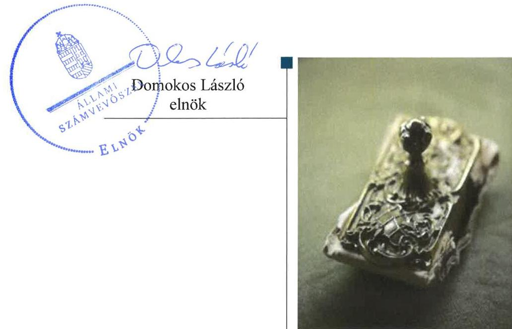
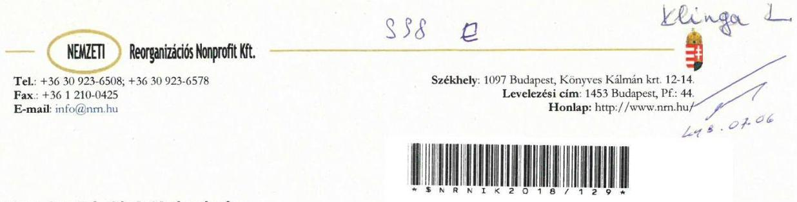
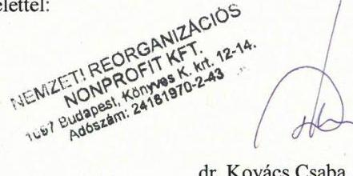
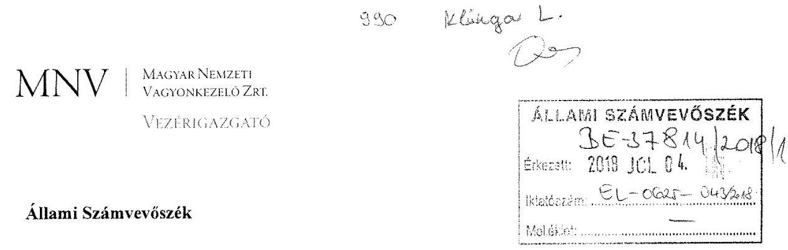
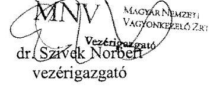

# Jelenetés 

## Az állami tulajdonú gazdasági társaságok

Az állami tulajdonú gazdasági társaságok ellenőrzése - Nemzeti Reorganizációs Nonprofit Kft. 2018.

---

# J elentés 

## Az állami tulajdonú gazdasági társaságok

Az állami tulajdonú gazdasági társaságok ellenőrzése - Nemzeti Reorganizációs Nonprofit Kft.
2018. auguirrtas hó 10. nap

---

# AZ ELLENŐRZÉST FELÜGYELTE:

- **KLINGA LÁSZLÓ** felügyeleti vezető
- **AZ ELLENŐRZÉST VEZETTE ÉS A VÉGREHAJTÁSÁÉRT FELELŐS:**
  - **DORMÁN ISTVÁN** ellenőrzésvezető
  - **A PROGRAM ÖSSZEÁLLÍTÁSÁÉRT FELELŐS:**
    - **TÓTPÁL SZABOLCS** osztályvezető

**IKTATÓSZÁM:** EL-0407-031/2018.

**TÉMASZÁM:** 2469

**ELLENŐRZÉS-AZONOSÍTÓ SZÁM:** V081428

---

Jelentéseink az Országgyűlés számítógépes hálózatán és az Interneta a www.asz.hu címen is olvashatóak.

---

# TARTALOMJEGYZÉK 

■ ÖSSZEGZÉS ..... 5
■ AZ ELLENŐRZÉS CÉLJA ..... 6
■ AZ ELLENŐRZÉS TERÜLETE ..... 7
■ AZ ELLENŐRZÉS HÁTTERE, INDOKOLTSÁGA ..... 9
■ A JELENTÉS LÉNYEGES KÉRDÉSKÖREI ..... 10
■ AZ ELLENŐRZÉS HATÓKÖRE ÉS MÓDSZEREI ..... 11
■ MEGÁLLAPÍTÁSOK ..... 13
■ MELLÉKLETEK ..... 17
I. sz. melléklet: Értelmező szótár ..... 17
II. sz. melléklet: Pénzügyi adatok ..... 18
■ FÜGGELÉK: ÉSZREVÉTELEK ..... 19
■ RÖVIDÍTÉSEK JEGYZÉKE ..... 23

---

.

---

# ÖSSZEGZÉS 

A Magyar Nemzeti Vagyonkezelő Zrt. és a Nemzeti Fejlesztési Minisztérium a tulajdonosi jogait szabályszerűen gyakorolta a Nemzeti Reorganizációs Nonprofit Kft. felett. A Társaság gazdálkodásának szabályozottsága megfelelt a jogszabályi előírásoknak, a pénzügyiszámviteli feladatok ellátása, valamint a vagyongazdálkodása szabályszerű volt. Az adatszolgáltatási és közzétételi kötelezettségének a Társaság eleget tett, biztositva ezzel az átláthatóságot.

## Az ellenőrzés társadalmi indokoltsága

Az állami tulajdonú gazdálkodó szervezetek ellenőrzése kiemelten fontos a vagyon megőrzése, megóvása érdekében, amelyekkel szemben alapvető követelmény, hogy gazdálkodásuk, működésük szabályszerű, az általuk szolgáltatott adatok minél megbízhatóbbak legyenek. Az állami tulajdonban álló gazdálkodó szervezetek államot megillető társasági részesedése a nemzeti vagyon részét képezi és legfőbb rendeltetése szerint a közfeladatok ellátását szolgálja.

Az Állami Számvevőszék stratégiájában megfogalmazta, hogy az államháztartáson kívül működő közfeladat-ellátó rendszerek ellenőrzéseivel hozzájárul ahhoz, hogy a közpénzeket az államháztartáson kívül működő szervezetek is átlátható, rendezett módon használják fel a közfeladatok szerződésben vállalt ellátása érdekében. Ellenőrzésünk eredményeképpen javaslatainkkal, megállapításainkkal hozzájárulhatunk a nemzeti vagyonnal való gazdálkodás átláthatóságának, elszámoltathatóságának javításához.

Az Állami Számvevőszék céljaival és a társadalmi igénnyel összhangban, valamint a gazdasági társaságok kiemelt fontosságú szerepe miatt került sor a Nemzeti Reorganizációs Nonprofit Kft. ellenőrzésére.

## Főbb megállapítások, következtetések

A Magyar Nemzeti Vagyonkezelő Zrt. és a Nemzeti Fejlesztési Minisztérium a tulajdonosi joggyakorlás kereteit szabályszerűen alakította ki és a Nemzeti Reorganizációs Nonprofit Kft. feletti tulajdonosi jogokat szabályszerűen gyakorolta.

A Társaság gazdálkodásának szabályozottsága megfelelt a jogszabályi előírásoknak. A számvitelről szóló törvényben előírt szabályzatokat elkészítette, amelyek megfeleltek a törvény előírásainak.

A Társaságnál a pénzügyi-számviteli feladatok ellátása, a bevételek és a ráfordítások elszámolása, valamint az alkalmazott díjak megállapítása szabályszerű volt.

Az előírt adatszolgáltatási és beszámolási kötelezettségét a Társaság teljesítette, a közérdekből nyilvános személyi és gazdálkodási adatokat közzé tette. A kormányzati szektorba sorolt Társaság az ellenőrzött időszakban adatszolgáltatási kötelezettségének eleget tett.

A Társaság vagyongazdálkodása szabályszerű volt, a vagyon nyilvántartása a jogszabályi előírásoknak megfelelően történt. A Társaság az éves beszámolóinak mérleg tételeit a törvénynek megfelelő leltárral támasztotta alá.

---

# AZ ELLENŐRZÉS CÉLJA 

AZ ELLENŐRZÉS CÉLJA annak értékelése, volt, hogy a tulajdonosi jogok gyakorlása szabályszerű volt-e. A gazdálkodó szervezet szabályozottsága, gazdálkodása és vagyongazdálkodási tevékenysége megfelelt-e a jogszabályi és a tulajdonosi előírásoknak; biztosítva volt$\cdot$ e a közfeladatok átláthatósága és elszámoltathatósága érdekében a közszolgáltatás díjának megalapozottsága szabályszerű önköltségszámítással. A vagyonváltozást eredményező döntések esetében a tulajdonosi jogok gyakorlója és a gazdálkodó szervezet szabályszerűen jártak-e el. Az ellenőrzés célja továbbá annak megítélése, hogy a kormányzati szektorba sorolt állami tulajdonban (résztulajdonban) lévő gazdálkodó szervezetek gazdálkodásának a kormányzati szektor hiányára és az államadósságra befolyással bíró elemei a jogszabályi előírásoknak megfeleltek-e.

---

# **A2 ELLENŐRZÉS TERÜLETE**

## **Nemzeti Reorganizációs Nonprofit Kft.**

Az MNV Zrt.1 az állami vagyon felügyeletéért felelős miniszter határozata alapján 2012. december 3-án 20,0 M Ft jegyzett tőkével, 100%-os állami részesedéssel alapította a Társaságot2. A Vtv.3 3. § alapján a Társaságban az államot megillető tulajdonosi jogokat és kötelezettségeket tulajdonosi joggyakorlóként 2014. november 19-ig az MNV Zrt., 2014. november 20-tól a 46/2014. (XI. 19.) NFM rendelettel4 módosított 77/2012. (XII. 22.) NFM rendelet5 1. § alapján az NFM6 gyakorolta. A részesedés feletti tulajdonosi joggyakorlást az MNV Zrt. 2014. december 15-én kelt Megállapodás7 keretében adta át az NFM-nek. A Társaság működésének biztosítására kétszer történt ázsiós tőkeemelés, összesen 340,0 M Ft értékben. A tulajdonosi joggyakorló8 2013. évben 80,0 M Ft törzstőke emelésről és 100,0 M Ft ázsió tőketartalékba helyezéséről, 2015. évben 5,0 M Ft törzstőke emelésről és 155,0 M Ft tőketartalékba helyezésről döntött. A tőkeemelés pénzbeli hozzájárulással történt. A Társaság jegyzett tőkéje 2013-2014. években 100,0 M Ft, 2015-2016. években 105,0 M Ft volt.

A Társaság fő tevékenysége üzletviteli, egyéb vezetési tanácsadás volt. A 341/2012. (XII. 5.) Korm. rendelet9 a stratégiailag kiemelt jelentőségűnek minősített gazdálkodó szervezetek csődeljárásában és felszámolási eljárásában vagyonfelügyelőként, ideiglenes vagyonfelügyelőként, rendkívüli vagyonfelügyelőként, illetve felszámolóként, végelszámolóként a Társaságot jelölte ki.

A Társaság képviseletére jogosult ügyvezető személyében az ellenőrzött időszakban nem történt változás. A Társaságnak az ellenőrzött időszakban az Alapító Okirat10 szerint választott könyvvizsgálója volt.

A Társaság főbb gazdálkodási adatait a 2013-2016. években az 1. táblázat szemlélteti, vagyoni helyzetét bemutató főbb mérlegadatokat a II. számú melléklet részletezi.

1. táblázat

|  A TÁRSASÁG FŐBB GAZDÁLKODÁSI ADATAI 2013-2016. ÉVEKBEN |  |  |  |   |
| --- | --- | --- | --- | --- |
|  Összeg (M Ft) | 2013. | 2014. | 2015. | 2016.  |
|  Saját tőke | 107,5 | 98,9 | 436,6 | 524,3  |
|  Jegyzett tőke | 100,0 | 100,0 | 105,0 | 105,0  |
|  Mérlegfőösszeg | 181,2 | 147,1 | 463,1 | 559,2  |
|  Követelések | 16,5 | 9,2 | 195,1 | 246,2  |
|  Értékesítés nettó árbevétele | 37,2 | 248,9 | 580,5 | 327,1  |
|  Adózott eredmény | -86,9 | -8,7 | 177,7 | 87,7  |
|  Létszám (I0) | 2013. | 2014. | 2015. | 2016.  |
|  Átlagos statisztikai állományi létszám | 9 | 12 | 11 | 11  |

*Forrás: A Társaság 2013-2016. évi Egyszerűsített éves beszámolói*

---

A Társaság nem rendelkezett vagyonkezelésbe vett vagyonnal. Bérbeadásra, haszonbérbeadásra, egyéb vagyonhasznosításra, térítés nélküli vagyon átvételére, átadására az ellenőrzött időszak alatt nem került sor.

A Társaság 2013. december 16-tól kormányzati szektorba sorolt egyéb szervezet volt, 2014. január 1-jétől a Bkr. ${ }^{11}$ hatálya alá tartozott. A Társaság az ellenőrzött időszakban támogatásban nem részesült, a Stabilitási tv. ${ }^{12}$ 3. §-a szerinti adósságot keletkeztető ügylete nem volt, gazdálkodása a kormányzati szektor hiányát nem befolyásolta. 2014. december 31-éig az Ávr. 7. számú mellékletének 2. pontja, továbbá 2015. január 1-től az Ávr. 5. számú mellékletének 3. pontja szerinti adatszolgáltatási kötelezettsége az $\mathrm{NGM}^{13}$ felé nem volt.

---

# AZ ELLENŐRZÉS HÁTTERE, INDOKOLTSÁGA 

Az állami tulajdonú gazdálkodó szervezetek ellenőrzése kiemelten fontos a vagyon megőrzése, megóvása érdekében, valamint a kormányzati szektor elszámolásaiban megjelenő állami tulajdonú gazdálkodó szervezetek esetében, amelyekkel szemben alapvető követelmény, hogy gazdálkodásuk, múködésük szabályszerű, az általuk szolgáltatott adatok minél megbízhatóbbak legyenek. Gazdálkodásuk jellemzően a közérdeklődés és a média figyelmének középpontjában áll, amihez hozzájárul a gazdálkodásuk körébe tartozó - közvetlen vagy közvetett állami tulajdonú, tehát végső soron a nemzeti vagyon részét képező - vagyon nagysága, illetve az általuk ellátott közszolgáltatások/közfeladatok minősége és hatékonysága.

Az ellenőrzés rámutathat az állami tulajdonú gazdálkodó szervezetek gazdálkodási tevékenységével jó gyakorlatokra és szabálytalanságokra. Felhívhatja a figyelmet a jogszabályi követelmények teljesítéséhez szükséges feltételek hiányosságaira, hozzájárulhat az államháztartáson kívüli, de (közvetlenül vagy közvetve) állami vagyont használó gazdálkodó szervezetek tevékenységének átláthatóságához. Ellenőrzésünk eredményeképpen javaslatainkkal, megállapításainkkal hozzájárulhatunk a nemzeti vagyonnal való gazdálkodás átláthatóságának, elszámoltathatóságának javításához.

---

# A JELENTÉS LÉNYEGES KÉRDÉSKÖREI 

1.     - A tulajdonosi jogok gyakorlása szabályszerű volt-e?
2.     - A Társaság szabályozottsága megfelelt-e a jogszabályi előírásoknak, a pénzügyi-számviteli és adatszolgáltatási feladatok ellátása szabályszerű volt-e?
3.     - A Társaság vagyongazdálkodása szabályszerű volt-e?

---

# AZ ELLENŐRZÉS HATÓKÖRE ÉS MÓDSZEREI 

## Az ellenőrzés típusa

Megfelelőségi ellenőrzés

## Az ellenőrzött időszak

2013-2016. évek, a 2016. évi beszámoló jóváhagyásáig tartó időszak.

## Az ellenőrzés tárgya

Állami tulajdonban (résztulajdonban) lévő gazdasági társaság gazdálkodása, kiemelten vagyongazdálkodási tevékenysége, a tulajdonosi jogok gyakorlása.

## Az ellenőrzött szervezet

Nemzeti Reorganizációs Nonprofit Kft., továbbá a tulajdonosi jogokat gyakorló Magyar Nemzeti Vagyonkezelő Zrt. és a Nemzeti Fejlesztési Minisztérium.

## Az ellenőrzés jogalapja

Az ellenőrzés jogszabályi alapját az az Állami Számvevőszékről szóló 2011. évi LXVI. törvény 1. § (3) bekezdése és 5. § (3)-(5) bekezdései képezték.

## Az ellenőrzés módszerei

Az ellenőrzést a nemzetközi standardokat irányadónak tekintve az ellenőrzési program ellenőrzési kérdései, az ellenőrzött időszakban hatályos jogszabályok, az ellenőrzés szakmai szabályok és módszertanok figyelembe vételével végeztük.

Az ellenőrzés ideje alatt az ellenőrzött szervezettel történő kapcsolattartást az ÁSZ ${ }^{14}$ Szervezeti és Múködési Szabályzatának vonatkozó előírásai alapján biztosítottuk.

Az ellenőrzésre a nemzetgazdasági szempontból kiemelt jelentőségű nemzeti vagyon körébe tartozó gazdálkodó szervezeteknél és a többségi állami tulajdonban álló gazdálkodó szervezeteknél került sor. Az ellenőrzési program szerinti feladatokat a kiválasztott gazdálkodó szervezetnél (társaságnál) és annak többségi tulajdonban lévő leányvállalatánál, valamint a

---

tulajdonosi jogok gyakorlójánál hajtottuk végre. Az ellenőrzés során az ÁSZ a gazdálkodó szervezet gazdálkodásának, feladatellátásának tendenciáit értékelte, ezért az ellenőrzött éveket két ellenőrzött időszakra bontotta.

A bevételek és a ráfordítások közül az értékesítés nettó árbevétele, az egyéb, rendkívüli és pénzügyi műveletek bevételei, a személyi jellegű ráfordítások, az anyagjellegű ráfordítások, az egyéb, rendkívüli és pénzügyi műveletek ráfordításai, valamint értékcsökkenési leírás elszámolásának szabályszerűségét, továbbá az immateriális javak, tárgyi eszközök esetében a vagyonnyilvántartás szabályszerűségét véletlen mintavétellel ellenőriztük.

A fenti sokaságok esetében a mintavétel azokra a legnagyobb értékű tételekre - a lényeges sokaságra - terjedt ki, melyek összértéke eléri a teljes sokaság összértékének 50\%-át. A személyi jellegű ráfordítások esetében a mintavétel a teljes sokaságból történt. Amennyiben valamely ellenőrzött sokaság elemszáma kisebb volt, mint az előírt mintaelemszám, az ellenőrzött sokaságot tételesen ellenőriztük.

A mintavétellel ellenőrzött területek esetében minden egyes tétel vonatkozásában a szabályszerűségre vonatkozó kérdéseket tettünk fel, amelyek eredménye összesítésre került. „Szabályszerűnek" értékeltünk egy ellenőrzött területet, amennyiben 95\%-os bizonyossággal az ellenőrzött sokaságban az átlagos hibaarány legfeljebb 10\%, "nem szabályszerűnek", amennyiben 10\%-nál magasabb arányt képviselt.

Az ellenőrzési kérdések megválaszolásához szükséges bizonyítékok megszerzése a következő ellenőrzési eljárások alkalmazásával történt: megfigyelés, kérdésfeltevés (információkérés), összehasonlítás, valamint elemző eljárás. Az ellenőrzési bizonyítékként felhasználható adatforrások közé tartoztak egyrészt az ellenőrzési programban felsorolt adatforrások, másrészt adatforrás lehet még minden - az ellenőrzés folyamán - feltárt, az ellenőrzés szempontjából információkat tartalmazó dokumentum.

Az ellenőrzést a kérdésekre adott válaszok kiértékelésével, valamint a megjelölt adatforrások, a csatolt tanúsítványok felhasználásával, továbbá az adott időszakban hatályos jogszabályok figyelembe vételével folytattuk le.

---

# 1. A tulajdonosi jogok gyakorlása szabályszerű volt-e? 

Összegző megállapítás

Az MNV Zrt. és az NFM a Társaság feletti tulajdonosi jogait szabályszerűen gyakorolta.

A TULAJDONOSI JOGGYAKORLÁS KERETEIT, a tulajdonosi jogok gyakorlására vonatkozó szabályokat az MNV Zrt. SZMSZ ${ }^{15}$ ében, a Monitoring szabályzat ${ }^{16}$-ban és egyéb belső szabályzataiban ${ }^{17}$ a jogszabályi előírásoknak megfelelően meghatározta.

Az NFM SZMSZ-e ${ }^{18}$ a jogszabályi előírásoknak megfelelően rendelkezett a részesedések feletti tulajdonosi jogok gyakorlásának rendjéről.

A Társaság Alapító Okiratában meghatározták a tulajdonosi joggyakorló számára fenntartott tulajdonosi jogokat, amely megfelelt a Gt. ${ }^{19}$-ben és a Ptk. ${ }^{20}$-ban foglalt előírásoknak.

A TULAJDONOSI JOGGYAKORLÁS szabályszerű volt. Az Alapító okiratban foglaltak szerint a Társaság három főből álló felügyelőbizottságának elnökét és tagjait, valamint a könyvvizsgálót a Taktv. ${ }^{21}$, a Gt., illetve a Ptk. előírásainak megfelelően választották meg.

A Társaság felügyelőbizottságának ügyrendjét a Gt., illetve a Ptk. előírásainak megfelelően a tulajdonosi joggyakorló fogadta el. A felügyelőbizottság az Alapító Okiratban foglaltaknak megfelelően végezte feladatait.

Az üzleti terveket a felügyelőbizottság megtárgyalta és a tulajdonosi joggyakorló határozataiban elfogadta.

A Társaság Számv. tv. szerinti beszámolóit a tulajdonosi joggyakorló a Gt. és a Ptk. előírásainak megfelelően a felügyelőbizottság és a könyvvizsgáló jelentése alapján jóváhagyta, továbbá döntött az eredmény eredménytartalékba helyezéséről. A Társaság legfőbb szerve a Javadalmazási szabályzatot ${ }^{22}$ 2013. és 2016. évben a Taktv.-ben foglaltaknak megfelelően megalkotta, amelyet a tulajdonosi joggyakorló jóváhagyott.

---

# 2. A Társaság szabályozottsága megfelelt-e a jogszabályi előírásoknak, a pénzügyi-számviteli és adatszolgáltatási feladatok ellátása szabályszerű volt-e? 

Összegző megállapítás

A Társaság szabályozottsága megfelelt a jogszabályi előírásoknak. A pénzügyi-számviteli feladatok ellátása szabályszerű volt. Az adatszolgáltatási kötelezettségének a Társaság eleget tett.

A TÁRSASÁG SZABÁLYOZOTTSÁGA megfelelt a jogszabályi előírásoknak. A Társaság feladatait, a működés alapvető szabályait az Alapító Okiratban, valamint a Társaság SZMSZ ${ }^{23}$-ében határozták meg.

A Társaság elkészítette a Számviteli politikát ${ }^{24}$, az eszközök és források Leltározási szabályzatát ${ }^{25}$, az eszközök és források Értékelési szabályzatát ${ }^{26}$, a Pénzkezelési szabályzatot ${ }^{27}$, a vagyonhasznosítási és Selejtezési szabályzatot ${ }^{28}$. Rendelkezett Számlarenddel ${ }^{29}$ és a számlarendben foglaltakat alátámasztó bizonylati renddel, amelyek megfeleltek a Számv. tv. előírásainak. Önköltségszámítási szabályzat-készítési kötelezettség alól a Számv. tv. alapján mentesült.

## A BEVÉTELEK ÉS A RÁFORDÍTÁSOK ELSZÁMOLÁSA szabályszerű volt, megfelelt a Számv. tv. és a belső szabályzatok előírásainak. A Társaság a Számv. tv.-ben foglaltaknak megfelelően olyan számviteli nyilvántartást vezetett, mely biztosította az egyes tevékenységek elkülönült nyilvántartását és átláthatóságát.

AZ ÉRTÉKCSÖKKENÉS elszámolása nem volt szabályszerű. A Számv. tv. 52. § (2) bekezdésében előírtak ellenére a tárgyi eszközök üzembe helyezését hitelt érdemlően nem dokumentálták, számviteli bizonylattal nem támasztották alá.

## A KÖTELEZŐEN KÖZZÉTEENDŐ KÖZÉRDEKŰ

ADATOKAT a Társaság a Taktv. és a Cstv. ${ }^{30}$ előírásainak megfelelően a honlapján hozzáférhetővé tette.

## A TERVEZÉSI, BESZÁMOLÁSI KÖTELEZETTSÉ-

GÉT határidőben teljesítette, az Alapító Okiratban előírtak szerint éves üzleti terveit, valamint a Számv. tv. szerinti, egyszerűsített éves beszámolóit jóváhagyásra benyújtotta a tulajdonosi joggyakorló részére. A 2013., 2015-2016. évi egyszerűsített éves beszámolókat a Társaság az előírásoknak megfelelően letétbe helyezte és közzétette. A Számv. tv. 153. § (1) és a 154. § (1) bekezdésében foglalt előírások ellenére a Társaság a 2014. évi egyszerűsített éves beszámolóját 2015. június 16-án, késedelmesen tette közzé és helyezte letétbe.

A könyvvizsgáló az ellenőrzött időszak minden évében hitelesítő záradékkal látta el az egyszerűsített éves beszámolót.

A kormányzati szektorba sorolt Társaság az ellenőrzött időszakban 2014. december 31-éig az Ávr. 7. számú mellékletének 28. pontjában,

---

2015. január 1-től az Ávr. 5. számú mellékletének 23. pontjában előírt adatszolgáltatási kötelezettségének a tulajdonosi joggyakorló felé eleget tett.

A Társaság az ellenőrzött időszakban múködtetett belső ellenőrzést, mellyel eleget tett a Bkr. 10. §-ában foglalt előírásnak.

A TÁRSASÁG ÁLTAL ALKALMAZOTT DÍJ AK megállapítása szabályszerű volt. A Társaság a bevételek megállapítása során a Cstv. 59. § (1) bekezdésében, valamint a 83. § (1) bekezdésében foglaltaknak megfelelő árat alkalmazott.

# 3. A Társaság vagyongazdálkodása szabályszerű volt-e? 

## Összegző megállapítás

A Társaság vagyongazdálkodása szabályszerű volt.

A VAGYONGAZDÁLKODÁS feltételeit a Társaság szabályszerűen alakította ki. A feladat- és hatásköröket, felelősségi viszonyokat az Alapító Okiratban, a Társaság SZMSZ-ében, valamint belső szabályzataiban rögzítették.

A VAGYON NYILVÁNTARTÁSA a Számv. tv. előírásainak megfelelően történt. A Társaság az egyszerűsített éves beszámolóinak mérleg tételeit a Számv. tv.-nek megfelelő leltárral támasztotta alá. Az immateriális javak, tárgyi eszközök mennyiségi leltárfelvételét a Számv. tv.nek megfelelően elvégezte.

A Társaság vagyonát érintő döntésekre és azok előterjesztéseire az Alapító Okiratban, a belső szabályzatokban előírtak szerint került sor. A Társaság saját vagyona 2013. év végéről 2016. év végére 378,0 M Ft-tal növekedett.

A KAPCSOLT VÁLLALKOZÁS a vagyongazdálkodással kapcsolatos adatszolgáltatási kötelezettségének eleget tett. A Társaságnak 2013. október 22-től 2014. október 31-ig volt leányvállalatában, a Higi Projekt Termelő és Kereskedelmi Nonprofit Kft. ${ }^{31}$-ben 3 M Ft értékű, 100\%-os részesedése. A Társaság a kapcsolt vállalkozás 2013. évi, valamint a 2014. évi tevékenységet lezáró Számv. tv. szerinti beszámolóit jóváhagyta. Az MNV Zrt. 423/2014 (X.31.) Alapítói Határozata alapján 2014. évben a Társaság tulajdonában álló Higi Projekt Termelő és Kereskedelmi Nonprofit Kft. jogutód nélküli megszüntetésére és végelszámolásának elrendelésére került sor, amely alapján a részesedés a Társaság számviteli nyilvántartásából kivezetésre került.

---

.

---

# MELLÉKLETEK 

- I. SZ. MELLÉKLET: ÉRTELMEZŐ SZÓTÁR
ázsiós tőkeemelés
gazdasági társaság
gazdálkodó szervezet
kormányzati szektorba sorolt egyéb szervezet
közszolgáltatás
nemzeti vagyon

A tőkeemelés azon formája, amely során a jegyzett tőke emelése mellett az átadott vagyon jelentősebb része tőketartalékba kerül.
Ptk. 3:88. § (1) bekezdése szerint „a gazdasági társaságok üzletszerű közös gazdasági tevékenység folytatására, a tagok vagyoni hozzájárulásával létrehozott, jogi személyiséggel rendelkező vállalkozások, amelyekben a tagok a nyereségből közösen részesednek, és a veszteséget közösen viselik".
A Ptk. 685. § c) pontja szerint gazdálkodó szervezet: „az állami vállalat, az egyéb állami gazdálkodó szerv, a szövetkezet, a lakásszövetkezet, az európai szövetkezet, a gazdasági társaság, az európai részvénytársaság, az egyesülés, az európai gazdasági egyesülés, az európai területi együttmüködési csoportosulás, az egyes jogi személyek vállalata, a leányvállalat, a vízgazdálkodási társulat, az erdő birtokossági társulat, a végrehajtói iroda, az egyéni cég, továbbá az egyéni vállalkozó." (2014. 03.15-ig hatályos)
az Áht. ${ }^{32} 3 . \S$ (2) és (3) bekezdésében foglaltakon kívül az Európai Közösséget létrehozó szerződéshez csatolt, a túlzott hiány esetén követendő eljárásról szóló jegyzőkönyv alkalmazásáról szóló 2009. május 25-i 479/2009/EK rendelet (a továbbiakban: 479/2009/EK rendelet) szerint a kormányzati szektorba sorolt szervezet (Áht. 1. § (12))
Az Ebktv. ${ }^{33} 3 . \S$ d) pontja a következőképpen határozza meg a közszolgáltatást: „szerződéskötési kötelezettség alapján a lakosság alapvető szükségleteinek ellátására irányuló szolgáltatás, így különösen a villamos energia-, gáz-, hő-, víz-, szenny-víz- és hulladékkezelési, köztisztasági, postai és távközlési szolgáltatás, továbbá a menetrend alapján közlekedő járművekkel végzett közforgalmú személyszállítás". Nvtv. ${ }^{34} 1 . \S$ (2) bekezdése szerint többek között:
„az állam vagy a helyi önkormányzat kizárólagos tulajdonában álló dolgok, az a) pont hatálya alá nem tartozó, állam vagy a helyi önkormányzat tulajdonában lévő dolog,
az állam vagy a helyi önkormányzat tulajdonában lévő pénzügyi eszközök, továbbá az államot vagy a helyi önkormányzatot megillető társasági részesedések, az államot vagy a helyi önkormányzatot megillető bármely vagyoni értékkel rendelkező jogosultság, amelyet jogszabály vagyoni értékű jogként nevesít."

---

| MERLE | 2013.12.31. | 2014.12.31. | 2015.12.31. | 2016.12.31. |
| :--: | :--: | :--: | :--: | :--: |
| A. Befektetett eszközök | 12935 | 7935 | 6246 | 5949 |
| I. IMMATERIÁLIS JAVAK | 362 | 255 | 177 | 943 |
| II. TÁRGYI ESZKÖZÖK | 9573 | 7680 | 6069 | 5006 |
| III. BEFEKTETETT PÉNZÜGYI ESZKÖZÖK | 3000 | 0 | 0 | 0 |
| B. Forgóeszközök | 136714 | 131148 | 321760 | 551719 |
| I. KÉSZLETEK | 100652 | 82615 | 55568 | 80194 |
| II. KÖVETELÉSEK | 16517 | 9166 | 195124 | 246157 |
| III. ÉRTÉKPAPÍROK | 0 | 0 | 0 | 130390 |
| IV. PÉNZESZKÖZÖK | 19545 | 39367 | 71068 | 94978 |
| C. Aktív időbeli elhatárolások | 31560 | 8044 | 135113 | 1505 |
| ESZKÖZÖK ÖSSZESEN | 181209 | 147127 | 463119 | 559173 |
| D. Saját tőke | 107523 | 98861 | 436610 | 524299 |
| I. JEGYZETT TÖKE | 100000 | 100000 | 105000 | 105000 |
| II. JEGYZETT, DE MÉG BE NEM FIZETETT TÖKE (-) | 0 | 0 | 0 | 0 |
| III. TÖKETARTALÉK | 100000 | 100000 | 255000 | 255000 |
| IV. EREDMÉNYTARTALÉK | $-5549$ | $-92477$ | $-101138$ | 76610 |
| V. LEKÖTÖTT TARTALÉK | 0 | 0 | 0 | 0 |
| VI. ÉRTÉKELÉSI TARTALÉK | 0 | 0 | 0 | 0 |
| VII. MÉRLEG SZERINTI EREDMÉNY | $-86928$ | $-8662$ | 177748 | 87689 |
| E. Céltartalékok | 0 | 0 | 0 | 0 |
| F. Kötelezettségek | 72510 | 47220 | 22457 | 34215 |
| I. HÁTRASOROLT KÖTELEZETTSÉGEK | 0 | 0 | 0 | 0 |
| II. HOSSZÚ LEJÁRATÚ KÖTELEZETTSÉGEK | 0 | 0 | 0 | 0 |
| III. RÖVID LEJÁRATÚ KÖTELEZETTSÉGEK | 72510 | 47220 | 22457 | 34215 |
| G. Passzív időbeli elhatárolások | 1176 | 1046 | 4052 | 659 |
| FORRÁSOK ÖSSZESEN | 181209 | 147127 | 463119 | 559173 |
| Eredménykimutatás | 2013. év | 2014. év | 2015. év | 2016. év |
| Értékesítés nettó árbevétele | 37241 | 248890 | 580451 | 327071 |
| Aktivált saját teljesítmények értéke | 107424 | 60628 | 19823 | 24837 |
| Egyéb bevételek | 10 | 12311 | 2477 | 639 |
| Anyagjellegú ráfordítások | 67026 | 70109 | 70495 | 86193 |
| Személyi jellegú ráfordítások | 150183 | 166528 | 165324 | 165411 |
| Értékcsökkenési leírás | 7103 | 3229 | 2038 | 1664 |
| Egyéb ráfordítások | 7631 | 84959 | 167420 | 7604 |
| Üzemi tevékenység eredménye | $-87268$ | $-2996$ | 197474 | 91675 |
| Mérleg szerinti eredmény/adózott eredmény* | $-86928$ | $-8662$ | 177748 | 87689 |

* A 2013-2015. években az adózott eredmény és a mérleg szerinti eredmény megegyezett. A Számv. tv. 2015. július 4-től hatályos módosítása alapján a mérleg szerinti eredmény tétel megszűnt. A 2016. évi éves beszámoló eredménykimutatásában az adózott eredmény levezetését kellett kimutatni.

---

# FÜGGELÉK: ÉSZREVÉTELEK 

A jelentéstervezetet a Számvevőszék 15 napos észrevételezésre megküldte az ellenőrzött szervezetek vezetőinek az ÁSZ tv. 29. §* (1) bekezdése előírásának megfelelően.

A Nemzeti Reorganizációs Nonprofit Kft. ügyvezetője és a Magyar Nemzeti Vagyonkezelő Zrt. vezérigazgatója az ÁSZ tv. 29. § (2) bekezdésében foglalt észrevételezési jogával nem élt, írásban jelezte, hogy észrevételt nem tesz.

[^0]
[^0]:    * 29. § (1) Az Állami Számvevőszék az ellenőrzési megállapításait megküldi az ellenőrzött szervezet vezetőjének vagy az általa megbízott személynek, és annak, akinek személyes felelősségét állapította meg.
    (2) Az ellenőrzött szervezet vezetője és a felelősként megjelölt személy az ellenőrzés megállapításaira tizenöt napon belül írásban észrevételt tehet.
    (3) Az Állami Számvevőszék az észrevételre a beérkezésétől számított harminc napon belül írásban válaszol. A figyelembe nem vett észrevételeket köteles a jelentésben feltüntetni, és megindokolni, hogy azokat miért nem fogadta el.

---

# Domokos László elnök úr részére 

## Állami Számvevőszék

1052 Budapest,
Apáczai Csere János utca 10.
Levelezési cím: 1364 Budapest 4., Pf.: 54.

Tárgy: EL-0625-037/2018. iktatószámú jelentéstervezet

Tisztelt Domokos László Úr,

Köszönettel kézhez vettük az EL-0625-037/2018. iktatószámú, 2469. témaszámú, V081428 ellenőrzés azonosítószámú, ,,Az állami tulajdonú (résztulajdonú) gazdasági társaságok ellenőrzése- Nemzeti Reorganizációs Nonprofit Korlátolt Felelősségü Társaság" címmel készített számvevőszéki jelentés tervezetet.

A jelentés tervezettel kapcsolatban észrevételt nem kívánunk tenni.
A jelentés tervezetben tett megállapításokat a társaság a jövőbeni müködése során figyelembe fogja venni és alkalmazni fogja.

Budapest, 2018. július 2.

Munkájukat megköszönve, tisztelettel:

dr. Kovács Csaba
ügyvezető
Nemzeti Reorganizációs Nonprofit Kft.

---

# Domokos László 

elnök

1052 Budapest
Apáczai Cs. J. u. 10.

Ikt. sz.: MNV/01/8494/ 4 /2018.
Hiv. sz.: EL-0625-040/2018.

Tisztelt Elnök Úr!
Tájékoztatom, hogy az MNV Zrt. a 2018. június 20. napján ,,Az állami tulajdonban (résztulajdonban) lévő gazdálkodó szervezetek vagyonmegőrzési és gazdálkodási tevékenységének ellenőrzése - Nemzeti Reorganizációs Nonprofit Korlátolt Felelősségü Társaság" tárgyában kézhez vett, EL-0625-040/2018. ikt. sz. Jelentés-tervezetre nem kíván észrevételt tenni.

Budapest, 2018. július, 7 " 7 "

Üdvözlettel:

---

.

---

# RÖVIDÍTÉSEK JEGYZÉKE 

${ }^{1}$ MNV Zrt.
${ }^{2}$ Társaság
${ }^{3}$ Vtv.
${ }^{4}$ 46/2014. (XI. 19.) NFM rendelet
${ }^{5}$ 77/2012. (XII. 22.) NFM rendelet
${ }^{6}$ NFM
${ }^{7}$ Megállapodás
${ }^{8}$ tulajdonosi joggyakorló
${ }^{9}$ 341/2012. (XII. 5.) Korm. rendelet
${ }^{10}$ Alapító Okirat
${ }^{11}$ Bkr.
${ }^{12}$ Stabilitási tv.
${ }^{13}$ NGM
${ }^{14}$ ÁSZ
${ }^{15}$ MNV Zrt. SZMSZ
${ }^{16}$ Monitoring szabályzat

Magyar Nemzeti Vagyonkezelő Zártkörűen Működő Részvénytársaság Nemzeti Reorganizációs Nonprofit Korlátolt Felelősségű Társaság 2007. évi CVI. törvény - az állami vagyonról, hatályos 2007. szeptember 25-től 46/2014. (XI. 19.) NFM rendelet az egyes gazdasági társaságok felett az államot megillető tulajdonosi jogok és kötelezettségek összességét gyakorló szervezet kijelöléséről szóló 77/2012. (XII. 22.) NFM rendelet módosításáról 77/2012. (XII. 22.) NFM rendelet egyes gazdasági társaságok felett az államot megillető tulajdonosi jogok és kötelezettségek összességét gyakorló szervezet kijelöléséről

Nemzeti Fejlesztési Minisztérium
Megállapodás társasági részesedés átadás-átvételéről a Magyar Nemzeti Vagyonkezelő Zártkörűen Működő Részvénytársaság és a Nemzeti Fejlesztési Minisztérium között, 2014. december 15.
Magyar Nemzeti Vagyonkezelő Zrt. a Nemzeti Reorganizációs Nonprofit Kft. tulajdonosi joggyakorlója 2013. január 1-től 2014. november 19-ig; Nemzeti Fejlesztési Minisztérium a Nemzeti Reorganizációs Nonprofit Kft. tulajdonosi joggyakorlója 2014. november 20-tól
341/2012. (XII.5.) Korm. rendelet a stratégiailag kiemelt jelentőségű gazdálkodó szervezetek csődeljárásában és felszámolási eljárásában közreműködő állami felszámoló kijelöléséről szóló 358/2011. (XII. 30.) Korm. rendelet, továbbá a stratégiailag kiemelt jelentőségű gazdálkodó szervezetek csődeljárásában és felszámolási eljárásában közreműködő állami felszámoló adatainak nyilvántartásba vételével és közigazgatási hatósági ellenőrzésével összefüggő eljárási szabályokról szóló 357/2011. (XII. 30.) Korm. rendelet módosításáról
Nemzeti Reorganizációs Nonprofit Kft. Alapító Okirat, hatályos 2012.11.14-től 2013.04.08-ig; Alapító Okirat, hatályos 2013.04.09-től 2014.12.16-ig; Alapító Okirat, hatályos 2014.12.17-től 2015.01.14-ig; Alapító Okirat, hatályos 2015.01.15-től 2015.03.29-ig; Alapító Okirat, hatályos 2015.03.30-tól 2015.06.16-ig; Alapító Okirat, hatályos 2015.06.17-től 2016.02.17-ig; Alapító Okirat, hatályos 2016.02.18-tól 2016.06.07-ig; Alapító Okirat, hatályos 2016.06.08-tól 2016.06.12-ig; Alapító Okirat, hatályos 2016.06.13-tól 2016.09.21-ig; Alapító Okirat, hatályos 2016.09.22-től 2017.06.06-ig
370/2011.(XII.31.) Korm. rendelet a költségvetési szervek belső kontrollrendszeréről és belső ellenőrzéséről
Magyarország gazdasági stabilitásáról szóló 2011. évi CXCIV. törvény
Nemzetgazdasági Minisztérium
Állami Számvevőszék
Magyar Nemzeti Vagyonkezelő Zártkörűen Működős Részvénytársaság Szervezeti és Müködési Szabályzata hatályos: 2012. október 8-tól; Magyar Nemzeti Vagyonkezelő Zártkörűen Müködős Részvénytársaság Szervezeti és Müködési Szabályzata hatályos: 2013. március 16-tól; Magyar Nemzeti Vagyonkezelő Zártkörűen Müködős Részvénytársaság Szervezeti és Müködési Szabályzata hatályos: 2013. április 25-től; Magyar Nemzeti Vagyonkezelő Zártkörűen Müködős Részvénytársaság Szervezeti és Müködési Szabályzata hatályos: 2013. július 1-től
MNV Zrt. Monitoring Szabályzata hatályos: 2013. december 19-től; MNV Zrt. Monitoring Szabályzata hatályos: 2016. augusztus 1-től

---

${ }^{17}$ belső szabályzatok
${ }^{18}$ NFM SZMSZ
${ }^{19} \mathrm{Gt}$.
${ }^{20}$ Ptk.
${ }^{21}$ Taktv.
${ }^{22}$ Javadalmazási szabályzat
${ }^{23}$ Társaság SZMSZ
${ }^{24}$ Számviteli politika
${ }^{25}$ Leltározási szabályzat
${ }^{26}$ Értékelési szabályzat
${ }^{27}$ Pénzkezelési szabályzat
${ }^{28}$ Selejtezési szabályzat
${ }^{29}$ Számlarend
${ }^{30}$ Cstv.
${ }^{31}$ HIGI Projekt Nonprofit Kft.
${ }^{32}$ Áht.
${ }^{33}$ Ebktv.
${ }^{34} \mathrm{Nvtv}$.
MNV/01/58077/0/2013. iktatószámú feljegyzés a tulajdonosi jogok gyakorlására vonatkozó meghatalmazások kiadására; 35/2012. vezérigazgatói utasítás a döntések előkészítésének és a döntésekkel kapcsolatos iratok kezelésének rendjéről; 452/2012. (XII. 18.) vezérigazgatói határozat alapján kiadott 43/2012. (XII. 18.) számú vezérigazgatói utasítás a negyedéves tulajdonosi értékelő értekezletről; 45/2014.(XII.10) sz. vezérigazgatói utasítás a könyvvizsgálók kiválasztásának eljárásrendjéről; 569/2013. (VIII. 5.) igazgatósági határozat alapján kiadott 37/2013 (VIII. 7.) sz. vezérigazgatói utasítás a Tulajdonosi Ellenőrzési Szabályzatról; 51/2013. (XII. 19.) vezérigazgatói utasítás a Társasági Monitoring szabályzatról
33/2014. (X. 10.) NFM utasítás a Nemzeti Fejlesztési Minisztérium Szervezeti és Müködési Szabályzatáról (hatályos: 2014. október 11-től)
2006. évi IV. törvény a gazdasági társaságokról (hatálytalan: 2014. március 15étől)
2013. évi V. törvény a Polgári Törvénykönyvről (hatályos 2014. március 15-től)
2009. évi CXXII. törvény a köztulajdonban álló gazdasági társaságok takarékosabb müködéséről (hatályos: 2009. december 4-től)
Nemzeti Reorganizációs Nonprofit Kft. Javadalmazási szabályzat, hatályos 2013.02.15-től-2016.02.28-ig; Javadalmazási szabályzat, hatályos 2016.03.01-tőlvisszavonásig
Nemzeti Reorganizációs Nonprofit Kft. Szervezeti és Müködési Szabályzat hatályos 2012.12.04-től 2015.06.16-ig; Szervezeti és Müködési szabályzat hatályos 2015.06.17-től 2015.11.29-ig; Szervezeti és Müködési szabályzata hatályos 2015.11.30-tól
Nemzeti Reorganizációs Nonprofit Kft. Számviteli politika, hatályos: 2012.12.04től 2015.11.29-ig; Számviteli politika, hatályos 2015.11.30-tól 2016.11.24-ig; Számviteli politika, hatályos 2016.11.25-től)
Nemzeti Reorganizációs Nonprofit Kft. Leltározási szabályzat, hatályos 2012.12.04-től

Nemzeti Reorganizációs Nonprofit Kft. Értékelési szabályzat, hatályos 2012.10.04-től

Nemzeti Reorganizációs Nonprofit Kft. Pénzkezelési szabályzat, hatályos 2012.12.04-2013.09.30-ig; Pénzkezelési szabályzat, hatályos 2013.10.01-től

Nemzeti Reorganizációs Nonprofit Kft. Selejtezési szabályzat, hatályos 2013.10.15-től

Nemzeti Reorganizációs Nonprofit Kft. Számlarend (hatályos 2012.12.042016.11.24-ig), Számlarend hatályos 2016.11.25-től
1991. évi XLIX törvény a csődeljárásról és felszámolási eljárásról a Társaság leányvállalata 2013.10.22-től 2014.10.31-ig
2011. évi CXCV. törvény az államháztartásról (hatályos 2011. december 31-től) 2003. évi CXXV. törvény az egyenlő bánásmódról és az esélyegyenlőség előmozdításáról (hatályos: 2004. január 27-től)
2011. évi CXCVI. törvény a nemzeti vagyonról (hatályos: 2011. december 31-től)

---

# ÁLLAMI SZÁMVEVŐSZÉK 

1052 Budapest, Apáczai Csere János utca 10.
Levélcím: 1364 Budapest 4. Pf. 54
Telefon: +36 14849100 Telefax: +36 14849200
www.asz.hu