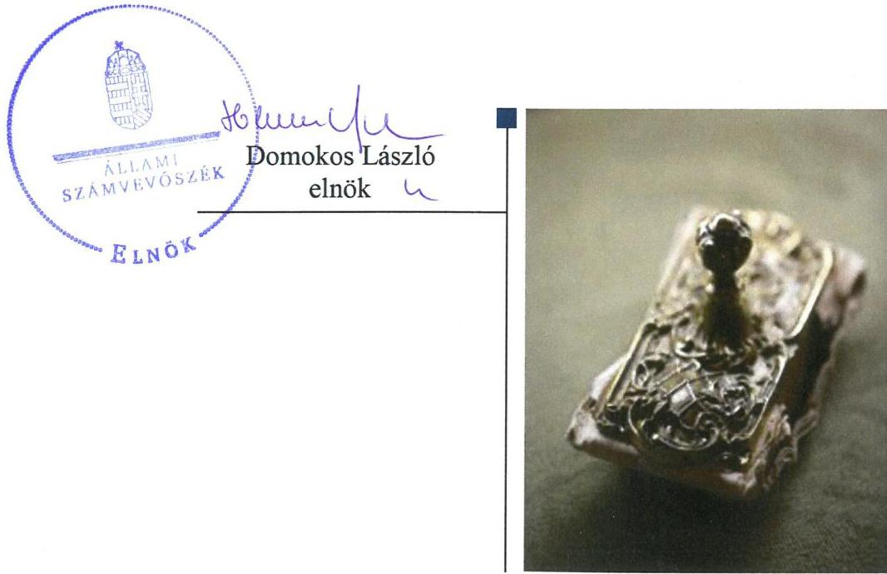
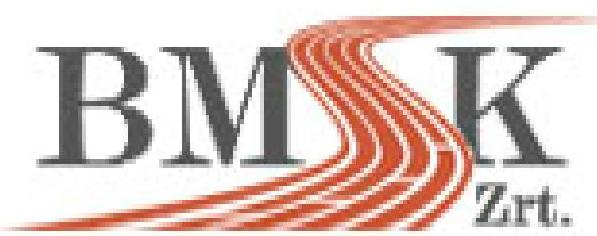
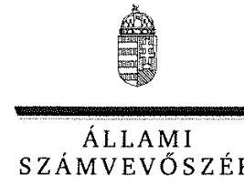
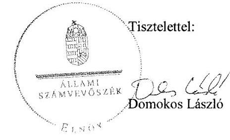
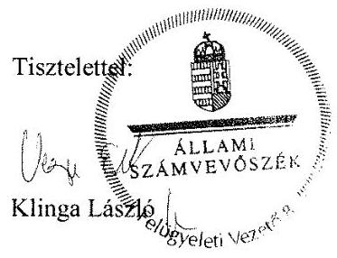

# Jelentés 

## Az állami tulajdonú gazdasági társaságok ellenőrzése

BMSK Beruházási, Műszaki Fejlesztési, Sportüzemeltetési és Közbeszerzési Zrt. 2018.

---

# Jelentés 

## Az állami tulajdonú gazdasági társaságok ellenőrzése

BMSK Beruházási, Műszaki Fejlesztési, Sportüzemeltetési és Közbeszerzési Zrt.
2018. 09 hó 12 . nap

---

# AZ ELLENŐRZÉST FELÜGYELTE:

- **KLINGA LÁSZLÓ** felügyeleti vezető
- **AZ ELLENŐRZÉST VEZETTE ÉS A VÉGREHAJTÁSÁÉRT FELELŐS:**
  - **RÁCZKEVI KATALIN** ellenőrzésvezető
  - **A PROGRAM ÖSSZEÁLLÍTÁSÁÉRT FELELŐS:**
    - **TÓTPÁL SZABOLCS** osztályvezető

**IKTATÓSZÁM:** EL-0387-033/2018

**TÉMASZÁM:** 2469

**ELLENŐRZÉS-AZONOSÍTÓ SZÁM:** V081408

Jelentéseink az Országgyűlés számítógépes hálózatán és az Interneta a www.asz.hu címen is olvashatóak.

---

# TARTALOMJEGYZÉK 

- ÖSSZEGZÉS ..... 5
- AZ ELLENŐRZÉS CÉLJA ..... 6
- AZ ELLENŐRZÉS TERÜLETE ..... 7
- AZ ELLENŐRZÉS HÁTTERE, INDOKOLTSÁGA ..... 9
- A JELENTÉS LÉNYEGES KÉRDÉSKÖREI ..... 10
- AZ ELLENŐRZÉS HATÓKÖRE ÉS MÓDSZEREI ..... 11
- MEGÁLLAPÍTÁSOK ..... 13
- MELLÉKLETEK ..... 17
I. sz. melléklet: Értelmező szótár ..... 17
II. sz. melléklet: A Társaság vagyoni helyzetének alakulása 2013-2016. években (M Ft) ..... 18
- FÜGGELÉK: ÉSZREVÉTELEK ..... 19
- RÖVIDÍTÉSEK JEGYZÉKE ..... 25

---

.

---

# ÖSSZEGZÉS 

A Magyar Nemzeti Vagyonkezelő Zrt. és a Nemzeti Fejlesztési Minisztérium tulajdonosi joggyakorlása a BMSK Beruházási, Müszaki Fejlesztési, Sportüzemeltetési és Közbeszerzési Zrt. felett szabályszerű volt. A Társaság szabályozottsága, pénzügyi-számviteli és vagyongazdálkodása szabályszerű volt. Közzétételi kötelezettségének a Társaság eleget tett, ezzel az átláthatóságot biztosította.

## Az ellenőrzés társadalmi indokoltsága

Az állami tulajdonú gazdálkodó szervezetek a nemzeti vagyon részét képezik. Az állami vagyonnal való gazdálkodást illetően a tulajdonosi joggyakorlás és vagyongazdálkodás feladata az állami vagyon átlátható, rendeltetésszerű és felelős felhasználásának biztosítása. Minden közpénzt, közvagyont használó szervezettel szemben társadalmi igény, hogy tevékenységéről elszámoljon.

Az Állami Számvevőszék stratégiájában megfogalmazta, hogy az államháztartáson kívül működő közfeladat-ellátó rendszerek ellenőrzéseivel hozzájárul ahhoz, hogy a közpénzeket az államháztartáson kívül működő szervezetek is átlátható, rendezett módon használják fel a közfeladatok szerződésben vállalt ellátása érdekében. Ellenőrzésünk eredményeképpen javaslatainkkal, megállapításainkkal hozzájárulhatunk a nemzeti vagyonnal való gazdálkodás átláthatóságának, elszámoltathatóságának javításához.

A Társaság az ellenőrzött időszakban a magyarországi sportinfrastruktúra fejlesztésével és működtetésével összefüggő feladatokat látott el. Az Állami Számvevőszék céljaival és a társadalmi igénnyel összhangban, valamint a gazdasági társaságok kiemelt fontosságú szerepe miatt került sor a BMSK Beruházási, Műszaki Fejlesztési, Sportüzemeltetési és Közbeszerzési Zrt. ellenőrzésére.

## Főbb megállapítások, következtetések

A Magyar Nemzeti Vagyonkezelő Zrt. 2013. évi és a Nemzeti Fejlesztési Minisztérium 2016. évi Társaság feletti tulajdonosi joggyakorlása szabályszerű volt. A Társaság üzleti terveit a tulajdonosi joggyakorlók jóváhagyták, a számviteli beszámolókat a jogszabályi előírásoknak megfelelően fogadták el. A Társaságot a Magyar Nemzeti Vagyonkezelő Zrt. és a Nemzeti Fejlesztési Minisztérium monitoring rendszerén keresztül beszámoltatta. Az MNV Zrt. vagyonkezelt eszközök feletti tulajdonosi joggyakorlása szabályszerű volt.

A BMSK Beruházási, Műszaki Fejlesztési, Sportüzemeltetési és Közbeszerzési Zrt. a vagyongazdálkodás feltételeit belső szabályzataiban szabályszerűen kialakította.

A Társaság bevételeinek, anyagjellegú és egyéb ráfordításainak elszámolása szabályszerű volt. Vagyongazdálkodása szabályszerű volt, a vagyon nyilvántartása és az értékcsökkenés elszámolása a jogszabályi előírásoknak megfelel. A beszámolók mérleg tételeit a jogszabályi előírásoknak megfelelően leltárral alátámasztották. A számviteli beszámolóit a jogszabálynak megfelelően elkészítette és közzétette.

A Társaság a tulajdonosi joggyakorlók által előírt adatszolgáltatási kötelezettségét az Alapító Okirat, az Alapszabály és a tulajdonosi joggyakorló előírásainak megfelelő gyakorisággal és tartalommal teljesítette.

A Társaság a közérdekú adatait közzé tette, ezáltal az átláthatóságot biztosította. A Társaság kormányzati szektorba sorolt szervezetként adósságot keletkeztető ügyletet nem kötött.

---

# AZ ELLENŐRZÉS CÉLJA 

AZ ELLENŐRZÉS CÉLJA annak értékelése, hogy a tulajdonosi jogok gyakorlása szabályszerű volt-e. A gazdálkodó szervezet szabályozottsága, gazdálkodása és vagyongazdálkodási tevékenysége megfelelt-e a jogszabályi és a tulajdonosi előírásoknak; biztosítva volt-e a közfeladatok átláthatósága és elszámoltathatósága érdekében a közszolgáltatás dijának megalapozottsága szabályszerű önköltségszámítással. A vagyonváltozást eredményező döntések esetében a tulajdonosi jogok gyakorlója és a gazdálkodó szervezet szabályszerűen jártak-e el. Az ellenőrzés célja továbbá annak megítélése, hogy a kormányzati szektorba sorolt állami tulajdonban (résztulajdonban) lévő gazdálkodó szervezetek gazdálkodásának a kormányzati szektor hiányára és az államadósságra befolyással bíró elemei a jogszabályi előírásoknak megfeleltek-e.

---

# AZ ELLENŐRZÉS TERÜLETE 

## BMSK Beruházási, Műszaki Fejlesztési, Sportüzemeltetési és Közbeszerzési Zártkörűen Müködő Részvénytársaság és a tulajdonosi jogokat gyakorló Nemzeti Fejlesztési Minisztérium, valamint a Magyar Nemzeti Vagyonkezelő Zártkörű Részvénytársaság

A Társaság ${ }^{1}$ jogelődjét 2000. március 27-én 600 millió Ft alaptőkével, 100\%-os állami részesedéssel a Belügyminisztérium alapította, Belügyminisztérium Beruházási és Közbeszerzési Részvénytársaság néven. A Társaság elnevezése 2007. október 1-től BMSK Beruházási, Műszaki Fejlesztési, Sportüzemeltetési és Közbeszerzési Zártkörűen Müködő Részvénytársaságra módosult.

A Társaság, mint részesedés feletti tulajdonosi jogokat 2014. november 19-ig az MNV Zrt². gyakorolta, majd a Vtv. ${ }^{3}$ és a 46/2014. (XI. 19.) NFM rendelet értelmében a tulajdonosi jogok gyakorlását 2014. november 20-tól Megállapodás ${ }^{4}$ keretében átadta az $\mathrm{NFM}^{5}$ részére.

A Társaság közfeladatot a Sportról szóló 2004. évi I. törvény 49. § i) pontja alapján látott el, mivel tevékenységének részeként gondoskodott a vagyonkezelésében lévő állami tulajdonú sportlétesítmények fenntartásától, fejlesztéséről és rendeltetésszerű hasznosításáról.

A Társaság által kezelt állami vagyon feletti tulajdonosi joggyakorló az ellenőrzött időszak egészében az MNV Zrt. volt.

A Társaság 3098 M Ft jegyzett tőkéjét az NFM a 2016. évben 3 429,8 M Ft-ra emelte.

A Társaság főbb feladatai a létesít okirat alapján az ellenőrzött időszakban:

- Kiemelt állami beruházások előkészítése, és lebonyolítása.
- Kiemelt országos sportfejlesztési és sportüzemeltetési feladatok ellátása, sportlétesítmények fejlesztése, sportberuházási projektek komplett lebonyolítása.
- Komplex közbeszerzési szolgáltatások nyújtása.
- Fejlesztési projektek, építési beruházások lebonyolítása.
- Papp László Budapest Sportaréna folyamatos hasznosítása, hosszú távú üzemeltetési szerződés keretein belül.
- Aréna beruházás keretein belül beszerzett sporteszközök, és sportfelszerelések hasznosítása.
- Széchy Tamás uszoda üzemeltetése.
- Magyar Sportok Háza üzemeltetési feladatainak ellátása.

---

A Társaság vagyona az ellenőrzött időszakban nőtt, 2013-2016. évek között eredményesen gazdálkodott. A befektetett eszközök értéke 2013. évben 29 436,9 M Ft volt, melyből a Társaság saját tulajdonú tárgyi eszközeinek értéke 29 193,3 M Ft, a vagyonkezelésben lévő vagyon 227,1 M Ft volt. 2016. év végére a befektetett eszközök értéke 27 490,4 M Ft volt, melyből saját tulajdonú tárgyi eszköz 27 461,9 M Ft volt, valamint a Társaság 161,9 M Ft értékű vagyont kezelt.

A Társaság főbb pénzügyi adatait az 1. táblázat, vagyon helyzetének 2013-2016. évi alakulását a II. számú melléklet mutatja be.

1. táblázat

|  A TÁRSASÁG FŐBB PÉNZÜGYI ADATAI (MFT) |  |  |  |   |
| --- | --- | --- | --- | --- |
|  Mégnevezés | 2013.12.31. | 2014.12.31. | 2015.12.31. | 2016.12.31.  |
|  Értékesítés nettó árbevétele | 1960,2 | 1285,4 | 1366,9 | 2183,4  |
|  Mérlegfőösszeg | 31026,6 | 31456,1 | 30168,0 | 31066,4  |
|  Mérleg szerinti eredmény /Adózott eredmény | 18,5 | 24,2 | 39,6 | 173,3  |
|  Saját tőke | 3795,7 | 3755,9 | 3795,5 | 4300,5  |
|  Jegyzett tőke | 3098,0 | 3098,0 | 3098,0 | 3429,8  |
|  Kötelezettségek | 920,0 | 1931,4 | 1299,8 | 2082,7  |
|  Követelések | 186,5 | 203,5 | 272,9 | 591,5  |

A Társaságnál az Igazgatóság jogait a vezérigazgató gyakorolta, személyében az ellenőrzött időszakban változás nem történt.

A Társaság munkavállalóinak átlagos állományi létszáma 2013-ban 82 fő, míg 2016-ban 133 fő volt.

A Társaságnak 2013-ban két leányvállalata volt, a BMSK Sport Közhasznú Nonprofit Kft.-ben 100\%-os, a Nagyerdei Stadion Rekonstrukciós Kft.-ben 39\%-os tulajdonosi részesedéssel rendelkezett. A Társaság 2014ben $85 \%$-os mértékű részesedést szerzett a Diósgyőri Stadionrekonstrukciós Kft.-ben, így leányvállalatainak száma háromra emelkedett.

A Társaság az NGM ${ }^{6}$ közlemények alapján 2013. és 2014. években kormányzati szektorba sorolt egyéb szervezetnek minősült.

---

# AZ ELLENŐRZÉS HÁTTERE, INDOKOLTSÁGA 

Az állami tulajdonú gazdálkodó szervezetek ellenőrzése kiemelten fontos a vagyon megőrzése, megóvása érdekében, valamint a kormányzati szektor elszámolásaiban megjelenő állami tulajdonú gazdálkodó szervezetek esetében, amelyekkel szemben alapvető követelmény, hogy gazdálkodásuk, működésük szabályszerű, az általuk szolgáltatott adatok minél megbízhatóbbak legyenek. Gazdálkodásuk jellemzően a közérdeklődés és a média figyelmének középpontjában áll, amihez hozzájárul a gazdálkodásuk körébe tartozó - közvetlen vagy közvetett állami tulajdonú, tehát végső soron a nemzeti vagyon részét képező - vagyon nagysága, illetve az általuk ellátott közszolgáltatások/közfeladatok minősége és hatékonysága. A közszolgáltatási árképzés megalapozottsága és a rendszeres elszámoltatás feltételeinek kialakítása az ellenőrzése során nagy hangsúlyt kap. A közszolgáltatás árában és annak támogatásában meg kell jelennie az önköltségszámítás szempontjainak, amely biztosítja a múködés fenntarthatóságát (eszközpótlást) is.

Az ellenőrzés rámutathat az állami tulajdonú gazdálkodó szervezetek gazdálkodási tevékenységével jó gyakorlatokra és szabálytalanságokra. Felhívhatja a figyelmet a jogszabályi követelmények teljesítéséhez szükséges feltételek hiányosságaira, hozzájárulhat az államháztartáson kívüli, de (közvetlenül vagy közvetve) állami vagyont használó gazdálkodó szervezetek tevékenységének átláthatóságához. Ellenőrzésünk eredményeképpen javaslatainkkal, megállapításainkkal hozzájárulhatunk a nemzeti vagyonnal való gazdálkodás átláthatóságának, elszámoltathatóságának javításához.

---

# A JELENTÉS LÉNYEGES KÉRDÉSKÖREI 

1.- A tulajdonosi jogok gyakorlása szabályszerű volt-e?
2.- A Társaság müködésének szabályozottsága, pénzügyi-számviteli feladatainak ellátása és vagyongazdálkodása szabályszerű volt-e?

---

# AZ ELLENŐRZÉS HATÓKÖRE ÉS MÓDSZEREI 

## Az ellenőrzés típusa

Megfelelőségi ellenőrzés.

## Az ellenőrzött időszak

Az ellenőrzött időszak a 2013. - 2016. év, a 2016. évi beszámoló jóváhagyásáig tartó időszak.

## Az ellenőrzés tárgya

Az állami tulajdonban lévő BMSK Beruházási, Műszaki Fejlesztési, Sportüzemeltetési és Közbeszerzési Zártkörűen Müködő Részvénytársaság gazdálkodása, kiemelten vagyongazdálkodási tevékenysége, valamint a Magyar Nemzeti Vagyonkezelő Zártkörű Részvénytársaság és a Nemzeti Fejlesztési Minisztérium tulajdonosi joggyakorlása.

## Az ellenőrzött szervezet

- BMSK Beruházási, Műszaki Fejlesztési, Sportüzemeltetési és Közbeszerzési Zártkörűen Müködő Részvénytársaság,
- Magyar Nemzeti Vagyonkezelő Zrt. 2013. január 1. és 2014. november 19- ig,
- Nemzeti Fejlesztési Minisztérium 2014. november 20-tól.

## Az ellenőrzés jogalapja

Az ellenőrzés jogalapját az ÁSZ tv . 1. § (3) bekezdése és 5. § (3)-(5) bekezdése képezi.

## Az ellenőrzés módszerei

Az ellenőrzést a nemzetközi standardokat irányadónak tekintve az ellenőrzési program ellenőrzési kérdései, az ellenőrzött időszakban hatályos jogszabályok, az ellenőrzés szakmai szabályok és módszertanok figyelembe vételével végeztük.

Az ellenőrzés ideje alatt az ellenőrzött szervezettel történő kapcsolattartást az ÁSZ Szervezeti és Müködési Szabályzatának vonatkozó előírásai alapján biztosítottuk.

---

Az ellenőrzésre a nemzetgazdasági szempontból kiemelt jelentőségű nemzeti vagyon körébe tartozó gazdálkodó szervezeteknél és a többségi állami tulajdonban álló gazdálkodó szervezeteknél került sor. A program szerinti feladatokat a kiválasztott gazdálkodó szervezetnél, valamint a tulajdonosi jogok gyakorlójánál kellett végrehajtani.

A bevételek és a ráfordítások közül az értékesítés nettó árbevétele, az egyéb, rendkívüli és pénzügyi műveletek bevételei, a személyi jellegű ráfordítások, az anyagjellegű ráfordítások, az egyéb, rendkívüli és pénzügyi műveletek ráfordításai, valamint értékcsökkenési leírás elszámolásának szabályszerűségét, továbbá az immateriális javak, tárgyi eszközök esetében a vagyonnyilvántartás szabályszerűségét véletlen mintavétellel ellenőriztük.

A fenti sokaságok esetében a mintavétel azokra a legnagyobb értékű tételekre - a lényeges sokaságra - terjedt ki, melyek összértéke eléri a teljes sokaság összértékének 50\%-át. A személyi jellegű ráfordítások esetében a mintavétel a teljes sokaságból történt. Amennyiben valamely ellenőrzött sokaság elemszáma kisebb volt, mint az előírt minta elemszám, az ellenőrzött sokaságot tételesen ellenőriztük.

A mintavétellel ellenőrzött területek esetében minden egyes tétel vonatkozásában a szabályszerűségre vonatkozó kérdéseket tettünk fel, amelyek eredménye összesítésre került. „Szabályszerűnek" értékeltünk egy ellenőrzött területet, amennyiben 95\%-os bizonyossággal az ellenőrzött sokaságban az átlagos hibaarány legfeljebb 10\%, "nem szabályszerűnek", amennyiben 10\%-nál magasabb arányt képviselt.

Abban az esetben, ha az ellenőrzött sokaság tekintetében a 10\%-os hibaarányhoz való viszony megítélésnek megbízhatósága nem érte el a 95\%ot, annak elérése érdekében értékelésünket további szempontokkal egészítettük ki, és figyelembe vettük a feltárt hibák értékét.

A teljes ellenőrzött időszakra vonatkozóan került ellenőrzésre a gazdasági társaság tervezési, beszámolási, közzétételi, adatszolgáltatási kötelezettségének, valamint belső ellenőrzési tevékenységének szabályszerűsége. A 2013. és a 2016. évre vonatkozóan a gazdasági társaság múködésének szabályozottságát, a bevételei és ráfordításai elszámolását, illetve vagyongazdálkodásának szabályszerűségét is ellenőriztük.

---

# 1. A tulajdonosi jogok gyakorlása szabályszerű volt-e? 

## Összegző megállapítás

### 1.1. számú megállapítás

## A tulajdonosi jogok gyakorlása szabályszerű volt.

A tulajdonosi joggyakorló MNV Zrt. a 2013. évben és a Nemzeti Fejlesztési Minisztérium a 2016. évben a Társaság feletti joggyakorlás kereteit kialakította és szabályszerűen gyakorolta.

AZ MNV ZRT. a Gt., Ptk. ${ }^{7}$ és a Vtv. előírásaival összhangban kialakította és SZMSZ ${ }^{8}$-ében, valamint belső szabályzataiban rögzítette a tulajdonosi jogok gyakorlásának rendjét. A Társaság Alapító Okiratában ${ }^{9}$ 2013. évben meghatározták az MNV Zrt. kizárólagos hatáskörébe tartozó feladatokat, valamint a vagyongazdálkodási döntésekhez kapcsolódó döntési jogosultság eseteit is.

Az MNV Zrt. a jogszabályi előírásoknak megfelelően döntött a Társaság ügyvezetője, a $\mathrm{FB}^{10}$ tagok, valamint a könyvvizsgáló kijelöléséről.

Az Társaság vezérigazgatóját és az FB-t az MNV Zrt. az Alapító Okiratban és Tulajdonosi ellenőrzési szabályzatában ${ }^{11}$ írtak szerint beszámoltatta. A Társaság részére havi és negyedéves adatszolgáltatási kötelezettséget írtak elő a Társasági monitoring szabályzatban ${ }^{12}$ foglaltak alapján.

A Társaság Alapító Okiratban előírtak szerint elkészített üzleti tervét a tulajdonosi joggyakorló MNV Zrt. jóváhagyta.

A Társaság 2013. évi beszámolóját az FB és a könyvvizsgáló írásos véleménye figyelembevételével elfogadta.

AZ NFM az Áht. ${ }^{13}$-ben foglaltakkal összhangban feladatai ellátásának részletes belső rendjét és módját NFM SZMSZ ${ }^{14}$-ben meghatározta, a Társaságot, mint tulajdonosi joggyakorlással érintett szervezetet nevesítette.

A 2016. évben az NFM a Ptk. előírásaival összhangban adta ki a Társaság Alapszabályát ${ }^{15}$. Az NFM a tulajdonosi joggyakorlás keretében a monitoring rendszert kialakította, a Társaságot és az FB-t beszámoltatta.

Az üzleti terv készítését az NFM az Alapszabályban írta elő, a tervezési irányelveket meghatározta. A Társaság 2016. évi üzleti tervét alapítói határozattal elfogadták.

Az NFM a Társaság 2016. évi számviteli beszámolóját a Ptk. előírásainak megfelelően, az FB és a könyvvizsgáló írásbeli jelentésének birtokában megtárgyalta és elfogadta.

A Társaság 2016. március 24-től rendelkezett a Taktv. ${ }^{16}$-ben foglaltaknak megfelelő, a vezető tisztségviselők, FB tagok, valamint az Mt. ${ }^{17}$ 208. §ának hatálya alá eső munkavállalók javadalmazása, valamint a jogviszony megszűnése esetére biztosított juttatások módjának, mértékének elveiről, annak rendszeréről szóló Javadalmazási szabályzat ${ }^{18}$-tal.

---

# 1.2. számú megállapítás 

A Társaság vagyonkezelésében lévő nemzeti vagyon feletti tulajdonosi joggyakorlás szabályszerű volt.

A VAGYONKEZELÉSI SZERZŐDÉST ${ }^{19}$ a Társaság és az MNV Zrt. a Vtv. és Ptk. előírásainak megfelelően kötötték meg az állami vagyon kezelésére.

A vagyon változását eredményező döntések előkészítésével kapcsolatos követelményeket a Vtv., a Vhr. ${ }^{20}$ előírásainak megfelelően a vagyonkezelési szerződésben meghatározták. A vagyongazdálkodási döntések előterjesztésére vonatkozó tartalmi és formai követelményeket az MNV Zrt. belső szabályzataiban előírta.

A Társaság által a vagyonkezelt vagyonnal kapcsolatos döntések megalapozására készített előterjesztések megfeleltek a vagyonkezelési szerződésben rögzített előírásoknak.

A vagyonkezelési szerződés alapján a Társaságnak minden évben előzetes beruházási, felújítási, illetve karbantartási terv készítési kötelezettsége volt. A Társaság 2013. évi beruházási tervét a 2013. évi üzleti terv részeként, 2016. évi beruházási tervét önálló dokumentumként terjesztette elő, az MNV Zrt. annak elfogadásáról döntött.

## 2. A Társaság múködésének szabályozottsága, pénzügyi-számviteli feladatainak ellátása és vagyongazdálkodása szabályszerű volt-e?

Összegző megállapítás

### 2.1. számú megállapítás

A Társaság múködésének szabályozottsága, pénzügyi-számviteli feladatainak ellátása és vagyongazdálkodása szabályszerű volt. Közérdekú adatainak közzétételével az átláthatóságot biztosította.

A Társaság a szabályszerű gazdálkodás feltételeit belső szabályzataiban kialakította. A Társaság bevételeinek és ráfordításinak elszámolása szabályszerű volt. Önköltségszámítást az előírásoknak megfelelően 2016. évben végzett.

A SZÁMVITELI POLITIKA ${ }^{21} \cdot{ }^{22}$-át, valamint annak keretében a Pénzkezelési szabályzat ${ }_{1}{ }^{23} \cdot{ }^{24}$-ot, a Leltározási szabályzat ${ }_{1}{ }^{25} \cdot{ }^{26}$-ot, az Értékelési szabályzat ${ }_{1}{ }^{27} \cdot{ }^{28}$-ot a Társaság az ellenőrzött időszakra vonatkozóan a jogszabályi előírásoknak megfelelően elkészítette.

SZÁMLAREND ${ }_{1-3}{ }^{29}$-del az ellenőrzött időszak egészében rendelkeztek, a Számv.tv. ${ }^{30}$ előírásainak megfelelően.

A Társaság bevételeinek, anyagjellegú és egyéb ráfordításainak, valamint személyi jellegú ráfordításainak elszámolása az ellenőrzött időszakban szabályszerű volt.

A Társaság a Számv. tv. 14. § (5) bekezdés c) pontjában foglaltak ellenére 2014. június 30-ig önköltségszámítási szabályzatot nem készített, a hiányosságot a 2014. július 1-jén elkészült Önköltségszámítási szabályzat ${ }^{31}$ hatályba lépésével megszüntették. A szabályozás hiányában a 2013. évben

---

az önköltségszámítása nem volt szabályszerű, a 2016. évben szabályszerű volt.

A vagyonkezelési szerződés 12.3 pontjában a kezelt vagyonnal folytatott vállalkozási tevékenységből származó bevételek, ill. költségek és ráfordítások elkülönített nyilvántartására vonatkozó előírást a Társaság a számviteli politikában az üzemkódok alkalmazásával biztosította.
2.2. számú megállapítás

# A Társaság vagyongazdálkodása és vagyonnyilvántartása szabályszerű volt. 

A VAGYONGAZDÁLKODÁSSAL KAPCSOLATOS FELADAT ÉS HATÁSKÖRÖKET a Társasági SZMSZ ${ }_{1}{ }^{32} 2^{33}$-ben szabályozták. A Társaság az ellenőrzött időszakban az üzleti tervek részéként elkészítette a beruházási terveket is, mind a saját, mind pedig a vagyonkezelt vagyon tekintetében, melyet a tulajdonosi joggyakorlók jóváhagytak.

A Társaság 2013. és 2016. évi beszámolóinak mérlegét a Számv. tv. előírásainak megfelelő leltárral alátámasztotta.

A TÁRSASÁG VAGYONNYILVÁNTARTÁSA, az értékcsökkenés elszámolása szabályszerű volt.

Az ellenőrzött időszakban a vagyonkezelt eszközökre elszámolt amortizáció 13448 e Ft volt, a megvalósított beruházás értéke 66172 e Ft, így a Társaság az MNV Zrt. által előírt tőkepótlási kötelezettségnek eleget tett.

BELSŐ ELLENŐRZÉST a Társaság a Bkr. 10. §-ában foglaltaknak megfelelően múködtetett, amely az operatív múködéstől elkülönítetten végezte a tevékenységét. A belső ellenőrzés 2013-2016. évek között többek között ellenőrizte a vagyongazdálkodást, a megállapítások alapján a Társaság intézkedési tervet készített.
2.3. számú megállapítás

A Társaság tervezési és beszámolási kötelezettségének eleget tett. Közérdekú adatait közzétételével a múködés átláthatóságát biztosította.

BESZÁMOLÁSI KÖTELEZETTSÉGÉNEK a Társaság az MNV Zrt. által a Társasági Monitoring szabályzatban, az Alapító Okiratban, és az NFM által az Alapszabályban előírtak szerint eleget tett.

A Társaság éves beszámolóját a Számv. tv. előírásainak megfelelően elkészítette az ellenőrzött időszakban, melyeket szabályszerűen letétbe helyeztek és közzétettek.

A KÖZÉRDEKŰ ADATOKAT a Társaság a Taktv. és az Infotv. előírásainak megfelelően a honlapján hozzáférhetővé tette.

KORMÁNYZATI SZEKTORBA SOROLT EGYÉB SZERVEZETKÉNT a Társaságnak 2013-2014. években adósságot keletkeztető ügylete nem volt. Mint 2013. és 2014. évben kormányzati szektorba sorolt szervezet az Ávr. 7. számú mellékletének 28. pontjába előírt adatszolgáltatási kötelezettségét - a 2013. és 2014. évi könyvvizsgálói jelentés és a 2014. évi beszámoló megküldése kivételével - teljesítette.

---

.

---

# MELLÉKLETEK 

- I. SZ. MELLÉKLET: ÉRTELMEZŐ SZÓTÁR
gazdasági társaság
kormányzati szektorba sorolt egyéb szervezet
nemzeti vagyon

Ptk. 3:88. § (1) bekezdése szerint „a gazdasági társaságok üzletszerű közös gazdasági tevékenység folytatására, a tagok vagyoni hozzájárulásával létrehozott, jogi személyiséggel rendelkező vállalkozások, amelyekben a tagok a nyereségből közösen részesednek, és a veszteséget közösen viselik".
az Áht. 3. § (2) és (3) bekezdésében foglaltakon kívül az Európai Közösséget létrehozó szerződéshez csatolt, a túlzott hiány esetén követendő eljárásról szóló jegyzőkönyv alkalmazásáról szóló 2009. május 25-i 479/2009/EK rendelet (a továbbiakban: 479/2009/EK rendelet) szerint a kormányzati szektorba sorolt szervezet (Áht. 1. § (12))
Nvtv. ${ }^{34}$ 1. § (2) bekezdése szerint többek között:
„az állam vagy a helyi önkormányzat kizárólagos tulajdonában álló dolgok, az a) pont hatálya alá nem tartozó, állam vagy a helyi önkormányzat tulajdonában lévő dolog,
az állam vagy a helyi önkormányzat tulajdonában lévő pénzügyi eszközök, továbbá az államot vagy a helyi önkormányzatot megillető társasági részesedések, az államot vagy a helyi önkormányzatot megillető bármely vagyoni értékkel rendelkező jogosultság, amelyet jogszabály vagyoni értékű jogként nevesít."

---

II. SZ. MELLÉKLET: A TÁRSASÁG VAGYONI HELYZETÉNEK ALAKULÁSA 2013-2016. ÉVEKBEN (M FT)

|  Mérleg | 2013.12.31. | 2014.12.31. | 2015.12.31. | 2016.12.31.  |
| --- | --- | --- | --- | --- |
|  A. Befektetett eszközök | 29436,9 | 28852,2 | 28092,7 | 24490,4  |
|  I. IMMATERIÁLIS JAVAK | 12,2 | 17,0 | 13,9 | 17,4  |
|  II. TÁRGYI ESZKÖZÖK | 29420,4 | 28826,2 | 28069,8 | 27461,9  |
|  III. BEFEKTETETT PÉNZÜGYI ESZKÖZÖK | 4,3 | 8,9 | 8,9 | 11,1  |
|  B. Forgóeszközök | 1581,5 | 2574,1 | 2057,0 | 3548,3  |
|  I. KÉSZLETEK | 9,6 | 10,6 | 2,5 | 2,8  |
|  II. KÖVETELÉSEK | 186,5 | 203,5 | 272,9 | 591,5  |
|  III. ÉRTÉKPAPÍROK | 0 | 0 | 0 | 0  |
|  IV. PÉNZESZKÖZÖK | 1385,4 | 2359,9 | 1781,6 | 2954,0  |
|  C. Aktív időbeli elhatárolások | 8,3 | 29,8 | 18,3 | 27,6  |
|  ESZKÖZÖK ÖSSZESEN | 31026,6 | 31456,1 | 30168,0 | 31066,4  |
|   |  |  | A BMSK Zrt. 2013-2016. évi beszámolói |   |

---

# FÜGGELÉK: ÉSZREVÉTELEK 

A jelentéstervezetet a Számvevőszék 15 napos észrevételezésre megküldte az ellenőrzött szervezetek vezetőinek az ÁSZ tv. 29. §* (1) bekezdése előírásának megfelelően.

A BMSK Beruházási, Müszaki Fejlesztési, Sportüzemeltetési és Közbeszerzési Zrt.vezérigazgatója az ÁSZ tv. 29. § (2) bekezdésében foglalt észrevételezési jogával nem élt, írásban jelezte, hogy észrevételt nem tesz. A Magyar Nemzeti Vagyonkezelő Zrt. vezérigazgatója észrevételét és az arra adott választ a függelék tartalmazza.

[^0]
[^0]:    * 29. § (1) Az Állami Számvevőszék az ellenőrzési megállapításait megküldi az ellenőrzött szervezet vezetőjének vagy az általa megbízott személynek, és annak, akinek személyes felelősségét állapította meg.
    (2) Az ellenőrzött szervezet vezetője és a felelősként megjelölt személy az ellenőrzés megállapításaira tizenöt napon belül írásban észrevételt tehet.
    (3) Az Állami Számvevőszék az észrevételre a beérkezésétől számított harminc napon belül írásban válaszol. A figyelembe nem vett észrevételeket köteles a jelentésben feltüntetni, és megindokolni, hogy azokat miért nem fogadta el.

---

# MNV Magyar Nemzeti Vagyonkezelő Zrt. Vezérigazgató

**Állami Számvevőszék**

**Domokos László**

**elnök**

1052 Budapest
Apáczai Cs. J. u. 10.

---

1967 Klingert

ÁLLAMI SZÁMVEVŐSZÉK
Tel: 30 774/2018/16
Érészett: 2018 JÓL 12. 14
Blattszám: 62-0593-071/2018
Methélési: 3078

---

Ikt. sz.: MNV/01/8480/ 1/ /2018.
Hiv. sz.: EL-0593-071/2018.

---

## Tisztelt Elnök Úr!

Tájékoztatom, hogy a 2018. július 2. napján, *"Az állami tulajdonú (résztulajdonú) gazdasági társaságok ellenőrzése – BMSK Beruházási, Műszaki Fejlesztési, Sportüzemeltetési és Közbeszerzési Zrt."* tárgyában kézhez vett, EL-0593-071/2018. ikt. sz. levél mellékleteként megküldött jelentéstervezetre az alábbi észrevételeket tesszük.

## "Rövidítések jegyzéke" fejezet / 21. oldal:

A 4. sorszámmal jelölt rövidítés – SZT-103687. számú Megállapodás a részvények átadás-átvételéről a Magyar Nemzeti Vagyonkezelő Zrt. és a Nemzeti Fejlesztési Minisztérium között – kifejtésében a szerződés keltezése hibásan – 2018. március 3. – került feltüntetésre. A szerződés az MNV Zrt. részéről 2015. március 3. napján került aláírásra, a Nemzeti Fejlesztési Minisztérium részéről 2015. április 17. napján, az utolsóként megtett aláírás a szerződés keltezésének napja.

Kérem Elnök Urat, hogy a jelentés véglegesítése során jelen észrevételeinket szíveskedjenek figyelembe venni.

Budapest, 2018. július "11 "

Üdvözlettel: vezérigazgató

Üdvisel: 1339 Budapest, Pf. 7508.
Telefon: +36 1 237 4400 Fax: +36 1 237 4100 Web: mncduh@mail.infcejtmncduh

---

# dr. Szívek Norbert úr 

vezérigazgató
Magyar Nemzeti Vagyonkezelő Zártkörűen működő Részvénytársaság

## Budapest

## Tisztelt Vezérigazgató Úr!

Köszönettel vettem „Az állami tulajdonú gazdasági táraságok - Az állami tulajdonú gazdasági társaságok ellenörzése - BMSK Beruházási, Müszaki Fejlesztési, Sportüzemeltetési és Közbeszerzési Zrt. " című ellenőrzésről készített számvevőszéki jelentéstervezetre megküldött észrevételét.
Az Állami Számvevőszék észrevételekre vonatkozó álláspontját a felügyeleti vezető által készített részletes tájékoztatás tartalmazza, amelyet levelemhez mellékeltem. Tájékoztatom Vezérigazgató urat, hogy az Állami Számvevőszék a figyelembe nem vett észrevételeket az Állami Számvevőszékről szóló 2011. évi LXVI. törvény 29. § (3) bekezdésében előírtak szerint köteles a jelentésében feltüntetni és megindokolni, hogy azokat miért nem fogadta el.

Budapest, 2018. O. 8 hó 07 nap

Melléklet: Tájékoztatás az észrevételek kezeléséről

---

# Tájékoztatás az észrevételek kezeléséről 

Megköszönöm Vezérigazgató úrnak „Az állami tulajdonú gazdasági társaságok - Az állami tulajdonú gazdasági társaságok ellenörzése - BMSK Beruházási, Müszaki Fejlesztési, Sportüzemeltetési és Közbeszerzési Zrt. " címmel készített jelentés-tervezetre tett észrevételét. Az észrevétel kezeléséről az alábbi tájékoztatást adom:
Vezérigazgató úr észrevételében jelezte, hogy a „Röviditések jegyzéke" 4. sorszámmal jelölt rövidítése - SZT-103687. számú Megállapodás a részvények átadás-átvételéről a Magyar Nemzeti Vagyonkezelő Zrt. és a Nemzeti Fejlesztési Minisztérium között - keltezéseként nem az utolsó szerződő fél (Nemzeti Fejlesztési Minisztérium) aláírásának dátuma szerepel.
Vezérigazgató úr észrevételét köszönettel vettem, a jelentéstervezet rövidítésjegyzékében a szerződés keltét 2015. március 3-ról 2015. április 17-re módosítottam.

Budapest, 2018. augusztus " $\overrightarrow{4}$ ".

---

# 1060 

## BMSK

Beruházási, Müszaki Fejlesztési, Sportüzemeltetési és Közbeszerzési Zrt.
1146 Budapest, Istvanmezei út 1-3. - www.bmsk.hu - Tel: +36 13251750 - Fax: +36 13251751

## Komguk:

## Homokos László elnök úr részére

Állami Számvevőszék
Budapest
Apáczai Csere János utca 10. 1052

Ikt.szám: BMSK-III-004/0154/2018
Tárgy: Az állami tulajdonú gazdasági társaságok ellenőrzése

## ÁLLAMI SZÁMVEVÖSZÉK

$36-30593 / 224811$
Érkezeit: 201810112
Iktatószám: 02-0593-0431248
Melókit:

## Tisztelt Elnök Úr!

Hivatkozva a 2018. június 28 -án kelt, EL-0593-069/2018 iktatószámú levelükre ezúton tájékoztatom, hogy „Az állami tulajdonú gazdasági társaságok ellenőrzése - BMSK Beruházási, Müszaki Fejlesztési, Sportüzemeltetési és közbeszerzési Zrt." címmel készített számvevőszéki jelentéstervezetet megkaptuk, mely ellenőrzés megállapításaira észrevételt nem kívánunk tenni.

Budapest, 2018. július 4.

BMSK Beruházási, Múszaki Fejlesztési, Sportüzemeltetési és Közbeszerzési Zrt.
Tisztelettel:
1146 Budapest, Istvanmezei út 1-3.
Adószám: 2464780-2-51

Dr. Medvigy Mihály
vezérigazgató
BMSK Zrt.

---

.

---

# RÖVIDÍTÉSEK JEGYZÉKE 

${ }^{1}$ Társaság
${ }^{2}$ MNV Zrt.
${ }^{3}$ Vtv.
${ }^{4}$ Megállapodás
${ }^{5}$ NFM
${ }^{6}$ NGM
${ }^{7}$ Ptk.
${ }^{8}$ MNV Zrt. SZMSZ
${ }^{9}$ Alapító Okirat
${ }^{10} \mathrm{FB}$
${ }^{11}$ Tulajdonosi Ellenőrzés Szabályzata
${ }^{12}$ Társasági Monitoring Szabályzat
${ }^{13}$ Áht.
${ }^{14}$ NFM SZMSZ
${ }^{15}$ Alapszabály
${ }^{16}$ Taktv.
${ }^{17} \mathrm{Mt}$.
${ }^{18}$ Javadalmazási szabályzat
${ }^{19}$ Vagyonkezelési szerződés
${ }^{20}$ Vhr.
${ }^{21}$ Számviteli politika:
${ }^{22}$ Számviteli politika:
${ }^{23}$ Pénzkezelési szabályzat:
${ }^{24}$ Pénzkezelési szabályzat:
${ }^{25}$ Leltározási szabályzat:
${ }^{26}$ Leltározási szabályzat:
${ }^{27}$ Értékelési szabályzat:
${ }^{28}$ Értékelési szabályzat:
${ }^{29}$ Számlarend
${ }^{30}$ Számv.tv.

BMSK Beruházási, Műszaki Fejlesztési, Sportüzemeltetési és Közbeszerzési Zártkörűen Működő Részvénytársaság
Magyar Nemzeti Vagyonkezelő Zrt.
az állami vagyonról szóló 2007. évi CVI. törvény
SZT103687. számú Megállapodás részvények átadás-átvételéről a Magyar Nemzeti Vagyonkezelő Zrt. és a Nemzeti Fejlesztési Minisztérium között (kelt: 2015. április 17-én)

Nemzeti Fejlesztési Minisztérium
Nemzetgazdasági Minisztérium
a Polgári Törvénykönyvről szóló 2013. évi V. törvény (hatályos: 2014. március 15től)
a Magyar Nemzeti Vagyonkezelő Zrt. Szervezeti és Működési Szabályzata (hatályos: 2013. július 1-jétől)
a Társaság Alapító Okirata
a Társaság Felügyelő Bizottsága
az MNV Zrt. Tulajdonosi Ellenőrzés Szabályzata (46/2011. számú vezérigazgatói utasítás)
az MNV Zrt. Társasági Monitoring Szabályzata (51/2013. számú vezérigazgatói utasítás)
az államháztartásról szóló 2011. évi CXCV. tv.
a Nemzeti Fejlesztési Minisztérium Szervezeti és Működési Szabályzatáról szóló 33/2014. (X.10.) NFM utasítás
a Társaság Alapszabálya (kelt: 2016. december 23.)
a köztulajdonban álló gazdasági társaságok takarékosabb müködéséről szóló 2009. évi CXXII. törvény
a munka törvénykönyvéről szóló 2012. évi I. tv.
a Társaság Javadalmazási szabályzata (hatályos: 2016. március 24-tól)
a Társaság és az MNV Zrt. között létrejött 2011. október 19-én kelt SZT-35969 számú szerződés
az állami vagyonnal való gazdálkodásról szóló 254/2007. (X.4.) számú Korm. rendelet
${ }_{1}$ a Társaság Számviteli politikája (hatályos: 2011. november 18-tól)
${ }_{2}$ a Társaság Számviteli politikája (hatályos: 2016. január 1-jétől)
${ }_{1}$ a Társaság Pénzkezelési szabályzata (hatályos 2011. november 18-tól)
${ }_{2}$ a Társaság pénzkezelési szabályzata (hatályos: 2016. január 1-jétől)
${ }_{1}$ a Társaság Leltározási szabályzata (hatályos: 2011. november 18-tól)
${ }_{2}$ a Társaság leltározási szabályzata (hatályos: 2016. január 1-jétől)
${ }_{1}$ a Társaság Értékelési szabályzat (hatályos: 2011. november 18-tól)
${ }_{2}$ a Társaság Értékelési szabályzata (hatályos: 2016. január 1-től)
${ }_{1}$ a Társaság Számlarendje (hatályos: 2012. január 01-től 2014. június 30.-ig)
${ }_{2}$ a Társaság Számlarendje (hatályos: 2014. július 1-jétől 2016. szeptember 14-ig)
${ }_{3}$ a Társaság Számlarendje (hatályos: 2016. szeptember 15-től)
a számvitelről szóló 2000. évi C törvény

---

${ }^{31}$ Önköltségszámítási szabályzat
${ }^{32}$ Társasági SZMSZ ${ }_{1}$
${ }^{33}$ Társasági SZMSZ ${ }_{2}$
${ }^{34}$ Nvtv.
a Társaság Önköltségszámítási szabályzata (hatályos 2014. július 1-jétől)
a Társaság Szervezeti és Müködési Szabályzata (hatályos: 2013. november 11-ig
a Társaság Szervezeti és Müködési Szabályzata (hatályos: 2013. november 12-től 2011. évi CXCVI. törvény a nemzeti vagyonról (hatályos: 2011. december 31-től)

---

# ÁLLAMI SZÁMVEVŐSZÉK 

1052 Budapest, Apáczai Csere János utca 10.
Levélcím: 1364 Budapest 4. Pf. 54
Telefon: +36 14849100 Telefax: +36 14849200
www.asz.hu