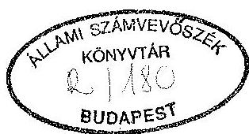
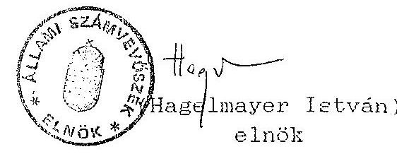
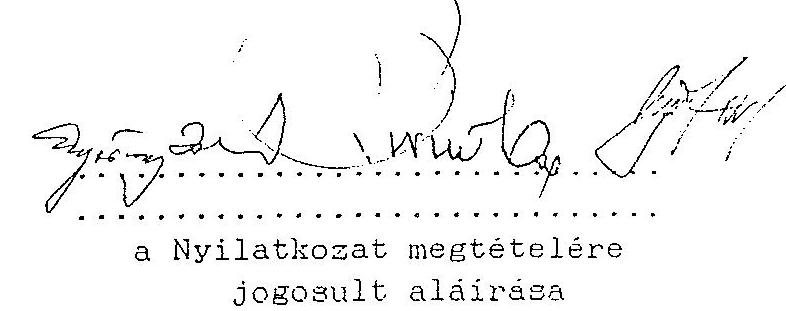

# Sallami Számverösxék 

## JELENTÉS

a Demokrata Koalíció
1991-1993. évi gazdálkodása törvényességének ellenôrzéséről

---

Vizsgálatot vezette: dr. Elek János osztályvezető főtanácsos

Vizsgálatot végezték: dr. Szávai Tamás számvevõ tanácsos Tóth István számvevő tanácsos

---

# ALLAMI SZAMVEVOSZEK 

$\mathrm{V}-1012-25 / 1993$
Témaszám: 181

## J E L K N T E S

a Demokrata Koalíció 1991 - 1993. évi gazdálkodása törvényességének ellenôrzéséről

I.

A vizsgálat célja, módszere, idôszaka, körülményei

A pártok müködésérôl és gazdálkodásáról szóló - többször módositott - 1989. évi XXXIII. törvény (továbbiakban: párttörvény) 10. 8. (1) bekezdése, valamint az Allami Számvevõszékrõl szóló 1989. évi XXXVIII. törvény 5. 8-a alapján a pártok gazdálkodása törvényességének ellenôrzésére az Allami Számvevõszék (továbbiakban: ASZ) jogosult. A törvènyi felhatalmazás alapján az ASZ 1993. II. félévi munkatervében rögzített ütemezésnek megfelelôen került sor a Demokrata Koalíció (továbbiakban: párt) gazdálkodása törvènyességének ellenôrzésére.

Az ellenôrzés célja annak megállapitása volt, hogy a párt müködéséhez szabályszerűen igénybevehetõ forrásokat használ-e fel, a párttörvényben elôírt gazdálkodó tevékenységet folytatott-e, valamint betartotta-e a gazdálkodással összefüggõ pénzügyi-számviteli szabályokat.

Az ellenôrzött idôszak 1991. január 1-tôl 1993. június 30-ig terjedt. A helyszíni ellenôrzés 1993. augusztus 10-tôl szeptember 30 -ig tartott.

---

Az ellenőrzés módszere szúrópróbaszerũ vizsgálat volt, a párt központjában rendelkezésre bocsátott, - a központi irodában és a helyi szervezetek által kiállitott - iratok, dokumentumok alapján, figyelemmel a Magyar Közlöny 1991. évi 28. számában közzétett vizsgálati programra.

Az ellenőrzés módszereit és a vizsgálat által támasztott követelményeket, következtetéseket az egyes évek tekintetében eltérően kellett alkalmazni. A számvitelről szóló 1991. évi XVIII. tv., valamint a párttörvényt módosító 1992. évi LXXXI. tv. 1992. január 1-jei hatállyal módosította a pártok számviteli nyilvántartási rendszerét, valamint a közvélemény tájékoztatását szolgáló, évente a Magyar Közlönyben kötelezôen közzéteendő - előző évi gazdálkodásról szóló - beszámoló tartalmát.

Az Állami Számvevõszék a Párt gazdálkodása törvényességét ezúttal másodizben vizsgálta. Az előző vizsgálat 1992. év tavaszán volt. Tekintettel arra, hogy a vizsgálat idõszakában a párt könyvvezetésében az 1991. gazdasági évet még nem zárták le, és ekkor az ASZ csak pénzügyi zárómérleggel lezárt teljes évet ellenőrzött, a vizsgálat megállapításai csak az 1990-es gazdálkodási évre terjedtek ki. A vizsgálat több törvénysértést tapasztalt, mellyel kapcsolatban a személyi felelősség megállapítására és a vizsgálatról készült jelentés párt részére történő közvetlen átadására a párt ügyvezető elnökének halála miatt nem kerülhetett sor. A jegyzőkönyv elkészülésének idópontjában ugyanis a Fővárosi Bíróságon bejegyzett képviselöje a pártnak nem volt.

Az Állami Számvevõszék elnöke a törvénysértések megszüntetése érdekében 1992. júniusában bírósági eljárás megindítását inditványozta a Magyar Köztársaság Legfőbb Ugyészének. Az első-

---

fokú bíróság a Párt gazdálkodásának ellenőrzésére felügyelőbiztost rendelt ki, amelyet a Párt megfellebbezett. A vizsgálat befejezéséig a fellebbviteli eljárás még nem fejeződött be.

# II. 

## A Párt gazdálkodásáról szóló éves beszámolók ellenőrzési tapasztalatai

## 1.) Altalános megállapítások

A párttörvény 9. 8. (1) bekezdése értelmében a pártok kötelesek az előző évi gazdálkodásukról szóló beszámolót (a továbbiakban: pénzügyi zárómérleg) - a törvényben meghatározott formában - a Magyar Közlönyben közzétenni. A közzététel végsõ határideje az 1992. gazdasági évtől kezdődően a következõ év április 30-a, illetve a törvénymódosítást megelőző időszakokban a tárgyévet követő március 31-e. A Párt az 1991. évi pénzügyi zárómérlegét (1. sz. melléklet) késéseel 1992. december 18-án, míg az 1992. évi pénzügyi zárómérlegét (2. sz. melléklet) idöben, 1993. április 2-án tette közzé a Magyar Közlönyben.

A közzétett pénzügyi zárómérlegek nem feleltek meg számviteli törvényben 1992. évtől érvényes módon konkrétan megfogalmazott, de értelemszerüen a korábbi idõszakban is érvényesülö számviteli alapelveknek, mely következtében föösszegükben és részleteikben nem a tényleges állapotot tükrözik. Az ellenőrzés tapasztalata szerint a pénzügyi

---

zárómérlegek tartalmát illetően a következö számviteli alapelvek nem tel.jesültek.

- A TELJESSEG ELVET sérti, hogy a pénzügyi zárómérlegek nem tartalmazzák a párt valamennyi helyi, regionális szervezetének gazdálkodási adatait, valamint az országos központnál - a bizonylatolási hiányosságok következtében - nem állapítható meg a könyvelt gazdasági események teljeskörüsége.
- A KOVETKEZETESSEG, VILAGOSSAG és FOLYTONOSSAG ELVET sérti, hogy az 1992-ben évközben könyvvezetési módszert változtattak. Az év elsõ négy hónapjában az egyszeres könyvvezetést számítógépes módszerrel, míg az azt követö időszakban naplófőkönyv alkalmazásával végezték. Az egyes azonos gazdasági eseményeket alkalmanként eltérő oszlopba könyvelték. Nem biztosították a megfelelő kapcsolatot a pénzügyi zárómérleg egyes sorai és a könyvelés adatai között. A könyvvezetés elözö évi záró és a tárgyévi nyitó adatai eltértek egymástól.
- A VALODISAG ELVET sérti, hogy a pénzügyi zárómérlegek egyes sorai nem felelnek meg a tényleges állapotnak, valamint némely könyvelési tétel esetében hiányzott a megfelelő bizonylati alátámasztás.
- A BRUTTO ELSZAMOLAS ELVET sérti, hogy a béreket és az elszámolási elölegeket sok esetben nem a bevételek és költségek, illetve követelések és kötelezettségek teljes összegével, hanem azok egyenlegével, egymással szemben számolták el.

---

A jelentés a pénzügyi zárómérlegekkel kapcsolatos részletes megállapításokat évenként elkülönítetten tartalmazza.

Az ellenőrzésnek a zárómérlegek vizsgálata során figyelemmel kellett lennie arra, hogy a pártvezetés az 1991. és 1992. évi könyvvezetést olyan rosszminőségünek találta, hogy azt 1993. évben újrakönyveltette. Az 1991. évi pénzügyi zárómérleg az eredeti, az 1992. évi az újrakönyvelt adatok alapján készült.

# 2.) Részletes megállapítások 

### 2.1. Az 1991. évi pénzügyi zárómérleg ellenőrzése

A közzétett pénzügyi zárómérleg teljességének hiányára mutat, hogy

- egyes regionális szervezetek, illetve alapszervezetek egyáltalán nem adtak számot éves gazdálkodási adataikről, tagdij és egyéb bevételeikről, kiadásaikról, és a kapott ellátmányokkal sem számoltak el;
- az egyes régióközpontok elszámolásai eltérő tartalmuk, szerkezetük miatt nem alkalmasak arra, hogy azokból hitelt érdemlő módon megállapítható lenne teljeskörüségük, vagyis, hogy valamennyi a régióhoz tartozó helyi szervezet gazdálkodási adatát tartalmazzák-e. A gazdálkodási tevékenységet nem folytató szervezetek vezetőitől nem kértek erre vonatkozó nyilatkozatot, melyben tanúsítják, hogy a beszámolási időszakban semmilyen bevétellel (pl. tagdij, adomány, stb.) nem rendelkeztek és kiadásaik nem voltak;

---

- a Párt országos központjába beérkezett bizonylatolt bevételek közül összesen 251282 Ft, a bizonylatolt kiadások közül pedig több tételből álló 202950 Ft összeget nem könyveltek, így azokat a pénzügyi zárómérleg sem tartalmazza:
- a tagdíjként könyvelt és a pénzügyi zárómérlegben akként szerepeltetett bevételek egy részéről a könyvelési dokumentumok alapján nem állapítható meg egyértelmüen, hogy azok valóban tagdijakból származtak-e;
- a textilértékesítésből származó 1991. évi 377789 Ft bevételt a pénzügyi zárómérlegben nem a gazdálkodó tevékenységből származó, hanem egyéb bevételként mutatták ki.

A pénzügyi zárómérleg kiadási oldalán a "Hozzájárulások juttatása" címszónál nem tüntettek fel adatot, holott az ellenőrzés megállapítása szerint úgy az országos központ mint a többi szervezetek többszázezer forint értékben nyújtottak alapítványoknak, iskoláknak, óvodáknak és más, társadalmi szervezeteknek támogatást.

A mérleg kiadási oldala 614875 Ft halmozódást tartalmaz amiatt, hogy a bérekből levont személyi jövedelemadó elôleget és nyugdijjárulékot helytelen módon az "adók, illetékek" soron is feltüntették. Ezt az összeget ugyanis a "Munkabérek" elnevezésű mérlegsoron a kifizetett munkabéreknél a helyesen számfejtett (bruttó) értékben már egyszer kimutatták.

---

A mérleg "költségtérítések, napidijak" elnevezésủ során nem tüntettek fel kiadást annak ellenére, hogy a pártnál utazási költségtérítésként jelentős összeget fizettek ki. A mérleg "szociális támogatás, helyiségek bérlete, adminisztrációs és postaköltségek" elnevezésű sorain a könyvelési adatokkal ellentétben szintén nem tüntettek fel kiadási összeget. A "sajtó- és propagandaköltségek" mérlegsora a naplófôkönvv anyag- és árubeszerzés oszlopának éves adatát tartalmazza.

# 2.2. Az 1992. évi pénzügyi zárómérleg ellenôrzése 

A Magyar Közlönyben közzétett pénzügyi zárómérleg az elôzö évben is megmutatkozó problémák miatt nem tekinthetö teljeskörünek. A helyi szervezetek és a régióközpontok gazdálkodási adatait tartalmazó eltérő szerkezetü és tartalmú feladások, illetve kigyüjtések alkalmatlanok voltak a teljesség ellenőrzésére, az esetleges halmozódások kiszürésére, valamint az új rendszerü pénzügyi zárómérlegben szereplő új értelmezést kapott egyes mérlegsorok tartalmának egyértelmü biztosítására.

Ez utóbbi nem róható fel egyértelmüen a párt számára, ugyanis a pártok módosított tartalmú beszámolóját elöíró törvénymódosítás - melyet értelmében már az 1992. év gazdálkodási adatait az év kezdetétől csoportosítani kellett volna - 1992. december 28-i Magyar Közlönyben tették közzé.

Ugyancsak hiányzott a zárómérlegben feltüntetett bevételek közül az egy idöben és két részletben a bankszámlára teljesített 208000 Ft-os készpénz befizetés.

---

A naplófôkönyv évvégi zárásánál a nyilvántartott elszámolási elólegböl 501000 Ft -ot megfelelô bizonylat és indoklás nélkül az egyéb költségek oszlopba könyvelték át. Ezzel az összeggel a mérleg kiadását indokolatlanul növelték.

A közzétett pénzügyi zárómérlegben kimutatott összes bevétel (19 068054 Ft) és összes kiadás (18 596565 Ft) egyenlege 481498 Ft tárgyévi bevételi többletet mutat. A vizsgálat azonban megállapította, hogy az nem egyezik a naplófôkönyv összevont éves pénztár- és bankforgalmi egyenlegével, mely 238447,2 Ft folyóévi hiányt mutat. A pénztári forgalomban 145933,2 Ft olyan bevételt és 2210931,9 Ft olyan kiadást könyveltek, amit a pénzügyi zárómérleg összeállításánál nem vettek figyelembe. A jelzett könyvelési tételek figyelembevétele esetén az 1992. évi egyenleg 1607260,7 Ft hiányt mutatna, amiböl az állapítható meg, hogy a pénzügyi zárómérlegben szereplő̉ bevételi és kiadási adatok nem egyeznek az annak alapjául szolgáló könyvelés adataival.

# III. 

A pénzügyi zárómérleget alátámasztó könyvviteli megállapítások

## 1. Könyvvezetés

### 1.1. Altalános megállapítások

A párt alapszabálya a regionális központoknak és az alapszervezeteknek nem biztosít önálló jogi személyiséget, ezért a párt egésze egyetlen jogi személy. Ezzel össz-

---

hangban a párt egésze egyetlen könyvvezetésre kötelezett szervezet. Az alkalmazott könyvvezetési gyakorlat ezzel teljes egészében összhangban van, ugyanis egyetlen könyvvezetési hely a párt országos központja. A Párt az alkalmazható könyvvezetési módok közül az egyszeres könyvvitelt, azon belül a napló főkönyvi könyvelési módszert választotta. A régióközpontok csak pénztárkönyvet és esetleg banknaplót, míg a helyi szervezetek általában pénztárkönyvet vezettek. Ezeknek a bevételeit és kiadásait a naplófőkönyvben csak a gazdasági év végén régióközpontonként egy soron összevontan könyvelték.

1991-1992. években a főkönyvelő személyében és így a naplófőkönyv vezetésében 5 esetben volt változás. A személyi változás minden esetben annak volt a következménye, hogy a naplófőkönyv vezetésében a vezetés hiányosságokat tapasztalt.

A hiányosságokat látva a pártvezetés 1993-ban külső könyvelő céget bízott meg az 1991-1992. évi gazdasági események újrakönyvelésével. Az újrakönyvelés azonban csak részben tudta kiküszöbölni a korábbi hiányosságokat. A könyvvezetés 1993. január 1-jétől folyamatos.

A jelentés a könyvvezetéssel kapcsolatos részletes megállapításokat évenként elkülönítetten tartalmazza.

# 1.2. Részletes megállapítások 

1.2.1. Az 1991. évi könyvvezetés
1991. január 1-július 31-ig tekinthető folyamatosnak a könyvelés. Ebben az időszakban a pénzügyi eseményeket

---

megtörténtük sorrendjében könyvelték le. Emellett azonban elöfordultak olyan gazdasági események is, amelyeket nem könyveltek.

A könyvelt kiadásokról készült kiadási pénztárbizonylat, míg a pénztári bevételekről bevételi pénztárbizonylatot nem állítottak ki. Igy fordulhatott elő, hogy 200000 Ft banki készpénzfelvétel és 39200 Ft textilértékesítésböl származó bevételt nem a pénztárbevételek között könyveltek.

1991 augusztusától a könyvelő személye megváltozott, ami a könyvvezetés gyakorlatában is változást eredményezett. Ettől az idóponttól a pénzügyi események könyvelése kizárólag az alapbizonylatok alapján történt.

Tekintettel azonban arra, hogy a kiadások között gyakori volt a számviteli elöírásoknak nem megfelelő átvételi elismervény, illetve a számozatlan nyugta alapján való kifizetés, hivatkozási szám hiányában nehezen azonosíthatók az egyes könyvelési tételek az alapbizonylattal. Gyakori eset, hogy a kifizetésről kiállított nyugtát a könyvelés bizonylatai közé nem füznek le.

Nem könyveltek el a könyvelt tiszteletdíjak és munkabérekkel azonos bizonylatokon elszámolt 202950 Ft költségtérítés jellegủ kiadást sem.

A könyvelést nem idōrendi sorrendbe végezték. A könyvvitel rendjéről és a számvitel bizonylati rendjéről szóló PM rendeletek elöírásait nem tartották be. Ez akadályozza a könyvelés valódiságának, illetve hitelességének megité-

---

lését. A pénzkifizetéseket a párt részéről nem utalványozták, így nem állapítható meg a kifizetés, illetve a könyvelés jogossága. Igy fordulhatott elő az is, hogy egy 1991. június 13-án átutalással kiegyenlített 27680 Ft-os számlát 1991. november 28-án 9112845. sz. kiadási pénztárbizonylaton újra kifizettek.

Ev végén a könyvelési nyilvántartások szabályszerű zárását nem végezték el, így a párt 1991. december 31-i tényleges pénzügyi helyzete hitelt érdemlően nem állapítható meg.

Az újrakönyvelés alkalmával sem sikerült az eredeti könyvelés hiányosságait maradéktalanul megszüntetni, nem került be a könyvelésbe a párt valamennyi szervezeti egységének összes gazdasági adata és a szükséges egyeztetéseket, ellenörzéseket nem végezték el.

# 1.2.2. Az 1992. évi könyvvezetés 

1992. gazdasági évben január 1. és május 3. közötti időszakra a gazdasági események könyvelése számítógépen utólag történt meg. A könyvelés megbízhatatlanságát jól érzékelteti az a körülmény, hogy a bank nyitó egyenlege nem egyezik meg a bankkivonat nyitó egyenlegével. A pénztárt nulla egyenleggel nyitották és bizonylatolatlan kiadási és bevételi forgalmak után jutottak el egy nyitó egyenleghez. A tényleges nyitó pénztári pénzkészlet hitelt érdemlő leltár (rovanos) hiányában nem megállapítható. Ebben az idõszakban a pénztári ki- és befizetéseket kiadási- és bevételi pénztárbizonylat nélkül könyvelték. A könyvelés alapjául szolgáló alapbizonylatokról többnyi-

---

re nem lehet egyértelmüen megállapítani, hogy azok valós gazdasági eseményt rögzítenek-e. Hiányzik az utalványozás, és nem állapítható meg egyértelmüen a kiadás, illetve a bevétel megtörténte, a pénzfelvevõ vagy befizetõ személye.

A könyvelési idõszak végén a pénztári készpénzkészletnek a könyvelés adatai szerint több mint 3060000 Ft-nak kellett volna lennie. Ennek ellenére az 1992. május 5 -ével kezdõdõ új könyvelés csupán 350000 Ft pénztárkészlettel indul. A tényleges pénztári készpénzkészlet állományát itt sem rögzítette hiteltérdemlõ leltár, vagy egyéb bizonylat. További 500000 Ft banki befizetésként jelentkezik anélkül, hogy a pénztárból kiadták volna. A pénztárhiány tényérõl és a rendezés módjáról jegyzökönyvet nem vettek fel.

Az 1992. május 5. és november 9. közötti könyvelési idõszakban 352832 Ft értékben könyveltek olyan kiadásokat, amelyeket nem ebben a gazdasági idõszakban, hanem május 5-e elött fizettek ki és 114250 Ft értékben könyveltek olyan kiadásokat, amelyek a valóságban meg sem történtek. Nem megfelelõ bizonylat alapján könyveltek 382000 Ft bevételt. Október 20-án ugyanis 2000 osztrák schillinget vásároltak hivatalos kiküldetéshez. Ennek azonban a könyvelésben nem található nyoma. A lekönyvelt kiadási és bevételi pénztárbizonylatokról az esetek döntõ részében hiányzik az utalványozás és a felvevõ, illetve a befizetõ aláírása.

---

1992. november 9. és december 31. között a gazdasági eseményeket csak az újonnan bevezetett pénztárkönyvben rögzítettek.

A párt regionális és helyi szervezeteinek 1992. évi gazdálkodási adatait az országos központ könyvelése nem tartalmazta. A számviteli törvény értelmében e szervezetek adatait már évközben folyamatosan rögzíteni kellett volna az országos központ naplófőkönyvében.

Az újrakönyvelés során megállapítást nyert, hogy 1992. május 3-án az első könyvelés befejezésekor 2210931,90 Ft pénztárhiány volt, ezt úgy rendezték, hogy jegyzökönyvi alátámasztás nélkül azonos összeguu kiadást könyveltek.

A kiadást azonban költségnem szerint elmulasztották könyvelni. A hiány megállapításánál nem vették figyelembe az ebben az idôszakban teljesített, de a következõ könyvelésben könyvelt kiadásokat és bevételeket. Ezzel a hiányt a ténylegesnél nagyobbnak állapították meg.

Az 1992. május 5. és november 11. közötti idôszak újrakönyvelése során elhagytak a könyvelésből 135000 Ft kiadást, amely kétszeres könyvelésböl származott. Az új könyvelés nem tartalmazza a hiányzó 937164. sz. bevételi pénztárbizonylat alapján könyvelt 174000 Ft-os bevételt. A könyvelés továbbra is tartalmazza az 1992. május 22 -én temetési számlakiegyenlítés címén könyvelt 29250 Ft tartozatlan és az 1992. július 9-én útiköltség elszámolás címén könyvelt 85000 Ft kétszeres kiadást, valamint több, korábban eszközölt kifizetést.

---

Ezen könyvelési idôszak végén - az újrakönyvelt adatok alapján a pénztári tényleges pénzkészlet figyelembevételével - az úirakönyvelés 145933 Ft-os kifizetési többletet állapított meg. A többletet úgy rendezték, hogy bizonylati alátámasztás és jegyzőkönyv felvétele nélkül a többletkifizetéssel azonos összeget bevételeztek a pénztárba, megteremtve ezzel az egyezőséget.

Az 1992. november 11. utáni gazdasági események újrakönyvelési hiányosságai közé tartozik, hogy az elszámolásra kiadott pénzeket gyakran nem az elszámolási elölegek között könyvelték, hanem egyéb költségként egyből elszámoltak. Más esetekben pedig az elöleggel való elszámolás után azzal az elölegeket nem csökkentették. A gazdasági események nem teljeskörü könyvelésére utal, hogy két alkalommal olyan összegü elszámolási elöleggel számoltak el, amilyen összegü elöleget a könyvelés nem tartalmazott.

Az év végi zárás során az elszámolási elölegként nyilvántartott kiadásokat bizonylati alátámasztás nélkül 501 E Ft-tal csökkentették az egyéb kiadások egyidejü növelése mellett.

Ez a könyvelési mũvelet azt eredményezte, hogy év végén az elszámolási elölegek kiadása és elszámolása 416950 Ft pozitív egyenleget mutat, ugyanis ennyivel több elöleggel számoltak el, mint amennyit kiadtak.

A párt regionális és helyi szervezeteinek gazdálkodási adatait (már amelyik adatszolgáltatási kötelezettségének

---

eleget tett) á újrakönyvelés során december 31-ei dátummal a naplófôkönyvbe bevezették.

# 1.2.3. Az 1993. évi könyvvezetés 

1993-ban a könyvelés a bizonylati alátámasztás szabályszerűbbé válása következtében javult, ennek ellenére azonban a könyvelés még mindig számos hiányosságot tartalmaz, így nem felel meg a számviteli törvény elöírásainak.

A fơbb hiányosságok a következök:

- "Egymásért Szociális" Kft.-töl felvett 530000 Ft kölcsönt a kötelezettségek között nem könyvelték.
- pénztárbizonylat alapján 175601 Ft kiadást könyveltek el 3100 DM készpénzes vásárlásaként. A kifizetést teljes egészében egyéb kiadásként könyvelték el annak ellenére, hogy a tényleges felhasználásra vonatkozó dokumentumokat a könyvelési bizonylathoz nem csatolták. A valuta személyek által történt átvételét tanúsitó dokumentumot csak 2480 DM-ről tudtak bemutatni;
- a naplófôkönyvben negyedéves zárásokat hajtottak végre ceruzás bejegyzéssel. Esetenként a könyvelési alapadatokat is csak ceruzával rögzítettek;
- 1993 közepén a korábban alkalmazott költségnemek szerinti könyvelésről áttértek a párttörvény mellékletében szereplő beszámolóval összhangban lévő felhasználási célok szerinti könyvelésre. A naplófôkönyv oszlopainak

---

átfejelését azonban nem végeztẻk el, igy a könyvelés áttekinthetetlen. Az eljárás a számviteli törvény alapelveivel összeegyeztethetetlen, ugyanis sérti a következetesség és a folyamatosság elvét;

- a számviteli törvényben megfogalmazott teljesség elvét sérti, hogy a regionális és helyi szervezetek gazdálkodási adatait a könyvelés nem tartalmazza;
- néhány pénztári kifizetést 396 E Ft értékben költségként nem könyveltek, mig 5000 Ft tiszteletdij kifizetésének az összege nem, csak tényét rögzitették a naplófökönyvben.
2.) Analitikus nyilvántartások és a bizonylati rend ellenörzése
2.1. 1991-ben és 1992-ben a kötelezöen elöirt analitikus nyilvántartások közül csak az SZJA köteles kifizetések nyilvántartását vezették.

Alló- és tartós fogyóeszközök egyedi nyilvántartását, a szállitók követelését, az elszámolásra kiadott elölegek egyedi nyilvántartását, a dolgozók tartozását és a vásárolt értékcikkek egyedi nyilvántartását ebben az idöszakban nem vezették. 1993. január 1-jétöl a párt valamennyi kötelezö analitikus nyilvántartást vezeti.
2.2. A párt házipénztári pénzkezelési szabályzata már 1990-ben kijelölte a szigorú számadási kötelezettségú nyomtatványok körét és szabályozta azok használatának és nyilvántartásának feltételeit. Ennek ellenére 1993. január 1-jéig a szigorú számadású nyomtatványok nyilvántartását nem

---

vezették, így a szigorú számadás nem valósult meg. 1993. január 1-jétől a nyomtatványok nyilvántartását elöirásszerűen vezetik.
2.3. A pénztárbizonylatok kiállítását az 1990. évtől hatályos házipénztári pénzkezelési szabályzat szabályozta. Elöirta, hogy a pénztári bevételekről minden esetben bevételi, a kiadásokról pedig kiadási pénztárbizonylatot kell kiállítani. Elöirta a szabályzat továbbá azt is, hogy kifizetést teljesíteni csak szabályszerűen kiállított és utalványozott kiadási pénztárbizonylat alapján lehet. Ennek ellenére 1991. január 1 - 1992. november 18. közötti időszakban ezeket az előirásokat, valamint a számviteli jogszabályoknak a bizonylatok tartalmi követelményeit rögzítő előirásait nem tartották be.

Egyes esetekben nem a párt nevére kiállított számlára teljesítettek kifizetéseket. Ezek a szervezetek: Mike Quinn Fitness Club, Salgótarjáni Fenyö Sportegyesület és Kemerovó Sport Club Salgótarján. Olyan kifizetések is előfordultak, melyek számláin a vevö neve ismeretlen, vagyis a párt neve a számlán nem szerepel.

Nem állapítható meg, hogy a számlák ellenértéke ténylegesen kifizették-e, illetve, hogy az azokon szereplő vásárlás valóban a párt döntése alapján történt-e.
1992. november 18-től a pénztári pénzmozgásokról kiállított bizonylatok megfelelnek a számviteli törvény tartalmi követelményeinek. Azonban 1993-ban is tapasztalt az ellenőrzés olyan esetet, amikor a kiadási pénztárbizony-

---

latot nem a tényleges kiadás idõpontjában állitották ki, illetve amikor az utalványozás idõpontja kétséges.

# 3.) A párt deviza felhasználása 

A párt devizafelhasználásának mennyisége és szabályszerűsége a könyvelési és pénztárbizonylatok elõlegnyilvántartások, valamint útielszámolások hiányában nem állapítható meg. A vizsgált idõszakra vonatkozóan a párt nem rendelkezik a Külkereskedelmi Bank kivonataival, így a vásárolt valuta mennyisége, fajtája és forint értéke sem határozható meg.

A pénztárban az 1991-1992. évi utazások valuta kiadásával és felhasználásával kapcsolatban semmilyen bizonylatot. vagy dokumentumot nem talált az ellenôrzés. Az 1993. májusában vásárolt 3100 DM felhasználásáról hiányos és ellentmondó dokumentumok állnak rendelkezésre. Egy jegyzéken napidíjként négy fõ személyenként 620 DM átvételét ismeri el aláírásával, 1993. május 4-1 dátummal, majd egy a kiküldöttek által készített és aláirt másik feljegyzésben már 775 DM átvételét igazolták. A dokumentumok a kint tartózkodás idõtartamára és a gépkocsivezetõ személyére vonatkozóan is ellentmondó adatokat tartalmaznak.

A párt a 30/1992. (II.13.) Korm. rendelet 7. .-ában elöirtak ellenére a deviza ellátmány formáját, eseteit, a differenciálás elvét és mértékét az ellenőrzés idõpontjáig nem szabályozta. Szabályzat hiányában a tényleges felhasználás jogossága nem állapítható meg.

---

A magánszemélyek jövedelemadójáról szóló 1991. évi XC. tv. 1993-ban adóköteles bevételnek tekinti az ideiglenes, illetve tartós külföldi kiküldetéssel összefüggésben kapott devizaellátmányt. Ennek ellenére a kiutazott személyekre vonatkozó SZJA köteles kifizetés nyilvántartásban az ellátmány forint értékét nem tüntették fel, az után SZJA elöleget nem vontak le.

Az 1992. október 20-án vásárolt 2.000 osztrák schilling és 1993. május 4-én vásárolt 3.100 német márka (DM) felhasználásának ellenőrizhetetlensége miatt az ASZ-nak a Magyar Nemzeti Banknál vizsgálatot kell kezdeményeznie annak megállapítására, hogy történt-e törvénysértés.

# IV. 

A párt bevételi és bevételszerzõ gazdasági tevékenysége

A párttörvény 4. §-a részletesen körülhatárolja a pártok vagyonának megengedett forrásait, míg a 6. §. a párt engedélyezett bevételszerzõ gazdálkodó tevékenységét határozza meg.

A könyvelésben tagdijbevételként kimutatott bevételek közül a helyi szervezetek által beszedett tagijak esetében - az eredeti befizetési bizonylatok hiányában - több esetben nem lehetett hitelt érdemlő módon megállapítani a bevétel valós jogcímét. Ezt a hiányosságot az 1993. évi tagdijak esetében kiküszöbölték.

Egy személy 1992. december 29-én a párt által alapított kft-töl korábban felvett kamatmentes kölcsönét 100000 forintot a párt pénztárába fizette vissza. Ezt a bevételt, mely nem

---

a pártot illeti a kft-nek még nem adták át és a párt könyvelésében kötelezettségként sem mutatták ki.

A párt által adott nyilatkozat szerint (3. sz. melléklet) a párt tiltott pénzforrásokat nem fogadott el és tárgyi adományt nem kapott. A saját alapítású kft gépkocsiját a párt használja.

Tiltott gazdálkodó tevékenységnek minősül 1990. és 1991. évben a TEMAFORG-tól vásárolt használt bálás ruha értékesítése, melyböl 1991. évben 377789 Ft bevétel származott. A tiltott tevékenységet 1992. évben már nem folytatták.

A párt egyszemélyes kft-t alapitott, melytöl a vizsgált időszakban nyereségből adódó bevételt nem kapott. Bevételszerzõ gazdálkodó tevékenységként a Kunszentmártoni Regionális Szervezet 1993. évben a párttörvényben nem engedélyezett temetőgondozást végez, melyért havi 2000 Ft díjazásban részesül. Az ellenőrzött 1993. I. félévben az igy elért bevétel 12000 Ft volt. Ez a tevékenység azonban nem tartozik a párttörvény 6. .. (1) bekezdésében engedélyezett gazdálkodó tevékenységek közé, ezért az abból származó bevételre vonatkozóan a párttörvény 6. . (5) bekezdésében foglaltak szerint kell eljárni. A párt a politikai céljainak megismertetése érdekében készült kiadványokért bevételt nem szedett, a pártot szimbolizáló jeivényeket és más ilyen célú tárgyakat nem árusitott, pártrendezvényekböl bevételt nem ért el és a tulajdonban álló ingókat, ingatlanokat dij ellenében nem hasznositotta.

---

# V. 

## Az 1992. évi ASZ vizsgálat és a menetközben feltárt hiányosságok alapján tett intézkedések

Az előző, 1992 tavaszán végzett Számvevôszéki vizsgálat az 1990-es gazdasági évet vizsgálta és több törvénysértést állapított meg. A bevezetőben vázolt körülmények miatt a megállapításokat tartalmazó jelentést a vizsgálat befejezésekor nem volt mód a párt részére átadni. A jelentés tartalma 1993. június hónapban vált ismertté a pártvezetés számára. A feltárt hibák egy részét az új vezetés is észlelte, ezért azok felszámolása érdekében már a jelentés tartalmának megismerése elôtt 1992. májusától kezdôdően több intézkedés történt. Igy például megszüntették a használt ruhák értékesítését.

A korábbi elnök halálát követően választott új vezetőség világosan felmérte a könyvelésben tapasztalt hiányosságokat. Az irodavezetői feladatokat ellátó személy ellen sikkasztás és magánokirat-hamisítás miatt büntető feljelentést tett. A jobbítás szándékával új pénztárost alkalmaztak és új könyvelőt kerestek. A választás azonban nem minősült szerencsésnek, az új könyvelő és pénztáros tevékenysége alatt további szabálytalanságok, törvénysértések történtek. Ezért a belsô vizsgálat által feltárt bizonyítékok alapján a pénztáros ellen sikkasztás vádjával büntető feljelentést tettek egyidejü elbocsátásával.

A korábbi és a jelen jelentésben foglalt némely megállapítás jövőbeni elkerülése érdekében 1993. szeptember 28-ai dátummal intézkedési terv készült, mely végrehajtása esetén a párt gazdálkodásának törvényessége biztosítható.

---

A könyvvitel rendjének helyreállítása érdekében 1993. évtől egy könyvelői vállalkozást bíztak meg a könyveléssel, mely az 1991. és 1992. évi gazdálkodás eseményeinek újrakönyvelésével megkísérelte a gazdasági események rekonstruálását. A tényleges helyzetfeltárást nehezítette, hogy egyes - az országos központra vonatkozó - alapbizonylatok hiányoztak, némely bizonylatról nem derült ki a gazdasági esemény tényleges bekövetkezése (pénz átvevő-átadó aláírásának hiánya), a gazdasági esemény konkrét jellege és a helyi szervezetek, régióközpontok hiányzó elszámoltatása, valamint ezek alapbizonylatainak bekerése nem történt meg. Az eredeti könyvvezetés hiányosságai és a pénzállomány rendszeres ellenőrzésének (rovancsolásának) hiányában 1992. november 18 -áig nem lehetett a házipénztár tényleges hiányára, illetve többletére sem következtetni.

A párt központjában a könyvelés 1993. január 1-jétől tekinthető folyamatosnak, de a vezetett naplófőkönyv még nem tartalmazza a régióközpontok és helyi szervezetek adatait. Az I. félévi halmozott adatok összegyújtésére kísérlet történt, de ezek még nem voltak könyvelésre alkalmasak.

A beszámolóval szemben támasztott szempontok (teljesség, világosság, közérthetőség és ellenőrizhetőség) megteremtése érdekében a helyszíni ellenőrzés ideje alatt a párt vezetése a számviteli törvény elöírásainak figyelembevételével a könyvvezetés szabályainak kialakításán dolgozott.

# VI. 

Felhívás a szükséges intézkedések megtételére

A vizsgálat tapasztalatai alapján a pártvezetés által már megtett intézkedések figyelembevételével a párttörvény 10. . (4)

---

bekezdésében kapott felhatalmazás alapján felhívom a párt elnökét, hogy

1. a törvényes állapot helyreállitása érdekében a könyvelésben még tapasztalható hiányosságok kiküszöbölésével a pontositott könyvelés alapján a pénzügyi zárómérlegeket ismételten készittesse el és a Magyar Közlönyben tegye közzé;
2. rendelje el a párt gazdálkodásának a számviteli törvénnyel összhangban lévő szabályozását és gondoskodjon annak betartásáról;
3. gondoskodjon arról, hogy az elszámolási kötelezettség mellett kiadott pénzeszközökkel az érintett személyeket és szervezeteket teljeskörűen számoltassák el;
4. a Kunszentmártoni Regionális Szervezetnél tiltott gazdálkodást szüntessék be. Tegyen intézkedést az 1993. június 30-ig a tiltott tevékenységböl származó 12000 Ft bevételnek a párttörvény 6. . (5) bekezdésében elöirtak szerinti befizetésére.
5. az 1993. évben a magánszemélyek jövedelemadójáról szóló törvény által adóköteles kifizetéssé nyilvánított külföldi kiküldetési ellátmányoknak az érintett személyekre vonatkozó nyilvántartásban való szerepeltetésére tegyen intézkedést;
6. az előző ÁsZ vizsgálat által feltárt hiányosságok kiküszöbölése érdekében készített intézkedési tervben foglaltakat hajtsa végre.

Budapest, 1993. december " 10 ".

Melléklet: 3 db

---

A Demokrata Koalíció 1991. évi pénzügyi zárómérlege

## A) Tényleges bevételek

1. Tagdijak
2. Állami költségvetésbôl származó támogatás
a) alapösszeg
b) a pártra adott szavazatok arányában kapott osszeg

## 14196000

14196000 -
3. Egyéb hozzájárulások
a) jogi személyektól

- ebből 500000 forint feletti hozzájárulás a következõ belföldiektól
- ebből 100000 forint feletti értéknek megfelelő osszeg a következõ külföldiektól
b) jogi személynek nem minősüló gazdasági társaságoktól
- ebből 500000 forint feletti hozzájárulás a következõ külföldiektól
- ebből 100000 forint feletti értéknek megfelelő osszeg a következõ külföldiektól
c) magánszemélyektól
- ebből 500000 forint feletti hozzájárulás a következõ belföldièktól
- ebből 100000 forint feletti értéknek megfelelő osszeg a következõ külföldiektól

1. A párt propagandatevékenységéból
2. A párt gazdálkodó tevékenységéból
a) bérbevétel
b) értékpapirból származó bevétel
3. A párt által alapított vállalat és korlátozott felelősségủ társaság nyereségétól származó bevétel
4. Egyéb bevétel

Összes pénzbevétel a gazdasági évben
15688065

Forintban
180239
14196000

1. Hozzájárulások juttatása
a) a párt országgyúlési csoportja számára
b) a párt helyi szervei számára
c) a párt által fenntartott vagy támogatott intézmények számára
d) más társadalmi szervezetek számára
e) külföldi intézmények, szervezetek, személyek számára
2. Személyzeti költségek
a) munkabérek 3290379
b) költségtérítések, napidljak
c) társadalombiztosítási hozzájárulások 404492
d) szociális, üdülési stb. támogatások
3694871
3. Általános költségek
a) adók, illetékek 614875
b) épületek fenntartása, karbantartása, közüzemi dijai
c) helyiségek bérlete
d) adminisztrációs és postaköltségek
e) egyéb költség
8196355
8811230
4. Sajtó- és propagandaköltségek
1160283
5. Választásokkal kapcsolatos költségek
6. Egyéb tevékenységgel kapcsolatos költségek
498915
Összes kiadás a gazdasági évben
14165299
C) Tényleges pénzügyi helyzet a gazdasági év zárásakor

Bevételek a gazdasági évben 15688065
Kiadások a gazdasági évben 14165299

Többlet a gazdasági évben 1522766
Halmozott többlet az elózó gazdasági évböl 7738639
Halmozott többlet a gazdasági év végén 9261405
Mráv Jószef s. k., Poroszlay Jenő s. k., az elnökség vezetője az elnökség tagja

---

# 2. sz. melléklet 

## KÖZLÖNY-11112//1993-sz_je1993/20.0.2m

4.3 Magánszemélyektól
4.3.1 Belföldiektól
4.3.2 Külföldiektól
5. A párt által alapított vállalat és korlátolt felelősségủ társaság nyereségéból származó bevétel
6. Egyéb bevétel

Összes bevétel a gazdasági évben
19068054

## B) Kiadások

1. Támogatás a párt országgyúlési csoportja számára
2. Támogatás egyéb szervezeteknek 125000
3. Vállalkozások alapítására forditott ösz- szegek
4. Múködési kiadások
4937677
5. Eszközbeszerzés
675480
6. Politikai tevékenység kiadása
2197004
7. Egyéb kiadások
10666404

Összes kiadás a gazdasági évben
18596565
György István s. k., Mráv József s. k., elnök
ügyvezető elnök
Poroszlary Jenő s. k., gazdasági alelnök

---

# N Y I L A T K O Z A T 

Alulírott , Györy, Istyán, Mráv, Józeef, Poroszlay, Jenö. . . . . . . . mint, a Demokrata.Koalíció elookes, ügyvezetũ elnóke, gazdasági, ajelnyke. . . . . . . -je az Allami Számvevôszék törvényességi vizsgálatát végzõ munkatársai részére kijelentem, hogy a . . Demokrata.Koalíció. . . . . . . . . . . . . . . . . . . . . . . . . . . . . . . . . . . . . . . . . . . . . . . . . . . . . . . . . . . . . . . . . . . . . . . . . . . . . . . . . . . . . . . . . . . . . . . . . . . . . . . . . . . . . . . . . . . . . . . . . . . . . . . . . . . . . . . . . . . . . . . . . . . . . . . . . . . . . . . . . . . . . . . . . . . . . . . . . . . . . . . . . . . . . . . . . . . . . . . . . .

---

- a 6. § (4) bekezdésének megfelelően pénzeszközeit az alább felsorolt értékpapírokba fektette (illetve semmilyen értékpapírral nem rendelkezik): Tudomásunk szerint az elhalt Forrai Sándor pártelnök 2.000.000.-Ft értékú értékpapírt vásárolt 1990. június hónapban.
- az alábbi bankszámlákkal rendelkezik:

Bp. Orsz. Ir., Takar. Bank. Rt. : 219-98698, alsz.sz. : 601050003 , Kunsz. máston: Ker.és Hit. Bank Rt. :453-10119, Salgótarj. :Magyar Hit. Bank Rt. : 370-88884-00413 Szeged: OTP.Körzeti F.: 289-98084, Bp.Pest megyei szerv.: Takarék B.RT.: 219-98698; 'alsz.sz: : 601050031; 'Debrédeñ: : MH8.RT: : 414-10705;

Budapest
1993: mepet. le.

a Nyilatkozat megtételére jogosult aláírása