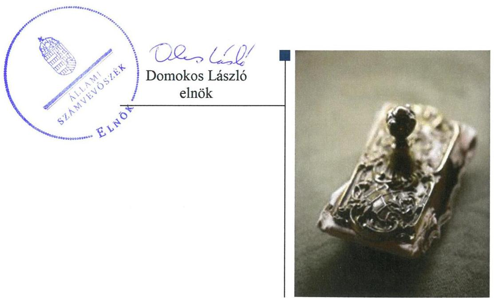
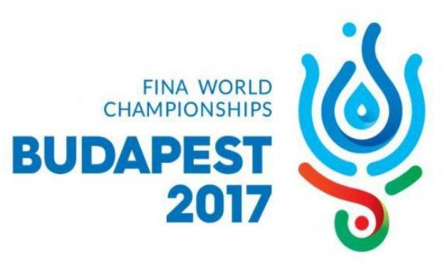
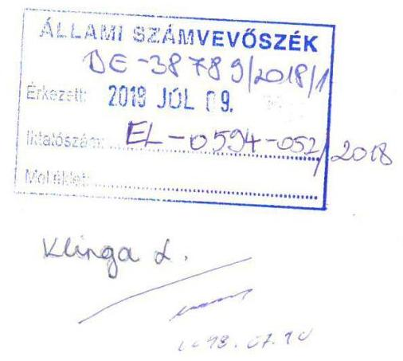
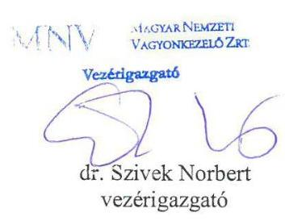
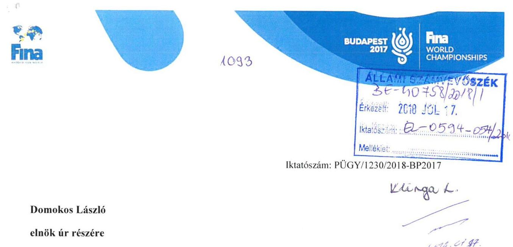
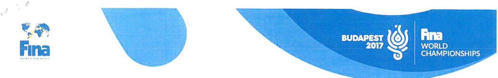
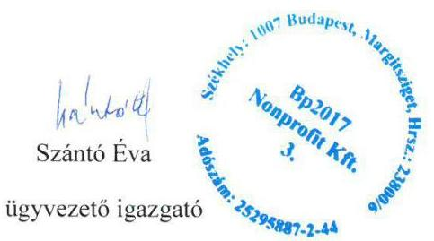
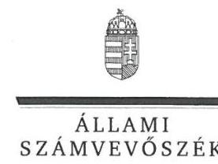
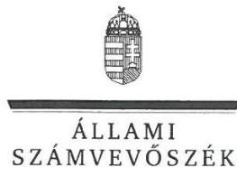
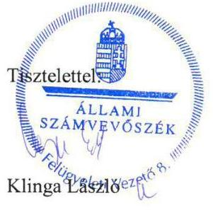

# Jelenetés 

## Az állami tulajdonú gazdasági társaságok ellenőrzése

Bp2017 Világbajnokság Szervező és Lebonyolító Nonprofit Kft.
2018.

---

# Jelentés 

## Az állami tulajdonú gazdasági társaságok ellenőrzése

Bp2017 Világbajnokság Szervező és Lebonyolító Nonprofit Kft.
2018. 00. hó 12. nap

---

# AZ ELLENŐRZÉST FELÜGYELTE:

- **KLINGA LÁSZLÓ** felügyeleti vezető
- **AZ ELLENŐRZÉST VEZETTE ÉS A VÉGREHAJTÁSÁÉRT FELELŐS:**
  - **RÁCZKEVI KATALIN** ellenőrzésvezető
  - **A PROGRAM ÖSSZEÁLLÍTÁSÁÉRT FELELŐS:**
    - **TÓTPÁL SZABOLCS** osztályvezető

**IKTATÓSZÁM:** EL-0395-021/2018

**TÉMASZÁM:** 2469

**ELLENŐRZÉS-AZONOSÍTÓ SZÁM:** V081416

---

Jelentéseink az Országgyűlés számítógépes hálózatán és az Interneten a www.asz.hu címen is olvashatóak.

---

# TARTALOMJEGYZÉK 

- ÖSSZEGZÉS ..... 5
- AZ ELLENŐRZÉS CÉLJA ..... 6
- AZ ELLENŐRZÉS TERÜLETE ..... 7
- AZ ELLENŐRZÉS HÁTTERE, INDOKOLTSÁGA ..... 8
- A JELENTÉS LÉNYEGES KÉRDÉSKÖREI ..... 9
- AZ ELLENŐRZÉS HATÓKÖRE ÉS MÓDSZEREI ..... 10
- MEGÁLLAPÍTÁSOK ..... 12
- JAVASLATOK ..... 15
- MELLÉKLETEK ..... 17
I. sz. melléklet: Értelmező szótár ..... 17
- FÜGGELÉK: ÉSZREVÉTELEK ..... 19
- RÖVIDÍTÉSEK JEGYZÉKE ..... 25

---

.

---

# ÖSSZEGZÉS 

A Magyar Nemzeti Vagyonkezelő Zrt. tulajdonosi joggyakorlása a Bp2017 Világbajnokság Szervező és Lebonyolító Nonprofit Kft. felett szabályszerű volt. A Társaság szabályozottsága, gazdálkodása, valamint vagyongazdálkodása szabályszerű volt. Közérdekű adatait nem tette közzé, ezzel az átláthatóságot nem biztosította.

## Az ellenőrzés társadalmi indokoltsága

Az állami tulajdonú gazdálkodó szervezetek a nemzeti vagyon részét képezik. Az állami vagyonnal való gazdálkodást illetően a tulajdonosi joggyakorlás és vagyongazdálkodás feladata az állami vagyon átlátható, rendeltetésszerű és felelős felhasználásának biztosítása. Minden közpénzt, közvagyont használó szervezettel szemben társadalmi igény, hogy tevékenységéről elszámoljon.

A Társaság az ellenőrzött időszakban a Magyarországon megrendezett kiemelt sportrendezvények infrastruktúrájának biztosításával összefüggő feladatokat látott el.

## Főbb megállapítások, következtetések, javaslatok

A Magyar Nemzeti Vagyonkezelő Zrt. tulajdonosi joggyakorlása 2016. évben szabályszerű volt. A Társaságot monitoring rendszerén keresztül beszámoltatta, belső ellenőrzés keretében 2016. évben ellenőrizte.

A Bp2017 Világbajnokság Szervező és Lebonyolító Nonprofit Kft. a szabályszerű vagyongazdálkodás feltételeit belső szabályzataiban szabályszerűen kialakította.

A Társaság bevételeinek, anyagjellegű és egyéb ráfordításainak elszámolása szabályszerű volt. Vagyongazdálkodása szabályszerű volt, az eszközök és források értékét a számviteli beszámolók mérlegében a jogszabályi előírásnak megfelelően leltárral alátámasztotta.

Vagyonnyilvántartása és a tárgyi eszközök értékcsökkenésének elszámolása szabályszerű volt.
A Társaság a tulajdonosi joggyakorló által előírt adatszolgáltatási kötelezettségét negyedévente, az Alapító Okirat és a tulajdonosi joggyakorló előírásainak megfelelő gyakorisággal és tartalommal teljesítette. Az éves beszámolókat a jogszabálynak megfelelően elkészítette és közzétette.

A Társaság a közérdekű adatait 2016. évre vonatkozóan nem tette közzé, ezáltal az átláthatóságot nem biztosította.

A megállapítások alapján az Állami Számvevőszék a Bp2017 Világbajnokság Szervező és Lebonyolító Nonprofit Kft. ügyvezetőjének két javaslatot fogalmazott meg.

---

# AZ ELLENŐRZÉS CÉLJA 

AZ ELLENŐRZÉS CÉLJA annak értékelése volt, hogy a tulajdonosi jogok gyakorlása szabályszerű volt-e. A gazdálkodó szervezet szabályozottsága, gazdálkodása és vagyongazdálkodási tevékenysége megfelelt-e a jogszabályi és a tulajdonosi előírásoknak; biztosítva volt-e a közfeladatok átláthatósága és elszámoltathatósága érdekében a közszolgáltatás díjának megalapozottsága szabályszerű önköltségszámítással. A vagyonváltozást eredményező döntések esetében a tulajdonosi jogok gyakorlója és a gazdálkodó szervezet szabályszerűen jártak-e el.

---

# **AZ ELLENŐRZÉS TERÜLETE**

## **Bp2017 Világbajnokság Szervező és Lebonyolító Nonprofit Korlátolt Felelősségű Társaság és a tulajdonosi jogokat gyakorló Magyar Nemzeti Vagyonkezelő Zártkörű Részvénytársaság**

A Bp2017 Világbajnokság Szervező és Lebonyolító Nonprofit Korlátolt Felelősségű Társaságot a Magyar Állam nevében eljáró MNV Zrt.1 alapította 2015. május 14-én, 100%-os állami tulajdonként. A tulajdonosi jogok gyakorlója a Vtv.2 alapján az MNV Zrt. volt.

A Társaság3 alapításának célja volt, hogy a 2017. évben Budapesten és Balatonfüreden megrendezett úszó-, vízilabda-, műugró, műúszó és nyíltvízi világbajnokság lebonyolítását biztosítsa, a professzionális, magas színvonalú előkészítői, szervezői, és lebonyolítói feladatokat ellássa.

A Társaság tevékenysége a 2015. évi XXXIII. tv.4 alapján a Világbajnokság5 megvalósításához szükséges beruházási, felújítási- és létesítményfejlesztési tevékenység tekintetében közfeladatnak minősült.

A Bp2017 NKft. alapításkori jegyzett tőkéje 3,0 M Ft volt, amely az ellenőrzött időszakban nem változott.

A Társaság bevétele 2016. évben a Világbajnokság lebonyolításához kapcsolódó jogdíjakból és támogatásokból származott.

A Társaság ügyvezetőjének személye az ellenőrzött időszakban egyszer – 2015. november 09-én – változott, a könyvvizsgáló személyében egy alkalommal volt változás. A Társaságnál három tagú Felügyelőbizottság működött 2015-2016 években.

A Társaság az ellenőrzött időszakban vagyonkezelésbe vett vagyonnal nem rendelkezett, a tevékenységét saját vagyonával látta el.

A Társaság nem volt kormányzati szektorba sorolt szervezet.

A Társaság 2016-ban 432,6 M Ft árbevételt realizált, adózott eredménye nulla, a foglalkoztatottak átlagos statisztikai létszáma 35 fő volt.

A Társaság a Számv.tv.6 előírásai alapján az ellenőrzött időszakban önköltségszámítási szabályzat készítésére nem volt kötelezett.

---

# AZ ELLENŐRZÉS HÁTTERE, INDOKOLTSÁGA 

Az állami tulajdonú gazdálkodó szervezetek ellenőrzése kiemelten fontos a vagyon megőrzése, megóvása érdekében, valamint a kormányzati szektor elszámolásaiban megjelenő állami tulajdonú gazdálkodó szervezetek esetében, amelyekkel szemben alapvető követelmény, hogy gazdálkodásuk, működésük szabályszerű, az általuk szolgáltatott adatok minél megbízhatóbbak legyenek. Gazdálkodásuk jellemzően a közérdeklődés és a média figyelmének középpontjában áll, amihez hozzájárul a gazdálkodásuk körébe tartozó - közvetlen vagy közvetett állami tulajdonú, tehát végső soron a nemzeti vagyon részét képező - vagyon nagysága, illetve az általuk ellátott közszolgáltatások/közfeladatok minősége és hatékonysága. A közszolgáltatási árképzés megalapozottsága és a rendszeres elszámoltatás feltételeinek kialakítása az ellenőrzése során nagy hangsúlyt kap. A közszolgáltatás árában és annak támogatásában meg kell jelennie az önköltségszámítás szempontjainak, amely biztosítja a működés fenntarthatóságát (eszközpótlást) is.

Az ellenőrzés rámutathat az állami tulajdonú gazdálkodó szervezetek gazdálkodási tevékenységével jó gyakorlatokra és szabálytalanságokra. Felhívhatja a figyelmet a jogszabályi követelmények teljesítéséhez szükséges feltételek hiányosságaira, hozzájárulhat az államháztartáson kívüli, de (közvetlenül vagy közvetve) állami vagyont használó gazdálkodó szervezetek tevékenységének átláthatóságához. Ellenőrzésünk eredményeképpen javaslatainkkal, megállapításainkkal hozzájárulhatunk a nemzeti vagyonnal való gazdálkodás átláthatóságának, elszámoltathatóságának javításához.

---

# A JELENTÉS LÉNYEGES KÉRDÉSKÖREI 

1. A tulajdonosi jogok gyakorlása szabályszerű volt-e?
2. A Társaság működésének szabályozottsága, pénzügyi-számviteli feladatainak ellátása és vagyongazdálkodása szabályszerű volt-e?

---

# AZ ELLENŐRZÉS HATÓKÖRE ÉS MÓDSZEREI 

## Az ellenőrzés típusa

Megfelelőségi ellenőrzés.

## Az ellenőrzött időszak

Az ellenőrzött időszak 2015. május 14-től 2016. december 31-ig, a 2016. évi beszámoló jóváhagyásáig tartó időszak.

## Az ellenőrzés tárgya

Az állami tulajdonban lévő Bp2017 Világbajnokság Szervező és Lebonyolító Nonprofit Korlátolt Felelősségű Társaság gazdálkodása, kiemelten vagyongazdálkodási tevékenysége, valamint a Magyar Nemzeti Vagyonkezelő Zártkörű Részvénytársaság tulajdonosi jogok gyakorlása.

## Az ellenőrzött szervezet

Bp2017 Világbajnokság Szervező és Lebonyolító Nonprofit Kft. és a Magyar Nemzeti Vagyonkezelő Zrt.

## Az ellenőrzés jogalapja

Az ellenőrzés jogalapját az ÁSZ tv. 1. § (3) bekezdése és 5. § (3)-(5) bekezdése képezi.

## Az ellenőrzés módszerei

Az ellenőrzést a nemzetközi standardokat irányadónak tekintve az ellenőrzési program ellenőrzési kérdései, az ellenőrzött időszakban hatályos jogszabályok, az ellenőrzés szakmai szabályok és módszertanok figyelembe vételével végeztük.

Az ellenőrzés ideje alatt az ellenőrzött szervezettel történő kapcsolattartást az ÁSZ Szervezeti és Működési Szabályzatának vonatkozó előírásai alapján biztosítottuk.

Az ellenőrzésre a nemzetgazdasági szempontból kiemelt jelentőségű nemzeti vagyon körébe tartozó gazdálkodó szervezeteknél és a többségi állami tulajdonban álló gazdálkodó szervezeteknél került sor. A program

---

szerinti feladatokat a kiválasztott gazdálkodó szervezetnél, valamint a tulajdonosi jogok gyakorlójánál kellett végrehajtani.

A teljes ellenőrzött időszakra vonatkozóan került ellenőrzésre a gazdasági társaság tervezési, beszámolási, közzétételi, adatszolgáltatási kötelezettségének, valamint belső ellenőrzési tevékenységének szabályszerűsége. A 2016. évre vonatkozóan a gazdasági társaság működésének szabályozottságát, a bevételei és ráfordításai elszámolását, illetve vagyongazdálkodásának szabályszerűségét is ellenőriztük.

A bevételek és a ráfordítások közül az értékesítés nettó árbevétele, az egyéb, rendkívüli és pénzügyi műveletek bevételei, a személyi jellegű ráfordítások, az anyagjellegű ráfordítások, az egyéb, rendkívüli és pénzügyi műveletek ráfordításai, valamint értékcsökkenési leírás elszámolásának szabályszerűségét, továbbá az immateriális javak, tárgyi eszközök esetében a vagyonnyilvántartás szabályszerűségét véletlen mintavétellel ellenőriztük.

A fenti sokaságok esetében a mintavétel azokra a legnagyobb értékű tételekre - a lényeges sokaságra - terjedt ki, melyek összértéke eléri a teljes sokaság összértékének 50%-át. A személyi jellegű ráfordítások esetében a mintavétel a teljes sokaságból történt. Amennyiben valamely ellenőrzött sokaság elemszáma kisebb volt, mint az előírt mintaelemszám, az ellenőrzött sokaságot tételesen ellenőriztük.

A mintavétellel ellenőrzött területek esetében minden egyes tétel vonatkozásában a szabályszerűségre vonatkozó kérdéseket tettünk fel, amelyek eredménye összesítésre került. „Szabályszerűnek" értékeltünk egy ellenőrzött területet, amennyiben 95%-os bizonyossággal az ellenőrzött sokaságban az átlagos hibaarány legfeljebb 10%, "nem szabályszerűnek", amennyiben 10%-nál magasabb arányt képviselt.

---

# 1. A tulajdonosi jogok gyakorlása szabályszerű volt-e? 

Összegző megállapítás

Az MNV Zrt. a 2016. évben a tulajdonosi jogokat szabályszerűen gyakorolta.

A TULAJDONOSI JOGGYAKORLÁS RENDJÉT az MNV Zrt. 2016. évben a jogszabályok előírásával összhangban kialakította, amelynek keretszabályozását az MNV-SZMSZ ${ }_{1-2}{ }^{7}$ és az Alapító Okirat ${ }_{1-4}{ }^{8}$, valamint a belső szabályzatai ${ }^{9}$ tartalmazták. Az alapító kizárólagos hatáskörébe tartozó feladatokat az Alapító Okirat ${ }_{1-4}$-ben meghatározták.

Az MNV Zrt. a jogszabályi előírásoknak megfelelően döntött a Társaság ügyvezetője, az FB tagok, valamint a könyvvizsgáló kijelöléséről.

A BESZÁMOLTATÁSI RENDSZER KERETÉBEN az MNV Zrt. Monitoring Szabályzatában előírtaknak megfelelően a Társaságot 2016. évben negyedévente az aktuális mérleg és eredmény adatokról, a beruházási keret felhasználásáról, valamint a Társaság ügyvezetőjét az üzletpolitikáról beszámoltatta.

Az MNV Zrt. Igazgatósága az FB írásbeli véleménye, valamint a Társaság könyvvizsgálójának írásos jelentése ismeretében döntött a 2016. évi éves beszámoló és az eredmény elfogadásáról.

AZ ÜZLETI TERV ELKÉSZÍTÉSÉT a tulajdonosi joggyakorló az Alapító Okirat ${ }_{1-4}$-ben írta elő a Társaság számára. A Társaság 2016. évi üzleti tervét a Társaság ügyvezetője az előírásnak megfelelően elkészítette, a tulajdonosi joggyakorló azt jóváhagyta.

A Társaságnál a 2016. évben az MNV Zrt. Ellenőrzési Igazgatósága ellenőrzést végzett, amelyben a Társaság működését, gazdálkodását, feladatellátását ellenőrizte, ezzel erősítve a tulajdonosi kontrollt.

Az Alapító a Taktv. ${ }^{10}$ előírásainak megfelelően a vezető tisztségviselők, FB tagok, valamint az Mt. 208. §-ának hatálya alá eső munkavállalók javadalmazása, valamint a jogviszony megszűnése esetére biztosított juttatások módjának, mértékének elveiről, annak rendszeréről Javadalmazási szabályzatot ${ }^{11}$ alkotott.

---

# 2. A Társaság működésének szabályozottsága, pénzügyi-számviteli feladatainak ellátása és vagyongazdálkodása szabályszerű volt-e? 

Összegző megállapítás

### 2.1. számú megállapítás

2.2. számú megállapítás

A Társaság működésének szabályozottsága, pénzügyi-számviteli feladatainak ellátása és vagyongazdálkodása szabályszerű volt. Közérdekű adatait nem tette közzé.

A Társaság működése szabályozott volt.
A SZÁMVITELI POLITIKÁT ${ }^{12}$, valamint annak keretében a Leltározási szabályzatot ${ }^{13}$, az Eszközök és források értékelési szabályzatát ${ }^{14}$, valamint a Pénzkezelési szabályzatot ${ }^{15}$ a Társaság az ellenőrzött időszakra vonatkozóan a jogszabályi előírásoknak megfelelően elkészítette.

A Társaság a Számv.tv.-nek megfelelő Számlarend ${ }^{16}$-del 2016. évre vonatkozóan rendelkezett, ezáltal a szabályszerű könyvvezetés feltételeit biztosította.

A Társaság 2016. szeptember 7-től rendelkezett az Alapító Okirat1-4 9.5 pontjában előírtaknak megfelelő SZMSZ ${ }^{17}$-tal.

A Társaság bevételeinek és ráfordításainak elszámolása szabályszerű volt a 2016. évben. Vagyongazdálkodása és vagyonnyilvántartása szabályszerű volt.

A BEVÉTELEK, ANYAGJELLEGŰ ÉS A SZEMÉLYI JELLEGŰ RÁFORDÍTÁSOK elszámolása az ellenőrzött időszakban szabályszerű volt.

A szabályszerű vagyongazdálkodás feltételeit a Számviteli politikában, az Alapító okirat ${ }_{1-4}$-ban és a Társasági SZMSZ-ben alakították ki.

A TÁRSASÁG VAGYONGAZDÁLKODÁSA az ellenőrzött időszakban szabályszerű volt. A 2016. évi beszámoló mérlegét a Számv.tv.ben foglaltaknak megfelelő leltárral alátámasztotta, amely
 tételesen, ellenőrizhető módon tartalmazta a Társaság mérleg fordulónapján meglévő eszközeinek és forrásainak mennyiségét és értékét.

A Társaság vagyonnyilvántartása és az értékcsökkenés elszámolása megfelelt a Számv.tv. előírásainak.

A Társaság tervezési és beszámolási kötelezettségének eleget tett. Közérdekű adatait nem tette közzé, ezzel az átláthatóságot nem biztosította.

BESZÁMOLÁSI KÖTELEZETTSÉGÉT a Társaság a jogszabályok és a belső előírások alapján teljesítette.

A Társaság a 2015. és 2016. évi beszámolót a Számv.tv. előírásainak megfelelően, határidőben elkészítette. A beszámolókat letétbe helyezték, közzétették a jogszabályban előírt határidőig.

---

A Társaság 2016. évben elkészítette az üzleti tervet, amelyet az FB előzetes jóváhagyása után a tulajdonosi joggyakorló elé terjesztett jóváhagyásra.

A KÖZÉRDEKŰ ADATOK megismerésére irányuló igények teljesítésének rendjét rögzítő szabályzatot a Társaság az Infotv. ${ }^{18} 30 . \S$ (6) bekezdésében foglalt előírás ellenére nem készített.

A Taktv. 2. § (1) bekezdésében meghatározott, a vezető tisztségviselőkre, FB tagokra, illetve a bankszámla feletti rendelkezésre jogosult munkavállalókra vonatkozó közérdekből nyilvános adatokat nem tette közzé.

---

# JAVASLATOK 

Az ÁSZ tv. 33. § (1) bekezdésében foglaltak értelmében az ellenőrzött szervezet vezetője köteles a jelentésben foglalt megállapításokhoz kapcsolódó intézkedési tervet összeállítani és azt a jelentés kézhezvételétől számított 30 napon belül az ÁSZ részére megküldeni. Amennyiben az ellenőrzött szervezet vezetője nem küldi meg határidőben az intézkedési tervet, vagy továbbra sem elfogadható intézkedési tervet küld, az Állami Számvevőszék elnöke az ÁSZ tv. 33. § (3) bekezdése a) és b) pontjaiban foglaltakat érvényesítheti.

## Budapest 2017 Világbajnokság Szervező és Lebonyolító Nonprofit Kft. ügyvezetőjének

1. Intézkedjen az Infotv.-ben foglaltak alapján a közérdekű adatok megismerésére irányuló igények teljesítésének rendjét tartalmazó szabályzat elkészítéséről.
(2.3. sz. megállapítás 4. bekezdése alapján)
2. Intézkedjen a Taktv.-ben meghatározott, vezető tisztségviselőkre, FB tagokra, illetve a bankszámla feletti rendelkezésre jogosult munkavállalókra vonatkozó közérdekből nyilvános adatok közzétételéről.
(2.3. sz. megállapítás 5. bekezdése alapján)

---

.

---

# MELLÉKLETEK 

- I. SZ. MELLÉKLET: ÉRTELMEZŐ SZÓTÁR
gazdasági társaság
nonprofit gazdasági társaság
tulajdonosi joggyakorló
A Ptk. 3:88. § (1) bekezdése szerint „a gazdasági társaságok üzletszerű közös gazdasági tevékenység folytatására, a tagok vagyoni hozzájárulásával létrehozott, jogi személyiséggel rendelkező vállalkozások, amelyekben a tagok a nyereségből közösen részesednek, és a veszteséget közösen viselik".
A gazdasági társaság nem jövedelemszerzésre irányuló közös gazdasági tevékenység folytatására is alapítható (nonprofit gazdasági társaság). Nonprofit gazdasági társaság bármely társasági formában alapítható és működtethető. A gazdasági társaság nonprofit jellegét a gazdasági társaság cégnevében a társasági forma megjelölésénél fel kell tüntetni. Nonprofit gazdasági társaság üzletszerű gazdasági tevékenységet csak kiegészítő jelleggel folytathat, a gazdasági társaság tevékenységéből származó nyereség a tagok (részvényesek) között nem osztható fel, az a gazdasági társaság vagyonát gyarapítja. (Gt. 4. § (1), (3) bekezdés, hatályos 2014. március 15-ig)
A Cégtv. ${ }^{19}$ 9/F. § (2) bekezdése szerint „az a gazdasági társaság minősül nonprofit gazdasági társaságnak és cégnevében az a gazdasági társaság tüntetheti fel a nonprofit jelleget, amelynek létesítő okirata tartalmazza, hogy a gazdasági társaság tevékenységéből származó nyereség a tagok között nem osztható fel, hanem az a gazdasági társaság vagyonát gyarapítja."
Tulajdonosi joggyakorló, aki a nemzeti vagyon felett az államot vagy a helyi önkormányzatot megillető tulajdonosi jogok és kötelezettségek összességének gyakorlására jogosult. (Nvtv. ${ }^{20}$ 3. § (1) bekezdés 17. pontja)

---

.

---

# FÜGGELÉK: ÉSZREVÉTELEK 

A jelentéstervezetet a Számvevőszék 15 napos észrevételezésre megküldte az ellenőrzött szervezetek vezetőinek az ÁSZ tv. 29. §* (1) bekezdése előírásának megfelelően.

A Magyar Nemzeti Vagyonkezelő Zrt. vezérigazgatója az ÁSZ tv. 29. § (2) bekezdésében foglalt észrevételezési jogával nem élt, írásban jelezte, hogy észrevételt nem tesz. A Bp2017 Világbajnokság Szervező és Lebonyolító Nonprofit Kft. ügyvezetője észrevételét és az arra adott választ a függelék tartalmazza.

[^0]
[^0]:    * 29. § (1) Az Állami Számvevőszék az ellenőrzési megállapításait megküldi az ellenőrzött szervezet vezetőjének vagy az általa megbízott személynek, és annak, akinek személyes felelősségét állapította meg.
    (2) Az ellenőrzött szervezet vezetője és a felelősként megjelölt személy az ellenőrzés megállapításaira tizenöt napon belül írásban észrevételt tehet.
    (3) Az Állami Számvevőszék az észrevételre a beérkezésétől számított harminc napon belül írásban válaszol. A figyelembe nem vett észrevételeket köteles a jelentésben feltüntetni, és megindokolni, hogy azokat miért nem fogadta el.

---

# 4023 

## MNNV   MAGYAR NEMZETI   VAGYONKEZELŐ ZRT.

VEZÉRIGAZGATÓ

Állami Számvevőszék

## Domokos László

elnök

1052 Budapest
Apáczai Cs. J. u. 10.

Ikt. sz.: MNV/01/8475/ 3 /2018.
Hiv. sz.: EL-0594-049/2018.

Tisztelt Elnök Úr!
Tájékoztatom, hogy az MNV Zrt. a 2018. június 29. napján ,,Állami tulajdonú (résztulajdonú) gazdasági társaságok ellenőrzése - Bp2017 Világbajnokságai Szervező és Lebonyolító Nonprofit Kft." tárgyában kézhez vett, EL-0594-049/2018. ikt. sz. Jelentés-tervezetre nem kíván észrevételt tenni.

Tájékoztatom egyidejűleg Elnök Urat arról, hogy az egyes állami tulajdonban álló gazdasági társaságok felett az államot megillető tulajdonosi jogok és kötelezettségek összességét gyakorló személyek kijelöléséről szóló 1/2018. (VI.25.) NVTNM rendeletben foglaltaknak megfelelően, a Bp2017 Világbajnokságot Szervező és Lebonyolító Nonprofit Kft. tulajdonosi jogait a 2018. június 26. és 2022. december 31. közötti időszakban az Emberi Erőforrások Minisztériuma gyakorolja.

Budapest, 2018. július „, 7 "

---

# Domokos László 

## elnök úr részére

## Állami Számvevőszék

## Budapest

Tárgy: Az Állami Számvevőszék által az állami tulajdonú gazdasági társaságok ellenőrzése keretében elkészített jelentéstervezetre a Bp2017 Nkft. által tett észrevételek megküldése

## Tisztelt Elnök Úr!

Hivatkozással az EL-0594-050/2018 iktatószámú levelére, a Bp2017 Nonprofit Kft. (a továbbiakban Társaság) a következő észrevételeket teszi az Állami Számvevőszék által megküldött jelentéstervezetre.

Az Állami Számvevőszék jelentéstervezetében 2 db megállapítást tett a Társaság részére, melyre intézkedési terv elkészítését kéri. Az egyik megállapítás a közérdekű adatok megismerésére irányuló igények teljesítésének rendjét tartalmazó szabályzat elkészítését, míg a másik megállapítás a Taktv.-ben meghatározott, vezető tisztségviselőkre, FB tagokra, illetve a bankszámla feletti rendelkezésre jogosult munkavállalókra vonatkozó közérdekből nyilvános adatok közzétételét irányozza elő.

Társaságunk a fenti megállapítások tárgyában időközben már tett intézkedéseket a hiányzó szabályzat elkészítésével és a Taktv-ben meghatározott adatoknak a Társaság honlapján való közzétételével kapcsolatban, így az Állami Számvevőszék által tett megállapítások már nem tükrözik a jelenlegi helyzetet.

Bp2017 Nonprofit Kft. 1138 Budapest Hajós Alfréd sétány 1.
17. FINA Világbajnokság Budapest-Balatonfüred 2017
www.fina-budapest2017.com

---

Kérem Elnök Urat a Társaságnak az Állami Számvevőszék jelentéstervezetére tett észrevételeinek elfogadására.

Budapest, 2018. július 13.

Köszönettel:

---

ELNÖK

Ikt.szám: EL-0594-055/2018.

# Szántó Éva úrhölgy 

ügyvezető
Bp2017 Világbajnokság Szervező és Lebonyolító Nonprofit Kft.

## Budapest

## Tisztelt Ügyvezető Úrhölgy!

Köszönettel vettem „Az állami tulajdonú gazdasági társaságok ellenőrzése - Bp2017 Világbajnokság Szervező és Lebonyolító Nonprofit Kft." címủ ellenőrzésről készített számvevőszéki jelentéstervezetre megküldött észrevételeit.
Az Állami Számvevőszék észrevételekre vonatkozó álláspontját a felügyeleti vezető által készített részletes tájékoztatás tartalmazza, amelyet levelemhez mellékeltem.
Tájékoztatom Ügyvezető úrhölgyet, hogy az Állami Számvevőszék a figyelembe nem vett észrevételeket az Állami Számvevőszékről szóló 2011. évi LXVI. törvény 29. § (3) bekezdésében előírtak szerint köteles a jelentésében feltüntetni és megindokolni, hogy azokat miért nem fogadta el.

Budapest, 2018. 03 hó 03 nap

Tisztelettel:

Melléklet: Tájékoztatás az észrevételek kezeléséről

---

FELÜGYELETI VEZETŐ

Melléklet
Iktatószám: EL-0594-055/2018.

# Tájékoztatás az észrevételek kezeléséről 

Megköszönöm Ügyvezető úrhölgynek „Az állami tulajdonú gazdasági társaságok ellenőrzése - Bp2017 Világbajnokság Szervező és Lebonyolító Nonprofit Kft. " címmel készített jelentéstervezetre tett észrevételeit. Az észrevételek kezeléséről az alábbi tájékoztatást adom:

A jelentéstervezet Főbb megállapítások, következtetések, javaslatok 6. bekezdéséhez, a 2.3. számú megállapítás 4. és 5. bekezdéséhez, valamint az 1. és 2. számú javaslathoz füzött észrevétele kapcsán.
Ügyvezető úrhölgy észrevételében jelezte, hogy a jelentéstervezetben hiányosságként megállapított közérdekű adatok megismerésére irányuló igények teljesítésének rendjét tartalmazó szabályzat elkészítésével, valamint a köztulajdonban álló gazdasági társaságok takarékosabb működéséről szóló 2009. évi CXXII. törvényben meghatározott adatoknak a Társaság honlapján való közzétételével kapcsolatban intézkedéseket tett. Ügyvezető úrhölgy észrevételében - a közérdekű adatok megismerésére irányuló igények teljesítésének rendjét tartalmazó szabályzat elkészítésével, valamint a közérdekből nyilvános adatok közzétételével kapcsolatban - adott tájékoztatását köszönettel tudomásul vettem. Az észrevétel az ellenőrzött időszakra (2015. május 14. - 2016. december 31.) tett megállapításokat nem vitatta, megállapításainkat megerősítette, így a jelentéstervezet módosítása nem indokolt.
Tájékoztatom, hogy az Állami Számvevőszékről szóló 2011. évi LXVI. törvény 33. § (1) bekezdésében foglaltak értelmében az ellenőrzött szervezet vezetője köteles a jelentésben foglalt megállapításokhoz kapcsolódó intézkedési tervet összeállítani és azt a jelentés kézhezvételétől számított 30 napon belül az Állami Számvevőszék részére megküldeni.

Budapest, 2018. augusztus " 5 ".

---

# RÖVIDÍTÉSEK JEGYZÉKE 

${ }^{1}$ MNV Zrt.
${ }^{2}$ Vtv.
${ }^{3}$ Társaság
${ }^{4}$ 2015. évi XXXIII. tv.
${ }^{5}$ Világbajnokság
${ }^{6}$ Számv.tv.
${ }^{7}$ MNV SZMSZ1-2
${ }^{8}$ Alapító Okirat $_{1-4}$
${ }^{9}$ MNV Zrt. belső szabályzatai
${ }^{10}$ Taktv.
${ }^{11}$ Javadalmazási szabályzat
${ }^{12}$ Számviteli politika
${ }^{13}$ Leltározási szabályzat
${ }^{14}$ Eszközök és források értékelési szabályzata
${ }^{15}$ Pénzkezelési szabályzat
${ }^{16}$ Számlarend
${ }^{17}$ SZMSZ
${ }^{18}$ Infotv.
${ }^{19}$ Cégtv.
${ }^{20}$ Nvtv.

Magyar Nemzeti Vagyonkezelő Zrt.
az állami vagyonról szóló 2007. évi CVI. törvény
Bp2017 Világbajnokság Szervező és Lebonyolító Nonprofit Kft.
a Budapesten megrendezendő Úszó-, Vízilabda-, Műugró-, Műúszó és Nyíltvízi Világbajnokság megvalósításához szükséges létesítményfejlesztésről szóló 2015. évi XXXIII. tv. (hatályos: 2015. április 7-től)
2017. évben Budapesten és Balatonfüreden megrendezett úszó-, vízilabda-, műugró-, műúszó és nyíltvízi világbajnokság
a számvitelről szóló 2000. évi C. törvény
1 a Magyar Nemzeti Vagyonkezelő Zrt. 430/2013. (VI. 17.) IG. számú határozattal jóváhagyott Szervezeti és Működési Szabályzata (hatályos: 2013. július 1-től 2016. április 14-ig, közzétéve a Magyar Közlönyben)
2 A Magyar Nemzeti Vagyonkezelő Zrt. 158/2016. (IV. 06.) IG. számú határozattal jóváhagyott Szervezeti és Működési Szabályzata (hatályos: 2016. április 15-től, közzétéve a Magyar Közlönyben)
a Társaság Alapító Okirata (hatályos: 2015. november 9-től)
a Társaság Alapító Okirata (hatályos: 2016. október 28-tól)
a Társaság Alapító Okirata (hatályos: 2016. november 23-tól)
a Társaság Alapító Okirata (hatályos: 2016. december 8-tól)
Döntés-előkészítési Szabályzat, Portfóliós Kódex, Tulajdonosi Ellenőrzési
Szabályzat, Feladatköri és Hatásköri Szabályzat, Monitoring Szabályzat, Értékelő Értekezletek Rendje
a köztulajdonban álló gazdasági társaságok takarékosabb működéséről szóló 2009. évi CXXII. törvény
a Társaság Javadalmazási szabályzata (hatályos: 2016. január 1-jétől)
a Társaság Számviteli politikája (hatályos: 2016. január 1-jétől)
a Társaság Leltározási szabályzata (hatályos: 2016. január 1-jétől)
a Társaság Eszközök és források értékelési szabályzata (hatályos: 2016. január 1-jétől)
a Társaság Pénzkezelési szabályzata (hatályos: 2016. január 1-jétől)
a Társaság Számlarendje (hatályos: 2016. január 1-jétől)
a Társaság Szervezeti és Működési Szabályzata (hatályos: 2016. szeptember 7-től)
az információs önrendelkezési jogról és az információszabadságról szóló 2011. évi CXII. törvény
a cégnyilvánosságról, a bírósági cégeljárásról és a végelszámolásról szóló 2006. évi V. törvény
a nemzeti vagyonról szóló 2011. évi CXCVI. törvény

---

ÁLLAMI SZÁMVEVŐSZÉK
1052 Budapest, Apáczai Csere János utca 10.
Levélcím: 1364 Budapest 4. Pf. 54
Telefon: +36 14849100 Telefax: +36 14849200
www.asz.hu

