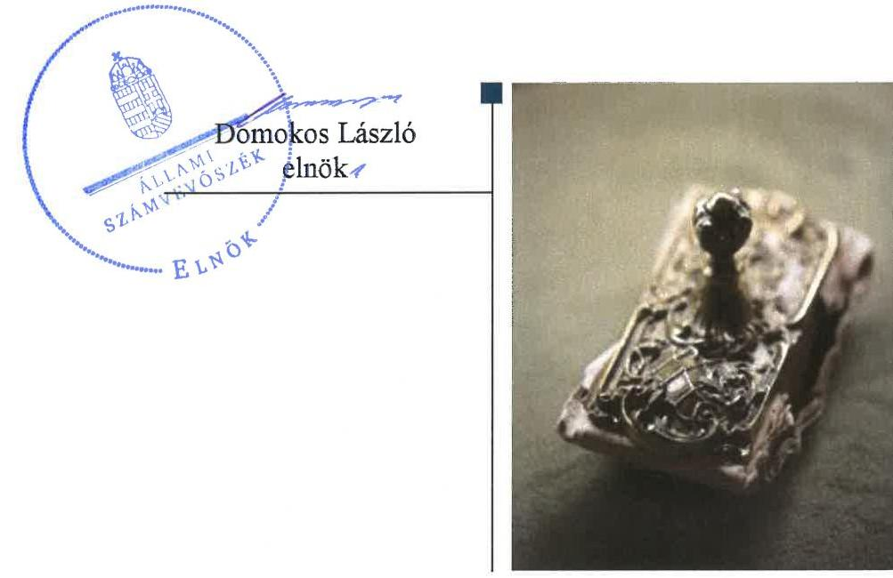
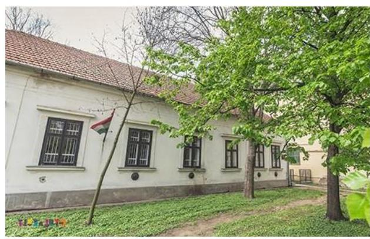
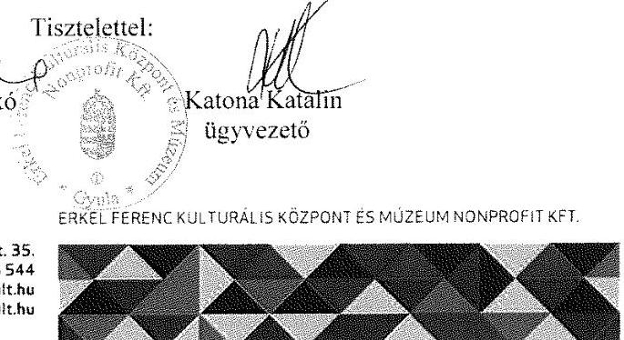
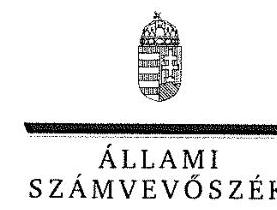
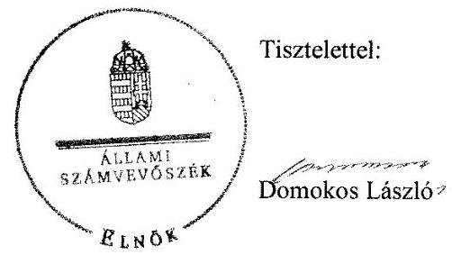
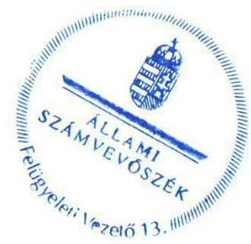

# Jelentés 

## Az önkormányzatok gazdasági társaságai

Az önkormányzatok többségi tulajdonában lévő gazdasági társaságok gazdálkodásának ellenőrzése - Erkel Ferenc Kulturális Központ és Múzeum Nonprofit Kft. 2018.

18201
www.asz.hu

---

# Jelentés 

## Az önkormányzatok gazdasági társaságai

Az önkormányzatok többségi tulajdonában lévő gazdasági társaságok gazdálkodásának ellenőrzése - Erkel Ferenc Kulturális Központ és Múzeum Nonprofit Kft.
2018. augusztus hónap  nap

---

# AZ ELLENŐRZÉST FELÜGYELTE:

- **KLINGA LÁSZLÓ** felügyeleti vezető
- **AZ ELLENŐRZÉST VEZETTE ÉS A VÉGREHAJTÁSÁÉRT FELELŐS:**
  - **HOFMEISTER LÁSZLÓ** ellenőrzésvezető
  - **A PROGRAM ÖSSZEÁLLÍTÁSÁÉRT FELELŐS:**
    - **TÓTPÁL SZABOLCS** osztályvezető

**IKTATÓSZÁM:** EL-0152-068/2018

**TÉMASZÁM:** 2447

**ELLENŐRZÉS-AZONOSÍTÓ SZÁM:** V-079342

Jelentéseink az Országgyűlés számítógépes hálózatán és az Interneten a www.asz.hu címen is olvashatóak.

---

# TARTALOMJEGYZÉK 

■ ÖSSZEGZÉS ..... 5
■ AZ ELLENŐRZÉS CÉLJA ..... 6
■ AZ ELLENŐRZÉS TERÜLETE ..... 7
■ AZ ELLENŐRZÉS HÁTTERE, INDOKOLTSÁGA ..... 8
■ A JELENTÉS LÉNYEGES KÉRDÉSKÖREI ..... 9
■ AZ ELLENŐRZÉS HATÓKÖRE ÉS MÓDSZEREI ..... 10
■ MEGÁLLAPÍTÁSOK ..... 12
■ JAVASLATOK ..... 15
■ MELLÉKLETEK ..... 17
I. sz. melléklet: Értelmező szótár ..... 17
II. sz. melléklet: 2013-2016. évi egyszerűsített éves beszámoló adatok. ..... 18
■ FÜGGELÉK: ÉSZREVÉTELEK ..... 19
■ RÖVIDÍTÉSEK JEGYZÉKE ..... 25

---

.

---

# ÖSSZEGZÉS 

Az Erkel Ferenc Kulturális Központ és Múzeum Nonprofit Kft. feletti tulajdonosi jogokat Gyula Város Önkormányzata szabályszerűen gyakorolta. A Társaság szabályozottsága és gazdálkodása szabályszerű volt. A Társaság vagyongazdálkodása nem volt szabályszerű, mert könyvvezetése nem volt bizonylattal alátámasztva. A Társaság a közérdekű adatokat közzétette, ugyanakkor kormányzati szektorba sorolt társaságként adatszolgáltatási kötelezettségének nem tett eleget.

## Az ellenőrzés társadalmi indokoltsága

Magyarországon az önkormányzatok kötelező és önként vállalt feladataik ellátása során egyre szélesebb körben alkalmazzák a költségvetési szerveken kívüli feladatellátást, ezáltal az önkormányzati tulajdonú gazdasági társaságok is kiemelt fontosságú szerephez jutnak a lakossági szolgáltatások biztosításában. Az önkormányzatok többségi tulajdonában álló gazdasági társaságok ellenőrzése kiemelt jelentőségű, mivel működésük hatással van a tulajdonos önkormányzat gazdálkodására, gazdálkodásának egyes elemei befolyásolják az önkormányzati alszektor hiányát és az államadósságot.

Az Állami Számvevőszék stratégiájában célul tűzte ki az államháztartáson kívül működő szervezetek ellenőrzését, mely hozzájárul a közpénzek szabályos, átlátható, elszámoltatható és eredményes felhasználásához. Az Erkel Ferenc Kulturális Központ és Múzeum Nonprofit Kft.-vel az általa ellátott feladaton keresztül a városban élő lakosság széles rétege került kapcsolatba.

## Főbb megállapítások, következtetések, javaslatok

Az Önkormányzat a Társaság feletti tulajdonosi joggyakorlásának kereteit a jogszabályoknak megfelelően alakította ki. A tulajdonosi jogait szabályszerűen gyakorolta.

A Társaság a megfelelő számviteli szabályozottság kialakításával megteremtette a szabályszerű működés feltételeit.

A Társaság vagyongazdálkodása nem volt szabályszerű, mert könyvvezetése nem volt bizonylattal alátámasztva.
A bevételek és ráfordítások elszámolása szabályszerű volt, az értékcsökkenési leírás elszámolása nem volt szabályszerű. Árképzése során figyelembe vette az önkormányzati előírásokat.

Közérdekű adatait közzétette a Társaság, működésének átláthatóságát biztosította.
Kormányzati szektorba sorolt társaságként a jogszabályban előírt kötelezettségeinek nem tett eleget. Az ügyvezetők a jogszabály rendelkezése ellenére nem alakították ki a célok megvalósításának nyomon követését biztosító rendszert, így nem volt biztosítva az operatív tevékenységek feletti független kontroll.

A megállapítások alapján az Állami Számvevőszék az Erkel Ferenc Kulturális Központ és Múzeum Nonprofit Kft. ügyvezetőjének három javaslatot fogalmazott meg.

---

# AZ ELLENŐRZÉS CÉLJA 

Az ellenőrzés célja annak értékelése volt, hogy az önkormányzat vagyongazdálkodási tevékenysége során szabályszerűen gyakorolta-e tulajdonosi jogait, a gazdasági társaság szabályozottsága, gazdálkodása és vagyongazdálkodási tevékenysége, bevételeinek és ráfordításainak elszámolása megfelelt-e a jogszabályi és tulajdonosi előírásoknak; a gazdasági társaság kötelezettségállománya jelentett-e kockázatot a működésre, valamint a gazdálkodás átláthatósága és elszámoltathatósága érdekében biztosított volt-e a szolgáltatás díjának megalapozottsága szabályszerű önköltségszámítással. Az ellenőrzés célja továbbá annak megítélése, hogy a kormányzati szektorba sorolt önkormányzati tulajdonban lévő gazdálkodó szervezet gazdálkodásának a kormányzati szektor hiányára és az államadósságra befolyással bíró elemei a jogszabályi előírásoknak megfeleltek-e.

---

# AZ ELLENŐRZÉS TERÜLETE 

## Gyula Város Önkormányzata és a kizárólagos tulajdonában lévő Erkel Ferenc Kulturális Központ és Múzeum Nonprofit Korlátolt Felelősségű Társaság

Az Önkormányzat ${ }^{1}$ a 2008. évben hozta létre 100%-os önkormányzati tulajdonú társaságként a Gyulai Kulturális és Rendezvényszervező Nonprofit Korlátolt Felelősségű Társaságot. A Társaság ${ }^{2}$ elnevezése 2016-tól „Erkel Ferenc Kulturális Központ és Múzeum Nonprofit Kft."-re változott. A Társaság jegyzett tőkéje 3 M Ft volt, ami az ellenőrzött időszakban nem módosult.

A Társaság közhasznú jogállású, közfeladatot ellátó gazdasági társaság. A Társaság közművelődési feladatokat látott el, területi múzeumok, kiállítóterek és látogatóközpont működtetését, valamint kulturális, turisztikai programok bonyolítását, konferenciák, rendezvények szervezését végezte. A közhasznú feladatai ellátása mellett kiegészítő jelleggel vállalkozási (elsősorban a tevékenységéhez kapcsolódó vendéglátói feladatkörök) tevékenységet is végzett. A vállalkozási tevékenységéből származó összes bevétel az ellenőrzött négy év átlagában 26,5%-ot tett ki a Társaság teljes bevételéből. A Társaság feladatellátásához szükséges infrastruktúrát az Önkormányzat alapításkor, ingatlanok térítésmentes használatba adásával biztosította, vagyonkezelésbe vagyont nem adott át.

A Társaság 2013. június 28-tól tartozott a kormányzati szektorba sorolt egyéb szervezetek körébe. A Társaság könyvvizsgáló megbízására és önköltségszámítási szabályzat készítésére a Számv. tv. ${ }^{3}$ alapján nem volt kötelezett.

A Társaság 2013-2016. évi egyszerűsített éves beszámoló adatait a II. melléklet mutatja be.

Az ellenőrzött időszakban a Társaság vagyona 59,2%-kal nőtt. Az értékesítés nettó árbevétele 161,9%-kal, 304,3 M Ft-ra emelkedett. A Társaság minden ellenőrzött évben nyereségesen működött, a 2013-2016. években összesen 18,0 M Ft nyereséget ért el. Az átlagos állományi létszáma a 2013. évi 28 főről 2016. évre 58 főre emelkedett.

A közhasznú tevékenység ellátására támogatásokat elsősorban az Önkormányzattól kapott a Társaság, melynek mértéke folyamatosan nőtt a négy év alatt. Az Önkormányzattól kapott támogatás 465,6 M Ft volt. A Társaság központi költségvetési forrásból támogatást - 5,7 M Ft-ot - csak a 2013. évben kapott.

A polgármester és a jegyző személyében a 2013-2016. években változás nem történt. A Társaság ügyvezetését 2015. december 1-jétől két ügyvezető látta el. Az ügyvezető igazgatók a hatóságok előtt önállóan képviselték a Társaságot, de szakmai feladatuk megoszlott közművelődési és muzeális üzletágra.

---

# AZ ELLENŐRZÉS HÁTTERE, INDOKOLTSÁGA 

Az önkormányzatok többségi tulajdonában álló gazdasági társaságok ellenőrzése kiemelten fontos a vagyon megőrzése, megóvása érdekében, valamint a kormányzati szektor elszámolásaiban megjelenő önkormányzati tulajdonú gazdálkodó szervezetek esetében, amelyekkel szemben alapvető követelmény, hogy gazdálkodásuk, működésük szabályszerű, az általuk szolgáltatott adatok minél megbízhatóbbak legyenek.

A feladatellátás költségeinek, ráfordításainak alakulása a lakosság széles rétegét érinti. Az ellenőrzés várható hasznosulásaként ellenőrzéseink feltárhatják, hogy az önkormányzat a feladatellátásához rendelt vagyon működtetését a tulajdonostól elvárható gondossággal végezte-e, a feladatot ellátó gazdasági társaság a létesítő okiratban, szolgáltatási szerződésben foglaltak betartásával biztosította-e a feladat ellátását. Az ellenőrzés rávilágíthat arra, hogy a gazdasági társaság a vagyon használatával biztosította-e a szolgáltatás folytatásának feltételeit, az önkormányzat tulajdonosi felügyelete hozzájárult-e a szabályszerű gazdálkodáshoz és feladatellátáshoz.

A megállapítások alapján megfogalmazott számvevőszéki javaslatok hasznosítása elősegítheti a meglévő hibák megszüntetését. A jó gyakorlatok bemutatásával az Állami Számvevőszék hozzájárul a követendő megoldások megismertetéséhez, terjesztéséhez.

---

# A JELENTÉS LÉNYEGES KÉRDÉSKÖREI 

1.     - Az önkormányzat tulajdonosi joggyakorlása szabályszerű volt-e?
2.     - A gazdasági társaság szabályozottsága, gazdálkodása és vagyongazdálkodása megfelel-e az előírásoknak?

---

# AZ ELLENŐRZÉS HATÓKÖRE ÉS MÓDSZEREI 

## Az ellenőrzés típusa

Megfelelőségi ellenőrzés

## Az ellenőrzött időszak

2013. január 1-jétől 2016. december 31-ig

## Az ellenőrzés tárgya

Gyula Város Önkormányzata tulajdonosi joggyakorlása, valamint az Erkel Ferenc Kulturális Központ és Múzeum Nonprofit Korlátolt Felelősségű Társaság gazdálkodásának szabályozottsága és szabályszerűsége. Továbbá az ellenőrzés tárgyát képezi az önkormányzati alszektorba sorolt Társaság gazdálkodásának a kormányzati szektor hiányára és az államadósságra befolyással bíró elemei is.

Az ellenőrzés kiterjed minden olyan körülményre és adatra, amely az ÁSZ ${ }^{6}$ jogszabályban meghatározott feladatainak teljesítéséhez, valamint a program végrehajtása folyamán felmerült újabb összefüggések feltárásához szükséges volt.

## Az ellenőrzött szervezet

Gyula Város Önkormányzata és a kizárólagos tulajdonában lévő Erkel Ferenc Kulturális Központ és Múzeum Nonprofit Korlátolt Felelősségű Társaság.

## Az ellenőrzés jogalapja

Az ellenőrzés jogalapját az ÁSZ tv. ${ }^{5}$ 1. § (3) bekezdése és 5. § (3)-(5) bekezdései képezik.

## Az ellenőrzés módszerei

Az ellenőrzést a nemzetközi standardokat irányadónak tekintve az ellenőrzési program ellenőrzési kérdései, az ellenőrzött időszakban hatályos jogszabályok, az ellenőrzés szakmai szabályok és módszertanok figyelembe vételével végeztük.

---

Az ellenőrzés ideje alatt az ellenőrzött szervezettel történő kapcsolattartást az ÁSZ Szervezeti és Működési Szabályzatának vonatkozó előírásai alapján biztosítottuk.

Az ellenőrzés a kizárólagos tulajdonosi jogokat gyakorló önkormányzatra, és az ellenőrzött gazdasági társaságra terjedt ki.

Az ellenőrzési kérdések megválaszolásához szükséges bizonyítékok megszerzése a következő ellenőrzési eljárások alkalmazásával történt: megfigyelés, kérdésfeltevés (információkérés), összehasonlítás, valamint elemző eljárás. Az ellenőrzési bizonyítékként felhasználható adatforrások közé tartoztak egyrészt az ellenőrzési programban felsorolt adatforrások, másrészt adatforrás lehet még minden - az ellenőrzés folyamán feltárt, az ellenőrzés szempontjából információkat tartalmazó dokumentum.

Az ellenőrzést a kérdésekre adott válaszok kiértékelésével, valamint a megjelölt adatforrások, a csatolt tanúsítványok felhasználásával, továbbá az adott időszakban hatályos jogszabályok figyelembe vételével folytattuk le.

A bevételek és ráfordítások elszámolása terén a szabályszerű működést véletlen mintavétellel ellenőriztük. A mintavétellel ellenőrzött területek esetében minden egyes tétel vonatkozásában a szabályszerűségre vonatkozó kérdéseket tettünk fel, amelyek eredménye összesítésre került. Megfelelőnek értékeltünk egy ellenőrzött területet, amennyiben 95%-os bizonyossággal a teljes sokaságban az átlagos hibaarány legfeljebb 10%, nem megfelelőnek, amennyiben 10%-nál magasabb arányt képviselt. Abban az esetben, ha a teljes sokaság tekintetében a 10%-os hibaarányhoz való viszony megítélésének megbízhatósága nem érte el a 95%-ot, annak elérése érdekében értékelésünket további szempontokkal egészítettük ki, és figyelembe vettük a feltárt hibák típusát és súlyát. A ráfordítások elszámolására és a vagyonnyilvántartásra vonatkozó véletlen mintavételt kockázati alapú kiválasztással egészítettük ki, amelynek során évente a három legnagyobb összegű tételt értékeltük.

---

# 1. Az önkormányzat tulajdonosi joggyakorlása szabályszerű volt-e? 

Összegző megállapítás Az Önkormányzat tulajdonosi joggyakorlása szabályszerű volt.

A TÁRSASÁG FELETTI TULAJDONOSI JOGOK gyakorlásának rendjét az Önkormányzat a Vagyongazdálkodási rendeleteiben ${ }_{1-2}{ }^{6}$, valamint az Alapító okiratban ${ }_{1-7}{ }^{7}$, a Gt. ${ }^{8}$ és a Ptk. ${ }^{9}$ rendelkezéseivel összhangban szabályozta. Az Alapító okirat ${ }_{1-7}$ az Alapító ${ }^{10}$ kizárólagos hatáskörébe tartozó feladatokat rögzítette, szabályozta a tulajdonosi joggyakorlás elemeit és kereteit.

A háromtagú FB${ }^{11}$-t a Társaságnál a Gt.-ben előírtak szerint hozták létre.
A Taktv. ${ }^{12}$-ben előírtak szerint az Alapító megalkotta és 2013. november 21-én hatályba helyezte a Társaság Javadalmazási szabályzat ${ }^{13}$-át.

ÜZLETI TERV készítésének kötelezettségét a Társaság SZMSZ ${ }^{14}$-e rögzítette. Az éves üzleti tervet az Alapító minden évben határozatával jóváhagyta.

A TÁRSASÁG BESZÁMOLTATÁSÁNAK kötelezettségét az Alapító a Feladat-ellátási szerződés ${ }^{15}$-ben és a Közművelődési megállapodás ${ }^{16}$-ban rögzítette éves és évközi beszámolók előírásával, melynek a Társaság eleget tett. Az egyszerűsített éves beszámolót és közhasznúsági mellékletet az Alapító az FB jelentés birtokában megtárgyalta, elfogadásáról határozatot hozott, a nyereséget eredménytartalékba helyezte.

RENDELETALKOTÁSI KÖTELEZETTSÉGÉNEK az Önkormányzat az 1997. évi CXL. törvény ${ }^{17}$ előírása alapján a Közművelődési rendelet ${ }_{1-2}{ }^{18}$ megalkotásával eleget tett.

A
 TÁRSASÁGNÁL ELLENŐRZÉST a tulajdonos Önkormányzat belső ellenőrzése egyszer végzett a 2014. évben kockázatelemzésen alapuló belső ellenőrzési terv alapján a 2011-2012. évi gazdálkodás szabályszerűségével kapcsolatban. A Társaság beszámolt az Önkormányzatnak a megtett intézkedésekről.

---

# 2. A gazdasági társaság szabályozottsága, gazdálkodása és vagyongazdálkodása megfelelt-e az előírásoknak? 

Összegző megállapítás

## 2.1. számú megállapítás

2.2. számú megállapítás

1. táblázat

## SAJÁT TULAJDONÚ ESZKÖZÖK PÓTLÁSA (M FT)

| Év | Elszámolt   értékcsök-   kérés | Teljesített   visszapótlás |
| :--: | :--: | :--: |
| 2013. | 7,3 | 11,3 |
| 2014. | 14,0 | 46,8 |
| 2015. | 12,9 | 9,7 |
| 2016. | 21,7 | 22,6 |
| Összesen | 55,9 | 90,4 |

A Társaság szabályozottsága és gazdálkodása szabályszerű volt. A Társaság vagyongazdálkodása nem volt szabályszerű, mert könyvvezetése nem volt bizonylattal alátámasztva.

A Társaság számviteli szabályozottsága szabályszerű volt.
A Társaság rendelkezett a Számv. tv.-ben előírt számviteli szabályzatokkal, Számviteli politikával, Leltározási szabályzattal, Értékelési szabályzattal, Pénzkezelési szabályzattal, valamint Számlarenddel, melyek tartalma megfelelt a jogszabályi előírásoknak.

A Társaság bevételeinek és ráfordításainak elszámolása szabályszerű volt, az értékcsökkenés elszámolása nem volt szabályszerű. A Társaság beszámolási és közzétételi kötelezettségét teljesítette. Kormányzati szektorba sorolt társaságként jogszabályban előírt kötelezettségeinek nem tett eleget.

A Társaság a Számv. tv.-nek megfelelően elkészítette egyszerűsített éves beszámolóit, a törvényi előírásnak megfelelően közzétette. Az egyszerűsített éves beszámolóit a Társaság a Számv. tv.-ben foglaltak szerint készített leltárakkal alátámasztotta, az analitikus nyilvántartásokat és a főkönyvi számlákat az előírások szerint egyeztette.

A Társaság vagyonát érintően a 2013-2016. években összesen 90,4 M Ft értékben végzett beruházást, felújítást, mellyel 61,7%-kal meghaladta az elszámolt értékcsökkenés összegét. A Társaság saját tulajdonú eszközeinek pótlását az 1. táblázat mutatja be.

A bevételek és ráfordítások elszámolása szabályszerűen történt.
Az értékcsökkenési leírás számviteli elszámolása nem volt szabályszerű, mert a Társaság a könyvviteli elszámolását számviteli bizonylatokkal a Számv. tv. 165. § (2) bekezdésében előírtak ellenére nem támasztotta alá.

A Társaság árképzése megfelelt az előírásoknak. Árait a közterület és terembérlet bérbeadásával kapcsolatos szabályzattal összhangban alakította ki, mely megfelelt az Önkormányzat közterület használati rendeletében foglaltaknak.

A közérdekű adatok nyilvánosságra hozatalával és szabályozásával kapcsolatos kötelezettségeinek a Taktv. és az Info tv. alapján a Társaság eleget tett.

Kormányzati szektorba sorolt egyéb szervezetként a Társaság nem felelt meg a Bkr. 10. §-ában foglalt előírásnak, tekintettel a Bkr. 54/A. §-ára, mivel a szervezet tevékenységének, a célok megvalósításának nyomon követését biztosító rendszert nem alakította ki.

A Társaság annak ellenére, hogy kormányzati szektorba sorolt egyéb szervezet volt, 2013. június 28-át követően nem teljesítette az Áht. 107. § (1) bekezdésében és az Ávr. 167/M. § (1) bekezdésében előírt, az Ávr. 7. melléklet 28. pontja, valamint a 2015. január 1-jétől hatályos rendelet 5. melléklet 23. pontja szerinti adatszolgáltatási kötelezettségét.

---

A Társaság adósságot keletkeztető ügyletet nem kötött, az egyszerűsített éves beszámolói alapján hosszú lejáratú kötelezettsége nem keletkezett.

---

# JAVASLATOK 

Az ÁSZ tv. 33. § (1) bekezdésében foglaltak értelmében az ellenőrzött szervezet vezetője köteles a jelentésben foglalt megállapításokhoz kapcsolódó intézkedési tervet összeállítani és azt a jelentés kézhezvételétől számított 30 napon belül az ÁSZ részére megküldeni. Amennyiben az ellenőrzött szervezet vezetője nem küldi meg határidőben az intézkedési tervet, vagy továbbra sem elfogadható intézkedési tervet küld, az Állami Számvevőszék elnöke az ÁSZ tv. 33. § (3) bekezdése a) és b) pontjaiban foglaltakat érvényesítheti.

## Erkel Ferenc Kulturális Központ és Múzeum Nonprofit Kft. ügyvezetőjének

1. Intézkedjen az értékcsökkenési leírás könyvviteli elszámolása során a jogszabályi előírásoknak megfelelő bizonylatokkal történő alátámasztásáról.
(2.2. sz. megállapítás 4. bekezdése alapján)
2. Intézkedjen a szervezet tevékenységének, a célok megvalósításának nyomon követését biztosító rendszer kialakításáról a jogszabályi előírásoknak megfelelően.
(2.2. sz. megállapítás 7. bekezdése alapján)
3. Gondoskodjon arról, hogy a Társaság a kormányzati szektorba sorolt egyéb szervezetek számára előírt adatszolgáltatási kötelezettségét a jogszabályi előírásoknak megfelelően teljesítse.
(2.2. sz. megállapítás 8. bekezdése alapján)

---

.

---

# MELLÉKLETEK 

- I. SZ. MELLÉKLET: ÉRTELMEZŐ SZÓTÁR
gazdasági társaság
nemzeti vagyon
a) az állam vagy a helyi önkormányzat kizárólagos tulajdonában álló dolgok,
b) az a) pont hatálya alá nem tartozó, állam vagy a helyi önkormányzat tulajdonában lévő dolog,
c) az állam vagy a helyi önkormányzat tulajdonában lévő pénzügyi eszközök, továbbá az államot vagy a helyi önkormányzatot megillető társasági részesedések,
d) az államot vagy a helyi önkormányzatot megillető bármely vagyoni értékkel rendelkező jogosultság, amelyet jogszabály vagyoni értékű jogként nevesít,
e) Magyarország határa által körbezárt terület feletti légtér,
f) az üvegházhatású gázok kibocsátási egységeinek kereskedelméről szóló törvény szerint kibocsátási egység és légiközlekedési kibocsátási egység, valamint az ENSZ Éghajlatváltozási Keretegyezménye és annak Kiotói Jegyzőkönyve végrehajtási keretrendszeréről szóló törvény szerinti kiotói egység,
g) állami vagy helyi önkormányzati fenntartású közgyűjtemény (muzeális intézmény, levéltár, közgyűjteményként működő kép és hangarchívum, valamint könyvtár) saját gyűjteményében nyilvántartott kulturális javak körébe tartozó dolog, kivéve, ha az állami vagy önkormányzati tulajdon jogszerű létrejötte kétséget kizáró módon nem bizonyítható és a dologra nézve más a tulajdonjogát bizonyítja vagy a kulturális javakra vonatkozó jogszabályokban meghatározott eljárás keretében valószínűsíti (g. pont módosult 2013. december 7-től),
h) a régészeti lelet,
i) a nemzeti adatvagyon körébe tartozó állami nyilvántartások fokozottabb védelméről szóló törvény szerinti nemzeti adatvagyon.
Forrás: Nvtv. 1. § (2)
2006. évi V. tv (Ctv. 9/F. § (2) bekezdése szerint: „az a gazdasági társaság minősül nonprofit gazdasági társaságnak és cégnevében az a gazdasági társaság tüntetheti fel a nonprofit jelleget, amelynek létesítő okirata tartalmazza, hogy a gazdasági társaság tevékenységéből származó nyereség a tagok között nem osztható fel, hanem az a gazdasági társaság vagyonát gyarapítja." (hatályos 2006. január 4-től)
Az Áht. 3. § (2) és (3) bekezdésében foglaltakon kívül az Európai Közösséget létrehozó szerződéshez csatolt, a túlzott hiány esetén követendő eljárásról szóló jegyzőkönyv alkalmazásáról szóló 2009. május 25-i 479/2009/EK rendelet (a továbbiakban: 479/2009/EK rendelet) szerint a kormányzati szektorba sorolt szervezet (Áht. 1. § (12))
minden olyan tevékenység, amely a létesítő okiratban megjelölt közfeladat teljesítését közvetlenül vagy közvetve szolgálja, ezzel hozzájárulva a társadalom és az egyén közös szükségleteinek kielégítéséhez;

---

II. SZ. MELLÉKLET: 2013-2016. ÉVI EGYSZERŰSÍTETT ÉVES BESZÁMOLÓ ADATOK

| A TÁRSASÁG 2013-2016. ÉVI EGYSZERŰSÍTETT ÉVES BESZÁMOLÓINAK FÖBB ADATAI (M FT-BAN) |  |  |  |  |  |
| :--: | :--: | :--: | :--: | :--: | :--: |
| Megnevezés | 2013. év | 2014. év | 2015. év | 2016. év | 2016/2013. év (\%) |
| Mérlegfőösszeg | 80,9 | 116,0 | 162,8 | 128,8 | 159,2\% |
| Befektetett eszközök | 36,4 | 69,2 | 66,0 | 66,9 | 183,8\% |
| -ebből tárgyi eszközök | 36,4 | 69,2 | 66,0 | 66,6 | 183,0\% |
| Forgóeszközök | 32,2 | 30,9 | 88,8 | 53,0 | 164,6\% |
| -ebből készletek | 0,8 | 0,9 | 1,4 | 4,7 | 587,5\% |
| -ebből követelések | 6,0 | 13,5 | 21,4 | 19,5 | 325,0\% |
| - ebből vevőkövetelések | 1,2 | 1,0 | 0,5 | 11,9 | 991,7\% |
| -ebből pénzeszközök | 25,4 | 16,5 | 66,0 | 28,8 | 113,4\% |
| Aktív időbeli elhatárolás | 12,3 | 15,9 | 8,0 | 8,9 | 72,4\% |
| Saját tőke összege | 16,3 | 16,6 | 17,7 | 25,2 | 154,6\% |
| Jegyzett tőke | 3,0 | 3,0 | 3,0 | 3,0 | 100,0\% |
| Eredménytartalék | 4,2 | 13,3 | 13,6 | 14,7 | 350,0\% |
| Adózott eredmény | 9,1 | 0,3 | 1,1 | 7,5 | 82,4\% |
| Kötelezettségek | 23,7 | 20,0 | 46,9 | 26,8 | 113,1\% |
| Passzív időbeli elhatárolás | 40,9 | 79,4 | 98,2 | 76,8 | 187,8\% |

Forrás: 2013-2016. évi egyszerűsített éves beszámolók

---

# FÜGGELÉK: ÉSZREVÉTELEK 

A jelentéstervezetet a Számvevőszék 15 napos észrevételezésre megküldte az ellenőrzött szervezetek vezetőinek az ÁSZ tv. 29. § (1) bekezdése előírásának megfelelően.

Gyula Város Önkormányzatának polgármestere az ÁSZ tv 29. § (2) bekezdésében foglalt észrevételezési jogával nem élt, a jelentéstervezetre észrevételt nem tett. Az Erkel Ferenc Kulturális Központ és Múzeum Nonprofit Kft. ügyvezetőinek észrevételét és az arra adott választ a függelék tartalmazza.

[^0]
[^0]:    * 29. § (1) Az Állami Számvevőszék az ellenőrzési megállapításait megküldi az ellenőrzött szervezet vezetőjének vagy az általa megbízott személynek, és annak, akinek személyes felelősségét állapította meg.
    (2) Az ellenőrzött szervezet vezetője és a felelősként megjelölt személy az ellenőrzés megállapításaira tizenöt napon belül írásban észrevételt tehet.
    (3) Az Állami Számvevőszék az észrevételre a beérkezésétől számított harminc napon belül írásban válaszol. A figyelembe nem vett észrevételeket köteles a jelentésben feltüntetni, és megindokolni, hogy azokat miért nem fogadta el.

---

# 

Iktatószám: 15/VII/2018
Tárgy: észrevétel ÁSZ ellenőrzéshez
Hivatkozási szám: EL-0567-010/2018

Állami számvevőszék
Domokos László elnök úr részére
1364 Budapest 4, Pf.54.

Tisztelt Elnök Úr!

ÁLLAMI SZÁMVEVŐSZÉK
3E-38284/218/1
Érkezett: 2018. JÚNIUS 27.
Iktatószám: EL-0567-010/2018
Melléklet:

Az Állami számvevőszék által az Erkel Ferenc Nonprofit Kft. gazdálkodásának tárgyában készített Számvevőszéki jelentéstervezet megállapításaira az ÁSZ tv. 29.§ (2) bekezdése alapján az alábbi észrevételt kívánjuk tenni.

2.2. számú megállapítás 4. bekezdéshez

...Az értékcsökkenési leírás számviteli elszámolása nem volt szabályszerű, mert a Társaság a könyvviteli elszámolását számviteli bizonylatokkal a Számviteli tv. 165.§ (2) bekezdésben előírtak ellenére nem támasztotta alá."

Az ÁSZ ellenőrzés során 2017.11.08-án feltöltésre került a tárgyi eszközök főkönyvi és analitikus nyilvántartása, a könyvviteli elszámolást alátámasztó számviteli bizonylatokat azonban nem kérték, így feltöltése sem történt meg.

Társaságunk minden esetben a törvénynek megfelelően kiállított számla alapján nyitja meg a tárgyi eszköz kartont, amely a számla minden adatát tartalmazza. Évekre visszamenőleg megjelenik rajta az elszámolt értékcsökkenés és tárgyi eszköz jelenlegi nettó értéke is, amely egyezik a főkönyvben kimutatott 1-es számlaosztályban szereplő adatokkal. Így az egyezőség biztosított.

Az ÁSZ jelentésben kifogásolt alapbizonylatokkal rendelkezünk, így a jelentéstervezet ezen megállapításával nem értünk egyet.

Ezen alapbizonylatok feltöltését azonban az ÁSZ nem kérte az ellenőrzés során.

Kérjük a fenti észrevétel figyelembevételét a jelentéstervezet véglegesítése során.

A javaslatokkal kapcsolatban az előírt határidőben az intézkedési tervet elkészítjük és ellenőrzés céljából megküldjük.

Gyula, 2018. június 24.

Tisztelettel:

Dombi Ildikó
ügyvezető

Katona Katalin
ügyvezető

ERKEL FERENC KULTURÁLIS KÖZPONT ÉS MÚZEUM NONPROFIT KFT.

Hungary - 5700 Gyula, Béke sgt. 35.
telefon: +36 66 463 544
info@gyulakult.hu
www.gyulakult.hu

---

ELNÖK

Ikt.szám: EL-0567-013/2018.

# Dombi Ildikó úrhölgy 

## Katona Katalin úrhölgy

ügyvezető
Erkel Ferenc Kulturális Központ és Múzeum Nonprofit Kft.

Gyula

## Tisztelt Ügyvezető Úrhölgyek!

Köszönettel vettem „Az önkormányzatok gazdasági társaságai - Az önkormányzatok többségi tulajdonában lévő gazdasági társaságok gazdálkodásának ellenőrzése - Erkel Ferenc Kulturális Központ és Múzeum Nonprofit Kft." című ellenőrzésről készített számvevőszéki jelentéstervezetre megküldött észrevételüket.
Az Állami Számvevőszék észrevételekre vonatkozó álláspontját a felügyeleti vezető
 által készített részletes tájékoztatás tartalmazza, amelyet levelemhez mellékeltem. Tájékoztatom Ügyvezető úrhölgyeket, hogy az Állami Számvevőszék a figyelembe nem vett észrevételeket az Állami Számvevőszékről szóló 2011. évi LXVI. törvény 29. § (3) bekezdésében előírtak szerint köteles a jelentésében feltüntetni és megindokolni, hogy azokat miért nem fogadta el.

Budapest, 2018. július 17. nap

Melléklet: Tájékoztatás az észrevételek kezeléséről

---

# Tájékoztatás az észrevételek kezeléséről 

Megköszönöm Ügyvezető úrhölgyeknek „Az önkormányzatok gazdasági társaságai - Az önkormányzatok többségi tulajdonában lévő gazdasági társaságok gazdálkodásának ellenőrzése Erkel Ferenc Kulturális Központ és Múzeum Nonprofit Kft. " címmel készített jelentés-tervezetre tett észrevételét. Az észrevétel kezeléséről az alábbi tájékoztatást adom:

## A jelentéstervezet 2.2. számú megállapítás 4. bekezdéséhez füzött észrevétele kapcsán

Észrevételükben jelezték, hogy az Állami Számvevőszék (továbbiakban: ÁSZ) ellenőrzés során feltöltötték a tárgyi eszközök főkönyvi és analitikus nyilvántartását, azonban a könyvviteli elszámolást alátámasztó számviteli bizonylatok bekérésére nem került sor, így azok feltöltése nem történt meg.

Az ÁSZ az ellenőrzését a megküldött ellenőrzési programnak megfelelően, a rendelkezésre bocsátott adatok és dokumentumok (bizonyítékok) alapján végezte. Az Állami Számvevőszékről szóló 2011. évi LXVI. törvény 28. § (2) bekezdése alapján a közreműködésre felhívott szervezet az ÁSZ részére - annak kérésére soron kívül, de legkésőbb öt munkanapon belül - az ellenőrzés lefolytatása érdekében a szükséges adatokat és dokumentumokat rendelkezésre bocsátja.

Az Ön által hivatkozott adatbekérés során az EL-0152-011/2017. iktatószámú adatbekérő levélben került sor az adatállományok mintavételezéséhez szükséges adatbázisok bekérésére. A Társaság az adatszolgáltatásra biztosított 5 nap alatt az ÁSZ rendelkezésére bocsátotta és a teljességi és hitelességi nyilatkozat 2.A. számú mellékletében szerepeltette az X.288/2016. ügyiratszámú, pénzeszköz végleges átadásáról szóló megállapodást, illetve az átadott pénzeszköz felhasználásáról szóló beszámolót. A dokumentumok feldolgozása és kiértékelése során megállapítottuk, hogy a Társaság a könyvviteli elszámolását számviteli bizonylatokkal teljes körűen nem támasztotta alá. A beszámolóban hivatkozott és annak mellékletét képező 167 tételből álló eszközlistát hiányosan küldték meg részünkre, mivel a 167 tételből 76 tételt nem tartalmazott a lista. A sokaság teljes körű rendelkezésre állásának hiányában mintavételezésre nem került sor.

---

Fentiekre tekintettel észrevételüket nem fogadom el, így a jelentéstervezet módosítása nem indokolt.

Budapest, 2018. július 17.

Klinga László
felügyeléti vezető

---

.

---

# RÖVIDÍTÉSEK JEGYZÉKE 

${ }^{1}$ Önkormányzat
${ }^{2}$ Társaság
${ }^{3}$ Szám. tv.
${ }^{4}$ ÁSZ
${ }^{5}$ ÁSZ tv.
${ }^{6}$ Vagyongazdálkodási rendelet ${ }_{1}$

Vagyongazdálkodási rendelet ${ }_{2}$
${ }^{7}$ Alapító okirat ${ }_{1}$

Alapító okirat ${ }_{2}$

Alapító okirat ${ }_{3}$

Alapító okirat ${ }_{4}$

Alapító okirat ${ }_{5}$

Alapító okirat ${ }_{6}$

Alapító okirat ${ }_{7}$
${ }^{8}$ Gt.
${ }^{9}$ Ptk.
${ }^{10}$ Alapító
${ }^{11}$ FB
${ }^{12}$ Taktv.

Gyula Város Önkormányzata
Gyulai Kulturális és Rendezvényszervező Nkft. 2016. március 31-ig, 2016. április 1-jétől Erkel Ferenc Kulturális Központ és Múzeum Nonprofit Kft.
2000. évi C. törvény a számvitelről (hatályos 2001. január 1-jétől)

Állami Számvevőszék
Az Állami Számvevőszékről szóló 2011. évi LXVI. törvény (hatályos 2011. július 1-jétől)
Gyula Város Önkormányzata Képviselő-testületének 11/2003. (III. 28.) számú rendelete az önkormányzat vagyonáról és a vagyonhasznosítás szabályairól (hatályos: 2003. március 28, módosítások a vizsgált időszakban: 2013. január 25; 2013. május 31; 2013. szeptember 30, hatálytalan 2013. december 31-től)
Gyula Város Önkormányzata Képviselő-testületének 31/2013. (XII.23.) önkormányzati rendelete az önkormányzat vagyonáról és a vagyongazdálkodásról (hatályos 2014. január 1-jétől, módosítva: 2014. január 23; 2014. augusztus 29; 2014. november 21; 2015. március 30; 2015. április 25; 2015. november 25; 2016. április 29)
A Gyulai Kulturális és Rendezvényszervező Nonprofit Korlátolt Felelősségű Társaság Alapító okirata módosításokkal egységes szerkezetben (hatályos: 2011. június 1-jétől)
A Gyulai Kulturális és Rendezvényszervező Nonprofit Korlátolt Felelősségű Társaság Alapító okirata módosításokkal egységes szerkezetben, elfogadta Gyula Város Önkormányzata a 112/2013. (IV. 25.) számú Képviselő-testületi határozattal
A Gyulai Kulturális és Rendezvényszervező Nonprofit Korlátolt Felelősségű Társaság Alapító okirata módosításokkal egységes szerkezetben, elfogadta Gyula Város Önkormányzata a 103/2014. (V. 29.) számú Képviselő-testületi határozattal
A Gyulai Kulturális és Rendezvényszervező Nonprofit Korlátolt Felelősségű Társaság Alapító okirata módosításokkal egységes szerkezetben, elfogadta Gyula Város Önkormányzata a 266/2014. (XII. 18.) számú Képviselő-testületi határozattal
A Gyulai Kulturális és Rendezvényszervező Nonprofit Korlátolt Felelősségű Társaság Alapító okirata módosításokkal egységes szerkezetben, elfogadta Gyula Város Önkormányzata a 300/2015. (XII. 1.) és 302/2015. (XII. 1.) számú Képviselőtestületi határozatokkal
Az Erkel Ferenc Kulturális Központ és Múzeum Nonprofit Kft. Alapító okirata módosításokkal egységes szerkezetben, elfogadta Gyula Város Önkormányzata a 45/2016. (III. 31.) számú Képviselő-testületi határozattal
Az Erkel Ferenc Kulturális Központ és Múzeum Nonprofit Kft. Alapító okirata módosításokkal egységes szerkezetben, elfogadta Gyula Város Önkormányzata a 153/2016. (V. 26.) számú Képviselő-testületi határozattal
2006. évi IV. törvény a gazdasági társaságokról (hatálytalan 2014. március 15-től) 2013. évi V. törvény a Polgári Törvénykönyvről (hatályos 2014. március 15-től) Gyula Város Önkormányzatának Képviselő-testülete
Erkel Ferenc Kulturális Központ és Múzeum Nonprofit Korlátolt Felelősségű Társaság felügyelőbizottsága
2009. évi CXXII. törvény a köztulajdonban álló gazdasági társaságok takarékosabb működéséről (hatályos 2009. december 4-től)

---

${ }^{13}$ Javadalmazási szabályzat
${ }^{14}$ társasági SZMSZ
${ }^{15}$ Feladat-ellátási szerződés
${ }^{16}$ Közművelődési megállapodás
${ }^{17}$ 1997. évi CXL törvény
${ }^{18}$ Közművelődési rendelet: $\square$

Közművelődési rendelet:
${ }^{19}$ Számviteli politika
${ }^{20}$ Leltározási szabályzat
${ }^{21}$ Értékelési szabályzat
${ }^{22}$ Pénzkezelési szabályzat
${ }^{23}$ Számlarend
${ }^{24}$ A közterület és terembérlet bérbeadásával kapcsolatos szabályzat
${ }^{25}$ Közterület használati rendelet
${ }^{26}$ Info tv.
${ }^{27}$ Bkr.
${ }^{28}$ Áht.
${ }^{29}$ Ávr.
${ }^{30}$ Nvtv.

Szabályzat a köztulajdonban álló gazdasági társaságok takarékosabb működéséről szóló 2009. évi CXXII. törvényben meghatározott, Gyula Város Önkormányzata többségi befolyása alatt álló gazdasági társaságok ügyvezetőire és felügyelő bizottsági tagjaira, valamint a munka törvénykönyvéről szóló 2012. évi I. tv. 208. § hatálya alá tartozó munkavállalókra vonatkozó javadalmazás elveiről (hatályos 2013. november 21-től, majd 2015. április 23-ától)

Gyulai Kulturális és Rendezvényszervező Nonprofit Kft. szervezeti és működési szabályzata (hatályos 2009. november 12-től)
Gyula Város Önkormányzata és a Gyulai Kulturális és Rendezvényszervező Nonprofit Kft. között létrejött Feladat-ellátási szerződés (kelt: 2011. április 28; módosítva: 2011. június 30; 2013. március 22; 2013. április 26.)
Gyula Város Önkormányzata és a Gyulai Kulturális és Rendezvényszervező Nonprofit Kft. között létrejött Közművelődési megállapodás (kelt: 2008. január 8.), valamint a 2014. május 29-én kelt Közszolgáltatási keretszerződés közművelődési feladatok ellátására és a 2016. február 29-én kelt Keretszerződés kulturális és közművelődési feladatok ellátására (módosítva 2016. április 1.)
1997. évi CXL törvény a muzeális intézményekről, a nyilvános könyvtári ellátásról és a közművelődésről (hatályos 1998. január 1-jétől)
Gyula Város Önkormányzata Képviselő-testületének 40/2002. (IX.27.) önkormányzati rendelete a közművelődési feladatokról
Gyula Város Önkormányzata Képviselő-testületének 13/2016. (IV.1.) önkormányzati rendelete a közművelődési feladatokról
Gyulai Kulturális és Rendezvényszervező Nonprofit Kft. Számviteli politikája (hatályos 2012. január 1-jétől)
Gyulai Kulturális és Rendezvényszervező Nonprofit Kft. Eszközök és források leltárkészítési és leltározási szabályzata (hatályos 2010. szeptember 1-jétől)
Gyulai Kulturális és Rendezvényszervező Nonprofit Kft. Eszközök és források értékelési szabályzata (hatályos 2010. szeptember 1-jétől)
Gyulai Kulturális és Rendezvényszervező Nonprofit Kft. Pénzkezelési Szabályzata (hatályos 2011. június 1-jétől)
Gyulai Kulturális és Rendezvényszervező Nonprofit Kft. Számlarendje (hatályos 2011. január 1-jétől)

Gyulai Kulturális és Rendezvényszervező Nonprofit Kft. szabályzata a közterületek és terembérletek bérbeadására vonatkozó eljárási rendről (hatályos 2013. január 1-jétől; módosítva 2014. június 1-jén)
Gyula Város Önkormányzata Képviselő-testületének 17/2012. (III.30.) önkormányzati rendelete a közterület használatáról (hatályos 2012. április 1-jétől) 2011. évi CXII. törvény az információs önrendelkezési jogról és az információszabadságról (hatályos 2011. július 11-től)
370/2011. (XII. 31.) Korm. rendelet a költségvetési szervek belső
kontrollrendszeréről és belső ellenőrzéséről (hatályos 2012. január 1-jétől)
2011. évi CXCV. törvény az államháztartásról (hatályos 2012. január 1-jétől)

368/2011. (XII.31.) Korm. rendelet az államháztartásról szóló törvény végrehajtásáról (hatályos 2012. január 1-jétől)
2011. évi CXCVI. törvény a nemzeti vagyonról (hatályos 2012. január 1-jétől)

---

ÁLLAMI SZÁMVEVŐSZÉK
1052 Budapest, Apáczai Csere János utca 10.
Levélcím: 1364 Budapest 4. Pf. 54
Telefon: +36 14849100 Telefax: +36 14849200
www.asz.hu
