# Jelentés 

## Utóellenőrzések

Országos Nemzetiségi Önkormányzatok gazdálkodásának utóellenőrzése Országos Roma Önkormányzat 2018.

---

# Jelentés 

## Utóellenőrzések

Országos Nemzetiségi Önkormányzatok gazdálkodásának utóellenőrzése Országos Roma Önkormányzat
2018. 06. hó 23. nap
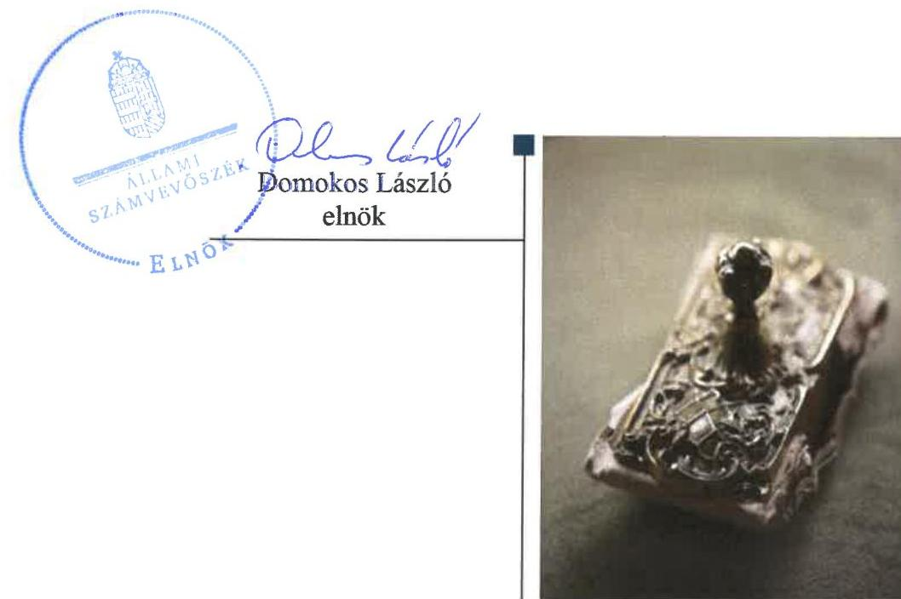

---

# AZ ELLENŐRZÉST FELÜGYELTE: 

DR. NÉMETH ERZSÉBET felügyeleti vezető

## AZ ELLENŐRZÉST VEZETTE ÉS A VÉGREHAJTÁSÁÉRT FELELŐS:

DR. KOVÁCS DIÁNA ellenőrzésvezető

## A PROGRAM ÖSSZEÁLLÍTÁSÁÉRT FELELŐS:

TÓTPÁL SZABOLCS osztályvezető

## A TÉMÁHOZ KAPCSOLÓDÓ KORÁBBI SZÁMVEVŐSZÉKI JELENTÉSEK:

- címe: Az Országos Nemzetiségi Önkormányzatok gazdálkodásának ellenőrzéséről - Országos Roma Önkormányzat
- sorszáma: 15152

IKTATÓSZÁM: EL-1000-001/2018.
TÉMASZÁM: 2460
ELLENŐRZÉS-AZONOSÍTÓ SZÁM: V080401

---

# TARTALOMJEGYZÉK 

■ ÖSSZEGZÉS ..... 5
■ AZ ELLENŐRZÉS CÉLJA ..... 6
■ AZ ELLENŐRZÉS TERÜLETE ..... 7
■ AZ ELLENŐRZÉS HÁTTERE, INDOKOLTSÁGA ..... 8
■ A JELENTÉS LÉNYEGES KÉRDÉSKÖRE ..... 9
■ ELLENŐRZÉS HATÓKÖRE ÉS MÓDSZEREI ..... 10
■ MEGÁLLAPÍTÁSOK ..... 12
■ MELLÉKLETEK ..... 15
I. sz. melléklet: Az ÁSZ 15152. számú jelentéséhez kapcsolódó intézkedési terv végrehajtása ..... 15
■ FÜGGELÉK: ÉSZREVÉTELEK ..... 19
■ RÖVIDÍTÉSEK JEGYZÉKE ..... 29

---

.

---

# ÖSSZEGZÉS 

Az Állami Számvevőszék utóellenőrzése megállapította, hogy az intézkedési tervben foglalt feladatok jelentős részét az Országos Roma Önkormányzat nem hajtotta végre, így nem volt biztositott a közpénzekkel való felelős, elszámoltatható, átlátható és szabályszerű gazdálkodás.

## Az ellenőrzés társadalmi indokoltsága

Az Állami Számvevőszék stratégiájában célul tűzte ki a számvevőszéki munka hasznosulásának javítását. Ezzel összhangban ellenőrzi, hogy az ellenőrzött szervezetek megvalósították-e a korábbi ellenőrzései által feltárt hibák, hiányosságok és szabálytalanságok megszüntetése céljából elkészített intézkedési terveikben foglaltakat. A rendszeres utóellenőrzések hozzájárulnak a szükséges intézkedések tényleges végrehajtáshoz, ezáltal a közpénzügyek rendezettségének javulásához.

## Főbb megállapítások, következtetések

Az Országos Roma Önkormányzat az intézkedési tervében meghatározott 24 feladatból határidőre egyet sem hajtott végre. 14 feladat végrehajtására nem került sor, 5 intézkedési tervhez kapcsolódó feladat pedig határidőn túl került megvalósításra. A határidőn túl végrehajtott feladatok szabályzat-készítésre vonatkoztak. Két feladat - amelyek megvalósítására szintén nem került sor - 2017. január 1-je után, a jogszabályi változások miatt okafogyottá vált. Három feladatot részben végrehajtott az Önkormányzat. Az Országos Roma Önkormányzat Hivatala az ÁSZ javaslatai alapján készített intézkedési terv végrehajtásáról nyilvántartást nem vezetett.

Az Országos Roma Önkormányzat vagyongazdálkodási tevékenységének szabályozottsága és annak múködése továbbra sem biztosította a szabályszerű, átlátható és elszámoltatható közpénzfelhasználást.

---

# AZ ELLENŐRZÉS CÉLJA 

Az ellenőrzés célja annak értékelése volt, hogy a számvevőszéki jelentésben ${ }^{1}$ foglalt intézkedést igénylő megállapításokkal összhangban készített intézkedési tervben meghatározott feladatokat az Országos Roma Önkormányzat végrehajtotta-e.

---

# **AZ ELLENŐRZÉS TERÜLETE**

## **Országos Roma Önkormányzat**

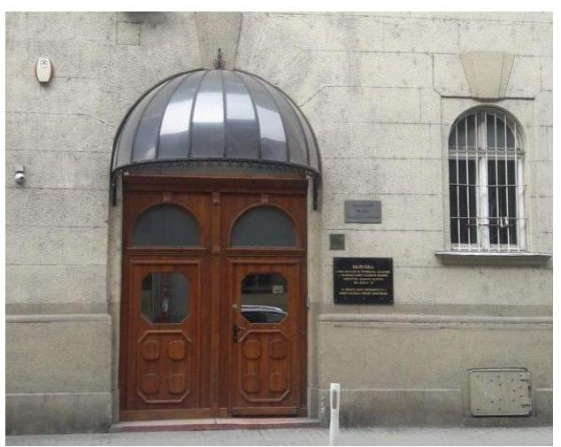

Az Önkormányzat² önállóan működő és gazdálkodó jogi személy, az Njtv.³ alapján létrehozott nemzetiségi önkormányzat. Alapvető feladata a magyarországi romák egyéni és kollektív jogainak, érdekeinek védelme és képviselete az önkormányzati feladat- és hatáskörök gyakorlásával. Hatásköre Magyarország egész területére kiterjed. Az Önkormányzatot az Elnök⁴ képviseli, a feladat- és hatáskörök pedig a Közgyűlést⁵ illetik meg.

Az ÁSZ⁶ 2015. évben ellenőrizte az Önkormányzat gazdálkodását, a belső kontrollrendszer kialakítását és működését, az államháztartásból nyújtott támogatást, illetve az államháztartásból meghatározott célra ingyenesen juttatott vagyon felhasználását a 2011. január 1. és 2014. június 30. közötti időszak tekintetében.

Az erről szóló 15152. számú jelentését az ÁSZ 2015. szeptember 17-én kiadmányozta. A számvevőszéki jelentésben feltárt szabálytalanságok, működésbeli hiányosságok kiküszöbölése érdekében az Önkormányzat intézkedési tervet készített, amelyet az ÁSZ elfogadott.

---

# AZ ELLENŐRZÉS HÁTTERE, INDOKOLTSÁGA 

Az ÁSZ tv. ${ }^{7}$ 33. § (1) bekezdése értelmében a számvevőszéki jelentések intézkedést igénylő megállapításaihoz kapcsolódóan az ellenőrzött szervezet vezetője intézkedési tervet köteles összeállítani, és az ÁSZ részére megküldeni.

Az ÁSZ által befogadott intézkedési tervben foglaltak megvalósítását az ÁSZ tv. 33. § (7) bekezdésében foglaltak alapján - az ÁSZ utóellenőrzés keretében ellenőrizheti. Az utóellenőrzések keretében - az intézkedések értékelése során - az Állami Számvevőszék figyelembe veszi az ellenőrzött szervezetek működési feltételeiben, valamint a jogszabályi előírásokban bekövetkezett változásokat.

Az utóellenőrzés során az ÁSZ értékeli, hogy az érintett számvevőszéki jelentésben foglalt intézkedést igénylő megállapításokkal és javaslatokkal összhangban, az ellenőrzött szervezet által készített intézkedési tervben meghatározott feladatokat a feladatra kijelöltek végrehajtották-e.

Az intézkedések végrehajtásával az adott terület szabályszerű múködése vonatkozásában a kockázatok csökkenhetnek, azonban hosszabb távon az intézkedési tervben foglaltak végrehajtásával önmagában nem szűnnek meg, csak akkor, ha beépülnek az ellenőrzött szervezet múködésébe, azokat folyamatosan karban tartják, figyelembe véve, illetve kezelve a változásokat. Emellett az intézkedések végrehajtásáig újabb kockázatok merülhetnek fel a szabályszerű múködés vonatkozásában, amelyek kezelése szintén kiemelten fontos az ellenőrzött szervezet számára.

Az ellenőrzött szervezet vezetője által készített intézkedési tervben foglalt feladatok hiányos, illetve késedelmes végrehajtása, vagy annak elmaradása a szabályszerűség és a felelős vezetői magatartás vonatkozásában kockázatot hordoz, ami azt mutatja, hogy az ellenőrzések során feltárt hibák, hiányosságok és szabálytalanságok kezelése nem kapott kellő hangsúlyt. Az utóellenőrzés során is fennálló szabálytalanságok esetén a közpénz, közvagyon veszélyeztetettségi kockázat valószínűsített hatásának értékelése további intézkedéseket vonhat maga után.

Az ellenőrzött szervezet szintjén az utóellenőrzés feltárja, hogy a szervezet az intézkedések végrehajtásával hasznosította-e a korábbi ellenőrzési jelentésben a hiányosságok megszüntetése, illetve a kockázatok kezelése érdekében megfogalmazott javaslatokat, illetve az intézkedések végrehajtása elmaradásának következtében továbbra is fennálló szabálytalanság esetén értékeli a közpénzek, közvagyon veszélyeztetettségét.

Az ÁSZ szintjén az utóellenőrzés visszacsatolást ad az ellenőrzési jelentések hasznosulásáról, az intézkedések elmaradásának, vagy részleges megvalósulásának a közpénzek, közvagyon veszélyeztetettségére gyakorolt valószínűsített hatásának értékelése, további intézkedéseket vonhat maga után.

---

# A JELENTÉS LÉNYEGES KÉRDÉSKÖRE 

Az Önkormányzat az intézkedési tervben foglaltakat az elöirt határidőben végrehajtotta-e?

---

# ELLENŐRZÉS HATÓKÖRE ÉS MÓDSZEREI 

## Az ellenőrzés típusa

Megfelelőségi ellenőrzés

## Az ellenőrzött időszak

Az utóellenőrzés alapját képező ÁSZ jelentés közzétételének napjától (2015. szeptember 17.) az ellenőrzésről szóló kiértesítő levél keltének napjáig (2018. március 2.) tartó időszak.

## Az ellenőrzés tárgya

A számvevőszéki jelentésben foglalt intézkedést igénylő megállapításokkal és javaslatokkal összhangban az Önkormányzat által készített intézkedési tervben foglaltak végrehajtásának ellenőrzése.

Az ellenőrzés kiterjedt minden olyan körülményre és adatra, amely az ÁSZ jogszabályban meghatározott feladatainak teljesítéséhez, valamint a program végrehajtása folyamán felmerült újabb összefüggések feltárásához szükséges volt.

## Az ellenőrzött szervezet

Országos Roma Önkormányzat, Országos Roma Önkormányzat Hivatala

## Az ellenőrzés jogalapja

Az ellenőrzés jogszabályi alapját az ÁSZ tv. 33. § (7) bekezdése, illetve a 33. § (1)-(2) és (6) bekezdéseinek előírásai képezik.

## Az ellenőrzés módszerei

Az ÁSZ az ellenőrzést az ellenőrzött időszakban hatályos jogszabályok, az ellenőrzés szakmai szabályai, a jelen ellenőrzésre irányadó ÁSZ módszertanok, az ellenőrzési programban foglalt értékelési szempontok szerint végeztük.

Az ÁSZ az ellenőrzés ideje alatt az Önkormányzattal történő kapcsolattartást az ÁSZ SZMSZ ${ }^{\circledR}$-ének vonatkozó előírásai alapján biztosította.

Az utóellenőrzés megállapításait az ÁSZ rendelkezésére álló dokumentumok, valamint az ÁSZ adatbekérése szerint, az ellenőrzött szervezetek

---

által rendelkezésre bocsátott dokumentumok, adatok alapozták meg, ami kiegészült az Önkormányzat székhelyén történő adatbetekintéssel, helyszíni ellenőrzéssel.

Az ellenőrzési kérdések megválaszolásához szükséges bizonyítékok megszerzése az ellenőrzött szervezetek által rendelkezésre bocsátott dokumentumokra, adatokra alapozva megfigyelés, szemle (szemrevételezés), kérdésfeltevés (információkérés), valamint elemző eljárás alkalmazásával történt. Az ellenőrzési bizonyítékként felhasználható adatforrások közé tartoztak egyrészt az ellenőrzési program részletes szempontjainál felsorolt adatforrások, másrészt minden - az ellenőrzés folyamán feltárt, az ellenőrzés szempontjából információt tartalmazó - dokumentum.

Az intézkedési tervekben előírt feladatokat azok végrehajthatósága, illetve végrehajtása szempontjából az alábbiak szerint értékel az ÁSZ:
$\longrightarrow$ „határidőben végrehajtott" a feladat, ha a teljesítés dokumentáltan, az intézkedési tervben előírt határidőben és tartalommal megtörtént;
$\longrightarrow$ „határidőn túl végrehajtott" a feladat, ha annak teljesítése az intézkedési tervben meghatározott módon, de az abban előírt határidőn túl történt meg;
$\longrightarrow$ „részben végrehajtott" a feladat, ha annak végrehajtása nem teljes körűen az intézkedési tervben előírt módon történt meg;
$\longrightarrow$ „nem végrehajtott" a feladat, ha a végrehajtás nem történt meg, dokumentumokkal nem igazolt annak teljesítése;
$\longrightarrow$ „okafogyottá vált" a feladat, ha végrehajtására - meghatározott esemény bekövetkezése, továbbá külső körülmény, a működést érintő feltétel változása miatt - már nincs szükség, illetve lehetőség, és egyértelműen megállapítható, hogy az intézkedést szükségessé tevő körülmény a jövőben nem fordulhat elő;
$\longrightarrow$ „nem időszerü" az a feladat, amelynek ellenőrzési időszakon belüli végrehajtására azért nem került (kerülhetett) sor, mert az intézkedés alapjául szolgáló esemény nem következett be, de annak jövőbeni előfordulása lehetséges, a végrehajtása nem volt esedékes, vagy a végrehajtás határideje még nem járt le.
Az ellenőrzés lefolytatásához az ellenőrzött szervezet a tanúsítványok elektronikus kitöltésével, valamint az ÁSZ által kért dokumentumok elektronikus megküldésével szolgáltatott adatokat, amelyek valódiságát és teljes körűségét az ellenőrzött szervezet vezetője által tett teljességi és hitelességi nyilatkozat igazolta. Az így rendelkezésre bocsátott adatok, információk kontrollja az ellenőrzés keretében történt.

---

# MEGÁLLAPÍTÁSOK 

## Az Önkormányzat az intézkedési tervben foglaltakat az előírt határidőben végrehajtotta-e?

Összegző megállapítás

Az Önkormányzat az intézkedési tervben foglalt 24 feladatból 14 feladatot nem hajtott végre, öt feladatot pedig határidőn túl teljesített. Három feladatot részben hajtott végre, két feladat okafogyottá vált.

Az ÁSZ jelentése az Önkormányzat elnöke részére nyolc feladatot, míg a Hivatalvezető9 részére kilenc pontban 16 feladatot határozott meg, amelyek intézkedési tervkészítési kötelezettséget vontak maguk után. Az Önkormányzat az Intézkedési tervet elkészítette.

Az intézkedési tervben meghatározott feladatokat, határidőket, felelősöket és a feladatok végrehajtását az I. számú melléklet mutatja be.

A Hivatalvezető az ÁSZ javaslatai alapján készített intézkedési terv végrehajtásáról a Bkr. ${ }^{10} 14 . \S$ (1) bekezdése szerinti nyilvántartást nem vezette.

Az intézkedési tervben felsorolt feladatok végrehajtásának értékelési kategóriák szerinti megoszlását az 1. ábra szemlélteti:

1. ábra

A feladatok végrehajtásának értékelési kategóriák szerinti megoszlása
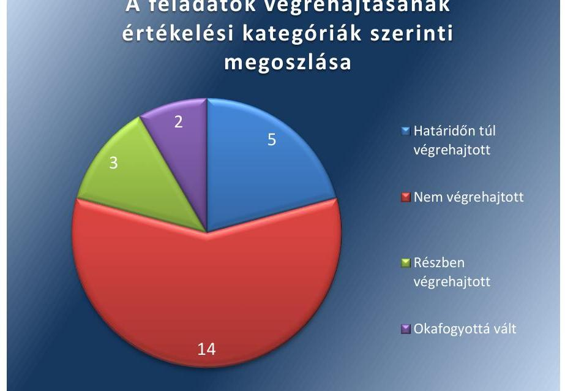

Fonräs: ÁSZ

---

# HATÁRIDŐN TÚL VÉGREHAJTOTT feladatok: 

$\qquad$ 1. Határidőn túl, 2017. október 1-jével hajtotta végre teljes körűen az Elnök a számviteli-gazdálkodási szabályzatok jóváhagyására vonatkozó intézkedési kötelezettségét.
2. A reprezentációs kiadások felosztását tartalmazó szabályzat elkészítését 2017. október 1-jén, a gépjárművek igénybevételének és használatának rendjét tartalmazó szabályzat elkészítését előíró feladatot 2016. október 3-án, határidőn túl hajtotta végre a Hivatalvezető.
3. A beszerzések szabályzata elkészítését - annak 2017. október 1-jei hatályba léptetésével - a Hivatalvezető határidőn túl hajtotta végre.
4. A közérdekű adatok megismerésére irányuló kérelmek intézése rendjének kialakítását előíró feladatot - a szabályzat 2017. október 1-jei hatályba léptetésével - a Hivatalvezető határidőn túl hajtotta végre.
5. Az Önkormányzat adatvédelmi szabályzatának elkészítését - a Közszolgálati adatvédelmi szabályzat 2017. január 1-jei hatályba léptetésével - a Hivatalvezető határidőn túl hajtotta végre.

## RÉSZBEN VÉGREHAJTOTT feladatok:

6. Az Elnök az elvégzett feladatokról a Közgyűlés felé történő éves beszámolási kötelezettségének részben tett eleget, mert a 2016. és 2017. évi feladatairól 2018. február 13-án beszámolt, azonban a 2015. évben elvégzett feladatairól nem számolt be a Közgyűlés felé.
7. A költségvetési határozatok vonatkozásában a jogszabályi előírások betartásáról az Elnök a 2016. és 2017. évi költségvetés vonatkozásában nem gondoskodott, megsértve az Áht. ${ }^{11} 24$. § (4) bekezdés a) és b) pontjában foglaltakat. A 2018. évi költségvetés vonatkozásában eleget tett a jogszabályi előírásoknak.
8. A Hivatal SZMSZ-ének, számlarendjének jogszabályi előírások szerinti elkészítéséről a Hivatalvezető nem gondoskodott, megsértve az Áht. 10. § (5) bekezdésében, illetve az Áhsz. ${ }^{12}$ 51. § (2) bekezdésében foglaltakat. A Bizonylati rend elkészítéséről gondoskodott, az 2016. október 1-jén hatályba lépett.

## NEM VÉGREHAJTOTT feladatok:

9. Az Elnök nem gondoskodott az Önkormányzat SZMSZ-ének kiegészítéséről.
10. Az erőforrásokkal való szabályszerű és hatékony gazdálkodáshoz szükséges követelmények meghatározására vonatkozó intézkedési kötelezettségének az Elnök nem tett eleget.
11. A jogszabályi előírásokkal összhangban történő támogatások nyújtására vonatkozó intézkedési kötelezettségének az Elnök nem tett eleget.

---

12. A vagyonkezeléssel kapcsolatos döntések során a jogszabályi előírások betartására vonatkozó intézkedési kötelezettségének az Elnök nem tett eleget.
13. Az Elnök az átruházott hatáskörei tekintetében azok jogszabálynak megfelelő továbbadásának intézkedési kötelezettségének nem tett eleget.
14. A Hivatal és a hozzárendelt önállóan működő intézmények által ellátandó feladatok részleteit, a munkamegosztás és a felelősségvállalás rendjét tartalmazó megállapodások elkészítését előíró feladatot a Hivatalvezető nem hajtotta végre.
15. A kockázatkezelési rendszer jogszabályi előírásoknak megfelelő kialakítását és működtetését előíró feladatot a Hivatalvezető nem hajtotta végre.
16. A gazdálkodási jogkörök (kulcskontrollok) jogszabályi előírásoknak megfelelő működtetéséről szóló feladatot a Hivatalvezető nem hajtotta végre.
17. Az utalványrendeletek alaki és tartalmi követelményeknek való megfelelőségét előíró feladatot a Hivatalvezető nem hajtotta végre.
18. Az Önkormányzat szervezetére, tevékenységére és működésére vonatkozó adatok közzétételé előíró feladatot a Hivatalvezető nem hajtotta végre.
19. A belső ellenőrzések megállapításai alapján az érintettek intézkedési terv készítésére irányuló felkérését előíró feladatot a Hivatalvezető nem hajtotta végre.
20. A költségvetési határozatok jogszabályi előírásoknak megfelelő előkészítését előíró feladatot a Hivatalvezető nem hajtotta végre.
21. A költségvetési év kiadási előirányzatai terhére történő kötelezettségvállalásra vonatkozó feladatát - miszerint kötelezettségvállalásra az eredeti vagy módosított kiadási előirányzatok mértékéig kerüljön sor - a Hivatalvezető nem hajtotta végre.
22. A vagyonkimutatás vonatkozásában készült zárszámadási határo-zat-tervezet jogszabályoknak megfelelő előterjesztéséről előíró feladatot a Hivatalvezető nem hajtotta végre.

# OKAFOGYOTTÁ VÁLT feladatok: 

23. A működési támogatások felhasználásáról elkülönített nyilvántartás vezetésére vonatkozó feladat 2017. január 1-jén - jogszabálymódosítás miatt - okafogyottá vált.
24. a működési támogatások felhasználásáról a jogszabályi előírásoknak megfelelő tartalmú beszámoló készítésére vonatkozó feladat 2017. január 1-jén - jogszabály-módosítás miatt - okafogyottá vált.

---

# MELLÉKLETEK

- I. SZ. MELLÉKLET: AZ ÁSZ 15152. SZÁMÚ JELENTÉSÉHEZ KAPCSOLÓDÓ INTÉZKEDÉSI TERV VÉGREHAJTÁSA

|  Sorszám | Az intézkedési terv alapján elvégzendő feladat | Az intézkedési tervben meghatározott határidő | Az intézkedési tervben megjelölt felelős | A feladat végrehajtása  |
| --- | --- | --- | --- | --- |
|  Határidőn túl végrehajtott feladatok |  |  |  |   |
|  1. | Intézkedjen az Önkormányzat gazdálkodásával kapcsolatos számviteli-gazdálkodási szabályzatok jóváhagyása tekintetében a jogszabályi előírások betartása érdekében. | 2016. augusztus 23. | Elnök | A gazdálkodási szabályzat 2016. november 25-én került kiadmányozásra. Az Elnök az intézkedési tervben foglaltakhoz képest három hónappal később tett eleget az Ávr. ${ }^{13}$ 13. § (2) bekezdés a) bekezdésében foglalt szabályzatkészítési kötelezettségének. A számviteli politika és az annak keretében készített leltározási, pénzkezelési szabályzat 2016. október 1-jén került kiadmányozásra. Az Elnök az intézkedési tervben foglaltakhoz képest másfél hónappal később tett eleget a Számv. tv. ${ }^{14}$ 14. § (3) bekezdésében, a 14. § (5) bekezdés a) és d) pontjaiban előírt szabályzatkészítési kötelezettségének. Az értékelési szabályzat 2017. október 1-jén került kiadmányozásra. Az Elnök az intézkedési tervben foglaltakhoz képest több mint egy évvel később tett eleget a Számv. tv. 14. § (5) bekezdés b) pontjában előírt szabályzatkészítési kötelezettségének.  |
|  2. | Intézkedjen a reprezentációs kiadások felosztását, a gépjárművek igénybevételének és használatának rendjét tartalmazó szabályzatok elkészítéséről. | 2016. augusztus 23. | Hivatalvezető | A reprezentációs kiadások felosztását tartalmazó szabályzat 2017. október 1-jén lépett hatályba. Az intézkedési tervben foglaltakhoz képest több mint egy évvel később tett eleget a Hivatalvezető az Ávr. 13. § (2) bekezdés e) pontjában előírt szabályzatkészítési kötelezettségének. A gépjárművek igénybevételének és használatának rendjét tartalmazó szabályzat 2016. október 3-án lépett hatályba. Az intézkedési tervben foglaltakhoz képest másfél hónappal később tett eleget a Hivatalvezető az Ávr. 13. § (2) bekezdés f) pontjában előírt szabályzatkészítési kötelezettségének.  |
|  3. | Intézkedjen a beszerzések szabályzata kiadmányozásáról. | 2016. augusztus 23. | Hivatalvezető | A Beszerzési Szabályzat 2017. október 1-jén lépett hatályba. Az intézkedési tervben foglaltakhoz képest több mint egy évvel később tett eleget a Hivatalvezető az Ávr. 13. § (2) bekezdés b) pontjában előírt szabályzatkészítési kötelezettségének.  |
|  4. | Intézkedjen a közérdekű adatok megismerésére irányuló kérelmek intézése rendjének kialakításáról. | 2016. augusztus 23. | Hivatalvezető | A Szabályzat a közérdekű adatok megismerésére irányuló kérelmek intézésének, továbbá a kötelezően közzéteendő adatok nyilvánosságra hozatalának rendjéről 2017. október 1-jén lépett hatályba. Az intézkedési tervben foglaltakhoz képest több mint  |

---

|  5. |  | Az intézkedési
tervben
meghatározott
határidő | Az intézkedési
tervben
megjelölt
felelős | A feladat végrehajtása  |
| --- | --- | --- | --- | --- |
|  5. | Intézkedjen az Önkormányzat adatvédelmi szabályzatának el-
készítéséről. | 2016. augusztus 23. | Hivatalvezető | egy évvel később tett eleget a Hivatalvezető az Ávr. 13. § (2) bekezdés h) pontjában
és az Info tv. ${ }^{15} 30 .$ § (6) bekezdésében előírt szabályzatkészítési kötelezettségének.
A Közszolgálati adatvédelmi szabályzat 2017. január 1-jén lépett hatályba. Az intézkedési tervben foglaltakhoz képest négy és fél hónappal később tett eleget a Hivatalvezető az Info tv. 24. § (3) bekezdésében előírt szabályzatkészítési kötelezettségének.  |
|   |  | Részben végrehajtott feladatok |  |   |
|  6. | Az Elnök évente számoljon be a Közgyűlésnek az elvégzett fel-
adatokról. | folyamatos | Elnök | Az Elnök 2018. február 13-án a 2016-2017. évi tevékenységéről beszámolt a Közgyűlésnek, az intézkedési tervben foglalt feladat 2015. év tekintetében nem került végrehajtásra.  |
|  7. | Intézkedjen a költségvetési határozatok vonatkozásában a jogszabályi előírások betartására. | folyamatos | Elnök | A költségvetési határozatok vonatkozásában az Önkormányzat 2016. és 2017. évben nem gondoskodott a jogszabályi előírások betartásáról, mert a költségvetés előterjesztésekor a Közgyűlés részére tájékoztatásul nem mutatták be az Önkormányzat mérlegét közgazdasági tagolásban, az előíányzat felhasználási tervét, valamint a többéves kihatással járó döntések számszerűsítését évenkénti bontásban és összesítve, megsértve a 2016-2017. években az Áht. 24. § (4) bekezdés a) és b) pontjaiban foglaltakat. A 2018. évi költségvetési javaslatot és annak elfogadását a 11/2018. (II.13.) Országos Roma Önkormányzat sz. határozat tartalmazza.  |
|  8. | Intézkedjen a Hivatal SZMSZ-e, számlarendje és bizonylati rendje elkészítéséről. | 2016. augusztus 23. | Hivatalvezető | A Hivatal vezetője nem intézkedett a Hivatal SZMSZ-e és számlarendje elkészítéséről, ezért a Hivatal az Áht. 10. § (5) bekezdésének ellenére nem rendelkezett szervezeti és működési szabályzattal, valamint az Áhsz. 51. § (2) bekezdése ellenére nem rendelkezett számlarenddel. A Bizonylati rend 2016. október 1-jén lépett hatályba, amivel a Hivatal eleget tett a Számv. tv. 161. § (2) bekezdés d) pontjában előírtaknak.  |
|   |  | Nem végrehajtott feladatok |  |   |
|  9. | Gondoskodjon az SZMSZ kiegészítésére annak érdekében, hogy az a jogszabályilag előírt elemeket teljes körűen tartalmazza, és jóváhagyásra terjessze a Közgyűlés elé. | 2016. december 31. | Elnök | Az Elnök nem gondoskodott az Önkormányzat SZMSZ-e kiegészítéséről, mert az Njtv. 113. § a) és g) pontjában, valamint az Ávr. 13. § (1) bekezdés d) pontjában foglaltak ellenére az Önkormányzat SZMSZ-e nem tartalmazta az átvett iskolák felsorolását és nem terjesztette azt a Közgyűlés elé.  |
|  10. | Intézkedjen az erőforrásokkal való szabályszerű és hatékony gazdálkodáshoz szükséges követelmények meghatározására, és azok Közgyűlés elé terjesztésére. | 2016. október 31. | Elnök | Az Elnök nem intézkedett az Önkormányzat által fenntartott intézmények részére az erőforrásokkal való szabályszerű és hatékony gazdálkodáshoz szükséges követelmények meghatározása és azok Közgyűlés elé terjesztése érdekében, az Áht. 9. § e) pontjában megjelölt irányítási hatáskör gyakorlására nem került sor.  |

---

|  ㄷ
11. | Az intézkedési terv alapján elvégzendő feladat | Az intézkedési tervben meghatározott határidő | Az intézkedési tervben megjelölt felelős | A feladat végrehajtása  |
| --- | --- | --- | --- | --- |
|  11. | Intézkedjen, hogy a támogatások nyújtására csak a jogszabályi előírásokkal összhangban kerüljön sor. | folyamatos | Elnök | Az Önkormányzat a Bkr. 13. § (2) bekezdésében foglalt intézkedési kötelezettsége ellenére nem intézkedett annak érdekében, hogy a támogatások nyújtására csak az Njtv. 117-118. §-ában foglalt, országos nemzetiségi feladatokkal összhangban kerüljön sor.  |
|  12. | Intézkedjen, hogy a vagyonkezeléssel kapcsolatos döntések során a jogszabályi előírások betartásra kerüljenek. | folyamatos | Elnök | Az Önkormányzat a Bkr. 13. § (2) bekezdésében foglalt intézkedési kötelezettsége ellenére a vagyonkezeléssel kapcsolatos döntések során nem intézkedett arról, hogy a vagyonkezelésbe vételre az Njtv. 117. § (1) bekezdésében, a 113. § d) pontjában és a 119. § (1) bekezdésében foglalt jogszabályi előírások betartásával kerüljön sor.  |
|  13. | Intézkedjen, hogy az átruházott hatáskörei a jogszabályoknak megfelelően kerüljenek átadásra. | 2016. augusztus 23. | Elnök | Az Elnök a Bkr. 13. § (2) bekezdésében foglalt intézkedési kötelezettsége ellenére nem intézkedett arról, hogy az átruházott hatáskörei a jogszabályoknak megfelelően kerüljenek átadásra, ezáltal nem biztosította a Njtv. 77.§ (2) bekezdésében, az átruházott hatáskör továbbadását tiltó rendelkezés érvényre juttatását.  |
|  14. | Intézkedjen a Hivatal és a hozzárendelt önállóan működő intézmények által ellátandó feladatok, a munkamegosztás és a felelősségvállalás rendjét tartalmazó megállapodások előkészítéséről. | 2016. augusztus 23. | Hivatalvezető | A Hivatalvezető nem intézkedett a Hivatal és a hozzárendelt önállóan működő intézmények által ellátandó feladatok, a munkamegosztás és a felelősségvállalás rendjét tartalmazó megállapodások előkészítéséről, így a Hivatal megsértette az Ávr. 9. § (5) bekezdés a) pontjában leírtakat.  |
|  15. | A jogszabályi előírásoknak megfelelően alakítsa ki és működtesse a kockázatkezelési rendszert. | 2016. augusztus 23. | Hivatalvezető | A Hivatal vezetője nem alakította ki és működtette a kockázatkezelési rendszert a Bkr. 3. § b) pontjában, a 7. § (1)-(2), illetve 2016. október 1-jét követő időszakban a Bkr. 7. § (1)-(5) bekezdéseiben foglaltak ellenére.  |
|  16. | Intézkedjen a gazdasági jogkörök (kulcskontrollok) jogszabályi előírásoknak megfelelő működéséről. | 2016. június 24. | Hivatalvezető | A Hivatalvezető nem intézkedett a gazdasági jogkörök (kulcskontrollok) jogszabályi előírásoknak megfelelő működéséről, megsértve a teljesítésigazolás tekintetében az Ávr. 57. § (1) és (3) bekezdésében foglaltakat, valamint az 58. § (1) és (3) bekezdésében foglaltakat az érvényesítés vonatkozásában.  |
|  17. | Intézkedjen az utalványrendeletek alaki és tartalmi követelményeknek való megfelelőségéről. | 2016. június 24. | Hivatalvezető | A Hivatalvezető nem intézkedett az utalványrendeletek alaki és tartalmi követelményeknek való megfelelőségéről, megsértve az Ávr. 59. § (3) bekezdésében foglaltakat.  |
|  18. | Intézkedjen az Önkormányzat szervezetére, tevékenységére és működésére vonatkozó adatok közzétételéről. | 2016. augusztus 23. | Hivatalvezető | A Hivatal vezetője nem intézkedett az Önkormányzat szervezetére, tevékenységére és működésére vonatkozó adatok közzétételéről, ezzel a Hivatal megsértette az Info. tv. 37. § (1) bekezdésében előírtakat.  |
|  19. | Intézkedjen az érintettek felkérésére, hogy azok készítsenek intézkedési tervet a belső ellenőrzések megállapításai alapján. | 2016. augusztus 23. | Hivatalvezető | A Hivatalvezető nem intézkedett az érintettek felkérésére, hogy azok készítsenek intézkedési tervet a belső ellenőrzések megállapításai alapján, ezért megsértette a Bkr. 55. § (3) bekezdésében foglaltakat.  |

---

|  ㄷ
13
14 | Az intézkedési terv alapján elvégzendő feladat | Az intézkedési tervben meghatározott határidő | Az intézkedési tervben megjelölt felelős | A feladat végrehajtása  |
| --- | --- | --- | --- | --- |
|  20. | Intézkedjen a költségvetési határozatok jogszabályi előírásoknak megfelelő előkészítéséről. | Azonnal | Hivatalvezető | Az Áht. 23. § (2) bekezdés b) pontjában előírtak ellenére a költségvetési határozatok nem tartalmazták az Önkormányzat által irányított költségvetési szervek költségvetési bevételi előirányzatait és költségvetési kiadási előirányzatait kiemelt előirányzatok, és kötelező feladatok, önként vállalt feladatok és államigazgatási feladatok szerinti bontásban, így az intézkedési tervben szereplő feladat nem került végrehajtásra.  |
|  21. | Biztosítsa, hogy a költségvetési év kiadási előirányzatai terhére kötelezettségvállalásra az eredeti vagy módosított kiadási előirányzatok mértékéig kerüljön sor. | Azonnal | Hivatalvezető | A Hivatal nem biztosította, hogy a költségvetési év kiadási előirányzatai terhére kötelezettségvállalásra csak az eredeti vagy módosított kiadási előirányzatok mértékéig kerüljön sor, megsértve az Áht. 36. § (1) bekezdésében előírtakat.  |
|  22. | Intézkedjen a zárszámadási határozat-tervezet jogszabályoknak megfelelő előterjesztéséről. | Azonnal | Hivatalvezető | A Hivatalvezető nem intézkedett a zárszámadási határozat-tervezetek jogszabályoknak megfelelő előterjesztéséről, mivel azokhoz nem készült vagyonkimutatás. Ezzel az Önkormányzat megsértette az Mótv. 110. § (2) bekezdésében és az Áhsz. 30. §ában foglaltakat.  |
|   |  |  |  | Okafogyottá vált feladatok  |
|  23. | Intézkedési terv készítése a működési támogatások felhasználásáról elkülönített nyilvántartás vezetésére. | 2016. augusztus 23. | Hivatalvezető | Az Önkormányzat a működési támogatások felhasználásáról elkülönített nyilvántartást nem vezetett, 2016. december 31-ig a 428/2012. (XII. 29.) Korm. rendelet ${ }^{16} 10$. § (4) bekezdésében foglaltak ellenére. A 264/2016. (VIII. 31.) Korm. rendelet ${ }^{17} 27 . \S$ 2. pontja hatályon kívül helyezte a rendelkezést, a 38/2016. (XII. 16.) EMMI rendelet ${ }^{18}$ már nem írt elő ilyen kötelezettséget, az intézkedési tervben foglalt feladat 2017. január 1-jétől okafogyottá vált.  |
|  24. | Beszámoló a működési támogatások felhasználásáról. | 2016. augusztus 23. | Hivatalvezető | Az Önkormányzat a működési támogatások felhasználásáról az előírt beszámolót nem készítette el, 2016. december 31-éig a 428/2012. (XII. 29.) Korm. rendelet 10. § (5) bekezdésben foglaltak ellenére. A 264/2016. (VIII. 31.) Korm. rendelet 27. § 2. pontja hatályon kívül helyezte a rendelkezést a 38/2016. (XII. 16.) EMMI rendelet már nem írt elő ilyen kötelezettséget, az intézkedési tervben foglalt feladat 2017. január 1-jétől okafogyottá váltak.  |

Forrás: ÁSZ által készített táblázat

---

# FÜGGELÉK: ÉSZREVÉTELEK 

A jelentéstervezetet a Számvevőszék 15 napos észrevételezésre megküldte az ellenőrzött szervezetek vezetőinek az ÁSZ tv. 29. §* (1) bekezdése előírásának megfelelően.

Az Országos Roma Önkormányzat elnöke, illetve az Országos Roma Önkormányzat Hivatalának hivatalvezetője a jelentéstervezet megállapításaira észrevételt tett.
A függelék tartalmazza az ellenőrzöttek észrevételeit, illetve az el nem fogadott észrevételek elutasításának indoklását.

[^0]
[^0]:    * 29. § (1) Az Állami Számvevőszék az ellenőrzési megállapításait megküldi az ellenőrzött szervezet vezetőjének vagy az általa megbízott személynek, és annak, akinek személyes felelősségét állapította meg.
    (2) Az ellenőrzött szervezet vezetője és a felelősként megjelölt személy az ellenőrzés megállapításaira tizenöt napon belül írásban észrevételt tehet.
    (3) Az Állami Számvevőszék az észrevételre a beérkezésétől számított harminc napon belül írásban válaszol. A figyelembe nem vett észrevételeket köteles a jelentésben feltüntetni, és megindokolni, hogy azokat miért nem fogadta el.

---

# 333 

## ORSZÁGOS ROMA ÖNKORMÁNYZAT ELNÖK

Iktatószám: Ats -H /2018
Tárgy: Észrevétel jelentés tervezet
Hiv. szám: EL-0608-027/2018

## Domokos László

## Elnök

## Állami Számvevőszék

Budapest
Apáczai Csere János utca 10
1052

## ÁLLAMI SZÁMVEVŐSZÉK

$36-3645120101$
Ekszett: 2018 JÓN 27.
Iktatószám: EL-0608-021/2018
Múóket: 4

## Tisztelt Elnök Úr!

Alulírott Balogh János mint az Országos Roma Önkormányzat Elnöke, hivatkozva a EL-0608-027/2018 iktatószámú levelükre, az „Utóellenőrzések - Országos Nemzetiségi Önkormányzatok gazdálkodásának utóellenőrzése - Országos Roma Önkormányzat" című jelentéstervezettel kapcsolatban az ÁSZ tv. 29. § (2) bekezdésében foglalt határidőn belül az alábbi észrevételeket teszem.
I. A tárgybani, 15152. számú jelentés (továbbiakban: Jelentés) I. sz. mellékletének 6. pontjával kapcsolatos megállapításokat elfogadom, azonban tájékoztatom a T. Számvevőszéket, hogy 2016. február 26. napjától töltöm be az Országos Roma Önkormányzat elnöki tisztségét, azaz a 2015. év tekintetében az elnöki tevékenységről nem tudtam beszámolni a Közgyűlésnek. A 2016-17-es évben végzett tevékenységemről 2018. február 13. napján beszámoltam a Közgyűlésnek.
II. A Jelentés I. sz. mellékletének 9. pontjával kapcsolatban tájékoztatom a T. Számvevőszéket, hogy az Önkormányzat Szervezeti és Müködési Szabályzatának módosítását a soron következő, 2018 októberében esedékes közgyűlés elé fogom terjeszteni.
III. A Jelentés I. sz. mellékletének 10. pontjával kapcsolatban tájékoztatom a T. Számvevőszéket, hogy az Önkormányzat által fenntartott intézmények szabályszerű és hatékony gazdálkodásával kapcsolatos követelmények meghatározása folyamatban van, azokat a soron következő, 2018 októberében esedékes közgyűlés elé fogom terjeszteni.

Kérem, hogy a fenti észrevételeket a jelentés elkészítésekor figyelembe venni szíveskedjenek.
Budapest, 2018. június 27.
Tisztelettel
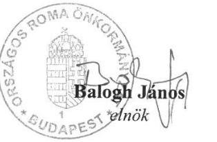

1

| 1074 Budapest, Dohány n. 76. | Telefon: + 36 (1) 322 - 8903 | Fax: + 36 (1) 322 - 8501 |
| :--: | :--: | :--: |
| E-mail: tiskarag@ornok.hu |  | Honlap: www.ornok.hu |

---

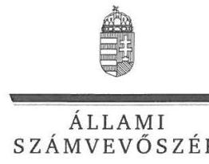

# Balogh János úr 

elnök
Országos Roma Önkormányzat

## Budapest

## Tisztelt Elnök Úr!

Az „Utóellenörzések - Országos Nemzetiségi Önkormányzatok gazdálkodásának utóellenörzése - Országos Roma Önkormányzat" címủ jelentéstervezetre tett észrevételét köszönettel megkaptam.

Az ellenőrzési megállapításokra vonatkozó észrevételét az Állami Számvevőszékről szóló 2011. évi LXVI. törvény (a továbbiakban: ÁSZ tv.) 29. § (2) bekezdésében meghatározott tizenöt napos határidőn belül küldte meg. Az Állami Számvevőszék észrevétellel kapcsolatos álláspontját a mellékletként csatolt, a felügyeleti vezető által készített indokolás tartalmazza.

Tájékoztatom, hogy az Állami Számvevőszék a figyelembe nem vett észrevételeket az ÁSZ tv. 29. § (3) bekezdésében előírtak szerint köteles a jelentésében feltüntetni és megindokolni, hogy azokat miért nem fogadta el.

Budapest, 2018. 0. hó 12 nap
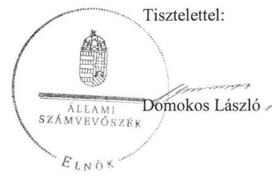

Melléklet: Észrevételre adott válasz

---

Az „Utóellenörzések - Országos Nemzetiségi Önkormányzatok gazdálkodásának utóellenörzése - Országos Roma Önkormányzat" címủ jelentéstervezethez tett észrevételre adott válasz
Országos Roma Önkormányzat

Elnök úr észrevételei nem vitatják a jelentéstervezet megállapításait. A jelentéstervezet 9. és 10. pontjával kapcsolatosan Elnök úr tájékoztatja az Állami Számvevőszéket a nem végrehajtott feladatokra vonatkozó, tervezett intézkedésekről.
A fentiekre való tekintettel a jelentéstervezet módosítása nem indokolt.

Budapest, 2018. július " $\S$ ".
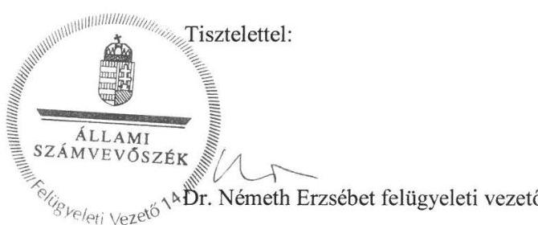

---

# OrszÁGOS ROMA ÖNKORMÁNYZAT HIVATALA HIVATALVEZETÓ 

Iktatószám:
Tárgy:
Hiv. szám:
Melléklet:

ÁrG-12, 2018.
Észrevétel jelentés tervezet
EL-0608-028/2018
határozat kivonatok, 2017. sárszámadáshoz tartozó melléklet

## Domokos László

## Elnök

## Állami Számvevőszék

## Budapest

Apáczai Csere János utca 10
1052

## Tisztelt Elnök Úr!

Alulírott Cserháti Tiborné dr., mint az Országos Roma Önkormányzat Hivatalának Hivatalvezetője, hivatkozva a EL-0608-028/2018 iktatószámú levelükre, az „Utóellenőrzések - Országos Nemzetiségi Önkormányzatok gazdálkodásának utóellenőrzése - Országos Roma Önkormányzat" című jelentéstervezettel kapcsolatban az ÁSZ tv. 29. § (2) bekezdésében foglalt határidőn belül az alábbi észrevételeket teszem.
I. A tárgybani, 15152. számú jelentés (továbbiakban: Jelentés) I. sz. mellékletének 8. pontjával kapcsolatban tájékoztatom a T. Számvevőszéket, hogy - ahogy azt a jelentés is tartalmazza - a Hivatal bizonylati rendje 2016. október 1. napján hatályba lépett. A Hivatal számlarendje 2018. január 1. napján lépett hatályba, azaz az Áhsz. vonatkozó rendelkezésének eleget tettünk. A Hivatal Szervezeti és Müködési Szabályzatának elkészítése jelenleg is folyamatban van.
II. A Jelentés I. sz. mellékletének 14. pontjával kapcsolatban tájékoztatom a T. Számvevőszéket, hogy a 2018. május 30. napján az Országos Roma Önkormányzat Közgyűlése a 45/2018 (V. 30.) Országos Roma Önkormányzat Közgyűlési sz. határozatával a gazdálkodás szempontjából hozzárendelt önállóan működő intézmények munkamegosztási és felelősségvállalási rendjének megállapodásokban történő elfogadásáról már határozatot hozott, azaz a Hivatal eleget tett az Ávr. 9. §. (5) bekezdésében foglaltaknak.
III. A Jelentés I. sz. mellékletének 15. pontjával kapcsolatban tájékoztatom a T. Számvevőszéket, hogy a kockázatkezelési rendszer kialakítása jelenleg is folyamatban van.
IV. A Jelentés I. sz. mellékletének 16. pontjával kapcsolatban tájékoztatom a T. Számvevőszéket, hogy jelenleg is folyamatban van az Ávr 57. § (1) és (3) bekezdésében foglaltaknak megfelelő rendszer kidolgozása.

---

V. A Jelentés I. sz. mellékletének 17. pontjával kapcsolatban tájékoztatom a T. Számvevőszéket, hogy az utalványrendeletek alaki és tartalmi követelményeinek való megfeleltetésről intézkedtünk, így a Számviteli tv. rendelkezéseinek az utalványozási rendeletek maradéktalanul megfelelnek.
VI. A Jelentés I. sz. mellékletének 18. pontjával kapcsolatban tájékoztatom a T. Számvevőszéket, hogy az Önkormányzat szervezetére, müködésére és a tevékenységére vonatkozó adatok közzétételén az Önkormányzat Hivatala jelenleg is dolgozik.
VII. A Jelentés I. sz. mellékletének 19. pontjával kapcsolatban tájékoztatom a T. Számvevőszéket, hogy a 19. pontban foglaltaknak eleget tettünk.
VIII. A Jelentés I. sz. mellékletének 20. pontjával kapcsolatban tájékoztatom a T. Számvevőszéket, hogy a 2017. évi és a 2018. évi költségvetési határozatok az Áht. 23. § (2) bekezdés b) és ba) pontja szerinti tartalmi elemeket tartalmazták. A 18/2017 (I.7.) Országos Roma Önkormányzat Közgyűlési sz. határozat valamint a 11/2018 (II.13.) Országos Roma Önkormányzat Közgyűlési sz. határozat kivonatát mellékelem jelen észrevételemhez.
IX. A Jelentés I. sz. mellékletének 21. pontjával kapcsolatban tájékoztatom a T. Számvevőszéket, hogy jelenleg az Áht. előírásainak megfelelően biztosított az, hogy a költségvetési év kiadási előirányzatai terhére kötelezettségvállalásra az eredeti vagy módosított kiadási előirányzatok mértékéig kerüljön sor. Ennek igazolására mellékelem a 2017. évi zárszámadás összefoglaló táblázatát.

Kérem, hogy a fenti észrevételeket a jelentés elkészítésekor figyelembe venni szíveskedjenek.

Budapest, 2018. június 27.
Tisztelettel
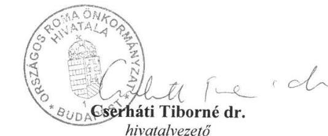

---

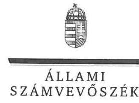

ELNÖK

Ikt.szám: EL-0608-033/2018.

# Dobóvári Ildikó Úrhölgy 

hivatalvezető
Országos Roma Önkormányzat Hivatala

## Budapest

## Tisztelt Hivatalvezető Úrhölgy!

Az „Utóellenörzések - Országos Nemzetiségi Önkormányzatok gazdálkodásának utóellenörzése - Országos Roma Önkormányzat" címủ jelentéstervezetre tett észrevételét köszönettel megkaptam.

Az ellenőrzési megállapításokra vonatkozó észrevételét az Állami Számvevőszékről szóló 2011. évi LXVI. törvény (a továbbiakban: ÁSZ tv.) 29. § (2) bekezdésében meghatározott tizenöt napos határidőn belül küldte meg. Az Állami Számvevőszék észrevétellel kapcsolatos álláspontját a mellékletként csatolt, a felügyeleti vezető által készített indokolás tartalmazza.

Tájékoztatom, hogy az Állami Számvevőszék a figyelembe nem vett észrevételeket az ÁSZ tv. 29. § (3) bekezdésében előírtak szerint köteles a jelentésében feltüntetni és megindokolni, hogy azokat miért nem fogadta el.

Budapest, 2018. O7 hó 18 nap
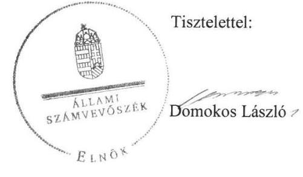

Melléklet: Észrevételre adott válasz

---

Az „Utóellenörzések - Országos Nemzetiségi Önkormányzatok gazdálkodásának utóellenörzése - Országos Roma Önkormányzat" címủ jelentéstervezethez tett észrevételre adott válasz
Országos Roma Önkormányzat Hivatala

A jelentéstervezetre tett észrevételeket áttekintettem, annak kezelésével kapcsolatban a következő tájékoztatást adom.
I. Az I. számú észrevételében Hivatalvezető úrhölgy jelzi, hogy az Országos Roma Önkormányzat (ORÖ) Hivatal számlarendjére vonatkozóan a jogszabályi előírásoknak eleget tettek. Tekintettel azonban arra, hogy az Állami Számvevőszék (ÁSZ) számára rendelkezésre bocsátott dokumentumon nem szerepel a kiadmányozó személy neve, aláírása és az aláírás kelte, emiatt a szabályzat nem tekinthető kiadmányozottnak.
A fentiekre való tekintettel a jelentéstervezet módosítása nem indokolt.
II. A II. számú észrevétel nem vitatja a jelentéstervezet megállapítását. Az észrevételben szereplő, a munkamegosztási és felelősségvállalási rendre vonatkozó megállapodás elfogadására az ellenőrzött időszakon túl került sor.
A fentiekre való tekintettel a jelentéstervezet módosítása nem indokolt.
III. Az észrevétel III. pontja nem vitatja a jelentéstervezet megállapítását. Hivatalvezető úrhölgy tájékoztatja az Állami Számvevőszéket a nem végrehajtott feladatra vonatkozó, folyamatban lévő intézkedésekről, így a kapcsolódó megállapítás módosítása nem indokolt.
IV. Az észrevétel IV. pontja nem vitatja a jelentéstervezet megállapítását. Hivatalvezető úrhölgy tájékoztatja az Állami Számvevőszéket a nem végrehajtott feladatra vonatkozó, folyamatban lévő intézkedésekről, így a kapcsolódó megállapítás módosítása nem indokolt.
V. A jelentéstervezet mellékletének 17. pontjában szereplő megállapítást vitatja az V. számú észrevétel. Az észrevétel kapcsán ismételten áttekintettük az ellenőrzés során rendelkezésre bocsátott dokumentumokat. Megállapítottuk, hogy az intézkedési terv 17. tervpontjában szereplő feladat végrehajtását az ORÖ Hivatala dokumentumokkal nem támasztotta alá. Erre való tekintettel a megállapítás módosítása nem indokolt.
VI. Az észrevétel VI. pontja nem vitatja a jelentéstervezet megállapítását. Hivatalvezető úrhölgy tájékoztatja az Állami Számvevőszéket a nem végrehajtott feladatra vonatkozó, folyamatban lévő intézkedésekről, így a kapcsolódó megállapítás módosítása nem indokolt.
VII. Hivatalvezető úrhölgy VII. számú észrevételében jelzi, hogy a jelentéstervezet mellékletének 19. pontjában szereplő megállapítással szemben az ORÖ Hivatala eleget tett a tervpontban foglaltaknak. Az észrevétel kapcsán ismételten áttekintettük az ellenőrzés rendelkezésére bocsátott dokumentumokat. Ennek során megállapítottuk, hogy az intézkedési terv kapcsolódó tervpontjában szereplő feladat végrehajtásának igazolására rendelkezésre bocsátott dokumentumok (belső ellenőrzési ütemtervek) nem támasztják alá a feladat végrehajtását. Erre való tekintettel a megállapítás módosítása nem indokolt.
VIII. A VIII. számú észrevételben, a jelentéstervezet mellékletének 20. pontjában foglaltakkal kapcsolatban Hivatalvezető úrhölgy jelzi, hogy a 2017. és 2018. évi költségvetési

---

határozatok Áht. szerinti elemeket tartalmazták. Az észrevétel kapcsán ismételten áttekintettük az ellenőrzés során rendelkezésére bocsátott dokumentumokat. Ennek során megállapítottuk, hogy a rendelkezésre bocsátott dokumentum (11/2018. (II.13.) Országos Roma Önkormányzat Közgyűlési sz. határozata az ORÓ 2018. évi költségvetési javaslatról) nem tartalmazza az intézkedési terv kapcsolódó tervpontjában szereplő feladat végrehajtását igazoló - a 4. pontban hivatkozott - mellékleteket.
Felhívjuk továbbá a figyelmet arra, hogy az észrevételezés során megküldött dokumentumokat az Állami Számvevőszéknek már nem áll módjában figyelembe venni. A fentiekre való tekintettel a megállapítás módosítása nem indokolt.
IX. Az észrevétel IX. pontja nem vitatja a jelentéstervezet megállapítását, a kapcsolódó megállapítás módosítását nem tartjuk indokoltnak.

Budapest, 2018. július " 16 ".
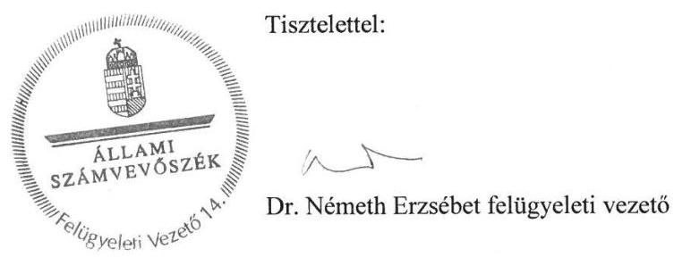

---

.

---

# RÖVIDÍTÉSEK JEGYZÉKE 

[^0]
[^0]:    ${ }^{1}$ Számvevőszéki jelentés
    ${ }^{2}$ Önkormányzat
    ${ }^{3}$ Njtv.
    ${ }^{4}$ Elnök
    ${ }^{5}$ Közgyűlés
    ${ }^{6}$ ÁSZ
    ${ }^{7}$ ÁSZ tv.
    ${ }^{8}$ ÁSZ SZMSZ
    ${ }^{9}$ Hivatalvezető
    ${ }^{10}$ Bkr.
    ${ }^{11}$ Áht.
    ${ }^{12}$ Áhsz.
    ${ }^{13}$ Ávr.
    ${ }^{14}$ Számv. tv.
    ${ }^{15}$ Info tv.
    ${ }^{16} 428 / 2012$. (XII. 29.) Korm. rendelet
    ${ }^{17} 264 / 2016$. (VIII. 31.) Korm. rendelet
    ${ }^{18} 38 / 2016$. (XII. 16.) EMMI rend

    Jelentés az Országos Nemzetiségi Önkormányzatok gazdálkodásának ellenőrzéséről - Országos Roma Önkormányzat (az ÁSZ 15152. számú jelentése) Országos Roma Önkormányzat
    a nemzetiségek jogairól szóló 2011. évi CLXXIX. törvény (hatályos: 2011. december 20-tól)
    Országos Roma Önkormányzat elnöke
    Országos Roma Önkormányzat Közgyűlése
    Állami Számvevőszék
    az Állami Számvevőszékről szóló 2011. évi LXVI. törvény (hatályos: 2011. július 1jétől)
    Az Állami Számvevőszék elnökének 4/2017. (XII. 29.) ÁSZ utasítása az Állami Számvevőszék Szervezeti és Működési Szabályzatáról (hatályos: 2018. január 1jétől)
    az Országos Roma Önkormányzat Hivatalának vezetője
    a költségvetési szervek belső kontrollrendszeréről és belső ellenőrzéséről szóló 370/2011. (XII. 31.) Korm. rendelet (hatályos: 2012. január 1-jétől)
    az államháztartásról szóló 2011. évi CXCV. törvény (hatályos:2011. december 31től)
    az államháztartás számviteléről szóló 4/2013. (I. 11.) Korm. rendelet (hatályos: 2014. január 1-jétől)
    az államháztartásról szóló törvény végrehajtásáról szóló 368/2011. (XII.31.) Korm. rendelet (hatályos: 2012. január 1-jétől)
    a számvitelről szóló 2000. évi C. törvény (hatályos 2001. január 1-jétől)
    az információs önrendelkezési jogról és az információszabadságról szóló 2011. évi CXII. törvény (hatályos: 2011. július 27-től)
    a nemzetiségi célú előirányzatokból nyújtott támogatások feltétel rendszeréről és elszámolásának rendjéről szóló 428/2012. (XII. 29.) Korm. rendelet (hatályos: 2013. január 1. és 2016. december 31. között)
    az államháztartásról szóló törvény végrehajtásáról szóló 368/2011. (XII. 31.) Korm. rendelet és egyes kapcsolódó kormányrendeletek módosításáról szóló 264/2016. (VIII. 31.) Kormányrendelet
    a nemzetiségi célú támogatások igénybevételének, felhasználásának és elszámolásának részletszabályairól szóló 38/2016. (XII. 16.) EMMI rendelet (hatályos: 2017. január 1-jétől)

---

ÁLLAMI SZÁMVEVŐSZÉK
1052 Budapest, Apáczai Csere János utca 10.
Levélcím: 1364 Budapest 4. Pf. 54
Telefon: +36 14849100 Telefax: +36 14849200
www.asz.hu