# Jellentés 

## Az állami vagyon feletti tulajdonosi joggyakorlással kapcsolatos tevékenységek ellenőrzése

2018.

---

# Jelențtés 

## Az állami vagyon feletti tulajdonosi joggyakorlással kapcsolatos tevékenységek ellenőrzése

2018. 08. hó 08. nap
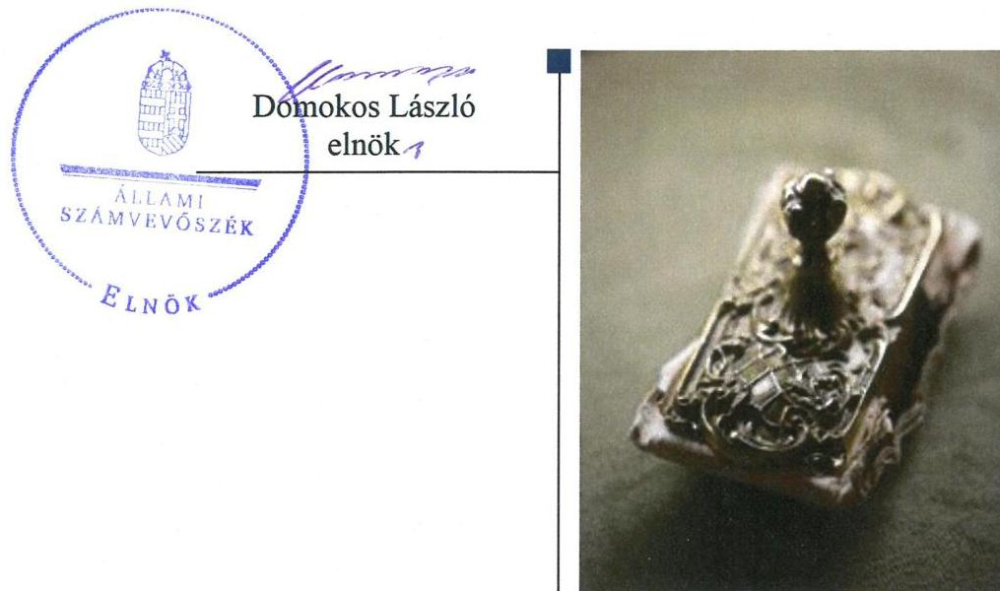

---

# AZ ELLENŐRZÉST FELÜGYELTE: 

MAKKAI MÁRIA felügyeleti vezető

## AZ ELLENŐRZÉST VEZETTE ÉS A VÉGREHAJTÁSÁÉRT FELELŐS:

JANIK JÓZSEF ellenőrzésvezető

## A PROGRAM ÖSSZEÁLLÍTÁSÁÉRT FELELŐS:

TÓTPÁL SZABOLCS osztályvezető

## A TÉMÁHOZ KAPCSOLÓDÓ KORÁBBI SZÁMVEVŐSZÉKI JELENTÉSEK:

- címe: Jelentés az állami vagyon feletti tulajdonosi joggyakorlással kapcsolatos tevékenységek ellenőrzéséről
- sorszáma: $\quad 17123$
- címe: Jelentés az állami vagyon feletti tulajdonosi joggyakorlással kapcsolatos tevékenységek ellenőrzéséről
- sorszáma: 15215

IKTATÓSZÁM: EL-0164-206/2018.
TÉMASZÁM: 2457
ELLENŐRZÉS-AZONOSÍTÓ SZÁM: V0802

---

# TARTALOMJEGYZÉK 

■ ÖSSZEGZÉS ..... 5
■ AZ ELLENŐRZÉS CÉLJA ..... 7
■ AZ ELLENŐRZÉS TERÜLETE ..... 8
■ AZ ELLENŐRZÉS HÁTTERE, INDOKOLTSÁGA ..... 11
■ A JELENTÉS LÉNYEGES KÉRDÉSKÖREI ..... 12
■ AZ ELLENŐRZÉS HATÓKÖRE ÉS MÓDSZEREI ..... 13
■ MEGÁLLAPÍTÁSOK ..... 15
■ JAVASLATOK ..... 22
■ MELLÉKLETEK ..... 25
I. sz. melléklet: Értelmező szótár ..... 25
■ FÜGGELÉK: ÉSZREVÉTELEK ..... 27
■ RÖVIDÍTÉSEK JEGYZÉKE ..... 55

---

.

---

# ÖSSZEGZÉS 

A Magyar Nemzeti Vagyonkezelő Zrt., a Nemzeti Földalapkezelő Szervezet, a Miniszterelnökség, a Földmüvelésügyi Minisztérium, a Nemzeti Fejlesztési Minisztérium, a Külgazdasági és Külügyminisztérium, a Magyar Fejlesztési Bank Zrt. és az Állami Egészségügyi Ellátó Központ a nemzeti vagyonnal való felelős gazdálkodás Alaptörvényben is rögzített követelményével összhangban a rábizott vagyonra vonatkozó számbavételi, adatszolgáltatási, vagyon megóvási kötelezettségüket 2016-ban összességében szabályszerüen, átlátható és elszámoltatható módon teljesítették. A Nemzeti Földalapkezelő Szervezet vagyongazdálkodása nem volt szabályszerü.

## Az ellenőrzés társadalmi indokoltsága

Az Állami Számvevőszék a közvagyonnal való felelős gazdálkodás elősegítése érdekében, törvényi kötelezettségének is eleget téve minden évben ellenőrzi a nemzeti vagyon meghatározó részét kitevő állami vagyon felett tulajdonosi jogokat gyakorló szervezetek feladatellátását. Ezzel hozzájárul az állami vagyon feletti kontrollok, a felelős, szabályszerű vagyongazdálkodás erősítéséhez, az állami vagyon megóvását, a közjó érdekében való hasznosítását célzó feladatellátás javításához, valamint az annak jövőbeli fejlesztését célzó döntések megalapozott előkészítéséhez, támogatva a jó kormányzás gyakorlatát, és objektív képet szolgáltatva társadalom részére a közvagyonnal való felelősségteljes gazdálkodás megvalósulásáról.

## Főbb megállapítások, következtetések, javaslatok

A tulajdonosi joggyakorlók az állami vagyonra vonatkozó beszámolási kötelezettségüknek a jogszabályi előírások szerinti tartalommal eleget tettek, azonban a Magyar Fejlesztési Bank Zrt. kivételével késedelmesen teljesítették a tulajdonosi joggyakorlásuk alá tartozó vagyonra vonatkozó adatszolgáltatást a Magyar Nemzeti Vagyonkezelő Zrt. felé.

A vagyonkezelésbe adott állami vagyon értékének pontos, naprakész nyomon követését veszélyeztette, hogy hiányosságok voltak ezeknek a vagyonelemeknek nyilvántartása terén. A tulajdonosi joggyakorlási feladatokat támogató szabályozási kontrollokat a tulajdonosi joggyakorlók a Nemzeti Földalapkezelő Szervezet és a Nemzeti Fejlesztési Minisztérium kivételével szabályszerűen alakították ki és működtették. A vagyonkezelésbe, használatba adott vagyon megóvását a tulajdonosi ellenőrzések rendszere támogatta.

A tulajdonosi joggyakorlók vagyongazdálkodása során a vagyonelemek átadás-átvétele, a vagyon gyarapítása és értékesítése szabályszerű volt, ugyanakkor az ellenőrzés hibákat, hiányosságokat tárt fel az állami vagyon vagyonkezelésbe adása terén a Nemzeti Földalapkezelő Szervezet és az Állami Egészségügyi Ellátó Központ esetében.

Az átláthatóság és elszámoltathatóság követelményének érvényesülését támogatta, hogy a tulajdonosi joggyakorlók - a Nemzeti Földalapkezelő Szervezet és a Földművelésügyi Minisztérium kivételével - az információs és kommunikációs folyamatokat szabályszerűen alakították ki, közzétételi kötelezettségeiknek eleget tettek.

A közvagyonnal való felelősségteljes gazdálkodás erősítése, a hibák, hiányosságok kijavítása érdekében a tulajdonosi joggyakorlók felelősen hasznosították a külső ellenőrzések megállapításait, nyomon követték az intézkedési tervek megvalósítását.

Az állami tulajdon feletti tulajdonosi joggyakorlás 2016-os értékeléséről az alábbi táblázat ad összefoglaló áttekintést. Minden ellenőrzött szervezet esetében az ellenőrzés célja szempontjából az adott szervezetre releváns funkciók értékelése történt meg, erre tekintettel a táblázat nem minden szervezet esetében tartalmazza valamennyi funkció minősítését.

---

| Funkció   Szervezet | Beszámolás | Vagyon   leltározása,   értékelése | Vagyon-   kezelésbe   adott   vagyon   nyilván-   tartása | Vagyon átadása | Vagyon-   kezelésbe   adás | Vagyon   gyarapítás   és értékesi-   tés | Szabályozási kontrollok | Közzétételi kontrollok | Ellenőrzések |
| :--: | :--: | :--: | :--: | :--: | :--: | :--: | :--: | :--: | :--: |
| MNV Zrt. | szabályszerű | szabályszerű | nem szabályszerű | szabályszerű | szabályszerű | szabályszerű | szabályszerű | szabályszerű | szabályszerű |
| NFA | szabályszerű | nem szabályszerű | nem szabályszerű | szabályszerű | nem szabályszerű | szabályszerű | nem szabályszerű | nem szabályszerű | szabályszerű |
| ÁEEK | szabályszerű | szabályszerű | nem szabályszerű | szabályszerű | nem szabályszerű | szabályszerű | szabályszerű | szabályszerű | szabályszerű |
| NFM | szabályszerű | szabályszerű |  | szabályszerű |  |  | nem szabályszerű | szabályszerű | szabályszerű |
| ME | szabályszerű | szabályszerű |  | szabályszerű |  |  | szabályszerű | szabályszerű | szabályszerű |
| FM | szabályszerű | szabályszerű |  | szabályszerű |  |  | szabályszerű | nem szabályszerű | szabályszerű |
| KKM | szabályszerű | szabályszerű |  | szabályszerű |  |  | szabályszerű | szabályszerű |  |
| MFB Zrt. | szabályszerű | szabályszerű |  | szabályszerű |  |  | helyénvaló | helyénvaló | helyénvaló |

A megállapítások alapján az Állami Számvevőszék a tulajdonosi joggyakorlóknak javaslatokat fogalmazott meg, amelyekre 30 napon belül intézkedési tervet kell készíteniük.

---

# AZ ELLENŐRZÉS CÉLJA 

Az ellenőrzés célja annak megítélése volt, hogy az állam tulajdonosi jogait gyakorló szervezetek tulajdonosi joggyakorlása megfelelt-e a vonatkozó jogszabályok előírásainak.

---

# AZ ELLENŐRZÉS TERÜLETE 

## Az állami vagyon feletti tulajdonosi joggyakorlással kapcsolatos tevékenységek ellenőrzése

A közvagyon meghatározó részét kitevő állami vagyonnal való gazdálkodás szabályozása a felelős, átlátható és elszámoltatható vagyongazdálkodás Alaptörvénynek ${ }^{1}$ megfelelő biztosítása érdekében több pilléren nyugszik.

Az Alaptörvény rendelkezéseihez igazodóan 2011. december 31-től hatályba lépett az Nvtv. ${ }^{2}$, amely többek között meghatározza a nemzeti vagyon rendeltetését, kategóriáit és a vagyongazdálkodás keretszabályait.

Az állam tulajdonában álló vagyon feletti tulajdonosi joggyakorlás módját, a vagyon védelmének, hasznosításának, kezelésének, nyilvántartásának általánosan érvényes szabályait a Vtv. ${ }^{3}$ állapítja meg. Az állam tulajdonában lévő, a Nemzeti Földalapba tartozó termőföldvagyon hasznosítása és nyilvántartása, a Nemzeti Földalap feletti tulajdonosi jogok gyakorlása tekintetében az Nfatv. ${ }^{4}$ rendelkezései irányadók.

Az ellenőrzés a nyolc, legjelentősebb vagyoni kör felett tulajdonosi jogokat gyakorló szervezet tulajdonosi joggyakorlással kapcsolatos tevékenységére terjedt ki.

AZ MNV ZRT. ${ }^{5}$ a Magyar Állam által alapított egyszemélyes gazdasági társaság, amelynek részvényesi jogait az állami vagyon felügyeletéért felelős miniszter gyakorolta. A Vtv. rendelkezései alapján minden olyan esetben az MNV Zrt. gyakorolta az állami vagyon feletti tulajdonosi jogok és kötelezettségek összességét, amelyre vonatkozóan törvény vagy miniszteri rendelet eltérően nem rendelkezett. Az MNV Zrt. volt felelős az állami vagyon nyilvántartásáért a saját nyilvántartása, és más tulajdonosi joggyakorlók adatszolgáltatása alapján. Az MNV Zrt. beszámolási és könyvvezetési kötelezettségének az Áhsz. ${ }^{6}$ előírásai szerint volt köteles eleget tenni.

AZ NFA ${ }^{7}$ az agrárpolitikáért felelő miniszter irányításával a Magyar Állam nevében gyakorolta a Nemzeti Földalapba tartozó, 2016. december 31-i állapot szerint 447 979,1 M Ft értékű állami földvagyon felett a tulajdonosi jogokat.

AZ ME ${ }^{8}$ miniszter az államot megillető tulajdonosi jogok és kötelezettségek összességét négy gazdasági társaságban fennálló részesedés alapján gyakorolta.

AZ FM ${ }^{9}$ miniszter gyakorolta a tulajdonosi jogokat az állami tulajdonban levő erdőgazdálkodási tevékenységet folytató 22 gazdasági társaság felett, valamint az állami vagyon felügyeletéért felelős miniszter kijelölése alapján egy gazdasági társaság felett.

---

AZ NFM ${ }^{10}$ miniszter alakította ki és hajtotta végre a Kormány vagyongazdálkodási politikáját az állami vagyon felügyeletéért és az állami vagyonnal való gazdálkodás szabályozásáért való felelőssége keretében, a tulajdonosi jogokat 25 gazdasági társaság felett gyakorolta.

A KKM ${ }^{11}$ miniszter három gazdasági társaság felett gyakorolta a Magyar Állam nevében a tulajdonosi jogokat.

AZ MFB ZRT. ${ }^{12}$ a Magyar Állam 100\%-os tulajdonában álló szakosított hitelintézet, amely az MFB tv. ${ }^{13}$ rendelkezései, illetve az állami vagyon felügyeletéért felelős miniszter kijelölése alapján nyolc gazdasági társaság és 29 kockázati tőkealap felett gyakorolta a tulajdonosi jogokat.

AZ ÁEEK ${ }^{14}$ gyakorolta az egészségügyi intézmények, az országos gyógyintézetek és az Országos Vérellátó Szolgálat eszközei, továbbá 27 gazdasági társaság tekintetében a tulajdonosi jogokat.
2016. december 31-én a tulajdonosi joggyakorlókra rábízott állami vagyon értéke 17707 380,8 M Ft volt, amelynek megoszlását az 1. ábra szemlélteti.

1. ábra
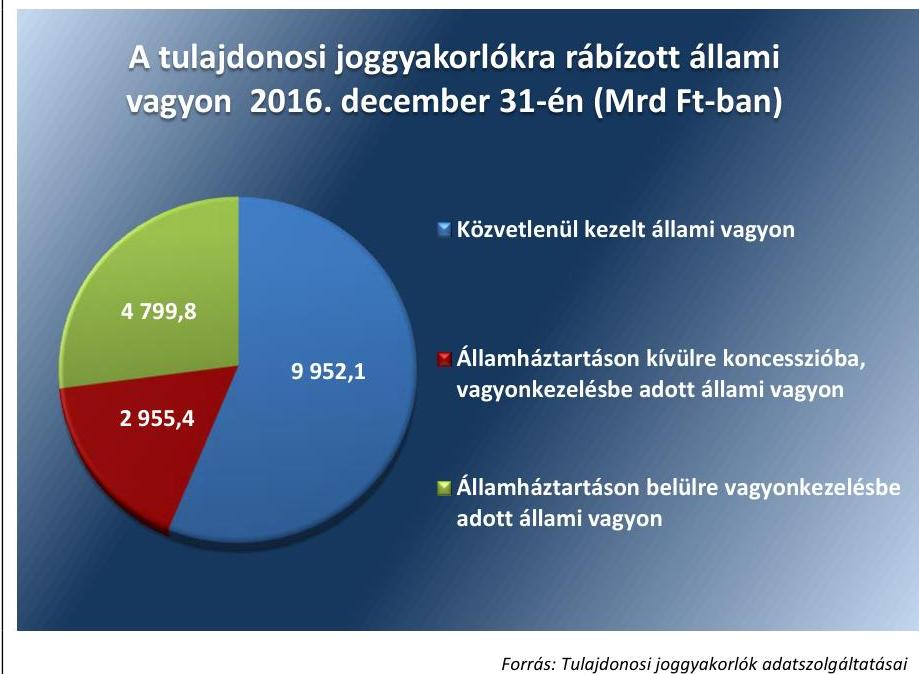

Forrás: Tulajdonosi joggyakorlókra adatszolgáltatásai

---

A tulajdonosi joggyakorlókra rábízott állami vagyon értékét tulajdonosi joggyakorló szervezetenként az 1. táblázat mutatja be a 2016. december 31-i állapot szerint.

1. táblázat

# A TULAJDONOSI JOGGYAKORLÓKRA RÁBÍZOTT ÁLLAMI VAGYON ÉRTÉKE TULAJDONOSI JOGGYAKORLÓ SZERVEZETENKÉNT 2016. DECEMBER 31-ÉN (M FT-BAN) 

| Tulajdonosi   joggyakorlók | Közvetlenül ke-   zelt állami va-   gyon | Koncesszióba, vagyonkezelésbe   adott állami vagyon   államháztartá-   son tetsüre | Összesen |
| :-- | :--: | :--: | :--: |
|  |  |  |  |
|  |  | 20,9 | 471338,8 |
|  |  | 2053417,7 | 4301781,8 |
|  |  | 298001,6 | 26715,1 |
|  |  |  | 47692,3 |
|  |  |  | 148536,6 |
|  |  |  | 603971,3 |
|  |  |  |  |
|  |  |  | 173715,7 |
|  |  |  | 57362,1 |
|  |  |  | 153353,2 |
|  |  | 2955411,5 | 4799835,7 |
|  |  |  | 17707380,8 |

A vagyonkezelésbe, koncesszióba nem adott, a tulajdonosi joggyakorlók által közvetlenül kezelt állami vagyon vagyonelemenkénti összetételét a 2. ábra szemlélteti.
2. ábra

A tulajdonosi joggyakorlók által közvetlenül kezelt állami vagyon vagyonelemenként (2016. december 31-én, Mrd Ft-ban)
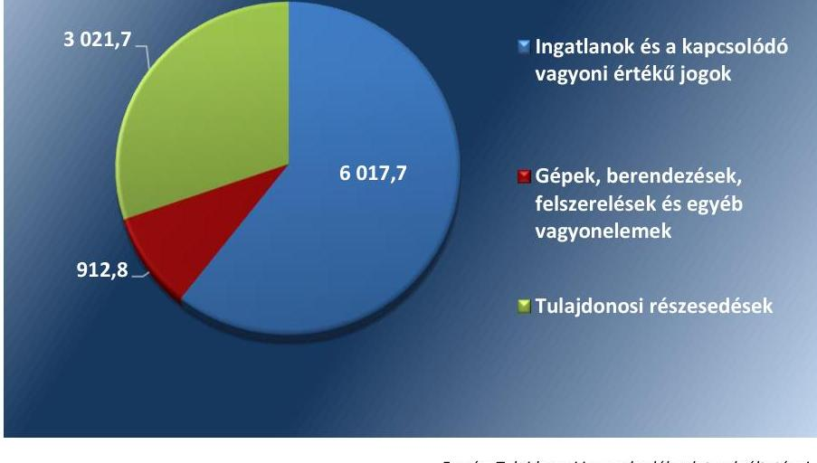

Forrás: Tulajdonosi joggyakorlók adatszolgáltatásai

---

# AZ ELLENŐRZÉS HÁTTERE, INDOKOLTSÁGA 

Az állami vagyon feletti tulajdonosi joggyakorlással kapcsolatos tevékenységeket az ÁSZ törvényi kötelezettség alapján évente ellenőrzi. Az ellenőrzés eredményeként az ÁSZ véleményt formál arról, hogy a Magyar Állam tulajdonosi joggyakorlásában érintett szervezetek müködése és az állami vagyonnal való gazdálkodása összhangban volt-e az állami vagyonra vonatkozó jogszabályok rendelkezéseivel. Az ellenőrzés rámutathat az állami vagyon feletti joggyakorlás tevékenységeinek esetleges szabályozási problémáira és hiányosságaira, hozzájárulva az állami vagyon feletti kontrollok, a felelős, szabályszerű vagyongazdálkodás erősítéséhez.

---

# A JELENTÉS LÉNYEGES KÉRDÉSKÖREI 

1. Az állam tulajdonosi jogait gyakorló szervezetek szabályszerűen tartották-e nyilván az állami vagyont, a jogszabályokban elöirt adatszolgáltatásokat teljesítették-e?
2. Az állam tulajdonosi jogait gyakorló szervezetek tulajdonosi joggyakorlással összefüggő vagyongazdálkodása szabályszerű volt-e?
3. Az állam tulajdonosi jogait gyakorló szervezetek kialakították és müködtették-e a tulajdonosi joggyakorlási feladatok ellátását támogató szabályozási, közzétételi kontrollokat és a tulajdonosi ellenőrzési rendszert?
4. Az MFB Zrt. helyénvalóan alakította-e ki és müködtette-e a tulajdonosi joggyakorlási feladatok ellátását támogató belső szabályozási rendszert?

---

# AZ ELLENŐRZÉS HATÓKÖRE ÉS MÓDSZEREI 

## Az ellenőrzés típusa

Megfelelőségi ellenőrzés.

## Az ellenőrzött időszak

A 2016. év.

## Az ellenőrzés tárgya

A Magyar Állam tulajdonosi joggyakorlásában érintett szervezetek állami vagyonra vonatkozó tulajdonosi joggyakorlással kapcsolatos intézkedései és a tulajdonosi joggyakorlási feladatok szabályozárú ellátását támogató belső szabályozási, közzétételi kontrollok, a tulajdonosi ellenőrzési rendszer. A tulajdonosi joggyakorlási feladatok ellátását támogató belső szabályozási rendszer helyénvalósága.

Az ellenőrzés kiterjedt minden olyan körülményre és adatra, amely az ÁSZ jogszabályban meghatározott feladatainak teljesítéséhez, valamint a program végrehajtása folyamán felmerült újabb összefüggések feltárásához szükséges volt.

## Az ellenőrzött szervezet

A Magyar Nemzeti Vagyonkezelő Zrt., a Nemzeti Földalapkezelő Szervezet, a Miniszterelnökség, a Földművelésügyi Minisztérium, a Nemzeti Fejlesztési Minisztérium, a Külgazdasági és Külügyminisztérium, a Magyar Fejlesztési Bank Zrt. és az Állami Egészségügyi Ellátó Központ.

## Az ellenőrzés jogalapja

Az ellenőrzés jogszabályi alapját az ÁSZ tv. ${ }^{15}$ 5. § (4) bekezdés a) pontja, a Vtv. 3. § (4) bekezdése és az Nfatv. 14. § (1) bekezdése képezte.

## Az ellenőrzés módszerei

Az ellenőrzés végrehajtására az ellenőrzött időszakban hatályos jogszabályok, az ellenőrzés szakmai szabályai, valamint az irányadó ÁSZ módszertanok alapján, az ellenőrzési programban foglalt értékelési szempontok szerint került sor.

---

Az ellenőrzés ideje alatt az ellenőrzött szervezettel történő kapcsolattartás biztosítása az ÁSZ SZMSZ ${ }^{56}$-ének vonatkozó előírásai alapján történt.

Az ellenőrzési kérdések megválaszolásához szükséges bizonyítékok megszerzése az ellenőrzött által rendelkezésre bocsátott dokumentumokra, adatokra alapozva megfigyelés, szemle (szemrevételezés), kérdésfeltevés (információkérés), mintavételezés, valamint elemző eljárás alkalmazásával történt. Mintavétellel került sor az MNV Zrt., az NFA és az ÁEEK esetében a tulajdonosi ellenőrzéssel, valamint az MNV Zrt. és az NFA esetében az állami tulajdonú ingatlanok vagyonkezelésbe adásával és értékesítésével, továbbá a vagyon gyarapításával kapcsolatos intézkedések szabályszerűségének értékelésére.

A helyénvalósági szempontok szerinti ellenőrzésre az MFB Zrt. vonatkozásában került sor, a tulajdonosi joggyakorlók által általánosan elfogadott jó gyakorlat alapján beazonosított kritériumok mentén.

Az állami vagyon feletti tulajdonosi joggyakorlás funkcióit az ellenőrzés szervezetenként értékelte, ugyanakkor az összesített értékelést az összemérhetőség érdekében a funkciók szerinti értékelések összesítése alapján határozta meg.

Az ellenőrzési bizonyítékként felhasználható adatforrások közé tartoztak egyrészt a szakmai program részletes szempontjainál felsorolt adatforrások, másrészt minden - az ellenőrzés folyamán feltárt, az ellenőrzés szempontjából információt tartalmazó - dokumentum.

Az ellenőrzés lefolytatásához az ellenőrzött által rendelkezésre bocsátott adatok, információk és a tanúsítványok adatai valódiságának kontrollja az ellenőrzés keretében történt, azzal, hogy amennyiben valamely ellenőrzött jogügylettel kapcsolatban releváns dokumentumok keletkeztek az ellenőrzött időszakot megelőzően vagy követően, akkor azok értékelése is megtörtént.

---

# MEGÁLLAPÍTÁSOK 

## 1. Az állam tulajdonosi jogait gyakorló szervezetek szabályszerűen tartották-e nyilván az állami vagyont, a jogszabályokban előírt adatszolgáltatásokat teljesítették-e?

Összegző megállapítás

1.1. számú megállapítás
2. táblázat

TULAJDONOSI JOGGYAKORLÓK 2016. ÉVI ADATSZOLGÁLTATÁSA AZ MNV ZRT. FELÉ

| Tulajdonosi   joggyakorló | Adatszolgali   tátás ideje |
| :-- | :-- |
| ÁEEK | $2017.07 .12$. |
| NFA | $2017.07 .04$. |
| FM | $2017.07 .12$. |
| KKM | $2017.07 .14$. |
| NFM | $2017.08 .28$. |
| ME | $2017.07 .18$. |
| MFB Zrt. | $2017.06 .30$. |

A tulajdonosi joggyakorlók a rábízott vagyont - az általuk vagyonkezelésbe adott vagyon kivételével - szabályszerűen tartották nyilván. A vagyon 2016. december 31-i állományáról a jogszabályban előírt adatszolgáltatási kötelezettséget teljesítették.

A tulajdonosi joggyakorló szervezetek elkészítették a rábízott állami vagyonról az éves költségvetési beszámolót, azonban az MNV Zrt. felé az állami vagyon 2016. december 31-i tárgyévi állományáról az adatszolgáltatási kötelezettséget - az MFB Zrt. kivételével - határidőn túl teljesítették.

A TULAJDONOSI JOGGYAKORLÓK a 2016. évi éves költségvetési beszámolót az Áhsz.-ben előírt határidőben elkészítették.

AZ MNV ZRT. az éves költségvetési beszámolót az Áhsz. 33. § (3) bekezdésében foglalt július 30 -ai határidőn túl, a Felügyelő Bizottság 2017. augusztus 2 -ai döntését követően küldte meg az állami vagyon felügyeletéért felelős miniszternek.

AZ NFA, AZ ÁEEK, AZ FM, A KKM, AZ ME ÉS AZ NFM a Vhr. ${ }^{17}$ 13. § (5) bekezdésében előírt, június 30-i határidőn túl teljesítették az MNV Zrt. részére a rábízott vagyonuk december 31-i tárgyévi állományára vonatkozó adatszolgáltatatást.

AZ MFB ZRT. határidőben, a Vhr. előírásának megfelelően teljesítette adatszolgáltatási kötelezettségét.

A tulajdonosi joggyakorlók a mérlegükben kimutatott rábízott vagyon év végi értékelését, leltározását az NFA kivételével szabályszerűen végezték el.

AZ MNV ZRT., AZ ÁEEK, AZ NFM, AZ FM, A KKM, AZ ME ÉS AZ MFB ZRT. a mérlegben szereplő rábízott vagyon év végi értékelését, leltározását a Számv. tv. ${ }^{18}$, az Áhsz. és a belső szabályzatukban előírtaknak megfelelően végezték el.

AZ NFA a rábízott vagyonról készített mérlegében szereplő ingatlanok közül a vagyonkezelésbe nem adott termőföldek év végi értékelését a

---

### 1.3. számú megállapítás

Számv. tv., az Áhsz. és az NFA értékelési szabályzat ${ }^{19}$ előírásainak megfelelően elvégezte. Az épületek és egyéb építmények, továbbá a követelések és az egyéb sajátos elszámolások értékelését az Áhsz. 20. § (1) bekezdésében, a Számv. tv. 46. § (3) bekezdésében, továbbá az NFA értékelési szabályzat III. fejezet 1. pontjában előírtak ellenére nem végezték el.

Az éves költségvetési beszámoló elkészítéséhez, a mérleg tételeinek alátámasztásához az előírt leltárt - a vagyonkezelésbe nem adott termőföldek kivételével - az Áhsz. 22. § (1) bekezdés és az NFA leltározási és leltárkészítési szabályzat ${ }^{20}$ II. fejezet 3. pontjában előírtak ellenére nem állították össze.

A vagyonkezelésbe adási tevékenységgel érintett tulajdonosi joggyakorlók nem a jogszabályi előírásokkal összhangban teljesítették a vagyonkezelésbe adott vagyon nyilvántartásával kapcsolatos kötelezettségüket.

AZ MNV ZRT. nem szabályszerűen teljesítette a vagyonkezelésbe adott állami vagyon nyilvántartásával kapcsolatos kötelezettségét, mivel a nyilvántartás nem tartalmazta
$\longrightarrow$ az Áhsz. 14. melléklet IX. 1. pontjában előírtak ellenére a vagyonkezelő megnevezését, a vagyonkezelés időtartamát, a vagyonkezeléssel kapcsolatos követelések, kötelezettségek azonosításához szükséges adatokat, továbbá
$\longrightarrow$ a Vhr. 14. § (2) bekezdésében előírtak ellenére a vagyonelemek azonosító adatait, valamint a kapcsolódó jogokat.

AZ ÁEEK nem a jogszabályi előírásokkal összhangban teljesítette a vagyonkezelésbe adott állami vagyon nyilvántartásával kapcsolatos kötelezettségét, mivel:
$\longrightarrow$ a nyilvántartás a Vhr. 14. § (2) bekezdésének előírása ellenére az ingatlanok értékének változását nem tartalmazta, abban csak a vagyonkezelésbe adáskori bruttó érték szerepelt;
$\longrightarrow$ a nyilvántartás a vagyonkezelés időtartamát az Áhsz. 14. melléklet IX. 1. pontjában előírtak ellenére nem tartalmazta.

AZ NFA vagyonkezelésbe adott vagyonról vezetett nyilvántartása nem felelt meg a jogszabályi előírásoknak, mert:
$\longrightarrow$ a nyilvántartás a Vhr. 14. § (2) bekezdésének előírása ellenére az ingatlanok értékének változását nem tartalmazta, abban csak a bruttó érték szerepelt;
$\longrightarrow$ az Evt. ${ }^{21}$ szerint erdőnek minősülő földrészlet, alrészlet esetében a 11/2011. (II. 22.) Korm. rendelet ${ }^{22}$ 3. § (2) bekezdés c) pont és a NFA vagyon-nyilvántartási szabályzat ${ }^{23}$ 5.5.1. pont c) alpont előírása ellenére az Országos Erdőállomány Adattár szerinti erdészeti területazonosító adatokat a nyilvántartás nem tartalmazta;
$\longrightarrow$ a 11/2011. (II. 22.) Korm. rendelet. 4. § fc) pont előírása ellenére a vagyonkezelői jog kezdő- és lejárati időpontját vagy a határozatlan idejű vagyonkezelői jogra történő utalást, továbbá a rendelet 4. § fd) pontja előírása ellenére a vagyonkezelői jog ellenértékének

---

összegét, vagy az ingyenesség tényét a nyilvántartásban nem rögzítették;

az államháztartáson belüli vagyonkezelők részére a földrészletek bruttó értékét a vagyonkezelésbe adáskor az Áhsz. 47. § (3) bekezdésében előírtak ellenére a számviteli nyilvántartásból nem vezették ki és nem vették nyilvántartásba a 0 -ás főkönyvi számlaosztályban.

# 2. Az állam tulajdonosi jogait gyakorló szervezetek tulajdonosi joggyakorlással összefüggő vagyongazdálkodása szabályszerű volt-e? 

## Összegző megállapítás

2.1. számú megállapítás
3. táblázat

| ELLENŐRZÖTT SZERVEZETEK |  |
| :--: | :--: |
| ME | MNV Zrt. |
| FM | MFB Zrt. |
| NFM | NFA |
| KKM | ÁEEK |
|  | Forrás: ÁSZ |

2.2. számú megállapítás
4. táblázat

| ELLENŐRZÖTT SZERVEZETEK |  |
| :--: | :--: |
| MNV Zrt. | ÁEEK |
| NFA |  |

Forrás: ÁSZ

Az állam tulajdonosi jogait gyakorló szervezetek tulajdonosi joggyakorlással összefüggő vagyongazdálkodása szabályszerű volt. Hiányosság volt, hogy az ÁEEK és az NFA a vagyonkezelési szerződéseket a jogszabályi előírásoknak nem teljes mértékben megfelelő tartalommal kötötte meg.

A tulajdonosi joggyakorlók vagyon átadás-átvételi intézkedései szabályszerűek voltak.

A TULAJDONOSI JOGGYAKORLÓK közötti vagyon át-adás-átvétel szabályszerűen történt.

Az átadás és az átvétel dokumentumai tartalmazták az átadott vagyonelemek Nvtv. szerint nyilvántartott értékét. Az átadás-átvétel tárgyát képező vagyonelemeket a tulajdonosi joggyakorlók az Áhsz. előírásainak megfelelően az átadás napjáig nyilvántartott adatokkal kivezették, illetve nyilvántartásba vették.

Az ÁEEK és az NFA által kötött vagyonkezelési szerződések tartalma nem felelt meg a jogszabályi előírásoknak.

AZ ÁEEK által kötött vagyonkezelési szerződésekben a Vhr. 20. § (1) bekezdésében foglaltak ellenére nem rögzítették, hogy a tulajdonosi ellenőrzés eljárásrendjét, a felek jogait, kötelezettségeit a felek a szerződés részének tekintik.

AZ NFA által a földrészletekre vonatkozóan kötött vagyonkezelési szerződésekben az Nfatv. vhr. ${ }^{24}$ 41. § (3) bekezdésének előírása ellenére nem rögzítették az NFA részére történő beszámolás módját és gyakoriságát az NFA előzetes hozzájárulásával végrehajtott értéknövelő beruházás, felújítás, vagy új eszköz létrehozása esetén.

Az 3. számú megállapítás
Az állami ingatlanvagyon gyarapítása szabályszerű volt.
5. táblázat

| ELLENŐRZÖTT SZERVEZETEK |  |
| :--: | :--: |
| MNV Zrt. | ÁEEK |
| NFA |  |

AZ MNV ZRT. AZ NFA ÉS AZ ÁEEK vagyongyarapítása az Nvtv., a Vtv. és az Ávr ${ }^{25}$. előírásai szerint történt, a bekerülési érték megállapítása, és a számviteli elszámolások a Számv. tv., az Áhsz. és a belső szabályzatok előírásainak megfeleltek.

---

| 2.4. számú megállapítás | Az állami tulajdonú ingatlanok értékesítése szabályszerű volt. |
| :--: | :--: |
| 6. táblázat | AZ MNV ZRT. ÉS AZ ÁEEK az állami tulajdonú ingatlanok, valamint az NFA a földrészletek értékesítése során a Vtv. és a Vhr., illetve az Nfatv. és az Nfatv. vhr. előírásaival összhangban járt el, betartva a Polgári Törvénykönyv és más irányadó jogszabályok rendelkezéseit is. |
| ELLENŐRZÖTT SZERVEZETEK |  |
| MNV Zrt. | ÁEEK |
| NFA |  |
| Forrás: ÁSZ |  |

# 3. Az állam tulajdonosi jogait gyakorló szervezetek kialakították és müködtették-e a tulajdonosi joggyakorlási feladatok ellátását támogató szabályozási, közzétételi kontrollokat és a tulajdonosi ellenőrzési rendszert? 

Összegző megállapítás

A tulajdonosi joggyakorló szervezetek a tulajdonosi joggyakorlási feladatok ellátását támogató szabályozási kontrollokat - az NFA és az NFM esetében a vagyonnyilvántartás szabályozása kivételével - a jogszabályoknak megfelelően alakították ki és működtették. A közzétételi kontrollok az NFA és az FM kivételével szabályszerűek voltak. A tulajdonosi joggyakorlók a vagyonkezelésbe adott vagyon tekintetében a tulajdonosi ellenőrzés rendszerét kialakították és működtették.

A tulajdonosi joggyakorlók a tulajdonosi joggyakorlás szervezeti kereteit szabályszerűen alakították ki, azonban az NFA és az NFM tulajdonosi joggyakorlást támogató belső szabályozása nem felelt meg az előírásoknak.

| 7. táblázat | AZ MNV ZRT., AZ ÁEEK, AZ FM, A KKM ÉS AZ ME |
| :--: | :--: |
| SZABÁLYOZÁSI KÖRNYEZET | a tulajdonosi joggyakorlást támogató belső szabályzatait a Vtv., a Vhr. és |
| KIALAKÍTÁSA | az Áhsz. előírásaival összhangban alakította ki. |
| Tulajdonosi joggyakorlók | Minősítés |
| MNV Zrt. | szabályszerű |
| ÁEEK | szabályszerű |
| NFA | nem szabályszerű |
| FM | szabályszerű |
| KKM | szabályszerű |
| NFM | nem szabályszerű |
| ME | szabályszerű |

AZ NFA a rábízott vagyonra vonatkozó, a tulajdonosi joggyakorlással kapcsolatos belső szabályzatait nem a jogszabályi előírásoknak megfelelően készítette el, mivel az NFA értékelési szabályzatban az Áhsz. 50. § (2) bekezdés d) pontjában foglaltak ellenére nem rögzítették a vagyonkezelésbe adott eszközök vagyonértékelése során alkalmazott értékelés dokumentálásának szabályait és a felelősöket.

AZ NFM a Vhr. 14. § (3) bekezdése ellenére nem rendelkezett vagyonnyilvántartási szabályzattal.

---

### 3.2. számú megállapítás

8. táblázat

INFORMÁCIÓS ÉS KOMMUNIKÁCIÓS FOLYAMATOK KIALAKÍTÁSA ÉS MŰKÖDTETÉSE

| Tulajdonosi   joggyakorló | Kialakítása | Múködterése |
| :--: | :--: | :--: |
| MNV Zrt. | szabályszerű | szabályszerű |
| ÁEEK | szabályszerű | szabályszerű |
| NFA | nem | nem |
|  | szabályszerű | szabályszerű |
| FM | nem |  |
|  | szabályszerű |  |
| KKM | szabályszerű | szabályszerű |
| NFM | szabályszerű | szabályszerű |
| ME | szabályszerű | szabályszerű |
|  | Farrás: ÁSZ ellenôrzés megállapításai |  |

A tulajdonosi joggyakorlók az FM és az NFA kivételével szabályszerűen alakították ki és múködtették az információs és kommunikációs folyamatokat.

AZ MNV ZRT., AZ ÁEEK, A KKM, AZ ME ÉS AZ NFM az Info. tv. ${ }^{26}$ és az Ávr. előírásainak megfelelően kialakította a kötelezően közzéteendő adatok nyilvánosságra hozatalának rendjét, meghatározta az információkezeléssel kapcsolatos előírásokat.

AZ NFA ÉS AZ FM az Info.tv. 35. § (3) bekezdésében, az Ávr. 13. § (2) bekezdés h) pontjában előírtak ellenére nem szabályozta a közzéteendő adatok nyilvánosságra hozatalának rendjét.

AZ NFA az előírt adatokat honlapján többnyire jelentős késedelemmel tette közzé, illetve volt olyan adat melynek közzétételéről nem gondoskodott, mivel:
—az Nfatv. vhr. 47. § (3) bekezdés előírása ellenére nem tette közzé az ellenőrzési tapasztalatokról és a megtett intézkedésekről készített miniszteri jelentést;
— a 2015. évi költségvetési beszámolóját az Info. tv. 1. számú. melléklet III/1. pontjában foglalt azonnali határidőhöz képest késedelmesen, 2017. február 14-én tette közzé honlapján;
—az államháztartáshoz tartozó vagyonnal történő gazdálkodással öszszefüggő, ötmillió forintot meghaladó értékű, vagyonértékesítésre, vagyonhasznosításra vonatkozó szerződéseket az Info.tv. 1. számú melléklet III/4. pontjában előírt határidő ellenére a döntés meghozatalát követő hatvanadik naphoz képest jelentős késedelemmel - 2017. október 10-én - tette közzé saját honlapján.

## A tulajdonosi joggyakorlók a külső ellenőrzések megállapításait

hasznosították, az intézkedési tervek megvalósításának nyomon követést szolgáló nyilvántartást az ME kivételével szabályszerűen vezették.

AZ ME a Bkr. 14. § (1) bekezdésében foglaltak ellenére 2016-ra vonatkozóan nem vezetett nyilvántartást a külső ellenőrzések javaslatai alapján készült intézkedési tervek végrehajtásáról.

AZ NFA, AZ ÁEEK, AZ FM, ÉS AZ NFM a Bkr. előírásának megfelelően, az előírt tartalommal vezetett nyilvántartást a külső ellenőrzési jelentések javaslatai alapján tervezett intézkedések végrehajtásáról.

A KKM-nél a 2016. évben a tulajdonosi joggyakorlásra vonatkozó külső ellenőrzés nem történt.

---

# 3.4. számú megállapítás 

A tulajdonosi joggyakorlók a tulajdonosi ellenőrzéseket a jogszabályi előírásoknak és a belső szabályozásnak megfelelően hajtották végre a vagyonkezelésbe adott vagyon tekintetében.

AZ MNV ZRT., AZ NFA, AZ ÁEEK ÉS AZ NFM a vagyonkezelésbe, illetve koncesszióba adott eszközök tekintetében a tulajdonosi ellenőrzési rendszert a Vtv.-nek és az Nvtv.-nek megfelelően kialakította. A tulajdonosi ellenőrzések céljai a Vhr. előírásaival összhangban kerültek meghatározásra, azokat az Nvtv.-ben és a Vtv.-ben meghatározott témakörökben végezték.

AZ FM a jogszabály szerinti ellenőrzési kötelezettségén túlmenően átfogó rendszerellenőrzést végzett a tulajdonosi joggyakorlása alá tartozó részesedések közül egy erdőgazdasági társaságnál.

---

# 4. Az MFB Zrt. tulajdonosi joggyakorlási feladatainak ellátását támogató belső szabályozási rendszer értékelése 

## > A tulajdonosi joggyakorlással kapcsolatos feladatok ellátásának szabályozása

Az MFB Zrt. alapszabályában meghatározták az állami vagyon feletti tulajdonosi joggyakorlással kapcsolatos feladatokat ellátó szervezeti egységek megnevezését, a kapcsolatos munkakörhöz tartozó feladatokat és hatásköröket, a hatáskörök gyakorlásának módját. Az MFB Zrt. rendelkezett az igazgatósága által jóváhagyott szervezeti és működési szabályzattal, amely tartalmazta az MFB Zrt. felépítését és működés rendjét, szervezeti egységei megnevezését, feladatait, szervezeti ábráját.

A tulajdonosi joggyakorláshoz kapcsolódóan meghatározták az ellenőrzési feladatok ellátásának, és az adatszolgáltatási feladatok teljesítésének részletes szabályait. A magatartási és viselkedési elvárásokat külön szabályzatban rögzítették, a szervezetnél Etikai Bizottság működött.

Az MFB Zrt. számviteli politikája az állami vagyon értékelése során alkalmazandó értékelési eljárás elveit, módszerét, dokumentálásának szabályait, felelőseit, számlarendje pedig a részletező nyilvántartások vezetési és egyeztetési szabályait az Áhsz. előírásainak megfelelően tartalmazta.

## > A tulajdonosi ellenőrzési rendszer múködtetése és a külső ellenőrzések megállapításainak hasznosítása

Az MFB Zrt. belső ellenőrzési kézikönyve előírásainak megfelelően elkészítették a stratégiai és az az éves ellenőrzési tervet.

Az ellenőrzött időszakban egy, az MFB. Zrt. tulajdonosi joggyakorlása alá tartozó gazdasági társaságnál végeztek ellenőrzést, amelynek célja a működési keretek, a szabályozottság, a stratégia és annak megvalósításának vizsgálata volt. Az ellenőrzésről jelentés készült, az ellenőrzött szervezet tájékoztatta az MFB Zrt-t az ellenőrzés megállapításai, javaslatai alapján tett intézkedésekről.

A tulajdonosi joggyakorlás vonatkozásában végzett külső ellenőrzés ajánlásai, javaslatai alapján a megállapítások hasznosítása érdekében, a felelősök és a határidők megjelölésével intézkedési tervet készítettek. Hiányosság volt, hogy a külső ellenőrzésekről, azok megállapításairól és az intézkedési tervek végrehajtásáról nem vezettek nyilvántartást.

## Az MFB Zrt. az egyes területek értékelésének összegzése alapján helyénvalóan alakította ki és múködtette a tulajdonosi joggyakorlási feladatok ellátását támogató belső szabályozási rendszert.

---

# JAVASLATOK 

Az ÁSZ tv. 33. § (1) bekezdésében foglaltak értelmében az ellenőrzött szervezet vezetője köteles a jelentésben foglalt megállapításokhoz kapcsolódó intézkedési tervet összeállítani és azt a jelentés kézhezvételétől számított 30 napon belül az ÁSZ részére megküldeni. Amennyiben az ellenőrzött szervezet vezetője nem küldi meg határidőben az intézkedési tervet, vagy továbbra sem elfogadható intézkedési tervet küld, az Állami Számvevőszék elnöke az ÁSZ tv. 33. § (3) bekezdése a) és b) pontjaiban foglaltakat érvényesítheti.

## az MNV Zrt. vezérigazgatójának

1. Intézkedjen, hogy az állami vagyon nyilvántartása feleljen meg a jogszabályi elöírásoknak.
(1.3. sz. megállapítás 1. bekezdése alapján)

## a Nemzeti Földalapkezelő Szervezet elnökének

1. Intézkedjen az épületek és egyéb építmények, továbbá a követelések és az egyéb sajátos elszámolások jogszabályoknak megfelelő értékeléséről.
(1.2. sz. megállapítás 2. bekezdés második mondata alapján)
2. Intézkedjen az éves költségvetési beszámoló elkészitéséhez, a mérleg tételeinek alátámasztásához a jogszabályi elöírásoknak megfelelő leltár összeállításáról.
(1.2. sz. megállapítás 3. bekezdése alapján)
3. Intézkedjen, hogy a vagyonkezelésbe adott vagyonról vezetett nyilvántartás feleljen meg a jogszabályi elöírásoknak.
(1.3. sz. megállapítás 3. bekezdése alapján)
4. Intézkedjen az értékelési szabályzat módosításáról, hogy az feleljen meg a jogszabályi elöírásoknak.
(3.1. sz. megállapítás 2. bekezdése alapján)
5. Intézkedjen a jogszabályi elöírásnak megfelelően a kötelezően közzéteendő adatok nyilvánosságra hozatalának rendjét rögzítő szabályozásról.
(3.2. megállapítás 2. bekezdése alapján)

---

# az Állami Egészségügyi Ellátó Központ föigazgatójának 

1. Intézkedjen, hogy a vagyonkezelésbe adott vagyonról vezetett nyilvántartás feleljen meg a jogszabályi elöírásoknak.
(1.3. sz. megállapítás 2. bekezdése alapján)
2. Intézkedjen, hogy a vagyonkezelési szerződések feleljenek meg a Vhr. elöírásainak.
(2.2. sz. megállapítás 1. bekezdése alapján)

## a földmúvelésügyi miniszternek

1. Intézkedjen a jogszabályi elöírásnak megfelelően a kötelezően közzéteendő adatok nyilvánosságra hozatalának rendjét rögzítő szabályozásról.
(3.2. sz. megállapítás 2. bekezdése alapján)

---

.

---

# MELLÉKLETEK 

- I. SZ. MELLÉKLET: ÉRTELMEZŐ SZÓTÁR
állami vagyon Állami vagyonnak minősül:
a) az állam tulajdonában lévő dolog, valamint dolog módjára hasznosítható természeti erő;
b) az a) pont hatálya alá tartozó mindazon vagyon, amely vonatkozásában törvény az állam kizárólagos tulajdonjogát nevesíti;
c) az állam tulajdonában lévő tagsági jogviszonyt megtestesítő értékpapír, illetve az államot megillető egyéb társasági részesedés;
d) az államot megillető olyan immateriális, vagyoni értékkel rendelkező jogosultság, amelyet jogszabály vagyoni értékű jogként nevesít;
e) az állam tulajdonában lévő pénzügyi eszközök.
(Forrás: Vtv. 1. § (2) bekezdése)
nemzeti vagyon A nemzeti vagyonba tartozik:
a) az állam vagy a helyi önkormányzat kizárólagos tulajdonában álló dolgok,
b) az a) pont hatálya alá nem tartozó, az állam vagy a helyi önkormányzat tulajdonában lévő dolog,
c) az állam vagy a helyi önkormányzat tulajdonában lévő pénzügyi eszközök, továbbá az államot vagy a helyi önkormányzatot megillető társasági részesedések,
d) az államot vagy a helyi önkormányzatot megillető bármely vagyoni értékkel rendelkező jogosultság, amelyet jogszabály vagyoni értékű jogként nevesít,
e) Magyarország határa által körbezárt terület feletti légtér,
f) az üvegházhatású gázok kibocsátási egységeinek kereskedelméről szóló törvény szerinti kibocsátási egység és légiközlekedési kibocsátási egység, valamint az ENSZ Éghajlatváltozási Keretegyezménye és annak Kiotói Jegyzőkönyv végrehajtási keretrendszeréről szóló törvény szerinti kiotói egység,
g) állami vagy helyi önkormányzati fenntartású közgyűjtemény (muzeális intézmény, levéltár, közgyűjteményként működő kép- és hangarchívum, valamint könyvtár) saját gyűjteményében nyilvántartott kulturális javak körébe tartozó dolog, kivéve, ha az állami vagy önkormányzati tulajdon jogszerű létrejötte kétséget kizáró módon nem bizonyítható és a dologra nézve más a tulajdonjogát bizonyítja vagy a kulturális javakra vonatkozó jogszabályokban meghatározott eljárás keretében valószínűsíti,
h) a régészeti lelet,
i) a nemzeti adatvagyon körébe tartozó állami nyilvántartások fokozottabb védelméről szóló törvény szerinti nemzeti adatvagyon.
(Forrás: Nvtv. 1. § (2) bekezdése)
nyomon követési tevékenység (monitoring) a szervezet tevékenységének, a célok megvalósításának nyomon követését biztosító rendszer, amely az operatív tevékenységek keretében megvalósuló folyamatos és eseti nyomon követésből, valamint az operatív tevékenységektől függetlenül működő belső ellenőrzésből áll.
(Forrás: Bkr. 3. § e) pont, 10. §-a)
tulajdonosi ellenőrzés Az állami vagyon használóját, vagyonkezelőjét, haszonélvezőjét megillető jogok gyakorlása szabályszerűségének, célszerűségének, valamint az ahhoz kapcsolódó kötelezettségek teljesítésének a tulajdonosi joggyakorló részéről történő rendszeres ellenőrzése, amelynek célja az állami vagyonnal való gazdálkodás vizsgálata, ennek keretében a rendeltetésellenes, jogszerűtlen, szerződésellenes, vagy a tulajdonos érdekeit sértő, illetve

---

a központi költségvetést hátrányosan érintő vagyongazdálkodási intézkedések feltárása és a jogszerű állapot helyreállítása, továbbá a vagyonnyilvántartás hitelességének, teljességének és helyességének biztosítása.
(Forrás: Vhr. 20. §. (1)-(2) bekezdése, Nfatv. vhr 47. § (1)-(2) bekezdése)
tulajdonosi joggyakorlás Az állami vagyon rendeltetésének megfelelő - az állami feladatok ellátásához, a társaés vagyongazdálkodás fel- dalmi szükségletek kielégítéséhez, valamint a Kormány gazdaságpolitikája megvalósításá a lásának elősegítéséhez szükséges, egységes elveken alapuló, önálló ágazatként megjelenő adata - hatékony, költségtakarékos, értékmegőrző, értéknövelő felhasználásának biztosítása (közvetlen felhasználás), illetve közvetett hasznosítása (beleértve a vagyoni kör változását eredményező értékesítést), valamint az állami vagyon gyarapítása (ideértve a vagyoni kör bővítését is).
(Forrás: Vtv. 2. § (1) bekezdése)
tulajdonosi joggyakorló A nemzeti vagyon felett az államot vagy a helyi önkormányzatot megillető tulajdonosi jogok és kötelezettségek összességének gyakorlására jogosult személy.
(Forrás: Nvtv. 3. § (1) bekezdés 17. pontja)
vagyonkezelői jog A vagyonkezelői jog az állami vagyon hasznosítására a tulajdonosi joggyakorlóval kötött vagyonkezelési szerződéssel jön létre. A vagyonkezelési szerződés alapján a vagyonkezelő jogosult (vagyonkezelői jog) meghatározott, állami tulajdonba tartozó dolog (ingatlan, földrészlet, egyéb eszköz) birtoklására, használatára és hasznai szedésére.
(Forrás: Vtv., Nfatv.)

---

# FÜGGELÉK: ÉSZREVÉTELEK 

A jelentéstervezetet a Számvevőszék 15 napos észrevételezésre megküldte az ellenőrzött szervezetek vezetőinek az ÁSZ tv. 29. §* (1) bekezdése előírásának megfelelően.

Az ÁSZ a jelentéstervezetet észrevételezésre megküldte a Magyar Nemzeti Vagyonkezelő Zrt. vezérigazgatójának, a Nemzeti Földalapkezelő Szervezet elnökének, a Miniszterelnökséget vezető miniszternek, az agrárminiszternek, a nemzeti vagyon kezeléséért felelős tárca nélküli miniszternek, a külgazdasági és külügyminiszternek, a Magyar Fejlesztési Bank Zrt. elnökvezérigazgatójának és az Állami Egészségügyi Ellátó Központ föigazgatójának.
A Miniszterelnökséget vezető miniszter és az agrárminiszter észrevételezési jogával nem élt. A Külgazdasági és Külügyminisztérium nemleges észrevételt tett. A Magyar Nemzeti Vagyonkezelő Zrt., a Nemzeti Földalapkezelő Szervezet, a nemzeti vagyon kezeléséért felelős tárca nélküli miniszter, valamint a Magyar Fejlesztési Bank Zrt. és az Állami Egészségügyi Ellátó Központ észrevételeit és az arra adott választ a függelék alább tartalmazza.

[^0]
[^0]:    * 29. § (1) Az Állami Számvevőszék az ellenőrzési megállapításait megküldi az ellenőrzött szervezet vezetőjének vagy az általa megbízott személynek, és annak, akinek személyes felelősségét állapította meg.
    (2) Az ellenőrzött szervezet vezetője és a felelősként megjelölt személy az ellenőrzés megállapításaira tizenöt napon belül írásban észrevételt tehet.
    (3) Az Állami Számvevőszék az észrevételre a beérkezésétől számított harminc napon belül írásban válaszol. A figyelembe nem vett észrevételeket köteles a jelentésben feltüntetni, és megindokolni, hogy azokat miért nem fogadta el.

---

# KÜLGAZDASÁGI ÉS KÜLÜGYMINISZTÉRIUM KÖZIGAZGATÁSI ÁLLAMTITKÁR 

Iktatószám: KKM/26035/2018/Adm

## Domokos László elnök úr részére

Állami Számvevőszék
Budapest 4.
Pf. 54.
1364

Tárgy: Az állami vagyon feletti tulajdonosi joggyakorlással kapcsolatos tevékenységek ellenőrzése c. jelentéstervezet véleményezése

## Tisztelt Elnök Úr!

Az állami vagyon feletti tulajdonosi joggyakorlással kapcsolatos tevékenységek ellenőrzése címet viselő jelentéstervezetet köszönettel kézhez kaptam, és azt áttekintettem.

Tájékoztatom, hogy mivel a jelentéstervezet kritikát nem fogalmaz meg, illetőleg a Külgazdasági és Külügyminisztérium gyakorlatát mindenben szabályszerűnek minősíti, a tervezetre nem teszek észrevételt.

Budapest, 2018. július „ ${ }^{12}$ ".

Üdvözlettel:
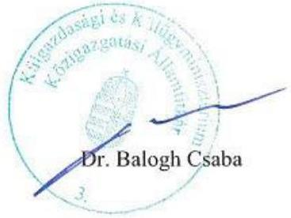

---

# MNV Magyar Nemzetı Vagyonkezeló Zrt. 

## Vezérigazgato

Állami Számvevőszék

## Domokos László

elnök

1052 Budapest
Apáczai Cs. J. u. 10.

Ikt. sz.: MNV/01/22051/ € /2018.
Hiv. sz.: EL-0851-003/2018.

Tisztelt Elnök Úr!
Tájékoztatom, hogy a 2018. június 29. napján, „Az állami vagyon feletti tulajdonosi joggyakorlással kapcsolatos tevékenységek ellenörzése - 2016. " tárgyában kézhez vett, EL-0851-003/2018. ikt. sz. levél mellékleteként megküldött Jelentés-tervezetre az alábbi észrevételeket tesszük.
„Megállapítások" fejezet, „1.3. számú megállapítás" rész első francia bekezdése / 16. oldal
Az MNV Zrt. vagyon-nyilvántartási rendszere a jogszabályokban előírt adatköröket széttagolva - nem egy egységes rendszerben - tartalmazza, melynek egyik meghatározó eleme az SAP rendszer.

A vagyonkezelő megnevezését az adott vagyonkezelési szerződés nyilvántartásának alapját képező ún. SZT szám alapján tartja nyilván az MNV Zrt., amely - tekintettel az SAP integrált vállalatirányítási jellegére - egységes, dokumentált, riportálható nyilvántartás. Mivel az SZT számmal jelölt szerződés egyik nyilvántartott alapadata a szerződő fél, álláspontunk szerint ez megfelel az adott vagyonkezelő megnevezésével szemben támasztott jogszabályi követelménynek. Az SZT szám alapján a vagyonkezelés időtartama is nyilvántartott, mivel a szerződés-nyilvántartás tartalmazza a szerződés megkötésére, időbeli hatályára, módosítására, követelések, kötelezettségek nyilvántartására vonatkozó információkat.
„Megállapítások" fejezet, „1.3. számú megállapítás" rész második francia bekezdése / 16. oldal
A bekezdésben megjelölt megállapítás, figyelemmel arra, hogy az az állami vagyonnal való gazdálkodásról szóló 254/2007. (X. 4.) Korm. rendelet (a továbbiakban: Vhr.) hivatkozott bekezdése az állami vagyon nyilvántartása címủ fejezeten belül helyezkedik el és „az állami vagyon" megfogalmazást használja, a teljes állami vagyonra vonatkozik, amely az MNV Zrt. tulajdonosi joggyakorlása alatt áll, azaz nem függ az adott vagyonelem hasznosított vagy vagyonkezelt mivoltától.

A vagyonkezelt vagyon vonatkozásában elmondható, hogy a vagyonkezelői adatszolgáltatások fogadására kifejlesztett szoftver a tételes nyilvántartású vagyonelemek esetében tartalmazza idősorosan az azonosító adatokat, kapcsolódó jogokat, jogi szempontból jelentős tényeket és a számviteli adatokat is, illetve annak technikai lehetősége biztosított, azzal, hogy az adatszolgáltatási kötelezettség teljesítése és az adattartalom kizárólag a vagyonkezelők felelőssége.

---

Figyelemmel arra, hogy a Vhr. mellékletének I. 1-2. pontjaiban nem szereplő vagyoncsoportokra vonatkozó adatokat az I. 3. pontban foglaltak szerint összevontan kell jelenteni, ezek a vagyonelemek csoportosítva kerülnek rögzítésre (vagyoncsoportonként és vagyonelem-fajtánként, BTO kódonként). Ezen vagyonelemek egyedi azonosítása csakugyan nem biztosított, valamint kapcsolódó jogok sem kerülnek rögzítésre, de ezt a jövőben sem tartja kívánatosnak Társaságunk, tekintettel az összevont jelentésre vonatkozó jogszabályi előírásra.
„Megállapítások" fejezet, „3.3. számú megállapítás" rész első bekezdése / 19. oldal
A költségvetési szervek belső kontrollrendszeréről és belső ellenőrzéséről szóló 370/2011. (XII. 31.) Korm. rendelet (a továbbiakban: Bkr.) 54/A . §-a szerint a kormányzati szektorba sorolt egyéb szervezetre kizárólag a Bkr. 1-10 §-át kell alkalmazni, így az Állami Számvevőszék által hivatkozott rendelkezés kötelező alkalmazása a jogszabály alapján nem elvárható az MNV Zrt-től.

Fentieket meghaladóan, az MNV Zrt. az intézkedési tervekben foglalt feladatok végrehajtását nyomon követi. Az Állami Számvevőszék által végzett vizsgálatokkal kapcsolatos eljárásrendről szóló 13/2012. Vig utasítást felváltó, 2017.08.22. napjától hatályos 26/2017. Vig utasítás C) fejezete előírja a javasolt intézkedések, felelősök, határidők és a végrehajtás nyilvántartását.

Kérem Elnök Urat, hogy a jelentés véglegesítése során jelen észrevételeinket szíveskedjenek figyelembe venni.

Budapest, 2018. július „ 12."
Üdvözlettel:
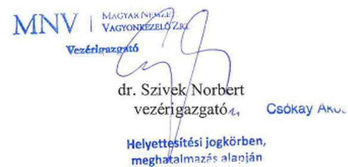

---

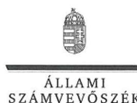

ELNÖK

Ikt.szám: EL-0851-015/2018.

Dr. Szivek Norbert úr
vezérigazgató

Magyar Nemzeti Vagyonkezelő Zrt.

# Budapest 

## Tisztelt Vezérigazgató Úr!

„Az állami vagyon feletti tulajdonosi joggyakorlással kapcsolatos tevékenységek ellenörzése" címmel készített számvevőszéki jelentéstervezetre tett észrevételét köszönettel megkaptam.

Az Állami Számvevőszék észrevételre vonatkozó álláspontjáról a felügyeleti vezető által készített részletes tájékoztatást mellékelten megküldöm.

Tájékoztatom Vezérigazgató urat, hogy a számvevőszéki jelentésben - az Állami Számvevőszékről szóló 2011. évi LXVI. törvény 29. § (3) bekezdése alapján - a figyelembe nem vett észrevételeket szerepeltetjük, annak indoklásával, hogy azokat az Állami Számvevőszék miért nem fogadta el.

Budapest, 2018. 07. hó 14 nap
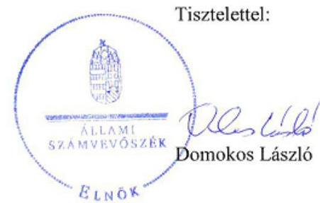

Melléklet: Tájékoztatás az észrevétel kezeléséről

---

# Tájékoztatás   az észrevétel kezeléséről 

„Az állami vagyon feletti tulajdonosi joggyakorlással kapcsolatos tevékenységek ellenőrzése" című jelentéstervezetre 2018. július 16-án érkezett észrevételt áttekintettük, annak kezelésével kapcsolatban a következő tájékoztatást adom.
Az 1.3. sz. megállapítás első francia bekezdésével kapcsolatban tett észrevételre adott válasz
Az észrevétel tájékoztatást tartalmaz a jogszabályban előírt adatkörök széttagolt nyilvántartását illetően, tartalmazza továbbá, hogy az ÁSZ ellenőrzés megállapításában szereplő adatokat a szerződés-nyilvántartás tartalmazza, amely az SAP rendszerrel lekérdezhető. A tájékoztatást köszönjük, az azonban a jogszabályi előírás alapján feltárt hiányosságot nem befolyásolja, amely szerint a vagyon-nyilvántartás nem tartalmazta a vagyonkezelő megnevezését, a vagyonkezelés időtartamát, a vagyonkezeléssel kapcsolatos követelések, kötelezettségek azonosításához szükséges adatokat.
Az ÁSZ megállapítása és kapcsolódó javaslata a hatályos jogszabályi környezet, az MNV Zrt. által a mintatételek ellenőrzéséhez kapcsolódóan megküldött dokumentumok alapján került megfogalmazásra. Az észrevétel alapján a jelentéstervezet megállapításának és javaslatának módosítása nem indokolt.

## Az 1.3. sz. megállapítás második francia bekezdésével kapcsolatban tett észrevételre adott válasz

Az észrevétel első bekezdése az ÁSZ megállapítás értelmezését tartalmazza és kifejti, hogy az ÁSZ megállapítása a teljes állami vagyonra vonatkozik. Ezzel szemben az ÁSZ megállapítása egyértelműen rögzíti, hogy ,, a vagyonkezelésbe adott állami vagyon nyilvántartásával kapcsolatos" kötelezettségre vonatkozik.
Az észrevétel második bekezdése megerősíti az ÁSZ megállapítását. A vagyon-nyilvántartás szabályszerűségére vonatkozó ÁSZ megállapítás tényszerű és a hivatkozott jogszabályi előírás alapján került megfogalmazásra. Az észrevétel alapján a jelentéstervezet megállapításának és javaslatának módosítása nem indokolt.

## Az 3.3. sz. megállapítás első bekezdésével kapcsolatban tett észrevételre adott válasz

A jogszabályi környezet és az ellenőrzés során rendelkezésre bocsátott dokumentumok ismételt áttekintése alapján az észrevételt elfogadjuk. Az MNV Zrt-re vonatkozó megállapításrészt a jelentéstervezetből töröljük.
Budapest, 2018. 07. hó 24. nap

Makkai Mária
felügyeleti vezető

---

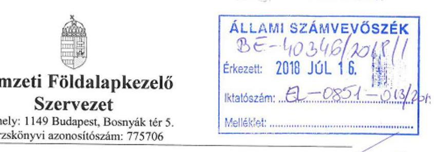

Domokos László
ÁSZ Elnök

Állami Számvevőszék

Budapest 4. PF. 54.
1364

Tárgy: Az „Állami vagyon feletti tulajdonosi joggyakorlással kapcsolatos tevékenységek ellenőrzése" tárgyú vizsgálatról készült jelentéstervezetre adott válasz megküldése.

# Tisztelt Elnök Úr! 

Mellékelten küldjük az „Állami vagyon feletti tulajdonosi joggyakorlással kapcsolatos tevékenységek ellenőrzése" tárgyú, EL-0851-004/2018. számon 2018. július 02-án megküldött jelentéstervezetre adott válaszunkat. (A korábbi dokumentációkban jelen ellenőrzés az EL-0164 számon szerepelt.)

Az NFA vezetése megkapta „Az állami vagyon feletti tulajdonosi joggyakorlással kapcsolatos tevékenységek ellenőrzése" tárgyú ellenőrzési jelentés tervezetét. A tervezet 2017. évi vizsgálat alapján készült, mely a 2016-os NFA gazdasági évére vonatkozik.

Tudjuk, hogy az ellenőrzéseknek hozzáadott értéket kell teremteni, és Önök megállapításaikkal és javaslataikkal támogatják a közpénzek, a közvagyonnal való szabályos, célszerű, eredményes és hatékony gazdálkodást, elősegítik a jó kormányzást.

Azt is tudjuk a sajtóból, hogy az ÁSZ az „értékmegőrző megújítás" elvének szem előtt tartásával vitte végig a szervezetükben a szükséges változtatásokat. Az NFA bár szerényebb keretek és hatáskörök mentén, de Nemzeti Kormányunk megalakulása óta szintén „értékmegőrző megújításban" van, és a korábbi jogelődőktől örökölt igen jelentős terheket/ rendezetlenségeket már feldolgozta. A fentiek ellenére még vannak megoldandó feladataink, amit részben a múltból örököltünk és a jelen számvevői jelentés tervezet erre felhívja a figyelmünket.

---

A tervezet hivatkozásai - bizonyára az időbeli elhúzódása miatt - több helyen nem a ténymegállapításokhoz kapcsolódnak, több pontatlanságot, tárgyi tévedést is tartalmaznak, ami indokolja észrevételeink megtételét.

Az ÁSZ NFA gazdálkodására tett megállapításai és az NFA Elnökének javasolt intézkedések, valamint az NFA észrevételei:

# Összegzésre vonatkozó NFA észrevétel 

A számvevői jelentéstervezet összegzésében az a megállapítás, hogy a Nemzeti Földalapkezelő Szervezet vagyongazdálkodása nem volt szabályszerű, ellentmond a vizsgálat jelentés részletes anyagában foglaltaknak, mivel több esetben a vizsgálat megállapítja, hogy szabályszerűen járt el az NFA. A szabályszerűségről készült táblázat ezt tartalmazza.

Kérjük a fentieknek megfelelően az összegzés megállapításainak pontosítását.

## ÁSZ 1. számú megállapítása

Az épületek és egyéb építmények, továbbá a követelésekés az egyéb sajátos elszámolások értékelését az Áhsz. 20 § (1) bekezdésében, a Szt. tv. 46 § (3) bekezdésében, továbbá az NFA értékelési szabályzat III. fejezet 1. pontjában elöirtak ellenére nem végezte el

## ÁSZ 1. számú javaslata az NFA Elnökének

Intézkedjen az épületek és egyéb építmények, továbbá a követelések és az egyéb sajátos elszámolások jogszabályoknak megfelelő értékeléséről.

## NFA észrevétele az ÁSZ 1. számú javaslatára

Áhsz 20§ (1) és Számv. trv. 46.§ (3) alapján a követelések és egyéb sajátos elszámolások jogszabályszerű leltározása megtörtént. Az EL-0164-125/2017 számú adatbekérés nem tartalmazta, nem is tartalmazhatta a követelésekre vonatkozó leltár dokumentációt, mivel a vizsgálat nem kérte azt.
Kérjük feltüntetni a jelentésben, hogy az építmények és épületek értékelése megtörtént, nem az értékelési szabályzatban előírtaknak megfelelően.

A hivatkozott 1.2. sz. megállapítás 2. bekezdés nem az NFA költségvetési szervre vonatkozik, ezért a hivatkozott megállapítást kérjük javítani!

## ÁSZ 2. számú megállapítása

Az éves költségvetési beszámoló elkészitéséhez a mérleg tételeinek alátámasztásához az elöirt leltárt a vagyonkezelésbe nem adott termöföldek kivételével, az Áhsz. 22 § (1)

---

bekezdés és az NFA leltározási és leltárkészitési szabályzatának II. fejezet 3. pontjában elöirtak ellenére nem állították össze.

# ÁSZ 2. számú javaslata az NFA Elnökének 

Intézkedjen az éves költségvetési beszámoló elkészítéséhez, a mérleg tételeinek alátámasztásához a jogszabályi előírásoknak megfelelő leltár összeállításáról.

## NFA észrevétele az ÁSZ 2. számú megállapítására

A 2. számú megállapítás a határidőn túl benyújtott ország leltár adatszolgáltatására vonatkozik. Az adatszolgáltatás jogszabályszerüen megtörtént.

## Kérjük pontosítani az elöirt intézkedést a határidő pontos betartására vonatkozóan.

## ÁSZ 3. számú megállapítása ÁSZ 4. számú megállapítása

Az NFA vagyonkezelésbe adott vagyonról vezetett nyilvántartása nem felelt meg a jogszabályi elöírásoknak, mert a nyilvántartás a Vhr. 14 § (82) bekezdésének elöírása ellenére az ingatlanok értékének változását nem tartalmazta, abban csak a bruttó érték szerepelt.
Az Evt. szerint erdőnek minősülő földrészlet, alrészlet esetében a 11/2011. (II. 22.) Korm. rendelet 3. § (2) bekezdés c), pont és az NFA vagyon-nyilvántartási Szabályzat 5.5.1. pont c) alpont elöírása ellenére az Országos Erdőállomány Adattár szerint az erdészeti területazonositó adatokat a nyilvántartás nem tartalmazta.
A 11/2011. (II. 22.) Korm rendelet 4. § fc) pont elöírása ellenére a vagyonkezelő jog kezdő- lejárati idöpontját vagy a határozatlan idejű vagyonkezelői jogra utalás, továbbá a rendelet 4. § fd) pontja elöírása ellenére a vagyonkezelői jog ellenértékének összegét, vagy az ingyenesség tényét a nyilvántartásban nem rögzítették
Az államháztartáson belüli vagyonkezelők részére a földrészletek bruttó értékét a vagyonkezesbe adáskor az Áhsz 47. § (3) bekezdésében elöirtak ellenére a számviteli nyilvántartásból nem vezették ki és nem vették nyilvántartásba a 0 -ás fökönyvi számlaosztályba.

## ÁSZ 3. 4. számú javaslata az NFA Elnökének

Intézkedjen, hogy a vagyonkezelésbe adott vagyonról vezetett nyilvántartás feleljen meg a jogszabályi előírásoknak.

---

# NFA észrevétele az ÁSZ 3. 4. számú megállapításaira 

1.3 számú megállapítás 1. alpontjára tett észrevétel

Az Nfatv. 17. §-ban meghatározott kivétel szabálya alapján a vagyonnyilvántartásban az eszközök között nyilvántartott vagyon esetén, az e törvény hatálya alá tartozó földrészletek értékének nyilvántartásától el lehet tekinteni, ha azok értéke természeténél, jellegénél fogva nem állapítható meg. Ebben az esetben az állami tulajdonban álló földrészletet érték helyett a közhiteles ingatlan-nyilvántartásban szereplő térmértékegységen és aranykorona-értéken szükséges nyilvántartani. Amennyiben az (1) bekezdés szerinti ingatlant vagyonkezelésbe adja az NFA, a vagyonkezelő a számvitelről szóló jogszabályoknak megfelelően vezetett vagyonnyilvántartásában azt az (1) bekezdés szerint tartja nyilván.

## A fenti törvényhely alapján az NFA vagyonnyilvántartása a jogszabályi előírásoknak megfelel, ezért kérjük a jelentésben ennek rögzítését.

1.3 számú megállapítás 2. alpontjára tett észrevétel

A vizsgálat időpontjában az Erdőrészlet adatok vagyonelem szintű megfeleltetésével kapcsolatos előkészületek folyamatban voltak. Tekintve hogy az ingatlannyilvántartása és az Országos Erdészeti Adattár adatai kizárólag térképi állományok összehasonlítását követően teljesíthetők, az erdőrészletek vagyonelemeknek való megfeleltetése bonyolult és időigényes folyamat. Az erdészeti vagyonkezelési szerződések mellékleteiben az Erdősrészlet azonosítók megjelenítésre kerültek, így a vagyon-nyilvántartás a szerződések becsatolása folytán már közvetetten tartalmazta a részleges adatokat.
Az Erdőrészletek vagyon-nyilvántartási rendszerbe történő megjelenítése informatikai fejlesztés útján 2018 februárjában megvalósult a Nemzeti Földalap vagyonnyilvántartásának szabályairól 11/2011. (II.22.) Kormányrendelet 3.§ (2) bekezdés c) pontja), $4 . \S$ ha) és hb) pontjainak rendelkezéseinek eleget téve.

Kérjük a vizsgálati jelentésben megemlíteni, hogy fenti hiányosság utólag pótlásra került.

## 1.3 számú megállapítás 3. alpontjára tett észrevétel

A vagyonkezelési szerződések a vagyon-nyilvántartási rendszerben szerepelnek, melyeknél rögzítésre került a nyilvántartásban az aláírás dátumának, birtokba lépés kezdete, a szerződés lejáratának dátuma, melyekből a vagyonkezelői jog kezdő és lejárati időpontja illetve a határozatlan idejű vagyonkezelői jog megállapítható. A vagyonkezelői joghoz kapcsolódó díjtétel, így ellenértékének összege vagy az ingyenesség ténye is felvezetésre került.

---

A szerződés és vagyonelem modul összeköttetésben van egymással, így az e pontban jelzett hiányosságokat a vagyon-nyilvántartás rendszer tartalmazta.

Kérjük a jelentésből a 1.3. 3. alpontjának törlését.

# A 3. és 4. pont megegvezik. 

A hivatkozott 1.3.megállapítás 3.bekezdése az 1. javaslatra vonatkozik!

## ÁSZ 5. számú megállapítása

Az NFA a rábizott vagyonra vonatkozó, a tulajdonosi joggyakorlással kapcsolatos belső szabályzatait nem a jogszabályi elöírásoknak megfelelően készítette el, mivel az NFA értékelési szabályzatban az Áhsz. 50 § (2) bekezdés d.) pontjában foglaltak ellenére nem rögzítették a vagyonkezelésbe adott eszközök vagyonértékelése során alkalmazott értékelés dokumentálásának szabályait és felelőseit.

## ÁSZ 5. számú javaslata az NFA Elnökének

Intézkedjen az értékelési szabályzat módosításáról, hogy az feleljen meg a jogszabályi előírásoknak.

## NFA észrevétele az ÁSZ 5. számú megállapítására

Az NFA vagyonértékelésére vonatkozó szabályozás a 21/2015. (V. 22) számú Elnöki utasítással kiadott Ellenőrzési és Értékbecslési Osztály eljárásrendjében, valamint a 46/2015 (X. 13.) számú Elnöki utasítással kiadott Eladásra szánt Magyar Állam tulajdonában lévő (rét, legelő, szántó) nyílvántartott földrészletek érték megállapítási módszeréről szóló eljárásrendjében meghatározásra került.

## ÁSZ 6. számú megállapítása

Az NFA az elöirt adatokat a honlapján többnyire jelentös késedelemmel tette közzé, illetve volt olyan adat melynek közzétételéről nem gondoskodott, mivel
Az Nfatv. Vhr. 47. § (3) bekezdésének elöírása ellenére nem tette közzé az ellenőrzés tapasztalatokról és a megtett intézkedésekről készitett miniszteri jelentést
A 2015. évi költségvetési beszámolóját az Info tv. 1. számú melléklet III/1. pontjában foglaltak azonnali határidőhöz képest késedelmesen, 2017. február 14-én tett közzé, továbbá az ötmillió Ft-ot meghaladó értékü vagyonértékesitésre, vagyonhasznosításra vonatkozó szerzödéseket az Info tv. 1. számú melléklete III/4 pontjában elöirt határidő ellenére a döntés meghozatalát követő hatvanadik naphoz képest jelentös késedelemmel 2017. október 10-én tette közzé saját honlapján.

---

Az államháztartáshoz tartozó vagyonnal történő gazdálkodással összefüggő 5millió Ft-ot meghaladó értékủ vagyonértékesitésre, vagyonhasznosításra vonatkozó szerződéseket az Info. tv. 1. számú melléklet III./4. pontjában elölrt határidő ellenére a döntés meghozatalát követő 60. naphoz képest jelentős késedelemmel - 2017. október 10-én - tett közzé saját honlapján.

# ÁSZ 6. számú javaslata az NFA Elnökének 

Intézkedjen a jogszabályi előírásoknak megfelelően a kötelezően közzéteendő adatok nyilvánosságra hozatalának rendét rögzítő szabályozásról.

## NFA észrevétele az ÁSZ 6. számú megállapítására.

Az NFA SZMSZ-ében valamint a Közbeszerzési Szabályzatában és egyéb szakmai szabályzatokban a közzétételi kötelezettség teljesítése előírásra került az érintett szervezeti egységek részére.

Az Vagyonkezelésbe vevő a Nemzeti Földalap vagyonnyilvántartásának szabályairól szóló 11/2011. (II. 22.) Korm. rendelet rendelkezéseinek megfelelő adatokat és azokban bekövetkező változást köteles a Vagyonkezelésbe adó részére a változás bekövetkezésétől számított 15 napon belül közölni. Amennyiben a változás közhiteles vagy egyéb hatósági nyilvántartásban is változást eredményez, azt a változás jogerős feltüntetésétől számított 15 napon belül köteles (ismételten) közölni. Vagyonkezelőt a vagyonnyilvántartás naprakész vezetése, és a Vagyonkezelésbe adó beszámoló-készítési kötelezettségének megalapozottsága érdekében külön felhívás nélkül adatszolgáltatási kötelezettség terheli. Vagyonkezelő számviteli politikáját és nyilvántartásait köteles úgy kialakítani és vezetni, hogy azok biztosítsák az adatszolgáltatás pontosságát és ellenőrizhetőségét. A nyilvántartás egységessége, pontossága és az adatellenőrzések biztosítása érdekében Vagyonkezelő köteles a Vagyonkezelésbe adóval együttműködni, valamint a mindenkor hatályos számviteli törvény, a Nemzeti Földalapba tartozó Földrészletek hasznosításának részletes szabályairól szóló 262/2010. (XI. 17.) Korm. rendelet (a továbbiakban: Korm. rendelet) 50/A. §, előírásainak megfelelően adatszolgáltatási és nyilvántartási kötelezettségének eleget tenni.

Abban az esetben, ha a Vagyonkezelésbe adó a szerződés megkötésekor nem közölte a Vagyonkezelővel a szerződés 1. és 2. számú Mellékleteiben szereplő földrészletek értékét, akkor a Vagyonkezelőnek az ezzel kapcsolatos jelentési kötelezettsége csak az értékekre vonatkozó adatok rendelkezésére bocsátását követöen terheli.

Budapest, 2018. július 10.
Tisztelettel :
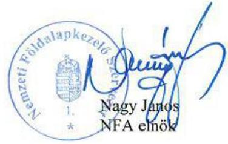

---

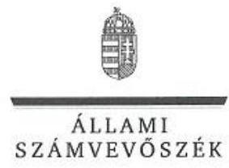

ELNÖK

Ikt.szám: EL-0851-016/2018.

# Nagy János úr 

elnök

Nemzeti Földalapkezelő Szervezet

## Budapest

## Tisztelt Elnök Úr!

„Az állami vagyon feletti tulajdonosi joggyakorlással kapcsolatos tevékenységek ellenörzése" címmel készített számvevőszéki jelentéstervezetre tett észrevételét köszönettel megkaptam.

Az Állami Számvevőszék észrevételre vonatkozó álláspontjáról a felügyeleti vezető által készített részletes tájékoztatást mellékelten megküldöm.

Tájékoztatom Elnök urat, hogy a számvevőszéki jelentésben - az Állami Számvevőszékről szóló 2011. évi LXVI. törvény 29. § (3) bekezdése alapján - a figyelembe nem vett észrevételeket szerepeltetjük, annak indoklásával, hogy azokat az Állami Számvevőszék miért nem fogadta el.

Budapest, 2018. O7 hó 27 nap
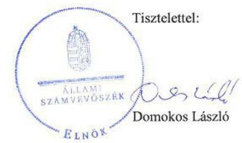

Melléklet: Tájékoztatás az észrevétel kezeléséről

---

# Tájékoztatás   az észrevétel kezeléséről 

„Az állami vagyon feletti tulajdonosi joggyakorlással kapcsolatos tevékenységek ellenörzése" című jelentéstervezetre 2018. július 16-án érkezett észrevételt áttekintettük, annak kezelésével kapcsolatban a következő tájékoztatást adom.

## Az Összegzésre vonatkozóan megfogalmazott észrevételre adott válasz

Az észrevétel szerint a vagyongazdálkodás nem szabályszerű minősítése ellentmond a részletes megállapításokban foglaltaknak „mivel több esetben a vizsgálat megállapítja, hogy szabályszerűen járt el az NFA".
Az észrevételt nem fogadjuk el, mivel a nem szabályszerű minősítés nem a teljes tulajdonosi joggyakorlásra vonatkozik, hanem a vagyongazdálkodásra, amelyet a leltározási és értékelési hiányosságok teljes mértékben megalapoznak. A jelentéstervezet módosítása nem indokolt.

## Az 1. számú javaslattal összefüggésben megfogalmazott észrevételre adott válasz

Az észrevétel azt tartalmazza, hogy az „Áhsz 20§ (1) és Számv. trv. 46.§ (3) alapján a követelések és egyéb sajátos elszámolások jogszabályszerü leltározása megtörtént." Az észrevétel arra hivatkozik, hogy a követelések és egyéb sajátos elszámolások leltár dokumentációit az ellenőrzés nem kérte az EL-0164-125/2017. számú adatbekérő levelében. Ezzel ellentétben a hivatkozott adatbekérő levél 2. sz. melléklete a „További dokumentumok" 1. pontja tartalmazta a mérlegben szereplő eszközök és források év végi értékelésének és leltározásának dokumentumait. Az adatbekérésnek megfelelő leltár dokumentációt a Nemzeti Földalapkezelő Szervezet (továbbiakban NFA) adatszolgáltatása nem tartalmazott. Az észrevétel nem tartalmaz hivatkozást arra vonatkozóan, hogy az építmények és épületek értékelésére vonatkozó dokumentációt az ellenőrzés rendelkezésére bocsátották volna. Tájékoztatom, hogy az ellenőrzés rendelkezésére bocsátott „2016.12.31-i fordulónapi leltár vagyonelemekről.pdf" dokumentum a számvitelről szóló 2000 . évi C. törvény (továbbiakban Számv. tv.) 46. § (3) bekezdésében foglalt egyedenkénti értékelésre nem alkalmas és a mérlegtételek alátámasztását szolgáló leltárral szemben támasztott alapvető követelményeknek sem felel meg, mivel nem tartalmazza a mérleg fordulónapra az eszközöket és forrásokat mennyiségben és értékben. Továbbá az észrevétellel ellentétben az 1.2. számú megállapítás 2. bekezdése az NFA-ra vonatkozik. Mindezek alapján az észrevételt nem fogadjuk el, a jelentéstervezet módosítása nem indokolt.

## A 2. számú javaslattal összefüggésben megfogalmazott észrevételre adott válasz

Az észrevétel az „ország leltár adatszolgáltatásra" hivatkozva kéri a megállapítás és a javaslat pontosítását. Tájékoztatom, hogy az Állami Számvevőszék (továbbiakban ÁSZ) megállapítása a mérlegtételek alátámasztását szolgáló leltárra vonatkozik, amelynek az államháztartás számviteléről szóló 4/2013. (I. 11.) Korm. rendelet (továbbiakban Áhsz.) és a Számv. tv. előírásai értelmében tartalmaznia kell a mérleg fordulónapjára vonatkozóan a meglévő

---

eszközöket és forrásokat tételesen, mennyiségben és értékben. Az észrevételt nem fogadjuk el, a jelentéstervezet módosítása nem indokolt.

# A 3. számú javaslattal összefüggésben megfogalmazott észrevételre adott válasz 

Az észrevétel az 1.3. számú megállapítás 3. bekezdésének három alpontjára fogalmaz meg észrevételt.
Az első alpont esetében az észrevétel hivatkozik a Nemzeti Földalapról szóló 2010. évi LXXXVII. törvény 17. §-ában meghatározott kivételre, amely alapján a földrészletek értékének nyilvántartásától el lehet tekinteni, ha azok értéke természeténél, jellegénél fogva nem állapítható meg. Tájékoztatom, hogy a hivatkozott jogszabály a földrészletek értékének nyilvántartásától való eltekintés lehetőségét 2017. június 23 -tól tartalmazza (17/A. §), amely kívül esik az ellenőrzött időszakon. Az észrevételt nem fogadjuk el, a jelentéstervezet ellenőrzött időszakra vonatkozó megállapítása és azon alapuló javaslata helytálló.
A második alpont esetében az észrevétel megerősíti az ÁSZ megállapítását. Az észrevételben foglalt ellenőrzött időszakon túli intézkedésről szóló tájékoztatást köszönjük, az nem befolyásolja az ÁSZ ellenőrzött időszakra vonatkozó megállapítását és az alapján megfogalmazott javaslatát. Az észrevételt nem fogadjuk el, a jelentéstervezet módosítása nem indokolt.
A harmadik alpont esetében az észrevétel rögzíti, hogy a szerződés modul tartalmazza az ÁSZ által hiányosságként megállapított adatokat. A szerződés modul és vagyonelem modul összeköttetésben van egymással, így a vagyon-nyilvántartási rendszer tartalmazza az adatokat. Ennek alátámasztására az észrevétel konkrét hivatkozást nem tartalmaz. Az ellenőrzés rendelkezésére bocsátott dokumentumok ismételt felülvizsgálata alapján nem igazolt az adatok nyilvántartásban történő rögzítése. Az észrevételt nem fogadjuk el, a jelentéstervezet módosítása nem indokolt. A javaslatok számozására vonatkozó észrevételt köszönjük, a nyomtatás során jelentkező ismétlődést megszüntettük, a jelentéstervezet módosítása nem indokolt.

## A 4. számú javaslattal összefüggésben megfogalmazott észrevételre adott válasz

Az észrevétel szerint az ellenőrzés által az értékelési szabályzat vonatkozásában hiányosságként megállapított szabályozást a belső eljárásrendek tartalmazzák. Tájékoztatom, hogy az ÁSZ megállapításában hivatkozott Áhsz. 50. § (2) bekezdés d) pontjának előírása alapján „az eszközök és források értékelésének szabályzatában" kell rögzíteni az érintett előírásokat. Az észrevételt nem fogadjuk el, az ÁSZ megállapítása helytálló, a jelentéstervezet módosítása nem indokolt.

## Az 5. számú javaslattal összefüggésben megfogalmazott észrevételre adott válasz

Az észrevétel részletesen kifejti az NFA belső szabályozási környezetének előírásait a vagyonnyilvántartással összefüggő, vagyonkezelőket terhelő adatszolgáltatási kötelezettséget illetően.
Az ÁSZ érintett javaslata az információs önrendelkezési jogról és az információszabadságról szóló 2011. évi CXII. törvény és az államháztartásról szóló törvény végrehajtásáról szóló 368/2011. (XII. 31.) Korm. rendelet által előírt kötelezően közzéteendő adatok nyilvánosságra hozatalának rendjét rögzítő belső szabályozás elkészítésének hiányát rögzíti. Az észrevételben

---

beidézett ÁSZ megállapítás pedig a késedelmesen, illetve nem közzétett adatokat rögzíti. Az észrevétel az idézett ÁSZ megállapítással és javaslattal nincs logikai összefüggésben, azt nem cáfolja. Az észrevételt nem fogadjuk el, a jelentéstervezet módosítása nem indokolt.
Budapest, 2018. O7. hó 27. nap
$\qquad$ 0
Makkai Mária
felügyeleti vezető

---

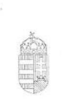
A NEMZETI VAGYON KEZELÉSÉÉRT
FELELÓS TÁRCA NÉLKÜLI MINISZTER
NEMZETI PÉNZIJGYI SZOLGÁLTATÁSOKÉRT ÉS KOZMÚSZOLGÁLTATÁSOKÉRT FELELŐS
ÁLLAMTITKÁR

## Domokos László   Elnök úr részére

## Állami Számvevőszék

1052 Budapest
Apáczai Csere János u. 10.

Tárgy: „Az Állami vagyon feletti tulajdonosi joggyakorlással kapcsolatos tevékenységek ellenőrzése" számvevőszéki jelentéstervezet véleményezése

# Tisztelt Elnök úr! 

Az Állam Számvevőszék (a továbbiakban: ÁSZ) „Az Állami vagyon feletti tulajdonosi joggyakorlással kapcsolatos tevékenységek ellenőrzése" című jelentés tervezetével (Ikt. szám: EL-0851-010/2018) kapcsolatban az alábbi észrevételt tesszük.

## I.

Az ÁSZ jelentés tervezet 15. oldalán található megállapítások 1.1. pontja szerint a tulajdonosi joggyakorlók közül az MNV Zrt. az éves költségvetési beszámolót az államháztartás számviteléről szóló 4/2013. (I. 11.) Korm. rendelet (a továbbiakban: Áhsz.) 33. § (3) bekezdésében foglalt július 30 -ai határidőn túl, a Felügyelő Bizottság 2017. augusztus 2 -ai döntését követően küldte meg az állami vagyon felügyeletéért felelős miniszternek.

Tájékoztatjuk, hogy az Áhsz.-ben meghatározott beszámoló-készítési és feltöltési kötelezettségének az MNV Zrt. az alábbi okokra figyelemmel nem tud eleget tenni:

- A beszámoló-készítés és feltöltés időszakában nem áll rendelkezésére minden adat a beszámoló elkészítéséhez és a könyvvizsgálat lefolytatásához.
Az MNV Zrt. tulajdonosi joggyakorlása alá tartozó társaságok között szerepelnek olyanok, amelyek a számvitelről szóló 2000 . évi C. törvény (a továbbiakban: Számv. tv.) alapján konszolidált éves beszámoló készítésére kötelezettek. A törvény 153. § (2) bekezdése szerinti a konszolidált éves beszámolót készítő társaságok a beszámolójuk közzétételére a mérlegfordulónapot követő hatodik hónap utolsó napjáig (június 30.) kötelezettek. A közzététel után kerülhet sor az MNV Zrt. által ezen társaságok saját tőke tulajdoni hányad arányos értékelésére és ezen értékek rábízott vagyoni beszámolóban való szerepeltetésére.
- Az MNV Zrt. döntési mechanizmusát tekintve a beszámoló-készítés és feltöltési időpont közötti időszakban - 2018. június 16. és 2018. június 30. napja között - nem

---

történhet egyidejűleg a könyvvizsgálat, valamint az Igazgatóság és a Felügyelő Bizottság általi elfogadás.
Az MNV Zrt. a számvitelről szóló 2000. évi C. törvény ( a továbbiakban: Számv. tv.) 155. §-ában megfogalmazottak alapján könyvvizsgálatra kötelezett társaság.
Az állami vagyonról szóló 2007. évi CVL törvény 20.§ (4) bekezdés m) pontja alapján az Igazgatóság hatáskörébe tartozik az MNV Zt. éves költségvetési beszámolójának elkészítése, a 20/D § (4) bekezdés szerint az MNV Zrt. a rábízott vagyonról készített éves költségvetési beszámolójának jóváhagyásáról a részvényesi jogokat gyakorló miniszter csak a Felügyelő Bizottság írásbeli jelentésének birtokában dönthet.

Fentiekből megállapítható, hogy az MNV Zrt könyvvizsgálói jelentéssel alátámasztott és az Igazgatóság valamint Felügyelő Bizottság által elfogadott éves költségvetési beszámolóját legkorábban a tárgyévet követő július 31-ig tudja a Kincstár által működtetett rendszerbe feltölteni.

A problémát több alkalommal jeleztük a jogalkotó NGM/PM felé, de jogszabály módosítás e körben nem történt. Javasoljuk olyan ÁSZ ajánlás megfogalmazását, ami a jogalkotót felszólítja a probléma megoldására.

# II. 

Tájékoztatom Elnök Urat, hogy a jelentéstervezetnek az MFB Zrt. 2016. évi tulajdonosi joggyakorlására vonatkozó megállapításaival kapcsolatban észrevételt nem kívánunk tenni.

Szíves közreműködését köszönöm.
Budapest, 2018. július 12.

Tisztelettel:
dr. Juhász Edit

---

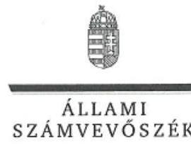

ELNÖK

Ikt.szám: EL-0851-020/2018.

# Bártfai-Mager Andrea úrhölgy 

nemzeti vagyon kezeléséért felelős
tárca nélküli miniszter

## Budapest

## Tisztelt Miniszter Úrhölgy!

„Az állami vagyon feletti tulajdonosi joggyakorlással kapcsolatos tevékenységek ellenőrzése" címmel készített számvevőszéki jelentéstervezetre a nemzeti pénzügyi szolgáltatásokért és közműszolgáltatásokért felelős államtitkár által tett észrevételt köszönettel megkaptam.

Az Állami Számvevőszék észrevételre vonatkozó álláspontjáról a felügyeleti vezető által készített részletes tájékoztatást mellékelten megküldőm.

Tájékoztatom Miniszter úrhölgyet, hogy a számvevőszéki jelentésben - az Állami Számvevőszékről szóló 2011. évi LXVI. törvény 29. § (3) bekezdése alapján - a figyelembe nem vett észrevételeket szerepeltetjük, annak indoklásával, hogy azokat az Állami Számvevőszék miért nem fogadta el.

Budapest, 2018. C. hó 6 nap
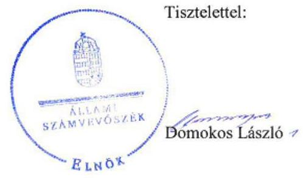

Melléklet: Tájékoztatás az észrevétel kezeléséről

---

# Tájékoztatás   az észrevétel kezeléséről 

„Az állami vagyon feletti tulajdonosi joggyakorlással kapcsolatos tevékenységek ellenőrzése" című jelentéstervezetre 2018. július 18-án érkezett észrevételt áttekintettük, annak kezelésével kapcsolatban a következő tájékoztatást adom.
A jelentéstervezet 15. oldalán szereplő 1.1. számú megállapítással összefüggésben tett észrevételüket köszönjük, az megerősíti az ÁSZ megállapítását. Az észrevétel a költségvetési beszámoló megküldési határideje be nem tartásának okaként az MNV Zrt. éves költségvetési beszámolója elkészítésének eljárásrendjét részletezi, amely alapján arra a következtetésre jut, hogy jogszabály módosítás szükséges.
Tájékoztatom, hogy az ÁSZ által tett megállapítás az MNV Zrt. költségvetési beszámolójának állami vagyon felügyeletéért felelős miniszter részére történő határidőn túli megküldését tényszerűen, a jogszabályi előíráshoz viszonyítva rögzíti. Egyrészt általánosan érvényes alapelv, hogy a feladatok végrehajtását a jogszabályi előírások betartásával szükséges megszervezni. Másrészt az ellenőrzésünknek - figyelemmel a téma fókuszára - nem volt tárgya az MNV Zrt. belső eljárásrendjének részletes értékelése a beszámoló összeállítására vonatkozóan. Ezért az észrevételben kért ajánlás jelentésben történő szerepeltetése nem indokolt, túlmutat az ellenőrzés keretein, az észrevételt nem fogadjuk el.

Budapest, 2018. O7. hó 2. nap

Makkai Mária
felügyeleti vezető

---

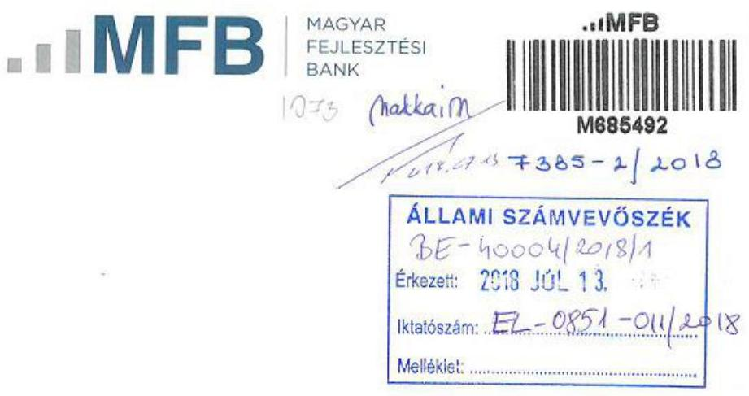

Ikt.szám: EL-0851-008/2018.

Budapest

# Tisztelt Elnök Úr! 

2018. június 28 -án köszönettel kézhez vettük az Állami Számvevőszék Magyarország 2016. évi az állami vagyon feletti tulajdonosi joggyakorlással kapcsolatos tevékenységek ellenőrzéséről szóló jelentéstervezetét.

Az MFB Zrt. a jelentéstervezet 9. oldalán lévő adatokkal kapcsolatban az alábbi észrevételt teszi:
,,AZ MFB ZRT. a Magyar Állam 100\%-os tulajdonában álló szakositott hitelintézet, amely az MFB tv. rendelkezései, illetve az állami vagyon felügyeletéért felelős miniszter kijelölése alapján nyolc gazdasági társaságban gyakorolta a tulajdonosi jogok."

A fentiek pontositása indokolt azon tekintetben, hogy az MFB Zrt. a Magyar Állam nevében tulajdonosi jogokat gyakorol:

- egyrészt 8 db gazdasági társaságban a fentiek szerinti hivatkozott jogszabályhelyek alapján,
- másrészt 2016. április 20. napjától a 8/2016. (IV.19.) NFM rendelet alapján az NFM rendelet 1. § (1) a) és b) pontja szerinti programok keretében létrehozott 29 db kockázati tőkealapok állami tulajdonú részesedései tekintetében.

A fent említett részesedések (mind a gazdasági társaságok, mind a kockázati tőkealapok) együttes értéke a jelentés tervezet 10 . oldalán szereplő $153.353,2$ millió Ft.

---

Kérjük fent leírtaknak megfelelően a jelentés pontositását, miszerint a jelentés tervezetben az alábbi mondat szerepeljen:
,,AZ MFB ZRT. a Magyar Állam 100\%-os tulajdonában álló szakositott hitelintézet, amely az MFB tv. rendelkezései, illetve az állami vagyon felügyeletéért felelős miniszter kijelölése alapján nyolc gazdasági társaság és a 2007-13-as programozási időszak forráskezelöjeként 29 db kockázati tőkealap felett gyakorolta a tulajdonosi jogokat."

Budapest, 2018. július 12.

Tisztelettel:
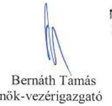

MFB MAGYAR FEJLESZTÉSI BANK
Zárthárüen Múbódó Részvénytársaság
1.
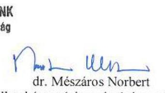

---

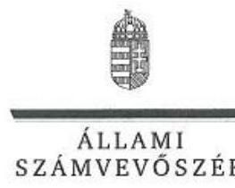

ELNÖK

Ikt.szám: EL-0851-012/2018.

# Bernáth Tamás úr 

elnök-vezérigazgató
MFB Magyar Fejlesztési Bank Zrt.

## Budapest

## Tisztelt Elnök-vezérigazgató Úr!

„Az állami vagyon feletti tulajdonosi joggyakorlással kapcsolatos tevékenységek ellenörzése" címmel készített számvevőszéki jelentéstervezetre tett észrevételét köszönettel megkaptam.

Az Állami Számvevőszék észrevételre vonatkozó álláspontjáról a felügyeleti vezető által készített részletes tájékoztatást mellékelten megküldöm.

Tájékoztatom Elnök-vezérigazgató urat, hogy a számvevőszéki jelentésben - az Állami Számvevőszékről szóló 2011. évi LXVI. törvény 29. § (3) bekezdése alapján - a figyelembe nem vett észrevételeket szerepeltetjük, annak indoklásával, hogy azokat az Állami Számvevőszék miért nem fogadta el.

Budapest, 2018. 07 hó 18 nap
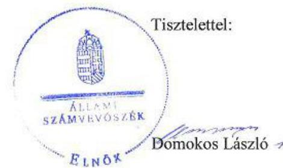

Melléklet: Tájékoztatás az észrevétel kezeléséről

---

# Tájékoztatás   az észrevétel kezeléséről 

„Az állami vagyon feletti tulajdonosi joggyakorlással kapcsolatos tevékenységek ellenőrzése" című jelentéstervezetre 2018. július 13-án érkezett észrevételt áttekintettük, annak kezelésével kapcsolatban a következő tájékoztatást adom.
A jelentéstervezet 9. oldalán, az ellenőrzés területe részben szereplő adatokkal összefüggésben tett pontosító észrevételüket köszönjük, azt részben fogadjuk el.
Az észrevétellel érintett bekezdést kiegészítettük az MFB Magyar Fejlesztési Bank Zrt. tulajdonosi joggyakorlása alá tartozó kockázati tőkealapok számával. A „2007-13-as programozást idöszak forráskezelőjeként" mondatrésszel való kiegészítés nem indokolt, mivel az ellenőrzés tárgyára vonatkozóan információtartalommal nem bír.

Budapest, 2018. 07. hó 19. nap

$$
\begin{aligned}
& \text { 4. } \\
& \text { Makkai Mária } \\
& \text { felügyeleti vezető }
\end{aligned}
$$

---

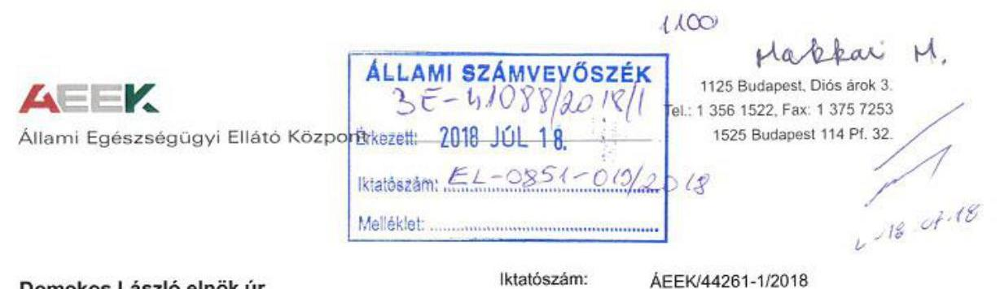

Domokos László elnök úr részére

Állami Számvevőszék

1364 Budapest 4. Pf. 54

Tárgy: Észrevételek az állami vagyon feletti tulajdonosi joggyakorlással kapcsolatos tevékenységek ellenőrzése tárgyú számvevőszéki jelentés tervezet vonatkozásában

Tisztelt Elnök Úr!
Az Állami Egészségügyi Ellátó Központhoz (ÁEEK) érkezett EL-0851-009/2018. iktatószámú levelét, és a mellékletként csatolt „Az állami vagyon feletti tulajdonosi joggyakorlással kapcsolatos tevékenységek ellenőrzése" tárgyú Számvevőszéki jelentés tervezetet köszönettel megkaptam.

A jelentés tervezetet áttekintettük, mellyel kapcsolatban az ÁEEK tulajdonosi joggyakorló vonatkozásában az alábbi észrevételeket teszem.

# 1.3. számú megállapítás: 

A vagyonkezelésbe adási tevékenységgel érintett tulajdonosi joggyakorlók nem a jogszabályi előirásokkal összhangban teljesítették a vagyonkezelésbe adott vagyon nyilvántartásával kapcsolatos kötelezettségüket.

Az ÁEEK nem a jogszabályi előirásokkal összhangban teljesítette a vagyonkezelésbe adott állami vagyon nyilvántartásával kapcsolatos kötelezettségét, mivel:

- a nyilvántartás a Vhr. 14.§ (2) bekezdésének előirása ellenére az ingatlanok értékének változását nem tartalmazta, abban csak a vagyonkezelésbe adáskori bruttó érték szerepelt;
- a nyilvántartás a vagyonkezelés időtartamát az Áhsz. 14. melléklet IX. 1. pontjában elöirtak ellenére nem tartalmazta.

Az ÁEEK a vagyonkezelésbe adott ingatlanok analitikus nyilvántartását a CT-Ecostat integrált számviteli, gazdálkodási rendszer tárgyi eszköz moduljában biztosítja. A vagyonkezelésbe adott ingatlanokban történt változásokat (vagyonkezelésbe adás/vagyonkezelésből visszavétel) a vagyonkezelői szerződés megkötésével egy időben rögzíti intézményünk a számviteli nyilvántartásokban. A vagyonkezelésbe adott eszközök értékbeni változásának rögzíthetőségének megvalósítására a Ct-Ecostat rendszerben fejlesztést valósított meg az ÁEEK, amelynek eredményeként lehetőség van a vagyonkezelésbe adott ingatlanok értékének nyilvántartásokban történő változtatására a vagyonkezelők adatszolgáltatásai alapján. A 2018. évtől az ellenőrzés kapcsán jelzett javaslatban foglaltak megvalósultak.

---

# AEEK 

Állami Egészségügyi Ellátó Központ
A vagyonkezelés időtartamának szerepeltetésével az ÁEEK a számviteli nyilvántartását kiegészíti. A nyilvántartás kiegészítésével kapcsolatban az ÁEEK felvette a kapcsolatot a gazdálkodási rendszert üzemeltető partner céggel. A fejlesztés várhatóan 2018. szeptember 30ig megvalósul.

### 2.2. számú megállapítás:

Az ÁEEK és az NFA által kötött vagyonkezelési szerződések tartalma nem felelt meg a jogszabályi előírásoknak.

Az ÁEEK által kötött vagyonkezelési szerződésekben a Vhr. 20. § (1) bekezdésében foglaltak ellenére nem rögzítették, hogy a tulajdonosi ellenőrzés eljárásrendjét, a felek jogait, kötelezettségeit a felek a szerződés részének tekintik.

Az állami vagyonról szóló 2007. évi CVI. tv. 2017. december végi módosítását követően elkészült - a jogszabályváltozásokkal összhangban- az ÁEEK fenntartásában lévő intézményekkel megkötendő új, egységes szerkezetbe foglalt vagyonkezelési szerződésminta. A minta már teljeskörűen tartalmazza a korábbi észrevételek szerinti kiegészítéseket és pontosításokat, többek között a jelen megállapítás szerinti azt a nyilatkozatot is, miszerint a felek a tulajdonosi ellenőrzés eljárásrendjét, a felek jogait és kötelezettségeit a szerződés részének tekintik. 2018. évben valamennyi korábban kötött vagyonkezelési szerződés újrakötése, a szerződések adatainak aktualizálása megtörténik, az új szerződések az új vagyonkezelési szerződésminta alapján készülnek.

Kérem, hogy a jelentés tervezet véglegezésekor fenti észrevételeimet figyelembe venni szíveskedjék.

Elnök Úr együttműködését előre is köszönöm!

Budapest, 2018. 07. „ ".
Tisztelettel:
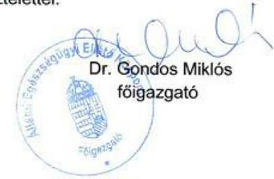

---

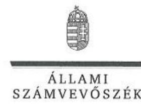

# Dr. Gondos Miklós úr 

föigazgató

Állami Egészségügyi Ellátó Központ

## Budapest

## Tisztelt Föigazgató Úr!

„Az állami vagyon feletti tulajdonosi joggyakorlással kapcsolatos tevékenységek ellenörzése" címmel készített számvevőszéki jelentéstervezetre tett észrevételét köszönettel megkaptam.

Az Állami Számvevőszék észrevételre vonatkozó álláspontjáról a felügyeleti vezető által készített részletes tájékoztatást mellékelten megküldöm.

Tájékoztatom Főigazgató urat, hogy a számvevőszéki jelentésben - az Állami Számvevőszékről szóló 2011. évi LXVI. törvény 29. § (3) bekezdése alapján - a figyelembe nem vett észrevételeket szerepeltetjük, annak indoklásával, hogy azokat az Állami Számvevőszék miért nem fogadta el.

Budapest, 2018. O7. hó 26 nap
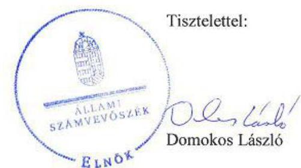

Melléklet: Tájékoztatás az észrevétel kezeléséről

---

# Tájékoztatás   az észrevétel kezeléséről 

„Az állami vagyon feletti tulajdonosi joggyakorlással kapcsolatos tevékenységek ellenörzése" című jelentéstervezetre elektronikusan 2018. július 12-én, illetve papír alapon 2018. július 18án érkezett észrevételt áttekintettük, annak kezelésével kapcsolatban a következő tájékoztatást adom.

Az 1.3. számú és a 2.2. számú megállapítással kapcsolatban megfogalmazott észrevételre adott válasz
Az észrevétel az ÁSZ ellenőrzés által feltárt - a vagyonkezelésbe adott vagyon nyilvántartásával, valamint a vagyonkezelési szerződések tartalmával kapcsolatos hiányosságok megszüntetésére az ellenőrzött időszakot követően megtett, illetve tervezett intézkedéseket tartalmazza.
A tájékoztatást köszönjük, a jelentéstervezet ellenőrzött időszakra vonatkozó megállapításait ezek nem befolyásolják. Az észrevételben foglaltak az ellenőrzés megállapításait megerősítik, a jelentéstervezet módosítása nem indokolt.

Budapest, 2018. O7. hó 26. nap
$\longleftrightarrow \sim \sim \sim \sim \sim$
Makkai Mária
felügyeleti vezető

---

# RÖVIDÍTÉSEK JEGYZÉKE 

${ }^{1}$ Alaptörvény
${ }^{2}$ Nvtv.
${ }^{3}$ Vtv.
${ }^{4}$ Nfatv.
${ }^{5}$ MNV Zrt.
${ }^{6}$ Áhsz.
${ }^{7}$ NFA
${ }^{8}$ ME
${ }^{9}$ FM
${ }^{10}$ NFM
${ }^{11}$ KKM
${ }^{12}$ MFB Zrt.
${ }^{13}$ MFB tv.
${ }^{14}$ ÁEEK
${ }^{15}$ ÁSZ tv.
${ }^{16}$ ÁSZ SZMSZ
${ }^{17}$ Vhr.
${ }^{18}$ Számv. tv.
${ }^{19}$ NFA értékelési szabályzat
${ }^{20}$ NFA leltározási és leltárkészítési szabályzat
${ }^{21}$ Evt.
${ }^{22}$ 11/2011. (II. 22.) Korm. rendelet
${ }^{23}$ NFA vagyon-nyilvántartási szabályzat
${ }^{24}$ Nfatv. vhr.
${ }^{25}$ Ávr.
${ }^{26}$ Info. tv.

Magyarország Alaptörvénye (2011. április 25.)
a nemzeti vagyonról szóló 2011. évi CXCVI. törvény (hatályos: 2011. december 31-től)
az állami vagyonról szóló 2007. évi CVI. törvény
a Nemzeti Földalapról szóló 2010. évi LXXXVII. törvény
Magyar Nemzeti Vagyonkezelő Zrt.
az államháztartás számviteléről szóló 4/2013. (I. 11.) Korm. rendelet
Nemzeti Földalapkezelő Szervezet
Miniszterelnökség
Földművelésügyi Minisztérium
Nemzeti Fejlesztési Minisztérium
Külgazdasági és Külügyminisztérium
Magyar Fejlesztési Bank Zrt.
a Magyar Fejlesztési Bank Részvénytársaságról szóló 2001. évi XX. törvény
Állami Egészségügyi Ellátó Központ
az Állami Számvevőszékről szóló 2011. évi LXVI. törvény
Állami Számvevőszék Szervezeti és Működési Szabályzata
az állami vagyonnal való gazdálkodásról szóló 254/2007. (X. 4.) Korm. rendelet
a számvitelről szóló 2000. évi C. törvény
a Nemzeti Földalapkezelő Szervezet Elnökének egyes gazdasági tárgyú utasítások módosításáról szóló 1/2016. (II. 29.) NFA utasítás 4. számú mellékletét képező A Nemzeti Földalapkezelő Szervezet (Vagyonfejezet) Eszközök és Források Értékelési Szabályzata
a Nemzeti Földalapkezelő Szervezet vagyonfejezetét érintő utasításokról szóló 18/2015. (III. 12.) NFA utasítás 3. számú melléklete
az erdő, az erdő védelméről és az erdőgazdálkodásról szóló 2009. évi XXXVII. törvény
a Nemzeti Földalap vagyonnyilvántartásának szabályairól szóló 11/2011. (II. 22.) Korm. rendelet
a Nemzeti Földalapkezelő Szervezet Elnökének a Nemzeti Földalapkezelő Szervezet vagyon-nyilvántartási szabályzatáról szóló 2/2016. (V. 4.) NFA utasítása (hatályos: 2016. május 4-étől)
a Nemzeti Földalapba tartozó földrészletek hasznosításának részletes szabályairól szóló 262/2010. (XI. 17.) Korm. rendelet
az államháztartásról szóló törvény végrehajtásáról szóló 368/2011. (XII. 31.) Korm. rendelet
az információs önrendelkezési jogról és az információszabadságról szóló 2011. évi CXII. törvény

---

# ÁLLAMI SZÁMVEVŐSZÉK 

1052 Budapest, Apáczai Csere János utca 10.
Levélcím: 1364 Budapest 4. Pf. 54
Telefon: +36 14849100 Telefax: +36 14849200
www.asz.hu