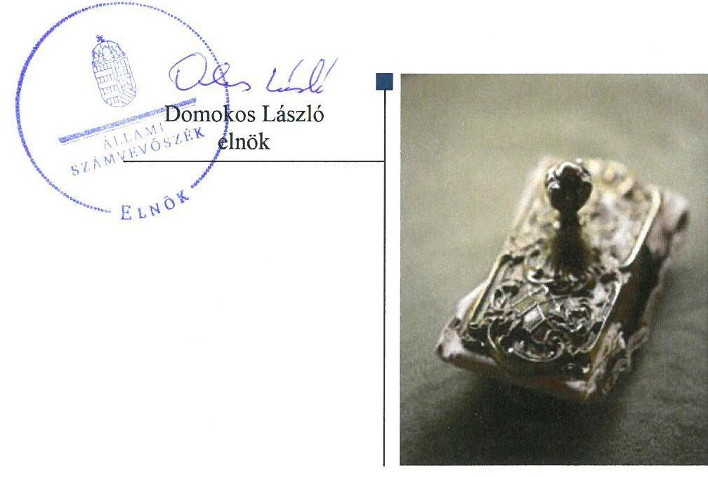
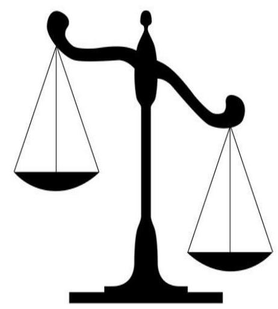
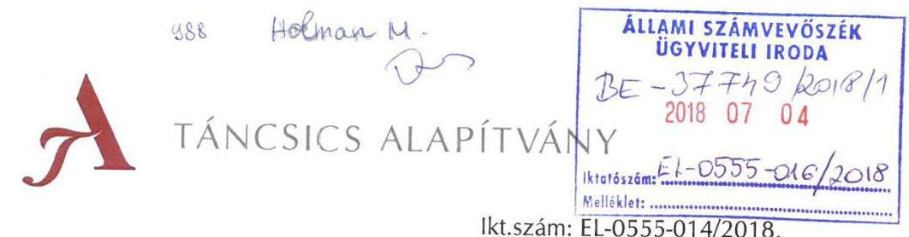
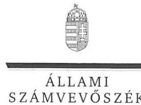
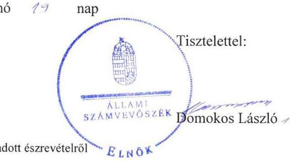

# Jelentés

A költségvetési támogatásban részesülő pártalapítványok 2015–2016. évi gazdálkodása törvényességének ellenőrzése

Táncsics Mihály Alapítvány 2018.

18204 www.asz.hu

---

# Jelentés 

## A költségvetési támogatásban részesülő pártalapítványok 2015-2016. évi gazdálkodása törvényességének ellenőrzése

Táncsics Mihály Alapítvány
2018. 08. hó 30. nap

---

# AZ ELLENŐRZÉST FELÜGYELTE:

- **HOLMAN MAGDOLNA JULIANNA** felügyeleti vezető
- **AZ ELLENŐRZÉST VEZETTE ÉS A VÉGREHAJTÁSÁÉRT FELELŐS:**
  - **DR. GYŐRI GABRIELLA** ellenőrzésvezető
- **A PROGRAM ÖSSZEÁLLÍTÁSÁÉRT FELELŐS:**
  - **TÓTPÁL SZABOLCS** osztályvezető

**IKTATÓSZÁM:** EL-1001-001/2018

**TÉMASZÁM:** 2465

**ELLENŐRZÉS-AZONOSÍTÓ SZÁM:** V081001

Jelentéseink az Országgyűlés számítógépes hálózatán és az Interneten a www.asz.hu címen is olvashatóak.

---

# TARTALOMJEGYZÉK 

■ ÖSSZEGZÉS ..... 5
■ AZ ELLENŐRZÉS CÉLJA ..... 6
■ AZ ELLENŐRZÉS TERÜLETE ..... 7
■ AZ ELLENŐRZÉS HÁTTERE, INDOKOLTSÁGA ..... 8
■ A JELENTÉS LÉNYEGES KÉRDÉSKÖREI ..... 9
■ AZ ELLENŐRZÉS HATÓKÖRE ÉS MÓDSZEREI ..... 10
■ MEGÁLLAPÍTÁSOK ..... 13
■ JAVASLATOK ..... 16
■ MELLÉKLETEK ..... 17
I. sz. melléklet: Értelmező szótár ..... 17
II. sz. melléklet: Az ÁSZ 16141 számú jelentéséhez kapcsolódó intézkedési terv végrehajtása ..... 18
■ FÜGGELÉK: ÉSZREVÉTELEK ..... 19
■ RÖVIDÍTÉSEK JEGYZÉKE ..... 25

---

.

---

# ÖSSZEGZÉS 

A Táncsics Mihály Alapítvány a szabályszerű működés és gazdálkodás feltételeit megteremtette. A könyvvezetés és a gazdálkodás során a jogszabályi előírásokat 2015-ben nem tartotta be, 2016-ban betartotta. A 2015-2016. évi tevékenységéről szóló jelentéseket a jogszabályi előírásoknak megfelelően készítette el és tette közzé. A 2015-2016. évekre vonatkozó egyszerűsített éves beszámolókat a jogszabályi előírások ellenére leltárral nem támasztotta alá, így nem érvényesült a számviteli törvény szerinti valódiság elve. A végrehajtott intézkedések eredményeként a könyvvezetés és a gazdálkodás szabályozottsága javult.

## Az ellenőrzés társadalmi indokoltsága

A politikai kultúra fejlesztése érdekében tudományos, ismeretterjesztő, kutatási, oktatási tevékenység folytatása céljából a pártok költségvetési támogatásra jogosult alapítványt hozhatnak létre. Jogszabályi előírások alapján a pártalapítványok gazdálkodása törvényességének ellenőrzésére az Állami Számvevőszék jogosult, ezért kétévente ellenőrzi a költségvetésből támogatásban részesülő pártalapítványoknak a gazdálkodását.

Az Állami Számvevőszék stratégiájában megfogalmazta, hogy az államháztartáson kívülre nyújtott költségvetési támogatások és az ingyenes vagyonjuttatás ellenőrzésével hozzájárul ahhoz, hogy a közpénzeket a civil szervezetek is átlátható módon használják fel. A pártalapítványok gazdálkodása szabályszerűségének bemutatásával az ellenőrzés értékteremtő módon járul hozzá az Állami Számvevőszék stratégiai céljainak megvalósításához, a nyilvánosság megfelelő tájékoztatásához.

## Főbb megállapítások, következtetések, javaslatok

A Táncsics Mihály Alapítvány alapító okirata és a gazdálkodásra vonatkozó belső szabályozás megfelelt a jogszabályi előírásoknak, ami megteremtette a közpénzekkel való átlátható és ellenőrizhető gazdálkodás alapjait.

A támogatásokat a Táncsics Mihály Alapítvány szabályszerűen fogadta el és számolta el. A ráfordítások 2015. évi elszámolása nem volt szabályszerű, a 2016. évi elszámolása szabályszerű volt.

A 2015-2016. évekre vonatkozó számviteli beszámolók adatait a Táncsics Mihály Alapítvány a jogszabályi előírások ellenére leltárral nem támasztotta alá.

A 2013-2014. évi gazdálkodás ellenőrzéséről szóló számvevőszéki jelentésben foglalt megállapításokhoz a Táncsics Mihály Alapítvány hét pontból álló intézkedési tervet készített, az abban meghatározott feladatokat a vállalt határidőben végrehajtotta.

---

# AZ ELLENŐRZÉS CÉLJA 

Az ellenőrzés célja annak megállapítása volt, hogy a pártalapítvány törvényesen gazdálkodott-e, az éves számviteli beszámolók és a tevékenységéről szóló éves jelentések a jogszabályi előírásoknak megfeleltek-e, a könyvvezetés és gazdálkodás során a vonatkozó jogszabályi rendelkezéseket, belső előírásokat betartották-e. Továbbá az ellenőrzés célja annak értékelése volt, hogy az előző számvevőszéki jelentésben foglalt intézkedést igénylő megállapításokkal összhangban készített intézkedési tervben meghatározott feladatokat az ellenőrzött szervezet végrehajtotta-e.

---

# AZ ELLENŐRZÉS TERÜLETE 

## Táncsics Mihály Alapítvány

Az ellenőrzés a Párt tv. ${ }^{1}$ alapján a politikai kultúra fejlesztése érdekében tudományos, ismeretterjesztő, kutatási, oktatási tevékenység folytatása céljából, a Ptk. ${ }_{1,2}{ }^{2}$ szerinti létesítő/alapító okiraton alapuló bírósági nyilvántartásba vétellel létrejött Táncsics Mihály Alapítvány gazdálkodására terjedt ki. A pártalapítványok törvényes gazdálkodásának (könyvvezetése, beszámolása, jelentéstétele) szabályait alapvetően a Pártalapítványi tv. ${ }^{3}$-en túl a Számv. tv. ${ }^{4}$ és annak a végrehajtási rendelete a Számviteli vhr. ${ }^{5}$ határozták meg.

A Táncsics Mihály Alapítványt 2003-ban hozta létre határozatlan időre a Magyar Szocialista Párt 1,0 M Ft induló vagyonnal. A saját tőke értéke 2016 végén 99,3 M Ft volt.

A Pártalapítvány ${ }^{6}$ alapító okirat ${ }_{1-4}{ }^{7}$ szerinti célja: a politikai kultúra fejlesztése érdekében történő politikai képzés, kutatás, tudományos és ismeretterjesztő tevékenység támogatása.

A Pártalapítvány az ellenőrzött időszakban évente 234,2 M Ft költségvetési támogatásban részesült, tevékenységét felügyelőbizottság és választott könyvvizsgáló ellenőrizte. A Pártalapítvány az ellenőrzött időszakban a Ptk. ${ }_{1}$ alapján a Kapcsolat.hu Nonprofit Kft.-ben rendelkezett 100%-os tulajdonrésszel.

A Pártalapítvány az ellenőrzött időszakban gazdasági-vállalkozási tevékenységet nem végzett. A Pártalapítványnál az ellenőrzött időszakban külső ellenőrzés lefolytatására nem került sor.

---

# AZ ELLENŐRZÉS HÁTTERE, INDOKOLTSÁGA 

Társadalmi elvárás a közpénzek értékelvű, rendeltetésszerű felhasználása, a közpénzekből nyújtott támogatások átláthatóságának megteremtése, amelyhez az ÁSZ ${ }^{8}$ az államháztartásból nyújtott támogatások ellenőrzésével kíván hozzájárulni. A Párt tv. 9/A § (1) bekezdése alapján a politikai kultúra fejlesztése érdekében tudományos, ismeretterjesztő, kutatási, oktatási tevékenység folytatása céljából létrehozott pártalapítványok gazdálkodása törvényességének ellenőrzése - Pártalapítványi tv. 4. § (2) bekezdése értelmében - az ÁSZ feladata. E törvény 4. § (4) bekezdése alapján az ÁSZ kétévente - kötelező jelleggel - ellenőrzi azoknak a pártalapítványoknak a gazdálkodását, amelyek költségvetési támogatásban részesültek.

Az ÁSZ, mint az Országgyűlés ellenőrző szerve a pártalapítványok gazdálkodása törvényességének/szabályszerűségének értékelésével hozzájárul ahhoz, hogy a társadalom objektív képet alkothasson a pártalapítványok működéséről. Az ellenőrzés eredményeinek célzott felhasználói a nyilvánosság, a jogalkotó, továbbá a pártalapítványok esetén azok alapítója és szervei. A jelentésben foglalt megállapítások, következtetések és javaslatok alapján a törvényalkotók konkrét lépéseket tehetnek a pártalapítványokra vonatkozó szabályozások megváltoztatása, átláthatóbbá, ellenőrizhetőbbé tétele irányába. Az ellenőrzött szervezetek szintjén a hiányosságok, szabálytalanságok feltárása, az ennek kapcsán megfogalmazott megállapítások elősegíthetik a pártalapítványok szabályszerű gazdálkodását.

Az ÁSZ tv. ${ }^{9}$ 33. § (1) bekezdése értelmében a számvevőszéki jelentések intézkedést igénylő megállapításaihoz és javaslataihoz kapcsolódóan az ellenőrzött szervezet vezetője intézkedési tervet köteles összeállítani, és az ÁSZ részére megküldeni. Az intézkedési tervben foglaltak megvalósítását az ÁSZ törvény 33. § (7) bekezdésében foglaltak alapján - az ÁSZ utóellenőrzés keretében - ellenőrizheti. Az utóellenőrzések keretében - az intézkedések értékelése során - az ÁSZ figyelembe veszi az ellenőrzött szervezetek működési feltételeiben, valamint a jogszabályi előírásokban bekövetkezett változásokat. Az ÁSZ az utóellenőrzés során értékeli, hogy az érintett számvevőszéki jelentésben foglalt intézkedést igénylő megállapításokkal és javaslatokkal összhangban, az ellenőrzött szervezet által készített intézkedési tervben meghatározott feladatokat a feladatra kijelöltek végrehajtották-e. Az intézkedések végrehajtásával az adott terület szabályszerű működése vonatkozásában a kockázatok csökkenhetnek, azonban hosszabb távon az intézkedési tervben foglaltak végrehajtásával önmagában nem szűnnek meg, csak akkor, ha beépülnek az ellenőrzött szervezet működésébe, azokat folyamatosan karbantartják, figyelembe véve, illetve kezelve a változásokat. Emellett az intézkedések végrehajtásáig újabb kockázatok merülhetnek fel a szabályszerű működés vonatkozásában, amelyek kezelése szintén kiemelten fontos az ellenőrzött szervezet számára.

---

# A JELENTÉS LÉNYEGES KÉRDÉSKÖREI 

1.     - A Táncsics Mihály Alapítvány gazdálkodásának törvényessége biztosított volt-e?
2.     - A Táncsics Mihály Alapítvány könyvvezetése és gazdálkodása során a vonatkozó jogszabályi rendelkezéseket és belső előírásokat betartották-e?
3.     - A Táncsics Mihály Alapítvány tevékenységéről szóló éves jelentések, az éves számviteli beszámolók a jogszabályi előírásoknak megfeleltek-e?
4.     - A Táncsics Mihály Alapítvány a számvevőszéki jelentésben foglalt intézkedést igénylő megállapításokkal összhangban készített intézkedési tervben meghatározott feladatokat végrehajtotta-e?

---

# AZ ELLENŐRZÉS HATÓKÖRE ÉS MÓDSZEREI 

## Az ellenőrzés típusa

Szabályszerűségi ellenőrzés.

## Az ellenőrzött időszak

2015. január 1 - 2016. december 31.

Az utóellenőrzés tekintetében a 16141 számú számvevőszéki jelentés ${ }^{10}$ közzétételének napjától (2016. október 7.) jelen ellenőrzésről szóló kiértesítő levél keltének (2017. december 9.) napjáig tartó időszak.

## Az ellenőrzés tárgya

Az ellenőrzés tárgyát képezte a pártalapítvány gazdálkodása, a könyvvezetés szabályozása és gyakorlata szabályszerűsége, az éves számviteli beszámolókra és az alapítvány tevékenységéről szóló éves jelentésekre vonatkozó kötelezettség teljesítése, valamint a gazdálkodáshoz kapcsolódó ellenőrzések javaslatainak hasznosítására irányuló tevékenység.

Az ÁSZ tv. 2011. július 1-jei hatálybalépését követően a számvevőszéki jelentésben foglalt intézkedést igénylő megállapításokkal és javaslatokkal összhangban - az ellenőrzött szervezet által - készített intézkedési tervben foglaltak végrehajtásának ellenőrzése. Az utóellenőrzéssel érintett intézkedések végrehajtása elmaradásának következtében továbbra is fennálló szabálytalanságok értékelése a közpénzek, közvagyon veszélyeztetettségi kockázata valószínűsített hatására vonatkozóan. Az ellenőrzés kiterjedt minden olyan körülményre és adatra, amely az ÁSZ jogszabályban meghatározott feladatainak teljesítéséhez, valamint a program végrehajtása folyamán felmerült újabb összefüggések feltárásához szükséges.

## Az ellenőrzött szervezet

Táncsics Mihály Alapítvány

## Az ellenőrzés jogalapja

Az Alaptörvény ${ }^{11}$ 43. cikk (1) bekezdése, ÁSZ tv. 1. § (3) bekezdése, 5. § (3) bekezdése, 33. § (1)-(2) és (7) bekezdései, a Pártalapítványi tv. 4. § (2) és (4) bekezdései.

---

# Az ellenőrzés módszerei 

Az ellenőrzést az ÁSZ az Ellenőrzési program szempontjai, az ellenőrzött időszakban hatályos jogszabályok, a jelen ellenőrzésre irányadó ÁSZ módszertan figyelembe vételével végezte.

A pártalapítvány tevékenységéről szóló éves jelentési-, beszámoló- és közzétételi kötelezettséget a 2014. évben létrehozott alapítványok esetében a 2014. év tekintetében is ellenőrizte az ÁSZ. A 2014. évben alapított pártalapítványok esetében az alapítás szabályszerűségét is értékelte.

Az ellenőrzés ideje alatt az ellenőrzött szervezettel történő kapcsolattartás az ÁSZ SZMSZ ${ }^{12}$-ének vonatkozó előírásai alapján történt.

Az ellenőrzési kérdések megválaszolásához szükséges bizonyítékok megszerzése az ellenőrzött által rendelkezésre bocsátott dokumentumokra, adatokra alapozva megfigyelés, szemle (szemrevételezés), kérdésfeltevés (információkérés), mintavételezés, valamint elemző eljárás útján történt. A mintavételezés véletlen mintavételi eljárással történt.

Az ellenőrzési bizonyítékként felhasználható adatforrások közé tartoztak egyrészt az Ellenőrzési program részletes szempontjainál felsorolt adatforrások, másrészt minden egyéb - az ellenőrzés folyamán - feltárt, az ellenőrzés szempontjából információt tartalmazó dokumentum.

Az ellenőrzés lefolytatásához az ellenőrzött a tanúsítványok elektronikus kitöltésével, valamint az ÁSZ által kért dokumentumok elektronikus megküldésével szolgáltatott adatokat. Az így rendelkezésre bocsátott adatok, információk, a tanúsítványok adatai valódiságának kontrollja az ellenőrzés keretében történt.

Az utóellenőrzés megállapításait az ÁSZ rendelkezésére álló dokumentumok, valamint az ÁSZ adatbekérése szerint, az ellenőrzött szervezet által elektronikusan rendelkezésre bocsátott dokumentumok, adatok alapján kellett megfogalmazni. Az utóellenőrzés esetében az intézkedési tervekben előírt feladatokat, azok végrehajtása, illetve végrehajtása szempontjából az alábbiak szerint kellett értékelni:
„határidőben végrehajtott" a feladat, ha a teljesítés dokumentáltan, az intézkedési tervben előírt határidőben és tartalommal megtörtént;
„határidőn túl végrehajtott" a feladat, ha annak teljesítése az intézkedési tervben meghatározott módon, de az abban előírt határidőn túl történt meg;
„részben végrehajtott" a feladat, amelynek végrehajtása nem teljes körűen az intézkedési tervben előírt módon történt meg;
„nem végrehajtott" a feladat, ha a végrehajtás nem történt meg, vagy amennyiben a teljesítést/végrehajtást nem dokumentálták, dokumentumokkal nem tudták igazolni annak teljesítését;
„okafogyottá vált" a feladat, ha végrehajtására - meghatározott esemény bekövetkezése, továbbá külső körülmény, a működést érintő feltétel változása miatt - már nincs szükség, illetve lehetőség, és egyértelműen megállapítható, hogy az intézkedést szükségessé tevő körülmény a
 jövőben nem fordulhat elő;

---

$\longrightarrow$„nem időszerű" az a feladat, amelynek ellenőrzési időszakon belüli végrehajtására azért nem került (kerülhetett) sor, mert az intézkedés alapjául szolgáló esemény nem következett be, de annak jövőbeni előfordulása lehetséges, a végrehajtása nem volt esedékes, vagy a végrehajtás határideje még nem járt le.

---

# 1. A Táncsics Mihály Alapítvány gazdálkodásának törvényessége biztosított volt-e? 

Összegző megállapítás

1.1. számú megállapítás
1.2. számú megállapítás

A Pártalapítvány a szabályszerű gazdálkodás feltételeit kialakította.

A Pártalapítvány gazdálkodása szervezeti kereteinek kialakítása szabályszerű volt.

Az alapító okirat ${ }_{1-4}$ a Ptk. ${ }_{1-2}$ előírásainak megfelelően tartalmazta a Pártalapítvány célját és főtevékenységét, a részére teljesítendő vagyoni hozzájárulásokat, azok rendelkezésre bocsátásának módját és idejét, a vagyon felhasználási módját, illetve kezelésének szabályait.

A Kuratórium ${ }^{13}$ munkáját titkárság támogatta, amely működésének szabályait az SZMSZ ${ }_{1-2}{ }^{14}$-ben rögzítették. A Pártalapítvány - a Számviteli vhr. rendelkezéseit betartva - kettős könyvvitellel alátámasztott egyszerűsített éves beszámolót készített az ellenőrzött időszakban.

A Pártalapítvány gazdálkodására vonatkozó belső szabályozás elkészítése során érvényesültek a Számv. tv. előírásai.

A Pártalapítvány az ellenőrzött időszakban rendelkezett a Számv. tv.-nek megfelelő hatályos számviteli politika ${ }_{1,2}{ }^{15}$-vel, számlarend ${ }_{1,2}{ }^{16}$-vel, valamint a számviteli politika keretében elkészítendő, a Számv. tv. 14. § (5) bekezdésében előírt szabályzatokkal.

A Pártalapítvány a 2015-2016. években nem alakította ki - az Info. tv. ${ }^{17}$ 7. § (2) bekezdésének előírása ellenére - azokat az eljárási szabályokat, amelyek az Info tv., valamint az egyéb adat- és titokvédelmi szabályok érvényre juttatásához szükségesek.

## 2. A Táncsics Mihály Alapítvány könyvvezetése és gazdálkodása során a vonatkozó jogszabályi rendelkezéseket és belső előírásokat betartották-e?

Összegző megállapítás

2.1. számú megállapítás

A Pártalapítvány könyvvezetése és gazdálkodása 2015-ben nem volt szabályszerű, 2016-ban szabályszerű volt.

A Pártalapítvány által az ellenőrzött időszakban elfogadott támogatások számviteli elszámolása során betartotta a jogszabályi előírásokat.

A Pártalapítvány a Számviteli vhr.-nek megfelelően a számviteli politika ${ }_{1,2}$ ben és a számlarend ${ }_{1,2}$-ben kialakította a támogatások nyilvántartásának és

---

pénzügyi elszámolásának rendjét. A kapott támogatások számviteli elszámolása és nyilvántartása megfelelt a számviteli politika ${ }_{1,2}$, számlarend ${ }_{1,2}$ és a Számviteli vhr. rendelkezéseinek. A támogatások elfogadása során érvényesültek a Pártalapítványi tv. előírásai.

# 2.2. számú megállapítás 

A Pártalapítvány ráfordításainak elszámolása 2015-ben nem volt szabályszerű, 2016-ban szabályszerű volt.

A 2015. évi ráfordítások elszámolása nem volt szabályszerű, mert - a Számv. tv. 167. § (1) bekezdés c) pontjában és az SZMSZ ${ }_{1}$ III. fejezet első francia bekezdésében foglaltak ellenére - a könyvviteli elszámolást alátámasztó bizonylatok nem tartalmazták a gazdasági műveletet elrendelő személy megjelölését. A 2016. évi ráfordítások elszámolása megfelelt a Számv. tv. és az SZMSZ ${ }_{2}$ előírásainak.

A Pártalapítvány által az ellenőrzött időszakban nyújtott támogatások kifizetését a számviteli nyilvántartásokban a Számv. tv. előírásainak megfelelően rögzítették.

A Pártalapítvány - a Párt tv. rendelkezéseit betartva - az alapító párt részére vagyoni hozzájárulást nem nyújtott.

## 3. A Táncsics Mihály Alapítvány tevékenységéről szóló éves jelentések, az éves számviteli beszámolók a jogszabályi előírásoknak megfeleltek-e?

## Összegző megállapítás

Az ellenőrzött időszakban a Pártalapítvány tevékenységéről szóló éves jelentések elkészítése és közzététele szabályszerű volt, az éves számviteli beszámolók elkészítése nem volt szabályszerű.

A Pártalapítvány a tevékenységéről szóló éves jelentéseket a 2015-2016. évekre vonatkozóan a Pártalapítványi tv. előírásainak megfelelően állította össze és tette közzé.

A Pártalapítvány a 2015-2016. évi beszámolók adatait - a Számv. tv. 69. § (1) bekezdésében foglaltak ellenére - nem támasztotta alá leltárral. A 2015-2016. évek vonatkozásában a jegyzett tőke és a kötelezettségek leltározását a Pártalapítvány - a Számv. tv. 69. § (2) és (4) bekezdésében, a leltározási szabályzat ${ }^{18} \mathrm{I} / 4 / \mathrm{b}$ ) pontjában, III/9. és III/11. pontjában foglaltak ellenére - nem végezte el.

A Kuratórium - az ellenőrzött időszakban - a számviteli beszámolókat az $\mathrm{FB}^{19}$ vélemény ismeretében jóváhagyta.

A Pártalapítvány a 2015. évi egyszerűsített éves beszámoló tekintetében nem tett eleget a közzétételi kötelezettségének, mert az egyszerűsített éves beszámolóját a Számviteli vhr. 20. § (2) bekezdésében foglaltak ellenére május 31-ig nem tette közzé. A 2016. évi beszámoló közzététele szabályszerű volt.

---

# 4. A Táncsics Mihály Alapítvány a számvevőszéki jelentésben foglalt intézkedést igénylő megállapításokkal összhangban készített intézkedési tervben meghatározott feladatokat végrehajtotta-e? 

Összegző megállapítás

A Pártalapítvány a korábbi számvevőszéki jelentésben foglalt intézkedést igénylő megállapításokkal összhangban készített intézkedési tervben meghatározott feladatokat határidőben végrehajtotta.

A 16141 számú számvevőszéki jelentésben megfogalmazott intézkedést igénylő megállapításokkal összhangban a Kuratórium - az ÁSZ tv.-ben rögzített határidőben - hét pontból álló intézkedési tervet készített, azt az ÁSZ részére megküldte, amelyet az ÁSZ elnöke elfogadott. A Kuratórium a feladatok végrehajtásáról minden esetben határidőben gondoskodott:

- A Pártalapítvány intézkedett az SZMSZ módosítása érdekében, hogy abban a Kuratórium létszámára vonatkozó előírás összhangban legyen az alapító okiratban foglaltakkal.
- A Pártalapítvány a Számv. tv. előírásainak megfelelően módosította számviteli politikájában a gazdasági műveletek bizonylatainak feldolgozási rendjét.
- A Pártalapítvány a Számv. tv. előírásai alapján elkészítette a bizonylati rendet.
- A könyvvezetés során a Pártalapítvány érvényesítette a „tartalom elsődlegessége a formával szemben" elvet.
- A Pártalapítvány gondoskodott arról, hogy a banki pénzmozgások bizonylatait a Számv. tv. és a számviteli politika ${ }_{2}$ rendelkezéseinek megfelelően rögzítsék a könyvekben.
- A Pártalapítvány a befektetett pénzügyi eszközök értékvesztésének összegét a Számv. tv. alapján a piaci érték és a befektetés könyv szerinti értéke közötti különbözetként számolta el.
- A Pártalapítvány intézkedett arról, hogy kötelezettséget az arra felhatalmazott személy vállaljon.
Az intézkedési tervben meghatározott feladatokat, határidőket, felelősöket és a feladatok végrehajtását a II. számú melléklet mutatja be.

---

# JAVASLATOK 

Az ÁSZ tv. 33. § (1) bekezdésében foglaltak értelmében az ellenőrzött szervezet vezetője köteles a jelentésben foglalt megállapításokhoz kapcsolódó intézkedési tervet összeállítani és azt a jelentés kézhezvételétől számított 30 napon belül az ÁSZ részére megküldeni. Amennyiben az ellenőrzött szervezet vezetője nem küldi meg határidőben az intézkedési tervet, vagy továbbra sem elfogadható intézkedési tervet küld, az Állami Számvevőszék elnöke az ÁSZ tv. 33. § (3) bekezdése a) és b) pontjaiban foglaltakat érvényesítheti.

## A Táncsics Mihály Alapítvány Kuratóriuma elnökének

1. Intézkedjen az Info tv.-ben előírtak érvényre juttatásához szükséges eljárási szabályok kialakítására.
(1.2. sz. megállapítás 2. bekezdése alapján)
2. Intézkedjen a könyvek üzleti év végi zárásához, a beszámoló elkészítéséhez, a mérleg tételeinek alátámasztásához a Számv. tv. által előírt leltár összeállítására.
(3. sz. összegző megállapítás 2. bekezdése alapján)

---

# MELLÉKLETEK 

- I. SZ. MELLÉKLET: ÉRTELMEZŐ SZÓTÁR
alapítvány
gazdálkodó tevékenység
gazdasági-vállalkozási
tevékenység
költségvetésből juttatott/nyújtott forrás/támogatás
pártalapítvány

Az alapítvány az alapító által az alapító okiratban meghatározott tartós cél folyamatos megvalósítására létrehozott jogi személy. Az alapító az alapító okiratban meghatározza az alapítványnak juttatott vagyont és az alapítvány szervezetét. Alapítvány nem alapítható gazdasági-vállalkozási tevékenység folytatására. Az alapítvány az alapítványi cél megvalósításával közvetlenül összefüggő gazdasági tevékenység végzésére jogosult. Alapítvány nem lehet korlátlan felelősségű tagja más jogalanynak, nem létesíthet alapítványt és nem csatlakozhat alapítványhoz. (Forrás: Ptk. 3:378. §, 3:379. § (1) - (3) bekezdés)
azon tevékenységek összessége, amelyek a civil szervezet vagyoni, pénzügyi, jövedelmi helyzetére kiható gazdasági eseményt eredményeznek. (Forrás: Ectv. 2. § 10. pont.)
A jövedelem- és vagyonszerzésre irányuló vagy azt eredményező, üzletszerűen végzett gazdasági tevékenység, kivéve az adomány (ajándék) elfogadását, a létesítő okiratban meghatározott cél szerinti tevékenységet (ideértve a közhasznú tevékenységet is), - 2015. november 28-tól - a pénzeszközök betétbe, értékpapírba, társasági részesedésbe történő elhelyezését és az ingatlan megszerzését, használatának átengedését és átruházását. (Forrás: Ectv. 2. § 11. pont.)
a pártalapítványoknak a Párt tv. 9/A. § (1) bekezdése és a Pártalapítványi tv. 1. § előírásainak értelmében, az éves költségvetési törvények szerint - jellemzően az 1. számú melléklet 1. Országgyűlés fejezet 9. Pártalapítványok támogatás címen - az állami költségvetésből juttatott forrás/támogatás. az államháztartás központi alrendszeréből - a Tb alap kivételével - ellenérték nélkül, pénzben nyújtott költségvetési támogatás (Forrás: Áht. 1. § 14. pont)
a politikai kultúra fejlesztése érdekében, tudományos, ismeretterjesztő, kutatási és oktatási tevékenység folytatása céljából pártok által létrehozott, külön jogszabályban - a Pártalapítványi tv. 1. § és 3. § (1) bekezdésében- meghatározott, jogi személynek minősülő egyéb szervezet (Forrás: Párt tv. 9/A. § (1) bekezdés, Pártalapítványi tv. 1. §, Számv. tv. 3. § (1) bekezdése 4. pont, Számviteli vhr. 2. § (1) bekezdés k) pont, 4. § (1) bekezdés)

---

|  1. | Intézkedtem az SZMSZ módosításáról annak érdekében, hogy abban a Kuratórium létszámára vonatkozó előírása összhangban legyen az Alapító okirat erre vonatkozó rendelkezésével. | 2016. november 1. | kuratórium elnöke | Az SZMSZ-t az alapító okirat ${ }_{2}$ bírósági bejegyzését (2015. május 6.) követően 2015. május 26. hatállyal módosították. A Kuratórium tagjainak száma mindkét dokumentumban hat főre módosult.  |
| --- | --- | --- | --- | --- |
|  2. | A Kuratórium soron következő ülésére, elfogadásra előkészítettük az észrevételnek megfelelően módosított Számviteli Politikát. | 2016. november 1. | kuratórium elnöke | A Pártalapítvány a számviteli politikában a gazdasági műveletek, események bizonylatainak feldolgozási rendjét 2016. október 17-i hatállyal a Számv. tv.-nek megfelelően módosította.  |
|  3. | A Kuratórium soron következő ülésére, elfogadásra előkészítettük a Számla Rendben foglaltakat alátámasztó Bizony-
lati Rendet. | 2016. november 1. | kuratórium elnöke | A Kuratórium a bizonylati rendet ${ }^{(8)}$ az 52/2016.(10.17.) T.A. számú határozatával elfogadta.  |
|  4. | Intézkedem arról, hogy a könyvvezetés során érvényesüljön a tartalom elsődlegessége a formával szemben számviteli alapelv. | 2016. december 31. intézkedés: folyamatos | kuratórium elnöke | A 16141. számú számvevőszéki jelentésben hiányosságként megjelölt befejezetlen beruházást 2016. október 31-i dátummal a Pártalapítvány a Számv. tv.-nek megfelelően aktiválta az egyéb építményekre. A könyvvezetés során érvényesült a „tartalom elsődlegessége a formával szemben" számviteli alapelv.  |
|  5. | Intézkedem, hogy a banki pénzmozgások bizonylatait a hitelintézeti értesítés megérkezésekor rögzítsék a könyvekben. | 2016. november 1. intézkedés: folyamatos | titkárságvezető | A Pártalapítvány intézkedett, hogy a pénzmozgások bizonylatainak könyvekben való rögzítése a Számv. tv. rendelkezéseinek megfelelően történjen. A szabályszerű feladatellátás érdekében a számviteli politikában a gazdasági műveletek, események bizonylatainak feldolgozási rendjét 2016. október 17-i hatállyal a Számv. tv.-nek megfelelően módosították.  |
|  6. | Intézkedem, hogy a befektetett pénzügyi eszközök értékvesztésének összege a piaci érték és a befektetés könyv szerinti értéke közötti különbözetként kerüljön elszámolásra. | 2016. november 1. intézkedés: folyamatos | kuratórium elnöke | A Pártalapítvány a 2015. évi 14 M Ft értékvesztés elszámolásával rendezte a 2013-2014. években felhalmozódott különbözetet. A rendezéssel a Pártalapítvány - 2015. évre vonatkozó - 2016. május 30. keltezésű beszámolójában kimutatott befektetett pénzügyi eszközök értékének megállapítása megfelelt a Számv. tv. előírásainak. A Kapcsolat.hu Kft. saját tőkéje és
 a Pártalapítvány mérlegének befektetett pénzügyi eszközök sor értéke a 2015. és a 2016. évek beszámolóiban megegyezett.  |
|  7. | Intézkedem, hogy a TMA kiadásaira kötelezettséget az Alapító okirat és az SZMSZ rendelkezéseinek megfelelően az arra felhatalmazott személy vállaljon. | 2016. november 1. intézkedés: folyamatos | titkárságvezető | A Kuratórium a 12/2015.(05.26.) T.A. határozatával elfogadta az SZMSZ módosítását, amelyben újraszabályozták a kötelezettségvállalás rendjét. A 2016. évi kötelezettségvállalások az SZMSZ ${ }_{2}$ rendelkezéseinek megfelelően történtek.  |

---

# FÜGGELÉK: ÉSZREVÉTELEK 

A jelentéstervezetet a Számvevőszék 15 napos észrevételezésre megküldte az ellenőrzött szervezet vezetőjének az ÁSZ tv. 29. § (1) bekezdése előírásának megfelelően.

A függelék tartalmazza az ellenőrzött észrevételeit, illetve az el nem fogadott észrevételek elutasításának indoklását.

[^0]
[^0]:    * 29. § (1) Az Állami Számvevőszék az ellenőrzési megállapításait megküldi az ellenőrzött szervezet vezetőjének vagy az általa megbízott személynek, és annak, akinek személyes felelősségét állapította meg.
    (2) Az ellenőrzött szervezet vezetője és a felelősként megjelölt személy az ellenőrzés megállapításaira tizenöt napon belül írásban észrevételt tehet.
    (3) Az Állami Számvevőszék az észrevételre a beérkezésétől számított harminc napon belül írásban válaszol. A figyelembe nem vett észrevételeket köteles a jelentésben feltüntetni, és megindokolni, hogy azokat miért nem fogadta el.

---

Domokos László
elnök
Állami Számvevőszék

# Tárgy: Számvevőszéki jelentéstervezet 

## Tisztelt Elnök Úr!

Az Állami Számvevőszék által 2017-2018. évben lefolytatott vizsgálat - amely során minden, a kollégái által kért iratot rendelkezésre bocsátottunk - eredményeként keletkezett 2018. július 12-i keltezésű „A költségvetési támogatásban részesülő pártalapítványok 2015-2016. évi gazdálkodása törvényességének ellenőrzése - Táncsics Mihály Alapítvány" című számvevőszéki jelentéstervezetet köszönettel áttanulmányoztuk. Észrevételt két részlet tekintetében kívánunk tenni:

1. A 14. oldal, Összegző megállapítás 2. szakasza: „A Pártalapítvány a 2015-2016. évek vonatkozásában a jegyzett tőke és a kötelezettségek leltározását nem végezte el"

Az Alapító Okiratnak jegyzett tőkére irányuló módosítására nem került sor az érintett években, így a főkönyvi kivonatokban és az előző-, valamint az érintett évek beszámolóiban szereplő nyilvántartott adatok egyezősége evidens.

A 2015.-2016. évek mérleg sorainak egyeztetéses leltárral történő alátámasztása írásos (nyomtatott) formában dokumentálva lett.
A mérleg eszköz és forrás sorai, úgy a befektetett eszközök, forgóeszközök és aktív időbeli elhatárolások, kötelezettségek és passzív időbeli elhatárolások sorai banki bizonylatokkal, feljegyzésekkel, Excel kimutatásokkal, analitikákkal, leltári dokumentumokkal kerültek alátámasztásra, melyeket az ÁSZ adatbekérésére hivatkozva a 2.35.1. - 2.36.5. pontokhoz kapcsolódóan csatoltunk. A kötelezettségek leltározását a 2.36.4 Mérlegsorokat alátámasztó leltárdokumentumok című több munkalapos Excel fájl tartalmazza, amelyet feltöltöttünk az Állami Számvevőszék Elektronikus Adatszolgáltatási rendszerébe.
2. A 14. oldal Összegző megállapítás 4. szakasza: „A Pártalapítvány a 2015. évi egyszerűsített éves beszámolóját a Számviteli vhr. 20.§ (2) bekezdésében foglaltak ellenére május 31-ig nem tette közzé"

---

A 2008-ban módosított, a pártok működését segítő tudományos, ismeretterjesztő, kutatási, oktatási tevékenységet végző alapítványokról szóló 2003. évi XLVII. törvény vonatkozó fejezete a következőképpen rendelkezik:
„3/A. § (1) Az alapítvány köteles az éves beszámoló jóváhagyásával egyidejűleg tevékenységéről jelentést készíteni.
(5) Az alapítvány köteles az (1) bekezdésben meghatározott jelentését a tárgyévet követő évben, legkésőbb június 30-áig a Magyar Közlöny mellékleteként megjelenő Hivatalos Értesítőben, továbbá saját honlapján közzétenni.

Egyidejűleg köszönjük munkájukat.
Budapest, 2018. június 26.
Tisztelettel:
dr. Baja Ferenc
Alapítványi elnök

---

ELNÖK

Ikt.szám: EL-0555-017/2018.

# Dr. Baja Ferenc úr 

Kuratórium elnöke
Táncsics Mihály Alapítvány

## Budapest

## Tisztelt Elnök Úr!

Az ,,A költségvetési támogatásban részesülő pártalapítványok 2015-2016. évi gazdálkodása törvényességének ellenőrzése - Táncsics Mihály Alapítvány" című számvevőszéki jelentéstervezetre tett észrevételét köszönettel megkaptam.

Az Állami Számvevőszék észrevételekre vonatkozó álláspontjáról a felügyeleti vezető által készített tájékoztatást csatoltan megküldöm.

Tájékoztatom Elnök urat, hogy a jelentésben - az Állami Számvevőszékről szóló 2011. évi LXVI. törvény 29. § (3) bekezdése alapján - a figyelembe nem vett észrevételt szerepeltetjük az elutasítás indokának feltüntetésével együtt.

Budapest, 2018.

Melléklet: Tájékoztatás el nem fogadott észrevételről

---

# Tájékoztatás el nem fogadott észrevételről 

„A költségvetési támogatásban részesülő pártalapítványok 2015-2016. évi gazdálkodása törvényességének ellenőrzése - Táncsics Mihály Alapítvány" című számvevőszéki jelentéstervezetre tett észrevételét áttekintettük, annak kezeléséről az alábbi tájékoztatást adom.

1. A jelentéstervezet 14. oldal, Összegző megállapítás 2. bekezdésében „A Pártalapítvány a 2015-2016. évek vonatkozásában a jegyzett tőke és a kötelezettségek leltározását nem végezte el" megállapításra tett észrevételt nem fogadtuk el.
A számvitelről szóló 2000. évi C törvény (Számv. tv.) 69. § (1) bekezdése előírja a könyvek üzleti év végi zárásához, a beszámoló elkészítéséhez, a mérleg tételeinek alátámasztásához olyan leltárt kell összeállítani és e törvény előírásai szerint megőrizni, amely tételesen, ellenőrizhető módon tartalmazza - az (5) bekezdés figyelembevételével - a vállalkozónak a mérleg fordulónapján meglévő eszközeit és forrásait mennyiségben és értékben. A Számv. tv. 69. § (2) bekezdés szerint e kötelezettség teljesítése keretében a főkönyvi könyvelés és az analitikus nyilvántartások adatai közötti egyeztetést az üzleti év mérlegfordulónapjára vonatkozóan el kell végezni.
Észrevételében, mely szerint „Az Alapító Okiratnak jegyzett tőkére irányuló módosítására nem került sor az érintett években, így a főkönyvi kivonatokban és az előző-, valamint az érintett évek beszámolóiban szereplő nyilvántartott adatok egyezősége evidens.", megerősítette a számvevőszéki jelentéstervezetben foglalt megállapítást, vagyis a jegyzett tőke egyeztetéssel történő leltározása nem történt meg.
A kötelezettségek tekintetében az észrevételében hivatkozott, 2.35.1. - 2.36.5. azonosítószámokkal ellátott, adatbekérés keretében megküldött főkönyvi kartonokat, egyenlegeket, folyószámlákat, listákat, aláírást nem tartalmazó nyilvántartásokat bocsátottak az ÁSZ rendelkezésére. Ezen nyilvántartások adattartalmára vonatkozó egyeztetést, a leltározás végrehajtását igazoló dokumentumot nem bocsátottak az ellenőrzés rendelkezésére, mindezt a Pártalapítvány által kiállított Teljességi és hitelességi nyilatkozat is igazolja.
A jegyzett tőke és a kötelezettségek egyeztetéssel történő leltározását a Pártalapítvány a leltározási szabályzatának I/4/b) pontjában, III/9. és III/11. pontjában is előírta.
2. A jelentéstervezet 14. oldal Összegző megállapítás 4. szakaszára tett észrevételét nem fogadtuk el. A Számviteli vhr. a jelentéstervezet Rövidítések jegyzékében 5. sorszámmal szerepeltetett, a számviteli törvény szerinti egyes egyéb szervezetek beszámoló készítési és könyvvezetési kötelezettségének sajátosságairól szóló 224/2000. (XII.19) Korm. rendelet, melynek 20. § (2) bekezdése a következőkről rendelkezik:
„Az a cégbíróságon be nem jegyzett egyéb szervezet, amely más jogszabály alapján fontosabb adatait köteles nyilvánosságra hozni, továbbá amely beszámolóját saját

---

elhatározásából nyilvánosságra hozza, a közzétételnek - ha jogszabály másként nem rendelkezik - a Magyar Közlöny Hivatalos Értesítőjében való megjelentetésével, a székhelyén történő betekinthetőséggel vagy egyéb más, a számviteli politikájában rögzített módon tehet eleget. A közzététel határideje - ha jogszabály másként nem rendelkezik - az adott üzleti év mérlegfordulónapját követő ötödik hónap utolsó napja."
A jelentéstervezet észrevételezett megállapítása ezen jogszabályhely megsértésére, vagyis a Pártalapítvány 2015. évi egyszerűsített éves beszámolójának nem a jogszabályban előírt határidőben történő közzétételére irányul. Egyebekben a Pártalapítvány Számviteli politikája 6. A beszámoló elkészítése és a közzététel ütemezése című pontja szerint „Közzététel: Üzleti év mérleg fordulónapját követő ötödik hónap utolsó napja". Mindez azt igazolja, hogy a beszámoló közzétételének határidejét a Pártalapítvány a jogszabályi előírásokkal összhangban határozta meg, ugyanakkor azt nem az előírásoknak megfelelően teljesítette a 2015. év vonatkozásában.
Ezzel szemben az észrevételében jelzett jogszabályi hivatkozás, a pártok működését segítő tudományos, ismeretterjesztő, kutatási, oktatási tevékenységet végző alapítványokról szóló 2003. évi XLVII. törvény 3/A. § (1) bekezdése, mely a pártalapítvány tevékenységéről szóló éves jelentés elkészítése és annak közzététele kötelezettségét írja elő. A pártalapítvány tevékenységéről szóló éves jelentés nem azonos a pártalapítvány egyszerűsített éves beszámolójával.

Budapest, 2018. július hó 1.3 nap

Holman Magdolna felügyeleti vezető

---

# RÖVIDÍTÉSEK JEGYZÉKE 

${ }^{1}$ Párt tv.
${ }^{2}$ Ptk. 1

Ptk. 2
${ }^{3}$ Pártalapítványi tv.
${ }^{4}$ Számv. tv.
${ }^{5}$ Számviteli vhr.
${ }^{6}$ Pártalapítvány
${ }^{7}$ alapító okirat ${ }_{1}$
alapító okirat2
alapító okirat3
alapító okirat4
${ }^{8}$ ÁSZ
${ }^{9}$ ÁSZ tv.
${ }^{10} 16141$ számú számvevőszéki jelentés
${ }^{11}$ Alaptörvény
${ }^{12}$ ÁSZ SZMSZ
${ }^{13}$ Kuratórium
${ }^{14} \mathrm{SZMSZ}_{1}$

SZMSZ2
${ }^{15}$ számviteli politika ${ }_{1}$
számviteli politika ${ }_{2}$
${ }^{16}$ számlarend ${ }_{1}$
számlarend2
${ }^{17}$ Info. tv.
${ }^{18}$ leltározási szabályzat
${ }^{19} \mathrm{FB}$
${ }^{20}$ bizonylati rend
a pártok működéséről és gazdálkodásáról szóló 1989. évi XXXIII. törvény (hatályos: 2014. március 15-től)
1959. évi IV. törvény a Polgári törvénykönyvről (hatálytalan: 2014. március 15-től)
a Polgári Törvénykönyvről szóló 2013. évi V. törvény (hatályos: 2014. március 15-től)
a pártok működését segítő tudományos, ismeretterjesztő, kutatási, oktatási tevékenységet végző alapítványokról szóló 2003. évi XLVII. törvény (hatályos: 2003. július 1-jétől)
a számvitelről szóló 2000. évi C. törvény (hatályos: 2001. január 1-jétől)
a számviteli törvény szerinti egyes egyéb szervezetek beszámoló készítési és könyvvezetési kötelezettségének sajátosságairól szóló 224/2000. (XII.19) Korm. rendelet (hatályos: 2001. január 1-jétől 2016. december 31-ig)
Táncsics Mihály Alapítvány
Táncsics Mihály Alapítvány 2013. szeptember 26. napján kelt egységes szerkezetű alapító okirata
Táncsics Mihály Alapítvány 2015. március 10. napján kelt egységes szerkezetű alapító okirata
Táncsics Mihály Alapítvány 2016. október 3. napján kelt egységes szerkezetű alapító okirata
Táncsics Mihály Alapítvány 2016. november 21. napján kelt egységes szerkezetű alapító okirata
Állami Számvevőszék
2011. évi LXVI. törvény az Állami Számvevőszékről (hatályos: 2011. július 1-jétől)

A költségvetési támogatásban részesülő pártalapítványok 2013-2014. évi gazdálkodása törvényességének ellenőrzése a Táncsics Mihály Alapítványnál Magyarország alaptörvénye (kihirdetve: 2011. április 25-én)
Állami Számvevőszék Szervezeti és Működési Szabályzata
Táncsics Mihály Alapítvány Kuratóriuma
Táncsics Mihály Alapítvány Szervezeti és Működési Szabályzat (hatályos: 2014. szeptember 4-től 2015. május 25-ig)
Táncsics Mihály Alapítvány Szervezeti és Működési Szabályzat (hatályos: 2015. május 26-tól)
Táncsics Mihály Alapítvány Számviteli Politika (hatályos: 2014. szeptember 4-től 2016. október 16-ig)

Táncsics Mihály Alapítvány Számviteli Politika (hatályos: 2016. október 17-től)
Táncsics Mihály Alapítvány Számlarend (hatályos: 2014. szeptember 4-től 2015. december 31-ig)
Táncsics Mihály Alapítvány Számlarend (hatályos: 2016. január 1-jétől)
2011. évi CXII. törvény az információs önrendelkezési jogról és az információszabadságról (hatályos: 2011. július 27-től)
Táncsics Mihály Alapítvány Leltározási szabályzat (hatályos: 2014. szeptember 4-től)
Táncsics Mihály Alapítvány Felügyelő Bizottsága
Táncsics Mihály Alapítvány Bizonylati Rend (hatályos: 2016. október 17-től)

---

# ÁLLAMI SZÁMVEVŐSZÉK 

1052 Budapest, Apáczai Csere János utca 10.
Levélcím: 1364 Budapest 4. Pf. 54
Telefon: +36 14849100 Telefax: +36 14849200
www.asz.hu
