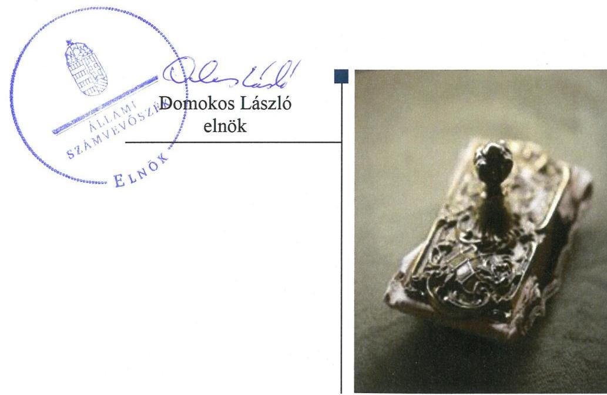
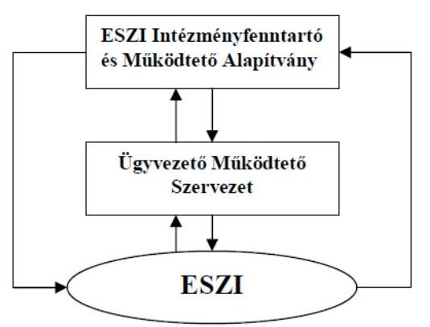

# Jelentés 

## Nem állami humánszolgáltatók ellenőrzése

A humánszolgáltatást nyújtó államháztartáson kívüli köznevelési és szociális intézmények, szolgáltatók fenntartói központi költségvetésből kapott támogatásai felhasználásának ellenőrzése - ESZI Intézményfenntartó és Múködtető Alapítvány
2018.

---

# Jelentés 

## Nem állami humánszolgáltatók ellenőrzése

A humánszolgáltatást nyújtó államháztartáson kívüli köznevelési és szociális intézmények, szolgáltatók fenntartói központi költségvetésből kapott támogatásai felhasználásának ellenőrzése - ESZI Intézményfenntartó és Múködtető Alapítvány
2018. 06 hó 15. nap

---

# AZ ELLENŐRZÉST FELÜGYELTE:

- **SALAMON ILDIKÓ** felügyeleti vezető
- **DR. NAGY IMRE** felügyeleti vezető

# AZ ELLENŐRZÉST VEZETTE ÉS A VÉGREHAJTÁSÁÉRT FELELŐS:

- **DR. KOVÁCS DIÁNA** ellenőrzésvezető

# A PROGRAM ÖSSZEÁLLÍTÁSÁÉRT FELELŐS:

- **TÓTPÁL SZABOLCS** osztályvezető

# IKTATÓSZÁM: EL-0438-018/2018.

# TÉMASZÁM: 2448

# ELLENŐRZÉS-AZONOSÍTÓ SZÁM: V079412

Jelentéseink az Országgyűlés számítógépes hálózatán és az Interneta a www.asz.hu címen is olvashatóak.

---

# TARTALOMJEGYZÉK 

■ ÖSSZEGZÉS ..... 5
■ AZ ELLENŐRZÉS CÉLJA ..... 6
■ AZ ELLENŐRZÉS TERÜLETE ..... 7
■ AZ ELLENŐRZÉS HÁTTERE, INDOKOLTSÁGA ..... 8
■ A JELENTÉS LÉNYEGES KÉRDÉSKÖREI ..... 9
■ AZ ELLENŐRZÉS HATÓKÖRE ÉS MÓDSZEREI ..... 10
■ MEGÁLLAPÍTÁSOK ..... 12
■ JAVASLATOK ..... 16
■ MELLÉKLETEK ..... 17
I. sz. melléklet: Értelmező szótár ..... 17
II. sz. melléklet: A központi költségvetési támogatások alakulása ..... 19
■ FÜGGELÉK: ÉSZREVÉTELEK ..... 21
■ RÖVIDÍTÉSEK JEGYZÉKE ..... 23

---

.

---

# ÖSSZEGZÉS 

Az ESZI Intézményfenntartó és Müködtető Alapítvány intézményfenntartóként a köznevelési humánszolgáltatási közfeladat ellátásához kialakította a központi költségvetési támogatások átlátható és elszámoltatható igénybevételének és felhasználásának feltételeit. Az átvállalt köznevelési közfeladathoz biztositott központi költségvetési támogatásokat szabályszerűen fordította intézménye müködtetésére. A köznevelési intézménye müködtetéséhez felhasznált közpénzekre vonatkozó elszámolása átlátható volt.

## Az ellenőrzés társadalmi indokoltsága

Az Állami Számvevőszék stratégiájában hangsúlyos szerepet szán annak, hogy szilárd szakmai alapon álló, értékteremtő ellenőrzéseivel előmozdítsa a közpénzügyek átláthatóságát, rendezettségét és javaslataival a közpénzek és a közvagyon szabályos, gazdaságos, hatékony és eredményes felhasználását segítse. Az Állami Számvevőszék a stratégiájában célul tűzte ki, hogy az államháztartáson kívülre nyújtott költségvetési támogatások ellenőrzésével hozzájárul ahhoz, hogy a közpénzeket az államháztartáson kívüli szervezetek is átlátható módon használják fel a közfeladatok szerződésben vállalt ellátása érdekében. Az Állami Számvevőszék e stratégiai céljaival összhangban - az Állami Számvevőszékről szóló 2011. évi LXVI. törvény felhatalmazása alapján - végzi a központi költségvetésből származó források, nyújtott támogatások - kedvezményezett szervezetek közfeladat ellátásához való - felhasználásának az ellenőrzését. Az Állami Számvevőszék hozzájárul ezzel ahhoz is, hogy a nyilvánosság és az igénybevevők megfelelő tájékoztatást kapjanak az államháztartáson kívüli közfeladatot ellátók müködéséről.

## Főbb megállapítások, következtetések, javaslatok

Az ESZI Intézményfenntartó és Müködtető Alapítvány a jogszabályi előírásoknak megfelelően kialakította a köznevelési humánszolgáltatási közfeladat ellátásának szervezeti és szabályozási kereteit. Beszámolási formája és könyavezetése a jogszabályi előírásoknak megfelelő volt. A költségvetési támogatások igénylési, módosítási és elszámolási feladatait szabályszerűen látta el.

Az ESZI Intézményfenntartó és Müködtető Alapítvány biztosította a köznevelési intézménye működésének feltételeit, a központi költségvetési támogatásokat szabályszerűen továbbutalta az intézménynek. Biztosította a központi költségvetési támogatások elkülönített nyilvántartását és gondoskodott arról, hogy a támogatások cél szerinti felhasználása alapfeladatonként megállapítható legyen.

Az ESZI Intézményfenntartó és Müködtető Alapítvány a köznevelési intézménye müködtetéséhez felhasznált közpénzekkel a nyilvánosság előtt szabályszerűen elszámolt, az átláthatóságot biztosította. Az értékelési és a külső ellenőrzésekkel kapcsolatos kötelezettségeit teljesítette.

Az Állami Számvevőszék az ESZI Intézményfenntartó és Müködtető Alapítvány kuratóriuma elnökének egy javaslatot fogalmazott meg a közzétételi listákon szereplő adatok pontos, naprakész és folyamatos közzétételi kötelezettség teljesítésének részletes szabályai meghatározására vonatkozóan.

---

# AZ ELLENŐRZÉS CÉLJA

**AZ ELLENŐRZÉS CÉLJA** annak értékelése, hogy az ESZI Intézményfenntartó és Működtető Alapítvány mint Fenntartó¹ központi költségvetésből kapott támogatásainak felhasználása szabályszerű volt-e, a támogatások igénylése, évközi módosítása és év végi elszámolása megfelelte-e a jogszabályi előírásoknak.

---

# AZ ELLENŐRZÉS TERÜLETE 

## ESZI Intézményfenntartó és Müködtető Alapítvány

A paksi székhelyű ESZI Intézményfenntartó és Működtető Alapítványt a Paksi Atomerőmú Zrt. hozta létre közhasznú tevékenység ellátására 2001-ben, az 1986-ban megnyitott „Paksi Atomerőmú" Műszaki Szakközépiskola és Kollégium müködtetése céljából. A köznevelési intézmény ezt követően Energetikai Szakközépiskola és Kollégium néven múködött. A Fenntartó irányítását egy héttagú kuratórium végezte, amelynek feladatellátását az ügyvezető szervezet támogatta. A Fenntartó tevékenységét felügyelőbizottság és választott könyvvizsgáló ellenőrizte, egyszerűsített éves beszámolót készített. A Fenntartó végzett vállalkozási tevékenységet is.

A 2014-2016. években a Fenntartó egyetlen feladatellátási helyen látott el köznevelési feladatokat, középiskolai oktatást és kollégiumi ellátást nyújtott. A köznevelési intézményben mindhárom évben nappali tagozaton 760 fő engedélyezett létszám mellett lehetőség volt 100-100 fő esti és levelező tagozaton történő felvételére.

A Fenntartó köznevelési célra átlagbéralapú normatív köznevelési támogatás igénybevételére volt jogosult, továbbá támogatás illette meg gyermekétkeztetési- és tankönyv-támogatási jogcímeken a központi költségvetési törvényben meghatározottak szerint.

A Fenntartó a köznevelési feladatok ellátására 2014-ben 317,2 millió Ft, 2015-ben 338,3 millió Ft, 2016-ban pedig 334,4 millió Ft központi költségvetési támogatást kapott. A támogatások alakulását a II. sz. melléklet mutatja be.

A köznevelési feladatok ellátásával kapcsolatos szakmai irányító szervi feladatokat az ellenőrzött időszakban az EMMI ${ }^{2}$ látta el, törvényességi ellenőrzési feladatokat a területileg illetékes kormányhivatal végezte.

A Fenntartó a köznevelési feladatellátáshoz kapott közpénz felhasználásáról a nyilvánosság előtt köteles volt elszámolni.

---

# AZ ELLENŐRZÉS HÁTTERE, INDOKOLTSÁGA 

A köznevelési feladatokat ellátó nem állami intézményfenntartók részére közfeladataik ellátására a 2014. - 2016. években jelentős összegű pénzügyi támogatást biztosítottak a mindenkori költségvetési törvények a bennük megfogalmazott feltételek mellett.

A 2013. évben jelentős változások következtek be a normatív finanszírozás rendszerében. Az Országgyűlés elfogadta a nemzeti köznevelésről szóló 2011. évi CXC. törvényt, amely jelentősen átalakította a korábbi finanszírozási rendszert 2013 szeptemberétől. Új feladatfinanszírozási forma (átlagbéralapú támogatás) jelent meg, amely az államháztartáson kívüli intézményfenntartókra is vonatkozik. Az ellenőrzés a finanszírozási rendszerben 2011-2015 között bekövetkezett változásokra, azok közfeladat ellátásra gyakorolt hatására fókuszál a költségvetési támogatásokat felhasználó államháztartáson kívüli szervezetek körében. Az ellenőrzések indokoltságát az is alátámasztja, hogy az ÁSZ ${ }^{3}$ még nem ellenőrizte átfogóan e területet.

Az ÁSZ stratégiájában foglaltak alapján is indokolt az ellenőrzés, ami a társadalom számára jelzi, hogy a közpénz államháztartáson kívüli felhasználása sem maradhat ellenőrizetlenül. Az államháztartáson kívülre nyújtott költségvetési támogatások ellenőrzésével az ÁSZ hozzájárul ahhoz, hogy a közpénzeket a nem állami humán fenntartók átlátható módon használják fel a közfeladatok ellátására kötött szerződésekben vállalt kötelezettségek teljesítése érdekében. Az ellenőrzés javaslataival hozzájárul az említett rendszerek szabályszerű támogatás felhasználásához, javítja a társadalmigazdasági döntések megalapozottságát, ami a „jó kormányzás" feltétele.

---

# A JELENTÉS LÉNYEGES KÉRDÉSKÖREI 

1. A köznevelési közfeladatot ellátó Fenntartó szabályszerű müködési és gazdálkodási környezet kialakításával megteremtette-e a költségvetési támogatások átlátható, elszámoltatható igénybevételének, felhasználásának feltételeit?
2. A Fenntartó az átvállalt köznevelési közfeladathoz biztositott költségvetési támogatásokat szabályszerűen fordította-e a humánszolgáltató intézménye müködtetésére?
3. A Fenntartó a köznevelési intézménye müködtetéséhez felhasznált közpénzekre vonatkozó gazdálkodásával a nyilvánosság előtt elszámolt-e, ennek megalapozása érdekében ellenőrzési, értékelési és a külső ellenőrzésekkel kapcsolatos intézkedési feladatait szabályszerűen látta-e el?

---

# AZ ELLENŐRZÉS HATÓKÖRE ÉS MÓDSZEREI 

## Az ellenőrzés típusa

Megfelelőségi ellenőrzés.

## Az ellenőrzött időszak

A 2014. január 1-je és 2016. december 31-e közötti időszak.

## Az ellenőrzés tárgya

Az ellenőrzés a köznevelési közfeladatokat ellátó Fenntartó humánszolgáltatási közfeladatai ellátásához a költségvetési törvényekben biztosított központi költségvetési támogatások igénylése, évközi módosítása és év végi elszámolása fenntartói feladatainak ellátása, illetve e központi költségvetésből kapott támogatások humánszolgáltatási közfeladatokra való fenntartó általi felhasználása szabályszerűségének értékelésére terjedt ki.

Az ellenőrzés kiterjedt minden olyan körülményre és adatra, amely az ÁSZ jogszabályban meghatározott feladatainak teljesítéséhez, valamint a program végrehajtása folyamán felmerült újabb összefüggések feltárásához szükséges volt.

## Az ellenőrzött szervezet

ESZI Intézményfenntartó és Müködtető Alapítvány

## Az ellenőrzés jogalapja

Az ellenőrzés jogszabályi alapját az ÁSZ tv. ${ }^{4} 1 . \S$ (3) bekezdése, 5. § (3) bekezdésében foglalt előírások adták.

## Az ellenőrzés módszerei

Az ellenőrzést az ellenőrzési program szempontjai, kérdései, az ellenőrzött időszakban hatályos jogszabályok, a nemzetközi standardokat irányadónak tekintve, az ellenőrzés szakmai szabályok és módszertanok figyelembevételével végezte az ÁSZ. A közpénzekkel való felelős gazdálkodás segítésére irányuló javaslatok kidolgozásakor a hatályos jogszabályok voltak az irányadóak.

---

Az ellenőrzés ideje alatt az ellenőrzött szervezettel történő kapcsolattartást az ÁSZ SZMSZ ${ }^{5}$-ének vonatkozó előírásai alapján biztosította az ÁSZ.

Az ellenőrzési kérdések megválaszolásához szükséges bizonyítékok megszerzése az ellenőrzött által rendelkezésre bocsátott dokumentumokra, adatokra alapozva elemző eljárással történt.

Az ellenőrzési bizonyítékként felhasználható adatforrások közé tartoztak egyrészt a szakmai program részletes szempontjainál felsorolt adatforrások, másrészt minden - az ellenőrzés folyamán feltárt, az ellenőrzés szempontjából információt tartalmazó - dokumentum.

Az ellenőrzés lefolytatásához az ellenőrzött szervezet a kitöltött tanúsítványok, valamint az ÁSZ által kért dokumentumok elektronikus úton való megküldésével szolgáltatott adatokat, információkat. Az így rendelkezésre bocsátott adatok, információk és a tanúsítványok adatai valódiságának kontrollja az ellenőrzés keretében történt.

A fenntartott intézménynél helyszíni szemle keretében győződött meg az ÁSZ a tényleges feladatellátásról (verifikáció).

A köznevelési humánszolgáltatások központi költségvetési támogatásai igénylésével, módosításával, elszámolásával kapcsolatos, államháztartáson kívüli fenntartó jogszabályokban előírt feladatai betartását, továbbá a központi költségvetési támogatások szabályszerű kezelését, nyilvántartását ellenőrizte az ÁSZ a Fenntartónál határozatok, nyilvántartások, beszámolók és egyéb dokumentumok alapján. Az ellenőrzés nem terjedt ki a köznevelési humánszolgáltatások központi költségvetési támogatásai igénylése, módosítása, elszámolása valódiságának, megalapozottságának, helyességének - sem a Fenntartónál, sem az intézménynél való - értékelésére. Továbbá nem terjedt ki az ellenőrzés e források intézmény általi szabályszerű felhasználásának értékelésére. A szabályosság megítélésének alapját képezte, hogy a központi költségvetési támogatások Fenntartó általi igénylése, módosítása és elszámolása a Kincstár ${ }^{6}$ felé megtörtént.

---

# 1. A köznevelési közfeladatot ellátó Fenntartó szabályszerű múködési és gazdálkodási környezet kialakításával megterem-tette-e a költségvetési támogatások átlátható, elszámoltatható igénybevételének, felhasználásának feltételeit? 

Összegző megállapítás

A Fenntartó köznevelési közfeladata ellátásának megszervezése szabályszerű volt. A költségvetési támogatások igénylési, módosítási és elszámolási feladatait szabályszerűen látta el.

### 1.1. számú megállapítás

A Fenntartó köznevelési közfeladata ellátásának megszervezése és belső szabályozottságának kialakítása szabályszerű volt.

A Fenntartó rendelkezett az ellenőrzött időszakot lefedő, hatályos alapító okirat ${ }^{7}$-tal, melynek tartalma megfelelt a Ptk. ${ }^{8}$-ban előírtaknak. Közfeladat ellátásában közremúködött, erre vonatkozóan 2014. augusztus 31-ig rendelkezett közoktatási megállapodással ${ }^{9}$, valamint 2019. augusztus 31-ig szakképzési megállapodás ${ }_{1,2}$-vel ${ }^{10}$.

A Fenntartó szervezeti és múködési szabályzata ${ }^{11}$ megfelelő volt, szabályozták a szervezeti felépítést, a múködési rendet, az ellátott alap- és vállalkozási tevékenységet, illetve az ezekhez kapcsolódó felelősségi- és hatásköröket, valamint ezek gyakorlásának módját. A belső szabályozási rendszer a felelősségi körök meghatározásával szabályozta az engedélyezési, jóváhagyási és kontrolleljárásokat, valamint a dokumentumokhoz való hozzáférést.

A Fenntartó kötelezett volt kettős könyvvitellel alátámasztott egyszerűsített éves beszámoló, valamint közhasznúsági melléklet készítésére, amelynek eleget tett. Az alkalmazott könyvvezetési és beszámolási rendszert az ellenőrzött időszakban nem változtatta meg. A számviteli beszámolók mérlegének és eredménykimutatásának tagolása megfelelt a Civilszr. ${ }^{12}$ előírásainak.

A pénzgazdálkodással kapcsolatos folyamatokat, feladat- és hatásköröket a Számv.tv. ${ }^{13}$ előírásainak megfelelően alakította ki a Fenntartó. Számviteli politikával, illetve ahhoz kapcsolódó gazdálkodást meghatározó belső szabályzatok - a Civilszr. előírásaival összhangban - rendelkeztek a közfeladatokhoz rendelt költségvetési támogatások elkülönített nyilvántartási kötelezettségéről, elszámolási kötelezettségéről, valamint a továbbutalási céllal kapott támogatások bevételként való elszámolásáról.
1.2. számú megállapítás

A költségvetési támogatások igénylési, módosítási és elszámolási feladatait a Fenntartó szabályszerűen látta el.

A Fenntartó a támogatásokra vonatkozó kérelmeit minden évben a jogvesztő január 31-ei határidőig az Nkt. vhr. ${ }^{14}$ rendelkezéseinek megfelelően a Kincstárhoz benyújtotta.

---

A Fenntartó rendelkezett az őt megillető költségvetési támogatást megállapító kincstári határozatokkal, melyekben meghatározták a megállapított támogatások körét, mértékét jogcímenként a köznevelési intézményre vonatkozóan, a folyósítás ütemezését, a támogatások elszámolásának határidejét.

A változás-bejelentési kötelezettségének a Fenntartó eleget tett, indokolt esetben kezdeményezte a kérelmekben szereplő létszámadatok módosítását az Nkt. vhr. előírásai szerint.

A Fenntartó szabályszerűen elszámolt a központi költségvetésből juttatott támogatásokkal fenntartói szinten összesített módon. A költségvetési támogatás elszámolásáról minden évben rendelkezett a Kincstár elfogadó határozatával. A tárgyévben kiutalt összeg és az elszámolás alapján ténylegesen járó támogatás eltérése miatti visszafizetési kötelezettségnek a Fenntartó az ellenőrzött időszak mindhárom évében eleget tett.

# 2. A Fenntartó az átvállalt köznevelési közfeladathoz biztosított költségvetési támogatásokat szabályszerűen fordította-e a humánszolgáltató intézménye múködtetésére? 

Összegző megállapítás

A Fenntartó az átvállalt köznevelési közfeladathoz biztosított költségvetési támogatásokat szabályszerűen fordította a humánszolgáltató intézménye múködtetésére.

### 2.1. számú megállapítás

A Fenntartó a köznevelési intézménye múködtetésének szervezeti, tárgyi, pénzügyi feltételeit biztosította.

A Fenntartó a köznevelési intézménye alapító okiratát kiadta, annak módosításáról gondoskodott. Az alapító okirat tartalmazta a gazdálkodással összefüggő jogosítványokat.

A Fenntartó a köznevelési intézménye Nkt. ${ }^{15}$ szerinti nyilvántartásba vételéről gondoskodott, a kiadott múködési engedélyekről nyilvántartást vezetett.

A Fenntartó elfogadta a köznevelési intézmény költségvetését, azonban 2014. január 01-től augusztus 31-ig nem rendelkezett térítési- és tandíj szabályozással, megsértve ezzel az Nkt. 83. § (2) bekezdés c) pontja előírását. 2014. szeptember 1-jétől a Fenntartó gondoskodott a térítési díj és tandíj megállapítás szabályainak meghatározásáról.

A kincstári határozatokkal jóváhagyott központi költségvetési támogatások a Fenntartó rendelkezésére álltak. A Fenntartó biztosította a köznevelési intézménye számára a közfeladat ellátásához szükséges pénzeszközöket, a központi költségvetési támogatásokat szabályszerűen, teljes öszszegében továbbutalta intézményének.

---

# 2.2. számú megállapítás 

A Fenntartó a köznevelési feladathoz biztosított költségvetési támogatást szabályszerűen kezelte, elkülönítetten tartotta nyilván, és teljes egészében az intézménye múködtetésére fordította.

A Fenntartó biztosította a központi költségvetési támogatások elkülönített nyilvántartását és gondoskodott arról, hogy a támogatások cél szerinti felhasználása alapfeladatonként megállapítható legyen. A Fenntartó a központi költségvetési támogatást az intézmény múködtetésére fordította.

A Fenntartó gondoskodott az Intézmény ${ }^{16}$ beszámolási kötelezettségének teljesítéséről, az alkalmazott mérlegformátum és eredménykimutatás megfelelt a Civilszr. előírásainak és az alkalmazott beszámolási kötelezettségnek. Az intézményi beszámolók elfogadásáról kuratóriumi határozatokban döntött.

A Fenntartó rendelkezett információval arról, hogy a köznevelési intézménye a számára biztosított költségvetési támogatásokat elkülönítetten tartja nyilván, továbbá arról, hogy az Intézmény a támogatások elkülönített nyilvántartásában szereplő adatok valódiságát megfelelő szakmai és pénzügyi dokumentációval alátámasztotta.

## 3. A Fenntartó a köznevelési intézménye múködtetéséhez felhasznált közpénzekre vonatkozó gazdálkodásával a nyilvánosság előtt elszámolt-e, ennek megalapozása érdekében ellenőrzési, értékelési és a külső ellenőrzésekkel kapcsolatos intézkedési feladatait szabályszerűen látta-e el?

Összegző megállapítás

### 3.1. számú megállapítás

A Fenntartó az Intézmény múködtetéséhez felhasznált közpénzekre vonatkozó gazdálkodásával a nyilvánosság előtt elszámolt, az értékelési és az ellenőrzéssel kapcsolatos feladatait szabályszerűen látta el.

A Fenntartó ellenőrzési, értékelési feladatainak szabályszerűen eleget tett.

A Fenntartó - az Nkt. által biztosított lehetőséggel élve - ellenőrizte a ne-velési-oktatási intézménye gazdálkodását, múködésének törvényességét, valamint a szakmai munka eredményességét.

A Kuratórium rendszeresen beszámoltatta az Intézményt a gazdálkodásáról, számviteli beszámolóját elfogadta, a költségvetési támogatások felhasználását a beszámolókon keresztül vizsgálta. Ezen kívül minden évben szakember megbízásával végeztettek tanügyi ellenőrzést, ezáltal felügyelték a feladatellátást. Az Nkt.-ban foglaltaknak megfelelően a Fenntartó az Intézmény szervezeti és múködési szabályzatát rendszeresen ellenőrizte.

A Fenntartó a köznevelési intézménye szakmai munkájával összefüggő értékelési kötelezettségének az Nkt.-ben előírtak szerint eleget tett.

---

### 3.2. számú megállapítás

A Fenntartó az Intézmény múködtetéséhez felhasznált közpénzekre vonatkozó gazdálkodásával a nyilvánosság előtt a jogszabályi előírásoknak megfelelően elszámolt.

A Fenntartó a közzétételi listákon szereplő adatok pontos, naprakész és folyamatos közzétételi kötelezettség teljesítésének részletes szabályait - az Info. tv. ${ }^{17}$ 35. § (3) bekezdésében foglaltak ellenére - nem állapította meg belső szabályzatban.

A szabályozási hiányosság ellenére a Fenntartó mindhárom évre vonatkozóan, határidőben elkészítette a múködéséről, vagyoni, pénzügyi és jövedelmi helyzetéről az egyszerűsített éves beszámolóját és a közhasznúsági mellékletét, amit kuratóriumi jóváhagyás után a Civilszr. előírásai szerint letétbe helyezett és közzétett honlapján.

### 3.3. számú megállapítás

A Fenntartó a külső ellenőrzésekkel kapcsolatos intézkedési feladatait szabályszerűen látta el.

A Fenntartó rendelkezett információval a köznevelési intézményénél végzett törvényességi és hatósági ellenőrzésekről. A feltárt hiányosságok és szabálytalanságok megszüntetésére intézkedéseket rendelt el.

A kormányhivatal 2015-ben törvényességi, 2016-ban hatósági ellenőrzést végzett. A megállapított szabálytalanságokat az előírt határidőn belül megszüntették.

A Kincstár 2016-ban a 2015-ös költségvetési évre vonatkozóan az Intézmény múködtetéséhez igénybevett támogatás elszámolásának szabályszerűségét vizsgálta a Fenntartónál. A kincstári határozat alapján megállapított visszafizetési kötelezettségének a Fenntartó eleget tett.

---

# JAVASLATOK 

Az ÁSZ tv. 33. § (1) bekezdésében foglaltak értelmében az ellenőrzött szervezet vezetője köteles a jelentésben foglalt megállapításokhoz kapcsolódó intézkedési tervet összeállítani és azt a jelentés kézhezvételétől számított 30 napon belül az ÁSZ részére megküldeni. Amennyiben az ellenőrzött szervezet vezetője nem küldi meg határidőben az intézkedési tervet, vagy továbbra sem elfogadható intézkedési tervet küld, az Állami Számvevőszék elnöke az ÁSZ tv. 33. § (3) bekezdése a) és b) pontjaiban foglaltakat érvényesítheti.

## Az ESZI Intézményfenntartó és Müködtető Alapítvány kuratóriuma elnökének

1. Belső szabályzatban állapítsa meg az Info tv. előírásainak megfelelően, a közzétételi listákon szereplő adatok pontos, naprakész és folyamatos közzétételi kötelezettség teljesitésének részletes szabályait.
(3.2. sz. megállapítás 1. bekezdése alapján)

---

# MELLÉKLETEK 

- I. SZ. MELLÉKLET: ÉRTELMEZŐ SZÓTÁR
civil szervezet
humánszolgáltatás
költségvetési támogatás
köznevelési közfeladat

A Civil tv. 2. § 6. pontja szerint civil szervezet a civil társaság, a Magyarországon nyilvántartásba vett egyesület (a párt, a szakszervezet és a kölcsönös biztosító egyesület kivételével), a közalapítvány és a pártalapítvány kivételével az alapítvány.
Külön törvényben meghatározott szociális, gyermekjóléti, gyermekvédelmi, közoktatási, felsőoktatási, kulturális közfeladatok (2014. évi Kvtv. 34. § (1), (4) bekezdés, 1. számú melléklet XX/20/2. alcím, 19. alcím, 2015. évi Kvtv. 43. § (1), (4) bekezdés, 1. számú melléklet XX/20/2/3. jogcím csoport, 19. alcím, 2016. évi Kvtv. 41. § (1), (4) bekezdés, 1. számú melléklet XX/20/2/3. jogcím csoport, 19. alcím).
a társadalombiztosítás pénzügyi alapjai kivételével az államháztartás központi alrendszeréből ellenérték nélkül, pénzben nyújtott támogatások (Áht. ${ }^{18} 1 . \S 14$. pont)
A költségvetési törvényekben (2013. évi CCXXX. törvény 33-34. §, 2014. évi C. törvény 4243. §, 2015. évi C. törvény 40-41. §) megállapított támogatás. A 2015. évi C. törvény 4041. § szerint többek között: Az Országgyűlés a köznevelési feladat ellátására átlagbéralapú támogatást állapít meg. A nevelési-oktatási, valamint pedagógiai szakszolgálati intézményt fenntartó nemzetiségi önkormányzat, az egyházi és magán köznevelési intézmény fenntartója részére az általuk fenntartott nevelési-oktatási intézményben, továbbá pedagógiai szakszolgálati intézményben pedagógus és - a b) pont kivételével - nevelőoktató munkát közvetlenül segítő munkakörben foglalkoztatottak után a 7. melléklet I. pontja, valamint az óvoda, egységes óvoda-bölcsőde esetében a 2. melléklet II. pont 1. alpontja szerint és az 5. alpontjában meghatározott jogosultak után, az őket ott megillető mértékek szerint. Múködési támogatást állapít meg a nemzetiségi önkormányzat vagy az egyházi jogi személy által fenntartott nevelési-oktatási intézményekben ellátott, továbbá a pedagógiai szakszolgálati intézményekben gyógypedagógiai tanácsadásban, korai fejlesztésben, oktatásban és gondozásban, valamint a fejlesztő nevelésben részt vevő gyermekekre, tanulókra tekintettel a nemzetiségi önkormányzat és a bevett egyház részére a 7. melléklet II. pontja szerint.

Az Országgyűlés a szociális, gyermekjóléti, gyermekvédelmi közfeladatot ellátó intézményt, szolgáltatást fenntartó egyházi jogi személy, civil szervezet, közalapítvány, országos nemzetiségi önkormányzat, települési vagy területi nemzetiségi önkormányzat, gazdasági társaság, és a humánszolgáltatást alaptevékenységként végző, az Szja tv. hatálya alá tartozó egyéni vállalkozó (a továbbiakban együtt: nem állami szociális fenntartó) részére támogatást állapít meg a következők szerint: a támogatás a nem állami szociális fenntartót a települési önkormányzatok 2. melléklet III. pont 3. alpont c)-k) pontjában és III. pont 5. alpont o) pontjában meghatározott támogatásaival azonos jogcímeken, öszszegben és feltételek mellett illeti meg.
A köznevelési intézmény alapító okiratában foglalt feladat: óvodai nevelés, nemzetiséghez tartozók óvodai nevelése, általános iskolai nevelés-oktatás, nemzetiséghez tartozók általános iskolai nevelése-oktatása, kollégiumi ellátás, nemzetiségi kollégiumi ellátás, gimnáziumi nevelés-oktatás, szakközépiskolai nevelés-oktatás, szakiskolai nevelés-oktatás, nemzetiség gimnáziumi nevelés-oktatása, nemzetiség szakközépiskolai nevelés-oktatása, nemzetiség szakiskolai nevelés-oktatása, Köznevelési Hidprogramok keretében folyó nevelés-oktatás, felnőttoktatás, alapfokú múvészetoktatás, fejlesztő nevelés, fejlesztő nevelés-oktatás, pedagógiai szakszolgálati feladat, a többi gyermekkel, tanulóval együtt nevelhető, oktatható sajátos nevelési igényű gyermekek, tanulók óvodai nevelése és iskolai nevelése-oktatása, azoknak a sajátos nevelési igényű gyermekeknek, tanulóknak az óvodai, iskolai, kollégiumi ellátása, akik a többi gyermekkel, tanulóval nem foglalkoztathatók együtt, a gyermekgyógyüdülőkben, egészségügyi intézményekben, rehabilitációs

---

## köznevelési intézmény

nem állami, nem önkormányzati (államháztartáson kívüli) intézmény fenntartó
intézményekben tartós gyógykezelés alatt álló gyermekek tankötelezettségének teljesítéséhez szükséges oktatás, pedagógiai-szakmai szolgáltatás.
A nevelési- oktatási intézmény, pedagógiai szakszolgálati intézmény, pedagógiai-szakmai szolgáltatást nyújtó intézmény.
A köznevelési és szociális, gyermekjóléti és gyermekvédelmi közfeladatokat/humánszolgáltatásokat ellátó intézményt fenntartó egyházi jogi személy, társadalmi szervezet, alapítvány, közalapítvány, civil szervezet, országos nemzetiségi önkormányzat, nonprofit gazdasági társaság, gazdasági társaság és a humánszolgáltatást alaptevékenységként végző, Szja tv. hatálya alá tartozó egyéni vállalkozó. (2013. évi Kvtv. 35. § (1), (3) bekezdés, 2014. évi Kvtv. 33. §, 34. § (1), (4) bekezdés, 2015. évi Kvtv. 42. §, 43. § (1), (4) bekezdés, 2016. évi Kvtv. 40. §, 41. § (1), (4) bekezdés)

---

# A FENNTARTÓ ÁLTAL A KÖZNEVELÉSI FELADATHOZ KAPOTT KÖZPONTI KÖLTSÉGVETÉSI TÁMOGATÁS JOGCÍMENKÉNTI ALAKULÁSA (EZER FT)

|  Megnevezés | 2014. év | 2015. év | 2016. év  |
| --- | --- | --- | --- |
|  gyermekétkeztetés támogatása | 11522 | 15357 | 15194  |
|  átlagbér alapú támogatás a pedagógus munkakörben foglalkoztatottak után | 284407 | 301813 | 297954  |
|  átlagbér alapú támogatás a nevelő-oktató munkát közvetlenül segítő munkakörben foglalkoztatottak után | 19716 | 19716 | 19835  |
|  tanulók ingyenes tankönyvellátásának támogatása | 1560 | 1440 | 1404  |
|  Összesen | 317205 | 338326 | 334387  |

Forrás: 2014-2016. évi költségvetési támogatás elszámolások kincstári határozatai

---

.

---

# FÜGGELÉK: ÉSZREVÉTELEK 

A jelentéstervezetet a Számvevőszék 15 napos észrevételezésre megküldte az ellenőrzött szervezet vezetőjének az ÁSZ tv. 29. §* (1) bekezdése előírásának megfelelően.

Az ESZI Intézményfenntartó és Müködtető Alapítvány kuratóriuma elnöke nem élt az ÁSZ tv. 29. § (2) bekezdésében foglalt észrevételezési jogával, a törvényes határidőn belül észrevételt nem tett.

[^0]
[^0]:    * 29. § (1) Az Állami Számvevőszék az ellenőrzési megállapításait megküldi az ellenőrzött szervezet vezetőjének vagy az általa megbízott személynek, és annak, akinek személyes felelősségét állapította meg.
    (2) Az ellenőrzött szervezet vezetője és a felelősként megjelölt személy az ellenőrzés megállapításaira tizenöt napon belül írásban észrevételt tehet.
    (3) Az Állami Számvevőszék az észrevételre a beérkezésétől számított harminc napon belül írásban válaszol. A figyelembe nem vett észrevételeket köteles a jelentésben feltüntetni, és megindokolni, hogy azokat miért nem fogadta el.

---

.

---

# RÖVIDÍTÉSEK JEGYZÉKE 

${ }^{1}$ Fenntartó
${ }^{2}$ EMMI
${ }^{3}$ ÁSZ
${ }^{4}$ ÁSZ tv.
${ }^{5}$ ÁSZ SZMSZ
${ }^{6}$ Kincstár
${ }^{7}$ alapító okirat ${ }_{1}$
alapító okirat ${ }_{2}$
alapító okirat ${ }_{3}$
alapító okirat ${ }_{4}$
alapító okirat ${ }_{5}$
alapító okirat ${ }_{6}$
alapító okirat ${ }_{7}$
alapító okirat ${ }_{8}$
alapító okirat ${ }_{9}$
${ }^{8}$ Ptk.
${ }^{9}$ közoktatási megállapodás
${ }^{10}$ szakképzési megállapodás ${ }_{1}$
szakképzési megállapodás ${ }_{2}$
${ }^{11}$ szervezeti és működési szabályzat ${ }_{1}$
szervezeti és működési szabályzat ${ }_{2}$
szervezeti és működési szabályzat ${ }_{3}$
szervezeti és működési szabályzat ${ }_{4}$
szervezeti és működési szabályzat ${ }_{5}$

ESZI Intézményfenntartó és Müködtető Alapítvány
Emberi Erőforrások Minisztériuma
Állami Számvevőszék
az Állami Számvevőszékről szóló 2011. évi LXVI. törvény
az Állami Számvevőszék Szervezeti és Müködési Szabályzata
Magyar Államkincstár
ESZI Intézményfenntartó és Müködtető Alapítvány alapító okirata a 16. sz. módosítással egységes szerkezetben (hatályos: 2013. október 1-jétől)
ESZI Intézményfenntartó és Müködtető Alapítvány alapító okirata a 17. sz. módosítással egységes szerkezetben (hatályos: 2014. július 1-jétől)
ESZI Intézményfenntartó és Müködtető Alapítvány alapító okirata a 18. sz. módosítással egységes szerkezetben (hatályos: 2014. augusztus 5-től)
ESZI Intézményfenntartó és Müködtető Alapítvány alapító okirata a 20. sz. módosítással egységes szerkezetben (hatályos: 2015. június 25-től)
ESZI Intézményfenntartó és Müködtető Alapítvány alapító okirata a 19. sz. módosítással egységes szerkezetben (hatályos: 2015. július 12-től)
ESZI Intézményfenntartó és Müködtető Alapítvány alapító okirata a 21. sz. módosítással egységes szerkezetben (hatályos: 2015. október 19-től)
ESZI Intézményfenntartó és Müködtető Alapítvány alapító okirata a 22. sz. módosítással egységes szerkezetben (hatályos: 2016. január 4-től)
ESZI Intézményfenntartó és Müködtető Alapítvány alapító okirata a 23. sz. módosítással egységes szerkezetben (hatályos: 2016. június 1-jétől)
ESZI Intézményfenntartó és Müködtető Alapítvány alapító okirata a 24. sz. módosítással egységes szerkezetben (hatályos: 2016. szeptember 1-jétől)
a Polgári Törvénykönyvről szóló 2013. évi V. törvény (hatályos: 2014. március 15től)
az ESZI Intézményfenntartó és Müködtető Alapítvány és a Tolna Megyei Önkormányzat között létrejött közoktatási megállapodás (hatályos: 2009. szeptember 1. és 2014. augusztus 31. között)
az ESZI Intézményfenntartó és Müködtető Alapítvány és a Tolna Megyei Kormányhivatal között létrejött szakképzési megállapodás (hatályos: 2013. szeptember 2. és 2014. augusztus 31. között)
az ESZI Intézményfenntartó és Müködtető Alapítvány és a Tolna Megyei Kormányhivatal között létrejött szakképzési megállapodás (hatályos: 2014. augusztus 31. és 2019. augusztus 31. között)
ESZI Intézményfenntartó és Müködtető Alapítvány Szervezeti és Müködési Szabályzata (hatályos: 2012. november 28. és 2014. december 3. között)
ESZI Intézményfenntartó és Müködtető Alapítvány Szervezeti és Müködési Szabályzata (hatályos: 2014. december 4. és 2015. október 19. között)
ESZI Intézményfenntartó és Müködtető Alapítvány Szervezeti és Müködési Szabályzata (hatályos: és 2015. október 20. és 2016. május 4. között)
ESZI Intézményfenntartó és Müködtető Alapítvány Szervezeti és Müködési Szabályzata (hatályos: 2016. május 5. és 2016. november 30. között)
ESZI Intézményfenntartó és Müködtető Alapítvány Szervezeti és Müködési Szabályzata (hatályos: 2016. december 1-jétől)

---

${ }^{12}$ Civilszr.
${ }^{13}$ Számv. tv.
${ }^{14}$ Nkt. vhr.
${ }^{15}$ Nkt.
${ }^{16}$ Intézmény
${ }^{17}$ Info. tv.
${ }^{18}$ Áht.
a számviteli törvény szerinti egyes egyéb szervezetek beszámolókészítési és könyvvezetési kötelezettségének sajátosságairól szóló 224/2000. (XII. 19.) Korm. rendelet (hatályos: 2001. január 1. és 2016. december 31. között)
a számvitelről szóló 2000. évi C. törvény (hatályos: 2001. január 1-jétől)
a nemzeti köznevelésről szóló törvény végrehajtásáról szóló 229/2012. (VIII. 28.) Korm. rendelet (hatályos: 2012. szeptember 1-jétől)
a nemzeti köznevelésről szóló 2011. évi CXC. törvény
Energetikai Szakgimnázium és Kollégium
az információs és önrendelkezési jogról és az információ szabadságról szóló 2011. évi CXII. törvény (hatályos: 2011. július 27-től)
az államháztartásról szóló 2011. évi CXCV. törvény (hatályos: 2012. január 1jétől)

---

# ÁLLAMI SZÁMVEVŐSZÉK 

1052 Budapest, Apáczai Csere János utca 10.
Levélcím: 1364 Budapest 4. Pf. 54
Telefon: +36 14849100 Telefax: +36 14849200
www.asz.hu