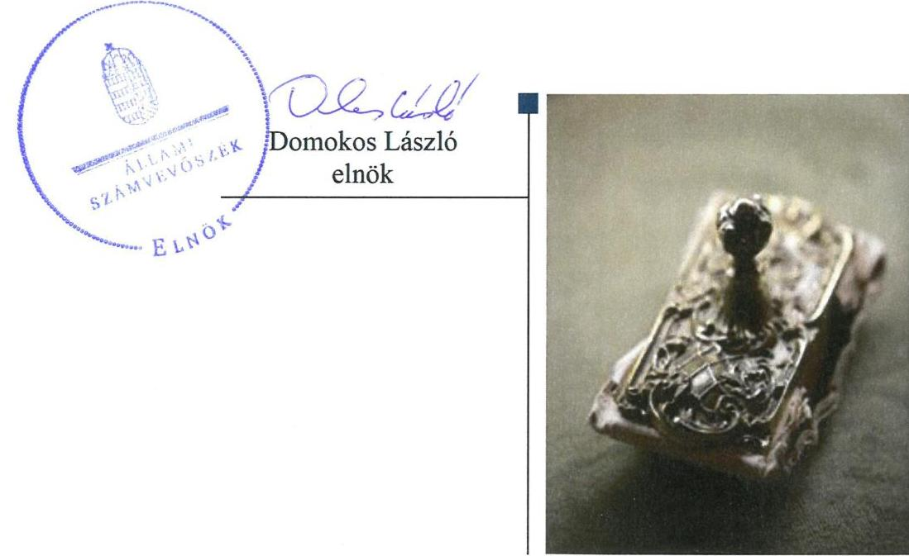
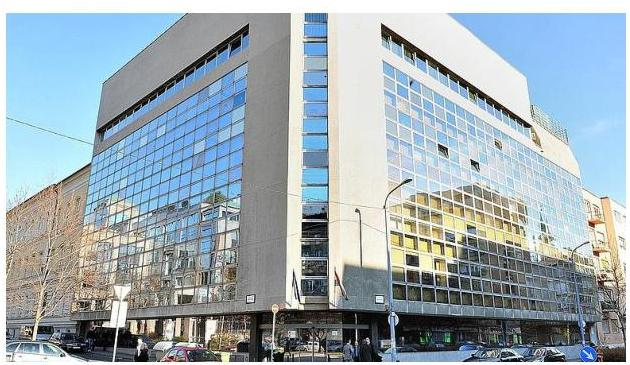
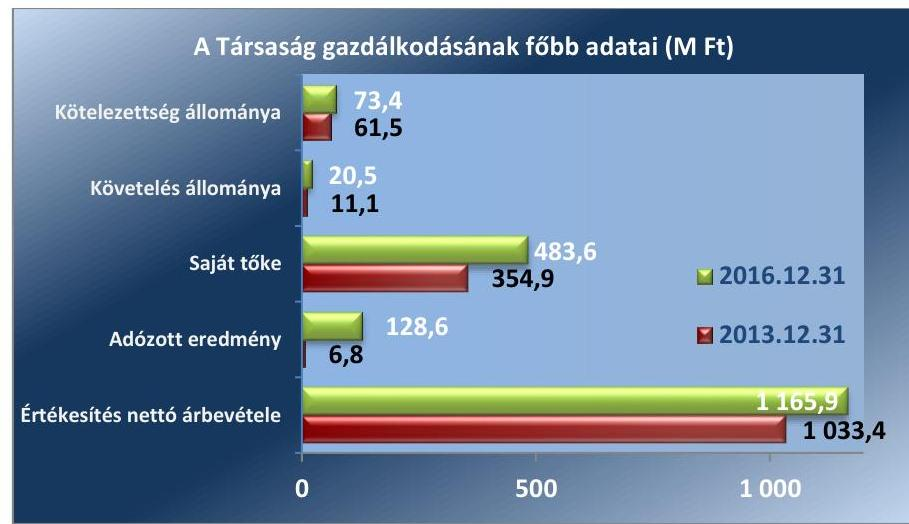
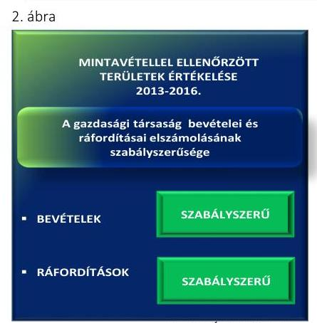

# Jelenetés 

## Az állami tulajdonú gazdasági társaságok ellenőrzése

Államadósság Kezelő Központ Zrt. 2018.

18206
www.asz.hu

---

# Jelentés 

## Az állami tulajdonú gazdasági társaságok ellenőrzése

Államadósság Kezelő Központ Zrt.
2018. 08. hó 13. nap

---

# AZ ELLENŐRZÉST FELÜGYELTE: 

PETŐ KRISZTINA felügyeleti vezető

## AZ ELLENŐRZÉST VEZETTE ÉS A VÉGREHAJTÁSÁÉRT FELELŐS:

SALI SÁNDORNÉ ellenőrzésvezető

## A PROGRAM ÖSSZEÁLLÍTÁSÁÉRT FELELŐS:

TÓTPÁL SZABOLCS osztályvezető

IKTATÓSZÁM: EL-0404-023/2018.
TÉMASZÁM: 2469

## ELLENŐRZÉS-AZONOSÍTÓ SZÁM: V081425

Jelentéseink az Országgyúlés számítógépes hálózatán és az Interneten a www.asz.hu címen is olvashatóak.

---

# TARTALOMJEGYZÉK 

■ ÖSSZEGZÉS ..... 5
■ AZ ELLENŐRZÉS CÉLJA ..... 6
■ AZ ELLENŐRZÉS TERÜLETE ..... 7
■ AZ ELLENŐRZÉS HÁTTERE, INDOKOLTSÁGA ..... 8
■ A JELENTÉS LÉNYEGES KÉRDÉSKÖREI ..... 9
■ AZ ELLENŐRZÉS HATÓKÖRE ÉS MÓDSZEREI ..... 10
■ MEGÁLLAPÍTÁSOK ..... 12
■ MELLÉKLETEK ..... 15
I. sz. melléklet: Értelmező szótár ..... 15
II. sz. melléklet: A Társaság főbb mérlegadatai ..... 16
■ FÜGGELÉK: ÉSZREVÉTELEK ..... 17
■ RÖVIDÍTÉSEK JEGYZÉKE ..... 19

---

.

---

# ÖSSZEGZÉS 

Az Államadósság Kezelő Központ Zrt. szabályozottsága, gazdálkodása és vagyongazdálkodása szabályszerű volt, így biztosították a Társaság elszámoltathatóságát és átláthatóságát. Az államháztartásért felelős miniszter Társaság feletti tulajdonosi joggyakorlása szabályszerű volt.

## Az ellenőrzés társadalmi indokoltsága

Az állami tulajdonú gazdálkodó szervezetek a nemzeti vagyon részét képezik. Gazdálkodásuk, valamint a feladatellátásuk minősége és hatékonysága a közérdeklődés figyelmének középpontjában áll. A közpénzt, közvagyont felhasználó állami tulajdonú gazdálkodó szervezetekkel szemben társadalmi igény, hogy múködésük, gazdálkodásuk szabályszerű, az általuk szolgáltatott adatok megbízhatóak legyenek. Az Állami Számvevőszék a közvagyon, a közpénzek szabályos, átlátható és elszámoltatható felhasználásának elősegítése érdekében, stratégiájával összhangban végzi az államháztartáson kívül múködő szervezetek ellenőrzését.

Az Államadósság Kezelő Központ Zrt. megfelelő múködése kiemelten fontos az adósságkezelésben, a központi költségvetés fizetőképességének megőrzésében betöltött szerepe miatt, ennek figyelembe vételével került sor ellenőrzésére.

## Főbb megállapítások, következtetések

Az Államadósság Kezelő Központ Zrt. szabályozottsága megfelelt a jogszabályi előírásoknak. A Társaság gazdálkodása és vagyongazdálkodása szabályszerű volt, ezáltal biztosított volt az elszámoltathatóság és átláthatóság. A Társaság a bevételeit és ráfordításait szabályszerűen számolta el, közérdekú adatait közzétette, a mérlegtételek beszámolóban kimutatott állományát az előírásnak megfelelően leltárral alátámasztotta.

A Nemzetgazdasági Minisztérium tulajdonosi joggyakorlása az Államadósság Kezelő Központ Zrt. felett szabályszerű volt. A tulajdonosi joggyakorló megalkotta a törvényben előírt javadalmazási szabályzatot.

---

# AZ ELLENŐRZÉS CÉLJA 

Az ellenőrzés célja annak értékelése, hogy a tulajdonosi jogok gyakorlása szabályszerű volt-e. A gazdálkodó szervezet szabályozottsága, gazdálkodása és vagyongazdálkodási tevékenysége megfelelt-e a jogszabályi és a tulajdonosi előírásoknak; biztosítva volt-e a közfeladatok átláthatósága és elszámoltathatósága érdekében a közszolgáltatás díjának megalapozottsága szabályszerű önköltségszámítással. A vagyonváltozást eredményező döntések esetében a tulajdonosi jogok gyakorlója és a gazdálkodó szervezet szabályszerűen jártak-e el. Az ellenőrzés célja továbbá annak megítélése, hogy a kormányzati szektorba sorolt állami tulajdonban (résztulajdonban) lévő gazdálkodó szervezetek gazdálkodásának a kormányzati szektor hiányára és az államadósságra befolyással bíró elemei a jogszabályi előírásoknak megfeleltek-e.

---

# AZ ELLENŐRZÉS TERÜLETE

## Az Államadósság Kezelő Központ Zártkörűen Működő Részvénytársaság és a Nemzetgazdasági Minisztérium

Az Államadósság Kezelő Központ Zrt.-t 2001. március 1. napján a Magyar Állam 300,0 M Ft¹ jegyzett tőkével alapította. A Társaság² egyszemélyes részvénytársaság, részvényeit a Magyar Állam birtokolja. A Társaságnál három tagú Igazgatóság³, valamint négy tagú FB⁴ működött. A Társaságnál a stratégia döntéseket a tulajdonosi joggyakorló⁵ és az Igazgatóság hozta meg, határozataik alapján az operatív irányítási feladatokat a vezérigazgató⁶ végezte. A tulajdonosi jogokat a Magyar Állam nevében az államháztartásért felelős miniszter gyakorolta. A Társaság tevékenységét a Stabilitási tv.⁷ szabályozta.

A tulajdonosi joggyakorló a központi költségvetés hiányának finanszírozását és a költségvetés központi alrendszere adósságának kezelését a Társaság útján látta el. Ennek megfelelően a Társaság főbb feladatai a központi költségvetés hiányának finanszírozása, fizetőképességének fenntartása, az állam átmenetileg szabad pénzeszközeinek kezelése, az állampapírok kibocsátása, valamint az adósságfinanszírozási stratégia elkészítése volt. A Társaság a lakosság felé nem állapít meg díjakat, ezért díj meghatározási kötelezettsége nem volt.

A Társaság vagyonkezelésbe vett állami vagyonnal, valamint más gazdasági társaságban részesedéssel nem rendelkezett. Jogszabályi előírás alapján könyvvizsgálatra kötelezett volt. A Társaság az ellenőrzött időszakban kormányzati szektorba sorolt szervezetként működött, a Stabilitási tv. szerinti adósságot keletkeztető ügylete nem volt. Az alapítás óta a Társaság jegyzett tőkéjének összege nem változott. A vezérigazgató személyében egy alkalommal, 2015. február 1-jével történt változás.

A Társaság gazdálkodásának főbb adatait az 1. ábra mutatja.

1. ábra

*Forrás: A Társaság 2013. és 2016 évi éves beszámolói*

---

# AZ ELLENŐRZÉS HÁTTERE, INDOKOLTSÁGA 

Az Európai Unióban 1994. év óta hatályos túlzott hiány eljárás mindig kihívást jelentett a tagállamok számára. Az állami tulajdonú gazdálkodó szervezetek ellenőrzése kiemelten fontos a vagyon megőrzése, megóvása érdekében, valamint a kormányzati szektor elszámolásaiban megjelenő állami tulajdonú gazdálkodó szervezetek esetében, amelyekkel szemben alapvető követelmény, hogy gazdálkodásuk, működésük szabályszerű, az általuk szolgáltatott adatok minél megbízhatóbbak legyenek. Gazdálkodásuk jellemzően a közérdeklődés és a média figyelmének középpontjában áll, amihez hozzájárul a gazdálkodásuk körébe tartozó - közvetlen vagy közvetett állami tulajdonú, tehát végső soron a nemzeti vagyon részét képező - vagyon nagysága, illetve az általuk ellátott közszolgáltatások/közfeladatok minősége és hatékonysága. A közszolgáltatási árképzés megalapozottsága és a rendszeres elszámoltatás feltételeinek kialakítása az ellenőrzése során nagy hangsúlyt kap. A közszolgáltatás árában és annak támogatásában meg kell jelennie az önköltségszámítás szempontjainak, amely biztosítja a működés fenntarthatóságát (eszközpótlást) is.

Az ellenőrzés rámutathat az állami tulajdonú gazdálkodó szervezetek gazdálkodási tevékenységével jó gyakorlatokra és szabálytalanságokra. Felhívhatja a figyelmet a jogszabályi követelmények teljesítéséhez szükséges feltételek hiányosságaira, hozzájárulhat az államháztartáson kívüli, de (közvetlenül vagy közvetve) állami vagyont használó gazdálkodó szervezetek tevékenységének átláthatóságához. Ellenőrzésünk eredményeképpen javaslatainkkal, megállapításainkkal hozzájárulhatunk a nemzeti vagyonnal való gazdálkodás átláthatóságának, elszámoltathatóságának javításához.

---

# A JELENTÉS LÉNYEGES KÉRDÉSKÖREI 

1. A tulajdonosi jogok gyakorlása szabályszerű volt-e?
2. A társaság szabályozottsága, gazdálkodása, vagyongazdálkodása, valamint adatszolgáltatási és ellenőrzési feladatainak ellátása szabályszerű volt-e?

---

# AZ ELLENŐRZÉS HATÓKÖRE ÉS MÓDSZEREI 

## Az ellenőrzés típusa

Megfelelőségi ellenőrzés.

## Az ellenőrzött időszak

A 2013. - 2016. évek, a 2016. évi beszámoló jóváhagyásáig tartó időszak.

## Az ellenőrzés tárgya

Állami tulajdonban (résztulajdonban) lévő gazdasági társaság gazdálkodása, kiemelten vagyongazdálkodási tevékenysége, a tulajdonosi jogok gyakorlása, továbbá a kormányzati szektorba sorolt gazdasági társaság gazdálkodásának a kormányzati szektor hiányára és az államadósságra befolyással bíró elemei.

## Az ellenőrzött szervezet

Nemzetgazdasági Minisztérium, Államadósság Kezelő Központ Zrt.

## Az ellenőrzés jogalapja

Az ellenőrzés jogalapját az ÁSZ tv. ${ }^{8}$ 1. § (3) bekezdése és 5. § (3)-(5) bekezdései képezték.

## Az ellenőrzés módszerei

Az ellenőrzést a nemzetközi standardokat irányadónak tekintve az ellenőrzési program ellenőrzési kérdései, az ellenőrzött időszakban hatályos jogszabályok, az ellenőrzés szakmai szabályok és módszertanok figyelembe vételével végeztük.

Az ellenőrzés ideje alatt az ellenőrzött szervezettel történő kapcsolattartást az ÁSZ ${ }^{9}$ Szervezeti és Müködési Szabályzatának vonatkozó előírásai alapján biztosítottuk.

Az ellenőrzésre a nemzetgazdasági szempontból kiemelt jelentőségű nemzeti vagyon körébe tartozó gazdálkodó szervezeteknél és a többségi állami tulajdonban álló gazdálkodó szervezeteknél került sor. A program szerinti feladatokat a kiválasztott gazdálkodó szervezeteknél (társaságok-

---

nál) és azok többségi tulajdonban lévő leányvállalatainál, valamint a tulajdonosi jogok gyakorlójánál kellett végrehajtani. Az ellenőrzés szempontjai és az ellenőrzés alá vont gazdálkodó szervezetek köre az ellenőrzés tapasztalatai alapján - indokolt esetben - változhatott.

A teljes ellenőrzött időszakra vonatkozóan került ellenőrzésre a gazdasági társaság tervezési, beszámolási, közzétételi, adatszolgáltatási kötelezettségének, valamint belső ellenőrzési tevékenységének szabályszerűsége. A 2013. és 2016. évekre vonatkozóan a tulajdonosi joggyakorlást, a gazdasági társaság múködésének szabályozottságát, a bevételei és ráfordításai elszámolását, illetve vagyongazdálkodásának szabályszerűségét is ellenőriztük.

A bevételek és a ráfordítások közül az anyagjellegú ráfordítások, az értékesítés nettó árbevétele, az egyéb, rendkívüli és pénzügyi műveletek ráfordításai és bevételei továbbá a személyi jellegú ráfordítások elszámolása, valamint az immateriális javak és tárgyi eszközök esetében a vagyonnyilvántartás és az értékcsökkenési leírás esetében a szabályszerű működést véletlen mintavétellel ellenőriztük.

A fenti sokaságok esetében a mintavétel azokra a legnagyobb értékű tételekre - a lényeges sokaságra - terjedt ki, amelyek összértéke eléri a teljes sokaság összértékének 50\%-át. A személyi jellegű ráfordítások esetében a mintavétel a teljes sokaságból történt. Amennyiben valamely ellenőrzött sokaság elemszáma kisebb volt, mint az előírt mintaelem szám, az ellenőrzött sokaságot tételesen ellenőriztük.

A mintavétellel ellenőrzött területek esetében minden egyes tétel vonatkozásában a szabályszerűségre vonatkozó kérdéseket tettünk fel, amelyek eredménye összesítésre került. „Szabályszerűnek" értékeltünk egy ellenőrzött területet, amennyiben 95\%-os bizonyossággal az ellenőrzött sokaságban az átlagos hibaarány legfeljebb 10\%, „nem szabályszerűnek", amennyiben 10\%-nál magasabb arányt képviselt.

Az ellenőrzési kérdések megválaszolásához szükséges bizonyítékok megszerzése a következő ellenőrzési eljárások alkalmazásával történt: megfigyelés, kérdésfeltevés (információkérés), összehasonlítás, valamint elemző eljárás. Az ellenőrzési bizonyítékként felhasználható adatforrások közé tartoztak egyrészt az ellenőrzési programban felsorolt adatforrások, másrészt adatforrás lehet még minden - az ellenőrzés folyamán - feltárt, az ellenőrzés szempontjából információkat tartalmazó dokumentum.

Az ellenőrzést a kérdésekre adott válaszok kiértékelésével, valamint a megjelölt adatforrások, a csatolt tanúsítványok felhasználásával, továbbá az adott időszakban hatályos jogszabályok figyelembe vételével kellett lefolytatni.

---

# 1. A tulajdonosi jogok gyakorlása szabályszerű volt-e? 

## Összegző megállapítás

A Társaság felett a tulajdonosi joggyakorlás szabályszerű volt.

A tulajdonosi joggyakorló a tulajdonosi joggyakorlás szabályait az NGM SZMSZ ${ }^{10}$-ben és a Társaság Alapító okirat ${ }^{11}$-ában - a Gt. ${ }^{12}$ és Ptk. ${ }^{13}$ előírásaival összhangban - alakította ki. A tulajdonosi joggyakorló döntött az Igazgatóság, a FB és a könyvvizsgáló megválasztásáról. A tulajdonosi joggyakorló az Alapító okiratban az Igazgatóság és a FB tagjainak a számát a Taktv. ${ }^{14}$ előírásainak megfelelően határozta meg.

A tulajdonosi joggyakorló a FB által az Igazgatóságot a Társaság gazdálkodásáról és feladatellátásról az Alapító okiratban foglaltak szerint rendszeresen beszámoltatta. A Társaság éves beszámolóinak az elfogadásáról a könyvvizsgálói záradék és a FB írásbeli véleménye alapján - a tulajdonosi joggyakorló határozott. A Társaság az ellenőrzött években nyereségesen gazdálkodott, a tulajdonosi joggyakorló az adózott eredményének felhasználásáról, az osztalék kifizetéséről szabályszerűen döntött.

A tulajdonosi joggyakorló a Társaság javadalmazási szabályzatát a Taktv.-ben foglaltaknak megfelelően megalkotta, rendelkezési megfeleltek az előírásnak.

## 2. A társaság szabályozottsága, gazdálkodása, vagyongazdálkodása, valamint adatszolgáltatási és ellenőrzési feladatainak ellátása szabályszerű volt-e?

## Összegző megállapítás

A Társaság szabályozottsága megfelelt a jogszabályi előírásoknak. A gazdálkodás és vagyongazdálkodás szabályszerű volt. A Társaság beszámolási és adatszolgáltatási kötelezettségének eleget tett.

Forrás: ÁsZ értékelése

A Társaság rendelkezett az ÁKK SZMSZ ${ }^{15}$-szel és a Számv. tv. ${ }^{16}$-ben előírt szabályzatokkal. A Számviteli politika ${ }^{17}$ és az annak keretében kiadott számviteli szabályzatok a jogszabályi előírásoknak megfeleltek.

A BEVÉTELEK ÉS RÁFORDÍTÁSOK elszámolása szabályszerű volt. A Társaság gazdálkodásának a kormányzati szektor hiányára befolyással bíró elemei elszámolása megfelelt a jogszabályi előírásoknak. A mintavétellel ellenőrzött területek értékelését az 2. ábra mutatja.

A BESZÁMOLÁSI, ADATSZOLGÁLTATÁSI kötelezettségének szabályszerűen eleget tett. A Társaság a tulajdonosi joggyakorló által az Alapító okiratban és az ÁKK SZMSZ-ben előírt beszámolási, adatszolgál-

---

tatási feladatokat teljesítette. Az éves beszámolókat a Számv. tv. előírásainak megfelelően elkészítette, a tulajdonosi joggyakorló jóváhagyását követően határidőben letétbe helyezte és közzétette. A Társaság a kormányzati szektorba tartozó szervezetekre vonatkozó - 2014. december 31-éig az Ávr. ${ }^{18}$ 7. számú mellékletében, 2015. január 1-jétől az 5. számú mellékletben előírtak szerinti - adatszolgáltatási kötelezettségét szabályszerűen teljesítette.

Az Info tv. ${ }^{19}$-ben és a Taktv-ben meghatározott közzétételi kötelezettségének a Társaság eleget tett, biztosítva a jogszabályokban előírt közérdekű adatok nyilvánosságát.

A VAGYONGAZDÁLKODÁS szabályszerű volt a Társaságnál. A vagyongazdálkodással kapcsolatos jogosultsági és döntési szintek, a felelősségi, a feladat-és hatáskörök az Alapító okiratban, valamint az ÁKK SZMSZ-ben szabályszerűen kialakításra kerültek. A tulajdonosi joggyakorló a Társaság fejlesztési elképzeléseit tartalmazó üzleti terveit az Alapító okirat rendelkezéseinek megfelelően jóváhagyta.

A Társaságnál a tárgyi eszközök állományba vétele, nyilvántartása és elszámolása megfelelt a Számv. tv. és a belső szabályozás előírásainak. A vagyonnyilvántartás biztosította a vagyonban bekövetkezett változások folyamatos nyomon követését.

A Társaság a 2013-2016. években az éves beszámolókban a számviteli nyilvántartásaiban levő vagyontárgyak állományát - a Számv. tv.-ben és a Leltározási Szabályzat ${ }^{20}{ }_{1-2}$-ben foglaltak szerint - szabályszerű leltárral alátámasztotta.

A vagyonváltozást eredményező döntések előkészítése, megalapozása és végrehajtása megfelelt a jogszabály, valamint a tulajdonosi joggyakorló által meghatározott előírásnak és a belső szabályozásnak.

---

.

---

# MELLÉKLETEK 

## I. SZ. MELLÉKLET: ÉRTELMEZŐ SZÓTÁR

állami vagyon
gazdasági társaság
gazdálkodó szervezet
kormányzati szektorba sorolt egyéb szervezet
tulajdonosi jogok gyakorlója
a) Az állam tulajdonában lévő dolog, valamint a dolog módjára hasznosítható természeti erő,
b) az a) pont hatálya alá nem tartozó mindazon vagyon, amely vonatkozásában törvény az állam kizárólagos tulajdonjogát nevesíti,
c) az állam tulajdonában lévő tagsági jogviszonyt megtestesítő értékpapír, illetve az államot megillető egyéb társasági részesedés,
d) az államot megillető olyan immateriális, vagyoni értékkel rendelkező jogosultság, amelyet jogszabály vagyoni értékű jogként nevesít.
Forrás: Vtv. ${ }^{21}$ 1. § (2) bekezdése
e) az állam tulajdonában lévő pénzügyi eszközök
Forrás: Vtv. 1. § (2) bekezdése
A Ptk. 3 3:88. § (1) bekezdése szerint „a gazdasági társaságok üzletszerű közös gazdasági tevékenység folytatására, a tagok vagyoni hozzájárulásával létrehozott, jogi személyiséggel rendelkező vállalkozások, amelyekben a tagok a nyereségből közösen részesednek, és a veszteséget közösen viselik".
2014. március 14-ig:

A Ptk. ${ }^{22}$ 685. § c) pontja szerint gazdálkodó szervezet: „az állami vállalat, az egyéb állami gazdálkodó szerv, a szövetkezet, a lakásszövetkezet, az európai szövetkezet, a gazdasági társaság, az európai részvénytársaság, az egyesülés, az európai gazdasági egyesülés, az európai területi együttműködési csoportosulás, az egyes jogi személyek vállalata, a leányvállalat, a vízgazdálkodási társulat, az erdő birtokossági társulat, a végrehajtói iroda, az egyéni cég, továbbá az egyéni vállalkozó."
2014. március 15 -től:

A gazdasági társaság, az európai részvénytársaság, az egyesülés, az európai gazdasági egyesülés, az európai területi együttműködési csoportosulás, a szövetkezet, a lakásszövetkezet, az európai szövetkezet, a vízgazdálkodási társulat, az erdőbirtokossági társulat, az állami vállalat, az egyéb állami gazdálkodó szerv, az egyes jogi személyek vállalata, a közös vállalat, a végrehajtói iroda, a közjegyzői iroda, az ügyvédi iroda, a szabadalmi ügyvivői iroda, az önkéntes kölcsönös biztosító pénztár, a magánnyugdíjpénztár, az egyéni cég, továbbá az egyéni vállalkozó. Az állam, a helyi önkormányzat, a költségvetési szerv, az egyesület, a köztestület, valamint az alapítvány gazdálkodó tevékenységével összefüggő polgári jogi kapcsolataira is a gazdálkodó szervezetre vonatkozó rendelkezéseket kell alkalmazni.
Forrás: Ppt. ${ }^{23}$ 396. §
Az a szervezet, amely az Áht. alapján nem része az államháztartásnak, azonban az Európai Közösséget létrehozó szerződéshez csatolt, a túlzott hiány esetén követendő eljárásról szóló jegyzőkönyv alkalmazásáról szóló 2009. május 25-i 479/2009/EK rendelet szerint a kormányzati szektorba tartozik. A nemzetgazdasági miniszter 2013. június 26-án megjelent Közleményben tette közé ezen szervezetek listáját
Az ÁKK Zrt. tulajdonosa a magyar állam, amelynek nevében az alapításhoz és a tulajdonosi jogok gyakorlásához kapcsolódó jogokat az államháztartásért felelős miniszter gyakorolja azzal, hogy az igazgatóság jogkörét nem vonhatja el.
Forrás: Stabilitási tv. 11. § (3) bekezdés

---

II. SZ. MELLÉKLET: A TÁRSASÁG FŐBB MÉRLEGADATAI

|  AZ ÁKK ZRT. MÉRLEGEINEK KIEMELT ADATAI (M FT) |  |  |  |   |
| --- | --- | --- | --- | --- |
|  Megnevezés / időszak | 2013.12.31. | 2014.12.31. | 2015.12.31. | 2016.12.31.  |
|  I. Befektetett eszközök | 88,0 | 80,9 | 75,7 | 97,7  |
|  ebből: tárgyi eszközök | 58,5 | 48,9 | 47,1 | 54,7  |
|  II. Forgóeszközök | 313,8 | 389,1 | 379,0 | 465,3  |
|  ebből: követelések | 11,1 | 4,4 | 12,3 | 20,5  |
|  ebből: pénzeszközök | 302,7 | 384,7 | 366,7 | 444,7  |
|  III. Aktív időbeli elhatárolások | 27,1 | 22,5 | 73,7 | 10,5  |
|  ESZKÖZÖK ÖSSZESEN | 428,9 | 492,6 | 528,4 | 573,4  |
|  IV. Saját tőke | 354,9 | 354,9 | 397,8 | 483,6  |
|  ebből: jegyzett tőke | 300,0 | 300,0 | 300,0 | 300,0  |
|  ebből: Adózott eredmény | 6,8 | 69,1 | 42,9 | 128,6  |
|  V. Céltartalékok | - | - | 45,7 | -  |
|  VI. Kötelezettségek | 61,5 | 127,4 | 76,5 | 73,4  |
|  VII. Passzív időbeli elhatárolások | 12,5 | 10,3 | 8,4 | 16,5  |
|  FORRÁSOK ÖSSZESEN | 428,9 | 492,6 | 528,4 | 573,4  |

Fonrás: a Társaság éves beszámolói

---

# FÜGGELÉK: ÉSZREVÉTELEK 

A jelentéstervezetet a Számvevőszék 15 napos észrevételezésre megküldte az ellenőrzött szervezetek vezetőinek az ÁSZ tv. 29. §* (1) bekezdése előírásának megfelelően.

Az Államadósság Kezelő Központ Zrt. vezérigazgatója és a Pénzügyminisztérium, mint tulajdonosi joggyakorló nem élt észrevételezési jogával.

[^0]
[^0]:    * 29. § (1) Az Állami Számvevőszék az ellenőrzési megállapításait megküldi az ellenőrzött szervezet vezetőjének vagy az általa megbízott személynek, és annak, akinek személyes felelősségét állapította meg.
    (2) Az ellenőrzött szervezet vezetője és a felelősként megjelölt személy az ellenőrzés megállapításaira tizenöt napon belül írásban észrevételt tehet.
    (3) Az Állami Számvevőszék az észrevételre a beérkezésétől számított harminc napon belül írásban válaszol. A figyelembe nem vett észrevételeket köteles a jelentésben feltüntetni, és megindokolni, hogy azokat miért nem fogadta el.

---

.

---

# RÖVIDÍTÉSEK JEGYZÉKE 

${ }^{1} \mathrm{M} \mathrm{Ft}$
${ }^{2}$ Társaság/ÁKK Zrt.
${ }^{3}$ Igazgatóság
${ }^{4} \mathrm{FB}$
${ }^{5}$ tulajdonosi joggyakorló
${ }^{6}$ vezérigazgató
${ }^{7}$ Stabilitási tv.
${ }^{8}$ ÁSZ tv.
${ }^{9}$ ÁSZ
${ }^{10}$ NGM SZMSZ
${ }^{11}$ Alapító okirat
${ }^{12} \mathrm{Gt}$.
${ }^{13}$ Ptk. 2
${ }^{14}$ Taktv.
${ }^{15}$ ÁKK SZMSZ
${ }^{16}$ Számv. tv.
${ }^{17}$ Számviteli politika
${ }^{18}$ Ávr.
${ }^{19}$ Info tv.
${ }^{20}$ Leltározási Szabályzat 1
Leltározási szabályzat 2
${ }^{21}$ Vtv.
${ }^{22}$ Ptk. 1
${ }^{23} \mathrm{Ppt}$.
millió Ft
Államadósság Kezelő Központ Zártkörűen Működő Részvénytársaság
Az Államadósság Kezelő Központ Zártkörűen Működő Részvénytársaság Igazgatósága
Az Államadósság Kezelő Központ Zrt. felügyelőbizottsága
A Magyar Állam nevében eljáró államháztartásért felelős miniszter, Nemzetgazdasági Minisztérium
Az Államadósság Kezelő Központ Zártkörűen Működő Részvénytársaság vezérigazgatója
Magyarország gazdasági stabilitásáról szóló 2011. évi CXCIV. törvény (hatályos: 2011. december 30-ától)

Az Állami Számvevőszékről szóló 2011. évi LXVI. törvény (hatályos: 2011. július 1-jétől)
Állami Számvevőszék
A Nemzetgazdasági Minisztérium Szervezeti és Működési Szabályzatáról szóló 4/2010. (X. 5.) számú NGM utasítás és módosításai
Államadósság Kezelő Központ Zártkörűen Működő Részvénytársaság Alapító Okirata és módosításai (hatályos: 2012. december 27-étől)
A gazdasági társaságokról szóló 2006. évi IV. törvény (hatálytalan: 2014. március 15-étől)
A Polgári Törvénykönyvről szóló 2013. évi V. törvény (hatályos: 2014. március 15-étől)
A köztulajdonban álló gazdasági társaságok takarékosabb müködéséről szóló 2009. évi CXXII. törvény (hatályos: 2009. december 4-étől)
Az Államadósság Kezelő Központ Zrt. hatályos Szervezeti és Müködési Szabályzata és módosításai (hatályos: 2012. november 20-ától)
A számvitelről szóló 2000. évi C. törvény (hatályos: 2001. január 1-jétől)
Az Államadósság Kezelő Központ Zrt. Számviteli politikája és módosításai (hatályos: 2004. január 1-jétől)
Az államháztartási törvény végrehajtásáról szóló 368/2011. (XII. 31.) Korm. rendelet (hatályos: 2012. január 1-jétől)
Az információs önrendelkezési jogról és az információszabadságról szóló 2011. évi CXII. törvény (hatályos: 2012. január 1-jétől)
Az Államadósság Kezelő Központ Zrt. Leltározási szabályzata (hatályos: 2003. január 1-jétől)
Az Államadósság Kezelő Központ Zrt. hatályos leltározási szabályzata (hatályos: 2016. szeptember 1-2016. december 31. között)

Az állami vagyonról szóló 2007. évi CVI. törvény (hatályos: 2007. szeptember 25-étől)
A Polgári Törvénykönyvről szóló 1959. évi IV. törvény (hatálytalan: 2014. március 15-étől)
A polgári perrendtartásról szóló 1952. évi III. törvény (hatályos: 1953. január 1-jétől)

---

# ÁLLAMI SZÁMVEVŐSZÉK 

1052 Budapest, Apáczai Csere János utca 10.
Levélcím: 1364 Budapest 4. Pf. 54
Telefon: +36 14849100 Telefax: +36 14849200
www.asz.hu