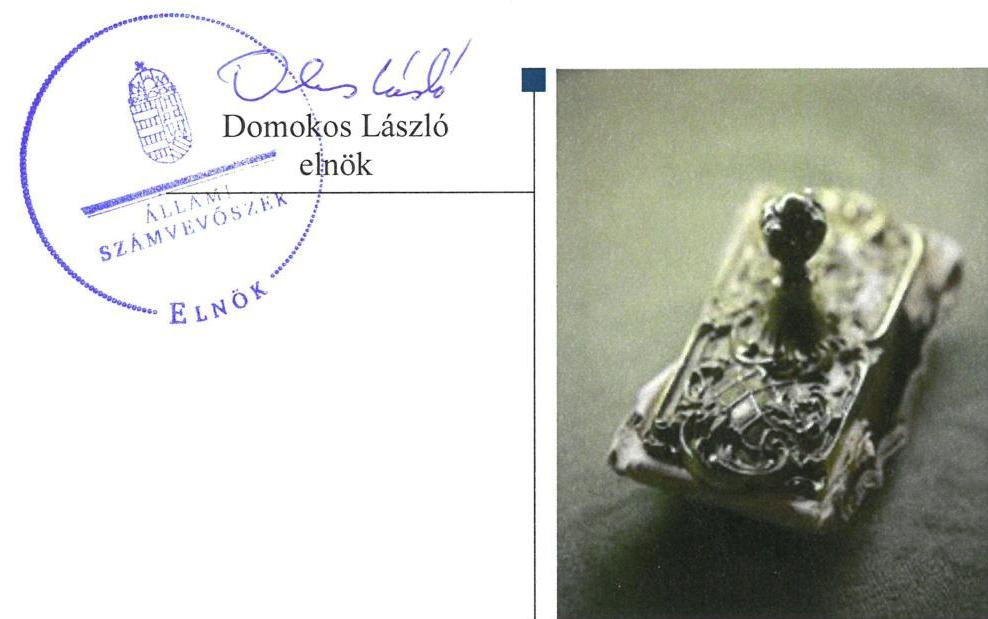
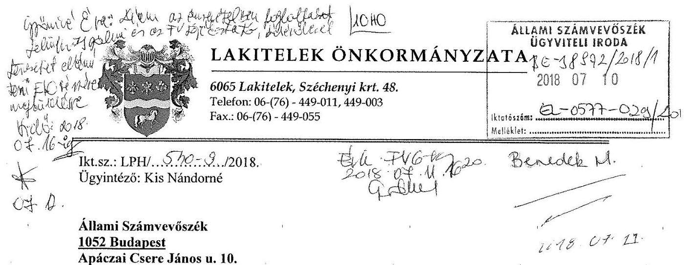
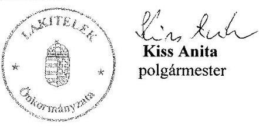
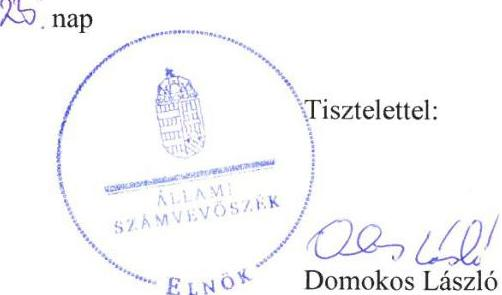

ÁLLAMI
SZÁMVEVŐSZÉK

# Jelentés 

## Önkormányzatok pénzügyi és vagyongazdálkodása megfelelőségének ellenőrzése

Lakitelek Önkormányzata 2018.

---

# Jelențtés 

## Önkormányzatok pénzügyi és vagyongazdálkodása megfelelőségének ellenőrzése

Lakitelek Önkormányzata
2018. 02. hó 02. nap

---

# AZ ELLENŐRZÉST FELÜGYELTE:

DR. BENEDEK MÁRIA felügyeleti vezető

## AZ ELLENŐRZÉST VEZETTE ÉS A VÉGREHAJTÁSÁÉRT FELELŐS:

DR. TIMÁR BALÁZS ellenőrzésvezető

## A PROGRAM ÖSSZEÁLLÍTÁSÁÉRT FELELŐS:

TÓTPÁL SZABOLCS osztályvezető

IKTATÓSZÁM: EL-0577-031/2018

TÉMASZÁM: 15

ELLENŐRZÉS-AZONOSÍTÓ SZÁM: V079606

Jelentéseink az Országgyűlés számítógépes hálózatán és az Interneta a www.asz.hu címen is olvashatóak.

---

# TARTALOMJEGYZÉK 

■ ÖSSZEGZÉS ..... 5
■ AZ ELLENŐRZÉS CÉLJA ..... 7
■ AZ ELLENŐRZÉS TERÜLETE ..... 8
■ AZ ELLENŐRZÉS HÁTTERE, INDOKOLTSÁGA ..... 9
■ A JELENTÉS LÉNYEGES KÉRDÉSKÖREI ..... 10
■ AZ ELLENŐRZÉS HATÓKÖRE ÉS MÓDSZEREI ..... 11
■ MEGÁLLAPÍTÁSOK ..... 13
■ JAVASLATOK ..... 20
■ MELLÉKLETEK ..... 23
I. sz. melléklet: Értelmező szótár ..... 23
■ FÜGGELÉK: ÉSZREVÉTELEK ..... 27
■ RÖVIDÍTÉSEK JEGYZÉKE ..... 43

---

.

---

# ÖSSZEGZÉS 

Az Állami Számvevőszék Lakitelek Önkormányzata pénzügyi és vagyongazdálkodásának ellenőrzése során megállapította, hogy a közpénzekkel való szabályszerű és átlátható gazdálkodás a 2014-2016. években nem volt biztosított. Az éves beszámolók mérlegeinek leltárral való alátámasztása nem történt meg, ezáltal a mérlegvalódiság sérült. A gazdasági társaságokban meglévő részesedések feletti tulajdonosi joggyakorlás nem a jogszabályi előírásoknak megfelelően történt. A kiépített integritás kontrollok nem voltak egyensúlyban a korrupciós kockázatok szintjével.

## Az ellenőrzés társadalmi indokoltsága

Az Állami Számvevőszék (ÁSZ) stratégiájában hangsúlyos szerepet szán annak, hogy szilárd szakmai alapon álló, értékteremtő ellenőrzéseivel előmozdítsa a közpénzügyek átláthatóságát, rendezettségét és javaslataival a közpénzek és a közvagyon szabályos, gazdaságos, hatékony és eredményes felhasználását segítse. Az ÁSZ stratégiájában célul tűzte ki, hogy az önkormányzatok ellenőrzése során értékeli azok pénzügyi-gazdasági helyzetét, a kockázatokat feltárja, és az ellenőrzések helyszíneit kockázatelemzés alapján választja ki. Az ÁSZ szerepet vállal a korrupció és a csalás elleni küzdelemben. Közreműködik a korrupciós kockázatok és a korrupció elleni fellépés hatékony és eredményes eszközeinek beazonosításában, alkalmazásában, továbbá használatuk elterjesztésében, az integritás alapú közigazgatási kultúra kialakításában.

## Főbb megállapítások, következtetések, javaslatok

A Jegyző a 2014-2015. években nem alakította ki Lakitelek Önkormányzata, valamint a Lakiteleki Polgármesteri Hivatal intézményeinek számviteli rendjét, továbbá a gazdálkodási jogkörök gyakorlására vonatkozó belső szabályozást, ezáltal a 2014-2015. években a pénzgazdálkodás számviteli elszámolásának szabályszerűsége és az önkormányzati közpénzekkel való gazdálkodás szabályossága, átláthatósága nem volt biztosított. A Jegyző a 2016. évre a Lakiteleki Polgármesteri Hivatal, valamint Lakitelek Önkormányzata intézményei számviteli rendjét és a gazdálkodási jogkörök gyakorlásának szabályozását kialakította.

Lakitelek Önkormányzatának Képviselő-testülete az Önkormányzat tulajdonában lévő nemzeti vagyonnal való gazdálkodás szabályait a jogszabályi előírások szerinti tartalommal fogadta el. A vagyonnyilvántartás az ellenőrzött időszakban nem felelt meg a jogszabályi előírásoknak, továbbá a Jegyző a 2014-2016. években nem gondoskodott az éves költségvetési beszámolók elkészítéséhez, a mérlegek tételeinek alátámasztásához leltár összeállításáról, ezáltal a mérlegben szereplő eszközöknek és forrásoknak a valóságnak megfelelő értéken történő bemutatása nem volt biztosított. A Jegyző az ingatlanvagyon-kataszter és a közhiteles ingatlan-nyilvántartás adatainak egyezőségét nem biztosította. Az ingatlan beszerzést, létesítést illetve ingatlan értékesítést követően a változások ingatlanvagyon-kataszterben történő átvezetéséről a jogszabályban előírt határidőn belül nem gondoskodott.

Lakitelek Önkormányzatának többségi tulajdonában álló gazdasági társaságok feletti tulajdonosi jogok gyakorlása és a tulajdonosi kötelezettségek teljesítése nem volt megfelelő, mivel a közfeladatot ellátó Laki-Gazda Hulladékgazdálkodási Nonprofit Korlátolt Felelősségű Társaság saját tőkéje a 2014-2015. években - annak veszteséges gazdálkodása miatt - a korlátolt felelősségű társaságokra jogszabályban előírt legkisebb jegyzett tőke szintje alá csökkent, Lakitelek Önkormányzata azonban a jogszabályban előírt határidőn belül nem gondoskodott a szükséges saját tőke pótlásáról. Fennállt annak veszélye, hogy a jogszabályban előírt kötelező önkormányzati közfeladat ellátatlan marad.

Lakitelek Önkormányzata az integritás alapú működést nem alakította ki, a kiépített kontrollok nem voltak egyensúlyban a korrupciós veszélyekkel.

---

Az ellenőrzés intézkedések megtétele céljából a Polgármester részére öt, a Jegyző részére tizenegy javaslatot fogalmazott meg.

---

# AZ ELLENŐRZÉS CÉLJA 

Az ellenőrzés célja az önkormányzat pénzügyi és vagyoni helyzetének, a gazdálkodás szabályosságának értékelése volt, a pénzügyi egyensúly megteremtése, a vagyongazdálkodás, a vagyon számbavétele, a gazdasági események elszámolása és a pénzgazdálkodás szabályszerűsége alapján. Az ellenőrzés keretében az Állami Számvevőszék értékelte az önkormányzat korrupciós kockázatainak kezelését szolgáló integritás kontrollok kiépítettségét és az integritás szemlélet érvényesülését.

---

# **AZ ELLENŐRZÉS TERÜLETE**

## **Lakitelek Önkormányzata**

Lakitelek Önkormányzata Bács-Kiskun megyében, a tiszakécskei járásban található. A Központi Statisztikai Hivatal Magyarország közigazgatási helynévkönyve adata alapján Lakitelek Község állandó lakosainak száma 2016. január 1-jén 4406 fő volt.

A hét fővel működő Képviselő-testület munkáját az ellenőrzött időszakban három állandó bizottság támogatta. Lakitelek Önkormányzata feladatait Polgármesteri Hivatalával és négy költségvetési szervvel látta el. A Lakiteleki Polgármesteri Hivatal gazdasági szervezettel nem rendelkezett. Lakitelek Önkormányzatának hét 100 %-os tulajdoni hányadú gazdasági társasága volt, melyek hulladékgazdálkodási, közterület-fenntartási közvilágítási, közétkeztetési közfeladatok ellátásában vettek részt. Ezeken kívül Lakitelek Önkormányzata két gazdasági társaságban rendelkezett kisebbségi részesedéssel.

Lakitelek Önkormányzatának polgármestere a 2014. évi általános önkormányzati választások óta tölti be tisztségét, a Lakiteleki Polgármesteri Hivatal Jegyzője 2015. áprilisától látja el feladatait.

Lakitelek Önkormányzata 2016. évi összevont költségvetési beszámolója szerint 1349,5 millió Ft költségvetési bevételt ért el, valamint 1226,3 millió Ft költségvetési kiadást teljesített. A 2016. évi összevont költségvetési beszámoló mérlegében kimutatott eszközvagyon értéke 4125,1 millió Ft volt. 2016. december 31-én a követelések állománya 90,2 millió Ft-ot, a kötelezettségek érteke 37,0 millió Ft-ot tett ki. A 2014-2016. években adósságot keletkeztető ügyletet Lakitelek Önkormányzata nem vállalt.

---

# AZ ELLENŐRZÉS HÁTTERE, INDOKOLTSÁGA 

Az államháztartás önkormányzati alrendszerének közpénz felhasználása, az önkormányzatok által ellátott közfeladatok és önként vállalt feladatok sokrétűsége, valamint a feladat ellátásához rendelt vagyon nagyságrendje indokolja, hogy az ÁSZ ${ }^{1}$ ellenőrzéseket folytasson a pénzügyi és vagyongazdálkodás területén. Az ÁSZ folyamatosan végzi az önkormányzatok pénzügyi és vagyongazdálkodásának ellenőrzését. Az elmúlt időszakban az önkormányzati gazdálkodás kockázatai beépítésre kerültek az ellenőrzött önkormányzatok kiválasztási rendszerébe. Az ellenőrzések tapasztalatai megmutatták, hogy továbbra is indokolt az egyrészt elemző, értékelő, a pénzügyi helyzet kockázatát is minősítő, másrészt a pénzügyi és vagyongazdálkodási tevékenység szabályszerűségét értékelő ÁSZ ellenőrzések folytatása.

Az ÁSZ ellenőrzései hozzájárulnak az önkormányzatok felelős és fenntartható gazdálkodásához, pénzügyi helyzetének pontosabb megítéléséhez azáltal, hogy a pénzügyi helyzetet a vagyoni helyzettel együtt értékeljük. Feltárjuk az önkormányzati gazdálkodást meghatározó szabályozások hiányosságait, a szabályozással nem érintett gazdálkodási területeket, valamint a pénzügyi és vagyongazdálkodás esetleges szabálytalanságait. Beazonosítjuk a pénzügyi egyensúlyi helyzet megbomlásának kockázatait. Értékeljük a pénzügyi egyensúly érvényesülését, az adósságállomány alakulását.

A pénzügyi és vagyongazdálkodás szabályszerűségének ellenőrzése eredményeként tett megállapítások, javaslatok hasznosításával javul az önkormányzat gazdálkodásának szabályozottsága, valamint a „jó gyakorlatok" terjesztésén keresztül azok az önkormányzatok is átvehetik a pozitív példákat, ahol nem végez ellenőrzést az ÁSZ. Ellenőrzéseink eredményeképpen javaslatokat fogalmazhatunk meg az önkormányzatok pénzügyi egyensúlya fenntartásával kapcsolatos problémák rendszerszemléletű kezelésére, felszámolására.

---

# A JELENTÉS LÉNYEGES KÉRDÉSKÖREI 

1.     - A pénzügyi és vagyongazdálkodás szabályainak kialakítása szabályszerű volt-e?
2.     - A vagyonnyilvántartás, a költségvetési beszámoló mérlegének alátámasztottsága szabályszerű volt-e?
3.     - A vagyonváltozást eredményező döntések és azok végrehajtása, a gazdálkodási jogkörök gyakorlása szabályszerű volt-e?
4.     - Az egyes befektetésekkel kapcsolatos döntéshozatal és azok végrehajtása szabályszerű volt-e?
5.     - Felelősen gazdálkodott-e az önkormányzat a tartós részesedéseivel, élt-e tulajdonosi jogaival, teljesítette-e tulajdonosi kötelezettségeit?
6.     - Az önkormányzat az integritás müködést kialakította és erősitette-e?

---

# AZ ELLENŐRZÉS HATÓKÖRE ÉS MÓDSZEREI 

## Az ellenőrzés típusa

Megfelelőségi ellenőrzés.

## Az ellenőrzött időszak

A 2014-2016. évek.

## Az ellenőrzés tárgya

A helyi önkormányzat pénzügyi és vagyongazdálkodása, a pénzügyi egyensúly megteremtése, a tulajdonosi és irányító szervi feladatok ellátása, az integritás szemlélet érvényesülése.

Az ellenőrzés kiterjedt minden olyan körülményre és adatra, amely az ÁSZ jogszabályban meghatározott feladatainak teljesítéséhez, valamint a program végrehajtása folyamán felmerült újabb összefüggések feltárásához szükséges.

## Az ellenőrzött szervezet

Lakitelek Önkormányzata

## Az ellenőrzés jogalapja

Az ellenőrzés jogszabályi alapját az ÁSZ tv. ${ }^{2}$ 1. § (3) bekezdésének, az 5. § (2)-(6) bekezdéseinek, valamint az Áht. 61. § (2) bekezdésének előírásai képezték.

## Az ellenőrzés módszerei

Az ÁSZ az ellenőrzést az ellenőrzési program ellenőrzési kérdései, az ellenőrzött időszakban hatályos jogszabályok, az ellenőrzés szakmai szabályok és az ÁSZ módszertanok figyelembe vételével végezte.

A gazdálkodás hibáinak kijavítására, a közpénzekkel való felelős gazdálkodás segítésére irányuló javaslatok kidolgozásakor a hatályos jogszabályok voltak irányadóak.

Az ÁSZ az ellenőrzés ideje alatt az ellenőrzött szervezettel történő kapcsolattartást az ÁSZ SZMSZ²-ének vonatkozó előírásai alapján biztosította.

---

Az ellenőrzési kérdések megválaszolásához szükséges bizonyítékok megszerzése az ellenőrzött által rendelkezésre bocsátott dokumentumokra, adatokra alapozva megfigyelés, szemle (szemrevételezés), kérdésfeltevés (információkérés), mintavételezés, valamint elemző eljárással történt.

Az ellenőrzés lefolytatásához az önkormányzat a tanúsítványok kitöltésével, valamint az ÁSZ által kért dokumentumok megküldésével szolgáltatott adatokat. Az így rendelkezésre bocsátott adatok, információk, a tanúsítványok adatai valódiságának kontrollja az ellenőrzés keretében történt.

Az ÁSZ az ellenőrzést az önkormányzat múködésével kapcsolatos feladatokat ellátó polgármesteri hivatalnál végezte. Az önkormányzat az intézményei és gazdasági társaságai ellenőrzéssel érintett dokumentumait, tanúsítványait a polgármesteri hivatal útján bocsátotta az ellenőrzés rendelkezésére.

A pénzügyi és vagyongazdálkodás szabályozottságát az ÁSZ az önkormányzat rendeletei, határozatai, illetve az önkormányzat (mint önálló éves költségvetési beszámolót készítő szerv) és a polgármesteri hivatal belső szabályozásai alapján értékelte. A pénzügyi egyensúly az önkormányzat összevont adatai alapján, a vagyonnyilvántartás, a mérleg alátámasztottságának megítélése az önkormányzat és a polgármesteri hivatal adatai alapján történt. A leltározási, értékelési folyamat szabályszerűségére a polgármesteri hivatal által végzett 2016. évi leltározási folyamat ellenőrzése alapján tett megállapításokat az ÁSZ.

Az önkormányzat vagyonváltozást eredményező döntéseinek és azok végrehajtásának ellenőrzésére irányított, valamint véletlen mintavételi eljárással és tételes ellenőrzéssel került sor. A pénzforgalmi tételek ellenőrzése véletlen mintavételi eljárással - a polgármesteri hivatal (mint önálló éves költségvetési beszámolót készítő költségvetési szerv) és az önkormányzat főkönyvi állományából - kiválasztott minta alapján történt.

Az ellenőrzési kérdésekre adott válaszok alapján értékelte az ÁSZ, hogy az önkormányzat pénzügyi gazdálkodása szabályszerű volt-e, biztosított volt-e a pénzügyi egyensúly. Értékelte a vagyongazdálkodás szabályszerűségét, a vagyonváltozást eredményező döntések és a tulajdonosi jogok gyakorlása szabályszerűségét. Értékelte továbbá az integritás érvényesülését.

---

# 1. A pénzügyi és vagyongazdálkodás szabályainak kialakítása szabályszerű volt-e? 

## Összegző megállapítás

A pénzügyi és vagyongazdálkodás szabályainak kialakítása nem volt szabályszerű.

Az ellenőrzött időszakban hatályos Önkormányzati SZMSZ ${ }^{4}$ és a Hivatali SZMSZ ${ }^{5}$ az Mötv. ${ }^{6}$, illetve az Ávr. ${ }^{7}$ rendelkezéseit figyelembe véve került elkészítésre.

A Képviselő-testület ${ }^{8}$ a Htv.-ben biztosított hatáskörében a vagyonrendelet ${ }^{9}$ ben fogadta el Önkormányzat ${ }^{10}$ vagyonával történő gazdálkodás szabályait, ezzel biztosították az Mótv. előírásait.

Az Önkormányzat az Nvtv. ${ }^{11}$ 9. § (1) bekezdésében foglaltak betartása mellett a vagyongazdálkodásának az Alaptörvény ${ }^{12}$ ben és az Nvtv. 7. § (2) bekezdésében meghatározott rendeltetése biztosításának céljából vagyongazdálkodási terv ${ }^{13}$ et készített.

A pénzügyi és vagyongazdálkodás szabályozásának hiányosságait az 1. táblázat mutatja be:

## 1. táblázat

## A PÉNZÜGYI ÉS VAGYONGAZDÁLKODÁS SZABÁLYOZÁS KIALAKÍTÁSÁNAK HIÁNYOSSÁGAI

| Sorszám | Megállapítás | Megjegyzés |
| :--: | :--: | :--: |
| 1. | A Jegyző ${ }^{14}$ a 2014-2015. évekre a Htv. ${ }^{15} 140$. § (1) bekezdése c) pontjának előírása ellenére gazdálkodási feladata és hatásköre keretében nem alakította ki a Hiva$\mathrm{tal}^{16}$, valamint az Önkormányzat számviteli rendjét a költségvetési szervekre vonatkozó előírások alapján. A 2014-2015. években sem az Önkormányzat, sem a Hivatal nem rendelkezett - a Számv. tv. 14. § (12) bekezdésében előírtaknak megfelelően elkészített - a Számv. tv. ${ }^{17} 14 . \S$ (3) bekezdésének előírása ellenére számviteli politikával, az (5) bekezdése a) pontjának előírása ellenére az eszközök és a források leltárkészítési és leltározási szabályzatával, a b) pontjának előírása ellenére az eszközök és a források értékelési szabályzatával, a c) pontjának előírása ellenére az önköltségszámítás rendjére vonatkozó belső szabályzattal, a d) pontjának előírása ellenére a pénzkezelési szabályzattal, a 161. § (1) bekezdésének előírása ellenére számlarenddel. | A 2016. évben az Önkormányzat és a Hivatal rendelkezett a Számv. tv. előírásának megfelelő számviteli politika ${ }_{1,2}$ vel $^{18}$, leltározási szabályzat ${ }_{1,2}{ }^{19}$ vel, értékelési szabályzat ${ }_{1,2}{ }^{20}$ vel, önköltségszámítási szabályzat ${ }_{1,2}{ }^{21}$ vel, a pénzkezelési szabályzat ${ }_{3}$ „gyel ${ }^{22}$, valamint a számlarend ${ }_{1,2}{ }^{23}$ vel. |
| 2. | A Jegyző a 2014-2015. évekre az Ávr. 13. § (2) bekezdése a) pontjának előírása ellenére a Hivatal múködéséhez kapcsolódó, pénzügyi kihatással bíró, jogszabályban nem szabályozott kérdések közül belső szabályzatban nem rendezte a tervezéssel, gazdálkodással - így különösen a kötelezettségvállalás, ellenjegyzés, teljesítés igazolása, érvényesítés, utalványozás gyakorlásának módjával, eljárási és dokumentációs részletszabályaival, valamint az ezeket végző személyek kijelölésének rendjével kapcsolatos belső előírásokat, feltételeket. | 2016. évben az Önkormányzat és a Hivatal rendelkezett az Ávr.-nek megfelelő pénzgazdálkodási szabályzat ${ }_{1,2}$ vel $^{24}$. |

---

# 2. A vagyonnyilvántartás, a költségvetési beszámoló mérlegének alátámasztottsága szabályszerű volt-e? 

## Összegző megállapítás

2.1. számú megállapítás

A vagyonnyilvántartás, a költségvetési beszámoló mérlegének alátámasztottsága nem volt szabályszerű.

A vagyonnyilvántartás a 2014-2016. években nem volt szabályszerű.

Az Önkormányzat a számviteli nyilvántartásában törzsvagyonát - a közművek és az önkormányzati többségi tulajdonú, közszolgáltatási tevékenységet ellátó gazdasági társaságokban fennálló részesedések kivételével - a többi vagyontárgytól elkülönítetten tartotta nyilván. A 2016. évi zárszámadási rendelet vagyonkimutatása az Áhsz. ${ }^{25}$ előírásával összhangban tartalmazta a „0"-ra leírt eszközök állományát.

Az Önkormányzat vagyonnyilvántartásával kapcsolatos szabálytalanságok a 2. táblázatban kerülnek bemutatásra:
2. táblázat

## AZ ÖNKORMÁNYZATI VAGYON NYILVÁNTARTÁSÁVAL KAPCSOLATOS SZABÁLYTALANSÁGOK

| Sorszám | Megállapítások | Megjegyzés |
| :--: | :--: | :--: |
| 1. | A Jegyző az Mótv. 110. § (2) bekezdésének és az Nvtv. 5. § (2) bekezdése c) pontjának előírása ellenére nem gondoskodott az Önkormányzat tulajdonában lévő, korlátozottan forgalomképes törzsvagyonnak minősülő közműveknek, illetve többségi tulajdonában álló, közszolgáltatási tevékenységet ellátó gazdasági társaságokban fennálló részesedéseknek, mint törzsvagyonnak a többi vagyontárgytól elkülönítve történő nyilvántartásáról. |  |
| 2. | A Jegyző az Áhsz. 30. § (2) bekezdésének előírása ellenére nem biztosította az Önkormányzat 2016. évi zárszámadásához csatolt vagyonkimutatásában az (1) bekezdés szerinti vagyonnak az 5. melléklet A), B) és C) mérlegfőcsoportján belül legalább a római számmal jelzett eszközcsoportonkénti, - a tárgyi eszközök és befektetett pénzügyi eszközök mérlegcsoportok esetén az arab számmal jelzett tételek szerinti - ezen belül forgalomképtelen törzsvagyonra, nemzetgazdasági szempontból kiemelt jelentőségű törzsvagyonra, korlátozottan forgalomképes vagyonra és üzleti vagyonra történő bontását. |  |
| 3. | A Jegyző az Áhsz. 30. § (3) bekezdésének előírása ellenére nem biztosította, hogy az Önkormányzat 2016. évi zárszámadásához csatolt vagyonkimutatása a megfelelő tartalommal készüljön, mert az nem tartalmazta a használatban lévő kísértékű immateriális javak, tárgyi eszközök, készletek a 01-02. számlacsoportban nyilvántartott eszközök állományát. |  |
| 4. | A Jegyző az Áhsz. 51. § (1) bekezdésének előírása ellenére a 2014-2015. években az üzemeltetési szerződés ${ }_{1}{ }^{26}$ alapján üzemeltetésre átadott eszközöket, továbbá a 2015. évben a vagyonkezelési szerződés ${ }^{27}$ módosításával létrejött üzemeltetési szerződés ${ }_{2}{ }^{28}$ tárgyát képező eszközöket a koncesszióba, vagyonkezelésbe adott eszközök számlaosztályában mutatta ki a 2014-2015. években | Az Önkormányzat a 2016. évben az üzemeltetésre átadott, illetve az üzemeltetési szerződés; tárgyát képező eszközöket már az Áhsz.-ben előírt főkönyvi számlán mutatta ki. |
| 5. | A Jegyző a kataszteri rendelet ${ }^{29}$ 1. § (2) bekezdésének előírása ellenére a kataszter ingatlan adatlapjának, valamint a földre, az épületre, a közműre és az egyéb építményre vonatkozó betétlapjai adatainak és a megyei kormányhivatal ingatlanügyi hatóságaként eljáró járási hivatal ingatlan-nyilvántartásának azonos tartalmú adatainak, illetve a közmű üzemeltetőjének nyilvántartásával való egyezőségét nem biztosította. |  |

---

# 2.2. számú megállapítás 

A költségvetési beszámolók mérlegei a 2014-2016. években leltárral nem voltak alátámasztottak.

A Jegyző a 2016. évre vonatkozó leltározási szabályzatot 2016. január 1-jei hatállyal kiadmányozta.

A leltározással kapcsolatos hiányosságokat a 3. táblázat tartalmazza:
3. táblázat

## A LELTÁROZÁSSAL KAPCSOLATOS HIÁNYOSSÁGOK

| Sorszám | Megállapítások | Megjegyzés |
| :--: | :--: | :--: |
| 1. | Az Önkormányzatnál és a Hivatalnál a Számv. tv. 69. § (1) bekezdésének és az Áhsz. 22. § (1) bekezdésének előírása ellenére a 2014-2016. években a könyvek év végi zárásához, az éves költségvetési beszámoló elkészítéséhez, a mérleg tételeinek alátámasztásához leltár összeállítására nem került sor. |  |
| 2. | A Jegyző a 2014-2016. évi beszámolók elkészítéséhez a Számv. tv. 69. § (2) bekezdésének előírása ellenére nem gondoskodott a főkönyvi könyvelés és az analitikus nyilvántartások adatai közötti egyeztetésnek az üzleti év mérleg-fordulónapjaira vonatkozó elvégzéséről. |  |
| 3. | A Jegyző az Áhsz. 39. § (3) bekezdésének előírása ellenére a jogszabályban előírt adatszolgáltatási kötelezettségek alátámasztásáról részletező nyilvántartások vezetésével nem gondoskodott. |  |
| 4. | A Polgármester ${ }^{30}$ a vagyonrendelet 20. § (1)-(2) bekezdésében előírt tulajdonosi ellenőrzési kötelezettségei keretében nem kötelezte a Bácsvíz Zrt. ${ }^{31}$-t, hogy az a vagyonkezelési szerződés hatályának időtartama alatt, a 2014. évi leltározás végrehajtásához az Áhsz. 22. § (2) bekezdésének a) pontjában foglaltakkal összhangban a vagyonkezelő által hitelesített leltárt adjon át az Önkormányzat, mint vagyonkezelésbe adó részére. | A vagyonrendelet 20. §-ában foglaltak alapján a vagyonkezelő feletti tulajdonosi ellenőrzésért a Polgármester a felelős. 2015. június 1-től a Bácsvíz Zrt. vagyonkezelői joga megszűnt. |
| 5. | A Jegyző az Áhsz. 22. § (2) bekezdése b) pontjának előírása alapján a leltározási szabályzat ${ }_{1,2}$ 6. pontjában úgy rendelkezett, hogy a használt, de a mérlegben értékkel nem szereplő vagyon leltározási módját az éves leltározási ütemterv határozza meg, azonban a 2016. évben leltározási ütemterv nem készült. |  |

## 3. A vagyonváltozást eredményező döntések és azok végrehajtása, a gazdálkodási jogkörök gyakorlása szabályszerű volt-e?

Összegző megállapítás

### 3.1. számú megállapítás

A vagyonváltozást eredményező döntések szabályszerűek voltak, a döntések végrehajtása, a gazdálkodási jogkörök gyakorlása nem volt szabályszerű.

A vagyonkezelői jog ellenőrzött időszakban történt megszüntetése nem volt szabályszerű.

Az Önkormányzat 2015. május 31-ig egy, a Bácsvíz Zrt.-vel az ellenőrzött időszakot megelőzően kötött, az Nvtv. előírásának megfelelő vagyonkezelési szerződéssel rendelkezett, melynek tárgya az Önkormányzat tulajdonában álló vízi közmű rendszer működtetése volt. A vagyonkezelési szerződésben az Mötv.-ben foglaltakkal összhangban rögzítésre került, hogy a Bácsvíz Zrt. a kezelt vagyon felújításáról, pótlólagos beruházásáról legalább a vagyoni eszközök elszámolt értékcsökkenésének a díjbevételében megtérülő mértékben gondoskodik és e célokra az értékcsökkenésnek megfelelő

---

lelő mértékű tartalékot képez. A vagyonkezelési szerződést az Önkormányzat és Bácsvíz Zrt. 2015. június 1-jei hatállyal üzemeltetési szerződés;re módosította. A 2014-2016. években további egy, szintén a Bácsvíz Zrt.-vel, mint üzemeltetővel az ellenőrzött időszakot megelőzően megkötött üzemeltetési szerződés;sel rendelkezett az Önkormányzat, ennek tárgya szennyvízelvezetéssel, tisztítással kapcsolatos közszolgáltatás volt. Az üzemeltetési szerződés ${ }_{1,2}$ tartalma megfelelt az Nvtv. és a Vksztv. ${ }^{32}$ előírásainak.

A vagyonkezeléssel kapcsolatos szabálytalanságokat a 4. táblázat mutatja be:
4. táblázat

# A VAGYONKEZELÉSRE ÁTADOTT VAGYONNAL KAPCSOLATOS SZABÁLYTALANSÁGOK 

| Sorszám | Megállapítások | Megjegyzés |
| :--: | :--: | :--: |
| 1. | A Polgármester a vagyonkezelési szerződés 35.pontjában foglalt jogosultsága ellenére 2014. január 1. - 2015. június 1. között nem ellenőrizte, hogy a Bácsvíz Zrt. az Mötv. 109. § (6) bekezdésében rögzített eszközpótlási és tartalékképzési kötelezettségének megfelelő mértékben eleget tesz-e. | A vagyonrendelet 20. §-ában foglaltak alapján a vagyonkezelő feletti tulajdonosi ellenőrzésért a Polgármester volt felelős. 2015. június 1-től a Bácsvíz Zrt. vagyonkezelői joga megszűnt. |
| 2. | A vagyonkezelési szerződés a Vkszvhr. ${ }^{33}$ 1. melléklete 2. pontja 15. d) alpontjának megfelelően tartalmazta a szerződés megszűnése vagy megszüntetése esetén a használatba adott víziközmú vagyonnal való elszámolás rendjét. A vagyonkezelői jog 2015. május 31-jével - a vagyonkezelési szerződésnek üzemeltetési szerződés;-re módosítása által - történt megszüntetésekor azonban a vagyonnal való elszámolásra nem került sor. | A vagyonkezelési szerződés XII. pontja 50-54. pontjaiban rögzítették a vagyonkezelésbe adott vagyonnak a vagyonkezelői jog megszűnése esetén végrehajtandó elszámolás rendjét. |

A beruházások és felújítások kiemelt előirányzatainak felhasználása nem volt szabályszerű, az azokat megalapozó döntések szabályszerűek voltak. A vagyonértékesítés és a bérbeadás útján történő vagyonhasznosítás nem volt szabályszerű. A követelés elengedés és a behajthatatlan követelések leírása nem szabályszerűen történt.

Az ellenőrzött időszakban végrehajtott beruházásokkal, felújításokkal kapcsolatos döntéseket az arra jogosult hozta meg. Az eszközök üzembe helyezését, számviteli nyilvántartását, valamint számviteli besorolását az Önkormányzat a Számv. tv. és az Áhsz. előírásaival összhangban végezte. Az Önkormányzat a közbeszerzési értékhatár feletti eszközbeszerzések esetében a Kbt. ${ }_{1,2}{ }^{34}$ szerinti közbeszerzési eljárásokat lefolytatta.

Az Önkormányzat vagyonrendeletében a vagyonértékesítésre - az Nvtv. rendelkezésével összhangban - meghatározta azt az értékhatárt, amely alatt - meghatározott ügylettípusok esetében - nem szükséges versenyeztetési eljárást lefolytatni. Az egyes önkormányzati tulajdonú vagyonelemek hasznosításának eljárásrendjét az Önkormányzat közterülethasználati rendelet ${ }^{35}$ ben rendezte.

Követelés elengedésére és behajthatatlan követelés leírására az Önkormányzat által kivetett helyi adókkal kapcsolatban, kizárólag az Art. ${ }^{36}$ által meghatározott esetben került sor.

---

Az Önkormányzatnak a vagyonváltozást eredményező döntéseivel, azok végrehajtásával és a gazdálkodási jogkörök gyakorlásával kapcsolatos megállapításokat az 5. táblázat sorolja fel:
5. táblázat

# VAGYONVÁLTOZÁST EREDMÉNYEZŐ DÖNTÉSEK VÉGREHAJTÁSÁVAL, A GAZDÁLKODÁSI JOGKÖRÖK GYAKORLÁSÁVAL KAPCSOLATOS SZABÁLYTALANSÁGOK 

Sorszám Megállapítások Megjegyzés

1. A Jegyző a kataszteri rendelet 4. § (1) bekezdésének előirása ellenére ingatlan vásárlása, létesítése, továbbá ingatlan értékesítése esetén az ingatlan valóságos állapotában értékében bekövetkezett változást, a bekövetkezéstől számított 90 napon belül a kataszteren nem vezette át.
2. A Polgármester az Önkormányzat kiadási előirányzatai terhére végzett beruházásokra az Áht. ${ }^{37}$ 37. § (1) bekezdésének előirása ellenére pénzügyi ellenjegyzés nélkül vállalt kötelezettséget.
3. A Jegyző az Áht. 97. § (2) bekezdésének előirása ellenére nem gondoskodott az elengedett adók tekintetében a követelésről való lemondás módjának önkormányzati rendeletben való meghatározásáról.
4. A Jegyző az Áht. 24. § (4) bekezdése c) pontjának előirása ellenére a költségvetés ${ }_{1,2}{ }^{38}$ előterjesztésekor - a 2014. illetve a 2016. adóévben elengedett talajterhelési díj tekintetében - tájékoztatásul, szöveges indokolással együtt nem mutatta be a közvetett támogatásokat - így különösen adóelengedéseket, adókedvezményeket - tartalmazó kimutatást.
5. A Jegyző az Áht. 91. § (2) bekezdés a) pontjában előirtak ellenére a zárszámadási rendelettervezet ${ }_{1,2}{ }^{39}$ előterjesztésekor - a 2014. illetve a 2016. adóévben elengedett talajterhelési díj tekintetében - tájékoztatásul nem mutatta be a közvetett támogatásokat - így különösen adóelengedéseket, adókedvezményeket - tartalmazó kimutatást.

Förrás: ÁSZ

## 4. Az egyes befektetésekkel kapcsolatos döntéshozatal és azok végrehajtása szabályszerű volt-e?

## Összegző megállapítás A befektetésre vonatkozó döntéshozatal és annak végrehajtása szabályszerű volt.

Az Önkormányzat 2016. december 31-én egy, 2014. évben megkötött adásvételi szerződés keretében megszerzett, kötelező önkormányzati feladatok ellátását nem szolgáló, az üzleti vagyonba tartozó 8,0 millió Ft értékű ingatlannal rendelkezett.

Az ingatlan megszerzéséről az Mötv. és az Önkormányzati SZMSZ rendelkezéseivel összhangban a Képviselő-testület határozat ${ }_{1}{ }^{40}$-ben döntött, melyben felhatalmazta a Polgármestert, hogy az ingatlan adásvételi szerződése megkötése során teljes körűen eljárjon. A Polgármester az adásvételi szerződést a határozatnak megfelelően írásban megkötötte.

---

# 5. Felelősen gazdálkodott-e az önkormányzat a tartós részesedéseivel, élt-e tulajdonosi jogaival, teljesítette-e tulajdonosi kötelezettségeit? 

## Összegző megállapítás

Az Önkormányzat a tartós részesedéseivel nem gazdálkodott felelősen, tulajdonosi jogait nem gyakorolta szabályszerűen, tulajdonosi kötelezettségeit nem teljesítette.

Az ellenőrzés az Önkormányzat gazdasági társaságai feletti tulajdonosi jogainak gyakorlását és a tulajdonosi kötelezettségei teljesítését két kizárólagos önkormányzati tulajdonú társaság, a Laki-Gazda Nkft. ${ }^{41}$ és a Laki-Agrár Kft. ${ }^{42}$ tekintetében ellenőrizte.

Az Önkormányzat a Gt. ${ }^{43}$-nek és a Ptk. ${ }^{44}$-nak megfelelően gondoskodott mindkét társaság vezető tisztségviselőjének megválasztásáról. Mindkét társaságnál a Taktv. ${ }^{45}$ rendelkezésének megfelelő létszámú felügyelőbizottság múködött.

A tulajdonosi jogok gyakorlásának és tulajdonosi kötelezettségek teljesítésének hiányosságát a 6. táblázat tartalmazza.
6. táblázat

## A TULAJDONOSI JOGGYAKORLÁS ÉS A TULAJDONOSI KÖTELEZETTSÉGEK TELJESÍTÉSÉNEK HIÁNYOSSÁGAI

| Sorszám | Megállapítás | Megjegyzés |
| :--: | :--: | :--: |
| 1. | Az Alapító ${ }^{46}$ a Ptk. 3:120. § (2) bekezdésének előirása ellenére a Laki-Agrár Kft. 2014-2016. évi egyszerűsített beszámolóiról nem a felügyelő-bizottság írásbeli jelentésének birtokában döntött. |  |
| 2. | A hulladékgazdálkodási közfeladatot ellátó Laki-Gazda Nkft. saját tőkéje két egymást követő költségvetési évben - 2014-ben és 2015-ben - nem érte el a korlátolt felelősségú társaságokra kötelezően előírt jegyzett tőkét. A Képviselő-testület a Ptk. 3:133. § (2) bekezdésének előirása ellenére a Laki-Gazda Nkft. 2015. évi egyszerűsített beszámolója elfogadását követő három hónapon belül nem gondoskodott a szükséges saját tőke biztosításáról, a határidő lejártát követő hatvan napon belül nem határozott a Laki-Gazda Nkft. más társasági formába történő átalakulásáról, vagy átalakulás helyett a jogutód nélküli megszűnésről vagy az egyesülést sem választotta. | A veszteséges gazdálkodás miatt a Laki- Gazda Nkft. saját tőkéje 2014-ben és 2015-ben sem érte el az adott társasági formára előírt jegyzett tőkét, ezért a könyvvizsgáló a 2016. évben figyelemfelhívással élt. |

## 6. Az önkormányzat az integritás múködést kialakította és erősí-tette-e?

## Összegző megállapítás

Az integritás alapú múködést az Önkormányzat nem alakította ki.

A 2016. évben a Hivatal belső szabályozottságát biztosító, jogszabályok által előírt kontrollok közül a Jegyző hatáskörében szeptember 30-ig nem biztosította a kontrolltevékenység részeként minden tevékenységre vonatkozóan a folyamatba épített, előzetes, utólagos és vezetői ellenőrzést, október 1-től nem biztosította a szervezeti célok elérését veszélyeztető kockázatok csökkentésére irányuló kontrollok kiépítését. A szervezet vagyonának megvédésére tett intézkedések körében a Jegyző belső szabályzatban rendezte a munkáltató tulajdonában álló eszközök közül a gépjárművek

---

használatának szabályait. A bankszámlák feletti rendelkezésnél a „négyszem elv" biztosított volt.

A kockázatokat mérséklő kontrollok közül a Hivatal nem szabályozta a különféle ajándékok, meghívások, utaztatás elfogadásának feltételeit és az összeférhetetlenség fennállása esetén követendő eljárásrendet. A Hivatal nem szólította fel munkatársait, hogy nyilatkozzanak gazdasági érdekeltségeikről, vagy egyéb, a szervezet tevékenysége szempontjából releváns öszszeférhetetlenségről. A Hivatal nem határozta meg az általa követendő értékek között az integritás erősítését, a korrupciós kockázatokra az e szempontból veszélyeztetett köztisztviselők figyelmét nem hívta fel.

A fenti hiányosságok következtében a Hivatalnál nem érvényesült az integritás szemlélet, a kiépített kontrollok nem voltak egyensúlyban a korrupciós veszélyekkel.

---

# JAVASLATOK 

Az ÁSZ tv. 33. § (1) bekezdésében foglaltak értelmében az ellenőrzött szervezet vezetője köteles a jelentésben foglalt megállapításokhoz kapcsolódó intézkedési tervet összeállítani és azt a jelentés kézhezvételétől számított 30 napon belül az ÁSZ részére megküldeni. Amennyiben az ellenőrzött szervezet vezetője nem küldi meg határidőben az intézkedési tervet, vagy továbbra sem elfogadható intézkedési tervet küld, az Állami Számvevőszék elnöke az ÁSZ tv. 33. § (3) bekezdése a) és b) pontjaiban foglaltakat érvényesítheti.

## a polgármesternek:

1. Gondoskodjon arról, hogy a Bácsvíz Zrt.-vel kötött vagyonkezelési szerződésben elöirtak szerint a vagyonkezelői jog - 2015. május 31-én bekövetkezett - megszünése miatt a volt vagyonkezelő tegyen eleget a vagyonnal való elszámolási kötelezettségének.
(4. táblázat 2. sz. megállapítás alapján
2. Intézkedjen az Áht-ban elöirtaknak megfelelően arról, hogy, kötelezettséget pénzügyi ellenjegyzést követően vállaljon.
(5. táblázat 2. sz. megállapítás alapján)
3. Intézkedjen a Ptk.-ban elöirtaknak megfelelően arról, hogy a Laki-Agrár Kft. beszámolóiról az Alapító a felügyelő bizottság írásbeli jelentésének birtokában döntsön.
(6. táblázat 1. sz. megállapítás alapján)
4. Gondoskodjon a Ptk. előírásával összhangban a szükséges intézkedések megtételéről a Laki-Gazda Kft. vonatkozásában, mivel, ha egymást követő két üzleti évben a társaság saját tőkéje nem éri el az adott társasági formára kötelezően elöirt jegyzett tőkét, és a tagok a második év beszámolójának elfogadásától számított három hónapon belül a szükséges saját tőke biztosításáról nem gondoskodnak, e határidő lejártát követő hatvan napon belül a gazdasági társaság köteles elhatározni átalakulását. Átalakulás helyett a gazdasági társaság a jogutód nélküli megszünést vagy az egyesülést is választhatja.
(6. táblázat 2. sz. megállapítás alapján)
5. Intézkedjen az Állami Számvevőszék ellenőrzése során feltárt hiányosságok és/vagy szabálytalanságok tekintetében a munkajogi felelősség tisztázására irányuló eljárás megindításáról, és ennek eredménye ismeretében tegye meg a szükséges intézkedéseket.
(2. táblázat 1-3. és 5. sz., a 3. táblázat 1-3. és 5. sz., az 5. táblázat 1. és 3-5. sz. megállapítások alapján)

---

# a jegyzőnek: 

1. Intézkedjen az Mötv. előírásainak megfelelően az Nvtv. rendelkezései alapján a korlátozottan forgalomképes törzsvagyonnak minősülő, az Önkormányzat tulajdonában lévő közmüveknek, illetve többségi tulajdonában álló, közszolgáltatási tevékenységet ellátó gazdasági társaságaiban fennálló részesedéseknek, mint törzsvagyonnak a többi vagyontárgytól való elkülönített nyilvántartásáról.
(2. táblázat 1. sz. megállapítás alapján)
2. Gondoskodjon arról, hogy az Önkormányzat zárszámadásához csatolt vagyonkimutatása a nemzeti vagyonba tartozó befektetett eszközöket, a nemzeti vagyonba tartozó forgóeszközöket és a pénzeszközöket az Áhsz. előírásainak megfelelően az Áhsz. 5. melléklet A), B) és C) mérlegfőcsoportján belül legalább a római számmal jelzett eszközcsoportonkénti - a tárgyi eszközök és a befektetett pénzügyi eszközök mérlegcsoportok esetén az arab számmal jelzett tételek szerinti - tagolásban, ezen belül forgalomképtelen törzsvagyon, nemzetgazdasági szempontból kiemelt jelentőségü törzsvagyon, korlátozottan forgalomképes vagyon és üzleti vagyon bontásban tartalmazza.
(2. táblázat 2. sz. megállapítás alapján)
3. Gondoskodjon arról, hogy az Önkormányzat zárszámadásához csatolt vagyonkimutatása az Áhsz. előírásainak megfelelően tartalmazza a használatban lévő kisértékü immateriális javak, tárgyi eszközök, készletek, a 01-02. számlacsoportban nyilvántartott eszközök állományát is.
(2. táblázat 3. sz. megállapítás alapján)
4. Intézkedjen a kataszteri rendelet előírásainak megfelelően a kataszter ingatlan adatlapjának, valamint a földre, az épületre, a közmüre és az egyéb építményre vonatkozó betétlapjai adatainak és a megyei kormányhivatal ingatlanügyi hatóságaként eljáró járási hivatal ingatlannyilvántartásának azonos tartalmú adatainak, illetve a közmü üzemeltetőjének nyilvántartásával való egyezőségének a biztosításáról.
(2. táblázat 5. sz. megállapítás alapján)
5. Intézkedjen a Számv. tv., és az Áhsz. előírásainak megfelelően az éves költségvetési beszámoló elkészitéséhez, a mérleg tételeinek alátámasztásához leltár összeállításáról.
6. táblázat 1. sz. megállapítás alapján

---

6. Intézkedjen a Szám. tv. előírásainak megfelelően a fökönyvi könyvelés és az analitikus nyilvántartások adatai közötti egyeztetésének az üzleti év mérleg fordulónapjára vonatkozó elvégzéséről.
(3. táblázat 2. sz. megállapítás alapján)
7. Gondoskodjon az Áhsz.-ben elöirtaknak megfelelően a jogszabályban elöirt adatszolgáltatási kötelezettségek alátámasztásáról részletező nyilvántartások vezetésével.
(3. táblázat 3. sz. megállapítás alapján)
8. Intézkedjen a leltározási szabályzat előírásának megfelelően a használt, de a mérlegben értékkel nem szereplő vagyon leltározási módjának az éves leltározási ütemtervben történő meghatározásáról.
(3. táblázat 5. sz. megállapítása alapján)
9. Gondoskodjon a kataszteri rendeletben elöirtak szerint az ingatlan vásárlása, létesítése, továbbá ingatlan értékesítése esetén az ingatlan valóságos állapotában, értékében bekövetkezett változásnak, a bekövetkezéstől számított 90 napon belül a kataszteren történő átvezetéséről.
(5. táblázat 1. sz. megállapítás alapján)
10. Gondoskodjon az Áht. előírásainak megfelelően az elengedett adók tekintetében a követelésről való lemondás módjának önkormányzati rendeletben való meghatározásáról.
(5. táblázat 3. sz. megállapítás alapján)
11. Gondoskodjon az Áht.-ban elöirtaknak megfelelően arról, hogy a költségvetés valamint a zárszámadási rendelet tervezet elöterjesztésekor szöveges indoklással együtt - a Képviselő-testület részére tájékoztatásul bemutatásra kerüljön a talajterhelési dij vonatkozásában a közvetett támogatásokat - így különösen adóelengedéseket, adókedvezményeket - tartalmazó kimutatás.
(5. táblázat 4-5. sz. megállapítások alapján)

---

# MELLÉKLETEK 

## I. SZ. MELLÉKLET: ÉRTELMEZŐ SZÓTÁR

átlátható szervezet
a) az állam, a költségvetési szerv, a köztestület, a helyi önkormányzat, a nemzetiségi önkormányzat, a társulás, az egyházi jogi személy, az olyan gazdálkodó szervezet, amelyben az állam vagy a helyi önkormányzat külön-külön vagy együtt 100\%-os részesedéssel rendelkezik, a nemzetközi szervezet, a külföldi állam, a külföldi helyhatóság, a külföldi állami vagy helyhatósági szerv és az Európai Gazdasági Térségről szóló megállapodásban részes állam szabályozott piacára bevezetett nyilvánosan múködő részvénytársaság,
b) az olyan belföldi vagy külföldi jogi személy vagy jogi személyiséggel nem rendelkező gazdálkodó szervezet, amely megfelel a következő feltételeknek:
ba) tulajdonosi szerkezete, a pénzmosás és a terrorizmus finanszírozása megelőzéséről és megakadályozásáról szóló törvény szerint meghatározott tényleges tulajdonosa megismerhető,
bb) az Európai Unió tagállamában, az Európai Gazdasági Térségről szóló megállapodásban részes államban, a Gazdasági Együttmúködési és Fejlesztési Szervezet tagállamában vagy olyan államban rendelkezik adóilletőséggel, amellyel Magyarországnak a kettős adóztatás elkerüléséről szóló egyezménye van,
bc) nem minősül a társasági adóról és az osztalékadóról szóló törvény szerint meghatározott ellenőrzött külföldi társaságnak,
bd) a gazdálkodó szervezetben közvetlenül vagy közvetetten több mint 25\%-os tulajdonnal, befolyással vagy szavazati joggal bíró jogi személy, jogi személyiséggel nem rendelkező gazdálkodó szervezet tekintetében a ba), bb) és bc) alpont szerinti feltételek fennállnak;
c) az a civil szervezet és a vízitársulat, amely megfelel a következő feltételeknek:
ca) vezető tisztségviselői megismerhetők,
cb) a civil szervezet és a vízitársulat, valamint ezek vezető tisztségviselői nem átlátható szervezetben nem rendelkeznek 25\%-ot meghaladó részesedéssel,
cc) székhelye az Európai Unió tagállamában, az Európai Gazdasági Térségről szóló megállapodásban részes államban, a Gazdasági Együttmúködési és Fejlesztési Szervezet tagállamában vagy olyan államban van, amellyel Magyarországnak a kettős adóztatás elkerüléséről szóló egyezménye van.
(Forrás: Nvtv. 3. § (1) bekezdés 1. pontja)
befektetési szolgáltatási tevékenység
befektetési vállalkozás
beruházás

Rendszeres gazdasági tevékenység keretében, pénzügyi eszközre vonatkozóan végzett megbízás felvétele és továbbítása, megbízás végrehajtása az ügyfél javára, sajátszámlás kereskedés, portfólió-kezelés, befektetési tanácsadás, pénzügyi eszköz elhelyezése az eszköz (értékpapír vagy egyéb pénzügyi eszköz) vételére vonatkozó kötelezettségvállalással (jegyzési garanciavállalás), pénzügyi eszköz elhelyezése az eszköz (pénzügyi eszköz) vételére vonatkozó kötelezettségvállalás nélkül, és multilaterális kereskedési rendszer múködtetése. (Bszt. 5. § (1) bekezdés)
A Bszt. szerinti, tevékenység végzésére jogosító engedély alapján, harmadik személy részére, ellenérték fejében, rendszeres gazdasági tevékenysége keretében befektetési szolgáltatást nyújt vagy befektetési tevékenységet végez, ide nem értve a 3. $\S$ ban meghatározottakat. (Bszt. 4. § (2) bekezdés 10. pont)
A tárgyi eszköz beszerzése, létesítése, saját vállalkozásban történő előállítása, a beszerzett tárgyi eszköz üzembe helyezése, rendeltetésszerű használatbavétele érdeké-

---

| értékpapírszámla | ben az üzembe helyezésig, a rendeltetésszerű használatbavételig végzett tevékenység (szállítás, vámkezelés, közvetítés, alapozás, üzembe helyezés, továbbá mindaz a tevékenység, amely a tárgyi eszköz beszerzéséhez hozzákapcsolható, ideértve a tervezést, az előkészítést, a lebonyolítást, a hiteligénybevételt, a biztosítást is); beruházás a meglévő tárgyi eszköz bővítését, rendeltetésének megváltoztatását, átalakítását, élettartamának, teljesítőképességének közvetlen növelését eredményező tevékenység is, az előbbiekben felsorolt, e tevékenységhez hozzákapcsolható egyéb tevékenységekkel együtt. (Forrás: Számv. tv. 3. § (4) bekezdés 7. pontja) |
| :--: | :--: |
|  | A dematerializált értékpapírról és a hozzá kapcsolódó jogokról az értékpapír-tulajdonos javára vezetett nyilvántartás. (Tpt. 5. § (1) bekezdés 46. pont) |
| CLF módszer | Az önkormányzatok költségvetése elemzésének módszere, amely a pénzügyi kapacitás (nettó múködési jövedelem) fogalmát helyezi a középpontba. A módszer következetesen elkülöníti a folyó és a felhalmozási költségvetés bevételeit és kiadásait, azok költségvetési egyenlegeit. Bizonyos mértékig a vállalati gazdálkodás logikai elemeit érvényesíti az önkormányzatok pénzügyi, jövedelmi helyzetének vizsgálata során. |
| felújítás | Az elhasználódott tárgyi eszköz eredeti állaga (kapacitása, pontossága) helyreállítását szolgáló, időszakonként visszatérő olyan tevékenység, amely mindenképpen azzal jár, hogy az adott eszköz élettartama megnövekszik, eredeti múszaki állapota, teljesítőképessége megközelítően vagy teljesen visszaáll, az előállított termékek minősége vagy az adott eszköz használata jelentősen javul és így a felújítás pótlólagos ráfordításából a jövőben gazdasági előnyök származnak; felújítás a korszerűsítés is, ha az a korszerű technika alkalmazásával a tárgyi eszköz egyes részeinek az eredetitől eltérő megoldásával vagy kicserélésével a tárgyi eszköz üzembiztonságát, teljesítőképességét, használhatóságát vagy gazdaságosságát növeli; a tárgyi eszközt akkor kell felújítani, amikor a folyamatosan, rendszeresen elvégzett karbantartás mellett a tárgyi eszköz oly mértékben elhasználódott (szerkezeti elemei elöregedtek), amely elhasználódottság már a rendeltetésszerű használatot veszélyezteti; nem felújítás az elmaradt és felhalmozódó karbantartás egyidőben való elvégzése, függetlenül a költségek nagyságától. (Forrás: Számv. tv. 3. § (4) bekezdés 8. pontja) |
| garanciavállalás | A garanciaszerződés, illetve a garanciavállaló nyilatkozat a garantőr olyan kötelezettségvállalása, amely alapján a nyilatkozatban meghatározott feltételek esetén köteles a jogosultnak fizetést teljesíteni. A szerződést és a garanciavállaló nyilatkozatot írásba kell foglalni. (Forrás: Ptk. 2 6:431. §) |
| hasznosítás | A tulajdonosi joggyakorló vagy a nemzeti vagyon használója által a nemzeti vagyon birtoklásának, használatának, hasznok szedése jogának bármely - a tulajdonjog átruházását nem eredményező - jogcímen történő átengedése, ide nem értve a vagyonkezelésbe adást, valamint a haszonélvezeti jog alapítását. (Forrás: Nvtv. 3. § (1) bekezdés 4. pontja) |
| integritás | Az „integritás" - egyik gyakran használt jelentése szerint - az elvek, értékek, cselekvések, módszerek, intézkedések konzisztenciáját jelenti, vagyis olyan magatartásmódot, amely meghatározott értékeknek megfelel. Integritás-irányítási rendszer bevezetése a szervezetben a szervezethez rendelt közfeladatok integritás szempontú ellátását, az érték alapú múködéssel (integritással) összefüggő szervezeti követelmények következetes érvényesítését jelenti. (Forrás: „Magyarországi államháztartási belső kontroll standardok Útmutató", kiadta az NGM 2012. decemberében) |
| kezességvállalás | Kezességi szerződéssel a kezes arra vállal kötelezettséget, hogy amennyiben a kötelezett nem teljesít, maga fog helyette a jogosultnak teljesíteni.   Kezességet csak írásban lehet érvényesen vállalni. (Forrás: Ptk. 1 272. § (1)-(2) bekezdései, hatályos 2014. március 15-ig)   Kezességi szerződéssel a kezes kötelezettséget vállal a jogosulttal szemben, hogyha a kötelezett nem teljesít, maga fog helyette a jogosultnak teljesíteni. Kezesség egy vagy |

---

koncessziós jog
kötelező közszolgáltatás (az önkormányzati feladatokat érintően)
közfeladat
nettó múködési jövedelem
önkormányzat
önkormányzat többségi tulajdonában lévő gazdasági társaságok
több, fennálló vagy jövőbeli, feltétlen vagy feltételes, meghatározott vagy meghatározható összegű pénzkövetelés vagy pénzben kifejezhető értékkel rendelkező egyéb kötelezettség biztosítására vállalható. A szerződést írásba kell foglalni. (Forrás: Ptk. 6:416.§ (1)-(3) bekezdései, hatályos 2014. március 15-től).
Az állam és a helyi önkormányzat a kizárólagos gazdasági tevékenysége gyakorlásának időleges jogát, az Nvtv-ben meghatározott kivételekkel kizárólag koncesszió útján, külön törvényben szabályozott módon engedheti át. A koncesszióról szóló törvény szerinti koncessziós szerződés határozott időtartamra köthető, amelynek leghosszabb ideje harmincöt év. (Forrás: Nvtv. 12. § (3) bekezdése)
Az önkormányzat kötelezően vállalt feladatkörébe tartozó egyes - közszolgáltatás útján megvalósuló - közfeladatok ellátása, amelyeket külön jogszabály (törvény, helyi önkormányzati rendelet) határoz meg.
Jogszabályban meghatározott állami vagy önkormányzati feladat, amit az arra kötelezett közérdekből, a jogszabályban meghatározott követelményeknek és feltételeknek megfelelve végez, ideértve a lakosság közszolgáltatásokkal való ellátását, továbbá az állam nemzetközi szerződésekben vállalt kötelezettségeiből adódó közérdekű feladatokat, valamint e feladatok ellátásakor szükséges infrastruktúra biztosítását is.
(Forrás: Nvtv. 3. § (1) bekezdés 7. pontja, hatálytalan 2015. január 1-jétől)
Közfeladat a jogszabályban meghatározott állami vagy önkormányzati feladat. A közfeladatok ellátása költségvetési szervek alapításával és múködtetésével vagy az azok ellátásához szükséges pénzügyi fedezet e törvényben meghatározott eszközökkel, részben vagy egészben történő biztosításával valósul meg. A közfeladatok ellátásában államháztartáson kívüli szervezet jogszabályban meghatározott rendben közremüködhet. A közfeladatot meghatározó jogszabályban meg kell határozni a közfeladat ellátásának módját és egyidejűleg rendelkezni kell az annak ellátásához szükséges pénzügyi fedezet biztosításáról. Új közfeladat kizárólag az annak ellátásához megfelelő pénzügyi fedezet rendelkezésre állása esetén írható elő vagy vállalható. Ha a pénzügyi fedezet már nem áll rendelkezésre, intézkedni kell a pénzügyi fedezet biztosításáról vagy a közfeladat megszüntetéséről. (Forrás: Áht. 3/A. § hatályos 2015. január 1-jétől)
A nettó múködési jövedelem a jövedelemtermelő képességet méri. Megmutatja a múködési bevételekből a múködési kiadások és a hitelek tőketörlesztésének kifizetése után fennmaradó jövedelmet.
A helyi önkormányzat jogi személy. Az önkormányzati feladatok ellátását a képviselőtestület és szervei biztosítják. A képviselőtestület szervei: a polgármester, a főpolgármester, a megyei közgyűlés elnöke, a képviselő-testület bizottságai, a részönkormányzat testülete, a polgármesteri hivatal, a megyei önkormányzati hivatal, a közös önkormányzati hivatal, a jegyző, továbbá a társulás. A képviselő-testület a feladatkörébe tartozó közszolgáltatások ellátására - jogszabályban meghatározottak szerint költségvetési szervet, a Polgári perrendtartásról szóló 2016. évi CXXX. törvény szerinti gazdálkodó szervezetet (a továbbiakban: gazdálkodó szervezet), nonprofit szervezetet és egyéb szervezetet (a továbbiakban együtt: intézmény) alapíthat, továbbá szerződést köthet természetes és jogi személlyel vagy jogi személyiséggel nem rendelkező szervezettel. (Forrás: Mötv. 41. § (1), (2), (6) bekezdései)
Azok a gazdasági társaságok, amelyekben az önkormányzat a szavazatok több mint ötven százalékával vagy a Ptk. 685/B. § (2)-(3) bekezdéseiben rögzített meghatározó befolyással rendelkezik. A befolyással rendelkező akkor rendelkezik egy jogi személyben meghatározó befolyással, ha annak tagja, illetve részvényese, és jogosult e jogi személy vezető tisztségviselői vagy felügyelő-bizottsága tagjai többségének megválasztására, illetve visszahívására, vagy a jogi személy más tagjaival, illetve részvényeseivel kötött megállapodás alapján egyedül rendelkezik a szavazatok több mint ötven

---

|  | százalékával. A meghatározó befolyás akkor is fennáll, ha a befolyással rendelkező számára e jogosultságok közvetett módon (köztes vállalkozásain keresztül) biztosítottak. |
| :--: | :--: |
|  | [Forrás: Ptk.; 685/B. § (2)-(3), Ptk.; 8:2.§ (1)-(3) bekezdései] |
| polgármesteri hivatal | A programban a polgármesteri hivatal megnevezés alatt értjük a polgármesteri hivatalt, a főpolgármesteri hivatalt, a megyei önkormányzati hivatalt, a közös önkormányzati hivatalt. |
| portfólió | A portfólió-kezelési tevékenységet végző számára átadott eszközök, illetőleg ezen eszközökből a portfólió-kezelési tevékenységet végző által összeállított, többféle vagyonelemet tartalmazó eszközök összessége.(Tpt. 5. § (1) bekezdés 105. pont) |
| tulajdonosi joggyakorló | Aki a nemzeti vagyon felett az államot vagy a helyi önkormányzatot megillető tulajdonosi jogok és kötelezettségek összességének gyakorlására jogosult. (Forrás: Nvtv. 3. § (1) bekezdés 17. pontja) |
| üzemeltetésre átadott eszközök az önkormányzatnál | Az önkormányzat tulajdonában lévő azon eszközök, amelyeket nem saját maga, vagy felügyelete alatt álló költségvetési szervei üzemeltetnek, hanem az üzemeltetését, működtetését más szervekre bízta. Az önkormányzat számviteli nyilvántartásában elkülönítetten kell nyilvántartani ezen eszközök bruttó értékét és értékcsökkenését. |
| vagyongazdálkodás | A nemzeti vagyongazdálkodás feladata a nemzeti vagyon rendeltetésének megfelelő, az állam, az önkormányzat mindenkori teherbíró képességéhez igazodó, elsődlegesen a közfeladatok ellátásához és a mindenkori társadalmi szükségletek kielégítéséhez szükséges, egységes elveken alapuló, átlátható, hatékony és költségtakarékos múködtetése, értékének megőrzése, állagának védelme, értéknövelő használata, hasznosítása, gyarapítása, továbbá az állam vagy a helyi önkormányzat feladatának ellátása szempontjából feleslegessé váló vagyontárgyak elidegenítése. (Forrás: Nvtv. 7. § (2) bekezdése) |
| vagyonkezelői jog | A képviselő-testület a helyi önkormányzat tulajdonában lévő nemzeti vagyonra a nemzeti vagyonról szóló törvény rendelkezései szerint az önkormányzati közfeladat átadásához kapcsolódva vagyonkezelői jogot létesíthet. Vagyonkezelői jog önkormányzati lakóépületre és vegyes rendeltetésű épületre, társasházban lévő önkormányzati lakásra és nem lakás céljára szolgáló helyiségre kizárólag a helyi önkormányzat 100\%-os tulajdonában álló gazdálkodó szervezettel, vagy annak 100\%-os tulajdonában álló gazdálkodó szervezettel létesíthető, és kizárólag általuk gyakorolható. A vagyonkezelési szerződésnek a gazdálkodó szervezet tulajdonosi szerkezetében történő tulajdonos változás miatti megszűnésének esetére a nemzeti vagyonról szóló törvényben meghatározottak az irányadók. (Forrás: Mötv. 109. § (1) bekezdése) |

---

# FÜGGELÉK: ÉSZREVÉTELEK 

A jelentéstervezetet a Számvevőszék 15 napos észrevételezésre megküldte az ellenőrzött szervezet vezetőjének az ÁSZ tv. 29. §* (1) bekezdése előírásának megfelelően.

A függelék tartalmazza az ellenőrzött észrevételeit, illetve az el nem fogadott észrevételek elutasításának indoklását.

[^0]
[^0]:    * 29. § (1) Az Állami Számvevőszék az ellenőrzési megállapításait megküldi az ellenőrzött szervezet vezetőjének vagy az általa megbízott személynek, és annak, akinek személyes felelősségét állapította meg.
    (2) Az ellenőrzött szervezet vezetője és a felelősként megjelölt személy az ellenőrzés megállapításaira tizenöt napon belül írásban észrevételt tehet.
    (3) Az Állami Számvevőszék az észrevételre a beérkezésétől számított harminc napon belül írásban válaszol. A figyelembe nem vett észrevételeket köteles a jelentésben feltüntetni, és megindokolni, hogy azokat miért nem fogadta el.

---

# Domokos László 

elnök részére
Tárgy: észrevétel az EL-0577-027/2018. ikt.sz. jelentéstervezetre

## Tisztelt Elnök Úr!

Lakitelek Önkormányzata nevében az Önök által megküldött EL-0577-027/2018. ikt. számú jelentéstervezetben szereplő megállapításokra az alábbi észrevételt tesszük:

## Észrevétel a jelentéstervezet 1. megállapításának 1. pontjára (1. táblázat):

A 2014-2015. évekre vonatkozóan a Hivatal, valamint az Önkormányzat esetében kialakításra került a számviteli rend. A 2012. évben került egységesen újraszabályozásra, a 2013-2015. években az érintett részek hatályosítása történt meg az adott időszakban hatályos szabályoknak megfelelően. A 2016. évben került ismét egységesen újraszabályozásra. A 2014-2015. években a Hivatal és az Önkormányzat is rendelkezett számviteli politikával, az eszközök és források leltározási és leltárkészítési szabályzatával, az eszközök és források értékelési szabályzatával, az önköltségszámítás rendjére vonatkozó szabályzattal, pénzkezelési szabályzattal a házipénztár és a bankszámlapénz kezelésének vonatkozásában is, illetve számlarenddel. Fent nevezett dokumentumok feltöltésre is kerültek az ÁSZ által üzemeltetett elektronikus rendszerbe, melyről listát is adtunk át a 2018. február 14-i helyszíni ellenőrzés keretében (az EL-310-002/2017. ikt.sz. adatbekérő levélben kért adatok kapcsán Lakitelek Önkormányzata részéről az Állami Számvevőszék részére megküldött dokumentumok, adatok kezdetű levélben).

## Észrevétel a jelentéstervezet 1. megállapításának 2. pontjára (1. táblázat):

A Hivatal vonatkozásában meghatározásra kerültek a kötelezettségvállalás, ellenjegyzés, teljesítés igazolása, érvényesítés, utalványozás gyakorlásának módja, az eljárási részletszabályok, valamint az ezeket végző személyek kijelölésre kerültek. A vonatkozó szabályzat a 2012. évben került egységesen újraszabályozásra, a 2013-2015. években az érintett részek hatályosítása történt meg az adott időszakban hatályos szabályoknak megfelelően. A 2016. évben kerültek ismét egységesen újraszabályozásra. Fent nevezett dokumentumok feltöltésre is kerültek az ÁSZ által üzemeltetett elektronikus rendszerbe, melyről listát is adtunk át a 2018. február 14-i helyszíni ellenőrzés keretében (az EL-310-

---

002/2017. ikt.sz. adatbekérő levélben kért adatok kapcsán Lakitelek Önkormányzata részéről az Állami Számvevőszék részére megküldött dokumentumok, adatok kezdetű levélben).

# Észrevétel a jelentéstervezet 2.2. megállapításának 1. pontjára (3. táblázat): 

Az Önkormányzatnál és a Hivatalnál a 2014-2016. években a könyvek év végi zárásához, az éves költségvetési beszámoló elkészítéséhez, a mérleg tételeinek alátámasztásához sor került leltár összeállítására. Az ellenőrzés során a leltár részét képező alátámasztó dokumentumok nem kerültek feltöltésre az elektronikus rendszerbe, azonban rendelkezésre állnak.

## Észrevétel a jelentéstervezet 2.2. megállapításának 2. pontjára (3. táblázat):

A 2014-2016. évi beszámolók elkészítéséhez megtörtént a főkönyvi könyvelés és az analitikus nyilvántartások adatai közötti egyeztetés az üzleti év mérleg-fordulónapjaira vonatkozóan.

## Észrevétel a jelentéstervezet 2.2. megállapításának 4. pontjára (3. táblázat):

Lakitelek Önkormányzata és a Bácsvíz Zrt. között létrejött, majd 2014. február 7-én másodszor módosított vagyonkezelési szerződés részét képezi a vagyonkezelésbe adott eszközökről készült leltár, mely feltöltésre került Vagyonkezelési szerződés néven az elektronikus rendszerbe.

## Észrevétel a jelentéstervezet 2.2. megállapításának 5. pontjára (3. táblázat):

A leltározási szabályzat alapján a használt, de a mérlegben értékkel nem szereplő vagyon leltározása három évente történik tényleges mennyiségi felvétellel. A leltározás megtörtént a 2015. évben, mely előkészítésekor elkészült a vonatkozó leltározási ütemterv, ezért a 2016. évben leltározási ütemterv nem készült.

## Észrevétel a jelentéstervezet 3.1. megállapításának 1. pontjára (4. táblázat):

A vagyonkezelési szerződéssel érintett vagyon tekintetében megtörtént a vagyonnal való elszámolás, melynek dokumentumai az elektronikus rendszerbe feltöltésre került Vizszolgáltatás vagyonkezelés elszámolás és Vagyonkezelés elszámolás neveken.

## Észrevétel a jelentéstervezet 3.1. megállapításának 2. pontjára (4. táblázat):

A vagyonkezelési szerződés üzemeltetési szerződéssé módosításával egy időben megtörtént a vagyonnal való elszámolás, melynek dokumentuma az elektronikus rendszerbe feltöltésre került Vagyonkezelés elszámolás néven.

## Észrevétel a jelentéstervezet 3.2. megállapításának 3. pontjára (5. táblázat):

Az elengedett adók tekintetében a követelésről való lemondás a 46/2012.(XII.07.) önkormányzati rendeletben került meghatározásra, mely feltöltésre került az elektronikus rendszerbe Helyi adókról szóló rendelet néven.

## Észrevétel a jelentéstervezet 3.2. megállapításának 4. pontjára (5. táblázat):

---

A 2014. és 2016. évi költségvetési rendeletek mellékletét képezték a közvetett támogatásokról szóló kimutatás, melyek feltöltésre kerültek az elektronikus rendszerbe. Tervezett talajterhelési dij elengedést nem tartalmaztak az érintett költségvetések, mivel előre az adott évekre nem terveztük ilyen kedvezménnyel.

# Észrevétel a jelentéstervezet 3.2. megállapításának 5. pontjára (5. táblázat): 

A 2014. és 2016. évi zárszámadási rendeletek mellékletét képezték a közvetett támogatásokról szóló kimutatás, melyek feltöltésre kerültek az elektronikus rendszerbe. Talajterhelési dij elengedés a 2014. évben nem volt, a 2016. évtól szóló rendelet pedig tartalmazta mellékletként.

Kérjük észrevételeink szíves figyelembevételét jelentésük véglegesítésénél, tekintettel arra, hogy a dokumentumfeltöltésre rendelkezésre álló, a kért dokumentum mennyiséghez viszonyítva rövid határidőt tartva teljesítettük az adatszolgáltatásokat, illetve a jelentéstervezetben Önök által hiányolt dokumentumok jelentős része rendelkezésre áll és feltöltésre is került.

Lakitelek, 2018. július 4.
Tisztelettel

---

ELHök

Ikt.szám: EL-0577-030/2018.

# Kiss Anita úrhölgy 

polgármester
Lakitelek Önkormányzata

## Lakitelek

## Tisztelt Polgármester Úrhölgy!

Köszönettel megkaptam az Állami Számvevőszékhez 2018. július 10. napján érkezett az "Önkormányzatok pénzügyi és vagyongazdálkodása megfelelöségének ellenörzése - Lakitelek Önkormányzata" címủ számvevőszéki jelentéstervezetben foglalt megállapításokra tett észrevételét.

Tájékoztatom Polgármester úrhölgyet, hogy a figyelembe nem vett észrevételeket - az Állami Számvevőszékről szóló 2011. évi LXVI. törvény 29. § (3) bekezdése alapján - a jelentésben az ÁSZ feltünteti és megindokolja, hogy azokat miért nem fogadta el.

Az Állami Számvevőszék észrevételekre vonatkozó álláspontjáról a felügyeleti vezető által készített részletes tájékoztatást csatoltan megküldöm.

Budapest, 2018. 04 . hó 25 . nap

Melléklet: Tájékoztatás a figyelembe nem vett észrevételekről, azok indokairól

---

# FELÜGYELETI VEZETŐ 

1. számú melléklet
az EL-0577-030/2018. ikt. számú levélhez

## Tájékoztatás

a figyelembe nem vett észrevételekröl, azok indokairól

| 1. | Észrevétel: | Az ÁSZ jelentéstervezet 13. oldal 1. megállapítás 1. táblázat 1. pontjára „,A Jegyző a 2014-2015. évekre a Htv 140. § (1) bekezdése c) pontjának elöírása ellenére gazdálkodási feladata és hatásköre keretében nem alakította ki a Hivatal valamint az Önkormányzat számviteli rendjét a költségvetési szervekre vonatkozó elöírások alapján. A 2014-2015. években sem az Önkormányzat, sem a Hivatal nem rendelkezett a Számv. tv. 14. § (3) bekezdésének elöírása ellenére számviteli politikával, az (5) bekezdése a) pontjának elöírása ellenére az eszközök és a források leltárkészittési és leltározási szabályzatával, a b) pontjának elöírása ellenére az eszközök és a források értékelési szabályzatával, a c) pontjának elöírása ellenére az önköltségszámítás rendjére vonatkozó belső szabályzattal, a d) pontjának elöírása ellenére a pénzkezelési szabályzattal, a 161. § (1) bekezdésének elöírása ellenére számlarenddel. " tett észrevétel:   „A 2014-2015. évekre vonatkozóan a Hivatal, valamint az Önkormányzat esetében kialakításra került a számviteli rend. A 2012. évben került egységesen újraszabályozásra, a 2013-2015. években az érintett részek hatályosítása történt meg az adott időszakban hatályos szabályoknak megfelelöen. A 2016. évben került ismét egységesen újraszabályozásra. A 2014-2015. években a Hivatal és az Önkormányzat is rendelkezett számviteli politikával, az eszközök és források leltározási és leltárkészittési szabályzatával, az eszközök és források értékelési szabályzatával, az önköltségszámítás rendjére vonatkozó szabályzattal, pénzkezelési szabályzattal a házipénztár és a bankszámlapénz kezelésének vonatkozásában is, illetve számlarenddel. Fent nevezett dokumentu- |

---

|  |  | mok feltöltésre is kerültek az ÁSZ által üzemeltetett elektronikus rendszerbe, melyröl listát is adtunk át a 2018. február 14-i helyszini ellenörzés keretében (az EL-310-002/2017. ikt.sz. adatbekérő levélben kért adatok kapcsán Lakitelek Önkormányzata részéről az Állami Számvevőszék részére megkiuldött dokumentumok, adatok kezdetü levélben). |
| :--: | :--: | :--: |
|  | Válasz: | Az ÁSZ az észrevételt nem veszi figyelembe. |
|  | Indoklás: | Az észrevétel nem megalapozott. Az EL-0092-001/2017. iktatószámú ellenőrzési program alapján lefolytatott ellenőrzés folyamán az ÁSZ az ellenőrzött szervezet által rendelkezésre bocsátott dokumentumok alapján tette meg a megállapításait. Az ellenőrzés végrehajtása során az ÁSZ a jogszabályok, az ellenőrzési program, az ellenőrzési szakmai szabályok, módszerek és az etikai normák szerint járt el, az ellenőrzés eredményei, az ellenőrzési megállapítások dokumentumokkal alátámasztottak, adatokkal megalapozottak. Az észrevétel alapján az ellenőrzött által beküldött dokumentumok felülvizsgálata során az ÁSZ megállapította, hogy az Önkormányzat által rendelkezésre bocsátott számviteli politikát és annak keretében a 2014-2015. évekre vonatkozóan elkészített számviteli szabályzatokat a Számv. tv. 14. § (12) bekezdése ellenére nem a Jegyző, a gazdálkodó képviseletére jogosult felelős személy írta alá és adta ki.   Fentiek figyelembevételével az ÁSZ fenntartja a jelentéstervezetben a 2014-2015. évek vonatkozásában az Önkormányzat számviteli rendjére, a számviteli politikára és annak keretében elkészített számviteli szabályzatokra tett megállapítását. Az egyértelmüség érdekében a megállapítás 2. mondatát az ÁSZ kiegészíti „a Számv. tv. 14. § (12) bekezdésében elöirtaknak megfelelően elkészített" mondatrésszel. |
| 2. | Észrevétel: | Az ÁSZ jelentéstervezet 13. oldal 1. megállapítás 1. táblázat 2. pontjára „A Jegyző a 2014-2015. évekre az Ávr. 13. § (2) bekezdése a) pontjának elöirása ellenére a Hivatal müködéséhez kapcsolódó, pénzügyi kihatással biró, jogszabályban nem szabályozott kérdések közül belsö szabályzatban nem rendezte a tervezéssel, gazdálkodással - igy különösen a kötelezettségvállalás, ellenjegyzés, teljesités igazolása, érvényesités, utalványozás gyakorlásának módjával, eljárási és dokumentációs részletszabályaival, valamint az ezeket végző személyek kijelölésének rendjével kapcsolatos belső elöírásokat, feltételeket." tett észrevétel:   „A Hivatal vonatkozásában meghatározásra kerültek a kö- |

---

|  | telezettségvállalás, ellenjegyzés, teljesités igazolása, érvényesités, utalványozás gyakorlásának módja, az eljárási részletszabályok, valamint az ezeket végző személyek kijelölésre kerültek. A vonatkozó szabályzat a 2012. évben került egységesen újraszabályozásra, a 2013-2015. években az érintett részek hatályosítása történt meg az adott időszakban hatályos szabályoknak megfelelően. A 2016. évben kerültek ismét egységesen újraszabályozásra. Fent nevezett dokumentumok feltöltésre is kerültek az ÁSZ által üzemeltetett elektronikus rendszerbe, melyről listát is adtunk át a 2018. február 14-i helyszini ellenörzés keretében (az EL-310-002/2017. ikt.sz. adatbekérő levélben kért adatok kapcsán Lakitelek Önkormányzata részéről az Állami Számvevőszék részére megküldött dokumentumok." |
| :--: | :--: |
| Válasz: | Az ÁSZ az észrevételt nem veszi figyelembe. |
| Indoklás: | Az észrevétel nem megalapozott. Az EL-0092-001/2017. iktatószámú ellenőrzési program alapján lefolytatott ellenőrzés folyamán az ÁSZ az ellenőrzött szervezet által rendelkezésre bocsátott dokumentumok alapján tette meg a megállapításait. Az ellenőrzés végrehajtása során az ÁSZ a jogszabályok, az ellenőrzési program, az ellenőrzési szakmai szabályok, módszerek és az etikai normák szerint járt el, az ellenőrzés eredményei, az ellenőrzési megállapítások dokumentumokkal alátámasztottak, adatokkal megalapozottak. Az észrevétel alapján az ellenőrzött által beküldött dokumentumok felülvizsgálata során az ÁSZ megállapította, hogy a „Jegyzö az Avr. 13. § (2) bekezdése a) pontjának elöirása ellenére a Hivatal müködéséhez kapcsolódó, pénzügyi kihatással biró, jogszabályban nem szabályozott kérdések közül belső szabályzatban nem rendezte a tervezéssel, gazdálkodással - igy különösen a kötelezettségvállalás, ellenjegyzés, teljesités igazolása, érvényesités, utalványozás gyakorlásának módjával, eljárási és dokumentációs részletszabályaival, valamint az ezeket végző személyek kijelölésének rendjével kapcsolatos belső elöírásokat, feltételeket" |
|  | Az Önkormányzat által rendelkezésre bocsátott ,,a pénzgazdálkodással kapcsolatos kötelezettségvállalás, utalványozás, érvényesités és ellenjegyzés hatásköri rendjéről" szóló belső szabályzatot a Számv. tv. 14. § (12) bekezdése ellenére nem a Jegyző, a gazdálkodó képviseletére jogosult felelős személy írta alá és adta ki. |
|  | Fentiek figyelembevételével az ÁSZ fenntartja a jelentéstervezetben a 2014-2015. évek vonatkozásában „a pénzgaz- |

---

|  |  | dálkodással kapcsolatos kötelezettségvállalás, utalványozás, érvényesités és ellenjegyzés hatásköri rendjéről' szóló belső szabályzatra tett megállapítását. |
| :--: | :--: | :--: |
| 3. | Észrevétel: | Az ÁSZ jelentéstervezet 15. oldal 2.2. megállapítás 3. táblázat 1. pontjára „Az Önkormányzatnál és a Hivatalnál a Számv. tv. 69. § (1) bekezdésének és az Ahsz. 22. § (1) bekezdésének elöirása ellenére a 2014-2016. években a könyvek év végi zárásához, az éves költségvetési beszámoló elkészitéséhez, a mérleg tételeinek alátámasztásához leltár öszszeállitására nem került sor." tett észrevétel:   „Az Önkormányzatnál és a Hivatalnál a 2014-2016. években a könyvek év végi zárásához, az éves költségvetési beszámoló elkészitéséhez, a mérleg tételeinek alátámasztásához sor került leltár összeállitására. Az ellenörzés során a leltár részét képező alátámasztó dokumentumok nem kerültek feltöltésre az elektronikus rendszerbe, azonban rendelkezésre állnak." |
|  | Válasz: | Az ÁSZ az észrevételt nem veszi figyelembe. |
|  | Indokolás: | Az észrevétel nem megalapozott. Az EL-0092-001/2017. iktatószámú ellenőrzési program alapján lefolytatott ellenőrzés folyamán az ÁSZ az ellenőrzött szervezet által rendelkezésre bocsátott dokumentumok alapján tette meg a megállapításait. Az észrevételben az Önkormányzat az ÁSZ megállapítását nem vitatja, hogy a 2014-2016. években a könyvek év végi zárásához, az éves költségvetési beszámoló elkészítéséhez a leltár részét képező alátámasztó dokumentumok nem kerültek feltöltésre az elektronikus rendszerbe, a hiányzó dokumentumokat nem bocsátották az ellenőrzés rendelkezésére.   Fentiek figyelembevételével az ÁSZ fenntartja a jelentéstervezetben, a 2014-2016. évek vonatkozásában a könyvek év végi zárásához, az éves költségvetési beszámoló elkészítéséhez, a mérleg tételeinek alátámasztásához szükséges a leltár összeállitására vonatkozó megállapítását. |
| 4. | Észrevétel: | Az ÁSZ jelentéstervezet 15. oldal 2.2. megállapítás 3. táblázat 2. pontjára „A Jegyző a 2014-2016. évi beszámolók elkészítéséhez a Számv. tv. 69. § (2) bekezdésének elöírása ellenére nem gondoskodott a fökönyvi könyvelés és az analitikus nyilvántartások adatai közötti egyeztetésnek az üzleti év mérleg-fordulónapjaira vonatkozó elvégzéséről." tett észrevétel:   „A 2014-2016. évi beszámolók elkészitéséhez megtörtént a fökönyvi könyvelés és az analitikus nyilvántartások adatai |

---

|  |  | közötti egyeztetés az üzleti év mérleg-fordulónapjaira vonatkozóan." |
| :--: | :--: | :--: |
|  | Válasz: | Az ÁSZ az észrevételt nem veszi figyelembe. |
|  | Indokolás: | Az észrevétel nem megalapozott. Az EL-0092-001/2017. iktatószámú ellenőrzési program alapján lefolytatott ellenőrzés folyamán az ÁSZ az ellenőrzött szervezet által rendelkezésre bocsátott dokumentumok alapján tette meg a megállapításait. Az észrevétel alapján az ellenőrzött által beküldött dokumentumok felülvizsgálata során az ÁSZ megállapította, hogy az Önkormányzat az ellenőrzés során az adatszolgáltatásra biztosított időszakon belül nem bocsátotta az ÁSZ ellenőrzés rendelkezésére a 2014-2016. évi beszámolók elkészitéséhez a fökönyvi könyvelés és az analitikus nyilvántartások adatai közötti egyeztetés elvégzéséről készített dokumentumokat.   Fentiek figyelembevételével az ÁSZ fenntartja a jelentéstervezetben, a 2014-2016. évi beszámolók elkészitéséhez a fökönyvi könyvelés és az analitikus nyilvántartások adatai közötti egyeztetés elvégzéséről az üzleti év mérleg-fordulónapjaira vonatkozóan tett megállapítását. |
| 5. | Észrevétel: | Az ÁSZ jelentéstervezet 15. oldal 2.2. megállapítás 3. táblázat 4. pontjára „A Polgármester a vagyonrendelet 20. § (1)-(2) bekezdésében elöirt tulajdonosi ellenörzési kötelezettségei keretében nem kötelezte a Bácsviz Zrt-t, hogy az a vagyonkezelési szerzödés hatályának idötartama alatt, a 2014. évi leltározás végrehajtásához az Ahsz. 22. § (2) bekezdésének a) pontjában foglaltakkal összhangban hitelesitett leltárt adjon át az Önkormányzat, mint vagyonkezelésbe adó részére." tett észrevétel:   „Lakitelek Önkormányzata és a Bácsviz Zrt. között létrejött, majd 2014. február 7-én másodszor módosított vagyonkezelési szerződés részét képezi a vagyonkezelésbe adott eszközökröl készült leltár, mely feltöltésre került Vagyonkezelési szerzödés néven az elektronikus rendszerbe." |
|  | Válasz: | Az ÁSZ az észrevételt nem veszi figyelembe. |
|  | Indokolás: | Az észrevétel nem megalapozott. Az EL-0092-001/2017. iktatószámú ellenőrzési program alapján lefolytatott ellenőrzés folyamán az ÁSZ az ellenőrzött szervezet által rendelkezésre bocsátott dokumentumok alapján tette meg a megállapításait. Az ellenőrzés végrehajtása során az ÁSZ a jogszabályok, az ellenőrzési program, az ellenőrzési szakmai szabályok, módszerek és az etikai normák szerint járt el, az ellenőrzés eredményei, az ellenőrzési megállapítások dokumentumokkal alátámasztottak, adatokkal megalapozottak. |

---

|  |  | Az észrevétel alapján az ellenőrzött által beküldött dokumentumok felülvizsgálata során az ÁSZ megállapította, hogy a vagyonkezelt eszközök leltárát az Átsz. 22. § (2) bekezdés a) pontban foglaltak ellenére vagyonkezelő nem hitelesítette.   Fentiek figyelembevételével az ÁSZ fenntartja a jelentéstervezetben a Bácsvíz Zrt 2014. évi leltározás végrehajtására tett megállapítását. Az egyértelműség érdekében - a hivatkozott jogszabályi előírással összhangban - a megállapítást kiegészítettük „a vagyonkezelö által" kifejezéssel. |
| :--: | :--: | :--: |
| 6. | Észrevétel: | Az ÁSZ jelentéstervezet 15. oldal 2.2. megállapítás 3.   táblázat 5. pontjára „A Jegyzö az Atsz. 22. § (2) bekezdése b) pontjának elöirása alapján a leltározási szabály$z a t_{1,2} 6$. pontjában úgy rendelkezett, hogy a használt, de a mérlegben értékkel nem szereplő vagyon leltározási módját az éves leltározási ütemterv határozza meg, azonban a 2016. évben leltározási ütemterv nem készült." tett észrevétel:   „A leltározási szabályzat alapján a használt, de a mérlegben értékkel nem szereplő vagyon leltározása három évente történik tényleges mennyiségi felvétellel. A leltározás megtörtént a 2015. évben, mely elökészitésekor elkészült a vonatkozó leltározási ütemterv, ezért a 2016. évben leltározási ütemterv nem készült." |
|  | Válasz: | Az ÁSZ az észrevételt nem veszi figyelembe. |
|  | Indokolás: | Az észrevétel nem megalapozott. Az EL-0092-001/2017. iktatószámú ellenőrzési program alapján lefolytatott ellenőrzés folyamán az ÁSZ az ellenőrzött szervezet által rendelkezésre bocsátott dokumentumok alapján tette meg a megállapításait. Az Önkormányzat észrevételében az ÁSZ megállapítását megerősíti, miszerint a 2016. évben leltározási ütemterv nem készült. Ez nem felelt meg a hatályban lévő leltározási szabályzat 6 . pontban elöirtaknak, mely szerint „a könyvviteli mérlegben értékben nem szereplő vagyon leltározási módját az éves leltározási ütemterv határozza meg."   Fentiek figyelembevételével az ÁSZ fenntartja a jelentéstervezetben a leltározási szabályzat ${ }_{1,2} 6$. pontjában elöirt, a használt, de a mérlegben értékkel nem szereplő vagyon 2016. évben leltározási ütemterv készítésével kapcsolatos megállapítását. |
| 7. | Észrevétel: | Az ÁSZ jelentéstervezet 16. oldal 3.1. megállapítás 4. táblázat 1. pontjára „A Polgármester a vagyonkezelési |

---

|  |  | szerződés 35. pontjában foglalt jogosultsága ellenére 2014. január 1. - 2015. június 1. között nem ellenörizte, hogy a Bácsvíz Zrt. az Mötv. 109. § (6) bekezdésében rögzitett eszközpótlási és tartalékképzési kötelezettségének megfelelö mértékben eleget tesz-e." tett észrevétel:   „A vagyonkezelési szerzödéssel érintett vagyon tekintetében megtörtént a vagyonnal való elszámolás, melynek dokumentumai az elektronikus rendszerbe feltöltésre került Vizszolgáltatás vagyonkezelés elszámolás és Vagyonkezelés elszámolás neveken." |
| :--: | :--: | :--: |
|  | Válasz: | Az ÁSZ az észrevételt nem veszi figyelembe. |
|  | Indokolás: | Az észrevétel nem megalapozott. Az EL-0092-001/2017. iktatószámú ellenőrzési program alapján lefolytatott ellenőrzés folyamán az ÁSZ az ellenőrzött szervezet által rendelkezésre bocsátott dokumentumok alapján tette meg a megállapításait. Az ÁSZ az észrevételben leírtakat nem tekinti a megállapítás tárgykörébe tartozó észrevételnek, mert az észrevétel nem a megállapításban tett - a vagyonkezelési szerződés 35 . pontjában elöirt, megfelelő mértékủ eszközpótlási és tartalékképzési kötelezettség - ellenőrzési jogosultságára vonatkozik.   Fentiek figyelembevételével az ÁSZ fenntartja a jelentéstervezetben a vagyonkezelési szerződés 35 . pontjában elöirt, megfelelő mértékủ eszközpótlási és tartalékképzési kötelezettség ellenőrzési jogosultságra vonatkozóan tett megállapítást. |
| 8. | Észrevétel: | Az ÁSZ jelentéstervezet 16. oldal 3.1. megállapítás 4. táblázat 2. pontjára „A vagyonkezelési szerzödés a Vkszvhr. 1. melléklete 2. pontja 15. d) alpontjának megfelelöen tartalmazta a szerzödés megszünése vagy megszüntetése esetén a használatba adott viziközmü vagyonnal való elszámolás rendjét. A vagyonkezelöi jog 2015. május 31jével - a vagyonkezelési szerzödésnek üzemeltetési szerzö-dés,-re módosítása által - történt megszüntetésekor azonban a vagyonnal való elszámolásra nem került sor." tett észrevétel:   „A vagyonkezelési szerzödés üzemeltetési szerzödéssé módosításával egy idöben megtörtént a vagyonnal való elszámolás, melynek dokumentuma az elektronikus rendszerbe feltöltésre került Vagyonkezelés elszámolás néven." |
|  | Válasz: | Az ÁSZ az észrevételt nem veszi figyelembe. |

---

|  | Indokolás: | Az észrevétel nem megalapozott. Az EL-0092-001/2017. iktatószámú ellenőrzési program alapján lefolytatott ellenőrzés folyamán az ÁSZ az ellenőrzött szervezet által rendelkezésre bocsátott dokumentumok alapján tette meg a megállapításait. Az észrevétel alapján az ellenőrzött által beküldött dokumentumok felülvizsgálata során az ÁSZ megállapította, hogy a vagyonkezelési szerződés XII. fejezet 50-52. pontjaiban rögzítették a szerződés megszünése esetén a vagyonnal való elszámolás rendjét. A vagyonkezelési szerződés megszűnésekor a vagyonnal történt elszámolás dokumentumait az Önkormányzat az ellenőrzés során az adatszolgáltatásra biztosított időszakon belül nem bocsátotta az ÁSZ ellenőrzés rendelkezésére.   Fentiek figyelembevételével az ÁSZ fenntartja a jelentéstervezetben a vagyonkezelői jog 2015. május 31 -jével - a vagyonkezelési szerződésnek üzemeltetési szerződés -re módosítása által - történt megszüntetésekor a vagyonnal való elszámolásra tett megállapítását. |
| :--: | :--: | :--: |
|  | Észrevétel: | Az ÁSZ jelentéstervezet 17. oldal 3.2. megállapítás 5. táblázat 3. pontjára „A Jegyző az Aht. 97. § (2) bekezdésének elöírása ellenére nem gondoskodott az elengedett adók tekintetében a követelésröl való lemondás módjának önkormányzati rendeletben való meghatározásáról." tett észrevétel:   „Az elengedett adók tekintetében a követelésröl való lemondás a 46/2012.(XIL07.) Önkormányzati rendeletben került meghatározásra, mely feltöltésre került az elektronikus rendszerbe Helyi adókról szóló rendelet néven." |
|  | Válasz: | Az ÁSZ az észrevételt nem veszi figyelembe. |
| 9. | Indokolás: | Az észrevétel nem megalapozott. Az EL-0092-001/2017. iktatószámú ellenőrzési program alapján lefolytatott ellenőrzés folyamán az ÁSZ az ellenőrzött szervezet által rendelkezésre bocsátott dokumentumok alapján tette meg a megállapításait. Az észrevétel alapján az ellenőrzött által beküldött dokumentumok felülvizsgálata során az ÁSZ megállapította, hogy az észrevételben hivatkozott a helyi adókról szóló 46/2012.(XI1.07.) Önkormányzati rendelet 7. §-a az adómentesség, adókedvezmény eseteit tartalmazza, azonban a rendelet nem rögzíti az elengedett adók tekintetében a követelésről való lemondás módjának meghatározását.   Fentiek figyelembevételével az ÁSZ fenntartja a jelentéstervezetben az elengedett adók tekintetében a követelésről való lemondás módjának önkormányzati rendeletben való meghatározására tett megállapítását. |

---

|  | Észrevétel: | Az ÁSZ jelentéstervezet 17. oldal 3.2. megállapítás 5. táblázat 4. pontjára „,A Jegyzö az Aht. 24. § (4) bekezdése c) pontjának elöirása ellenére a költségvetésı, elöterjesztésekor - a 2014. illetve a 2016. adóévben elengedett talajterhelési dij tekintetében - tájékoztatásul, szöveges indokolással együtt nem mutatta be a közvetett támogatásokat igy különösen adóelengedéseket, adókedvezményeket - tartalmazó kimutatást." tett észrevétel:   „A 2014. és 2016. évi költségvetési rendeletek mellékletét képezték a közvetett támogatásokról szóló kimutatás, melyek feltöltésre kerültek az elektronikus rendszerbe. Tervezett talajterhelési dij elengedést nem tartalmaztak az érintett költségvetések, mivel elöre az adott évekre nem terveztük ilyen kedvezménnyel." |
| :--: | :--: | :--: |
|  | Válasz: | Az ÁSZ az észrevételt nem veszi figyelembe. |
| 10. | Indokolás: | Az észrevétel nem megalapozott. Az EL-0092-001/2017. iktatószámú ellenőrzési program alapján lefolytatott ellenőrzés folyamán az ÁSZ az ellenőrzött szervezet által rendelkezésre bocsátott dokumentumok alapján tette meg a megállapításait. Az észrevétel alapján az ellenőrzött által beküldött dokumentumok felülvizsgálata során az ÁSZ megállapította, hogy a 2014. és 2016. évi költségvetési rendeletek 11. számú, valamint a 8. számú mellékletei valóban tartalmazták a közvetett támogatások- adókedvezmények, mentességek - adatait jogcímenként, azonban a Jegyző az Áht. 24. § (4) bekezdése c) pontjának előirása ellenére a költségvetés ${ }_{1,5}$ előterjesztésekor a képviselő-testület részére - a 2014. illetve a 2016. adóévben elengedett talajterhelési dij tekintetében - tájékoztatásul, szöveges indokolással együtt nem mutatta be a közvetett támogatásokat - így különösen adóelengedéseket, adókedvezményeket - tartalmazó kimutatást.   Fentiek figyelembevételével az ÁSZ fenntartja a jelentéstervezetben 2014. és 2016. évi költségvetési rendeletekben tájékoztatásul, szöveges indokolással együtt az Önkormányzat nem mutatta be a közvetett támogatásokat - így különösen adóelengedéseket, adókedvezményeket - tartalmazó kimutatásra tett megállapítását. |
| 11. | Észrevétel: | Az ÁSZ jelentéstervezet 17. oldal 3.2. megállapítás 5. táblázat 5. pontjára „,A Jegyző az Aht. 91. § (2) bekezdés a) pontjában elöirtak ellenére a zárszámadási rendelet-tervezet ${ }_{1,5}$ elöterjesztésekor - a 2014. illetve a 2016. adóévben elengedett talajterhelési dij tekintetében - tájékoztatásul |

---

|  | nem mutatta be a közvetett támogatásokat - igy különösen adóelengedéseket, adókedvezményeket - tartalmazó kimutatást. " tett észrevétel:   „A 2014. és 2016. évi zárazámadási rendeletek mellékletét képezték a közvetett támogatásokról szóló kimutatás, melyek feltöltésre kerültek az elektronikus rendszerbe. Talajterbelési dij elengedés a 2014. évben nem volt, a 2016. évról szóló rendelet pedig tartalmazta mellékletként." |
| :--: | :--: |
| Válasz: | Az ÁSZ az észrevételt nem veszi figyelembe. |
| Indokolás: | Az észrevétel nem megalapozott. Az EL-0092-001/2017. iktatószámú ellenőrzési program alapján lefolytatott ellenőrzés folyamán az ÁSZ az ellenőrzött szervezet által rendelkezésre bocsátott dokumentumok alapján tette meg a megállapításait. Az észrevétel alapján az ellenőrzött által beküldött dokumentumok felülvizsgálata során az ÁSZ megállapította, hogy a Jegyző az Áht. 91. § (2) bekezdés a) pontjában előirtak ellenére a zárazámadási rendelet-tervezet ${ }_{1,3}$ előterjesztésekor a képviselő-testület részére - a 2014. illetve a 2016. adóévben elengedett talajterhelési dij tekintetében tájékoztatásul nem mutatta be a közvetett támogatásokat így különösen adóelengedéseket, adókedvezményeket - tartalmazó kimutatást.   Fentiek figyelembevételével az ÁSZ fenntartja a jelentéstervezetben a zárazámadási rendelet-tervezet ${ }_{1,3}$ elöterjesztésekor tájékoztatásul, szöveges indokolással együtt nem mutatta be a közvetett támogatásokat - így különösen adóelengedéseket, adókedvezményeket - tartalmazó kimutatásra tett megállapítását. |

Budapest, 2018. 04. hó 25 . nap

Tisztelettel:

Dr. Benedek Mária

---

.

---

# RÖVIDÍTÉSEK JEGYZÉKE 

${ }^{1}$ ÁSZ
${ }^{2}$ ÁSZ tv.
${ }^{3}$ ÁSZ SZMSZ
${ }^{4}$ Önkormányzati SZMSZ
${ }^{5}$ Hivatali SZMSZ
${ }^{6}$ Mötv.
${ }^{7}$ Ávr.
${ }^{8}$ Képviselő-testület
${ }^{9}$ vagyonrendelet
${ }^{10}$ Önkormányzat
${ }^{11}$ Nvtv.
${ }^{12}$ Alaptörvény
${ }^{13}$ vagyongazdálkodási terv
${ }^{14}$ Jegyző
${ }^{15}$ Htv.
${ }^{16}$ Hivatal
${ }^{17}$ Számv. tv.
${ }^{18}$ számviteli politika;
számviteli politika;
${ }^{19}$ leltározási szabályzat;
leltározási szabályzat;
${ }^{20}$ értékelési szabályzat;
értékelési szabályzat;
${ }^{21}$ önköltségszámítási szabályzat;
önköltségszámítási szabályzat;

Állami Számvevőszék
az Állami Számvevőszékről szóló 2011. évi LXVI. törvény (hatályos: 2011. július 1től)

Állami Számvevőszék Szervezeti és Működési Szabályzata
a szervezeti és múködési szabályzatról szóló 6/2007. (III.21.) és a 32/2014. (XI.14.) számú önkormányzati rendeletekben meghatározott Lakitelek Önkormányzat SZMSZ (hatályos: 2007. március 21-től)
a Képviselő-testület 57/2013. (IV.04.) határozatával elfogadott Lakitelek Önkormányzata Polgármesteri Hivatali SZMSZ (hatályos: 2013. április 05-től)
Magyarország helyi önkormányzatairól szóló 2011. évi CLXXXIX. törvény (hatályos: 2014. október 12-től)
az államháztartásról szóló 2011. évi CXCV. Törvény végrehajtásáról szóló 368/2011 (XII.31.) kormányrendelet (hatályos: 2012. január 1-jétől)
Lakitelek Önkormányzatának képviselő-testülete
Lakitelek Önkormányzat vagyonáról és a vagyongazdálkodás szabályairól szóló 22/2013. (X. 04.) számú rendelete (hatályos: 2013. december 01-től)
Lakitelek Önkormányzata
a nemzeti vagyonról szóló 2011. évi CXCVI. törvény (hatályos: 2012. január 1-től)
Magyarország Alaptörvénye (hatályos: 2011. április 25-tól)
Lakitelek Önkormányzatának közép- és hosszú távú vagyongazdálkodási terve (a Képviselő-testület 60/2013. (IV.04.) számú határozatával elfogadva)
Lakiteleki Polgármesteri Hivatal jegyzője
a helyi önkormányzatok és szerveik, a köztársasági megbízottak, valamint egyes centrális alárendeltségű szervek feladat- és hatásköreiről szóló 1991. évi XX. törvény (hatályos: 1991. július 23-tól)
Lakiteleki Polgármesteri Hivatal
a számvitelről szóló 2000. évi C. törvény (hatályos: 2001. január 1-jétől)
Lakitelek Önkormányzatának SZÁMVITELI POLITIKÁJA a pénzügyi-gazdálkodási szabályzatokkal III. fejezet Számviteli politika (hatályos: 2016. január 1-jétől)
Lakitelek Polgármesteri Hivatal SZÁMVITELI POLITIKÁJA a pénzügyi-gazdálkodási szabályzatokkal III. fejezet Számviteli politika (hatályos: 2016. január 1-jétől)
Lakitelek Önkormányzatának Leltározási és leltárkészítési szabályzata (hatályos: 2016. január 1-jétől)

Lakiteleki Polgármesteri Hivatal Leltározási és leltárkészítési szabályzata (hatályos: 2016. január 1-jétől)
Lakitelek Önkormányzatának Az eszközök és források értékelési szabályzata (hatályos: 2016. január 1-jétől)
Lakiteleki Polgármesteri Hivatal Az eszközök és források értékelési szabályzata (hatályos: 2016. január 1-jétől)
Lakiteleki Önkormányzatának Önköltségszámítás rendjének szabályzata (hatályos: 2016. január 1-jétől)
Lakiteleki Polgármesteri Hivatal Önköltségszámítás rendjének szabályzata (hatályos: 2016. január 1-jétől)

---

${ }^{22}$ pénzkezelési szabályzat ${ }_{1}$
pénzkezelési szabályzat ${ }_{2}$
pénzkezelési szabályzat ${ }_{3}$
pénzkezelési szabályzat ${ }_{4}$
${ }^{23}$ számlarend $_{1}$
számlarend $_{2}$
${ }^{24}$ pénzgazdálkodási szabályzat ${ }_{1}$
pénzgazdálkodási szabályzat ${ }_{2}$
${ }^{25}$ Áhsz.
${ }^{26}$ üzemeltetési szerződés ${ }_{1}$
${ }^{27}$ vagyonkezelési szerződés
${ }^{28}$ üzemeltetési szerződés ${ }_{2}$
${ }^{29}$ kataszteri rendelet
${ }^{30}$ Polgármester
${ }^{31}$ Bácsvíz Zrt.
${ }^{32}$ Vksztv.
${ }^{33}$ Vkszvhr.
${ }^{34} \mathrm{Kbt} .1$
Kbt. 2
${ }^{35}$ közterület-használati rendelet

Lakitelek Önkormányzatának Fizetési számlán lévő számlapénz kezelésének szabályzata (hatályos: 2016. január 1-jétől)
Lakiteleki Polgármesteri Hivatal Fizetési számlán lévő számlapénz kezelésének szabályzata (hatályos: 2016. január 1-jétől)
Lakitelek Önkormányzatának házipénztári pénzkezelés szabályzata (hatályos: 2016. január 1-jétől)
Lakiteleki Polgármesteri Hivatal házipénztári pénzkezelés szabályzata (hatályos: 2016. január 1-jétől)

Lakitelek Önkormányzata Számviteli rend V. fejezet A könyvvezetési kötelezettség és a főkönyvi számlaosztályok fő tartalmi elemei VI. fejezet A főkönyvi könyvelés és az analitikus nyilvántartás kapcsolata (hatályos: 2016. január 1-jétől)
Lakiteleki Polgármesteri Hivatal Számviteli rend V. fejezet A könyvvezetési kötelezettség és a főkönyvi számlaosztályok fő tartalmi elemei VI. fejezet A főkönyvi könyvelés és az analitikus nyilvántartás kapcsolata (hatályos: 2016. január 1-jétől)
Lakitelek Önkormányzatának Szabályzat a pénzgazdálkodással kapcsolatos kötelezettségvállalás, utalványozás, érvényesítés és ellenjegyzés hatásköri rendjéről (hatályos: 2016. január 1-jétől)
Lakitelki Polgármesteri Hivatal Szabályzat a pénzgazdálkodással kapcsolatos kötelezettségvállalás, utalványozás, érvényesítés és ellenjegyzés hatásköri rendjéről (hatályos: 2016. január 1-jétől)
az államháztartás számviteléről szóló 4/2013 (I.11) Korm. rendelet (hatályos: 2014. január 1-jétől)

Lakitelek Nagyközség Önkormányzata és a BÁCSVÍZ Víz- és Csatornaszolgáltató Zártkörűen Működő Részvénytársaság között 2012. december 28-án létrejött, többször módosított üzemeltetési szerződés
Lakitelek Nagyközség Önkormányzata és a BÁCSVÍZ Víz- és Csatornaszolgáltató Zártkörűen Működő Részvénytársaság között 2012. december 28-án létrejött vagyonkezelési szerződés
Lakitelek Önkormányzata és a BÁCSVÍZ Víz- és Csatornaszolgáltató Zártkörűen Múködő Részvénytársaság között 2015. május 15-én létrejött Üzemeltetési Szerződés Módosítása (hatályba léptetve 2015. június 1-jétól)
az önkormányzatok tulajdonában lévő ingatlanvagyon nyilvántartási és adatszolgáltatási rendjéről szóló 147/1992 (XI.6. ) Korm. rendelet (hatályos: 1993. január 01-től)

Lakitelek Önkormányzatának Polgármestere
BÁCSVÍZ Víz- és Csatornaszolgáltató Zártkörűen Múködő Részvénytársaság (Cégjegyzékszám: 0310 100039)
a víziközmű-szolgáltatásról szóló 2011. évi CCIX. törvény (hatályos: 2011. december 31. 23.00 órától)
a víziközmű-szolgáltatásról szóló 2011. évi CCIX. törvény egyes rendelkezéseinek végrehajtásáról szóló 58/2013. (II. 27.) Korm. rendelet (hatályos: 2013. március 1-jétől)
a közbeszerzésekről szóló 2011. évi CVIII. törvény (hatályon kívül helyezve 2015. november 1-jétől)
a közbeszerzésekről 2015. évi CXLIII. törvény (hatályba lépett 2015. november 1jétől)
Lakitelek Önkormányzat Képviselő-testületének a közterületek használatáról és a köztisztaságról szóló 19/2013. (IX.06.) önkormányzati rendelete

---

${ }^{36}$ Art.
${ }^{37}$ Áht.
${ }^{38}$ költségvetés
költségvetés $_{3}$
${ }^{39}$ zárszámadási rendelettervezet
zárszámadási rendelettervezet ${ }_{3}$
${ }^{40}$ határozat ${ }_{1}$
${ }^{41}$ Laki-Gazda Nkft.
${ }^{42}$ Laki-Agrár Kft.
${ }^{43} \mathrm{Gt}$.
${ }^{44} \mathrm{Ptk}$.
${ }^{45}$ Taktv.
${ }^{46}$ Alapító
az adózás rendjéről szóló 2003. évi XCII. törvény (hatályos: 2017. december 31ig)
az államháztartásról szóló 2011. évi CXCV. törvény (hatályos: 2012. január 1-től)
A Képviselő-testület 2/2014. (II.07.) önkormányzati rendelet tervezete Lakitelek Önkormányzatának 2014. évi költségvetéséről
a Képviselő-testület 4/2016. (II.12.) önkormányzati rendelete Lakitelek Önkormányzatának 2016. évi költségvetéséről
A Képviselő-testület 16/2015. (V.15.) önkormányzati rendelete Lakitelek Önkormányzatának 2014. évi zárszámadásáról
A Képviselő-testület 15/2017. (V.26.) önkormányzati rendelete Lakitelek Önkormányzatának 2016. évi zárszámadásáról
Lakitelek Önkormányzata Képviselő-testületének 300/2013 (XII.05) határozata 4105 hrsz.-ú ingatlan megvásárlásáról
Laki-Gazda Hulladékgazdálkodási Nonprofit Korlátolt Felelősségű Társaság ((Cégjegyzékszám: 0309116366)
Laki-Agrár Mezőgazdasági Korlátolt Felelősségű Társaság (Cégjegyzékszám: 0309 126887)
a gazdasági társaságokról szóló 2006. évi IV. törvény (hatályos 2014. március 14ig)
a Polgári Törvénykönyvről szóló 2013. évi V. törvény (hatályos: 2014. március 15től)
a köztulajdonban álló gazdasági társaságok takarékosabb müködéséről szóló 2009. évi CXXII. törvény (hatályos: 2009. december 04-től)

Lakitelek Önkormányzata, mint a Laki-Agrár Kft. egyszemélyi alapítója

---

# ÁLLAMI SZÁMVEVŐSZÉK 

1052 Budapest, Apáczai Csere János utca 10.
Levélcím: 1364 Budapest 4. Pf. 54
Telefon: +36 14849100 Telefax: +36 14849200
www.asz.hu