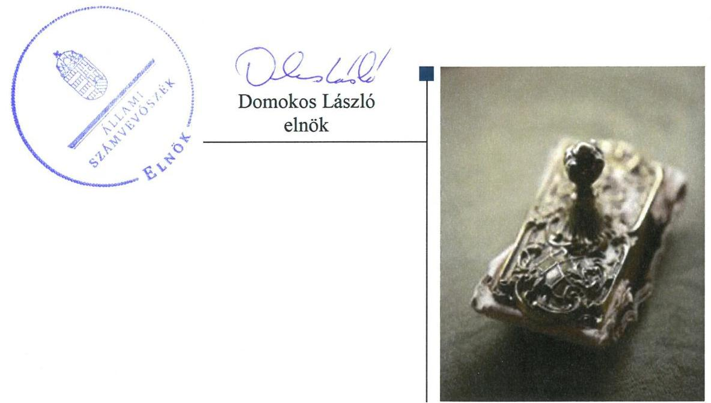
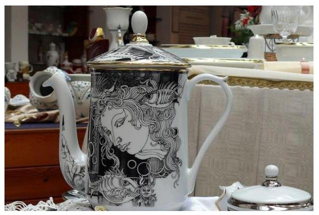

# Jelentés 

## Állami tulajdonú gazdasági társaságok

Az állami tulajdonú gazdasági társaságok ellenőrzése - Hollóházi Porcelángyár Kft.
2018.

---

# Jelentés 

## Állami tulajdonú gazdasági társaságok

Az állami tulajdonú gazdasági társaságok ellenőrzése - Hollóházi Porcelángyár Kft.
2018. ๙. hó 10. nap

---

# AZ ELLENŐRZÉST FELÜGYELTE:

- **KLINGA LÁSZLÓ** felügyeleti vezető
- **AZ ELLENŐRZÉST VEZETTE ÉS A VÉGREHAJTÁSÁÉRT FELELŐS:**
  - **HOFMEISTER LÁSZLÓ** ellenőrzésvezető
  - **A PROGRAM ÖSSZEÁLLÍTÁSÁÉRT FELELŐS:**
    - **TÓTPÁL SZABOLCS** osztályvezető

**IKTATÓSZÁM:** EL-0425-024/2018

**TÉMASZÁM:** 2469

**ELLENŐRZÉS-AZONOSÍTÓ SZÁM:** V-081443

---

Jelentéseink az Országgyűlés számítógépes hálózatán és az Interneta a www.asz.hu címen is olvashatóak.

---

# TARTALOMJEGYZÉK 

■ ÖSSZEGZÉS ..... 5
■ AZ ELLENŐRZÉS CÉLJA ..... 6
■ AZ ELLENŐRZÉS TERÜLETE ..... 7
■ AZ ELLENŐRZÉS HÁTTERE, INDOKOLTSÁGA ..... 8
■ A JELENTÉS LÉNYEGES KÉRDÉSKÖREI ..... 9
■ AZ ELLENŐRZÉS HATÓKÖRE ÉS MÓDSZEREI ..... 10
■ MEGÁLLAPÍTÁSOK ..... 12
■ JAVASLATOK ..... 14
■ MELLÉKLETEK ..... 15
I. sz. melléklet: Értelmező szótár ..... 15
■ FÜGGELÉK: ÉSZREVÉTELEK ..... 17
■ RÖVIDÍTÉSEK JEGYZÉKE ..... 19

---

.

---

# ÖSSZEGZÉS 

A Hollóházi Porcelángyár Kft. a szabályszerű gazdálkodás feltételeit nem alakította ki, gazdálkodása és vagyongazdálkodása nem volt szabályszerű, így a gazdálkodásának átláthatóságát nem biztosította. A beszámolók hiteles és megbizható alátámasztásáról nem gondoskodtak, ezzel a vagyon védelmét nem biztosították.

## Az ellenőrzés társadalmi indokoltsága

Az állami tulajdonú gazdálkodó szervezetek ellenőrzése kiemelten fontos a vagyon megőrzése, megóvása érdekében, valamint a kormányzati szektor elszámolásaiban megjelenő állami tulajdonú gazdálkodó szervezetek esetében, amelyekkel szemben alapvető követelmény, hogy gazdálkodásuk, múködésük szabályszerű, az általuk szolgáltatott adatok minél megbízhatóbbak legyenek.

Az Állami Számvevőszék stratégiájában célul tűzte ki az államháztartáson kívül működő szervezetek ellenőrzését, mely hozzájárul a közpénzek szabályos, átlátható, elszámoltatható és eredményes felhasználásához. A stratégiával összhangban került sor a Hollóházi Porcelángyár Kft. ellenőrzésére a 2014-2016. évekre vonatkozóan.

## Főbb megállapítások, következtetések, javaslatok

Az MNV Zrt. a Társaság feletti tulajdonosi joggyakorlásának kereteit a jogszabályoknak megfelelően alakította ki, a tulajdonosi jogait szabályszerűen gyakorolta.

A Társaság számviteli szabályozottsága az ellenőrzött időszakban nem volt szabályszerű, mivel nem rendelkezett számlarenddel.

A vagyongazdálkodása nem volt szabályszerű, mert a beszámolók mérlegének leltárral való alátámasztottsága nem volt megfelelő, valamint a számviteli bizonylatok nagy részét nem őrizték meg.

A Társaság bevételeinek és ráfordításainak elszámolása nem volt szabályszerű.
Közérdekű adatokra vonatkozó közzétételi kötelezettségét a Társaság teljesítette.
A megállapítások alapján az Állami Számvevőszék a Hollóházi Porcelángyár Kft. ügyvezetőjének öt javaslatot fogalmazott meg.

---

# AZ ELLENŐRZÉS CÉLJA 

Az ellenőrzés célja annak értékelése, hogy a tulajdonosi jogok gyakorlása szabályszerű volt-e. A gazdálkodó szervezet szabályozottsága, gazdálkodása és vagyongazdálkodási tevékenysége megfelelt-e a jogszabályi és a tulajdonosi előírásoknak; biztosítva volt-e a feladatok átláthatósága és elszámoltathatósága érdekében a szolgáltatás dijának megalapozottsága szabályszerű önköltségszámítással. A vagyonváltozást eredményező döntések esetében a tulajdonosi jogok gyakorlója és a gazdálkodó szervezet szabályszerűen jártak-e el.

---

# AZ ELLENŐRZÉS TERÜLETE 

## Magyar Nemzeti Vagyonkezelő Zártkörűen Müködő Részvénytársaság és a Hollóházi Porcelángyár Kft.

A Társaság ${ }^{1}$-ot a Magyar Állam alapította 2013. december 9-én 5,0 M Ft törzstőkével, mely a 2016. évre 30,0 M Ft-ra emelkedett. A Társaság cégjegyzékbe történő bejegyzésére 2014. január 17-én került sor, addig mint előtársaság múködött. Az alapítót megillető tulajdonosi jogok és kötelezettségek összességét a Vtv. ${ }^{2}$ alapján az MNV Zrt. ${ }^{3}$ gyakorolta.

A Társaság alaptevékenysége a porcelángyártás volt, melyet a Hollóházi Hungarikum Nonprofit Kft.-től vett át az MNV Zrt. döntése alapján. A Társaság a gyártáshoz szükséges ingatlanokat és tárgyi eszközöket a Hollóházi Hungarikum Nonprofit Kft.-től bérelte.

A Társaság nem tartozott a kormányzati szektorba sorolt egyéb szervezetek közé, vagyonkezelt vagyona nem volt. Közfeladatot nem látott el.

A Társaság - a rendelkezésre álló információk alapján - a 2014. év kivételével veszteségesen múködött.

Az átlagos állományi létszáma a 2014. évi 132 fơről a 2016. évre 146 fơre nőtt. A Társaság ügyvezetőjének személyében egy alkalommal, 2016. szeptember 27-én történt változás.

---

# AZ ELLENŐRZÉS HÁTTERE, INDOKOLTSÁGA 

Az állami tulajdonú gazdálkodó szervezetek ellenőrzése kiemelten fontos a vagyon megőrzése, megóvása érdekében. Gazdálkodásuk jellemzően a közérdeklődés és a média figyelmének középpontjában áll, amihez hozzájárul a gazdálkodásuk körébe tartozó - közvetlen vagy közvetett állami tulajdonú, tehát végső soron a nemzeti vagyon részét képező - vagyon nagysága, illetve az általuk ellátott feladatok minősége és hatékonysága. A szolgáltatási árképzés megalapozottsága és a rendszeres elszámoltatás feltételeinek kialakítása az ellenőrzése során nagy hangsúlyt kap. A szolgáltatás árában és annak támogatásában meg kell jelennie az önköltségszámítás szempontjainak, amely biztosítja a múködés fenntarthatóságát (eszközpótlást) is.

Az ellenőrzés rámutathat az állami tulajdonú gazdálkodó szervezetek gazdálkodási tevékenységével jó gyakorlatokra és szabálytalanságokra. Felhívhatja a figyelmet a jogszabályi követelmények teljesítéséhez szükséges feltételek hiányosságaira, hozzájárulhat az államháztartáson kívüli, de (közvetlenül vagy közvetve) állami vagyont használó gazdálkodó szervezetek tevékenységének átláthatóságához. Ellenőrzésünk eredményeképpen javaslatainkkal, megállapításainkkal hozzájárulhatunk a nemzeti vagyonnal való gazdálkodás átláthatóságának, elszámoltathatóságának javításához.

---

# A JELENTÉS LÉNYEGES KÉRDÉSKÖREI 

1. A tulajdonosi jogok gyakorlása szabályszerű volt-e?
2. A társaság müködésének szabályozottsága, gazdálkodása és vagyongazdálkodása megfelel-e az elöírásoknak?

---

# AZ ELLENŐRZÉS HATÓKÖRE ÉS MÓDSZEREI 

## Az ellenőrzés típusa

Megfelelőségi ellenőrzés

## Az ellenőrzött időszak

2014 - 2016. évek, a 2016. évi beszámoló jóváhagyásáig tartó időszak

## Az ellenőrzés tárgya

Magyar Nemzeti Vagyonkezelő Zrt. tulajdonosi joggyakorlása, valamint a Hollóházi Porcelángyár Kft. gazdálkodása, kiemelten a vagyongazdálkodási tevékenysége volt az ellenőrzés tárgya.

Az ellenőrzés kiterjedt minden olyan körülményre és adatra, amely az ÁSZ ${ }^{6}$ jogszabályban meghatározott feladatainak teljesítéséhez, valamint a program végrehajtása folyamán felmerült újabb összefüggések feltárásához szükséges volt.

## Az ellenőrzött szervezet

Magyar Nemzeti Vagyonkezelő Zrt. és a Hollóházi Porcelángyár Kft. (Magyar Porcelánmanufaktúra Kft. 2016. december 20-ig)

## Az ellenőrzés jogalapja

Az ellenőrzés jogalapját az ÁSZ tv. ${ }^{5}$ 1. § (3) bekezdése és 5. § (3)-(5) bekezdése képezi.

## Az ellenőrzés módszerei

Az ellenőrzést a nemzetközi standardokat irányadónak tekintve az ellenőrzési program ellenőrzési kérdései, az ellenőrzött időszakban hatályos jogszabályok, az ellenőrzés szakmai szabályok és módszertanok figyelembe vételével végezzük.

Az ellenőrzés ideje alatt az ellenőrzött szervezettel történő kapcsolattartást az ÁSZ ${ }^{6}$ Szervezeti és Müködési Szabályzatának vonatkozó előírásai alapján biztosítjuk.

Az ellenőrzési kérdések megválaszolásához szükséges bizonyítékok megszerzése a következő ellenőrzési eljárások alkalmazásával történt:

---

megfigyelés, kérdésfeltevés (információkérés), összehasonlítás, valamint elemző eljárás. Az ellenőrzési bizonyítékként felhasználható adatforrások közé tartoznak egyrészt az ellenőrzési programban felsorolt adatforrások, másrészt adatforrás lehet még minden - az ellenőrzés folyamán - feltárt, az ellenőrzés szempontjából információkat tartalmazó dokumentum.

Az ellenőrzést a kérdésekre adott válaszok kiértékelésével, valamint a megjelölt adatforrások, a csatolt tanúsítványok felhasználásával, továbbá az adott időszakban hatályos jogszabályok figyelembevételével folytattuk le.

A teljes ellenőrzött időszakra vonatkozóan került ellenőrzésre a gazdasági társaság tervezési, beszámolási, közzétételi, adatszolgáltatási kötelezettségének, valamint belső ellenőrzési tevékenységének szabályszerűsége. A 2013. és 2016. évekre vonatkozóan a gazdasági társaság múködésének szabályozottságát, a bevételei és ráfordításai elszámolását, illetve vagyongazdálkodásának szabályszerűségét is ellenőriztük.

A bevételek és a ráfordítások közül az értékesítés nettó árbevétele, az egyéb, rendkívüli és pénzügyi műveletek bevételei, a személyi jellegű ráfordítások, az anyagjellegű ráfordítások, az egyéb, rendkívüli és pénzügyi műveletek ráfordításai, valamint értékcsökkenési leírás elszámolásának szabályszerűségét, továbbá az immateriális javak, tárgyi eszközök esetében a vagyonnyilvántartás szabályszerűségét véletlen mintavétellel ellenőriztük.

A fenti sokaságok esetében a mintavétel azokra a legnagyobb értékű tételekre - a lényeges sokaságra - terjedt ki, melyek összértéke eléri a teljes sokaság összértékének 50\%-át. A személyi jellegű ráfordítások esetében a mintavétel a teljes sokaságból történt. Amennyiben valamely ellenőrzött sokaság elemszáma kisebb volt, mint az előírt mintaelemszám, a lényeges sokaságot tételesen ellenőriztük.

A mintavétellel ellenőrzött területek esetében minden egyes tétel vonatkozásában a szabályszerűségre vonatkozó kérdéseket tettünk fel, amelyek eredménye összesítésre került. „Szabályszerűnek" értékeltünk egy ellenőrzött területet, amennyiben 95\%-os bizonyossággal az ellenőrzött sokaságban az átlagos hibaarány legfeljebb 10\%, "nem szabályszerűnek", amennyiben 10\%-nál magasabb arányt képviselt.

---

# 1. A tulajdonosi jogok gyakorlása szabályszerű volt-e? 

Összegző megállapítás Az MNV Zrt. tulajdonosi joggyakorlása szabályszerű volt.
A TULAJDONOSI JOGGYAKORLÁS szabályait az MNV Zrt. az Alapító okirat ${ }_{1-3}{ }^{7}$-ban szabályozta. Az MNV Zrt. a Társaság Alapító okiratában meghatározta a tulajdonosi jogokat, továbbá kinevezte a Társaság ügyvezetőjét, kijelölte az $\mathrm{FB}^{8}$ tagokat. Az FB három főből állt a Gt. ${ }^{9}$-ben, majd a Ptk. ${ }^{10}$-ban előírtaknak megfelelően. Az MNV Zrt. SZMSZ ${ }^{11}$-ében a Vtv.-ben előírtakkal összhangban rögzítette az MNV Zrt. Igazgatósága döntési hatáskörét.

Az MNV Zrt. a tervezési irányelveiben előírta az üzleti terv készítési kötelezettséget, melyet a Társaság minden évben elkészített.

Az MNV Zrt. Igazgatósága a Taktv. ${ }^{12}$ rendelkezéseivel összhangban elkészítette a Társaság Javadalmazási szabályzat ${ }^{13}$-át.

A KÖNYVVIZSGÁLÓT az MNV Zrt. szabályszerűen megválasztotta. Az Alapító okirat ${ }_{1-3}$ tartalmazta a könyvvizsgáló személyével, múködésével kapcsolatos hatásköröket, feladatokat.

MONITORING TEVÉKENYSÉG előírásait az MNV Zrt. vezérigazgatója a tulajdonosi joggyakorlás keretében a Monitoring szabályzat ${ }_{1,2}{ }^{14}$-ban rögzítette. A Társaság a gazdasági adatainak alakulását megküldte az előírt negyedéves adatszolgáltatás keretében.

Az MNV Zrt. az éves beszámoló jóváhagyásáról minden évben az FB írásbeli jelentésének és a könyvvizsgáló írásbeli véleményének birtokában határozott. Az MNV Zrt. a 2014. évi nyereséget az eredménytartalékba helyezte.

## 2. A társaság múködésének szabályozottsága, gazdálkodása és vagyongazdálkodása megfelelt-e az előírásoknak?

Összegző megállapítás A Társaság múködésének szabályozottsága, gazdálkodása és a vagyongazdálkodása nem volt szabályszerű.
2.1. számú megállapítás A Társaság számviteli szabályozottsága nem volt szabályszerű.

A Társaság rendelkezett a Számv. tv. ${ }^{15}$ által előírt Számviteli politika ${ }^{16}$-val, valamint az annak keretében elkészített Leltározási szabályzat ${ }^{17}$-tal, Értékelési szabályzat ${ }^{18}$-tal és Pénzkezelési szabályzat ${ }^{19}$-tal, melyek tartalma megfelelt a jogszabály előírásának.

---

Az Önköltségszámítási szabályzat ${ }^{20}$ hiányossága volt, hogy nem rögzítette - a Számv. tv. 14. § (7) bekezdésében előírtak ellenére - a saját előállítású termékek, végzett szolgáltatások Számv. tv. 51. § szerinti önköltsége utókalkuláció módszerével történő megállapításának szabályait.

Számlarenddel a Társaság nem rendelkezett a Számv. tv. 161. § (1) bekezdés előírása ellenére.

# 2.2. számú megállapítás 

## 2.3. számú megállapítás

Az Önköltségszámítási szabályzat ${ }^{20}$ hiányossága volt, hogy nem rögzítette - a Számv. tv. 14. § (7) bekezdésében előírtak ellenére - a saját előállítású termékek, végzett szolgáltatások Számv. tv. 51. § szerinti önköltsége utókalkuláció módszerével történő megállapításának szabályait.

Számlarenddel a Társaság nem rendelkezett a Számv. tv. 161. § (1) bekezdés előírása ellenére.

## A Társaság bevételeinek és ráfordításának elszámolása nem volt szabályszerű.

A bevételek és ráfordítások elszámolása nem volt szabályszerű, mert azok elszámolásánál a Számv. tv. 167. § (1) h) pont előírása ellenére a könyvviteli elszámolást közvetlenül alátámasztó bizonylatok nem tartalmazták a könyvelés módjára, az érintett könyvviteli számlákra történő hivatkozást.

A Társaság számos esetben nem rendelkezett a kifizetések jogosságát alátámasztó bizonylatokkal. A számviteli dokumentumok megőrzési hiányosságai miatt a Társaság nem biztosította a könyvvezetés és a beszámolás során a Számv. tv. 15. § (3) bekezdésében előírt valódiság elvének az érvényesülését, mely alapján a könyvvitelben rögzített és a beszámolóban szereplő tételeknek a valóságban is megtalálhatóknak, bizonyíthatóknak, kívülállók által is megállapíthatóknak kell lenniük.

## Az éves beszámoló mérlegének leltárral való alátámasztásáról nem gondoskodtak. Közzétételi kötelezettségüket teljesítették.

AZ ÉVES BESZÁMOLÓ letétbe helyezési és közzétételi kötelezettségét a Társaság szabályszerűen teljesítette, ugyanakkor a beszámolók mérlegének leltárral való alátámasztásáról nem gondoskodott.

A Társaságnál a 2014-2016. évek egyikében sem támasztották alá mennyiségi felvétellel történő leltározással a tárgyi eszközök mérlegben kimutatott értékét, ezzel megsértették a Számv. tv. 69. § (3) bekezdésének előírásait, amely legalább háromévenkénti mennyiségi felvétellel történő leltározást írt elő.

A 2014-2016. években a készletek mérlegsor kivételével nem támasztották alá leltárral a mérleget a Számv. tv. 69. § (1) bekezdésében előírtak ellenére.

A könyvvizsgáló a számviteli szabályozás hiányossága és a leltár elmaradása ellenére a beszámolót minden évben korlátozás nélküli hitelesítő záradékkal látta el.

A KÖZÉRDEKŰ ADATOK közzétételére vonatkozó kötelezettségét a Társaság teljesítette a Taktv.-nek megfelelően.

---

# JAVASLATOK 

Az ÁSZ tv. 33. § (1) bekezdésében foglaltak értelmében az ellenőrzött szervezet vezetője köteles a jelentésben foglalt megállapításokhoz kapcsolódó intézkedési tervet összeállítani és azt a jelentés kézhezvételétől számított 30 napon belül az ÁSZ részére megküldeni. Amennyiben az ellenőrzött szervezet vezetője nem küldi meg határidőben az intézkedési tervet, vagy továbbra sem elfogadható intézkedési tervet küld, az Állami Számvevőszék elnöke az ÁSZ tv. 33. § (3) bekezdése a) és b) pontjaiban foglaltakat érvényesítheti.

## Hollóházi Porcelángyár Kft. ügyvezetőjének

1. Gondoskodjon az önköltségszámítási szabályzat kiegészítéséről annak érdekében, hogy Számv. tv.-ben elöirtak szerint a saját elöállítású termékek, a végzett szolgáltatások jogszabály szerinti önköltsége a szabályzatban rögzített utókalkuláció módszerével megállapítható legyen.
(2.1. sz. megállapítás 2. bekezdése alapján)
2. Intézkedjen a Számv. tv.-ben foglaltaknak megfelelően a számlarend elkészítéséről.
(2.1. sz. megállapítás 3. bekezdése alapján)
3. Intézkedjen annak érdekében, hogy a bevételek és ráfordítások elszámolását alátámasztó bizonylatok tartalma teljes körüen megfeleljen a Számv. tv.-ben elöirt követelményeknek.
(2.2. sz. megállapítás 1. bekezdése alapján)
4. Intézkedjen a tárgyi eszközök mennyiségi felvétellel történő leltározásának Számv. tv.-ben elöirt gyakorisággal történő elvégzéséről.
(2.3. sz. megállapítás 2. bekezdése alapján)
5. Gondoskodjon a Számv. tv. elöírásai szerint a beszámoló mérlegének teljes körü leltárral való alátámasztásáról.
(2.3. sz. megállapítás 3. bekezdése alapján)

---

# MELLÉKLETEK 

- I. SZ. MELLÉKLET: ÉRTELMEZŐ SZÓTÁR
állami vagyon
gazdasági társaság

MNV Zrt.
nemzeti vagyon
a) Az állam tulajdonában lévő dolog, valamint a dolog módjára hasznosítható természeti erő,
b) az a) pont hatálya alá nem tartozó mindazon vagyon, amely vonatkozásában törvény az állam kizárólagos tulajdonjogát nevesíti,
c) az állam tulajdonában lévő tagsági jogviszonyt megtestesítő értékpapír, illetve az államot megillető egyéb társasági részesedés,
d) az államot megillető olyan immateriális, vagyoni értékkel rendelkező jogosultság, amelyet jogszabály vagyoni értékű jogként nevesít.
Forrás: Vtv. 1. § (2) bekezdése
2012. november 10-től az állami vagyon fogalma kiegészül a következő ponttal:
e) az állam tulajdonában lévő pénzügyi eszközök
Forrás: Vtv. 1. § (2) bekezdése
A Ptk. 3:88. § (1) bekezdése szerint „a gazdasági társaságok üzletszerű közös gazdasági tevékenység folytatására, a tagok vagyoni hozzájárulásával létrehozott, jogi személyiséggel rendelkező vállalkozások, amelyekben a tagok a nyereségből közösen részesednek, és a veszteséget közösen viselik".
Az állami vagyon felett, a Magyar Államok megillető tulajdonosi jogok és kötelezettségek összességét - a hatályos szabályozás szerint - az állami vagyon felügyeletéért felelős miniszter (jelenleg a nemzeti fejlesztési miniszter) gyakorolja. A miniszter feladatát nagy részben az MNV Zrt., mint tulajdonosi joggyakorló szervezet útján látja el.
a) az állam vagy a helyi önkormányzat kizárólagos tulajdonában álló dolgok,
b) az a) pont hatálya alá nem tartozó, állam vagy a helyi önkormányzat tulajdonában lévő dolog,
c) az állam vagy a helyi önkormányzatot tulajdonában lévő pénzügyi eszközök, továbbá az államot vagy a helyi önkormányzatot megillető társasági részesedések,
d) az államot vagy a helyi önkormányzatot megillető bármely vagyoni értékkel rendelkező jogosultság, amelyet jogszabály vagyoni értékű jogként nevesít,
e) Magyarország határa által körbezárt terület feletti légtér,
f) az üvegházhatású gázok kibocsátási egységeinek kereskedelméről szóló törvény szerint kibocsátási egység és légiközlekedési kibocsátási egység, valamint az ENSZ Éghajlatváltozási Keretegyezménye és annak Kiotói Jegyzőkönyve végrehajtási keretrendszeréről szóló törvény szerinti kiotói egység,
g) állami vagy helyi önkormányzati fenntartású közgyűjtemény (muzeális intézmény, levéltár, közgyűjteményként működő kép- és hangarchívum, valamint könyvtár) saját gyűjteményében nyilvántartott kulturális javak körébe tartozó dolog, kivéve, ha az állami vagy önkormányzati tulajdon jogszerű létrejötte kétséget kizáró módon nem bizonyítható és a dologra nézve más a tulajdonjogát bizonyítja vagy a kulturális javakra vonatkozó jogszabályokban meghatározott eljárás keretében valószínűsíti (g. pont módosult 2013. december 7től),
h) a régészeti lelet,

---

tulajdonosi ellenőrzés
tulajdonosi jogok gyakorlója
i) a nemzeti adatvagyon körébe tartozó állami nyilvántartások fokozottabb védelméről szóló törvény szerinti nemzeti adatvagyon.
Forrás: Nvtv. ${ }^{21} 1 . \S(2)$
2014. március 14-ig:

Az állami vagyon kezelőjét, haszonélvezőjét, használóját megillető jogok gyakorlását, annak szabályszerűségét, célszerűségét az MNV Zrt. - szükség szerint területi szervei útján - ellenőrzi.
2014. március 15-től:

Az állami vagyon használóját, vagyonkezelőjét és haszonélvezőjét megillető jogok gyakorlását, annak szabályszerűségét, a kötelezettségek teljesítését, valamint a vagyon rendeltetése szerinti célszerűségét a tulajdonosi joggyakorló ${ }_{3}$ rendszeresen ellenőrzi.
Forrás: Vhr. ${ }^{22} 20 . \S(1)$
1.
2013. június 27-ig:

Az állami vagyon felett a Magyar Államot megillető tulajdonosi jogok és kötelezettségek összességét - ha törvény eltérően nem rendelkezik - az állami vagyon felügyeletéért felelős miniszter (a továbbiakban: miniszter) gyakorolja, aki e feladatát a Magyar Nemzeti Vagyonkezelő Zártkörűen Müködő Részvénytársaság (a továbbiakban: MNV Zrt.), a Magyar Fejlesztési Bank, illetve a tulajdonosi joggyakorló szervezet útján látja el. A miniszter miniszteri rendeletben, a törvényben meghatározott állami vagyoni kör tekintetében, meghatározott időtartamra, a joggyakorlás egyes szabályainak meghatározásával - az őt megillető tulajdonosi jogok és kötelezettségek összességének, illetve azok meghatározott részének gyakorlóját az Áht. szerinti központi költségvetési szervek, ezek intézménye, továbbá a 100\%-ban állami tulajdonban álló gazdasági társaságok közül kijelölheti. Forrás: Vtv. 3. § (1) és (2)
2013. június 28-ától:

A rábízott állami vagyon felett az államot megillető tulajdonosi jogok és kötelezettségek összességét tulajdonosi joggyakorlóként:
a) ha törvény vagy miniszteri rendelet eltérően nem rendelkezik, a Magyar Nemzeti Vagyonkezelő Zártkörűen Müködő Részvénytársaság (a továbbiakban: MNV Zrt.),
b) törvényben kijelölt személy vagy
c) az állami vagyon felügyeletéért felelős miniszter (a továbbiakban: miniszter) által rendeletben kijelölt személy gyakorolja.
[...] A miniszter e törvény felhatalmazása alapján - a meghatározott célok hatékonyabb elérése érdekében, miniszteri rendeletben, az ott meghatározott állami vagyoni kör tekintetében, meghatározott időtartamra - e törvény keretei között, a joggyakorlás egyes szabályainak meghatározásával - az államot megillető tulajdonosi jogok és kötelezettségek összességének, illetve azok meghatározott részének gyakorlóját az Áht. szerinti központi költségvetési szervek, ezek intézménye, továbbá a 100\%-ban állami tulajdonban álló gazdasági társaságok közül kijelölheti.
Forrás: Vtv. 3. § (1) és (2)
2.

Aki a nemzeti vagyon felett az államot vagy a helyi önkormányzatot megillető tulajdonosi jogok és kötelezettségek összességének gyakorlására jogosult
Forrás: Nvtv. 3. § (1) 17. pontja

---

# FÜGGELÉK: ÉSZREVÉTELEK 

A jelentéstervezetet a Számvevőszék 15 napos észrevételezésre megküldte az ellenőrzött szervezetek vezetőinek az ÁSZ tv. 29. §* (1) bekezdése előírásának megfelelően.

A Magyar Nemzeti Vagyonkezelő Zrt. vezérigazgatója az ÁSZ tv. 29. § (2) bekezdésében foglalt észrevételezési jogával nem élt, írásban jelezte, hogy a jelentéstervezetre észrevételt nem tesz. A Hollóházi Porcelángyár Kft. ügyvezetője a jelentéstervezetre nem tett észrevételt.

[^0]
[^0]:    * 29. § (1) Az Állami Számvevőszék az ellenőrzési megállapításait megküldi az ellenőrzött szervezet vezetőjének vagy az általa megbízott személynek, és annak, akinek személyes felelősségét állapította meg.
    (2) Az ellenőrzött szervezet vezetője és a felelősként megjelölt személy az ellenőrzés megállapításaira tizenöt napon belül írásban észrevételt tehet.
    (3) Az Állami Számvevőszék az észrevételre a beérkezésétől számított harminc napon belül írásban válaszol. A figyelembe nem vett észrevételeket köteles a jelentésben feltüntetni, és megindokolni, hogy azokat miért nem fogadta el.

---

.

---

# RÖVIDÍTÉSEK JEGYZÉKE 

${ }^{1}$ Társaság
${ }^{2}$ Vtv.
${ }^{3}$ MNV Zrt.
${ }^{4}$ ÁSZ
${ }^{5}$ ÁSZ tv.
${ }^{6}$ ÁSZ
${ }^{7}$ Alapító okirat ${ }_{1-3}$
${ }^{8}$ FB
${ }^{9}$ Gt.
${ }^{10}$ Ptk.
${ }^{11}$ MNV Zrt. SZMSZ
${ }^{12}$ Taktv.
${ }^{13}$ Javadalmazási szabályzat
${ }^{14}$ Monitoring szabályzat ${ }_{1,2}$
${ }^{15}$ Számv. tv.
${ }^{16}$ Számviteli politika
${ }^{17}$ Leltározási szabályzat
${ }^{18}$ Értékelési szabályzat
${ }^{19}$ Pénzkezelési szabályzat
${ }^{20}$ Önköltségszámítási szabályzat
${ }^{21}$ Nvtv.
${ }^{22} \mathrm{Vhr}$.

Magyar Porcelánmanufaktúra Kft. 2016. december 20-ig, Hollóházi Porcelángyár Kft. 2016. december 21-től
2007. évi CVI. törvény az állami vagyonról

Magyar Nemzeti Vagyonkezelő Zártkörűen működő részvénytársaság
Állami Számvevőszék
2011. évi LXVI. törvény az Állami Számvevőszékről (hatályos: 2011. július 1-jétől)

Állami Számvevőszék
A Magyar Porcelánmanufaktúra Kft. Alapító okirata ${ }_{1}$ (Hatályos: 2013. december 9-től),
A Magyar Porcelánmanufaktúra Kft. 504/2014. (XII. 19.) számú és 530/2014. (XII. 30.) számú Alapítói határozattal módosított Alapító okirata ${ }_{2}$ (Hatályos: 2014. december 30-tól),
A Magyar Porcelánmanufaktúra Kft. 479/2015. (XII. 30.) számú Alapítói határozattal módosított Alapító okirata ${ }_{3}$ (Hatályos: 2015. december 30-tól) Hollóházi Porcelángyár Kft. felügyelőbizottsága
2006. évi IV. törvény a gazdasági társaságokról (hatálytalan 2014. március 15-től) 2013. évi V. törvény a Polgári Törvénykönyvről (hatályos 2014. március 15-től) Magyar Nemzeti Vagyonkezelő Zártkörűen Működő Részvénytársaság Szervezeti és Működési Szabályzata (hatályos 2011. május 30-tól)
2009. évi CXXII. törvény a köztulajdonban álló gazdasági társaságok takarékosabb müködéséről (hatályos 2009. december 4-től)
a Társaság Javadalmazási Szabályzata (hatályos 2014. február 1-jétől)
51/2013. számú MNV Zrt. vezérigazgatói utasítás a Társasági Monitoring Szabályzatról (hatályos 2013. december 19-től)
34/2016. számú MNV Zrt. vezérigazgatói utasítás a Társasági Monitoring Szabályzatról (hatályos: 2016. augusztus 2-től)
2000. évi C. törvény a számvitelről (hatályos 2001. január 1-jétől)
a Társaság Számviteli politikája (hatályos 2014. július 1-jétől)
a Társaság Eszközök és források leltárkészítési és leltározási szabályzata (hatályos 2014. január 28-tól)
a Társaság Eszközök és források értékelési szabályzata (hatályos 2014. január 28tól)
a Társaság Pénzkezelési szabályzata (hatályos 2014. január 28-tól)
a Társaság Önköltségszámítási szabályzata (hatályos 2014. február 3-tól)
2011. évi CXCVI. törvény a nemzeti vagyonról (hatályos 2012. január 1-jétől) 254/2007. (X. 4.) Kormányrendelet az állami vagyonnal való gazdálkodásról (hatályos 2007. október 4-től)

---

ÁLLAMI SZÁMVEVŐSZÉK
1052 Budapest, Apáczai Csere János utca 10.
Levélcím: 1364 Budapest 4. Pf. 54
Telefon: +36 14849100 Telefax: +36 14849200
www.asz.hu