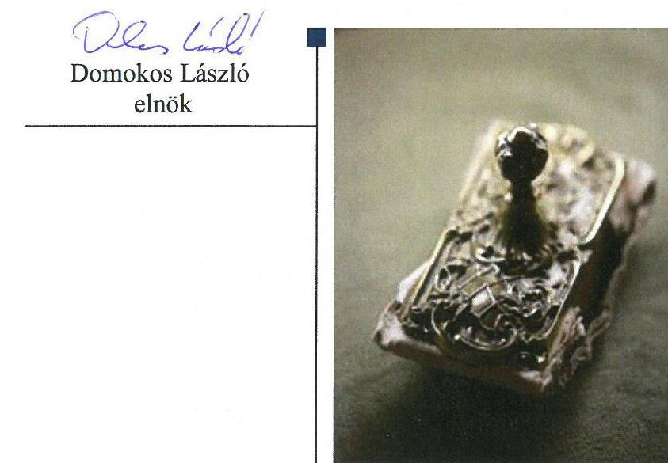
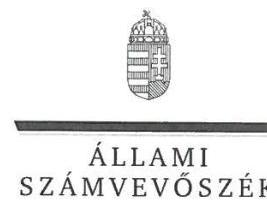
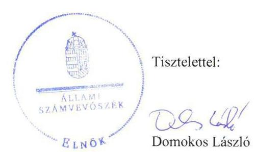
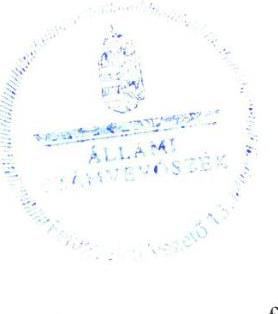

# Jelentés 

## Állami tulajdonú gazdasági társaságok

Az állami tulajdonú gazdasági társaságok ellenőrzése - Millenáris Széllkapu Beruházó, Fejlesztő és Üzemeltető Nonprofit Kft.
2018.

---

# Jelentés 

## Állami tulajdonú gazdasági társaságok

Az állami tulajdonú gazdasági társaságok ellenőrzése - Millenáris Széllkapu Beruházó, Fejlesztő és Üzemeltető Nonprofit Kft.
2018. 08. hó 28. nap

## 

---

# AZ ELLENŐRZÉST FELÜGYELTE:

- **KLINGA LÁSZLÓ** felügyeleti vezető
- **AZ ELLENŐRZÉST VEZETTE ÉS A VÉGREHAJTÁSÁÉRT FELELŐS:**
  - **JOÓ ERIKA** ellenőrzésvezető
  - **A PROGRAM ÖSSZEÁLLÍTÁSÁÉRT FELELŐS:**
    - **TÓTPÁL SZABOLCS** osztályvezető

**IKTATÓSZÁM:** EL-0390-037/2018

**TÉMASZÁM:** 2469

**ELLENŐRZÉS-AZONOSÍTÓ SZÁM:** V-081411

---

Jelentéseink az Országgyűlés számítógépes hálózatán és az Interneta a www.asz.hu címen is olvashatóak.

---

# TARTALOMJEGYZÉK 

■ ÖSSZEGZÉS ..... 5
■ AZ ELLENŐRZÉS CÉLJA ..... 6
■ AZ ELLENŐRZÉS TERÜLETE ..... 7
■ AZ ELLENŐRZÉS HÁTTERE, INDOKOLTSÁGA ..... 9
■ A JELENTÉS LÉNYEGES KÉRDÉSKÖREI ..... 10
■ AZ ELLENŐRZÉS HATÓKÖRE ÉS MÓDSZEREI ..... 11
■ MEGÁLLAPÍTÁSOK ..... 13
■ JAVASLATOK ..... 15
■ MELLÉKLETEK ..... 17
I. sz. melléklet: Értelmező szótár ..... 17
■ FÜGGELÉK: ÉSZREVÉTELEK ..... 19
■ RÖVIDÍTÉSEK JEGYZÉKE ..... 33

---

.

---

# ÖSSZEGZÉS 

A Millenáris Széllkapu Beruházó, Fejlesztő és Üzemeltető Nonprofit Kft. gazdálkodása és vagyongazdálkodási tevékenysége nem volt szabályozott és szabályszerű, ezzel nem volt biztositott a müködés átláthatósága, illetve az elszámoltathatóság.

## Az ellenőrzés társadalmi indokoltsága

Az állami tulajdonú gazdálkodó szervezetek ellenőrzése kiemelten fontos a vagyon megőrzése, megóvása érdekében, valamint a kormányzati szektor elszámolásaiban megjelenő állami tulajdonú gazdálkodó szervezetek esetében, amelyekkel szemben alapvető követelmény, hogy gazdálkodásuk, múködésük szabályszerű, az általuk szolgáltatott adatok minél megbízhatóbbak legyenek.

Az ellenőrzés az állami tulajdonú gazdálkodó szervezetek gazdálkodási tevékenységével kapcsolatban felhívja a figyelmet a jogszabályi követelmények teljesítéséhez szükséges feltételek hiányosságaira, hozzájárul az államháztartáson kívüli, de (közvetlenül vagy közvetve) állami vagyont használó gazdálkodó szervezetek tevékenységének átláthatóságához.

Ellenőrzésünk eredményeképpen javaslatainkkal, megállapításainkkal hozzájárulunk a nemzeti vagyonnal való gazdálkodás átláthatóságának, elszámoltathatóságának javításához.

## Főbb megállapítások, következtetések, javaslatok

A 2013. évben a Magyar Nemzeti Vagyonkezelő Zrt., a 2016. évben a Forster Gyula Nemzeti Örökségvédelmi és Vagyongazdálkodási Központ tulajdonosi joggyakorlása szabályszerű volt.

A Társaság gazdálkodása és vagyongazdálkodási tevékenysége nem volt szabályozott és szabályszerű, mert a jogszabályi előírások ellenére 2013. december 31-ig nem rendelkezett az eszközök és a források leltárkészítési és leltározási szabályzatával, pénzkezelési szabályzattal, 2016. február 8-ig számviteli politikával, valamint az ellenőrzött időszakban az eszközök és a források értékelési szabályzatával, továbbá az éves beszámolók mérlegtételeit a jogszabályi előírások ellenére leltárral nem támasztotta alá.

A Millenáris Széllkapu Beruházó, Fejlesztő és Üzemeltető Nonprofit Kft. vagyongazdálkodása nem felelt meg a jogszabályi előírásoknak, az éves beszámolók mérlegtételeit a jogszabályi előírások ellenére leltárral nem támasztotta alá.

A megállapítások alapján az Állami Számvevőszék a Millenáris Széllkapu Beruházó, Fejlesztő és Üzemeltető Nonprofit Korlátolt Felelősségű Társaság ügyvezetőjének két javaslatot fogalmazott meg.

---

# AZ ELLENŐRZÉS CÉLJA 

Az ellenőrzés célja annak értékelése, hogy a tulajdonosi jogok gyakorlása szabályszerű volt-e. A gazdálkodó szervezet szabályozottsága, gazdálkodása és vagyongazdálkodási tevékenysége megfelelt-e a jogszabályi és a tulajdonosi előírásoknak; biztosítva volt-e a közfeladatok átláthatósága és elszámoltathatósága érdekében a közszolgáltatás díjának megalapozottsága szabályszerű önköltségszámítással. A vagyonváltozást eredményező döntések esetében a tulajdonosi jogok gyakorlója és a gazdálkodó szervezet szabályszerűen jártak-e el. Az ellenőrzés célja továbbá annak megítélése, hogy a kormányzati szektorba sorolt állami tulajdonban lévő gazdálkodó szervezetek gazdálkodásának a kormányzati szektor hiányára és az államadósságra befolyással bíró elemei a jogszabályi előírásoknak megfeleltek-e.

---

# AZ ELLENŐRZÉS TERÜLETE

## Millenáris Széllkapu Beruházó, Fejlesztő és Üzemeltető Nonprofit Kft., a Magyar Nemzeti Vagyonkezelő Zrt. és a Forster Gyula Nemzeti Örökségvédelmi és Vagyongazdálkodási Központ

A Társaságot^{1} a Magyar Állam 2013. augusztus 1-jén alapította 5,0 M Ft törzstőkével. A tulajdonosi joggyakorló MNV Zrt.^{2} a törzstőkét 2013-2014. években 745,3 M Ft-ra megemelte.

A Társaság fő feladata a 1136/2013. (III. 19.) számú Kormányhatározatban^{3} foglalt feladatok végrehajtása, azaz a Budapest II. kerület Margit körút 85-87. sz. alatti ingatlan területén lévő – műemléki védelem alatt nem álló – épületek bontása, a területen park kialakítása.

A Társaság feladatai közé tartozott a folyamatban lévő feladatok átvétele; az ingatlan állami tulajdoni részének apportként történő tulajdonba vétele; az ingatlan kiürítésének koordinálása, átvétele, üzemeltetése; a bontási munkálatok végrehajtásához szükséges személyi és tárgyi feltételek megteremtése; a jogerős bontási engedély megszerzése; a bonyolítói és kivitelezői beszerzési eljárások lebonyolítása; a szerződések megkötése és végrehajtása; a projekt társadalmi kapcsolatainak kiépítése és kommunikációja.

A Társaság feladataként határozták meg a projekt befejezését követő időszak előkészítését, valamint eltérő alapítói döntésig a park üzemeltetését.

Az ellenőrzött időszakban a tulajdonosi joggyakorló^{4} változásai során a társasági részesedések átadás-átvételét a tulajdonosi joggyakorlók megállapodásokban rögzítették.

A Vagyongazdálkodási Központ^{5} 2016. december 31-ei megszűnését követően a tulajdonosi jogok gyakorlója ismét a Miniszterelnökség lett.

A tulajdonosi joggyakorlók változását az 1. táblázat mutatja be.

1. táblázat

|  TULAJDONOSI JOGGYAKORLÓK A 2013-2016. ÉVEKBEN |  |   |
| --- | --- | --- |
|  név | kéz/név | vége  |
|  MNV Zrt. | 2013.08.01. | 2014.12.11.  |
|  Miniszterelnökség | 2014.12.12. | 2015.11.02.  |
|  Vagyongazdálkodási Központ | 2015.11.03. | 2016.12.31.  |
|   |  | Forrás: A Társaság Alapító okiratai  |

A cégjegyzésre az ügyvezető^{6} önállóan volt jogosult, személye az ellenőrzött időszakban nem változott. Az átlagos statisztikai állományi létszám 2013-2014. években 5 fő, a 2015. évben 3 fő és 2016. évben 7 fő volt.

---

A Társaság az NGM közlemény alapján ${ }^{7}$ 2015. december 30-tól tartozik a kormányzati szektorba sorolt társaságok közé. A Társaságnak az ellenőrzött időszakban a Stabilitási tv. 3. § alá tartozó adósságot keletkeztető ügylete nem volt.

A Társaság vagyonkezelt vagyonnal nem rendelkezett, kizárólag saját vagyonával gazdálkodott.

---

# AZ ELLENŐRZÉS HÁTTERE, INDOKOLTSÁGA 

Az állami tulajdonú gazdálkodó szervezetek ellenőrzése kiemelten fontos a vagyon megőrzése, megóvása érdekében, valamint a kormányzati szektor elszámolásaiban megjelenő állami tulajdonú gazdálkodó szervezetek esetében, amelyekkel szemben alapvető követelmény, hogy gazdálkodásuk, működésük szabályszerű, az általuk szolgáltatott adatok minél megbízhatóbbak legyenek. Gazdálkodásuk jellemzően a közérdeklődés és a média figyelmének középpontjában áll, amihez hozzájárul a gazdálkodásuk körébe tartozó - közvetlen vagy közvetett állami tulajdonú, tehát végső soron a nemzeti vagyon részét képező - vagyon nagysága, illetve az általuk ellátott közszolgáltatások/közfeladatok minősége és hatékonysága. A közszolgáltatási árképzés megalapozottsága és a rendszeres elszámoltatás feltételeinek kialakítása az ellenőrzése során nagy hangsúlyt kap. A közszolgáltatás árában és annak támogatásában meg kell jelennie az önköltségszámítás szempontjainak, amely biztosítja a múködés fenntarthatóságát (eszközpótlást) is.

Az ellenőrzés rámutathat az állami tulajdonú gazdálkodó szervezetek gazdálkodási tevékenységével jó gyakorlatokra és szabálytalanságokra. Felhívhatja a figyelmet a jogszabályi követelmények teljesítéséhez szükséges feltételek hiányosságaira, hozzájárulhat az államháztartáson kívüli, de (közvetlenül vagy közvetve) állami vagyont használó gazdálkodó szervezetek tevékenységének átláthatóságához. Ellenőrzésünk eredményeképpen javaslatainkkal, megállapításainkkal hozzájárulhatunk a nemzeti vagyonnal való gazdálkodás átláthatóságának, elszámoltathatóságának javításához.

---

# A JELENTÉS LÉNYEGES KÉRDÉSKÖREI 

1.     - A tulajdonosi jogok gyakorlása szabályszerű volt-e?
2.     - A társaság müködésének szabályozottsága gazdálkodása és vagyongazdálkodása megfelel-e az elöírásoknak?

---

# AZ ELLENŐRZÉS HATÓKÖRE ÉS MÓDSZEREI 

## Az ellenőrzés típusa

Megfelelőségi ellenőrzés

## Az ellenőrzött időszak

2013. - 2016. évek, a 2016. évi beszámoló jóváhagyásáig tartó időszak

## Az ellenőrzés tárgya

Állami tulajdonban lévő gazdasági társaság gazdálkodása, kiemelten vagyongazdálkodási tevékenysége, a kormányzati szektorba sorolt gazdasági társaság gazdálkodásának a kormányzati szektor hiányára és az államadósságra befolyással bíró elemei, valamint a tulajdonosi jogok gyakorlása.

## Az ellenőrzött szervezet

Millenáris Széllkapu Beruházó, Fejlesztő és Üzemeltető Nonprofit Kft., Magyar Nemzeti Vagyonkezelő Zrt. és a Forster Gyula Nemzeti Örökségvédelmi és Vagyongazdálkodási Központ.

## Az ellenőrzés jogalapja

Az ellenőrzés jogalapját az ÁSZ tv². 1. § (3) bekezdése és 5. § (3)-(5) bekezdése képezi.

## Az ellenőrzés módszerei

Az ellenőrzést a nemzetközi standardokat irányadónak tekintve az ellenőrzési program ellenőrzési kérdései, az ellenőrzött időszakban hatályos jogszabályok, az ellenőrzés szakmai szabályok és módszertanok figyelembe vételével végezzük.

Az ellenőrzés ideje alatt az ellenőrzött szervezettel történő kapcsolattartást az ÁSZ ${ }^{6}$ Szervezeti és Múködési Szabályzatának vonatkozó előírásai alapján biztosítjuk.

Az ellenőrzési kérdések megválaszolásához szükséges bizonyítékok megszerzése a következő ellenőrzési eljárások alkalmazásával történt: megfigyelés, kérdésfeltevés (információkérés), összehasonlítás, valamint elemző eljárás. Az ellenőrzési bizonyítékként felhasználható adatforrások

---

közé tartoznak egyrészt az ellenőrzési programban felsorolt adatforrások, másrészt adatforrás lehet még minden - az ellenőrzés folyamán - feltárt, az ellenőrzés szempontjából információkat tartalmazó dokumentum. Az ellenőrzött éveket (2013-2016.) két ellenőrzött időszakra bontottuk, az I. időszak a tulajdonosi joggyakorlás, a szabályozottság, a bevételek és ráfordítások elszámolása, valamint az önköltségszámítás vonatkozásában csak a 2013. év, míg a tervezési, beszámolási, adatszolgáltatási kötelezettség teljesítése vonatkozásában a 2013-2015. év volt. A II. időszak a 2016. év volt.

Az ellenőrzést a kérdésekre adott válaszok kiértékelésével, valamint a megjelölt adatforrások, a csatolt tanúsítványok felhasználásával, továbbá az adott időszakban hatályos jogszabályok figyelembevételével folytattuk le.

---

# 1. A tulajdonosi jogok gyakorlása szabályszerű volt-e? 

Összegző megállapítás

A tulajdonosi jogokat a 2013. évben az MNV Zrt., a 2016. évben a Vagyongazdálkodási Központ szabályszerűen gyakorolta.

AZ MNV ZRT. a 2013. évben a Gt. ${ }^{10}$ előírásainak megfelelően SZMSZ ${ }^{11}$-ében kialakította a tulajdonosi joggyakorlás kereteit.

Az MNV Zrt. a Gt. előírásainak megfelelően három főből álló Felügyelőbizottságot hozott létre. Az Alapító okirat ${ }_{1-3}{ }^{12}$ tartalmazta a Felügyelőbizottság feladat- és hatáskörét, valamint a könyvvizsgáló személyének megnevezését és üzleti terv készítésének kötelezettségét.

Az MNV Zrt. a Gt. előírásainak megfelelően a Felügyelőbizottság és a könyvvizsgáló írásbeli jelentésének birtokában hagyta jóvá a Társaság éves beszámolóját.

Az MNV Zrt. monitoring-rendszert múködtetett. A Felügyelőbizottság a 2013. évi tevékenységet érintően az alapítói határozatok végrehajtását ellenőrizte, intézkedést igénylő javaslatot nem fogalmazott meg.

Az MNV Zrt. a Taktv. ${ }^{13}$ 5. § (3) bekezdése előírásai ellenére nem alkotta meg a vezető tisztségviselők, felügyelőbizottsági tagok, valamint az Mt. 208. §-ának hatálya alá eső munkavállalók javadalmazásáról rendelkező szabályzatot.

A VAGYONGAZDÁLKODÁSI KÖZPONT a 2016. évben a Ptk. ${ }^{14}$ előírásainak megfelelően kialakította a tulajdonosi joggyakorlás kereteit.

Az Alapító okirat ${ }_{4-7}$-ban előírt, a Társaság által elkészített 2016. évi üzleti tervet a Felügyelőbizottság elfogadásra javasolta, azt a tulajdonosi joggyakorló3 jóváhagyta.

A Vagyongazdálkodási Központ felé a Társaság az Alapító okirat4-7.-ban előírtak szerint teljesített adatszolgáltatást. A 2016. évben adatszolgáltatás történt a közbeszerzési értékhatárt elért szerződésekről, az EU-s projektekről, támogatási szerződésekről, a 2016. évi aktualizált tervről és a 20172019. évekre kitekintő tervadatokról.

A tulajdonosi joggyakorló3 a jogszabályi előírásoknak megfelelően a Felügyelőbizottság és a könyvvizsgáló írásbeli jelentésének birtokában hagyta jóvá a Társaság éves beszámolóit.

A Vagyongazdálkodási Központ a Taktv. 5. § (3) bekezdése előírásai ellenére nem alkotta meg a vezető tisztségviselők, felügyelőbizottsági tagok, valamint az Mt. 208. §-ának hatálya alá eső munkavállalók javadalmazásáról rendelkező szabályzatot.

---

# 2. A társaság müködésének szabályozottsága gazdálkodása és vagyongazdálkodása megfelelt-e az előírásoknak? 

## Összegző megállapítás

A Társaság szabályozottsága, gazdálkodása és vagyongazdálkodása nem volt szabályszerű.

A Társaság a Számv. tv. ${ }^{15}$ 14. § (3) bekezdés előírásai ellenére 2016. február 8 -ig nem alakította ki számviteli politikáját.

A számviteli politika keretében elkészítendő eszközök és források leltárkészítési és leltározási szabályzatával a Számv. tv. 14. § (5) bekezdés a) pontja előírása ellenére, pénzkezelési szabályzattal a Számv. tv. 14. § (5) bekezdés d) pontjában foglalt előírás ellenére 2014. január 1-jéig nem rendelkezett a Társaság. A Számv. tv. 14. § (5) bekezdés b) pontjában foglalt előírás ellenére a teljes ellenőrzött időszakban nem rendelkezett a Társaság az eszközök és források értékelési szabályzatával.

A 2013. és a 2016. években a beszámoló készítése során a Számv. tv. 15. § (3) bekezdésében megfogalmazott valódiság elve nem érvényesült, mert a Számv. tv. 69. § (1) bekezdés előírása ellenére az üzleti év végi zárásához, a beszámoló elkészítéséhez, a mérleg tételeinek alátámasztásához a Társaság nem állított össze olyan leltárt, amely tételesen, ellenőrizhető módon tartalmazza a mérleg fordulónapján meglévő eszközeit és forrásait mennyiségben és értékben.

A könyvvizsgáló a mérleget alátámasztó leltár hiánya ellenére a 2013. és a 2016. éves beszámoló vonatkozásában korlátozás nélküli hitelesítő záradékkal látta el a könyvvizsgálói jelentését.

---

# JAVASLATOK 

Az ÁSZ tv. 33. § (1) bekezdésében foglaltak értelmében az ellenőrzött szervezet vezetője köteles a jelentésben foglalt megállapításokhoz kapcsolódó intézkedési tervet összeállítani és azt a jelentés kézhezvételétől számított 30 napon belül az ÁSZ részére megküldeni. Amennyiben az ellenőrzött szervezet vezetője nem küldi meg határidőben az intézkedési tervet, vagy továbbra sem elfogadható intézkedési tervet küld, az Állami Számvevőszék elnöke az ÁSZ tv. 33. § (3) bekezdése a) és b) pontjaiban foglaltakat érvényesítheti.

## Millenáris Széllkapu Beruházó, Fejlesztő és Üzemeltető Nonprofit Kft. ügyvezetőjének

1. Intézkedjen a jogszabályban elöirtaknak megfelelően az eszközök és források értékelési szabályzatának elkészitéséről.
(2. sz. megállapítás 2. bekezdés 2. mondata alapján)
2. Gondoskodjon a jogszabályban elöirtak alapján az éves beszámoló mérlegtételeinek leltárral való alátámasztásáról.
(2. sz. megállapítás 3. bekezdése alapján)

---

.

---

# MELLÉKLETEK 

- I. SZ. MELLÉKLET: ÉRTELMEZŐ SZÓTÁR
gazdasági társaság
kormányzati szektorba sorolt egyéb szervezet
nonprofit gazdasági társaság
tulajdonosi jogok gyakorlója

A Ptk2. 3:88. § (1) bekezdése szerint „a gazdasági társaságok üzletszerű közös gazdasági tevékenység folytatására, a tagok vagyoni hozzájárulásával létrehozott, jogi személyiséggel rendelkező vállalkozások, amelyekben a tagok a nyereségből közösen részesednek, és a veszteséget közösen viselik".
Az a szervezet, amely az Áht. alapján nem része az államháztartásnak, azonban az Európai Közösséget létrehozó szerződéshez csatolt, a túlzott hiány esetén követendő eljárásról szóló jegyzőkönyv alkalmazásáról szóló 2009. május 25-i 479/2009/EK rendelet szerint a kormányzati szektorba tartozik. A nemzetgazdasági miniszter 2013. június 26-án megjelent Közleményben tette közé ezen szervezetek listáját
Civil tv. 9/F. § (2) bekezdése szerint „az a gazdasági társaság minősül nonprofit gazdasági társaságnak és cégnevében az a gazdasági társaság tüntetheti fel a nonprofit jelleget, amelynek létesítő okirata tartalmazza, hogy a gazdasági társaság tevékenységéből származó nyereség a tagok között nem osztható fel, hanem az a gazdasági társaság vagyonát gyarapítja." (hatályos 2014. március 15-től)
2013. június 28-ától:

A rábízott állami vagyon felett az államot megillető tulajdonosi jogok és kötelezettségek összességét tulajdonosi joggyakorlóként:
a) ha törvény vagy miniszteri rendelet eltérően nem rendelkezik, a Magyar Nemzeti Vagyonkezelő Zártkörűen Működő Részvénytársaság (a továbbiakban: MNV Zrt.),
b) törvényben kijelölt személy vagy
c) az állami vagyon felügyeletéért felelős miniszter (a továbbiakban: miniszter) által rendeletben kijelölt személy gyakorolja.
[...] A miniszter e törvény felhatalmazása alapján - a meghatározott célok hatékonyabb elérése érdekében, miniszteri rendeletben, az ott meghatározott állami vagyoni kör tekintetében, meghatározott időtartamra - e törvény keretei között, a joggyakorlás egyes szabályainak meghatározásával - az államot megillető tulajdonosi jogok és kötelezettségek összességének, illetve azok meghatározott részének gyakorlóját az Áht. szerinti központi költségvetési szervek, ezek intézménye, továbbá a 100\%ban állami tulajdonban álló gazdasági társaságok közül kijelölheti.
Forrás: Vtv. 3. § (1) és (2)
2.

Aki a nemzeti vagyon felett az államot vagy a helyi önkormányzatot megillető tulajdonosi jogok és kötelezettségek összességének gyakorlására jogosult
Forrás: Nvtv. 3. § (1) 17. pontja

---

.

---

# FÜGGELÉK: ÉSZREVÉTELEK 

A jelentéstervezetet a Számvevőszék 15 napos észrevételezésre megküldte az ellenőrzött szervezetek vezetőinek az ÁSZ tv. 29. §* (1) bekezdése előírásának megfelelően.

A Miniszterelnökséget vezető miniszter és a Magyar Nemzeti Vagyonkezelő Zrt. vezérigazgatója a jelentéstervezetre nem tett észrevételt. A Millenáris Széllkapu Beruházó, Fejlesztő és Üzemeltető Nonprofit Kft. ügyvezetőjének észrevételét és az arra adott választ a jelentés függeléke tartalmazza.

[^0]
[^0]:    * 29. § (1) Az Állami Számvevőszék az ellenőrzési megállapításait megküldi az ellenőrzött szervezet vezetőjének vagy az általa megbízott személynek, és annak, akinek személyes felelősségét állapította meg.
    (2) Az ellenőrzött szervezet vezetője és a felelősként megjelölt személy az ellenőrzés megállapításaira tizenöt napon belül írásban észrevételt tehet.
    (3) Az Állami Számvevőszék az észrevételre a beérkezésétől számított harminc napon belül írásban válaszol. A figyelembe nem vett észrevételeket köteles a jelentésben feltüntetni, és megindokolni, hogy azokat miért nem fogadta el.

---

ÁLLAMI SZÁMVEVŐSZÉK
Budapest
Apáczai Csere János utca 10 1052

# Domokos László Elnök Úr részére 

## Tisztelt Elnök Úr!

Hivatkozva tárgyi levelében foglaltakra és élve a biztosított lehetőséggel, a jelentéstervezethez a Törvény által biztosított határidőn belül, a csatolt melléklet szerinti észrevételeket teszem. Kérem a Tisztelt Állami Számvevőszéket a Jelentéstervezet 14. oldalán levő-Összegző megállapításoknak a csatolt észrevételek szerinti pontosítására, és a módosított megállapításokkal összhangban levő következtetések levonására.
Köszönöm az Ön és munkatársai részéről a vizsgálat során megnyilvánuló segítő együttműködést.

Budapest, 2018. július 3.
Üdvözlettel:

MillenárisSzéllkapu Nonprofit Kft. 1024 Budapest, Lövöház u. 30.

## Millenári Zoltán ügyvezető

Mellékletek:

- Észrevételek
- A Millenáris Széllkapu Nonprofit Kft ideiglenes számviteli politikája
- A Millenáris Széllkapu Nonprofit Kft ideiglenes leltározási és selejtezési szabályzata
- A Millenáris Széllkapu Nonprofit Kft ideiglenes pénzkezelési szabályzata

---

# Észrevételek 

az Állami Számvevőszék EL-0582-011/2018 iktatószámon érkezett levelében tárgyalt jelentéstervezethez
(Állami tulajdonú gazdasági társaságok /Az állami tulajdonú gazdasági társaságok ellenőrzése - Millenáris Széllkapu Beruházó, Fejlesztő és

Üzemeltető Nonprofit Kft. 2018)

Az Állami Számvevőszék (továbbiakban ÁSZ) az említett jelentéstervezetben a Millenáris Széllkapu Beruházó, Fejlesztő és Üzemeltető Nonprofit Kft (továbbiakban Társaság) esetében a tulajdonosi joggyakorlás szabályszerűségét valamint a Társaság szabályozottságának, gazdálkodásának és vagyongazdálkodásának előíásszerűségét vizsgálta.

## I. Az egyes kérdéskörök

## 1, A tulajdonosi joggyakorlás kérdésköre:

A tulajdonosi joggyakorlást illetően nem kívánunk észrevételt tenni.
2, A Társaság szabályozottságának, gazdálkodásának és vagyongazdálkodásának előíásszerúségi vizsgálata.

Kérjük az ÁSZt-t a Jelentéstervezet 14. oldalán levő Összegző megállapításoknak a lenti Észrevételek szerinti pontosítására, és a módosított megállapításokkal összhangban levő következtetések levonására.

Meglátásunk szerint a Társaság szabályozottsága a vizsgált időszakban egészét tekintve összességében előíásszerű volt, kérjük ennek a ténynek a megállapítását.

## II. Az összegző megállapítások észrevételezése

A Társaság szabályozottságának, gazdálkodásának és vagyongazdálkodásának előíásszerűségének vizsgálatát érintően a Jelentéstervezet által levont következtetések az alábbi összegző megállapításokon nyugszanak (Jelentéstervezet 14. oldal)

## 1. Megállapítás

„A Társaság a Számv. tv. 14. §. (3) bekezdés előírásai ellenére 2016 február 8-ig nem alakította ki számviteli politikáját"

## Észrevétel

A Társaság 2016.02.08. előtt is rendelkezett számviteli politikával, amelyet a 2017. december 13-i keltezésú, az ÁSZ számára átadott dokumentumlista (továbbiakban 1. sz dokumentumlista) 21. tételeként adtuk át az ÁSZ számára.

---

# A Társaság az alakulás évében is rendelkezett ideiglenes számviteli politikával 

Azzal, hogy a Társaság mindenkori éves beszámolójának kiegészítő mellékletében a számviteli politika alapelveit nyilvánosságra hozta (Lásd pl.: KIEGÉSZÍTŐ MELLÉKLET A 2013. évi Éves beszámolóhoz: „4. A SZÁMVITELI POLITIKA MEGHATÁROZÓ ELEMEI"), a Társaság bizonyította azt, hogy a számviteli politikát kialakította és írásba is foglalta, a Számv. tv. 14. §. (3) bekezdésének megfelelően.

## 2. Megállapítás

„A számviteli politika keretében elkészítendő eszközök és források leltárkészítési és leltározási szabályzatával a Számv. tv. 14. §. (5) bekezdés a, pontja ellenére, pénzkezelési szabályzattal a Számv. tv. 14. §. (5) bekezdés d, pontja ellenére, 2014. január 1-ig nem rendelkezett a társaság. A Számv. tv. 14. §. (5) bekezdés b, pontjában foglalt előírás ellenére a teljes ellenőrzött időszakban nem rendelkezett a Társaság az eszközök és források értékelési szabályzatával."

## Észrevétel

A Társaság leltározási és a pénzkezelési folyamatait illetően a teljes vizsgálati időszakban rendelkezett a megfelelő szabályozottsággal.

A Társaság elkészítette a Számviteli politikáját és ennek részeként szabályozta az eszközök és források értékelését is. Tekintettel arra, hogy az eszközök és a források értékelési szabályzatát a számviteli politika keretében kell elkészíteni, valamint arra, hogy a Számv. tv. 14. §. (3) bekezdés szerint" a gazdálkodó adottságainak, körülményeinek leginkább megfelelő" számviteli politikát kell kialakítani és írásba foglalni, kijelenthető, hogy a fenti kritériumoknak és ezzel a Számv. tv. 14. §. (5) bekezdés b, pontjában foglalt előírásnak a Társaság által követett gyakorlat megfelel.

A fentiekre tekintettel kérjük az 1. sz. javaslat mellőzését is („Intézkedjen a jogszabályoknak előirtaknak megfelelően az eszközök és források értékelési szabályzatának elkészítéséről")

## 3. Megállapítás

„A 2013. és a 2016. években a beszámoló készítése során a Számv. tv. 15. §. (3) bekezdésében megfogalmazott valódiság elve nem érvényesült, mert a Számv. tv. 69. §. (1) bekezdés előírása ellenére az üzleti év végi zárásához a beszámoló elkészítéséhez a mérleg tételeinek alátámasztásához a Társaság nem állított össze olyan leltárt, amely tételesen, ellenőrizhető módon tartalmazza a mérleg fordulónapján meglevő eszközeit és forrásait mennyiségben és értékben.

A könyvvizsgáló a mérleget alátámasztó leltár hiánya ellenére a 2013 és a 2016. éves beszámoló vonatkozásában korlátozás nélküli hitelesítő záradékkal látta el a könyvvizsgálói jelentést."

---

# Észrevétel 

A Társaság az analitikus nyilvántartások folyamatos vezetésével és rendszeres ellenőrzésével tételes és ellenőrizhető módon biztosította a Társaság eszközeinek és forrásainak mennyiségi és értékbeni számbavételét a mérleg fordulónapjára vonatkozóan.

Ennek megfelelően a Társaság müködése során, az egyes évek, így a 2013 és 2016 év beszámolói készítése során is érvényesült a Számv. tv. 15. §. (3) bekezdésében megfogalmazott valódiság elve.

A Társaság könyvvizsgálója tehát meggyőződött a mérlegtételek valódiságáról, amikor korlátozás nélküli hitelesítő záradékkal látta el a könyvvizsgálói jelentést.

## III. Az észrevételek részletes indoklása

## 1. Megállapítás

„A Társaság a Számv. tv. 14. §. (3) bekezdés előírásai ellenére 2016 február 8-ig nem alakította ki számviteli politikáját"

## Az észrevételek részletes indoklása

A Számv. tv. 14. §. (3) bekezdése az alábbiakat jelenti ki:
„A törvényben rögzített alapelvek, értékelési előírások alapján ki kell alakítani és írásba kell foglalni a gazdálkodó adottságainak, körülményeinek leginkább megfelelő - a törvény végrehajtásának módszereit, eszközeit meghatározó - számviteli politikát."

- A Társaság 2016.02.08. előtt is rendelkezett számviteli politikával, amely szabályzat formájában 2014.04.01. hatállyal történt meg, ezt a 2017. december 13-i kelt, az ÁSZ számára átadott dokumentumlista (továbbiakban 1. sz dokumentumlista) 21. tételeként adtuk át az ÁSZ számára.
- A Társaság jelenleginek megfelelő szabályzati rendszerét végleges formájában 2014.01.01-gyel alakította ki, tekintettel a 2013.08.01.-i alakulására, a legkorábbi szabályzatok is a jelenlegi rendszer szerinti formai kompatibilitás szerint ennek megfelelő keltezésűek, az ÁSZ számára is így kerültek beküldésre. A Társaság azonban 2014.01.01.-t megelőzően is rendelkezett ideiglenes szabályozással, így aláírt ideiglenes számviteli politikával is. Ezek az anyagok azonban - beleértve az ideiglenes számviteli politikát is - ideiglenességük, illetve a jelenlegi szabályozással való formai inkompatibilitásuk miatt nem kerültek beküldésre. A jelen észrevételek mellékleteként csatoljuk a Társaság 2014.04.01. elötti ideiglenes számviteli politikáját.

1. sz. melléklet: A Millenáris Széllkapu Nonprofit Kft Ideiglenes Számviteli Politikája

---

- A számviteli politika meghatározó elemei a mindenkori éves beszámoló kiegészítő mellékletében is összefoglalásra kerültek. Ennek megfelelően:
o a 2013 évi számviteli politika meghatározó elemeit a Társaság 2013. évi éves beszámolójának kiegészítő melléklete tartalmazza (5-ik oldaltól), ami azt mutatja, hogy a Társaság gazdálkodási folyamatai a vizsgált időszak teljes egészében a Számv. tv. elvárásainak megfelelően szabályozottak voltak. A Társaság 2013 08.01-gyel alakult, a 2013 évi éves beszámoló a számviteli politika meghatározó elemeit is tartalmazó kiegészítő melléklettel az ÁSZ számára az 1. sz. dokumentumlista 27 -es tétele.
- számviteli politikáját a Társaság a 2014. évi, 2015 évi, illetve 2016 évi éves beszámolója részeként is bemutatta (kiegészítő mellékletek, 5. oldaltól [2014], 16 oldaltól [2015], illetve 6.oldaltól [2016]), a beszámolók a kiegészítő mellékletekkel együtt az 1. sz. dokumentumlista 28.,29., illetve 30. tételeként kerültek átadásra az ÁSZ számára.

Megítélésünk szerint azzal, hogy a Társaság a müködése megkezdésétől rendelkezett számviteli politikával, megfelel a Számv. tv. 14.§. (3) bekezdésében foglaltaknak. Ezt a tényt tovább erősíti, hogy a számviteli politika meghatározó elemei a Társaság mindenkori éves beszámolójának kiegészítő mellékletében nyilvánosságra kerültek.

# 2. Megállapítás 

„A számviteli politika keretében elkészítendő eszközök és források leltárkészítési és leltározási szabályzatával a Számv. tv. 14. §. (5) bekezdés a, pontja ellenére, pénzkezelési szabályzattal a Számv. tv. 14. §. (5) bekezdés d, pontja ellenére, 2014. január 1-ig nem rendelkezett a társaság. A Számv. tv. 14. §. (5) bekezdés b, pontjában foglalt előírás ellenére a teljes ellenőrzött időszakban nem rendelkezett a Társaság az eszközök és források értékelési szabályzatával."

## Az észrevételek részletes indoklása

A Számv. tv. 14. §. (5) bekezdés hivatkozott a, b, illetve d, pontjai az alábbiakat jelentik ki:
(5) A számviteli politika keretében el kell készíteni:
a) az eszközök és a források leltárkészítési és leltározási szabályzatát;
b) az eszközök és a források értékelési szabályzatát;
...
d) a pénzkezelési szabályzatot.

Az a, és a d pontokat illetően (leltárkésztési, leltározási és pénzkezelési szabályzatok):
A Társaság jelenleginek megfelelő szabályzati rendszer az 1. megállapítás kapcsán tett észrevételek részletes indoklásánál kifejtettek szerint végleges formájában 2014.01.01-gyel alakult ki, a legkorábbi leltárkésztési, leltározási és pénzkezelési szabályzatok is ennek megfelelően kerültek az ÁSZ számára beküldésre (1. sz. dokumentumlista 19. és 20. tételeként

---

adtuk át az ÁSZ számára), a beküldött a leltárkészítési és leltározási, valamint a pénzkezelési szabályzat is 2014.01.01-es keltezésűek.

A Társaság a Számviteli politikához hasonlóan a leltárkészítési és a pénzkezelési szabályzat elfogadásig is rendelkezett a fenti témákat érintő aláírt ideiglenes szabályozással, ezek az anyagokat azonban ideiglenességük, illetve a jelenlegi szabályozással való formai inkompatibilitásuk miatt az ideiglenes számviteli politikához hasonlóan nem kerültek beküldésre, most azonban csatoljuk.
2. sz. melléklet: A Millenáris Széllkapu Nonprofit Kft Ideiglenes Leltározási és selejtezési Szabályzata
3. sz. melléklet: A Millenáris Széllkapu Nonprofit Kft Ideiglenes Pénzkezelési Szabályzata

A Számv.tv 14. § 11) szerint „az újonnan alakuló gazdálkodó a (3)-(4) bekezdés szerinti számviteli politikát, az (5) bekezdés szerint elkészítendő szabályzatokat a megalakulás időpontjától számított 90 napon belül köteles elkészíteni. Törvénymódosítás esetén a változásokat annak hatálybalépését követő 90 napon belül kell a számviteli politikán keresztülvezetni."

# Az ideiglenes szabályozással a Társaság ennek a kritériumnak megfelelt. 

Mindebből az is következik, hogy a Társaság leltárkészítési, leltározási és a pénzkezelési folyamatait illetően a teljes vizsgálati időszakban rendelkezett a megfelelő szabályozottsággal.

A b, pontot illetően (eszközök és források értékelése):

- A Társaság az 1. sz dokumentumlista 21. tételeként átadott, 2014.04.01-től hatályos Számviteli Politikájának 10. pontja (A mérleg felépítése és tartalma, mérlegtételek értékelésének elve - 14-33 oldalak) a Társaság eszközeinek és forrásainak értékelését elkülönítetten és önmagában is megfelelő alapossággal szabályozza.
- A Társaság 2016.02.08-tól hatályos számviteli politikája (1. sz dokumentumlista 22. tételeként említett Számviteli Politika) is önálló fejezetben szabályozza az eszközök és források értékelést (4. fejezet: Értékelés, ezen belül: 4.1 Eszközök értékelése 21-24.o, illetve 4.2 Források értékelése 25-26 oldalak)
- A Társaság a jelen Észrevételek 1. sz mellékletét képező ideiglenes számviteli politikájában is kimerítően szabályozza az eszközök és források értékelését.
- A Társaság mindezek mellett az éves beszámolók kiegészítő mellékleteiben a számviteli politika lényeges elemei között elkülönítetten bemutatta az eszközök és források értékelési elveit, az alábbiak szerint:
- 2013. éves beszámoló kiegészítő melléklete 7-12 oldalak (Értékelési eljárások, Értékelési eljárások változása)

---

- 2014. éves beszámoló kiegészítő melléklete 7-11 oldalak (Értékelési eljárások bemutatása, Értékelési eljárások változása)
- 2015. éves beszámoló kiegészítő melléklete 16-18 oldalak (Értékelési szabályok és eljárások)
- 2016. éves beszámoló kiegészítő melléklete 6-8 oldalak (2.5. Devizás tételek értékelése - 2.17. Értékelési szabályok más változásai)
Az éves beszámolók a kiegészítő mellékletekkel együtt az 1, pontban leírtak szerint az 1. sz. dokumentumlista 27., 28., 29., illetve 30. tételeként kerültek átadásra az ÁSZ számára.

Tekintettel arra, hogy az eszközök és a források értékelési szabályzatát a számviteli politika keretében kell elkészíteni, a számviteli politikát pedig a Számv. tv. 14. §. (3) bekezdés alapján a „törvényben rögzített alapelvek, értékelési előirások alapján", illetve" a gazdálkodó adottságainak, körülményeinek leginkább megfelelő"-en kel kialakítani és írásba foglalni, kijelenthető, hogy a fenti kritériumoknak és ezzel a Számv. tv. 14. §. (5) bekezdés b, pontjában foglalt előírásnak a Társaság által követett gyakorlat megfelel.

A Társaság tehát elkészítette a Számviteli politikáját és ennek részeként szabályozta az eszközök és források értékelését, így kérjük az 1. sz. javaslat mellőzését („intézkedjen a jogszabályoknak elöírtaknak megfelelően az eszközök és források értékelési szabályzatának elkészítéséről")

# 3. Megállapítás 

„A 2013. és a 2016. években a beszámoló készítése során a Számv. tv. 15. §. (3) bekezdésében megfogalmazott valódiság elve nem érvényesült, mert a Számv. tv. 69. §. (1) bekezdés előírása ellenére az üzleti év végi zárásához a beszámoló elkészítéséhez a mérleg tételeinek alátámasztásához a Társaság nem állított össze olyan leltárt, amely tételesen, ellenőrizhető módon tartalmazza a mérleg fordulónapján meglevő eszközeit és forrásait mennyiségben és értékben.

A könyvvizsgáló a mérleget alátámasztó leltár hiánya ellenére a 2013 és a 2016. éves beszámoló vonatkozásában korlátozás nélküli hitelesítő záradékkal látta el a könyvvizsgálói jelentést."

## Az észrevételek részletes indoklása

A Számv. tv. 69. §. (1) bekezdése az alábbiakat jelenti ki:
„69. §* (1) A könyvek üzleti év végi zárásához, a beszámoló elkészítéséhez, a mérleg tételeinek alátámasztásához olyan leltárt kell összeállítani és e törvény előírásai szerint megőrizni, amely tételesen, ellenőrizhető módon tartalmazza - az (5) bekezdés figyelembevételével - a

---

vállalkozónak a mérleg fordulónapján meglévő eszközeit és forrásait mennyiségben és értékben."
Az hivatkozott (5) bekezdés az alábbiakat mondja ki:
„(5) A vállalkozó - a (3)-(4) bekezdéstől eltérően - az üzleti év mérlegfordulónapját megelőző negyedévben vagy az azt követő negyedévben is ellenőrizheti mennyiségi felvétellel árukészletei nyilvántartásának a mérleg fordulónapjára vonatkozó adatai helyességét. A mennyiségi felvétel alapján szükségessé váló módosításokat az üzleti év mérlegfordulónapjára vonatkozóan kell elszámolni."

A fentiek tehát azt mondják ki, hogy a gazdálkodóknak rendelkezniük kell a fordulónapra vonatkozóan tételes és ellenőrizhető mennyiségi és értékbeni nyilvántartással.

- A Társaság a vizsgált időszak minden üzleti év mérlegfordulójakor rendelkezett tételes és ellenőrizhető mennyiségi és értékbeni nyilvántartással, ezt pedig a korábban már hivatkozott éves beszámoló részét képező kiegészítő mellékletek is alátámasztják, amelyek:
- minden mérlegtételre kitérnek és bemutatják a szükséges részletező nyilvántartásokat is (tételesek)
- valamint a Társaság ügyvezetője által aláírt részei a beszámolónak (hitelesek ellenőrizhetők).
Az egyes éves beszámolók kiegészítő mellékleteinek a mérlegtételeket részletező részei:
- 2013. éves beszámoló kiegészítő melléklete 13-21 oldalak
- 2014. éves beszámoló kiegészítő melléklete 14-20 oldalak
- 2015. éves beszámoló kiegészítő melléklete 19-27 oldalak
- 2016. éves beszámoló kiegészítő melléklete 9-19 oldalak
- A nyilvántartások vezetése és ezek vizsgálat folyamatos volt, erre vonatkozóan csatolásra kerültek a negyedéves könyvvizsgáló nyilatkozatok is, a 2. sz. dokumentumlista 118-132 nyilatkozatai)
- Egyes kiemelt eszközcsoportokat (immateriális javak, illetve egyéb gépek és berendezések) illetően az analitikákat az ÁSZ rendelkezésére is bocsátottuk (a 2018. február 1.-én kelt, az ÁSZ számára átadott dokumentumlista (továbbiakban 2. sz dokumentumlista 93,94,95, és 96 . dokumentumai), Tekintettel az eszközök korlátozott számosságára, a Társaság ezekkel az analitikákkal igazolta a folyamatosan vezetett mennyiségi és értékbeni nyilvántartások helyességét.

A fentiek értelmében - álláspontunk szerint - a Társaság a mennyiségi és értékbeni nyilvántartások folyamatos vezetésével és rendszeres ellenőrzésével tételes és ellenőrizhető módon elkészítette a Társaság eszközeinek és forrásainak értékelését a mérleg fordulónapjára vonatkozóan.

---

A fentiek azt támasztják alá, hogy a Társaság múködése során - az egyes évek, így a 2013 és 2016 év beszámolói készítése során is - érvényesült a Számv. tv. 15. §. (3) bekezdésében megfogalmazott valódiság elve.

A fentiek alapján kijelenthető, hogy Társaság könyvvizsgálója meggyőződött a mérlegtételek valódiságáról, amikor korlátozás nélküli hitelesítő záradékkal látta el a könyvvizsgálói jelentést.

---

ELNÖK

# Halmai Zoltán úr 

ügyvezető
Millenáris Széllkapu Beruházó Fejlesztő és Üzemeltető Nonprofit Kft.

## Budapest

## Tisztelt Ügyvezető Úr!

Köszönettel vettem „Az állami tulajdonú gazdasági táraságok - Az állami tulajdonú gazdasági társaságok ellenörzése - Millenáris Széllkapu Beruházó Fejlesztő és Üzemeltető Nonprofit Kft. " című ellenőrzésről készített számvevőszéki jelentéstervezetre megküldött észrevételeit.
Az Állami Számvevőszék észrevételekre vonatkozó álláspontját a felügyeleti vezető által készített részletes tájékoztatás tartalmazza, amelyet levelemhez mellékeltem. Tájékoztatom Ügyvezető urat, hogy az Állami Számvevőszék a figyelembe nem vett észrevételeket az Állami Számvevőszékről szóló 2011. évi LXVI. törvény 29. § (3) bekezdésében előírtak szerint köteles a jelentésében feltüntetni és megindokolni, hogy azokat miért nem fogadta el.

Budapest, 2018. 04 . hó 26 , nap

Melléklet: Tájékoztatás az észrevételek kezeléséről

---

# Tájékoztatás az észrevételek kezeléséről 

Megköszönöm Ügyvezető úrnak „Az állami tulajdonú gazdasági társaságok - Az állami tulajdonú gazdasági társaságok ellenörzése - Millenáis Széllkapu Beruházó Fejlesztő és Üzemeltető Nonprofit Kft." címmel készített jelentés-tervezetre tett észrevételeit. Az észrevételek kezeléséről az alábbi tájékoztatást adom:

## 1. A jelentéstervezet 2. számú megállapítás 1. bekezdéséhez füzött észrevétele kapesán

Észrevételében jelezte, hogy a Millenáris Széllkapu Beruházó fejlesztő és Üzemeltető Nonprofit Kft. (továbbiakban: Társaság) 2016. február 8 -át megelőzően is rendelkezett számviteli politikával. A 2014. április 1-jén hatályba helyezett számviteli politikát az Állami Számvevőszék (továbbiakban: ÁSZ) részére az adatszolgáltatás során megküldték, a dokumentum a 2017. december 13-i teljességi és hitelességi nyilatkozat dokumentumlistáján 21. tételként szerepelt. Továbbá észrevételéhez mellékelte a megalakuláskor (2013. augusztus 1.) hatályba léptetett „ideiglenes" számviteli politikát.

Az ÁSZ az ellenőrzését a megküldött ellenőrzési programnak megfelelően, a rendelkezésre bocsátott adatok és dokumentumok (bizonyítékok) alapján végezte. Az Állami Számvevőszékről szóló 2011. évi LXVI. törvény 28. § (1) bekezdése alapján a közremüködésre felhívott szervezet az ÁSZ részére - annak kérésére soron kívül, de legkésőbb öt munkanapon belül - az ellenőrzés lefolytatása érdekében a szükséges adatokat és dokumentumokat rendelkezésre bocsátja.

A 2014. április 1-je előtt hatályos számviteli politikát az adatszolgáltatás során - mint azt Ön sem vitatja - nem küldték meg részünkre. Az adatszolgáltatási szakasz a teljességi és hitelességi nyilatkozattal lezárult, ezért az észrevételéhez csatolt dokumentum (2013. szeptember 1-jei keltezésű számviteli politika) ellenőrzési bizonyítékként már nem felhasználható. A 2014. április 2-i keltezésű számviteli politikán a hitelességet igazoló kellék (aláírás, pecsét) nem szerepelt így az nem fogadható el dokumentumként.

Fentiekre tekintettel észrevételét nem fogadom el, így a jelentéstervezet módosítása nem indokolt.

## 2. A jelentéstervezet 2. számú megállapítás 2. bekezdés 1. mondatához füzött észrevétele kapesán

Ügyvezető úr észrevételében jelezte, hogy a Társaság 2014. január 1-jét megelőzően is rendelkezett a számviteli politika keretében elkészítendő eszközök és források leltárkészítési és leltározási szabályzatával, valamint pénzkezelési szabályzattal. Ezeket a szabályzatokat azonban ,,ideiglenességük és formai inkompatibilitásuk" miatt nem küldték meg az ÁSZ részére, a szabályzatokat az észrevételéhez mellékelte.

---

A 2014. január 1-jét megelőzően hatályos eszközök és források leltárkészítési és leltározási szabályzatát, valamint a pénzkezelési szabályzatot - mint azt Ön sem vitatja - nem küldték meg részünkre. Az adatszolgáltatási szakasz a teljességi és hitelességi nyilatkozattal lezárult, ezért az észrevételéhez csatolt szabályzatok ellenőrzési bizonyítékként már nem felhasználhatóak, így a megállapítást azok alapján nem áll módomban módosítani.

# 3. A jelentéstervezet 2. számú megállapítás 2. bekezdés 2. mondatához füzött észrevétele kapcsán 

Ügyvezető Úr észrevételében jelezte, hogy az eszközök és források értékelésének szabályait az észrevétel mellékletét képező „ideiglenes" számviteli politika, a 2014. április 2-i keltezésű számviteli politika, valamint a 2016. február 8-tól hatályos számviteli politika tartalmazza. Ezen túl a 20132016. évi beszámolók kiegészítő mellékletei is tartalmazzák az alkalmazott értékelési elveket, eljárásokat.

Az eszközök és források értékelési szabályzatának (szabályozásának) hiányára tett megállapítást nem áll módomban módosítani az alábbiak miatt:

- a 2014. április 2. előtt hatályos - észrevételéhez mellékelt - „ideiglenes" számviteli politikát az adatszolgáltatás során nem küldte meg részünkre, így a szabályzat ellenőrzési bizonyítékként nem felhasználható;
- a 2014. április 2-i keltezésű számviteli politika a hitelességet igazoló kellékeket (aláírás, pecsét) nem tartalmazta, így az nem fogadható el dokumentumként;
- a 2016. február 8-tól hatályos számviteli politika előírásainak felsorolása szerint (2. oldal) az eszközök és források értékelésének szabályozása a számviteli politika mellékletét képezi, illetve a számviteli politika is hivatkozik (pl. a készletek értékelése kapcsán) az értékelési szabályzatra. A számviteli politikában előírtak ellenére - annak mellékleteként - az eszközök és források értékelésének szabályozását nem bocsátották az ÁSZ rendelkezésére. Az észrevételben hivatkozott Számviteli politika 4. fejezete tartalmában nem feleltethető meg az eszközök és források értékelési szabályaira vonatkozó követelményeknek.
- az észrevételben hivatkozott kiegészítő mellékletek a gyakorlatot - az eszközök és források értékelési elveit, az alkalmazott eljárásokat - mutatták be, ugyanakkor a jelentés-tervezet a szabályozás hiányosságára tett megállapítást.

---

# 4. A jelentéstervezet 2. számú megállapítás 3. és 4. bekezdésébekezdéséhez füzött észrevétele kapcsán 

Ügyvezető úr észrevételében jelezte, hogy a Társaság a mennyiségi és értékbeni nyilvántartások folyamatos vezetésével és rendszeres ellenőrzésével tételes és ellenőrizhető módon elkészítette a Társaság eszközeinek és forrásainak értékelését a mérleg fordulónapjára vonatkozóan. A nyilvántartások folyamatos vezetését a negyedéves könyvvizsgálói nyilatkozatok, az ÁSZ rendelkezésére bocsátott, kiemelt eszköz csoportok analitikus nyilvántartása, valamint a 20132016. évi beszámolók kiegészítő mellékleteinek adatai támasztják alá.

Az ÁSZ az ellenőrzéshez kapcsolódó dokumentumok bekérése tárgyában az EL-0390-004/2017. iktatószámmal a Társaság részére kiküldött levelében bekérte a leltárösszesítőket, és kiértékeléseket a 2013-2016. évek vonatkozásában. A Társaság az ellenőrzés számára három dokuemtumokt - „Leltár értékelése", ,, Eszközleltár 2015.", ,,Eszközleltár 2016." elnevezésű adott át. A „Leltár értékelése" elnevezésű dokumentum nyilatkozatot tartalmazott arra vonatkozóan, hogy ,,A leltározás elkülönült folyamatként a vizsgált időszakban - tekintettel az eszköz-mennyiség alacsony számosságára - nem jelent meg." Az „Eszközleltár 2015. Eszközleltár 2016." dokumentumok az eszközök egy csoportjának (immateriális javak) felsorolását tartalmazza a beszerzési év és értékadatok feltűntesével. A kimutatás mennyiségi adatok, leltárisáám, gyárisáám oszlopai nem tartalmaztak adatokat.

Az ellenőrzés a rendelkezésre bocsátott dokumentumok alapján teszi meg megállapításait. A 2013-2016. évi leltárösszesítők és kiértékelések dokumentumait, az észrevételben leírt nyilvántartásokat és az értékelések elvégzését alátámasztó dokumentumokat nem adták át az ellenőrzés részére.

Fentiekre tekintettel észrevételét nem fogadom el, így a jelentéstervezet módosítása nem indokolt.

Budapest, 2018. július

Klinga László
felügyeleti vezető

---

# RÖVIDÍTÉSEK JEGYZÉKE 

${ }^{1}$ Társaság
${ }^{2}$ MNV Zrt.
${ }^{3}$ 1136/2013. (III. 19.) Kormányhatározat
${ }^{4}$ tulajdonosi joggyakorló1-3
${ }^{5}$ Vagyongazdálkodási Központ
${ }^{6}$ ügyvezető
${ }^{7}$ NGM közlemény
${ }^{8}$ ÁSZ tv.
${ }^{9}$ ÁSZ
${ }^{10} \mathrm{Gt}$.
${ }^{11}$ MNV Zrt. SZMSZ
${ }^{12}$ Alapító okirat ${ }_{13}$
Alapító okirat ${ }_{3}$
Alapító okirat ${ }_{3}$
Alapító okirat ${ }_{4}$
Alapító okirat ${ }_{5}$
Alapító okirat ${ }_{6}$
Alapító okirat ${ }_{7}$
${ }^{13}$ Taktv.
${ }^{14}$ Ptk.
${ }^{15}$ Számv. tv.

Millenáris Széllkapu Beruházó, Fejlesztő és Üzemeltető Nonprofit Kft.
Magyar Nemzeti Vagyonkezelő Zrt.
1136/2013. (III. 19.) Kormányhatározat a Budapest II. kerület, Margit körút 85-87. szám alatti ingatlan lebontásával összefüggő feladatokról, módosította a 1935/2013. (XII.13.) Kormányhatározat
tulajdonosi jogygakorló:1 Magyar Nemzeti Vagyonkezelő Zrt., tulajdonosi
joggyakorló2: Miniszterelnökség, tulajdonosi joggyakorló3: Forster Gyula Nemzeti Örökségvédelmi és Vagyongazdálkodási Központ
Forster Gyula Nemzeti Örökségvédelmi és Vagyongazdálkodási Központ a Miniszterelnökség irányítása alá tartozó, központi hivatalként múködő központi költségvetési szerv
Millenáris Széllkapu Beruházó, Fejlesztő és Üzemeltető Nonprofit Kft. ügyvezetője A 2015. december 30-án közzétett 66. számú Hivatalos Értesítőben megjelent NGM közlemény a kormányzati szektorba sorolt egyéb szervezetekről
2011. évi LXVI. törvény az Állami Számvevőszékről (hatályos: 2011. július 1-jétől) Állami Számvevőszék
2006. évi IV. törvény - a gazdasági társaságokról

Magyar Nemzeti Vagyonkezelő Zrt. Szervezeti és Múködési Szabályzata (hatályos 2013. június 17-étől)

Millenáris Széllkapu Beruházó, Fejlesztő és Üzemeltető Nonprofit Kft. Alapító okirata (hatályos 2013. augusztus 1-jétől 2013. október 13-áig)
Millenáris Széllkapu Beruházó, Fejlesztő és Üzemeltető Nonprofit Kft. Alapító okirata (hatályos 2013. október 14-étől 2013. december 8-áig)
Millenáris Széllkapu Beruházó, Fejlesztő és Üzemeltető Nonprofit Kft. Alapító okirata (hatályos 2013. december 9-étől 2014. február 4-éig)
Millenáris Széllkapu Beruházó, Fejlesztő és Üzemeltető Nonprofit Kft. Alapító okirata (hatályos 2015. november 3-ától 2016. február 7-éig)
Millenáris Széllkapu Beruházó, Fejlesztő és Üzemeltető Nonprofit Kft. Alapító okirata (hatályos 2016. február 8-ától 2016. március 6-áig)
Millenáris Széllkapu Beruházó, Fejlesztő és Üzemeltető Nonprofit Kft. Alapító okirata (hatályos 2016. március 7-étől 2016. május 31-éig)
Millenáris Széllkapu Beruházó, Fejlesztő és Üzemeltető Nonprofit Kft. Alapító okirata (hatályos 2016. június 1-jétől)
2009. évi CXXII. törvény a köztulajdonban álló gazdasági társaságok takarékosabb múködéséről (hatályos 2009. december 4-től)
2013. évi V. törvény - a Polgári Törvénykönyvről (hatályos 2014. március 15-től)
2000. évi C. törvény a számvitelről (hatályos: 2001. január 1-jétől)

---

# ÁLLAMI SZÁMVEVŐSZÉK 

1052 Budapest, Apáczai Csere János utca 10.
Levélcím: 1364 Budapest 4. Pf. 54
Telefon: +36 14849100 Telefax: +36 14849200
www.asz.hu