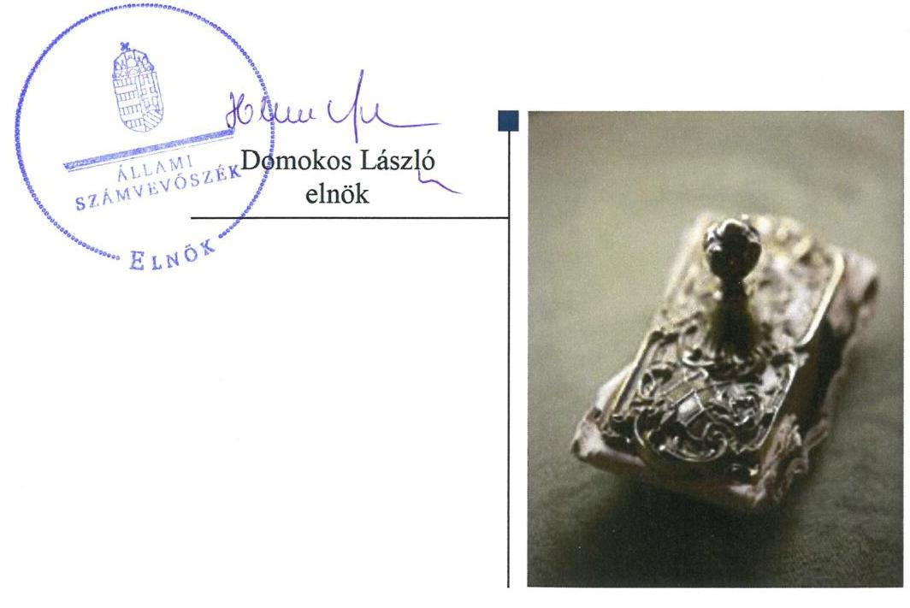
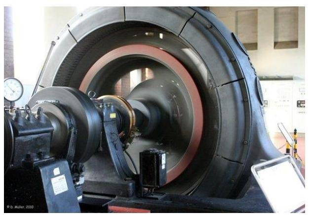
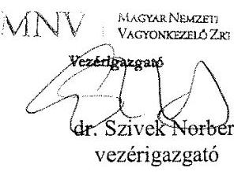
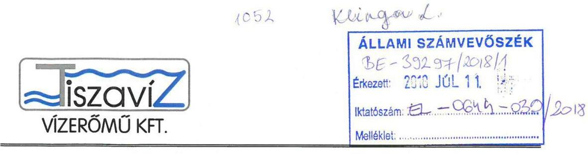
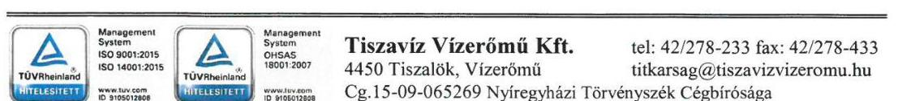
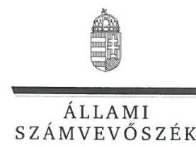
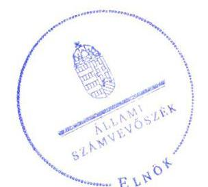
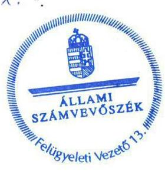

# Jelenetés 

## Az állami tulajdonú gazdasági társaságok ellenőrzése

Tiszavíz Vízerőmú Energetikai Kft. 2018.

18210
www.asz.hu

---

# Jelentés 

## Az állami tulajdonú gazdasági társaságok ellenőrzése

Tiszavíz Vízerőmú Energetikai Kft. 2018. 09. hó 17. nap

---

# AZ ELLENŐRZÉST FELÜGYELTE:

- **KLINGA LÁSZLÓ** felügyeleti vezető
- **AZ ELLENŐRZÉST VEZETTE ÉS A VÉGREHAJTÁSÁÉRT FELELŐS:**
  - **HOFMEISTER LÁSZLÓ** ellenőrzésvezető
  - **A PROGRAM ÖSSZEÁLLÍTÁSÁÉRT FELELŐS:**
    - **TÓTPÁL SZABOLCS** osztályvezető

**IKTATÓSZÁM:** EL-0423-026/2018

**TÉMASZÁM:** 2469

**ELLENŐRZÉS-AZONOSÍTÓ SZÁM:** V-081443

---

Jelentéseink az Országgyűlés számítógépes hálózatán és az Interneta a www.asz.hu címen is olvashatóak.

---

# TARTALOMJEGYZÉK 

■ ÖSSZEGZÉS ..... 5
■ AZ ELLENŐRZÉS CÉLJA ..... 6
■ AZ ELLENŐRZÉS TERÜLETE ..... 7
■ AZ ELLENŐRZÉS HÁTTERE, INDOKOLTSÁGA ..... 8
■ A JELENTÉS LÉNYEGES KÉRDÉSKÖREI ..... 9
■ AZ ELLENŐRZÉS HATÓKÖRE ÉS MÓDSZEREI ..... 10
■ MEGÁLLAPÍTÁSOK ..... 12
■ JAVASLATOK ..... 14
■ MELLÉKLETEK ..... 15
I. sz. melléklet: Értelmező szótár ..... 15
■ FÜGGELÉK: ÉSZREVÉTELEK ..... 17
■ RÖVIDÍTÉSEK JEGYZÉKE ..... 25

---

.

---

# ÖSSZEGZÉS 

A Tiszaviz Vizerőmú Energetikai Kft. feletti tulajdonosi joggyakorlás szabályszerű volt. A Társaság számviteli szabályozottsága nem volt megfelelő, pénzügyi gazdálkodása szabályszerű volt. A vagyongazdálkodása nem volt szabályszerű. A beszámolók hiteles és megbizható alátámasztásáról nem gondoskodtak a tárgyi eszközök tekintetében. A Társaság a közzétételre vonatkozó kötelezettségét teljesítette.

## Az ellenőrzés társadalmi indokoltsága

Az állami tulajdonú gazdálkodó szervezetek ellenőrzése kiemelten fontos a vagyon megőrzése, megóvása érdekében, valamint a kormányzati szektor elszámolásaiban megjelenő állami tulajdonú gazdálkodó szervezetek esetében, amelyekkel szemben alapvető követelmény, hogy gazdálkodásuk, múködésük szabályszerű, az általuk szolgáltatott adatok minél megbízhatóbbak legyenek.

Az Állami Számvevőszék stratégiájában célul tűzte ki az államháztartáson kívül működő szervezetek ellenőrzését, mely hozzájárul a közpénzek szabályos, átlátható, elszámoltatható és eredményes felhasználásához. A stratégiával összhangban került sor a Tiszavíz Vízérőmú Energetikai Kft. ellenőrzésére a 2013-2016. évekre vonatkozóan.

## Főbb megállapítások, következtetések, javaslatok

Az MNV Zrt. szabályszerűen alakította ki a felelős vagyongazdálkodáshoz szükséges követelményeket, a tulajdonosi jogokat szabályszerűen gyakorolta a Társaság felett.

A Társaság számviteli szabályozottsága az ellenőrzött időszakban nem volt szabályszerű, mivel nem rendelkezett az eszközök és a források értékelési szabályzatával, valamint az önköltségszámítási szabályzattal.

A vagyongazdálkodása nem volt szabályszerű, mert nem végeztek mennyiségi felvétellel történő leltározást a tárgyi eszközök tekintetében.

A Társaság bevételeinek és ráfordításainak elszámolása szabályszerű volt. A tulajdonosi joggyakorló és a jogszabály által előírt adatszolgáltatási kötelezettségét a Társaság teljesítette. Árképzése szabályszerű volt.

A megállapítások alapján az Állami Számvevőszék a Tiszavíz Vízérőmú Energetikai Kft. ügyvezetőjének négy javaslatot fogalmazott meg.

---

# AZ ELLENŐRZÉS CÉLJA 

Az ellenőrzés célja annak értékelése, hogy a tulajdonosi jogok gyakorlása szabályszerű volt-e. A gazdálkodó szervezet szabályozottsága, gazdálkodása és vagyongazdálkodási tevékenysége megfelelt-e a jogszabályi és a tulajdonosi előírásoknak; biztosítva volt-e a közfeladatok átláthatósága és elszámoltathatósága érdekében a közszolgáltatás díjának megalapozottsága szabályszerű önköltségszámítással. A vagyonváltozást eredményező döntések esetében a tulajdonosi jogok gyakorlója és a gazdálkodó szervezet szabályszerűen jártak-e el.

---

# **AZ ELLENŐRZÉS TERÜLETE**

## **Magyar Nemzeti Vagyonkezelő Zártkörűen Működő Részvénytársaság és a Tiszavíz Vízerőmű Energetikai Kft.**

Az 1996-ban alapított Társaság¹ az MNV Zrt.² tulajdonosi joggyakorlása alatt álló társasági portfólió része, 100%-ban állami tulajdonú gazdasági társaság. A Társaság nem tartozott a kormányzati szektorba sorolt egyéb szervezetek közé, vagyonkezelésbe vagyont nem vett át, saját tulajdonú vagyonával gazdálkodott.

Közfeladata az ország második legnagyobb folyójának, a Tiszának rendelkezésre álló, megújuló vízenergiájának hasznosítása villamos energia termelése céljából. A Társaság a két (Tiszalöki Vízerőmű és Kiskörei Vízerőmű) vízerőművében termelt villamos energiát a csatlakozó villamos hálózati elemeken keresztül a MAVIR Zrt.³-nek értékesítette.

A Társaság az ellenőrzött időszakban nyereségesen gazdálkodott, vagyona több mint 14 Mrd Ft-ra, mintegy 15%-kal emelkedett a 2016. évre az éves beszámolókban szereplő adatok alapján. A 2013-2016. évek között az adózott eredményből összesen 2,7 Mrd Ft osztalékot fizetett ki. Feladatellátása során támogatásban nem részesült.

Az átlagos állományi létszáma a 2013. évi 90 főről a 2016. évre 91 főre változott. A Társaság ügyvezetőjének személye 1996 óta változatlan.

---

# AZ ELLENŐRZÉS HÁTTERE, INDOKOLTSÁGA 

Az állami tulajdonú gazdálkodó szervezetek ellenőrzése kiemelten fontos a vagyon megőrzése, megóvása érdekében. Gazdálkodásuk jellemzően a közérdeklődés és a média figyelmének középpontjában áll, amihez hozzájárul a gazdálkodásuk körébe tartozó - közvetlen vagy közvetett állami tulajdonú, tehát végső soron a nemzeti vagyon részét képező - vagyon nagysága, illetve az általuk ellátott feladatok minősége és hatékonysága. A szolgáltatási árképzés megalapozottsága és a rendszeres elszámoltatás feltételeinek kialakítása az ellenőrzése során nagy hangsúlyt kap. A szolgáltatás árában és annak támogatásában meg kell jelennie az önköltségszámítás szempontjainak, amely biztosítja a múködés fenntarthatóságát (eszközpótlást) is.

Az ellenőrzés rámutathat az állami tulajdonú gazdálkodó szervezetek gazdálkodási tevékenységével jó gyakorlatokra és szabálytalanságokra. Felhívhatja a figyelmet a jogszabályi követelmények teljesítéséhez szükséges feltételek hiányosságaira, hozzájárulhat az államháztartáson kívüli, de (közvetlenül vagy közvetve) állami vagyont használó gazdálkodó szervezetek tevékenységének átláthatóságához. Ellenőrzésünk eredményeképpen javaslatainkkal, megállapításainkkal hozzájárulhatunk a nemzeti vagyonnal való gazdálkodás átláthatóságának, elszámoltathatóságának javításához.

---

# A JELENTÉS LÉNYEGES KÉRDÉSKÖREI 

1. A tulajdonosi jogok gyakorlása szabályszerű volt-e?
2. A társaság müködésének szabályozottsága, gazdálkodása és vagyongazdálkodása megfelel-e az elöírásoknak?

---

# AZ ELLENŐRZÉS HATÓKÖRE ÉS MÓDSZEREI 

## Az ellenőrzés típusa

Megfelelőségi ellenőrzés.

## Az ellenőrzött időszak

2013 - 2016. évek, a 2016. évi beszámoló jóváhagyásáig tartó időszak.

## Az ellenőrzés tárgya

Magyar Nemzeti Vagyonkezelő Zrt. tulajdonosi joggyakorlása, valamint a Tiszavíz Vízerőmű Energetikai Kft. gazdálkodása, kiemelten a vagyongazdálkodási tevékenysége volt az ellenőrzés tárgya.

Az ellenőrzés kiterjedt minden olyan körülményre és adatra, amely az ÁSZ ${ }^{4}$ jogszabályban meghatározott feladatainak teljesítéséhez, valamint a program végrehajtása folyamán felmerült újabb összefüggések feltárásához szükséges volt.

## Az ellenőrzött szervezet

Magyar Nemzeti Vagyonkezelő Zrt. és a Tiszavíz Vízerőmű Energetikai Kft.

## Az ellenőrzés jogalapja

Az ellenőrzés jogalapját az ÁSZ tv. ${ }^{5}$ 1. § (3) bekezdése és 5. § (3)-(5) bekezdése képezi.

## Az ellenőrzés módszerei

Az ellenőrzést a nemzetközi standardokat irányadónak tekintve az ellenőrzési program ellenőrzési kérdései, az ellenőrzött időszakban hatályos jogszabályok, az ellenőrzés szakmai szabályok és módszertanok figyelembe vételével végezzük.

Az ellenőrzés ideje alatt az ellenőrzött szervezettel történő kapcsolattartást az ÁSZ Szervezeti és Múködési Szabályzatának vonatkozó előírásai alapján biztosítjuk.

Az ellenőrzési kérdések megválaszolásához szükséges bizonyítékok megszerzése a következő ellenőrzési eljárások alkalmazásával történt: megfigyelés, kérdésfeltevés (információkérés), összehasonlítás, valamint

---

elemző eljárás. Az ellenőrzési bizonyítékként felhasználható adatforrások közé tartoznak egyrészt az ellenőrzési programban felsorolt adatforrások, másrészt adatforrás lehet még minden - az ellenőrzés folyamán - feltárt, az ellenőrzés szempontjából információkat tartalmazó dokumentum.

Az ellenőrzést a kérdésekre adott válaszok kiértékelésével, valamint a megjelölt adatforrások, a csatolt tanúsítványok felhasználásával, továbbá az adott időszakban hatályos jogszabályok figyelembevételével folytattuk le.

A teljes ellenőrzött időszakra vonatkozóan került ellenőrzésre a gazdasági társaság tervezési, beszámolási, közzétételi, adatszolgáltatási kötelezettségének, valamint belső ellenőrzési tevékenységének szabályszerűsége. A 2013. és 2016. évekre vonatkozóan a gazdasági társaság múködésének szabályozottságát, a bevételei és ráfordításai elszámolását, illetve vagyongazdálkodásának szabályszerűségét is ellenőriztük.

A bevételek és a ráfordítások közül az értékesítés nettó árbevétele, az egyéb, rendkívüli és pénzügyi műveletek bevételei, a személyi jellegű ráfordítások, az anyagjellegú ráfordítások, az egyéb, rendkívüli és pénzügyi műveletek ráfordításai, valamint értékcsökkenési leírás elszámolásának szabályszerűségét, továbbá az immateriális javak, tárgyi eszközök esetében a vagyonnyilvántartás szabályszerűségét véletlen mintavétellel ellenőriztük.

A fenti sokaságok esetében a mintavétel azokra a legnagyobb értékű tételekre - a lényeges sokaságra - terjedt ki, melyek összértéke eléri a teljes sokaság összértékének 50\%-át. A személyi jellegű ráfordítások esetében a mintavétel a teljes sokaságból történt. Amennyiben valamely ellenőrzött sokaság elemszáma kisebb volt, mint az előírt mintaelemszám, a lényeges sokaságot tételesen ellenőriztük.

A mintavétellel ellenőrzött területek esetében minden egyes tétel vonatkozásában a szabályszerűségre vonatkozó kérdéseket tettünk fel, amelyek eredménye összesítésre került. „Szabályszerűnek" értékeltünk egy ellenőrzött területet, amennyiben 95\%-os bizonyossággal az ellenőrzött sokaságban az átlagos hibaarány legfeljebb 10\%, "nem szabályszerűnek", amennyiben 10\%-nál magasabb arányt képviselt.

---

# 1. A tulajdonosi jogok gyakorlása szabályszerű volt-e? 

Összegző megállapítás Az MNV Zrt. tulajdonosi joggyakorlása szabályszerű volt.
A TULAJDONOSI JOGGYAKORLÁS szabályait az MNV Zrt. az Alapító okirat ${ }_{1-10}{ }^{8}$-ban szabályozta. Az MNV Zrt. a Társaság Alapító okiratában meghatározta a tulajdonosi jogokat, továbbá kinevezte a Társaság ügyvezetőjét, kijelölte az $\mathrm{FB}^{7}$ tagokat. Az FB három főből állt a Gt. ${ }^{8}$-ben, majd a Ptk. ${ }^{9}$-ban előírtaknak megfelelően. Az MNV Zrt. SZMSZ ${ }^{10}$-ében a Vtv. ${ }^{11}$-ben előírtakkal összhangban rögzítette az MNV Zrt. Igazgatósága döntési hatáskörét.

Az MNV Zrt. a tervezési irányelveiben és az Alapító okirat ${ }_{1-10}$-ban előírta az üzleti terv készítési kötelezettséget, melyet a Társaság minden évben elkészített és az MNV Zrt. jóváhagyott.

Az MNV Zrt. Igazgatósága a Taktv. ${ }^{12}$ rendelkezéseivel összhangban elkészítette a Társaság Javadalmazási szabályzat ${ }^{13}$-át.

A KÖNYVVIZSGÁLÓT az MNV Zrt. szabályszerűen megválasztotta. Az Alapító okirat ${ }_{1-10}$ tartalmazta a könyvvizsgáló személyével, múködésével kapcsolatos hatásköröket, feladatokat.

MONITORING TEVÉKENYSÉG előírásait az MNV Zrt. vezérigazgatója a tulajdonosi joggyakorlás keretében a Monitoring szabály-zat ${ }_{1,2}{ }^{14}$-ban rögzítette. A Társaság a gazdasági adatainak alakulását megküldte az előírt havi és negyedéves adatszolgáltatás keretében. Az MNV Zrt. az éves beszámoló jóváhagyásáról minden évben az FB írásbeli jelentésének és a könyvvizsgáló írásbeli véleményének birtokában határozott.

## 2. A társaság múködésének szabályozottsága, gazdálkodása és vagyongazdálkodása megfelelt-e az előírásoknak?

Összegző megállapítás

A Társaság múködésének szabályozottsága nem volt szabályszerű. A pénzügyi gazdálkodása szabályszerű volt. A vagyongazdálkodása nem volt szabályszerű, mert a tárgyi eszközök vonatkozásában a mennyiségi felvétellel történő leltározást nem végezték el.
2.1. számú megállapítás

A Társaság számviteli szabályozottsága nem volt szabályszerű, kötelező számviteli szabályzatok hiányoztak.

A Társaság rendelkezett a Számv. tv. ${ }^{15}$ által előírt Számviteli politika ${ }_{1-3}{ }^{16}$-val, Pénzkezelési szabályzat ${ }^{17}$-tal és Számlarend ${ }^{18}$-del, melyek tartalma megfelelt a jogszabály előírásának.

---

Leltározási szabályzat ${ }_{1-2}{ }^{19}$-tal rendelkeztek az ellenőrzött időszakban, azonban annak 4.1. pontja nem volt összhangban a Számv. tv. 69. § (3) bekezdésében foglalt, a legalább 3 évente, mennyiségi felvétellel végzendő leltározásra vonatkozó előírással, mert ingatlanok esetén 5 évente történő leltározást írtak elő.

A Társaság eszközök és források értékelési szabályzatával nem rendelkezett, ezáltal nem tett eleget a Számv. tv. 14. § (5) bekezdés b) pontja előírásának.

A Társaság az önköltségszámítás rendjére vonatkozó belső szabályzattal nem rendelkezett, ezáltal nem tett eleget a Számv. tv. 14. § (5) bekezdés c) pontja előírásának.
2.2. számú megállapítás

A Társaság bevételeinek és ráfordításának elszámolása szabályszerű volt. Nem végeztek mennyiségi felvétellel történő leltározást a tárgyi eszközök tekintetében. A közzétételi kötelezettségnek eleget tettek.

A BEVÉTELEK ÉS A RÁFORDÍTÁSOK elszámolása szabályszerű volt. Az elszámolásokra a Számv. tv-ben előírtaknak megfelelő főkönyvi számlákon, szabályszerű számviteli bizonylatokkal alátámasztva került sor.

A TÁRSASÁG ÁRKÉPZÉSE szabályszerű volt. Az értékesített villamos energia díja a 389/2007. (XII. 23.) Korm. rendelet ${ }^{20}$-ben rögzített hatósági ár alapján került meghatározásra.

AZ ÉVES BESZÁMOLÓT a Társaság a Számv. tv. előírásának megfelelő határidőben elkészítette, a letétbe helyezési és közzétételi kötelezettséget szabályszerűen teljesítette.

A Társaságnál a 2013-2016. évek egyikében sem támasztották alá mennyiségi felvétellel történő leltározással a tárgyi eszközök mérlegben kimutatott értékét, ezzel megsértették a Számv. tv. 69. § (3) bekezdésének előírásait, amely legalább háromévenkénti mennyiségi felvétellel történő leltározást írt elő.

Az éves beszámolók mérlegsorait a Társaság a szabályszerű leltárakkal alátámasztotta, az analitikus nyilvántartásokat és a főkönyvi számlákat az előírások szerint egyeztette.

A KÖNYVVIZSGÁLÓ a tárgyi eszközök mennyiségi felvétellel történő leltározás elmaradása ellenére a beszámolót minden évben korlátozás nélküli hitelesítő záradékkal látta el.

A KÖZÉRDEKŰ ADATOK közzétételére vonatkozó kötelezettségét a Társaság teljesítette. Az Info tv. ${ }^{21}$ 24. § (3) bekezdésének előírása ellenére adatvédelmi és adatbiztonsági szabályzattal nem rendelkezett.

---

# JAVASLATOK 

Az ÁSZ tv. 33. § (1) bekezdésében foglaltak értelmében az ellenőrzött szervezet vezetője köteles a jelentésben foglalt megállapításokhoz kapcsolódó intézkedési tervet összeállítani és azt a jelentés kézhezvételétől számított 30 napon belül az ÁSZ részére megküldeni. Amennyiben az ellenőrzött szervezet vezetője nem küldi meg határidőben az intézkedési tervet, vagy továbbra sem elfogadható intézkedési tervet küld, az Állami Számvevőszék elnöke az ÁSZ tv. 33. § (3) bekezdése a) és b) pontjaiban foglaltakat érvényesítheti.

## Tiszavíz Vízerőmú Energetikai Kft. ügyvezetőjének

1. Intézkedjen a leltározási szabályzat ingatlanok mennyiségi leltározására vonatkozó előirásának Számv. tv. előírásai figyelembevételével történő módosításáról.
(2.1. sz. megállapítás 2. bekezdése alapján)
2. Intézkedjen a Számv. tv.-ben előírtaknak megfelelően az eszközök és források értékelési szabályzatának elkészitéséről.
(2.1. sz. megállapítás 3. bekezdése alapján)
3. Intézkedjen a Számv. tv.-ben előírtaknak megfelelően az önköltségszámítás rendjére vonatkozó belső szabályzat elkészitéséről.
(2.1. sz. megállapítás 4. bekezdése alapján)
4. Intézkedjen a tárgyi eszközök mennyiségi felvétellel történő leltározásának Számv. tv.-ben elöirt gyakorisággal történő elvégzéséről.
(2.2. sz. megállapítás 4. bekezdése alapján)

---

# MELLÉKLETEK 

- I. SZ. MELLÉKLET: ÉRTELMEZŐ SZÓTÁR
állami vagyon
gazdasági társaság

MNV Zrt.
nemzeti vagyon
a) Az állam tulajdonában lévő dolog, valamint a dolog módjára hasznosítható természeti erő,
b) az a) pont hatálya alá nem tartozó mindazon vagyon, amely vonatkozásában törvény az állam kizárólagos tulajdonjogát nevesíti,
c) az állam tulajdonában lévő tagsági jogviszonyt megtestesítő értékpapír, illetve az államot megillető egyéb társasági részesedés,
d) az államot megillető olyan immateriális, vagyoni értékkel rendelkező jogosultság, amelyet jogszabály vagyoni értékű jogként nevesít.
Forrás: Vtv. 1. § (2) bekezdése
2012. november 10-től az állami vagyon fogalma kiegészül a következő ponttal:
e) az állam tulajdonában lévő pénzügyi eszközök
Forrás: Vtv. 1. § (2) bekezdése
A Ptk. 3:88. § (1) bekezdése szerint „a gazdasági társaságok üzletszerű közös gazdasági tevékenység folytatására, a tagok vagyoni hozzájárulásával létrehozott, jogi személyiséggel rendelkező vállalkozások, amelyekben a tagok a nyereségből közösen részesednek, és a veszteséget közösen viselik".
Az állami vagyon felett, a Magyar Államok megillető tulajdonosi jogok és kötelezettségek összességét - a hatályos szabályozás szerint - az állami vagyon felügyeletéért felelős miniszter (jelenleg a nemzeti fejlesztési miniszter) gyakorolja. A miniszter feladatát nagy részben az MNV Zrt., mint tulajdonosi joggyakorló szervezet útján látja el.
a) az állam vagy a helyi önkormányzat kizárólagos tulajdonában álló dolgok,
b) az a) pont hatálya alá nem tartozó, állam vagy a helyi önkormányzat tulajdonában lévő dolog,
c) az állam vagy a helyi önkormányzatot tulajdonában lévő pénzügyi eszközök, továbbá az államot vagy a helyi önkormányzatot megillető társasági részesedések,
d) az államot vagy a helyi önkormányzatot megillető bármely vagyoni értékkel rendelkező jogosultság, amelyet jogszabály vagyoni értékű jogként nevesít,
e) Magyarország határa által körbezárt terület feletti légtér,
f) az üvegházhatású gázok kibocsátási egységeinek kereskedelméről szóló törvény szerint kibocsátási egység és légiközlekedési kibocsátási egység, valamint az ENSZ Éghajlatváltozási Keretegyezménye és annak Kiotói Jegyzőkönyv végrehajtási keretrendszeréről szóló törvény szerinti kiotói egység,
g) állami vagy helyi önkormányzati fenntartású közgyűjtemény (muzeális intézmény, levéltár, közgyűjteményként működő kép- és hangarchívum, valamint könyvtár) saját gyűjteményében nyilvántartott kulturális javak körébe tartozó dolog, kivéve, ha az állami vagy önkormányzati tulajdon jogszerű létrejötte kétséget kizáró módon nem bizonyítható és a dologra nézve más a tulajdonjogát bizonyítja vagy a kulturális javakra vonatkozó jogszabályokban meghatározott eljárás keretében valószínűsíti (g. pont módosult 2013. december 7től),
h) a régészeti lelet,

---

tulajdonosi ellenőrzés
tulajdonosi jogok gyakorlója
i) a nemzeti adatvagyon körébe tartozó állami nyilvántartások fokozottabb védelméről szóló törvény szerinti nemzeti adatvagyon.
Forrás: Nvtv. ${ }^{22}$ 1. § (2)
2014. március 14-ig:

Az állami vagyon kezelőjét, haszonélvezőjét, használóját megillető jogok gyakorlását, annak szabályszerűségét, célszerűségét az MNV Zrt. - szükség szerint területi szervei útján - ellenőrzi.
2014. március 15-től:

Az állami vagyon használóját, vagyonkezelőjét és haszonélvezőjét megillető jogok gyakorlását, annak szabályszerűségét, a kötelezettségek teljesítését, valamint a vagyon rendeltetése szerinti célszerűségét a tulajdonosi joggyakorló ${ }_{3}$ rendszeresen ellenőrzi.
Forrás: Vhr. ${ }^{23}$ 20. § (1)
1.
2013. június 27-ig:

Az állami vagyon felett a Magyar Államot megillető tulajdonosi jogok és kötelezettségek összességét - ha törvény eltérően nem rendelkezik - az állami vagyon felügyeletéért felelős miniszter (a továbbiakban: miniszter) gyakorolja, aki e feladatát a Magyar Nemzeti Vagyonkezelő Zártkörűen Müködő Részvénytársaság (a továbbiakban: MNV Zrt.), a Magyar Fejlesztési Bank, illetve a tulajdonosi joggyakorló szervezet útján látja el. A miniszter miniszteri rendeletben, a törvényben meghatározott állami vagyoni kör tekintetében, meghatározott időtartamra, a joggyakorlás egyes szabályainak meghatározásával - az őt megillető tulajdonosi jogok és kötelezettségek összességének, illetve azok meghatározott részének gyakorlóját az Áht. szerinti központi költségvetési szervek, ezek intézménye, továbbá a 100\%-ban állami tulajdonban álló gazdasági társaságok közül kijelölheti. Forrás: Vtv. 3. § (1) és (2)
2013. június 28-ától:

A rábízott állami vagyon felett az államot megillető tulajdonosi jogok és kötelezettségek összességét tulajdonosi joggyakorlóként:
a) ha törvény vagy miniszteri rendelet eltérően nem rendelkezik, a Magyar Nemzeti Vagyonkezelő Zártkörűen Müködő Részvénytársaság (a továbbiakban: MNV Zrt.),
b) törvényben kijelölt személy vagy
c) az állami vagyon felügyeletéért felelős miniszter (a továbbiakban: miniszter) által rendeletben kijelölt személy gyakorolja.
[...] A miniszter e törvény felhatalmazása alapján - a meghatározott célok hatékonyabb elérése érdekében, miniszteri rendeletben, az ott meghatározott állami vagyoni kör tekintetében, meghatározott időtartamra - e törvény keretei között, a joggyakorlás egyes szabályainak meghatározásával - az államot megillető tulajdonosi jogok és kötelezettségek összességének, illetve azok meghatározott részének gyakorlóját az Áht. szerinti központi költségvetési szervek, ezek intézménye, továbbá a 100\%-ban állami tulajdonban álló gazdasági társaságok közül kijelölheti.
Forrás: Vtv. 3. § (1) és (2)
2.

Aki a nemzeti vagyon felett az államot vagy a helyi önkormányzatot megillető tulajdonosi jogok és kötelezettségek összességének gyakorlására jogosult
Forrás: Nvtv. 3. § (1) 17. pontja

---

# FÜGGELÉK: ÉSZREVÉTELEK 

A jelentéstervezetet a Számvevőszék 15 napos észrevételezésre megküldte az ellenőrzött szervezet vezetőjének az ÁSZ tv. 29. §* (1) bekezdése előírásának megfelelően.

A Magyar Nemzeti Vagyonkezelő Zrt. vezérigazgatója az ÁSZ tv. 29. § (2) bekezdésében foglalt észrevételezési jogával nem élt, írásban jelezte, hogy a jelentéstervezetre észrevételt nem tesz. A Tiszaviz Vízérőmü Energetikai Kft. ügyvezetőjének észrevételét és az arra adott választ a jelentés függeléke tartalmazza.

[^0]
[^0]:    * 29. § (1) Az Állami Számvevőszék az ellenőrzési megállapításait megküldi az ellenőrzött szervezet vezetőjének vagy az általa megbízott személynek, és annak, akinek személyes felelősségét állapította meg.
    (2) Az ellenőrzött szervezet vezetője és a felelősként megjelölt személy az ellenőrzés megállapításaira tizenöt napon belül írásban észrevételt tehet.
    (3) Az Állami Számvevőszék az észrevételre a beérkezésétől számított harminc napon belül írásban válaszol. A figyelembe nem vett észrevételeket köteles a jelentésben feltüntetni, és megindokolni, hogy azokat miért nem fogadta el.

---

# Állami Számvevőszék 

## Domokos László

elnök

1052 Budapest
Apáczai Cs. J. u. 10.

Ikt. sz.: MNV/01/8507/ 4 /2018.
Hiv. sz.: EL-0644-037/2018.

Tisztelt Elnök Úr!
Tájékoztatom, hogy az MNV Zrt. a 2018. július 2. napján „Állami tulajdonú (résztulajdonú) gazdasági társaságok ellenörzése - Tiszaviz Vizerőmü Energetikai Kft. " tárgyában kézhez vett, EL-0644-037/2018. ikt. sz. Jelentés-tervezetre nem kíván észrevételt tenni.

Budapest, 2018. július „, 11. "

Üdvözlettel:

---

ÁSZ iktatószám: EL-0644-036/2018.

# ÁLLAMI SZÁMVEVŐSZÉK   Domokos László 

elnök

## 1052 Budapest

Apáczai Csere János utca 10.
tárgy: írásbeli észrevétel jelentéstervezethez

## Tisztelt Elnök Úr!

Köszönettel megkaptuk az EL-0644-036/2018. iktatószámú, 2018. június 29-én érkezett, „Az állami tulajdonú gazdasági társaságok ellenőrzése - Tiszaviz Vizerőmü Energetikai Kft." címmel készített számvevőszéki jelentéstervezetet.

A Társaságunk, a Tiszavíz Vizerőmủ Energetikai Korlátolt Felelősségủ Társaság a megalapításától kezdve, az elmúlt években is arra törekedett, hogy a Tisza folyó megújuló vízenergiáját eredményesen és a tulajdonosi elvárásoknak megfelelően hasznosítsa vízerőműveinkben a villamos energia termeléséhez, a jogszabályi előírások szerinti értékesítéséhez és eredményes gazdálkodást folytasson. Szándékaink szerint tevékenységünket a jogszabályi előírások betartásával - vagy attól szigorúbb feltételek alkalmazásával törekszünk végezni, ugyanakkor készségesen fogadjuk mindazon észrevételeket, melyeket hasznosítva javíthatjuk a szervezett munkánkat.

Ezen elvek mentén haladva tekintettük át az Önök jelentéstervezetét. Az ÁSZ tv. 29. § (2) bekezdése szerinti lehetőséggel élve a megküldött jelentéstervezetükhöz az alábbi észrevételeket tesszük.

Az 5. oldalon olvasható „Főbb megállapítások, következtetések, javaslatok" között az szerepel, hogy „A Társaság számviteli szabályozottsága az ellenőrzött időszakban nem volt szabályszerű, mivel nem rendelkezett az eszközök és a források értékelési szabályzatával, valamint az önköltségszámítási szabályzattal."

---

Ezen megállapításokra, illetve a 2.1. számú megállapításban olvashatókra reagálva jelezzük, hogy a Társaságnál - mint ahogy azt a 2018. március 6-án kelt 146-8/2018. iktatószámú levelünkben is ismertettük - a számvitelről szóló 2000 . évi C. törvény (a továbbiakban: Sztv.) 14. §-a (5) szerint a számviteli politika keretében önálló szabályzatként elkészítve 2001-től rendelkezünk a jelenleg is érvényes Értékelési Szabályzattal (melyet a jelen levelünkhöz csatolt elektronikus adathordozóra ismételten feltöltöttünk).

Jelezzük továbbá, hogy a Társaságunk a megújuló vízenergiából termelt villamos energiát a villamos energiáról szóló 2007. évi LXXXVI. törvény és a megújuló energiaforrásból vagy hulladékból nyert energiával termelt villamos energia, valamint a kapcsolat tenelt villamos energia kötelező átvételéről és átvételi áráról szóló 389/2007. (XII.23.) Korm. rendelet (KR) alapján az 5 MW-nál nagyobb teljesítményű vízerőművekre meghatározott díjakért értékesíti a MAVIR Zrt. részére (a díjtáblázatot a jelen levelünkhöz csatolt elektronikus adathordozóra feltöltöttük). Ezen körülményre tekintettel jeleztük azt, hogy a 10. számú tanúsítvány a Társaságunk tekintetében nem releváns, hiszen a Társaságunk nem képez szolgáltatási/köszzolgáltatási díjat. De ettől függetlenül rendelkezünk a számvitelről szóló 2000. évi C. törvény (a továbbiakban: Sztv.) 14. §-a (5) szerint a számviteli politika keretében önálló szabályzatként elkészített, 2001-től ugyancsak hatályos Önköltségszámítási Szabályzattal (melyet a jelen levelünkhöz csatolt elektronikus adathordozóra feltöltöttünk).

Köszönjük a Leltározási Szabályzatunkban olvasható időtartamokkal kapcsolatos megállapítást, melyet a szabályozási dokumentumban aktualizálni fogunk, de jelezzük, hogy ezen időtartamoktól eltérően az alábbiakban ismertetettek szerinti szigorúbb előírások alkalmazásával kívánunk megfelelni az elvárásoknak.

Az 5. oldalon olvasható „Főbb megállapítások, következtetések, javaslatok" között az, hogy a Társaság „vagyongazdálkodása nem volt szabályszerü, mert nem végeztek mennyiségi felvétellel történő leltározást a tárgyi eszközök tekintetében.", továbbá a 2.2. számú megállapítás 4. bekezdés leltározásra vonatkozó megállapítására hivatkozva jelezzük, hogy a Társaságunk évente végez leltározást. Az erre vonatkozóan (a vizsgálati időszakokhoz tartozóan) tájékoztatást adunk arról, hogy a 11/2013. számú, a 8/2014. számú, a 7/2015. számú és a 4/2016. számú Ügyvezető Igazgatói Utasítás került kiadásra az adott évek december 31-i fordulónappal kezdődő leltározáshoz. Ezekhez rendre elkészültek a 2013. évi, a 2014. évi, a 2015. évi és a 2016. évi Leltározási Ütemtervek (melyeket a jelen levelünkhöz csatolt elektronikus adathordozóra feltöltöttünk). Ezek tételesen tartalmazzák a tárgyi eszközök vonatkozásában a mennyiségi felvétellel történő leltározásra vonatkozó előírásokat. A tárgyieszköz-leltár leltárfelvételi lapjait a jelen levelünkhöz csatolt elektronikus adathordozóra feltöltöttünk, amelyek megalapozták az éves leltárösszesítők elkészítését. Az éves leltárösszesítő dokumentumokat a Társaságunk az adatbekérések alkalmával az ÁSZ elektronikus felületére feltöltötte.

Bízunk benne, hogy az előző bekezdésben a leltározással kapcsolatos adatközlésünk alapján a Könyvvizsgálóra vonatkozó megjegyzésük is átértékelésre kerül.

A 14. oldalon olvasható, az ügyvezetőnek nevesített „Javaslatok" közül az 1. ponthoz kapcsolódva, mely szerint „Intézkedjen a leltározási szabályzat ingatlanok mennyiségi leltározására vonatkozó előirásainak Számv. tv. előirásai figyelembevételével történő módosításáról." tájékoztatást adok arról, hogy a 2018. március 20-án kiadott 2018. évi Teljesítményösztönző kiírásban 2018. november 15-i teljesítési határidővel a gazdasági vezető részére nevesítésre került a Társaság által alkalmazott számlarend, bizonylati rend, leltározási

---

szabályzat, önköltség számítási szabályzat, selejtezési ügyrend, valamint a pénzkezelési szabályzat átvizsgálása és jogszabályi szüksége esetén a módosítási javaslattal történő kiegészítése. Azt feltételezem, hogy ezen kiírással az Önök jelentéstervezetének megismerése előtt a szükséges intézkedést megtettem.

A 14. oldalon olvasható, az ügyvezetőnek nevesített „Javaslatok" közül a 2. pont szerinti „Intézkedjen a Számv. tv-ben elöirtaknak megfelelöen az eszközök és források értékelési szabályzatának elkészitéséröl.", illetve a 3. pont szerinti „Intézkedjen a Számv. tv-ben elöirtaknak megfelelően az önköltségszámítás rendjére vonatkozó belső szabályzat elkészitéséről." feladat az előzőekben már ismertetettek szerint a 2001-től hatályos szabályzatokkal már teljesítésre került.

A 14. oldalon olvasható, az ügyvezetőnek nevesített „Javaslatok" közül a 4. pont szerinti „Intézkedjen a tárgyi eszközök mennyiségi felvétellel történő leltározásának Számv. tv-ben elöirt gyakorisággal történő elvégzéséről." feladathoz képest az előzőekben már ismertetettek szerint, a Számv. tv-ben meghatározott gyakorisághoz képest szigorúbb időmeghatározással évenkénti leltározással teljesítésre került (a tárgyieszköz leltár leltárfelvételi lapjait a jelen levelünkhöz csatolt elektronikus adathordozóra feltöltöttünk). Amennyiben ezt elfogadhatónak tartják, akkor folytatni kívánjuk a tárgyi eszközöknél is az évenkénti mennyiségi felvétellel történő leltározást.

# Tisztelt Elnök Úr! 

Szíves elnézésüket kérem azért, ha az Önök által megküldött adatlapok értelmezése során esetlegesen félreértés történt, és nem az Önök által elvárt dokumentációk kerültek feltöltésre. Ezek a dokumentációk rendelkezésre állták a vizsgálat megkezdése időpontjában is, így azt gondolom, egyértelműen megállapítható, hogy mindössze értelmezési problémáról, és nem valós hiányosságról van szó. A Társaságunk törekedni fog arra, hogy az elkövetkezőkben amennyiben erre igény merül fel - Önökkel az ellenőrzéseik során hatékony kommunikációt tartson fenn.

Kérem, hogy a jelen levelemben tett észrevételeinket a Társaságunkról nyilvánosságra hozandó jelentésük véglegesítése során figyelembe venni szíveskedjenek!

Tiszalök, 2018. július 06.

Tisztelettel:
TISZAVIZ VIZZERŐMÚ KFT.
Ötvös Pál
ügyvezető igazgató

---

# ELHök 

Ikt.szám: EL-0644-042/2018.

## Ötvös Pál úr

ügyvezető igazgató
Tiszavíz Vízerőmủ Energetikai Kft.

## Tiszalök

## Tisztelt Ügyvezető Úr!

Köszönettel vettem „, Az állami tulajdonú gazdasági társaságok ellenőrzése - Tiszavíz Vízerőmü Energetikai Kft." című ellenőrzésről készített számvevőszéki jelentéstervezetre megküldött észrevételeit.
Az Állami Számvevőszék észrevételekre vonatkozó álláspontját a felügyeleti vezető által készített részletes tájékoztatás tartalmazza, amelyet levelemhez mellékeltem.
Tájékoztatom Ügyvezető urat, hogy az Állami Számvevőszék a figyelembe nem vett észrevételeket az Állami Számvevőszékről szóló 2011. évi LXVI. törvény 29. § (3) bekezdésében előírtak szerint köteles a jelentésében feltüntetni és megindokolni, hogy azokat miért nem fogadta el.

Budapest, 2018. 08. hó 01. nap

Tisztelettel:

Tisztelettel:

Melléklet: Tájékoztatás az észrevételek kezeléséről

---

# Tájékoztatás az észrevételek kezeléséről 

Megköszönöm Ügyvezető úrnak „Az állami tulajdonú gazdasági társaságok ellenőrzése Tiszaviz Vizerőmü Energetikai Kft." címmel készített jelentés-tervezetre tett észrevételeit. Az észrevételek kezeléséről az alábbi tájékoztatást adom

1. A jelentéstervezet Föbb megállapítások, következtetések, javaslatok 2. bekezdéséhez, a 2.1. számú megállapítás 3. és 4. bekezdéséhez, valamint a 2. és 3. számú javaslathoz füzött észrevétele kapcsán

Ügyvezető úr észrevételében jelezte, hogy a jelentéstervezetben hiányosságként megállapított eszközök és források értékelési szabályzatával, valamint önköltségszámítási szabályzattal rendelkezik a Társaság, a szabályzatokat elektronikus adathordozón az észrevételhez csatolták.
Az Állami Számvevőszék (továbbiakban: ÁSZ) az ellenőrzését a megküldött ellenőrzési programnak megfelelően, a rendelkezésre bocsátott adatok és dokumentumok (bizonyitékok) alapján végezte. Az Állami Számvevőszékről szóló 2011 . évi LXVI. törvény (továbbiakban ÁSZ tv.) 28. § (2) bekezdése alapján a közremüködésre felhívott szervezet az ÁSZ részére - annak kérésére soron kívül, de legkésőbb öt munkanapon belül - az ellenőrzés lefolytatása érdekében a szükséges adatokat és dokumentumokat rendelkezésre bocsátja. A bekért dokumentumok között - mint azt Ön sem vitatja - nem került feltöltésre az eszközök és források értékelési szabályzat, valamint az önköltségszámítási szabályzat. A hiányzó szabályzatokat a bekért adatokra vonatkozó teljességi és hitelességi nyilatkozat nem tartalmazta. Az adatszolgáltatási szakasz a teljességi és hitelességi nyilatkozattal lezárult, ezért az észrevételéhez csatolt dokumentumok ellenőrzési bizonyítékként már nem felhasználhatók. Fentiekre tekintettel észrevételét nem fogadom el, így a jelentéstervezet módosítása nem indokolt.

## 2. A jelentéstervezet 1. számú javaslatához füzött észrevétele kapcsán

Ügyvezető úr észrevételében jelezte, hogy a javaslatainkból eredően a gazdálkodási szabályzatok - számlarend, bizonylati rend, leltározási szabályzat, önköltségszámítási szabályzat, selejtezési ügyrend, valamint a pénzkezelési szabályzat - Számv. tv. előírásaival való összhangjának megteremtése érdekében történő módosítására, kiegészítésére intézkedett. A tájékoztatást köszönettel tudomásul vettem. Az észrevétel a megállapítást nem vitatta, ezért a jelentéstervezet módosítása nem indokolt.
3. A jelentéstervezet Föbb megállapítások, következtetések, javaslatok 3. bekezdéséhez, a 2.2. számú megállapítás 4. bekezdéséhez, valamint a 4. számú javaslathoz füzött észrevétele kapcsán

---

Ügyvezető úr észrevételében jelezte, hogy a Társaság évente végzett leltározást. Az éves leltárösszesítő dokumentumait a Társaság az adatbekérés alkalmával az ÁSZ elektronikus felületére feltöltötte. A tárgyi eszköz leltár leltárfelvételi lapjait az észrevételhez csatolt elektronikus adathordozóra feltöltötte.
A jelentéstervezet a tárgyi eszközök vonatkozásában tett megállapítást a mennyiségi felvétellel történő leltározás elmaradására. A dokumentumok ismételt felülvizsgálata során megállapítottam, hogy az EL-0423-003/2017. iktatószámú adatbekérő levél alapján Társaság által megküldött, a 2017. december 12-i keltezésű teljességi és hitelességi nyilatkozat 19. tételeként feltüntetett 2013-2016. évi éves leltárösszesítők nem tartalmazzák a tárgyi eszközök leltározásának dokumentumait. Az adatszolgáltatási szakasz a teljességi és hitelességi nyilatkozattal lezárult, ezért az észrevételéhez csatolt dokumentumok ellenőrzési bizonyítékként már nem felhasználhatók. Az előzőek alapján észrevételét nem fogadom el, így a jelentéstervezet módosítása nem indokolt.

Budapest, 2018. augusztus " $1 .{ }^{\prime \prime}$.

Tisztelettel:

Klinga László

---

# RÖVIDÍTÉSEK JEGYZÉKE 

${ }^{1}$ Társaság
${ }^{2}$ MNV Zrt.
${ }^{3}$ MAVIR Zrt.
${ }^{4}$ ÁSZ
${ }^{5}$ ÁSZ tv.
${ }^{6}$ Alapító okirat ${ }_{1-10}$
${ }^{7}$ FB
${ }^{8} \mathrm{Gt}$.
${ }^{9}$ Ptk.
${ }^{10}$ MNV Zrt. SZMSZ
${ }^{11}$ Vtv.
${ }^{12}$ Taktv.
${ }^{13}$ Javadalmazási szabályzat
${ }^{14}$ Monitoring szabályzat ${ }_{1,2}$
${ }^{15}$ Számv. tv.
${ }^{16}$ Számviteli politika ${ }_{1-3}$
${ }^{17}$ Pénzkezelési szabályzat
${ }^{18}$ Számlarend ${ }_{1-2}$
${ }^{19}$ Leltározási szabályzat ${ }_{1-2}$

Tiszavíz Vízerőmű Energetikai Kft.
Magyar Nemzeti Vagyonkezelő Zártkörűen Működő Részvénytársaság
Magyar Villamosenergia-ipari Átviteli Rendszerirányító Zártkörűen Működő Részvénytársaság
Állami Számvevőszék
2011. évi LXVI. törvény az Állami Számvevőszékről (hatályos: 2011. július 1-jétől)

Társaság Alapító okirata ${ }_{1}$ (hatályos 2012. június 14-től); Társaság Alapító okirata ${ }_{2}$ (hatályos 2013. március 18-tól); Társaság Alapító okirata3 (hatályos 2013. május 22-től); Társaság Alapító okirata4 (hatályos 2014. március 11-től); Társaság Alapító okirata5 (hatályos 2014. május 28-tól); Társaság Alapító okirata6 (hatályos 2015. március 23-tól); Társaság Alapító okirata7 (hatályos 2015. október 26tól);Társaság Alapító okirata8 (hatályos 2015. december 15-től); Társaság Alapító okirata9 (hatályos 2016. május 18-tól); Társaság Alapító okirata10 (hatályos 2016. június 30-tól);
Tiszavíz Vízerőmű Energetikai Kft. felügyelőbizottsága
2006. évi IV. törvény a gazdasági társaságokról (hatálytalan 2014. március 15-től) 2013. évi V. törvény a Polgári Törvénykönyvről (hatályos 2014. március 15-től) Magyar Nemzeti Vagyonkezelő Zártkörűen Működő Részvénytársaság Szervezeti és Működési Szabályzata (hatályos 2011. május 30-tól)
2007. évi CVI. törvény az állami vagyonról (hatályos 2007. szeptember 17-től) 2009. évi CXXII. törvény a köztulajdonban álló gazdasági társaságok takarékosabb müködéséről (hatályos 2009. december 4-től)
Tiszavíz Vízerőmű Energetikai Kft. Javadalmazási Szabályzata (hatályos 2013. március 19-től)
51/2013. számú MNV Zrt. vezérigazgatói utasítás a Társasági Monitoring Szabályzatról (hatályos 2013. december 19-től)
34/2016. számú MNV Zrt. vezérigazgatói utasítás a Társasági Monitoring Szabályzatról (hatályos: 2016. augusztus 2-től)
2000. évi C. törvény a számvitelről (hatályos 2001. január 1-jétől)

Tiszavíz Vízerőmű Energetikai Kft. Számviteli politikája1 (hatályos 2001. január 1-jétől)
Tiszavíz Vízerőmű Energetikai Kft. Számviteli politikája2 (hatályos 2015. november 4-től)
Tiszavíz Vízerőmű Energetikai Kft. Számviteli politikája3 (hatályos 2016. május 31-től)
Tiszavíz Vízerőmű Energetikai Kft. Pénzkezelési szabályzata (hatályos 2015. január 20-tól)
Tiszavíz Vízerőmű Energetikai Kft. Számlarendje1: (hatályos 2013. április 24-től) Tiszavíz Vízerőmű Energetikai Kft. Számlarendje2: (hatályos 2016. július 1-jétől) Tiszavíz Vízerőmű Energetikai Kft. Leltározási szabályzata1: (hatályos 2001. április 1-jétől)
Tiszavíz Vízerőmű Energetikai Kft. Leltározási szabályzata2: (hatályos 2015. április 24-től)

---

${ }^{20}$ 389/2007. (XII. 23.) Korm. rendelet
${ }^{21}$ Info tv.
${ }^{22}$ Nvtv.
${ }^{23} \mathrm{Vhr}$.
389/2007. (XII. 23.) Korm. rendelet a megújuló energiaforrásból vagy hulladékból nyert energiával termelt villamos energia, valamint a kapcsoltan termelt villamos energia kötelező átvételéről és átvételi áráról
2011. évi CXII. törvény az információs önrendelkezési jogról és az információszabadságról (hatályos 2011. július 11-től)
2011. évi CXCVI. törvény a nemzeti vagyonról (hatályos 2012. január 1-jétől) 254/2007. (X. 4.) Kormányrendelet az állami vagyonnal való gazdálkodásról (hatályos 2007. október 4-től)

---

# ÁLLAMI SZÁMVEVŐSZÉK 

1052 Budapest, Apáczai Csere János utca 10.
Levélcím: 1364 Budapest 4. Pf. 54
Telefon: +36 14849100 Telefax: +36 14849200
www.asz.hu