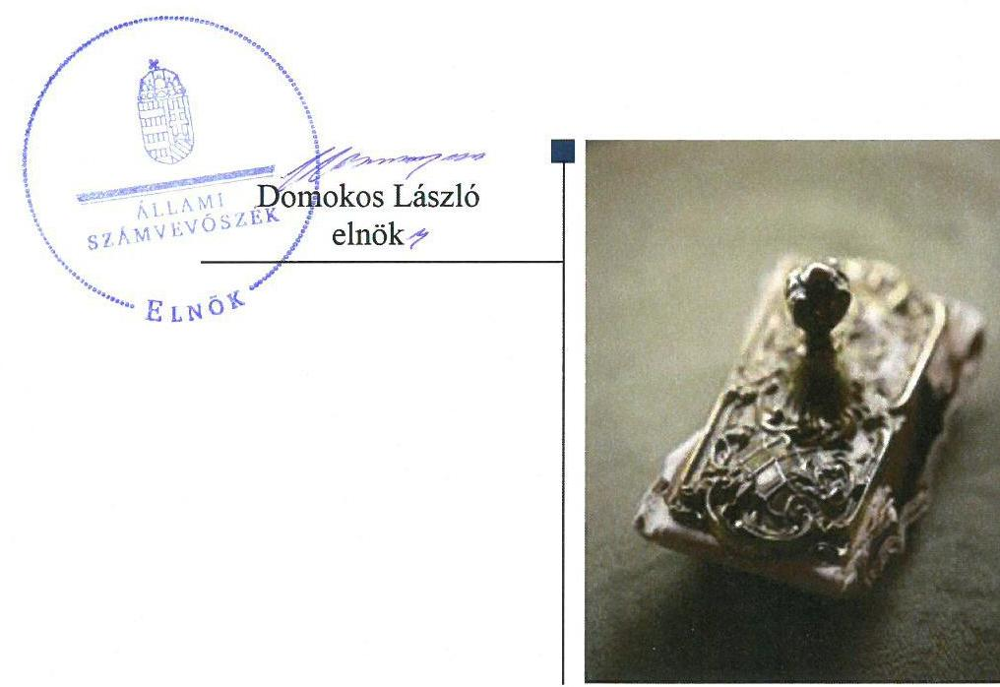
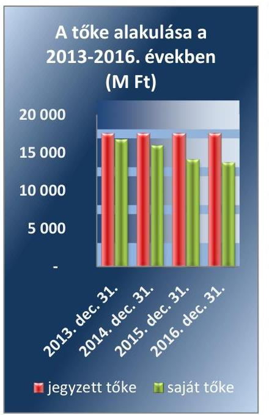
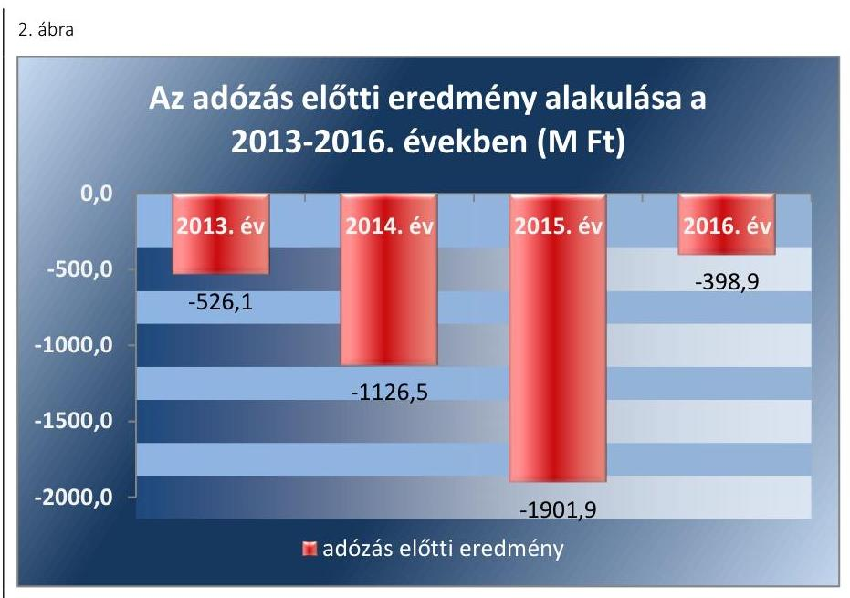

# Jelentés 

## Állami tulajdonú gazdasági társaságok

Az állami tulajdonú gazdasági társaságok ellenőrzése - Regionális Fejlesztési Holding Zrt.
2018.

---

# Jelentés 

## Állami tulajdonú gazdasági társaságok

Az állami tulajdonú gazdasági társaságok ellenőrzése - Regionális Fejlesztési Holding Zrt.
2018. 03. hó 12. nap

---

# AZ ELLENŐRZÉST FELÜGYELTE:

- **KLINGA LÁSZLÓ** felügyeleti vezető
- **AZ ELLENŐRZÉST VEZETTE ÉS A VÉGREHAJTÁSÁÉRT FELELŐS:**
  - **JOÓ ERIKA** ellenőrzésvezető
  - **A PROGRAM ÖSSZEÁLLÍTÁSÁÉRT FELELŐS:**
    - **TÓTPÁL SZABOLCS** osztályvezető

**IKTATÓSZÁM:** EL-0381-030/2018

**TÉMASZÁM:** 2469

**ELLENŐRZÉS-AZONOSÍTÓ SZÁM:** V-081402

---

Jelentéseink az Országgyűlés számítógépes hálózatán és az Interneta a www.asz.hu címen is olvashatóak.

---

# TARTALOMJEGYZÉK 

■ ÖSSZEGZÉS ..... 5
■ AZ ELLENŐRZÉS CÉLJA ..... 6
■ AZ ELLENŐRZÉS TERÜLETE ..... 7
■ AZ ELLENŐRZÉS HÁTTERE, INDOKOLTSÁGA ..... 9
■ A JELENTÉS LÉNYEGES KÉRDÉSKÖREI ..... 10
■ AZ ELLENŐRZÉS HATÓKÖRE ÉS MÓDSZEREI ..... 11
■ MEGÁLLAPÍTÁSOK ..... 13
■ JAVASLATOK ..... 16
■ MELLÉKLETEK ..... 17
I. sz. melléklet: Értelmező szótár ..... 17
II. sz. melléklet: A Társaság részesedései (\%) a 2013-2016. években ..... 18
■ FÜGGELÉK: ÉSZREVÉTELEK ..... 19
■ RÖVIDÍTÉSEK JEGYZÉKE ..... 21

---

.

---

# ÖSSZEGZÉS 

Az MFB Magyar Fejlesztési Bank Zrt. tulajdonosi joggyakorlása a Regionális Fejlesztési Holding Zrt. felett szabályszerű volt. A Társaság müködésének szabályozottsága, gazdálkodása és vagyongazdálkodása szabályszerű volt, ezzel biztosított volt a müködés átláthatósága, illetve az elszámoltathatóság.

## Az ellenőrzés társadalmi indokoltsága

Az állami tulajdonú gazdálkodó szervezetek ellenőrzése kiemelten fontos a vagyon megőrzése, megóvása érdekében, valamint a kormányzati szektor elszámolásaiban megjelenő állami tulajdonú gazdálkodó szervezetek esetében, amelyekkel szemben alapvető követelmény, hogy gazdálkodásuk, müködésük szabályszerű, az általuk szolgáltatott adatok minél megbízhatóbbak legyenek.

Az ellenőrzés az állami tulajdonú gazdálkodó szervezetek gazdálkodási tevékenységével kapcsolatban felhívja a figyelmet a jogszabályi követelmények teljesítéséhez szükséges feltételek hiányosságaira, hozzájárul az államháztartáson kívüli, de (közvetlenül vagy közvetve) állami vagyont használó gazdálkodó szervezetek tevékenységének átláthatóságához.

Ellenőrzésünk eredményeképpen javaslatainkkal, megállapításainkkal hozzájárulunk a nemzeti vagyonnal való gazdálkodás átláthatóságának, elszámoltathatóságának javításához.

## Főbb megállapítások, következtetések, javaslatok

Az MFB Magyar Fejlesztési Bank Zrt. a jogszabályi előírásokat betartva három tagú Felügyelőbizottságot hozott létre, az éves beszámolókat szabályszerűen fogadta el, valamint szabályszerűen megalkotta a vezető tisztségviselők javadalmazásának szabályzatát.

A Regionális Fejlesztési Holding Zrt. rendelkezett számviteli politikával és az annak keretében elkészítendő számviteli szabályzatokkal. A bevételek és ráfordítások elszámolása szabályszerű volt.

A Regionális Fejlesztési Holding Zrt. vagyongazdálkodása szabályszerű volt, az éves beszámolók mérlegtételeit leltárral alátámasztották.

A Társaság közzétételi kötelezettségeit teljesítette, azonban a felügyelőbizottságra vonatkozó adatok közzétételéről nem gondoskodott.

A megállapítások alapján az Állami Számvevőszék a Regionális Fejlesztési Holding Zrt. vezérigazgatójának kettő javaslatot fogalmazott meg.

---

# AZ ELLENŐRZÉS CÉLJA 

Az ellenőrzés célja annak értékelése, hogy a tulajdonosi jogok gyakorlása szabályszerű volt-e. A gazdálkodó szervezet szabályozottsága, gazdálkodása és vagyongazdálkodási tevékenysége megfelelt-e a jogszabályi és a tulajdonosi előírásoknak; biztosítva volt-e a közfeladatok átláthatósága és elszámoltathatósága érdekében a közszolgáltatás díjának megalapozottsága szabályszerű önköltségszámítással. A vagyonváltozást eredményező döntések esetében a tulajdonosi jogok gyakorlója és a gazdálkodó szervezet szabályszerűen jártak-e el. Az ellenőrzés célja továbbá annak megítélése, hogy a kormányzati szektorba sorolt állami tulajdonban (résztulajdonban) lévő gazdálkodó szervezetek gazdálkodásának a kormányzati szektor hiányára és az államadósságra befolyással bíró elemei a jogszabályi előírásoknak megfeleltek-e.

---

# AZ ELLENŐRZÉS TERÜLETE 

## Regionális Fejlesztési Holding Zrt. és az MFB Magyar Fejlesztési Bank Zrt.

A Regionális Fejlesztési Holding Zártkörűen Müködő Részvénytársaság 2000. március 1-jén alakult. Tulajdonosa 100\%-ban a Magyar Állam, a tulajdonosi jogokat az MFB tv. ${ }^{1}$ rendelkezései alapján az MFB Magyar Fejlesztési Bank Zrt. gyakorolta 2010. július 8-tól. A Társaság ${ }^{2}$ törzstőkéje 17 542,0 M Ft, az ellenőrzött időszakban nem változott.

A Társaság fő tevékenysége üzletviteli, egyéb vezetési tanácsadás volt, ennek keretében a térségi gazdaságfejlesztés, szerkezetváltás és versenyképesség elősegítése.

A Társaság tőkebefektetéssel és fejlesztési hitelek kihelyezésével, rövid- és középlejáratú finanszírozási konstrukciókkal - elsősorban magántőkét kiegészítő társfinanszírozóként - vállalt részt projektek indításában, fejlesztések kivitelezésében,

Forrás: 2013-2016. éves beszámolók
valamint támogatta a fejlesztési tárgyú pályázatok elkészítését is.

Az MFB Zrt. döntése alapján a Társaságnak 2015-től készülnie kellett a tevékenysége megszüntetésére, amelyre az ellenőrzött időszakban nem került sor. A 2015. és 2016. év során a Társaság tevékenysége a folyamatban lévő ügyek pénzügyi elszámolásaival kapcsolatos feladatokra, a portfólió tisztítására és a vagyonelemek értékesítésére korlátozódott. A foglalkoztatottak létszáma és a leányvállalatok száma csökkent.

A Társaság közfeladatot nem látott el, közvetlen állami támogatásban nem részesült.

A Társaságnál az Alapító okirat ${ }_{1-6}{ }^{3}$ rendelkezései alapján az igazgatóság feladatait Gt. ${ }^{4}$ és Ptk. ${ }^{5}$ előírásainak megfelelően a vezérigazgató látta el. Az ellenőrzött időszakban a vezérigazgató személye egy alkalommal változott. A vezérigazgató 2016. március 12-től tölti be tisztségét.

A Társaság az ellenőrzött években veszteségesen gazdálkodott. Az adózás előtti eredmény évenkénti alakulását a 2. ábra, a részesedéseket a II. sz. melléklet mutatja be.

A Társaság az ellenőrzött időszak egészében kormányzati szektorba sorolt egyéb szervezet volt. A Társaságnak az ellenőrzött időszakban a Stabilitási tv. ${ }^{6}$ 3. §-a alá tartozó adósságot keletkeztető ügylete nem volt.

A Társaság vagyonkezelt vagyonnal nem rendelkezett, kizárólag saját vagyonával gazdálkodott

---

*Forrás: 2013-2016. éves beszámolók*

---

# AZ ELLENŐRZÉS HÁTTERE, INDOKOLTSÁGA 

Az állami tulajdonú gazdálkodó szervezetek ellenőrzése kiemelten fontos a vagyon megőrzése, megóvása érdekében, valamint a kormányzati szektor elszámolásaiban megjelenő állami tulajdonú gazdálkodó szervezetek esetében, amelyekkel szemben alapvető követelmény, hogy gazdálkodásuk, múködésük szabályszerű, az általuk szolgáltatott adatok minél megbízhatóbbak legyenek. Gazdálkodásuk jellemzően a közérdeklődés és a média figyelmének középpontjában áll, amihez hozzájárul a gazdálkodásuk körébe tartozó - közvetlen vagy közvetett állami tulajdonú, tehát végső soron a nemzeti vagyon részét képező - vagyon nagysága, illetve az általuk ellátott közszolgáltatások/közfeladatok minősége és hatékonysága. A közszolgáltatási árképzés megalapozottsága és a rendszeres elszámoltatás feltételeinek kialakítása az ellenőrzése során nagy hangsúlyt kap. A közszolgáltatás árában és annak támogatásában meg kell jelennie az önköltségszámítás szempontjainak, amely biztosítja a múködés fenntarthatóságát (eszközpótlást) is.

Az ellenőrzés rámutathat az állami tulajdonú gazdálkodó szervezetek gazdálkodási tevékenységével jó gyakorlatokra és szabálytalanságokra. Felhívhatja a figyelmet a jogszabályi követelmények teljesítéséhez szükséges feltételek hiányosságaira, hozzájárulhat az államháztartáson kívüli, de (közvetlenül vagy közvetve) állami vagyont használó gazdálkodó szervezetek tevékenységének átláthatóságához. Ellenőrzésünk eredményeképpen javaslatainkkal, megállapításainkkal hozzájárulhatunk a nemzeti vagyonnal való gazdálkodás átláthatóságának, elszámoltathatóságának javításához.

---

# A JELENTÉS LÉNYEGES KÉRDÉSKÖREI 

1.     - A tulajdonosi jogok gyakorlása szabályszerű volt-e?
2.     - A társaság müködésének szabályozottsága, gazdálkodása és vagyongazdálkodása megfelelt-e az előírásoknak?

---

# AZ ELLENŐRZÉS HATÓKÖRE ÉS MÓDSZEREI 

## Az ellenőrzés típusa

Megfelelőségi ellenőrzés

## Az ellenőrzött időszak

2013. - 2016. évek, a 2016. évi beszámoló jóváhagyásáig tartó időszak

## Az ellenőrzés tárgya

Állami tulajdonban (résztulajdonban) lévő gazdasági társaság gazdálkodása, kiemelten vagyongazdálkodási tevékenysége, a kormányzati szektorba sorolt gazdasági társaság gazdálkodásának a kormányzati szektor hiányára és az államadósságra befolyással bíró elemei, valamint a tulajdonosi jogok gyakorlása.

## Az ellenőrzött szervezet

Regionális Fejlesztési Holding Zrt. és az MFB Magyar Fejlesztési Bank Zrt.

## Az ellenőrzés jogalapja

Az ellenőrzés jogalapját az ÁSZ tv7. 1. § (3) bekezdése és 5. § (3)-(5) bekezdése képezi.

## Az ellenőrzés módszerei

Az ellenőrzést a nemzetközi standardokat irányadónak tekintve az ellenőrzési program ellenőrzési kérdései, az ellenőrzött időszakban hatályos jogszabályok, az ellenőrzés szakmai szabályok és módszertanok figyelembe vételével végezzük.

Az ellenőrzés ideje alatt az ellenőrzött szervezettel történő kapcsolattartást az ÁSZ ${ }^{8}$ Szervezeti és Múködési Szabályzatának vonatkozó előírásai alapján biztosítjuk.

Az ellenőrzési kérdések megválaszolásához szükséges bizonyítékok megszerzése a következő ellenőrzési eljárások alkalmazásával történt: megfigyelés, kérdésfeltevés (információkérés), összehasonlítás, valamint elemző eljárás. Az ellenőrzési bizonyítékként felhasználható adatforrások közé tartoznak egyrészt az ellenőrzési programban felsorolt adatforrások,

---

másrészt adatforrás lehet még minden - az ellenőrzés folyamán - feltárt, az ellenőrzés szempontjából információkat tartalmazó dokumentum.

Az ellenőrzést a kérdésekre adott válaszok kiértékelésével, valamint a megjelölt adatforrások, a csatolt tanúsítványok felhasználásával, továbbá az adott időszakban hatályos jogszabályok figyelembevételével folytattuk le. A teljes ellenőrzött időszakra vonatkozóan került ellenőrzésre a gazdasági társaság tervezési, beszámolási, közzétételi, adatszolgáltatási kötelezettségének, valamint belső ellenőrzési tevékenységének szabályszerűsége. A 2013. és 2016. évekre vonatkozóan a gazdasági társaság múködésének szabályozottságát, a bevételei és ráfordításai elszámolását, illetve vagyongazdálkodásának szabályszerűségét is ellenőriztük.

A bevételek és a ráfordítások közül az értékesítés nettó árbevétele, az egyéb, rendkívüli és pénzügyi műveletek bevételei, a személyi jellegű ráfordítások, az anyagjellegű ráfordítások, az egyéb, rendkívüli és pénzügyi műveletek ráfordításai, valamint értékcsökkenési leírás elszámolásának szabályszerűségét, továbbá az immateriális javak, tárgyi eszközök esetében a vagyonnyilvántartás szabályszerűségét véletlen mintavétellel ellenőriztük.

A fenti sokaságok esetében a mintavétel azokra a legnagyobb értékű tételekre - a lényeges sokaságra - terjedt ki, melyek összértéke eléri a teljes sokaság összértékének 50\%-át. A személyi jellegű ráfordítások esetében a mintavétel a teljes sokaságból történt. Amennyiben valamely ellenőrzött sokaság elemszáma kisebb volt, mint az előírt mintaelemszám, az ellenőrzött sokaságot tételesen ellenőriztük.

A mintavétellel ellenőrzött területek esetében minden egyes tétel vonatkozásában a szabályszerűségre vonatkozó kérdéseket tettünk fel, amelyek eredménye összesítésre került. „Szabályszerűnek" értékeltünk egy ellenőrzött területet, amennyiben 95\%-os bizonyossággal az ellenőrzött sokaságban az átlagos hibaarány legfeljebb 10\%, "nem szabályszerűnek", amennyiben 10\%-nál magasabb arányt képviselt.

Abban az esetben, ha az ellenőrzött sokaság tekintetében a 10\%-os hibaarányhoz való viszony megítélésnek megbízhatósága nem érte el a 95\%ot, annak elérése érdekében értékelésünket további szempontokkal egészítettük ki, és figyelembe vettük a feltárt hibák értékét.

---

# 1. A tulajdonosi jogok gyakorlása szabályszerű volt-e? 

Összegző megállapítás

A tulajdonosi jogokat az MFB Zrt. szabályszerűen gyakorolta.
A TULAJDONOSI JOGGYAKORLÁS KERETEIT az MFB Zrt. szabályszerűen alakította ki. A tulajdonosi joggyakorlás szabályait az MFB Zrt. SZMSZ ${ }_{1-10,}{ }^{9}$ a tartós befektetések, illetve tulajdonosi joggyakorlással érintett szervezetek kezelésére vonatkozó eljárásrend ${ }^{10}{ }_{1-4}$, az adatszolgáltatásra vonatkozó belső szabályzat ${ }_{1-3}{ }^{11}$ tartalmazta. A szabályzatokban és az Alapító okirat ${ }_{1-6}$-ban a Gt. és a Ptk. előírásainak megfelelően szabályozták a tulajdonosi joggyakorlás kereteit és eljárásrendjét.

A Társaságnál az Alapító okirat ${ }_{1-6}$ rendelkezései alapján, a Gt., a Ptk., valamint a Taktv. előírásainak megfelelően három tagból álló Felügyelőbizottság múködött.

Az MFB Zrt. az éves beszámoló elkészítésén túl havi, illetve időszakos beszámolási kötelezettséget írt elő, amelyet a Társaság teljesített.

Az MFB Zrt. a tartós befektetések szabályzatában írta elő az üzleti terv készítésének kötelezettségét. A Társaság az üzleti terveket elkészítette, azokat a tulajdonosi joggyakorló ${ }^{12}$ határozataiban elfogadta.

Az MFB Zrt. a Taktv. ${ }^{13}$ előírásainak megfelelően megalkotta a vezető tisztségviselők, felügyelőbizottsági tagok, valamint az Mt. 208. §-ának hatálya alá eső munkavállalók javadalmazásáról rendelkező szabályzatot.

A TULAJDONOSI JOGOK GYAKORLÁSA szabályszerű volt.

A vagyonváltozást eredményező alapítói döntéseket - részesedések és ingatlan értékesítése -a tartós befektetések szabályzatában előírtak szerint készítették elő.

Az éves beszámolókat a tulajdonosi joggyakorló a Felügyelőbizottság írásbeli jelentése és a könyvvizsgálói jelentések birtokában fogadta el.

---

# 2. A társaság múködésének szabályozottsága, gazdálkodása és vagyongazdálkodása megfelelt-e az előírásoknak? 

Összegző megállapítás

2.1. számú megállapítás
2.2. számú megállapítás

A Társaság a számviteli politikát ${ }^{14}$ és az annak részeként a Számv. tv ${ }^{15}$. előírásai szerint kötelezően elkészítendő szabályzatokkal - az eszközök és a források értékelési szabályzatával, pénzkezelési szabályzattal, leltározási szabályzattal és önköltségszámítási szabályzattal - rendelkezett. Számlarenddel a Számv. tv. előírásai szerint rendelkezett a Társaság.

A Társaság gazdálkodása és vagyongazdálkodása szabályszerű volt. A jogszabályi előírások ellenére önköltségszámítást nem végeztek.

A BEVÉTELEK ÉS RÁFORDÍTÁSOK elszámolása a 2013. és 2016. évben szabályszerű volt. Az értékcsökkenési leírás elszámolása során betartották a Számv. tv. és a számviteli politika előírásait.

A Társaság a szolgáltatások önköltségét a Számv. tv. 14. § (7) bekezdésében előírtak ellenére - tekintettel a költségnemek szerinti költségek együttes összegére - az önköltségszámítás rendjére vonatkozó belső szabályzat szerinti utókalkuláció módszerével nem állapította meg.

A Társaság a tervezési, beszámolási és adatszolgáltatási kötelezettségeit a Számv. tv. és a tulajdonosi előírásoknak megfelelően teljesítette.

AZ ÉVES BESZÁMOLÓKAT a Számv. tv. előírásainak megfelelően, határidőben elkészítették.

A Társaság az ellenőrzött időszakban a leltározási szabályzatában és az éves leltározási utasításokban foglaltak alapján a Számv. tv. előírásainak megfelelően elkészítette az éves beszámoló mérlegtételeit alátámasztó leltárakat.

A LEÁNYVÁLLALATOK vonatkozásában szabályozta a Társaság a vagyongazdálkodással kapcsolatos döntési hatásköröket, feladatköröket és felelősségi viszonyokat. A leányvállalatok a vagyongazdálkodással kapcsolatban előírt adatszolgáltatási kötelezettségüknek eleget tettek. A Társaság magához vonta a leányvállalatok éves terve elkészítésének irányítását és a terv teljesülésének ellenőrzését is.

A leányvállalatok vonatkozásában a 2013-2014. évben a Társaság belső ellenőrzése látta el a belső ellenőrzési feladatokat a felügyelőbizottságokkal együttműködve. A leányvállalatok intézkedési tervet készítettek és végrehajtották az abban foglaltakat, melyet utóellenőrzés keretében ellenőrzött a belső ellenőrzés.

KÖZZÉTETTE ÉS LETÉTBE HELYEZTE a Társaság az elkészített éves beszámolókat a Számv. tv. előírásainak megfelelően.

---

A Társaság a Taktv. előírásainak megfelelően közzétette az Mt. 208. § szerinti vezető állású munkavállalókra vonatkozó adatokat, ugyanakkor a Taktv. 2. § (1) bekezdés előírásai ellenére a felügyelőbizottsági tagokra vonatkozó adatokat nem tette közzé.

---

# JAVASLATOK 

Az ÁSZ tv. 33. § (1) bekezdésében foglaltak értelmében az ellenőrzött szervezet vezetője köteles a jelentésben foglalt megállapításokhoz kapcsolódó intézkedési tervet összeállítani és azt a jelentés kézhezvételétől számított 30 napon belül az ÁSZ részére megküldeni. Amennyiben az ellenőrzött szervezet vezetője nem küldi meg határidőben az intézkedési tervet, vagy továbbra sem elfogadható intézkedési tervet küld, az Állami Számvevőszék elnöke az ÁSZ tv. 33. § (3) bekezdése a) és b) pontjaiban foglaltakat érvényesítheti.

## Regionális Fejlesztési Holding Zrt. vezérigazgatójának

1. Intézkedjen a szolgáltatások Számv. tv. szerinti önköltségének önköltségszámitás rendjére vonatkozó belső szabályzat szerinti utókalkuláció módszerével történő megállapításáról.
(2.2. sz. megállapítás 2. bekezdése alapján)
2. Intézkedjen a Taktv.-ben elöirt közzétételi kötelezettség teljes körü teljesitéséröl.
(2.2. sz. megállapítás 9. bekezdés 2. tagmondata alapján)

---

# MELLÉKLETEK 

- I. SZ. MELLÉKLET: ÉRTELMEZŐ SZÓTÁR
gazdasági társaság
kormányzati szektorba sorolt egyéb szervezet
nonprofit gazdasági társaság
tulajdonosi jogok gyakorlója

A Ptk. 3:88. § (1) bekezdés szerint „a gazdasági társaságok üzletszerű közös gazdasági tevékenység folytatására, a tagok vagyoni hozzájárulásával létrehozott, jogi személyiséggel rendelkező vállalkozások, amelyekben a tagok a nyereségből közösen részesednek, és a veszteséget közösen viselik".
Az a szervezet, amely az Áht. alapján nem része az államháztartásnak, azonban az Európai Közösséget létrehozó szerződéshez csatolt, a túlzott hiány esetén követendő eljárásról szóló jegyzőkönyv alkalmazásáról szóló 2009. május 25-i 479/2009/EK rendelet szerint a kormányzati szektorba tartozik. A nemzetgazdasági miniszter 2013. június 26-án megjelent Közleményben tette közé ezen szervezetek listáját.
Civil tv ${ }^{16}$. 9/F. § (2) bekezdés szerint „az a gazdasági társaság minősül nonprofit gazdasági társaságnak és cégnevében az a gazdasági társaság tüntetheti fel a nonprofit jelleget, amelynek létesítő okirata tartalmazza, hogy a gazdasági társaság tevékenységéből származó nyereség a tagok között nem osztható fel, hanem az a gazdasági társaság vagyonát gyarapítja." (hatályos 2014. március 15-től)
2013. június 28-ától:

A rábízott állami vagyon felett az államot megillető tulajdonosi jogok és kötelezettségek összességét tulajdonosi joggyakorlóként:
a) ha törvény vagy miniszteri rendelet eltérően nem rendelkezik, a Magyar Nemzeti Vagyonkezelő Zártkörűen Működő Részvénytársaság (a továbbiakban: MNV Zrt.),
b) törvényben kijelölt személy vagy
c) az állami vagyon felügyeletéért felelős miniszter (a továbbiakban: miniszter) által rendeletben kijelölt személy gyakorolja.
[...] A miniszter e törvény felhatalmazása alapján - a meghatározott célok hatékonyabb elérése érdekében, miniszteri rendeletben, az ott meghatározott állami vagyoni kör tekintetében, meghatározott időtartamra - e törvény keretei között, a joggyakorlás egyes szabályainak meghatározásával - az államot megillető tulajdonosi jogok és kötelezettségek összességének, illetve azok meghatározott részének gyakorlóját az Áht. szerinti központi költségvetési szervek, ezek intézménye, továbbá a 100\%-ban állami tulajdonban álló gazdasági társaságok közül kijelölheti.
Forrás: Vtv ${ }^{17}$. 3. § (1) és (2)
2.

Aki a nemzeti vagyon felett az államot vagy a helyi önkormányzatot megillető tulajdonosi jogok és kötelezettségek összességének gyakorlására jogosult
Forrás: Nvtv ${ }^{18}$. 3. § (1) 17. pontja

---

| Megnevezés | 2013.12.31. | 2014.12.31. | 2015.12.31. | 2016.12.31. |
| :--: | :--: | :--: | :--: | :--: |
| Közép-Magyarországi RF Zrt. | 100,0 | 100,0 | 100,0 | 100,0 |
| Dél Alföldi RF Zrt. | 83,7 | 83,7 | 83,7 | 83,7 |
| Dél-Dunántúli RF Zrt. | 75,1 | 75,1 | 75,1 | 75,1 |
| Észak-Alföldi RF Zrt. | 92,4 | 92,4 | 92,4 | 92,4 |
| Észak-Magyarországi RF Zrt. | 95,9 | 95,9 | 95,9 | 95,9 |
| Közép-Pannon RF Zrt. | 90,8 | 90,8 | 90,8 | 90,8 |
| Nyugat-Pannon RF Zrt. | 87,2 | 87,2 | 87,2 | 87,2 |
| Záhony és Térsége Fejl. Zrt. | 100,0 | 100,0 | 100,0 | 100,0 |
| Reg. Fejlesztési Finanszírozó Zrt. | 100,0 | 100,0 | 100,0 | 100,0 |
| Informatikai Kockázati Tőkealap-Kezelö Zrt. | 100,0 | 100,0 | 100,0 | 100,0 |
| Dél-Alföldi Termelő Ért. Szervezetek Zrt. | 100,0 | 100,0 | - | - |
| Szempont Gazdasági Kft. | 100,0 | 100,0 | 100,0 | 100,0 |
| RF Agrolease Kft. | 100,0 | - | - | - |
| RFH Nonprofit Zrt. | 100,0 | 100,0 | 100,0 | 100,0 |
| Nemzeti Mobilfizetési Zrt | 100,0 | - | - | - |
| EHPSZ Első Hazai Pénzügyi Szolg. Kft. | 100,0 | 99,98 | 99,0 | 99,0 |
| Hazai Térségfejlesztő Zrt „fa" | 25,0 | - | - | - |
| Orsz. Bioenergetikai K.Központ | 31,8 | - | - | - |
| Észak-M-i Biomassza E.Klaszter | 25,0 | 25,0 | - | - |
| Dél-Hevesi Mikrotérségi Fütőmú Kft „fa" | 48,9 | - | - | - |
| Corvinus Nemzetközi Befektetési Zrt | - | 23,28 | 23,28 | 5,6 |
|  |  |  | Forrás: 2013-2016. éves beszámolók |  |

---

# FÜGGELÉK: ÉSZREVÉTELEK 

A jelentéstervezetet a Számvevőszék 15 napos észrevételezésre megküldte az ellenőrzött szervezetek vezetőinek az ÁSZ tv. 29. §* (1) bekezdése előírásának megfelelően.

Az MFB Zrt. vezérigazgatója az ÁSZ tv. 29. § (2) bekezdésében foglalt észrevételezési jogával nem élt, írásban jelezte, hogy a jelentéstervezetre észrevételt nem tesz. A Regionális Fejlesztési Holding Zrt. vezérigazgatója a jelentéstervezetre észrevételt nem tett.

[^0]
[^0]:    * 29. § (1) Az Állami Számvevőszék az ellenőrzési megállapításait megküldi az ellenőrzött szervezet vezetőjének vagy az általa megbízott személynek, és annak, akinek személyes felelősségét állapította meg.
    (2) Az ellenőrzött szervezet vezetője és a felelősként megjelölt személy az ellenőrzés megállapításaira tizenöt napon belül írásban észrevételt tehet.
    (3) Az Állami Számvevőszék az észrevételre a beérkezésétől számított harminc napon belül írásban válaszol. A figyelembe nem vett észrevételeket köteles a jelentésben feltüntetni, és megindokolni, hogy azokat miért nem fogadta el.

---

.

---

# RÖVIDÍTÉSEK JEGYZÉKE 

${ }^{1}$ MFB tv.
${ }^{2}$ Társaság
${ }^{3}$ Alapító okirat ${ }_{1}$
Alapító okirat ${ }_{2}$
Alapító okirat ${ }_{3}$
Alapító okirat ${ }_{4}$
Alapító okirat ${ }_{5}$
Alapító okirat ${ }_{6}$
${ }^{4} \mathrm{Gt}$.
${ }^{5}$ Ptk.
${ }^{6}$ Stabilitási tv.
${ }^{7}$ ÁSZ tv.
${ }^{8}$ ÁSZ
${ }^{9}$ MFB Zrt. SZMSZ ${ }_{1}$
SzMSz2
SzMSz ${ }_{3}$
SzMSz4
SzMSz5
SzMSz6
SzMSz7
SzMSz8
SzMSz9
SzMSz10
${ }^{10}$ Tartós befektetések szabályzata ${ }_{1}$

Tartós befektetések szabályzata ${ }_{2}$

Tartós befektetések szabályzata ${ }_{3}$

Tartós befektetések szabályzata ${ }_{4}$
${ }^{11}$ adatszolgáltatásra vonatkozó szabályzat ${ }_{1}$
adatszolgáltatásra vonatkozó szabályzat ${ }_{2}$
adatszolgáltatásra vonatkozó szabályzat ${ }_{3}$
${ }^{12}$ tulajdonosi joggyakorló
${ }^{13}$ Taktv.
${ }^{14}$ számviteli politika1
a Magyar Fejlesztési Bankról szóló 2001. évi XX. törvény
Regionális Fejlesztési Holding Zrt.
A Társaság 2012.12.21-től 2013.02.17-ig hatályos Alapító Okirata
A Társaság 2013.03.18-től 2013.05.30-ig hatályos Alapító Okirata
A Társaság 2013.05.31-től 2013.07.08-ig hatályos Alapító Okirata
A Társaság 2013.07.09-től 2013.12.16-ig hatályos Alapító Okirata
A Társaság 2013.12.17-től 2016.03.02-ig hatályos Alapító Okirata
A Társaság 2016.03.02-től hatályos Alapító Okirata
a gazdasági társaságokról szóló 2006. évi IV. törvény (hatálytalan 2014. március 15 -től)
a Polgári Törvénykönyvről szóló 2013. évi V. törvény (hatályos 2014. március 15-étől)
Magyarország gazdasági stabilitásáról szóló 2011. évi CXCIV. törvény 2011. évi LXVI. törvény az Állami Számvevőszékről (hatályos: 2011. július 1-jétől) Állami Számvevőszék
2012.10.08-tól 2013.02.28-ig hatályos Szervezeti és Múködési Szabályzat 2013.03.01-tól 2013.07.22-ig hatályos Szervezeti és Múködési Szabályzat 2013.07.23-tól 2013.12.10-ig hatályos Szervezeti és Múködési Szabályzat 2013.12.11-tól 2014.06.09-ig hatályos Szervezeti és Múködési Szabályzat 2014.06.10-től 2015.02.16-ig hatályos Szervezeti és Múködési Szabályzat 2015.02.17-tól 2015.06.16-ig hatályos Szervezeti és Múködési Szabályzat 2015.06.17-tól 2016.02.04-ig hatályos Szervezeti és Múködési Szabályzat 2016.02.05-től 2016.04.28-ig hatályos Szervezeti és Múködési Szabályzat 2016.04.29-től 2016.12.22-ig hatályos Szervezeti és Múködési Szabályzat 2016.12.23-tól 2017.04.21-ig hatályos Szervezeti és Múködési Szabályzat A tartós tőkebefektetések, illetve a tulajdonosi joggyakorlással érintett gazdálkodó szervezetek eljárásrendje 2012.04.26-tól 2013.12.16-ig
A tartós tőkebefektetések, illetve a tulajdonosi joggyakorlással érintett gazdálkodó szervezetek eljárásrendje 2013.12.17-tól 2014.07.28-ig
A tartós tőkebefektetések, illetve a tulajdonosi joggyakorlással érintett gazdálkodó szervezetek eljárásrendje 2014.07.29-től 2015.07.15-ig
A tartós tőkebefektetések, illetve a tulajdonosi joggyakorlással érintett gazdálkodó szervezetek eljárásrendje 2015.07.16-tól
A Stratégiai csoport adatszolgáltatásának eljárási rendje 2012.01.31-től 2014.10.21-ig
A Stratégiai csoport adatszolgáltatásának eljárási rendje 2014.10.22-től 2016.11.27-ig-ig
A Stratégiai csoport adatszolgáltatásának eljárási rendje 2016-11.21-től MFB Magyar Fejlesztési Bank Zrt.
2009. évi CXXII. törvény a köztulajdonban álló gazdasági társaságok takarékosabb múködéséről (hatályos 2009. december 4-től)
13/2013. Vezérigazgatói utasítás Számviteli Politika és Értékelési Szabályzat Hatályos 2013.01.01-től

---

${ }^{14}$ számviteli politika ${ }_{2}$
${ }^{14}$ számviteli politika3
${ }^{14}$ számviteli politika4
${ }^{15}$ Számv. tv.
${ }^{16}$ Civil. tv.
${ }^{17}$ Vtv.
${ }^{18} \mathrm{Nvtv}$.
7/2014. Vezérigazgatói utasítás Számviteli Politika és Értékelési Szabályzat Hatályos 2014.01.01-től
7/2015. Vezérigazgatói utasítás Számviteli Politika és Értékelési Szabályzat Hatályos 2015.01.01-től
6/2016. Vezérigazgatói utasítás Számviteli Politika és Értékelési SzabályzatHatályos 2016.01.01-tő
2000. évi C. törvény a számvitelről
2011. évi CLXXV. törvény az egyesülési jogról, a közhasznú jogállásról, valamint a civil szervezetek múködéséről és támogatásáról (hatályos: 2011. december 22től)
2007. évi CVI. törvény az állami vagyonról (hatályos: 2007. szeptember 25-től) 2011. évi CXCVI. törvény a nemzeti vagyonról (hatályos: 2011. december 31-től)

---

# ÁLLAMI SZÁMVEVŐSZÉK 

1052 Budapest, Apáczai Csere János utca 10.
Levélcím: 1364 Budapest 4. Pf. 54
Telefon: +36 14849100 Telefax: +36 14849200
www.asz.hu