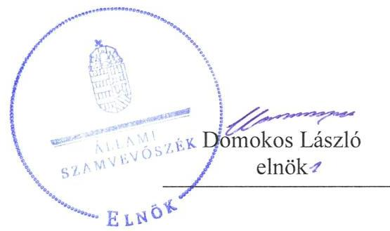
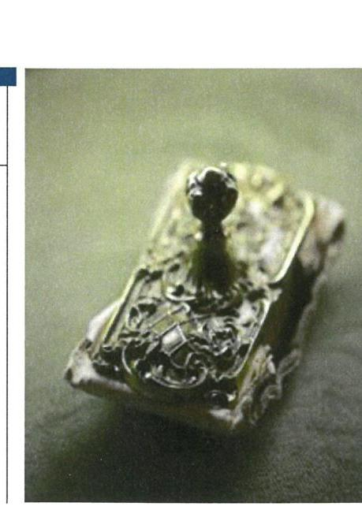
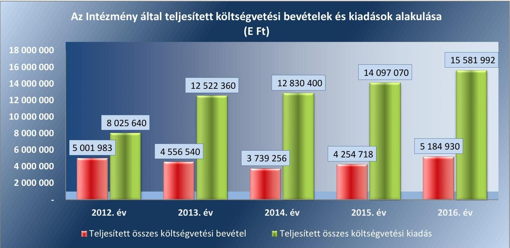
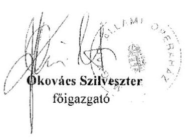
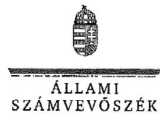
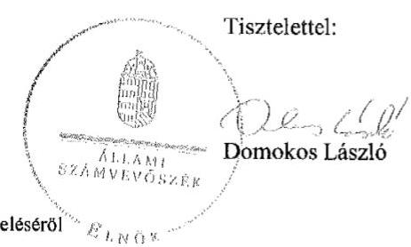

# Jelentés 

## A központi alrendszer intézményei

A központi alrendszer egyes intézményei pénzügyi és vagyongazdálkodásának ellenőrzése - Magyar Állami Operaház 2018.

---

# A központi alrendszer intézményei 

A központi alrendszer egyes intézményei pénzügyi és vagyongazdálkodásának ellenőrzése - Magyar Állami Operaház 2018. ๑3 hó ๑6 nap

---

# AZ ELLENŐRZÉST FELÜGYELTE:

- **SALAMON ILDIKÓ** felügyeleti vezető

- **AZ ELLENŐRZÉST VEZETTE ÉS A VÉGREHAJTÁSÁÉRT FELELŐS:**
  - **DR. KOVÁCS DIÁNA** ellenőrzésvezető
  - **A PROGRAM ÖSSZEÁLLÍTÁSÁÉRT FELELŐS:**
    - **TÓTPÁL SZABOLCS** osztályvezető

**IKTATÓSZÁM:** EL-0087-144/2018.

**TÉMASZÁM:** 2171

**ELLENŐRZÉS-AZONOSÍTÓ SZÁM:** V076022

Jelentéseink az Országgyűlés számítógépes hálózatán és az Interneta a www.asz.hu címen is olvashatóak.

---

# TARTALOMJEGYZÉK 

■ ÖSSZEGZÉS ..... 5
■ AZ ELLENŐRZÉS CÉLJA ..... 7
■ AZ ELLENŐRZÉS TERÜLETE ..... 8
■ AZ ELLENŐRZÉS HÁTTERE, INDOKOLTSÁGA ..... 10
■ A JELENTÉS LÉNYEGES KÉRDÉSKÖREI ..... 11
■ AZ ELLENŐRZÉS HATÓKÖRE ÉS MÓDSZEREI ..... 12
■ MEGÁLLAPÍTÁSOK ..... 14
■ JAVASLATOK ..... 23
■ KÖVETKEZTETÉSEK ..... 27
■ MELLÉKLETEK ..... 29
I. sz. melléklet: Értelmező szótár ..... 29
■ FÜGGELÉK: ÉSZREVÉTELEK ..... 33
■ RÖVIDÍTÉSEK JEGYZÉKE ..... 47

---

.

---

# ÖSSZEGZÉS 

A Magyar Állami Operaház feletti irányítószervi jogkörgyakorlás az ellenőrzött időszakban szabályszerű volt. A belső kontrollrendszer nem biztosította a közpénzekkel és a nemzeti vagyonnal való átlátható, szabályszerű, gazdaságos, hatékony és eredményes gazdálkodás feltételeit. A Magyar Állami Operaház pénzügyi és vagyongazdálkodása nem volt szabályszerű. A Magyar Állami Operaház nem a kockázatokkal arányosan alakította ki az integritás kontroll környezetét.
A Magyar Állami Operaház szervezeti és müködési folyamatai, belső szabályozottsága a Magyar Állami Operaház és az Erkel Színház új mühelyháza és próbacentruma létrehozásához szükséges beruházás átláthatósága, elszámoltathatósága, és eredményes megvalósítása szempontjából magas kockázatokat hordoz. A beruházás döntés-előkészítése nem volt megfelelő.

## Az ellenőrzés társadalmi indokoltsága

A központi alrendszer részét képező intézmények alapvető rendeltetése a közfeladatok ellátásának biztosítása. A közpénzek felhasználásában meghatározó, központi alrendszerbe tartozó intézmények pénzügyi és vagyongazdálkodási tevékenységük és/vagy feladatellátásuk súlya miatt jelentős hatást gyakorolhatnak a költségvetés egyensúlyának fenntartására. Hatással vannak továbbá az állami vagyonnal való gazdálkodás minőségére, a kormányzati (szak)politikák végrehajtására, illetve közfeladat ellátásuk vonatkozásában az állampolgárok életminőségére, jogaik és kötelezettségeik gyakorlására. Indokolt ezért, hogy az Állami Számvevőszék ezen intézmények pénzügyi és vagyongazdálkodását, ideértve a közpénzből megvalósuló kiemelt jelentőségű beruházások döntés- előkészítéstől, a kivitelezés megkezdéséig tartott szakaszban kifejtett tevékenységét is, az esetleges átalakulások szabályszerűségét rendszeresen ellenőrizze.

## Főbb megállapítások, következtetések, javaslatok

Az Emberi Erőforrások Minisztériuma a Magyar Állami Operaház irányító szerveként az ellenőrzött időszakban szabályszerűen látta el feladatát az alapítói és az egyéb irányítói jogosultságok tekintetében. A munkáltatói jogkörgyakorlás megfelelt a jogszabályi előírásoknak.

A Magyar Állami Operaház belső kontrollrendszere kialakítása és működtetése nem felelt meg a jogszabályi előírásoknak. A kontrollkörnyezet kialakítása nem volt szabályszerű. Az ellenőrzött időszakban nem rendelkezett önköltség számítási szabályzattal, megfelelő közbeszerzési szabályzattal, a beszerzések lebonyolításával kapcsolatos eljárásrenddel. 2012. január 1. és 2014. június 30. között kockázatkezelési rendszert nem alakított ki, kialakítását követően nem működtette azt. A pénzügyi kontrolltevékenységek szabályozási hátterét 2013 decemberétől alakították ki. Az információs és kommunikációs folyamatok kialakítása és működtetése nem volt szabályszerű. A tevékenységének, a célok megvalósításának nyomon követését biztosító rendszert nem alakították ki. A belső ellenőrzés szabályszerű kialakítása megtörtént, annak működtetése azonban nem volt szabályszerű.

Az ellenőrzött időszakban a bevételek beszedése és elszámolása, a kiadási előirányzatok felhasználása nem felelt meg a jogszabályi előírásoknak. A tárgyévi maradvány megállapítása során 2012-2015. években betartotta a jogszabályi előírásokat, 2016. évben a kötelezettségvállalással terhelt maradvány alátámasztásához vezetett részletező nyilvántartás tartalma nem felelt meg a jogszabályi előírásoknak. A Magyar Állami Operaház vagyonkezelési szerződésmódosítás alapján vagyonkezelésébe vett eszközeit szabálytalanul vette nyilvántartásba. Az ellenőrzött időszakban bizonylat nélkül nyilvántartásába vett öt ingatlant, amivel megsértette a Számv. tv. és az Áhsz.1,2 előírásait. A bruttó

---

25 millió Ft mértéket meghaladó tárgyi eszközök vásárlása esetén nem kötött vagyonkezelési szerződést az MNV Zrtvel, megsértve a Vtv. és az Nvtv. előírásait. A mérlegben kimutatott eszközök és források értékelése és a leltár elkészítése nem a jogszabályok előírásai szerint történt. A könyvviteli mérlegben kimutatott eszközök valódiságát a pénzeszközök és a követelések esetében nem támasztották alá szabályszerű leltárral. A vagyonkezelt eszközökön az elszámolt értékcsökkenést meghaladó, értéknövelő beruházáshoz, felújításhoz nem kérték az MNV Zrt. írásbeli engedélyét, megsértve a Vtvr. előírásait. A bérbeadás tevékenység során jellemző volt, hogy írásba foglalt szerződés nélkül került sor teljesítésre, megsértve a Vtv. és az Áht. előírásait.

A Magyar Állami Operaház a jogszabály által előírt kötelező integritási kontrollokat nem építette ki, és nem működtetett az integritást erősítő, nem kötelezően előírt kontrollokat.

A belső ellenőrzési terveket megalapozó kockázatelemzés nem terjedt ki az ellenőrzött beruházással kapcsolatos kockázatokra, és nem tartalmaztak olyan ellenőrzéseket sem, amelyek az ellenőrzött beruházás kivitelezésének előkészítésére irányultak. Az ellenőrzött beruházás műszaki folyamatainak nyomon követése biztosított volt, azonban a független belső ellenőrzés nem ellenőrizte az ellenőrzött beruházás előkészítését. Az ellenőrzött beruházás döntéselőkészítése az EMMI részéről nem volt szabályszerű.

Az Állami Számvevőszék három javaslatot fogalmazott meg az Emberi erőforrások miniszterének, és tizenhét javaslatot fogalmazott meg a Magyar Állami Operaház főigazgatójának.

---

# AZ ELLENŐRZÉS CÉLJA 

AZ ELLENŐRZÉS CÉLJA annak megítélése volt, hogy az Intézményre ${ }^{1}$ vonatkozó irányító szervi feladatellátás a jogszabályi előírások betartásával történt-e; az Intézménynél a belső kontrollrendszer kialakítása és működtetése szabályszerű volt-e; kialakították-e az erőforrásokkal való szabályszerű, gazdaságos, hatékony és eredményes gazdálkodás követelményeit; szabályszerű volt-e a beszámolási és adatszolgáltatási kötelezettségek teljesítése; az Intézmény pénzügyi és vagyongazdálkodása megfelelt-e a jogszabályi előírásoknak és belső szabályzatainak.

Értékelte az ÁSZ² az Intézmény korrupciós kockázatainak kezelését szolgáló integritás kontrollok kiépítettségét és az integritás szemlélet érvényesülését. Az ellenőrzés célja volt továbbá a folyamatban lévő Beruházás ${ }^{3}$ eredményes megvalósulásának elősegítése érdekében a döntés-előkészítésétől a kivitelezés megkezdéséig felmerülő kockázatok beazonosításának és az integritási szempontok érvényesülésének értékelése.

---

# **AZ ELLENŐRZÉS TERÜLETE**

## **Magyar Állami Operaház**

A Magyar Állami Operaház Magyarország operákra és balettokra szakosodott színháza. Közfeladata az opera- és balettművészeti alkotások nemzeti alapintézménynek megfelelő magas színvonalú bemutatása, illetve zenekari koncertek és egyéb művészeti rendezvények, események rendezése.

Az Intézmény az ellenőrzött időszakban gazdasági szervezettel rendelkező költségvetési szerv volt. Az alapítói, fenntartói és irányítói jogokat az Emberi Erőforrások Minisztériuma gyakorolta.

Az Intézmény vezetését 2012. augusztus 31-ig kormánybiztosként, 2012. szeptember 1. és 2013. február 14. között megbízott főigazgatóként látta el a főigazgató4, aki 2013. február 15. óta pályázat útján kiválasztott vezetője az Intézménynek. A gazdasági vezető5 személye az ellenőrzött időszakban ötször változott.

Az Intézmény által teljesített költségvetési bevételek és kiadások alakulását az 1. ábra mutatja be. A költségvetési kiadások forrását a költségvetési bevételeken túl a központi irányító szervi támogatás képezte.

*Forrás: Az Intézmény 2012-2016. évi éves költségvetési beszámolói*

Az Intézményben dolgozók átlagos statisztikai állományi létszáma a 2012. évben 751 fő volt, ami 2016. évre 1058 főre emelkedett.

A Magyar Állami Operaház és az Erkel Színház új műhelyháza és próbacentruma létrehozásához szükséges beruházás előkészítéséről 2014. december 23-án született döntés, kivitelezése 2017. július 12-én kezdődött. A

---

Beruházás megvalósítása az erre a célra jóváhagyott központi költségvetési támogatásból történik, 2015. és 2018. között ütemezetten 13 449,8 millió Ft összegben.

A Beruházás megvalósításáról és a tervezéséhez szükséges 63,5 millió Ft összeg biztosításáról az 1829/2014. (XII. 23.) Korm. határozat ${ }^{6}$ rendelkezett. A 1555/2015. (VIII. 7.) Korm. határozat ${ }^{7}$ a Beruházás 2015. évi üteméhez 802,6 millió Ft, a 2016-2017. évekre vonatkozóan pedig 12 583,7 millió Ft biztosítását rendelte el.

A Beruházással összefüggő közigazgatási hatósági ügyek kiemelt jelentőségű üggyé nyilvánítását a 228/2015. (VIII. 7.) Korm. rendelet ${ }^{8}$ tartalmazza.

Az Intézménynél 2012-2016. években szervezeti, szerkezeti átalakítás nem történt.

---

# AZ ELLENŐRZÉS HÁTTERE, INDOKOLTSÁGA 

Az államháztartás központi alrendszerének közpénz felhasználása, az intézmények által ellátott közfeladatok sokrétűsége, valamint a feladatellátásához rendelt vagyon nagyságrendje indokolja, hogy az ÁSZ ellenőrzéseket folytasson a pénzügyi és vagyongazdálkodás területén. Az ÁSZ az ellenőrzései során feltárja a gazdálkodást, a központi alrendszer intézményei átalakulását, átszervezését érintő szabályozások esetleges hiányosságait, a szabályozással nem érintett gazdálkodási területeket, rámutathat a vagyongazdálkodási tevékenység - ezen belül a tulajdonosi joggyakorlás vagyonkezelés és a kiemelt jelentőségű beruházás előkészítés - esetleges szabálytalanságaira, értékeli az állami vagyon nyilvántartására és elszámolására vonatkozó eljárásokat.

Az ellenőrzés hozzájárul a központi intézmények pénzügyi helyzetének pontosabb megítéléséhez és a jó gyakorlat kialakításán és terjesztésén keresztül az ellenőrzések elősegítik a gazdálkodás szabályszerűségének javítását.

A közpénzek szabályos és átlátható felhasználásának támogatása céljából az ÁSZ a beruházások ellenőrzését - a megvalósításra fordított költségvetési források nagyságrendjére, a beruházások révén létrehozott nemzeti vagyon hasznosítására tekintettel - kiemelt fontosságú területként kezeli.

A közpénzből létrejövő beruházások eredményes megvalósulása érdekében indokolt már a döntés-előkészítéstől a kivitelezés megkezdéséig tartó szakaszban felmerülő kockázatok beazonosításának és a kezelésükre kidolgozott intézkedések értékelése, az átláthatóság követelményével összhangban az integritási szempontok érvényesülésének biztosítása.

A beruházások előkészítésére fókuszáló ellenőrzés megállapításainak hasznosításaként lehetőség nyílik még a beruházás folyamatában a feltárt hiányosságok, szabálytalanságok megszüntetéséhez szükséges korrekciók megtételére, a kontrollok erősítésére.

Jelen ellenőrzés ezáltal hozzájárul az államháztartásból származó forrásból finanszírozott beruházások eredményességéhez, a beruházási folyamat transzparenciájának biztosításához.

---

# A JELENTÉS LÉNYEGES KÉRDÉSKÖREI 

1. Az irányító szerv Intézményre vonatkozó feladatellátása szabályszerű volt-e?
2. A belső kontrollrendszer kialakítása és müködtetése biztosította-e a közpénzekkel és a nemzeti vagyonnal történő átlátható, szabályszerű, gazdaságos, hatékony és eredményes gazdálkodást, illetve a beszámolási és adatszolgáltatási kötelezettségek szabályszerű teljesítését?
3. Az Intézmény pénzügyi gazdálkodása szabályszerű volt-e?
4. Az Intézmény vagyongazdálkodása szabályszerű volt-e?
5. Érvényesült-e az integritás szemlélet és ennek megfelelően kiépítették-e az integritás kontrollrendszert az Intézménynél?
6. A Beruházás döntés-előkészítése, a beruházási folyamat meghatározása az irányadó jogszabályok, közjogi szervezetszabályozó eszközök és a belső szabályzatok előírásainak megfelelően történt?
7. Az Intézmény szervezeti és müködési folyamatai, belső szabályozottsága alkalmas volt-e a kiemelt beruházás kockázatainak kezelésére?

---

# AZ ELLENŐRZÉS HATÓKÖRE ÉS MÓDSZEREI 

## Az ellenőrzés típusa

Megfelelőségi ellenőrzés.

## Az ellenőrzött időszak

Az ellenőrzött időszak a pénzügyi és vagyongazdálkodás vonatkozásában a 2012. január 1-jétől 2016. december 31-ig tartó időszak, míg a Beruházás tekintetében a 2014. december 23-tól 2017. július 12-ig tartó időszak volt.

## Az ellenőrzés tárgya

Az Intézményre vonatkozó irányító szervi feladatok ellátása. Az Intézmény belső kontroll rendszerének kialakítása és múködtetése. A pénzügyi és vagyongazdálkodás szabályszerűsége. Az Intézmény beszámolási és adatszolgáltatási kötelezettségének teljesítése. A Beruházásról szóló döntés előkészítése. Az Intézmény Beruházást érintő működési folyamatai, a Beruházás kivitelezésének előkészítésének megfelelősége.

Az ellenőrzés kiterjedt minden olyan körülményre és adatra, amely az ÁSZ jogszabályban meghatározott feladatainak teljesítéséhez, valamint a program végrehajtása folyamán felmerült újabb összefüggések feltárásához szükséges volt.

## Az ellenőrzött szervezet

Magyar Állami Operaház, valamint Emberi Erőforrások Minisztériuma mint irányító szerv és mint a Beruházás döntés-előkészítéséért felelős szervezet.

## Az ellenőrzés jogalapja

Az ellenőrzés jogszabályi alapját az ÁSZ tv. ${ }^{9}$ 1. § (3) bekezdés, 5. § (2)-(6) bekezdései, valamint az Áht. ${ }^{10}$ 61. § (2) bekezdésének előírásai képezték.

## Az ellenőrzés módszerei

Az ellenőrzést az ellenőrzési program szempontjai, az ellenőrzött időszakban hatályos jogszabályok, az ellenőrzés szakmai szabályai, a jelen ellenőrzésre irányadó ÁSZ módszertanok figyelembevételével végeztük.

---

Az ellenőrzési kérdések megválaszolásához szükséges bizonyítékok megszerzése az ellenőrzött által rendelkezésre bocsátott dokumentumokra, adatokra alapozva mintavételezés, valamint elemző eljárás útján történt. Az ellenőrzési bizonyítékként felhasznált adatforrások közé tartoztak egyrészt az ellenőrzési program részletes szempontjainál felsorolt adatforrások, másrészt minden egyéb - az ellenőrzés folyamán feltárt, az ellenőrzés szempontjából információt tartalmazó - dokumentum.

Az ellenőrzés lefolytatásához az ellenőrzött szervezet tanúsítványok kitöltésével, valamint az ÁSZ által kért dokumentumok megküldésével szolgáltatott adatokat.

A szervezeti integritást az ÁSZ a szolgáltatott adatok, ellenőrzési bizonyítékok alapján értékelte. Az értékelés során az eredendő korrupciós veszélyeztetettség csökkentését, valamint a korrupciós veszélyeztetettséget növelő tényezők bekövetkezési valószínűségének csökkentését biztosító kontrollok kiépítettségét és a kockázatnak való kitettség egymáshoz viszonyított arányát értékeltük. A vélemény kialakítása során a jogszabályok alapján kötelező kontrollokat, a korrupció elleni küzdelem megjelenését a szervezeti stratégiában, a szervezeti kockázatkezelést és a jogszabályokban nem előírt, de a szervezet által működtetett kontrollokat vettük figyelembe.

---

# 1. Az irányító szerv Intézményre vonatkozó feladatellátása szabályszerű volt-e? 

Összegző megállapítás Az irányító szerv Intézményre vonatkozó feladatellátása szabályszerű volt.

Az Intézmény rendelkezett az Áht. előírásainak megfelelő Alapító Okirat ${ }_{1,2}{ }^{11}$-vel, amely magában foglalta az Ávr. ${ }^{12}$ által meghatározott tartalmi elemeket.

AZ ELEMI KÖLTSÉGVETÉS tervezésével összefüggő követelményeket az Ávr. előírásai alapján az Irányító szerv ${ }^{13}$ meghatározta. Az Áht., az Áhsz. ${ }_{1,2}{ }^{14}$ előírásainak megfelelően jóváhagyta az elemi költségvetéseket és az éves beszámolókat. Az Áht. előírásainak megfelelően jóváhagyta az SZMSZ ${ }_{1,2,3,4}{ }^{15}$ et, továbbá beszámoltatta az Intézmény vezetőjét az éves szakmai feladatellátásról, illetve gazdálkodásról, és gyakorolta az ellenőrzési jogosultságait.

A FÓIGAZGATÓRA ÉS A GAZDASÁGI VEZETÖRE vonatkozó munkáltatói jogkörgyakorlás az Irányító szerv részéről az ellenőrzött időszakban szabályszerű volt.

## 2. A belső kontrollrendszer kialakítása és múködtetése biztosí-totta-e a közpénzekkel és a nemzeti vagyonnal történő átlátható, szabályszerű, gazdaságos, hatékony és eredményes gazdálkodást, illetve a beszámolási és adatszolgáltatási kötelezettségek szabályszerű teljesítését?

Összegző megállapítás

A belső kontrollrendszer kialakítása és múködtetése nem biztosította a közpénzekkel és a nemzeti vagyonnal történő átlátható, szabályszerű, gazdaságos, hatékony és eredményes gazdálkodás feltételeit.

Az Intézmény kontrollkörnyezetének kialakítása nem volt szabályszerű.

A SZERVEZETI KERETEKET meghatározó SZMSZ ${ }_{1,2,3,4}$ tartalmazta az Ávr. által előírt tartalmi elemeket. Az SZMSZ ${ }_{1,2,3,4}$ - eleget téve a Vnytv. ${ }^{16}$ előírásainak - tartalmazta a vagyonnyilatkozat-tételi kötelezettséggel járó munkaköröket is.

---

Az Intézmény nem határozott meg etikai elvárásokat, megsértve a Bkr. ${ }^{17} 6 . \S$ (1) bekezdés c) pontjában leírtakat.

A GAZDÁLKODÁS RENDJÉT a Gazdálkodási szabályzat ${ }_{1,2}{ }^{18}$ tartalmazta.

A PÉNZÜGYI ÉS SZÁMVITELI szabályzatok keretében a Számv. tv. ${ }^{19}$ és az Áhsz. ${ }_{1,2}$ alapján kialakításra került a hatályos Számviteli politika ${ }_{1,2,3,4,5}{ }^{20}$, a Számlarend ${ }_{1,2,3,4}{ }^{21}$. A Számviteli politika ${ }_{1,2,3,4,5}$ keretében az Értékelési szabályzat ${ }_{1,2,3,4}{ }^{22}$. a Leltározási szabályzat ${ }_{1,2,3,4,5}{ }^{23}$ és a Pénzkezelési szabályzat ${ }_{1,2}{ }^{24}$ tartalmaztak beruházásokra vonatkozó eljárásokat is. Az Intézmény az ellenőrzött időszakban nem rendelkezett az önköltségszámítás rendjére vonatkozó szabályzattal, ezzel megsértette a Számv. tv. 14. § (5) bekezdés c) pontjában, az Áhsz. ${ }_{1} 8 . \S$ (4) bekezdése c) pontjában, illetve az Áhsz. ${ }_{2} 50 . \S$ (3) bekezdésében leírtakat.

Az Intézmény nem rendelkezett a Kbt. ${ }_{1}{ }^{25}$ és a Kbt. ${ }_{2}{ }^{26}$ szerinti közbeszerzési szabályzattal, ezzel megsértette 2012. január 1-jétől 2015. október 31ig a Kbt ${ }_{1}$ 22. § (1)-(2) bekezdését és 2015. november 1-jétől 2016. december 31-ig a Kbt ${ }_{2}$ 27. § (1) és (2) bekezdéseiben foglaltakat. A megfelelő eljárásrend hiánya a jogszabály megsértése mellett, az ellenőrzött időszakban jelentős kockázatot hordozott a közbeszerzések lebonyolítása vonatkozásában.

Az Intézmény megsértette Ávr. 13. § (2) bekezdés a) pontjában foglaltakat, mert az ellenőrzött időszakban nem rendelkezett az ellenőrzési, adatszolgáltatási és beszámolási feladatok teljesítésével kapcsolatos belső előírásokat, feltételeket meghatározó belső szabályzattal. Az Intézmény megsértette Ávr. 13. § (2) bekezdés b) pontjában foglaltakat, mert az ellenőrzött időszakban nem rendelkezett a beszerzések lebonyolításával kapcsolatos eljárásrenddel.

Az Intézmény aktualizált ellenőrzési nyomvonallal nem rendelkezett, megsértve a Bkr. 6. § (3) bekezdésében leírtakat. Az Integritást sértő események kezelésének eljárásrendje a Belső kontroll szabályzat ${ }^{27}$ részeként kialakításra került.

# 2.2. számú megállapítás 

Az Intézmény kockázatkezelési rendszerének kialakítása és múködtetése nem volt szabályszerű.

A KOCKÁZATKEZELÉSI RENDSZERT nem alakította ki és nem működtette az Intézmény 2012. január 1. és 2014. június 30. közötti időszakban, amivel megsértette a Bkr. 3. § b) pontjában és 7. § (1) bekezdésében foglaltakat. A 2014. július 1-jén hatályba lépett Kockázatkezelési szabályzat ${ }^{28}$ szabályszerű volt.

Az Intézmény az ellenőrzött időszakban megsértette a Bkr. 7. § (2) bekezdésében leírtakat, mert nem mérte fel a tevékenységében, gazdálkodásában rejlő és a szervezeti célokat fenyegető kockázatokat, míg a Beruházás felmért kockázataival összefüggésben az intézkedések folyamatos nyomon követésének módját nem határozta meg.

Az Intézmény az integrált kockázatkezelési rendszer koordinálásának felelősét nem jelölte ki, amivel megsértette a Bkr. 2016. október 1-jétől hatályos 7. § (4) bekezdését.

---

# 2.3. számú megállapítás 

A kontrolltevékenység kialakítása 2013. decembertől szabályszerű volt.

A KONTROLLTEVÉKENYSÉG kialakítása - a gazdálkodási jogkörök gyakorlóinak felhatalmazása, kijelölése, a feladatkörök elkülönítése, az elvégzendő feladatok meghatározása - 2013. december 4-e óta, a Gazdálkodási szabályzat; hatálybalépése időpontjától számítva volt szabályszerű.

A kötelezettségvállalásra, pénzügyi ellenjegyzésre, teljesítés igazolására, érvényesítésre, utalványozásra jogosult személyekről és aláírás-mintájukról vezetett nyilvántartás szabályszerű volt.
2.4. számú megállapítás

Az információs és kommunikációs folyamatok kialakítása és múködtetése nem volt szabályszerű.

AZ INFORMÁCIÓS ÉS KOMMUNIKÁCIÓS RENDSZERÉT az Intézmény nem alakította ki, nem működtette, így nem biztosította a megfelelő információk megfelelő időben eljutását az illetékes szervezethez, szervezeti egységhez, illetve személyhez, megsértve a Bkr. 3. § d) pontjában és a Bkr. 9. § (1) bekezdésében leírtakat.

Az Intézmény megsértette az Info tv. 37. § (1) bekezdésében és az Info tv. 1. melléklet III/1. pontjában foglalt adatszolgáltatási és közzétételi kötelezettségét, mert a 2012-2015. évi éves költségvetéseket és a beszámolókat nem tette közzé az Intézmény honlapján. A Közzétételi, adatvédelmi és panaszkezelési szabályzat ${ }^{29}$ 2014. augusztus 1-jétől történő hatályba lépésétől a szabályozás megfelelő volt.

Az Intézmény a $\mathrm{KSH}^{30}$ részére a Statisztikai tv. ${ }^{31}$ és a Hivatalos statisztikai tv. ${ }^{32}$ szerinti, Beruházásra vonatkozó adatszolgáltatási kötelezettségeit teljesítette. Az MNV Zrt. ${ }^{33}$ és az Intézmény által a Beruházással összefüggésben megkötött Vagyonkezelési szerződésmódosítás a Vtv.-ben és a Vtvrben előírtaknak megfelelően tartalmazta a Beruházást érintő adatszolgáltatási kötelezettségeket.
2.5. számú megállapítás

Az Intézmény nem alakította ki a jogszabályi előírásoknak megfelelő módon a tevékenységének, a célok megvalósításának nyomon követését biztosító rendszerét. A belső ellenőrzést szabályszerűen kialakította, annak múködtetése azonban nem volt szabályszerű.

Az Intézmény nem gondoskodott az operatív tevékenységek keretében megvalósuló folyamatos és eseti nyomon követés kialakításáról, megsértve a Bkr. 10. §-ában foglaltakat. A Beruházás, azok műszaki folyamatainak nyomon követését az Intézmény előkészítette.

A BELSŐ ELLENŐRZÉS az Áht. és a Bkr. előírásainak megfelelően kialakításra került, a belső ellenőr - aki az előírt képesítéssel rendelkezett - függetlensége biztosított volt, munkáját Belső ellenőrzési kézikönyv ${ }_{1,2,3,4}{ }^{34}$ támogatta. Az Intézmény nem vezetett olyan nyilvántartást, ami a belső ellenőrzési jelentésekben tett megállapításokat, javaslatokat, a vonatkozó intézkedési terveket és azok végrehajtását nyomon követi, amivel az Intézmény megsértette a Bkr. 47. § (1) bekezdésének előírásait.

Az Intézmény vezetője az Intézmény belső kontrollrendszerének minőségét pozitívan értékelte a Bkr. alapján, amely nyilatkozat tartalmát a jelen

---

ellenőrzés megállapításai nem támasztották alá. Az Irányító szerv az ellenőrzött időszakban nem kapott valós képet az Intézmény belső kontrollrendszeréről.

# 3. Az Intézmény pénzügyi gazdálkodása szabályszerű volt-e? 

## Összegző megállapítás

### 3.1. számú megállapítás

Az Intézmény pénzügyi gazdálkodása nem volt szabályszerű.

## A bevételek beszedése és elszámolása, a kiadási előirányzatok felhasználása nem felelt meg a jogszabályi előírásoknak.

A BEVÉTELEK beszedése és elszámolása során az Intézmény nem tartotta be a jogszabályi előírásokat. A pénzügyi jogkörök kontrolltevékenységének szabályszerűsége és a bevételek elszámolásának szabályszerűsége nem volt szabályszerű. A Gazdálkodási szabályzat ${ }_{1,2}$-ban foglaltak ellenére - amely a bevételek esetében előírta a teljesítésigazolás elvégzését - az nem valósult meg, így az Ávr. 57. § (3) bekezdésében előírtak sérültek. A teljesítésigazolást - megsértve az Ávr. 57. § (4) bekezdését - nem az arra jogosult végezte el.

A bérbeadási folyamat során az Intézmény - az Nvtv. ${ }^{35}$ 3. § (1) és (2) bekezdésében, a 11. § (10) bekezdésében meghatározottak ellenére - nem győződött meg arról, hogy a szerződő fél átlátható szervezetnek minősülte. Az Intézmény a bérbeadási szerződésekben nem írta elő a bérbevevő számára a beszámolási, nyilvántartási, adatszolgáltatási kötelezettségek teljesítését, megsértve az Nvtv. 11. § (11) bekezdés a) pontjában előírtakat.

A KIADÁSI ELŐIRÁNYZATOK felhasználása és a pénzügyi jogkörök kontrolltevékenységének gyakorlása nem volt szabályszerű. Kötelezettségvállalást - megsértve az Ávr. 52. § (1) bekezdés a) pontjában leírtakat - olyan személy is végzett, aki nem rendelkezett erre vonatkozóan felhatalmazással. Előfordult, hogy a kötelezettségvállalást tartalmazó szerződésben a szakmai, műszaki teljesítési határidő, illetve a fizetési határidő nem szerepelt, megsértve az Ávr. 50. § (1) bekezdés a) és c) pontjaiban előírtakat. Ezekben az esetekben a pénzügyi ellenjegyző - figyelmen kívül hagyva az Áht. 37. § (1) bekezdésében foglaltakat - nem győződött meg arról, hogy a tervezett kifizetési időpontokban a pénzügyi fedezet biztosított.

Az Intézmény öt esetben - a férfi énekkari öltöző vizesblokk felújítása, színpadgépészeti berendezés, a számítógép beszerzés, kamerát és kellékeinek beszerzése, valamint a közönségforgalmi tereinek felújítása - mellőzte a közbeszerzési eljárásokat, amivel megsértette Kbt ${ }_{1}$ 5. §-ára figyelemmel a 19. §-ában előírt kötelezettségét.

A Beruházás előkészítése során megkötött öt szerződés a Kbt. ${ }_{1,2}$ hatálya alá tartozott. Az ajánlattételi felhívások megjelenésének időpontjaiban a szükséges fedezet az 1829/2014. (XII. 23.) Korm. határozat és az 1555/2015. (VIII. 7.) Korm. határozat alapján biztosított volt. Az Intézmény valamennyi szerződést a nyertes ajánlattevővel kötött meg. Az Intézmény a közbeszerzésekre vonatkozó eljárásokat a 322/2015. (X. 30.) Korm. rendeletben ${ }^{36}$ foglaltak figyelembevételével folytatta le.

---

# 3.2. számú megállapítás 

A tárgyévi maradvány megállapítása a 2016. év kivételével szabályszerű volt.

A TÁRGYÉVI MARADVÁNY megállapítása során az Intézmény 2012-2015. években betartotta az Ávr. és az Áhsz.1,2 előírásait. A 2016. évi kötelezettségvállalással terhelt maradvány alátámasztásához vezetett részletező nyilvántartás tartalma nem felelt meg az Áhsz. ${ }_{1} 14$. melléklet II. 4. a-c) és f)-g) pontjában foglaltaknak, így az Áhsz. 39. § (3) bekezdése is sérült.

A 2016. évben a nyilvántartás hiányosságai miatt nem volt megállapítható, hogy az Intézmény miért nem tett eleget határidőben a fizetési kötelezettségeinek, így az Intézmény nem biztosította a pénzügyi gazdálkodás átláthatóságának követelményét.

## 4. Az Intézmény vagyongazdálkodása szabályszerű volt-e?

## Összegző megállapítás

### 4.1. számú megállapítás

Az Intézmény vagyongazdálkodása nem volt szabályszerű.
A vagyon értékének megőrzését, gyarapítását szolgáló vagyongazdálkodás feltételeinek kialakítása nem volt szabályszerű.

A VAGYONKEZELÉSI SZERZŐDÉS ${ }^{37}$ t két alkalommal módosították 2014-ben. A Vagyonkezelési szerződésmódosítás ${ }_{1,2}{ }^{38}$-t megelőzően az Intézmény a Magyar Állam nevében és javára Budapest Főváros VI. Kerület Terézváros Önkormányzatától ingatlanokat vásárolt. Az adásvételi szerződések megkötéséhez az Irányító szerv hozzájárult. A vagyonkezelésbe került ingatlanokra vonatkozó vagyonkezelői jog bejegyeztetéséről az Intézmény nem gondoskodott a Vtvr. ${ }^{39}$ 7. § (1)-(2) bekezdésében előírtak ellenére. A Vagyonkezelési szerződésmódosítás ${ }_{1,2}$ megkötését követő 60 napon belül - megsértve a Vtvr. 8. § (2) bekezdésében foglaltakat - az Intézmény nem gondoskodott azok egységes szerkezetének elkészítéséről.

Az Intézmény a Vagyonkezelési szerződésmódosítás ${ }_{1}$-hez kapcsolódó vagyonelemeket - a nyilvántartásba vételkor hatályos Áhsz. ${ }_{1}$ 29/A. § (1) bekezdését megsértve - adásvételi szerződés és nem a vagyonkezelési szerződés alapján, míg a Vagyonkezelési szerződésmódosítás ${ }_{2}$ során vagyonkezelésébe került eszközöket nem a tárgynegyedévben vette nyilvántartásba, megsértve az Áhsz. ${ }_{2}$ 53. § (2) bekezdését.

Az ellenőrzött időszakban az Intézmény bizonylat (vagyonkezelési szerződés) nélkül nyilvántartásába vett öt ingatlant, amivel megsértette a Számv. tv. 165. § (1) és (2) bekezdésében leírtakat, valamint az Áhsz. ${ }_{1} 16$. $\S$-ában, valamint az Áhsz. ${ }_{2} 10 . \S$ (2) bekezdésében foglaltakat, mivel vagyonkezelésébe nem tartozó eszközöket szerepeltett a mérlegében.

Az Intézmény által vásárolt, bruttó 25 millió Ft mértéket meghaladó tárgyi eszközök esetén nem kötött vagyonkezelési szerződést az MNV Zrt.-vel, amivel megsértette a Vtv. ${ }^{40} 25$. § (4) bekezdésében, az Nvtv. 11. § (6) bekezdésében, valamint a 2013. évi költségvetési törvény ${ }^{41} 6 . \S$ (5) bekezdés a) pontjában, a 2014. évi költségvetési törvény ${ }^{42} 6 . \S$ (5) bekezdés a) pontjában és a 2015. évi költségvetési törvény ${ }^{43} 5 . \S$ (6) bekezdés a) pontjában foglaltakat.

---

# 4.2. számú megállapítás 

A VAGYONGAZDÁLKODÁS adatainak nyilvántartása nem volt szabályszerű, mert az üzembe helyezés hitelt érdemlő dokumentálása nem történt meg 2012-2014. években, amivel az Intézmény megsértette az Áhsz. 30. § (1) bekezdésében és a Számv. tv. 52. § (2) bekezdésében foglaltakat. A vagyonelemekben bekövetkezett változások számviteli nyilvántartásban való rögzítése 2012-2014. években nem bizonylat alapján történt, megsértve a Számv. tv. 165. § (1) és (2) bekezdéseiben foglaltakat.

## A mérlegben kimutatott eszközök és források értékelése és a leltár elkészítése nem a jogszabályok előírásainak megfelelően történt.

A KÖVETELÉSEK között egy vevővel szembeni, a 2009-2011. évek között keletkezett, összesen 160725 E Ft mértékű követelést az Intézmény 2014. év könyvviteli zárlat keretében - a vevő cégbíróság általi felszámolással való megszüntetését figyelmen kívül hagyva - nem számolta el behajthatatlan követelésként, amivel megsértette az Áhsz. 2 53. § (8) bekezdésének e) pontját. Mivel értékvesztést a követelés után az Intézmény nem számolt el, megsértette a Számv. tv. 55. § (1) bekezdésében foglaltakat. A követelés behajthatatlanná nyilvánítására 2016. december 31-i könyvelési nappal került sor.

Az Intézmény egy kereskedelmi Kft-vel szembeni - 2012., illetve 2014. évben keletkezett - összesen 8327 E Ft összegű követelését bizonylatokkal való alátámasztás nélkül rögzítette behajthatatlan követelésként 2016. évben, megsértve az Áhsz. 2 43. § (2) pontjában leírtakat, valamint a Számv. tv. 165. § (2) bekezdésében foglaltakat.

AZ ÉRTÉKCSÖKKENÉS módszerét az Intézmény a Számviteli politikájában ${ }_{1,2,3,4}$ szabályszerűen meghatározta és alkalmazta.

A KÖNYVVITELI MÉRLEGBEN kimutatott eszközök valódiságát a pénzeszközök és a követelések esetében az Intézmény nem támasztotta alá szabályszerű leltárral, megsértve a Számv. tv. 69. § (1) bekezdésében foglaltakat. A vevők által el nem ismert követelések mérlegben történő szerepletetésével az Intézmény megsértette az Áhsz 22. § (1) bekezdés a) pontjában és az Áhsz 2 16. § (9) bekezdésében foglaltakat. Az elszámolási számlák egyenlege - a 2013. esztendő kivételével - a december 31ét megelőző munkanapokra vonatkozó bankszámlakivonatokkal került alátámasztásra, ezért az Áhsz 1 35. § (3) bekezdése, illetve az Áhsz 2 21. § (7) bekezdése sérült. A munkáltatói lakáskölcsön mérlegértékét - megsértve a Számv. tv. 69. § (1) bekezdését - nem megfelelő leltárral támasztotta alá az Intézmény, mivel azt a december 31-ei állományi adatok helyett a szeptember 30-ai állományi adatokkal támasztotta alá.

## A vagyonelemek hasznosítása nem felelt meg a jogszabályi előírásoknak.

A VAGYONKEZELT eszközökön az elszámolt értékcsökkenést meghaladó, értéknövelő beruházáshoz, felújításhoz az Intézmény nem kérte az MNV Zrt. írásbeli engedélyét 2012-2015. között, megsértve 2012. január 1. és 2015. szeptember 8. között a Vtvr. 9. § (6) bekezdésében, 2015. szeptember 9. és 2015. december 31. között a Vtvr. 9/A. § (1) bekezdés a) pontjában foglaltakat.

---

A Helyiségbérleti szerződés ${ }_{1,2}{ }^{44}$ időtartamának hossza meghatározásával az Intézmény megsértette a Vtv. 24. § (2) bekezdésének d) pontját, mert állami vagyon használatára kilencven napot meghaladó határozott idejű szerződést kötött versenyeztetés nélkül.

További jellemző hiányosság volt, hogy írásba foglalt szerződés nélkül került sor a bérbeadás teljesítésére, amivel az Intézmény megsértette a Vtv. 25. § (4) bekezdésében és az Áht. 37. § (1) bekezdésében foglaltakat.

# 5. Érvényesült-e az integritás szemlélet és ennek megfelelően ki-építették-e az integritás kontrollrendszert az Intézménynél? 

## Összegző megállapítás

Az integritás kontrollrendszer kiépítése nem volt megfelelő, az integritás szemlélet nem érvényesült az Intézménynél.

Az Intézmény a jogszabály által kötelezően előírt integritás kontrollokat nem építette ki.

A kockázatmérséklő integritás kontrollok kiépítettségének szintje valamennyi területen - belső szabályozottság, humánerőforrás-gazdálkodás, kockázatelemzés, speciális korrupcióellenes rendszerek és eljárások - alacsony volt.

A Belső szabályozottság területen az Intézmény gazdálkodását nem támogatta megfelelő közbeszerzési szabályzat, továbbá beszerzési és vagyongazdálkodási szabályzat.

Humánerőforrás-gazdálkodás vonatkozásában belső jogi norma nem írta elő a munkatársaknak, hogy nyilatkozzanak gazdasági vagy - az Intézmény tevékenysége szempontjából releváns - egyéb érdekeltségeikről. Egyéni teljesítményértékelési rendszert az Intézmény nem múködtetett.

Az Intézmény - a belső ellenőrzés kivételével - nem alkalmazta a rendszerszerű kockázatelemzést.

Speciális korrupcióellenes rendszerek és eljárások között az Intézmény nem rendelkezett etikai eljárásrenddel, korrupciós kockázatelemzés elvégzésére nem került sor.

Az Intézmény nem múködtetett az integritást erősítő, nem kötelezően előírt kontrollokat sem a belső szabályozottság, sem a humánerőforrásgazdálkodás, sem a kockázatelemzés, sem a speciális korrupcióellenes rendszerek és eljárások területén. Belső jogi norma a külső szakértők alkalmazásának feltételeit nem határozta meg, az Intézménynél az állásra jelentkezők által benyújtott pályázati dokumentumok (önéletrajzok, diplomák, referenciák) hitelessége a felvételi eljárás során nem került ellenőrzésre. Az elmúlt 3 évben korrupcióellenes képzés a munkatársak körében nem volt.

---

# 6. A Beruházás döntés-előkészítése, a beruházási folyamat meghatározása az irányadó jogszabályok, közjogi szervezetszabályozó eszközök és a belső szabályzatok előírásainak megfelelően történt? 

Összegző megállapítás

A Beruházás döntés-előkészítése, a beruházási folyamat meghatározása nem az irányadó jogszabályok, közjogi szervezetszabályozó eszközök és a belső szabályzatok előírásainak megfelelően történt.

Az 1829/2014. (XII. 23.) és az 1555/2015. (VIII. 7.) Korm. határozatokban meghozott döntések előkészítésének dokumentumait, döntési javaslatait az EMMI ${ }^{45}$ 2014. és 2015. években nem készítette el, megsértve az EMMI SZMSZ ${ }^{46}$ 139. § (2) bekezdésében foglaltakat, valamint a Kormány ügyrendje ${ }^{47}$ II. 10. a) és c) pontjában foglalt, előterjesztés tartalmára vonatkozó előírásokat.

Az EMMI az ellenőrzött időszakban az Ávr. 13. § (5) bekezdésében és az EMMI SZMSZ 139. § (2) bekezdésében előírtak ellenére szervezeti egységei ügyrendjében, más belső szabályzataiban nem határozott meg a Beruházást érintő döntés-előkészítésre vonatkozó eljárásrendet, követelményeket.

A Beruházás 2016. és 2017. évi feladatok megvalósításához szükséges, Magyarország 2016. és 2017. évi központi költségvetésében előirányzott támogatáshoz, az Áht.-ban foglaltaknak megfelelően az EMMI támogatói okiratokat állított ki. A támogatói okiratok tartalmazták az Áht. és az Ávr. által előírt elemeket. Ugyanakkor az EMMI 2014. évben Áht. 48. § (2) bekezdésében, 2015. évben az Áht. 48/A. § (1) bekezdés b) pontjában foglaltak ellenére nem készítette el a támogatói okiratot a Beruházás előkészítéséhez és tervezéséhez szükséges előirányzatok vonatkozásában.

## 7. Az Intézmény szervezeti és müködési folyamatai, belső szabályozottsága alkalmas volt-e a kiemelt beruházás kockázatainak kezelésére?

Összegző megállapítás

Az Intézmény szervezeti és müködési folyamatai, belső szabályozottsága nem volt alkalmas a Beruházás kockázatainak kezelésére.

Az Intézmény szervezeti és müködési folyamatai, belső szabályozottsága a Beruházás átláthatóságát, elszámoltathatóságát, és eredményes megvalósítását nem támogatta, az Intézmény belső kontrollrendszerének hiányosságai a Beruházás szempontjából kockázatot jelentenek.

A szabályozási környezet kialakítása során az Intézmény a Beruházásra vonatkozóan sem az SZMSZ3,4-ben, sem a munkaköri leírásokban nem rögzítette a döntési hatásköröket. Az Intézmény etikai elvárásokat nem hatá-

---

rozott meg, ami növelte a Beruházással összefüggő korrupciós kockázatokat. Az Intézmény a Beruházás előkészítésével kapcsolatban kockázatfelmérést végzett, amelynek alapja a Megvalósíthatósági tanulmány ${ }^{48}$ volt. Az Intézmény a Beruházás felmért kockázataival összefüggésben az intézkedések folyamatos nyomon követésének módját nem határozta meg. Az Intézmény a Beruházás műszaki folyamatainak nyomon követését előkészítette.

A független belső ellenőrzés nem ellenőrizte a Beruházás előkészítését. A belső ellenőrzési terveket megalapozó kockázatelemzés nem terjedt ki a Beruházással kapcsolatos kockázatokra, és nem tartalmaztak olyan ellenőrzéseket sem, amelyek a Beruházás kivitelezésének előkészítésére irányultak.

A Beruházás előkészítése során az Intézmény által megkötött öt szerződés rendelkezett a Ptk. ${ }^{49}$ előírásainak megfelelően a szerződés módosításának feltételeiről, valamint a hibás, nem szerződés szerinti teljesítés következményeiről. Ezek közül három, műszaki ellenőri, lebonyolítói és műszaki tanácsadói feladatokra vonatkozó szerződés nem tartalmazta a többletmunka igénybevételére vonatkozó feltételeket, ami a Beruházás eredményes megvalósítása szempontjából kockázatot jelent.

A kivitelezés - 1829/2014. (XII. 23.) Korm. határozatban megjelölt, 2015-2018. közötti végrehajtási időszakra figyelemmel meghatározott 2018. december 7-i véghatáridejének betartása az átadás-átvételi eljárásokra is figyelemmel integritási kockázatot hordoz.

---

# JAVASLATOK 

Az ÁSZ tv. 33. § (1) bekezdésében foglaltak értelmében az ellenőrzött szervezet vezetője köteles a jelentésben foglalt megállapításokhoz kapcsolódó intézkedési tervet összeállítani és azt a jelentés kézhezvételétől számított 30 napon belül az ÁSZ részére megküldeni. Amennyiben az ellenőrzött szervezet vezetője nem küldi meg határidőben az intézkedési tervet, vagy továbbra sem elfogadható intézkedési tervet küld, az Állami Számvevőszék elnöke az ÁSZ tv. 33. § (3) bekezdése a) és b) pontjaiban foglaltakat érvényesítheti.

## Emberi erőforrások miniszterének

1. Intézkedjen a beruházások előkészítése során az előírásoknak megfelelő előterjesztés készítésére.
(6. számú megállapítás 1. bekezdés alapján)
2. Intézkedjen a jogszabályi és a minisztérium SZMSZ-ében foglalt előírások alapján a beruházást érintő döntés-előkészítésre vonatkozó követelmények meghatározására.
(6. számú megállapítás 2. bekezdés alapján)
3. Intézkedjen a feltárt hiányosságok szabálytalanságok tekintetében a munkajogi felelősség tisztázására irányuló eljárás megindításáról, és ennek eredménye ismeretében tegye meg a szükséges intézkedéseket.
(2.1. megállapítás 7. bekezdés, 2.2. megállapítás 2-3. bekezdései, 2.5. megállapítás 1. bekezdés 1. mondata, 3. bekezdés, 3.1. számú megállapítás 1. bekezdés 3-4. mondatai, 2-3. bekezdései, 4.1. számú megállapítás 1. bekezdés 3. mondata, 3-4. bekezdései, 4.2. számú megállapítás 4. bekezdés, 4.3. számú megállapítás 1. és 3. bekezdései alapján)

---

# Magyar Állami Operaház föigazgatójának 

1. Intézkedjen a jogszabályi előírásoknak megfelelően
a) az etikai elvárások meghatározására;
b) a számviteli politika keretében az önköltségszámítás rendjére vonatkozó szabályzat elkészitésére;
c) a közbeszerzési eljárásai előkészitésének, lefolytatásának, belső ellenőrzése felelősségi rendjének, a nevében eljáró, illetve az eljárásba bevont személyek, valamint szervezetek felelősségi körének és a közbeszerzési eljárásai dokumentálási rendjének meghatározására;
d) az ellenőrzési, adatszolgáltatási és beszámolási feladatok teljesitésével kapcsolatos belső előírásokat, feltételeket meghatározó belső szabályzatban történő rendezésére;
e) a beszerzések lebonyolításával kapcsolatos eljárásrend belső szabályzatban történő rendezésére;
f) az ellenőrzési nyomvonal aktualizálására.
(2.1. számú megállapítás 2. bekezdés, a 4. bekezdés 3. mondata, az 5. bekezdés 1. mondata, a 6. bekezdés és a 7. bekezdés 1. mondata alapján)
2. Intézkedjen
a) a jogszabályi előírásoknak megfelelően az Intézmény tevékenységében, gazdálkodásában rejlő és szervezeti célokkal összefüggő kockázatok felmérésére;
b) a Beruházással kapcsolatban felmért kockázatok folyamatos nyomon követésének módja meghatározására.
(2.2. számú megállapítás 2. bekezdése alapján)
3. Intézkedjen a jogszabályi előírásnak megfelelően az integrált kockázatkezelési rendszer koordinálására szervezeti felelős kijelölésére.
(2.2. számú megállapítás 3. bekezdés alapján)
4. Intézkedjen az információs és kommunikációs rendszer jogszabályi előírásnak megfelelő kialakítására és müködtetésére.
(2.4. számú megállapítás 1. bekezdés alapján)
5. Intézkedjen a jogszabályi előírásoknak megfelelően a közzétételi kötelezettség teljesitésére.
(2.4. számú megállapítás 2. bekezdés 1. mondata alapján)

---

6. Intézkedjen a jogszabályi előírással összhangban az operatív tevékenységek folyamatos és eseti nyomon követését biztosító monitoring rendszer kialakítására.
(2.5. számú megállapítás 1. bekezdés 1. mondata alapján)
7. Intézkedjen a belső ellenőrzésekről a jogszabályban elöirt tartalmú nyilvántartás vezetésére.
(2.5. számú megállapítás 2. bekezdés 2. mondata alapján)
8. Intézkedjen, hogy
a) bérbeadási folyamatok során a jogszabályi előírásoknak megfelelően az Intézmény győződjön meg arról, hogy a szerződő fél átlátható szervezetnek minősül-e;
b) a bérbeadási szerződésekben írják elő a bérbevevő számára a jogszabályban előirtaknak megfelelően a beszámolási, nyilvántartási, adatszolgáltatási kötelezettségek teljesitését.
(3.1. számú megállapítás 2. bekezdés alapján)
9. Intézkedjen, hogy a gazdálkodási jogkörök gyakorlása során
a) a bevételek teljesités igazolása a jogszabályban és a belső szabályzatban elöirtaknak megfelelően történjen meg és a teljesitésigazolást az arra jogosult személy végezze el;
b) a kötelezettségvállalásra a jogszabályban megjelölt, vagy az általa írásban felhatalmazott személy által kerüljön sor;
c) a pénzügyi ellenjegyzés a jogszabályban elöirtaknak megfelelően történjen meg.
(3.1. számú megállapítás 1. bekezdés 3. és 4. mondata, a 3. bekezdés 2. és 4 . mondata alapján)
10. Intézkedjen, hogy a kötelezettségvállalás dokumentuma - megkötött szerzödés - a jogszabályi elöírásoknak megfelelően tartalmazza
a) a szakmai müszaki teljesités határidejét, továbbá
b) a kifizetés határidejét.
(3.1. számú megállapítás 3. bekezdés 3. mondata alapján)
11. Intézkedjen, hogy a kötelezettségvállalásokról a részletező nyilvántartást a jogszabályban elöirtak tartalommal vezessék.
(3.2. számú megállapítás 1. bekezdés 2. mondata alapján)

---

12. Kezdeményezze a jogszabályi előírásokat betartva az Intézmény vagyonkezelésébe került ingatlanokra vonatkozóan a vagyonkezelői jog bejegyeztetését.
(4.1. számú megállapítás 1. bekezdés 4. mondata alapján)
13. Intézkedjen a jogszabályi előírások betartására annak érdekében, hogy
a) a számviteli (könyvviteli) nyilvántartásba bizonylat (vagyonkezelési szerződés) alapján vegyenek ingatlanokat,
b) az Intézmény éves költségvetési beszámolójának mérlegében a vagyonkezelésébe nem tartozó ingatlanok ne szerepeljenek;
c) a behajthatatlan követelések rögzítésére bizonylatokkal alátámasztottan kerüljön sor.
(4.1. számú megállapítás 3. bekezdés 4.2. számú megállapítás 2. bekezdés alapján)
14. Intézkedjen a jogszabályokban foglaltakkal összhangban annak érdekében, hogy a mindenkori költségvetési törvényben meghatározott értékhatárt meghaladó tárgyi eszközök vásárlása esetén a vagyonkezelési szerződést Magyar Nemzeti Vagyonkezelő Zrt.-vel megkössék.
(4.1. számú megállapítás 4. bekezdés alapján)
15. Intézkedjen, hogy a jogszabályi előírásoknak megfelelően az Intézmény mérlegében
a) a pénzeszközöket és a követeléseket szabályszerű leltárral támaszszák alá;
b) a vevők által el nem ismert követelések ne szerepeljenek;
c) a pénzeszközöket a mérleg fordulónapjára vonatkozóan mutassák ki;
d) a munkáltatói lakáskölcsön mérlegértékét a mérleg fordulónapjára vonatkozóan mutassák ki.
(4.2. számú megállapítás 4. bekezdés alapján)
16. Intézkedjen a jogszabályi előírásokkal összhangban annak érdekében, hogy a vagyonkezelt eszközökön végzett beruházáshoz, felújításához kérjék meg az Magyar Nemzeti Vagyonkezelő Zrt. írásbeli engedélyét.
(4.3. számú megállapítás 1. bekezdés alapján)
17. Intézkedjen, hogy a jogszabályi előírásnak megfelelően a bérbeadás teljesítésére írásba foglalt szerződés alapján kerüljön sor.
(4.3. számú megállapítás 3. bekezdés alapján)

---

# KÖVETKEZTETÉSEK 

A közpénzek szabályos, átlátható és elszámoltatható elköltésének előfeltétele a megfelelően kiépített és működtetett belső kontrollrendszer. Az Intézmény belső kontrollrendszere kialakításának és működtetésének hiányosságai növelték az eredendő korrupciós veszélyeztetettséget, az integritási kockázatokat a Beruházás előkészítési szakaszában. Az integritás szemlélet nem érvényesült az Intézménynél.

Az etikai elvárások meghatározásának, valamint a Beruházásra vonatkozó döntési hatáskörök szervezeti és működési szabályzatban, munkaköri leírásokban történő rögzítésének a hiánya az elszámoltathatóság, míg a beszerzések - és ezen belül a közbeszerzések - lebonyolításával kapcsolatos eljárásrendek szabályozásának a hiánya az átláthatóság kockázatait növelte. Az ellenőrzési nyomvonalak aktualizálásának elmaradása, valamint a Beruházás felmért, ismert kockázataival összefüggésben az intézkedések folyamatos nyomon követésének módja meghatározásának a hiánya növeli a kockázatok bekövetkezési valószínűségét. Mindezek következtében fennáll a veszélye a költségek növekedésének, illetve a befejezési határidő csúszásának is.

Az Intézmény belső kontrollrendszerében, a pénzügyi és a vagyongazdálkodásában feltárt szabálytalanságok megszűntetésével, a hiányosságok kijavításával a Beruházás előkészítésével kapcsolatban feltárt kockázatok a megvalósítás során csökkenthetők, illetve kezelhetők. Az integritás kontrollok kiépítése érdekében ezért olyan intézkedések megtétele szükséges, amelyek mérsékelhetik a kockázatok negatív hatását.

---

.

---

# MELLÉKLETEK 

- I. SZ. MELLÉKLET: ÉRTELMEZŐ SZÓTÁR
állami vagyon
állami vagyonnak minősül:
a) az állam tulajdonában lévő dolog, valamint a dolog módjára hasznosítható természeti erő,
b) az a) pont hatálya alá nem tartozó mindazon vagyon, amely vonatkozásában törvény az állam kizárólagos tulajdonjogát nevesíti,
c) az állam tulajdonában lévő tagsági jogviszonyt megtestesítő értékpapír, illetve az államot megillető egyéb társasági részesedés,
d) az államot megillető olyan immateriális, vagyoni értékkel rendelkező jogosultság, amelyet jogszabály vagyoni értékű jogként nevesít. (Forrás: Vtv. 1. § (2) bekezdése)
állami vagyon értékesítése
állami vagyon használója
állami vagyon hasznosítása
állami vagyon hasznosítása
állami vagyon használófa
(Forrás: Vtvr. 1. § (7) bekezdés d) pontja)
Az a természetes vagy jogi személy, jogi személyiséggel nem rendelkező szervezet, aki, vagy amely törvény vagy szerződés alapján, bármely jogcímen (bérlet, haszonbérlet, használat stb.) állami vagyont birtokol, használ, szedi annak hasznait, hasznosít, ide nem értve a haszonélvezőt, a vagyonkezelőt és a tulajdonosi jogok gyakorlóját". (Forrás: Vtvr. 1. § (7) bekezdés a) pontja)
Az állami vagyont az MNV Zrt. maga kezeli, vagy szerződés - így különösen bérlet, haszonbérlet, megbízás - alapján központi költségvetési szervnek, természetes vagy jogi személynek, vagy jogi személyiséggel nem rendelkező gazdálkodó szervezetnek hasznosításra átengedi.
(Forrás: Vtv. 23. § (1) bekezdése, hatályos 2012. január 1-jétől)
Az állami vagyonnal a tulajdonosi joggyakorló maga gazdálkodik, vagy szerződés - így különösen bérlet, haszonbérlet, megbízás - alapján hasznosításra átengedi, illetőleg vagyonkezelésbe, haszonélvezetbe adja. (Forrás: Vtv. 23. § (1) bekezdése, hatályos 2013. június 28-ától)
Az állami vagyon hasznosítására kötött szerződések elsődleges célja az állami vagyon hatékony működtetése, állagának védelme, értékének megőrzése, illetve gyarapítása, az állami és közfeladatok ellátásának elősegítése. (Forrás: Vtv. 23. § (2) bekezdése)
Az állami vagyont az MNV Zrt. maga kezeli, vagy szerződés - így különösen bérlet, haszonbérlet, megbízás - alapján központi költségvetési szervnek, természetes vagy jogi személynek, vagy jogi személyiséggel nem rendelkező gazdálkodó szervezetnek hasznosításra átengedi." Az állami vagyonra vonatkozóan az MNV Zrt. kizárólag az Nvtv-ben meghatározott személyekkel köthet vagyonkezelési szerződést. (Forrás: Vtv. 27. § (1) bekezdése, hatályos 2012. január 1-jétől)
Az ÁSZ 2011-ben indította el a közintézmények integritását vizsgáló és fejlesztő kérdőíves kutatását, melynek hétéves felmérési időszaka 2017. évben zárult le. Az ÁSZ az Integritás felmérés keretében 2017. évben hetedik alkalommal értékelte a közszféra intézményeinek korrupciós kockázatait, illetve a korrupció ellen védelmet biztosító kontrollok kiépítettségét. (Forrás: https://asz.hu/tanulmanyok-2017-ev Elemzés a közszféra integritás helyzetéről 2017., Vezetői összefoglaló 4. oldal)
Független, tárgyilagos bizonyosságot adó és tanácsadó tevékenység, amelynek célja, hogy az ellenőrzött szervezet működését fejlessze és eredményességét növelje, az ellenőrzött szervezet céljai elérése érdekében rendszerszemléletű megközelítéssel és módszeresen értékeli, illetve fejleszti az ellenőrzött szervezet irányítási és belső kontrollrendszerének hatékonyságát. (Forrás: Bkr. 2. § b) pontja)

---

belső kontrollrendszer

## belső kontrollrendszer területei

beruházás
beterjesztő szervezet építési tevékenység
felújítás
hasznosítás
információs és kommunikációs rendszer
integritás
irányító szerv/felügyeleti
szerv

A belső kontrollrendszer a kockázatok kezelése és tárgyilagos bizonyosság megszerzése érdekében kialakított folyamatrendszer, amely azt a célt szolgálja, hogy a múködés és gazdálkodás során a tevékenységeket szabályszerűen, gazdaságosan, hatékonyan, eredményesen hajtsák végre, az elszámolási kötelezettségeket teljesítsék, megvédjék az erőforrásokat a veszteségektől, károktól és nem rendeltetésszerű használattól. (Forrás: Áht. 69. § (1) bekezdése)
A kontrollkörnyezet, a kockázatkezelési rendszer, a kontrolltevékenységek, az információs és kommunikációs rendszer, valamint a nyomon követési (monitoring) rendszer. (Forrás: Bkr. 3. §-a)
A tárgyi eszköz beszerzése, létesítése, saját vállalkozásban történő előállítása, a beszerzett tárgyi eszköz üzembe helyezése, rendeltetésszerű használatbavétele érdekében az üzembe helyezésig, a rendeltetésszerű használatbavételig végzett tevékenység (szállítás, vámkezelés, közvetítés, alapozás, üzembe helyezés, továbbá mindaz a tevékenység, amely a tárgyi eszköz beszerzéséhez hozzákapcsolható, ideértve a tervezést, az előkészítést, a lebonyolítást, a hiteligénybevételt, a biztosítást is); beruházás a meglévő tárgyi eszköz bővítését, rendeltetésének megváltoztatását, átalakítását, élettartamának, teljesítőképességének közvetlen növelését eredményező tevékenység is, az előbbiekben felsorolt, e tevékenységhez hozzákapcsolható egyéb tevékenységekkel együtt. (Forrás: Számv. tv. 3. § (4) bekezdés 7. pont). A jelentős beruházásokat érintően beruházásnak tekintjük az immateriális javak beszerzését is.
A beruházási döntésre vonatkozó előterjesztésért felelős minisztérium
Építmény, építményrész, épületegyüttes megépítése, átalakítása, bővítése, felújítása, helyreállítása, korszerűsítése, karbantartása, javítása, lebontása, elmozdítása érdekében végzett építési-szerelési vagy bontási munka végzése. (Forrás: Étv. 2. § 36. pont)
Az elhasználódott tárgyi eszköz eredeti állaga (kapacitása, pontossága) helyreállítását szolgáló időszakonként visszatérő olyan tevékenység, melynek során az eszköz élettartama megnövekszik, minősége, használata jelentősen javul, így a pótlólagos ráfordításból a jövőben gazdasági előnyök származnak. (Forrás: Számv. tv. 3. § (4) bekezdés 8. pontja)
A nemzeti vagyon birtoklásának, használatának, hasznok szedése jogának bármely a tulajdonjog átruházását nem eredményező - jogcímen történő átengedése, ide nem értve a vagyonkezelésbe adást, valamint a haszonélvezeti jog alapítását. (Forrás: Nvtv. 3. § (1) bekezdés 4. pontja)
A költségvetési szerv vezetője által kialakított és múködtetett olyan rendszer, mely biztosítja, hogy a megfelelő információk a megfelelő időben eljutnak az illetékes szervezethez, szervezeti egységhez, illetve személyhez. (Forrás: Bkr. 9. § (1) bekezdés)
Az integritás - egyik gyakran használt jelentése szerint - az elvek, értékek, cselekvések, módszerek, intézkedések konzisztenciáját jelenti, vagyis olyan magatartásmódot, amely meghatározott értékeknek megfelel. Integritás-irányítási rendszer bevezetése a szervezetben a szervezethez rendelt közfeladatok integritás szempontú ellátását, az érték alapú múködéssel (integritással) összefüggő szervezeti követelmények következetes érvényesítését jelenti. (Forrás: Nemzetgazdasági Minisztérium: Államháztartási Belső Kontroll Standardok és Gyakorlati Útmutató 1.6. Etikai értékek és integritás 46. oldal, 2017. szeptember)
A költségvetési szerv tekintetében az Áht-ban meghatározott irányítási hatáskört gyakorló szerv. (Forrás: Áht. 1. § 9. pontja)

---

kincstári költségvetés
kockázat
kockázatkezelési rendszer
integrált kockázatkezelési rendszer
kontrollkörnyezet
kontrolltevékenységek
kommunikáció
közfeladat
monitoring
monitoring-rendszer
tulajdonosi joggyakorló

A központi költségvetésről szóló törvény elfogadását követően a fejezetet irányító szerv az államháztartás központi alrendszerébe tartozó költségvetési szerv és a fejezeti kezelésű előirányzat kiemelt előirányzatait, valamint az elkülönített állami pénzalapok és a társadalombiztosítás pénzügyi alapjai jogszabályi előírás szerinti bevételeit és kiadásait kincstári költségvetés kiadásával állapítja meg. (Forrás: Áht. 28. § (2) bekezdés)
A kockázat annak a valószínűségét jelenti, hogy egy vagy több esemény vagy intézkedés nem kívánt módon befolyásolja a rendszer múködését, céljainak megvalósulását. (Forrás: Javaslatok a korrupciós kockázatok kezelésére - Kockázatkezelési és ellenőrzési módszertan 35. oldal, ÁSZ)
Olyan irányítási eszközök és módszerek összessége, melynek elemei a szervezeti célok elérését veszélyeztető tényezők (kockázatok) azonosítása, elemzése, csoportosítása, nyomon követése, valamint szükség esetén a kockázati kitettség mérséklése.(Forrás: Bkr. 2. § m) pontja)
Olyan folyamatalapú kockázatkezelési rendszer, amely a szervezet minden tevékenységére kiterjed, egységes módszertan és eljárások alkalmazásával, a szervezet célkitűzéseinek és értékeinek figyelembevételével biztosítja a szervezet kockázatainak teljes körű azonosítását, azok meghatározott kritériumok szerinti értékelését, valamint a kockázatok kezelésére vonatkozó intézkedési terv elkészítését és az abban foglaltak nyomon követését. (Forrás: Bkr. 2. § m) pontja, 2016. október 1-jétől)
A költségvetési szerv vezetője által kialakított olyan elvek, eljárások, belső szabályzatok összessége, amelyben világos a szervezeti struktúra, a folyamatok átláthatók, egyértelmúek a felelősségi, hatásköri viszonyok és feladatok, meghatározottak, ismertek és elfogadottak az etikai elvárások a szervezet minden szintjén, átlátható a humán-erőforrás-kezelés. (Forrás: Bkr. 6. § (1) bekezdés)
A költségvetési szerv vezetője által a szervezeten belül kialakított (kontroll) tevékenységek, melyek biztosítják a kockázatok kezelését, hozzájárulnak a szervezet céljainak eléréséhez és erősítik a szervezet integritását. (Forrás: Bkr. 8. § (1) bekezdés)
Az a tevékenység, melynek során információ továbbítása valósul meg. A kommunikációs folyamat résztvevői között tájékoztatás történik, mely során tényeket, ezek magyarázatát közlik.
Jogszabályban meghatározott állami vagy önkormányzati feladat, amit az arra kötelezett közérdekből, a jogszabályban meghatározott követelményeknek és feltételeknek megfelelve végez, ideértve a lakosság közszolgáltatásokkal való ellátását, továbbá az állam nemzetközi szerződésekben vállalt kötelezettségeiből adódó közérdekú feladatokat, valamint e feladatok ellátásakor szükséges infrastruktúra biztosítását is. (Forrás: Nvtv. 3. § (1) bekezdés 7. pontja)
A monitoring általánosságban a különböző szintű szervezeti célok megvalósításának folyamatát kíséri figyelemmel, melynek során a releváns eseményekről és tevékenységekről (együtt: folyamatokról) rendszeres jelleggel, strukturált, döntéstámogató információkhoz jutnak a szervezet vezetői. (Forrás: NGM Útmutató a költségvetési szervek monitoring rendszeréhez 2011. november)
A költségvetési szerv vezetője köteles kialakítani a szervezet tevékenységének a célok megvalósításának nyomon követését biztosító rendszert, amely az operatív tevékenységek keretében megvalósuló folyamatos és eseti nyomon követésből, valamint az operatív tevékenységektől függetlenül múködő belső ellenőrzésből áll. (Forrás: Bkr. 10. §)

Aki a nemzeti vagyon felett az államot vagy a helyi önkormányzatot megillető tulajdonosi jogok és kötelezettségek összességének gyakorlására jogosult. (Forrás: Nvtv. 3. § (1) bekezdés 17. pontja)

---

vagyongazdálkodás

A nemzeti vagyongazdálkodás feladata a nemzeti vagyon rendeltetésének megfelelő, az állam, az önkormányzat mindenkori teherbíró képességéhez igazodó, elsődlegesen a közfeladatok ellátásához és a mindenkori társadalmi szükségletek kielégítéséhez szükséges, egységes elveken alapuló, átlátható, hatékony és költségtakarékos múködtetése, értékének megőrzése, állagának védelme, értéknövelő használata, hasznosítása, gyarapítása, továbbá az állam vagy a helyi önkormányzat feladatának ellátása szempontjából feleslegessé váló vagyontárgyak elidegenítése. (Forrás: Nvtv. 7. § (2) bekezdése)

---

# FÜGGELÉK: ÉSZREVÉTELEK 

A jelentéstervezetet a Számvevőszék 15 napos észrevételezésre megküldte az ellenőrzött szervezetek vezetőinek az ÁSZ tv. 29. §* (1) bekezdése előírásának megfelelően.
A Magyar Állami Operaház föigazgatója az ellenőrzés megállapításaira írásban észrevételt tett.

Az ÁSZ tv. 29. § (3) bekezdésével összhangban az ÁSZ a Függelékben feltünteti az ellenőrzés megállapításaival kapcsolatban tett, figyelembe nem vett észrevételeket, és megindokolja, hogy azokat miért nem fogadta el.
Az Emberi Erőforrások minisztere írásban jelezte, hogy észrevételt nem kíván tenni.
A függelék tartalmazza az ellenőrzött szervezet vezetőjének észrevételeit, illetve az el nem fogadott észrevételek elutasításának indoklását.

[^0]
[^0]:    * 29. § (1) Az Állami Számvevőszék az ellenőrzési megállapításait megküldi az ellenőrzött szervezet vezetőjének vagy az általa megbízott személynek, és annak, akinek személyes felelősségét állapította meg.
    (2) Az ellenőrzött szervezet vezetője és a felelősként megjelölt személy az ellenőrzés megállapításaira tizenöt napon belül írásban észrevételt tehet.
    (3) Az Állami Számvevőszék az észrevételre a beérkezésétől számított harminc napon belül írásban válaszol. A figyelembe nem vett észrevételeket köteles a jelentésben feltüntetni, és megindokolni, hogy azokat miért nem fogadta el.

---

# (1) PERA 

## ÁLLASI SZAMVEVÖSZÉK   $3 E-3 \operatorname{~A} / \mathrm{A} / \mathrm{A} / \mathrm{A} / \mathrm{A}$   Eikszell: 2016 JOL 12.   Mivőszám: $E /-0464-019 / 2018$   1052

Iktatószám: 594-3/2018/GI
Tárgy: ÁSZ jelentéstervezetre észrevételek

## Domokos László

elnök

## Állami Számvevőszék

Budapest
Apáczai Csere János utca 10.
1052

## Tisztelt Elnök Úr!

Hivatkozva EL-0464-010/2018. iktatószámú levelükre, melyben az Állami Számvevőszékről szóló 2011. évi LXVI. törvény (ÁSZ tv.) 29. § (1) bekezdésében foglaltak szerint megküldték a „Központi alrendszer intézményei - A központi alrendszer egyes intézményei pénzügy és vagyongazdálkodásának ellenörzése - Magyar Állami Operaház" címmel készített számvevőszéki jelentéstervezetüket, köszönettel megkaptam.

## Azzal kapcsolatosan az alábbi észrevételeket kivánom tenni:

Jelentéstervezet 5. oldal: Föbb megállapítások, következtetések, javaslatok, 2. bekezdés, 5. mondat
Az információs és kommunikációs folyamatok kialakítása és müködtetése nem volt szabályszerü.

A fenti bekezdést részben nem tartom helyesnek, mivel az Állami Számvevőszék (a továbbiakban: ÁSZ) Elektronikus Adatszolgáltató Rendszerébe feltöltésre került a 27/2016. számú föigazgatói utasítás, melynek 38.§-49.§ előírásszerűen rendelkezik erről. A dokumentumot a 2017. október 4-én kelt teljességi és hitelességi nyilatkozat tartalmazza 208.BE sorszámmal, a beküldött fájl neve: 48_1_BKRSzab.
Mindazonáltal helytálló, hogy az információs és kommunikációs folyamatok müködtetése még nem valósul meg a szabályozásnak megfelelően, így kérném a megállapítás pontosítását.

Jelentéstervezet 5. oldal: Föbb megállapítások, következtetések, javaslatok, 2. bekezdés, 7. mondat, valamint a 2.5. bekezdés 2. mondat
A belső ellenörzés szabályszerü kialakítása megtörtént, annak müködtetése azonban nem volt szabályszerü. [...] Az intézmény nem vezetett olyan nyilvántartást, ami a belső ellenörzési jelentésekben tett megállapításokat, javaslatokat, a vonatkozó intézkedési terveket és azok

---

végrehajtását nyomon követi, amivel az Intézmény megsértette a Bkr. 47. § (1) bekezdésének elöirásait.

Az ÁSZ a 2017. március 31-én kelt teljességi és hitelességi nyilatkozat 415. sorszáma alapján megkapta a 2. sz. Tanúsítványt (V0760_Tan_22_0609_02_kitölött), amely tartalmazta a teljes vizsgált időszakra vonatkozóan azt a nyilvántartást, amelyet a belső ellenőrzési jelentésekben tett megállapításokról, javaslatokról, a vonatkozó intézkedési tervekről és ezek végrehajtásának nyomon követéséről az intézmény az ellenőrzött időszakban a Bkr. 47.§ (1) előírása szerint szabályszerűen vezetett. Továbbá ez a nyilvántartás külön bekérésre került a 2016. évre vonatkozóan is, amelyet a 2017. október 4-én kelt teljességi és hitelességi nyilatkozat bizonyossága alapján a 255. sorszámú 58-BENyomKov2016.pdf fájl tartalmaz.
Ezek alapján a jelentéstervezetben leírt következtetéseket megalapozatlannak tartom, így kérem mind a nem helytálló megállapítás és mind a több helyen megismételt hibás következtetés törlését.

Jelentéstervezet 5. oldal: Föbb megállapítások, következtetések, javaslatok, 5. bekezdés, 1. mondat, valamint a 2.5. bekezdés 2. mondat (valamint a 7. pont ezzel szövegazonos 3. bekezdése)
A belső ellenőrzési terveket megalapozó kockázatelemzés nem terjedt ki az ellenőrzött beruházásokkal kapcsolatos kockázatokra, és nem tartalmaztak olyan ellenörzéseket sem, amelyek az ellenőrzött beruházás kivitelezésének elökészitésére irányultak. Az ellenőrzött beruházás mïszaki folyamatainak nyomon követése biztositott volt, azonban a független belső ellenörzés nem ellenörizte az ellenőrzött beruházás elökészitését.

A belső ellenőrzés a jogszabály tiltása alapján nem vehet részt a költségvetési szerv bármely végrehajtási vagy irányítási tevékenységében, ez alapján a beruházással kapcsolatos kockázatoknak a beruházási folyamatban történő, Bkr 2.§ m), és 7.§ körébe tartozó elemzése nem lehet belső ellenőri feladat és nem is képezheti az ellenőrzési tervet megalapozó Bkr. 2.§ 1) és 29.§ (1) szerinti kockázatelemzés részét.

Az ÁSZ által vizsgált utolsó 2016-os év 2015. év november 15-ét megelőzően véglegesített belső ellenőrzési tervét megalapozó kockázatelemzés sem terjedhetett ki az ellenőrzött beruházásokkal kapcsolatos kockázatokra, tekintve, hogy ezek megvalósítási tanulmánya 2016. júniusi.
Megítélésem szerint a belső ellenőrzés szabályszerűen járt el, amikor egyfelől a vizsgált időszak belső ellenőrzési terveit megalapozó, előírásszerű kockázatelemzés eredménye alapján meghatározott vizsgálatokat vette tervbe és nem más vizsgálatokat végzett ezek helyett; ugyancsak szabályszerűen járt el, amikor a soron kívüli megbízásokban szereplő vizsgálatokat, valamint a tanácsadási megbízásoknak megfelelő munkákat végezte el. A belső ellenőrzés a Bkr. 21.§ (4) b-f) szerinti tárgykörű tanácsadási munkákra kapott megbízást, a Bkr. 21.§ (4) a) szerinti tanácsadási megbízás hiánya sem a belső ellenőrzés sem a megbízó felé nem rólató fel. A fentiek alapján a leírt tények helytállóak, ugyanakkor azt igazolják, hogy a belső ellenőrzés múködése mindenben a jogszabálynak megfelelő, ezért e tekintetben a kifogásnak nincsen jogalapja. Kérem a nem helytálló megállapítás és a hibás következtetés törlését.

# 2.1. számú megállapítás 4. bekezdés, 3. mondat: 

Az intézmény az ellenőrzött időszakban nem rendelkezett az önköltségszámitás rendjére vonatkozó szabályzattal, ezzel megsértette a Számv. tv. 14. § (5) bekezdés c) pontjában, az Ahsz. 8. § (4) bekezdése c) pontjában, illetve az Ahsz. 50. § (3) bekezdésében leírtakat.

---

A 2017. március 31-én kelt ÁSZ részére megküldött teljességi és hitelességi nyilatkozat 110. tétel alapján a Magyar Állami Operaház (a továbbiakban MÁO) feltöltötte az ÁSZ Elektronikus Adatszolgáltató Rendszerébe a 2007. december 01-től hatályos Önköltségszámítási szabályzatát.
Fentiek ismeretében nem tartom helytállónak a 2.1. számú megállapítás 4. bekezdésének 3. mondatát, illetve a jelentéstervez több pontjában is emlitett hiányosságot, így kérem törölni a jelentéstervezet tartalmából.

# 2.1. számú megállapítás 5. bekezdés, 1. mondat 

Az intézmény nem rendelkezett a Kbt, és a Kbt, szerinti közbeszerzési szabályzattal, ezzel megsértette a 2012. január 1-jétől 2015. október 31-ig a Kbt, 22. § (1)-(2) bekezdését és a 2015. november 1-jétől 2016. december 31-ig a Kbt, 27. § (1) és (2) bekezdésiben foglaltakat.

A 2017. július 22-én hatályon kívül helyezett 2/2011. számú Közbeszerzési szabályzatunk a vizsgált időszakban hatályos volt. Ezt a 2017. március 31-én kelt teljességi és hitelességi nyilatkozatunk alapján a 88. sorszám alatt fel is töltöttük.
Ebből kifolyólag a jelentéstervezetben tett megállapítás igazoltan nem helytálló, kérem törlését.

### 2.4. számú megállapítás 1. mondat

Az információs és kommunikációs rendszerét az Intézmény nem alakította ki, nem müködtette, igy nem biztositotta a megfelelő információk megfelelő idöben eljutását az illetékes szervezethez, szervezeti egységhez, illetve személyhez, megsértve a Bkr. 3. § d) pontjában és a Bkr. 9. § (1) bekezdésében leírtakat.
2017. október 4-én kelt teljességi és hitelességi nyilatkozat tartalmazza 208.BE sorszámmal (48_1_BKRSzab) a 27/2016. számú szabályzatot, amely $38 . \S-49 . \S$ meghatározta a szervezetek, szervezeti egységek, illetve a személyek közötti információs és kommunikációs kapcsolatok rendszerét.
Ezáltal a megállapítás igazoltan nem helytálló. Kérem mind a helytelen megállapítás, mind a hibás következtetés törlését.

### 2.5. számú megállapítás a kiemelésben, az ezzel azonos 1. mondat

Az intézmény nem gondoskodott az operativ tevékenységek keretében megvalósuló folyamatos és eseti nyomon követés kialakításáról, megsértve a Bkr. 10. §-ában foglaltakat.

Szintén a MÁO 2017. október 4-én kelt teljességi és hitelességi nyilatkozatának 208.BE sorszámú (48_1_BKRSzab) tétele a 27/2016. számú szabályzat $38 . \S-49 . \S$ határozza meg a kialakított nyomon követési és a monitoring eljárásokat.
Fentiek tekintetében a jelentéstervezet megállapítása igazoltan nem helytálló, ezért kérem törölni.

### 2.5. számú megállapítás 3. bekezdése

Az Intézmény vezetője az Intézmény belső kontrollrendszerének minőségét pozitivan értékelte a Bkr. alapján, amely nyilatkozat tartalmát a jelen ellenőrzés megállapításai nem támasztották alá. Az Irányító szerv az ellenőrzött idöszakban nem kapott valós képet az Intézmény belső kontrollrendszeréröl.

A megvizsgált nyilatkozatok kétségtelenül nem adják meg a belső kontrollrendszer átfogó és részletes leírását, ugyanakkor az intézmény vezetője az intézmény belső kontrollrendszerével kapcsolatos nyilatkozatában nem egy „pozitív értékelést" ad, hanem mindegyik évben konkrét

---

és igazolható ténycket állít. A nyilatkozatokban leírtak helytállóságát az ellenőrzés azok egyetlen pontja esetében sem kifogásolta, illetőleg a jelentéstervezetben nem szerepeltetett olyan tényt sem, amely a nyilatkozatban foglalt egyes állítások tartalmának ellentmondana. Nem teremt jogalapot a vezetői nyilatkozatok kifogásolására az a tény, hogy a leírt igazolható tényeket együttesen az ellenőrzés „pozitív képként" értékeli, se az, ha az átfogó vizsgálat olyan hiányosságokat is feltár, amelyeket a nyilatkozat alapján nem lehet megállapítani.
Ezek alapján a nyilatkozatok tartalmára vonatkozó megállapítás nem helytálló és ezért a belőle levont következtetés is megalapozatlan, így kérem törlését.

# 4.2. számú megállapítás 4. bekezdés 3. mondat 

Az elszámolási számlák egyenlege - a 2013. esztendő kivételével - a december 31-ét megelőző munkanapokra vonatkozó bankszámlakivonatokkal került alátámasztásra, ezért az Áhsz: 35. § (3) bekezdése, illetve az Áhsz: 21. § (7) bekezdése sérült.

Megvizsgálva a hivatkozott bekezdést, megállapítást nyert, hogy azért a december 31-ét megelőző munkanapokra vonatkozó bankszámlakivonatokkal kerültek alátámasztásra az elszámolási számlák egyenlege, mivel a vizsgált időszakban - 2013. év kivételével - a december 31. nem volt banki munkanap, ezért nem készült bankszámlakivonat.

Ebből kifolyólag kémém a megállapítás erre vonatkozó rész törlését.

## 7.számú megállapítás 1. bekezdés

Az Intézmény szervezeti és müködési folyamatai, belső szabályozottsága a Beruházás átláthatóságát, elszámoltathatóságát, és eredményes megvalósithatóságát nem támogatta(...).

Az intézmény a beruházások irányítására Projekt Irányító Testületet (PIT) hozott létre, ami a támogatja a projektek eredményes megvalósítását. A PIT tartalmazza a beruházásokkal kapcsolatos döntéshozatali mechanizmusokat, felelősségi, feladat és hatásköröket.
Ebből kifolyólag kémém a megállapítás erre vonatkozó rész törlését.
Kifogásolom továbbá, hogy számos esetben nincsen megjelölve, hogy szúrópróba szerủ ellenőrzés során mely jogügyletek/konkrét esetek vizsgálata történt, így azokra érdemben nyilatkozni nem tudunk. Ezek többek között:

- 3.1.számú megállapitás 3. bekezdés: „előfordult, hogy a szerződésben szakmai, múszaki teljesitési határidő, illetve fizetési határidő nem szerepelt"
- 3.1.számú megállapítás 5. bekezdés: „Az intézmény öt esetben - férfi énekkari vizeshlokk felújitása, színpadgépészeti berendezés, számítógép beszerzés, kamerák és kellékeinek beszerzése, valamint közöségforgalmi tereinek felújitása - mellőzte a közbeszerzési elöirásokat,"
- 4.1.számú megállapítás 3. bekezdés: ,,bizonylat (vagyonkezelési szerzödés) nélkül nyilvántartásba vett öt ingatlant"
- 4.3.számú megállapítás 2. bekezdés: ,,állami vagyon használatára 90 napot meghaladó határozott idejü szerzödést kötött versenyeztetés nélkül"
- 4.3.számú megállapítás 3. bekezdés: ,,jellemzö hiányosság volt, hogy írásba foglalt szerzödés nélkül került sor a bérbeadás teljesitésére"

---

# Észrevételek a MÁO föigazgatójának tett javaslatokra: 

## 1. Intézkedjen a jogszabályi elöírásoknak megfelelöen:

a) Javasolt elkészíteni

- etikai elvárások meghatározása (Etikai kódex),
- ellenörzési, adatszolgáltatási és beszámolási szabályzat kialakítása,
- beszerzési szabályzat kiadása;
b) Az ellenőrzési időszakban a MÁO rendelkezett az alábbi szabályzatokkal, de a jelentés tervezetben kifogásolt részek beépítésével javasolt aktualizálni
- közbeszerzési szabályzatot,
- ellenőrzési nyomvonalat;
c) MÁO az ellenőrzés időszakában, illetve azt követően is rendelkezett
- önköltségszámitási szabályzattal;

## 2., 3., 4., 6. pontok Intézkedjen:

a) Intézmény tevékenységében, gazdálkodásában rejlő és szervezeti célokkal összefüggő kockázatok felmérésére, az integrált kockázatkezelési rendszer koordinálására szervezeti felelös kijelölésével, az információ és kommunikációs rendszer kialakítására és müködésére, az operatív tevékenységek folyamatos és eseti nyomon követését biztositó monitoring rendszer kialakitására:

2017. év folyamán Vetróné Kovács Erika ev. közremüködésével és a szakterületek bevonásával megkezdődött a MÁO kockázatkezelési, integritási felmérése, folyamatok feltérképezése, felrajzolása, valamint a kapcsolódó szabályozó rendszer kialakítása. A szervezeti felelős is kijelölésre került.
b) A Beruházással kapcsolatban felmért kockázatok folyamatos nyomon követésének módja meghatározására:

- a Beruházási munkálatok megkezdését követően 5 szakterületi vezető részvételével rendszeresen kerül sor PIT megbeszélésre, melyen a tanácsadói cégek képviselői beszámolnak a lehetséges kockázatokról, a mérföldkövek teljesítéséről, döntés születik. A PIT ülést minden esetben az elnök hívja össze.

5. Intézkedjen a jogszabályi elöírásoknak megfelelően a közzétételi kötelezettség teljesitésére:

- az Intézmény az ellenőrzési időszak utolsó évében (2016-ban) az addigi hiányosságait pótolta, ezt követően kiemelt figyelmet fordít arra, hogy a közzétételi kötelezettségének eleget tegyen.

7. Intézkedjen a belső ellenörzésekröl a jogszabályban elöirt tartalmú nyilvántartás vezetésére:

- az Intézmény folyamatosan vezeti, téves megállapítás.

8. Inztézkedni kell a bérbeadási szerzödések kiegészitésére, valamint a szerzödéskötések során meg kell gyözödni arról, hogy a bérbe vevö átlátható szervezetnek minösül:

- Az idei évtől az 1/2018. számú föigazgatói utasítás, a szerződéskötés rendjéről szóló szabályzat egyértelműen kitér a szerződő partnerre vonatkozó szabályokban arra, hogy nem köthető szerződés, ha nem felel meg az átlátható szervezetetkre vonatkozó feltételeknek.

---

# 9. Intézkedjen a gazdálkodási jogkörök gyakorlása során: 

a) bevételek teljesitésigazolása a jogszabályi elöírásoknak megfelelöen történjen;

- figyelembe véve a jogszabályi előírásokat és lehetőségeket a 2017-ben kiadott Gazdálkodási szabályzatban foglaltak alapján már nem szükséges a bevételek beszedéséhez a teljesitésigazolás.
b) a kötelezettségvállalásra a jogszabályban megjelölt, vagy az általa írásban felhatalmazott személy által kerüljön sor;
- a 2017. évi kötelezettségvállalási szabályzat kiadását követően, valamint az új Pénzügyi Osztályvezető kinevezését követően kiemelt figyelmet fordítunk a jogszabályi előírások betartására, vagyis a kötelezettségvállaló aláírásának ellenőrzésére. A személyi változásokat az aláírásminták lekövetik.

## 11. Intézkedjen, hogy a kötelezettségvállalásokról részletezö nyilvántartást a jogszabályban elöirtak tartalommal vezessék:

2018. január 1-től bevezetésre került a szerződésnyilvántartási rendszer.

- az Intézmény a Forrás.NET integrált ügyviteli rendszert alkalmazza, amelyben több kötelezettségvállalás nyilvántartás listázására alkalmas lekérdező van. Ebből adódóan a megküldött 2016. évi analitika eltér a korábbi évek adatait tartalmazó táblától, de erre az évre vonatkozóan kinyerhető a korábbi évekhez hasonló adattartalom.

## 13. Intézkedjen a jogszabályi elöírások betartására annak érdekében, hogy a behajthatatlan követelések rögzitése bizonylatokkal alátámasztottan kerüljön sor:

- folyamatban van a Követeléskezelési szabályzat, amely egyértelműen meghatározza a dokumentumok szükségességét, a felelősöket és a folyamatokat.

## Összefoglaló:

Az ellenőrzés eredményeként megállapítható, hogy a MÁO szabályozottsága és szabályszerűsége több területen nem maradéktalan, viszont a vizsgált időszak elején fennálló állapot az időszak végére több megállapítás tárgya tekintetében lényegesen javult, igazolható pozitív tényezőket a jelentéstervezet több esetben ki is emeli.
A leírt észrevételek alapján, valamint a vizsgálat időszaka alatt és az azóta bekövetkezett változtatások következtében a javaslatok egy része indokolatlan.

Budapest, 2018. július 11.

---

# ÉLKÖK 

Ikt.szám: EL-0464-015/2018.

## Ókovács Szilveszter Úr

föigazgató
Magyar Állami Operaház

## Budapest

## Tisztelt Föigazgató Úr!

Köszönettel megkaptam „A központi alrendszer intézményei - A központi alrendszer egyes intézményei pénzügyi és vagyongazdálkodásának ellenörzése - Magyar Állami Operaház" címủ számvevőszéki jelentéstervezetben foglalt megállapításokra írásban tett, 594-3/2018/GI iktatószámú levelében megküldött észrevételeit.

Tájékoztatom föigazgató urat, hogy a jelentésben - az Állami Számvevőszékről szóló 2011. évi LXVI. törvény 29. § (3) bekezdése alapján - a figyelembe nem vett észrevételeket szerepeltetjük az el nem fogadás indokának feltüntetésével együtt.

Az Állami Számvevőszék észrevételekre vonatkozó álláspontjáról a felügyeleti vezető által készített részletes tájékoztatást mellékelten megküldőm.

Budapest, 2018. O\& hó 01 nap

Melléklet: Tájékoztatás az észrevételek kezeléséről

---

# Tájékoztatás 

az észrevételek kezeléséről
„A központi alrendszer intézményei - A központi alrendszer egyes intézményei pénzügyi és vagyongazdálkodásának ellenörzése - Magyar Állami Operaház" címủ számvevöszéki jelentéstervezetre 594-3/2018/GI iktatószámú levelében tett észrevételeit áttekintettük, azok kezeléséről az alábbi tájékoztatást adom.

1. Jelentéstervezet 5. oldal Föbb megállapítások, következtetések, javaslatok 2. bekezdés 6. mondatára, valamint a 2.4. számú megállapítás 1. bekezdés 1. mondatára tett észrevétel

Az észrevételt nem fogadtuk el. Az Operaház által „48_1_BKRSzab.pdf" fájlnéven az ellenőrzés lefolytatásához rendelkezésre bocsátott, a belső kontrollrendszer szabályozásáról szóló 27/2016. számú utasítás (hatályos 2016. november 14-től) „Monitoring. Információ és Kommunikáció" címủ fejezet 38-49. §-ában foglaltak nem feleltek meg a költségvetési szervek belső kontrollrendszeréről és belső ellenőrzéséről szóló 370/2011. (XII. 31.) Korm. rendelet (továbbiakban Bkr.) 3. § d) pontjában elóirt információs és kommunikációs rendszernek, mivel a hivatkozott szabályozásban nem rendelkeztek olyan rendszerek kialakításáról, amelyek a Bkr. 9. § (1) bekezdésében foglaltaknak megfelelően biztosítanák, hogy a megfelelő információk a megfelelő időben eljussanak az illetékes szervezethez, szervezeti egységhez, illetve személyekhez.
2. Jelentéstervezet 5. oldal Föbb megállapítások, következtetések, javaslatok 2. bekezdés 8. mondatára, valamint a 2.5. számú megállapítás 2. bekezdés 2. mondatára, valamint a javaslatokra tett 7. számú észrevétel

Az észrevételt nem fogadtuk el. Az ellenőrzés megállapításai az Állami Számvevőszékről szóló 2011. évi LXVI. törvény (ÁSZ tv.) 28. § (2) bekezdése alapján az ellenőrzött szervezet által az ellenőrzéséhez kapcsolódóan, az ellenőrzés lefolytatásához a törvényi határidőben rendelkezésre bocsátott, a teljességi és hitelességi nyilatkozatban feltüntetett dokumentumokon alapulnak. Az ellenőrzés lefolytatásához az észrevételében jelzett, 2017. március 31-én kelt teljességi és hitelességi nyilatkozat 415. sorszáma szerinti 2. számú Tanúsítványt (V0760_Tan_22_0609_02_kitölött), valamint a 2017. október 4-én kelt teljességi és hitelességi nyilatkozat 255. sorszámú 58-BENyomKov2016.pdf fájlt - amely szintén az Állami Számvevőszék által kitölteni kért, az „intézmény gazdálkodásával kapcsolatos belső ellenörzések adatairól szóló" 2. számú tanúsítvány - bocsátotta rendelkezésre. A belső ellenőrzésekről az adatbekérés kapcsán kitöltött tanúsítványok nem felelntek meg a Bkr 47. § (1) bekezdése szerinti, belső ellenőrzési vezető által éves bontásban vezetendő - a belső ellenőrzési jelentésekben tett megállapításokat, javaslatokat, a

---

vonatkozó intézkedési terveket és azok végrehajtását nyomon követő nyilvántartásnak.

A tanúsítványok kitöltésén túl az ellenőrzés előkészitése és végrehajtása során az ÁSZ az EL-0087-003/2018. és az EL-0087-096/2018. iktatószámú levélben kérte a belső ellenőrzésekről éves bontásban vezetett 2012-2016. évi nyilvántartásokat, azonban a Bkr 47. § (1) bekezdése szerinti tartalmú nyilvántartást nem bocsátottak az ellenőrzés rendelkezésére. (EL-0087-003/2018. iktatószámú levél 2. számú melléklet „Belsö és külső ellenőrzéssel kapcsolatos dokumentumok" fejezet „éves belső ellenőrzési tervek, az éves összefoglaló jelentések, a belső ellenőrzésekröl vezetett nyilvántartás, (intézkedési tervek megvalósitásával kapcsolatos beszámolók)", valamint az EL-0087096/2018. iktatószámú adatkérő levél 1. számú melléklet „Belső és külső ellenőrzések" fejezet „a belső ellenőrzési jelentésekben tett megállapításokat, javaslatokat, a vonatkozó intézkedési terveket és azok nyomon követését tartalmazó nyilvántartás éves bontásban").
3. Jelentéstervezet 5. oldal Főbb megállapítások, következtetések, javaslatok 5. bekezdés 1. mondatára, a 2.5. számú megállapítás 2. mondatára (valamint a 7. pont ezzel szövegazonos 3. bekezdésére) tett észrevétel

Az észrevételt nem fogadtuk el. Az ellenőrzési megállapítás nem a Bkr. 2. § m) pontja és 7. §-a szerinti integrált kockázatkezelési rendszerre irányult, hanem a Bkr. 29. § (1) bekezdése szerinti belső ellenőrzési terveket megalapozó, a Bkr. 2. § (1) pontjában meghatározott kockázatelemzésre, ezen belül az ellenőrizendő területek kiválasztására, a tevékenységben, közte a Beruházás előkészítésében rejlő kockázatok meghatározására. Az észrevételében foglaltakkal ellentétben az ellenőzzött időszak a 2016. éven túl, a beruházás esetében 2017. július 12 -ig terjedt ki, így a 2017. évi belső ellenőrzési tervet megalapozó kockázatelemzés már kiterjedhetett volna az ellenőrzött Beruházással kapcsolatos kockázatokra. A belső ellenőrzés feladataként az észrevételben leírt tanácsadási tevékenység nem tartozott az ellenőrzés hatókörébe, arra megállapítást nem tett.

Észrevétele szerint „a leirt tények helytállóak", tehát észrevételében nem vitatta a megállapítást, amely szerint „A belső ellenőrzési terveket megalapozó kockázatelemzés nem terjedt ki az ellenőrzött beruházásokkal kapcsolatos kockázatokra, és nem tartalmazzok olyan ellenörzéseket sem, amelyek az ellenörzött beruházás kivitelezésének elökészitésére irányultak. Az ellenőrzött beruházás müszaki folyamatainak nyomon követése biztositott volt, azonban a független belső ellenőrzés nem ellenörizte az ellenőrzött beruházás elökészitését."
4. Jelentéstervezet 2.1. számú megállapítás 4. bekezdés 3. mondatára, valamint a javaslatokra tett 1/c) számú észrevétel

Az észrevételt nem fogadtuk el. Az észrevételében jelzett, 2017. március 31 -én kelt teljességi és hitelességi nyilatkozat 110. sorszáma szerinti (2007. Onkoltsegszamitasi szabályzat_2007.12.01.pdf), 2007. december 1-jei dátumú Önköltség számítási

---

szabályzat nem tartalmazza a kiadmányozó aláirását és bélyegző lenyomatát, ezért nem minösül hatályba helyezett, hiteles dokumentumnak.
5. Jelentéstervezet 2.1. számú megállapítás 5. bekezdés 1. mondatára, valamint a javaslatokra tett 1/b) számú észrevétel

Az észrevételt nem fogadtuk el. A megállapítás arra irányult, hogy az Operaház nem rendelkezett a 2011. augusztus 21 -tól, valamint a 2015. november 1 -től hatályos közbeszerzési törvények (2011. évi CVIII. törvény, valamint a 2015. évi CXLIII. törvény) szerinti közbeszerzési szabályzattal. Az észrevételében jelzett, a 2017. március 31-én kelt teljességi és hitelességi nyilatkozat 88. sorszáma szerinti (2011_2_Kozbeszerzesi szabályzat_2011.04.15.) közbeszerzési szabályzat a 2012. január 1-jével hatályon kívül helyezett, a közbeszerzésekről szóló 2003. évi CXXIX. törvény rendelkezései alapján készült. Ezen szabályzattal kapcsolatosan a jelentéstervezet nem tartalmaz megállapítást.
6. Jelentéstervezet 2.5. számú összegző megállapítás 1. mondatára és az 1. bekezdés 1. mondatára tett észrevétel

Az észrevételt nem fogadtuk el. Az észrevételében hivatkozott - a 2017. október 4-én kelt teljességi és hitelességi nyilatkozat 208.BE sorszáma szerinti „48_1_BKRSzab.pdf" fájlnéven megküldött - belső kontrollrendszer szabályozásáról szóló 27/2016. számú utasítás (hatályos 2016. november 14 -től) 38-49. §-ai nem tartalmaznak olyan előírásokat, amelyek a Bkr. 10. § előírásával összhangban az operatív tevékenységek keretében biztosítanák a szervezet tevékenységének, a célok megvalósításának folyamatos és eseti nyomon követését. A szabályozás a célok, indikátorok, adatok meghatározásával, valamint a vezetői feladatokkal kapcsolatosan tartalmaz előírásokat, az operatív tevékenységek keretében megvalósítandó, folyamatos és eseti nyomkövetéssel kapcsolatos feladatokról, felelősökről, határidőkről nem rendelkezik.

# 7. Jelentéstervezet 2.5. számú megállapítás 3. bekezdésére tett észrevétel 

Az észrevételt nem fogadtuk el. Az Operaház belső kontrollrendszerének minőségére vonatkozó - a Bkr. 11. § (1) bekezdésében előírt - nyilatkozattal kapcsolatos megállapítás a jelentéstervezet többi pontjával összefüggésben - a kontroll környezet, a kockázatkezelési rendszer, a kontrolltevékenységek, az információs és kommunikációs rendszer, valamint a nyomon követési rendszer (monitoring) területén - feltárt hiányosságokat foglalja össze. Az észrevételét, amely szerint a nyilatkozatban az intézmény vezetője „mindegyik évben konkrét és igazolható tényeket állít", az ellenőrzés rendelkezésére bocsátott dokumentumok nem támasztották alá. Az éves nyilatkozatok szerint - többek között - gondoskodtak az információ szolgáltatási kötelezettség teljesítéséről, a számviteli rendről, megfogalmazták az etikai elvárásokat, ezzel szemben az ellenőrzés megállapította, hogy a 2012-2015. évi éves költségvetéseket és beszámolókat az Operaház honapján nem tették közzé, nem rendelkeztek a számviteli rend keretében elkészítendő, hatályba helyezett önköltségszámítási szabályzattal, nem határozták meg az etikai elvárásokat.

---

# 8. Jelentéstervezet 4.2. számú megállapítás 4. bekezdés 3. mondatára tett észrevétel 

Az észrevételt nem fogadtuk el. Az észrevételében foglaltakkal ellentétben, amely szerint a „vizsgált időszakban - 2013. év kivételével - a december 31. nem volt banki munkanap, ezért nem készült bankszámlakivonat", a 2013-2015. években december 31. munkanap volt. Ezekben az években a december 31-i bankszámlakivonatokkal kellett alátámasztani a december 31-i fordulónappal elkészített mérlegben kimutatott elszámolási számlák év végi egyenlegét. Az államháztartás szervezetei beszámolási és könyvvezetési kötelezettségének sajátosságairól szóló 249/2000. (XII. 24.) Korm. rendelet 35. § (3) bekezdése, valamint az államháztartás számviteléről szóló 4/2013. Korm. rendelet 21. § (7) bekezdése előírásával ellentétesen a "VIP kártyafedezeti számla" mérlegforduló napja (december 31.) szerinti értékét 2012. december 19., 2014. december 29., 2015. december 22., 2016. december 29. dátumú banki kivonattal, az „Intézményi kártyafedezeti számla" mérlegforduló napja (december 31.) szerinti értékét 2014. december 18., 2015. december 29., 2016. december 9. dátumú banki kivonattal támasztották alá. Ezen banki kivonatok dokumentált egyeztetés hiányában nem igazolták, hogy a rajtuk szereplő érték megegyezik a december 31-ei, mérlegforduló napja szerinti értékkel.

## 9. Jelentéstervezet 7. számú megállapítás 1. bekezdésére tett észrevétel

Az észrevételt nem fogadtuk el. Az ellenőrzés megállapításai az ÁSZ tv. 28. § (2) bekezdése alapján az ellenőrzött szervezet által az ellenőrzéséhez kapcsolódóan, az ellenőrzés lefolytatásához a törvényi határidőben rendelkezésre bocsátott, a teljességi és hitelességi nyilatkozatban feltüntetett dokumentumokon alapulnak. Az észrevételben jelzett Projekt Irányító Testület munkájához kapcsolódó dokumentumot nem bocsátottak az ellenőrzés lefolytatásához az ÁSZ rendelkezésére. A Jelentéstervezet 7. számú megállapítás 1. bekezdése összegző értékelést ad a jelentés tervezet további pontjaiban részletezett - a Beruházás előkészítését is érintő - szervezeti és müködési folyamatok, belső szabályozottság terén feltárt hiányosságokról.
10. Jelentéstervezet 3.1. számú megállapítás 3. és 4. bekezdésére, a 4.1. számú megállapítás 3. bekezdésére, a 4.3. számú megállapítás 2. és 3. bekezdésére tett észrevétel

Az észrevételt nem fogadtuk el. Az észrevétel szerint „számos esetben nincsen megielölve, hogy szúrópróba szerü ellenörzés során mely jogügyletek/konkrét esetek vizsgálata történt, igy azokra érdemben nyilatkozni nem tudunk.". A pénzügyi és vagyon gazdálkodás szabályszerűségének, a bevételek beszedésének és elszámolásának, valamint a kiadási előirányzatok felhasználásának értékelése az Operaház által az ellenőrzés során rendelkezésre bocsátott adatállományokból az ellenőrzésre kiválasztott mintatételekhez kapcsolódóan, az EL-0087-048/2017. valamint az EL-0087-111/2017. iktatószámú levelekben bekért, és az Operaház által az ellenőrzéshez rendelkezésre bocsátott dokumentumok ellenőrzésén alapult. Az Operaház által rendelkezésre bocsátott dokumentumok tájékoztatást adnak az ellenőrzött jogügyeletekről, így azokból a jelentéstervezetben jelzett hiányosságok beazonosíthatók.

---

Fentiek következtében az észrevételek alapján a megállapítások - és így a megállapítások alapján megfogalmazott javaslatok - módosítása nem indokolt.

Köszönettel vettük a hibák, hiányosságok kijavítása érdekében idöközben végrehajtott intézkedésekröl szóló tájékoztatását. Az ellenőrzött időszakot követően megtett intézkedésekre tekintettel, az ellenőrzött időszakra vonatkozó megállapítások módosítása nem indokolt.

Budapest, 2018. 08 hó 0,1 nap

Salamon Ildikó
felügyeleti vezető

---

.

---

# RÖVIDÍTÉSEK JEGYZÉKE 

${ }^{1}$ Intézmény
${ }^{2}$ ÁSZ
${ }^{3}$ Beruházás
${ }^{4}$ Főigazgató
${ }^{5}$ Gazdasági vezető
${ }^{6}$ 1829/2014. (XII. 23.) Korm. határozat
${ }^{7}$ 1555/2015. (VIII. 7.) Korm. határozat
${ }^{8}$ 228/2015. (VIII. 7.) Korm. rendelet
${ }^{9}$ ÁSZ tv.
${ }^{10}$ Áht.
${ }^{11}$ Alapító okirat ${ }_{1}$

Alapító okirat ${ }_{2}$
${ }^{12}$ Ávr.
${ }^{13}$ Irányító szerv
${ }^{14}$ Áhsz. 1

Áhsz. 2
${ }^{15}$ SZMSZ ${ }_{1}$
SZMSZ ${ }_{2}$
SZMSZ ${ }_{3}$
SZMSZ ${ }_{4}$
${ }^{16}$ Vnytv.
${ }^{17}$ Bkr.
${ }^{18}$ Gazdálkodási szabályzat ${ }_{1}$
${ }^{19}$ Számv. tv.
${ }^{20}$ Számviteli politika ${ }_{1}$

Magyar Állami Operaház
Állami Számvevőszék
Magyar Állami Operaház Eiffel-csarnok beruházása, a Magyar Állami Operaház és az Erkel Színház új műhelyháza és próbacentruma beruházás
Magyar Állami Operaház főigazgatója
Magyar Állami Operaház gazdasági vezetője
a Magyar Állami Operaház és az Erkel Színház új műhelyháza és próbacentruma létrehozásához szükséges beruházás előkészítéséről szóló 1829/2014. (XII. 23.) Korm. határozat
a Magyar Állami Operaház és Erkel Színház műhelyháza és próbacentruma létrehozását célzó beruházásról és a Magyar Állami Operaház korszerűsítésének előkészítéséről szóló 1555/2015. (VIII. 7.) Korm. határozat
a Magyar Állami Operaház és Erkel Színház műhelyháza és próbacentruma létrehozását célzó beruházással összefüggő közigazgatási hatósági ügyek kiemelt jelentőségű üggyé nyilvánításáról szóló 228/2015. (VIII. 7.) Korm. rendelet
az Állami Számvevőszékről szóló 2011. évi LXVI. törvény, hatályos 2011. július 1-jétől
az államháztartásról szóló 2011. évi CXCV. törvény, hatályos 2011. december 31-től
104094/2011. 2011. március 8-án kelt Alapító okirat, hatályba lépett: 2011. április 4.
13063-1/2016. 2016. március 16-án kelt Alapító okirat, hatályba lépett: 2016. április 8.
az államháztartásról szóló törvény végrehajtásáról szóló 368/2011. (XII.31.) Korm. rendelet, hatályos 2012. január 1-jétől
2012. május 13-ig Nemzeti Erőforrás Minisztérium, 2012. május 14-től Emberi Erőforrások Minisztériuma,
az államháztartás szervezetei beszámolási és könyvvezetési kötelezettségének sajátosságairól szóló 249/2000. (XII. 24.) Korm. rendelet, hatályon kívül 2013. december 31-től
az államháztartás számviteléről szóló 4/2013. (I. 11.) Korm. rendelet, hatályos 2014. január 1-jétől
Az Intézmény szervezeti működési szabályzata, hatályba lépett 2011. április 8-án Az Intézmény szervezeti működési szabályzata, hatályba lépett 2012. május 9 -én Az Intézmény szervezeti működési szabályzata, hatályba lépett 2013. szeptember 5-én
Az Intézmény szervezeti működési szabályzata, hatályba lépett 2016. április 1-jén az egyes vagyonnyilatkozat-tételi kötelezettségekről szóló 2007. évi CLII. törvény, hatályos 2007. december 7-től
a költségvetési szervek belső kontrollrendszeréről és belső ellenőrzéséről szóló 370/2011. (XII.31.) Korm. rendelet, hatályos 2012. január 1-jétől
Kötelezettségvállalásról és egyéb gazdálkodási jogosítványokról szóló szabályzat. Hatályos: 2008. december 1-jétől 2013. december 3-ig
a számvitelről szóló 2000. évi C. törvény, hatályos 2001. január 1-jétől
6/2011. számú szabályzat, Hatályba lépett: 2011. szeptember 15.

---

Számviteli politika2
Számviteli politika3
Számviteli politika4
Számviteli politika5
${ }^{21}$ Számlarend
Számlarend2
Számlarend3
Számlarend4
${ }^{22}$ Értékelési szabályzat ${ }_{1}$
Értékelési szabályzat2
Értékelési szabályzat3
Értékelési szabályzat4
Értékelési szabályzat5
${ }^{23}$ Leltározási szabályzat ${ }_{1}$
Leltározási szabályzat2
Leltározási szabályzat3
Leltározási szabályzat4
Leltározási szabályzat5
${ }^{24}$ Pénzkezelési szabályzat ${ }_{1}$
Pénzkezelési szabályzat2
${ }^{25} \mathrm{Kbt}_{1}$
${ }^{26} \mathrm{Kbt}_{2}$
${ }^{27}$ Belső kontroll szabályzat
${ }^{28}$ Kockázatkezelési szabályzat
${ }^{29}$ Közzétételi, adatvédelmi és panaszkezelési szabályzat
${ }^{30}$ KSH
${ }^{31}$ Statisztikai tv.
${ }^{32}$ Hivatalos statisztikai tv.
${ }^{33}$ MNV Zrt.
${ }^{34}$ Belső Ellenőrzési Kézikönyv ${ }_{1}$
Belső Ellenőrzési Kézikönyv2
Belső Ellenőrzési Kézikönyv3
Belső ellenőrzési kézikönyv4
${ }^{35}$ Nvtv.
${ }^{36}$ 322/2015. (X. 30.) Korm. rendelet
10/2012. számú szabályzat Hatályba lépett: 2012. július 31.
3/2013. számú szabályzat Hatályba lépett: 2013. július 1.
21/2014. számú szabályzat Hatályba lépett: 2014. január 1.
15/2016. számú szabályzat Hatályba lépett: 2016. január1.
4/2010. számú szabályzat Hatályba lépett: 2011. január 1.
5/2012. számú szabályzat Hatályba lépett: 2012. július 31.
16/2014. számú szabályzat Hatályba lépett: 2014. január 1.
13/2016. számú szabályzat Hatályba lépett: 2016. január 1.
3/2009. számú szabályzat Hatályba lépett: 2009. november 1.
7/2012. számú szabályzat Hatályba lépett: 2012. július 31.
6/2013. számú szabályzat Hatályba lépett: 2013. július 1.
18/2014. számú szabályzat Hatályba lépett: 2014. január 1.
16/2016. számú szabályzat Hatályba lépett: 2016. január 1.
5/2009. számú szabályzat Hatályba lépett: 2009. november 1.
7/2012. számú szabályzat Hatályba lépett: 2012. július 31.
7/2013. számú szabályzat Hatályba lépett: 2013. július 1.
14/2014. számú szabályzat Hatályba lépett: 2014. január 1.
11/2016. számú szabályzat Hatályba lépett: 2016. január 1.
1/2011. számú szabályzat Hatályba lépett: 2011. április 5.
10/2014. számú szabályzat Hatályba lépett: 2014. július 1.
a közbeszerzésekről szóló 2011. évi CVIII. törvény, hatályos 2011. augusztus 21étől 2015. október 31-ig
a közbeszerzésekről 2015. évi CXLIII. törvény, hatályos 2015. november 1-jétől
27/2016. számú főigazgatói utasítás a Belső kontrollrendszer szabályozásáról. Hatályba lépett: 2016. november 14.
Az Opera Kockázatkezelési szabályzata, azonosítószám: 11/2014. Hatályba lépett: 2014. július 1.
12/2014. számú szabályzat a közérdekú adatok megismerésére irányuló kérelmek intézésének, valamint a kötelezően közzéteendő adatok nyilvánosságra hozatalának, és a személyes adatok és panaszok kezelésének rendjéről. (Hatályba lépett: 2014. augusztus 1.)
Központi Statisztikai Hivatal
a statisztikáról szóló 1993. évi XLVI. törvény, hatályon kívül helyezve: 2017. január 1.
a hivatalos statisztikáról szóló 2016. évi CLV. törvény, hatályos 2017. január 1-jétől
Magyar Nemzeti Vagyonkezelő Zrt.
Belső ellenőrzési kézikönyv Hatályba lépett: 2010. január 1.
Belső ellenőrzési kézikönyv Hatályba lépett 2012. január 6-án. módosítva a 2010. január 1-jén hatályba lépett Belső ellenőrzési kézikönyvet
Belső ellenőrzési kézikönyv Hatályba lépett: 2013. január 1.
Belső ellenőrzési kézikönyv Hatályba lépett: 2016. december 6.
a nemzeti vagyonról szóló 2011. évi CXCVI. törvény, hatályos 2012. január 1-jétől az építési beruházások, valamint az építési beruházásokhoz kapcsolódó tervezői és mérnöki szolgáltatások közbeszerzésének részletes szabályairól szóló 322/2015. (X. 30.) Korm. rendelet

---

${ }^{37}$ Vagyonkezelési szerződés
${ }^{38}$ Vagyonkezelési szerződésmódosítás ${ }_{1}$

Vagyonkezelési szerződésmódosítás ${ }_{2}$
${ }^{39}$ Vtvr.
${ }^{40}$ Vtv.
${ }^{41}$ 2013. évi költségvetési törvény
${ }^{42}$ 2014. évi költségvetési törvény
${ }^{43}$ 2015. évi költségvetési törvény
${ }^{44}$ Helyiségbérleti szerződés ${ }_{1}$
Helyiségbérleti szerződés ${ }_{2}$
${ }^{45}$ EMMI
${ }^{46}$ EMMI SZMSZ
${ }^{47}$ Kormány Ügyrendje
${ }^{48}$ Megvalósíthatósági tanulmány
${ }^{49}$ Ptk.

Az Intézmény és a Kincstári Vagyoni Igazgatóság mint az MNV Zrt. jogelődje között 1998. július 28-án megkötött Vagyonkezelési szerződés
az Intézmény és az MNV Zrt. között kötött vagyonkezelési szerződésmódosítás (ikt.szám: SZT-100180) kelt: 2014. április 29-én
az Intézmény és az MNV Zrt. között a vagyonkezelési szerződésmódosítás (ikt.szám: SZT-102031) kelt: 2014. szeptember 15-én
az állami vagyonnal való gazdálkodásról szóló 254/2007. (X.4.) Korm. rendelet, hatályos 2007. október 4-től
az állami vagyonról szóló 2007. évi CVI. törvény, hatályos: 2007. szeptember 25-től

Magyarország 2013. évi központi költségvetéséről szóló 2012. évi CCIV. törvény
Magyarország 2014. évi központi költségvetéséről szóló 2013. évi CCXXX. törvény
Magyarország 2015. évi központi költségvetéséről szóló 2014. évi C. törvény
Sz-470-1/2013/11. számon kötött szerződés
Sz-1647-2/2013/11. számon kötött szerződés
Emberi Erőforrások Minisztériuma
az EMMI Szervezeti és Működési Szabályzatáról szóló 33/2014. (IX. 16.) EMMI utasítás (hatályos: 2014. szeptember 17-től)
a Kormány ügyrendjéről szóló 1144/2010. (VII. 7.) Korm. határozat
SPECIAL CONSULT Tanácsadó és Szolgáltató által 2015. április 17-én készített megvalósíthatósági tanulmány „a Magyar Állami Operaház és az Erkel Színház új műhelyháza és próbacentruma létrehozásához szükséges beruházás előkészítéséről"
a Polgári Törvénykönyvről szóló 2013. évi V. törvény, hatályos 2014. március 15 -től

---

ÁLLAMI SZÁMVEVŐSZÉK
1052 Budapest, Apáczai Csere János utca 10.
Levélcím: 1364 Budapest 4. Pf. 54
Telefon: +36 14849100 Telefax: +36 14849200
www.asz.hu