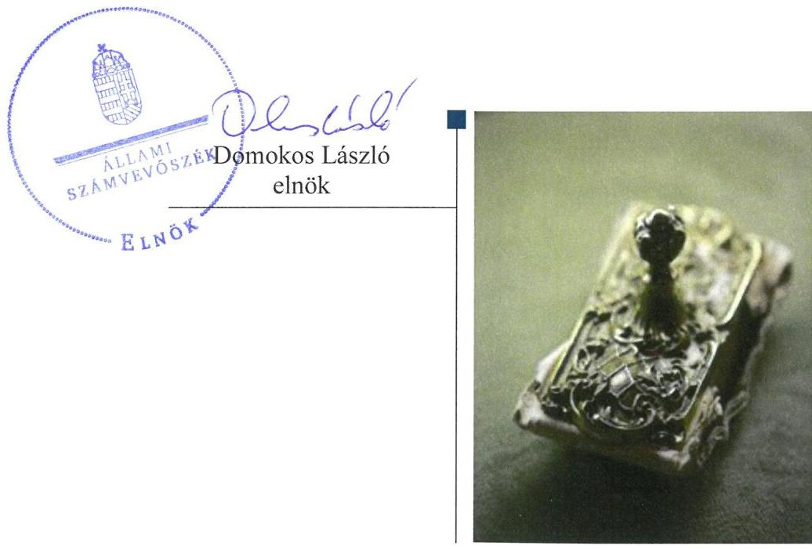
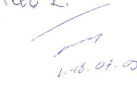
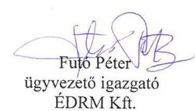
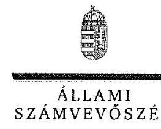
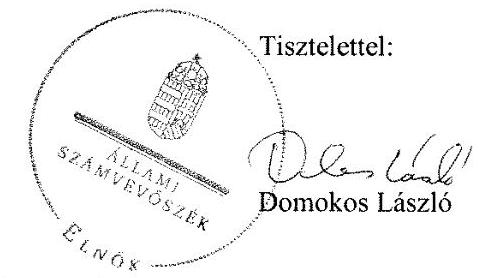
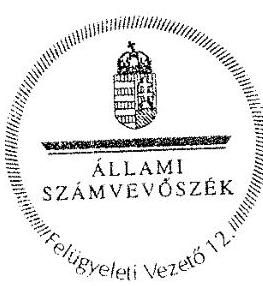

# Jelentés 

## Az állami tulajdonú gazdasági társaságok ellenőrzése

ÉDRM Észak-Dunántúli Regionális Mosoda Kft. 2018.

18213
www.asz.hu

---

# J elentés 

## Az állami tulajdonú gazdasági társaságok ellenőrzése

ÉDRM Észak-Dunántúli Regionális Mosoda Kft.
2018. 08. hó 16. nap

---

# AZ ELLENŐRZÉST FELÜGYELTE: 

PETŐ KRISZTINA felügyeleti vezető

## AZ ELLENŐRZÉST VEZETTE ÉS A VÉGREHAJTÁSÁÉRT FELELŐS:

VALASTYÁNNÉ DR. VÍZHÁNYÓ JÚLIA ellenőrzésvezető

## A PROGRAM ÖSSZEÁLLÍTÁSÁÉRT FELELŐS:

TÓTPÁL SZABOLCS osztályvezető

IKTATÓSZÁM: EL-0426-029/2018.
TÉMASZÁM: 2469
ELLENŐRZÉS-AZONOSÍTÓ SZÁM: V081444

---

# TARTALOMJEGYZÉK 

■ ÖSSZEGZÉS ..... 5
■ AZ ELLENŐRZÉS CÉLJA ..... 6
■ AZ ELLENŐRZÉS TERÜLETE ..... 7
■ AZ ELLENŐRZÉS HÁTTERE, INDOKOLTSÁGA ..... 8
■ A JELENTÉS LÉNYEGES KÉRDÉSKÖREI ..... 9
■ AZ ELLENŐRZÉS HATÓKÖRE ÉS MÓDSZEREI ..... 10
■ MEGÁLLAPÍTÁSOK ..... 12
■ JAVASLATOK ..... 14
■ MELLÉKLETEK ..... 15
I. sz. melléklet: Értelmező szótár ..... 15
■ FÜGGELÉK: ÉSZREVÉTELEK ..... 21
■ RÖVIDÍTÉSEK JEGYZÉKE ..... 31

---

.

---

# ÖSSZEGZÉS 

Az Állami Egészségügyi Ellátó Központ a tulajdonosi jogait nem gyakorolta szabályszerűen az ÉDRM Észak-Dunántúli Regionális Mosoda Korlátolt Felelősségű Társaság felett. A Társaság szabályozottsága, gazdálkodási és vagyongazdálkodási tevékenysége a 2013. és 2016. években nem volt szabályszerű. Az éves beszámolók mérlegtételeit leltárral nem támasztották alá. A gazdálkodás és vagyongazdálkodás ellenőrizhetősége és elszámoltathatósága nem volt biztositott.

## Az ellenőrzés társadalmi indokoltsága

Az állami vagyonnal való gazdálkodás alapvető célja az állami vagyon átlátható, rendeltetésszerű és felelős felhasználásának biztosítása. Az állami tulajdonban álló gazdálkodó szervezetek államot megillető társasági részesedése a nemzeti vagyon részét képezi és legfőbb rendeltetése szerint a közfeladatok ellátását szolgálja.

Az Állami Számvevőszék stratégiájában megfogalmazta, hogy az államháztartáson kívülre nyújtott költségvetési támogatások és ingyenes vagyonjuttatások, valamint az államháztartáson kívül működő közfeladat-ellátó rendszerek ellenőrzéseivel hozzájárul ahhoz, hogy a közpénzeket az államháztartáson kívül működő szervezetek is átlátható, rendezett módon használják fel a közfeladatok szerződésben vállalt ellátása érdekében.

Az Állami Számvevőszék céljaival és a társadalmi igénnyel összhangban, valamint a gazdasági társaságok kiemelt fontosságú szerepe miatt került sor az ÉDRM Észak-Dunántúli Regionális Mosoda Korlátolt Felelősségű Társaság ellenőrzésére.

## Főbb megállapítások, következtetések, javaslatok

Az Állami Egészségügyi Ellátó Központ Társaság feletti tulajdonosi joggyakorlása nem felelt meg a jogszabályi előírásoknak. A felügyelőbizottság múködési kereteinek kialakítása nem volt szabályszerű, mert ügyrendjét a tulajdonosi joggyakorló nem hagyta jóvá.

Az ÉDRM Észak-Dunántúli Regionális Mosoda Korlátolt Felelősségű Társaság szabályozottsága, gazdálkodási és vagyongazdálkodási tevékenysége a 2013. és 2016. évekre vonatkozóan nem volt szabályszerű, így a Társaság ellenőrizhetősége és elszámoltathatósága nem volt biztosított. A Társaság a törvényi előírás ellenére nem alakította ki számviteli politikáját és nem készítette el ennek keretében szabályzatait.

Az ÉDRM Észak-Dunántúli Regionális Mosoda Korlátolt Felelősségű Társaság a 2013-2016. évek egyszerűsített éves beszámolói készítése során megsértette a jogszabályi előírásokat, mivel a mérleg tételeinek alátámasztásához nem állított össze leltárt, amely tételesen, ellenőrizhető módon tartalmazta volna a Társaság mérleg fordulónapján meglévő eszközeit és forrásait, mennyiségben és értékben. Az éves beszámolókat a tulajdonosi joggyakorló Állami Egészségügyi Ellátó Központ annak ellenére elfogadta, hogy azokat leltár nem támasztotta alá. A könyvvizsgáló a beszámolókat korlátozás nélküli hitelesítő záradékkal látta el.

A megállapítások alapján az Állami Számvevőszék az Állami Egészségügyi Ellátó Központ főigazgatójának egy javaslatot, az ÉDRM Észak-Dunántúli Regionális Mosoda Korlátolt Felelősségű Társaság ügyvezetőjének kettő javaslatot fogalmazott meg, amelyre 30 napon belül intézkedési tervet kell készíteniük.

---

# AZ ELLENŐRZÉS CÉLJA 

Az ellenőrzés célja annak értékelése volt, hogy a tulajdonosi jogok gyakorlása szabályszerű volt-e. A gazdálkodó szervezet szabályozottsága, gazdálkodása és vagyongazdálkodási tevékenysége megfelelt-e a jogszabályi és a tulajdonosi előírásoknak; biztosítva volt-e a közfeladatok átláthatósága és elszámoltathatósága érdekében a közszolgáltatás díjának megalapozottsága szabályszerű önköltségszámítással. A vagyonváltozást eredményező döntések esetében a tulajdonosi jogok gyakorlója és a gazdálkodó szervezet szabályszerűen jártak-e el.

---

# AZ ELLENŐRZÉS TERÜLETE 

## ÉDRM Észak-Dunántúli Regionális Mosoda Kft.

A győri székhelyű ÉDRM Észak-Dunántúli Regionális Mosoda Kft.-t az ellenőrzött időszakot megelőzően 1995. október 30-án alapította a győri Petz Aladár Megyei Oktató Kórház, a mosonmagyaróvári Karolina Kórház- Rendelőintézet és a kapuvári Dr. Lumniczer Sándor Városi Kórház.

A Társaság ${ }^{1}$ 2012. május 1-jétől került a magyar állam 100\%-os tulajdonába a 2011. évi CLIV. tv. ${ }^{2}$ 2. § (1) és a 2012. évi XXXVIII. tv. ${ }^{3}$ 2. § (1) bekezdései alapján. A tulajdonosi jogokat ettől az időponttól a Gyógyszerészeti és Egészségügyi Minőség- és Szervezetfejlesztési Intézet gyakorolta, melynek elnevezése 2015. március 1-jétől történt átszervezését követően Állami Egészségügyi Ellátó Központra változott. A tulajdonosi joggyakorló központi költségvetési szerv volt.

A Társaság az ellenőrzött időszakban mosodai szolgáltatási, textília javítási, ingatlan fenntartási és közúti áruszállítási tevékenységet végzett. A kórházi síktextíliák tisztítását és javítását egy telephelyen végezték nagyüzemi szinten, nagy tételben a Győr-MosonSopron, a Veszprém és a Komárom-Esztergom megyei kórházak részére.

A Társaság a feladata ellátásához szükséges ingatlant a Petz Aladár Megyei Oktató Kórháztól bérelte. A Társaság vagyonkezelésbe vett, hasznosításra átvett vagyonnal, illetve más gazdasági társaságban részesedéssel, kapcsolt vállalkozással nem rendelkezett.

A Társaság jegyzett tőkéje az ellenőrzött időszakban 3,0 M Ft ${ }^{4}$ volt. A foglalkoztatottak átlagos statisztikai létszáma 2013. évről 2016. év végére 52 főre csökkent. Az ügyvezető személye az ellenőrzött időszakban egy alkalommal 2013. szeptember 27-től változott.

Az értékesítés nettó árbevétele 2016. december 31-én 299,8 M Ft, adózott eredménye -19,7 M Ft volt. A Társaság az önköltségszámítás rendjére vonatkozó belső szabályzat elkészítésére nem volt kötelezett.

A Társaság az ellenőrzött időszakban nem tartozott a kormányzati szektorba sorolt társaságok közé.

A Társaság az ellenőrzött időszakban nem minősült közhasznú jogállású szervezetnek, közfeladatot nem látott el.

A Társaság az ellenőrzött években könyvvizsgálatra kötelezett volt, a könyvvizsgálót a tulajdonosi joggyakorló jelölte ki.

---

# AZ ELLENŐRZÉS HÁTTERE, INDOKOLTSÁGA 

Az Európai Unióban 1994. év óta hatályos túlzott hiány eljárás mindig kihívást jelentett a tagállamok számára. Az állami tulajdonú gazdálkodó szervezetek ellenőrzése kiemelten fontos a vagyon megőrzése, megóvása érdekében, valamint a kormányzati szektor elszámolásaiban megjelenő állami tulajdonú gazdálkodó szervezetek esetében, amelyekkel szemben alapvető követelmény, hogy gazdálkodásuk, működésük szabályszerű, az általuk szolgáltatott adatok minél megbízhatóbbak legyenek. Gazdálkodásuk jellemzően a közérdeklődés és a média figyelmének középpontjában áll, amihez hozzájárul a gazdálkodásuk körébe tartozó - közvetlen vagy közvetett állami tulajdonú, tehát végső soron a nemzeti vagyon részét képező - vagyon nagysága, illetve az általuk ellátott közszolgáltatások/közfeladatok minősége és hatékonysága. A közszolgáltatási árképzés megalapozottsága és a rendszeres elszámoltatás feltételeinek kialakítása az ellenőrzése során nagy hangsúlyt kap. A közszolgáltatás árában és annak támogatásában meg kell jelennie az önköltségszámítás szempontjainak, amely biztosítja a müködés fenntarthatóságát (eszközpótlást) is.

Az ellenőrzés rámutathat az állami tulajdonú gazdálkodó szervezetek gazdálkodási tevékenységével jó gyakorlatokra és szabálytalanságokra. Felhívhatja a figyelmet a jogszabályi követelmények teljesítéséhez szükséges feltételek hiányosságaira, hozzájárulhat az államháztartáson kívüli, de (közvetlenül vagy közvetve) állami vagyont használó gazdálkodó szervezetek tevékenységének átláthatóságához. Ellenőrzésünk eredményeképpen javaslatainkkal, megállapításainkkal hozzájárulhatunk a nemzeti vagyonnal való gazdálkodás átláthatóságának, elszámoltathatóságának javításához.

---

# A JELENTÉS LÉNYEGES KÉRDÉSKÖREI 

1. A tulajdonosi jogok gyakorlása szabályszerű volt-e?
2. A társaság müködésének szabályozottsága megfelelt-e az előírásoknak? A társaságnál a gazdálkodási feladatok ellátása szabályszerű volt-e? A társaság vagyongazdálkodása szabályszerű volt-e?

---

# AZ ELLENŐRZÉS HATÓKÖRE ÉS MÓDSZEREI 

## Az ellenőrzés típusa

Megfelelőségi ellenőrzés.

## Az ellenőrzött időszak

A 2013. - 2016. évek, a 2016. évi beszámoló jóváhagyásáig tartó időszak.

## Az ellenőrzés tárgya

Állami tulajdonban (résztulajdonban) lévő gazdasági társaság gazdálkodása, kiemelten vagyongazdálkodási tevékenysége, a tulajdonosi jogok gyakorlása, továbbá a kormányzati szektorba sorolt gazdasági társaság gazdálkodásának a kormányzati szektor hiányára és az államadósságra befolyással bíró elemei.

## Az ellenőrzött szervezet

ÉDRM Észak-Dunántúli Regionális Mosoda Kft., Állami Egészségügyi Ellátó Központ.

## Az ellenőrzés jogalapja

Az ellenőrzés jogalapját az ÁSZ tv. ${ }^{5} 1 . \S$ (3) bekezdése és 5. § (3)-(5) bekezdése képezi.

## Az ellenőrzés módszerei

Az ellenőrzést a nemzetközi standardokat irányadónak tekintve az ellenőrzési program ellenőrzési kérdései, az ellenőrzött időszakban hatályos jogszabályok, az ellenőrzés szakmai szabályok és módszertanok figyelembevételével végeztük.

Az ellenőrzés ideje alatt az ellenőrzött szervezettel történő kapcsolattartást az ÁSZ Szervezeti és Múködési Szabályzatának vonatkozó előírásai alapján biztosítottuk.

Az ellenőrzési kérdések megválaszolásához szükséges bizonyítékok megszerzése a következő ellenőrzési eljárások alkalmazásával történt: megfigyelés, kérdésfeltevés (információkérés), összehasonlítás, valamint elemző eljárás. Az ellenőrzési bizonyítékként felhasználható adatforrások

---

közé tartoztak egyrészt az ellenőrzési programban felsorolt adatforrások, másrészt adatforrás lehetett még minden - az ellenőrzés folyamán - feltárt, az ellenőrzés szempontjából információkat tartalmazó dokumentum.

Az ellenőrzést a kérdésekre adott válaszok kiértékelésével, valamint a megjelölt adatforrások felhasználásával, továbbá az adott időszakban hatályos jogszabályok figyelembevételével kellett lefolytatni, amennyiben egy alapvető jelentőségű dokumentum alapján valamely lényeges kérdéskörre vonatkozóan az ÁSZ megállapítása kellően megalapozott lett, további részletes ellenőrzési tevékenységek az adott kérdéskörrel és az azzal szoros logikai kapcsolatban - ráépülő jelleggel - lévő kérdéskörökkel kapcsolatban nem kerültek végrehajtásra.

A teljes ellenőrzött időszakra vonatkozóan kerül ellenőrzésre a gazdasági társaság tervezési, beszámolási, közzétételi, adatszolgáltatási kötelezettségének, valamint a belső ellenőrzési tevékenységének szabályszerűsége. Míg 2013. és 2016. évekre vonatkozóan a gazdasági társaság működésének szabályozottsága, a bevételei és ráfordításai elszámolásának, valamint a vagyongazdálkodásának szabályszerűsége ellenőrzésére kerül sor.

---

# 1. A tulajdonosi jogok gyakorlása szabályszerű volt-e? 

Összegző megállapítás

A tulajdonosi jogok gyakorlása a 2013. és 2016. években nem volt szabályszerű.

A TÁRSASÁGGAL KAPCSOLATOS TULAJDONOSI JOGGYAKORLÁS rendjét az ÁEEK SZMSZ1-3-ban ${ }^{6}$, a Társaság Alapító okirat ${ }_{1-5}$-ben ${ }^{7}$ és a Társaság SZMSZ ${ }^{8}$-ben határozta meg.

Az ÁEEK SZMSZ ${ }_{1,2}$-ben a 2013. január 1-jétől 2016. március 23-ig terjedő időszakban az Ávr. ${ }^{9}$ 13. § (1) bekezdés d) pontjában foglaltak ellenére a Társaság felsorolása nem szerepelt, ezt követően szerepeltette.

A Takarékossági tv. ${ }^{10}$ 4. § (2) bekezdését megsértve a felügyelőbizottság a 2013. május 31-től 2013. december 31-ig terjedő időszakban az előírt három helyett négy tagból állt.

A felügyelőbizottság a 10/2013. (11. 13.) számú határozatával a jogszabályi előírásoknak megfelelően az ügyrendjét elfogadta. Ezt követően az ellenőrzött időszak végéig még egy alkalommal került sor az ügyrend módosítására a 6/2015. (04. 27.) felügyelőbizottsági határozattal. Az ÁEEK a 2013. évben megsértette a Gt. ${ }^{11}$ 34. § (4) bekezdésében, illetve az Alapító okirat ${ }_{1,2}$ 13.3. pontjában foglaltakat, továbbá a 2016. évben a Ptk. ${ }^{12}$ 3:122. § (3) bekezdésében, illetve az Alapító okirat ${ }_{3-5}$ 13.3. pontjában foglaltakat, mivel a felügyelőbizottság ügyrendjét nem hagyta jóvá.

A 2016. évben az ÁEEK a Társaság részére a vagyonnyilvántartási szabályzat ${ }^{13}$-ban írt elő adatszolgáltatási kötelezettséget, amelyet a Társaság teljesített.

ÚZLETI TERVEKKEL a Társaság a 2013. és a 2016. években az SZMSZ 7. pontjának megfelelően rendelkezett, amelyeket az ÁEEK jóváhagyott.

A 2013. ÉS 2016. ÉVI BESZÁMOLÓK elfogadásáról az ÁEEK a felügyelőbizottság és a könyvvizsgálói vélemény ismeretében a Gt. és a Ptk. előírásainak megfelelően döntött.

---

# 2. A társaság múködésének szabályozottsága megfelelt-e az előírásoknak? A társaságnál a gazdálkodási feladatok ellátása szabályszerű volt-e? A társaság vagyongazdálkodása szabályszerű volt-e? 

Összegző megállapítás A számviteli politika és az ennek keretében kialakítandó szabályzatok hiánya miatt a Társaság szabályozottsága, gazdálkodási és vagyongazdálkodási tevékenysége a 2013. és 2016. évekre vonatkozóan nem volt szabályszerű.

A Társaság a 2013. és a 2016. években megsértette a Számv. tv. ${ }^{14}$ 14. § (3)(4) bekezdésében foglaltakat, mivel nem alakította ki a számviteli politikáját.

A 2013. évre vonatkozóan a Társaság a Számv. tv. 14. § (5) bekezdés a) és d) pontjaiban foglaltakat figyelmen kívül hagyva nem rendelkezett az eszközök és a források leltárkészítési és leltározási szabályzatával, illetve pénzkezelési szabályzattal. A Társaság a 2013. és a 2016. évekre vonatkozóan a Számv. tv. 14. § (5) b) pontjában előírtak ellenére a számviteli politika keretében nem készítette el az eszközök és források értékelési szabályzatát.

A Társaság a 2013-2016. évek egyszerűsített éves beszámolói készítése során nem tartotta be a Számv. tv. 69. § (1) bekezdésében foglalt előírásokat, mivel a mérleg tételeinek alátámasztásához nem állított össze leltárt, amely tételesen, ellenőrizhető módon tartalmazta volna a Társaság mérleg fordulónapján meglévő eszközeit és forrásait, mennyiségben és értékben. A könyvvizsgáló az ellenőrzött években a Társaság beszámolóiról korlátozás nélküli záradékkal adta ki véleményét.

---

# JAVASLATOK 

Az ÁSZ tv. 33. § (1) bekezdésében foglaltak értelmében az ellenőrzött szervezet vezetője köteles a jelentésben foglalt megállapításokhoz kapcsolódó intézkedési tervet összeállítani és azt a jelentés kézhezvételétől számított 30 napon belül az ÁSZ részére megküldeni. Amennyiben az ellenőrzött szervezet vezetője nem küldi meg határidőben az intézkedési tervet, vagy továbbra sem elfogadható intézkedési tervet küld, az Állami Számvevőszék elnöke az ÁSZ tv. 33. § (3) bekezdése a) és b) pontjaiban foglaltakat érvényesítheti.

## Az Állami Egészségügyi Ellátó Központ föigazgatójának

1. Intézkedjen annak érdekében, hogy a felügyelőbizottság (maga által megállapított) ügyrendje a jogszabályi előirásnak megfelelően kerüljön jóváhagyásra.
(1. összegző megállapítás 4. bekezdésének 3. mondata alapján)

## Az ÉDRM Észak-Dunántúli Regionális Mosoda Kft. ügyvezetőjének

1. Intézkedjen a számviteli politika és annak keretében elkészítendő, a Társaság tekintetében releváns szabályzatok jogszabályi előirásoknak megfelelő elkészitése iránt.
(2. összegző megállapítás 1-2. bekezdései alapján)
2. Intézkedjen a jogszabályi előirásnak megfelelő leltár összeállítása iránt.
(2. összegző megállapítás 3. bekezdésének 1. mondata alapján)

---

# MELLÉKLETEK 

## I. SZ. MELLÉKLET: ÉRTELMEZŐ SZÓTÁR

állami vagyon
a) Az állam tulajdonában lévő dolog, valamint a dolog módjára hasznosítható természeti erő,
b) az a) pont hatálya alá nem tartozó mindazon vagyon, amely vonatkozásában törvény az állam kizárólagos tulajdonjogát nevesíti,
c) az állam tulajdonában lévő tagsági jogviszonyt megtestesítő értékpapír, illetve az államot megillető egyéb társasági részesedés,
d) az államot megillető olyan immateriális, vagyoni értékkel rendelkező jogosultság, amelyet jogszabály vagyoni értékű jogként nevesít.
Forrás: Vtv. ${ }^{15}$ 1. § (2) bekezdése
e) az állam tulajdonában lévő pénzügyi eszközök

Forrás: Vtv. 1. § (2) bekezdése
2013. június 27-ig:

Az állami vagyont az MNV Zrt. maga kezeli, vagy szerződés - így különösen bérlet, haszonbérlet, megbízás - alapján központi költségvetési szervnek, természetes vagy jogi személynek, vagy jogi személyiséggel nem rendelkező gazdálkodó szervezetnek hasznosításra átengedi.
Forrás: Vtv. 23. § (1) bekezdése
2013. június 28-ától:

Az állami vagyonnal az MNV Zrt. maga gazdálkodik, vagy szerződés - így különösen bérlet, haszonbérlet, megbízás - alapján központi költségvetési szervnek, természetes vagy jogi személynek, vagy jogi személyiséggel nem rendelkező gazdálkodó szervezetnek hasznosításra átengedi, illetőleg vagyonkezelésbe, haszonélvezetbe adja.
Forrás: Vtv. 23. § (1) bekezdése
anyavállalat
Az a vállalkozó, amely egy másik vállalkozónál (a továbbiakban: leányvállalat) közvetlenül vagy leányvállalatán keresztül közvetetten meghatározó befolyást képes gyakorolni, mert az alábbi feltételek közül legalább eggyel rendelkezik:
a) a tulajdonosok (a részvényesek) szavazatának többségével (50 százalékot meghaladóval) tulajdoni hányada alapján egyedül rendelkezik, vagy
b) más tulajdonosokkal (részvényesekkel) kötött megállapodás alapján a szavazatok többségét egyedül birtokolja, vagy
c) a társaság tulajdonosaként (részvényeseként) jogosult arra, hogy a vezető tisztségviselők vagy a felügyelőbizottság tagjai többségét megválassza vagy visszahívja, vagy
d) a tulajdonosokkal (a részvényesekkel) kötött szerződés (vagy a létesítő okirat rendelkezése) alapján - függetlenül a tulajdoni hányadtól, a szavazati aránytól, a megválasztási és visszahívási jogtól - döntő irányítást, ellenőrzést gyakorol.
Forrás: Számv. tv. 3. § (2) 1. pont
gazdasági társaság
A Ptk. 2 3:88. § (1) bekezdése szerint „a gazdasági társaságok üzletszerű közös gazdasági tevékenység folytatására, a tagok vagyoni hozzájárulásával létrehozott, jogi személyiséggel rendelkező vállalkozások, amelyekben a tagok a nyereségből közösen részesednek, és a veszteséget közösen viselik".
állami vagyon hasznosítására kötött szerződés
Az állami vagyon hasznosítására kötött szerződések elsődleges célja az állami vagyon hatékony működtetése, állagának védelme, értékének megőrzése, illetve gyarapítása, az állami és közfeladatok ellátásának elősegítése.
Forrás: Vtv. 23. § (2) bekezdése

---

állami vagyon használója
állami vagyon kezelője/vagyonkezelő
állami vagyon kerelője/vagyonkezelő
állami vagyon értékesítése
gazdálkodó szervezet
kapcsolt vállalkozás
kormányzati szektorba sorolt egyéb szervezet

Az a természetes vagy jogi személy, jogi személyiséggel nem rendelkező szervezet, aki, vagy amely törvény vagy szerződés alapján, bármely jogcímen (bérlet, haszonbérlet, használat stb.) állami vagyont birtokol, használ, szedi annak hasznait, hasznosít, ide nem értve a haszonélvezőt, a vagyonkezelőt és a tulajdonosi jogok gyakorlóját.
Forrás: Vtv. vhr. ${ }^{16}$ 1. § (7) a. pontja
2013. június 27-ig:

Az állami vagyont az MNV Zrt. maga kezeli, vagy szerződés - így különösen bérlet, haszonbérlet, megbízás - alapján központi költségvetési szervnek, természetes vagy jogi személynek, vagy jogi személyiséggel nem rendelkező gazdálkodó szervezetnek hasznosításra átengedi. Az állami vagyonra vonatkozóan az MNV Zrt. kizárólag az Nvtv ${ }^{17}$-ben meghatározott személyekkel köthet vagyonkezelési szerződést.
Forrás: Vtv. 23. § (1), 27. § (1)
2013. június 28-ától:

Az állami vagyonnal az MNV Zrt. maga gazdálkodik, vagy szerződés - így különösen bérlet, haszonbérlet, megbízás - alapján központi költségvetési szervnek, természetes vagy jogi személynek, vagy jogi személyiséggel nem rendelkező gazdálkodó szervezetnek hasznosításra átengedi, illetőleg vagyonkezelésbe, haszonélvezetbe adja. Az állami vagyonra vonatkozóan az MNV Zrt. kizárólag az Nvtv-ben meghatározott személyekkel köthet vagyonkezelési szerződést.
Forrás: Vtv. 23. § (1), 27. § (1)
Állami vagyon tulajdonjogának bármely jogcímen történő, visszterhes átruházása.
Forrás: Vtv. vhr. 1. § (7) d) pont)
2014. március 14-ig:

A Ptk. ${ }^{18}$ 685. § c) pontja szerint gazdálkodó szervezet: „az állami vállalat, az egyéb állami gazdálkodó szerv, a szövetkezet, a lakásszövetkezet, az európai szövetkezet, a gazdasági társaság, az európai részvénytársaság, az egyesülés, az európai gazdasági egyesülés, az európai területi együttmüködési csoportosulás, az egyes jogi személyek vállalata, a leányvállalat, a vízgazdálkodási társulat, az erdő birtokossági társulat, a végrehajtói iroda, az egyéni cég, továbbá az egyéni vállalkozó."
2014. március 15-től:

A gazdasági társaság, az európai részvénytársaság, az egyesülés, az európai gazdasági egyesülés, az európai területi együttműködési csoportosulás, a szövetkezet, a lakásszövetkezet, az európai szövetkezet, a vízgazdálkodási társulat, az erdőbirtokossági társulat, az állami vállalat, az egyéb állami gazdálkodó szerv, az egyes jogi személyek vállalata, a közös vállalat, a végrehajtói iroda, a közjegyzői iroda, az ügyvédi iroda, a szabadalmi ügyvivői iroda, az önkéntes kölcsönös biztosító pénztár, a magánnyugdíjpénztár, az egyéni cég, továbbá az egyéni vállalkozó. Az állam, a helyi önkormányzat, a költségvetési szerv, az egyesület, a köztestület, valamint az alapítvány gazdálkodó tevékenységével összefüggő polgári jogi kapcsolataira is a gazdálkodó szervezetre vonatkozó rendelkezéseket kell alkalmazni.
Forrás: Ppt. ${ }^{19} 396 . \S$
Az anyavállalat és a leányvállalat és a közös vezetésű vállalkozások (fölérendelt anyavállalat esetében a minősítést a fölérendelt anyavállalat szempontjából kell elvégezni)
Forrás: Számv. tv. 3. § (2) 7. pont
Az a szervezet, amely az Áht. ${ }^{20}$ alapján nem része az államháztartásnak, azonban az Európai Közösséget létrehozó szerződéshez csatolt, a túlzott hiány esetén követendő

---

# Mellékletek 

eljárásról szóló jegyzőkönyv alkalmazásáról szóló 2009. május 25-i 479/2009/EK rendelet szerint a kormányzati szektorba tartozik. A nemzetgazdasági miniszter 2013. június 26-án megjelent Közleményben tette közé ezen szervezetek listáját
közszolgáltatás Az Ebktv. ${ }^{21}$ 3. § d) pontja a következőképpen határozza meg a közszolgáltatást: „szerződéskötési kötelezettség alapján a lakosság alapvető szükségleteinek ellátására irányuló szolgáltatás, így különösen a villamos energia-, gáz-, hő-, víz-, szennyvíz- és hulladékkezelési, köztisztasági, postai és távközlési szolgáltatás, továbbá a menetrend alapján közlekedő járművekkel végzett közforgalmú személyszállítás".
leányvállalat Az a gazdasági társaság, amelyre az anyavállalat meghatározó befolyást képes gyakorolni
Forrás: Számv. tv. 3. § (2) 2. pont
meghatározó befolyás

## 2014. március 14-ig:

A befolyással rendelkező akkor rendelkezik egy jogi személyben meghatározó befolyással, ha annak tagja, illetve részvényese és
a) jogosult e jogi személy vezető tisztségviselői vagy felügyelőbizottsága tagjai többségének megválasztására, illetve visszahívására, vagy
b) a jogi személy más tagjaival, illetve részvényeseivel kötött megállapodás alapján egyedül rendelkezik a szavazatok több mint ötven százalékával.
A meghatározó befolyás akkor is fennáll, ha a befolyással rendelkező számára az előzőek szerinti jogosultságok közvetett módon biztosítottak. A befolyással rendelkezőnek egy jogi személyben a szavazatok több mint ötven százalékával közvetett módon való rendelkezése vagy egy jogi személyben közvetetten fennálló meghatározó befolyása megállapítása során a jogi személyben szavazati joggal rendelkező más jogi személyt (köztes vállalkozást) megillető szavazatokat meg kell szorozni a befolyással rendelkezőnek a köztes vállalkozásban, illetve vállalkozásokban fennálló szavazatával. Ha a köztes vállalkozásban fennálló szavazatok mértéke az ötven százalékot meghaladja, akkor azt egy egészként kell figyelembe venni.
Forrás: Ptk. ${ }_{1}$ 685/B. § (2)-(3) bekezdések

## 2014. március 15-től:

A befolyással rendelkező akkor rendelkezik egy jogi személyben meghatározó befolyással, ha annak tagja vagy részvényese, és
a) jogosult e jogi személy vezető tisztségviselői vagy felügyelőbizottsága tagjai többségének megválasztására, illetve visszahívására; vagy
b) a jogi személy más tagjai, illetve részvényesei a befolyással rendelkezővel kötött megállapodás alapján a befolyással rendelkezővel azonos tartalommal szavaznak, vagy a befolyással rendelkezőn keresztül gyakorolják szavazati jogukat, feltéve, hogy együtt a szavazatok több mint felével rendelkeznek.
Forrás: Ptk.2. 8:2. § (2) bekezdés
MNV Zrt.
Az állami vagyon felett, a Magyar Államot megillető tulajdonosi jogok és kötelezettségek összességét - a hatályos szabályozás szerint - az állami vagyon felügyeletéért felelős miniszter (jelenleg a nemzeti fejlesztési miniszter) gyakorolja. A miniszter feladatát nagy részben az MNV Zrt., mint tulajdonosi joggyakorló szervezet útján látja el.
nemzeti vagyon
a) az állam vagy a helyi önkormányzat kizárólagos tulajdonában álló dolgok,
b) az a) pont hatálya alá nem tartozó, állam vagy a helyi önkormányzat tulajdonában lévő dolog,
c) az állam vagy a helyi önkormányzatot tulajdonában lévő pénzügyi eszközök, továbbá az államot vagy a helyi önkormányzatot megillető társasági részesedések,

---

d) az államot vagy a helyi önkormányzatot megillető bármely vagyoni értékkel rendelkező jogosultság, amelyet jogszabály vagyoni értékű jogként nevesít,
e) Magyarország határa által körbezárt terület feletti légtér,
f) az üvegházhatású gázok kibocsátási egységeinek kereskedelméről szóló törvény szerint kibocsátási egység és légiközlekedési kibocsátási egység, valamint az ENSZ Éghajlatváltozási Keretegyezménye és annak Kiotói Jegyzőkönyve végrehajtási keretrendszeréről szóló törvény szerinti kiotói egység,
g) állami vagy helyi önkormányzati fenntartású közgyűjtemény (muzeális intézmény, levéltár, közgyűjteményként működő kép- és hangarchívum, valamint könyvtár) saját gyűjteményében nyilvántartott kulturális javak körébe tartozó dolog, kivéve, ha az állami vagy önkormányzati tulajdon jogszerű létrejötte kétséget kizáró módon nem bizonyítható és a dologra nézve más a tulajdonjogát bizonyítja vagy a kulturális javakra vonatkozó jogszabályokban meghatározott eljárás keretében valószínűsíti (g. pont módosult 2013. december 7-től),
h) a régészeti lelet,
i) a nemzeti adatvagyon körébe tartozó állami nyilvántartások fokozottabb védelméről szóló törvény szerinti nemzeti adatvagyon.
Forrás: Nvtv. 1. § (2)
nemzeti vagyon hasznosítása

A tulajdonosi joggyakorló vagy a nemzeti vagyon használója által a nemzeti vagyon birtoklásának, használatának, hasznok szedése jogának bármely - a tulajdonjog átruházását nem eredményező - jogcímen történő átengedése, ide nem értve a vagyonkezelésbe adást, valamint a haszonélvezeti jog alapítását.
Forrás: Nvtv. 3. § (1) 4. pont
többségi befolyást biztosító részesedés

1. március 14-ig: Többségi befolyás: az olyan kapcsolat, amelynek révén természetes személy, jogi személy vagy jogi személyiség nélküli gazdasági társaság (a továbbiakban együtt: befolyással rendelkező) egy jogi személyben a szavazatok több mint ötven százalékával vagy meghatározó befolyással rendelkezik.
Forrás: Ptk. 1 685/B. § (1)
2. március 15-től: Többségi befolyás az olyan kapcsolat, amelynek révén természetes személy vagy jogi személy (befolyással rendelkező) egy jogi személyben a szavazatok több mint felével vagy meghatározó befolyással rendelkezik.
Forrás: Ptk. 2 8:2. § (1)
3. március 14-ig:

Az állami vagyon kezelőjét, haszonélvezőjét, használóját megillető jogok gyakorlását, annak szabályszerűségét, célszerűségét az MNV Zrt. - szükség szerint területi szervei útján - ellenőrzi.

# 2014. március 15-től: 

Az állami vagyon használóját, vagyonkezelőjét és haszonélvezőjét megillető jogok gyakorlását, annak szabályszerűségét, a kötelezettségek teljesítését, valamint a vagyon rendeltetése szerinti célszerűségét a tulajdonosi joggyakorló rendszeresen ellenőrzi.
Forrás: Vtv. vhr. 20. § (1)
tulajdonosi jogok gyakorlója 1.

### 2013. június 27-ig:

Az állami vagyon felett a Magyar Államot megillető tulajdonosi jogok és kötelezettségek összességét - ha törvény eltérően nem rendelkezik - az állami vagyon felügyeletéért felelős miniszter (a továbbiakban: miniszter) gyakorolja, aki e feladatát a Magyar Nemzeti Vagyonkezelő Zártkörűen Működő Részvénytársaság (a továbbiakban: MNV Zrt.), a Magyar Fejlesztési Bank, illetve a tulajdonosi joggyakorló szervezet útján

---

látja el. A miniszter miniszteri rendeletben, a törvényben meghatározott állami vagyoni kör tekintetében, meghatározott időtartamra, a joggyakorlás egyes szabályainak meghatározásával - az őt megillető tulajdonosi jogok és kötelezettségek összességének, illetve azok meghatározott részének gyakorlóját az Áht. szerinti központi költségvetési szervek, ezek intézménye, továbbá a 100\%-ban állami tulajdonban álló gazdasági társaságok közül kijelölheti.
Forrás: Vtv. 3. § (1) és (2)

# 2013. június 28-ától: 

A rábízott állami vagyon felett az államot megillető tulajdonosi jogok és kötelezettségek összességét tulajdonosi joggyakorlóként:
a) ha törvény vagy miniszteri rendelet eltérően nem rendelkezik, a Magyar Nemzeti Vagyonkezelő Zártkörűen Működő Részvénytársaság (a továbbiakban: MNV Zrt.),
b) törvényben kijelölt személy vagy
c) az állami vagyon felügyeletéért felelős miniszter (a továbbiakban: miniszter) által rendeletben kijelölt személy gyakorolja.
[...] A miniszter e törvény felhatalmazása alapján - a meghatározott célok hatékonyabb elérése érdekében, miniszteri rendeletben, az ott meghatározott állami vagyoni kör tekintetében, meghatározott időtartamra - e törvény keretei között, a joggyakorlás egyes szabályainak meghatározásával - az államot megillető tulajdonosi jogok és kötelezettségek összességének, illetve azok meghatározott részének gyakorlóját az Áht. szerinti központi költségvetési szervek, ezek intézménye, továbbá a 100\%-ban állami tulajdonban álló gazdasági társaságok közül kijelölheti.
Forrás: Vtv. 3. § (1) és (2)
2.

Aki a nemzeti vagyon felett az államot vagy a helyi önkormányzatot megillető tulajdonosi jogok és kötelezettségek összességének gyakorlására jogosult
Forrás: Nvtv. 3. § (1) 17. pontja
2013. június 27-től:

A vagyonkezelő köteles a vagyontárgy értékét megőrizni, állagának megóvásáról, jó karban tartásáról, működtetéséről gondoskodni, továbbá - a központi költségvetési szervek kivételével - díjat fizetni vagy a szerződésben előírt más kötelezettséget teljesíteni.
Forrás: Vtv. 27. § (2)

## 2013. június 28-ától december 31-ig:

A vagyonkezelő köteles a vagyontárgy állagának megóvásáról, jó karbantartásáról, működtetéséről gondoskodni, továbbá - a központi költségvetési szervek kivételével - díjat fizetni, jogszabályban és szerződésben előírt más kötelezettségét teljesíteni, valamint a vagyontárgyat jogszabályban vagy szerződésben meghatározott célnak megfelelően használni. Amennyiben a vagyonkezelő ezen kötelezettségének nem tesz eleget, a tulajdonosi joggyakorló jogosult a szerződést azonnali hatállyal felmondani.
Forrás: Vtv. 27. § (2)

## 2014. január 1-jétől:

A vagyonkezelő köteles a vagyontárgy állagának megóvásáról, jó karbantartásáról, működtetéséről gondoskodni, jogszabályban és szerződésben előírt más kötelezettségét teljesíteni, valamint a vagyontárgyat jogszabályban vagy szerződésben meghatározott célnak megfelelően használni.

---

A vagyonkezelő - a központi költségvetési szervek és a kizárólag közfeladatot ellátó nem központi költségvetési szerv vagyonkezelők kivételével - köteles díjat fizetni, jogszabályban és szerződésben előírt más kötelezettségét teljesíteni, valamint a vagyontárgyat jogszabályban vagy szerződésben meghatározott célnak megfelelően használni. Amennyiben a vagyonkezelő ezen kötelezettségeinek nem tesz eleget, a tulajdonosi joggyakorló jogosult a szerződést azonnali hatállyal felmondani.
Forrás: Vtv. 27. § (2), (2a)

---

# FÜGGELÉK: ÉSZREVÉTELEK 

A jelentéstervezetet a Számvevőszék 15 napos észrevételezésre megküldte az ellenőrzött szervezetek vezetőinek az ÁSZ tv. 29. §* (1) bekezdése előírásának megfelelően.

Az ÉDRM Észak-Dunántúli Regionális Mosoda Kft. ügyvezetője a jelentéstervezet megállapításaira észrevételt tett. Az Állami Egészségügyi Ellátó Központ föigazgatója nem élt észrevételezési jogával.
A függelék - mellékletek nélkül - tartalmazza a megküldött észrevételeket, illetve az el nem fogadott észrevételek elutasításának indoklását.

[^0]
[^0]:    * 29. § (1) Az Állami Számvevőszék az ellenőrzési megállapításait megküldi az ellenőrzött szervezet vezetőjének vagy az általa megbízott személynek, és annak, akinek személyes felelősségét állapította meg.
    (2) Az ellenőrzött szervezet vezetője és a felelősként megjelölt személy az ellenőrzés megállapításaira tizenöt napon belül írásban észrevételt tehet.
    (3) Az Állami Számvevőszék az észrevételre a beérkezésétől számított harminc napon belül írásban válaszol. A figyelembe nem vett észrevételeket köteles a jelentésben feltüntetni, és megindokolni, hogy azokat miért nem fogadta el.

---

Állami Számvevőszék
Budapest
Pf. 54
1364

Iktatószám:EL-0641-019/2018
Ellenőrzés-azonosítószám:V081444

# Tisztelt Állami Számvevőszék! 

Alulírott Futó Péter, mint az Észak-Dunántúli Regionális Mosoda Kft. (a továbbiakban: Társaság) ügyvezetője, „Az állami tulajdonú (résztulajdonú) gazdasági társaságok ellenőrzése-ÉDRM ÉszakDunántúli Regionális Mosoda Kft. " című Számvevőszéki jelentéstervezetben írt megállapításokra vonatkozóan, az alábbi észrevételeket teszem:

A jelentéstervezet összegző megállapításaival, mely szerint a „számviteli politika és az ennek keretében kialakítandó szabályzatok hiánya miatt a Társaság szabályozottsága, gazdálkodási és vagyongazdálkodási tevékenysége a 2013. és 2016. évekre vonatkozóan nem volt szabályszerű.", nem értek egyet, állásponton szerint az Állami Számvevőszék (a továbbiakban: ÁSZ) tévesen jutott ezen megállapításra, melynek indokait az alábbi 1-2 sorszám alatt részletezem.

1. A jelentéstervezet összegző megállapításának első és második bekezdésében írt megállapítása szerint a Számviteli politika és ennek keretében kialakított szabályzatok hiánya miatt Társaságunk szabályozottsága, gazdálkodási és vagyongazdálkodási tevékenysége 2013. és 2016 évekre vonatozóan nem volt szabályszerű.

Kérem, szíveskedjenek figyelembe venni, hogy Társaságunk kialakította és írásban rögzítette számviteli politikáját, mely 2001.01.01-jétől hatályos. A számviteli politika aktualizálása 2014. január 1-ei hatállyal történt meg. A számviteli politikát és aktualizálását a Társaság vezetője jóváhagyta. (1. sz. melléklet)

Társaságunk érvényben lévő, hatályos számviteli politikája tartalmazza azokat a szabályokat, előírásokat, módszereket, az ezeket alátámasztó döntési lehetőségeket, amelyek ahhoz szükségesek, hogy Társaságunk a számviteli törvényben előírt követelményeknek megfeleljen. A fentiekből adódóan a vizsgálattal érintett évekre (2013. és 2016.) Társaságunk rendelkezett számviteli politikával.

Társaságunk számviteli politikája magában foglalja az eszközök és források értékelési szabályzatát, így különösen az eszközök bekerülési értékének tartalmát, az egyes eszközök értékelését (immateriális javak, tárgyi eszközök, befektetett pénzügyi eszközök, üzemeltetésre átadott eszközök, készletek, követelések, a forgóeszközök között kimutatott értékpapírok), a mérlegben szereplő egyes források értékelését. Társaságunk ezt a szabályzatot belefoglalta a számviteli politikába. Amennyiben az ellenőrzés úgy ítéli meg, külön dokumentumba foglaljuk az eszközök és források értékelési szabályzatát. A számviteli politika keretében elkészítettük az eszközök és források leltárkészítési és leltározási szabályzatát, valamint a pénzkezelési szabályzatot is. (2. és 3. számú melléklet)

---

A számvitelről szóló 2000 . évi C. törvény 14. § (11) bekezdése értelmében törvénymódosítás esetén a változásokat annak hatálybalépését követő 90 napon belül kell a számviteli politikán keresztülvezetni. A számviteli politika jogszabályi kötelezettségből eredő 2016. évi módosítása/aktualizálása érdekében intézkedési tervet készítettem.
2. A jelentéstervezet összegző megállapításának harmadik bekezdésében írt megállapítása szerint Társaságunk az egyszerűsített éves beszámoló méregtételeinek alátámasztásához nem állított össze leltárt, amely tételesen, ellenőrizhető módon tartalmazta a Társaság mérleg fordulónapján meglévő eszközeit és forrásait mennyiségben és értékben.

Társaságunk az egyszerúsített éves beszámolót a számviteli törvény előírásaival összhangban készíti el, a mérlegtételek valódiságának alátámasztása, valamint a könyvelés helyességének ellenőrzése érdekében valamennyi mérlegsorhoz kapcsolódóan rendelkezik leltárral. Társaságunk a leltár készítéséhez szükséges alapvető szabályzatokkal rendelkezik (Leltárkészítési és leltározási szabályzat, az Eszközök és források értékelési szabályzat).

Társaságunk kiemelt figyelmet fordít arra, hogy megfeleljen a számviteli alapelvként definiált valódiság elvének, amely arra vonatkozó követelményt fogalmaz meg, hogy a könyvekben rögzített, valamint a beszámolóba felvett tételeknek a valóságban is megtalálhatónak, bizonyíthatónak és kívülállók által is megállapíthatónak kell lenniük. A valódiság elvének érvényesítéséhez szükséges, hogy a beszámoló elkészítéséhez a számviteli törvény előírásai alapján elkészüljön a beszámolóban szereplő adatokat alátámasztó leltár és a főkönyvi könyvelés is a leltárral megegyező adatokat tartalmazzon összevont formában.

Társaságunk az éves zárlat keretében a fenti elvek teljesülése érdekében minden évben úgynevezett zárlati dossziét állít össze. A szakmai igényesség is megköveteli, hogy valamennyi mérlegtétel pontosan és egyértelműen kimutatható legyen, hogy tételesen milyen tételekből áll. A leltár összeállítására vonatkozó kötelezettség teljesítése keretében Társaságunk a főkönyvi könyvelés és az analitikus nyilvántartások adatai közötti egyeztetést az üzleti év mérlegfordulónapjára vonatkozóan minden üzleti év zárása során elvégzi. Társaságunk elektronikus úton (jellemzően excel táblában történő kimutatás) és papír alapon is rendszerezetten - a mérleg sorainak megfelelő sorrendben - rendelkezik a mérlegtételek leltárával. A 2013-2016. évek mérlegtételeit alátámasztó leltárakat mellékelten csatolom. (5-8. sz. melléklet)

Társaságunknál az egyes mérlegtételek leltárral történő alátámasztása gyakorlatban a következőképpen történik:

- Immateriális javak és tárgyi eszközök tekintetében egyedi nyilvántartó kartonok adataiból összesítő kimutatás készül a bruttó érték, elszámolt értékcsökkenés és nettó érték adataival, melyek végösszcge meg kell egyezzen a főkönyvben szereplő 1-es számlaosztály számlacsoportjai megfelelő számláinak egyenlegével. (A táblázat tartalmazza a főkönyvben nem megjelenő társasági adó szerint elszámolt értékcsökkenés és nyilvántartási érték adatait is.) A tárgyévben elszámolt értékcsökkenésről külön táblázat készül, ahogy az értékesített, illetve egyéb okból kivezetett tárgyi eszközökről is.
- A befektetett pénzügyi eszközök között kimutatott hitelviszonyt megtestesítő értékpapírok leltára a számlakivonattal történő egyeztetés alapján készül. (Az egyenleg ezen felül a pénzintézettel is egyeztetésre kerül).
- A készletek leltára mennyiségi felvétellel történik, ez alapján készül az értékelés, mely a könyvekbe a leltárral egyező értékben kerül rögzítésre.
- A vevőkkel szembeni követelések esetében analitikus nyilvántartás készül, amely számlánként és partnerenként tartalmazza a követelés összegét, és melynek végösszege meg kell egyezzen a főkönyv megfelelő számláinak egyenlegével. A pénztárban lévő

---

pénzkészletet a rovancsolás módszerével leltározza Társaságunk. Az év végi rovancsolásról jegyzőkönyvet jegyzőkönyv készül. A pénzintézetekkel szembeni követelések esetében a mérleg fordulónapjára vonatkozó bankszámlakivonatok alapján történik az egyeztetés. A munkavállalókkal szembeni követelések egyeztetését a vállalkozás az analitikus nyilvántartásoknak a könyvviteli számlákkal való összevetésével végzi. Az adóhatósággal szembeni követelések egyeztetése az adóhatóságtól lekért folyószámla-kivonat, valamint a bevallások összehasonlítása alapján történik. Egyéb követelések esetében szintén analitikus nyilvántartással támasztja alá a főkönyvet Társaságunk.

- Aktív időbeli elhatárolások esetében az elhatárolt költségeket, bevételeket igazoló bizonylatok, dokumentumok, valamint a segítségükkel végzett számítások alapján készített analitikus nyilvántartás adatai egyeztetésre kerülnek a fökönyvi nyilvántartás adataival.
- Társaságunk a saját tőke elemeit egyeztetéssel leltározza évente december 31-ei fordulónappal. Az analitikus nyilvántartásban szereplő adatok egyeztetésre kerülnek a fökönyvben szereplő 41. saját tőke számlacsoport számláinak egyenlegével.
- A várható kötelezettségekre, valamint a jövőbeni költségekre képzett céltartalék jogcímenként bemutatott értékét Társaságunk szintén analitikus nyilvántartásban rögzíti.
- A szállítókkal szembeni tartozások esetében a számlák, valamint az egyenlegközlő levelek alapján történik az egyeztetés. A pénzintézettel szembeni tartozás esetében (lízing) a lizingszerződés előírásai alapján történik az egyeztetés. A munkavállalókkal szembeni tartozások egyeztetését az analitikus nyilvántartásoknak a könyvviteli számlákkal való összevetésével végzi a vállalkozás. Az adóhatósággal szembeni tartozások egyeztetése az adóhatóságtól lekért folyószámla-kivonat, valamint a bevallások összehasonlítása alapján történik.
- A passzív időbeli elhatárolások leltározása során az elhatárolt költségeket, bevételeket igazoló bizonylatok, dokumentumok, valamint a segítségükkel végzett számítások alapján készített analitikus nyilvántartás adatai egyeztetésre kerülnek a főkönyvi nyilvántartás adataival.

A fentiekben előadottak alapján álláspontom szerint megállapítható, hogy társaságunk nem sértette meg a Számviteli törvényben foglaltakat, tekintettel arra, hogy a 2013 és 2016. évekre vonatkozóan is kialakítottuk a számviteli politikánkat, 2013. évre vonatkozóan rendelkeztünk az eszközök és a források leltárkészítési és leltározási szabályzatával, illetve pénzkezelési szabályzattal, 2013. és 2016. évekre vonatkozóan a számviteli politika keretében elkészítettük az eszközök és források értékelési szabályzatát, a 2013-2016. évek mérleg tételeinek alátámasztásához állítottunk össze olyan leltárt, amely ellenőrizhető módon tartalmazza a társaságunk mérleg fordulónapon meglevő eszközeit és forrásait, mennyiségben és értékben.

Mindig is kiemelkedően törekedtünk arra, hogy müködésünk során minden tekintetben megfeleljünk az adózási-számviteli, jogi és szakmai szabályoknak és előírásoknak, ezt a gyakorlatunkat a jövőben is fenn fogjuk tartani, ennek alapján a T. Állami Számvevőszék minden javaslatának és előírásának eleget fogunk tenni.

Mindezek alapján kérem, észrevételeim alapján szíveskedjék felülvizsgálni a jelentéstervezetet, kérem, szíveskedjék észrevételeimet elfogadni, és a jelentéstervezetet ennek megfelelően elfogadni.

---

CD-n található mellékletek felsorolása:

1. számú melléklet: 2001.01.01. napjától hatályos Számviteli politika
2. számú melléklet: 2001.01.01. napjától hatályos Lehtározási és selejtezési szabályzat
3. számú melléklet: 2001.01.01. napjától hatályos Házipénztár kezelési szabályzat
4. számú melléklet: 2001.01.01. napjától hatályos Számlarend
5. számú melléklet: mérlegtételek leltára 2013. üzleti év
6. számú melléklet: mérlegtételek leltára 2014. üzleti év
7. számú melléklet: mérlegtételek leltára 2015. üzleti év
8. számú melléklet: mérlegtételek leltára 2016. üzleti év

Győr, 2018. július 4.

---

ELNÖK

Ikt.szám: EL-0641-025/2018.

# Futó Péter úr 

úgyvezető
Észak-Dunántúli Regionális Mosoda Kft.

Győr

## Tisztelt Ügyvezető Úr!

,,Az állami tulajdonú (résztulajdonú) gazdasági társaságok ellenőrzése - ÉDRM Észak-Dunántúli Regionális Mosoda Kft. " címmel készített számvevőszéki jelentéstervezetre tett észrevételeit megkaptam.
Az Állami Számvevőszék észrevételekre vonatkozó álláspontjáról a felügyeleti vezető által készített részletes tájékoztatást csatoltan megküldöm.
Tájékoztatom Ügyvezető urat, hogy a számvevőszéki jelentésben - az Állami Számvevőszékről szóló 2011. évi LXVI. törvény 29. § (3) bekezdése alapján - a figyelembe nem vett észrevételeket szerepeltetjük az elutasítás indokának feltüntetésével.
Budapest, 2018. július hó 30. nap

Melléklet: Tájékoztatás az el nem fogadott észrevételekről

---

# Tájékoztatás az el nem fogadott észrevételekröl 

,.Az állami tulajdonú (résztulajdonú) gazdasági társaságok ellenörzése - ÉDRM Észak-Dunántúli Regionális Mosoda Kft. " címủ jelentéstervezetre levélben megküldött észrevételeit áttekintettem. Az észrevételek kezeléséről az alábbi tájékoztatást adom.

## 1.) A jelentéstervezet 2. összegző megállapításának 1-2. bekezdéséhez füzött észrevételei kapcsán

Észrevételében jelezte, hogy az ÉDRM Észak-Dunántúli Regionális Mosoda Kft. (továbbiakban: Társaság) eleget tesz a számvitelről szóló 2000 . évi C. törvény (továbbiakban: Számv. tv.) 14. § (3) és (4) bekezdésben foglaltaknak, kialakította és rögzítette számviteli politikáját, amely dokumentum 2001. január 01-jétől hatályos. Ügyvezető úr észrevételében jelezte, hogy a számviteli politika részeként a Társaság rendelkezett az eszközök és források értékelési szabályzatával, az eszközök és a források leltárkészittési és leltározási szabályzatával, valamint pénzkezelési szabályzattal. A számviteli politika aktualizálása 2014. január 01-jén történt meg, amelyet a Társaság vezetője jóváhagyott. A 2001. január 1-jétől hatályos számviteli politikát, a leltározási és selejtezési szabályzatot, a házipénztár kezelési szabályzatot, valamint a számlarendet észrevételéhez mellékelten megküldte.
Az Állami Számvevőszék (továbbiakban: ÁSZ) által 2017. december 4-én kelt EL-0426003/2017. iktatószámú adatbekérő levél 2. számú mellékletének 10. pontjában a következő dokumentumok bekérésére került sor:

- ,,számviteli politika és ennek keretében kialakítandó szabályzatok/szabályozás (eszközök és források leltározási és leltárkészitési szabályzata, eszközök és források értékelési szabályzata, pénzkezelési szabályzat, önköltség-számitási szabályzat/árképzési szabályzat/szolgáltatási dijszabályzat) (2013., 2016. évek) ".
Az ellenőrzés részére határidőben átadott dokumentumok ismételt felülvizsgálatát követően megállapítottam, hogy a felsorolt dokumentumokat a 2013. év vonatkozásában a Társaság nem bocsátotta az ÁSZ rendelkezésére. Az ÁSZ az ellenőrzését a megküldött ellenőrzési programnak megfelelően, a rendelkezésre bocsátott hiteles adatok és dokumentumok (bizonyitékok) alapján végezte. Az Állami Számvevőszékről szóló 2011. évi LXVI. törvény (továbbiakban: ÁSZ tv.) 28. § (1) bekezdése alapján a közremüködésre felhívott szervezet az ÁSZ részére - annak kérésére soron kívül, de legkésőbb öt munkanapon belül - az ellenőrzés lefolytatása érdekében szükséges adatokat és dokumentumokat rendelkezésre bocsátja. Ügyvezető úr a 2018. április 12-én kelt nyilatkozataiban (teljességi, hitelességi nyilatkozatok) kijelentette, hogy az ÁSZ részére átadott dokumentumok, adatok megbízhatóak, és a bekért adatokra, dokumentumokra vonatkozóan teljes körű információt tartalmaznak. Továbbá a teljességi, hitelességi nyilatkozatokban az

---

átadott dokumentumok, adatok hitelességéért, valódiságáért és hiánytalanságáért teljes felelősséget vállalt. A teljességi és hitelességi nyilatkozatok nem tartalmazták a fent hivatkozott dokumentumokat a 2013. év vonatkozásában, ezek az ÁSZ részére nem kerültek átadásra.
2018. február 8 -án helyszíni adatbetekintésre került sor a Társaság telephelyén, amely során a jegyzőkönyv tanúsága szerint Ügyvezető úr azt a tájékoztatást adta, hogy 2013-ra vonatkozóan számviteli politikával, eszközök és források leltározási és leltárkészítési szabályzattal, eszközök és források értékelési szabályzattal, valamint pénzkezelési szabályzattal a Társaság nem rendelkezik.
Az előzőekben leírtakra tekintettel az ÁSZ azon dokumentumokat, amelyeket az adatszolgáltatási időszakot követően bocsátottak rendelkezésére bizonyítékként nem veszi figyelembe. Ügyvezető úr sem vitatja, hogy a hivatkozott dokumentumok nem kerültek megküldésre/átadásra az ÁSZ részére az adatszolgáltatás időszakában és a pótlólagosan megküldött dokumentumokat nem áll módunkban figyelembe venni, azok hitelességéről nem áll módunkban meggyőződni.
A Társaság a 2016. év vonatkozásában rendelkezésre bocsátotta „Az Észak-Dunántúli Regionális Mosoda Kft. Számviteli Politikája", valamint „Az ÉDRM Kft. Leltárkészitési és Leltározási Szabályzata 2014" dokumentumokat. Ezen dokumentumokat a kiadmányozásra jogosult nem írta alá és nem látta el bélyegző lenyomattal, ezért nem tekinthetőek hiteles dokumentumoknak. Az ÁSZ megállapításainak - az ÁSZ tv. előírásait szem előtt tartva - minden esetben hiteles adatokon és dokumentumokon kell alapulnia.
Fentiekre tekintettel észrevételét nem fogadjuk el, a jelentéstervezet módosítása nem indokolt. Megalapozott az ÁSZ azon megállapítása, hogy a Társaság számvitelit politikával és annak keretében elkészítendő szabályzatokkal sem a 2013., sem a 2016. évre vonatkozóan nem rendelkezett.

# 2.) A jelentéstervezet 2. összegző megállapításának 3. bekezdéséhez füzött észrevételei kapcsán 

Észrevételében jelezte, hogy a Társaság az egyszerűsített éves beszámolót a számviteli törvény előírásaival összhangban készítette el, a mérlegtételek valódiságának alátámasztása, valamint a könyvelés helyességének ellenőrzése érdekében valamennyi mérlegsorhoz kapcsolódóan rendelkezik leltárral. A 2013-2016. üzleti évek mérlegtételeinek leltárait leveléhez csatoltan megküldte.
Az ellenőrzés részére határidőben átadott dokumentumok ismételt felülvizsgálatát követően megállapítottam, hogy a beszámolókat alátámasztó leltárakhoz kapcsolódó dokumentumok között nem kerültek megküldésre a 2013-2016. közötti időszakra vonatkozó pénztárnaplók, a banki kivonatok, a vevők, szállítók leltárai, valamint a befektetett eszközök leltárfelvételének dokumentumai. Továbbá a 2018. február 8-ai helyszíni adatbetekintés keretében felvett jegyzőkönyv tanúsága szerint az ellenőrzött időszakra vonatkozó leltárösszesítők és leltárkiértékelések az ÁSZ részére bemutatásra/átadásra nem kerültek. Ügyvezető úr azt a tájékoztatást adta az ÁSZ képviselőinek, hogy leltárkiértékeléseket nem készítettek.

---

Ezúton tájékoztatom, hogy az ÁSZ az ellenőrzését a megküldött ellenőrzési programnak megfelelően, a rendelkezésre bocsátott hiteles adatok és dokumentumok (bizonyítékok) alapján végezte. Az ÁSZ azon dokumentumokat, amelyeket az adatszolgáltatási időszakot követően bocsátottak rendelkezésére bizonyítékként nem veszi figyelembe, azok hitelességéről nem áll módunkban meggyőződni.
Fentiekre tekintettel észrevételét nem fogadjuk el, a jelentéstervezet módosítása nem indokolt. Megalapozott az ÁSZ azon megállapítása, hogy a Társaság - a Számv. tv. 69. § (1) bekezdése ellenére - az egyszerúsített éves beszámolói készítése során a mérleg tételeinek alátámasztásához nem állított össze leltárakat, amelyek tételesen, ellenőrizhető módon tartalmazták volna a Társaság mérleg fordulónapján meglévő eszközeit és forrásait, mennyiségben és értékben.

Budapest, 2018. 3. 

Pető Krisztina felügyeleti vezető

---

.

---

# RÖVIDÍTÉSEK JEGYZÉKE 

${ }^{1}$ Társaság
${ }^{2}$ 2011. évi CLIV tv.
${ }^{3}$ 2012. évi XXXVIII. tv.
${ }^{4} \mathrm{M} \mathrm{Ft}$
${ }^{5}$ ÁSZ tv.
${ }^{6}$ ÁEEK SZMSZ1

ÁEEK SZMSZ2

ÁEEK SZMSZ3
${ }^{7}$ Alapító okirat1
Alapító okirat2
Alapító okirat3
Alapító okirat4
Alapító okirat5
${ }^{8}$ SZMSZ
${ }^{9}$ Ávr.
${ }^{10}$ Takarékossági tv.
${ }^{11} \mathrm{Gt}$.
${ }^{12}$ Ptk. 2
${ }^{13}$ vagyonnyilvántartási szabályzat
${ }^{14}$ Számv. tv.
${ }^{15}$ Vtv.
${ }^{16}$ Vtv. vhr.
${ }^{17}$ Nvtv.
${ }^{18}$ Ptk. 1

ÉDRM Észak-Dunántúli Regionális Mosoda Korlátolt Felelősségű Társaság
2011. évi CLIV. törvény a megyei önkormányzatok konszolidációjáról, a megyei önkormányzati intézmények és a Fővárosi Önkormányzat egyes egészségügyi intézményeinek átvételéről (hatályos: 2011. november 15-étől)
2012. évi XXXVIII. törvény a települési önkormányzatok fekvőbeteg-szakellátó intézményeinek átvételéről és az átvételhez kapcsolódó egyes törvények módosításáról (hatályos: 2012. április 27-étől)
millió forint
2011. évi LXVI. törvény az Állami Számvevőszékről (hatályos: 2011. július 1-jétől)

1/2012. (I. 6.) NEFMI utasítás a Gyógyszerészeti és Egészségügyi Minőség- és Szervezetfejlesztési Intézet szervezeti és működési szabályzatáról (hatályos: 2013. március 14-ig)
9/2013. (III. 14.) EMMI utasítás a Gyógyszerészeti és Egészségügyi Minőség- és Szervezetfejlesztési Intézet szervezeti és működési szabályzatáról (hatályos: 2013. március 15-étől)
9/2016. (III. 23.) EMMI utasítás az Állami Egészségügyi Ellátó Központ szervezeti és működési szabályzatáról (hatályos: 2016. március 24-étől)
Az ÉDRM Észak-Dunántúli Regionális Mosoda Kft. Alapító okirata (hatályos: 2012. július 14-étől)
Az ÉDRM Észak-Dunántúli Regionális Mosoda Kft. Alapító okirata (hatályos: 2013. szeptember 27-étől)
Az ÉDRM Észak-Dunántúli Regionális Mosoda Kft. Alapító okirata (hatályos: 2014. május 30-ától)
Az ÉDRM Észak-Dunántúli Regionális Mosoda Kft. Alapító okirata (hatályos: 2016. február 1-jétől)
Az ÉDRM Észak-Dunántúli Regionális Mosoda Kft. Alapító okirata (hatályos: 2016. november 15-étől)
Az ÉDRM Észak-Dunántúli Regionális Mosoda Kft. Szervezeti és működési szabályzata (hatályos: 2007. január 1-jétől)
368/2011. (XII. 31.) Korm. rendelet az államháztartásról szóló törvény végrehajtásáról
2009. évi CXXII. törvény a köztulajdonban álló gazdasági társaságok takarékosabb működéséről (hatályos: 2009. december 4-étől)
2006. évi IV. törvény a gazdasági társaságokról (hatálytalan: 2014. március 15étől)
2013. évi V. törvény a Polgári Törvénykönyvről (hatályos: 2014. március 15-étől) Az ÁEEK 14/2015. Főigazgatói Utasítása a vagyonnyilvántartási szabályzatról (hatályos: 2015. július 1-jétől)
2000. évi C. törvény a számvitelről (hatályos: 2001. január 1-jétől)
2007. évi CVI. törvény az állami vagyonról (hatályos: 2007. szeptember 25-étől)

254/2007. (X. 4.) Korm. rendelet az állami vagyonnal való gazdálkodásról (hatályos: 2007. október 4-től)
2011. évi CXCVI törvény a nemzeti vagyonról (hatályos: 2012. január 1-jétől)
a Polgári Törvénykönyvről szóló 1959. évi IV. törvény (hatálytalan: 2014. március 15 -től)

---

${ }^{19}$ Ppt.
${ }^{20}$ Áht.
${ }^{21}$ Ebktv.
1952. évi III. törvény a polgári perrendtartásról (hatálytalan: 2018. január 1-jétől) 2011. évi CXCV. törvény az államháztartásról (hatályos: 2011. december 31-étől) 2003. évi CXXV. törvény az egyenlő bánásmódról és az esélyegyenlőség előmozdításáról (hatályos: 2004. január 27-étől)

---

# ÁLLAMI SZÁMVEVŐSZÉK 

1052 Budapest, Apáczai Csere János utca 10.
Levélcím: 1364 Budapest 4. Pf. 54
Telefon: +36 14849100 Telefax: +36 14849200
www.asz.hu