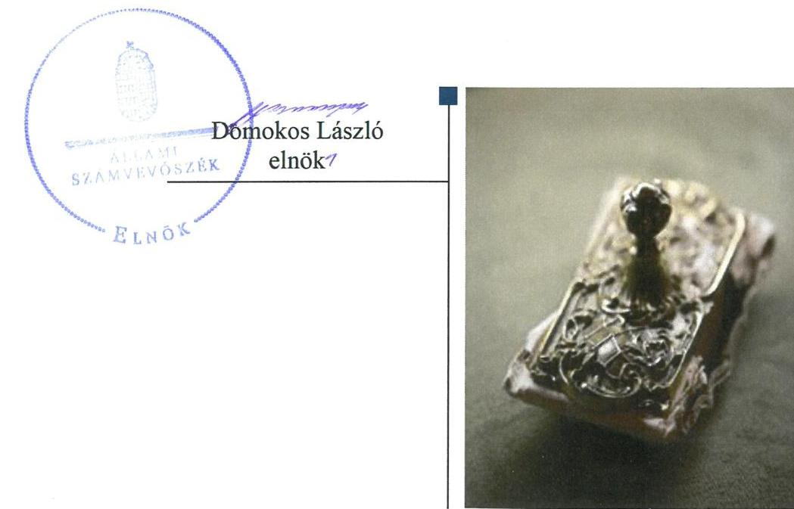
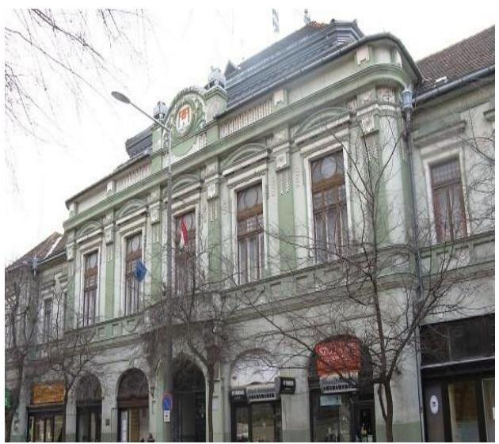
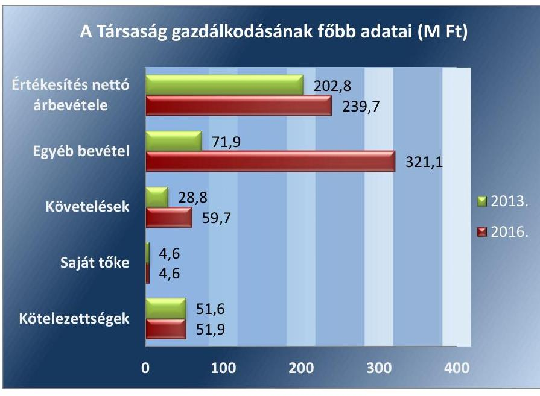

# Jelentés 

## Az önkormányzatok gazdasági társaságai

Az önkormányzatok többségi tulajdonában lévő gazdasági társaságok gazdálkodásának ellenőrzése - KALOCSAI VAGYONHASZNOSÍTÁSI és KÖNYVVEZETŐ Korlátolt Felelősségű Társaság 2018.

---

# Jelentés 

## Az önkormányzatok gazdasági társaságai

Az önkormányzatok többségi tulajdonában lévő gazdasági társaságok gazdálkodásának ellenőrzése - KALOCSAI VAGYONHASZNOSÍTÁSI és KÖNYVVEZETŐ Korlátolt Felelősségű Társaság 2018. 10. hó 24. nap

---

# AZ ELLENŐRZÉST FELÜGYELTE:

DR. HORVÁTH MARGIT felügyeleti vezető

## AZ ELLENŐRZÉST VEZETTE ÉS A VÉGREHAJTÁSÁÉRT FELELŐS:

DR. NAGY JUDIT ellenőrzésvezető

## A PROGRAM ÖSSZEÁLLÍTÁSÁÉRT FELELŐS:

TÓTPÁL SZABOLCS osztályvezető

IKTATÓSZÁM: EL-0204-112/2018

TÉMASZÁM: 2447

ELLENŐRZÉS-AZONOSÍTÓ SZÁM: V079371

Jelentéseink az Országgyűlés számítógépes hálózatán és az Interneten a www.asz.hu címen is olvashatóak.

---

# TARTALOMJEGYZÉK 

■ ÖSSZEGZÉS ..... 5
■ AZ ELLENŐRZÉS CÉLJA ..... 6
■ AZ ELLENŐRZÉS TERÜLETE ..... 7
■ AZ ELLENŐRZÉS HÁTTERE, INDOKOLTSÁGA ..... 9
■ A JELENTÉS LÉNYEGES KÉRDÉSKÖREI ..... 10
■ AZ ELLENŐRZÉS HATÓKÖRE ÉS MÓDSZEREI ..... 11
■ MEGÁLLAPÍTÁSOK ..... 13
■ JAVASLATOK ..... 17
■ MELLÉKLETEK ..... 19
I. sz. melléklet: Értelmező szótár ..... 19
■ FÜGGELÉK: ÉSZREVÉTELEK ..... 21
■ RÖVIDÍTÉSEK JEGYZÉKE ..... 23

---

.

---

# ÖSSZEGZÉS 

A KALOCSAI VAGYONHASZNOSÍTÁSI és KÖNYVVEZETŐ Korlátolt Felelősségű Társaság működésének szabályozottsága, valamint vagyongazdálkodása nem volt szabályszerű, a közvagyonnal való felelős gazdálkodás nem volt biztosított. Közzétételi kötelezettségének nem tett eleget, ezért tevékenysége nem volt átlátható.

## Az ellenőrzés társadalmi indokoltsága

Magyarországon az önkormányzatok kötelező és önként vállalt feladataik ellátása során egyre szélesebb körben alkalmazzák a költségvetési szerveken kívüli feladatellátást, ezáltal az önkormányzati tulajdonú gazdasági társaságok is kiemelt fontosságú szerephez jutnak a lakossági szolgáltatások biztosításában. Az önkormányzatok többségi tulajdonában álló gazdasági társaságok ellenőrzése kiemelt jelentőségű, mivel működésük hatással van a tulajdonos önkormányzat gazdálkodására.

Kalocsán 2013-2016. között a KALOCSAI VAGYONHASZNOSÍTÁSI és KÖNYVVEZETŐ Korlátolt Felelősségű Társaság vagyonhasznosítási feladatokat látott el, Kalocsa Város Önkormányzatával kötött szerződések alapján. Az Állami Számvevőszék ellenőrzése azért is indokolt volt, mert tevékenysége keresztül a Kalocsa Város lakosságának széles köre kerülhetett kapcsolatba a Társasággal, a nyújtott szolgáltatásokkal.

## Főbb megállapítások, következtetések, javaslatok

Kalocsa Város Önkormányzata a tulajdonosi joggyakorlás kereteit szabályszerűen alakította ki. Az Önkormányzat tulajdonosi jogait szabályszerűen gyakorolta, azonban a 2016. évi számviteli beszámoló könyvvizsgálói felülvizsgálatát a jogszabályok ellenére nem biztosította.

A KALOCSAI VAGYONHASZNOSÍTÁSI és KÖNYVVEZETŐ Korlátolt Felelősségű Társaság működését megalapozó belső szabályzatok nem feleltek meg a jogszabályi előírásoknak. Beszámolói nem a Számviteli törvény szerint készültek, mert nem voltak leltárral alátámasztottak és nem tartalmazták a vagyonkezelésbe vett ingatlanokat, ezért nem feleltek meg a teljesség és a valódiság számviteli alapelveinek. Vagyongazdálkodása nem volt szabályszerű és átlátható.

A Társaság közérdekű adatokra vonatkozó, jogszabályok szerinti, közzétételi kötelezettségét nem teljesítette.
Az Állami Számvevőszék a jelentésben foglalt megállapítások alapján hat javaslatot fogalmazott meg a KALOCSAI VAGYONHASZNOSÍTÁSI és KÖNYVVEZETŐ Korlátolt Felelősségű Társaság ügyvezetőjének, valamint három javaslatot Kalocsa Város Önkormányzata Polgármesterének a szabályszerű működés biztosítása érdekében.

---

# AZ ELLENŐRZÉS CÉLJA 

Az ellenőrzés célja annak értékelése, hogy az önkormányzat vagyongazdálkodási tevékenysége során szabályszerűen gyakorolta-e tulajdonosi jogait. A gazdasági társaság szabályozottsága, gazdálkodása és vagyongazdálkodási tevékenysége, bevételeinek és ráfordításainak elszámolása megfelelt-e a jogszabályi és tulajdonosi előírásoknak. A gazdasági társaság kötelezettségállománya jelentett-e kockázatot a működésre, valamint a gazdálkodás átláthatósága és elszámoltathatósága érdekében biztosítva volt-e a szolgáltatás díjának megalapozottsága szabályszerű önköltségszámítással.

---

# **AZ ELLENŐRZÉS TERÜLETE**

## **Kalocsa Város Önkormányzata és a kizárólagos tulajdonában álló KALOCSAI VAGYONHASZNOSÍTÁSI és KÖNYVVEZETŐ Korlátolt Felelősségű Társaság**

A KALOCSAI VAGYONHASZNOSÍTÁSI és KÖNYVVEZETŐ Korlátolt Felelősségű Társaságot 2012. február 16-án – kizárólagos tulajdonosként – alapította Kalocsa Város Önkormányzata 3,0 M Ft jegyzett tőkével. A Társaság1 alapításának fő célja az önkormányzati vagyon hasznosításával kapcsolatos feladatok ellátása volt.

A Társaság – Alapító okirat1-42-ban meghatározott –, fő tevékenysége ingatlankezelés volt, ennek keretében a tevékenységi körébe tartozott ingatlanok bérbeadása, üzemeltetése.

A Társaság az Mötv.3 13. § (1) bekezdés 2., 9. és 14. pontja alapján közterületek fenntartása, a lakások és helyiségek bérbeadása, továbbá a városi piac üzemeltetése tekintetében közfeladatot látott el. Az Mötv. 13. § (2) bekezdése alapján közfeladatként végezte az oktatási, közművelődési, muzeális intézmények épületeinek, valamint a városi uszodának üzemeltetését.

2013-tól a Társaság gazdálkodásának középpontjában a "Kalocsa Szíve Program" állt, amely kiemelt projektként a Nemzeti Fejlesztési Ügynökség támogatásával, EU4-s pályázati forrásból jött létre. A projekt célja Kalocsa turisztikai kínálatának színesítése, a már meglévő turisztikai szolgáltatások színvonalának emelése volt. Ezek közé tartozott a Szentháromság tér felújítása, múzeumi rekonstrukciók (pl. a Nicolas Schöffer múzeum), a Népművészeti Tájház, a Nicolas Schöffer torony), valamint az ezekhez kapcsolódó közlekedési, parkolási fejlesztések.

Az Önkormányzat5 a közfeladat-ellátás részletszabályait, a finanszírozási feltételeket a Társasággal kötött szerződésekben szabályozta.

A Társaság végezte:

- Vagyonhasznosítási szerződés6 keretében az önkormányzati lakóingatlanok és a nem lakás céljára szolgáló helyiségek bérbeadását és hasznosítását,
- Támogatási szerződés7 keretében a város oktatási, közművelődési, muzeális intézmények épületeinek üzemeltetését,
- Piac üzemeltetési szerződés8 alapján a városi piacterének (és a kapcsolódó kiszolgáló helyiségeknek) üzemeltetését,
- Uszoda üzemeltetési szerződés9 alapján a városi uszoda és gyógyfürdő épületének üzemeltetését,
- Vagyonkezelési szerződés10 alapján vagyonkezelésbe vett önkormányzati ingatlanokhoz (21 db) kapcsolódóan fejlesztéseket valósított meg és azokat működtette a "Kalocsa Szíve Program" keretében.

---

Az Alapító ${ }^{11}$ a Társasággal kötött szerződésekben célként határozta meg a Társaság részére átadott vagyon állagának védelmét, értékének megőrzését, a hatékony, nyereségorientált gazdálkodást.

A Társaság gazdálkodásával kapcsolatos főbb adatok alakulását az 1. ábra mutatja be:

1. ábra

Forrás: A Társaság egyszerűsített éves beszámolói
A „Kalocsa Szíve Program" keretében megvalósuló beruházások eredményezték a Társaság mérlegfőösszegének a 2013. évi 71,6 M Ft-ról 2016. évre 1 791,4 M Ft-ra való növekedését. Az egyéb bevételek 71,9 M Ft-ról 321,1 M Ft-ra emelkedtek, ezen belül meghatározó volt az önkormányzati támogatás, amely 67,0 M Ft-ról 250,3 M Ft-ra nőtt a tevékenység bővülésével összefüggésben.

Az Alapító 2015. évben Tagi kölcsön szerződés ${ }_{1-2}{ }^{12}$ alapján 80,0 M Ft összegben rövidlejáratú, kamatmentes kölcsönt nyújtott a Társaságnak a folyamatos fizetőképesség biztosításához, amelyet a Társaság 2016. évben visszafizetett.

A Társaság a Számv. tv. 14. § (6) bekezdése előírása alapján, mint egyszerűsített éves beszámolót készítő gazdálkodó, az önköltség-számítási szabályzat készítése alól mentesült. A Társaság árképzésében, az önkormányzati - a lakások és nem lakás céljára szolgáló helyiségek bérbeadása, piaci árusítóhelyek bérbeadása vonatkozó -, rendeletekben ${ }^{13}$ előírtakat alkalmazta.

A foglalkoztatottak átlagos statisztikai állományi létszáma 2016. évben 67 fő volt, a 2013. évihez képest 25 fővel nőtt.

A Társaságnak 3,3 %-os részesedése volt a Kalocsa és Térsége Turisztikai Nonprofit Korlátolt Felelősségű Társaságban.

A Társaság nem volt kormányzati szektorba sorolt szervezet az ellenőrzött időszakban.

A Társaságnál az Ügyvezető ${ }^{14}$ személye 2015. március 1-én változott az ellenőrzött időszakban. A Polgármester ${ }^{15}$ a 2014. évi választások óta töltötte be hivatalát, a Jegyző ${ }^{16}$ 2013. február 1. óta látja el feladatát.

---

# AZ ELLENŐRZÉS HÁTTERE, INDOKOLTSÁGA 

Az önkormányzatok többségi tulajdonában álló gazdasági társaságok ellenőrzése kiemelten fontos a vagyon megőrzése, megóvása érdekében, amelyekkel szemben alapvető követelmény, hogy gazdálkodásuk, működésük szabályszerű, az általuk szolgáltatott adatok minél megbízhatóbbak legyenek.

A feladat-ellátás költségeinek, ráfordításainak alakulása a lakosság széles rétegét érinti. Az ellenőrzés várható hasznosulásaként ellenőrzéseink feltárhatják, hogy az önkormányzat a feladatellátásához rendelt vagyon működtetését a tulajdonostól elvárható gondossággal végezte-e, a feladatot ellátó gazdasági társaság a létesítő okiratban, szolgáltatási szerződésben foglaltak betartásával biztosította-e a feladat ellátását. Az ellenőrzés rávilágíthat arra, hogy a gazdasági társaság a vagyon használatával biztosította-e a szolgáltatás folytatásának feltételeit, az önkormányzat által végzett tulajdonosi ellenőrzés hozzájárult-e a szabályszerű gazdálkodáshoz és feladatellátáshoz.

A megállapítások alapján megfogalmazott számvevőszéki javaslatok hasznosítása elősegítheti a meglévő hibák megszüntetését. A jó gyakorlatok bemutatásával az Állami Számvevőszék hozzájárul a követendő megoldások megismertetéséhez, terjesztéséhez.

---

# A JELENTÉS LÉNYEGES KÉRDÉSKÖREI 

1.- Az önkormányzati tulajdonosi joggyakorlás szabályszerű volt-e?
2.- A gazdasági társaság szabályozottsága, gazdálkodása, valamint vagyongazdálkodása szabályszerű volt-e?

---

# AZ ELLENŐRZÉS HATÓKÖRE ÉS MÓDSZEREI 

## Az ellenőrzés típusa

Megfelelőségi ellenőrzés.

## Az ellenőrzött időszak

2013. január 1-jétől 2016. december 31-ig.

## Az ellenőrzés tárgya

Kalocsa Város Önkormányzata tulajdonosi joggyakorlása, valamint a KALOCSAI VAGYONHASZNOSÍTÁSI és KÖNYVVEZETŐ Korlátolt Felelősségű Társaság gazdálkodásának szabályozottsága és szabályszerűsége.

Az ellenőrzés kiterjedt minden olyan körülményre és adatra, amely az ÁSZ ${ }^{17}$ jogszabályban meghatározott feladatainak teljesítéséhez, valamint a program végrehajtása folyamán felmerült újabb összefüggések feltárásához szükséges.

## Az ellenőrzött szervezet

KALOCSAI VAGYONHASZNOSÍTÁSI és KÖNYVVEZETŐ Korlátolt Felelősségű Társaság és a kizárólagos tulajdonos Kalocsa Város Önkormányzata

## Az ellenőrzés jogalapja

Az ellenőrzés jogszabályi alapját az ÁSZ tv. 1.§ (3) bekezdése és 5. § (3)(5) bekezdései képezik.

## Az ellenőrzés módszerei

Az ellenőrzést a nemzetközi standardokat irányadónak tekintve az ellenőrzési program ellenőrzési kérdései, az ellenőrzött időszakban hatályos jogszabályok, az ellenőrzés szakmai szabályok és módszertanok figyelembe vételével végeztük.

Az ellenőrzés ideje alatt az ellenőrzött szervezettel történő kapcsolattartást az ÁSZ Szervezeti és Működési Szabályzatának vonatkozó előírásai alapján biztosítottuk.

Az ellenőrzési kérdések megválaszolásához szükséges bizonyítékok megszerzése a következő ellenőrzési eljárások alkalmazásával történt:

---

megfigyelés, kérdésfeltevés (információkérés), összehasonlítás, valamint elemző eljárás. Az ellenőrzési bizonyítékként felhasználható adatforrások közé tartoztak egyrészt az ellenőrzési programban felsorolt adatforrások, másrészt adatforrás lehet még minden - az ellenőrzés folyamán - feltárt, az ellenőrzés szempontjából információkat tartalmazó dokumentum.

Az ellenőrzést a kérdésekre adott válaszok kiértékelésével, valamint a megjelölt adatforrások, a csatolt tanúsítványok felhasználásával, továbbá az adott időszakban hatályos jogszabályok figyelembe vételével folytattuk le.

A bevételek és ráfordítások elszámolása, valamint a vagyonnyilvántartás terén a szabályszerű működést véletlen mintavétellel ellenőriztük.

A mintavétellel ellenőrzött területek esetében minden egyes tétel vonatkozásában a szabályszerűségre vonatkozó kérdéseket tettünk fel, amelyek eredménye összesítésre került. „Szabályszerűnek" értékeltünk egy ellenőrzött területet, amennyiben 95\%-os bizonyossággal a teljes sokaságban az átlagos hibaarány legfeljebb 10\%, nem megfelelőnek, amennyiben 10\%-nál magasabb arányt képviselt. Abban az esetben, ha a teljes sokaság tekintetében a 10\%-os hibaarányhoz való viszony megítélésének megbízhatósága nem érte el a 95\%-ot, annak elérése érdekében értékelésünket további szempontokkal egészítettük ki, és figyelembe vettük a feltárt hibák típusát és súlyát. A ráfordítások elszámolására és a vagyonnyilvántartásra vonatkozó véletlen mintavételt kockázati alapú kiválasztással egészítettük ki, amelynek során a három legnagyobb összegű tételt választottuk ki.

---

# 1. Az önkormányzati tulajdonosi joggyakorlás szabályszerű volt-e? 

Összegző megállapítás

Az Önkormányzat a tulajdonosi joggyakorlás kereteit szabályszerűen kialakította és tulajdonosi jogait szabályosan gyakorolta.

Az Önkormányzat a Gazdasági program ${ }_{1-2}{ }^{18}$-ját az Mótv.-ben foglaltaknak megfelelően elkészítette.

Az Önkormányzat - az Nvtv., ${ }^{19}$ valamint a Vagyongazdálkodási rendelet ${ }^{20}$ előírása szerint elkészítette Közép-és hosszú távú vagyongazdálkodási terv $^{21}$-t.

A TULAJDONOSI JOGGYAKORLÁS szabályait az Önkormányzat a vagyongazdálkodásra, a tulajdonosi ellenőrzésre, a beszámoltatásra, a pénzügyi finanszírozásra vonatkozóan a Vagyongazdálkodási rendeletben szabályszerűen rögzítette.

Az Alapító tulajdonosi jogkörét a Társaság vezető tisztségviselőjének kinevezésével és felmentésével; a Felügyelőbizottság tagjainak megválasztásával és felmentésével, díjazásuk meghatározásával; továbbá, az éves üzleti és vagyonhasznosítási tervek jóváhagyásával szabályszerűen gyakorolta.

KÖNYVVIZSGÁLATRA a Társaság a Számv. tv. 155. § (2) bekezdése alapján, a 2016. évi egyszerűsített éves beszámolóra vonatkozóan kötelezett volt, mert a foglalkoztatottak száma az üzleti évet megelőző két üzleti
 év átlagában meghaladta a Számv. tv. 155. § (3) bekezdése b) pontja szerinti határértéket, az 50 főt. Az Alapító ennek ellenére könyvvizsgálót nem választott.

A FELÜGYELŐBIZOTTSÁG ${ }^{22}$ tagjait az Alapító az Alapító Okirat ${ }_{1-4}$-ben kijelölte, ezzel eleget téve a Gt. ${ }^{23}$ és a Taktv. ${ }^{24}$ előírásainak. A Felügyelőbizottság, a Gt. 34. § (4) bekezdése és a Ptk. ${ }^{25} 3:122$. § (3) bekezdésében foglaltak ellenére, nem rendelkezett ügyrenddel.

Az Alapító a Társaság egyszerűsített éves beszámolóinak elfogadásáról a Ptk. előírásainak megfelelően a Felügyelőbizottság írásbeli jelentései ${ }^{26}$ birtokában, képviselő-testületi határozatok ${ }^{27}$-ban döntött.

A Felügyelőbizottság a 2014. évi egyszerűsített éves beszámolóról készült írásbeli jelentésében felhívta a figyelmet a gazdálkodásban keletkezett jelentős veszteségre és javaslatot fogalmazott meg az Alapító felé, arra vonatkozólag, hogy az Ügyvezető készítsen intézkedési tervet, a tőkehelyzet rendezésére, mivel a Társaság saját tőkéje nem érte el a jegyzett tőke felét, illetve a korlátolt felelősségű társasági formára kötelezően előírt

---

jegyzett tőke ${ }^{28}$ összegét. Ugyanakkor nem jelezte - Ptk. 3:120. § (3) bekezdésében foglaltak ellenére - az Alapító felé, hogy az Ügyvezető nem teljesítette a Ptk. 3:189. § (1) bekezdésében foglalt kötelezettségét, nem kezdeményezte az Alapító döntéshozatalát a tőkehelyzet rendezése érdekében.

A Felügyelőbizottság a 2015. évi egyszerűsített éves beszámolóról készített írásbeli jelentésében felhívta az Alapító figyelmét arra, hogy a tőkehelyzet rendezéséről, a 2014. és 2015. évi veszteség folytán, a Ptk. 3:133. § (2) bekezdésében foglalt előírások alapján gondoskodnia kell. A Képviselő-testület ${ }^{29}$ határozatában ${ }^{30}$ intézkedési terv készítésére kötelezte az Ügyvezetőt a saját tőke és a jegyzett tőke arányának helyreállítása érdekében.

Az Alapító a Ptk. 3:133. § (2) bekezdésében előírt kötelezettségének eleget téve 2016. évben - a Képviselő-testület határozata ${ }^{31}$ alapján -, 70,1 M Ft pótbefizetést teljesített (amelyet a Társaság lekötött tartalékba helyezett).

A Társaság tőkehelyzetével kapcsolatos főbb adatok alakulását az alábbi, 1. táblázat mutatja be:

1. táblázat

| A TÁRSASÁG SAJÁT TŐKÉJÉNEK ALAKULÁSA (MILLIÓ FT) |  |  |  |  |
| :--: | :--: | :--: | :--: | :--: |
|  | 2013. év | 2014. év | 2015. év | 2016. év |
| Jegyzett tőke | 3,0 | 3,0 | 3,0 | 3,0 |
| Eredménytartalék | 1,3 | 1,6 | $-67,5$ | $-70,1$ |
| Lekötött tartalék (pótbefizetés) | 0,0 | 0,0 | 0,0 | 70,1 |
| Mérleg szerinti (2016-ban adózott) eredmény | 0,3 | $-69,2$ | $-2,6$ | 1,5 |
| Saját tőke | 4,6 | $-64,5$ | $-67,1$ | 4,6 |

Fonrás: A Társaság egyszerűsített éves beszámolói

# ELLENŐRZÉSI JOGOSÍTVÁNYAIT AZ ALAPÍTÓ 

az Nvtv. 10. § (2) bekezdése előírásában foglaltakkal élve az Ügyvezető beszámoltatásával és a Felügyelőbizottság véleményének kikérésével gyakorolta.

A Felügyelőbizottság a Társaság éves üzleti terveit véleményezte, a Társaság működésére és a vagyongazdálkodására vonatkozóan évközi ellenőrzéseket végzett, amelyek alapján javaslatokat fogalmazott meg az ügyvezetés és az Alapító felé.

Az Önkormányzat belső ellenőrzése, az Áht. ${ }^{32}$ 70. § (1) bekezdés d) pontja alapján ellenőrizte a Társaság gazdálkodását. A 2014. évi önkormányzati belső ellenőrzés megállapításai, javaslatai alapján az Alapító intézkedési, beszámolási kötelezettséget írt elő a Társaság részére, amelyek teljesülését az önkormányzati belső ellenőrzési szervezet 2015. évben utóellenőrzés keretében ellenőrizte. Az önkormányzati utóellenőrzés megállapította, hogy a szabályozottsággal, leltárral, vagyonkezelt eszközök elkülönített nyilvántartásával kapcsolatos szabálytalanságokat nem javították.

A vezető tisztségviselők, a felügyelőbizottsági tagok és az Mt. ${ }^{33}$ 208. § hatálya alá tartozó munkavállalók javadalmazására, valamint a jogviszony megszűnése esetére biztosított juttatások módjának, mértékének legfőbb elveiről, annak rendszeréről a Képviselő-testület a Taktv. előírásai szerint Javadalmazási szabályzat ${ }^{34}$-ot alkotott.

---

# 2. A gazdasági társaság szabályozottsága, gazdálkodása, valamint vagyongazdálkodása szabályszerű volt-e? 

Összegző megállapítás

2.1. számú megállapítás

A Társaság működésének szabályozottsága, valamint vagyongazdálkodása nem volt szabályszerű. A Társaságnál az elszámolások és az eszközgazdálkodás megfelelt a jogszabályi előírásoknak. A Társaság közzétételi kötelezettségének nem tett eleget.

A Társaság gazdálkodása kereteinek kialakítása a jogszabályoknak és a Vagyonkezelési szerződésnek nem felelt meg. A Társaságnál az elszámolások és az eszközgazdálkodás megfelelt a jogszabályi előírásoknak.

A Társaság rendelkezett Számviteli politika ${ }_{1-2}{ }^{35}$-val, azonban az a Számv. tv. 14. § (11) bekezdésében foglaltak ellenére nem tartalmazta a Számv. tv. 2015. július 4-től hatályos 14. § (4) bekezdésben előírt kivételes nagyságú vagy előfordulású bevétel, költségek, ráfordítások meghatározását.

A Társaság elkészítette Számlarend ${ }_{1-2}{ }^{36}$-jét, ugyanakkor nem rendelkezett - a Számv. tv. 161. § (2) bekezdés d) pontjában előírt - bizonylati renddel.

A Társaság rendelkezett Értékelési szabályzattal, valamint Pénzkezelési szabályzattal és Leltározási szabályzattal ${ }^{37}$, de a Számv. tv. 161/A. § (1) bekezdésében, a Számv. tv. 23. § (2) bekezdésében, illetve a 42. § (5) bekezdésében, valamint a Vagyonkezelési szerződésben foglaltak ellenére a vagyonkezelt eszközökre vonatkozó nyilvántartási és adatszolgáltatási, leltározási feladatok végrehajtásának szabályait nem határozta meg.

A Társaságnál a bevételek és ráfordítások elszámolása szabályszerű volt. A bevételek elszámolását a Társaság a Számv. tv. előírásainak megfelelően végezte, a közfeladatokkal kapcsolatos szolgáltatási díjak megállapítása az önkormányzati rendeleteknek megfelelően történt.

A Társaság saját tulajdonában álló, immateriális javak és a tárgyi eszközök bekerülési értéke meghatározása, az eszközök állományba vétele és besorolása a Számv. tv-nek és a belső szabályozásnak megfelelt.

A Számv. tv-nek, a Számviteli politika ${ }_{1-2}$ és az Értékelési Szabályzat ${ }_{1,2}$ előírásainak megfelelően történt a saját tulajdonú eszközökre vonatkozóan az értékcsökkenési leírás elszámolása.

## 2.2. számú megállapítás

A Társaság vagyongazdálkodási tevékenysége nem volt szabályszerű. Egyszerűsített éves beszámolói elkészítésekor nem a Számv. tv. szabályai szerint járt el, azok nem voltak leltárral alátámasztva és nem tartalmazták a vagyonkezelésbe vett ingatlanokat.

A Társaság az Alapító előírásainak megfelelően elkészítette éves üzleti tervét, annak teljesítéséről - az egyszerűsített éves beszámolói alapján -, a Képviselő-testületnek beszámolt.

A Társaság 2014. és 2015. évi veszteséges gazdálkodása miatt a saját tőke az előírt jegyzett tőke alá csökkent, ennek ellenére, az Ügyvezető nem teljesítette a Ptk. 3:189. (1) bekezdésében foglalt kötelezettségét, mivel

---

nem kezdeményezte az Alapító döntéshozatalát a tőkehelyzet rendezése érdekében.

A Társaságnak az Önkormányzattal kötött Vagyonkezelési szerződés alapján - Nvtv. 11. § (1) bekezdése értelmében - vagyonkezelői joga keletkezett az Önkormányzat tulajdonát képező „Kalocsa Szíve Program" keretében tervezett turisztikai és infrastrukturális fejlesztésekkel érintett ingatlanokat érintően, amelyek bekerülési értéke 2013. évi 71,6 M Ft-os mérlegfőösszeg 7,8-szorosát,-2014. évi 169,3 M Ft-os mérlegfőösszeg 3,29-szeresét tette ki, amely így meghaladta a Számv. tv. 3. § (3) bekezdése 3. pontja szerinti jelentős hiba mértékét. 2015. - 2016. években ezeken az ingatlanokon a „Kalocsa Szíve Program" keretében 1 781,1 M Ft bekerülési értékű beruházást hajtottak végre.

A Társaság a Számv. tv. 23. § (2) bekezdése és a 42. § (5) bekezdése előírásai ellenére nem mutatta ki a mérlegében és nem mutatta be egyszerűsített éves beszámolók kiegészítő mellékletében - a Vagyonkezelési szerződésben rögzített - önkormányzati ingatlanokat. Ezzel nem tett eleget a Vagyonkezelési szerződés III.2., III.8., III.19., III.20. pontjában, a Vagyonkezelési szerződés 2. számú mellékletében előírt nyilvántartási és adatszolgáltatási kötelezettségének.

A Társaság egyszerűsített éves beszámolói - a Számv. tv. 69. § (1) bekezdése és a Leltározási szabályzat előírásai ellenére - nem voltak alátámasztva leltárral. A Társaság nem végezte el a Vagyonkezelési szerződésben meghatározott ingatlanok leltározását, azaz nem tett eleget a Vagyonkezelési szerződés III.20. pontjában foglalt előírásoknak.

A vagyonkezelt ingatlanok számviteli beszámolóban történő kimutatásának elmulasztása és a számviteli beszámolók leltári alátámasztottságának hiánya miatt a Társaság egyszerűsített éves beszámolói nem feleltek meg a teljesség és valódiság számviteli alapelveinek, azaz a Számv. tv. 15. § (2)-(3) bekezdése előírásainak.

A Társaság egyszerűsített éves beszámolóit és az eredmény felhasználására vonatkozó határozatot, 2013., 2014., 2015. évekre vonatkozóan, a Képviselő-testület döntését követően, az Ügyvezető szabályszerűen letétbe helyezte és közzé tette. A Társaság 2016. évi egyszerűsített beszámolójának közzététele nem tartalmazott könyvvizsgálói jelentést, ezzel megsértve a Számv. tv. 154. § (1) bekezdése előírásait.

# 2.3. számú megállapítás 

## A Társaság közzétételi kötelezettségének nem tett eleget.

A Társaság nem tette közzé a Taktv. 2. § (1) bekezdésének ca) pontjában előírtak ellenére a Társaság vezető tisztségviselőinek és az Mt. 208. §-a szerinti vezető állású munkavállalóinak nyújtott pénzbeli juttatásokat.

A Társaság nem tett eleget az Info tv. ${ }^{38}$ 37. § (1) bekezdésében előírt közzétételi kötelezettségének, nem tette közzé az Info tv. 1. mellékletében meghatározott szervezeti, személyzeti, tevékenységre, működésre, gazdálkodásra vonatkozó adatokat.

---

# JAVASLATOK 

Az ÁSZ tv. 33. § (1) bekezdésében foglaltak értelmében az ellenőrzött szervezet vezetője köteles a jelentésben foglalt megállapításokhoz kapcsolódó intézkedési tervet összeállítani és azt a jelentés kézhezvételétől számított 30 napon belül az ÁSZ részére megküldeni. Amennyiben az ellenőrzött szervezet vezetője nem küldi meg határidőben az intézkedési tervet, vagy továbbra sem elfogadható intézkedési tervet küld, az Állami Számvevőszék elnöke az ÁSZ tv. 33. § (3) bekezdése a) és b) pontjaiban foglaltakat érvényesítheti.

## Javaslataink célja a KALOCSAI VAGYONHASZNOSÍTÁSI és KÖNYVVEZETŐ Korlátolt Felelősségű Társaság gazdálkodása szabályszerűségének és gyakorlatának javítása annak érdekében, hogy a szabályozási környezet és az alkalmazott gyakorlat megfelelően tudja támogatni az átlátható működést.

## KALOCSAI VAGYONHASZNOSÍTÁSI és KÖNYVVEZETŐ Korlátolt Felelősségű Társaság ügyvezetőjének

1. Intézkedjen a Társaság számviteli politikájának módosításáról a hatályos Számv. tv. előírásainak megfelelően
(2.1. sz. megállapítás 1. bekezdése alapján)
2. Gondoskodjon a Társaság bizonylati rendjének elkészítéséről a hatályos Számv. tv. előírásainak megfelelően.
(2.1. sz. megállapítás 2. bekezdése alapján)
3. Intézkedjen azoknak a szabályoknak a meghatározásáról, amelyekkel a Számv. tv.-ben, valamint a Vagyonkezelési szerződésben meghatározott nyilvántartási és adatszolgáltatási, leltározási feladatok teljesítése biztosítható.
(2.1. sz. megállapítás 3. bekezdése alapján)
4. Gondoskodjon a vagyonkezelői jog alá eső vagyonelemek mérlegben és egyszerűsített éves beszámolók kiegészítő mellékletében történő bemutatásáról, az azokhoz kapcsolódó nyilvántartási, leltározási és adatszolgáltatási kötelezettségek teljesítéséről a Számv. tv. és a Vagyonkezelési szerződés előírásainak megfelelően.
(2.2. sz. megállapítás 4. bekezdése és az 5. bekezdés 2. mondata alapján)

---

5. Intézkedjen az egyszerűsített éves beszámolók szabályszerű leltárral való alátámasztásáról a Számv. tv. előírásainak megfelelően.
(2.2. sz. megállapítás 5. bekezdés 1. mondata alapján)
6. Intézkedjen a közzétételi kötelezettségének teljesítéséről a Taktv. és az Info tv. előírásainak megfelelően.
(2.3. sz. megállapítás 1. és 2. bekezdései alapján)

# Javaslataink célja az Önkormányzat szabályszerű működésének elősegítése, továbbá az önkormányzati tulajdonosi joggyakorlás kontrolljainak erősítése. 

## Kalocsa Város Önkormányzata polgármesterének

1. Gondoskodjon a Társaság könyvvizsgálójának megválasztásáról a Számv. tv. előírásainak megfelelően.
(1. sz. megállapítás 5. bekezdése alapján)
2. Hívja fel a felügyelőbizottság elnökét az FB ügyrendjének elkészítésére, majd annak alapítói jóváhagyására a Ptk. előírásai szerint.
(1. sz. megállapítás 6. bekezdés 2. mondata alapján)
3. Intézkedjen
a) a számviteli politika módosításának hiánya,
b) a bizonylati rend elkészítésének elmulasztása,
c) a nyilvántartási és adatszolgáltatási, leltározási feladatok teljesítése szabályai
 kialakításának hiánya,
d) a vagyonkezelésbe vett vagyon bemutatásának, nyilvántartásának, leltározási és adatszolgáltatási kötelezettség teljesítésének hiányosságai,
e) az egyszerűsített éves beszámolók leltárral történő alátámasztásának hiánya,
f) a közzétételi kötelezettség teljesítésének hiányosságai
miatti felelősség tisztázása érdekében, és szükség szerint intézkedjen a felelősség érvényesítéséről.
(2.1. sz. megállapítás 1-3. bekezdései; 2.2. sz. megállapítás 4-5. bekezdései; 2.3. sz. megállapítás 1-2. bekezdései alapján)

---

# MELLÉKLETEK 

- I. SZ. MELLÉKLET: ÉRTELMEZŐ SZÓTÁR
gazdasági társaság
közszolgáltatás
nemzeti vagyon

Ptk. 3.88. § (1) bekezdése szerint „a gazdasági társaságok üzletszerű közös gazdasági tevékenység folytatására, a tagok vagyoni hozzájárulásával létrehozott, jogi személyiséggel rendelkező vállalkozások, amelyekben a tagok a nyereségből közösen részesednek, és a veszteséget közösen viselik".
Az Ebktv. ${ }^{39}$ 3. § d) pontja a következőképpen határozza meg a közszolgáltatást: „szerződéskötési kötelezettség alapján a lakosság alapvető szükségleteinek ellátására irányuló szolgáltatás, így különösen a villamos energia-, gáz-, hő-, víz-, szenny-víz- és hulladékkezelési, köztisztasági, postai és távközlési szolgáltatás, továbbá a menetrend alapján közlekedő járművekkel végzett közforgalmú személyszállítás". Nvtv. 1. § (2) bekezdése szerint többek között:
„az állam vagy a helyi önkormányzat kizárólagos tulajdonában álló dolgok, az a) pont hatálya alá nem tartozó, állam vagy a helyi önkormányzat tulajdonában lévő dolog,
az állam vagy a helyi önkormányzat tulajdonában lévő pénzügyi eszközök, továbbá az államot vagy a helyi önkormányzatot megillető társasági részesedések, az államot vagy a helyi önkormányzatot megillető bármely vagyoni értékkel rendelkező jogosultság, amelyet jogszabály vagyoni értékű jogként nevesít."

---

.

---

# FÜGGELÉK: ÉSZREVÉTELEK 

A jelentéstervezetet a Számvevőszék 15 napos észrevételezésre megküldte az ellenőrzött szervezetek vezetőinek az ÁSZ tv. 29. § (1) bekezdése előírásának megfelelően.

Az ellenőrzött szervezetek vezetői nem tettek észrevételt a Számvevőszék 15 napos észrevételezésre megküldött jelentéstervezetével kapcsolatban.

[^0]
[^0]:    * 29. § (1) Az Állami Számvevőszék az ellenőrzési megállapításait megküldi az ellenőrzött szervezet vezetőjének vagy az általa megbízott személynek, és annak, akinek személyes felelősségét állapította meg.
    (2) Az ellenőrzött szervezet vezetője és a felelősként megjelölt személy az ellenőrzés megállapításaira tizenöt napon belül írásban észrevételt tehet.
    (3) Az Állami Számvevőszék az észrevételre a beérkezésétől számított harminc napon belül írásban válaszol. A figyelembe nem vett észrevételeket köteles a jelentésben feltüntetni, és megindokolni, hogy azokat miért nem fogadta el.

---

.

---

# RÖVIDÍTÉSEK JEGYZÉKE 

${ }^{1}$ Társaság
${ }^{2}$ Alapító okirat ${ }_{1-4}$
Alapító okirat ${ }_{1}$

Alapító okirat ${ }_{2}$

Alapító okirat ${ }_{3}$
Alapító okirat ${ }_{4}$
${ }^{3}$ Mötv.
${ }^{4}$ EU
${ }^{5}$ Önkormányzat
${ }^{6}$ Vagyonhasznosítási szerződés
${ }^{7}$ Támogatási szerződés
${ }^{8}$ Piac üzemeltetési szerződés
${ }^{9}$ Uszoda üzemeltetési szerződés
${ }^{10}$ Vagyonkezelési szerződés
${ }^{11}$ Alapító
${ }^{12}$ Tagi kölcsön ${ }_{1-2}$
Tagi kölcsön ${ }_{1}$

Tagi kölcsön ${ }_{2}$
${ }^{13}$ Önkormányzati rendelet a lakások és nem lakás céljára szolgáló helyiségek bérbeadásáról
Önkormányzati rendelet a piaci árusítóhelyek bérbeadásáról
${ }^{14}$ Ügyvezető
${ }^{15}$ Polgármester
${ }^{16}$ Jegyző

KALOCSAI VAGYONHASZNOSÍTÁSI és KÖNYVVEZETŐ Korlátolt Felelősségű Társaság

KALOCSAI VAGYONHASZNOSÍTÁSI és KÖNYVVEZETŐ Korlátolt Felelősségű Társaság Alapító okirata (hatályos: 2012. október 1-től 2013. február 28-ig) KALOCSAI VAGYONHASZNOSÍTÁSI és KÖNYVVEZETŐ Korlátolt Felelősségű Társaság Alapító okirata (hatályos: 2013. március 1-től 2015. február 26-ig) KALOCSAI VAGYONHASZNOSÍTÁSI és KÖNYVVEZETŐ Korlátolt Felelősségű Társaság Alapító okirata (hatályos: 2015. február 26-tól 2016. július 18-ig) KALOCSAI VAGYONHASZNOSÍTÁSI és KÖNYVVEZETŐ Korlátolt Felelősségű Társaság Alapító okirata (hatályos: 2016. július 18-tól 2017. január 12-ig) 2011. évi CLXXXIX. törvény Magyarország helyi önkormányzatairól (hatályos: 2012. január 1-től)
Európai Unió
Kalocsa Város Önkormányzata
Az Önkormányzat és a Társaság között, Lakóingatlanok és nem lakás céljára szolgáló helyiségek bérbeadására és hasznosítására kötött szerződés
Az oktatási, közművelődési, muzeális intézmények épületeinek üzemeltetése, működési feltételeinek biztosítása céljából, 2012. december 27-én megkötött szerződés és módosításai.
2012. augusztus 1-jén kelt, a városi piactér és kiszolgáló helyiségek üzemeltetésére vonatkozó szerződés
A városi uszoda és gyógyfürdő üzemeltetésére 2013. április 30-án kötött szerződés (hatályos: 2013. május 1-jétől)
Vagyonkezelési Szerződés, amely létrejött Kalocsa Város Önkormányzata és a KALOCSAI VAGYONHASZNOSÍTÁSI és KÖNYVVEZETŐ Korlátolt Felelősségű Társaság között 2013. szeptember 26-án, Kalocsa Város Önkormányzata Képviselő-testületének 235/2013. sz. határozata alapján
Kalocsa Város Önkormányzata
Az Alapító által a Társaságnak nyújtott tagi kölcsönre vonatkozó szerződések 2015. július 31-én kelt tagi kölcsön szerződés alapján nyújtott, 30,0 M Ft összegű tagi kölcsön (Kalocsa Város Önkormányzata Képviselő-testületének 168/2015. sz. határozata alapján)
2015. október 29-én kelt tagi kölcsön szerződés alapján nyújtott, 50,0 M Ft összegű tagi kölcsön (Kalocsa Város Önkormányzata Képviselő-testületének 237/2015. sz. határozata alapján)
Kalocsa Város Önkormányzata Képviselő-testületének 11/2006. (VI. 22.) sz. Lakások és helyiségek bérletéről szóló rendelete

Kalocsa Város Önkormányzata Képviselő-testületének 10/1999. (VII. 12.) sz. vásárokról és piacokról szóló rendelete
KALOCSAI VAGYONHASZNOSÍTÁSI és KÖNYVVEZETŐ Korlátolt Felelősségű Társaság Ügyvezetője
Kalocsa Város Önkormányzata Polgármestere
Kalocsa Város Önkormányzata Jegyzője

---

${ }^{17}$ ÁSZ
${ }^{18}$ Gazdasági program ${ }_{1}$
Gazdasági program ${ }_{2}$
${ }^{19}$ Nvtv.
${ }^{20}$ Vagyongazdálkodási rendelet
${ }^{21}$ Közép-és hosszú távú vagyongazdálkodási terv
${ }^{22}$ Felügyelőbizottság
${ }^{23}$ Gt.
${ }^{24}$ Taktv.
${ }^{25}$ Ptk.
${ }^{26}$ Felügyelőbizottsági írásbeli jelentései
${ }^{27}$ Képviselő-testületi határozatok
${ }^{28}$ Korlátolt felelősségű társasági formára kötelezően előírt jegyzett tőke
${ }^{29}$ Képviselő-testület
${ }^{30}$ A Képviselő-testület határozata
${ }^{31}$ A Képviselő-testület határozata
${ }^{32}$ Áht.
${ }^{33}$ Mt.
${ }^{34}$ Javadalmazási szabályzat
${ }^{35}$ Számviteli politika ${ }_{1}$

Számviteli politika ${ }_{2}$
${ }^{36}$ Számlarend ${ }_{1}$

Számlarend ${ }_{2}$

Állami Számvevőszék
Kalocsa Város Önkormányzata Gazdasági Programja 2010-2014. évekre
Kalocsa Város Önkormányzata Gazdasági Programja 2015-2019. évekre
2011. évi CXCVI. törvény a nemzeti vagyonról (hatályos: 2012. január 1-től)

Kalocsa Város Önkormányzata Képviselő-testületének 15/2012. (VII. 23.) sz. az önkormányzat vagyonáról és a vagyongazdálkodás rendjéről szóló önkormányzati rendelete
Kalocsa Város Önkormányzatának közép-és hosszú távú vagyongazdálkodási terve, amelyet Kalocsa Város Önkormányzata Képviselő-testülete 99/2013. öh. számú határozatában fogadott el.
KALOCSAI VAGYONHASZNOSÍTÁSI és KÖNYVVEZETŐ Korlátolt Felelősségű Társaság Felügyelőbizottsága
2006. évi IV. törvény - a gazdasági társaságokról (hatályos: 2006. július 1-től 2014. március 14-ig)
2009. évi CXXII. törvény - a köztulajdonban álló gazdasági társaságok takarékosabb működéséről (hatályos: 2009. december 4-től)
2013. évi V. törvény a Polgári Törvénykönyvről (hatályos: 2014. március 15-től) KALOCSAI VAGYONHASZNOSÍTÁSI és KÖNYVVEZETŐ Korlátolt Felelősségű Társaság Felügyelőbizottságának határozatai az egyszerűsített éves beszámolók jóváhagyásáról: 4/2014. (V. 21.), 4/2015. (V. 21.), 2/2016. (V. 18.), 3/2017. (V. 23.)

Kalocsa Város Önkormányzata Képviselő-testületének 112/2014. sz. határozata Kalocsa Város Önkormányzata Képviselő-testületének 118/2015. sz. határozata Kalocsa Város Önkormányzata Képviselő-testületének 100/2016. sz. határozata Kalocsa Város Önkormányzata Képviselő-testületének 130/2017. sz. határozata A Ptk. 3:161. (4) bekezdésében (hatályos: 2014. március 15-től) a korlátolt felelősségű társaságra előírt minimum jegyzett tőke összege: 3 M Ft
Kalocsa Város Önkormányzata Képviselő-testülete
Kalocsa Város Önkormányzata Képviselő-testületének 104/2016. sz. határozata Kalocsa Város Önkormányzata Képviselő-testületének 169/2016. sz. határozata 2011. évi CXCV. törvény az államháztartásról (hatályos: 2012. január 1-től) 2012. évi I. törvény a munka törvénykönyvéről (hatályos: 2012. július 1-től) KALOCSAI VAGYONHASZNOSÍTÁSI és KÖNYVVEZETŐ Korlátolt Felelősségű Társaság, javadalmazási szabályzata, elfogadta Kalocsa Város Önkormányzata Képviselő-testülete 305/2012. öh. számú határozatával
KALOCSAI VAGYONHASZNOSÍTÁSI és KÖNYVVEZETŐ Korlátolt Felelősségű Társaság, számviteli politikája, (hatályos: 2012. március 1-től 2015. december 31-ig)
KALOCSAI VAGYONHASZNOSÍTÁSI és KÖNYVVEZETŐ Korlátolt Felelősségű Társaság, számviteli politikája, (hatályos: 2016. január 1-től)
KALOCSAI VAGYONHASZNOSÍTÁSI és KÖNYVVEZETŐ Korlátolt Felelősségű Társaság számlarendje (hatályos: 2012. március 1-től)
KALOCSAI VAGYONHASZNOSÍTÁSI és KÖNYVVEZETŐ Korlátolt Felelősségű Társaság számlarendje (hatályos: 2015. március 1-től)

---

${ }^{37}$ Értékelési szabályzat, Pénzkezelési szabályzat és Leltározási szabályzat
Értékelési szabályzat:

Értékelési szabályzat:

Pénzkezelési szabályzat:

Pénzkezelési szabályzat:

Leltározási szabályzat
${ }^{38}$ Info tv.
${ }^{39}$ Ebktv.

KALOCSAI VAGYONHASZNOSÍTÁSI és KÖNYVVEZETŐ Korlátolt Felelősségű Társaság, eszközök és források értékelési szabályzata (hatályos: 2012. március 1-től 2015. december 31-ig)
KALOCSAI VAGYONHASZNOSÍTÁSI és KÖNYVVEZETŐ Korlátolt Felelősségű Társaság, eszközök és források értékelési szabályzata (hatályos: 2016. január 1-től)
KALOCSAI VAGYONHASZNOSÍTÁSI és KÖNYVVEZETŐ Korlátolt Felelősségű Társaság pénzkezelési szabályzata (hatályos: 2012. március 1-től 2015. december 31-ig)
KALOCSAI VAGYONHASZNOSÍTÁSI és KÖNYVVEZETŐ Korlátolt Felelősségű Társaság pénzkezelési szabályzata, (hatályos: 2016. január 1-től)
KALOCSAI VAGYONHASZNOSÍTÁSI és KÖNYVVEZETŐ Korlátolt Felelősségű Társaság, eszközök és források leltározási szabályzata (hatályos: 2012. március 1-től)
2011. évi CXII. törvény az információs önrendelkezési jogról és az információszabadságról (hatályos: 2011. július 27-től)
2003. évi CXXV. törvény az egyenlő bánásmódról és az esélyegyenlőség előmozdításáról (hatályos: 2004. január 27-től)

---

# ÁLLAMI SZÁMVEVŐSZÉK 

1052 Budapest, Apáczai Csere János utca 10.
Levélcím: 1364 Budapest 4. Pf. 54
Telefon: +36 14849100 Telefax: +36 14849200
www.asz.hu
