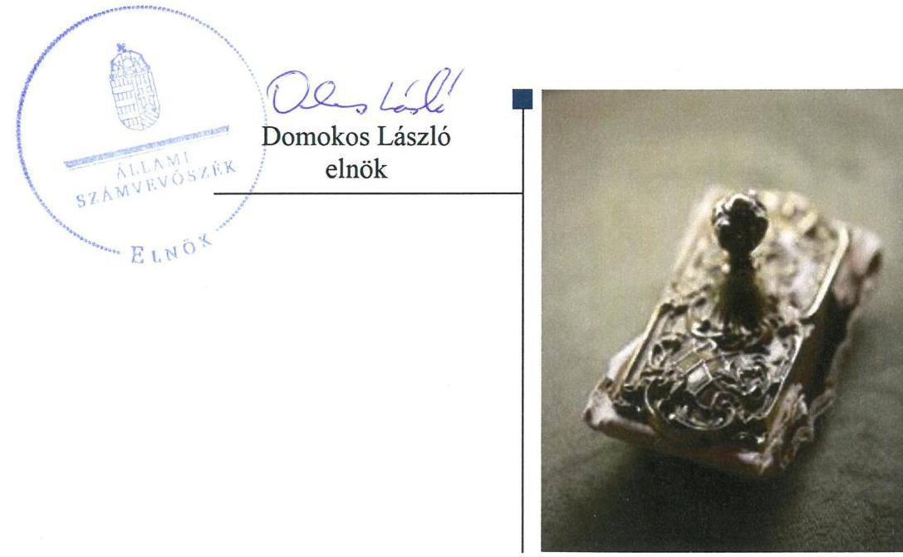
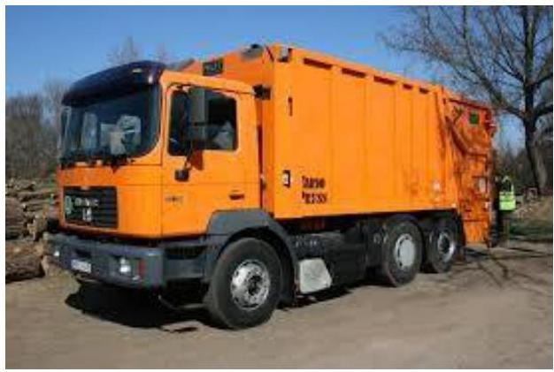

# Jelentés 

## Az önkormányzatok gazdasági társaságai

Az önkormányzatok többségi tulajdonában lévő gazdasági társaságok gazdálkodásának ellenőrzése - LAKI-GAZDA Nonprofit Hulladékgazdálkodási Korlátolt Felelősségű Társaság
2018.

---

# Jelentés 

## Az önkormányzatok gazdasági társaságai

Az önkormányzatok többségi tulajdonában lévő gazdasági társaságok gazdálkodásának ellenőrzése - LAKI-GAZDA Nonprofit Hulladékgazdálkodási Korlátolt Felelősségű Társaság
2018. 00 hó 11. nap

---

# AZ ELLENŐRZÉST FELÜGYELTE:

DR HORVÁTH MARGIT felügyeleti vezető

## AZ ELLENŐRZÉST VEZETTE ÉS A VÉGREHAJTÁSÁÉRT FELELŐS:

SIPOSNÉ DÓCZI KLÁRA ellenőrzésvezető

## A PROGRAM ÖSSZEÁLLÍTÁSÁÉRT FELELŐS:

TÓTPÁL SZABOLCS osztályvezető

IKTATÓSZÁM: EL-0198-075/2018.

TÉMASZÁM: 2447

ELLENŐRZÉS-AZONOSÍTÓ SZÁM: V079365

Jelentéseink az Országgyűlés számítógépes hálózatán és az Interneta a www.asz.hu címen is olvashatóak.

---

# TARTALOMJEGYZÉK 

■ ÖSSZEGZÉS ..... 5
■ AZ ELLENŐRZÉS CÉLJA ..... 6
■ AZ ELLENŐRZÉS TERÜLETE ..... 7
■ AZ ELLENŐRZÉS HÁTTERE, INDOKOLTSÁGA ..... 9
■ A JELENTÉS LÉNYEGES KÉRDÉSKÖREI ..... 10
■ AZ ELLENŐRZÉS HATÓKÖRE ÉS MÓDSZEREI ..... 11
■ MEGÁLLAPÍTÁSOK ..... 13
■ JAVASLATOK ..... 15
■ MELLÉKLETEK ..... 17
I. sz. melléklet: Értelmező szótár ..... 17
■ FÜGGELÉK: ÉSZREVÉTELEK ..... 19
■ RÖVIDÍTÉSEK JEGYZÉKE ..... 21

---

.

---

# ÖSSZEGZÉS 

Lakitelek Önkormányzatának tulajdonosi joggyakorlása nem volt szabályszerű. A LAKIGAZDA Nonprofit Hulladékgazdálkodási Korlátolt Felelősségű Társaság müködésének szabályozottsága nem felelt meg a jogszabályi előírásoknak. A Társaság gazdálkodása és vagyongazdálkodása nem volt szabályszerű. A Társaság nem teljesítette a közérdekü adatok közzétételének kötelezettségét, ezzel az átláthatóságot nem biztositotta.

## Az ellenőrzés társadalmi indokoltsága

Magyarországon az intézmény-centrikus közfeladat-ellátás jellemző, de az önkormányzatok kötelező és önként vállalt feladataik ellátása során egyre szélesebb körben alkalmazzák a költségvetési szerveken kívüli feladatellátást. Helyi szinten ennek meghatározó szereplői az önkormányzati tulajdonban lévő gazdasági társaságok, amelyek ezáltal kiemelt fontosságú szerephez jutnak a lakossági szolgáltatások biztosításában. Az önkormányzatok többségi tulajdonában álló gazdasági társaságok ellenőrzése kiemelt jelentőségű, mivel müködésük hatással van a tulajdonos önkormányzat gazdálkodására, gazdálkodásának egyes elemei befolyásolják az önkormányzati szektor hiányát és az államadósságot. Ezért alapvető követelmény, hogy gazdálkodásuk, müködésük szabályszerű és átlátható legyen.

Az Állami Számvevőszék által a hulladékgazdálkodási közfeladatot ellátó Társaságnál végzett ellenőrzést további társadalmi elvárás indokolja sajátos feladatellátásából adódóan, mivel tevékenységén keresztül Lakitelek lakosságának széles köre került kapcsolatba a Társasággal, valamint az általa nyújtott szolgáltatásokkal.

## Főbb megállapítások, következtetések, javaslatok

Lakitelek Önkormányzata a tulajdonosi joggyakorlás kereteit a jogszabályi előírásoknak megfelelően alakította ki. Az Önkormányzat tulajdonosi joggyakorlása nem volt szabályszerű, mert nem gondoskodott a LAKI-GAZDA Nonprofit Hulladékgazdálkodási Korlátolt Felelősségű Társaságnál a társasági formára előírt jegyzett tőke minimum összegét elérő saját tőke biztosításáról.

A LAKI-GAZDA Nonprofit Hulladékgazdálkodási Korlátolt Felelősségű Társaság az ellenőrzött időszakban nem rendelkezett a szabályszerű működéséhez szükséges, a jogszabályokban előírt szabályzatokkal. A számviteli szabályozás hiányosságai miatt a Társaság gazdálkodása és vagyongazdálkodása sem volt szabályszerű, valamint a beszámolóinak alátámasztottsága sem volt biztosított. A Társaság nem felelt meg az Alaptörvénybe foglalt elszámoltathatóság és átláthatóság követelményének.

---

# AZ ELLENŐRZÉS CÉLJA 

Az ellenőrzés célja annak értékelése volt, hogy az önkormányzat vagyongazdálkodási tevékenysége során szabályszerűen gyakorolta-e tulajdonosi jogait; a gazdasági társaság szabályozottsága, gazdálkodása és vagyongazdálkodási tevékenysége, bevételeinek és ráfordításainak elszámolása megfelelt-e a jogszabályi és tulajdonosi előírásoknak; a gazdasági társaság kötelezettségállománya jelentett-e kockázatot a múködésre.

---

# **AZ ELLENŐRZÉS TERÜLETE**

## **Lakitelek Önkormányzata és a kizárólagos tulajdonában lévő LAKI-GAZDA Nonprofit Hulladékgazdálkodási Korlátolt Felelősségű Társaság**

**LAKITELEK ÖNKORMÁNYZATA** 2008. május 30-án alapította a LAKI-GAZDA Településüzemeltetési Kft.-t, melynek elnevezése 2013. május 2-től LAKI-GAZDA Nonprofit Hulladékgazdálkodási Kft. lett.

A Társaság1 az Önkormányzat2 100%-os tulajdonában állt az ellenőrzött időszakban, jegyzett tőkéje az alapításkor három millió forint volt, mely az ellenőrzött időszakban nem változott.

**A TÁRSASÁG** közszolgáltatási tevékenységi köre 2014. augusztus 8-ig szennyvíz gyűjtése, kezelése, veszélyes hulladék gyűjtése, kezelése, ártalmatlanítása, egyéb hulladékkezelés volt, 2014. július 15-től a tevékenységi kör kiegészült a nem veszélyes hulladék gyűjtésének feladatával. A Társaság tevékenységeit 2012. április 1-jétől közszolgáltatóként végezte "a települési szilárd hulladék kezelésére irányuló hulladékkezelési közszolgáltatásról" szóló 11/2012. (III. 12.) számú önkormányzati rendelet, valamint "a települési nem közművel összegyűjtött háztartási szennyvíz kezelésének kötelező közszolgáltatásáról" szóló 49/2012. (XII. 24.) számú önkormányzati rendelet rendelkezései alapján. 2013. július 9-én a nem nonprofit üzletág (zöld-terület-kezelés) – LAKI-PARK Településüzemeltetési Kft. néven – kivált a Társaságból. A közszolgáltatási feladatok azon része, mely a települési szilárd hulladék gyűjtésére, kezelésére vonatkozott, "a helyi hulladékgazdálkodási közszolgáltatásról" szóló 31/2016. (XI. 11.) önkormányzati rendelet előírása értelmében 2016-ban a Felső-Bácskai Hulladékgazdálkodó Nonprofit Kft.-hez kerültek. A nem közművel összegyűjtött háztartási szennyvíz begyűjtésére vonatkozó közszolgáltatás ellátási feladat az Önkormányzat 8/2016. (III. 11.) számú rendelete értelmében a Társaságnál maradt.

Az ellenőrzött időszakban a Társaság irányítási feladatait ügyvezető, ellenőrzését egymást követő időszakokban összesen hét fő részvételével három tagú Felügyelőbizottság3, végezte. A Társaság ügyvezetőjének személye az ellenőrzött időszakban 2016. augusztus 31-én változott. A Társaság egyszerűsített éves beszámolóit a Számv. tv.4 előírásának megfelelően független könyvvizsgáló auditálta, kinek személye nem változott az ellenőrzött időszakban.

A Társaság az Önkormányzattól vagyonkezelésbe, üzemeltetésre nem vett át vagyont, tevékenységét saját eszközeivel látta el. A Társaság nem rendelkezett tulajdonosi részesedéssel más gazdasági társaságban. Önköltség számítási szabályzat készítésére nem volt kötelezett. Az ellenőrzött években nem tartozott a kormányzati szektorba sorolt gazdálkodó szervezetek közé.

---

A Társaságnál a foglalkoztatottak átlagos statisztikai létszáma 2013-ban nyolc fő volt, az ellenőrzött időszak végére 10 főre emelkedett.

A Társaságnál az értékesítés nettó árbevétele a 2013. évi 51 millió forintról 2016. év végére 29 millió forintra csökkent, a települési szilárd hul-ladék-kezelési feladat ellátási tevékenység más társaságba történő átadása miatt.

A Társaság tárgyi eszköz állománya az ellenőrzött időszakban a 2013. január 1-jei állapothoz képest 12 millió forinttal csökkent, ugyanakkor követelései 33 millió forinttal növekedtek, melyre a lakossági díjtartozások növekedése volt hatással. A Társaság saját tőkéje az ellenőrzött időszakban a 2013. január 1-jei állapothoz képest 50 millió forinttal csökkent a 2013ban, 2014-ben és 2015-ben is veszteséges gazdálkodás hatására. A saját tőke csökkenés mellett a múködés fenntartásához a kötelezettségek állománya 2013. év elejei 20 millió forintról, 2016. év végére 80 millió forintra emelkedett az Alapítóval szembeni kötelezettségek 4 millió forintról 46 millió forintra történő emelkedése miatt.

Az ellenőrzött időszakban az Önkormányzat a Társaság múködéséhez 8,2 millió forint támogatást nyújtott.

Lakitelek polgármesterének személye az ellenőrzött időszakban egy alkalommal, a 2014. évi önkormányzati választásokat követően változott, a jegyző személyében 2015. április 13-án történt változás.

---

# AZ ELLENŐRZÉS HÁTTERE, INDOKOLTSÁGA 

Az önkormányzatok többségi tulajdonában álló gazdasági társaságok ellenőrzése kiemelten fontos a vagyon megőrzése, megóvása érdekében. A feladatellátás költségeinek, ráfordításainak alakulása a lakosság széles rétegét érinti.

Az Állami Számvevőszék ellenőrzései feltárhatják, hogy az önkormányzat a feladatellátásához rendelt vagyon működtetését a tulajdonostól elvárható gondossággal végezte-e, a feladatot ellátó gazdasági társaság a létesítő okiratban, szolgáltatási szerződésben foglaltak betartásával biztosí-totta-e a feladat ellátását. Az ellenőrzés rávilágíthat arra, hogy a gazdasági társaság a vagyon használatával biztosította-e a szolgáltatás folytatásának feltételeit, az önkormányzat tulajdonosi felügyelete hozzájárult-e a szabályszerű gazdálkodáshoz és feladatellátáshoz.

A megállapítások alapján megfogalmazott számvevőszéki javaslatok hasznosítása elősegítheti a meglévő hibák megszüntetését. A jó gyakorlatok bemutatásával az ÁSZ ${ }^{5}$ hozzájárulhat a követendő megoldások megismertetéséhez, terjesztéséhez.

---

# A JELENTÉS LÉNYEGES KÉRDÉSKÖREI 

1.- Az önkormányzat tulajdonosi joggyakorlása szabályszerű volt-e?
2.- A gazdasági társaság müködésének szabályozottsága, gazdálkodása és vagyongazdálkodása valamint az árképzés szabályszerű volt-e?

---

# AZ ELLENŐRZÉS HATÓKÖRE ÉS MÓDSZEREI 

## Az ellenőrzés típusa

Megfelelőségi ellenőrzés

## Az ellenőrzött időszak

2013. január 1-jétől 2016. december 31-ig tartott.

## Az ellenőrzés tárgya

Lakitelek Önkormányzatának tulajdonosi joggyakorlása, valamint a LAKIGazda Nonprofit Hulladékgazdálkodási Kft. gazdálkodásának szabályozottsága és szabályszerűsége.

Az ellenőrzés kiterjedt minden olyan körülményre és adatra, amely az ÁSZ jogszabályban meghatározott feladatainak teljesítéséhez, valamint a program végrehajtása folyamán felmerült újabb összefüggések feltárásához szükséges.

## Az ellenőrzött szervezet

$\longrightarrow$ Lakitelek Önkormányzata
$\longrightarrow$ LAKI-GAZDA Nonprofit Hulladékgazdálkodási Korlátolt Felelősségű Társaság

## Az ellenőrzés jogalapja

Az ellenőrzés jogszabályi alapját az ÁSZ tv. ${ }^{6}$ 1. § (3) bekezdése és az 5. § (3) - (5) bekezdései képezték.

## Az ellenőrzés módszerei

Az ellenőrzést a nemzetközi standardokat irányadónak tekintve az ellenőrzési program ellenőrzési kérdései, az ellenőrzött időszakban hatályos jogszabályok, az ellenőrzés szakmai szabályok és módszertanok figyelembe vételével végeztük.

Az ellenőrzés ideje alatt az ellenőrzött szervezettel történő kapcsolattartást az ÁSZ Szervezeti és Működési Szabályzatának ${ }^{7}$ vonatkozó előírásai alapján biztosítottuk.

---

Az ellenőrzés a tulajdonosi jogokat gyakorló önkormányzatra valamint az általa kizárólagosan tulajdonolt gazdasági társaságra terjedt ki.

Az ellenőrzési kérdések megválaszolásához szükséges bizonyítékok megszerzése a következő ellenőrzési eljárások alkalmazásával történt: megfigyelés, kérdésfeltevés (információkérés), összehasonlítás, valamint elemző eljárás. Az ellenőrzési bizonyítékként felhasználható adatforrások közé tartoztak egyrészt a szakmai programban felsorolt adatforrások, másrészt minden, az ellenőrzés folyamán feltárt, az ellenőrzés szempontjából információkat tartalmazó dokumentum.

A gazdasági társaság bevételeinek és ráfordításainak elszámolása, valamint a vagyonnyilvántartás terén a szabályszerű múködést véletlen mintavétellel és irányított kiválasztással ellenőriztük. A mintatételek értékelése alapján egyrészt a sokaságban előforduló hibás tételek arányát becsültük, másrészt az irányítottan kiválasztott tételeket értékeltük. A jogszabályoknak és a belső eljárásoknak megfelelőnek, azaz szabályszerűnek tekintettük az adott területet, amennyiben a minta ellenőrzésének eredménye alapján 95\%-os bizonyossággal a teljes sokaságban a hibaarány kisebb volt, mint 10\%. Nem megfelelőnek értékeltük, ha a hibaarány a $10 \%$-ot meghaladta. A ráfordítások elszámolására és a vagyonnyilvántartásra vonatkozó véletlen mintavételt kockázati alapú kiválasztással egészítettük ki, amelynek során évente a három legnagyobb összegű tételt választottuk ki. Az ellenőrzést a nemzetközi standardokat irányadónak tekintve az ellenőrzési program ellenőrzési kérdései, az ellenőrzött időszakban hatályos jogszabályok, az ellenőrzés szakmai szabályok és módszertanok figyelembe vételével végeztük.

Az ellenőrzést a kérdésekre adott válaszok kiértékelésével, valamint a megjelölt adatforrások, a csatolt tanúsítványok felhasználásával, továbbá az adott időszakban hatályos jogszabályok figyelembe vételével kellett lefolytatni.

---

# 1. Az önkormányzat tulajdonosi joggyakorlása szabályszerű volt-e? 

Összegző megállapítás

Az Önkormányzat a tulajdonosi joggyakorlás kereteit szabályszerűen alakította ki, azonban a tulajdonosi jogok gyakorlása nem volt szabályszerű.

A TULAJDONOSI JOGGYAKORLÁS KERETEIT az Önkormányzat Képviselő-testülete ${ }^{8}$, mint a Társaság alapítója és annak Taggyűlési hatáskörben eljáró legfőbb szerve a Társaság Alapító okirat ${ }_{1-3}$-ban ${ }^{9}$, az Önkormányzat az SZMSZ ${ }_{1,2}$-ben ${ }^{10}$, valamint a Vagyonrendeletben ${ }^{11}$ a jogszabályi előírásoknak megfelelően határozta meg. Az Önkormányzatnak a Társasággal kötött, a jogszabályi előírásoknak megfelelő közszolgáltatási szerződései ${ }^{12}$ meghatározták az árképzés szabályait. A díjmeghatározás megfelelt a Hulladéktörvény ${ }^{13}$ iránymutatásának. Az Önkormányzat a közszolgáltatáshoz kapcsolódó rendeletalkotási ${ }^{14}$ kötelezettségét teljesítette.

A TULAJDONOSI JOGOKAT az Alapító nem a jogszabályi előírásoknak megfelelően gyakorolta, mert a Ptk. 3:133. § (2) bekezdésében foglaltak ellenére akkor, amikor két egymást követő üzleti évben, 20142015. években, a társaság kimutatott saját tőkéje nem érte el az adott társasági formára kötelezően előírt jegyzett tőke összegét, a második beszámoló elfogadásától számított három hónapon belül nem gondoskodott a társaságnak az adott társasági formára kötelezően előírt jegyzett tőke mértékét elérő saját tőke biztosításáról, illetve az előbbi határidő lejáratát követő hatvan napon belül nem döntött a Társaság átalakításáról vagy megszüntetéséről.

Az Alapító ${ }^{15}$ a Taktv. ${ }^{16}$ 5. § (3) bekezdésében foglaltak ellenére a vezető tisztségviselők, a felügyelőbizottsági tagok, valamint az Mt. ${ }^{17} 208$. § hatálya alá tartozó munkavállalók javadalmazásának, valamint jogviszonyuk megszűnése esetére biztosított juttatások módjának, mértékének elveiről, annak rendszeréről nem alkotott javadalmazási szabályzatot.

Az Önkormányzat az ellenőrzött években nem élt az Áht. ${ }^{18}$-ban számára biztosított lehetőséggel, hogy ellenőrizze a Társaságot.

---

# 2. A gazdasági társaság müködésének szabályozottsága, gazdálkodása és vagyongazdálkodása valamint az árképzés szabályszerű volt-e? 

Összegző megállapítás

A Társaság müködésének szabályozottsága nem felelt meg a jogszabályi előírásoknak. A Társaság gazdálkodása nem volt szabályszerű. A Társaság vagyongazdálkodása nem volt szabályszerű.
2.1. számú megállapítás

A Társaság nem rendelkezett a törvényben előírt szabályzatokkal.
A Társaság az ellenőrzött időszakban a Számv. tv. 14. § (3)-(5) bekezdése, valamint a 161. §. (1)-(3) bekezdése és a 161/A. § (1)-(2) bekezdése előírásainak megfelelő szabályzatokkal - számviteli politikával és az annak keretében elkészítendő szabályzatokkal (az eszközök és a források leltárkészítési és leltározási szabályzatával, eszközök és források értékelési szabályzatával, pénzkezelési szabályzattal), valamint számlarenddel - nem rendelkezett, így a Számv. tv. végrehajtásának szabályozási feltételeit nem alakította ki.

A Társaságnál a bevételek és a ráfordítások elszámolása, valamint az eszközök nyilvántartása az alapvető szabályozási hiányosságok miatt nem felelt meg a Számv. tv. előírásainak.
2.2. számú megállapítás

A Társaság a beszámolási kötelezettségének nem tett eleget. A Társaság nem gondoskodott a számára jogszabályban előírt közérdekú adatok közzétételéről.

Tervezési kötelezettséget a Társaság részére a Hulladéktörvény írt elő. A Hulladéktörvény és a Hulladékgazdálkodási Korm. rendelet ${ }^{19}$ előírásainak a 2013-2015. közötti időszakra vonatkozó közszolgáltatói hulladékgazdálkodási terv ${ }^{20}$ készítésével a Társaság eleget tett.

A Társaság a jogszabályi előírásoknak, valamint a díjkivetést tartalmazó önkormányzati rendeletek előírásainak megfelelő díjakat alkalmazta.

A Társaságnál az egyszerűsített éves beszámolók leltári alátámasztottsága nem volt biztosított a Számv. tv. 69. § (1) bekezdésébe foglalt előírás ellenére. A Társaság ezzel megsértette a Számv. tv. 15. § (3) bekezdésébe foglalt valódiság elvét.

A szabályszerű könyvvezetést biztosító alapvető szabályzatok hiánya ellenére a könyvvizsgáló az ellenőrzött időszakban korlátozás nélküli hitelesítő záradékkal látta el a beszámolókhoz kapcsolódó jelentéseit.

A Társaság nem tartotta be az Info. tv. ${ }^{21}$ 30. § (6) bekezdésében előírtakat, nem készítette el a közérdekú adatok megismerésére irányuló igények teljesítésének rendjét rögzítő szabályzatát. A Társaság az Info tv. 24. § (1) bekezdése szerint kötelezett volt belső adatvédelmi felelős kijelölésére, vagy megbízására, mely kötelezettségének nem tett eleget. A Társaság megsértette az Info tv. 33. § (1) és (3) bekezdéseinek előírásait, mert a törvény 1. mellékletében meghatározott, a közfeladat ellátásához kapcsolódó adatok közzétételi kötelezettségének nem tett eleget, ugyanakkor a Taktv. 2. § (1) bekezdésébe foglalt közzétételi kötelezettségét teljesítette.

---

# JAVASLATOK 

Az ÁSZ tv. 33. § (1) bekezdésében foglaltak értelmében az ellenőrzött szervezet vezetője köteles a jelentésben foglalt megállapításokhoz kapcsolódó intézkedési tervet összeállítani és azt a jelentés kézhezvételétől számított 30 napon belül az ÁSZ részére megküldeni. Amennyiben az ellenőrzött szervezet vezetője nem küldi meg határidőben az intézkedési tervet, vagy továbbra sem elfogadható intézkedési tervet küld, az Állami Számvevőszék elnöke az ÁSZ tv. 33. § (3) bekezdése a) és b) pontjaiban foglaltakat érvényesítheti.

Javaslataink célja a LAKI-GAZDA Nonprofit Hulladékgazdálkodási Korlátolt Felelősségű Társaság gazdálkodása szabályszerűségének és gyakorlatának javítása annak érdekében, hogy a szabályozási környezet és az alkalmazott gyakorlat megfelelően tudja támogatni az átlátható müködést.

## A LAKI-GAZDA Nonprofit Hulladékgazdálkodási Korlátolt Felelősségű Társaság ügyvezetőjének

1. Intézkedjen a hatályos Számv. tv. előírásainak megfelelő számviteli politika és annak keretében elkészítendő számviteli szabályzatok, valamint a számlarend elkészítése érdekében.
(2.1. sz. megállapítás 1. bekezdése alapján)
2. Intézkedjen a közérdekú adatok megismerésére irányuló igények teljesítésének rendjét rögzítő szabályzat elkészítése érdekében az Info tv. előírásainak megfelelően.
(2.2. sz. megállapítás 5. bekezdés 1. mondata alapján)
3. Intézkedjen belső adatvédelmi felelős kijelölése, vagy megbizása érdekében az Info tv. előírásainak megfelelően.
(2.2. sz. megállapítás 5. bekezdés 2. mondta alapján)
4. Intézkedjen közfeladat ellátásához kapcsolódó adatok közzétételi kötelezettségének teljesítéséről az Info tv. előírásainak megfelelően.
(2.2. sz. megállapítás 5. bekezdés 3. mondat 1. és 2. tagmondata alapján)

---

# Javaslataink célja az Önkormányzat szabályszerű működésének elősegítése, továbbá az önkormányzati tulajdonosi joggyakorlás kontrolljainak erősítése. 

## Lakitelek Önkormányzata polgármesterének

1. Kezdeményezze az Alapítónál a vezető tisztségviselők, a felügyelő bizottsági tagok, az Mt. 208. §-ának hatálya alá eső munkavállalók javadalmazása, valamint a jogviszony megszünése esetére biztosított juttatások módjának, mértékének elveire, annak rendszerére vonatkozó szabályzat megalkotását a Taktv.-ben elöírtaknak megfelelően.
(1. sz. megállapítás 3. bekezdése alapján)
2. Intézkedjen
a) a számviteli szabályozási hiányosságok,
b) a közzétételi kötelezettséggel kapcsolatos szabályozás, a belső adatvédelmi felelős kijelölésének elmaradása, valamint a közzétételi kötelezettség teljesítésének elmulasztása
miatti felelősség tisztázása érdekében, és szükség szerint intézkedjen a felelősség érvényesítéséről.
(2.1. sz. megállapítás 1. bekezdése, 2.2. sz. megállapítás 5. bekezdés 1-2. mondatai, valamint a 3. mondat 1. és 2. tagmondata alapján)

---

# MELLÉKLETEK 

- I. SZ. MELLÉKLET: ÉRTELMEZŐ SZÓTÁR
gazdasági társaság
gazdálkodó szervezet
közszolgáltatás
meghatározó befolyás
nemzeti vagyon
nonprofit gazdasági társaság
vagyonkezelő

Ptk 3:88. § (1) bekezdése szerint „a gazdasági társaságok üzletszerű közös gazdasági tevékenység folytatására, a tagok vagyoni hozzájárulásával létrehozott, jogi személyiséggel rendelkező vállalkozások, amelyekben a tagok a nyereségből közösen részesednek, és a veszteséget közösen viselik".
A Ptk. 685. § c) pontja szerint gazdálkodó szervezet: „az állami vállalat, az egyéb állami gazdálkodó szerv, a szövetkezet, a lakáss szövetkezet, az európai szövetkezet, a gazdasági társaság, az európai részvénytársaság, az egyesülés, az európai gazdasági egyesülés, az európai területi együttmúködési csoportosulás, az egyes jogi személyek vállalata, a leányvállalat, a vízgazdálkodási társulat, az erdő birtokossági társulat, a végrehajtói iroda, az egyéni cég, továbbá az egyéni vállalkozó." (2014. 03.15-ig hatályos)
Az Ebktv. 3. § d) pontja a következőképpen határozza meg a közszolgáltatást: „szerződéskötési kötelezettség alapján a lakosság alapvető szükségleteinek ellátására irányuló szolgáltatás, így különösen a villamos energia-, gáz-, hő-, víz-, szennyvíz- és hulladékkezelési, köztisztasági, postai és távközlési szolgáltatás, továbbá a menetrend alapján közlekedő járművekkel végzett közforgalmú személyszállítás".
A Ptk. 8:2. § (2) bekezdése szerint „A befolyással rendelkező akkor rendelkezik egy jogi személyben meghatározó befolyással, ha annak tagja vagy részvényese, és
a) jogosult e jogi személy vezető tisztségviselői vagy felügyelőbizottsága tagjai többségének megválasztására, illetve visszahívására; vagy
b) a jogi személy más tagjai, illetve részvényesei a befolyással rendelkezővel kötött megállapodás alapján a befolyással rendelkezővel azonos tartalommal szavaznak, vagy a befolyással rendelkezőn keresztül gyakorolják szavazati jogukat, feltéve, hogy együtt a szavazatok több mint felével rendelkeznek."
Nvtv. 1. § (2) bekezdése szerint többek között: „az állam vagy a helyi önkormányzat kizárólagos tulajdonában álló dolgok,
az a) pont hatálya alá nem tartozó, állam vagy a helyi önkormányzat tulajdonában lévő dolog,
az állam vagy a helyi önkormányzat tulajdonában lévő pénzügyi eszközök, továbbá az államot vagy a helyi önkormányzatot megillető társasági részesedések, az államot vagy a helyi önkormányzatot megillető bármely vagyoni értékkel rendelkező jogosultság, amelyet jogszabály vagyoni értékű jogként nevesít."
Civil tv. 9/F. § (2) bekezdése szerint „az a gazdasági társaság minősül nonprofit gazdasági társaságnak és cégnevében az a gazdasági társaság tüntetheti fel a nonprofit jelleget, amelynek létesítő okirata tartalmazza, hogy a gazdasági társaság tevékenységéből származó nyereség a tagok között nem osztható fel, hanem az a gazdasági társaság vagyonát gyarapítja." (hatályos 2014. március 15től)
vagyonkezelő:
a) az állam tulajdonában álló nemzeti vagyon tekintetében:
aa) költségvetési szerv,
ab) helyi önkormányzat, önkormányzati társulás,
ac) önkormányzati intézmény,

---

ad) köztestület,
ae) az állam, az aa)-ac) alpontban meghatározott személyek együtt vagy különkülön 100\%-os tulajdonában álló gazdálkodó szervezet,
af) az ae) alpont szerinti gazdálkodó szervezet 100\%-os tulajdonában álló gazdálkodó szervezet,
ag) a törvény által kijelölt egyedileg meghatározott jogi személy.
b) a helyi önkormányzat tulajdonában álló nemzeti vagyon tekintetében:
ba) önkormányzati társulás,
bb) költségvetési szerv vagy önkormányzati intézmény,
bc) köztestület,
bd) az állam, a helyi önkormányzat, a ba)-bb) alpontban meghatározott személyek együtt vagy külön-külön 100\%-os tulajdonában álló gazdálkodó szervezet, be) a bd) alpont szerinti gazdálkodó szervezet 100\%-os tulajdonában álló gazdálkodó szervezet.
c) az egyházi jogi személy a tevékenysége ellátásához szükséges nemzeti vagyon tekintetében. (Forrás: Nvtv. 3. § (1) bekezdés 19. pontja)

---

# FÜGGELÉK: ÉSZREVÉTELEK 

A jelentéstervezetet a Számvevőszék 15 napos észrevételezésre megküldte az ellenőrzött szervezetek vezetőinek az ÁSZ tv. 29. §* (1) bekezdése előírásának megfelelően.

A LAKI-GAZDA Nonprofit Hulladékgazdálkodási Korlátolt Felelősségü Társaság ügyvezetője és Lakitelek Önkormányzata polgármestere az ÁSZ tv. 29. § (2) bekezdésében foglalt észrevételezési jogával nem élt, a jelentéstervezetre észrevételt nem tett.

[^0]
[^0]:    * 29. § (1) Az Állami Számvevőszék az ellenőrzési megállapításait megküldi az ellenőrzött szervezet vezetőjének vagy az általa megbízott személynek, és annak, akinek személyes felelősségét állapította meg.
    (2) Az ellenőrzött szervezet vezetője és a felelősként megjelölt személy az ellenőrzés megállapításaira tizenöt napon belül írásban észrevételt tehet.
    (3) Az Állami Számvevőszék az észrevételre a beérkezésétől számított harminc napon belül írásban válaszol. A figyelembe nem vett észrevételeket köteles a jelentésben feltüntetni, és megindokolni, hogy azokat miért nem fogadta el.

---

.

---

# RÖVIDÍTÉSEK JEGYZÉKE 

${ }^{1}$ Társaság
${ }^{2}$ Önkormányzat
${ }^{3}$ Felügyelőbizottság
${ }^{4}$ Számv. tv.
${ }^{5}$ ÁSZ
${ }^{6}$ ÁSZ törvény
${ }^{7}$ ÁSZ Szervezeti és Müködési Szabályzata
${ }^{8}$ Képviselő-testület
${ }^{9}$ Alapító okirat ${ }_{1-3}$
${ }^{10}$ Önkormányzati SZMSZ ${ }_{1-2}$
${ }^{11}$ Vagyonrendelet
${ }^{12}$ közszolgáltatási szerződések
${ }^{13}$ Hulladéktörvény
${ }^{14}$ közszolgáltatási rendeletek

LAKI-GAZDA Nonprofit Hulladékgazdálkodási Korlátolt Felelősségű Társaság Lakitelek Önkormányzata
LAKI-GAZDA Nonprofit Hulladékgazdálkodási Korlátolt Felelősségű Társaság Felügyelőbizottsága
2000. évi C. törvény a számvitelről (hatályos 2001. január 1-től)
Állami Számvevőszék
2011. évi LXVI törvény az Állami Számvevőszékről (hatályos 2011. július 1-jétől)

Az Állami Számvevőszék elnökének 3/2016. (XII. 29.) ÁSZ utasítása az Állami Számvevőszék Szervezeti és Müködési Szabályzatáról (hatályos: 2017. január 1.től)
Lakitelek Önkormányzat Képviselő-testülete
LAKI-GAZDA Nonprofit Hulladékgazdálkodási Korlátolt Felelősségű Társaság Alapító okirata, (hatályos 2008. augusztus 14-től)
módosítva: 2012. szeptember 6.
módosítva: 2013. május 3.
módosítva: 2016. augusztus 31.
Lakitelek Önkormányzat Képviselő-testületének 6/2007. (III. 21.) rendelete az Önkormányzat Szervezeti és Müködési Szabályzatáról; (hatályos: 2007. március 21.-2014. november 14. között)

Lakitelek Önkormányzat Képviselő-testületének 32/2014. (XI. 14.) rendelete Lakitelek Önkormányzat Szervezeti és Müködési Szabályzatáról; (hatályos: 2014. november 15-től)

Lakitelek Önkormányzat Képviselő-testületének 22/2013. (X. 04.) számú rendelete az Önkormányzat vagyonáról és a vagyongazdálkodás szabályairól, mely hatályon kívül helyezte az önkormányzat vagyonáról és a vagyongazdálkodás szabályairól szóló 21/2004. (V. 27.) sz. rendeletet (hatályos: 2013. december 1.-től)
módosítás: Lakitelek Önkormányzat Képviselő-testületének 35/2014. (XI. 14.) számú rendelete az Önkormányzat vagyonáról és a vagyongazdálkodás szabályairól szóló 22/2013. (X.04.) számú önkormányzati rendelet módosításáról; módosítás: Lakitelek Önkormányzat Képviselő-testületének 15/2016. (V. 27.) számú rendelete az Önkormányzat vagyonáról és a vagyongazdálkodás szabályairól szóló 22/2013. (X.04.) számú önkormányzati rendelet módosításáról; Lakitelek Önkormányzat és LAKI-GAZDA Nonprofit Hulladékgazdálkodási Kft között 2013. július 10-én létrejött határozott idejű közszolgáltatási szerződés a nem közművel összegyűjtött háztartási szennyvíz begyűjtésére és kezelésére Lakitelek Önkormányzat és LAKI-GAZDA Nonprofit Hulladékgazdálkodási Kft között 2013. július 10-én létrejött határozott idejű közszolgáltatási szerződés (módosítva: 2014. június 5., 2014. november 13., 2016. március 31.)
2012. évi CLXXXV. törvény a hulladékról (hatályos: 2013. január 1-től)

Lakitelek Önkormányzat Képviselő testületének 31/2016. (XI. 11.) Önkormányzati rendelete A helyi hulladékgazdálkodási közszolgáltatásról (hatályos: 2016. november 12-től)

---

Lakitelek Önkormányzat Képviselő testületének 8/2016. (III. 11.) Önkormányzati rendelete a nem közművel összegyűjtött háztartási szennyvíz begyűjtésére vonatkozó közszolgáltatásról (hatályos 2016. április 1-től)
Lakitelek Önkormányzat Képviselő testületének 3/2015. (II. 20.) Önkormányzati rendelete Az elkülönítetten gyűjtött települési szilárd hulladék kezelésére irányuló kötelező közszolgáltatás szabályairól (hatályos 2016. november 10-ig)
Lakitelek Önkormányzat Képviselő testületének 12/2014. (IV. 04.) Önkormányzati rendelete a nem közművel összegyűjtött háztartási szennyvíz kezelésének kötelező közszolgáltatásáról (hatályos 2016. március 10-ig)
Lakitelek Önkormányzat Képviselő testületének 5/2014. (III. 07.) Önkormányzati rendelete a települési szilárd hulladék kezelésére irányuló kötelező közszolgáltatás szabályairól (hatályos 2015. február 19-ig)
Lakitelek Önkormányzat Képviselő testületének 49/2012. (XII. 14.) Önkormányzati rendelete a nem közművel összegyűjtött háztartási szennyvíz kezelésének kötelező közszolgáltatásáról (hatályos 2014. április 4-ig)
Lakitelek Önkormányzat Képviselő testületének 11/2012. (III. 02.) Önkormányzati rendelete a települési szilárd hulladék kezelésére irányuló kötelező közszolgáltatás szabályairól (hatályos 2014. március 7-ig)
Lakitelek Önkormányzata
2009. évi CXXII. törvény a köztulajdonban álló gazdasági társaságok takarékosabb múködéséről (hatályos 2009. október 3-tól)
2012. évi I. törvény a munka törvénykönyvéről (hatályos 2012. július 1-től)
2011. évi CXCV. törvény az államháztartásról (hatályos 2011. december 31-től)

438/2012. (XII. 29.) Korm. rendelet a közszolgáltató hulladékgazdálkodási tevékenységéről és a hulladékgazdálkodási közszolgáltatás végzésének feltételeiről (hatálytalan: 2015. január 1-jétől)
LAKI-GAZDA Nonprofit Hulladékgazdálkodási Korlátolt Felelősségű Társaság Közszolgáltatói hulladékgazdálkodási terv 2013-2015
2011. évi CXII. törvény az információs önrendelkezési jogról és az információszabadságról (hatályos 2011. július 27-től)

---

ÁLLAMI SZÁMVEVŐSZÉK
1052 Budapest, Apáczai Csere János utca 10.
Levélcím: 1364 Budapest 4. Pf. 54
Telefon: +36 14849100 Telefax: +36 14849200
www.asz.hu