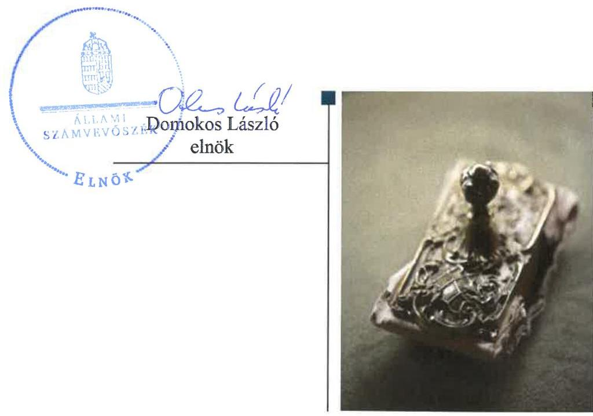
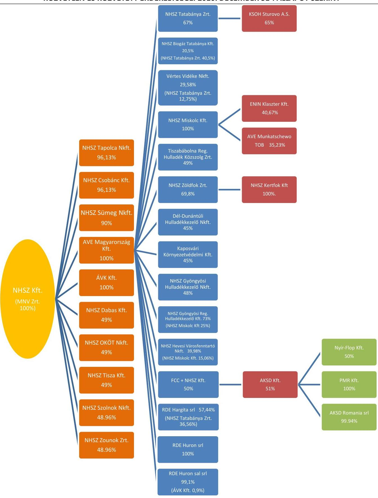
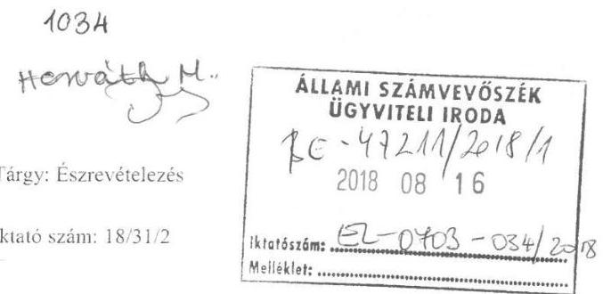
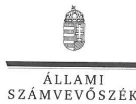
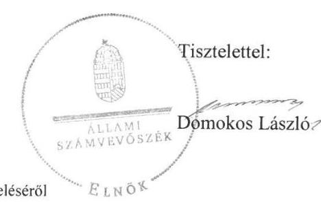

# Jellentés 

## Az állami tulajdonú gazdasági társaságok ellenőrzése

NHSZ Nemzeti Hulladékgazdálkodási Szolgáltató Korlátolt Felelősségű Társaság 2018.

---

# Jelentés 

## Az állami tulajdonú gazdasági társaságok ellenőrzése

NHSZ Nemzeti Hulladékgazdálkodási Szolgáltató Korlátolt Felelősségű Társaság 2018. 10 hó 02 nap

---

# AZ ELLENŐRZÉST FELÜGYELTE:

DR. HORVÁTH MARGIT felügyeleti vezető

## AZ ELLENŐRZÉST VEZETTE ÉS A VÉGREHAJTÁSÁÉRT FELELŐS:

- ÁRPÁSI TIBOR ellenőrzésvezető
- A PROGRAM ÖSSZEÁLLÍTÁSÁÉRT FELELŐS:
  - TÓTPÁL SZABOLCS osztályvezető

IKTATÓSZÁM: EL-0703-038/2018.

TÉMASZÁM: 2469

ELLENŐRZÉS-AZONOSÍTÓ SZÁM: V081440

Jelentéseink az Országgyűlés számítógépes hálózatán és az Interneta a www.asz.hu címen is olvashatóak.

---

# TARTALOMJEGYZÉK 

■ ÖSSZEGZÉS ..... 5
■ AZ ELLENŐRZÉS CÉLJA ..... 6
■ AZ ELLENŐRZÉS TERÜLETE ..... 7
■ AZ ELLENŐRZÉS HÁTTERE, INDOKOLTSÁGA ..... 9
■ A JELENTÉS LÉNYEGES KÉRDÉSKÖREI ..... 10
■ AZ ELLENŐRZÉS HATÓKÖRE ÉS MÓDSZEREI ..... 11
■ MEGÁLLAPÍTÁSOK ..... 13
■ JAVASLATOK ..... 17
■ MELLÉKLETEK ..... 19
I. sz. melléklet: Értelmező szótár ..... 19
II. sz. melléklet: A Társaság érdekeltségei 2016 ..... 22
■ FÜGGELÉK: ÉSZREVÉTELEK ..... 23
■ RÖVIDÍTÉSEK JEGYZÉKE ..... 31

---

.

---

# ÖSSZEGZÉS 

Az NHSZ Nemzeti Hulladékgazdálkodási Szolgáltató Korlátolt Felelősségű Társaság müködésének szabályozottsága nem felelt meg a jogszabályi előírásoknak. A Társaság gazdálkodása és vagyongazdálkodása nem volt szabályszerű. A társaság közzétételi kötelezettségének eleget tett.

## Az ellenőrzés társadalmi indokoltsága

Az Állami Számvevőszék a stratégiáját megvalósítva ellenőrzéseivel segíti az átláthatóságot és az elszámoltathatóságot a közpénzekkel, a közvagyonnal való gazdálkodásban. Ellenőrzési témaválasztása során kiemelt figyelmet fordít a korábban ellenőrizetlen területekre.

Ellenőrzési tervének megfelelően a 2013-2016 közötti ellenőrzött időszakra az Állami Számvevőszék folytatja az állami tulajdonban (résztulajdonban) lévő gazdálkodó szervezetek vagyonmegőrzési és gazdálkodási tevékenységének ellenőrzését.

Az állami tulajdonú gazdasági társaságok a nemzeti vagyon részei. NHSZ Nemzeti Hulladékgazdálkodási Szolgáltató Korlátolt Felelősségű Társaság kiemelt jelentőséggel bír a nemzeti hulladékgazdálkodás hazai tulajdonba vételében. Az Állami Számvevőszék az ellenőrzése során arra kereste a választ, hogy 2013-2016. között szabályszerű volt-e a Társaság gazdálkodása és a Magyar Nemzeti Vagyonkezelő Zrt. ehhez kapcsolódó tulajdonosi joggyakorlása.

## Főbb megállapítások, következtetések, javaslatok

Az NHSZ Nemzeti Hulladékgazdálkodási Szolgáltató Korlátolt Felelősségű Társaság feletti tulajdonosi joggyakorlás kereteit a Magyar Nemzeti Vagyonkezelő Zrt. szabályszerűen alakította ki és gyakorolta jogosítványait. A Magyar Nemzeti Vagyonkezelő Zrt. elfogadta az NHSZ Nemzeti Hulladékgazdálkodási Szolgáltató Korlátolt Felelősségű Társaság Felügyelőbizottságának ügyrendjét, jóváhagyta a javadalmazási szabályzatot, kialakította a rendszeres tervezés, beszámoltatás követelményeit.

Az NHSZ Nemzeti Hulladékgazdálkodási Szolgáltató Korlátolt Felelősségű Társaság müködésének szabályozottsága nem volt megfelelő, mivel 2013 végéig nem rendelkezett számviteli politikával és az annak keretében elkészítendő szabályzatokkal, számlarenddel. A számviteli politika és a pénzkezelési szabályzat nem követte a jogszabályi változásokat, számlarendje nem felelt meg a törvényi előírásoknak, bizonylati renddel nem rendelkezett.

Az NHSZ Nemzeti Hulladékgazdálkodási Szolgáltató Korlátolt Felelősségű Társaság gazdálkodása 2014-ben és 2016-ban nem volt szabályszerű, a személyi jellegű ráfordításokat nem a jogszabályi előírásoknak megfelelően számolták el. Az NHSZ Nemzeti Hulladékgazdálkodási Szolgáltató Korlátolt Felelősségű Társaság az éves beszámoló mérlegét 2013-2014-ben nem támasztotta alá leltárral. A 2013-2014. évi beszámolók közzététele nem a jogszabályi előírásoknak megfelelő határidőben történt. Beszámolási kötelezettségének 2015-2016-ban szabályszerűen eleget tett.

A Társaság vagyongazdálkodása nem volt szabályszerű, mert a vagyon nyilvántartása nem felelt meg a jogszabályi előírásoknak. A támogatások elszámolása határidőn túl történt.

---

# AZ ELLENŐRZÉS CÉLJA 

Az ellenőrzés célja annak értékelése volt, hogy tulajdonosi jogok gyakorlása szabályszerű volt-e. A gazdálkodó szervezet szabályozottsága, gazdálkodása és vagyongazdálkodási tevékenysége megfelelt-e a jogszabályi és a tulajdonosi előírásoknak; biztosítva volt-e a közfeladatok átláthatósága és elszámoltathatósága érdekében a közszolgáltatás díjának megalapozottsága szabályszerű önköltségszámítással. A vagyonváltozást eredményező döntések esetében a tulajdonosi jogok gyakorlója és a gazdálkodó szervezet szabályszerűen jártak-e el.

---

# AZ ELLENŐRZÉS TERÜLETE 

## Az NHSZ Nemzeti Hulladékgazdálkodási Szolgáltató Korlátolt Felelősségű Társaság és a tulajdonosi jogokat gyakorló Magyar Nemzeti Vagyonkezelő Zrt.

Az NHSZ Nemzeti Hulladékgazdálkodási Szolgáltató Korlátolt Felelősségű Társaság 2013. december 18-án került a Magyar Állam kizárólagos tulajdonába a német tulajdonú REMONDIS Magyarország Holding Kft. 335,0 M Ft névértékű 100 \%-os üzletrészének megvásárlása révén. A tulajdonosi jogokat az MNV Zrt. ${ }^{1}$ gyakorolta.

A vásárlás célja a nemzeti hulladékgazdálkodás hazai tulajdonba vétele, abban az állami szerepvállalás növelése, országos szinten a szolgáltatás egységes elveinek követelményszerű kialakítása volt.

2014-ben a Társaság² az osztrák tulajdonosától megvásárolta az AVE Magyarország Hulladékgazdálkodási Kft. 100\%-os üzletrészét.

A Társaság fő tevékenységi köre a TEÁOR ${ }^{3}$ szerinti vagyonkezelés (holding) volt, közfeladatot nem látott el, közszolgáltatást nem végzett, hulladékgazdálkodással összefüggő operatív tevékenységet nem folytatott. A Társaság 2016. évi éves beszámolója szerint összesen 33 működő társaságban rendelkezett 12,75 - 100,0 \% közötti részesedéssel, ebből 21 leányvállalat, 11 társult vállalkozás, 1 közös vezetésű vállalat és 2 egyéb részesedési viszonyban levő vállalkozás volt. A Társaság közvetlen és közvetett tulajdoni részesedéseit 2016. végi állapot szerint a II. sz. melléklet mutatja be. A Társaság a részesedések feletti tulajdonosi joggyakorlóként az MNV Zrt. alapítói határozatai szerinti kötött mandátum alapján járt el.

A Társaság nem rendelkezett vagyonkezelési szerződés alapján átvett állami vagyonnal.

Az ügyvezető személye az ellenőrzött időszakban nem változott. Az ügyvezetés ellenőrzésére, a társaság érdekeinek megóvása céljából háromtagú Felügyelőbizottság ${ }^{4}$ került kijelölésre. A könyvvizsgálatot határozott idejű szerződések alapján megbízott könyvvizsgáló ${ }_{1-3}{ }^{5}$ cégek végezték.

2013-ról 2016-ra a Társaság mérlegfőösszege elsősorban a vállalatfelvásárlási tevékenységgel összefüggő tőkeemelések, valamint üzletrészvásárlások következtében 1647,2 M Ft-ról 21 429,8 M Ft-ra nőtt.

A Társaság gazdálkodása az ellenőrzött időszak minden évében veszteséges volt. Az ellenőrzött időszakban a Társaság nettó árbevétele főként szaktanácsadásból, koordinációs tevékenységből, a Társaság érdekeltségei részére végzett közvetített szolgáltatásokból, illetve informatikai rendszerüzemeltetésből eredt.

---

2014-től az MNV Zrt. összesen 3418,8 M Ft értékben nyújtott támogatást a Társaságnak. A támogatások célja elsősorban a Társaság érdekeltségeinél keletkezett, bevételekkel nem fedezett költségeinek kompenzálása volt.

A Társaság a Számv. tv. 14. § (6)-(7) bekezdésének előírásai alapján mentesült az önköltségszámítás rendjére vonatkozó belső szabályzat elkészítésének kötelezettsége alól.

A Társaság nem tartozott a kormányzati szektorba sorolt egyéb szervezetek közé.

---

# AZ ELLENŐRZÉS HÁTTERE, INDOKOLTSÁGA 

Az állami tulajdonú gazdálkodó szervezetek ellenőrzése kiemelten fontos a vagyon megőrzése, megóvása érdekében. Gazdálkodásuk jellemzően a közérdeklődés és a média figyelmének középpontjában áll, amihez hozzájárul a gazdálkodásuk körébe tartozó - közvetlen vagy közvetett állami tulajdonú, tehát végső soron a nemzeti vagyon részét képező - vagyon nagysága, illetve az általuk ellátott közszolgáltatások/közfeladatok minősége és hatékonysága.

Az ellenőrzés rámutathat az állami tulajdonú gazdálkodó szervezetek gazdálkodási tevékenységével jó gyakorlatokra és szabálytalanságokra. Felhívhatja a figyelmet a jogszabályi követelmények teljesítéséhez szükséges feltételek hiányosságaira, hozzájárulhat az államháztartáson kívüli, de (közvetlenül vagy közvetve) állami vagyont használó gazdálkodó szervezetek tevékenységének átláthatóságához. Ellenőrzésünk eredményeképpen javaslatainkkal, megállapításainkkal hozzájárulhatunk a nemzeti vagyonnal való gazdálkodás átláthatóságának, elszámoltathatóságának javításához.

---

# A JELENTÉS LÉNYEGES KÉRDÉSKÖREI 

1.     - A Magyar Nemzeti Vagyonkezelő Zrt. tulajdonosi joggyakorlása szabályszerű volt-e?
2.     - Az NHSZ Nemzeti Hulladékgazdálkodási Szolgáltató Korlátolt Felelősségű Társaság müködésének szabályozottsága megfelel-e az elöírásoknak, gazdálkodása szabályszerű volt-e?
3.     - Az NHSZ Nemzeti Hulladékgazdálkodási Szolgáltató Korlátolt Felelősségü Társaság vagyongazdálkodása szabályszerű volt-e?

---

# AZ ELLENŐRZÉS HATÓKÖRE ÉS MÓDSZEREI 

## Az ellenőrzés típusa

Megfelelőségi ellenőrzés.

## Az ellenőrzött időszak

2013. december 18. - 2016. december 31., a 2016. évi beszámoló jóváhagyásáig tartó időszak.

## Az ellenőrzés tárgya

Állami tulajdonban (résztulajdonban) lévő gazdasági társaság gazdálkodása, kiemelten vagyongazdálkodási tevékenysége, a tulajdonosi jogok gyakorlása.

Az ellenőrzés kiterjedt minden olyan körülményre és adatra, amely az ÁSZ ${ }^{6}$ jogszabályban meghatározott feladatainak teljesítéséhez, valamint a program végrehajtása folyamán felmerült újabb összefüggések feltárásához szükséges volt.

## Az ellenőrzött szervezet

$\longrightarrow$ Magyar Nemzeti Vagyonkezelő Zrt.
$\longrightarrow$ NHSZ Nemzeti Hulladékgazdálkodási Szolgáltató Korlátolt Felelősségű Társaság

## Az ellenőrzés jogalapja

Az ellenőrzés jogszabályi alapját az ÁSZ tv. ${ }^{7}$ 1. § (3) bekezdése és 5. § (3)- 5) bekezdései képezték.

## Az ellenőrzés módszerei

Az ellenőrzést a nemzetközi standardokat irányadónak tekintve az ellenőrzési program ellenőrzési kérdései, az ellenőrzött időszakban hatályos jogszabályok, az ellenőrzés szakmai szabályok és módszertanok figyelembe vételével végeztük.

Az ellenőrzés ideje alatt az ellenőrzött szervezettel történő kapcsolattartást az ÁSZ Szervezeti és Müködési Szabályzatának vonatkozó előírásai alapján biztosítottuk.

---

A teljes ellenőrzött időszakra vonatkozóan került ellenőrzésre a gazdasági társaság tervezési, beszámolási, közzétételi, adatszolgáltatási kötelezettségének, valamint belső ellenőrzési tevékenységének szabályszerűsége. A 2013. és 2016. évekre vonatkozóan a gazdasági társaság múködésének szabályozottságát, a 2014. és 2016. évekre bevételei és ráfordításai elszámolását, illetve vagyongazdálkodásának szabályszerűségét is ellenőriztük.

A bevételek és a ráfordítások közül az értékesítés nettó árbevétele, az egyéb, rendkívüli és pénzügyi műveletek bevételei, a személyi jellegű ráfordítások, az anyagjellegű ráfordítások, az egyéb, rendkívüli és pénzügyi műveletek ráfordításai, valamint értékcsökkenési leírás elszámolásának szabályszerűségét, továbbá az immateriális javak, tárgyi eszközök esetében a vagyonnyilvántartás szabályszerűségét véletlen mintavétellel ellenőriztük.

A bevételek és a ráfordítások valamint az immateriális javak, tárgyi eszközök esetében az ellenőrzés azokra a legnagyobb értékű tételekre - a lényeges sokaságra - terjedt ki, melyek összértéke eléri a teljes sokaság összértékének 50\%-át.

A 2016. évi személyi jellegű ráfordítások esetében minden egyes tétel vonatkozásában a szabályszerűségre vonatkozó kérdéseket tettünk fel, amelyek eredménye összesítésre került. „Szabályszerűnek" értékeltünk egy ellenőrzött területet, amennyiben 95\%-os bizonyossággal az ellenőrzött sokaságban az átlagos hibaarány legfeljebb 10\%, "nem szabályszerűnek", amennyiben 10\%-nál magasabb arányt képviselt. Az ellenőrzött sokaság tekintetében a 10\%-os hibaarányhoz való viszony megítélésnek megbízhatósága nem érte el a 95\%-ot, annak elérése érdekében értékelésünket további szempontokkal egészítettük ki, és figyelembe vettük a feltárt hibák értékét.

Az ellenőrzési kérdések megválaszolásához szükséges bizonyítékok megszerzése a következő ellenőrzési eljárások alkalmazásával történt: megfigyelés, kérdésfeltevés (információkérés), összehasonlítás, valamint elemző eljárás. Az ellenőrzési bizonyítékként felhasználható adatforrások közé tartoztak egyrészt az ellenőrzési programban felsorolt adatforrások, másrészt adatforrás lehetett még minden - az ellenőrzés folyamán - feltárt, az ellenőrzés szempontjából információkat tartalmazó dokumentum.

Az ellenőrzés a kérdésekre adott válaszok kiértékelésével, valamint a megjelölt adatforrások, a csatolt tanúsítványok felhasználásával, továbbá az adott időszakban hatályos jogszabályok figyelembe vételével folyt le.

---

# 1. A Magyar Nemzeti Vagyonkezelő Zrt. tulajdonosi joggyakorlása szabályszerű volt-e? 

Összegző megállapítás

Az MNV Zrt. szabályszerűen alakította ki a tulajdonosi joggyakorlás kereteit és gyakorolta a tulajdonosi jogokat.

A TULAJDONOSI JOGOKAT GYAKORLÓ MNV Zrt. a Társaság feletti tulajdonosi joggyakorlás kereteit a Gt. ${ }^{8}$, valamint a Ptk. ${ }^{9}$ előírásainak megfelelően határozta meg az Alapító Okiratban ${ }_{1-9}{ }^{10}$. Az MNV Zrt. a Társaság feletti tulajdonosi jogokat és kötelezettségeket az SZMSZ ${ }_{1,2}{ }^{11}$ ben és az abban foglaltak alapján készített belső szabályzatokban (Portfóliós Kódex ${ }_{1,2}{ }^{12}$, Monitoring Szabályzat ${ }_{1,2}{ }^{13}$, Tulajdonosi ellenőrzési szabályzat ${ }_{1,2}{ }^{14}$ ) rögzítetteknek megfelelően gyakorolta.

Az MNV Zrt. a Gt. illetve a Ptk. előírásainak megfelelően a Társaság ügyvezetésére, Felügyelőbizottságára és a könyvvizsgáló1-3 feladataira, valamint a beszámolási kötelezettségeire vonatkozó előírásokat az Alapító Okiratban ${ }_{1-9}$ határozta meg.

A FELÜGYELŐBIZOTTSÁG a Taktv. ${ }^{15}$ előírásainak megfelelően három tagból állt, megválasztotta elnökét, megállapította az ügyrendjét, amit a tulajdonosi joggyakorló a Gt. és a Ptk. rendelkezései szerint jóváhagyott.

ÜZLETI TERV készítésére vonatkozó kötelezettséget a Portfóliós Kódex ${ }_{1,2}$ és az Alapító Okiratban ${ }_{1-9}$ írt elő a Társaságnak. A tervezéssel kapcsolatos részletes előírásokat és iránymutatásokat az éves Tervezési Irányelvek ${ }^{16}$ tartalmazták.

A JAVADALMAZÁSI SZABÁLYZATOT ${ }_{1}{ }^{17}$ az MNV Zrt. 2014. október 7-én hagyta jóvá. A Társaság Mt. 208. § hatálya alá tartozó munkavállalóira, tisztségviselőire és könyvvizsgálóira vonatkozó javadalmazási rendszeréről szóló szabályzata ${ }_{1}$, majd 2016. február 24-től a Javadalmazási Szabályzat ${ }_{2}$ az állam többségi befolyása alatt álló gazdasági társaságok vezető állású munkavállalóinak (Mt. 208. §) és tisztségviselőinek javadalmazási rendszeréről a Taktv. előírásainak megfelelően rendelkezett a társaság vezetői és a Felügyelőbizottsági tagok javadalmazási és juttatási rendszeréről.

A MONITORING TEVÉKENYSÉGRE vonatkozó előírásokat az MNV Zrt. vezérigazgatója a Monitoring Szabályzatban ${ }_{1,2}$ határozta meg, amely tartalmazta a negyedéves tulajdonosi értékelő értekezletek eljárásrendjét, valamint az időszakonként elkészítendő adatszolgáltatások, beszámolók, elemzések, értékelések tartalmi követelményeit és értékelési szempontjait, az adatszolgáltatások határidőit és benyújtásának módját.

---

A monitoring tevékenységet az MNV Zrt. a Monitoring Szabályzat ${ }_{1-2}$-nak előírtaknak megfelelően működtette, a Társaság gazdálkodásának alakulását az adatszolgáltatások elemzése, értékelése alapján folyamatosan nyomon követte.

AZ ÉVES BESZÁMOLÓKAT a Felügyelőbizottság és a könyvvizsgáló ${ }_{1-3}$ írásbeli jelentésében foglaltak ismeretében az MNV Zrt. alapítói határozatokban hagyta jóvá a Ptk. előírásainak megfelelően. A könyvvizsgálói; figyelemfelhívást és korlátozást tartalmazó záradékkal ellátott 2014. évi beszámolót az MNV Zrt. a Számv. tv. 153. § (1) bekezdésében foglalt határidőn túl, 2015. december 16-án fogadta el. Az MNV Zrt. vezérigazgatója 2016. január 20-án elrendelte a 2014. évi számviteli beszámolóhoz adott könyvvizsgálói; korlátozó vélemény alapjául szolgáló körülmények vizsgálatát.

# 2. Az NHSZ Nemzeti Hulladékgazdálkodási Szolgáltató Korlátolt Felelősségű Társaság múködésének szabályozottsága megfelelte az előírásoknak, gazdálkodása szabályszerű volt-e? 

Összegző megállapítás

A Társaság múködésének szabályozottsága nem felelt meg a jogszabályi előírásoknak. A Társaság gazdálkodása nem volt szabályszerű. Beszámolási és az azzal kapcsolatos közzétételi kötelezettségének a Társaság 2013-2014-ben nem szabályosan tett eleget.

SZÁMVITELI POLITIKÁVAL és az annak keretében elkészítendő szabályzatokkal 2013. december 31-ig nem rendelkezett a Társaság a Számv. tv. ${ }^{18}$ 14. § (5) bekezdésében előírt kötelezettsége ellenére. A Társaság a 2014. január 1-től hatályos Számviteli politikáján ${ }^{19}$ a Számv. tv. 14. § (11) bekezdésében előírt kötelezettsége ellenére nem vezette át a Számv. tv. 86. §-a hatályon kívül helyezése és 87. § (1) bekezdés módosítása miatt az eredménykimutatás tételeinek tartalmát érintő (mérleg szerinti eredmény, rendkívüli bevétel, rendkívüli ráfordítás sorok megszűnése) változásokat.

PÉNZKEZELÉSI SZABÁLYZATTAL ${ }^{20}$, Leltározási és selejtezési szabályzattal ${ }^{21}$, Értékelési szabályzattal ${ }^{22}$ valamint Számlarenddel ${ }_{1,2}{ }^{23}$ 2014. január 1-től rendelkezett a Társaság. A Leltározási és selejtezési szabályzat, valamint az Értékelési szabályzat tartalma megfelelt a jogszabályi követelményeknek. A Pénzkezelési szabályzat tartalma nem felelt meg a Számv. tv. 14. § (8) bekezdés előírásainak, mert nem volt szabályozva a pénzforgalom bankszámlán történő lebonyolításának rendje, a készpénzállományt érintő pénzmozgások jogcímei, valamint a bankszámlán történő pénzkezeléssel kapcsolatos bizonylatok rendje és a pénzforgalommal kapcsolatos nyilvántartási szabályok.

A SZÁMLAREND ${ }_{1,2}$ nem felelt meg a Számv. tv. 161. § (2) bekezdés b)-c) pontjaiban meghatározott követelményeknek, mert nem tartalmazta a számla értéke növekedésének, csökkenésének jogcímeit, a számlát érintő

---

gazdasági eseményeket, azok más számlákkal való kapcsolatát, a főkönyvi számla és az analitikus nyilvántartás kapcsolatát. Bizonylati renddel a Számv. tv. 161. § (2) bekezdés d) pontjában foglalt kötelezettsége ellenére a Társaság nem rendelkezett.

A TÁRSASÁG GAZDÁLKODÁSA 2014-ben és 2016-ban nem volt szabályszerű. A személyi jellegű ráfordítások elszámolása 2016-ban nem volt szabályszerű, mert nem állt rendelkezésre a kifizetéseket alátámasztó bizonylat, amivel a Társaság megsértette a Számv. tv. 165.§ (1)-(2) bekezdéseiben foglaltakat.

ÜZLETI TERVEKET a Társaság a Tervezési Irányelveknek megfelelően, az előírt célokkal összhangban tulajdonosi döntés alapján a 20152016. évekre készített, azokat az MNV Zrt. elfogadta.

ÉVES BESZÁMOLÓIT a Társaság a 2013-2014. években nem szabályszerűen állította össze, azokat a Társaság nem támasztotta alá leltárral, megsértve a Számv. tv. 20. § (1) bekezdésében, valamint a Számv. tv. 69 § (1)-(2) bekezdésében foglaltakat. A Társaság a 2013. évi beszámolójához kapcsolódóan nem rendelkezett főkönyvi kivonattal, ezzel megsértette a Számv. tv. 164. § (2) bekezdésében foglaltakat. Ennek ellenére a 2013. évi beszámolót auditáló könyvvizsgáló az éves beszámolót korlátozás nélküli hitelesítő záradékkal látta el. A 2014. év beszámolójáról készített jelentését - a tárgyi eszköz leltár hiánya, a vevő, a szállítói és adófolyószámlák analitikájának és főkönyvi nyilvántartásának eltérései miatt - korlátozó záradékkal látta el a könyvvizsgálóz. A 2015-2016. évek éves beszámolóit a Társaság szabályszerűen állította össze, azokat a könyvvizsgálós korlátozásmentes hitelesítő záradékkal látta el.

A BESZÁMOLÓKKAL KAPCSOLATOS közzétételi és letétbe helyezési kötelezettségét a 2013. és 2014. évi éves beszámolók esetében határidőn túl teljesítette a Társaság, figyelmen kívül hagyva a Számv. tv. 153. § (1) bekezdésében foglaltakat. A Társaság a 2015. és 2016. évi éves beszámolókat határidőben tette közzé és helyezte letétbe.

SAJÁT HONLAPJÁN KÖZZÉTETTE a Társaság a Taktv. 2. § (1)-(2) pontjaiban foglalt előírások szerinti adatokat.

# 3. Az NHSZ Nemzeti Hulladékgazdálkodási Szolgáltató Korlátolt Felelősségű Társaság vagyongazdálkodása szabályszerű volt-e? 

Összegző megállapítás

A Társaság vagyongazdálkodása nem volt szabályszerű. A vagyon nyilvántartása nem felelt meg a jogszabályi előírásoknak. A támogatások elszámolására késedelemmel került sor.

A VAGYON NYILVÁNTARTÁSA nem felelt meg a Számv. tv. 69. § (1) bekezdés előírásainak, mert a 2013-2014. években a Társaság nem támasztotta alá leltárral az éves beszámoló mérlegét. Továbbá 2014ben és 2016-ban a beszerzések esetében az állományba vétel nem volt szabályszerű, a Társaság a Számv. tv. 52. § (2) bekezdésében foglaltak ellenére

---

nem dokumentálta hitelt érdemlő módon a bekerülési érték meghatározását és az üzembe helyezést. Az értékcsökkenés elszámolása 2016-ban szabályszerűen történt. A Társaság 2016-ban évben részesedéseinek értékét a Számv. tv. előírásainak megfelelően határozta meg.

A SAJÁT VAGYON VÁLTOZÁSÁT meghatározó döntések megfeleltek a tulajdonosi joggyakorló által meghatározott előírásoknak. A Társaság befektetési döntéseit az MNV Zrt. hozta, az azok végrehajtásához kapcsolódó pénzügyi fedezetet biztosította.

A VAGYONGAZDÁLKODÁS követelményeit a Társaság a leányvállalatai esetében az üzleti tervekben, támogatási szerződésekben ${ }^{24}$ határozta meg. Az MNV Zrt. által - a hulladékgazdálkodás átalakításával járó veszteségek kompenzálására - nyújtott támogatások elosztásának folyamatában a Társaság a tulajdonosi joggyakorló döntéseit hajtotta végre. A Társaság az MNV Zrt.-vel kötött támogatási szerződések ${ }^{25}$ III.1. pontjában foglalt elszámolási kötelezettségének késedelmesen tett eleget, késedelmét nem jelezte az Ávr. ${ }^{26}$ 97. § (1) bekezdésében előírt kötelezettsége ellenére.

---

# JAVASLATOK 

Az ÁSZ tv. 33. § (1) bekezdésében foglaltak értelmében az ellenőrzött szervezet vezetője köteles a jelentésben foglalt megállapításokhoz kapcsolódó intézkedési tervet összeállítani és azt a jelentés kézhezvételétől számított 30 napon belül az ÁSZ részére megküldeni. Amennyiben az ellenőrzött szervezet vezetője nem küldi meg határidőben az intézkedési tervet, vagy továbbra sem elfogadható intézkedési tervet küld, az Állami Számvevőszék elnöke az ÁSZ tv. 33. § (3) bekezdése a) és b) pontjaiban foglaltakat érvényesítheti.

Javaslataink célja az NHSZ Nemzeti Hulladékgazdálkodási Szolgáltató Kft. gazdálkodása szabályszerűségének és gyakorlatának javítása annak érdekében, hogy a szabályozási környezet és az alkalmazott gyakorlat megfelelően tudja támogatni az átlátható müködést.

## Az NHSZ Nemzeti Hulladékgazdálkodási Szolgáltató Kft. ügyvezetőjének

1. Intézkedjen a számviteli szabályzatok módosítása érdekében a hatályos Számv. tv. előírásainak megfelelően.
(2. sz. megállapítás 1. bekezdés 2. mondata, 2. bekezdés 3. mondata, 3. bekezdése alapján)
2. Intézkedjen a személyi jellegű ráfordítások Számv. tv. előírásainak megfelelő elszámolása érdekében.
(2. sz. megállapítás 4. bekezdés 2. mondata alapján)
3. Intézkedjen a beszerzések állományba vételének Számv. tv. előírásainak megfelelő elszámolásáról.
(3. sz. megállapítás 1. bekezdés 2. mondata alapján)
4. Intézkedjen a támogatási szerződésekben foglalt elszámolási kötelezettség határidőben történő teljesítése érdekében.
(3. sz. megállapítás 3. bekezdés 3. mondata alapján)

---

.

---

# MELLÉKLETEK 

## I. SZ. MELLÉKLET: ÉRTELMEZŐ SZÓTÁR

állami vagyon
a) Az állam tulajdonában lévő dolog, valamint a dolog módjára hasznosítható természeti erő,
b) az a) pont hatálya alá nem tartozó mindazon vagyon, amely vonatkozásában törvény az állam kizárólagos tulajdonjogát nevesíti,
c) az állam tulajdonában lévő tagsági jogviszonyt megtestesítő értékpapír, illetve az államot megillető egyéb társasági részesedés,
d) az államot megillető olyan immateriális, vagyoni értékkel rendelkező jogosultság, amelyet jogszabály vagyoni értékű jogként nevesít.
Forrás: Vtv. 1. § (2) bekezdése
e) az állam tulajdonában lévő pénzügyi eszközök

Forrás: Vtv. 1. § (2) bekezdése
2013. június 27-ig:

Az állami vagyont az MNV Zrt. maga kezeli, vagy szerződés - így különösen bérlet, haszonbérlet, megbízás - alapján központi költségvetési szervnek, természetes vagy jogi személynek, vagy jogi személyiséggel nem rendelkező gazdálkodó szervezetnek hasznosításra átengedi.
Forrás: Vtv. 23. § (1) bekezdése
2013. június 28-ától:

Az állami vagyonnal az MNV Zrt. maga gazdálkodik, vagy szerződés - így különösen bérlet, haszonbérlet, megbízás - alapján központi költségvetési szervnek, természetes vagy jogi személynek, vagy jogi személyiséggel nem rendelkező gazdálkodó szervezetnek hasznosításra átengedi, illetőleg vagyonkezelésbe, haszonélvezetbe adja.
Forrás: Vtv. 23. § (1) bekezdése
Az a vállalkozó, amely egy másik vállalkozónál (a továbbiakban: leányvállalat) közvetlenül vagy leányvállalatán keresztül közvetetten meghatározó befolyást képes gyakorolni, mert az alábbi feltételek közül legalább eggyel rendelkezik:
a) a tulajdonosok (a részvényesek) szavazatának többségével (50 százalékot meghaladóval) tulajdoni hányada alapján egyedül rendelkezik, vagy
b) más tulajdonosokkal (részvényesekkel) kötött megállapodás alapján a szavazatok többségét egyedül birtokolja, vagy
c) a társaság tulajdonosaként (részvényeseként) jogosult arra, hogy a vezető tisztségviselők vagy a felügyelő bizottság tagjai többségét megválaszsza vagy visszahívja, vagy
d) a tulajdonosokkal (a részvényesekkel) kötött szerződés (vagy a létesítő okirat rendelkezése) alapján - függetlenül a tulajdoni hányadtól, a szavazati aránytól, a megválasztási és visszahívási jogtól - döntő irányítást, ellenőrzést gyakorol.
Forrás: Számv. tv. 3. § (2) 1. pont
gazdasági társaság
A Ptk. 3:88. § (1) bekezdése szerint „a gazdasági társaságok üzletszerű közös gazdasági tevékenység folytatására, a tagok vagyoni hozzájárulásával létrehozott, jogi személyiséggel rendelkező vállalkozások, amelyekben a tagok a nyereségből közösen részesednek, és a veszteséget közösen viselik".

---

kapcsolt vállalkozás
kormányzati szektorba sorolt egyéb szervezet
közszolgáltatás
leányvállalat

MNV Zrt.
nemzeti vagyon

Az anyavállalat és a leányvállalat és a közös vezetésű vállalkozások (fölérendelt anyavállalat esetében a minősítést a fölérendelt anyavállalat szempontjából kell elvégezni)
Forrás: Számv. tv. 3. § (2) 7. pont
Az a szervezet, amely az Áht. alapján nem része az államháztartásnak, azonban az Európai Közösséget létrehozó szerződéshez csatolt, a túlzott hiány esetén követendő eljárásról szóló jegyzőkönyv alkalmazásáról szóló 2009. május 25-i 479/2009/EK rendelet szerint a kormányzati szektorba tartozik. A nemzetgazdasági miniszter 2013. június 26-án megjelent Közleményben tette közé ezen szervezetek listáját
Az Ebktv. 27 3. § d) pontja a következőképpen határozza meg a közszolgáltatást: „szerződéskötési kötelezettség alapján a lakosság alapvető szükségleteinek ellátására irányuló szolgáltatás, így különösen a villamos energia-, gáz-, hő-, víz-, szenny-víz- és hulladékkezelési, köztisztasági, postai és távközlési szolgáltatás, továbbá a menetrend alapján közlekedő járművekkel végzett közforgalmú személyszállítás".
Az a gazdasági társaság, amelyre az anyavállalat meghatározó befolyást képes gyakorolni
Forrás: Számv. tv. 3. § (2) 2. pont
Az állami vagyon felett, a Magyar Államot megillető tulajdonosi jogok és kötelezettségek összességét - a hatályos szabályozás szerint - az állami vagyon felügyeletéért felelős miniszter (jelenleg a nemzeti fejlesztési miniszter) gyakorolja. A miniszter feladatát nagy részben az MNV Zrt., mint tulajdonosi joggyakorló szervezet útján látja el.
a) az állam vagy a helyi önkormányzat kizárólagos tulajdonában álló dolgok,
b) az a) pont hatálya alá nem tartozó, állam vagy a helyi önkormányzat tulajdonában lévő dolog,
c) az állam vagy a helyi önkormányzatot tulajdonában lévő pénzügyi eszközök, továbbá az államot vagy a helyi önkormányzatot megillető társasági részesedések,
d) az államot vagy a helyi önkormányzatot megillető bármely vagyoni értékkel rendelkező jogosultság, amelyet jogszabály vagyoni értékű jogként nevesít,
e) Magyarország határa által körbezárt terület feletti légtér,
f) az üvegházhatású gázok kibocsátási egységeinek kereskedelméről szóló törvény szerint kibocsátási egység és légiközlekedési kibocsátási egység, valamint az ENSZ Éghajlatváltozási Keretegyezménye és annak Kiotói Jegyzőkönyv végrehajtási keretrendszeréről szóló törvény szerinti kiotói egység,
g) állami vagy helyi önkormányzati fenntartású közgyűjtemény (muzeális intézmény, levéltár, közgyűjteményként működő kép- és hangarchívum, valamint könyvtár) saját gyűjteményében nyilvántartott kulturális javak körébe tartozó dolog, kivéve, ha az állami vagy önkormányzati tulajdon jogszerű létrejötte kétséget kizáró módon nem bizonyítható és a dologra nézve más a tulajdonjogát bizonyítja vagy a kulturális javakra vonatkozó jogszabályokban meghatározott eljárás keretében valószínűsíti (g. pont módosult 2013. december 7-től),
h) a régészeti lelet,
i) a nemzeti adatvagyon körébe tartozó állami nyilvántartások fokozottabb védelméről szóló törvény szerinti nemzeti adatvagyon.
Forrás: Nvtv. 1. § (2)

---

nemzeti vagyon hasznosítása

Tulajdonosi ellenőrzés
tulajdonosi jogok gyakorlója

A tulajdonosi joggyakorló vagy a nemzeti vagyon használója által a nemzeti vagyon birtoklásának, használatának, hasznok szedése jogának bármely - a tulajdonjog átruházását nem eredményező - jogcímen történő átengedése, ide nem értve a vagyonkezelésbe adást, valamint a haszonélvezeti jog alapítását.
Forrás: Nvtv. 3. § (1) 4. pont
2014. március 14-ig:

Az állami vagyon kezelőjét, haszonélvezőjét, használóját megillető jogok gyakorlását, annak szabályszerűségét, célszerűségét az MNV Zrt. - szükség szerint területi szervei útján - ellenőrzi.
2014. március 15-től:

Az állami vagyon használóját, vagyonkezelőjét és haszonélvezőjét megillető jogok gyakorlását, annak szabályszerűségét, a kötelezettségek teljesítését, valamint a vagyon rendeltetése szerinti célszerűségét a tulajdonosi joggyakorló rendszeresen ellenőrzi. Forrás: Vtv.vhr. 20. § (1)
1.

## 2013. június 27-ig:

Az állami vagyon felett a Magyar Államot megillető tulajdonosi jogok és kötelezettségek összességét - ha törvény eltérően nem rendelkezik - az állami vagyon felügyeletéért felelős miniszter (a továbbiakban: miniszter) gyakorolja, aki e feladatát a Magyar Nemzeti Vagyonkezelő Zártkörűen Működő Részvénytársaság (a továbbiakban: MNV Zrt.), a Magyar Fejlesztési Bank, illetve a tulajdonosi joggyakorló szervezet útján látja el. A miniszter miniszteri rendeletben, a törvényben meghatározott állami vagyoni kör tekintetében, meghatározott időtartamra, a joggyakorlás egyes szabályainak meghatározásával - az őt megillető tulajdonosi jogok és kötelezettségek összességének, illetve azok meghatározott részének gyakorlóját az Áht. szerinti központi költségvetési szervek, ezek intézménye, továbbá a 100\%-ban állami tulajdonban álló gazdasági társaságok közül kijelölheti.
Forrás: Vtv. 3. § (1) és (2)

## 2013. június 28-ától:

A rábízott állami vagyon felett az államot megillető tulajdonosi jogok és kötelezettségek összességét tulajdonosi joggyakorlóként:
a) ha törvény vagy miniszteri rendelet eltérően nem rendelkezik, a Magyar Nemzeti Vagyonkezelő Zártkörűen Müködő Részvénytársaság (a továbbiakban: MNV Zrt.),
b) törvényben kijelölt személy vagy
c) az állami vagyon felügyeletéért felelős miniszter (a továbbiakban: miniszter) által rendeletben kijelölt személy gyakorolja.
[...] A miniszter e törvény felhatalmazása alapján - a meghatározott célok hatékonyabb elérése érdekében, miniszteri rendeletben, az ott meghatározott állami vagyoni kör tekintetében, meghatározott időtartamra - e törvény keretei között, a joggyakorlás egyes szabályainak meghatározásával - az államot megillető tulajdonosi jogok és kötelezettségek összességének, illetve azok meghatározott részének gyakorlóját az Áht. szerinti központi költségvetési szervek, ezek intézménye, továbbá a 100\%-ban állami tulajdonban álló gazdasági társaságok közül kijelölheti.
Forrás: Vtv. 3. § (1) és (2)
2.

Aki a nemzeti vagyon felett az államot vagy a helyi önkormányzatot megillető tulajdonosi jogok és kötelezettségek összességének gyakorlására jogosult
Forrás: Nvtv. 3. § (1) 17. pontja

---

II. SZ. MELLÉKLET: A TÁRSASÁG ÉRDEKELTSÉGEI 2016.

# AZ NHSZ NEMZETI HULLADÉKGAZDÁLKODÁSI KORLÁTOLT FELELŐSSÉGŰ TÁRSASÁG KÖZVETLEN ÉS KÖZVETETT ÉRDEKELTSÉGEI 2016. DECEMBER 31-I ÁLLAPOT SZERINT 

---

# FÜGGELÉK: ÉSZREVÉTELEK 

A jelentéstervezetet a Számvevőszék 15 napos észrevételezésre megküldte az ellenőrzött szervezetek vezetőinek az ÁSZ tv. 29. §* (1) bekezdése előírásának megfelelően.

A jelentés függeléke tartalmazza az NHSZ Nemzeti Hulladékgazdálkodási Szolgáltató Korlátolt Felelősségű Társaság ügyvezetőjének a jelentéstervezettel kapcsolatos észrevételeit és az azok kezeléséről szóló válaszlevelet.

[^0]
[^0]:    * 29. § (1) Az Állami Számvevőszék az ellenőrzési megállapításait megküldi az ellenőrzött szervezet vezetőjének vagy az általa megbízott személynek, és annak, akinek személyes felelősségét állapította meg.
    (2) Az ellenőrzött szervezet vezetője és a felelősként megjelölt személy az ellenőrzés megállapításaira tizenöt napon belül írásban észrevételt tehet.
    (3) Az Állami Számvevőszék az észrevételre a beérkezésétől számított harminc napon belül írásban válaszol. A figyelembe nem vett észrevételeket köteles a jelentésben feltüntetni, és megindokolni, hogy azokat miért nem fogadta el.

---

$\square$NHSZ Nemzeti Hulladékgazdálkodási Szolgáltató Kft.

Állami Számvevőszék
Domonkos László úr elnök részére
Dr. Horváth Margit úrhölgy
felügyeleti vezető útján

1052 Budapest
Apáczai Csere János u. 10.
1354 Budapest 4.
Pf. 54.

Hivatkozási szám: EL-0703-31/2018

Ügyintéző: Nemesek Tibor

Dátum: 2018. augusztus 13.

# ÉSZREVÉTELEZÉS 

az Állami Számvevőszék által az NHSZ Kft-nél végzett ellenőrzés alapján EL-0703-031/2018. iktatószám alatt 2018. július hó 30. napján kiadmányozott, és az ellenőrzött társaság által 2018. augusztus 1-jén átvett Számvevőszéki jelentés tervezetre, a hivatkozott iktatószámú kísérőlevélben biztosított 15 napos határidőn belül

Nemesek Tibor - ügyvezető
H1111122222222222222222222222222222222222222222222222222222222222222222222222222222222222222222222222222222222222222222222222222222222222222222222222222222222222222222222222222222222222222222222222222222222

---

# 2000   NHSZ Nemzeti Hulladékgazdálkodási   Szolgáltató Kft. 

Tisztelt Elnök úr, Tisztelt Domonkos László úr!

Szakmunkatársaimmal áttanulmányoztuk az Állami Számvevőszék előzményekben már hivatkozott jelentés tervezetét, amelyben foglaltakra az Ön által képviselt hivatal által biztosított határidőn belül az alábbi

## észrevételezés

megnevezésű beadvánnyal élek, mely tartalma szerint az Állami Számvevőszék által végzett körültekintő vizsgálat alapján összeállított Számvevőszéki jelentés tervezet vonatkozásában fogalmaz meg olyan magyarázatokat és kiegészítéseket, amelyek segíthetik a jelentés véglegesítésével kapcsolatos munkáját Tisztelt Hivatalnak.

## 1. Általános megközelítés

Az NHSZ Kft., mint névelődje a Remondis Magyarország Kft. 2013. november 28-án kötött adásvételi szerződéssel került a Magyar Nemzeti Vagyonkezelő Zrt. által megvásárlásra, amely jogviszonyt a Cégbíróság 2013. december 18-i hatállyal jegyzett be. Előzményként a Remondis Duna Holding Kft. 2013. szeptember 30-án beolvadt a Remondis Magyarország Holding Kft.-be, amely társaságnak hivatkozott adásvétel hatályosulását követően 2014. március 3-tól NHSZ Nemzeti Hulladékgazdálkodási és Szolgáltató Korlátolt Felelősségủ Társaságra (továbbiakban NHSZ Kft.) módosult a társaság neve.

Mint ügyvezető, 2013. december 18-ától látom el a vállalat, és ezzel együtt leány-, társult-, közös vezetésű, illetve tagvállalati szinten összesen 34 kapcsolt vállalkozás müködtetésével, tevékenységkoordinációját jelentő vezető tisztségviselői feladatomat. Tekintettel arra, hogy szinte az egész ország, sőt határon túlnyúló hulladékkezeléssel kapcsolatos feladatok végrehajtása tartozik az NHSZ Kft. hatáskörébe, így az átvétel időpontjában részben rosszul, részben alulszervezett, és részben a cégnyilvántartási szempontok alapján is hiányos ügyvitellel rendelkező cégcsoport müködtetési feladatait, illetve ezekkel kapcsolatos végrehajtási tevékenységeket kellett folvamatában fenntartani.

Első megközelítésben legfontosabb feladatként határoztuk meg a tevékenység szervezéssel kapcsolatos feladatokat annak érdekében, hogy az országos hulladék begyűjtési feladatok végrehajtásában fennakadás ne alakuljon ki. 2015. évtől tudtam az adminisztratív feladatokra nagyobb hangsúlyt fektetni, amelynek egyik fő oka az volt, hogy az NHSZ Kft.-nél - mint holding

---

irányító társaságnál - mellettem, mint ügyvezető mellett egy fő régió igazgató és egy fő adminisztrátor dolgozott munkavállalóként. Ezzel a minimális adminisztratív létszámmal kellett kezelni azokat az ügyviteli folyamatokat és elsősorban a vonatkozó tevékenység irányítást, melyet az NHSZ Kft. által 2014. május 27 -én végrehajtott akvizíción belül az AVE Magyarország Kft. és a hozzá tartozó cégcsoport megvásárlása alapozott meg.

Az adminisztráció átvilágítása során számomra is világossá vált, hogy jelentős hiányosságok mutatkoznak, így könyvviteli szolgáltató váltásról döntöttem, melynek megfelelően 2015. félévétől, de visszamenőlegesen 2015. január 1-től új könyvelő társaság végezte a pénzügyi, számviteli adminisztrációs feladatokat. Ezen belül kiemelkedő jelentőségủ volt a folyószámla-nyilvántartások hiányainak pótlása, a tárgyi eszköz nyilvántartások kiegészítése, az eladó Remondis International GmbH -val kapcsolatos elszámolások rendezése, a finanszírozás kialakításához szükséges tervezési struktúra kialakítása és egyeztetése a tulajdonosi joggyakorló MNV Zrt-vel, valamint a kapcsolt vállalkozásokkal történő adminisztratív együttműködés kialakítása a tervezési, adatszolgáltatási és a konszolidált értékelési lehetőségek kialakítása érdekében.

Ezeknek az intézkedéseknek az eredményeként jelenik meg a Számvevőszéki jelentéstervezet Főbb megállapítások, következtetések, javaslatok címszava alatt az a megállapítás, hogy 2015-16-ban az NHSZ Kft. beszámolási kötelezettségének már szabályszerűen eleget tett.

Végül az általánosságok között rögzítem, hogy az átvételre kerülő társaság Remondis Magyarország Holding Kft. által vezetett nyilvántartások hiányosságaira 2014. év végére már nagy vonalakban fény derült, de a vonatkozó leltározási és kapcsolódó egyéb állományba vétel ellenőrzési munkafeladatok egyes esetekben jelentősen elhúzódtak.

A tevékenység szervezéséhez szükséges támogatások meghatározóan adott gazdálkodási év utolsó napjaiban, sőt utolsó napján történő jóváhagyás alapján a gazdálkodási évet követő év első napjaiban került a társasághoz, amelynek megfelelően szinte minden esetben újra kellett kidolgozni az éves gazdálkodási adatokat, mutatókat, illetve módosítani az éves terv előirányzatokat.

A társaság 2014. december 30 -án a hulladékszállítás átalakításával járó veszteségek kompenzálására kapott támogatást a tulajdonosi joggyakorló MNV Zrt-től. A támogatás felhasználását a támogató MNV Zrt. folyamatosan felügyelte, a felhasználás időbeli elhúzódása miatt a támogatási szerződés módosítására került sor, melynek előkészületei már a szerződés lejártát megelőzően megindultak. A

---

# 2. A megállapításokra történő részletes észrevételezés 

A megállapításokra figyelemmel az NHSZ Kft-nél vonatkozóan összeállított intézkedési terv kiegészítése, pontosítása megtörtént, amely dokumentumot a jelen észrevételezéssel érintett jelentéstervezetet követően az Állami Számvevőszék által kibocsátott jelentés NHSZ Kft. általi kézhez vételét követően a hivatal részére megküldöm.
2.1. Számviteli szabályzatok vonatkozásában azalábbiak szerinti intézkedések kerültek megfogalmazásra
2.1.1.A számviteli politika felülvizsgálatára, átdolgozására a Javaslatok pont szerinti ügyvezetői feladatokba sorolt, 1. pontban leírtaknak megfelelően részletes feladatmeghatározással az intézkedés megtörtént, végrehajtási határidőként 2018. október 31-e került megjelölésre.
2.1.2.A számlarend kiegészítése érdekében részletes feladatmeghatározással együtt az intézkedés megtörtént, határidő: 2018. október 31.
2.1.3.A pénzkezelési szabályzat felülvizsgálatára és szükségszerű módosítására, kiegészítés-ére az ezekhez tartozó részletes feladatmeghatározásokkal együtt, kiemelten a pénzmozgásokat keletkeztető utalványozási előírásokra, illetve ezek kialakítására az intézkedés megtörtént, határidő: 2018. október 31.
2.1.4.Leltározási és értékelés szabályzat, melynek előírásai szorosan kapcsolódnak a számviteli politika vonatkozó rendelkezéseihez, azonban tekintettel a társaság speciális eszközkezelési feladataira, a szabályozások külön belső rendeletben kerülnek rögzítésre a vonatkozó intézkedési terv szerint. Határidő 2018. október 31.
2.2. Személyi jellegű ráfordítások elszámolása tekintetében foganatosított intézkedések keretében meghatározásra került az elszámolásokat alátámasztó bizonylatok rendelkezésre állásának felülvizsgálata a vizsgált, valamint a további gazdasági évek tekintetében. Intézkedés született az Állami Számvevőszék vizsgálata által jelzett hiba felülvizsgálata alapján a hasonló hiba előfordulási lehetőségek kizárását szolgáló szabályozási környezet szükség szerinti kiegészítésére, valamint arra irányulóan, hogy jövedelem jellegủ kifizetéseket csak és kizárólag az előírt, szabályzatban rögzített bizonylatok megléte esetén teljesíthet az NHSZ Kft. Határidő 2018. október 31 .

---

2.3. A beszerzések állományba vételének számviteli elszámolásaihoz tartozó, a bizonylati rend tartalmának felülvizsgálatára az intézkedés megtörtént, amelyhez tartozó feladatvégrehajtások részben érintik az eszközgazdálkodási szabályzatot, ezen belül a leltározási és értékelési szabályzat tartalmi részeit. Felülvizsgálatra kerül az állományba vételi bizonylatok köre, amely szorosan kapcsolódik egy adott eszköz beszerzési és használatba vételi eljárásának szabályozottságához is. Határidő 2018. október 31.
2.4. A támogatási szerződésekben foglalt elszámolási kötelezettségek tekintetében külön, ún. gazdálkodási szabályzat keretei között kerülnek meghatározásra, előírásra és rögzítésre a vonatkozó ügyviteli eljárások. Határidő 2018. október 31.

# 3. Egyéb megjegyzések 

Az Állami Számvevőszék vizsgálatával kapcsolatban, valamint attól függetlenül tett intézkedések alátámasztása és indoklása megjelenik abban a vagyonbővülésben, mely a vizsgált időszakot követően keletkezett az NHSZ Kft. gazdálkodásának keretei között.

Ebben a környezetben különös figyelmet szenteltem a vezető tisztségviselői felelősségvállalásnak, kapcsolódó kötelezettségek teljesülésének, és ennek szellemében a teljes cégcsoportra vonatkozó alkalmazási feladatoknak is.

Nemcsek Tibor - ügyvezető
1111122 Nemcsek-Hulladékgazdálkodási
1111123 Szolgáltató Kft.
M: +36 30.380-8978
E: nemcsek.tibor@nhsz.hu

---

ELNÖK

Ikt.szám: EL-0703-035/2018.

# Nemesek Tibor úr 

ügyvezető

NHSZ Nemzeti Hulladékgazdálkodási Szolgáltató Korlátolt Felelősségű Társaság

## Budapest

## Tisztelt Ügyvezető Úr!

Köszönettel vettem „Az állami tulajdonú gazdasági társaságok ellenőrzése - NHSZ Nemzeti Hulladékgazdálkodási Szolgáltató Korlátolt Felelősségü Társaság" címmel készített számvevőszéki jelentéstervezetre megküldött észrevételét.
Az Állami Számvevőszék észrevételre vonatkozó álláspontját a felügyeleti vezető által készített részletes tájékoztatás tartalmazza, amelyet levelemhez mellékeltem.
Tájékoztatom Ügyvezető urat, hogy az Állami Számvevőszék a figyelembe nem vett észrevételeket az Állami Számvevőszékről szóló 2011. évi LXVI. törvény 29. § (3) bekezdésében előírtak szerint köteles a jelentésében feltüntetni és megindokolni, hogy azokat miért nem fogadta el.

Budapest, 2018. 23 hó 11 nap

Melléklet: Tájékoztatás az észrevételek kezeléséről

---

# Tájékoztatás az észrevételek kezeléséről 

Megköszönöm Ügyvezető úrnak „Az állami tulajdonú gazdasági társaságok ellenőrzése - NHSZ Nemzeti Hulladékgazdálkodási Szolgáltató Korlátolt Felelősségü Társaság" címmel készített jelentés-tervezetre tett észrevételeit. Az észrevételek kezeléséről az alábbi tájékoztatást adom.

Ügyvezető úr észrevételének első részében - általános megközelítéssel - a Társaság létrejöttével, nevével, részesedési viszonyaival, feladatellátásával, a számviteli feladatok ellátásával, éves beszámoló összeállításával, az átvett gazdasági társaság nyilvántartásainak hiányosságával, a támogatások elszámolásával, a veszteségek kompenzálására kapott támogatás elszámolásával kapcsolatban adott tájékoztatását tudomásul veszem.
Megállapítottam, hogy az észrevétel második része a jelentéstervezet megállapításaira figyelemmel összeállított intézkedési tervet tartalmazza. A végleges jelentés kiadását követően elkészítendő intézkedési tervhez adott előzetes tájékoztatását tudomásul veszem. Egyben jelzem, hogy a későbbiekben az intézkedési terv egyes pontjainak teljessé tétele érdekében a jelen intézkedési terv kiegészítése szükséges a felelősök és az egyes feladatok konkrét határidőinek megjelölésével.
Az észrevétel harmadik részében - egyéb megjegyzések - Ügyvezető úrnak a Társaság vagyonának bővülésével, a vezető tisztségviselők kötelezettségvállalásával, a kapcsolódó kötelezettségek teljesítésével kapcsolatos tájékoztatását tudomásul veszem.
Az észrevétel nem tartalmaz a jelentéstervezet megállapításainak, javaslatinak módosítását igénylő tényt, ezért a jelentéstervezetet nem módosítom.
Megköszönöm Ügyvezető úr észrevételében a feltárt hiányosságok kezelésével kapcsolatban tett és tervezett intézkedésekről adott tájékoztatását.

Budapest, 2018. 03 hónap " 11 ".
Dr. Horváth Margit
felügyeleti vezető

---

# RÖVIDÍTÉSEK JEGYZÉKE 

${ }^{1}$ MNV Zrt.
${ }^{2}$ Társaság
${ }^{3}$ TEÁOR
${ }^{4}$ Felügyelőbizottság
${ }^{5}$ könyvvizsgálós. 3
${ }^{6}$ ÁSZ
${ }^{7}$ ÁSZ tv.
${ }^{8} \mathrm{Gt}$.
${ }^{9}$ Ptk.
${ }^{10}$ Alapító Okirat1.9
${ }^{11}$ SZMSZ ${ }_{1,2}$
${ }^{12}$ Portfóliós kódex ${ }_{1,2}$
${ }^{13}$ Monitoring Szabályzat ${ }_{1,2}$
${ }^{14}$ Tulajdonosi ellenőrzési szabályzat ${ }_{1,2}$

Magyar Nemzeti Vagyonkezelő Zrt.
NHSZ Nemzeti Hulladékgazdálkodási Szolgáltató Korlátolt Felelősségű Társaság Gazdasági tevékenységek egységes ágazati osztályozási rendszere, 2008 (hatályos 2008. január 1-től)

A Társaság Felügyelőbizottsága
A Társaság választott könyvvizsgálója
könyvvizsgálós: Rödl \& Partner Könyvvizsgáló és Adótanácsadó Kft. 2013. október 7-től
könyvvizsgálóz: Profitaudit Kft. Könyvvizsgáló, Számviteli és Adótanácsadó Kft. 2014. december 23-tól
könyvvizsgálós: INTERAUDITOR Neuner, Henzl, Honti Tanácsadó Kft. 2015. december 16-tól
Állami Számvevőszék
2011. évi LXVI. törvény az Állami Számvevőszékről (hatályos 2011. július 1-től)
2006. évi IV. törvény a gazdasági társaságokról (hatálytalan 2014.március 15-től)
2013. évi V. törvény a Polgári Törvénykönyvről (hatályos 2014. március 15-től)

NHSZ Nemzeti Hulladékgazdálkodási Szolgáltató Korlátolt Felelősségű Társaság Alapító Okirata
Alapító Okirat1 (hatályos 2013. december 18-tól)
Alapító Okirat2 (hatályos 2014. március 3-tól)
Alapító Okirat3 (hatályos 2014. december 30-tól)
Alapító Okirat4 (hatályos 2015. február 11-től)
Alapító Okirat5 (hatályos 2015. december 16-tól)
Alapító Okirat6 (hatályos 2016. május 18-tól)
Alapító Okirat7 (hatályos 2016. május 31-től)
Alapító Okirat8 (hatályos 2016. október 19-től)
Alapító Okirat9 (hatályos 2016. december 28-tól)
Az MNV Zrt. Szervezeti és Működési Szabályzata
SZMSZ1: 430/2013. (VI.17.) IG sz. határozattal kiadott (hatályos 2013. június 17-től)
SZMSZ2: 158/2016. (IV.06.) IG sz. határozattal kiadott (hatályos 2016. április 06-tól)

Vezérigazgatói utasítás az MNV Zrt. Portfóliós kódexéről
kódex1: 7/2015. számú Vezérigazgatói utasítás (hatályos 2015. április 1-től)
kódex2: 17/2016. számú Vezérigazgatói utasítás (hatályos 2016. május 31-től)
Vezérigazgatói utasítás az MNV Zrt. Társasági Monitoring Szabályzatáról
szabályzat1: 51/2013. számú Vezérigazgatói utasítás (hatályos 2013. december 19-től)
szabályzat2: 34/2016. számú Vezérigazgatói utasítás (hatályos 2016. augusztus 2-tól)

Vezérigazgatói utasítás az MNV Zrt. tulajdonosi ellenőrzési szabályzatáról
szabályzat1: a 37/2013. számú Vezérigazgatói utasítással módosított 46/2011. számú Vezérigazgatói utasítás (hatályos 2014. szeptember 9-ig),

---

${ }^{15}$ Taktv.
${ }^{16}$ Tervezési Irányelvek1-3
${ }^{17}$ Javadalmazási szabályzat ${ }_{1,2}$
${ }^{18}$ Számv. tv
${ }^{19}$ Számviteli politika
${ }^{20}$ Pénzkezelési szabályzat
${ }^{21}$ Leltározási szabályzat
${ }^{22}$ Értékelési szabályzat
${ }^{23}$ Számlarend
${ }^{24}$ támogatási szerződés
szabályzat2: 39/2014. számú Vezérigazgatói utasítás (hatályos 2014. szeptember 10-től)
2009. évi CXXII. törvény a köztulajdonban álló gazdasági társaságok takarékosabb múködéséről (hatályos 2009. december 4-től)
Tervezési irányelvek az MNV Zrt. portfóliójába tartozó többségi állami tulajdonú cégkör részére
irányelv1: 2013. üzleti évre 558/2012.(X. 24.) IG sz. határozat irányelv2: 2014. üzleti évre 774/2013. (X. 21.) IG sz. határozat irányelv3: 2015. évi üzleti évre 4/2015. (I. 12.) IG sz. határozat
A Társaság Javadalmazási szabályzata
szabályzat1: Nemzeti Hulladékgazdálkodási Szolgáltató Kft. mint a Magyar Nemzeti Vagyonkezelő Zrt. (MNV Zrt.) vagyoni körébe tartozó, a Magyar Állam többségi befolyása alatt álló gazdasági társaság Mt. 208. § hatálya alá tartozó munkavállalóira, tisztségviselőire és könyvvizsgálóira vonatkozó javadalmazási rendszeréről szóló szabályzat (hatályos 2014. október 7. - 2016. február 24.) szabályzat2: Javadalmazási Szabályzat az állam többségi befolyása alatt álló gazdasági társaságok vezető állású munkavállalóinak (Mt. 208. §) és tisztségviselőinek javadalmazási rendszeréről (hatályos 2016. február 24-től) 2000. évi. C. törvény a számvitelről (hatályos 2001. január 1-től) A Társaság Számviteli politikája (hatályos 2014. január 1-től) A Társaság Pénzkezelési szabályzata (hatályos 2014. január 1-től) A Társaság Leltározási szabályzata (hatályos 2014. január 1-től) A Társaság Értékelési szabályzata (hatályos 2014. január 1-től) A Társaság Számlarendje
számlarend1: hatályos 2014. január 1-től
számlarend2: hatályos 2016. január 1-től
A Társaság és leányvállalatai által kötött támogatási szerződések szerződésı: AVE Magyarország Kft.-vel aláírva 2015. december 16-án szerződés2: AVE Magyarország Kft.-vel aláírva 2015. december 18-án szerződés3: AVE Magyarország Kft.-vel aláírva 2016. július 8-án szerződés4: AVE Magyarország Kft.-vel aláírva 2016. július 8-án szerződés5: AVE Magyarország Kft.-vel aláírva 2016. október 13-án szerződés6: AVE Magyarország Kft.-vel aláírva 2016. december 12-én szerződés7: NHSZ Gyöngyösi Hulladékkezelő Nkft.-vel aláírva 2015. augusztus 4-én szerződés8: NHSZ Gyöngyösi Hulladékkezelő Nkft.-vel aláírva 2016. június 9-én szerződés9: NHSZ Gyöngyösi Hulladékkezelő Nkft.-vel aláírva 2016. december 12-én
szerződés10: NHSZ Tapolca Nkft.-vel aláírva 2015. március 16-án szerződés11: NHSZ Tapolca Nkft.-vel aláírva 2016. március 25-én szerződés12: NHSZ Tatabánya Zrt.-vel aláírva 2015. december 18-án szerződés13: NHSZ Tatabánya Zrt.-vel aláírva 2016. július 27-én szerződés14: NHSZ Tatabánya Zrt.-vel aláírva 2016. szeptember 15-én szerződés15: NHSZ Tatabánya Zrt.-vel aláírva 2016. október 13-án szerződés16: Tiszabábolna Regionális Hulladék Közszolgáltató Kft.-vel aláírva 2016. áprilisban
szerződés17: Tiszabábolna Regionális Hulladék Közszolgáltató Kft.-vel aláírva 2016. április 13-án

---

${ }^{25}$ támogatási szerződés
${ }^{26}$ Ávr.
${ }^{27}$ Ebktv.
szerződés18: NHSZ Zöldfok Zrt.-vel aláírva 2015. augusztus 31-én szerződés19: NHSZ Zöldfok Zrt.-vel aláírva augusztus 22-én A Társaság és az MNV Zrt. által kötött támogatási szerződés szerződés: SZT-103618. sz. szerződés aláírva 2014. december 30-án szerződés2: SZT-104704. sz. szerződés (SZT-103618. sz. szerződés 1. sz. módosítása) aláírva 2015. június 15-én szerződés3: SZT-104683 szerződés aláírva 2015. augusztus 3-án szerződés4: SZT-106501 szerződés aláírva 2015. december 30-án szerződés5: SZT-111408. sz. szerződés (SZT-103618. sz. szerződés 2. sz. módosítása) aláírva 2016. november 23-án 368/2011. (XII. 31.) Korm. rendelet az államháztartásról szóló törvény végrehajtásáról (hatályos 2012. január 1-től)
2003. évi CXXV. törvény az egyenlő bánásmódról és az esélyegyenlőség előmozdításáról szóló (hatályos 2004. január 24-től)

---

# ÁLLAMI SZÁMVEVŐSZÉK 

1052 Budapest, Apáczai Csere János utca 10.
Levélcím: 1364 Budapest 4. Pf. 54
Telefon: +36 14849100 Telefax: +36 14849200
www.asz.hu