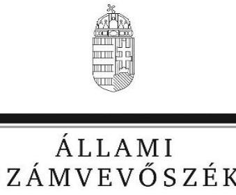
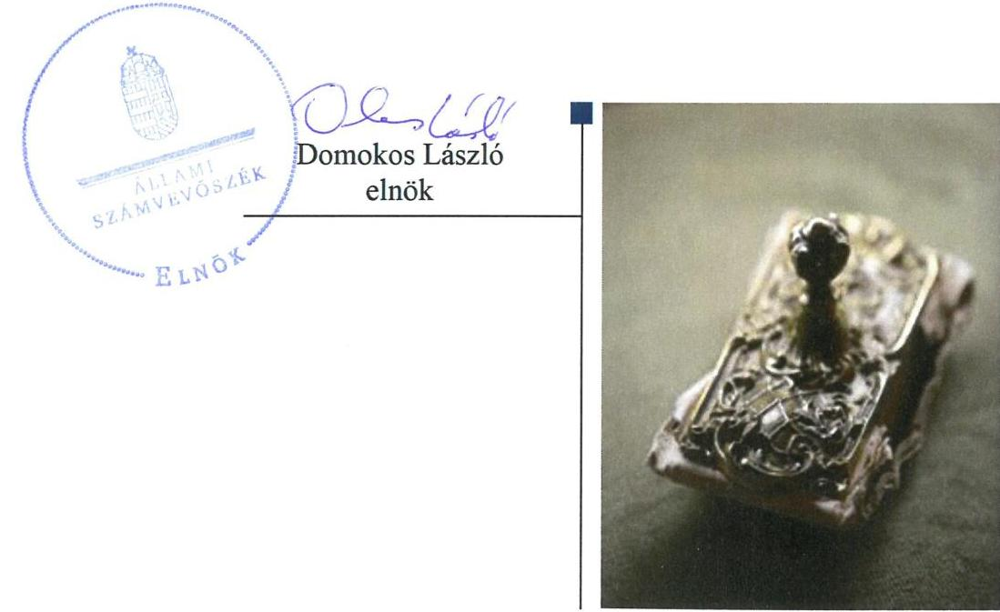
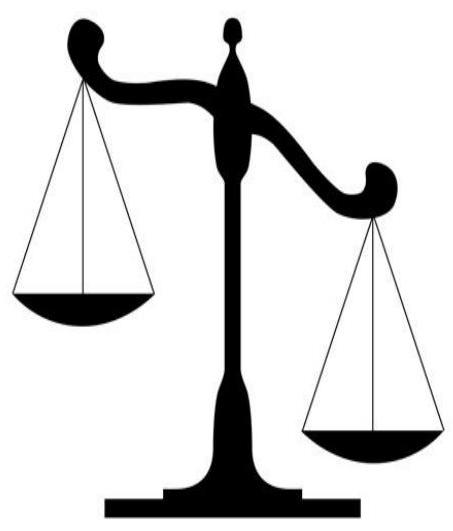
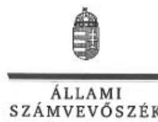
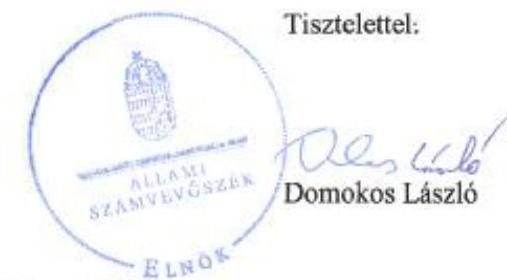
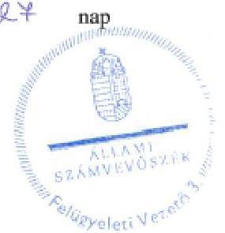
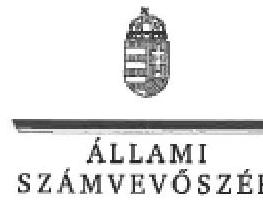
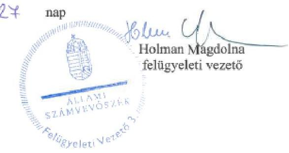

# Jelentés

A költségvetési támogatásban részesülő pártalapítványok 2015–2016. évi gazdálkodása törvényességének ellenőrzése

Ökopolisz Alapítvány 2018.

18217 www.asz.hu

---

# Jelentés 

## A költségvetési támogatásban részesülő pártalapítványok 2015-2016. évi gazdálkodása törvényességének ellenőrzése

Ökopolisz Alapítvány
2018. OP. hó 30. nap

---

# AZ ELLENŐRZÉST FELÜGYELTE:

- **HOLMAN MAGDOLNA JULIANNA** felügyeleti vezető
- **AZ ELLENŐRZÉST VEZETTE ÉS A VÉGREHAJTÁSÁÉRT FELELŐS:**
  - **DR. GYŐRI GABRIELLA** ellenőrzésvezető
- **A PROGRAM ÖSSZEÁLLÍTÁSÁÉRT FELELŐS:**
  - **TÓTPÁL SZABOLCS** osztályvezető

**IKTATÓSZÁM:** EL-1080-001/2018

**TÉMASZÁM:** 2465

**ELLENŐRZÉS-AZONOSÍTÓ SZÁM:** V081003

Jelentéseink az Országgyűlés számítógépes hálózatán és az Interneten a www.asz.hu címen is olvashatóak.

---

# TARTALOMJEGYZÉK 

■ ÖSSZEGZÉS ..... 5
■ AZ ELLENŐRZÉS CÉLJA ..... 7
■ AZ ELLENŐRZÉS TERÜLETE ..... 8
■ AZ ELLENŐRZÉS HÁTTERE, INDOKOLTSÁGA ..... 9
■ A JELENTÉS LÉNYEGES KÉRDÉSKÖREI ..... 10
■ AZ ELLENŐRZÉS HATÓKÖRE ÉS MÓDSZEREI ..... 11
■ MEGÁLLAPÍTÁSOK ..... 14
■ JAVASLATOK ..... 18
■ MELLÉKLETEK ..... 21
I. sz. melléklet: Értelmező szótár ..... 21
II. sz. melléklet: A 16119 számú számvevőszéki jelentéshez kapcsolódó intézkedési terv végrehajtásának értékelése ..... 22
■ FÜGGELÉK: ÉSZREVÉTELEK ..... 23
■ RÖVIDÍTÉSEK JEGYZÉKE ..... 39

---

.

---

# ÖSSZEGZÉS 

Az Ökopolisz Alapítvány a szabályszerű gazdálkodás feltételeit nem teremtette meg. A könyvvezetés és a gazdálkodás során a jogszabályi előírásokat 2015-2016-ban nem tartotta be. A 2015-2016. évi tevékenységéről szóló jelentéseket és a számviteli beszámolókat nem a jogszabályi előírások betartásával készítette el. A kapott támogatások vonatkozásában a közzétételi kötelezettséget nem teljesítette, ezáltal nem biztosította az átláthatóságot. Az intézkedési tervben foglalt feladatokat többségében nem hajtotta végre.

## Az ellenőrzés társadalmi indokoltsága

A politikai kultúra fejlesztése érdekében tudományos, ismeretterjesztő, kutatási, oktatási tevékenység folytatása céljából a pártok költségvetési támogatásra jogosult alapítványt hozhatnak létre. Jogszabályi előírások alapján a pártalapítványok gazdálkodása törvényességének ellenőrzésére az Állami Számvevőszék jogosult, ezért kétévente ellenőrzi a költségvetésből támogatásban részesülő pártalapítványoknak a gazdálkodását.

Az Állami Számvevőszék stratégiájában megfogalmazta, hogy az államháztartáson kívülre nyújtott költségvetési támogatások és az ingyenes vagyonjuttatás ellenőrzésével hozzájárul ahhoz, hogy a közpénzeket a civil szervezetek is átlátható módon használják fel. A pártalapítványok gazdálkodása szabályszerűségének bemutatásával az ellenőrzés értékteremtő módon járul hozzá az Állami Számvevőszék stratégiai céljainak megvalósításához, a nyilvánosság megfelelő tájékoztatásához.

## Főbb megállapítások, következtetések, javaslatok

Az Ökopolisz Alapítvány a törvény által előírt gazdálkodási tárgyú szabályzatok elkészítési kötelezettségének nem tett eleget.

A támogatások közzététele és elszámolása során az Ökopolisz Alapítvány nem tartotta be a jogszabályi előírásokat. A 2015-2016. éveket érintően, mindösszesen 4 537 075 Ft összegű külföldről származó támogatás közzététele során nem tartotta be a törvényi előírásokat.

A ráfordítások elszámolása nem volt szabályszerű, mert a Számviteli törvény és a belső szabályozás előírása ellenére az utalványozást, illetve a végrehajtás igazolását nem végezték el.

Az Ökopolisz Alapítvány a 2015-2016. évi tevékenységről szóló jelentéseket és a számviteli beszámolókat nem szabályszerűen készítette el. Az Ökopolisz Alapítvány a közzétételi kötelezettségének az éves jelentések és a számviteli beszámolók tekintetében a jogszabályi előírások szerinti határidőben eleget tett.

Az Ökopolisz Alapítvány a 2013-2014. évi gazdálkodás törvényességének ellenőrzéséről készült számvevőszéki jelentésben foglalt megállapításokkal összhangban készített intézkedési tervében meghatározott feladatokat többségében nem hajtotta végre.

A feltárt hiányosságok megszüntetése érdekében az Állami Számvevőszék az Ökopolisz Alapítvány Kuratóriuma elnökének hét javaslatot fogalmazott meg.

Következtetés:
A Jelentés 2.1. számú megállapításában foglaltak szerint a Pártalapítvány a 2015-2016. években nem tartotta be a Pártalapítványi tv. 3. § (4) bekezdés b) pontjában foglaltakat. A Pártalapítvány a Pártalapítványi tv. 3. § (4) bekezdés b) pontjában meghatározott összeghatárt meghaladó, külföldről származó támogatásokat fogadott el a Pártalapítványi tv. 3. § (3) bekezdésében foglalt előírásoknak megfelelően. Az így elfogadott támogatás összege az ellenőrzött időszakban összesen 4 537 075 Ft értékű volt. A támogatásokat nyújtó személy azonosításához szükséges adatokat és a támogatás összegéből 2015. évben 1 101 616 Ft-ot, 2016. évben 3 435 459 Ft-ot a Pártalapítványi tv. 3. § (4) bekezdés előírásának ellenére - a támogatás beérkezést követő 30 napon belül a Pártalapítvány honlapján - nem 

tette közzé. A Pártalapítványi tv. 3. § (5) bekezdésének előírása alapján a (3)-(4) bekezdés rendelkezéseinek megsértésével elfogadott támogatást - az Állami Számvevőszék felhívására - 15 napon belül a központi költségvetésnek be kell fizetni. A központi költségvetésnek befizetendő 4 537 075 Ft befizetéséről szóló felhívást az Ökopolisz Alapítvány részére az Állami Számvevőszék megküldte, és erről a Magyar Államkincstárt értesítette.

---

# AZ ELLENŐRZÉS CÉLJA 

Az ellenőrzés célja annak megállapítása volt, hogy a pártalapítvány törvényesen gazdálkodott-e, az éves számviteli beszámolók és a pártalapítvány tevékenységéről szóló éves jelentések a jogszabályi előírásoknak megfeleltek-e, a könyvvezetés és gazdálkodás során a vonatkozó jogszabályi rendelkezéseket, belső előírásokat betartották-e. Továbbá az ellenőrzés célja annak értékelése volt, hogy az előző számvevőszéki jelentésben foglalt intézkedést igénylő megállapításokkal összhangban készített intézkedési tervben meghatározott feladatokat az ellenőrzött szervezet végrehajtotta-e.

---

# AZ ELLENŐRZÉS TERÜLETE 

## Ökopolisz Alapítvány

Az ellenőrzés a Párt tv. ${ }^{1}$ alapján a politikai kultúra fejlesztése érdekében tudományos, ismeretterjesztő, kutatási, oktatási tevékenység folytatása céljából, a Ptk. ${ }^{2}$ szerinti létesítő/alapító okiraton alapuló bírósági nyilvántartásba vétellel létrejött pártalapítványok gazdálkodására terjedt ki. A pártalapítványok törvényes gazdálkodásának (könyvvezetése, beszámolása, jelentéstétele) szabályait alapvetően a Pártalapítványi tv. ${ }^{3}$-en túl a Számv. tv. ${ }^{4}$ és annak a végrehajtási rendelete, a Számviteli vhr. ${ }^{5}$ határozták meg.

A Lehet Más a Politika párt - a Párt tv.-ben és a Pártalapítványi tv.-ben biztosított lehetőséggel élve - 2010-ben határozatlan időtartamra hozta létre az Ökopolisz Alapítványt. A Pártalapítványt ${ }^{6}$ a Tatabányai Törvényszék 11-01-0001000 nyilvántartási szám alatt vette nyilvántartásba. Az induló vagyon összegét az Alapító ${ }^{7}$ 0,5 M Ft-ban határozta meg, ami az ellenőrzött időszakban nem változott.
A Pártalapítvány alapító okirata ${ }^{8}$ szerinti célja az állampolgári tájékoztatás javítása, a politikai kultúra fejlesztése, kiemelten az ökopolitikai gondolkodásmód elterjesztése, az ökopolitikai alternatívák megfogalmazása, valamint az ökopolitika képviseletének elősegítése a fenntarthatóság, a közügyekben való állampolgári részvétel és az igazságosság széleskörű népszerűsítése révén.

A Pártalapítvány az ellenőrzött időszakban évente 67,6 M Ft költségvetési támogatásban részesült. A Pártalapítvány az ellenőrzött időszakban gazdasági-vállalkozási tevékenységet nem végzett, gazdasági társaságban részesedése nem volt. A Pártalapítvány vagyonkezelt, vagy ingyenesen jutatott állami, önkormányzati vagyonnal nem rendelkezett. A Pártalapítvány beszámolási kötelezettségét egyszerűsített éves beszámoló készítésével teljesítette, amelyet - a Pártalapítvány döntése alapján - könyvvizsgálattal hitelesített.

A Pártalapítvány az ellenőrzött időszakban nem volt korlátlan felelősségű tagja más jogalanynak, nem létesített alapítványt és nem csatlakozott alapítványhoz. A Pártalapítványnál az ellenőrzött időszakban külső ellenőrzés lefolytatására nem került sor.

---

# AZ ELLENŐRZÉS HÁTTERE, INDOKOLTSÁGA 

Társadalmi elvárás a közpénzek értékelvű, rendeltetésszerű felhasználása, a közpénzekből nyújtott támogatások átláthatóságának megteremtése, amelyhez az ÁSZ ${ }^{9}$ az államháztartásból nyújtott támogatások ellenőrzésével kíván hozzájárulni. A Párt tv. 9/A § (1) bekezdése alapján a politikai kultúra fejlesztése érdekében tudományos, ismeretterjesztő, kutatási, oktatási tevékenység folytatása céljából létrehozott pártalapítványok gazdálkodása törvényességének ellenőrzése - a Pártalapítványi tv. 4. § (2) bekezdése értelmében - az ÁSZ feladata. E törvényi 4. § (4) bekezdése alapján az ÁSZ kétévente - kötelező jelleggel - ellenőrzi azoknak a pártalapítványoknak a gazdálkodását, amelyek költségvetési támogatásban részesültek.

Az ÁSZ, mint az Országgyűlés ellenőrző szerve a pártalapítványok gazdálkodása törvényességének/szabályszerűségének értékelésével hozzájárul ahhoz, hogy a társadalom objektív képet alkothasson a pártalapítványok működéséről. Az ellenőrzés eredményeinek célzott felhasználói a nyilvánosság, a jogalkotó, továbbá a pártalapítványok esetén azok alapítója és szervei. A jelentésben foglalt megállapítások, következtetések és javaslatok alapján a törvényalkotók konkrét lépéseket tehetnek a pártalapítványokra vonatkozó szabályozások megváltoztatása, átláthatóbbá, ellenőrizhetőbbé tétele irányába. Az ellenőrzött szervezetek szintjén a hiányosságok, szabálytalanságok feltárása, az ennek kapcsán megfogalmazott megállapítások elősegíthetik a pártalapítványok szabályszerű gazdálkodását.

Az ÁSZ tv. ${ }^{10}$ 33. § (1) bekezdése értelmében a számvevőszéki jelentések intézkedést igénylő megállapításaihoz és javaslataihoz kapcsolódóan az ellenőrzött szervezet vezetője intézkedési tervet köteles összeállítani, és az ÁSZ részére megküldeni. Az intézkedési tervben foglaltak megvalósítását az ÁSZ törvény 33. § (7) bekezdésében foglaltak alapján - az ÁSZ utóellenőrzés keretében - ellenőrizheti. Az utóellenőrzések keretében - az intézkedések értékelése során - az ÁSZ figyelembe veszi az ellenőrzött szervezetek működési feltételeiben, valamint a jogszabályi előírásokban bekövetkezett változásokat. Az ÁSZ az utóellenőrzés során értékeli, hogy az érintett számvevőszéki jelentésben foglalt intézkedést igénylő megállapításokkal és javaslatokkal összhangban, az ellenőrzött szervezet által készített intézkedési tervben meghatározott feladatokat a feladatra kijelöltek végrehajtották-e. Az intézkedések végrehajtásával az adott terület szabályszerű működése vonatkozásában a kockázatok csökkenhetnek, azonban hosszabb távon az intézkedési tervben foglaltak végrehajtásával önmagában nem szűnnek meg, csak akkor, ha beépülnek az ellenőrzött szervezet működésébe, azokat folyamatosan karban tartják, figyelembe véve, illetve kezelve a változásokat. Emellett az intézkedések végrehajtásáig újabb kockázatok merülhetnek fel a szabályszerű működés vonatkozásában, amelyek kezelése szintén kiemelten fontos az ellenőrzött szervezet számára.

---

# A JELENTÉS LÉNYEGES KÉRDÉSKÖREI 

1. Az Ökopolisz Alapítvány gazdálkodásának törvényessége biztosított volt-e?
2. Az Ökopolisz Alapítvány könyvvezetése és gazdálkodása során a vonatkozó jogszabályi rendelkezéseket és belső előírásokat betartották-e?
3. Az Ökopolisz Alapítvány tevékenységéről szóló éves jelentések, az éves számviteli beszámolók a jogszabályi előírásoknak megfeleltek-e?
4. Az Ökopolisz Alapítvány a számvevőszéki jelentésben foglalt intézkedést igénylő megállapításokkal összhangban készített intézkedési tervben meghatározott feladatokat végrehajtotta-e?

---

# AZ ELLENŐRZÉS HATÓKÖRE ÉS MÓDSZEREI 

## Az ellenőrzés típusa

Szabályszerűségi ellenőrzés.

## Az ellenőrzött időszak

2015. január 1. - 2016. december 31.

Az utóellenőrzés tekintetében a 16119¹¹ számú ÁSZ jelentés közzétételének napjától (2016. szeptember 22.) jelen ellenőrzésről szóló kiértesítő levél keltének (2017. december 1.) napjáig tartó időszak.

## Az ellenőrzés tárgya

Az ellenőrzés tárgyát képezte a pártalapítvány gazdálkodása, a könyvvezetés szabályozása és gyakorlata szabályszerűsége, az éves számviteli beszámolókra és az alapítvány tevékenységéről szóló éves jelentésekre vonatkozó kötelezettség teljesítése, valamint a gazdálkodáshoz kapcsolódó ellenőrzések javaslatainak hasznosítására irányuló tevékenység.

Az ÁSZ tv. 2011. július 1-jei hatálybalépését követően a számvevőszéki jelentésben foglalt intézkedést igénylő megállapításokkal és javaslatokkal összhangban - az ellenőrzött szervezet által - készített intézkedési tervben foglaltak végrehajtásának ellenőrzése. Az utóellenőrzéssel érintett intézkedések végrehajtása elmaradásának következtében továbbra is fennálló szabálytalanságok értékelése a közpénzek, közvagyon veszélyeztetettségi kockázata valószínűsített hatására vonatkozóan. Az ellenőrzés kiterjedt minden olyan körülményre és adatra, amely az ÁSZ jogszabályban meghatározott feladatainak teljesítéséhez, valamint a program végrehajtása folyamán felmerült újabb összefüggések feltárásához szükséges volt.

## Az ellenőrzött szervezet

Ökopolisz Alapítvány

## Az ellenőrzés jogalapja

Az Alaptörvény ${ }^{12}$ 43. cikk (1) bekezdése, ÁSZ tv. 1. § (3) bekezdése, 5. § (3) bekezdése, 33. § (1)-(2) és (7) bekezdései, a Pártalapítványi tv. 4. § (2) és (4) bekezdései.

---

# Az ellenőrzés módszerei 

Az ellenőrzést az ÁSZ az Ellenőrzési program szempontjai, az ellenőrzött időszakban hatályos jogszabályok, a jelen ellenőrzésre irányadó ÁSZ módszertan figyelembe vételével végezte.

A pártalapítvány tevékenységéről szóló éves jelentési-, beszámoló- és közzétételi kötelezettséget a 2014. évben létrehozott alapítványok esetében a 2014. év tekintetében is ellenőrizte az ÁSZ. A 2014. évben alapított pártalapítványok esetében az alapítás szabályszerűségét is értékelte.

Az ellenőrzés ideje alatt az ellenőrzött
 szervezettel történő kapcsolattartás az ÁSZ SZMSZ ¹³-ának vonatkozó előírásai alapján történt.

Az ellenőrzési kérdések megválaszolásához szükséges bizonyítékok megszerzése az ellenőrzött által rendelkezésre bocsátott dokumentumokra, adatokra alapozva megfigyelés, szemle (szemrevételezés), kérdésfeltevés (információkérés), mintavételezés, valamint elemző eljárás útján történt. A mintavételezés véletlen mintavételi eljárással történt.

Az ellenőrzési bizonyítékként felhasználható adatforrások közé tartoztak egyrészt az Ellenőrzési program részletes szempontjainál felsorolt adatforrások, másrészt minden egyéb - az ellenőrzés folyamán - feltárt, az ellenőrzés szempontjából információt tartalmazó dokumentum.

Az ellenőrzés lefolytatásához az ellenőrzött a tanúsítványok elektronikus kitöltésével, valamint az ÁSZ által kért dokumentumok elektronikus megküldésével szolgáltatott adatokat. Az így rendelkezésre bocsátott adatok, információk, a tanúsítványok adatai valódiságának kontrollja az ellenőrzés keretében történt.

Az utóellenőrzés megállapításait az ÁSZ rendelkezésére álló dokumentumok, valamint az ÁSZ adatbekérésére szerint, az ellenőrzött szervezet által elektronikusan rendelkezésre bocsátott dokumentumok, adatok alapján kellett megfogalmazni. Az utóellenőrzés esetében az intézkedési tervekben előírt feladatokat, azok végrehajthatósága, illetve végrehajtása szempontjából az alábbiak szerint kellett értékelni:
„határidőben végrehajtott" a feladat, ha a teljesítés dokumentáltan, az intézkedési tervben előírt határidőben és tartalommal megtörtént;
„határidőn túl végrehajtott" a feladat, ha annak teljesítése az intézkedési tervben meghatározott módon, de az abban előírt határidőn túl történt meg;
„részben végrehajtott" a feladat, amelynek végrehajtása nem teljes körűen az intézkedési tervben előírt módon történt meg;
„nem végrehajtott" a feladat, ha a végrehajtás nem történt meg, vagy amennyiben a teljesítést/végrehajtást nem dokumentálták, dokumentumokkal nem tudták igazolni annak teljesítését;
„okafogyottá vált" a feladat, ha végrehajtására - meghatározott esemény bekövetkezése, továbbá külső körülmény, a működést érintő feltétel változása miatt - már nincs szükség, illetve lehetőség, és egyértelműen megállapítható, hogy az intézkedést szükségessé tevő körülmény a jövőben nem fordulhat elő;

---

$\qquad$ „nem időszerű" az a feladat, amelynek ellenőrzési időszakon belüli végrehajtására azért nem került (kerülhetett) sor, mert az intézkedés alapjául szolgáló esemény nem következett be, de annak jövőbeni előfordulása lehetséges, a végrehajtása nem volt esedékes, vagy a végrehajtás határideje még nem járt le.

---

# 1. Az Ökopolisz Alapítvány gazdálkodásának törvényessége biztosított volt-e? 

## Összegző megállapítás

1.1. számú megállapítás
1.2. számú megállapítás

A Pártalapítvány a szabályszerű gazdálkodás feltételeit nem alakította ki.

A Pártalapítvány szervezeti kereteinek kialakítása szabályszerű volt.

Az alapító okirat ¹⁻³ - a Ptk., a Párt tv. és a Pártalapítványi tv. rendelkezéseivel összhangban - rögzítette a Pártalapítvány célját, tevékenységét, az induló vagyont, a vagyon kezelésének és felhasználásának módját és szabályait, valamint rendelkezett az ügyvezető szerv (Kuratórium ¹⁴) és a Felügyelő Bizottság ¹⁵ hatásköréről és eljárási szabályairól.

A Kuratórium működésének részletes szabályait az ügyrend ¹⁻⁴-ben ¹⁶, a Kuratórium munkáját támogató munkaszervezet feladatait és eljárási szabályait az SZMSZ ¹,²-ben ¹⁷ rögzítették.

A Pártalapítvány a gazdálkodására vonatkozó belső szabályozás kialakítása során nem tartotta be a jogszabályi előírásokat.

A Pártalapítvány az ellenőrzött időszakban nem rendelkezett:
$\longrightarrow$ a Számv. 14. § (3)-(4) bekezdéseiben meghatározott számviteli politikával;
$\longrightarrow$ a Számv. tv. 14. § (5) bekezdés a)-b) és d) pontjaiban előírt eszközök és források leltárkészítési és leltározási szabályzatával, eszközök és források értékelési szabályzatával, pénzkezelési szabályzattal;
$\longrightarrow$ a Számv. tv. 161. § (1) bekezdésében meghatározott számlarenddel.
Az előkészített dokumentumokat a Számv. tv. 14. § (12) bekezdésében, a Számv. tv. 161. § (4) bekezdésében és az SZMSZ ¹ V.1.4. pontjában foglaltak ellenére a Kuratórium nem hagyta jóvá.

A Pártalapítvány a 2015-2016. években nem alakította ki - az Info. tv. ¹⁸ 7. § (2) bekezdésének előírása ellenére - azokat az eljárási szabályokat, amelyek az Info tv., valamint az egyéb adat- és titokvédelmi szabályok érvényre juttatásához szükségesek.

---

# 2. Az Ökopolisz Alapítvány könyvvezetése és gazdálkodása során a vonatkozó jogszabályi rendelkezéseket és belső előírásokat betartották-e? 

Összegző megállapítás

2.1. számú megállapítás

A Pártalapítvány könyvvezetése és gazdálkodása során nem tartotta be a jogszabályi rendelkezéseket és belső előírásokat.

A Pártalapítvány az elfogadott támogatásokat nem szabályszerűen tette közzé és számolta el az ellenőrzött időszakban.

A Pártalapítvány a 2015-2016. években nem tartotta be a Pártalapítványi tv. 3. § (4) bekezdés b) pontjában foglaltakat. A Pártalapítvány a Pártalapítványi tv. 3. § (4) bekezdés b) pontjában meghatározott összeghatárt meghaladó, külföldről származó támogatásokat fogadott el a Pártalapítványi tv. 3. § (3) bekezdésében foglalt előírásoknak megfelelően. Az így elfogadott támogatás összege az ellenőrzött időszakban összesen 4537075 Ft értékű volt. A támogatásokat nyújtó személy azonosításához szükséges adatokat és a támogatás összegéből 2015. évben 1101616 Ft-ot, 2016. évben 3435459 Ft-ot a Pártalapítványi tv. 3. § (4) bekezdés előírásának ellenére - a támogatás beérkezést követő 30 napon belül a Pártalapítvány honlapján - nem tette közzé.

A Pártalapítvány a kapott költségvetési és egyéb támogatások elszámolása során a 2015-2016. évi beszámoló adatait a Számv. tv. 159. § és 161/A. § (2) bekezdésében, továbbá a Számviteli vhr. ¹ 17. § (8) bekezdésében foglalt követelményeket tartalmazó könyvvezetéssel (főkönyvi nyilvántartás) nem támasztotta alá.

## 2.2. számú megállapítás

A Pártalapítvány a ráfordításainak elszámolása során az ellenőrzött időszakban nem tartotta be a jogszabályi előírásokat.

A ráfordítások elszámolása 2015-2016-ban nem volt szabályszerű, mert:
2015-2016-ban a Számv. tv. 167. § (1) bekezdés c) pontjában, valamint az SZMSZ ¹ VI./5. pont 10. francia bekezdésében és a VI./7. pont 22. oldal 3. bekezdésében foglaltak ellenére az utalványozást és a végrehajtás igazolását nem végezték el;
a ráfordításokat 2015-ben a Számv. tv. 16. § (3) bekezdésében foglalt „a tartalom elsődlegessége a formával szemben" számviteli alapelv ellenére nem a tényleges gazdasági tartalmuknak megfelelően vették nyilvántartásba;
a Számv. tv. 165. § (1)-(2) bekezdéseinek előírása ellenére 2015-2016-ban a könyvviteli nyilvántartásban bizonylat nélkül rögzítettek gazdasági eseményeket.
A Pártalapítvány az ellenőrzött időszakban összesen 2,7 M Ft összegben nyújtott támogatást harmadik fél részére. A cél szerinti támogatások elbírálása és a támogatási szerződések megkötése során a Pártalapítvány betartotta az SZMSZ ¹ előírásait, a kifizetéseket során azonban - a Számv. tv. 167. § (1) bekezdés c) pontjában foglalt - utalványozást az SZMSZ ¹ VI./5. pont 10. francia bekezdésében foglaltak ellenére nem végezte el.

---

A Pártalapítvány a Párt tv. rendelkezéseit betartva az alapító párt részére vagyoni hozzájárulást nem nyújtott.

# 3. Az Ökopolisz Alapítvány tevékenységéről szóló éves jelentések, az éves számviteli beszámolók a jogszabályi előírásoknak megfeleltek-e? 

## Összegző megállapítás

A Pártalapítvány a 2015-2016. években a könyvvezetési rendszer továbbrészletezési kötelezettségének nem tett eleget, továbbá a beszámolóit leltárral nem támasztotta alá. A hiányosságok miatt a 2015-2016. évi számviteli beszámolók és a tevékenységről szóló éves jelentések nem voltak szabályszerűek.

A Pártalapítvány az ellenőrzött időszakban a Számv. tv. 161/A. § (2) bekezdésében és a Számviteli vhr.: 17. § (8) bekezdésében előírt nyilvántartási (könyvvezetési) rendszer kialakítási, továbbrészletezési kötelezettségének nem tett eleget. Emiatt az éves jelentés készítése során a Pártalapítvány nem biztosította a Pártalapítványi tv. 3/A. § (3) bekezdés b) pontjában előírt költségvetési támogatások felhasználására vonatkozó kimutatás és az abban szereplő összegek felhasználása átláthatóságát, ellenőrizhetőségét.

A Pártalapítvány a tevékenységéről szóló 2015. és 2016. évi éves jelentéseket a Kuratórium határidőben jóváhagyta és gondoskodott közzétételükről a Magyar Közlöny mellékleteként megjelenő Hivatalos Értesítőben, továbbá az éves jelentéseket a Pártalapítvány a honlapján is közzétette.

A számviteli beszámolók mérlegtételeinek besorolása, év végi értékelése és leltárral való alátámasztása 2015-2016-ban nem volt szabályszerű.
$\longrightarrow$ A Pártalapítvány a 2015. évben a Számv. tv. 16. § (2) és 32. § (1) bekezdéseiben foglaltak ellenére 0,8 MFt kiszámlázott, de csak a tárgyévet követően esedékes bevételt nem az aktív időbeli elhatárolások között mutatott ki, ami miatt a követelések év végi értékelése nem volt szabályszerű.
$\longrightarrow$ A 2015. évben a pénzeszközöket és a rövid lejáratú kötelezettségeket érintő gazdasági eseményeket a Számv. tv. 16. § (1) bekezdésében foglaltak ellenére nem egyedileg, hanem egy összegben számolták el.
$\longrightarrow$ A Pártalapítvány az ellenőrzött időszakban az alaptevékenységből származó, kiszámlázott bevételeket a Számv. tv. 72. § (2) bekezdés a) pontjában foglaltak ellenére az egyéb bevételek között mutatta ki.
$\longrightarrow$ A Pártalapítvány a 2015-2016. évi beszámolók adatait - a Számv. tv. 69. § (1) bekezdésében foglaltak ellenére - nem támasztotta alá leltárral. Az elkülönített betétszámlák esetében az egyes lekötésekről, szerződésenként 2015-2016-ban analitikus nyilvántartást nem vezettek. 2015-2016-ban a Számv. tv. 159. §-ában, 161. § (3) és 165. § (4) bekezdéseiben előírtak nem érvényesültek, mert a Pártalapítvány az analitikus nyilvántartások vezetéséről nem

---

gondoskodott, emiatt a Számv. tv. 69. § (2) bekezdésében foglaltakat nem tartotta be.
A Kuratórium - az ellenőrzött időszakban - a számviteli beszámolókat jóváhagyta. A beszámolók közzétételére a Számviteli vhr. 1 szerinti határidőben került sor.

# 4. Az Ökopolisz Alapítvány a számvevőszéki jelentésben foglalt intézkedést igénylő megállapításokkal összhangban készített intézkedési tervben meghatározott feladatokat végrehajtotta-e? 

Összegző megállapítás

A Pártalapítvány a korábbi számvevőszéki jelentésben foglalt intézkedést igénylő megállapításokkal összhangban készített intézkedési tervben meghatározott feladatokat többségében nem hajtotta végre.

A 16119 számú számvevőszéki jelentésben megfogalmazott intézkedést igénylő megállapításokkal összhangban a Kuratórium - az ÁSZ tv.-ben rögzített határidőben - hat pontból álló intézkedési tervet készített, azt az ÁSZ részére megküldte, amelyet az ÁSZ elnöke elfogadott. Az intézkedési tervben vállalt hat intézkedésből egyet határidőben, kettőt határidőn túl hajtott végre, három feladat végrehajtása nem történt meg.

Határidőben megvalósult intézkedés:
A Pártalapítvány az éves jelentést a Pártalapítványi tv.-ben előírt határidőben tette közzé.
Határidőn túl végrehajtott feladatok:

- A Pártalapítvány a könyvviteli szolgáltatást végző társaság felszólítását a Számv. tv. előírásainak betartására
a) az időbeli elhatárolások elszámolása és
b) a számlarend tartalmára vonatkozóan határidőn túl hajtotta végre.

Nem végrehajtott feladatok:

- A költségvetési terv 350/2011. (XII. 30.) Korm. rendeletben ¹⁹ előírtak szerinti elkészítésére irányuló feladatot a Pártalapítvány nem hajtotta végre.
- A Pártalapítvány a saját dolgozója részére meghatározott ellenőrzési feladatot - az időbeli elhatárolások Számv. tv. szerinti végrehajtására vonatkozóan - nem hajtotta végre.
- A Pártalapítvány a saját dolgozója részére meghatározott ellenőrzési feladatot, mely szerint a főkönyvi kivonat csak a számlarendben megtalálható főkönyvi számlákat tartalmazza, a Pártalapítvány nem hajtotta végre.
Az intézkedési tervben meghatározott feladatokat, határidőket, felelősöket és a feladatok végrehajtását a II. számú melléklet mutatja be.

---

# JAVASLATOK 

Az ÁSZ tv. 33. § (1) bekezdésében foglaltak értelmében az ellenőrzött szervezet vezetője köteles a jelentésben foglalt megállapításokhoz kapcsolódó intézkedési tervet összeállítani és azt a jelentés kézhezvételétől számított 30 napon belül az ÁSZ részére megküldeni. Amennyiben az ellenőrzött szervezet vezetője nem küldi meg határidőben az intézkedési tervet, vagy továbbra sem elfogadható intézkedési tervet küld, az Állami Számvevőszék elnöke az ÁSZ tv. 33. § (3) bekezdés a) és b) pontjaiban foglaltakat érvényesítheti.

## Az Ökopolisz Alapítvány Kuratóriuma elnökének

1. Intézkedjen a Számv. tv.-ben előírt számviteli politika és annak keretében elkészítendő szabályzatok, valamint a számlarend törvényi előírás szerinti elkészítésére.
(1.2. sz. megállapítás 1. bekezdése alapján)
2. Intézkedjen az Info tv.-ben
 előírták érvényre juttatásához szükséges eljárási szabályok kialakítására.
(1.2. sz. megállapítás 3. bekezdése alapján)
3. Intézkedjen a kapott támogatások tekintetében a Pártalapítványi tv. szerinti közzétételi kötelezettség teljesítésére.
(2.1. sz. megállapítás 1. bekezdése alapján)
4. Intézkedjen a Számv. tv. által előírt olyan könyvviteli nyilvántartás vezetéséről, amely az eszközökben és a forrásokban bekövetkezett változásokat a valóságnak megfelelően, folyamatosan, zárt rendszerben, áttekinthetően mutatja.
(2.1. sz. megállapítás 2. bekezdése alapján)
5. Intézkedjen a ráfordítások elszámolása során a Számv. tv. előírásainak betartására.
(2.2. sz. megállapítás 1. és 2. bekezdése alapján)
6. Intézkedjen a Számviteli vhr.-ben előírt olyan nyilvántartási rendszer kialakítására, amely biztosítja, hogy a közpénzek felhasználásával kapcsolatos információk rendelkezésre álljanak.
(3. sz. összegző megállapítás 1. bekezdése alapján)

---

7. Intézkedjen a könyvek üzleti év végi zárásához, a beszámoló elkészítéséhez, a mérleg tételeinek alátámasztásához a Számv. tv. által előírt leltár összeállítására, a Számv. tv. által előírt beszámoló törvényi előírás szerinti elkészítésére.
(3. sz. összegző megállapítás 3. bekezdése alapján)

---

.

---

# MELLÉKLETEK 

## I. SZ. MELLÉKLET: ÉRTELMEZŐ SZÓTÁR

alapítvány
gazdálkodó tevékenység
gazdasági-vállalkozási tevékenység
költségvetésből juttatott/nyújtott forrás/támogatás
pártalapítvány

Az alapítvány az alapító által az alapító okiratban meghatározott tartós cél folyamatos megvalósítására létrehozott jogi személy. Az alapító az alapító okiratban meghatározza az alapítványnak juttatott vagyont és az alapítvány szervezetét. Alapítvány nem alapítható gazdasági-vállalkozási tevékenység folytatására. Az alapítvány az alapítványi cél megvalósításával közvetlenül összefüggő gazdasági tevékenység végzésére jogosult. Alapítvány nem lehet korlátlan felelősségű tagja más jogalanynak, nem létesíthet alapítványt és nem csatlakozhat alapítványhoz. (Forrás: Ptk. 3:378. §, 3:379. § (1) - (3) bekezdés)
azon tevékenységek összessége, amelyek a civil szervezet vagyoni, pénzügyi, jövedelmi helyzetére kiható gazdasági eseményt eredményeznek. (Forrás: Ectv. 2. § 10. pont.)
A jövedelem- és vagyonszerzésre irányuló vagy azt eredményező, üzletszerűen végzett gazdasági tevékenység, kivéve az adomány (ajándék) elfogadását, a létesítő okiratban meghatározott cél szerinti tevékenységet (ideértve a közhasznú tevékenységet is), - 2015. november 28-tól - a pénzeszközök betétbe, értékpapírba, társasági részesedésbe történő elhelyezését és az ingatlan megszerzését, használatának átengedését és átruházását. (Forrás: Ectv. 2. § 11. pont.)
a pártalapítványoknak a Párt tv. 9/A. § (1) bekezdése és a Pártalapítványi tv. 1. § előírásainak értelmében, az éves költségvetési törvények szerint-jellemzően az 1. számú melléklet 1. Országgyűlés fejezet 9. Pártalapítványok támogatás címen - az állami költségvetésből juttatott forrás/támogatás.
az államháztartás központi alrendszeréből - a Tb alap kivételével - ellenérték nélkül, pénzben nyújtott költségvetési támogatás (Forrás: Áht. 1. § 14. pont)
a politikai kultúra fejlesztése érdekében, tudományos, ismeretterjesztő, kutatási és oktatási tevékenység folytatása céljából pártok által létrehozott, külön jogszabályban - a Pártalapítványi tv. 1. § és 3. § (1) bekezdésében- meghatározott, jogi személynek minősülő egyéb szervezet (Forrás: Párt tv. 9/A. § (1) bekezdés, Pártalapítványi tv. 1. §, Számv. tv. 3. § (1) bekezdése 4. pont, Számviteli vhr.; 2. § (1) bekezdés k) pont, 4. § (1) bekezdés)

---

### *Mellékletek*

#### ▪ II. SZ. MELLÉKLET: A 16119 SZÁMÚ SZÁMVEVŐSZÉKI JELENTÉSHEZ KAPCSOLÓDÓ INTÉZKEDÉSI TERV VÉGREHAJTÁSÁNAK ÉRTÉKELÉSE

|  Ér | Intézkedési tervben meghatározott feladat | Az intézkedési tervben meghatározott határidő | Az intézkedési tervben meghatározott feladat felelőse | A feladat végrehajtása  |
| --- | --- | --- | --- | --- |
|  1. | Hátáridőben végrehajtott feladat |  |  |   |
|   | Az éves jelentést a Pártalapítványi tv.-ben meghatározott határidőn belül kell közzé tenni. | folyamatosan a tv.-ben rögzített időpontnak megfelelően | irodavezető | Az éves jelentést a Pártalapítványi tv. alapján a Pártalapítvány a tárgyévet követő évben június 30-áig a Magyar Közlöny mellékleteként megjelenő 2017/31. sz. Hivatalos Értesítőben és a saját honlapján közzétette.  |
|  2. | Hátáridőn túl végrehajtott feladatok |  |  |   |
|   | Az Ökopolisz Alapítvány írásban felszólítja a számviteli szolgáltatást végző Kft. ügyvezető igazgatóját, hogy a Számv. tv. előírásait munkájuk során tartsák be. a) időbeli elhatárolások elszámolására vonatkozó előírásait teljes körűen alkalmazzák a könyvelés során. | 2016. november 15. | a kuratórium társelnökei | A Pártalapítvány a számviteli szolgáltatást nyújtó társaság számára készített 2016. november 15-i keltezésű felszólító levelet az előírt határidőn túl, 2016. december 21-én küldte meg.  |
|  3. | b) A számlarend tartalmazza minden alkalmazásra kijelölt számla számjelét és megnevezését. A számlarend módosítását minden új főkönyvi számla megnyitása esetén a könyvelésnek el kell végezni. | 2016. november 15. | a kuratórium társelnökei | A Pártalapítvány a számviteli szolgáltatást nyújtó társaság számára készített 2016. november 15-i keltezésű felszólító levelet az előírt határidőn túl, 2016. december 21-én küldte meg.  |
|  4. | Nem végrehajtott feladatok |  |  |   |
|   | Az Ökopolisz Alapítvány költségvetési tervét a 350/2011. (XII. 31.) Korm. rendelet rendelkezésének megfelelően készíti el. | 2016. november 15. | irodavezető és a társelnökök egyike | A Pártalapítvány a feladat végrehajtása érdekében nem intézkedett.  |
|  5. | Az Ökopolisz Alapítvány pénzügyekért és gazdálkodásért felelős munkatársa folyamatosan ellenőrizni fogja, hogy a számviteli szolgáltatást végző vállalkozás a több évet érintő költségeket és bevételeket időbelileg elhatárolta-e. | folyamatosan | pénzügyekért és gazdálkodásért felelős munkatárs | A Pártalapítvány a feladatot nem hajtotta végre.  |
|  6. | Az Ökopolisz Alapítvány pénzügyekért és gazdálkodásért felelős munkatársa minden év zárásakor ellenőrizni fogja, hogy a főkönyvi kivonat csak a számlarendben megtalálható főkönyvi számlákat tartalmazza. | folyamatosan | pénzügyekért és gazdálkodásért felelős munkatárs | A Pártalapítvány a feladatot nem hajtotta végre.  |

---

# FÜGGELÉK: ÉSZREVÉTELEK 

A jelentéstervezetet a Számvevőszék 15 napos észrevételezésre megküldte az ellenőrzött szervezet vezetőjének az ÁSZ tv. 29. § (1) bekezdése előírásának megfelelően.

A függelék tartalmazza az ellenőrzött észrevételeit, illetve az el nem fogadott észrevételek elutasításának indoklását.

[^0]
[^0]:    * 29. § (1) Az Állami Számvevőszék az ellenőrzési megállapításait megküldi az ellenőrzött szervezet vezetőjének vagy az általa megbízott személynek, és annak, akinek személyes felelősségét állapította meg.
    (2) Az ellenőrzött szervezet vezetője és a felelősként megjelölt személy az ellenőrzés megállapításaira tizenöt napon belül írásban észrevételt tehet.
    (3) Az Állami Számvevőszék az észrevételre a beérkezésétől számított harminc napon belül írásban válaszol. A figyelembe nem vett észrevételeket köteles a jelentésben feltüntetni, és megindokolni, hogy azokat miért nem fogadta el.

---

# Ökopolisz 

## Holman Magdolna

felügyeleti vezető részére
Állami Számvevőszék

Tárgy: Észrevételek az EL-0562-019/2018. sz. jelentéstervezethez

## Tisztelt Felügyeleti Vezető Asszony!

Az Ökopolisz Alapítvány 2018. július 17-én vette át az EL-0562-019/2018. sz. levelükben küldött „A költségvetési támogatásban részesülő pártalapítványok 2015-2016. évi gazdálkodása törvényességének ellenőrzése - Ökopolisz Alapítvány" című jelentéstervezetüket, amelynek kapcsán az Állami Számvevőszékről szóló törvény értelmében, határidőn belül megtesszük alábbi észrevételeinket.

Fontosnak tartjuk kiemelni, hogy a számvevői jelentés konkrét bizonylatokra nem hivatkozik, ezáltal megállapításai nehezen beazonosíthatóak, így sajnos észrevételeinket is csak ehhez képest tudtuk megtenni. Ha a Számvevőszék korábbi gyakorlatát követné, konkrétabb hivatkozásokra konkrétabb választ tudnánk adni.

Összegzésképpen megállapítjuk, hogy a jelentéstervezet főbb megállapításai, következtetései, javaslatai nem adnak teljesen valós képet az Ökopolisz Alapítvány működéséről, gazdálkodásáról. Az alapítvány a könyvvezetésre és gazdálkodásra vonatkozó jogszabályokat betartotta, a számviteli beszámolókat a vonatkozó törvényi előírásoknak megfelelően készítette el és tette közzé, melyek szabályszerűségét a könyvvizsgálói jelentések is alátámasztják.

## Az Ökopolisz Alapítvány gazdálkodásának törvényessége:

Nem állja meg a helyét az a megállapítás mely szerint az alapítvány nem rendelkezett az előírt szabályzatokkal. Az alapítvány szabályzatait a számviteli törvény hivatkozott előírásai szerint készítette el. Véleményünk szerint nincs alapja annak a megállapításnak, hogy nem a Számv. tv. 14. § (12), valamint 161. § (4) bekezdéseinek megfelelően készültek a szabályzatok.

---

# Ökopolisz 

Az Ökopolisz alapítvány könyvvezetése és gazdálkodása során a vonatkozó jogszabályi rendelkezések és belső előírások betartása:

## Támogatások elszámolása:

A kapott támogatások vonatkozásában közzétételi, átláthatósági kötelezettségének az alapítvány 2015 és 2016 évben is határidőben eleget tett a honlapján, ezt természetesen szükség esetén bizonyítani is tudjuk.

Valótlan a Számv. 159. §.-ra és 161/A. § (2) bek.-re való hivatkozás tartalma is, mert az alapítvány könyvelésében, főkönyvi nyilvántartásában a költségvetési és egyéb támogatások elszámolása a hivatkozott törvényi előírások szerint az alábbi számlákra, elkülönítetten történt:

## 952 Központi költségvetéstől kapott támogatások

9521 Előző évi központi költségvetéstől kapott támogatások
9522 Tárgyévi központi költségvetéstől kapott támogatások

## 954 Egyéb kapott támogatások

A jelentésben megfogalmazott „számviteli vhr." és a mellette lévő 1-es index - pontos meghatározás nélküli - hiányosságot nem lehet értelmezni, mivel sem a hatályon kívül helyezett 224/2000. (XII. 19.) Az Egyéb szervezetek beszámoló készítési és könyvvezetési sajátosságairól szóló kormányrendeletnek, sem a helyébe lépett 479/2016. (XII. 28) számú kormányrendeletnek, sem a rövidítések jegyzékében 1-es index-el jelölt párttörvénynek 17. §. (8) bekezdése nincs.

## Ráfordítások elszámolása:

A ráfordítások elszámolása minden esetben a Számviteli törvény és az alapítvány belső szabályozása szerint, szabályszerűen történt. Nincs olyan törvényi előírás, mely az utalványozást, kifizetés engedélyezését külön bizonylat kiállításával tenné kötelezővé. Az alapítvány szabályzatainak megfelelően eleget tett utalványozási, kifizetések engedélyezését dokumentáló kötelezettségének.

A jelentés azon megállapítása, mely szerint nem érvényesítette az alapítvány „a tartalom elsődlegessége a formával szemben" alapelvet, konkrét számlára való hivatkozás nélkül nem értelmezhető. Az ellenőrzés ezen megállapítását abban az esetben tudnánk elfogadni vagy kifogásolni, ha a jelentés tartalmazná arra a dokumentumra való hivatkozást, amelyből a következtetés levonásra került. E nélkül a megállapítás véleményünk szerint alaptalan.

---

# Ökopolisz 

## a l a p í t v á n y

A számviteli törvény 165.§ (1) és (2) bekezdéseire való hivatkozás is alaptalan, hiszen a jelentés nem sorol fel konkrétumot a megállapítás alátámasztására. Nem történt alapbizonylat nélküli könyvelés sem 2015-ben, sem 2016-ban. Minden könyvelési tétel beazonosítható a számlák, bizonylatok alapján, mivel alapítványunk minden gazdasági eseményről megfelelő dokumentummal rendelkezik.

Az alapítvány könyvvizsgálója nem állapított meg ilyen hiányosságot, és ahogyan észrevételeink legelején kiemeltük, fontosnak tartanánk, hogy a Számvevőszék az általa megállapított hiányosságokat tételesen rögzítse, ezt a listát az ellenőrzött megismerhesse. Ennek hiányában nehéz érdemben észrevételt tennünk, illetve a későbbiek során intézkednünk.

## Éves jelentések, éves számviteli beszámolók:

A jelentésben leírt továbrészletezési kötelezettség nem értelmezhető, mert az alapítvány a törvényi előírásoknak megfelelően fentebb is leírtak szerint kellően részletezte bevételeit.

Nem értelmezhető a jelentés azon kifogása sem, melyben 0,8 millió Ft bevétel nem megfelelő elszámolásáról ír. Amennyiben jogos lenne ez a megállapítás, akkor azt konkrét dokumentumra, számlára való hivatkozással kellene megtenni, hogy az ellenőrzött számára is értelmezhető legyen.

A pénzeszközök és rövidlejáratú kötelezettségek egyösszegű elszámolásának kifogása sem értelmezhető konkrét gazdasági esemény nélkül. Az alapítvány törvényi előírások betartásával vezette könyveit, nem vont össze sem pénzeszközöket sem rövidlejáratú kötelezettségeket úgy, hogy az sértette volna
 a számviteli törvény előírásait. Konkrét bizonylati és könyvelési tételre történő hivatkozás nélkül ezen megállapítás is alaptalan elmarasztalást tartalmaz.

Az alapítvány alaptevékenységének bevételeit alapító okiratában foglaltak szerint számolta el. Az egyéb bevételbe elszámolt tételek nem tartoznak az alaptevékenység bevételei közé. Az ellenőrzés valószínűleg rosszul ítélte meg az alaptevékenység bevételeinek körét és az oda elszámolható tételeket. Konkrét hivatkozás esetén egyértelművé lehetne tenni a megállapítás helyességét vagy helytelen voltát, de a megállapítás így itt is minden hivatkozás nélküli.

Az alapítvány mind 2015-ben, mind 2016-ban analitikával támasztotta alá valamennyi mérlegsorát. Ezen analitikák leltárnak minősülnek anélkül is, hogy azokon a leltár kifejezés feltüntetésre kerülne. Pénztárleltár mindkét évben készült, de pl. a tárgyi eszközök, vevők és szállítók, követelések és kötelezettségek analitikája egyeztetve leltárnak minősül, de a jelentés itt sem tartalmaz konkrétumot. A pénzeszközök, így a bankszámlák tartalma is mindkét évben egyeztetésre került és ezt a benyújtott dokumentumok is tartalmazták. Az alapítvány beszámolóját könyvvizsgáló is hitelesítette.

---

# Ökopolisz 

## Intézkedési tervben meghatározott feladatok végrehajtása:

A saját dolgozónk munkája során nem talált intézkedésre okot adó körülményt, ezzel összefüggésben maradéktalanul teljesítve lettek az intézkedési tervben előírtak, mivel a számvevőszéki ellenőrzés nem kifogásolt a számlarend és a könyvelés között eltérést. Az időbeli elhatárolással kapcsolatos megállapításokat pedig azért nem tudjuk elfogadni, mert nem ismerjük a kifogásolt tételt.

Az ellenőrzés során megközelítőleg 500 tételt töltöttünk fel a Számvevőszék online rendszerébe. Jövőbeni munkánkat a legnagyobb mértékben az segítené, ha megismerhetnénk a jelentésben megfogalmazott megállapítások alátámasztásait.

Bízunk benne, hogy végleges jelentésük kialakításánál fenti észrevételeink figyelembe vételre kerülnek.

Budapest, 2018. július 31.

Tisztelettel,
ÖKOPOLISZ ALAPÍTVÁNY
1088 Budapest
Felsőerdősor u. 12-14. S. em. 3.
Adószám: 181580/4-1-42
Magnet. Bank: 1620010600081832

Lengyel Szilvia és Dr. Fülöp Sándor PhD
a kuratórium társelnökei

---

# Lengyel Szilvia úrhölgy 

Kuratórium elnöke
Ökopolisz Alapítvány

## Budapest

## Tisztelt Elnök Úrhölgy!

„A költségvetési támogatásban részesülő pártalapítványok 2015-2016. évi gazdálkodása törvényességének ellenőrzése - Ökopolisz Alapítvány" című számvevőszéki jelentéstervezetre tett észrevételét köszönettel megkaptam.

Az Állami Számvevőszék észrevételekre vonatkozó álláspontjáról a felügyeleti vezető által készített tájékoztatást csatoltan megküldöm.

Tájékoztatom Elnök úrhölgyet, hogy a jelentésben - az Állami Számvevőszékről szóló 2011. évi LXVI. törvény 29. § (3) bekezdése alapján - a figyelembe nem vett észrevételt szerepeltetjük az elutasítás indokának feltüntetésével együtt.

Budapest, 2018. 08 hó 24 nap

Melléklet: Tájékoztatás az el nem fogadott észrevételekről

---

# Tájékoztatás az el nem fogadott észrevételekről 

„A költségvetési támogatásban részesülő pártalapítványok 2015-2016. évi gazdálkodása törvényességének ellenőrzése - Ökopolisz Alapítvány" című számvevőszéki jelentéstervezetre tett észrevételét áttekintettük, annak kezeléséről az alábbi tájékoztatást adom.

1. Az Ökopolisz Alapítvány (továbbiakban: Pártalapítvány) általánosan és összegzésképpen tett észrevételeit, melyek a konkrét bizonylatokra való hivatkozás hiányára és a jelentéstervezet főbb megállapításaira, következtetéseire, javaslataira vonatkoznak nem fogadtam el. A jelentéstervezet „Az ellenőrzés módszerei" fejezete tartalmazta, hogy az ellenőrzési kérdések megválaszolásához szükséges bizonyítékok megszerzése az ellenőrzött által rendelkezésre bocsátott dokumentumokra, adatokra alapozva megfigyelés, szemle (szemrevételezés), kérdésfeltevés (információkérés), mintavételezés, valamint elemző eljárás útján történt. A mintavételezés véletlen mintavételi eljárással történt.
Az Állami Számvevőszék (ÁSZ) az általa bekért és a Pártalapítvány által rendelkezésre bocsátott, Teljességi és hitelességi nyilatkozattal alátámasztott dokumentumok alapján a statisztikai módszerek figyelembevételével elvégzett kiértékelés eredményeként tette meg a jelentéstervezetben rögzített megállapításokat, vonta le a következtetéseket és tette meg javaslatait. A „Főbb megállapítások, következtetések, javaslatok" fejezetben foglaltak a jelentéstervezet megállapításain alapulnak.
2. A Pártalapítvány gazdálkodásának törvényességére vonatkozó észrevételét nem fogadtam el. A számvitelről szóló 2000. évi C törvény (Számv. tv.) 14. § (12) bekezdése szerint „A számviteli politika elkészítéséért, módosításáért a gazdálkodó képviseletére jogosult személy felelős.", a 161. § (4) bekezdése pedig előírja, hogy „A számlarend összeállításáért, annak folyamatos karbantartásáért, a naprakész könyvelés helyességéért a gazdálkodó képviseletére jogosult személy a felelős." Az 56/2012. számú Kuratóriumi határozattal elfogadott Szervezeti és működési szabályzat (SZMSZ) V. fejezet 1. pontjának 4. alpontja azt rögzítette az ügyvezető igazgató feladatai között, hogy „Szakemberek bevonásával elkészíti az alapítvány szervezeti és működési szabályzatát, az alapítványi vagyon biztonsága érdekében szükséges, valamint a jogszabályok által előírt szabályzatokat, és jóváhagyatja a kuratóriummal." Az OBH civil szervezetek közhiteles nyilvántartása adatai szerint a Pártalapítvány vezetői együttes képviseletre jogosultak. Ezzel szemben a rendelkezésre bocsátott dokumentumok egy „kuratóriumi társelnök" aláírását tartalmazzák, és nem rendelkeznek kuratóriumi jóváhagyással.
3. A támogatások elszámolására vonatkozó észrevételeit nem fogadtam el. Az ÁSZ az EL-0335-005/2017. iktatószámú adatbekérésre felhívó levél Dokumentumjegyzékének 2.20. pontja alatt rögzítette a Pártalapítványnak támogatást nyújtó személyekhez kapcsolódóan „a pártalapítvány honlapján való közzétételét igazoló dokumentumok" beküldésének szükségességét. A Pártalapítvány az ellenőrzés során nem bocsátott az észrevételében leírtakra vonatkozó dokumentumot az ÁSZ rendelkezésére, és az észrevételében sem hivatkozott érdemi bizonyítékra.
a. Az Állami Számvevőszék az Állami Számvevőszékről szóló 2011. évi LXVI. törvény (ÁSZ tv.) 28. § (2) bekezdése alapján az ellenőrzés lefolytatásához bekért, a Pártalapítvány által rendelkezésre bocsátott, Teljességi és hitelességi nyilatkozattal alátámasztott dokumentumok alapján állapította meg, hogy a Pártalapítvány összesen 4537075 Ft értékű támogatást a Pártalapítványi tv. 3. § (4) bekezdés b) pontjának rendelkezése megsértésével fogadott el. A Pártalapítványi tv. 3. § (4) bekezdésének előírása szerint „Az alapítvány számára támogatást nyújtó személy azonosításához szükséges adatok és a támogatás összege közérdekből nyilvános adatnak minősül, és azt a támogatás beérkezését követő harminc napon belül az alapítvány honlapján közzé kell tenni, ha
a) a támogatás összege az ötszázezer forintot, vagy
b) külföldről származó támogatás összege a százezer forintnak megfelelő értéket meghaladja."
Így tehát a 2016. december 31-én kapott támogatás közzétételi kötelezettségének teljesítési határideje legkésőbb 2017. január 30. lenne.
b. A Pártalapítvány 2015-2016. évi beszámolói eredmény-kimutatásában szereplő adatai és a főkönyvi kivonat adatai eltérnek a kapott támogatások (költségvetési és az egyéb kapott támogatások) soron.
c. A Számviteli vhr. 1 a jelentéstervezet Rövidítések jegyzékében 5. sorszám alatt szerepel. A számviteli törvény szerinti egyes egyéb szervezetek beszámoló készítési és könyvvezetési kötelezettségének sajátosságairól szóló 224/2000. (XII. 19.) Korm. rendelet (Számviteli vhr.1) tartalmazott hatályosságáig - azaz 2016. XII. 31-ig - 17. § (8) bekezdést.

Mindezek alapján észrevételei a jelentéstervezet megállapításait nem módosítják.
4. A ráfordítások elszámolására vonatkozó észrevételeit nem fogadtam el az alábbiak miatt:
a. A jelentéstervezetben nincs arra vonatkozó megállapítás, hogy az utalványozást, kifizetés engedélyezését külön bizonylat kiállításával kell megtenni. Az ellenőrzés rendelkezésére bocsátott, Teljességi és hitelességi nyilatkozattal alátámasztott dokumentumok kiértékelése eredményeképpen azok nem feleltek meg a Számv. tv. 167. § (1) bekezdés előírásainak, mivel nem tartalmazták a könyvviteli elszámolást közvetlenül alátámasztó bizonylat általános alaki és tartalmi kellékei közül a c) pontban előírtakat. (167. § (1) bekezdés c) ,, a gazdasági műveletet elrendelő személy vagy szervezet megjelölése, az utalványozó és a rendelkezés végrehajtását igazoló személy, valamint a szervezettől függően az ellenőr aláírása; a készletmozgások bizonylatain és a pénzkezelési bizonylatokon az átvevő, az ellennyugtákon a befizető aláírása".)

---

b. A jelentéstervezetbe foglalt megállapításokat a Pártalapítvány által, Teljességi és hitelességi nyilatkozattal alátámasztott dokumentumok alapján tette meg az ÁSZ. A ráfordításokat 2015-ben a Számv. tv. 16. § (3) bekezdésében foglalt ,, a tartalom elsődlegessége a formával szemben" számviteli alapelv ellenére nem a tényleges gazdasági tartalmuknak megfelelően vették nyilvántartásba, ezért megállapításunkat továbbra is fenntartjuk.
c. A Számv. tv. 165. § (2) bekezdése alapján ,, A számviteli (könyvviteli) nyilvántartásokba csak szabályszerűen kiállított bizonylat alapján szabad adatokat bejegyezni. Szabályszerű az a bizonylat, amely az adott gazdasági műveletre (eseményre) vonatkozóan a könyvvitelben rögzítendő és a más jogszabályban előírt adatokat a valóságnak megfelelően, hiánytalanul tartalmazza, megfelel a bizonylat általános alaki és tartalmi követelményeinek, és amelyet - hiba esetén előírás szerint javítottak." Az ellenőrzés a rendelkezésére bocsátott, Teljességi és hitelességi nyilatkozattal alátámasztott dokumentumok kiértékelése eredményeképpen tette meg a jelentéstervezetben rögzített megállapításokat. Az ellenőrzött tételek között szerepeltek olyan, külső személyi juttatások jogcímen teljesített, számviteli nyilvántartásban rögzített kifizetések, amelyek a Számv. tv. 165. § (1) és (2) bekezdésében előírt számviteli bizonylattal nem voltak alátámasztva.
Mindezek alapján észrevételei a jelentéstervezet megállapításait nem módosítják.
5. Az éves jelentésekre, éves számviteli beszámolókra vonatkozóan tett észrevételei érdemben nem cáfolták a jelentéstervezet megállapításait. Az észrevételében leírtakat továbbá nem fogadtam el az alábbiak miatt:
a. Az 1. pontban foglaltak szerint az ellenőrzési kérdések megválaszolásához szükséges bizonyítékok megszerzése az ellenőrzött által rendelkezésre bocsátott dokumentumokra, adatokra alapozva megfigyelés, szemle (szemrevételezés), kérdésfeltevés (információkérés), mintavételezés, valamint elemző eljárás útján történt. A mintavételezés véletlen mintavételi eljárással történt, a Pártalapítvány által rendelkezésre bocsátott adatokból. Az ÁSZ az általa bekért és a Pártalapítvány által rendelkezésre bocsátott, Teljességi és hitelességi nyilatkozattal alátámasztott dokumentumok alapján a statisztikai módszerek figyelembevételével elvégzett kiértékelés alapján tette meg a jelentéstervezetben rögzített megállapításokat.
b. A jelentéstervezet nem tett olyan megállapítást, hogy a Pártalapítvány összevonta a pénzeszközöket és a rövid lejáratú kötelezettségeket. Továbbra is fenntartjuk azonban a jelentéstervezet azon megállapítását, hogy a Pártalapítvány 2015-ben a pénzeszközöket és a rövid lejáratú kötelezettségeket érintő gazdasági eseményeket a Számv. tv. 16. § (1) bekezdésében foglaltak ellenére nem egyedileg, hanem egy összegben számolt el, miközben azok egymástól független gazdasági események voltak.
c. A jelentéstervezet nem tartalmaz olyan megállapítást, hogy az egyéb bevételbe elszámolt tételek az alaptevékenység bevételei közé tartoztak volna. Továbbra

---

is fenntartjuk a jelentéstervezet azon megállapítását, hogy a Pártalapítvány az alaptevékenységből származó, kiszámlázott bevételeket a Számv. tv. 72. § (2) bekezdés a) pontjában foglaltak ellenére az egyéb bevételek között mutatta ki. Ugyanis a főkönyvi kivonat 92-es és 95-ös számlaosztályban könyvelt adatai nem támasztják alá a 2015. és 2016. évi beszámoló eredmény-kimutatásának adatait.
d. A Számv. tv. megkülönbözteti a leltározást, a leltárt, és az analitikus nyilvántartással való egyeztetést. A Számv. tv. 69. § (1) bekezdése értelmében „A könyvek üzleti év végi zárásához, a beszámoló elkészítéséhez, a mérleg tételeinek alátámasztásához olyan leltárt kell összeállítani és e törvény előírásai szerint megőrizni, amely tételesen, ellenőrizhető módon tartalmazza - az (5) bekezdés figyelembevételével - a vállalkozónak a mérleg fordulónapján meglévő eszközeit és forrásait mennyiségben és értékben." A Számv. tv. 69. § (2) bekezdése pedig azt rögzíti, hogy „Az (1) bekezdés szerinti kötelezettség teljesítése keretében a vállalkozónak a főkönyvi könyvelés és az analitikus nyilvántartások adatai közötti egyeztetést az üzleti év mérlegfordulónapjára vonatkozóan el kell végeznie." A Számv. tv. 69. § (3) bekezdése rendelkezik a leltározás során elvégzendő feladatokról.
6. Az intézkedési tervben meghatározott feladatok végrehajtására tett észrevételét nem fogadtam el. A Pártalapítvány által készített intézkedési tervben vállalt feladatok végrehajtását az ÁSZ az Állami Számvevőszékről szóló 2011. évi LXVI. tv. 33. § (7) bekezdése alapján ellenőrizte. Az utóellenőrzéshez az adatbekérés keretében kérte az ÁSZ az intézkedési tervben meghatározott feladatok végrehajtását alátámasztó, azokat igazoló dokumentumokat. A megállapításokat az ellenőrzés rendelkezésére bocsátott, Teljességi és hitelességi nyilatkozattal alátámasztott dokumentumok
 értékelése eredményeképpen tette meg. A jelentéstervezetben végre nem hajtott minősítéssel ellátott feladatok végrehajtását a Pártalapítvány dokumentumokkal nem igazolta.

Budapest, 2018. augusztus hó

Holman Magdolna felügyeleti vezető

---

ELHOK

Ikt.szám: EL-0562-021/2018.

Dr. Fülöp Sándor PhD úr
Kuratórium elnöke
Ökopolisz Alapítvány

Budapest

Tisztelt Elnök Úr!

„A költségvetési támogatásban részesülő pártalapítványok 2015-2016. évi gazdálkodása törvényességének ellenőrzése – Ökopolisz Alapítvány” című számvevőszéki jelentéstervezetre tett észrevételét köszönettel megkaptam.

Az Állami Számvevőszék észrevételekre vonatkozó álláspontjáról a felügyeleti vezető által készített tájékoztatást csatoltan megküldöm.

Tájékoztatom Elnök urat, hogy a jelentésben – az Állami Számvevőszékről szóló 2011. évi LXVI. törvény 29. § (3) bekezdése alapján – a figyelembe nem vett észrevételt szerepeltetjük az elutasítás indokának feltüntetésével együtt.

Budapest, 2018. 08. hó 24. nap

Tisztelettel:

Domokos László

Melléklet: Tájékoztatás az el nem fogadott észrevételekről

5852 BUDAPEST, AFRICZIN CSERE JÁNOS UTCA 02. 1304 Budapest 4. Pf. 54 telefon: 484 8101 fax: 484 9201

---

# Tájékoztatás az el nem fogadott észrevételekről 

„A költségvetési támogatásban részesülő pártalapítványok 2015-2016. évi gazdálkodása törvényességének ellenőrzése - Ökopolisz Alapítvány" című számvevőszéki jelentéstervezetre tett észrevételét áttekintettük, annak kezeléséről az alábbi tájékoztatást adom.

1. Az Ökopolisz Alapítvány (továbbiakban: Pártalapítvány) általánosan és összegzésképpen tett észrevételeit, melyek a konkrét bizonylatokra való hivatkozás hiányára és a jelentéstervezet főbb megállapításaira, következtetéseire, javaslataira vonatkoznak, nem fogadtam el. A jelentéstervezet „Az ellenőrzés módszerei" fejezete tartalmazta, hogy az ellenőrzési kérdések megválaszolásához szükséges bizonyítékok megszerzése az ellenőrzött által rendelkezésre bocsátott dokumentumokra, adatokra alapozva megfigyelés, szemle (szemrevételezés), kérdésfeltevés (információkérés), mintavételezés, valamint elemző eljárás útján történt. A mintavételezés véletlen mintavételi eljárással történt.
Az Állami Számvevőszék (ÁSZ) az általa bekért és a Pártalapítvány által rendelkezésre bocsátott, Teljességi és hitelességi nyilatkozattal alátámasztott dokumentumok alapján a statisztikai módszerek figyelembevételével elvégzett kiértékelés eredményeként tette meg a jelentéstervezetben rögzített megállapításokat, vonta le a következtetéseket és tette meg javaslatait. A „Főbb megállapítások, következtetések, javaslatok" fejezetben foglaltak a jelentéstervezet megállapításain alapulnak.
2. A Pártalapítvány gazdálkodásának törvényességére vonatkozó észrevételét nem fogadtam el. A számvitelről szóló 2000. évi C. törvény (Számv. tv.) 14. § (12) bekezdése szerint „A számviteli politika elkészítéséért, módosításáért a gazdálkodó képviseletére jogosult személy felelős.", a 161. § (4) bekezdése pedig előírja, hogy „A számlarend összeállításáért, annak folyamatos karbantartásáért, a naprakész könyvvezetés helyességéért a gazdálkodó képviseletére jogosult személy a felelős." Az 56/2012. számú Kuratóriumi határozattal elfogadott Szervezeti és működési szabályzat (SZMSZ) V. fejezet 1. pontjának 4. alpontja azt rögzítette az ügyvezető igazgató feladatai között, hogy „Szakemberek bevonásával elkészíti az alapítvány szervezeti és működési szabályzatát, az alapítványi vagyon biztonsága érdekében szükséges, valamint a jogszabályok által előírt szabályzatokat, és jóváhagyatja a kuratóriummal." Az OBH civil szervezetek közhiteles nyilvántartása adatai szerint a Pártalapítvány vezetői együttes képviseletre jogosultak. Ezzel szemben a rendelkezésre bocsátott dokumentumok egy „kuratóriumi társelnökök" aláírását tartalmazzák, és nem rendelkeznek kuratóriumi jóváhagyással.
3. A támogatások elszámolására vonatkozó észrevételeit nem fogadtam el. Az ÁSZ az EL-0335-005/2017. iktatószámú adatbekérésre felhívó levél Dokumentumjegyzékének 2.20. pontja alatt rögzítette a Pártalapítványnak támogatást nyújtó személyekhez kapcsolódóan „a pártalapítvány honlapján való közzétételét igazoló dokumentumok" beküldésének szükségességét. A Pártalapítvány az ellenőrzés során nem bocsátott az észrevételében leírtakra vonatkozó dokumentumot az ÁSZ rendelkezésére, és az észrevételében sem hivatkozott érdemi bizonyítékra.
a. Az Állami Számvevőszék az Állami Számvevőszékről szóló 2011. évi LXVI. törvény (ÁSZ tv.) 28. § (2) bekezdése alapján az ellenőrzés lefolytatásához bekért, a Pártalapítvány által rendelkezésre bocsátott, Teljességi és hitelességi nyilatkozattal alátámasztott dokumentumok alapján állapította meg, hogy a Pártalapítvány összesen 4537075 Ft értékű támogatást a Pártalapítványi tv. 3. § (4) bekezdés b) pontjának rendelkezése megsértésével fogadott el. A Pártalapítványi tv. 3. § (4) bekezdésének előírása szerint „az alapítvány számára támogatást nyújtó személy azonosításához szükséges adatok és a támogatás összege közérdekből nyilvános adatnak minősül, és azt a támogatás beérkezését követő harminc napon belül az alapítvány honlapján közzé kell tenni, ha
a) a támogatás összege az ötszázezer forintot, vagy
b) külföldről származó támogatás összege a százezer forintnak megfelelő értéket meghaladja."
Így tehát a 2016. december 31-én kapott támogatás közzétételi kötelezettségének teljesítési határideje legkésőbb 2017. január 30. lenne.
b. A Pártalapítvány 2015-2016. évi beszámolói eredmény-kimutatásában szereplő adatai és a főkönyvi kivonat adatai eltérnek a kapott támogatások (költségvetési és az egyéb kapott támogatások) soron.
c. A Számviteli vhr. 1 a jelentéstervezet Rövidítések jegyzékében 5. sorszám alatt szerepel. A számviteli törvény szerinti egyes egyéb szervezetek beszámoló készítési és könyvvezetési kötelezettségének sajátosságairól szóló 224/2000. (XII. 19.) Korm. rendelet (Számviteli vhr. 1) tartalmazott hatályosságáig - azaz 2016. XII. 31-ig - 17. § (8) bekezdést.

Mindezek alapján észrevételei a jelentéstervezet megállapításait nem módosítják.
4. A ráfordítások elszámolására vonatkozó észrevételeit nem fogadtam el az alábbiak miatt:
a. A jelentéstervezetben nincs arra vonatkozó megállapítás, hogy az utalványozást, kifizetés engedélyezését külön bizonylat kiállításával kell megtenni. Az ellenőrzés rendelkezésre bocsátott, Teljességi és hitelességi nyilatkozattal alátámasztott dokumentumok kiértékelése eredményeképpen azok nem feleltek meg a Számv. tv. 167. § (1) bekezdés előírásainak, mivel nem tartalmazták a könyvviteli elszámolást közvetlenül alátámasztó bizonylat általános alaki és tartalmi kellékei közül a c) pontban előírtakat. (167. § (1) bekezdés c) ,, a gazdasági műveletet elrendelő személy vagy szervezet megjelölése, az utalványozó és a rendelkezés végrehajtását igazoló személy, valamint a szervezettől függően az ellenőr aláírása: a készletmozgások bizonylatain és a pénzkezelési bizonylatokon az átvevő, az ellennyugtákon a befizető aláírása".)

b. A jelentéstervezetbe foglalt megállapításokat a Pártalapítvány által, Teljességi és hitelességi nyilatkozattal alátámasztott dokumentumok alapján tette meg az ÁSZ. A ráfordításokat 2015-ben a Számv. tv. 16. § (3) bekezdésében foglalt ,, a tartalom elsődlegessége a formával szemben" számviteli alapelv ellenére nem a tényleges gazdasági tartalmuknak megfelelően vették nyilvántartásba, ezért megállapításunkat továbbra is fenntartjuk.
c. A Számv. tv. 165. § (2) bekezdése alapján ,, A számviteli (könyvviteli) nyilvántartásokba csak szabályszerűen kiállított bizonylat alapján szabad adatokat bejegyezni. Szabályszerű az a bizonylat, amely az adott gazdasági műveletre (eseményre) vonatkozóan a könyvvitelben rögzítendő és a más jogszabályban előírt adatokat a valóságnak megfelelően, hiánytalanul tartalmazza, megfelel a bizonylat általános alaki és tartalmi követelményeinek, és amelyet - hiba esetén előírás szerint javítottak." Az ellenőrzés a rendelkezésre bocsátott, Teljességi és hitelességi nyilatkozattal alátámasztott dokumentumok kiértékelése eredményeképpen tette meg a jelentéstervezetben rögzített megállapításokat. Az ellenőrzött tételek között szerepeltek olyan, külső személyi juttatások jogcímen teljesített, számviteli nyilvántartásban rögzített kifizetések, amelyek a Számv. tv. 165. § (1) és (2) bekezdésében előírt számviteli bizonylattal nem voltak alátámasztva.
Mindezek alapján észrevételei a jelentéstervezet megállapításait nem módosítják.
5. Az éves jelentésekre, éves számviteli beszámolókra vonatkozóan tett észrevételei érdemben nem cáfolták a jelentéstervezet megállapításait. Az észrevételében leírtakat továbbá nem fogadtam el az alábbiak miatt:
a. Az 1. pontban foglaltak szerint az ellenőrzési kérdések megválaszolásához szükséges bizonyítékok megszerzése az ellenőrzött által rendelkezésre bocsátott dokumentumokra, adatokra alapozva megfigyelés, szemle (szemrevételezés), kérdésfeltevés (információkérés), mintavételezés, valamint elemző eljárás útján történt. A mintavételezés véletlen mintavételi eljárással történt, a Pártalapítvány által rendelkezésre bocsátott adatokból. Az ÁSZ az általa bekért és a Pártalapítvány által rendelkezésre bocsátott, Teljességi és hitelességi nyilatkozattal alátámasztott dokumentumok alapján a statisztikai módszerek figyelembevételével elvégzett kiértékelés alapján tette meg a jelentéstervezetben rögzített megállapításokat.
b. A jelentéstervezet nem tett olyan megállapítást, hogy a Pártalapítvány összevonta a pénzeszközöket és a rövid lejáratú kötelezettségeket. Továbbra is fenntartjuk azonban a jelentéstervezet azon megállapítását, hogy a Pártalapítvány 2015-ben a pénzeszközöket és a rövid lejáratú kötelezettségeket érintő gazdasági eseményeket a Számv. tv. 16. § (1) bekezdésében foglaltak ellenére nem egyedileg, hanem egy összegben számolt el, miközben azok egymástól független gazdasági események voltak.
c. A jelentéstervezet nem tartalmaz olyan megállapítást, hogy az egyéb bevételbe elszámolt tételek az alaptevékenység bevételei közé tartoztak volna. Továbbra is fenntartjuk a jelentéstervezet azon megállapítását, hogy a Pártalapítvány az alaptevékenységből származó, kiszámlázott bevételeket a Számv. tv. 72. § (2) bekezdés a) pontjában foglaltak ellenére az egyéb bevételek között mutatta ki. Ugyanis a főkönyvi kivonat 92-es és 95-ös számlaosztályban könyvelt adatai nem támasztják alá a 2015. és 2016. évi beszámoló eredmény-kimutatásának adatait.
d. A Számv. tv. megkülönbözteti a leltározást, a leltárt, és az analitikus nyilvántartással való egyeztetést. A Számv. tv. 69. § (1) bekezdése értelmében ,, A könyvek üzleti év végi zárásához, a beszámoló elkészítéséhez, a mérleg tételeinek alátámasztásához olyan leltárt kell összeállítani és e törvény előírásai szerint megőrizni, amely tételesen, ellenőrizhető módon tartalmazza - az (5) bekezdés figyelembevételével - a vállalkozónak a mérleg fordulónapján meglévő eszközeit és forrásait mennyiségben és értékben." A Számv. tv. 69. § (2) bekezdése pedig azt rögzíti, hogy ,,Az (1) bekezdés szerinti kötelezettség teljesítése keretében a vállalkozónak a főkönyvi könyvelés és az analitikus nyilvántartások adatai közötti egyeztetést az üzleti év mérlegfordulónapjára vonatkozóan el kell végeznie." A Számv. tv. 69. § (3) bekezdése rendelkezik a leltározás során elvégzendő feladatokról.
6. Az intézkedési tervben meghatározott feladatok végrehajtására tett észrevételét nem fogadtam el. A Pártalapítvány által készített intézkedési tervben vállalt feladatok végrehajtását az ÁSZ az Állami Számvevőszékről szóló 2011. évi LXVI. tv. 33. § (7) bekezdése alapján ellenőrizte. Az utóellenőrzéshez az adatbekérés keretében kérte az ÁSZ az intézkedési tervben meghatározott feladatok végrehajtását alátámasztó, azokat igazoló dokumentumokat. A megállapításokat az ellenőrzés rendelkezésre bocsátott, Teljességi és hitelességi nyilatkozattal alátámasztott dokumentumok értékelése eredményeképpen tette meg. A jelentéstervezetben végre nem hajtott minősítéssel ellátott feladatok végrehajtását a Pártalapítvány dokumentumokkal nem igazolta.

Budapest, 2018. augusztus hó

---

.

---

# RÖVIDÍTÉSEK JEGYZÉKE 

${ }^{1}$ Párt tv.
${ }^{2}$ Ptk.
${ }^{3}$ Pártalapítványi tv.
${ }^{4}$ Számv. tv.
${ }^{5}$ Számviteli vhr. 1

Számviteli vhr. 2
${ }^{6}$ Pártalapítvány
${ }^{7}$ Alapító
${ }^{8}$ alapító okirat ${ }_{1}$
alapító okirat ${ }_{2}$
alapító okirat ${ }_{3}$
${ }^{9}$ ÁSZ
${ }^{10}$ ÁSZ tv.
${ }^{11} 16119$ számú ÁSZ jelentés
${ }^{12}$ Alaptörvény
${ }^{13}$ ÁSZ SZMSZ
${ }^{14}$ Kuratórium
${ }^{15}$ Felügyelő Bizottság
${ }^{16}$ ügyrend ${ }_{1}$
ügyrend $_{2}$
ügyrend $_{3}$
ügyrend $_{4}$
${ }^{17}$ SZMSZ $_{1}$

SZMSZ $_{2}$
${ }^{18}$ Info. tv.
1989. évi XXXIII. törvény a pártok működéséről és gazdálkodásáról (hatályos: 1989. október 30-tól)
2013. évi V. törvény a Polgári Törvénykönyvről (hatályos: 2014. március 15-től)
2003. évi XLVII. törvény a pártok működését segítő tudományos, ismeretterjesztő, kutatási, oktatási tevékenységet végző alapítványokról (hatályos: 2003. július 1-jétől)
2000. évi C. törvény a számvitelről (hatályos: 2001. január 1-jétől)
224/2000. (XII. 19.) Korm. rendelet a számviteli törvény szerinti egyes egyéb szervezetek beszámoló készítési és könyvvezetési kötelezettségének sajátosságairól (hatályos: 2001. január 1-jétől 2016. december 31-ig)
479/2016. (XII. 28.) Korm. rendelet a számviteli törvény szerinti egyes egyéb szervezetek beszámoló készítési és könyvvezetési kötelezettségének sajátosságairól (hatályos: 2017. január 1-jétől)
Ökopolisz Alapítvány
Lehet Más a Politika párt
Ökopolisz Alapítvány Alapító Okirata (módosításokkal egységes szerkezetben, jogerős 2013. október 25-től)
Ökopolisz Alapítvány Alapító Okirata (a 2015. január 14-i, 2015. február 6-i és 2015. április 8-i módosításokkal egységes szerkezetben, jogerős 2015.
 április 29-től)
Ökopolisz Alapítvány Alapító Okirata (a 2016. február 1-i módosításokkal egységes szerkezetben, jogerős 2016. március 17-től)
Állami Számvevőszék
2011. évi LXVI. törvény az Állami Számvevőszékről (hatályos: 2011. július 1-jétől)

A költségvetési támogatásban részesülő pártalapítványok 2013-2014. évi gazdálkodása törvényességének ellenőrzése az Ökopolisz Alapítványnál
Magyarország Alaptörvénye (kihirdetve: 2011. április 25-én)
Állami Számvevőszék Szervezeti és Működési Szabályzata
Ökopolisz Alapítvány Kuratóriuma
Ökopolisz Alapítvány Felügyelő Bizottsága
Ökopolisz Alapítvány Kuratóriumának ügyrendje (hatályos 2011. szeptember 15-től 2015. május 13-ig)
Ökopolisz Alapítvány Kuratóriumának ügyrendje (hatályos 2015. május 14-től 2015. december 8-ig)
Ökopolisz Alapítvány Kuratóriumának ügyrendje (hatályos 2015. december 9-től 2016. szeptember 8-ig)

Ökopolisz Alapítvány Kuratóriumának ügyrendje (hatályos 2016. szeptember 9-től)
Ökopolisz Alapítvány Kuratóriuma 56/2012. (10.01.) számú határozatával elfogadott Szervezeti és Működési Szabályzat (hatályos: 2012. október 1-től 2016. november 30-ig)
Ökopolisz Alapítvány Kuratóriuma 69/2016. számú határozatával elfogadott Szervezeti és Működési Szabályzat (hatályos: 2016. december 16-tól)
2011. évi CXII. törvény az információs önrendelkezési jogról és az információszabadságról (hatályos: 2011. július 27-től)

---

${ }^{10}$ 350/2011. (XII.30.) Korm. rendelet

350/2011. (XII.30.) Korm. rendelet a civil szervezetek gazdálkodása, az adománygyűjtés és a közhasznúság egyes kérdéseiről (hatályos: 2012. január 1-jétől)

---

# ÁLLAMI SZÁMVEVŐSZÉK 

1052 Budapest, Apáczai Csere János utca 10.
Levélcím: 1364 Budapest 4. Pf. 54
Telefon: +36 14849100 Telefax: +36 14849200
www.asz.hu
