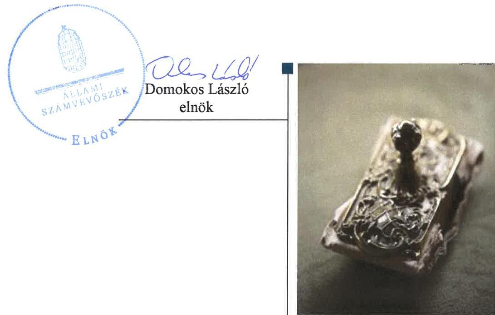
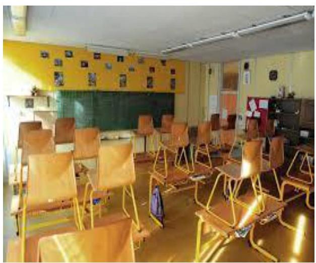

# Jelenetés 

## Az országos nemzetiségi önkormányzatok fenntartásában levő intézmények gazdálkodásának ellenőrzése

Nicolae Bălcescu Román Gimnázium, Általános Iskola és Kollégium 2018.

---

# Jelentés 

## Az országos nemzetiségi önkormányzatok fenntartásában levő intézmények gazdálkodásának ellenőrzése

Nicolae Bălcescu Román Gimnázium, Általános Iskola és Kollégium
2018. repdeuber hó 7 nap

---

# AZ ELLENŐRZÉST FELÜGYELTE:

- VARGA EDIT felügyeleti vezető
- AZ ELLENŐRZÉST VEZETTE ÉS A VÉGREHAJTÁSÁÉRT FELELŐS:
  - MAROZSÁN LÁSZLÓNÉ ellenőrzésvezető
  - A PROGRAM ÖSSZEÁLLÍTÁSÁÉRT FELELŐS:
    - TÓTPÁL SZABOLCS osztályvezető

**IKTATÓSZÁM:** EL-0368-021/2018.

**TÉMASZÁM:** 2463

**ELLENŐRZÉS-AZONOSÍTÓ SZÁM:** V080608

Jelentéseink az Országgyűlés számítógépes hálózatán és az Interneta a www.asz.hu címen is olvashatóak.

---

# TARTALOMJEGYZÉK 

■ ÖSSZEGZÉS ..... 5
■ AZ ELLENŐRZÉS CÉLJA ..... 6
■ AZ ELLENŐRZÉS TERÜLETE ..... 7
■ AZ ELLENŐRZÉS HÁTTERE, INDOKOLTSÁGA ..... 8
■ A JELENTÉS LÉNYEGES KÉRDÉSKÖREI ..... 9
■ AZ ELLENŐRZÉS HATÓKÖRE ÉS MÓDSZEREI ..... 10
■ MEGÁLLAPÍTÁSOK ..... 12
■ JAVASLATOK ..... 17
■ MELLÉKLETEK ..... 21
I. sz. melléklet: Értelmező szótár ..... 21
■ FÜGGELÉK: ÉSZREVÉTELEK ..... 23
■ RÖVIDÍTÉSEK JEGYZÉKE ..... 25

---

.

---

# ÖSSZEGZÉS 

A Magyarországi Románok Országos Önkormányzata a Nicolae Bălcescu Román Gimnázium, Általános Iskola és Kollégium feletti fenntartói jogát szabályszerűen gyakorolta. A Nicolae Bălcescu Román Gimnázium, Általános Iskola és Kollégium müködési és gazdálkodási kereteinek kialakítása nem volt szabályos, belső kontrollrendszere nem biztositotta a közpénzekkel történő szabályszerű, átlátható gazdálkodást. A kiépített kontrollok és a korrupciós kockázatok szintje nem volt egyensúlyban. Pénzügyi és vagyongazdálkodása nem felelt meg a jogszabályi előírásoknak.

## Az ellenőrzés társadalmi indokoltsága

Magyarországon a nemzetiségek jogait sarkalatos törvény határozza meg. A nemzetiségek létrehozhatnak helyi és országos önkormányzatokat, amelyek intézményeket alapíthatnak, tarthatnak fenn. A közfeladatok ellátását a nemzetiségi intézmények sajátos jogszabályi környezetben végzik, amely az utóbbi években változáson ment keresztül. A központi költségvetés támogatást nyújt a nemzetiségi önkormányzatok, illetve az általuk fenntartott intézmények számára feladataik ellátásához. A nemzetiségi intézmények gazdálkodásának ellenőrzése kiemelt jelentőséggel bír, mivel az Állami Számvevőszék korábban ezt a területet még nem ellenőrizte. Az ellenőrzések során az Állami Számvevőszék megállapítja, hogy ezen szervezetek a közpénzeket átlátható módon, szabályszerűen használják-e fel, így a közpénzek felhasználása ezen a területen sem marad ellenőrizetlenül.

## Főbb megállapítások, következtetések

A Magyarországi Románok Országos Önkormányzata az általa fenntartott Nicolae Bălcescu Román Gimnázium, Általános Iskola és Kollégiummal kapcsolatos irányítási, munkáltatói feladatait szabályszerűen gyakorolta. Jóváhagyta az éves költségvetési beszámolóját, elemi költségvetését.

A Nicolae Bălcescu Román Gimnázium, Általános Iskola és Kollégium belső kontrollrendszerének kiépítése és müködtetése nem volt szabályszerű. Müködési kereteit nem a jogszabályi előírásoknak megfelelően alakította ki. Az intézményvezető a jogszabályi előírások ellenére a vagyonnyilatkozat-tételi kötelezettséggel járó munkaköröket nem tüntette fel az SZMSZ-ben, nem rendezte közalkalmazotti szabályzatban a közalkalmazotti jogviszonnyal összefüggő kérdéseket. A gazdálkodás részletes rendjét szabályozta, azonban pénzkezelési szabályzatot nem készített.

Kockázatkezelési rendszert nem működtetett, az integrált kockázatkezelési rendszert nem szabályozta. A dologi és felhalmozási kiadások elszámolásához kapcsolódó belső kontrollok nem működtek megfelelően, a bevételek beszedése és főkönyvi elszámolása, valamint a kiadási előirányzatok felhasználása során nem tartották be a jogszabályok és belső szabályzatok előírásait. A szervezet információs rendszerét az intézményvezető megfelelően kialakította, azonban működtetése nem volt szabályszerű, közzétételi kötelezettségét nem teljesítette teljes körűen, a belső ellenőrzés működtetéséről nem gondoskodott. A Nicolae Bălcescu Román Gimnázium, Általános Iskola és Kollégiumnál a kötelezettségvállalások nyilvántartása, a költségvetési maradvány elszámolása nem volt szabályszerű, továbbá a beszámoló mérlegtételeit leltárral nem támasztotta alá.

---

# AZ ELLENŐRZÉS CÉLJA 

AZ ELLENŐRZÉS CÉLJA: annak értékelése volt, hogy az országos nemzetiségi önkormányzat által alapított és fenntartott intézmény gazdálkodása, a belső kontrollrendszer kialakítása és múködése, a fenntartó önkormányzat által nyújtott támogatás, illetve az államháztartásból meghatározott célra ingyenesen juttatott vagyon felhasználása a jogszabályi előírásoknak megfelelően történt-e.

---

# **AZ ELLENŐRZÉS TERÜLETE**

## **Nicolae Bălcescu Román Gimnázium, Általános Iskola és Kollégium**

A Nicolae Bălcescu Román Gimnázium, Általános Iskola és Kollégiumot a Magyarországi Románok Országos Önkormányzata 2013-ban vette át a Klebelsberg Intézményfenntartó Központtól. Az Intézmény1 típusa többcélú, közös igazgatású köznevelési intézmény, amelynek alapfeladata a román nemzetiséghez tartozó általános- és középiskolások nevelése, oktatása, kollégiumi ellátása. A magyar-román két tanítási nyelvű, Gyulán működő köznevelési intézmény működési területe országos, jogállása önállóan működő és gazdálkodó szervezet.

Az Intézmény az ellenőrzött időszakban vagyonkezelési szerződéssel, kezelt vagyonnal nem rendelkezett, a székhelyeként megjelölt ingatlant Gyula Város Önkormányzatával kötött megállapodás alapján térítésmentesen használta a Fenntartó2 köznevelési célokra. Az Intézmény közalkalmazotti jogviszonyban lévő és a Munka tv.3 hatálya alá tartozó alkalmazottakat foglalkoztatott. A 2014-2016. években az Intézményt ugyanaz a személy vezette, míg a gazdasági szervezet vezetésében kétszer történt változás (2015. október 1-én és 2016. szeptember 1-én). Szervezeti átalakítás az ellenőrzött időszakban az Intézményt nem érintette.

Az Intézmény számára a központi költségvetésből nyújtott működési célú támogatás a 2014. évben 330 342 ezer Ft, a 2015. évben 356 159 ezer Ft, a 2016. évben 390 311 ezer Ft volt.

---

# AZ ELLENŐRZÉS HÁTTERE, INDOKOLTSÁGA 

Magyarország Alaptörvényének XXIX. cikke kimondja, hogy a magyarországi nemzetiségek államalkotó tényezők. Joguk van anyanyelvük használatához, a sajátnyelven való névhasználathoz, saját kultúrájuk ápolásához és az anyanyelvű oktatáshoz. A nemzetiségek létrehozhatnak helyi és országos önkormányzatokat. A nemzetiségek jogaira vonatkozó részletes szabályokat Magyarországon sarkalatos törvény határozza meg. A nemzetiségi közfel-adatok ellátásához az állami központi költségvetés támogatást nyújt, melyet a nemzetiségi önkormányzatok kizárólag e feladataik ellátására használhatnak fel.

Az országos nemzetiségi önkormányzatok az általuk képviselt nemzetiség kulturális autonómiájának megteremtése érdekében intézményeket hozhatnak létre és vehetnek át. Az éves költségvetési törvények közvetlenül az intézményfenntartó országos nemzetiségi önkormányzatokhoz rendelik az általuk fenntartott intézmények működési támogatását. A nemzetiségi önkormányzati intézmények költségvetési gazdálkodásának, belső kontrollrendszerének kialakítása és működtetése ellenőrzésével biztosítja az ÁSZ ${ }^{4}$ a közpénzfelhasználás minél szélesebb körének ellenőrzését, ennek során azonos szempontok szerint értékeli az egyes országos nemzetiségi önkormányzatok fenntartásában levő intézmények gazdálkodási tevékenységét.

Az ellenőrzés eredményeként az ellenőrzött költségvetési szervek gazdálkodása javulhat, átfogó képet kaphatunk az országos nemzetiségi önkormányzatok által fenntartott intézmények gazdálkodásának sajátosságairól, hiányosságairól és az alkalmazott jó gyakorlatokról, erősítve a társadalmi bizalmat. Az ellenőrzés tapasztalatai alapján, hiányosságok feltárásával, azok megszüntetésére vonatkozó javaslatokkal hozzájárulunk a közpénzek átlátható, szabályszerű felhasználásához.

---

# A JELENTÉS LÉNYEGES KÉRDÉSKÖREI 

1. A Fenntartó szabályszerűen gyakorolta-e az ellenőrzött intézménnyel kapcsolatos feladatait?
2. Az Intézmény müködése és gazdálkodása során tevékenysége szabályszerű volt-e, teljesítette-e az elszámolási kötelezettségeket, belső kontrollrendszere megvédte-e a veszteségektől és nem rendeltetésszerü használattól az intézmény erőforrásait?
3. Az Intézmény pénzügyi gazdálkodása szabályszerű volt-e?
4. Az Intézmény vagyongazdálkodása szabályszerű volt-e?

---

# AZ ELLENŐRZÉS HATÓKÖRE ÉS MÓDSZEREI 

## Az ellenőrzés típusa

Megfelelőségi ellenőrzés

## Az ellenőrzött időszak

2014-2016 évek, a belső kontrollrendszer, a bevételek beszedése és elszámolása, a kiadási előirányzatok felhasználása vonatkozásában a 2016. év.

## Az ellenőrzés tárgya

Az ÁSZ ellenőrzés tárgya a Magyarországi Románok Országos Önkormányzata által fenntartott Nicolae Bălcescu Román Gimnázium, Általános Iskola és Kollégium gazdálkodása, a belső kontrollrendszer kialakítása és múködése, a fenntartó önkormányzat által nyújtott támogatás, illetve az államháztartásból meghatározott célra ingyenesen juttatott vagyon felhasználása jogszabályi előírásoknak való megfelelőségének értékelése.

## Az ellenőrzött szervezet

A Magyarországi Románok Országos Önkormányzata, és az általa fenntartott Nicolae Bălcescu Román Gimnázium, Általános Iskola és Kollégium.

## Az ellenőrzés jogalapja

Az ellenőrzés jogszabályi alapját az ÁSZ tv. ${ }^{5} 1$. § (3) bekezdés, 5. § (2)-(6) bekezdései, valamint Áht. ${ }^{6} 61 . \S$ (2) bekezdésének előírásai képezték.

## Az ellenőrzés módszerei

Az ellenőrzést az ellenőrzési program szempontjai, az ellenőrzött időszakban hatályos jogszabályok, az ellenőrzés szakmai szabályai, a jelen ellenőrzésre irányadó ÁSZ módszertanok figyelembevételével végezte az ÁSZ. Az ellenőrzési kérdések megválaszolásához szükséges bizonyítékok megszerzése az ellenőrzött által rendelkezésre bocsátott dokumentumokra, adatokra alapozva megfigyelés, szemle (szemrevételezés), kérdésfeltevés (információkérés), kockázat alapú mintavételezés, valamint elemző eljárás útján történt.

---

A mintavételezés alapja a gazdasági események értékének nagysága volt. Az ellenőrzési bizonyítékként felhasználható adatforrások közé tartoztak egyrészt az ellenőrzési program részletes szempontjainál felsorolt adatforrások, másrészt minden egyéb - az ellenőrzés folyamán feltárt, az ellenőrzés szempontjából információt tartalmazó - dokumentum. Az ellenőrzés lefolytatásához az ellenőrzött szervezet a tanúsítványok kitöltésével, valamint az ÁSZ által kért dokumentumok megküldésével szolgáltatott adatokat.

A bevételek és a kiadások esetében az ellenőrzés azokra a legnagyobb értékű tételekre - a lényeges sokaságra - terjedt ki, melyek összértéke elérte a teljes sokaság összértékének 50\%-át. A lényeges sokaság valamennyi eleme ellenőrzésre került.

Az ÁSZ az ellenőrzés ideje alatt az ellenőrzött szervezettel történő kapcsolattartást az ÁSZ SZMSZ²-ének vonatkozó előírásai alapján biztosította.

---

# 1. A Fenntartó szabályszerűen gyakorolta-e az ellenőrzött intézménnyel kapcsolatos feladatait? 

Összegző megállapítás

A Fenntartó az Intézménnyel kapcsolatos irányítási feladatait szabályszerűen látta el, a munkáltatói jogkörét a jogszabályoknak megfelelően gyakorolta.

Az Intézmény Alapító Okirat ${ }_{1-3}$-át ${ }^{8}$ az ellenőrzött időszakban irányítási hatáskörében eljárva a Fenntartó kiadta, módosította. Az Alapító Okirat ${ }_{1-3}$ tartalmazta az Áht. és az Nktv. ${ }^{9}$ szerinti tartalmi elemeket.

A Fenntartó az Áht.-ban foglaltak szerint jóváhagyta az Intézmény éves költségvetési beszámolóját, elemi költségvetését, vezetőjét minden évben beszámoltatta az ellátott éves szakmai és gazdálkodási feladatokról.

Az Alapító Okirat ${ }_{1-3}$ az intézményvezetői kinevezés, munkáltatói jogkörgyakorlás hatásköreit az Njtv ${ }^{10}$. és az Áht. előírásainak megfelelő szervezetekhez - a Közgyűléshez ${ }^{11}$ és az Elnökhöz ${ }^{12}$ - rendelte, a kapcsolódó hatáskörök gyakorlása az ellenőrzött időszakban szabályszerűen történt.

## 2. Az Intézmény müködése és gazdálkodása során tevékenysége szabályszerű volt-e, teljesítette-e az elszámolási kötelezettségeket, belső kontrollrendszere megvédte-e a veszteségektől és nem rendeltetésszerű használattól az intézmény erőforrásait?

Összegző megállapítás

Az Intézmény működése és gazdálkodási tevékenysége nem volt szabályszerű, belső kontrollrendszere nem biztosította az erőforrások védelmét, szabályszerű felhasználását.
2.1. számú megállapítás

A kontrollkörnyezet kialakítása nem volt szabályszerű.
AZ INTÉZMÉNY MŰKÖDÉSI KERETEINEK kialakítása nem volt szabályszerű. Az intézményi SZMSZ ${ }^{13}$-ben az Alapító Okirat ${ }_{1}$ és az Alapító Okirat ${ }_{2}$ módosításait az alapító okiratok záró rendelkezésében előírt 60 napon belül az intézményvezető nem vezette át. Az SZMSZ az 5.2. pontjában nevesített munkakörök esetében nem tartalmazta a hozzájuk tartozó feladat- és hatásköröket, a hatáskörök gyakorlásának módját és az ezekhez kapcsolódó felelősségi szabályokat az Ávr. ${ }^{14}$ 13. § (1) bekezdés g) pontjában előírtak ellenére. Az Intézmény vezetője a Vnytv. ${ }^{15}$ 4. § a) pontjában előírtak ellenére a vagyonnyilatkozat-tételi kötelezettséggel járó munkaköröket nem tüntette fel az SZMSZ-ben.

---

Az intézményvezető nem rendezte közalkalmazotti szabályzatban a Kjt. ${ }^{16} 2$. § (1) bekezdésének előírása ellenére a közalkalmazotti jogviszonynyal összefüggő kérdéseket, figyelemmel a Kjt. 14. § (2) bekezdésében és a Kjt. 17. § (1) bekezdésében előírtakra. Nem határozta meg továbbá a Bkr. 6. § (1) bekezdés c) pontja ellenére az etikai elvárásokat a szervezet minden szintjén.

PÉNZÜGYI-SZÁMVITELI SZABÁLYZATOK közül az Intézmény vezetője kiadta a Számviteli politikát ${ }^{17}$, elkészítette a Leltározási szabályzatot ${ }^{18}$ és Értékelési szabályzatot ${ }^{19}$, valamint az Önköltségszámítási szabályzatot ${ }^{20}$, azonban a Számv. tv. ${ }^{21}$ 14. § (5) bekezdés d) pontjában foglaltak ellenére nem készítette el a pénzkezelési szabályzatot. A Számviteli politika a Számv. tv. 14. § (4) bekezdésében előírtak ellenére nem tartalmazta azokat az Intézményre jellemző szabályokat, előírásokat, módszereket, amelyekkel meghatározza, hogy mit tekint a számviteli elszámolás, az értékelés szempontjából lényegesnek, nem lényegesnek. Az Értékelési szabályzat nem tartalmazta az Áhsz. ${ }^{22}$ 50. § (2) bekezdés b) pontja ellenére követeléstípusonként a kis összegű követelések év végi meghatározásának elveit, dokumentálásának szabályait.

A pénzügyi kihatással bíró, jogszabályban nem szabályozott kérdések közül az Intézmény vezetője az Ávr. 13. § (2) bekezdés c) pontjában előírtak ellenére nem rendezte belső szabályzatban a külföldi kiküldetések elrendelésével, lebonyolításával, elszámolásával kapcsolatos kérdéseket.
2.2. számú megállapítás

Az Intézménynél a kockázatkezelési rendszert nem müködtették, a szervezeti integritást sértő események eljárásrendjét nem szabályozták.

A KOCKÁZATKEZELÉSI RENDSZERT, illetve 2016. október 1-jétől az integrált kockázatkezelési rendszert a Bkr. 7. § (1) bekezdésében előírtak ellenére az intézményvezető nem működtette. Szabálytalanságok kezelésének eljárásrendjével a Bkr.-nek megfelelően rendelkeztek 2016.szeptember 30-ig. A szervezeti integritást sértő események kezelésének eljárásrendjét a Bkr. 6. § (4) bekezdésében előírtak ellenére az Intézmény vezetője 2016. október 1-jétől nem szabályozta.
2.3. számú megállapítás

A kontrolltevékenység gyakorlása, működtetése nem volt szabályszerű.

A GAZDÁLKODÁSI JOGKÖRÖK kialakításáról, azok gyakorlásának rendjéről, az egyes jogkörök gyakorlói számára adott kijelölésekről az Intézmény vezetője a gazdasági szervezet ügyrendjében ${ }^{23}$ és a Gazdálkodási szabályzatban ${ }^{24}$ rendelkezett, azonban a kapcsolódó kontrolltevékenységeket nem működtette szabályszerűen:
— az Ávr. 60.§ (3) bekezdésében foglaltak ellenére nem vezettek naprakész nyilvántartást az utalványozási jogkör gyakorlóiról,
— a kötelezettségvállalási nyilvántartást az Intézménynél nem az Áhsz. 14. melléklet II. 4. a. pontjában foglalt előírásoknak megfelelő tartalommal vezették. A nyilvántartás nem tartalmazta a pénzügyi ellenjegyzésre vonatkozó adatokat. A kötelezettségvállalásokat követően az Ávr. 56 § (1) bekezdésében előírtak ellenére nem gondoskodtak

---

haladéktalanul annak nyilvántartásba vételéről, így az Intézményben vezetett kötelezettségvállalási nyilvántartás nem volt alkalmas az Ávr. 56.§ (3) bekezdésében előírt szabad fedezet rendelkezésre állásának vizsgálatához a kötelezettségvállalások előtt,
— az Intézmény vezetője a Bkr. 6.§ (3) bekezdése és a nyomvonal elkészítési kötelezettségéről szóló belső szabályzata ${ }^{25}$ 1. pontjában előírtak ellenére nem készített az Intézmény múködési folyamatairól ellenőrzési nyomvonalat.
2.4. számú megállapítás

# Az információs és kommunikációs folyamatok kialakítása megfelelt a jogszabályoknak, de a múködtetése nem volt szabályszerű. 

A SZERVEZET INFORMÁCIÓS RENDSZERÉT az Intézmény vezetője az Áht. és az Info. tv. ${ }^{26}$ előírásainak megfelelően kialakította, rendelkeztek az intézményi információk kezelésére, az adatok biztonságára, védelmére, a közérdekú adatok közzétételi rendjére, megismerésére vonatkozó szabályzatokkal.

Az Intézmény az Info. tv. 34. § (3) bekezdése ellenére a közzétételre szolgáló honlapon nem nyújtott tájékoztatást a közérdekú adatok egyedi igénylésének szabályairól. Továbbá az Info tv. 37. § (1) bekezdése szerinti közzétételi kötelezettségének az Info. tv. 1. mellékletében meghatározott adatok, dokumentumok vonatkozásában az SZMSZ kivételével nem tett eleget, ezáltal az Intézmény vezetője nem biztosította a közvélemény tájékoztatását a közpénzek felhasználásáról.
2.5. számú megállapítás

Az Intézmény vezetője nem alakította ki a szervezet tevékenységének, a célok megvalósításának nyomon követését biztosító rendszert és a belső ellenőrzést.

A MONITORING RENDSZER RÉSZEKÉNT az Intézmény vezetője a Bkr. 10. §-ában foglaltak ellenére nem alakította ki a szervezet tevékenységének, a célok megvalósításának nyomon követését biztosító rendszert. Az Áht. 70. § (1) bekezdésének előírása ellenére nem gondoskodott a belső ellenőrzés kialakításáról, megfelelő múködtetéséről.
2.6. számú megállapítás

Az Intézményben nem a kockázatokkal arányosan alakították ki az integritás kontrollokat.

A jogszabályok által előírt legfontosabb kontrollok kiépítésén kívül további kontrollok nem támogatták az Intézmény integritását, az Intézmény vezetője nem végzett kockázatelemzést, nem határozta meg a szervezet által követendő értékeket, ezek között az integritás erősítését sem.

---

# 3. Az Intézmény pénzügyi gazdálkodása szabályszerű volt-e? 

## Összegző megállapítás

### 3.1. számú megállapítás

### 3.2. számú megállapítás

Az Intézmény pénzügyi gazdálkodása nem volt szabályszerű.
A bevételek beszedése és elszámolása, a kiadási előirányzatok felhasználása nem felelt meg a jogszabályi előírásoknak.

A DOLOGI ÉS FELHALMOZÁSI KIADÁSOK ELSZÁMOLÁSÁHOZ kapcsolódó belső kontrollok nem működtek megfelelően az Intézménynél. A bevételek beszedése és főkönyvi elszámolása, a kiadási előirányzatok felhasználása során nem tartották be a jogszabályok és belső szabályzatok előírását:

- Az érvényesítési feladatot az Ávr. 58. § (4) bekezdésében előírtak ellenére nem az arra írásban kijelölt személy végezte.
- A 100000 Ft-ot meghaladó beszerzés esetében nem vállalt az Intézmény vezetője minden ellenőrzött kiadási tétel esetében írásban kötelezettséget az Áht. 37.§ (1) bekezdésében előírtak ellenére.
- A kötelezettségvállalásokat nem előzte meg pénzügyi ellenjegyzés az Áht. 37.§ (1) bekezdés és az Ávr. 50. § (1) bekezdés d) pontja, az Ávr. 55.§ (1) bekezdés és a Gazdálkodási szabályzat 1.2.2. pontjában foglaltak ellenére.
- Az érvényesítő az Ávr. 58. § (1) bekezdésében és a Gazdálkodási szabályzat 1.2.4. pontjában előírtak ellenére nem végezte el a megelőző ügymenetre vonatkozó ellenőrzési kötelezettségét, tekintettel a kötelezettségvállalás és a pénzügyi ellenjegyzés hiányára.

A kötelezettségek nyilvántartása, a költségvetési maradvány megállapítása és elszámolása nem volt szabályszerű.

A KÖTELEZETTSÉGVÁLALLÁS ÉS MÁS FIZETÉSI KÖTELEZETTSÉGEK nyilvántartása az Intézménynél nem felelt meg az Áhsz. 14. melléklet II. 4. a) pontjában előírt tartalmi elemeknek, nem tartalmazta a pénzügyi ellenjegyzésre vonatkozó adatokat, az Áhsz. 39. § (1) bekezdésben előírtak ellenére vezetése nem volt folyamatos.

A KÖLTSÉGVETÉSI MARADVÁNY megállapítása során nem tartották be a jogszabályi előírásokat. A 2014.-2016. évi költségvetési maradvány alátámasztásához az Áhsz. 39. § (3) bekezdésében foglaltak ellenére a 14. melléklet szerinti részletező kimutatással az Intézmény nem rendelkezett.

Az Intézmény nem rendelkezett a jogszabályi előírásoknak megfelelő költségvetési beszámolóval.

A 2014. évi beszámolót az Intézmény vezetője és a gazdasági vezető az Áhsz. 31.§ (1) bekezdésben előírtak ellenére az elkészítés dátuma nélkül írta alá. A 2015. és a 2016. évi költségvetési beszámolókat az Áhsz. 32.§ (1) bekezdésében foglalt, a Kincstár elektronikus adatszolgáltató rendszerébe való feltöltési határidőt követően készítették el.

Az Intézmény költségvetési beszámolóit az Áhsz. 5. § (1) bekezdésében előírtak ellenére folyamatosan vezetett részletező nyilvántartásokkal nem

---

támasztotta alá, mert a könyvviteli zárlat során készített a főkönyvi kivonat és az analitikus nyilvántartás adatai között nem volt biztosított az egyezőség több mérlegsor vonatkozásában, illetve egyes mérlegsorokhoz analitika nem készült.

# 4. Az Intézmény vagyongazdálkodása szabályszerű volt-e? 

## Összegző megállapítás

Az Intézmény vagyongazdálkodása nem volt szabályszerű.
4.1. számú megállapítás

Az Intézmény mérlegében kimutatott eszközök és források értékelése és leltározása nem a jogszabályok előírásainak megfelelően történt.

AZ INTÉZMÉNY KÖLTSÉGVETÉSI BESZÁMOLÓI-
BAN kimutatott tárgyi eszközök év végi értékelése, bekerülési értékének megállapítása, állományba vétele és értékcsökkenésének elszámolása szabályosan történt, azonban a követelések nyilvántartása nem felelt meg az Áhsz. 14. melléklet III. pontjában foglaltaknak. A követeléseket nem mutatták ki az Áhsz. 18. § (6) bekezdésében előírt időszakok bontásában. A kötelezettségek nyilvántartása nem tartalmazta az Áhsz. 14. melléklet II. 4. a) pontjában előírtak ellenére a pénzügyi ellenjegyzésre vonatkozó adatokat.

Az Intézménynél a mérleg tételeinek alátámasztásához a Számv. tv. 69. § (1) bekezdésében előírtak ellenére nem készítettek olyan leltárt, amely tételesen, ellenőrizhető módon tartalmazta az Intézmény eszközeit és forrásait a mérleg fordulónapon.

---

# JAVASLATOK 

Az ÁSZ tv. 33. § (1) bekezdésében foglaltak értelmében az ellenőrzött szervezet vezetője köteles a jelentésben foglalt megállapításokhoz kapcsolódó intézkedési tervet összeállítani és azt a jelentés kézhezvételétől számított 30 napon belül az ÁSZ részére megküldeni. Amennyiben az ellenőrzött szervezet vezetője nem küldi meg határidőben az intézkedési tervet, vagy továbbra sem elfogadható intézkedési tervet küld, az Állami Számvevőszék elnöke az ÁSZ tv. 33. § (3) bekezdése a) és b) pontjaiban foglaltakat érvényesítheti.

## Nicolae Bălcescu Román Gimnázium, Általános Iskola és Kollégium igazgatójának

1. A belső kontrollrendszer szabályszerű kialakítása és müködtetése érdekében intézkedjen:
a) jogszabályi előírásoknak megfelelő tartalmú szervezeti és müködési szabályzat elkészítéséről;
(2.1. sz. megállapítás 1. bekezdése alapján)
b) közalkalmazotti szabályzat megalkotásáról az Intézmény közalkalmazotti tanácsával együttesen;
(2.1. sz. megállapítás 2. bekezdés 1. mondata alapján)
c) olyan kontrollkörnyezetet kialakításáról, amelyben meghatározottak, ismertek és elfogadottak az etikai elvárások az Intézmény minden szintjén;
(2.1. sz. megállapítás 2. bekezdés 2. mondata alapján)
d) a pénzkezelési szabályzat elkészítéséről;
(2.1. sz. megállapítás 3. bekezdés 1. mondata alapján)
e) a jogszabályi előírásoknak megfelelő tartalmú számviteli politika elkészítéséről;
(2.1. sz. megállapítás 3. bekezdés 2. mondata alapján)
f) a jogszabályi előírásoknak megfelelő tartalmú értékelési szabályzat elkészítéséről;
(2.1. sz. megállapítás 3. bekezdés 3. mondata alapján)

---

g) a külföldi kiküldetések elrendelésével, lebonyolításával, elszámolásával kapcsolatos kérdések belső szabályzatban történő rendezéséről;
(2.1. sz. megállapítás 4. bekezdése alapján)
h) az integrált kockázatkezelési rendszer müködtetéséről;
(2.2. sz. megállapítás 1. bekezdés 1. mondata alapján)
i) a szervezeti integritást sértő események kezelésének eljárásrendje szabályozásáról;
(2.2. sz. megállapítás 1. bekezdés 3 mondata alapján)
j) az utalványozási jogkört gyakorlók naprakész nyilvántartásáról;
(2.3. sz. megállapítás 1. bekezdés 1. francia bekezdése alapján)
k) az ellenőrzési nyomvonal elkészítéséről;
(2.3. sz. megállapítás 1. bekezdés 3. francia bekezdése alapján)
l) a közérdekú adatok egyedi igényléséről szóló szabályok közzétételéről;
(2.4. sz. megállapítás 2. bekezdés 1. mondata alapján)
m) jogszabályi előírásoknak megfelelően a kötelezően közzéteendő közérdekú adatok teljes körü közzétételéről;
(2.4. sz. megállapítás 2. bekezdés 2. mondata alapján)
n) a szervezet tevékenységének, a célok megvalósitásának nyomon követését biztosító rendszer és belső ellenőrzés kialakításáról, müködtetéséről.
(2.5. sz. megállapítás 1. bekezdése alapján)
2. A belső kontrollrendszer szabályszerú kialakítása és müködtetése, valamint a szabályszerü pénzügyi gazdálkodás érdekében gondoskodjon a jogszabályi előírásoknak megfelelő tartalmú kötelezettségvállalások, más fizetési kötelezettségek nyilvántartásának vezetéséről.
(2.3. sz. megállapítás 1. bekezdés 2. francia bekezdése, valamint 3.2. sz. megállapítás 1. bekezdése alapján)

---

3. A szabályszerű pénzügyi gazdálkodás érdekében gondoskodjon:
a) a gazdálkodási jogkörök szabályszerű gyakorlásának biztosításáról;
(3.1. sz. megállapítás alapján)
b) a költségvetési maradvány alátámasztásához jogszabályi előírásoknak megfelelő tartalmú részletező kimutatás készítéséről;
(3.2. sz. megállapítás 2. bekezdése alapján)
c) a költségvetési beszámoló jogszabályi előírásoknak megfelelő tartalommal, határidőben történő elkészítéséről, és a Kincstár által müködtetett elektronikus adatszolgáltató rendszerbe történő feltöltéséről;
(3.3. sz. megállapítás 1. bekezdés 2. mondata alapján)
d) az Intézmény költségvetési beszámolóinak jogszabályi előírásoknak megfelelő, folyamatosan vezetett részletező nyilvántartásokkal való alátámasztásáról;
(3.3. sz. megállapítás 2. bekezdése alapján)
4. A vagyonnal való szabályszerű gazdálkodás érdekében gondoskodjon:
a) a követelések jogszabályi előírásoknak megfelelő tartalmú nyilvántartásának vezetéséről;
(4.1. sz. megállapítás 1. bekezdés 1-2. mondata alapján)
b) a jogszabályoknak megfelelő leltár összeállításáról.
(4.1. sz. megállapítás 2. bekezdése alapján)

---

.

---

# MELLÉKLETEK 

- I. SZ. MELLÉKLET: ÉRTELMEZŐ SZÓTÁR
irányító szerv
működtetés
nemzeti vagyon rendeltetése
nemzetiségi önkormányzat
nemzetiségi köznevelési intézmény
nemzetiségi közügy
nemzetiségi többcélú intézmény
tulajdonosi joggyakorló
vagyongazdálkodás

A költségvetési szerv tekintetében az e törvényben meghatározott irányítási hatáskört gyakorló szerv. (Forrás: Áht. 1. § 9. pontja)
A nemzeti vagyon birtoklásából, használatából, hasznai szedéséből, a nemzeti vagyon fenntartásából és üzemeltetéséből álló tevékenységek együttese, amely - jogszabály vagy szerződés alapján - a nemzeti vagyon felújítására, fejlesztésére, a birtoklásának, használatának hasznai szedése jogának továbbengedésére is kiterjed. (Forrás: Nvtv. 3. § 10. pontja)

A nemzeti vagyon alapvető rendeltetése a közfeladat ellátásának biztosítása, ideértve a lakosság közszolgáltatásokkal való ellátását és e feladatok ellátásához szükséges infrastruktúra biztosítását. (Forrás: Nvtv. 7. 0 (1) bekezdés, hatályos 2015. január 1-jétől)
A nemzetiségek jogairól szóló törvényben meghatározott nemzetiségi közszolgáltatási feladatokat ellátó, testületi formában működő, jogi személyiséggel rendelkező, demokratikus választások útján e törvény alapján létrehozott szervezet, amely a nemzetiségi közösséget megillető jogosultságok érvényesítésére, a nemzetiségek érdekeinek védelmére és képviseletére, a feladat- és hatáskörébe tartozó nemzetiségi közügyek települési, területi vagy országos szinten történő önálló intézésére jön létre. (Forrás: a nemzetiségek jogairól szóló 2011. évi CLXXIX. törvény, 2. § 2. pont)
Az a köznevelési intézmény, amelynek alapító okirata a nemzeti köznevelésről szóló törvényben foglaltak szerint tartalmazza a nemzetiségi feladatok ellátását, feltéve, hogy e feladatokat a köznevelési intézmény ténylegesen ellátja, továbbá óvoda, iskola és kollégium esetén a tanulók legalább huszonöt százaléka részt vesz a nemzetiségi óvodai nevelésben, illetve a nemzetiségi iskolai nevelésben-oktatásban.
az Nemzetiségi tv.-ben biztosított egyéni és közösségi jogok érvényesülése, a nemzetiséghez tartozók érdekeinek kifejezésre juttatása - különösen az anyanyelv ápolása, őrzése és gyarapítása, továbbá a nemzetiségek kulturális autonómiájának a nemzetiségi önkormányzatok által történő megvalósítása és megőrzése - érdekében a nemzetiséghez tartozók meghatározott közszolgáltatásokkal való ellátásával, ezen ügyek önálló vitelével és az ehhez szükséges szervezeti, személyi és anyagi feltételek megteremtésével összefüggő ügy
nemzetiségi többcélú intézményen, nemzetiségi tagintézményen és nemzetiségi köznevelési intézmény intézményegységén a köznevelési törvény szerinti többcélú intézmény, tagintézmény és intézményegység értendő (Forrás: Nemzetiségi tv. 2. § 4. pont b,)

Aki a nemzeti vagyon felett az államot vagy a helyi önkormányzatot megillető tulajdonosi jogok és kötelezettségek összességének gyakorlására jogosult. (Forrás: Nvtv. 3. § (1) bekezdés 17. pontja)

A nemzeti vagyongazdálkodás feladata a nemzeti vagyon rendeltetésének megfelelő, az állam, az önkormányzat mindenkori teherbíró képességéhez igazodó, elsődlegesen a közfeladatok ellátásához és a mindenkori társadalmi szükségletek kielégítéséhez szükséges, egységes elveken alapuló, átlátható, hatékony és költségtakarékos működtetése, értékének megőrzése, állagának védelme, értéknövelő használata, hasznosítása, gyarapítása, továbbá az állam vagy a helyi önkormányzat feladatának ellátása szempontjából feleslegessé váló vagyontárgyak elidegenítése. (Forrás: Nvtv. 7. § (2) bekezdése)

---

Nemzeti vagyon a) az állam vagy a helyi önkormányzat kizárólagos tulajdonában álló dolgok,
b) az a) pont hatálya alá nem tartozó, az állam vagy a helyi önkormányzat tulajdonában lévő dolog,
c) az állam vagy a helyi önkormányzat tulajdonában lévő pénzügyi eszközök, továbbá az államot vagy a helyi önkormányzatot megillető társasági részesedések,
d) az államot vagy a helyi önkormányzatot megillető bármely vagyoni értékkel rendelkező jogosultság, amelyet jogszabály vagyoni értékű jogként nevesít,
e) Magyarország határa által körbezárt terület feletti légtér,
f) az üvegházhatású gázok kibocsátási egységeinek kereskedelméről szóló törvény szerinti kibocsátási egység és légiközlekedési kibocsátási egység, valamint az ENSZ Éghajlatváltozási Keretegyezménye és annak Kiotói Jegyzőkönyv végrehajtási keretrendszeréről szóló törvény szerinti kiotói egység,
g) állami vagy helyi önkormányzati fenntartású közgyűjtemény (muzeális intézmény, levéltár, közgyűjteményként működő kép- és hangarchívum, valamint könyvtár) saját gyűjteményében nyilvántartott kulturális javak körébe tartozó dolog, kivéve, ha az állami vagy önkormányzati tulajdon jogszerű létrejötte kétséget kizáró módon nem bizonyítható és a dologra nézve más a tulajdonjogát bizonyítja vagy a kulturális javakra vonatkozó jogszabályokban meghatározott eljárás keretében valószínűsíti,
h) a régészeti lelet,
i) a nemzeti adatvagyon körébe tartozó állami nyilvántartások fokozottabb védelméről szóló törvény szerinti nemzeti adatvagyon.
(Forrás: Nvtv. 1.§ (2) bekezdés)

---

# FÜGGELÉK: ÉSZREVÉTELEK 

A jelentéstervezetet a Számvevőszék 15 napos észrevételezésre megküldte az ellenőrzött szervezetek vezetőinek az ÁSZ tv. 29. §* (1) bekezdése előírásának megfelelően.

Az ÁSZ a jelentéstervezetet észrevételezésre megküldte a Nicolae Bălcescu Román Gimnázium, Általános Iskola és Kollégium igazgatójának és a Magyarországi Románok Országos Önkormányzata elnökének.
A Nicolae Bălcescu Román Gimnázium, Általános Iskola és Kollégium igazgatója és a Magyarországi Románok Országos Önkormányzata elnöke az ÁSZ tv. 29. § (2) bekezdésében foglalt észrevételezési jogával nem élt, írásban jelezték, hogy nem kívánnak a jelentéstervezet megállapításaira vonatkozóan észrevételt tenni.

[^0]
[^0]:    * 29. § (1) Az Állami Számvevőszék az ellenőrzési megállapításait megküldi az ellenőrzött szervezet vezetőjének vagy az általa megbízott személynek, és annak, akinek személyes felelősségét állapította meg.
    (2) Az ellenőrzött szervezet vezetője és a felelősként megjelölt személy az ellenőrzés megállapításaira tizenöt napon belül írásban észrevételt tehet.
    (3) Az Állami Számvevőszék az észrevételre a beérkezésétől számított harminc napon belül írásban válaszol. A figyelembe nem vett észrevételeket köteles a jelentésben feltüntetni, és megindokolni, hogy azokat miért nem fogadta el.

---

.

---

# RÖVIDÍTÉSEK JEGYZÉKE 

${ }^{1}$ Intézmény
${ }^{2}$ Fenntartó
${ }^{3}$ Munka tv.
${ }^{4}$ ÁSZ
${ }^{5}$ ÁSZ tv.
${ }^{6}$ Áht.
${ }^{7}$ ÁSZ SZMSZ
${ }^{8}$ Alapító Okirat ${ }_{1}$

Alapító Okirat ${ }_{2}$

Alapító Okirat ${ }_{3}$
${ }^{9}$ Nktv.
${ }^{10}$ Njtv.
${ }^{11}$ Közgyűlés
${ }^{12}$ Elnök
${ }^{13}$ SZMSZ
${ }^{14}$ Ávr.
${ }^{15}$ Vnytv.
${ }^{16}$ Kjt.
${ }^{17}$ Számviteli politika
${ }^{18}$ Leltározási szabályzat
${ }^{19}$ Értékelési szabályzat
${ }^{20}$ Önköltségszámítási szabályzat
${ }^{21}$ Számv. tv.
${ }^{22}$ Áhsz.
${ }^{23}$ ügyrend
${ }^{24}$ Gazdálkodási szabályzat
${ }^{25}$ Nyomvonal szabályzat
${ }^{26}$ Info. tv.

Nicolae Román Gimnázium, Általános Iskola és Kollégium
Magyarországi Románok Országos Önkormányzata
2012. évi I. törvény a munka törvénykönyvéről (hatályos 2012.július 1-től)

Állami Számvevőszék
az Állami Számvevőszékről szóló 2011. évi LXVI. törvény
2011. évi CXCV. törvény az államháztartásról

Állami Számvevőszék elnökének 4/2017. (XII.29.) ÁSZ utasítása az Állami Számvevőszék Szervezeti és Múködési Szabályzatáról
Nicolae Bălcescu Román Gimnázium, Általános Iskola és Kollégium Alapító Okirata, kelt: 2013.10.28. (hatályos: 2014.01.01-től 2014.07.01-ig)
Nicolae Bălcescu Román Gimnázium, Általános Iskola és Kollégium Alapító Okirata, kelt: 2014.05.28. (hatályos: 2014.07.02-től 2015.06.30-ig)
Nicolae Bălcescu Román Gimnázium, Általános Iskola és Kollégium Alapító Okirata, kelt: 2015.05.27. (hatályos: 2015.07.01-től 2017.06.30-ig)
2011. évi CXC. törvény a nemzeti köznevelésről
2011. évi CLXXIX. törvény a nemzetiségek jogairól

Magyarországi Románok Országos Önkormányzata közgyűlése
Magyarországi Románok Országos Önkormányzata közgyűlés elnöke
Nicolae Bălcescu Román Gimnázium, Általános Iskola és Kollégium Szervezeti és működési szabályzata (hatályos 2013. szeptember 1-től)
368/2011. (XII. 31.) Korm. rendelet az államháztartásról szóló törvény végrehajtásáról
2007. évi CLII. törvény egyes vagyonnyilatkozat-tételi kötelezettségekről
1992. évi XXXIII. törvény a közalkalmazottak jogállásáról

Nicolae Bălcescu Román Gimnázium, Általános Iskola és Kollégium Számviteli Politika (hatályos: 2014. január 1-jétől)
Nicolae Bălcescu Román Gimnázium, Általános Iskola és Kollégium Leltárkészítési és Leltározási Szabályzat (hatályos: 2014. január 1-jétől)
Nicolae Bălcescu Román Gimnázium, Általános Iskola és Kollégium Eszközök és Források Értékelési Szabályzata (hatályos: 2014. január 1-jétől)
Nicolae Bălcescu Román Gimnázium, Általános Iskola és Kollégium Önköltségszámítási szabályzat (hatályos 2014. január 1-től)
2000. évi C törvény a számvitelről

4/2013 (1.11.) Korm. rendelet az államháztartás számviteléről
Nicolae Bălcescu Román Gimnázium, Általános Iskola és Kollégium Gazdasági szervezet ügyrendje (hatályos 2014. január 1-től)
Nicolae Bălcescu Román Gimnázium, Általános Iskola és Kollégium Gazdálkodási szabályzat (hatályos 2014. január 1-től)
Nicolae Bălcescu Román Gimnázium, Általános Iskola és Kollégium vezetői utasítása az ellenőrzési nyomvonalról (hatályos 2016. január 4-től)
2011. évi CXII. törvény az információs önrendelkezési jogról és az információszabadságról

---

# ÁLLAMI SZÁMVEVŐSZÉK 

1052 Budapest, Apáczai Csere János utca 10.
Levélcím: 1364 Budapest 4. Pf. 54
Telefon: +36 14849100 Telefax: +36 14849200
www.asz.hu