# Jelenetés 

## Az állami tulajdonú gazdasági társaságok ellenőrzése

Forum Hungaricum Nonprofit Kft. 2018.

18219
www.asz.hu

---

# Jelentés 

## Az állami tulajdonú gazdasági társaságok ellenőrzése

Forum Hungaricum Nonprofit Kft.
2018. 09. hó 12. nap
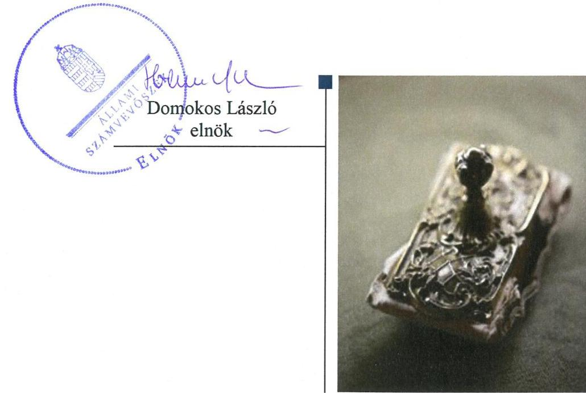

---

# AZ ELLENŐRZÉST FELÜGYELTE:

- **KLINGA LÁSZLÓ** felügyeleti vezető
- **AZ ELLENŐRZÉST VEZETTE ÉS A VÉGREHAJTÁSÁÉRT FELELŐS:**
  - **RÁCZKEVI KATALIN** ellenőrzésvezető
  - **A PROGRAM ÖSSZEÁLLÍTÁSÁÉRT FELELŐS:**
    - **TÓTPÁL SZABOLCS** osztályvezető

**IKTATÓSZÁM:** EL-0402-029/2018

**TÉMASZÁM:** 2469

**ELLENŐRZÉS-AZONOSÍTÓ SZÁM:** V081423

Jelentéseink az Országgyűlés számítógépes hálózatán és az Interneten a www.asz.hu címen is olvashatóak.

---

# TARTALOMJEGYZÉK 

■ ÖSSZEGZÉS ..... 5
■ AZ ELLENŐRZÉS CÉLJA ..... 6
■ AZ ELLENŐRZÉS TERÜLETE ..... 7
■ AZ ELLENŐRZÉS HÁTTERE, INDOKOLTSÁGA ..... 8
■ A JELENTÉS LÉNYEGES KÉRDÉSKÖREI ..... 9
■ AZ ELLENŐRZÉS HATÓKÖRE ÉS MÓDSZEREI ..... 10
■ MEGÁLLAPÍTÁSOK ..... 12
■ JAVASLATOK ..... 14
■ MELLÉKLETEK ..... 15
I. sz. melléklet: Értelmező szótár ..... 15
■ FÜGGELÉK: ÉSZREVÉTELEK ..... 17
■ RÖVIDÍTÉSEK JEGYZÉKE ..... 31

---

.

---

# ÖSSZEGZÉS 

A Forum Hungaricum Nonprofit Kft. feletti tulajdonosi joggyakorlás az Igazságügyi Minisztérium részéről megfelelt a jogszabályi előírásoknak, a Magyar Nemzeti Vagyonkezelő Zrt. részéről nem volt szabályszerű. A Társaság szabályozottsága, gazdálkodása és vagyongazdálkodása nem volt szabályszerű, ezzel nem biztosította az átláthatóságot és az elszámoltathatóságot.

## Az ellenőrzés társadalmi indokoltsága

Az Állami Számvevőszék kiemelt célja, hogy az államháztartáson kívülre nyújtott költségvetési támogatások és ingyenes vagyonjuttatások, valamint az államháztartáson kívül működő feladatellátó rendszerek ellenőrzéseivel hozzájáruljon ahhoz, hogy a közpénzeket az államháztartáson kívül működő szervezetek is átlátható, rendezett módon használják fel.

Az állami tulajdonú gazdálkodó szervezetek a nemzeti vagyon részét képezik. Az állami vagyonnal való gazdálkodást illetően a tulajdonosi joggyakorlás feladata az állami vagyon átlátható, rendeltetésszerű és felelős használatának biztosítása. Az állami tulajdonú gazdasági társaságok feladata az állami vagyon átlátható, hatékony, költségtakarékos működtetése, értékének megőrzése, állagának védelme, értéknövelő használata, hasznosítása.

Minden közpénzt, közvagyont használó szervezettel szemben társadalmi igény, hogy tevékenységükről elszámoljanak. Ezt figyelembe véve és az Állami Számvevőszék Stratégiájával összhangban került sor az állami tulajdonban álló Forum Hungaricum Nonprofit Kft. ellenőrzésére.

## Főbb megállapítások, következtetések, javaslatok

Az Igazságügyi Minisztérium 2013. évre vonatkozóan a jogszabályi előírásoknak megfelelően kialakította és szabályszerűen gyakorolta a tulajdoni jogokat. Az MNV Zrt. 2016. évre vonatkozóan az előírásoknak megfelelően kialakította a tulajdonosi joggyakorlás kereteit, azonban a tulajdonosi joggyakorlás nem volt szabályszerű.

Az MNV Zrt. a Társaság jogszabályi előírásoknak megfelelő tőkepótlását nem biztosította. A Társaság közhasznú jogállásának rendezése érdekében szükséges intézkedéseket nem tette meg.

A Társaság gazdálkodásának szabályozottsága nem felelt meg a jogszabályi előírásoknak, a számviteli politika és annak keretében kialakítandó szabályzatokat 2013. és 2016. évekre nem készítette el, ezáltal a szabályszerű könyvvezetés feltételeit nem biztosította. Ezzel a Társaság vagyoni helyzete az ellenőrzött időszakban nem volt áttekinthető.

A Társaság 2013. évben a szabályszerű pénzügyi-számviteli gazdálkodás elszámolását alátámasztó bizonylatokkal nem rendelkezett.

A megállapítások alapján az Állami Számvevőszék az MNV Zrt. vezérigazgatójának kettő, a Forum Hungaricum Nonprofit Kft. ügyvezetőjének kettő javaslatot fogalmazott meg.

---

# AZ ELLENŐRZÉS CÉLJA 

AZ ELLENŐRZÉS CÉLJA annak értékelése volt, hogy a tulajdonosi jogok gyakorlása szabályszerű volt-e. A gazdálkodó szervezet szabályozottsága, gazdálkodása és vagyongazdálkodási tevékenysége megfelelt-e a jogszabályi és a tulajdonosi előírásoknak. A vagyonváltozást eredményező döntések esetében a tulajdonosi jogok gyakorlója és a gazdálkodó szervezet szabályszerűen jártak-e el. Az ellenőrzés célja továbbá annak megítélése volt, hogy a kormányzati szektorba sorolt állami tulajdonban (résztulajdonban) lévő gazdálkodó szervezetek gazdálkodásának a kormányzati szektor hiányára és az államadósságra befolyással bíró elemei a jogszabályi előírásoknak megfeleltek-e.

---

# AZ ELLENŐRZÉS TERÜLETE 

## Forum Hungaricum Nonprofit Korlátolt Felelősségű Társaság, valamint a tulajdonosi joggyakorló Igazságügyi Minisztérium és a Magyar Nemzeti Vagyonkezelő Zártkörűen Működő Részvénytársaság

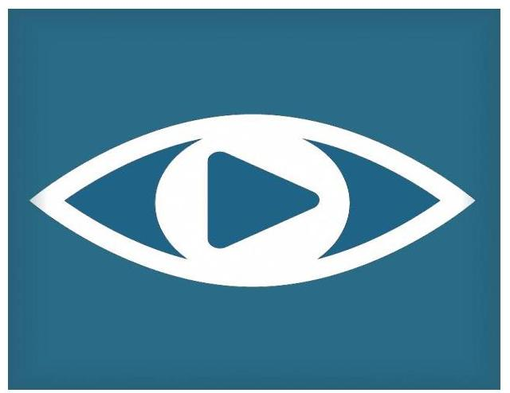

A MAGYAR ÁLLAM nevében az MSZH ${ }^{1}$ és az NKÖM² 2004. február 10-én alapította a Társaság³ jogelődjét, majd 2012. február 1-jétől Forum Hungaricum Nonprofit Kft. néven működött.

A Társaság feletti tulajdonosi jogokat megbízási szerződés alapján 2014. június 5-ig a KIM ${ }^{4}$, majd névváltozást követően 2014. október 31-ig az IM${ }^{5}$, ezt követően a megbízási szerződés ${ }^{6}$ megszűnésével 2014. november 1-től az MNV Zrt. ${ }^{7}$ gyakorolta.

A Társaság jegyzett tőkéje az ellenőrzött időszakban 3,1 millió Ft volt.

## A FORUM HUNGARICUM NONPROFIT

KFT. feladata a budapesti Erzsébet téren létrehozandó design központ szakmai feladatainak folyamatos összeállítása, a beruházáshoz kapcsolódóan a szakmai elvárások meghatározásában való közreműködés, majd a beruházás befejezését követően az ingatlan üzemeltetése volt. Az Erzsébet téren létrejött Erzsébet téri Kulturális Központ és Park 2012. év végétől 2013. szeptemberéig állt a Társaság üzemeltetésében. A Design Terminállal kapcsolatos szakmai feladatokat és azzal összefüggésben a Magyar Formatervezési Tanáccsal való szakmai együttműködési feladatokat 2013. december 31-ig látta el.

A Társaságnak a KIM és a KIH${ }^{8}$ részére kormányrendeletekben ${ }^{9}$ előírt közfeladatokhoz kapcsolódóan közreműködési kötelezettsége volt az országkép-stratégia kialakításában, valamint ezzel összefüggésben az ország márka képhez kapcsolódó intézményi koordinációban, a kreatív alkotóelemek kialakításának, alkalmazásának és fejlesztésének ösztönzésében, továbbá a formatervezési tevékenységgel összefüggésben programok, kiállítások, más rendezvények szervezésében, ismeretterjesztésben, a kultúra fejlesztésében 2015-ig.

A foglalkoztatottak átlagos statisztikai állományi létszáma a 2013. évi 24 főről, 2014. évben 7 főre, majd 2015. évben 1 főre csökkent, 2016. évben nem volt alkalmazottja a Társaságnak.

Az ügyvezető személye 2013-2016. években nem változott. Feladatkörét 2015. március 25-ig munkaviszonyban, majd 2016. december 31-ig társasági jogi jogviszony keretében látta el.

A Társaság az NGM${ }^{10}$ közleménye ${ }^{11}$ szerint az ellenőrzött időszak egészében kormányzati szektorba sorolt egyéb szervezet volt.

A Társaság 2013. és 2016. években vagyonkezelt vagyonnal nem rendelkezett.

---

# AZ ELLENŐRZÉS HÁTTERE, INDOKOLTSÁGA 

AZ ÁLLAMI TULAJDONÚ GAZDÁLKODÓ SZERVEZETEK ellenőrzése kiemelten fontos a vagyon megőrzése, megóvása érdekében, valamint a kormányzati szektor elszámolásaiban megjelenő állami tulajdonú gazdálkodó szervezetek esetében, amelyekkel szemben alapvető követelmény, hogy gazdálkodásuk, működésük szabályszerű, az általuk szolgáltatott adatok minél megbízhatóbbak legyenek. Gazdálkodásuk jellemzően a közérdeklődés és a média figyelmének középpontjában áll, amihez hozzájárul a gazdálkodásuk körébe tartozó - közvetlen vagy közvetett állami tulajdonú, tehát végső soron a nemzeti vagyon részét képező - vagyon nagysága, illetve az általuk ellátott közszolgáltatások/közfeladatok minősége és hatékonysága. A közszolgáltatási árképzés megalapozottsága és a rendszeres elszámoltatás feltételeinek kialakítása az ellenőrzése során nagy hangsúlyt kap. A közszolgáltatás árában és annak támogatásában meg kell jelennie az önköltségszámítás szempontjainak, amely biztosítja a működés fenntarthatóságát (eszközpótlást) is.

Az ellenőrzés rámutathat az állami tulajdonú gazdálkodó szervezetek gazdálkodási tevékenységével jó gyakorlatokra és szabálytalanságokra. Felhívhatja a figyelmet a jogszabályi követelmények teljesítéséhez szükséges feltételek hiányosságaira, hozzájárulhat az államháztartáson kívüli, de (közvetlenül vagy közvetve) állami vagyont használó gazdálkodó szervezetek tevékenységének átláthatóságához. Ellenőrzésünk eredményeképpen javaslatainkkal, megállapításainkkal hozzájárulhatunk a nemzeti vagyonnal való gazdálkodás átláthatóságának, elszámoltathatóságának javításához.

---

# A JELENTÉS LÉNYEGES KÉRDÉSKÖREI 

1. A tulajdonosi jogok gyakorlása szabályszerű volt-e?
2. A Társaság működésének szabályozottsága, gazdálkodása és vagyongazdálkodása megfelel-e az előírásoknak?

---

# AZ ELLENŐRZÉS HATÓKÖRE ÉS MÓDSZEREI 

## Az ellenőrzés típusa

Megfelelőségi ellenőrzés.

## Az ellenőrzött időszak

Az ellenőrzött időszak 2013. - 2016. évek, a 2016. évi beszámoló jóváhagyásáig tartó időszak.

## Az ellenőrzés tárgya

Az állami tulajdonban lévő Forum Hungaricum Nonprofit Kft. gazdálkodása, kiemelten vagyongazdálkodási tevékenysége, továbbá a Közigazgatási és Igazságügyi Minisztérium, - 2014. június 6-i névváltozást követően az Igazságügyi Minisztérium - valamint a Magyar Nemzeti Vagyonkezelő Zrt. tulajdonosi joggyakorlása.

Az ellenőrzés kiterjedt minden olyan körülményre és adatra, amely az ÁSZ ${ }^{12}$ jogszabályban meghatározott feladatainak teljesítéséhez, valamint a program végrehajtása folyamán felmerült újabb összefüggések feltárásához szükséges.

## Az ellenőrzött szervezet

- Közigazgatási és Igazságügyi Minisztérium, majd névváltozást követően 2014. június 6-tól 2014. október 31-ig az Igazságügyi Minisztérium, valamint 2014. november 1-jétől a Magyar Nemzeti Vagyonkezelő Zrt., mint tulajdonosi joggyakorlók,
- Forum Hungaricum Kft.

## Az ellenőrzés jogalapja

Az ellenőrzés jogalapját az ÁSZ tv ${ }^{13}$. 1. § (3) bekezdése és 5. § (3)-(5) bekezdése képezték.

---

# Az ellenőrzés módszerei 

Az ellenőrzést a nemzetközi standardokat irányadónak tekintve az ellenőrzési program ellenőrzési kérdései, az ellenőrzött időszakban hatályos jogszabályok, az ellenőrzés szakmai szabályok és módszertanok figyelembe vételével végeztük.

Az ellenőrzés ideje alatt az ellenőrzött szervezettel történő kapcsolattartást az ÁSZ Szervezeti és Működési Szabályzatának vonatkozó előírásai alapján biztosítottuk.

Az ellenőrzésre a többségi állami tulajdonban álló gazdálkodó szervezeteknél kerül sor. A program szerinti feladatokat a kiválasztott gazdálkodó szervezeteknél (társaságoknál) kellett végrehajtani.

Az ellenőrzési kérdések megválaszolásához szükséges bizonyítékok megszerzése a következő ellenőrzési eljárások alkalmazásával történt: megfigyelés, kérdésfeltevés (információkérés), összehasonlítás, valamint elemző eljárás. Az ellenőrzési bizonyítékként felhasználható adatforrások közé tartoznak egyrészt az ellenőrzési programban felsorolt adatforrások, másrészt adatforrás lehet még minden - az ellenőrzés folyamán - feltárt, az ellenőrzés szempontjából információkat tartalmazó dokumentum.

Az ellenőrzést a kérdésekre adott válaszok kiértékelésével, valamint a megjelölt adatforrások, a csatolt tanúsítványok felhasználásával, továbbá az adott időszakban hatályos jogszabályok figyelembe vételével került lefolytatásra.

A teljes ellenőrzött időszakra vonatkozóan került ellenőrzésre a gazdasági társaság tervezési, beszámolási, közzétételi, adatszolgáltatási kötelezettségének, valamint belső ellenőrzési tevékenységének szabályszerűsége. A 2013. és 2016. évekre vonatkozóan a gazdasági társaság működésének szabályozottságát, a bevételei és ráfordításai elszámolását, illetve vagyongazdálkodásának szabályszerűségét is ellenőriztük.

---

# 1. A tulajdonosi jogok gyakorlása szabályszerű volt-e? 

Összegző megállapítás

Az IM tulajdonosi joggyakorlása a Társaság felett szabályszerű volt. Az MNV Zrt. a tulajdonosi joggyakorlás kereteit szabályszerűen kialakította, a tulajdonosi joggyakorlása a Társaság felett nem volt szabályszerű.

AZ IM - 2014. június 5-ig KIM - a tulajdonosi joggyakorlás kereteit a 2013. évben a jogszabályi előírásoknak megfelelően a KIM-SZMSZ ${ }_{1-6}{ }^{14}$-ben és az Alapító Okirat ${ }_{1-4}{ }^{15}$-ban rögzítette.

A KIM az Alapító Okirat ${ }_{1-4}$-ban előírta a Társaság ügyvezetője részére negyedéves rendszerességgel az évközi beszámolási, tájékoztatási kötelezettséget, valamint az üzleti terv készítését. A KIM a Taktv. ${ }^{16}$, továbbá az Ectv. ${ }^{17}$ előírásának megfelelően gondoskodott az FB${ }^{18}$ létrehozásáról.

A KIM a Társaság egyszerűsített éves beszámolóit a jogszabályi előírásoknak megfelelően a könyvvizsgáló és az FB írásbeli jelentésének birtokában elfogadta.

A Társaság 2011-2012. évi veszteséges gazdálkodása következtében a saját tőke a jegyzett tőke jogszabályban előírt szintje alá csökkent, melynek rendezésére az IM a Gt. ${ }^{19}$ 141. § (2) bekezdés c) pontjában, valamint Alapító Okirat ${ }_{1}$ 13. pontjában előírtaknak megfelelően 2013. évben 9 millió Ft pótbefizetést teljesített.

AZ MNV ZRT. a tulajdonosi joggyakorlás rendjét a 2016. évben a jogszabályok előírásával összhangban kialakította, amelynek keretszabályozását az MNV-SZMSZ ${ }_{1-2}{ }^{20}$ és az Alapító Okirat ${ }_{7-8}$, valamint a belső szabályzatai ${ }^{21}$ tartalmazták.

Az MNV Zrt. 2016. évben az Alapító Okirat${ }^{7}$ 11.7.8. pontjában írta elő az üzleti terv készítésének és előterjesztésének kötelezettségét, azonban a Társaság 2016. évre vonatkozóan üzleti tervet nem készített, így annak a tulajdonosi joggyakorló általi elfogadására sem került sor.

Az MNV Zrt. az éves beszámolók elfogadásáról a Ptk. ${ }^{22}$ előírásainak megfelelően az FB írásbeli jelentésének birtokában döntött.

A Társaság könyvvizsgálatra nem volt kötelezett, az MNV
 Zrt. 2015. június 1. és 2016. november 20. között annak ellenére nem bízott meg könyvvizsgálót, hogy azt az Alapító okirat 14.1 pontja előírta.

A Társaság tevékenysége 2014. szeptember 30-tól már nem minősült az Ectv. 2. § 20. pont szerinti közhasznú tevékenységnek, amelyre tekintettel az Ectv. 32. § (1) bekezdésében előírt közhasznú minősítés alapvető feltétele már nem állt fenn. Az MNV Zrt. a közhasznú jogállás megszűnésére való tekintettel a létesítő okirat módosításáról a Ptk. 3:102. § (1) bekezdésében, illetve az Alapító Okirat 10.2.13. pontjában foglaltak ellenére nem döntött, a Társaság az Ectv. 48. § előírása ellenére a közhasznú jogállás törlését a hatvan napon belül nem kérte. A közhasznúsági fokozat törlésére

---

2016. november 10-én az illetékes bíróság bejegyzési végzése alapján került sor.

A Társaság saját tőkéje a 2014-2016. évek veszteséges gazdálkodásának következtében a törzstőke kevesebb, mint felére, valamint a jogszabályban meghatározott minimális összeg alá csökkent.

A Ptk. 3:189. § (2) bekezdése ellenére az MNV Zrt. 2016. évben nem határozott a pótbefizetés előírásáról, a törzstőke mértékét elérő saját tőke más módon való biztosításáról, vagy a törzstőke leszállításáról, illetve mindezek hiányában a Társaság átalakulásáról, egyesüléséről, szétválásáról vagy jogutód nélküli megszüntetéséről. Ennek következtében nem volt biztosított a Társaság szabályszerű működése.

## 2. A Társaság működésének szabályozottsága, gazdálkodása és vagyongazdálkodása megfelel-e az előírásoknak?

### Összegző megállapítás

A Társaság működésének szabályozottsága, gazdálkodása és vagyongazdálkodása nem volt szabályszerű.

A Társaság a 2013. és 2016. években a Számv. tv.23 14. § (3) és (5) bekezdéseiben előírtak ellenére számviteli politikával és annak keretében elkészítendő szabályzatokkal nem rendelkezett. A Társaság szabályozottsága, pénzügyi-számviteli és vagyongazdálkodási tevékenysége nem volt szabályszerű.

A Társaság a 2013. évben megsértette a Számv. tv. 165. § (1) bekezdésében foglaltakat, mivel az eszközök, illetve az eszközök forrásainak állományát vagy összetételét megváltoztató gazdasági műveletekről, eseményekről bizonylatokkal nem rendelkezett.

---

# JAVASLATOK 

Az ÁSZ tv. 33. § (1) bekezdésében foglaltak értelmében az ellenőrzött szervezet vezetője köteles a jelentésben foglalt megállapításokhoz kapcsolódó intézkedési tervet összeállítani és azt a jelentés kézhezvételétől számított 30 napon belül az ÁSZ részére megküldeni. Amennyiben az ellenőrzött szervezet vezetője nem küldi meg határidőben az intézkedési tervet, vagy továbbra sem elfogadható intézkedési tervet küld, az Állami Számvevőszék elnöke az ÁSZ tv. 33. § (3) bekezdés a) és b) pontjaiban foglaltakat érvényesítheti.

## Magyar Nemzeti Vagyonkezelő Zrt. vezérigazgatójának

1. Kezdeményezze az MNV Zrt.-nél, hogy határozzon a saját tőke értéke Ptk.-ban előírt szintjének biztosítása érdekében, vagy ennek hiányában döntsön a Társaság átalakulásáról, egyesüléséről, szétválásáról vagy jogutód nélküli megszüntetéséről.
(1. sz. megállapítás 10. bekezdés 1. és 2. mondata alapján)
2. Tegyen intézkedéseket:
a) a számviteli szabályozási hiányosságok,
b) a gazdasági események bizonylattal történő alátámasztásának elmulasztása
miatti felelősség tisztázása érdekében, és szükség szerint intézkedjen a felelősség érvényesítéséről.
(2. sz. megállapítás 1. és 2. bekezdései alapján)

## Forum Hungaricum Nonprofit Kft. ügyvezetőjének

1. Intézkedjen a Számv. tv. előírásainak megfelelően a számviteli politika és annak keretében elkészítendő szabályzatok elkészítéséről.
(2. sz. megállapítás 1. bekezdése alapján)
2. Intézkedjen a Számv. tv. előírásainak megfelelően az eszközök, illetve az eszközök forrásainak állományát vagy összetételét megváltoztató gazdasági műveletek, események bizonylatokkal történő alátámasztásáról.
(2. sz. megállapítás 2. bekezdése alapján)

---

# MELLÉKLETEK 

- I. SZ. MELLÉKLET: ÉRTELMEZŐ SZÓTÁR
gazdasági társaság
kormányzati szektorba sorolt egyéb szervezet

Ptk. 3:88. § (1) bekezdése szerint „a gazdasági társaságok üzletszerű közös gazdasági tevékenység folytatására, a tagok vagyoni hozzájárulásával létrehozott, jogi személyiséggel rendelkező vállalkozások, amelyekben a tagok a nyereségből közösen részesednek, és a veszteséget közösen viselik".
Az a szervezet, amely az Áht. alapján nem része az államháztartásnak, azonban az Európai Közösséget létrehozó szerződéshez csatolt, a túlzott hiány esetén követendő eljárásról szóló jegyzőkönyv alkalmazásáról szóló 2009. május 25-i 479/2009/EK rendelet szerint a kormányzati szektorba tartozik. A nemzetgazdasági miniszter 2013. június 26-án megjelent Közleményben tette közé ezen szervezetek listáját.

---

.

---

# FÜGGELÉK: ÉSZREVÉTELEK 

A jelentéstervezetet a Számvevőszék 15 napos észrevételezésre megküldte az ellenőrzött szervezetek vezetőinek az ÁSZ tv. 29. § (1) bekezdése előírásának megfelelően.

Az Igazságügyi Miniszter, a Magyar Nemzeti Vagyonkezelő Zrt. vezérigazgatója és a Forum Hungaricum Nonprofit Kft. ügyvezetője észrevételét és az arra adott választ a függelék tartalmazza.

[^0]
[^0]:    * 29. § (1) Az Állami Számvevőszék az ellenőrzési megállapításait megküldi az ellenőrzött szervezet vezetőjének vagy az általa megbízott személynek, és annak, akinek személyes felelősségét állapította meg.
    (2) Az ellenőrzött szervezet vezetője és a felelősként megjelölt személy az ellenőrzés megállapításaira tizenöt napon belül írásban észrevételt tehet.
    (3) Az Állami Számvevőszék az észrevételre a beérkezésétől számított harminc napon belül írásban válaszol. A figyelembe nem vett észrevételeket köteles a jelentésben feltüntetni, és megindokolni, hogy azokat miért nem fogadta el.

---

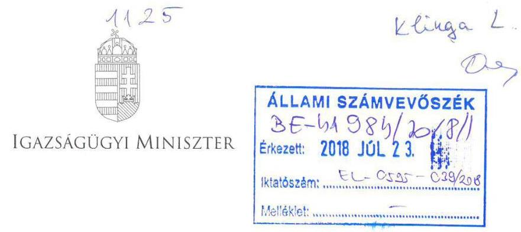

IX-15/ID/12/2/2018.

# Domokos László úr részére elnök 

## Állami Számvevőszék

## Budapest

Tárgy: „Az állami tulajdonú (résztulajdonú) gazdasági társaságok ellenőrzése - Forum Hungaricum Nonprofit Kft." címmel készített számvevőszéki jelentéstervezet véleményezése

## Tisztelt Elnök Úr!

Ezúton tájékoztatom, hogy az EL-0595-030/2018. iktatószámú, „Az állami tulajdonú (résztulajdonú) gazdasági társaságok ellenőrzése - Forum Hungaricum Nonprofit Kft." címmel készített számvevőszéki jelentéstervezetet köszönettel megkaptam, amellyel kapcsolatosan az alábbiakat jelzem.

Mivel a minisztérium névváltozása a Magyarország minisztériumainak felsorolásáról szóló 2014. évi XX. törvény 1. § (2) bekezdésének e) pontja alapján valósult meg, ezért kérem, hogy a tervezet vonatkozó szövegrészei a jogszabály hatálybalépésével összhangban kerüljenek módosításra. Egyebekben a tárca tulajdonosi joggyakorlásával összefüggő megállapításokkal egyetértek, azokra észrevételt nem teszek.

Budapest, 2018. július „, 18 "
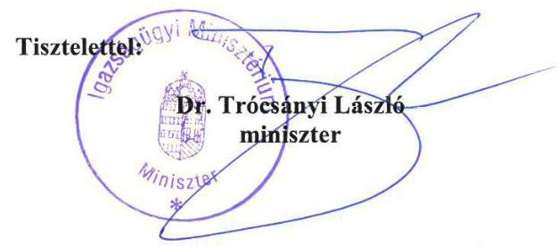

---

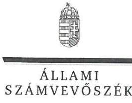

ELNÖK

Ikt.szám: EL-0595-040/2018.

Dr. Trócsányi László úr
miniszter
Igazságügyi Minisztérium

Budapest

# Tisztelt Miniszter Úr! 

Köszönettel vettem „Az állami tulajdonú gazdasági társaságok ellenőrzése - Forum Hungaricum Nonprofit Kft." című ellenőrzésről készített számvevőszéki jelentéstervezetre megküldött észrevételét.
Az Állami Számvevőszék észrevételekre vonatkozó álláspontját a felügyeleti vezető által készített részletes tájékoztatás tartalmazza, amelyet levelemhez mellékeltem. Tájékoztatom Miniszter urat, hogy az Állami Számvevőszék a figyelembe nem vett észrevételeket az Állami Számvevőszékről szóló 2011. évi LXVI. törvény 29. § (3) bekezdésében előírtak szerint köteles a jelentésében feltüntetni és megindokolni, hogy azokat miért nem fogadta el.

Budapest, 2018. $\odot \mathscr{R}$ hó $\odot$ nap
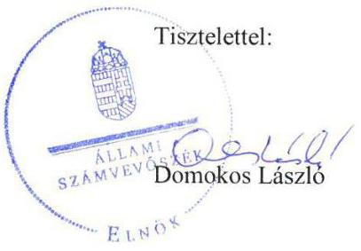

Melléklet: Tájékoztatás az észrevételek kezeléséről

---

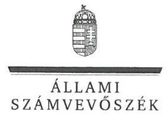

FELÜGYELETI VEZETŐ

Melléklet
Ikt.szám: EL-0595-040/2018.

# Tájékoztatás az észrevételek kezeléséről 

Megköszönöm Miniszter úrnak „Az állami tulajdonú gazdasági társaságok ellenőrzése - Forum Hungaricum Nonprofit Kft. " címmel készített jelentés-tervezetre tett észrevételét. Az észrevétel kezeléséről az alábbi tájékoztatást adom:
Miniszter úr észrevételében jelezte, hogy a jelentéstervezet Igazságügyi Minisztérium névváltozásának időpontjára vonatkozó szövegrészei és - a névváltozásról rendelkező - Magyarország minisztériumainak felsorolásáról szóló 2014. évi XX. törvény hatályba lépésének időpontja közötti összhang nem biztosított.
Miniszter úr észrevételét köszönettel vettem, a jelentéstervezetben az Igazságügyi Minisztérium névváltozásának időpontját 2014. június 6-ra módosítottam.

Budapest, 2018. 0 " 0 ".
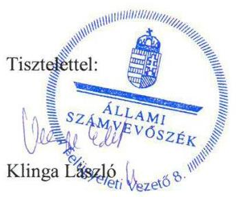

---

# MAV   MAGYAR Nemzeti   VAGYONKEZELŐ ZRT.   VEZÉRIGAZGATÓ   Állami Számvevőszék 

## Domokos László

elnök

1052 Budapest
Apáczai Cs. J. u. 10.

Ikt. sz.: MNV/01/8493/ ㅇ 2018.
Hiv. sz.: EL-0595-031/2018.

Tisztelt Elnök Úr!
Tájékoztatom, hogy a 2018. június 25. napján, az „Állami tulajdonú (résztulajdonú) gazdasági társaságok ellenőrzése-Forum Hungaricum Nonprofit Kft. " tárgyában kézhez vett, EL-0595-031/2018. ikt. sz. levél mellékleteként megküldött jelentéstervezetre az alábbi észrevételeket tesszük.
„Összegzés" fejezet, preambulum és „Főbb megállapítások" részek / 5. oldal; „Megállapítások" fejezet, 1. rész / 12-13. oldal; „Javaslatok" fejezet, „Javaslatok az MNV Zrt. vezérigazgatójának" rész / 14. oldal

Az Állami Számvevőszék által elkészített jelentéstervezet fenti megállapításai az MNV Zrt. tulajdonosi joggyakorlói feladatai ellátásának szabályszerűségét összességében vonják kétségbe anélkül, hogy az MNV Zrt. Társaság működtetésével kapcsolatos tulajdonosi joggyakorlói mozgásterét, annak korlátozottságát és az Állami Számvevőszék által javasolt megoldási lehetőségek kapcsán felmerülő hátrányos következményeket bemutatnák, illetve elemeznék. Az MNV Zrt. a Társaság jövőbeli működési stratégiájának elfogadásáig - amelynek meghatározása tekintetében a Társaság korábbi feladataira tekintettel nem az MNV Zrt. volt illetékes -, az MNV Zrt. sem a Társaság további működtetéséhez nem tudott megalapozottan forrást biztosítani [ezt csak az államháztartásról szóló 2011. évi CXCV. törvény (a továbbiakban: Áht.) 45. §-ában foglalt miniszteri engedéllyel tehette volna meg], valamint a Társaság megszüntetésének költségeit sem kívánta idő előtt realizálni, ezzel szemben minden intézkedést megtett annak érdekében, hogy a Társaság költségeit minimalizálja és azonnal működőképessé tehető állapotban tartsa a szükséges és várható kormányzati döntések meghozataláig.

A Társaság megalapítására a Magyar Formatervezési Tanácsról szóló 266/2001. (XII. 21.) számú Korm. rendelet 1. § (2) és (3) bekezdéseiben meghatározott feladatok megvalósításának elősegítésére, valamint a budapesti Erzsébet téren létrehozásra kerülő design központ szakmai feladatainak folyamatos összeállítására, az épület kivitelezése során a szakmai feladatok ellátásához szükséges elvárások meghatározásában történő közreműködésre, majd a beruházás befejezését követően az ingatlan üzemeltetése céljából került sor.

A Közigazgatási és Igazságügyi Minisztérium (a mai nevén Igazságügyi Minisztérium, a továbbiakban Minisztérium) 2012. december 31-ig vagyonkezelés útján, majd - a nemzeti vagyonról szóló 2011. évi

---

CXCVI. törvény (a továbbiakban: Nvt.) 2012. június 30. napján hatályba lépett 8. § (7) bekezdése szerint - 2013. január 1-től megbízáson alapuló meghatalmazás útján gyakorolta a Társaság állami tulajdonú üzletrésze feletti tulajdonosi jogokat.

A Minisztérium Társaság feletti tulajdonosi joggyakorlását az indokolta, hogy az egyes miniszterek, valamint a Miniszterelnökséget vezető államtitkár feladat- és hatásköréről szóló 212/2010. (VII. 1.) Korm. rendelet (a továbbiakban: Statútum rendelet) 5. § a) pontjában meghatározott közfeladataihoz, azaz országkép-stratégia kialakításához, ezzel összefüggésben az ország márka képet alakító intézmények tevékenységének koordinálásához, valamint az ország márka kreatív alkotóelemei kialakításának, alkalmazásának és fejlesztésének ösztönzéséhez és elősegítéséhez - a fejezeti kezelésű előirányzatok kezelésének és felhasználásának szabályairól szóló 2/2013. (III. 6.) KIM rendelet 21. § (3) bekezdése alapján - a Társaság közreműködését vette igénybe.

Ezen túlmenően a Társaság közreműködőként segítette a Minisztérium háttérintézményeként működő Közigazgatási és Igazságügyi Hivatal (a továbbiakban: KIH) tevékenységét is a Közigazgatási és Igazságügyi Hivatalról szóló 177/2012. (VII. 26.) Korm. rendelet 10. § h) pontjában meghatározott közfeladatok ellátásában, azaz a formatervezési tevékenységet előmozdító programok, kiállítások, más rendezvények kezdeményezésében, szervezésében, valamint részt vett a formatervezéssel kapcsolatos ismeretek összehangolt terjesztésének, a hazai formatervezési kultúra fejlesztésének irányításában, és a formatervezők iparjogvédelmi és szerzői jogi ismereteinek gyarapításában is. A Társaság a közfeladatokat közérdekből, haszonszerzési cél nélkül végezte.

A 2014. évben lezajlott kormányzati szervezeti változás következményeképpen a Közigazgatási és Igazságügyi Minisztérium elnevezése 2014. június 6. napjával a Magyarország minisztériumainak felsorolásáról szóló 2014. évi XX. törvény 1. § (2) bekezdésének e) pontja, valamint a minisztérium Alapító Okiratának módosítása alapján Igazságügyi Minisztériumra változott. Ugyanezen napon hatályba lépett a Kormány tagjainak feladat- és hatásköréről szóló 152/2014. (VI. 6.) Korm. rendelet (a továbbiakban: Korm. rendelet), amely - a korábbi Statútum rendelet hatályon kívül helyezése mellett - az igazságügyi miniszter feladat- és hatásköreként már nem határozott meg olyan közfeladatot, amelyhez a Társaság közreműködése lett volna indokolt. A Korm. rendelet 1. melléklete szerint a KIH
 feletti irányítási jogkör is elkerült a tárcától.

A Társaság feletti tulajdonosi joggyakorlás Minisztériumnál tartása a továbbiakban nem volt indokolt, ezért a joggyakorlás alapját jelentő, az állami tulajdonú társasági részesedéshez kapcsolódó tulajdonosi jogok gyakorlását átengedő, SZT-39.125. számú megbízási szerződés Társaságra vonatkozó része - a Minisztérium IX-35/ID/66/2/2014 iktatószámú levelében közölt felmondása folytán - 2014. október 31. napjával megszüntetésre került.

Az állami vagyonról szóló 2007. évi CVI. törvény (a továbbiakban: Vtv.) 3. § (1) bekezdése értelmében a rábízott állami vagyon felett az államot megillető tulajdonosi jogok és kötelezettségek összességét tulajdonosi joggyakorlóként - ha törvény vagy miniszteri rendelet eltérően nem rendelkezik - az MNV Zrt. gyakorolja. E törvényi rendelkezéssel összhangban, a fent leírtak eredményeképpen, a megbízási szerződés megszüntetésétől kezdődően a Társaság üzletrésze felett a Magyar Államot megillető tulajdonosi jogokat az MNV Zrt. gyakorolja.

A Társaság üzletrésze feletti tulajdonosi joggyakorlás MNV Zrt-hez történő kerülésével egyidejűleg az MNV Zrt. megkezdte a Társaság továbbműködtetése lehetőségeinek vizsgálatát a Társaság eddigi közfeladat ellátására és piaci reputációjára is figyelemmel. Ennek keretében az MNV Zrt. a Nemzeti Fejlesztési Minisztérium állásfoglalását is kikérte mind egy esetlegesen támogatható üzleti terv és az annak mentén történő továbbműködés, mind pedig a megszüntetés lehetséges módjai tekintetében.

---

Az Állami Számvevőszék által kiemelt, a Társaság 2014-2016. üzleti évekre vonatkozó veszteséges gazdálkodása és a Polgári Törvénykönyvről szóló 2013. évi V. törvény által előírt saját tőke/jegyzett tőke arány teljesülésének hiánya miatt az MNV Zrt. a tárgyi időszakban, a lehetőségeihez mérten több megközelítés alapján is igyekezett olyan - magánbefektetői szempontból is megalapozott - üzleti lehetőségeket, koncepciókat kidolgoztatni a Társasággal, amely a stabil növekedési pályára állás mellett a jogszabályban rögzített finanszírozottsági egyensúlyt, illetve tőkemegfelelést is helyreállítja, azonban erre megvalósítható formában akkor nem mutatkozott lehetőség. A Társaság jövőjét ebben az időszakban bizonytalanság övezte, figyelemmel azonban arra, hogy a Társaság korábban jelentős állami források igénybevételével közhasznú tevékenységet végzett, és az új feladattal történő megbízatására a jelzett időszakban is volt esély, a jogutód nélküli megszüntetés nem látszott indokolt megoldásnak.

A felelős vagyongazdálkodási elvek és a költségvetési forrásfelhasználás minimalizálásának érvényre juttatása érdekében, továbbá az Áht. 45. §-ában foglalt követelményekre is tekintettel az MNV Zrt. tulajdonosi forrás biztosításáról addig nem hozhatott döntést, amíg a Társaság jövőbeli feladatai, gazdálkodási lehetőségei nem kerültek tisztázásra. Figyelemmel arra, hogy az állami feladatkijelöléssel érintett kormányzati szervekkel történt egyeztetések alapján reális esélye volt annak, hogy a Társaság új feladattal kerülhet megbízásra - amint arra 2016. év végén sor került -, a Társaság végelszámolással történő megszüntetése sem volt megalapozottan megindítható, különös tekintettel arra is, hogy egy végelszámolási eljárás sikeres befejezése úgyszintén tulajdonosi forrásigénnyel járt volna.

A fenti körülmények miatt nem kerülhetett sor hosszabb ideig a Társaságnál tőkerendezésre, pótbefizetésre, és ugyanezen indokok - a jövőbeli működés bizonytalansága - miatt kapott a Társaság felmentést üzleti terv készítési kötelezettsége alól, maradt nyitva a Társaságnál a könyvvizsgáló választásának lehetősége - ugyanakkor költségkímélési okokból és a számviteli előírásokkal összhangban a tényleges tevékenység végzésével nem járó időszakban a Társaságnál nem került sor könyvvizsgáló megválasztására -, továbbá nem történt meg a közhasznú jogállás törlésének kezdeményezése sem.

Az Állami Számvevőszék által vizsgált időszakban, 2016. december 2. napján kihirdetésre került az egyes központi hivatalok és költségvetési szervi formában működő minisztériumi háttérintézmények felülvizsgálatával összefüggő jogutódlásáról, valamint egyes közfeladatok átvételéről szóló 378/2016 (XII. 2.) Korm. rendelet, amelynek 11. alcíme „A Magyar Nemzeti Digitális Archívum és Filmintézet egyes feladatainak átvételéről" szóló szabályokról rendelkezik. A hivatkozott alcím alatt a jogszabály 12. §-a a Magyar Nemzeti Digitális Archívum és Filmintézet (a továbbiakban: MaNDA) megszűnésével kapcsolatban a MaNDA egyes továbbiakban is ellátandó feladatai vonatkozásában felelősként a Forum Hungaricum Nonprofit Kft-t jelölte meg, amelyre tekintettel a Társaság működése 2017. január 1-től alapvetően megváltozott. Jelentős munkavállalói állomány kerül(t) felvételre, a Társaságnál országosan nagyságrendileg 500 fő közfoglalkoztatására kerül sor, illetve több európai uniós pályázat fenntartási kötelezettségeit is a Társaságnak kell(ett) teljesíteni. Az MNV Zrt. a Társaságnál a 818/2016. (XII. 28.) AH számú alapítói határozattal megkezdte a feladatátvételhez szükséges, Alapítói hatáskörbe tartozó döntések meghozatalát. A 2017. üzleti év a Társaság életében a szervezeti struktúrájának kialakítása mellett tevékenységének új alapokra helyezésével, valamint a korábbi MaNDA tevékenységek folyamatosságának fenntartása jegyében zajlott. A megváltozott körülményekre és a kikristályosodott jövőképre tekintettel az MNV Zrt. a Társaságot 2017. év végén 140500 EUR összegnek megfelelő úgynevezett csekély összegű (de minimis) támogatásban részesítette.

A Társaság 2017. évi egyszerűsített éves beszámolójának adatai a 2017. évi adózott eredménye tekintetében 29589 ezer Ft-ot, míg a saját tőke vonatkozásában 3758 ezer Ft-ot mutatnak. Utóbbi értékkel a Polgári Törvénykönyvről szóló 2013. évi V. törvény által előírt saját tőke/jegyzett tőke arány a Társaság tekintetében a 2017. üzleti évre helyreállt.

---

A fentiek alapján - az MNV Zrt. álláspontja szerint - a Társaság javuló pénzügyi mutatói és a Forum Hungaricum Nonprofit Kft. megújult tevékenységének piaci tendenciái megalapozhatják a Társaság jövőbeli eredményes működését.

Mindezen körülményekre tekintettel kérjük, hogy a jelentéstervezet MNV Zrt. tulajdonosi joggyakorlói magatartásának szabályszerűségét megkérdőjelező minősítéseit, továbbá a Társaság jelenlegi, a vonatkozó jogszabályi követelményeknek megfelelő tőkeszerkezetének átalakítására vonatkozó javaslatot törölni szíveskedjenek, így az alábbi szövegrészeket:

- 5. oldal: „Összegzés" fejezet, preambulum rész első mondatának utolsó fordulata (,a Magyar Nemzeti Vagyonkezelő Zrt. részéről nem volt szabályszerű");
- 5. oldal: „Összegzés" fejezet, „Főbb megállapítások" rész első bekezdés utolsó mondatának utolsó fordulata (,azonban a tulajdonosi joggyakorlás nem volt szabályszerű");
- 5. oldal: „Összegzés" fejezet, „Főbb megállapítások" rész második bekezdésének utolsó mondata (,A Társaság közhasznú jogállásának rendezése érdekében szükséges intézkedéseket nem tette meg.");
- 12. oldal: „Megállapítások" fejezet, 1. rész, „Összegző megállapítás" bekezdésének utolsó fordulata (,a tulajdonosi joggyakorlása a Társaság felett nem volt szabályszerű");
- 12-13. oldal: „Megállapítások" fejezet, 1. rész, az MNV Zrt. tulajdonosi joggyakorlását bemutató utolsó bekezdés utolsó mondata (,Ennek következtében nem volt biztosított a Társaság szabályszerű működése.");
- 14. oldal: „Javaslatok" fejezet, „Javaslatok az MNV Zrt. vezérigazgatójának" rész 1. pontja

Kérem Elnök Urat, hogy a jelentés véglegesítése során jelen észrevételeinket szíveskedjenek figyelembe venni.

Budapest, 2018. július „ 3 "
Üdvözlettel:
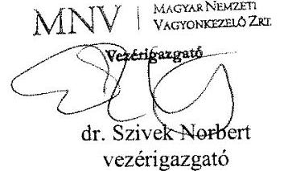

---

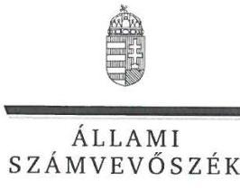

ELNÖK

Ikt.szám: EL-0595-038/2018.

# dr. Szívek Norbert úr 

vezérigazgató
Magyar Nemzeti Vagyonkezelő Zártkörűen Működő Részvénytársaság

## Budapest

## Tisztelt Vezérigazgató Úr!

Köszönettel vettem „Az állami tulajdonú gazdasági társaságok ellenőrzése - Forum Hungaricum Nonprofit Kft." című ellenőrzésről készített számvevőszéki jelentéstervezetre megküldött észrevételeit.
Az Állami Számvevőszék észrevételekre vonatkozó álláspontját a felügyeleti vezető által készített részletes tájékoztatás tartalmazza, amelyet levelemhez mellékeltem. Tájékoztatom Vezérigazgató urat, hogy az Állami Számvevőszék a figyelembe nem vett észrevételeket az Állami Számvevőszékről szóló 2011. évi LXVI. törvény 29. § (3) bekezdésében előírtak szerint köteles a jelentésében feltüntetni és megindokolni, hogy azokat miért nem fogadta el.

Budapest, 2018. 08 hó 01 nap
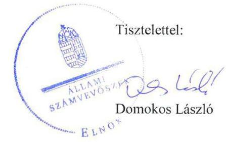

Melléklet: Tájékoztatás az észrevételek kezeléséről

---

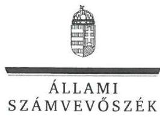

FELÜGYELETI VEZETŐ

Melléklet
Ikt.szám: EL-0595-038/2018.

# Tájékoztatás az észrevételek kezeléséről 

Megköszönöm Vezérigazgató úrnak „Az állami tulajdonú gazdasági társaságok ellenőrzése Forum Hungaricum Nonprofit Kft." címmel készített jelentés-tervezetre tett észrevételeit. Az észrevételek kezeléséről az alábbi tájékoztatást adom:
Vezérigazgató úr a jelentéstervezet tulajdonosi joggyakorlás szabályszerűségére vonatkozó megállapításokra, valamint a Forum Hungaricum Nonprofit Kft. (továbbiakban: Társaság) tőkehelyzetének rendezésére vonatkozó javaslatra tett észrevételt.
Észrevételében bemutatja mind azokat a körülményeket, tényezőket, amelyek miatt az ellenőrzött időszakban

- a Társaság nem készített üzleti tervet, így annak MNV Zrt. (továbbiakban: tulajdonosi joggyakorló) általi elfogadása sem történt meg (jelentéstervezet 1. számú megállapítás 6. bekezdése);
- könyvvizsgáló megbízására nem került sor annak ellenére, hogy azt az Alapító okirat 14.1. pontja előírta (jelentéstervezet 1. számú megállapítás 8. bekezdése);
- a Társaság létesítő okiratának - közhasznú jogállás megszűnésére való tekintettel való módosítása, közhasznú jogállás törlésének kezdeményezése elmaradt (jelentéstervezet 1. számú megállapítás 9. bekezdése);
- a Társaság tőkehelyzetének rendezése a Ptk. előírásai ellenére nem történt meg (jelentéstervezet 1. számú megállapítás 10-11. bekezdése).

Az Állami Számvevőszék (továbbiakban: ÁSZ) ellenőrzését a megküldött ellenőrzési programnak megfelelően, a rendelkezésre bocsátott adatok és dokumentumok (bizonyítékok) alapján végezte. Az Állami Számvevőszékről szóló 2011. évi LXVI. törvény (továbbiakban: ÁSZ tv.) 28. § (2) bekezdése alapján a közreműködésre felhívott szervezet az ÁSZ részére - annak kérésére soron kívül, de legkésőbb öt munkanapon belül - az ellenőrzés lefolytatása érdekében a szükséges adatokat és dokumentumokat rendelkezésre bocsátja. A beküldött dokumentumok között nem került feltöltésre az üzleti terv készítése, a könyvvizsgáló megbízása alóli mentesítésről, valamint az Áht. 45. § (2) bekezdésében előírt előzetes jóváhagyási kérelemről szóló dokumentum.

Köszönettel vettem tájékoztatását arról, hogy az egyes központi hivatalok és költségvetési szervi formában működő minisztériumi háttérintézmények felülvizsgálatával összefüggő jogutódlásáról, valamint egyes közfeladatok átvételéről szóló 378/2016 (XII. 2.) Korm. rendelet 12. §-a a

---

Magyar Nemzeti Digitális Archívum és Filmintézet (a továbbiakban: MaNDA) megszűnésével kapcsolatban a MaNDA egyes továbbiakban is ellátandó feladatai vonatkozásában felelősként a Forum Hungaricum Nonprofit Kft-t jelölte meg, amelyre tekintettel a Társaság működése 2017. január 1-től alapvetően megváltozott. Tájékoztatom, hogy az ellenőrzött időszakban (2013-2016.), a Társaság gazdálkodásának ellenőrzésére került sor, ami nem érintette annak feladatellátását, így a hivatkozott jogszabályban előírtakból a tulajdonosi joggyakorlás szabályszerűségére nem vonható le következtetés.
A Társaság tőkehelyzetének rendezésére - ellenőrzött időszakot követően - tett intézkedésről szóló tájékoztatást köszönjük. Tájékoztatom, hogy az ÁSZ tv. 33. § (1) bekezdésében foglaltak értelmében az ellenőrzött szervezet vezetője köteles a jelentésben foglalt megállapításokhoz kapcsolódó intézkedési tervet összeállítani és azt a jelentés kézhezvételétől számított 30 napon belül az ÁSZ részére megküldeni.
Vezérigazgató úr tájékoztatását köszönettel veszem, azonban a leírtak alapján - mivel az a megállapításokat nem vitatja - a jelentéstervezet kapcsolódó részletes megállapításainak (1. számú megállapítás 6., 8., 9., 10., 11. bekezdései), valamint a részletes megállapítások alapján tett összegző megállapításoknak a módosítása nem indokolt.

Budapest, 2018. 08. 01.
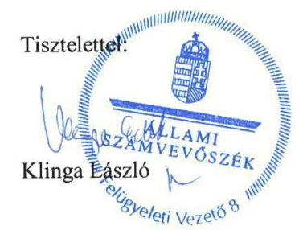

---

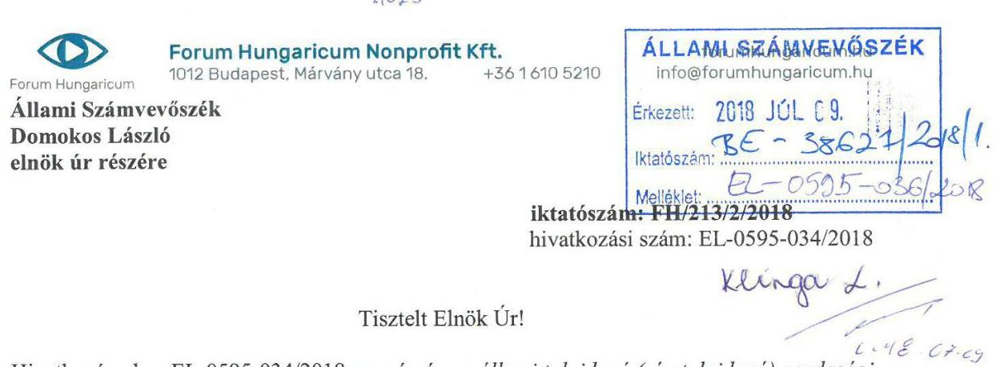

Tisztelt Elnök Úr!
Hivatkozással az EL-0595-034/2018-as számú „az állami tulajdonú (résztulajdonú) gazdasági társaságok ellenőrzése Forum Hungaricum Nonprofit Kft." tárgyában készült számvevőszéki jelentéstervezetre az alábbi észrevételeket teszem:
2017. január 1-től a Forum Hungaricum Nonprofit Kft. ügyvezetésében változás történt. Az új ügyvezetés a fellelt eljárásrendet és kockázatkezelési rendszert felülvizsgálta, és a vonatkozó hazai és nemzetközi iránymutatásokat figyelembe véve új módszert és ehhez kapcsolódó dokumentációs rendszert épített fel, melyet legfőképpen a pénzgazdálkodási jogkörök gyakorlása kapcsán hasznosít.

Az Állami Számvevőszék által megfogalmazott javaslatokkal kapcsolatban szükséges intézkedések a 2017. évben megtörténtek így:

- felülvizsgálatra került valamennyi hatályban lévő szabályzat, melynek eredményeként teljesen új szerkezetű pénzügyi-, számviteli, és egyéb szabályzatok készültek. A szabályzatok hatálybaléptetése a 2017. évben megtörtént.
- a társaság a könyvvezetési kötelezettségét a számviteli törvény előírásai szerint szabályszerűen kiállított bizonylat alapján külső szolgáltató közreműködésével teljesíti.

A 2013-2016. évek vonatkozásában a szabályszerű működés biztosítására visszamenőlegesen, az új ügyvezetésnek már nem volt
 lehetősége.

Szeretném megköszönni az Állami Számvevőszék munkatársai által elvégzett munkát, mellyel felhívták figyelmünket az átláthatóság és az elszámoltathatóság javításához szükséges jó gyakorlatra, ezzel is segítve az állami vagyonnal való gazdálkodás átláthatóságának és elszámoltathatóságának javítását.

Budapest, 2018. július 3.
Tisztelettel
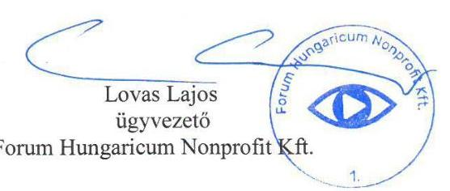

---

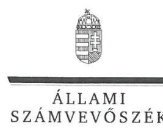

ELNÖK

Ikt.szám: EL-0595-042/2018.

# Lovas Lajos úr 

ügyvezető
Forum Hungaricum Nonprofit Kft.

## Budapest

## Tisztelt Ügyvezető Úr!

Köszönettel vettem „Az állami tulajdonú gazdasági társaságok ellenőrzése - Forum Hungaricum Nonprofit Kft." című ellenőrzésről készített számvevőszéki jelentéstervezetre megküldött észrevételeit.
Az Állami Számvevőszék észrevételekre vonatkozó álláspontját a felügyeleti vezető által készített részletes tájékoztatás tartalmazza, amelyet levelemhez mellékeltem.
Tájékoztatom Ügyvezető urat, hogy az Állami Számvevőszék a figyelembe nem vett észrevételeket az Állami Számvevőszékről szóló 2011. évi LXVI. törvény 29. § (3) bekezdésében előírtak szerint köteles a jelentésében feltüntetni és megindokolni, hogy azokat miért nem fogadta el.

Budapest, 2018. 0. hó 10. nap
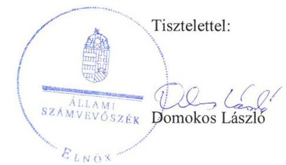

Melléklet: Tájékoztatás az észrevételek kezeléséről

---

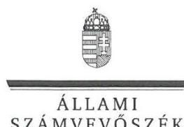

# Tájékoztatás az észrevételek kezeléséről 

Megköszönöm Ügyvezető úrnak „Az állami tulajdonú gazdasági társaságok gazdálkodásának ellenőrzése - Forum Hungaricum Nonprofit Kft. " címmel készített jelentés-tervezetre tett észrevételét. Az észrevétel kezeléséről az alábbi tájékoztatást adom:
Ügyvezető úr észrevételében a 2017. évben megtett intézkedésekről, ennek keretében új szerkezetű pénzügyi-, számviteli és egyéb szabályzatok hatályba léptetéséről, valamint a könyvvezetési kötelezettség külső szolgáltató közreműködésével történő teljesítéséről tájékoztatott.
Tájékoztatását köszönettel tudomásul vettem. Az észrevétel az ellenőrzött 2013-2016. évekre tett megállapítást nem vitatta, megállapításunkat megerősítette, így a jelentéstervezet módosítása nem indokolt. Tájékoztatom, hogy az ÁSZ tv. 33. § (1) bekezdésében foglaltak értelmében az ellenőrzött szervezet vezetője köteles a jelentésben foglalt megállapításokhoz kapcsolódó intézkedési tervet összeállítani és azt a jelentés kézhezvételétől számított 30 napon belül az ÁSZ részére megküldeni.

Budapest, 2018. augusztus 10.
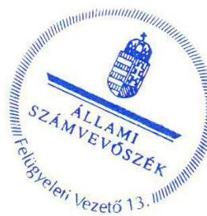

Tisztelettel:

Klinga László

---

# RÖVIDÍTÉSEK JEGYZÉKE 

${ }^{1}$ MHSZ
${ }^{2}$ NKÖM
${ }^{3}$ Társaság
${ }^{4}$ KIM
${ }^{5}$ IM
${ }^{6}$ megbízási szerződés
${ }^{7}$ MNV Zrt.
${ }^{8} \mathrm{KIH}$
${ }^{9}$ kormányrendeletek
${ }^{10}$ NGM
${ }^{11}$ NGM közlemény3-4
${ }^{12}$ ÁSZ
${ }^{13}$ ÁSZ tv.
${ }^{14}$ KIM-SZMSZ1-6

Magyar Szabadalmi Hivatal
Nemzeti Kulturális és Örökségvédelmi Hivatal
Forum Hungaricum Nonprofit Kft.
Közigazgatási és Igazságügyi Minisztérium
Igazságügyi Minisztérium
az Igazságügyi Minisztérium és a Magyar Nemzeti Vagyonkezelő Zrt. között létrejött SZT 39.125 számú, a társasági részesedés tulajdonosi jogok gyakorlására vonatkozó megbízási szerződés
Magyar Nemzeti Vagyonkezelő Zrt.
Közigazgatási és Igazságügyi Hivatal
az egyes miniszterek, valamint a Miniszterelnökséget vezető államtitkár feladatai és hatásköréről szóló 212/2010. (VII. 1.) Korm. rendelet (hatályos: 2010. július 1-jétől 2014. június 5-ig) és a Közigazgatási és Igazságügyi Hivatalról szóló 177/2012. (VII. 26.) Korm. rendelet (hatályos: 2012. július 27-től 2016. augusztus 31-ig)
Nemzetgazdasági Minisztérium
${ }_{1}$ NGM közlemény - a kormányzati szektorba sorolt egyéb szervezetekről (hatályos: 2012. február 16-tól)
${ }_{2}$ NGM közlemény - a kormányzati szektorba sorolt egyéb szervezetekről (hatályos: 2013. június 28-tól)
${ }_{3}$ NGM közlemény - a kormányzati szektorba sorolt egyéb szervezetekről (hatályos: 2013. december 16-tól)
${ }_{4}$ NGM közlemény - a kormányzati szektorba sorolt egyéb szervezetekről (hatályos: 2015. december 30-tól)
Állami Számvevőszék
2011. évi LXVI. törvény az Állami Számvevőszékről, hatályos 2011. július 1-jétől. ${ }_{1}$ a 38/2012. (XI. 16.) KIM utasítás alapján módosított Közigazgatási és Igazságügyi Minisztérium Szervezeti és Működési Szabályzatáról szóló 17/2010. (VIII. 31.) KIM utasítás (hatályos: 2012. november 17-től 2013. január 25-ig) ${ }_{2}$ az 5/2013. (I. 25.) KIM utasítás alapján módosított Közigazgatási és Igazságügyi Minisztérium Szervezeti és Működési Szabályzatáról szóló 17/2010. (VIII. 31.) KIM utasítás (hatályos: 2013. január 26-tól 2013. május 17-ig)
${ }_{3}$ a 16/2013. (V. 17.) KIM utasítás alapján módosított Közigazgatási és Igazságügyi Minisztérium Szervezeti és Működési Szabályzatáról szóló 17/2010. (VIII. 31.) KIM utasítás (hatályos: 2013. május 18-tól 2013. június 18-ig)
${ }_{4}$ a 17/2013. (VI. 18.) KIM utasítás alapján módosított Közigazgatási és Igazságügyi Minisztérium Szervezeti és Működési Szabályzatáról szóló 17/2010. (VIII. 31.) KIM utasítás (hatályos: 2013. június 19-től 2013. szeptember 13-ig) ${ }_{5}$ a 29/2013. (IX. 13.) KIM utasítás alapján módosított a Közigazgatási és Igazságügyi Minisztérium Szervezeti és Működési Szabályzatáról szóló 17/2010. (VIII. 31.) KIM utasítás (hatályos: 2013. szeptember 14-től 2013. október 25-ig) ${ }_{6}$ a 33/2013. (X. 25.) KIM utasítás alapján módosított Közigazgatási és Igazságügyi Minisztérium Szervezeti és Működési Szabályzatáról szóló 17/2010. (VIII. 31.) KIM utasítás (hatályos: 2013. október 26-tól 2014. január 13-ig)

---

${ }^{15}$ Alapító Okirat1-8
${ }^{16}$ Taktv.
${ }^{17}$ Ectv.
${ }^{18} \mathrm{FB}$
${ }^{19} \mathrm{Gt}$.
${ }^{20}$ MNV-SZMSZ ${ }_{1-2}$
${ }^{21}$ MNV Zrt. belső szabályzatai
${ }^{22}$ Ptk.
${ }^{23}$ Számv.tv.
${ }_{1}$ a 10/2012. számú alapítói határozat alapján 2012. október 8-án egységes szerkezetbe foglalt Alapító Okirat (hatályos: 2012. november 19-től)
${ }_{2}$ a 4/2013. számú alapítói határozat alapján 2013. július 5-én egységes szerkezetbe foglalt Alapító Okirat, melyben hatályosításra került az ügyvezető 1/2013. számú alapítói határozat szerinti újraválasztásával összefüggő adatok (hatályos: 2013. augusztus 12-től)
${ }_{3}$ a 10/2013. és 12/2013. számú alapítói határozatok alapján 2013. július 31-én egységes szerkezetbe foglalt Alapító Okirat (hatályos: 2013. augusztus 12-től) ${ }_{4}$ a 16/2013. és 17/2013. számú alapítói határozatok alapján 2013. október 14-én egységes szerkezetbe foglalt Alapító Okirat (hatályos: 2013. október 24-től) ${ }_{5}$ az 1/2014. számú alapítói határozat alapján 2014. január 23-án egységes szerkezetbe foglalt Alapító Okirat (hatályos: 2014. január 29-től)
${ }_{6}$ a 6/2014. számú alapítói határozat alapján 2014. augusztus 5-én egységes szerkezetbe foglalt Alapító Okirat (hatályos: 2014. augusztus 18-tól)
${ }_{7}$ a 22/2015. (I.12.), 56/2015.(III.26) és a 265/2015. (VII.30.) számú alapítói határozatok alapján 2015. október 3-án egységes szerkezetbe foglalt Alapító Okirat (hatályos: 2015. november 6-tól)
${ }_{8}$ a 65/2016. (II. 25.), 457/2016. (VI.15) számú alapítói határozatok alapján 2016. augusztus 10. napján egységes szerkezetbe foglalt Alapító Okirat, valamint a 621/2016. (X.13.) alapítói határozat szerinti székhelymódosítás (hatályos: 2016. november 21-től)
a köztulajdonban álló gazdasági társaságok takarékosabb működéséről szóló 2009. évi CXXII. törvény (hatályos: 2009. december 4-től)
az egyesülési jogról, a közhasznú jogállásról, valamint a civil szervezetek működéséről és támogatásáról szóló 2011. évi CLXXV. törvény (hatályos: 2012. január 1-jétől)
A Társaság Felügyelőbizottsága
a gazdasági társaságokról szóló 2006. évi IV. törvény (hatályos: 2006. július 1-jétől 2014. március 14-ig)
${ }_{1}$ A Magyar Nemzeti Vagyonkezelő Zrt. 430/2013. (VI. 17.) IG. számú határozattal jóváhagyott Szervezeti és Működési Szabályzata (hatályos: 2013. július 1-től 2016. április 14-ig)
${ }_{2}$ A Magyar Nemzeti Vagyonkezelő Zrt. 158/2016. (IV.06.) IG. számú határozattal jóváhagyott Szervezeti és Működési Szabályzata (hatályos: 2016. április 15-től)
Döntés-előkészítési Szabályzat, a Portfóliós Kódex, a Tulajdonosi Ellenőrzési Szabályzat, a Feladatköri és Hatásköri Szabályzat, a Monitoring Szabályzat, Értékelő Értekezletek Rendje
a Polgári Törvénykönyvről szóló 2013. évi V. törvény (hatályos: 2014. március 15-től)
a számvitelről szóló 2000. évi C. törvény (hatályos: 2010. január 1-jétől)

---

ÁLLAMI SZÁMVEVŐSZÉK
1052 Budapest, Apáczai Csere János utca 10.
Levélcím: 1364 Budapest 4. Pf. 54
Telefon: +36 14849100 Telefax: +36 14849200
www.asz.hu
