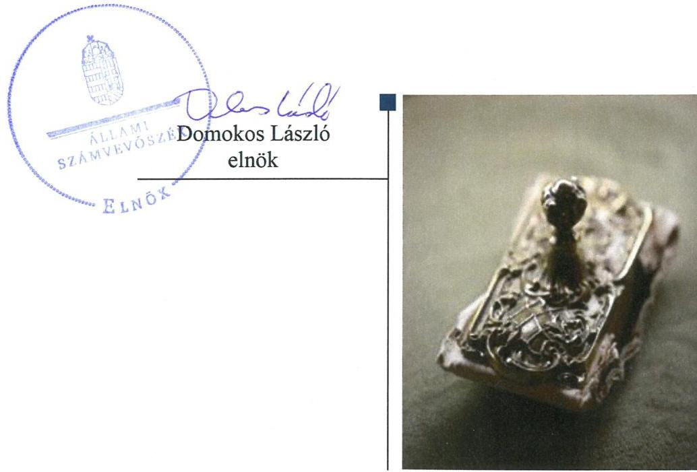
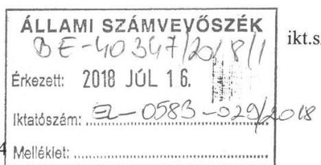
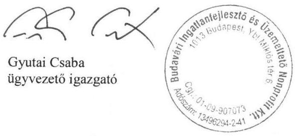
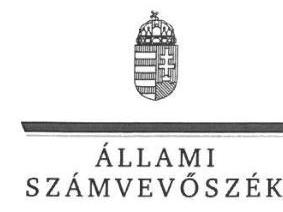
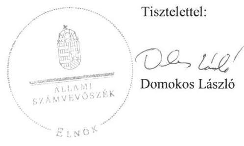
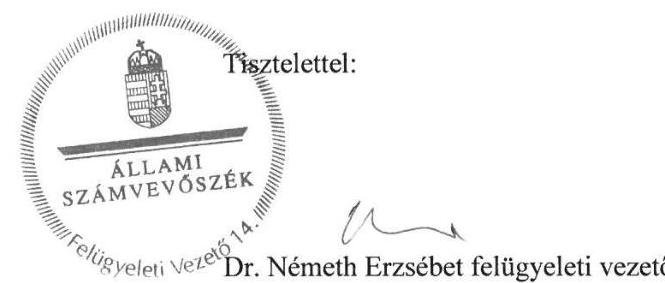
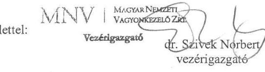
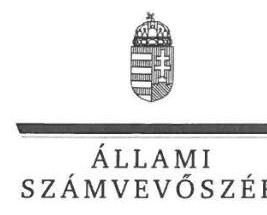
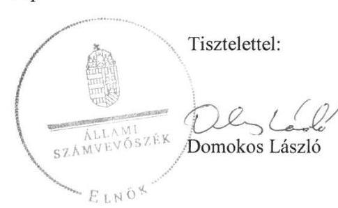
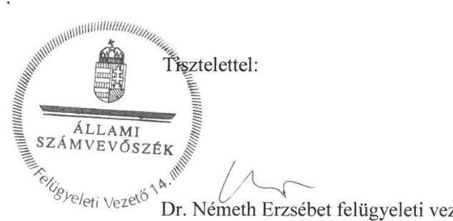

# Jelentés 

## Az állami tulajdonú gazdasági társaságok ellenőrzése

Budavári Ingatlanfejlesztő és Üzemeltető Nonprofit Kft.
2018.

18220
www.asz.hu

---

# Jelentés 

## Az állami tulajdonú gazdasági társaságok ellenőrzése

Budavári Ingatlanfejlesztő és
Üzemeltető Nonprofit Kft.
2018. 0 hó 28. nap

---

# AZ ELLENŐRZÉST FELÜGYELTE:

DR. NÉMETH ERZSÉBET felügyeleti vezető

## AZ ELLENŐRZÉST VEZETTE ÉS A VÉGREHAJTÁSÁÉRT FELELŐS:

DR. NAGY JUDIT ellenőrzésvezető

## A PROGRAM ÖSSZEÁLLÍTÁSÁÉRT FELELŐS:

TÓTPÁL SZABOLCS osztályvezető

IKTATÓSZÁM: EL-0399-030/2017

TÉMASZÁM: 2469

ELLENŐRZÉS-AZONOSÍTÓ SZÁM: V081420

Jelentéseink az Országgyűlés számítógépes hálózatán és az Interneten a www.asz.hu címen is olvashatóak.

---

# TARTALOMJEGYZÉK 

■ ÖSSZEGZÉS ..... 5
■ AZ ELLENŐRZÉS CÉLJA ..... 6
■ AZ ELLENŐRZÉS TERÜLETE ..... 7
■ AZ ELLENŐRZÉS HÁTTERE, INDOKOLTSÁGA ..... 9
■ A JELENTÉS LÉNYEGES KÉRDÉSKÖREI ..... 10
■ AZ ELLENŐRZÉS HATÓKÖRE ÉS MÓDSZEREI ..... 11
■ MEGÁLLAPÍTÁSOK ..... 12
■ JAVASLATOK ..... 15
■ MELLÉKLETEK ..... 17
I. sz. melléklet: Értelmező szótár ..... 17
■ FÜGGELÉK: ÉSZREVÉTELEK ..... 19
■ RÖVIDÍTÉSEK JEGYZÉKE ..... 29

---

.

---

# ÖSSZEGZÉS 

A Budavári Ingatlanfejlesztő és Üzemeltető Nonprofit Kft. működése nem volt szabályozott, vagyongazdálkodása nem volt szabályszerű. A közvagyonnal való felelős gazdálkodás nem volt biztosított. Közzétételi kötelezettségének nem tett eleget, ezért tevékenysége nem volt átlátható.

## Az ellenőrzés társadalmi indokoltsága

Az állami tulajdonú gazdálkodó szervezetek a nemzeti vagyon részét képezik. Az állami vagyonnal való gazdálkodást illetően a tulajdonosi joggyakorlás és vagyongazdálkodás feladata az állami vagyon átlátható, rendeltetésszerű és felelős felhasználásának biztosítása. Minden közpénzt, közvagyont használó szervezettel szemben társadalmi igény, hogy tevékenységéről elszámoljon.

A Budavári Ingatlanfejlesztő és Üzemeltető Nonprofit Kft. az ellenőrzött időszakban állami vagyontárgyakra vonatkozó projektek kivitelezési, valamint az elkészült fejlesztések tekintetében üzemeltetési, hasznosítási feladatokat látott el. Az Állami Számvevőszék 2013-2016. évekre kiterjedő ellenőrzése során arra kereste a választ, hogy szabályszerű volt-e a közfeladatokat ellátó társaság 2016. évi gazdálkodása és az ehhez kapcsolódó tulajdonosi joggyakorlás.

## Főbb megállapítások, következtetések, javaslatok

A Forster Gyula Nemzeti Örökségvédelmi és Vagyongazdálkodási Központ a tulajdonosi jogait szabályszerűen gyakorolta. Ugyanakkor a Felügyelőbizottság 2016-ban nem rendelkezett ügyrenddel.

A Budavári Ingatlanfejlesztő és Üzemeltető Nonprofit Kft. a működését megalapozó szabályozást nem alakította ki. A jogszabályban előírt szabályzatok hiányában a számviteli elszámolások és a vagyon nyilvántartása nem volt szabályozott. Vagyongazdálkodása nem volt szabályszerű, mert számviteli beszámolói leltárral nem voltak alátámasztva. Az üzemeltetésből fakadó nyilvántartási és leltározási kötelezettségeinek nem tett eleget, ezért a közvagyonnal való felelősségteljes gazdálkodás nem volt biztosított. Közérdekű adatokra vonatkozó közzétételi kötelezettségének a Budavári Ingatlanfejlesztő és Üzemeltető Nonprofit Kft. nem tett eleget.

---

# AZ ELLENŐRZÉS CÉLJA 

Az ellenőrzés célja annak értékelése volt, hogy a tulajdonosi jogok gyakorlása szabályszerű volt-e; a gazdálkodószervezet szabályozottsága, gazdálkodása és vagyongazdálkodási tevékenysége megfelelt-e a jogszabályi és a tulajdonosi előírásoknak; a vagyonváltozást eredményező döntések esetében a tulajdonosi jogok gyakorlója és a gazdálkodó szervezet szabályszerűen jártak-e el.

---

# AZ ELLENŐRZÉS TERÜLETE

## Budavári Ingatlanfejlesztő és Üzemeltető Nonprofit Kft.

A Társaságot1 2005. május 25-én alapították projektcégként, mélygarázs kivitelezés és üzemeltetés céllal, 3,4 M Ft jegyzett tőkével. 2013. december 6-án a Magyar Állam képviseletében eljáró MNV Zrt.2 megvásárolta a Társaságot, amely így kizárólagos állami tulajdonba került. 2013. december 20-án alapítói határozat alapján tőkeemelésre került sor, a jegyzett tőkét 103,4 M Ft-ra emelték3.

A tulajdonosi jogokat 2013. december 6. és 2014. szeptember 11. között az MNV Zrt., ezt követően az Nvtv.4 8. § (7) bekezdés szerinti megbízáson5 alapuló meghatalmazással a Miniszterelnökség gyakorolta. 2015. november 1-től a Társaság tulajdonosi joggyakorlója az NFM rendelet6 alapján kötött megállapodás7 szerint a Miniszterelnökség irányítása alatt álló a Forster Központ8 volt. A Forster Központ megszűnését követően az NFM rendelet9 alapján a tulajdonosi jogokat 2018. december 31-ig a Miniszterelnökség gyakorolja.

A Társaság megépítette a mélygarázst és rendelkezett annak hasznosítási jogával a Társaság és a Kincstári Vagyoni Igazgatóság között létrejött szerződés alapján.

A Társaság 2015-ben megkezdte a "Nemzeti Hauszmann Terv a budai Várnegyed megújításáért" projekt megvalósítását, mint beruházó.

A Társaság a Forster Központtal 2015. december 28-án— a Kastély- és Várprogram10 megvalósítására, valamint egyéb ingatlanok üzemeltetési (beruházási) feladatainak ellátására —, Üzemeltetési Szerződés11-t kötött, amelynek alapján a Forster Központ ezen közfeladatait a Társaság útján látta el. Az Üzemeltetési Szerződés módosításával a tevékenységi kört 2016. március 2-től kibővítették informatikai üzemeltetési és rendezvényszervezési feladatok ellátásával.

Alapítói határozat alapján a Társaság 2015. február 6-tól nonprofit működést folytatott, ezért az Alapító Okirat12 kiegészítésre került, a Ctv13 9/F. § (2) bekezdésével összhangban, azzal, hogy a Társaság gazdálkodása során elért nyereséget nem oszthatta fel, az a Társaság vagyonát gyarapította.

A Társaság nem rendelkezett vagyonkezelésbe vett vagyonnal, tulajdonosi részesedéssel más gazdasági társaságokban.

A Társaság mérlegfőösszege a tevékenység bővülésének köszönhetően az ellenőrzött időszakban többszörösére, 2.588,5 M Ft-ról 33.373,2 M Ft-ra nőtt. Az értékesítés nettó árbevétele ingatlan üzemeltetésből származott. A Társaság, mint projekt cég befejezetlen készletként és aktivált saját teljesítményként mutatta ki azokat a beruházásokat, felújításokat, amelyeket a befejezéskor át kellett adnia. Az üzemeltetett ingatlanokhoz kapcsolódó felújításokat beruházásként tartotta nyilván. A saját tőke, jegyzett tőke arány megfelelt a jogszabályi előírásoknak.

---

Az Ügyvezető14 személye az ellenőrzött időszak során többször változott, a jelenlegi ügyvezető 2016. július 19-től látja el feladatait. A Társaság árképzését jogszabály nem írta elő.

---

# AZ ELLENŐRZÉS HÁTTERE, INDOKOLTSÁGA 

Az állami tulajdonú gazdálkodó szervezetek ellenőrzése kiemelten fontos a nemzeti vagyon megőrzése, megóvása érdekében. Gazdálkodásuk jellemzően a közérdeklődés és a média figyelmének középpontjában áll, amihez hozzájárul a gazdálkodásuk körébe tartozó - közvetlen vagy közvetett állami tulajdonú - vagyon nagysága. Az ÁSZ15 középtávra szóló stratégiájában megfogalmazta, hogy az államháztartáson kívülre nyújtott költségvetési támogatások és ingyenes vagyonjuttatások, valamint az államháztartáson kívül működő közfeladat-ellátó rendszerek ellenőrzéseivel hozzájárul ahhoz, hogy a közpénzeket az államháztartáson kívül működő szervezetek is átlátható, rendezett módon használják fel. Az ellenőrzés megállapításai és javaslatai hozzájárulhatnak a nemzeti vagyonnal való gazdálkodás átláthatóságának, elszámoltathatóságának javításához. Az ellenőrzési tapasztalatok segítik és erősítik az ÁSZ hozzáadott értéket teremtő tevékenységét és tanácsadó szerepét is, mivel az ellenőrzés rámutathat az állami tulajdonú gazdálkodó szervezetek gazdálkodási tevékenységével kapcsolatos jó gyakorlatokra és szabálytalanságokra, felhívhatja a figyelmet a jogszabályi követelmények teljesítéséhez szükséges feltételek hiányosságaira.

---

# A JELENTÉS LÉNYEGES KÉRDÉSKÖREI 

1.     - A tulajdonosi jogok gyakorlása szabályszerű volt-e?
2.     - A Társaság működésének szabályozottsága megfelelt-e az előírásoknak, szabályszerű volt-e a pénzügyi-számviteli, adatszolgáltatási feladatok ellátása, valamint a vagyongazdálkodás?

---

# AZ ELLENŐRZÉS HATÓKÖRE ÉS MÓDSZEREI 

## Az ellenőrzés típusa

Megfelelőségi ellenőrzés.

## Az ellenőrzött időszak

2013. december 6-tól - 2016. december 31-ig, illetve a Budavári Ingatlanfejlesztő és Üzemeltető Nonprofit Kft. esetében a 2016. évi éves beszámoló jóváhagyásáig tartó időszak.

## Az ellenőrzés tárgya

Állami tulajdonban (résztulajdonban) lévő gazdasági társaság gazdálkodása, kiemelten vagyongazdálkodási tevékenysége, illetve a tulajdonosi jogok gyakorlása.

## Az ellenőrzött szervezet

Budavári Ingatlanfejlesztő és Üzemeltető Nonprofit Kft. és tulajdonosi joggyakorlói: a Magyar Nemzeti Vagyonkezelő 2013.12.13-tól 2014. 09.11-ig, a Miniszterelnökség 2014.09.12-től 2015.11.01-ig, a Forster Gyula Nemzeti Örökségvédelmi és Vagyongazdálkodási Központ 2015.11.01-től 2016.12.31-ig

## Az ellenőrzés jogalapja

Az ellenőrzés jogalapját az ÁSZ tv.16 1. § (3) bekezdése és 5. § (3) (5) bekezdései képezik.

## Az ellenőrzés módszerei

Az ellenőrzést az ellenőrzési program ellenőrzési kérdései, az ellenőrzött időszakban hatályos jogszabályok, az ellenőrzés szakmai szabályok és módszertanok figyelembe vételével végeztük el.

Az ellenőrzött szervezetek az ellenőrzés lefolytatásához tanúsítványok kitöltésével, valamint az ÁSZ által kért dokumentumok megküldésével szolgáltattak adatokat.

---

# 1. A tulajdonosi jogok gyakorlása szabályszerű volt-e? 

Összegző megállapítás

A tulajdonosi jogok gyakorlása szabályszerű volt. A Felügyelőbizottság azonban 2016-ban ügyrenddel nem rendelkezett.

A TULAJDONOSI JOGGYAKORLÓ17 a tulajdonosi joggyakorlás kereteit, a Társaság tevékenysége monitoringjának rendjét belső előírásaiban rögzítette. Ugyanakkor a Forster Központ - mint tulajdonosi joggyakorló - Vhr.18 14. § (3) bekezdésében foglaltak ellenére nem rendelkezett vagyonnyilvántartási szabályzattal.

A Tulajdonosi Joggyakorló az Alapító Okiratban - a jogszabályok előírásai alapján eljárva - meghatározta az alapítói hatáskörbe tartozó döntéseket, úgymint a számviteli törvény szerinti beszámoló, a javadalmazási szabályzat, a felügyelőbizottsági ügyrend jóváhagyását.

Három tagú Felügyelőbizottság létrehozásáról, hatásköréről is rendelkezett a Tulajdonosi Joggyakorló az Alapító Okiratban. A Felügyelőbizottság -hatáskörében szabályszerűen eljárva - tárgyalta a számviteli beszámolókat, az üzleti terveket, a Társaság tevékenységéről szóló negyedéves beszámolókat, könyvvizsgáló választást, az alapítói határozatok végrehajtásának ellenőrzését, az ügyvezető változással összefüggő feladatokat.

A Felügyelőbizottság munkatervvel igen, de 2016-ban ügyrenddel nem rendelkezett a Gt. 34. § (4) bekezdése és a Ptk.19 3:122. § (3) bekezdése előírásai ellenére.

Könyvvizsgálatra a Társaság nem az Alapító Okirat alapján volt kötelezett. A könyvvizsgáló személyét az Alapító Okiratban 2014. december 3-tól meghatározták.

A számviteli beszámolókat a tulajdonosi joggyakorló a Felügyelőbizottság írásbeli jelentésének birtokában hagyta jóvá, 2014-2016. üzleti évek vonatkozásában.20 A 2013. üzleti évre vonatkozó számviteli beszámoló megtárgyalása során a Felügyelőbizottság utólagos könyvvizsgálói felülvizsgálatot írt elő és a Tulajdonosi Joggyakorló ezután határozott a 2013. évi számviteli beszámoló jóváhagyásáról.21

Ellenőrzési jogosítványait a Tulajdonosi Joggyakorló a Társaságtól bekért, kontrolling adatszolgáltatás keretében gyakorolta.

A Forster Központ mint tulajdonosi Joggyakorló - a Taktv.22 5. § (3) bekezdésében foglalt előírás ellenére- nem alkotott szabályzatot a vezető tisztségviselők, felügyelőbizottsági tagok, valamint az Mt.23 208. §-ának hatálya alá eső munkavállalók javadalmazása, valamint a jogviszony megszűnése esetére biztosított juttatások módjának, mértékének elveiről, annak rendszeréről,

# 2. A Társaság működésének szabályozottsága megfelelt-e az előírásoknak, szabályszerű volt-e a pénzügyi-számviteli, adatszolgáltatási feladatok ellátása, valamint a vagyongazdálkodás? 

Összegző megállapítás

### 2.1. számú megállapítás

A Társaság működésének szabályozottsága nem felelt meg az előírásoknak, a pénzügyi-számviteli, adatszolgáltatási feladatok ellátása, valamint a vagyongazdálkodás nem volt szabályszerű.

A Társaság nem rendelkezett alapvető számviteli szabályzatokkal.
A Társaság Szervezeti és Működési Szabályzatában24 a gazdálkodásának kereteit, a Saját Vagyoni Kontrolling Szabályzatban25 az üzleti folyamatait szabályozta.

A Társaság a Számv. tv. 14. § (3) bekezdésében előírt és a jogszabályi előírások szerinti számviteli politikával 2016. január 1-től rendelkezett.

A Társaság nem készítette el a Számv. tv. 14. § (5) bekezdés b) pontjában és a Számviteli Politika I. fejezetében előírt eszközök és források értékelési szabályzatát.

A Társaság nem rendelkezett az eszközök és források leltárkészítési és leltározási szabályzatával, ezzel nem tett eleget a Számv. tv. 14. § (5) bekezdés a) pontja és a Számviteli Politika I. fejezete előírásainak.

A Társaság 2016. július 5-től rendelkezett, a Számv. tv. 14. § (5) bekezdés d) pontjában előírt, szabályszerű Pénzkezelési Szabályzattal.26

A Társaság nem tett eleget az Info tv. 30. § (6) bekezdésben foglalt, a közérdekű adatok megismerésére irányuló igények teljesítésének rendjét rögzítő szabályzat készítési kötelezettségének.

A pénzügyi-számviteli, adatszolgáltatási feladatok ellátása nem volt szabályszerű. A Társaság nem tett eleget az üzemeltetéshez kapcsolódó elkülönített nyilvántartási kötelezettségének, valamint közzétételi kötelezettségének.

A Társaság - az Üzemeltetési Szerződés V. 10. pontja ellenére - nem gondoskodott az üzemeltetés bevételei és ráfordításainak elkülönített nyilvántartásáról. Nem tartotta nyilván -
 az Üzemeltetési Szerződés VI. C. 3. b. pontjában meghatározottakkal ellentétben -, az üzemeltetés keretében átvett ingó- és ingatlan vagyont.

A Számv. tv.-ben előírt szabályzatok hiányában a bevételek, ráfordítások, az értékcsökkenés elszámolása, és a vagyon nyilvántartása nem volt szabályozott, ezért nem volt szabályszerű.

A 2013-2015. üzleti évről készült számviteli beszámolók letétbe helyezése, a Számv. tv. 153. § (1) bekezdése előírásai ellenére, határidőn túl történt ${ }^{27}$, és a 2013. évi számviteli beszámoló letétbe helyezése időpontjában

---

nem állt rendelkezésre a Tulajdonosi Joggyakorló elfogadó határozata. A 2016. évi számviteli beszámoló letétbe helyezése a jogszabályi előírások szerint történt.

A Taktv. 2. § (1) bekezdésének ca) pontjában előírtak ellenére a Társaság vezető tisztségviselőinek és az Mt. 208. §-a szerinti vezető állású munkavállalóinak nyújtott pénzbeli juttatásokat nem tették közzé.

A Társaság nem tett eleget az Info. tv. 37. § (1) bekezdésében előírt közzétételi kötelezettségének, nem tette közzé az Info. tv. 1. számú mellékletében előírtakat.

# 2.3. számú megállapítás 

A Társaság vagyongazdálkodása nem volt szabályszerű.
A Számv. tv.-ben előírt szabályzat hiányában a Társaság nem támasztotta alá a 2016. évi számviteli beszámolóját szabályszerű leltárral; nem készítette el az üzemeltetésre átvett eszközökről, az Üzemeltetési Szerződés VI. C.4. pontjában és a Leltározási Utasítás ${ }_{2}{ }^{28}$-ban előírt leltárakat.

A könyvvizsgáló a Számv. tv.-ben előírt szabályzatok és a leltárak hiánya ellenére a Társaság 2014-2016. évi számviteli beszámolóit korlátozás nélküli hitelesítő záradékkal látta el.

---

# JAVASLATOK 

Az ÁSZ tv. 33. § (1) bekezdésében foglaltak értelmében az ellenőrzött szervezet vezetője köteles a jelentésben foglalt megállapításokhoz kapcsolódó intézkedési tervet összeállítani és azt a jelentés kézhezvételétől számított 30 napon belül az ÁSZ részére megküldeni. Amennyiben az ellenőrzött szervezet vezetője nem küldi meg határidőben az intézkedési tervet, vagy továbbra sem elfogadható intézkedési tervet küld, az Állami Számvevőszék elnöke az ÁSZ tv. 33. § (3) bekezdése a) és b) pontjaiban foglaltakat érvényesítheti.

## a Budavári Ingatlanfejlesztő és Üzemeltető Nonprofit Kft. ügyvezetőjének

1. Gondoskodjon az eszközök és források értékelési szabályzatának, valamint az eszközök és források leltárkészítési és leltározási szabályzatának elkészítéséről a Számv. tv. előírásainak megfelelően.
(2.1. sz. megállapítás 3. és 4. bekezdése alapján)
2. Gondoskodjon az Info tv. előírásainak megfelelően a közérdekű adatok megismerésére irányuló igények teljesítésének rendjét rögzítő szabályzat elkészítéséről.
(2.1. sz. megállapítás 6. bekezdése alapján)
3. Gondoskodjon az üzemeltetés bevételeinek és ráfordításainak elkülönített nyilvántartásáról, valamint az üzemeltetés keretében átadott vagyon nyilvántartásáról az Üzemeltetési Szerződésnek megfelelően.
(2.2 sz. megállapítás 1. bekezdése alapján)
4. Gondoskodjon az Info tv. és a Taktv. által előírt közzétételi kötelezettségek teljesítéséről.
(2.2. sz. megállapítás 4. és 5. bekezdése alapján)
5. Intézkedjen az üzemeltetésre átvett eszközökre vonatkozó, az Üzemeltetési Szerződésnek és a Leltározási Utasításnak megfelelő leltár összeállításáról.
(2.3. sz. megállapítás 1. bekezdésének 2. tagmondata alapján)

---

.

---

# MELLÉKLETEK 

- I. SZ. MELLÉKLET: ÉRTELMEZŐ SZÓTÁR
állami vagyon
gazdasági társaság
állami vagyon hasznosítására kötött szerződés
nemzeti vagyon hasznosítása
nonprofit gazdasági társaság
tulajdonosi ellenőrzés
tulajdonosi joggyakorló
a) Az állam tulajdonában lévő dolog, valamint a dolog módjára hasznosítható természeti erő,
b) az a) pont hatálya alá nem tartozó mindazon vagyon, amely vonatkozásában törvény az állam kizárólagos tulajdonjogát nevesíti,
c) az állam tulajdonában lévő tagsági jogviszonyt megtestesítő értékpapír, illetve az államot megillető egyéb társasági részesedés,
d) az államot megillető olyan immateriális, vagyoni értékkel rendelkező jogosultság, amelyet jogszabály vagyoni értékű jogként nevesít.
e) az állam tulajdonában lévő pénzügyi eszközök
Forrás: Vtv. ${ }^{29}$ 1. § (2) bekezdése
A Ptk. 3:88. § (1) bekezdése szerint „a gazdasági társaságok üzletszerű közös gazdasági tevékenység folytatására, a tagok vagyoni hozzájárulásával létrehozott, jogi személyiséggel rendelkező vállalkozások, amelyekben a tagok a nyereségből közösen részesednek, és a veszteséget közösen viselik.
Az állami vagyon hasznosítására kötött szerződések elsődleges célja az állami vagyon hatékony működtetése, állagának védelme, értékének megőrzése, illetve gyarapítása, az állami és közfeladatok ellátásának elősegítése.
Forrás: Vtv. 23. § (2) bekezdése
A tulajdonosi joggyakorló vagy a nemzeti vagyon használója által a nemzeti vagyon birtoklásának, használatának, hasznok szedése jogának bármely - a tulajdonjog átruházását nem eredményező - jogcímen történő átengedése, ide nem értve a vagyonkezelésbe adást, valamint a haszonélvezeti jog alapítását.
Forrás: Nvtv. 3. § (1) 4. pont
Ctv. 9/F. § (2) bekezdése szerint „az a gazdasági társaság minősül nonprofit gazdasági társaságnak és cégnevében az a gazdasági társaság tüntetheti fel a nonprofit jelleget, amelynek létesítő okirata tartalmazza, hogy a gazdasági társaság tevékenységéből származó nyereség a tagok között nem osztható fel, hanem az a gazdasági társaság vagyonát gyarapítja." (hatályos 2014. március 15-től)
2014. március 15-től:

Az állami vagyon használóját, vagyonkezelőjét és haszonélvezőjét megillető jogok gyakorlását, annak szabályszerűségét, a kötelezettségek teljesítését, valamint a vagyon rendeltetése szerinti célszerűségét a tulajdonosi joggyakorló rendszeresen ellenőrzi.
Forrás: Vtv. 20. § (1)
Aki a nemzeti vagyon felett az államot vagy a helyi önkormányzatot megillető tulajdonosi jogok és kötelezettségek összességének gyakorlására jogosult.
Forrás: Nvtv. 3. § (1) 17. pontja

---

.

---

# FÜGGELÉK: ÉSZREVÉTELEK 

A jelentéstervezetet a Számvevőszék 15 napos észrevételezésre megküldte az ellenőrzött szervezetek vezetőinek az ÁSZ tv. 29. §* (1) bekezdése előírásának megfelelően.

A Budavári Ingatlanfejlesztő és Üzemeltető Nonprofit Kft. ügyvezető igazgatója, illetve a Magyar Nemzeti Vagyonkezelő Zrt. vezérigazgatója a jelentéstervezet megállapításaira észrevételt tett.
A függelék tartalmazza az ellenőrzöttek észrevételeit, illetve az el nem fogadott észrevételek elutasításának indoklását.

[^0]
[^0]:    * 29. § (1) Az Állami Számvevőszék az ellenőrzési megállapításait megküldi az ellenőrzött szervezet vezetőjének vagy az általa megbízott személynek, és annak, akinek személyes felelősségét állapította meg.
    (2) Az ellenőrzött szervezet vezetője és a felelősként megjelölt személy az ellenőrzés megállapításaira tizenöt napon belül írásban észrevételt tehet.
    (3) Az Állami Számvevőszék az észrevételre a beérkezésétől számított harminc napon belül írásban válaszol. A figyelembe nem vett észrevételeket köteles a jelentésben feltüntetni, és megindokolni, hogy azokat miért nem fogadta el.

---

# Állami Számvevőszék   Domokos László Elnök úr részére 

Budapest
Apáczai Csere János utca 10.
Postázási cím: 1364 Budapest 4., Pf.:54

Tárgy: Észrevétel az EL-0583-023/2018 iktatószámú 2018.06.29-én érkezett „Az állami tulajdonú gazdasági társaságok ellenőrzése - Budavári Ingatlanfejlesztő és Üzemeltető Nonprofit Kft." című jelentéstervezetre.

Tisztelt Elnök Úr!
Az elmúlt év során a Budavári Ingatlanfejlesztő és Üzemeltető Nonprofit Kft.-nél végzett ellenőrzésről szóló jelentés tervezetét köszönettel kézhez vettük, amelyhez a jogszabály adta lehetőséggel élve az alábbi észrevételeket tesszük.

A tárgyban hivatkozott iktatószámú jelentés Összegzés fejezetének megállapításai generálisan elmarasztalják a Budavári Ingatlanfejlesztő és Üzemeltető Nonprofit Kft. gazdálkodási tevékenységét és ügyvezetését, és nem érzékeltetik azokat a lépéseket, amelyek a szabályos működés kialakítására a vizsgált időszakban bekövetkezett utolsó ügyvezető váltást követően megtörténtek.
Javasoljuk az összegzést 2013. december 6-tól 2016.07.19-ig és ezt követően (Gyutai Csaba ügyvezetése) külön megtenni amennyiben lehetséges.
Kérjük rámutatni, hogy a Gyutai úr ügyvezetési időszakában jelentős fejlődés tapasztalható a hiányosságok pótlására, amely eredményeként az ellenőrzés időszakát követően, 2017. év során minden előírt szabályzat elkészült, többek között aktualizálásra került a számviteli politika, pénzkezelési szabályzat és elkészült a selejtezési szabályzat is.

Főbb megállapítások, következtetések, javaslatok fejezethez az alábbi észrevételt tesszük.
Kérjük mérlegelni a következőkben leírt tényt:

- A Társaság könyvében vagyonkezelésbe adott ingatlan és ingóság nem volt a vizsgált időszakban. 2016 évben a Forster Központtal kötött Üzemeltetési szerződés szerint a Forster Központnál vagyonkezelésben lévő ingatlanokat (Forster Központ könyvében kimutatott) üzemeltette, mely üzemeltetésben az elvárást és ellenőrzést a Forster Központ fogalmazta meg! Kérjük ezt az észrevételt a 2.2. számú megállapításnál is figyelembe venni!
- A beszámoló a számviteli törvény szerint megfelelően volt leltárral alátámasztva, melyet az éves audit jelentés is alátámaszt! Kérjük ezt az észrevételt a 2.3. számú megállapításnál is figyelembe venni!
- A Társaság a 2016.12.31-i Forster Központ beszámolóját alátámasztó mennyiségi leltárt a záró vagyonmérlege alapján 2017. évben végezte, melyhez a Forster Központ felkérésére a leltározási utasítást elkészítette és 2016.12.08-án hatályba léptette. Kérjük ezt az észrevételt a 2.3. számú megállapításnál is figyelembe venni.

A Társaság a leltározását a számviteli politikája alapján végzi. A tulajdonosi joggyakorló döntése alapján a Társaság összevonásra kerül a Várgondnokság KNKft.-vel. Az összeolvadást megelőzően mennyiségi leltárt a tárgyi eszközöknél a Várgondnokság KNKft.-nél tervezünk, melyre a Leltározási utasítás készítése folyamatban van.

---

A Budavári NKft. esetében mennyiségi leltározást nem tervezünk, mivel a Forster Központtól átvett könyv szerinti Befektetett vagyon rendezése 2017 és 2018 folyamán folyamatosan tart. Az ezt megelőző saját vagyon (nem vagyonkezelt) mennyiségi leltára 2017 év elején a 2016 éves mérlegbeszámoló alátámasztására megtörtént. A jogszabály három évenkénti mennyiségi leltárt ír elő. A Forster Központtól átvett ingatlanok vonatkozásában az MNV Zrt.-vel az egyező nyilvántartásba vétel megtörtént. Még szükséges rendezni a 2017; 2018 évi mozgásokat. A vagyonkezelési szerződés tervezetet július 4-én kaptuk meg MNV Zrt-től. Az ingóságok vonatkozásában még sok nyitott kérdés van, azok rendezése még folyamatban van!

- A Társaság a leltározását az adott évben kiadott leltározási ütemterv (utasítás) szerint végzi.

A részletes megállapítások 2.2 pontjához továbbá az alábbi észrevételeket füzzük:
A Társaságnak a vizsgált időszakban csak a Forster Központ nyilvántartásában lévő ingatlanok használatából (kivéve költség átterhelés) volt bevétele, melyet a könyvében elkülönített főkönyvi számokra könyvelt és a zárt kettős könyvelésén belül a közvetlenül felmerült költségeket és bevételeket még a használatba adott ingatlanonként is kimutatta un. részlegszámra könyvelési módszerrel. A könyvelési modulból a részlegszámra az adott ingatlan árbevétele, bevétele, költsége és ráfordítása bármikor lekérdezhető.

A Társaság 2016 évi főkönyvi kivonat főkönyvi számai az árbevétel vonatkozásában:
9111 Múzeumi belépők árbevétele
9112 Szálláshely szolgáltatás árbevétele
9113 Kávézó árbevétele
9114 Fotózási helyszín bérbeadás árbevétele
9115 Kiadványok, folyóiratok, könyvek árbevétele
9116 Fotójegy értékesítés árbevétele
9117 Képeslap, ajándéktárgyak árbevétele
9118 Ingatlan bérleti díjak árbevétele
9119 Ingatlan használati díj
9121 Parkolási díj bevétel
9122 Áruértékesítés
9123 TVIG gátengedély árusítás bevétele
913 Közszolg. és üzem. szerződés sz.költség átterhelés
914 Vállalkozási szerződés szerinti költség átterhelés
Ugyancsak a 2.2 megállapítással kapcsolatban jelezzük, hogy a Társaságunk a honlapja technikai adottságai miatt még valóban nem teljesítette a közérdekű adatok közzétételére vonatkozó kötelezettségeit, azonban a beszámolója, annak kiegészítő mellékletével és a könyvvizsgálói jelentéssel együtt határidőben feltöltésre került az Igazságügyi Minisztérium által működtetett http://e-beszamolo.im.gov.hu oldalra, ott bárki számára elérhető. Továbbá a beérkező közérdekű adatigénylésekre minden esetben a jogszabály által előírt határidőn belül választ adunk.
Folyamatban van a honlapunk fejlesztése, így a közeljövőben a közérdekű adatközlési kötelezettségünknek is eleget teszünk.

A részletes megállapítások 2.3 pontjához a fentieken túlmenően az alábbi észrevételeket füzzük:
A Társaság az adott év éves beszámolójához kapcsolódóan rendelkezett a Számviteli tv 69. § (1) bekezdés előírásainak megfelelő mérlegsorokat alátámasztó dokumentumokkal. A dokumentumok ellenőrizhető módon (vagyis egyedi azonosítóval ellátva), mennyiségben és értékben is kifejezve adták meg a részletezést. Attól, hogy a „LELTÁR" kifejezés a dokumentumokon nincs feltüntetve ez

---

un. ESZKÖZ-FORRÁS leltárnak tekinthető. A jogszabály a leltárak címére vonatkozó feltételt nem fogalmaz meg, a leltárakkal kapcsolatban csak tartalmi követelményt ír elő:
-tételesen és ellenőrizhető módon tartalmazza az eszközöket, illetve
 forrásokat
-a tételek mennyiségben és értékben is ki legyenek fejezve.
A könyvvizsgálat során a mérlegbeszámolót alátámasztó dokumentumokat ellenőrizték és a könyvvizsgáló megállapította, hogy azok megfelelnek a leltárnak, azok kellően alátámasztják a Társaság beszámolójának mérlegsorait.

A Társaság 2016. október *előtt* évenként más külső könyvelő céggel (sok esetben egy éven belül könyvelő cég váltás is történt) végeztette a könyvelést. 2016 évben is kétszer történt könyvelő iroda váltás és könyvelési szoftver váltás. A munka színvonalának emelése érdekében 2016. októbertől a könyvelést a társaság saját belső munkatársaival oldja meg.

Kérjük a fenti szakmai érvek figyelembe vételét a végleges jelentés megfogalmazásakor és elfogadásakor.

A tulajdonosi jogok gyakorlásával kapcsolatos megállapításokra kompetencia hiányában nem kívánunk észrevételt tenni.
Az ellenőrzés területét bemutató általános fejezet egy mondatát kérjük pontosítani: a Társaságunk nem kapott uniós támogatást a Nemzeti Hauszmann Terv előkészítésére és megvalósítására. Központi költségvetésből biztosított forrásokra szerződtünk a Miniszterelnökséggel, Forster Központtal. GINOP forrásból a Forster Központtal konzorciumi megállapodásban megvalósítandó Nemzeti Kastély- és Várprogramhoz tartozó projektek kaptak támogatást.
További apró pontosítás, hogy a Nemzeti Hauszmann Terv megvalósításában nem kivitelezőként vesz rész Társaságunk, hanem beruházóként.

Tisztelettel kérjük a fenti észrevételek alapján a megállapítások módosítását, az új ügyvezetés erőfeszítéseinek elismeréseként a javuló tendencia érzékeltetését.

Budapest, 2018. július 11.
Tisztelettel

---

ELNÖK

Ikt.szám: EL-0583-030/2018

# Gyutai Csaba Kálmán úr 

ügyvezető igazgató

Budavári Ingatlanfejlesztő és Üzemeltető Nonprofit Kft.

## Budapest

## Tisztelt Ügyvezető Úr!

„Az állami tulajdonú gazdasági társaságok ellenőrzése - Budavári Ingatlanfejlesztő és Üzemeltető Nonprofit Kft. " című jelentéstervezetre tett észrevételét köszönettel megkaptam.

Az ellenőrzési megállapításokra vonatkozó észrevételét az Állami Számvevőszékről szóló 2011. évi LXVI. törvény (a továbbiakban: ÁSZ tv.) 29. § (2) bekezdésében meghatározott tizenöt napos határidőn belül küldte meg. Az Állami Számvevőszék észrevétellel kapcsolatos álláspontját a mellékletként csatolt, a felügyeleti vezető által készített indokolás tartalmazza.

Tájékoztatom, hogy az Állami Számvevőszék a figyelembe nem vett észrevételeket az ÁSZ tv. 29. § (3) bekezdésében előírtak szerint köteles a jelentésében feltüntetni és megindokolni, hogy azokat miért nem fogadta el.

Budapest, 2018. augusztus 15. nap

Melléklet: Észrevételre adott válasz

---

# „Az állami tulajdonú gazdasági társaságok ellenőrzése - Budavári Ingatlanfejlesztő és 
Üzemeltető Nonprofit Kft. " című jelentéstervezethez tett észrevételre adott válasz Budavári Ingatlanfejlesztő és Üzemeltető Nonprofit Kft.

A jelentéstervezetre tett észrevételeket áttekintettem, annak kezelésével kapcsolatban a következő tájékoztatást adom.

1. Ügyvezető úr javasolja, hogy a jelentéstervezet Összegzés fejezetében foglalt megállapításokat Gyutai Csaba ügyvezetésének időszakára az Állami Számvevőszék külön tegye meg, illetve mutasson rá az ügyvezetése alatt tapasztalt fejlődésre.
Az észrevételre való tekintettel az Ellenőrzés területe fejezetet kiegészítjük az ügyvezető személyében bekövetkezett változás bemutatásával.
Tekintettel azonban arra, hogy a Megállapítások fejezet tartalmazza a részletes megállapításokat, az Összegzés fejezetben szereplő megállapítások pedig az ellenőrzött időszak egészére vonatkozóan, összegző értékeléseket tartalmaznak, az Összegző fejezet részletezését nem tartjuk indokoltnak.
2. Az üzemeltetés bevételeinek és ráfordításainak elkülönített nyilvántartására vonatkozó megállapításra tett észrevétel kapcsán ismételten áttekintettük az ellenőrzés rendelkezésére álló dokumentumokat és megállapítottuk, hogy a Számv. tv.-ben előírt szabályzatok nem álltak teljes körűen rendelkezésre, így nem volt biztosított az üzemeltetés bevételeinek és ráfordításainak elkülönítése. Erre való tekintettel a megállapítás módosítása nem indokolt.
Ügyvezető úr tájékoztatása szerint továbbá a Társaság kizárólag ingatlanokat üzemeltetett. Az ellenőrzés rendelkezésére álló dokumentumok felülvizsgálata nyomán megállapítható, hogy Társaság a Forster Központtal, 2015. december 28-án a Kastély- és Várprogram megvalósítására közszolgáltatási- és üzemeltetési szerződést kötött, melyet 2016. március 2-án módosítottak. A szerződésben meghatározottak szerint a közfeladatok átadásához a Magyar Állam tulajdonába és a Forster Központ vagyonkezelésébe tartozó ingók és ingatlanok tekintetében Nvtv. 3. § (1) be-kezdés 4. pontja szerinti hasznosítás átengedése volt indokolt. Erre való tekintettel a megállapítás módosítását nem tartjuk indokoltnak.
3. A jelentéstervezet 2.2. számú megállapítás szerint a Társaság nem tett eleget az Info. tv. 37. § (1) bekezdésében előírt közzétételi kötelezettségének, nem tette közzé az Info. tv. 1. mellékletében előírtakat. Ügyvezető úr jelzi, hogy a Társaság beszámolójának közzétételére vonatkozó kötelezettségeinek eleget tettek, a dokumentum feltöltésre került az Igazságügyi Minisztérium oldalára.
Tekintettel arra, hogy a beszámoló Számv. tv. előírásainak megfelelő közzététele és letétbe helyezése nem érinti a gazdasági társaság Info tv. 37. § (1) bekezdésében rögzített közzétételi kötelezettségének részleges teljesítését sem, a megállapítás módosítása nem indokolt.
4. A jelentéstervezet 2.3. számú megállapítás szerint a Számv. tv.-ben előírt szabályzat hiányában a Társaság nem támasztotta alá a 2016. évi számviteli beszámolóját szabályszerű leltárral; nem készítette el az üzemeltetésre átvett eszközökről, az Üzemeltetési Szerződés VI. C.4. pontjában és a Leltározási Utasításban előírt leltárakat. Ügyvezető úr észrevételezi, hogy a Társaság leltározását a számviteli politika alapján végzi. Továbbá jelzi, hogy a Társaság beszámolója a törvényi előírások szerint, megfelelően volt leltárral alátámasztva, melyet az éves audit jelentés is alátámaszt.
Az észrevétel kapcsán áttekintettük a rendelkezésre álló dokumentumokat, és megállapítottuk, hogy a Társaság nem rendelkezett a Számv. tv. 14. § (5) bekezdés a) pontjában előírt, az eszközök és források leltárkészítési és leltározási szabályzatával, valamint a Társaság által az ellenőrzés rendelkezésére bocsátott leltározási dokumentumok nem teljes körűek. Erre való tekintettel a megállapítás módosítását nem tartjuk indokoltnak.
5. Az Ellenőrzés területe fejezethez tett észrevételeket figyelembe vesszük a jelentéstervezet véglegezése során.

Budapest, 2018. augusztus 4.

---

# 10HA 

## MNV

## Állami Számvevőszék

## Domokos László

## elnök

1052 Budapest
Apáczai Cs. J. u. 10.

Ikt. sz.: MNV/01/8432/4/2018.
Hiv. sz.: EL-0583-025/2018.

## Tisztelt Elnök Úr!

Tájékoztatom, hogy a 2018. június 27. napján, az „Állami tulajdonú (résztulajdonú) gazdasági társaságok ellenőrzése- Budavári Ingatlanfejlesztő és Üzemeltető Nonprofit Kft." tárgyában kézhez vett, EL-0583-025/2018. ikt. sz. levél mellékleteként megküldött jelentéstervezetre az alábbi észrevételeket tesszük.
„Megállapítások" fejezet / 12. oldal, 1. rész, „Összegző megállapítás" második mondata, továbbá negyedik (FB ügyrend és elnök választás) és utolsó bekezdése (Javadalmazási szabályzat)

Az MNV Zrt. által a Társaság részére (még a korábbi nevére szólóan: WIPARK Budavár Garázsüzemeltető Korlátolt Felelősségű Társaság) kiadott és az ellenőrzés során az MNV Zrt. által az ÁSZ részére is átadásra került 146/2014. (IV.29.) számú Alapító határozat 3. pontja és a határozat 1. számú melléklete tartalmazza a Társaság Felügyelőbizottsága részére az MNV Zrt. mint tulajdonosi joggyakorló által jóváhagyott ügyrendet. Ugyanezen Alapító határozat 4. pontja és a határozat 2. számú melléklete tartalmazza a Társaság tulajdonosi joggyakorló által elfogadott Javadalmazási szabályzatát.

A Polgári Törvénykönyvről szóló 2013. évi V. törvény (Ptk.) 3:122. § [A felügyelőbizottság működése] (1) bekezdése valóban úgy rendelkezik, hogy: „A felügyelőbizottság saját tagjai közül választ elnököt." Ugyanakkor a Ptk. 3:4. § [A jogi személy létrehozásának szabadsága] (1)-(2) bekezdései alapján, a Ptk. diszpozitív rendelkezései tekintettel a létesítő okiratban kiköthető a felügyelőbizottság elnökének közvetlen, legfőbb szervi hatáskörben történő megválasztása: „(1) A jogi személy létrehozásáról a személyek szerződésben, alapító okiratban vagy alapszabályban (a továbbiakban együtt: létesítő okirat) szabadon rendelkezhetnek, a jogi személy szervezetét és működési szabályait maguk állapíthatják meg. (2) A jogi személy tagjai, illetve alapító az egymás közötti és a jogi személyhez fűződő viszonyuk, valamint a jogi személy szervezetének és működésének szabályozása során a létesítő okiratban - a (3) bekezdésben foglaltak kivételével - eltérhetnek e törvénynek a jogi személyekre vonatkozó szabályaitól."

Megjegyezzük, hogy a létesítő okiratok a korábbi társasági jogi szabályozás, azaz a Gt. kógens rendelkezései is lehetővé tették ilyen tárgyú szabályozás létesítő okiratokba történő beemelését.

A fentiekre tekintettel kérjük a nem tényszerű, valamint a Ptk. rendelkezéseivel összhangban nem álló megállapítások törlését a jelentéstervezetből.

Kérem Elnök Urat, hogy a jelentés véglegesítése során jelen észrevételeinket szíveskedjenek figyelembe venni.
Budapest, 2018. július

Üdvözlettel:

---

ELNÖK

Ikt.szám: EL-0583-028/2018

# Dr. Szívek Norbert úr 

vezérigazgató
Magyar Nemzeti Vagyonkezelő Zrt.

## Budapest

## Tisztelt Vezérigazgató Úr!

„Az állami tulajdonú gazdasági társaságok ellenőrzése - Budavári Ingatlanfejlesztő és Üzemeltető Nonprofit Kft. " című jelentéstervezetre tett észrevételét köszönettel megkaptam.

Az ellenőrzési megállapításokra vonatkozó észrevételét az Állami Számvevőszékről szóló 2011. évi LXVI. törvény (a továbbiakban: ÁSZ tv.) 29. § (2) bekezdésében meghatározott tizenöt napos határidőn belül küldte meg. Az Állami Számvevőszék észrevétellel kapcsolatos álláspontját a mellékletként csatolt, a felügyeleti vezető által készített indokolás tartalmazza.

Tájékoztatom, hogy az Állami Számvevőszék a figyelembe nem vett észrevételeket az ÁSZ tv. 29. § (3) bekezdésében előírtak szerint köteles a jelentésében feltüntetni és megindokolni, hogy azokat miért nem fogadta el.

Budapest, 2018. augusztus 15. nap

Melléklet: Észrevételre adott válasz

---

# „Az állami tulajdonú gazdasági társaságok ellenőrzése - Budavári Ingatlanfejlesztő és 
Üzemeltető Nonprofit Kft. " című jelentéstervezethez tett észrevételre adott válasz Magyar Nemzeti Vagyonkezelő Zrt.

A jelentéstervezetre tett észrevételeket áttekintettem, annak kezelésével kapcsolatban a következő tájékoztatást adom.
A jelentéstervezet 12. oldalának 4. bekezdése szerint a felügyelőbizottság munkatervvel igen, de ügyrenddel nem rendelkezett a Gt. 34. § (4) bekezdése és a Ptk. 3:122. § (3) bekezdése előírásai ellenére. A 13. oldal 1. bekezdése szerint a tulajdonosi joggyakorló - a Taktv. 5. § (3) bekezdésében foglalt előírás ellenére - nem alkotott szabályzatot a vezető tisztségviselők, felügyelőbizottsági tagok, valamint az Mt. 208. §-ának hatálya alá eső munkavállalók javadalmazása, valamint a jogviszony megszűnése esetére biztosított juttatások módjának, mértékének elveiről, annak rendszeréről.
Vezérigazgató úr észrevételében jelezte, hogy az ellenőrzés során az ÁSZ részére átadott, 146/2014. (IV. 29.) sz. Alapítói Határozat 3. pontja és 1. sz. melléklete tartalmazza a Társaság felügyelőbizottsága részére az MNV Zrt. mint tulajdonosi joggyakorló által jóváhagyott ügyrendet, továbbá 4. pontja és 2. sz. melléklete tartalmazza a tulajdonosi joggyakorló által jóváhagyott javadalmazási szabályzatot.
Az észrevétel kapcsán áttekintettük a rendelkezésre álló dokumentumokat, és megállapítottuk, hogy a fenti megállapítások nem az MNV Zrt. tulajdonosi joggyakorlását érintő időszakban merültek fel. A jelentéstervezet megállapítását erre való tekintettel pontosítjuk.
A felügyelőbizottság elnökének megválasztására vonatkozó megállapítást Vezérigazgató úr észrevételére való tekintettel módosítjuk.

Budapest, 2018. augusztus 7.

---

# RÖVIDÍTÉSEK JEGYZÉKE 

${ }^{1}$ Társaság

${ }^{2}$ MNV Zrt.
${ }^{3}$ Tőkeemelés
${ }^{4}$ Nvtv.
${ }^{5}$ Megbízási szerződés tulajdonosi joggyakorlásra
Az MNV Zrt. 432/2014. (VII. 17) IG számú határozata alapján SZT-101.598 számon, 2014. szeptember 12-én, az MNV Zrt. és a Miniszterelnökség között az állami tulajdonú társasági részesedéshez kapcsolódó tulajdonosi jogok gyakorlására kötött, majd 2015. december 8-án SZT-106019 számon módosított megbízási szerződés alapján.
${ }^{6}$ NFM rendelet ${ }_{1}$
${ }^{6}$ Forster Központ
${ }^{9}$ NFM rendelet ${ }_{2}$
${ }^{10}$ Kastélyprogram Várprogram
${ }^{11}$ Közszolgáltatási-és üzemeltetési szerződés
A Forster Gyula Nemzeti Örökségvédelmi és Vagyongazdálkodási Központ és a Budavári Ingatlanfejlesztő és Üzemeltető Nonprofit Kft. között 2015. december 28-án létrejött szerződés, hatályba lépett 2016. január 1-én, módosult 2016. március 1-én és 2016. március 2-án
Budavári Ingatlanfejlesztő és Üzemeltető Kft. Alapító Okirata
2006. évi V. törvény a cégnyilvánosságról, a bírósági cégeljárásról és a végelszámolásról (hatályos: 2006. július 1.-től)
Budavári Ingatlanfejlesztő és Üzemeltető Kft. ügyvezetője
Állami Számvevőszék
2011. évi LXVI. törvény az Állami Számvevőszékről (hatályos 2011. július 1-jétől)
2013. december 6.-től 2014. szeptember 11. között

 az MNV Zrt.
2014. szeptember 12-től 2015. október 31-ig a Miniszterelnökség
2015. november 1-től 2016. december 31-ig a Forster Gyula Nemzeti Örökségvédelmi és Vagyongazdálkodási Központ
254/2007. (X. 4.) Korm. rendelet az állami vagyonról való gazdálkodásról
2013. évi V. törvény a Polgári Törvénykönyvről (hatályos 2014. március 15-től)

---

${ }^{20}$ Számviteli beszámolók jóváhagyása 2014-2016
2014. üzleti évre vonatkozó egyszerűsített éves beszámoló elfogadása a 3/2015. sz. Alapítói Határozattal (kelt 2015. május 29-én), a Felügyelőbizottság 1/2015.(V.28.) határozata alapján
2015. üzleti évre vonatkozó egyszerűsített éves beszámoló elfogadása a 03/2016. sz. Alapítói Határozattal (kelt 2016. május 30-án), a Felügyelőbizottság 7/2016.(05.26.) határozata alapján
2016. üzleti évre vonatkozó éves beszámoló elfogadása az 1/2017. (V.31.) Alapítói Határozattal, figyelemmel a Felügyelőbizottság 2017. május 26-án kelt határozatára
${ }^{21}$ Számviteli beszámoló jóváhagyása 2013. üzleti évre vonatkozóan
2013. üzleti évre vonatkozó egyszerűsített éves beszámoló elfogadása a 1/2015.03.02. sz. Alapítói Határozattal, a Felügyelőbizottság 1/2015.(02.20.) sz. határozata alapján
${ }^{22}$ Taktv. 2009. évi CXXII. törvény a köztulajdonban álló gazdasági társaságok takarékosabb működéséről (hatályos: 2009. december 4-től)
${ }^{23} \mathrm{Mt} . \quad$ 2012. évi I. törvény a munka törvénykönyvéről (hatályos: 2012. július 1-től)
${ }^{24}$ Társasági SZMSZ Budavári Ingatlanfejlesztő és Üzemeltető Nonprofit Kft. Szervezeti és Működési Szabályzata (hatályos: 2016. január 28-tól)
${ }^{25}$ Saját Vagyoni Kontrolling Szabályzat
Budavári Ingatlanfejlesztő és Üzemeltető Nonprofit Kft. Saját Vagyoni Kontrolling Szabályzata (hatályos: 2014. december 5-től)
${ }^{26}$ Pénzkezelési Szabályzat Budavári Ingatlanfejlesztő és Üzemeltető Nonprofit Kft. 2016.06.30-án jóváhagyott Pénzkezelési Szabályzata, amely az aláírást követő 3. munkanapon lépett hatályba.
${ }^{27}$ Számviteli beszámolók letétbe helyezése
2013. évi egyszerűsített éves beszámoló közzétételének időpontja: 2014.07.31.
2014. évi egyszerűsített éves beszámoló közzétételének időpontja: 2015.06.02.
2015. évi egyszerűsített éves beszámoló közzétételének időpontja: 2016.06.02.
2016. évi éves beszámoló közzétételének időpontja: 2017.05.31.
${ }^{28}$ Leltározási Utasítás 2-7-2016/BÜO 7/2016. sz. leltározási utasítás kelt 2016. december 8-án
${ }^{29}$ Vtv. 2007. évi CVI. törvény az állami vagyonról (hatályos: 2007. szeptember 25-től)

---

ÁLLAMI SZÁMVEVŐSZÉK
1052 Budapest, Apáczai Csere János utca 10.
Levélcím: 1364 Budapest 4. Pf. 54
Telefon: +36 14849100 Telefax: +36 14849200
www.asz.hu
