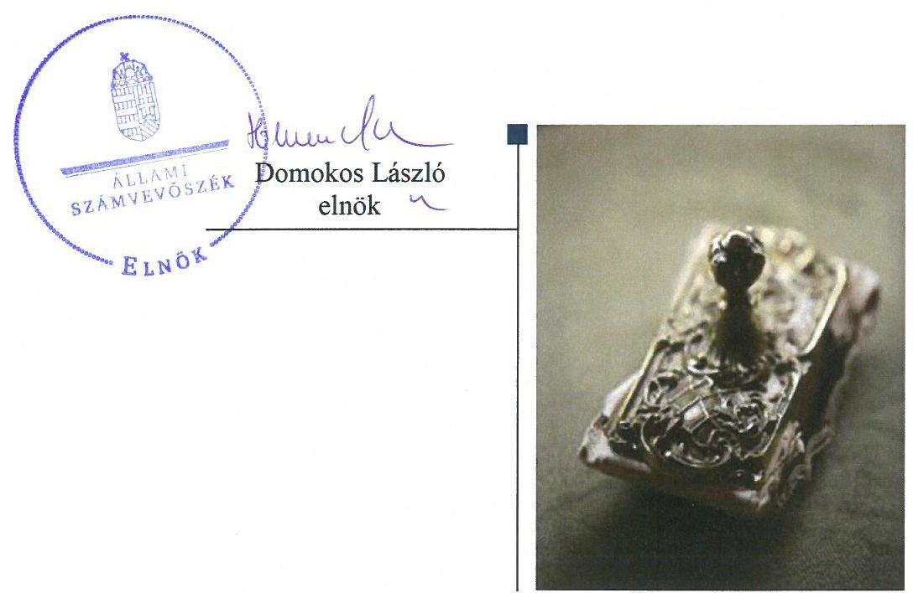
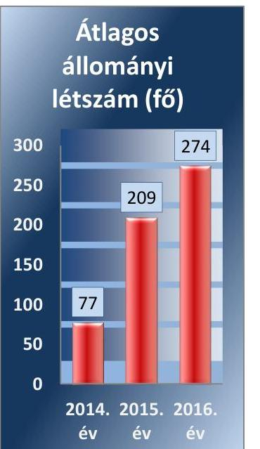
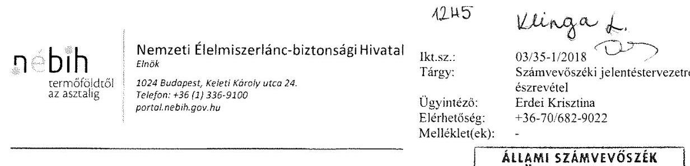
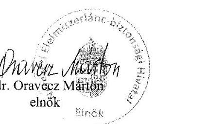

# Jelenetés 

## Az állami tulajdonú gazdasági társaságok ellenőrzése

Élelmiszerlánc-biztonsági Centrum Nonprofit Kft.
2018.

18221
www.asz.hu

---

# Jelenetés 

## Az állami tulajdonú gazdasági társaságok ellenőrzése

Élelmiszerlánc-biztonsági Centrum Nonprofit Kft.
2018. 03. hó 17. nap

---

# AZ ELLENŐRZÉST FELÜGYELTE:

- **KLINGA LÁSZLŐ** felügyeleti vezető
- **AZ ELLENŐRZÉST VEZETTE ÉS A VÉGREHAJTÁSÁÉRT FELELŐS:**
  - **JOÓ ERIKA** ellenőrzésvezető
  - **A PROGRAM ÖSSZEÁLLÍTÁSÁÉRT FELELŐS:**
    - **TÓTPÁL SZABOLCS** osztályvezető

**IKTATÓSZÁM:** EL-0397-035/2018

**TÉMASZÁM:** 2469

**ELLENŐRZÉS-AZONOSÍTÓ SZÁM:** V-081418

---

Jelentéseink az Országgyűlés számítógépes hálózatán és az Interneta a www.asz.hu címen is olvashatóak.

---

# TARTALOMJEGYZÉK 

■ ÖSSZEGZÉS ..... 5
■ AZ ELLENŐRZÉS CÉLJA ..... 6
■ AZ ELLENŐRZÉS TERÜLETE ..... 7
■ AZ ELLENŐRZÉS HÁTTERE, INDOKOLTSÁGA ..... 8
■ A JELENTÉS LÉNYEGES KÉRDÉSKÖREI ..... 9
■ AZ ELLENŐRZÉS HATÓKÖRE ÉS MÓDSZEREI ..... 10
■ MEGÁLLAPÍTÁSOK ..... 12
■ JAVASLATOK ..... 14
■ MELLÉKLETEK ..... 17
I. sz. melléklet: Értelmező szótár ..... 17
■ FÜGGELÉK: ÉSZREVÉTELEK ..... 19
■ RÖVIDÍTÉSEK JEGYZÉKE ..... 21

---

.

---

# ÖSSZEGZÉS 

A Nemzeti Élelmiszerlánc-biztonsági Hivatal tulajdonosi joggyakorlása az Élelmiszerláncbiztonsági Centrum Nonprofit Korlátolt Felelősségű Társaság felett nem volt szabályszerü. A Társaság müködésének szabályozottsága, gazdálkodása és vagyongazdálkodása nem volt szabályszerü, ezzel nem volt biztositott a müködés átláthatósága, illetve az elszámoltathatóság.

## Az ellenőrzés társadalmi indokoltsága

Az állami tulajdonú gazdálkodó szervezetek ellenőrzése kiemelten fontos a vagyon megőrzése, megóvása érdekében, valamint a kormányzati szektor elszámolásaiban megjelenő állami tulajdonú gazdálkodó szervezetek esetében, amelyekkel szemben alapvető követelmény, hogy gazdálkodásuk, müködésük szabályszerű, az általuk szolgáltatott adatok minél megbízhatóbbak legyenek.

Az ellenőrzés az állami tulajdonú gazdálkodó szervezetek gazdálkodási tevékenységével kapcsolatban felhívja a figyelmet a jogszabályi követelmények teljesítéséhez szükséges feltételek hiányosságaira, hozzájárul az államháztartáson kívüli, de (közvetlenül vagy közvetve) állami vagyont használó gazdálkodó szervezetek tevékenységének átláthatóságához.

Ellenőrzésünk eredményeképpen javaslatainkkal, megállapításainkkal hozzájárulunk a nemzeti vagyonnal való gazdálkodás átláthatóságának, elszámoltathatóságának javításához.

## Főbb megállapítások, következtetések, javaslatok

A Nemzeti Élelmiszerlánc-biztonsági Hivatal tulajdonosi joggyakorlása nem volt szabályszerű, mert a felügyelőbizottság létszámát nem a jogszabályi előírásoknak megfelelően határozta meg, a 2016. évi beszámolót a felügyelőbizottság írásbeli jelentése hiányában fogadta el, valamint a jogszabályi előírás ellenére nem alkotta meg a Társaság javadalmazással összefüggő szabályzatát.

A Társaság a 2014. és 2016. években a jogszabályi előírások ellenére a számviteli politika keretében elkészítendő szabályzatok közül az eszközök és források leltárkészítési és leltározási szabályzatával nem rendelkezett.

A Társaság gazdálkodása, vagyongazdálkodása nem felelt meg a jogszabályi előírásoknak, az éves beszámolók mérlegtételeit a jogszabályi előírások ellenére leltárral nem támasztották alá.

A Társaság a vezető tisztségviselőkre vonatkozó közzétételi kötelezettségét nem teljesítette szabályszerűen.
A megállapítások alapján az Állami Számvevőszék a Nemzeti Élelmiszerlánc-biztonsági Hivatal elnökének négy javaslatot, az Élelmiszerlánc-biztonsági Centrum Nonprofit Korlátolt Felelősségű Társaság ügyvezetőjének hat javaslatot fogalmazott meg.

---

# AZ ELLENŐRZÉS CÉLJA 

Az ellenőrzés célja annak értékelése, hogy a tulajdonosi jogok gyakorlása szabályszerű volt-e. A gazdálkodó szervezet szabályozottsága, gazdálkodása és vagyongazdálkodási tevékenysége megfelelt-e a jogszabályi és a tulajdonosi előírásoknak; biztosítva volt-e a közfeladatok átláthatósága és elszámoltathatósága érdekében a közszolgáltatás díjának megalapozottsága szabályszerű önköltségszámítással. A vagyonváltozást eredményező döntések esetében a tulajdonosi jogok gyakorlója és a gazdálkodó szervezet szabályszerűen jártak-e el. Az ellenőrzés célja továbbá annak megítélése, hogy a kormányzati szektorba sorolt állami tulajdonban (résztulajdonban) lévő gazdálkodó szervezetek gazdálkodásának a kormányzati szektor hiányára és az államadósságra befolyással bíró elemei a jogszabályi előírásoknak megfeleltek-e.

---

# **AZ ELLENŐRZÉS TERÜLETE**

## **Élelmiszerlánc-biztonsági Centrum Nonprofit Korlátolt Felelősségű Társaság és a Nemzeti Élelmiszerlánc-biztonsági Hivatal**

Az Élelmiszerlánc-biztonsági Centrum Nonprofit Korlátolt Felelősségű Társaságot az Éltv.1 38/D. § (1)-(2) bekezdései alapján az élelmiszerlánc-felügyeleti feladatok ellátásának támogatása érdekében a Nemzeti Élelmiszerlánc-biztonsági Hivatal alapította 2014. január 10-én 50 M Ft törzstőkével. A jegyzett tőke a 2014-2016. években nem változott.

Az Éltv. 38/D. § (5)-(6) bekezdéseiben foglaltak szerint a Társaság2 az élelmiszerlánc-felügyeleti feladatok ellátásának támogatása érdekében közreműködött az éves ellenőrzési tervben foglalt ellenőrzéseknél, végrehajtotta a monitoringtervben vagy a jogszabályokban előírt mintavételt, valamint a hatósági feladatok ellátását támogató, kisegítő tevékenységet végzett.

A Társaság üzletszerű gazdasági tevékenységet kiegészítő jelleggel folytatott. A Társaság vállalkozási tevékenységéből származó nettó árbevétele éttermi vendéglátás üdülő üzemeltetése és 2016-ban számítógépes programozás szolgáltatások nyújtásából származott. Az alaptevékenységhez kapcsolódó bevételek az Alapító3 és a Társaságtözőt létrejött együttműködési megállapodások alapján kapott összegekből állt. Az együttműködési megállapodások különböző üzemeltetési, logisztikai, adminisztratív feladatok ellátásában történő közreműködés feltételeit rögzítették.

A cégjegyzésre az ügyvezető önállóan volt jogosult. Az ellenőrzött időszakban az ügyvezető személye nem változott. A Társaságnál a taggyűlés hatáskörébe tartozó kérdésekben az Alapító döntött. Az Alapító által megválasztott könyvvizsgáló 2015. november 16-tól látta el feladatát. A Társaság átlagos állományi létszámát az 1. ábra szemlélteti.

A Társaság az NGM közlemény alapján5 2015. december 30-tól tartozott a kormányzati szektorba sorolt társaságok közé. A Társaságnak az ellenőrzött időszakban a Stabilitási tv.6 3. §-a alá tartozó adósságot keletkeztető ügylete nem volt.

A Társaság vagyonkezelt vagyonnal nem rendelkezett, kizárólag saját vagyonával gazdálkodott, önköltségszámítási szabályzat készítésére nem volt kötelezett.

1. ábra

*Forrás: 2014-2016. évi beszámolók*

---

# AZ ELLENŐRZÉS HÁTTERE, INDOKOLTSÁGA 

Az állami tulajdonú gazdálkodó szervezetek ellenőrzése kiemelten fontos a vagyon megőrzése, megóvása érdekében, valamint a kormányzati szektor elszámolásaiban megjelenő állami tulajdonú gazdálkodó szervezetek esetében, amelyekkel szemben alapvető követelmény, hogy gazdálkodásuk, működésük szabályszerű, az általuk szolgáltatott adatok minél megbízhatóbbak legyenek. Gazdálkodásuk jellemzően a közérdeklődés és a média figyelmének középpontjában áll, amihez hozzájárul a gazdálkodásuk körébe tartozó - közvetlen vagy közvetett állami tulajdonú, tehát végső soron a nemzeti vagyon részét képező - vagyon nagysága, illetve az általuk ellátott közszolgáltatások/közfeladatok minősége és hatékonysága. A közszolgáltatási árképzés megalapozottsága és a rendszeres elszámoltatás feltételeinek kialakítása az ellenőrzése során nagy hangsúlyt kap. A közszolgáltatás árában és annak támogatásában meg kell jelennie az önköltségszámítás szempontjainak, amely biztosítja a működés fenntarthatóságát (eszközpótlást) is.

Az ellenőrzés rámutathat az állami tulajdonú gazdálkodó szervezetek gazdálkodási tevékenységével jó gyakorlatokra és szabálytalanságokra. Felhívhatja a figyelmet a jogszabályi követelmények teljesítéséhez szükséges feltételek hiányosságaira, hozzájárulhat az államháztartáson kívüli, de (közvetlenül vagy közvetve) állami vagyont használó gazdálkodó szervezetek tevékenységének átláthatóságához. Ellenőrzésünk eredményeképpen javaslatainkkal, megállapításainkkal hozzájárulhatunk a nemzeti vagyonnal való gazdálkodás átláthatóságának, elszámoltathatóságának javításához.

---

# A JELENTÉS LÉNYEGES KÉRDÉSKÖREI 

1. A tulajdonosi jogok gyakorlása szabályszerű volt-e?
2. A társaság müködésének szabályozottsága, gazdálkodása és vagyongazdálkodása megfelel-e az elöírásoknak?

---

# AZ ELLENŐRZÉS HATÓKÖRE ÉS MÓDSZEREI 

## Az ellenőrzés típusa

Megfelelőségi ellenőrzés.

## Az ellenőrzött időszak

2014. - 2016. évek, a 2016. évi beszámoló jóváhagyásáig tartó időszak.

## Az ellenőrzés tárgya

Állami tulajdonban (résztulajdonban) lévő gazdasági társaság gazdálkodása, kiemelten vagyongazdálkodási tevékenysége, a kormányzati szektorba sorolt gazdasági társaság gazdálkodásának a kormányzati szektor hiányára és az államadósságra befolyással bíró elemei, valamint a tulajdonosi jogok gyakorlása.

## Az ellenőrzött szervezet

Élelmiszerlánc-biztonsági Centrum Nonprofit Korlátolt Felelősségű Társaság és a Nemzeti Élelmiszerlánc-biztonsági Hivatal.

## Az ellenőrzés jogalapja

Az ellenőrzés jogalapját az ÁSZ tv ${ }^{7}$. 1. § (3) bekezdése és 5. § (3)-(5) bekezdése képezi.

## Az ellenőrzés módszerei

Az ellenőrzést a nemzetközi standardokat irányadónak tekintve az ellenőrzési program ellenőrzési kérdései, az ellenőrzött időszakban hatályos jogszabályok, az ellenőrzés szakmai szabályok és módszertanok figyelembe vételével végezzük.

Az ellenőrzés ideje alatt az ellenőrzött szervezettel történő kapcsolattartást az ÁSZ ${ }^{8}$ Szervezeti és Müködési Szabályzatának vonatkozó előírásai alapján biztosítjuk.

Az ellenőrzési kérdések megválaszolásához szükséges bizonyítékok megszerzése a következő ellenőrzési eljárások alkalmazásával történt: megfigyelés, kérdésfeltevés (információkérés), összehasonlítás, valamint elemző eljárás. Az ellenőrzési bizonyítékként felhasználható adatforrások

---

közé tartoznak egyrészt az ellenőrzési programban felsorolt adatforrások, másrészt adatforrás lehet még minden - az ellenőrzés folyamán - feltárt, az ellenőrzés szempontjából információkat tartalmazó dokumentum. A teljes ellenőrzött időszakra vonatkozóan került ellenőrzésre a gazdasági társaság tervezési, beszámolási, közzétételi, adatszolgáltatási kötelezettségének, valamint belső ellenőrzési tevékenységének szabályszerűsége. A 2014. és 2016. évekre vonatkozóan a gazdasági társaság múködésének szabályozottságát, a bevételei és ráfordításai elszámolását, illetve vagyongazdálkodásának szabályszerűségét is ellenőriztük.

Az ellenőrzést a kérdésekre adott válaszok kiértékelésével, valamint a megjelölt adatforrások, a csatolt tanúsítványok felhasználásával, továbbá az adott időszakban hatályos jogszabályok figyelembevételével folytattuk le.

---

# 1. A tulajdonosi jogok gyakorlása szabályszerű volt-e? 

## Összegző megállapítás

A NÉBIH tulajdonosi joggyakorlása nem volt szabályszerű.
Az Alapító a Taktv. ${ }^{9}$ 4. § (2) bekezdésében foglaltak ellenére a Társaság Alapító okiratának ${ }^{10} 9$. pontja szerint - három tagú helyett - öt tagból álló felügyelőbizottságot hozott létre.

Az Alapító az Alapító okiratban előírta az éves gazdálkodási terv készítésének kötelezettségét.

A felügyelőbizottság a 2016. évi egyszerűsített beszámolóról nem készített írásbeli jelentést, az Alapító a Ptk. ${ }^{11}$ 3:120. § (2) bekezdésében és az Alapító okirat 9. pontjában foglaltakkal ellentétben a Társaság 2016. évi egyszerűsített éves beszámolójáról a felügyelőbizottság jelentésének hiányában döntött.

Az Alapító kialakította a tulajdonosi joggyakorlással kapcsolatos monitoring rendszert és múködtette azt. Tulajdonosi ellenőrzés keretében a 2016. évben - a vagyonnyilvántartást és a vagyongazdálkodást is érintően - ellenőrizte a Társaság gazdálkodását a 2014. és 2015. évre vonatkozóan.

Az Alapító a Taktv. 5. § (3) bekezdése előírásai ellenére nem alkotta meg a vezető tisztségviselők, felügyelőbizottsági tagok, az Mt. ${ }^{12}$ 208. § hatálya alá eső munkavállalók javadalmazása, valamint a munkaviszony megszűnése esetére biztosított juttatások módjának, mértékének elveire, annak rendszerére vonatkozó szabályzatát.

## 2. A társaság múködésének szabályozottsága, gazdálkodása és vagyongazdálkodása megfelelt-e az előírásoknak?

Összegző megállapítás

A Társaság múködésének szabályozottsága, gazdálkodása, vagyongazdálkodása, tervezési, és ellenőrzési feladatellátása nem volt szabályszerű. A beszámolási és közzétételi kötelezettség teljesítése nem volt szabályszerű.
2.1. számú megállapítás

A Társaság múködésének szabályozottsága nem felelt meg a jogszabályi előírásoknak.

A Társaság a 2014. és 2016. években a Számv. tv. ${ }^{13}$ 14. § (5) bekezdés a) pontjában előírt, kötelezően elkészítendő szabályzatok közül a Számv. tv. 14. § (5) bekezdés a) pontjában előírt eszközök és források leltárkészítési és leltározási szabályzatával nem rendelkezett.

A 2014. és 2016. évben hatályos pénzkezelési szabályzatban a Számv. tv. 14. § (8) bekezdésének előírása ellenére nem rendelkeztek a készpénzállomány ellenőrzésekor követendő eljárásról, az ellenőrzés gyakoriságáról.

---

### 2.2. számú megállapítás

A Társaság gazdálkodása, vagyongazdálkodása, tervezési és ellenőrzési feladatellátása és a közzétételi kötelezettség teljesítése nem volt szabályszerű, beszámolási kötelezettségét nem szabályszerűen teljesítette.

Az éves gazdálkodási tervet az Alapító okirat előírása ellenére a Társaság a 2014. és 2016. években nem készítette el.

A Társaság a Bkr. ${ }^{14}$ 10. §-ában foglalt előírások ellenére a 2016. évben nem alakította ki a szervezet tevékenységének, a célok megvalósításának nyomon követését biztosító rendszert, mely az operatív tevékenységek keretében megvalósuló folyamatos és eseti nyomon követésből, valamint az operatív tevékenységektől függetlenül múködő belső ellenőrzésből állhat.

A Társaság a Taktv. 2.§ (1) bekezdésének előírásai ellenére nem tette közzé a vezető tisztségviselőkre és a felügyelőbizottság tagjaira vonatkozó adatokat a Taktv. 2. § (1) bekezdésében előírt részletezettséggel.

A 2016. évi egyszerűsített éves beszámolót a Számv. tv. 20. § (1) bekezdésében foglalt előírás ellenére nem támasztotta alá a Társaság szabályszerűen vezetett kettős könyvviteli adatokkal.

A 2014-2016. években a beszámoló készítése során a Számv. tv. 15. § (3) bekezdésében megfogalmazott valódiság elve nem érvényesült, mert a Számv. tv. 69. § (1) bekezdés előírása ellenére az üzleti év végi zárásához, a beszámoló elkészítéséhez, a mérleg tételeinek alátámasztásához a Társaság nem állított össze olyan leltárt, amely tételesen, ellenőrizhető módon tartalmazza a mérleg fordulónapján meglévő eszközeit és forrásait mennyiségben és értékben.

---

# JAVASLATOK 

Az ÁSZ tv. 33. § (1) bekezdésében foglaltak értelmében az ellenőrzött szervezet vezetője köteles a jelentésben foglalt megállapításokhoz kapcsolódó intézkedési tervet összeállítani és azt a jelentés kézhezvételétől számított 30 napon belül az ÁSZ részére megküldeni. Amennyiben az ellenőrzött szervezet vezetője nem küldi meg határidőben az intézkedési tervet, vagy továbbra sem elfogadható intézkedési tervet küld, az Állami Számvevőszék elnöke az ÁSZ tv. 33. § (3) bekezdése a) és b) pontjaiban foglaltakat érvényesítheti.

## Élelmiszerlánc-biztonsági Centrum Nonprofit Kft. ügyvezetőjének

1. Intézkedjen a Számv. tv.-ben foglaltaknak megfelelően az eszközök és források leltárkészítési és leltározási szabályzatának elkészitéséről és hatályba helyezéséről.
(2.1. sz. megállapítás 1. bekezdése alapján)
2. Intézkedjen a pénzkezelési szabályzat Számv.tv-ben elöirtaknak megfelelő előkészitéséről.
(2.1. sz. megállapítás 2. bekezdése alapján)
3. Gondoskodjon az Alapító okiratban elirt éves gazdálkodási terv elkészitéséről.
(2.2. sz. megállapítás 1. bekezdése alapján)
4. Intézkedjen a Bkr. elöírásainak megfelelően a szervezet tevékenységének, a célok megvalósitásának nyomon követését biztositó rendszer kialakításáról.
(2.2. sz. megállapítás 2. bekezdése alapján)
5. Intézkedjen a Taktv.-ben elöirt közzétételi kötelezettség teljesitéséről.
(2.2. sz. megállapítás 3. bekezdése alapján)
6. Intézkedjen a mérleg tételeinek alátámasztásához a Számv. tv. elő-irásainak megfelelő, az eszközöket és forrásokat mennyiségben és értékben tételesen, ellenőrizhető módon tartalmazó leltár összeállítására.
(2.2. sz. megállapítás 5. bekezdés 2. tagmondata alapján)

---

# Nemzeti Élelmiszerlánc-biztonsági Hivatal elnökének 

1. Kezdeményezze, hogy az Alapitó a Taktv.-ben elöirtaknak megfelelő számú tagból álló felügyelő bizottságot hozzon létre.
(1. sz. megállapítás 1. bekezdése alapján)
2. Hívja fel a felügyelőbizottság elnökének figyelmét az írásbeli jelentés elkészitésére annak érdekében, hogy az Alapitó a Társaság egyszerüsített éves beszámolójáról a felügyelőbizottság írásos jelentésének birtokában döntsön a Ptk. elöírásainak megfelelően.
(1. sz. megállapítás 3. bekezdése alapján)
3. Intézkedjen arról, hogy a Társaság legföbb szerve (Alapitója) megalkossa a vezető tisztségviselők, felügyelőbizottsági tagok, valamint az Mt. 208. §-ának hatálya alá eső munkavállalók javadalmazása, valamint a jogviszony megszünése esetére biztosított juttatások módjának, mértékének elveire, annak rendszerére vonatkozó szabályzatát.
(1. sz. megállapítás 5. bekezdése alapján)
4. Tegyen intézkedéseket:
a) a számviteli szabályozási hiányosságok,
b) a közzétételi kötelezettség teljesítésének elmulasztása,
c) a leltár összeállításának elmulasztása
miatti felelősség tisztázása érdekében, és szükség szerint intézkedjen a felelősség érvényesítéséről.
(2.1. sz. megállapítás 1. és 2. bekezdései, a 2.2. sz. megállapítás 3. bekezdése és az 5. bekezdése második tagmondata alapján)

---

.

---

# MELLÉKLETEK 

- I. SZ. MELLÉKLET: ÉRTELMEZŐ SZÓTÁR
gazdasági társaság
kormányzati szektorba sorolt egyéb szervezet
nonprofit gazdasági társaság
tulajdonosi jogok gyakorlója

A Ptk. 3:88. § (1) bekezdés szerint „a gazdasági társaságok üzletszerű közös gazdasági tevékenység folytatására, a tagok vagyoni hozzájárulásával létrehozott, jogi személyiséggel rendelkező vállalkozások, amelyekben a tagok a nyereségből közösen részesednek, és a veszteséget közösen viselik".
Az a szervezet, amely az Áht. alapján nem része az államháztartásnak, azonban az Európai Közösséget létrehozó szerződéshez csatolt, a túlzott hiány esetén követendő eljárásról szóló jegyzőkönyv alkalmazásáról szóló 2009. május 25-i 479/2009/EK rendelet szerint a kormányzati szektorba tartozik. A nemzetgazdasági miniszter 2013. június 26-án megjelent Közleményben tette közé ezen szervezetek listáját
Civil tv. ${ }^{15}$ 9/F. § (2) bekezdés szerint „az a gazdasági társaság minősül nonprofit gazdasági társaságnak és cégnevében az a gazdasági társaság tüntetheti fel a nonprofit jelleget, amelynek létesítő okirata tartalmazza, hogy a gazdasági társaság tevékenységéből származó nyereség a tagok között nem osztható fel, hanem az a gazdasági társaság vagyonát gyarapítja." (hatályos 2014. március 15-től)
2013. június 28-ától:

A rábízott állami vagyon felett az államot megillető tulajdonosi jogok és kötelezettségek összességét tulajdonosi joggyakorlóként:
a) ha törvény vagy miniszteri rendelet eltérően nem rendelkezik, a Magyar Nemzeti Vagyonkezelő Zártkörűen Működő Részvénytársaság (a továbbiakban: MNV Zrt.),
b) törvényben kijelölt személy vagy
c) az állami vagyon felügyeletéért felelős miniszter (a továbbiakban: miniszter) által rendeletben kijelölt személy gyakorolja.
[...] A miniszter e törvény felhatalmazása alapján - a meghatározott célok hatékonyabb elérése érdekében, miniszteri rendeletben, az ott meghatározott állami vagyoni kör tekintetében, meghatározott időtartamra - e törvény keretei között, a joggyakorlás egyes szabályainak meghatározásával - az államot megillető tulajdonosi jogok és kötelezettségek összességének, illetve azok meghatározott részének gyakorlóját az Áht. szerinti központi költségvetési szervek, ezek intézménye, továbbá a 100\%-ban állami tulajdonban álló gazdasági társaságok közül kijelölheti.
Forrás: Vtv. ${ }^{16}$. 3. § (1) és (2) bekezdés
2.

Aki a nemzeti vagyon felett az államot vagy a helyi önkormányzatot megillető tulajdonosi jogok és kötelezettségek összességének gyakorlására jogosult
Forrás: Nvtv. ${ }^{17}$ 3. § (1) bekezdés 17. pontja

---

.

---

# FÜGGELÉK: ÉSZREVÉTELEK 

A jelentéstervezetet a Számvevőszék 15 napos észrevételezésre megküldte az ellenőrzött szervezetek vezetőinek az ÁSZ tv. 29. §* (1) bekezdése előírásának megfelelően.

A Nemzeti Élelmiszerlánc-biztonsági Hivatal elnöke az ÁSZ tv. 29. § (2) bekezdésében foglalt észrevételezési jogával nem élt, írásban jelezte, hogy észrevételt nem tesz. Az Élelmiszerlánc-biztonsági Centrum Nonprofit Kft. ügyvezetője észrevételezési jogával nem élt, a jelentéstervezetre észrevételt nem tett.

[^0]
[^0]:    * 29. § (1) Az Állami Számvevőszék az ellenőrzési megállapításait megküldi az ellenőrzött szervezet vezetőjének vagy az általa megbízott személynek, és annak, akinek személyes felelősségét állapította meg.
    (2) Az ellenőrzött szervezet vezetője és a felelősként megjelölt személy az ellenőrzés megállapításaira tizenöt napon belül írásban észrevételt tehet.
    (3) Az Állami Számvevőszék az észrevételre a beérkezésétől számított harminc napon belül írásban válaszol. A figyelembe nem vett észrevételeket köteles a jelentésben feltüntetni, és megindokolni, hogy azokat miért nem fogadta el.

---

# Domokos László 

elnök úr részére

Állami Számvevőszék

## Budapest

Apáczai Csere János utca 10.
1052

## Tisztelt Elnök Úr!

Hivatkozással a 2018. július 11. napján megküldött, EL-0686-017/2018. iktatószámú levelére, a jelentéstervezetre észrevételt nem kívánunk tenni.

Munkájukat ezúton is köszönöm!

Budapest, 2018. július 31.
Üdvözlettel:

---

# RÖVIDÍTÉSEK JEGYZÉKE 

${ }^{1}$ Éltv.
${ }^{2}$ Társaság
${ }^{3}$ Alapító
${ }^{4}$ együttműködési megállapodások
${ }^{5}$ NGM közlemény
${ }^{6}$ Stabilitási tv.
${ }^{7}$ ÁSZ tv.
${ }^{8}$ ÁSZ
${ }^{9}$ Taktv.
${ }^{10}$ Alapító okirat
${ }^{11}$ Ptk.
${ }^{12} \mathrm{Mt}$.
${ }^{13}$ Számv.tv.
${ }^{14}$ Bkr.
${ }^{15}$ Civil. tv.
${ }^{16} \mathrm{Vtv}$.
${ }^{17} \mathrm{Nvtv}$.
az élelmiszerláncról és hatósági felügyeletéről szóló 2008. évi XLVI. törvény (hatályos: 2008. szeptember 1-jétől)
Élelmiszerlánc-biztonsági Centrum Nonprofit Korlátolt Felelősségű Társaság Nemzeti Élelmiszerlánc-biztonsági Hivatal
Élelmiszerlánc-biztonsági Centrum Nonprofit Korlátolt Felelősségű Társaság és a Nemzeti Élelmiszerlánc-biztonsági Hivatal között 2014. február 28. és 2016. december 21. között a feladatok ellátására vonatkozóan létrejött együttműködési megállapodások és azok módosításai
A 2015. december 30-án közzétett 66. számú Hivatalos Értesítőben megjelent NGM közlemény a kormányzati szektorba sorolt egyéb szervezetekről
Magyarország gazdasági stabilitásáról szóló 2011. évi CXCIV. törvény
2011. évi LXVI. törvény az Állami Számvevőszékről (hatályos: 2011. július 1-jétől)

Állami Számvevőszék
2009. évi CXXII. törvény a köztulajdonban álló gazdasági társaságok takarékosabb müködéséről (hatályos 2009. december 4-től)
Élelmiszerlánc-biztonsági Centrum Nonprofit Korlátolt Felelősségű Társaság Alapító Okirata (hatályos: 2014. január 10-étől)
a Polgári Törvénykönyvről szóló 2013. évi V. törvény (hatályos: 2014. március 15-étől)
a munka törvénykönyvéről szóló 2012. évi I. törvény (hatályos: 2012. július 1-jétől)
a számvitelről szóló 2000. évi C. törvény (hatályos: 2001.január 1-jétől)
a költségvetési szervek belső kontrollrendszeréről és belső ellenőrzéséről szóló 370/2011. (XII. 31.) Korm. rendelet (hatályos: 2012. január 1-jétől)
2011. évi CLXXV. törvény az egyesülési jogról, a közhasznú jogállásról, valamint a civil szervezetek müködéséről és támogatásáról (hatályos: 2011. december 22-től)
2007. évi CVI. törvény az állami vagyonról (hatályos: 2007. szeptember 25-től)
2011. évi CXCVI. törvény a nemzeti vagyonról (hatályos: 2011. december 31-től)

---

ÁLLAMI SZÁMVEVŐSZÉK
1052 Budapest, Apáczai Csere János utca 10.
Levélcím: 1364 Budapest 4. Pf. 54
Telefon: +36 14849100 Telefax: +36 14849200
www.asz.hu