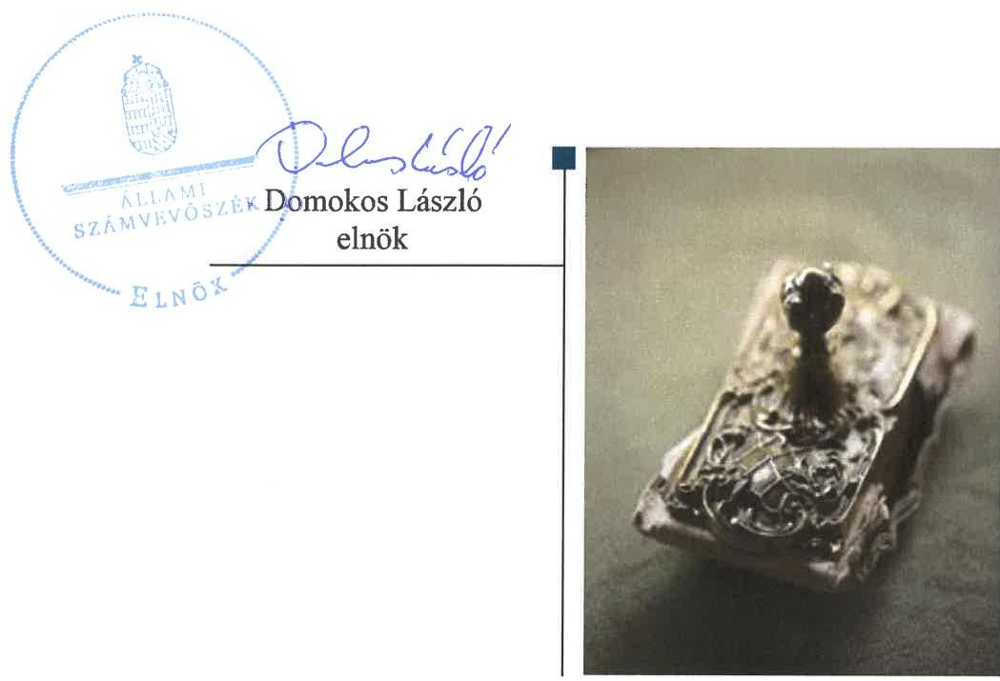
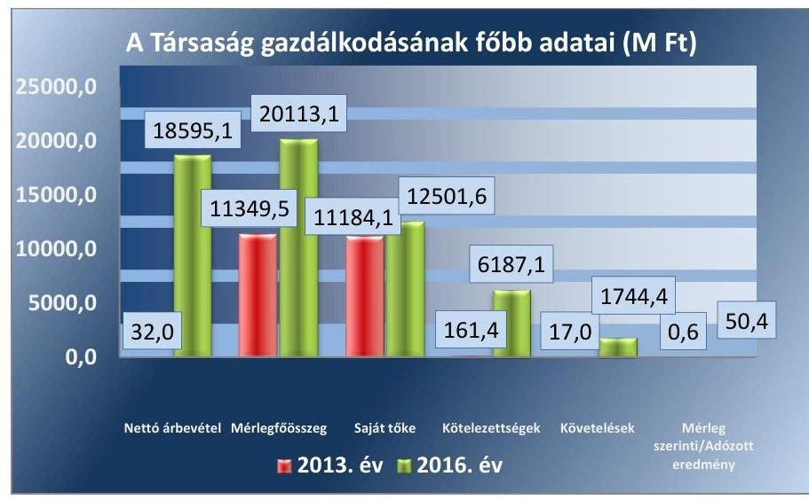
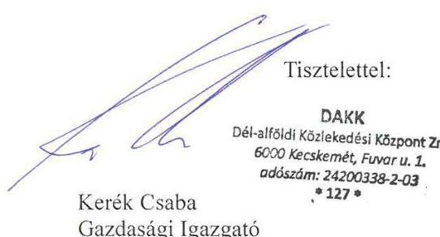
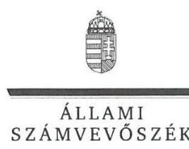
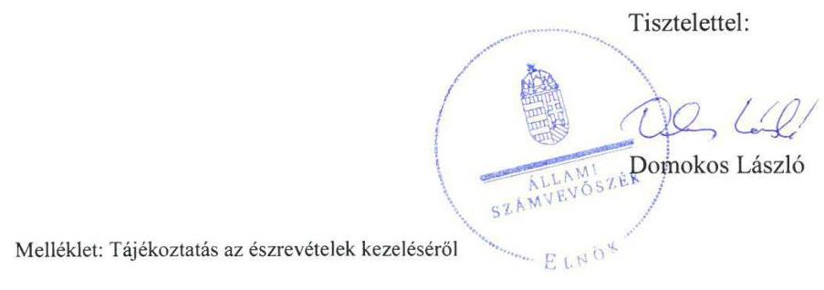
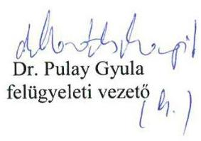

# Jelentés 

## Az állami tulajdonú gazdasági társaságok ellenőrzése

DAKK Dél-alföldi Közlekedési Központ Zrt. 2018.

---

# Jelenetés 

## Az állami tulajdonú gazdasági társaságok ellenőrzése

DAKK Dél-alföldi Közlekedési Központ Zrt.
2018. cusurustu hó 31. nap

---

# AZ ELLENŐRZÉST FELÜGYELTE:

DR. PULAY GYULA felügyeleti vezető

## AZ ELLENŐRZÉST VEZETTE ÉS A VÉGREHAJTÁSÁÉRT FELELŐS:

GÖRGÉNYI GÁBOR ellenőrzésvezető

## A PROGRAM ÖSSZEÁLLÍTÁSÁÉRT FELELŐS:

TÓTPÁL SZABOLCS osztályvezető

IKTATÓSZÁM: EL-0626-116/2018.

TÉMASZÁM: 2469

ELLENŐRZÉS-AZONOSÍTÓ SZÁM: V081430

Jelentéseink az Országgyűlés számítógépes hálózatán és az Interneta a www.asz.hu címen is olvashatóak.

---

# TARTALOMJEGYZÉK 

■ ÖSSZEGZÉS ..... 5
■ AZ ELLENŐRZÉS CÉLJA ..... 6
■ AZ ELLENŐRZÉS TERÜLETE ..... 7
■ AZ ELLENŐRZÉS HÁTTERE, INDOKOLTSÁGA ..... 9
■ A JELENTÉS LÉNYEGES KÉRDÉSKÖREI ..... 10
■ AZ ELLENŐRZÉS HATÓKÖRE ÉS MÓDSZEREI ..... 11
■ MEGÁLLAPÍTÁSOK ..... 13
■ JAVASLATOK ..... 16
■ MELLÉKLETEK ..... 17
I. sz. melléklet: Értelmező szótár ..... 17
II. sz. melléklet: Pénzügyi adatok ..... 18
■ FÜGGELÉK: ÉSZREVÉTELEK ..... 19
■ RÖVIDÍTÉSEK JEGYZÉKE ..... 29

---

.

---

# ÖSSZEGZÉS 

A Magyar Nemzeti Vagyonkezelő Zrt. a tulajdonosi joggyakorlás kereteit szabályszerűen alakította ki, a tulajdonosi jogait szabályszerűen gyakorolta. A DAKK Dél-alföldi Közlekedési Központ Zrt. müködésének szabályozottsága és vagyongazdálkodása megfelelt a jogszabályi előírásoknak, azonban a pénzügyi-számviteli feladatok ellátása nem volt szabályszerű. Az adatszolgáltatási és közzétételi kötelezettségének a Társaság eleget tett, ezáltal biztositotta az átláthatóságot.

## Az ellenőrzés társadalmi indokoltsága

Az állami tulajdonú gazdálkodó szervezetek ellenőrzése kiemelten fontos a vagyon megőrzése, megóvása érdekében, amelyekkel szemben alapvető követelmény, hogy gazdálkodásuk, működésük szabályszerű, az általuk szolgáltatott adatok minél megbízhatóbbak legyenek. Az állami tulajdonban álló gazdálkodó szervezetek államot megillető társasági részesedése a nemzeti vagyon részét képezi és legfőbb rendeltetése szerint a közfeladatok ellátását szolgálja.

Az Állami Számvevőszék stratégiájában megfogalmazta, hogy az államháztartáson kívül működő közfeladat-ellátó rendszerek ellenőrzéseivel hozzájárul ahhoz, hogy a közpénzeket az államháztartáson kívül működő szervezetek is átlátható, rendezett módon használják fel a közfeladatok szerződésben vállalt ellátása érdekében. Ellenőrzésünk eredményeképpen javaslatainkkal, megállapításainkkal hozzájárulhatunk a nemzeti vagyonnal való gazdálkodás átláthatóságának, elszámoltathatóságának javításához.

Az Állami Számvevőszék céljaival és a társadalmi igénnyel összhangban, valamint a gazdasági társaságok kiemelt fontosságú szerepe miatt került sor a DAKK Dél-alföldi Közlekedési Központ Zrt. ellenőrzésére. Az ellenőrzést a Társaság feladatellátásából adódó további társadalmi elvárás is indokolta, mert a Dél-alföldi régióban a lakosság rendszeresen kapcsolatba kerül a Társasággal a helyi és helyközi személyszállítási tevékenységére tekintettel.

## Főbb megállapítások, következtetések, javaslatok

A Magyar Nemzeti Vagyonkezelő Zrt.-nél a tulajdonosi joggyakorlás kereteinek kialakítása és a Társaság feletti tulajdonosi jogok gyakorlása szabályszerű volt.

A DAKK Dél-alföldi Közlekedési Központ Zrt. müködésének szabályozottsága megfelelt a jogszabályi előírásoknak.
A Társaságnál a pénzügyi-számviteli feladatok ellátása nem volt szabályszerű a személyi jellegű, valamint az anyagjellegű és egyéb ráfordítások elszámolásának hiányosságai miatt. A Társaság a számviteli törvény előírásait megsértve nem rendelkezett valamennyi, a gazdasági eseményeket alátámasztó összes számviteli bizonylattal, továbbá a több munkáltató által létesített munkaviszony bér- és járulékköltségek elszámolását 2013-ban több esetben a számviteli törvény előírásait megsértve egyéb ráfordításként számolták el személyi jellegű ráfordítás helyett.

Az előírt adatszolgáltatási és beszámolási kötelezettségét a Társaság teljesítette, a közérdekből nyilvános adatokat közzétette.

A Társaság vagyongazdálkodása szabályszerű volt. A vagyon nyilvántartása és az értékcsökkenés elszámolása a jogszabályi előírásoknak megfelelően történt. A Társaság az éves beszámolóinak mérleg tételeit a törvénynek megfelelő leltárral támasztotta alá.

---

# AZ ELLENŐRZÉS CÉLJA 

AZ ELLENŐRZÉS CÉLJA annak értékelése, volt, hogy a tulajdonosi jogok gyakorlása szabályszerű volt-e. A gazdálkodó szervezet szabályozottsága, gazdálkodása és vagyongazdálkodási tevékenysége megfelelt-e a jogszabályi és a tulajdonosi előírásoknak; biztosítva volte a közfeladatok átláthatósága és elszámoltathatósága érdekében a közszolgáltatás díjának megalapozottsága szabályszerű önköltségszámítással. A vagyonváltozást eredményező döntések esetében a tulajdonosi jogok gyakorlója és a gazdálkodó szervezet szabályszerűen jártak-e el.

---

# **DAKK Dél-alföldi Közlekedési Központ Zrt.**

A DAKK Zrt.1 2012. november 19-én alakult, egyszemélyes zártkörűen működő részvénytársaságként, 100%-os állami tulajdoni résszel. A Társaságot2 2013. január 23-án jegyezte be a Gyulai Törvényszék Cégbírósága. A Magyar Állam nevében eljáró alapító részvényes az MNV Zrt.3 volt.

A Társaság főtevékenysége 2013-2014-ben üzletvezetés volt, amely a saját tulajdonú társaságok vagyonkezelését jelentette. Az MNV Zrt. 2014. július 30-án hozott döntést a Bács Volán Zrt., a Körös Volán Zrt., a Kunság Volán Zrt., a Tisza Volán Zrt. DAKK Zrt.-be történő beolvadásáról. Az átalakulást a Gyulai Törvényszék Cégbírósága 2014. december 31-ei hatállyal jegyezte be. Ez alapján a DAKK Zrt. főtevékenysége egyéb szárazföldi személyszállítás (menetrend szerinti helyi és helyközi személyszállítás) lett, amely közszolgáltatásnak, illetve közfeladatnak minősült. A Társaság a 2016. évi főtevékenységét 855 db-os autóbuszparkkal látta el. A helyközi személyszállítás mellett az önkormányzatok megbízása alapján 14 városban végzett helyi személyszállítási szolgáltatást közszolgáltatási szerződések alapján.

Az ellenőrzött időszakban a vezérigazgató4 személye egy alkalommal, 2013. augusztus 16-án változott. A Társaságnál az ellenőrzött időszakban háromtagú igazgatóság és háromtagú Felügyelőbizottság, valamint választott könyvvizsgáló működött. A Társaságnál a foglalkoztatottak átlagos statisztikai létszáma a 2013. évi 15 főről, 2016. évre 2013 főre nőtt.

A Társaság 2013. és 2016. évi gazdálkodásának főbb adatait az 1. ábra, az éves beszámolók részletesebb adatait a II. sz. melléklet tartalmazza.

1. ábra

*Forrás: A Társaság 2013-2016. évi beszámolói*

---

A Társaság jegyzett tőkéje az alakuláskor 20 M Ft volt, amely 2016 végére 9637 M Ft-ra növekedett az Alapitói tőkeemelések és az átalakulás eredményeképpen.

A Társaságnak 2016. december 31-én öt kapcsolt, egy társult, valamint hét egyéb részesedési viszonyban lévő vállalkozásban volt tulajdoni részesedése.

A Társaság nem tartozott a Bkr ${ }^{5}$. hatálya alá. A 2014-2016. években a Társaság belső ellenőrzést múködtetett, az első évben 1, majd 2 fő részvételével. A belső ellenőrzés a Társaság pénzügyi és vagyongazdálkodását ellenőrizte. Az ellenőrzések hasznosultak, a szükséges intézkedéseket végrehajtották.

A Társaság vagyonkezelésbe vett állami, vagy önkormányzati vagyonnal nem rendelkezett, tevékenységét saját vagyonával látta el.

A Társaság nem tartozott a kormányzati szektorba sorolt egyéb szervezetek körébe.

---

# AZ ELLENŐRZÉS HÁTTERE, INDOKOLTSÁGA 

Az Európai Unióban 1994. év óta hatályos túlzott hiány eljárás mindig kihívást jelentett a tagállamok számára. Az állami tulajdonú gazdálkodó szervezetek ellenőrzése kiemelten fontos a vagyon megőrzése, megóvása érdekében, valamint a kormányzati szektor elszámolásaiban megjelenő állami tulajdonú gazdálkodó szervezetek esetében, amelyekkel szemben alapvető követelmény, hogy gazdálkodásuk, működésük szabályszerű, az általuk szolgáltatott adatok minél megbízhatóbbak legyenek. Gazdálkodásuk jellemzően a közérdeklődés és a média figyelmének középpontjában áll, amihez hozzájárul a gazdálkodásuk körébe tartozó - közvetlen vagy közvetett állami tulajdonú, tehát végső soron a nemzeti vagyon részét képező - vagyon nagysága, illetve az általuk ellátott közszolgáltatások/közfeladatok minősége és hatékonysága. A közszolgáltatási árképzés megalapozottsága és a rendszeres elszámoltatás feltételeinek kialakítása az ellenőrzése során nagy hangsúlyt kap. A közszolgáltatás árában és annak támogatásában meg kell jelennie az önköltségszámítás szempontjainak, amely biztosítja a müködés fenntarthatóságát (eszközpótlást) is.

Az ellenőrzés rámutathat az állami tulajdonú gazdálkodó szervezetek gazdálkodási tevékenységével kapcsolatos jó gyakorlatokra és szabálytalanságokra. Felhívhatja a figyelmet a jogszabályi követelmények teljesítéséhez szükséges feltételek hiányosságaira, hozzájárulhat az államháztartáson kívüli, de (közvetlenül vagy közvetve) állami vagyont használó gazdálkodó szervezetek tevékenységének átláthatóságához. Ellenőrzésünk eredményeképpen javaslatainkkal, megállapításainkkal hozzájárulhatunk a nemzeti vagyonnal való gazdálkodás átláthatóságának, elszámoltathatóságának javításához.

---

# A JELENTÉS LÉNYEGES KÉRDÉSKÖREI 

1.     - A tulajdonosi jogok gyakorlása szabályszerű volt-e?
2.     - A Társaság müködésének szabályozottsága megfelelt-e a jogszabályi előírásoknak, a pénzügyi-számviteli és adatszolgáltatási feladatok ellátása szabályszerű volt-e?
3. A Társaság vagyongazdálkodása szabályszerű volt-e?

---

# AZ ELLENŐRZÉS HATÓKÖRE ÉS MÓDSZEREI 

## Az ellenőrzés típusa

Megfelelőségi ellenőrzés

## Az ellenőrzött időszak

2013-2016. évek, a 2016. évi beszámoló jóváhagyásáig tartó időszak.

## Az ellenőrzés tárgya

Állami tulajdonban lévő gazdasági társaság gazdálkodása, kiemelten vagyongazdálkodási tevékenysége, a tulajdonosi jogok gyakorlása.

## Az ellenőrzött szervezet

DAKK Dél-alföldi Közlekedési Központ Zrt., valamint a tulajdonosi jogokat gyakorló Magyar Nemzeti Vagyonkezelő Zrt.

## Az ellenőrzés jogalapja

Az ellenőrzés jogszabályi alapját az az Állami Számvevőszékről szóló 2011. évi LXVI. törvény 1. § (3) bekezdése és 5. § (3)-(5) bekezdései képezték.

## Az ellenőrzés módszerei

Az ellenőrzést a nemzetközi standardokat irányadónak tekintve az ellenőrzési program ellenőrzési kérdései, az ellenőrzött időszakban hatályos jogszabályok, az ellenőrzés szakmai szabályok és módszertanok figyelembe vételével végeztük.

Az ellenőrzés ideje alatt az ellenőrzött szervezettel történő kapcsolattartást az ÁSZ ${ }^{6}$ Szervezeti és Müködési Szabályzatának vonatkozó előírásai alapján biztosítottuk.

Az ellenőrzésre a nemzetgazdasági szempontból kiemelt jelentőségű nemzeti vagyon körébe tartozó gazdálkodó szervezeteknél és a többségi állami tulajdonban álló gazdálkodó szervezeteknél került sor. A program szerinti feladatokat a kiválasztott gazdálkodó szervezeteknél (társaságoknál) és azok többségi tulajdonban lévő leányvállalatainál, valamint a tulajdonosi jogok gyakorlójánál kellett végrehajtani. Az ellenőrzés szempontjai

---

és az ellenőrzés alá vont gazdálkodó szervezetek köre az ellenőrzés tapasztalatai alapján - indokolt esetben - változhatott.

A teljes ellenőrzött időszakra vonatkozóan került ellenőrzésre a Társaság tervezési, beszámolási, közzétételi, adatszolgáltatási kötelezettségének, valamint belső ellenőrzési tevékenységének szabályszerűsége. A 2013. és 2016. évekre vonatkozóan a Társaság múködésének szabályozottságát, a bevételei és ráfordításai elszámolását, illetve vagyongazdálkodásának szabályszerűségét is ellenőriztük.

A bevételek és a ráfordítások közül az értékesítés nettó árbevétele, az egyéb, rendkívüli és pénzügyi múveletek bevételei, a személyi jellegú ráfordítások, az anyagjellegú ráfordítások, az egyéb, rendkívüli és pénzügyi műveletek ráfordításai, valamint értékcsökkenési leírás elszámolásának szabályszerűségét, továbbá az immateriális javak, tárgyi eszközök esetében a vagyonnyilvántartás szabályszerűségét véletlen mintavétellel ellenőriztük.

A fenti sokaságok esetében a mintavétel azokra a legnagyobb értékű tételekre - a lényeges sokaságra - terjedt ki, melyek összértéke elérte a teljes sokaság összértékének 50\%-át. A személyi jellegú ráfordítások esetében a mintavétel a teljes sokaságból történt. Amennyiben valamely ellenőrzött sokaság elemszáma kisebb volt, mint az előírt mintaelemszám, az ellenőrzött sokaságot tételesen ellenőriztük.

A mintavétellel ellenőrzött területek esetében minden egyes tétel vonatkozásában a szabályszerűségre vonatkozó kérdéseket tettünk fel, amelyek eredménye összesítésre került. „Szabályszerűnek" értékeltünk egy ellenőrzött területet, amennyiben 95\%-os bizonyossággal az ellenőrzött sokaságban az átlagos hibaarány legfeljebb 10\%, „nem szabályszerűnek", amennyiben 10\%-nál magasabb arányt képviselt.

Az ellenőrzési kérdések megválaszolásához szükséges bizonyítékok megszerzése a következő ellenőrzési eljárások alkalmazásával történt: megfigyelés, kérdésfeltevés (információkérés), összehasonlítás, valamint elemző eljárás. Az ellenőrzési bizonyítékként felhasználható adatforrások közé tartoztak egyrészt az ellenőrzési programban felsorolt adatforrások, másrészt adatforrás lehet még minden - az ellenőrzés folyamán - feltárt, az ellenőrzés szempontjából információkat tartalmazó dokumentum.

Az ellenőrzést a kérdésekre adott válaszok kiértékelésével, valamint a megjelölt adatforrások, a csatolt tanúsítványok felhasználásával, továbbá az adott időszakban hatályos jogszabályok figyelembe vételével folytattuk le.

A Társaság többségi tulajonában lévő leányvállalatai (kapcsolt vállalkozásai) esetében a Társaságtól bekért adatok dokumentumok alapján azt ellenőriztük, hogy a Társaság meghatározta-e a kapcsolt vállalkozások felé a vagyongazdálkodás követelményeit és ellenőrizte-e annak múködtetését.

---

# 1. A tulajdonosi jogok gyakorlása szabályszerű volt-e? 

Összegző megállapítás Az MNV Zrt. tulajdonosi joggyakorlása szabályszerű volt.

A TULAJDONOSI JOGGYAKORLÁS KERETEIT az MNV Zrt. az SZMSZ $2.5^{7}$-ében szabályozta. Az SZMSZ $1.5^{-}$ben meghatározott feladatok részletes szabályait a tulajdonosi joggyakorlás területeire vonatkozó belső szabályzatokkal és vezérigazgatói utasításokkal biztosította. Az MNV Zrt. a tulajdonosi joggyakorlás rendjét a Társaság Alapító okirat ${ }^{8}{ }_{1-12}$ ában szabályozta, amely megfelelt a Gt. ${ }^{9}$-ben és a Ptk. ${ }^{10}$-ban foglalt előírásoknak. Az MNV Zrt. a jogszabályi előírásoknak megfelelően a Monitoring szabályzat ${ }_{1-2}{ }^{11}$-ban, valamint a Portfóliós kódex ${ }_{1-2}{ }^{12}$-ben alakította ki a részesedések feletti tulajdonosi jogok gyakorlásának rendjét a Társaságnál.

A TULAJDONOSI JOGGYAKORLÁS szabályszerű volt. Az Alapító okiratban foglaltak szerint a Társaság három főből álló felügyelőbizottságának elnökét és tagjait, valamint a könyvvizsgálót a Taktv. ${ }^{13}$, a Gt., illetve a Ptk. előírásainak megfelelően választották meg.

A Társaság felügyelőbizottságának Ügyrendjét ${ }_{1-2}{ }^{14}$ a Gt., illetve a Ptk. előírásainak megfelelően az MNV Zrt. fogadta el. A felügyelőbizottság a Tulajdonosi Ellenőrzési Szabályzat ${ }_{1-3}{ }^{15}$-ban foglaltaknak megfelelően végezte az alapítói határozatok végrehajtásának tulajdonosi ellenőrzését.

A Társaság üzleti terveit és beszámolóit az MNV Zrt. a Gt. és a Ptk. előírásainak megfelelően a felügyelőbizottság és a könyvvizsgáló jelentése alapján jóváhagyta, továbbá döntött az eredmény felosztásáról, illetve eredménytartalékba helyezéséről. A Társaság javadalmazási szabályzatát az MNV Zrt. a Taktv.-ben foglaltaknak megfelelően megalkotta.

## 2. A Társaság müködésének szabályozottsága megfelelt-e a jogszabályi előírásoknak, a pénzügyi-számviteli és adatszolgáltatási feladatok ellátása szabályszerű volt-e?

Összegző megállapítás

A Társaság müködésének szabályozottsága megfelelt a jogszabályi előírásoknak. A pénzügyi-számviteli feladatok ellátása nem volt szabályszerű a személyi jellegú, az anyagjellegú és egyéb ráfordítások elszámolásának hiányosságai miatt. Az adatszolgáltatási kötelezettségének a Társaság eleget tett.

A TÁRSASÁG MÚKÖDÉSÉNEK SZABÁLYOZOTTSÁGA megfelelt a jogszabályi előírásoknak. A müködés alapvető szabá-

---

lyait, a vagyongazdálkodással kapcsolatos feladat- és hatásköröket, felelősségi viszonyokat az Alapító okiratban, valamint a Társaság SZMSZ1-2 ${ }^{16}$-ében határozták meg.

A Társaság elkészítette a Számviteli politikát ${ }_{1-3}{ }^{17}$, illetve annak részeként a számlarendet, a bizonylati rendet, az eszközök és források értékelési szabályait, a pénzkezelési szabályzatot, leltározási és leltárkészítési, valamint selejtezési szabályzatot, amelyek megfeleltek a Számv. tv. ${ }^{18}$ előírásainak, továbbá biztosították az egyes tevékenységek elkülönült nyilvántartását.

A Számviteli politika ${ }_{3}$ tartalmazta a közszolgáltatási beszámolóval kapcsolatos előírásokat a menetrend szerinti helyközi és távolsági autóbusszal végzett személyszállítási közfeladat ellátásához kapcsolódóan.

Önköltség számítási szabályzattal ${ }^{19}$ a Társaság a Számv. tv. előírásainak megfelelően 2016-tól rendelkezett.

# A SZEMÉLYI JELLEGŰ, AZ ANYAGJELLEGŰ ÉS 

EGYÉB RÁFORDÍTÁSOK elszámolása nem volt szabályszerű, mert a Társaság a Számv. tv. 165. § (1)-(2) bekezdéseiben foglaltak ellenére nem rendelkezett valamennyi, a gazdasági eseményeket alátámasztó öszszes számviteli bizonylattal, továbbá a több munkáltató által létesített munkaviszony bér- és járulékköltségeket 2013-ban a Számv. tv 79. § (1)-(4) és a 81. § (2) bekezdésének előírásait megsértve egyéb ráfordításként számolták el személyi jellegú ráfordítás helyett.

A BEVÉTELEK ELSZÁMOLÁSA szabályszerű volt, megfelelt Számv. tv. és a belső szabályzatok előírásainak. A Társaság a személyszállítási közfeladat ellátásához, illetve a vállalkozási tevékenységéhez kapcsolódó bevételeit és ráfordításait a 2012. évi XLI. tv. ${ }^{20}$-ben, valamint a Számv. tv.-ben foglaltaknak megfelelően egymástól elkülönítve tartotta nyilván.

## A KÖTELEZŐEN KÖZZÉTEENDŐ KÖZÉRDEKŰ

ADATOKAT a Társaság a Taktv. és Info.tv. ${ }^{21}$ előírásainak megfelelően a honlapján hozzáférhetővé tette.

## A TERVEZÉSI, BESZÁMOLÁSI KÖTELEZETTSÉ-

GÉT a Társaság teljesítette, az üzleti terveit, a szakmai beszámolóit, valamint a Számv. tv. szerinti éves beszámolóit jóváhagyásra benyújtotta az MNV Zrt. részére. Az éves beszámolók jóváhagyásakor rendelkezésre álltak a felügyelőbizottsági és könyvvizsgálói jelentések. Az üzleti terveket a felügyelőbizottság megtárgyalta és azokat határozataiban elfogadta, az alapítói határozatok végrehajtásának állapotáról pedig összesítő jelentést és éves beszámolót készített az MNV Zrt. részére. Az éves beszámolókat a Társaság az előírásoknak megfelelően letétbe helyezte és közzétette.

A TÁRSASÁG ÁLTAL ALKALMAZOTT DÍJ AK megállapítása szabályszerű volt. A Társaság a Számv. tv.-ben, valamint az Önköltség számítási szabályzatban foglaltaknak megfelelően a szabadáras szolgáltatásai díját önköltségszámítással alátámasztotta, azt az utókalkuláció módszerével határozta meg. A közszolgáltatási szerződések keretében ellátott személyszállítási szolgáltatás a szerződésben meghatározott áron történt.

---

# 3. A Társaság vagyongazdálkodása szabályszerű volt-e? 

## Összegző megállapítás

A Társaság vagyongazdálkodása szabályszerű volt.
A VAGYONGAZDÁLKODÁS feltételeit szabályszerűen alakította ki a Társaság. A feladat- és hatásköröket, felelősségi viszonyokat az Alapító okiratban, a Társaság SZMSZ-ében, valamint belső szabályzatokban rögzítették. Az éves vagyongazdálkodási, fejlesztési terveket az Alapító okiratban és az SZMSZ-ben előírtaknak megfelelően elkészítették.

A VAGYON NYILVÁNTARTÁSA ÉS AZ ÉRTÉKCSÖKKENÉS elszámolása a Számv. tv. előírásainak megfelelően történt. A Társaság az éves beszámolóinak mérleg tételeit a törvénynek megfelelő leltárral támasztotta alá.

A VAGYON ÉRTÉKÉNEK megőrzését, gyarapítását szolgáló, szabályszerű vagyongazdálkodás feltételeit kialakították. A Társaság vagyonát érintő döntésekre az Alapító Okiratban, az MNV Zrt. iránymutatásában és Gazdálkodási szabályzatban ${ }^{22}$ előírtak szerint került sor. A Társaság gondoskodott az eszközök karbantartásáról, pótlásáról.

A KAPCSOLT VÁLLALKOZÁSOK a vagyongazdálkodással kapcsolatos adatszolgáltatási kötelezettségeiknek eleget tettek. A Társaság a kapcsolt vállalkozások Számv. tv. szerinti beszámolóit, valamint az üzleti terveiket jóváhagyta.

---

# JAVASLATOK 

Az ÁSZ tv. 33. § (1) bekezdésében foglaltak értelmében az ellenőrzött szervezet vezetője köteles a jelentésben foglalt megállapításokhoz kapcsolódó intézkedési tervet összeállítani és azt a jelentés kézhezvételétől számított 30 napon belül az ÁSZ részére megküldeni. Amennyiben az ellenőrzött szervezet vezetője nem küldi meg határidőben az intézkedési tervet, vagy továbbra sem elfogadható intézkedési tervet küld, az Állami Számvevőszék elnöke az ÁSZ tv. 33. § (3) bekezdése a) és b) pontjaiban foglaltakat érvényesítheti.

## A DAKK Dél-alföldi Közlekedési Központ Zrt. vezérigazgatójának

1. Intézkedjen, hogy a gazdasági események elszámolására a jogszabályi elöírásoknak megfelelően a gazdasági eseményeket alátámasztó számviteli bizonylatok alapján kerüljön sor
(2 sz. összegző megállapítás 5. bekezdés alapján)

---

# MELLÉKLETEK 

- I. SZ. MELLÉKLET: ÉRTELMEZŐ SZÓTÁR
gazdasági társaság
gazdálkodó szervezet
kormányzati szektorba sorolt egyéb szervezet
közszolgáltatás
nemzeti vagyon

Ptk. 3:88. § (1) bekezdése szerint „a gazdasági társaságok üzletszerű közös gazdasági tevékenység folytatására, a tagok vagyoni hozzájárulásával létrehozott, jogi személyiséggel rendelkező vállalkozások, amelyekben a tagok a nyereségből közösen részesednek, és a veszteséget közösen viselik".
A gazdasági társaság, az európai részvénytársaság, az egyesülés, az európai gazdasági egyesülés, az európai területi együttműködési csoportosulás, a szövetkezet, a lakásszövetkezet, az európai szövetkezet, a vízgazdálkodási társulat, az erdőbirtokossági társulat, az állami vállalat, az egyéb állami gazdálkodó szerv, az egyes jogi személyek vállalata, a közös vállalat, a végrehajtói iroda, a közjegyzői iroda, az ügyvédi iroda, a szabadalmi ügyvivői iroda, az önkéntes kölcsönös biztosító pénztár, a magánnyugdíjpénztár, az egyéni cég, továbbá az egyéni vállalkozó. Az állam, a helyi önkormányzat, a költségvetési szerv, az egyesület, a köztestület, valamint az alapítvány gazdálkodó tevékenységével összefüggő polgári jogi kapcsolataira is a gazdálkodó szervezetre vonatkozó rendelkezéseket kell alkalmazni.
Forrás: $\mathrm{Ppt}^{23} .396 . \S$
az Áht. ${ }^{24}$ 3. § (2) és (3) bekezdésében foglaltakon kívül az Európai Közösséget létrehozó szerződéshez csatolt, a túlzott hiány esetén követendő eljárásról szóló jegyzőkönyv alkalmazásáról szóló 2009. május 25-i 479/2009/EK rendelet (a továbbiakban: 479/2009/EK rendelet) szerint a kormányzati szektorba sorolt szervezet (Áht. 1. § (12))
Az Ebktv. ${ }^{25}$ 3. § d) pontja a következőképpen határozza meg a közszolgáltatást: „szerződéskötési kötelezettség alapján a lakosság alapvető szükségleteinek ellátására irányuló szolgáltatás, így különösen a villamos energia-, gáz-, hő-, víz-, szenny-víz- és hulladékkezelési, köztisztasági, postai és távközlési szolgáltatás, továbbá a menetrend alapján közlekedő járművekkel végzett közforgalmú személyszállítás". Nvtv. ${ }^{26}$ 1. § (2) bekezdése szerint többek között:
„az állam vagy a helyi önkormányzat kizárólagos tulajdonában álló dolgok, az a) pont hatálya alá nem tartozó, állam vagy a helyi önkormányzat tulajdonában lévő dolog,
az állam vagy a helyi önkormányzat tulajdonában lévő pénzügyi eszközök, továbbá az államot vagy a helyi önkormányzatot megillető társasági részesedések, az államot vagy a helyi önkormányzatot megillető bármely vagyoni értékkel rendelkező jogosultság, amelyet jogszabály vagyoni értékű jogként nevesít."

---

# DAKK DÉL-ALFÖLDI KÖZLEKEDÉSI KÖZPONT ZRT. ÉVES BESZÁMOLÓINAK ADATAI (M FT)

|  Mérleg | 2013.01.01 | 2013.12.31. | 2014.12.31. | 2015.12.31. | 2016.12.31.  |
| --- | --- | --- | --- | --- | --- |
|  A. Befektetett eszközök | 0 | 11294,7 | 11303,8 | 14508,7 | 12251,6  |
|  I. IMMATERIÁLIS JAVAK | 0 | 5,9 | 4,7 | 286,3 | 143,1  |
|  II. TÁRGYI ESZKÖZÖK | 0 | 0,3 | 0,3 | 13945,7 | 11832,1  |
|  III. BEFEKTETETT PÉNZÜGYI ESZKÖZÖK | 0 | 11288,5 | 11298,8 | 276,7 | 276,4  |
|  B. Forgóeszközök | 20,2 | 52,4 | 37,0 | 3392,0 | 3531,0  |
|  I. KÉSZLETEK | 0 | 0 | 0 | 182,7 | 187,3  |
|  II. KÖVETELÉSEK | 0,1 | 17,0 | 13,0 | 3070,4 | 1744,4  |
|  III. ÉRTÉKPAPÍROK | 0 | 0 | 0 | 0 | 0  |
|  IV. PÉNZESZKÖZÖK | 20,2 | 35,4 | 24,0 | 139,0 | 1599,4  |
|  C. Aktív időbeli elhatárolások | 0,0 | 2,4 | 0,1 | 5875,4 | 4330,5  |
|  ESZKÖZÖK ÖSSZESEN | 20,2 | 11349,5 | 11341,0 | 23776,1 | 20113,1  |
|  D. Saját tőke | 17,3 | 11184,1 | 11323,7 | 12451,2 | 12501,6  |
|  I. JEGYZETT TÖKE | 20,0 | 9498,9 | 9632,9 | 9637,0 | 9637,0  |
|  II. JEGYZETT, DE MÉG BE NEM FIZETETT TÖKE (-) | 0 | 0 | 0 | 0 | 0  |
|  III. TÖKETARTALÉK | 0 | 1687,2 | 1687,2 | 1697,0 | 1697,0  |
|  IV. EREDMÉNYTARTALÉK | 0 | $-8,6$ | $-6,7$ | 896,0 | 1088,1  |
|  V. LEKÖTÖTT TARTALÉK | 0 | 5,9 | 4,6 | 45,6 | 29,2  |
|  VI. ÉRTÉKELÉSI TARTALÉK | 0 | 0 | 0 | 0 | 0  |
|  VII. MÉRLEG SZERINTI EREDMÉNY | $-2,7$ | 0,6 | 5,6 | 175,6 | 50,4  |
|  E. Céltartalékok | 0 | 0 | 0 | 462,5 | 483,7  |
|  F. Kötelezettségek | 2,4 | 161,4 | 11,3 | 9760,2 | 6187,1  |
|  I. HÁTRASOROLT KÖTELEZETTSÉGEK | 0 | 0 | 0 | 0 | 0  |
|  II. HOSSZÚ LEJÁRATÚ KÖTELEZETTSÉGEK | 0 | 0 | 0 | 3665,3 | 2984,6  |
|  III. RÖVID LEJÁRATÚ KÖTELEZETTSÉGEK | 2,4 | 161,4 | 11,3 | 6094,9 | 3202,5  |
|  G. Passzív időbeli elhatárolások | 0,5 | 4,0 | 6,0 | 1102,2 | 940,7  |
|  FORRÁSOK ÖSSZESEN | 20,2 | 11349,5 | 11341,0 | 23776,1 | 20113,1  |
|  Eredménykimutatás |  | 2013. év | 2014. év | 2015. év | 2016. év  |
|  Értékesítés nettó árbevétele | - | 32,1 | 80,8 | 18236,5 | 18595,1  |
|  Egyéb bevételek | - | 0 | 0,0 | 8724,1 | 11099,5  |
|  Anyagjellegú ráfordítások | - | 5,9 | 24,9 | 14234,0 | 16911,2  |
|  Személyi jellegú ráfordítások | - | 16,8 | 33,8 | 9104,1 | 9524,4  |
|  Értékcsökkenési leírás | - | 0,8 | 1,8 | 2528,2 | 2444,1  |
|  Egyéb ráfordítások | - | 8,1 | 14,4 | 730,4 | 249,9  |
|  Üzemi tevékenység eredménye | - | 0,5 | 6,0 | 362,9 | 572,9  |
|  Mérleg szerinti eredmény/adózott eredmény* | - | 0,6 | 5,6 | 175,6 | 50,4  |

- A 2013-2015. években az adózott eredmény és a mérleg szerinti eredmény megegyezett. A Számv. tv. 2015. július 4-től hatályos módosítása alapján a mérleg szerinti eredmény tétel megszűnt. A 2016. évi éves beszámoló eredménykimutatásában az adózott eredmény levezetését kellett kimutatni.

---

# FÜGGELÉK: ÉSZREVÉTELEK 

A jelentéstervezetet a Számvevőszék 15 napos észrevételezésre megküldte az ellenőrzött szervezetek vezetőinek az ÁSZ tv. 29. §* (1) bekezdése előírásának megfelelően.

Az ÁSZ a jelentéstervezetet a DAKK Dél-alföldi Közlekedési Központ Zrt. vezérigazgatójának és a Magyar Nemzeti Vagyonkezelő Zrt. vezérigazgatójának küldte meg. Észrevételt a DAKK Dél-alföldi Közlekedési Központ Zrt. vezérigazgatója tett, észrevételeit és az azokra adott választ a függelék tartalmazza.

[^0]
[^0]:    * 29. § (1) Az Állami Számvevőszék az ellenőrzési megállapításait megküldi az ellenőrzött szervezet vezetőjének vagy az általa megbízott személynek, és annak, akinek személyes felelősségét állapította meg.
    (2) Az ellenőrzött szervezet vezetője és a felelősként megjelölt személy az ellenőrzés megállapításaira tizenöt napon belül írásban észrevételt tehet.
    (3) Az Állami Számvevőszék az észrevételre a beérkezésétől számított harminc napon belül írásban válaszol. A figyelembe nem vett észrevételeket köteles a jelentésben feltüntetni, és megindokolni, hogy azokat miért nem fogadta el.

---

# 4094 

## 4094

## Állami Számvevőszék

Domokos László
elnök részére

## Budapest

Apáczai Csere János u. 10.
1364

Ikt.sz.: 61- 118-5/2018

## Állami Számvevőszék

Domokos László
elnök részére

## Budapest

Apáczai Csere János u. 10.
1364

## Tisztelt Elnök Úr!

Alulírott Kerék Csaba és dr. Fölföldi Klára, mint a DAKK Dél-alföldi Közlekedési Központ Zrt. ( 6000 Kecskemét, Fuvar u. 1.) cégjegyzésre jogosult képviselői a V081430 ellenőrzési-azonosító számú, EL-0626-110/2018. iktatószámú Számvevőszéki jelentéstervezetre Az Állami Számvevőszékről szóló 2011. évi LXVI. törvény 29. § (2) bekezdése alapján az alábbi
észrevételt

## kívánjuk tenni:

Kérjük, hogy szíveskedjenek a jelen észrevétel, valamint a korábban megküldött nyilatkozatok alapján a jelentéstervezetet felülvizsgálni, egyúttal szíveskedjenek megállapítani, hogy a Társaságnál a pénzügyi-számviteli feladatok ellátása szabályszerű volt és valamennyi gazdasági eseményt alátámasztó számviteli bizonylat rendelkezésre állt, azokat a T. Számvevőszék rendelkezésére bocsátotta a Társaság.

Indokolás

A T. Számvevőszék a V081430 ellenőrzési-azonosító számú, EL-0626-110/2018. iktatószámú jelentéstervezetében megállapította, hogy a Társaság személyi jellegű, anyagjellegủ és egyéb ráfordítások elszámolása nem volt szabályszerű, mivel a Társaság a Számv. tv. 165. § (1)-(2) bekezdéseit megsértve nem rendelkezett valamennyi gazdasági eseményt alátámasztó összes számviteli bizonylattal, továbbá a több munkáltató által létesített munkaviszony bér és járulékköltségeket 2013-ban a Számv. tv. 79. § (1)-(4) és 81. § (2) bekezdésének előírásait megsértve egyéb ráfordításként számolták el személyi jellegű ráfordítás helyett.

A T. Számvevőszék továbbá javasolta, hogy a Társaság intézkedjen, hogy a gazdasági események elszámolására a jogszabályi előírásoknak megfelelően a gazdasági eseményeket alátámasztó számviteli bizonylatok alapján kerüljön sor.

---

# I. Az egyéb ráfordításként történő elszámolás körében az alábbiakat kívánjuk előadni: 

Elsődlegesen rögzíteni kívánjuk, hogy a Társaság a Polgári Törvénykönyv rendelkezéseinek megfelelően a vizsgált időszakban a pénzügyi-számviteli feladatok ellátása során maradéktalanul eleget tett az általában elvárható magatartásnak, továbbá a vizsgált időszakban hatályos szabályozásnak és szakmai állásfoglalásoknak megfelelően készítette el az elszámolásait.

Előadjuk továbbá, hogy 2013. évben a DAKK Dél-Alföldi Közlekedési Központ Zrt. a Körös Volán Autóbuszközlekedési Zrt.-vel közösen Megállapodást írtak alá, melyben 2013. május 1. naptól kezdődően több munkáltató által létesített munkaviszonyra vonatkozóan munkaszerződést kötöttek 4 fő munkavállalóval.

Fentiek alátámasztására M/1 szám alatt mellékelten csatoljuk a T. Számvevőszék részére a HIG-7501/2013 jelzésű megállapodást (továbbiakban: „Megállapodás").

A munkaszerződéseket - a több munkáltató által létesített munkaviszonyra vonatkozóan - a Munka Törvénykönyvéről szóló 2012. évi I. törvény (Mt.) 195. §-ára hivatkozva kötötték meg.
„195. § (1) Több munkáltató és a munkavállaló a munkaszerződésben egy munkakörbe tartozó feladatok ellátásában állapodhatnak meg.
(2) A munkaszerzödésben meg kell határozni, hogy a munkabér-fizetési kötelezettséget melyik munkáltató teljesiti."

Az Mt. 195. § (2) bekezdése értelmében a munkaszerződésben meg kell határozni, hogy a munkabér-fizetési kötelezettséget melyik munkáltató teljesíti. A DAKK Zrt. és a Körös Volán Zrt. között megkötött (2018.03.21. napján az ÁSZ EL-0626-015/2018.sz. adatbekérő alapján feltöltött) munkaszerződések 1.2. pontjában rendelkeztek arról, hogy a munkavállalók felett alapvető munkáltatói jogokat a Körös Volán Zrt., mint 1. számú munkáltató gyakorolja. Az 1.3. pontban rögzítettek alapján a Körös Volán Zrt., mint 1. számú munkáltató teljesíti a munkabér-fizetési kötelezettségeket valamint az adózás rendjéről szóló, 2003. évi XCII. tv. 16. § (4b) bekezdés alapján az adófizetési kötelezettségeket is.

A munkaszerződések 5.1. pontjában megosztásra kerültek az 1. számú és 2. számú munkáltatóra eső munkavállalói alapbérek. A jelen észrevételhez M/1 szám alatt csatolt HIG-7501/2013. Megállapodás 3.a, pontjában rögzítésre került, hogy a munkavállalóval kapcsolatos bér, illetve adó és járulékok a Körös Volán Zrt.-nél jelentkeznek bér- illetve járulékköltségként. A Megállapodás 3.b, pontja alapján a DAKK Zrt.-re eső részre a Körös Volán Zrt. DAKK Zrt.-vel szembeni követelést mutat ki.

A Megállapodás 4. pontjában rendelkeztek a bérköltségek és bérjárulékok DAKK Zrt.-nél történő könyveléséről és kötelezettségként való beállításáról. Ezt a könyvelési rendelkezést tartotta a DAKK Zrt. 2013. évben a könyveiben.

A Társaság a könyvelését az alábbiakban kifejtett szakvélemények figyelembe vételével készítette el:

## I.1. A 79/2012/11. számú szakmai állásfoglalás figyelembe vétele az alábbiak szerint történt:

A Körös Volán Zrt. évközben a DAKK Zrt-vel kapcsolatban keletkezett bér és járulék költséget a saját bér és járulék költségének csökkentéseként és a DAKK Zrt.-vel szembeni követelésként mutatta ki. Az elszámoláshoz a Társaságok ugyan névre szóló állásfoglalással nem rendelkeztek, azonban a jelen beadvány M/2 szám alatt mellékleteként csatolt 79/2012/11. számú szakmai állásfoglalás szerint jártak el az alábbiak szerint:

---

„[...] A legcélszerübbnek azt tartjuk, ha a több munkáltató által létesitett munkaviszonyról rendelkező munkaszerződés szerinti teljes munkabért és annak közterheit elöször a kijelölt munkáltatónál számfejtik, azaz elszámolják bérköltségként és bérjárulékként, majd a nem kijelölt munkáltatókat terhelő (általuk megtérítendő) összegeket az elszámolt bérköltség és bérjárulék csökkentéseként és a nem kijelölt munkáltatókkal szembeni követelésként számolják el. Ugyanezen összegeket a nem kijelölt munkáltatóknál bérköltségként és bérjárulékként, valamint a kijelölt munkáltatóval szembeni kötelezettségként veszik fel a könyvekbe."

Fentiek alátámasztására M/2 szám alatt mellékelten csatoljuk a T. Számvevőszék részére a 79/2012/11. számú szakmai állásfoglalást.

# 1.2. Az E-Számvitelben megjelent szakmai vélemény figyelembevétele: 

A 2013. év zárási feladata alkalmával, az akkor megismert legfrissebb E-Számvitelben megjelent szakmai vélemény alapján az évközbeni elszámolást a Körös Volán Zrt. megváltoztatta, és nem bérés járulék összeget csökkentő tételként, hanem egyéb bevételként számolta el a havi összegeket. A Körös Volán Zrt. könyvelése alapján a DAKK Zrt. is az évközi könyvelését változtatta és a havi összegeket egyéb ráfordításként mutatta ki, mivel a szakmai állásfoglalás az alábbiakat mondta ki:
„[...] a szakmai iránymutatásnak az a legnagyobb gyakorlati problémája, hogy a fökönyvi könyvelésben elszámolt költségek (bérköltség, bérjárulék) sem az „A", sem a „B" cégnél nem fognak egyezni az adóbevallásokkal (a NAV folyószámla az egyeztetést minden érintett cégnél jelentősen megbonyolítja, mert pl. a „B" cég könyvelésében szerepel bérjárulék, de ez a NAV folyószámláján nem jelenik meg, mert nem ő vallja be). Szerencsésebb lett volna költségráforditás ellentételezésként elszámolni ezt az ügyletet (egyéb bevétel - egyéb ráforditás), mert igy a bevallások és a fökönyvi könyvelés egyezősége is minden érintett cégnél biztositott lett volna."

Fentiek alátámasztására M/3 szám alatt mellékelten csatoljuk a T. Számvevőszék részére az E-számvitel elektronikus szakmai folyóirat 2014. áprilisi számában megjelent szakmai állásfoglalást, amelyet Botka Erika a Magyar Számviteli Szakemberek Egyesületének fötitkára irt a Több munkáltató esetén fizetett járulékok elszámolásáról.

## 1.3. A Számviteli Levelek 284. számában (2013. április 25.), 5849. kérdésszámban kifejtettek figyelembevétele:

A Számviteli Levelek 284. számában (2013. április 25.), 5849. kérdésszám alatt az alábbi szakmai vélemény került kifejtésre a jelenlegihez hasonló tényállás mellett:
„A két cég közötti elszámolás alapja a két fél közötti megállapodás, amelynek mindenképpen tartalmaznia kell a munkavállaló részére fizetendő bért, annak a terheit, valamint az adott esetben a két cég közötti megosztás arányát, esetleg a megosztás módszerét, ha a megosztás aránya nem tekinthető állandónak. Amikor az „A" cég az adott havi adó- és járulékbevallást elkészitette, annak adatait, abból a „B" céget terhelő összeget közli a „B" céggel, és kéri annak a költségtérítéskénti megtérítését. További bizonylatra nincs szükség. A költségtérítés pénzügylleg rendezett összegét „A" cég egyéb bevételként, „B" cég egyéb ráforditásként számolja el."

Fentiek alátámasztására M/4 szám alatt csatoljuk a T. Számvevőszék részére a Számviteli levelek 284. sz. 5849. kérdésszámát.

---

A fentiekben kifejtett szakmai érvelésekkel tehát mindkét Társaság azonosult, mivel a fökönyvi könyvelésben elszámolt bér és járulék költségek így egyeztek a Körös Volán Zrt. bevallásával és a NAV adófolyószámlájával. A DAKK Zrt-nél így nem jelent meg bér és járulék költség, hiszen a DAKK Zrt. ezen összegek tekintetében sem bért, sem járulék kötelezettséget nem vallott be.

Ismételten hangsúlyozzuk, hogy a 2013. év zárási és egyeztetési folyamatai alkalmával jelen ügylethez kapcsolódóan a könyvelések tehát felülbírálásra kerültek a DAKK Zrt.-nél. A többes foglalkoztatással kapcsolatos bérköltségek és járulékai a személyi jellegű ráfordításból egyéb ráfordításba lettek átkönyvelve, melyet az akkor megbízásban lévő könyvvizsgálóval egyeztettek (az Állami Számvevőszék EL-0626-015/2018. iktatószámú adatbekérő levél alapján, 2018. 03.21. napján feltöltött - mintatételek: áll kif 201307 FME SZL_melléklet.). Ennek érdekében a Felek 2014. február 14-én Megállapodás módosítást írtak alá annak érdekében, hogy a Megállapodás megfeleljen a szakmai véleményeknek. A Megállapodás módosítás 4. pontjában a felek megállapodtak abban, hogy a DAKK Zrt. egyéb ráfordításként, a Körös Volán Zrt. egyéb bevételként számolja el a Megállapodásban rögzített munkavállalók bérét (Az Állami Számvevőszék EL-0626-015/2018. iktatószámú adatbekérő levél alapján, 2018. 03.21. napján feltöltött melléklet: DAKK 2014-16 KÖRÖS VOLÁN-DAKK közös módosítás).

A Megállapodás módosítást az akkor ismert legfrissebb szakmai vélemények alapján, a Megállapodás módosításban hivatkozott Számviteli levelek 284. sz. 5849. kérdésszám alapján tette meg a DAKK Zrt és a Körös Volán Zrt.

# I.4. A szakmai állásfoglalások megerősitése érdekében beszerzett könyvvizsgálói vélemény az alábbiakat rögzítette: 

A T. Számvevőszék jelentésében foglaltakra tekintettel, valamint a fentiekben kifejtett szakmai állásfoglalások megerősítése érdekében a Társaság megkereséssel élt a vizsgált időszakban a Társaság könyvvizsgálatát végző Profitaudit Kft. bejegyzett könyvvizsgálója felé, aki az alábbi 2018.07.10. napján kelt szakmai véleményt küldte:
„2013-ban a több munkáltatóval létesített munkaviszony viszonylag új eleme volt az Mt-nek. 2013. évben a Számviteli levelek 284. számának 5849. számú kérdésére adott válaszban foglaltaknak megfelelöen történt ezen tételek számviteli elszámolása.
Ez az elszámolás technika biztositotta a bevallásokat kezelö kijelölt foglalkoztató könyvelésének és adófolyószámlájának egyezőségét.
A Társaság a 2013.-2014. évben a hatályos szakmai állásfoglalásoknak maradéktalanul megfelelve járt el."

Fentiek alátámasztására M/5 szám alatt mellékeljük a T. Számvevőszék részére a Profitaudit Kft. bejegyzett könyvvizsgálója által elkészített szakmai véleményt.

A mellékletek teljeskörüsége érdekében megjegyezzük továbbá, hogy az Állami Számvevőszék EL-0626-015/2018. iktatószámú adatbekérő levelében, a dokumentumok jegyzéke és excel tábla alapján, beküldésre kerültek témához kapcsolódó mintavételezéses anyagok.
Az ÁSZ Elektronikus adatszolgáltatási rendszerében, a Dokumentumok feltöltésénél a 15. pont Mintatételek ellenőrzéséhez kapcsolódó dokumentumok 3. pont ráfordítások_2013 bekezdésében az alábbi dokumentumok lettek feltöltve (Egyéb ráfordítások ÁSZ elektronikus honlapján):

- 2_A_4_V61_VEGYES_KÖNYVELÉS_SZERZŐDÉS.zip
- 2_A_5_V66_VEGYES_KÖNYVELÉS_SZERZ.zip
- 2_A_6_V73_VEGYES_KÖNYVELÉS_SZERZ.zip
- 2_A_7_V93_VEGYES_KÖNYVELÉS_SZERZŐDÉS.zip
- 2_A_8_V112_VEGYES_KÖNYVELÉS_SZERZŐDÉS.zip

---

- 2_A_9_V139_VEGYES_KÖNYVELÉS_SZERZŐDÉS.zip
- 2_A_10_V161_VEGYES_KÖNYVELÉS_SZERZŐDÉS.zip
- 2_A_11_VE190_VEGYES_KÖNYVELÉS_SZERZŐDÉS.zip

A fentiekben kifejtetteken kívül megjegyezzük továbbá, hogy a T. Számvevőszék jelentéstervezetében a fentiekben kifejtetteken kívül hivatkozott az anyagjellegủ ráfordítások szabálytalanságára is, azonban e körben nem tett semmilyen konkrét megállapítást, amely a Számviteli törvény rendelkezéseibe ütközött volna.

# II. A gazdasági eseményeket alátámasztó számviteli bizonylatok körében az alábbiakat nyilatkozzuk: 

A T. Számvevőszék megállapította a jelentéstervezetében, hogy a Társaság nem tett eleget a Számv. tv. 165. § (1)-(2) bekezdésében foglaltaknak, mivel nem rendelkezett valamennyi, a gazdasági eseményeket alátámasztó összes számviteli bizonylattal.

E körben előadjuk, hogy a T. Számvevőszék a jelentéstervezetében nem jelölte meg, hogy pontosan milyen számviteli bizonylatok hiányát állapította meg, így erre a vonatkozóan a Társaság nem tud nyilatkozatot tenni, illetőleg konkrét felhívás hiányában a hiánypótlásnak sem tud a Társaság eleget tenni.

Előadjuk, hogy a Társaság a tőle elvárható gondossággal készítette össze a nyilatkozatai mellékletét képező számviteli bizonylatokat, amelyre figyelemmel álláspontunk szerint a vizsgált időszakban a vizsgálathoz szükséges valamennyi számviteli bizonylatot a T. Számvevőszék rendelkezésére bocsátottunk.

Megjegyezzük továbbá, hogy a T. Számvevőszék által rögzített javaslatnak sem tud a Társaság eleget tenni, tekintve, hogy sem az összegzésben sem a javaslattervezetben nem került megjelölésre, hogy a Társaságnak milyen gazdasági eseményeket alátámasztó számviteli bizonylatai hiányoznak.

Fentiekben kifejtettekre tekintettel a Társaság határozott álláspontja szerint a T. Számvevőszék rendelkezésére bocsátotta a fentieket alátámasztó iratokat, amelyek kétséget kizáróan igazolják, hogy a Társaság személyi jellegű, anyagjellegủ és egyéb ráfordítások elszámolása szabályszerű volt, rendelkezett valamennyi, a gazdasági eseményeket alátámasztó összes számviteli bizonylattal. A Társaság jóhiszemúen, 2013. évben hatályos szakmai állásfoglalásoknak maradéktalanul megfelelve járt el akkor, amikor a több munkáltató által létesített munkaviszony bér- és járulékköltségeket 2013-ban egyéb ráfordításként számolta el. Ezzel ellentétes, akkori állásfoglalás, vélemény, adóellenőrzési döntés részünkről nem ismert.

Mindezekre tekintettel kérjük, hogy szíveskedjenek a jelen észrevétel, valamint a korábban megküldött nyilatkozatok alapján a jelentéstervezetet felülvizsgálni, egyúttal szíveskedjenek megállapítani, hogy a Társaságnál a pénzügyi-számviteli feladatok ellátása szabályszerű volt és valamennyi gazdasági eseményt alátámasztó számviteli bizonylatot a T. Számvevőszék rendelkezésére bocsátott a Társaság.

---

# Mellékletek: 

- M/1 szám alatt a HIG-7501/2013 elnevezésủ megállapodás
- M/2 szám alatt a 79/2012/11. számú szakmai állásfoglalás
- M/3 szám alatt az E-számvitel elektronikus szakmai folyóirat 2014. áprilisi számában megjelent szakmai állásfoglalás (Botka Erika: Több munkáltató esetén fizetett járulékok elszámolása)
- M/4 szám alatt a Számviteli levelek 284. sz. 5849. kérdésszám
- M/5 szám alatt a könyvvizsgálói szakmai vélemény

Kelt: Kecskemét, 2018. július 12.

Tisztelettel:
DAKK
Dél-sittiói Kizzieledzial Köspant Zrt. 6000 Kecskemét, Fénor u. 1. oalazám: 24200338-2-03
*127*

Dr. Fölfölí Klára
Jogí Igazgató

---

ELNÖK

# Fekete Antal úr 

vezérigazgató
DAKK Dél-alföldi Közlekedési Központ Zrt.

## Budapest

## Tisztelt Vezérigazgató Úr!

„Az állami tulajdonú gazdasági társaságok ellenőrzése - DAKK Dél-alföldi Közlekedési Központ Zrt. " címmel készített számvevőszéki jelentéstervezetre a DAKK Dél-alföldi Közlekedési Központ Zrt. észrevételeit köszönettel megkaptam.
Az Állami Számvevőszék észrevételekre vonatkozó álláspontjáról a felügyeleti vezető által készített részletes tájékoztatást csatoltan megküldőm.
Tájékoztatom Vezérigazgató urat, hogy a számvevőszéki jelentésben - az Állami Számvevőszékről szóló 2011. évi LXVI. törvény 29. § (3) bekezdése alapján - a figyelembe nem vett észrevételeket szerepeltetjük az elutasítás indokának feltüntetésével.

Budapest, 2018. 08. hó 10. nap

---

# Tájékoztatás az észrevételek kezeléséről 

„Az állami tulajdonú gazdasági társaságok ellenőrzése - DAKK Dél-alföldi Közlekedési Központ Zrt. " című jelentéstervezetre az GI-118-3/2018. iktatószámú levélben megküldött észrevételeit áttekintettem. Az észrevételek kezeléséről az alábbi tájékoztatást adom.

## 1.) Az 2. számú összegző megállapítás 5. bekezdéséhez megfogalmazott I. számú észrevételre adott válasz

Az észrevétel rögzíti, hogy ,,a Társaságnál a pénzügyi-számviteli feladatok ellátása szabályszerü volt", továbbá az egyéb ráfordításként történő elszámolás körében előadta, hogy ,,a Társaság a Polgári Törvénykönyv rendelkezéseinek megfelelően a vizsgált időszakban a pénzügyi-számviteli feladatok ellátása során maradéktalanul eleget tett az általában elvárható magatartásnak, továbbá a vizsgált időszakban hatályos szabályozásnak és szakmai állásfoglalásoknak megfelelően készítette el az elszámolásait."
A számvitelről szóló 2000. évi C. törvény (továbbiakban Számv. tv.) 79. § (1) - (4) bekezdései meghatározzák, hogy mit tekintünk személyi jellegű ráfordításoknak, bérköltségnek, személyi jellegű egyéb kifizetéseknek, valamint bérjárulékoknak. Emellett a Számv. tv. 81. (2) bekezdésében meghatározásra kerül, hogy mely tételeket kell az egyéb ráfordítások között kimutatni.
A Számv. tv. szerint a bért és a hozzá kapcsolódó járulékokat a bérköltségek és a bérjárulékok között kell elszámolni, nem pedig egy egyéb ráfordítások között.
A csatolt M/1. számú melléklet 4.) pontja a következőképp fogalmaz: „A 3. b, pont szerint az 1. pont alapján kimutatásra kerülő összesen 520.000,- Ft/hó, azaz ötszázhúszezer Ft/hó - munkavállalónként nevesített - összeget járulékaival a Körös Volán Zrt. az elszámolt bérköltség és bérjárulék csökkentéseként, míg ugyanezen összegeket a DAKK Zrt. bérköltségként és bérjárulékként, valamint a Körös Volán Zrt.-vel, mint kijelölt munkáltatóval szembeni kötelezettségként veszi fel a könyvelésbe."
Az EL-0292-003/2017. iktatószámú ellenőrzési program alapján lefolytatott ellenőrzés során az ÁSZ rendelkezésére bocsátott dokumentumok szerint azonban a több munkáltató által létesített munkaviszony bér- és járulékköltségeit 2013-ban a Számv. tv. előírásait megsértve, az Önök által csatolt M/1. számú mellékletben bemutatott Megállapodásban foglaltaktól eltérően egyéb ráfordításként számolták el személyi jellegű ráfordítás helyett. Az észrevételt nem fogadjuk el, a jelentéstervezet módosítása nem indokolt.

---

# 2.) Az 2. számú összegző megállapítás 5. bekezdéséhez megfogalmazott II. számú észrevételre adott válasz 

Az észrevétel rögzíti, hogy „valamennyi gazdasági eseményt alátámasztó számviteli bizonylat rendelkezésre állt, azokat a T. Számvevőszék rendelkezésére bocsátotta a Társaság."
Az EL-0292-003/2017. iktatószámú ellenőrzési program alapján lefolytatott ellenőrzés megállapításai a Társaság által az ÁSZ rendelkezésére bocsátott dokumentumokon alapulnak. A Társaság adatszolgáltatása nem tartalmazott minden, a mintatételek értékeléséhez szükséges dokumentumot annak ellenére, hogy Vezérigazgató úr az adatszolgáltatással összefüggésben „Teljességi és hitelességi nyilatkozat"-ot állított ki, amelyben rögzítette, hogy az adatszolgáltatás teljes körű és hiteles. Az észrevételt nem fogadjuk el, a jelentéstervezet módosítása nem indokolt.

Budapest, 2018. 08. hó 10. nap

---

# RÖVIDÍTÉSEK JEGYZÉKE 

${ }^{1}$ DAKK Zrt.
${ }^{2}$ Társaság
${ }^{3}$ MNV Zrt.
${ }^{4}$ vezérigazgató
${ }^{5}$ Bkr.
${ }^{6}$ ÁSZ
${ }^{7}$ SZMSZ $_{1-5}$
${ }^{8}$ Alapító okirat $_{1-12}$
${ }^{9}$ Gt.
${ }^{10}$ Ptk.

DAKK Dél-alföldi Közlekedési Központ Zrt.
DAKK Dél-alföldi Közlekedési Központ Zrt.
Magyar Nemzeti Vagyonkezelő Zrt.
DAKK Dél-alföldi Közlekedési Központ Zrt. vezérigazgatója
370/2011. (XII. 31.) Korm. rendelet a költségvetési szervek belső
kontrollrendszeréről és belső ellenőrzéséről (hatályos: 2012. január 1-től)
Állami Számvevőszék
Magyar Nemzeti Vagyonkezelő Zártkörűen Működős Részvénytársaság Szervezeti és Működési Szabályzata (hatályos: 2012. október 8-tól)
Magyar Nemzeti Vagyonkezelő Zártkörűen Működős Részvénytársaság Szervezeti és Működési Szabályzata (hatályos: 2013. március 16-tól)
Magyar Nemzeti Vagyonkezelő Zártkörűen Működős Részvénytársaság Szervezeti és Működési Szabályzata (hatályos: 2013. április 25-től)
Magyar Nemzeti Vagyonkezelő Zártkörűen Működős Részvénytársaság Szervezeti és Működési Szabályzata (hatályos: 2013. július 1-től)
Magyar Nemzeti Vagyonkezelő Zártkörűen Működős Részvénytársaság Szervezeti és Működési Szabályzata (hatályos: 2016. április 6-tól)
A DAKK DÉL-ALFÖLDI KÖZLEKEDÉSI KÖZPONT ZÁRTKÖRÜEN MÜKÖDŐ RÉSZVÉNYTÁRSASÁG ALAPÍTÓ OKIRATA (hatályos: 2012. november 19-től)
A DAKK DÉL-ALFÖLDI KÖZLEKEDÉSI KÖZPONT ZÁRTKÖRÜEN MÜKÖDŐ RÉSZVÉNYTÁRSASÁG ALAPÍTÓ OKIRATA (hatályos: 2013. január 14-től)
A DAKK DÉL-ALFÖLDI KÖZLEKEDÉSI KÖZPONT ZÁRTKÖRÜEN MÜKÖDŐ RÉSZVÉNYTÁRSASÁG ALAPÍTÓ OKIRATA (hatályos: 2013. március 20-tól)
A DAKK DÉL-ALFÖLDI KÖZLEKEDÉSI KÖZPONT ZÁRTKÖRÜEN MÜKÖDŐ RÉSZVÉNYTÁRSASÁG ALAPÍTÓ OKIRATA (hatályos: 2013. május 6-tól)
A DAKK DÉL-ALFÖLDI KÖZLEKEDÉSI KÖZPONT ZÁRTKÖRÜEN MÜKÖDŐ RÉSZVÉNYTÁRSASÁG ALAPÍTÓ OKIRATA (hatályos: 2013. december 2-től)
A DAKK DÉL-ALFÖLDI KÖZLEKEDÉSI KÖZPONT ZÁRTKÖRÜEN MÜKÖDŐ RÉSZVÉNYTÁRSASÁG ALAPÍTÓ OKIRATA (hatályos: 2015. január 1-től)
A DAKK DÉL-ALFÖLDI KÖZLEKEDÉSI KÖZPONT ZÁRTKÖRÜEN MÜKÖDŐ RÉSZVÉNYTÁRSASÁG ALAPÍTÓ OKIRATA (hatályos: 2015. október 20-tól)
A DAKK DÉL-ALFÖLDI KÖZLEKEDÉSI KÖZPONT ZÁRTKÖRÜEN MÜKÖDŐ RÉSZVÉNYTÁRSASÁG ALAPÍTÓ OKIRATA (hatályos: 2015. október 21-től)
A DAKK DÉL-ALFÖLDI KÖZLEKEDÉSI KÖZPONT ZÁRTKÖRÜEN MÜKÖDŐ RÉSZVÉNYTÁRSASÁG ALAPÍTÓ OKIRATA (hatályos: 2016. április 20-tól)
A DAKK DÉL-ALFÖLDI KÖZLEKEDÉSI KÖZPONT ZÁRTKÖRÜEN MÜKÖDŐ RÉSZVÉNYTÁRSASÁG ALAPÍTÓ OKIRATA ${ }_{10}$ (hatályos: 2016. szeptember 6-tól)
A DAKK DÉL-ALFÖLDI KÖZLEKEDÉSI KÖZPONT ZÁRTKÖRÜEN MÜKÖDŐ RÉSZVÉNYTÁRSASÁG ALAPÍTÓ OKIRATA ${ }_{11}$ (hatályos: 2016. október 24-től)
A DAKK DÉL-ALFÖLDI KÖZLEKEDÉSI KÖZPONT ZÁRTKÖRÜEN MÜKÖDŐ RÉSZVÉNYTÁRSASÁG ALAPÍTÓ OKIRATA ${ }_{12}$ (hatályos: 2016. november 23-tól)
2006. évi IV. törvény a gazdasági társaságokról (hatálytalan: 2014. március 15étől)
2013. évi V. törvény a Polgári Törvénykönyvről (hatályos 2014. március 15-től)

---

${ }^{11}$ Monitoring szabályzat ${ }_{1-2}$
${ }^{12}$ Portfóliós kódex ${ }_{1-2}$
${ }^{13}$ Taktv.
${ }^{14}$ Ügyrend $_{1-2}$
${ }^{15}$ Tulajdonosi Ellenőrzési Szabályzat ${ }_{1-3}$
${ }^{16}$ Társaság SZMSZ $_{1-2}$
${ }^{17}$ Számviteli politika $_{1-3}$
${ }^{18}$ Számv. tv.
${ }^{19}$ Önköltség számítási szabályzat
${ }^{20}$ 2012. évi XLI. tv.
${ }^{21}$ Info.tv.
${ }^{22}$ Gazdálkodási szabályzat
${ }^{23}$ Ppt.
${ }^{24}$ Áht.
${ }^{25}$ Ebktv.
${ }^{26} \mathrm{Nvtv}$.

---

ÁLLAMI SZÁMVEVŐSZÉK
1052 Budapest, Apáczai Csere János utca 10.
Levélcím: 1364 Budapest 4. Pf. 54
Telefon: +36 14849100 Telefax: +36 14849200
www.asz.hu