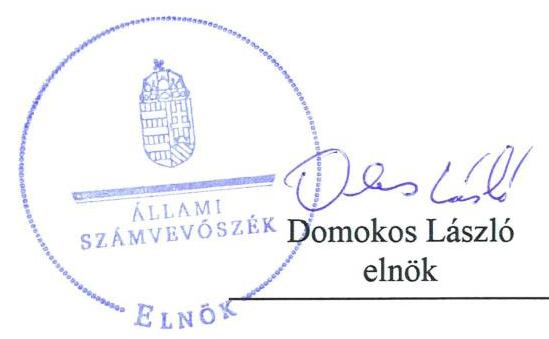
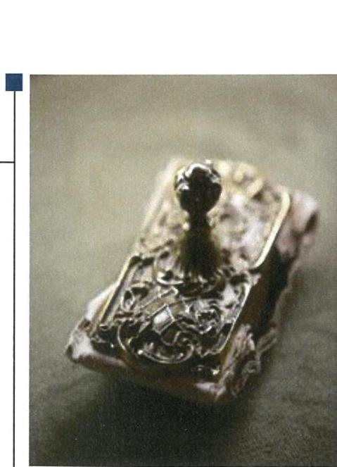
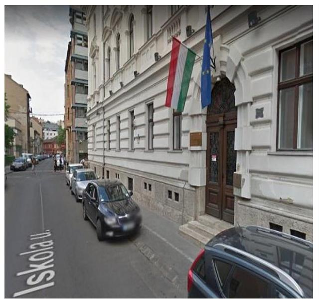
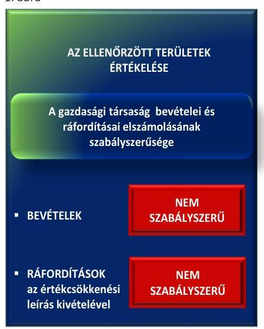

# Jelentés 

## Az állami tulajdonú gazdasági társaságok ellenőrzése

Neumann János Nonprofit Közhasznú Kft. 2018. 08. hó 28. nap

---

# AZ ELLENŐRZÉST FELÜGYELTE:

- **PETŐ KRISZTINA** felügyeleti vezető
- **AZ ELLENŐRZÉST VEZETTE ÉS A VÉGREHAJTÁSÁÉRT FELELŐS:**
  - **SALI SÁNDORNÉ** ellenőrzésvezető
  - **A PROGRAM ÖSSZEÁLLÍTÁSÁÉRT FELELŐS:**
    - **TÓTPÁL SZABOLCS** osztályvezető

**IKTATÓSZÁM:** EL-0393-044/2018.

**TÉMASZÁM:** 2469

**ELLENŐRZÉS-AZONOSÍTÓ SZÁM:** V081414

Jelentéseink az Országgyűlés számítógépes hálózatán és az Interneten a www.asz.hu címen is olvashatóak.

---

# TARTALOMJEGYZÉK 

■ ÖSSZEGZÉS ..... 5
■ AZ ELLENŐRZÉS CÉLJA ..... 6
■ AZ ELLENŐRZÉS TERÜLETE ..... 7
■ AZ ELLENŐRZÉS HÁTTERE, INDOKOLTSÁGA ..... 9
■ A JELENTÉS LÉNYEGES KÉRDÉSKÖREI ..... 10
■ AZ ELLENŐRZÉS HATÓKÖRE ÉS MÓDSZEREI ..... 11
■ MEGÁLLAPÍTÁSOK ..... 13
■ JAVASLATOK ..... 15
■ MELLÉKLETEK ..... 17
I. sz. melléklet: Értelmező szótár ..... 17
II. sz. melléklet: A Társaság főbb mérlegadatai ..... 20
III. sz. melléklet: A Társaság bevételeinek és ráfordításainak alakulása a 2013. és a 2016. évben ..... 21
■ FÜGGELÉK: ÉSZREVÉTELEK ..... 23
■ RÖVIDÍTÉSEK JEGYZÉKE ..... 25

---

.

---

# ÖSSZEGZÉS 

A Neumann János Nonprofit Közhasznú Kft. gazdálkodása, vagyongazdálkodása 2013. és 2016. évekre nem volt szabályszerű. A Társaság 2013-2016. években nem tett eleget adatszolgáltatási kötelezettségének, továbbá 2014. évtől az ellenőrzési feladatait sem szabályszerűen látta el, így nem volt biztosítva az elszámoltathatóság és a vagyon védelme. A Társaság közérdekű adatait nem tette közzé, ezáltal a működése nem volt átlátható.

## Az ellenőrzés társadalmi indokoltsága

Az állami tulajdonú gazdálkodó szervezetek a nemzeti vagyon részét képezik. Gazdálkodásuk, valamint a feladatellátásuk minősége és hatékonysága a közérdeklődés figyelmének középpontjában áll. A közpénzt, közvagyont felhasználó állami tulajdonú gazdálkodó szervezetekkel szemben társadalmi igény, hogy működésük, gazdálkodásuk szabályszerű, az általuk szolgáltatott adatok megbízhatóak legyenek. Az Állami Számvevőszék a közvagyon, a közpénzek szabályos, átlátható és elszámoltatható felhasználásának elősegítése érdekében, stratégiájával összhangban végzi az államháztartáson kívül működő szervezetek ellenőrzését.

Az Állami Számvevőszék céljaival és a társadalmi igénnyel összhangban, valamint a gazdasági társaságok kiemelt fontosságú szerepe miatt került sor az eddig még nem ellenőrzött Neumann János Nonprofit Közhasznú Kft. ellenőrzésére.

## Főbb megállapítások, következtetések, javaslatok

A 2013. és 2016. évekre vonatkozóan Neumann János Nonprofit Közhasznú Kft. gazdálkodása, vagyongazdálkodása nem volt szabályszerű. A Társaság bizonylatok nélkül jegyzett be adatokat a számviteli nyilvántartásokba, mivel a bevételeket és ráfordításokat - az értékcsökkenési leírás kivételével - bizonylatokkal nem támasztották alá. Így a jogszabályi előírás ellenére az éves beszámolókat nem bizonylatokkal alátámasztott, szabályszerűen vezetett kettős könyvvitel adatai alapján készítette el. A Társaság a 2013-2016. években a kormányzati szektorba sorolt szervezetként a jogszabályban előírt adatszolgáltatási kötelezettségének nem tett eleget. Ezzel összefüggésben az előírás ellenére a 2014. január 1-jétől 2016. szeptember 31-ig nem gondoskodott a szervezet tevékenységének, a célok megvalósításának nyomon követését biztosító rendszer kialakításáról. A Társaság közzétételi kötelezettségét nem szabályozta, közérdekű adatai közül a 2015. évi beszámolót nem tette közzé, ezáltal a működése nem volt átlátható.

A Társaság a mérlegtételek beszámolóban kimutatott állományát az előírásnak megfelelően leltárral alátámasztotta. A Társaság rendelkezett a jogszabályban előírtak szerinti számviteli politikával és annak keretében elkészített szabályzatokkal.

A Nemzeti Média- és Hírközlési Hatóság, a Magyar Nemzeti Vagyonkezelő Zrt. és a Nemzeti Fejlesztési Minisztérium tulajdonosi joggyakorlása a Neumann János Nonprofit Közhasznú Kft. felett szabályszerű volt.

A megállapítások alapján az Állami Számvevőszék a Neumann János Nonprofit Közhasznú Kft. ügyvezetőjének négy javaslatot fogalmazott meg.

---

# AZ ELLENŐRZÉS CÉLJA 

bíró elemei a jogszabályi előírásoknak megfeleltek-e.

Az ellenőrzés célja annak értékelése, hogy a tulajdonosi jogok gyakorlása szabályszerű volt-e. A gazdálkodó szervezet szabályozottsága, gazdálkodása és vagyongazdálkodási tevékenysége megfelelt-e a jogszabályi és a tulajdonosi előírásoknak. A vagyonváltozást eredményező döntések esetében a tulajdonosi jogok gyakorlója és a gazdálkodó szervezet szabályszerűen jártak-e el. Az ellenőrzés célja volt továbbá annak megítélése, hogy a kormányzati szektorba sorolt állami tulajdonban (résztulajdonban) lévő gazdálkodó szervezetek gazdálkodásának a kormányzati szektor hiányára és az államadósságra befolyással

---

# AZ ELLENŐRZÉS TERÜLETE 

## A Neumann János Nonprofit Közhasznú Kft., a Magyar Nemzeti Vagyonkezelő Zrt., a Nemzeti Média- és Hírközlési Hatóság, valamint a Nemzeti Fejlesztési Minisztérium

A Társaságot ${ }^{1}$ 2009. május 26-án alapította a magyar állam. A Társaság jegyzett tőkéje alapításkor 15,0 M Ft², 2016-ban - tőkeleszállítás következtében - 3,0 M Ft volt.

A Társaság feletti tulajdonosi jogokat az ellenőrzött időszakban az MNV Zrt.-vel kötött megbízási szerződés alapján az NMHH³, ezt követően - a megbízási szerződés megszűnésével - az MNV Zrt. ${ }^{4}$, majd jogszabályi felhatalmazás ${ }^{5}$ alapján az NFM⁶ gyakorolta.

A Társaság közhasznú tevékenysége a „világháló-portál" szolgáltatás keretében nevelés, oktatás, képességfejlesztés, ismeretterjesztés volt. Emellett ellátott még a kulturális örökség megóvásával, a hátrányos helyzetű csoportok társadalmi esélyegyenlőségének elősegítésével kapcsolatos, valamint múzeumi, könyvtári, levéltári tevékenységet.

Az NMHH Közszolgáltatási szerződést ${ }^{7}$ kötött a Társasággal az ellenőrzött időszakot megelőzően a „Médiaértés központ" Társaság általi megvalósítására és működtetésére. A szerződés alapján a médiaértés központ megvalósítása, kialakítása az MTVA ${ }^{8}$ kizárólagos tulajdonát képező ingatlanban történt. Az MTVA az ingatlan használatának biztosításával támogatta a központ megvalósítását, az ingatlan tulajdonjoga az ellenőrzött időszakban nem változott. Az MTVA, az NMHH és a Társaság között az ellenőrzött időszakot megelőzően létrejött együttműködési megállapodásban rögzítették a Társaság ingatlannal kapcsolatos jogosultságait és kötelezettségeit. A Társaság az NMHH-tól kapott pénzeszközből finanszírozott 238,2 M Ft-os ingatlan beruházást megvalósította és könyveiben - a szerződésben foglaltak alapján - az ingatlanon végzett értéknövelő beruházásként tartotta nyilván. A szerződésben a központ működtetéseként a felek az általános és középiskolás diákok tanórán kívül történő, médiaértésre és médiatudatosságra, felelős fogyasztói magatartásra nevelő tevékenység végzését, a lemaradt régiók és halmozottan hátrányos helyzetű gyermekek felzárkóztatását, szakemberek továbbképzését rögzítették a közfeladat ellátásaként.

A Közszolgáltatási szerződést a felek 2015. május 31-ei hatállyal megszűntették és a feladatellátást, a médiaértés központ működtetését a továbbiakban NMHH szervezete vette át. A Társaság a Közszolgáltatási szerződés megszűnésekor az NMHH részére térítésmentesen, számla kiállításával adta át a nyilvántartásában lévő ingatlan beruházást, a médiaértés központot.

A Társaság nem rendelkezett vagyonkezelésbe vett állami vagyonnal és jogszabályi előírás alapján nem volt könyvvizsgálatra kötelezett. Az ellenőrzött években a Társaság közfeladatot ellátó, kormányzati szektorba,

---

azon belül a központi kormányzat alszektorba sorolt gazdálkodó szervezet volt.

A Társaság a Stabilitási tv. ${ }^{9}$ által meghatározott adósságot keletkeztető ügyletet nem kötött, államadósságot befolyásoló kötelezettsége nem keletkezett. Az önköltségszámítás rendjére vonatkozó belső szabályzat készítésének kötelezettsége alól a Számv. tv. ${ }^{10}$ 14. § (6) bekezdése alapján mentesült.

A Társaság mérlegfőösszege a 2013. évről a 2016. évre 268,4 M Ft-ról 5,5 M Ft-ra csökkent a Közszolgáltatási szerződés megszűnésével, továbbá a jegyzett tőke leszállításával összefüggésben. A Társaság a 2013. és a 2016. évet veszteséggel zárta. Az átlagos állományi létszám a 2013. évi 7 főről 2016-ra 2 főre csökkent.

A Társaság ügyvezetőjének ${ }^{11}$ személye egy alkalommal, 2015. évben változott.

A Társaság eszközeinek és forrásainak alakulását a II. sz. melléklet, bevételeinek és ráfordításainak alakulását a III. sz. melléklet mutatja be.

---

# AZ ELLENŐRZÉS HÁTTERE, INDOKOLTSÁGA 

Az Európai Unióban 1994. év óta hatályos túlzott hiány eljárás mindig kihívást jelentett a tagállamok számára. Az állami tulajdonú gazdálkodó szervezetek ellenőrzése kiemelten fontos a vagyon megőrzése, megóvása érdekében, valamint a kormányzati szektor elszámolásaiban megjelenő állami tulajdonú gazdálkodó szervezetek esetében, amelyekkel szemben alapvető követelmény, hogy gazdálkodásuk, működésük szabályszerű, az általuk szolgáltatott adatok minél megbízhatóbbak legyenek. Gazdálkodásuk jellemzően a közérdeklődés és a média figyelmének középpontjában áll, amihez hozzájárul a gazdálkodásuk körébe tartozó - közvetlen vagy közvetett állami tulajdonú, tehát végső soron a nemzeti vagyon részét képező - vagyon nagysága, illetve az általuk ellátott közszolgáltatások/közfeladatok minősége és hatékonysága.

Az ellenőrzés rámutathat az állami tulajdonú gazdálkodó szervezetek gazdálkodási tevékenységével jó gyakorlatokra és szabálytalanságokra. Felhívhatja a figyelmet a jogszabályi követelmények teljesítéséhez szükséges feltételek hiányosságaira, hozzájárulhat az államháztartáson kívüli, de (közvetlenül vagy közvetve) állami vagyont használó gazdálkodó szervezetek tevékenységének átláthatóságához. Ellenőrzésünk eredményeképpen javaslatainkkal, megállapításainkkal hozzájárulhatunk a nemzeti vagyonnal való gazdálkodás átláthatóságának, elszámoltathatóságának javításához.

---

# A JELENTÉS LÉNYEGES KÉRDÉSKÖREI 

1.     - A tulajdonosi jogok gyakorlása szabályszerű volt-e?
2.     - A társaság szabályozottsága, gazdálkodása, vagyongazdálkodása, továbbá adatszolgáltatási és ellenőrzési feladatai ellátása szabályszerű volt-e?

---

# AZ ELLENŐRZÉS HATÓKÖRE ÉS MÓDSZEREI 

## Az ellenőrzés típusa

Megfelelőségi ellenőrzés.

## Az ellenőrzött időszak

A 2013-2016. évek, a 2016. évi beszámoló jóváhagyásáig tartó időszak.

## Az ellenőrzés tárgya

Állami tulajdonban (résztulajdonban) lévő gazdasági társaság gazdálkodása, kiemelten vagyongazdálkodási tevékenysége, a tulajdonosi jogok gyakorlása, továbbá a kormányzati szektorba sorolt gazdasági társaság gazdálkodásának a kormányzati szektor hiányára és az államadósságra befolyással bíró elemei.

## Az ellenőrzött szervezet

A Neumann János Nonprofit Közhasznú Kft., a Magyar Nemzeti Vagyonkezelő Zrt., a Nemzeti Média- és Hírközlési Hatóság, valamint a Nemzeti Fejlesztési Minisztérium.

## Az ellenőrzés jogalapja

Az ellenőrzés jogalapját az ÁSZ tv. ${ }^{12}$ 1. § (3) bekezdése és 5. § (3)(5) bekezdései képezték.

## Az ellenőrzés módszerei

Az ellenőrzést a nemzetközi standardokat irányadónak tekintve az ellenőrzési program ellenőrzési kérdései, az ellenőrzött időszakban hatályos jogszabályok, az ellenőrzés szakmai szabályok és módszertanok figyelembevételével végeztük.

Az ellenőrzés ideje alatt az ellenőrzött szervezettel történő kapcsolattartást az ÁSZ ${ }^{13}$ Szervezeti és Működési Szabályzatának vonatkozó előírásai alapján biztosítottuk.

Az ellenőrzésre a nemzetgazdasági szempontból kiemelt jelentőségű nemzeti vagyon körébe tartozó gazdálkodó szervezeteknél és a többségi állami tulajdonban álló gazdálkodó szervezeteknél került sor. A program

---

szerinti feladatokat a kiválasztott gazdálkodó szervezeteknél (társaságoknál) és azok többségi tulajdonban lévő leányvállalatainál, valamint a tulajdonosi jogok gyakorlójánál kellett végrehajtani. Az ellenőrzés szempontjai és az ellenőrzés alá vont gazdálkodó szervezetek köre az ellenőrzés tapasztalatai alapján - indokolt esetben - változhatott.

A teljes ellenőrzött időszakra vonatkozóan került ellenőrzésre a gazdasági társaság tervezési, beszámolási, közzétételi, adatszolgáltatási kötelezettségének, valamint belső ellenőrzési tevékenységének szabályszerűsége. A 2013. és 2016. évekre vonatkozóan a gazdasági társaság működésének szabályozottságát, a bevételei és ráfordításai elszámolását, illetve vagyongazdálkodásának szabályszerűségét is ellenőriztük.

A bevételek és a ráfordítások közül az anyagjellegű ráfordítások, az értékesítés nettó árbevétele, az egyéb, rendkívüli és pénzügyi műveletek ráfordításai és bevételei továbbá a személyi jellegű ráfordítások elszámolása, valamint az immateriális javak és tárgyi eszközök esetében a vagyonnyilvántartás és az értékcsökkenési leírás esetében a szabályszerű működést véletlen mintavétellel ellenőriztük.

A fenti sokaságok esetében a mintavétel azokra a legnagyobb értékű tételekre - a lényeges sokaságra - terjedt ki, amelyek összértéke eléri a teljes sokaság összértékének 50%-át. A személyi jellegű ráfordítások esetében a mintavétel a teljes sokaságból történt. Amennyiben valamely ellenőrzött sokaság elemszáma kisebb volt, mint az előírt mintaelem szám, az ellenőrzött sokaságot tételesen ellenőriztük.

A mintavétellel ellenőrzött területek esetében minden egyes tétel vonatkozásában a szabályszerűségre vonatkozó kérdéseket tettünk fel, amelyek
 eredménye összesítésre került. „Szabályszerűnek" értékeltünk egy ellenőrzött területet, amennyiben 95%-os bizonyossággal az ellenőrzött sokaságban az átlagos hibaarány legfeljebb 10%, nem megfelelőnek, amennyiben 10%-nál magasabb arányt képviselt.

Az ellenőrzési kérdések megválaszolásához szükséges bizonyítékok megszerzése a következő ellenőrzési eljárások alkalmazásával történt: megfigyelés, kérdésfeltevés (információkérés), összehasonlítás, valamint elemző eljárás. Az ellenőrzési bizonyítékként felhasználható adatforrások közé tartoztak egyrészt az ellenőrzési programban felsorolt adatforrások, másrészt adatforrás lehet még minden - az ellenőrzés folyamán - feltárt, az ellenőrzés szempontjából információkat tartalmazó dokumentum.

Az ellenőrzést a kérdésekre adott válaszok kiértékelésével, valamint a megjelölt adatforrások, a csatolt tanúsítványok felhasználásával, továbbá az adott időszakban hatályos jogszabályok figyelembevételével kellett lefolytatni.

---

# 1. A tulajdonosi jogok gyakorlása szabályszerű volt-e? 

## Összegző megállapítás

A tulajdonosi jogok gyakorlása szabályszerű volt.
A tulajdonosi jogok gyakorlására vonatkozó előírásokat az NMHH, az MNV Zrt., illetve az NFM az Alapító okiratban ${ }^{14}$, a belső szabályzatokban ${ }^{15}$ a Gt. ${ }^{16}$, a Ptk. ${ }^{17}$, a Vtv. ${ }^{18}$, valamint az Nvtv. ${ }^{19}$ előírásainak megfelelően kialakította.

A tulajdonosi joggyakorlás az $\mathrm{FB}^{20}$ és az ügyvezető tevékenységéhez kapcsolódóan szabályszerű volt. A három főből álló FB elnökét és tagjait a Taktv. ${ }^{21}$, a Gt., illetve a Ptk. előírásainak megfelelően választották meg. Az NMHH, az MNV Zrt., illetve az NFM az éves beszámolók elfogadásáról, jóváhagyásáról a Gt. és a Ptk. előírásainak megfelelően az FB írásbeli jelentésének birtokában döntött. A feladatellátásról, gazdálkodásról kontrolling jelentések, továbbá a Közszolgáltatási szerződésben előírt szakmai beszámoló, valamint a támogatás felhasználásáról történő elszámolás formájában számoltatták be a Társaságot.

A javadalmazási szabályzatot ${ }^{22}$ a legfőbb szerv a Taktv.-ben foglaltaknak megfelelően megalkotta.

A Társaság saját tőkéje a Gt. 143. § (2) bekezdés a) pontja és a Ptk. 3:189. § (1) bekezdés a) pontja szerint a veszteség folytán a törzstőke felére csökkent a 2013. és a 2016. évben. A 2016. évben az MNV Zrt., valamint az NFM a Ptk. előírásának megfelelően döntött a tőke rendezéséről, a jegyzett tőke leszállításra került.

## 2. A társaság szabályozottsága, gazdálkodása, vagyongazdálkodása, továbbá adatszolgáltatási és ellenőrzési feladatai ellátása szabályszerű volt-e?

Összegző megállapítás

A 2013. és a 2016. években a Társaság gazdálkodása, vagyongazdálkodása, továbbá 2013-2016. években az adatszolgáltatási és 2014. évtől az ellenőrzési feladatok ellátása nem volt szabályszerű, ezzel az elszámoltathatóság, a vagyon védelme nem volt biztosított. A Társaság a közérdekű adatai közzétételét nem szabályozta és hiányosan tette közzé, ezáltal működése nem volt átlátható.

Az előírt számviteli szabályzatokkal rendelkezett a Társaság, azok a Számv. tv. előírásaival összhangban voltak.

A Társaság működésének alapvető szabályait, a vagyongazdálkodással kapcsolatos feladat- és hatásköröket, felelősségi viszonyokat az Alapító okiratban, valamint a társasági SZMSZ ${ }_{1,2}$-ben ${ }^{23}$ meghatározták.

---

1. ábra

Forrás: az ÁSZ értékelése az ellenőrzött területekről

A GAZDÁLKODÁS, VAGYONGAZDÁLKODÁS 2013. és a 2016. években nem volt szabályszerű. A Társaság a Számv. tv. 165. § (2) bekezdésében előírtakat megsértve bizonylatok nélkül jegyzett be adatokat a számviteli nyilvántartásokba, mivel a bevételeket és ráfordításokat az értékcsökkenési leírás kivételével - bizonylatokkal nem támasztotta alá. Így a Számv. tv. 20. § (1) bekezdésében foglaltak ellenére az éves beszámolókat nem bizonylatokkal alátámasztott, szabályszerűen vezetett kettős könyvvitel adatai alapján készítette el.

Az értékcsökkenési leírás elszámolása során a Társaság szabályszerűen járt el, az állományba vétel, az eszköz besorolása a Számv. tv. előírásának megfelelt. Az ellenőrzött területek értékelését az 1. ábra mutatja.

A Társaság - a Számv. tv.-ben foglaltak szerint - a mérlegtételek beszámolóban kimutatott állományát leltárral alátámasztotta.

A Társaság üzleti tervkészítési kötelezettségének eleget tett. A Társaság az NMHH, az MNV Zrt., illetve az NFM előírásának megfelelően, az általuk meghatározott adattartalommal rendszeresen teljesítette a kontrolling adatszolgáltatási, tájékoztatási kötelezettségét. Az éves beszámolóit, valamint a közhasznúsági mellékleteit a Társaság a Számv. tv., valamint a Civil tv. ${ }^{24}$ előírásai szerint határidőben letétbe helyezte.

AZ ADATSZOLGÁLTATÁSI ÉS ELLENŐRZÉSI feladatok ellátása nem volt szabályszerű, valamint a Társaság a közérdekű adatai közzétételét nem szabályozta, közérdekű adatait hiányosan tette közzé.

A 2013-2016. években a Társaság, mint kormányzati szektorba sorolt egyéb szervezet 2014. december 31-éig az Ávr. ${ }^{25}$ 7. sz. mellékletének 28. pontjában, 2015. január 1-jétől 5. számú mellékletének 23. pontjában foglaltak ellenére a számviteli jogszabályok szerinti beszámolójára, kiemelt mutatóira, költségvetési kapcsolataira vonatkozó adatszolgáltatási kötelezettségét nem teljesítette.

A Társaság 2014. január 1-jétől 2016. szeptember 31-ig - tekintettel a Bkr. ${ }^{26}$ 54/A. §-ára - a Bkr. 10. §-ában foglaltak, továbbá a tulajdonosi ellenőrzés javaslata ellenére nem gondoskodott a szervezet tevékenységének, a célok megvalósításának nyomon követését biztosító rendszer kialakításáról.

A közérdekű adatok közzétételére vonatkozó szabályzatot a Társaság az Info tv. ${ }^{27}$ 35. § (3) bekezdésében foglaltak ellenére nem alkotott. A Társaság a közérdekű adatai közül a 2015. év beszámolóját az Info tv. 37. § (1) bekezdésében, valamint a jogszabály 1. melléklete III. gazdálkodási adatok 1. pontjában foglalt előírás ellenére nem tette közzé. A Taktv. 2. § (1) bekezdésében meghatározott közérdekű adatok nyilvánosságra hozatalát - a bankszámla feletti rendelkezésre jogosultak kivételével - biztosította.

---

# JAVASLATOK 

Az ÁSZ tv. 33. § (1) bekezdésében foglaltak értelmében az ellenőrzött szervezet vezetője köteles a jelentésben foglalt megállapításokhoz kapcsolódó intézkedési tervet összeállítani és azt a jelentés kézhezvételétől számított 30 napon belül az ÁSZ részére megküldeni. Amennyiben az ellenőrzött szervezet vezetője nem küldi meg határidőben az intézkedési tervet, vagy továbbra sem elfogadható intézkedési tervet küld, az Állami Számvevőszék elnöke az ÁSZ tv. 33. § (3) bekezdése a) és b) pontjaiban foglaltakat érvényesítheti.

## A Neumann János Nonprofit Közhasznú Kft. ügyvezetőjének

1. Intézkedjen, hogy az éves beszámolókat - a jogszabályi előírásnak megfelelően - bizonylatokkal alátámasztott, szabályszerűen vezetett kettős könyvvitel adatai alapján készítsék el.
(2. összegző megállapítás 3. bekezdésének 2-3. mondatai alapján)
2. Intézkedjen az adatszolgáltatási kötelezettségének jogszabályi előírásoknak megfelelő teljesítése iránt.
(2. összegző megállapítás 8. bekezdése alapján)
3. Intézkedjen az Info tv. szerinti közzétételi kötelezettség teljesítése részletes szabályainak belső szabályzatban történő megállapítása iránt.
(2. összegző megállapítás 10. bekezdésének 1. mondata alapján)
4. Intézkedjen a közzétételi kötelezettségek jogszabályi előírásoknak megfelelő teljesítése érdekében.
(2. összegző megállapítás 10. bekezdés 2-3. mondatai alapján)

---

.

---

# MELLÉKLETEK 

- I. SZ. MELLÉKLET: ÉRTELMEZŐ SZÓTÁR
állami vagyon
gazdasági társaság
kormányzati szektorba sorolt egyéb szervezet
közfeladat
közhasznú tevékenység
közszolgáltatási szerződés:

MNV Zrt.
nemzeti vagyon
a) Az állam tulajdonában lévő dolog, valamint a dolog módjára hasznosítható természeti erő,
b) az a) pont hatálya alá nem tartozó mindazon vagyon, amely vonatkozásában törvény az állam kizárólagos tulajdonjogát nevesíti,
c) az állam tulajdonában lévő tagsági jogviszonyt megtestesítő értékpapír, illetve az államot megillető egyéb társasági részesedés,
d) az államot megillető olyan immateriális, vagyoni értékkel rendelkező jogosultság, amelyet jogszabály vagyoni értékű jogként nevesít.
Forrás: Vtv. 1. § (2) bekezdése
e) az állam tulajdonában lévő pénzügyi eszközök
Forrás: Vtv. 1. § (2) bekezdése
a Ptk. 3:88. § (1) bekezdése szerint „a gazdasági társaságok üzletszerű közös gazdasági tevékenység folytatására, a tagok vagyoni hozzájárulásával létrehozott, jogi személyiséggel rendelkező vállalkozások, amelyekben a tagok a nyereségből közösen részesednek, és a veszteséget közösen viselik".
Az a szervezet, amely az Áht. alapján nem része az államháztartásnak, azonban az Európai Közösséget létrehozó szerződéshez csatolt, a túlzott hiány esetén követendő eljárásról szóló jegyzőkönyv alkalmazásáról szóló 2009. május 25-i 479/2009/EK rendelet szerint a kormányzati szektorba tartozik. A nemzetgazdasági miniszter 2013. június 26-án megjelent Közleményben tette közé ezen szervezetek listáját
A Civil tv. 2. § 19. pontja szerint „jogszabályban meghatározott állami vagy önkormányzati feladat, amit a feladat címzettje közérdekből, haszonszerzési cél nélkül, jogszabályban meghatározott követelményeknek és feltételeknek megfelelve végez, ideértve a lakosság közszolgáltatásokkal való ellátását, valamint e feladatok ellátásához szükséges infrastruktúra biztosítását is".
A Civil tv. 2. § 20. pontja szerint „közhasznú tevékenység: minden olyan tevékenység, amely a létesítő okiratban megjelölt közfeladat teljesítését közvetlenül vagy közvetve szolgálja, ezzel hozzájárulva a társadalom és az egyén közös szükségleteinek kielégítéséhez".
A Civil tv. 2. § 21. pontja szerint „közszolgáltatási szerződés: valamely közfeladat vagy annak egy része - ellátására a szerv nevében történő ellátására kötött írásbeli szerződés".
Az állami vagyon felett, a Magyar Államot megillető tulajdonosi jogok és kötelezettségek összességét - a hatályos szabályozás szerint - az állami vagyon felügyeletéért felelős miniszter (jelenleg a nemzeti fejlesztési miniszter) gyakorolja. A miniszter feladatát nagy részben az MNV Zrt., mint tulajdonosi joggyakorló szervezet útján látja el.
a) az állam vagy a helyi önkormányzat kizárólagos tulajdonában álló dolgok,
b) az a) pont hatálya alá nem tartozó, állam vagy a helyi önkormányzat tulajdonában lévő dolog,
c) az állam vagy a helyi önkormányzat tulajdonában lévő pénzügyi eszközök, továbbá az államot vagy a helyi önkormányzatot megillető társasági részesedések,
d) az államot vagy a helyi önkormányzatot megillető bármely vagyoni értékkel rendelkező jogosultság, amelyet jogszabály vagyoni értékű jogként nevesít,

---

e) Magyarország határa által körbezárt terület feletti légtér,
f) az üvegházhatású gázok kibocsátási egységeinek kereskedelméről szóló törvény szerint kibocsátási egység és légiközlekedési kibocsátási egység, valamint az ENSZ Éghajlatváltozási Keretegyezménye és annak Kiotói Jegyzőkönyvének végrehajtási keretrendszeréről szóló törvény szerinti kiotói egység,
g) állami vagy önkormányzati fenntartású közgyűjtemény (muzeális intézmény, levéltár, közgyűjteményként működő kép- és hangarchívum, valamint könyvtár) saját gyűjteményében nyilvántartott kulturális javak körébe tartozó dolog, kivéve, ha az állami vagy önkormányzati tulajdon jogszerű létrejötte kétséget kizáró módon nem bizonyítható és a dologra nézve más a tulajdonjogát bizonyítja vagy a kulturális javakra vonatkozó jogszabályokban meghatározott eljárás keretében valószínűsíti (g. pont módosult 2013. december 07-étől),
h) a régészeti lelet,
i) a nemzeti adatvagyon körébe tartozó állami nyilvántartások fokozottabb védelméről szóló törvény szerinti nemzeti adatvagyon.
Forrás: Nvtv. 1. § (2)
nonprofit gazdasági társaság Ctv. ${ }^{28}$ 9/F. § (2) bekezdése szerint „az a gazdasági társaság minősül nonprofit gazdasági társaságnak és cégnevében az a gazdasági társaság tüntetheti fel a nonprofit jelleget, amelynek létesítő okirata tartalmazza, hogy a gazdasági társaság tevékenységéből származó nyereség a tagok között nem osztható fel, hanem az a gazdasági társaság vagyonát gyarapítja." (hatályos: 2014. március 15-étől)
tulajdonosi ellenőrzés
2014. március 14-éig:

Az állami vagyon kezelőjét, haszonélvezőjét, használóját megillető jogok gyakorlását, annak szabályszerűségét, célszerűségét az MNV Zrt. - szükség szerint területi szervei útján - ellenőrzi.
2014. március 15-étől:

Az állami vagyon használóját, vagyonkezelőjét és haszonélvezőjét megillető jogok gyakorlását, annak szabályszerűségét, a kötelezettségek teljesítését, valamint a vagyon rendeltetése szerinti célszerűségét a tulajdonosi joggyakorló rendszeresen ellenőrzi.
Forrás: Vtv.vhr. 20. § (1)
tulajdonosi jogok gyakorlója 1.
2013. június 27-éig:

Az állami vagyon felett a Magyar Államok megillető tulajdonosi jogok és kötelezettségek összességét - ha törvény eltérően nem rendelkezik - az állami vagyon felügyeletéért felelős miniszter (a továbbiakban: miniszter) gyakorolja, aki e feladatát az MNV Zrt., a Magyar Fejlesztési Bank, illetve a tulajdonosi joggyakorló szervezet útján látja el. A miniszter miniszteri rendeletben, a törvényben meghatározott állami vagyoni kör tekintetében, meghatározott időtartamra,
 a joggyakorlás egyes szabályainak meghatározásával - az őt megillető tulajdonosi jogok és kötelezettségek összességének, illetve azok meghatározott részének gyakorlóját az Áht. szerinti központi költségvetési szervek, ezek intézményei, továbbá a 100%-ban állami tulajdonban álló gazdasági társaságok közül kijelölheti.
Forrás: Vtv. 3. § (1) és (2)
2013. június 28-ától:

A rábízott állami vagyon felett az államot megillető tulajdonosi jogok és kötelezettségek összességét tulajdonosi joggyakorlóként:
a) ha törvény vagy miniszteri rendelet eltérően nem rendelkezik, az MNV Zrt.),
b) törvényben kijelölt személy vagy

---

c) az állami vagyon felügyeletéért felelős miniszter (a továbbiakban: miniszter) által rendeletben kijelölt személy gyakorolja.
[...] A miniszter e törvény felhatalmazása alapján - a meghatározott célok hatékonyabb elérése érdekében, miniszteri rendeletben, az ott meghatározott állami vagyoni kör tekintetében, meghatározott időtartamra - e törvény keretei között, a joggyakorlás egyes szabályainak meghatározásával - az államot megillető tulajdonosi jogok és kötelezettségek összességének, illetve azok meghatározott részének gyakorlóját az Áht. szerinti központi költségvetési szervek, ezek intézményei, továbbá a 100%-ban állami tulajdonban álló gazdasági társaságok közül kijelölheti.
Forrás: Vtv. 3. § (1) és (2)
2.

Aki a nemzeti vagyon felett az államot vagy a helyi önkormányzatot megillető tulajdonosi jogok és kötelezettségek összességének gyakorlására jogosult
Forrás: Nvtv. 3. § (1) 17. pontja

---

II. SZ. MELLÉKLET: A TÁRSASÁG FŐBB MÉRLEGADATAI

| A NEUMANN JÁNOS NONPROFIT KÖZHASZNÚ KFT. MÉRLEGEINEK KIEMELT ADATAI (M FT) |  |  |  |  |
| :--: | :--: | :--: | :--: | :--: |
| Megnevezés / időszak | 2013-12-31. | 2014-12-31. | 2015-12-31. | 2016-12-31. |
| I. Befektetett eszközök | 205,2 | 245,3 | 0,4 | 0,2 |
| ebből: tárgyi eszközök | 204,5 | 244,5 | 0,4 | 0,2 |
| II. Forgóeszközök | 60,9 | 21,1 | 6,2 | 5,3 |
| ebből: készletek | 0,0 | 0,0 | 0,3 | 0,0 |
| ebből: követelések | 0,1 | 0,1 | 0,1 | 0,0 |
| ebből: pénzeszközök | 60,8 | 21,0 | 5,8 | 5,3 |
| III. Aktív időbeli elhatárolások | 2,3 | 1,3 | 0,1 | 0,0 |
| ESZKÖZÖK ÖSSZESEN | 268,4 | 267,7 | 6,7 | 5,5 |
| IV. Saját tőke | 4,7 | 7,0 | 5,3 | -0,5 |
| ebből: jegyzett tőke | 15,0 | 15,0 | 15,0 | 3,0 |
| ebből: tőketartalék | 0,0 | 0,0 | 0,0 | 1,7 |
| ebből: eredménytartalék | -6,4 | -10,3 | -8,0 | 0,5 |
| ebből: mérleg szerinti eredmény/adózott eredmény* | -3,9 | 2,3 | -1,7 | -5,7 |
| V. Céltartalékok | 14,0 | 0,0 | 0,0 | 0,0 |
| VI. Kötelezettségek | 4,7 | 4,8 | 0,9 | 4,6 |
| ebből: hosszú lejáratú kötelezettség | 0,1 | 0,0 | 0,0 | 0,0 |
| ebből: rövid lejáratú kötelezettség | 4,6 | 4,8 | 0,9 | 4,6 |
| VII. Passzív időbeli elhatárolások | 245,0 | 255,9 | 0,5 | 1,4 |
| FORRÁSOK ÖSSZESEN | 268,4 | 267,7 | 6,7 | 5,5 |

Forrás: a Társaság éves beszámolói
*a 2016. évtől a mérleg szerinti eredmény kategória megszűnt

---

# A NEUMANN JÁNOS NONPROFIT KÖZHASZNÚ KFT. BEVÉTELEINEK, RÁFORDÍTÁSAINAK, VALAMINT ADÓZOTT EREDMÉNYÉNEK ALAKULÁSA ÉS MEGOSZLÁSA A 2013. ÉS A 2016. ÉVBEN (M FT)

|  Megnevezés | 2013. év | 2016. év  |
| --- | --- | --- |
|  Értékesítés nettó árbevétele | 1,3 | 2,5  |
|  Aktivált saját teljesítmények értéke | 0,0 | 0,0  |
|  Egyéb és rendkívüli bevételek*, pénzügyi műveletek bevételei | 59,3 | 0,5  |
|  Összes bevétel | 60,6 | 3,0  |
|  - közhasznú tevékenység | 60,1 | 0,6  |
|  - vállalkozási tevékenység | 0,5 | 2,4  |
|  Anyagjellegű ráfordítások | 19,9 | 3,1  |
|  Személyi jellegű ráfordítások | 37,0 | 5,3  |
|  Értékcsökkenési leírás | 1,1 | 0,2  |
|  Egyéb és rendkívüli ráfordítások*, pénzügyi műveletek ráfordításai | 6,5 | 0,1  |
|  Összes ráfordítás | 64,5 | 8,7  |
|  - közhasznú tevékenység | 58,0 | 4,4  |
|  - vállalkozási tevékenység | 6,5 | 4,3  |
|  Összes adózott eredmény | -3,9 | -5,7  |
|  - közhasznú tevékenység | 2,1 | -3,8  |
|  - vállalkozási tevékenység | -6,0 | -1,9  |

Forrás: a Társaság eredmény-kimutatásai és közhasznúsági mellékletei *a 2016. évtől a rendkívüli bevétel, illetve ráfordítás kategória megszűnt

---

.

---

# FÜGGELÉK: ÉSZREVÉTELEK 

A jelentéstervezetet a Számvevőszék 15 napos észrevételezésre megküldte az ellenőrzött szervezetek vezetőinek az ÁSZ tv. 29. § (1) bekezdése előírásának megfelelően.

A Neumann János Nonprofit Közhasznú Kft. ügyvezetője, a Magyar Nemzeti Vagyonkezelő Zrt. vezérigazgatója, a Nemzeti Média- és Hírközlési Hatóság elnöke, valamint az innovációs és technológiai miniszter nem élt észrevételezési jogával.

[^0]
[^0]:    * 29. § (1) Az Állami Számvevőszék az ellenőrzési megállapításait megküldi az ellenőrzött szervezet vezetőjének vagy az általa megbízott személynek, és annak, akinek személyes felelősségét állapította meg.
    (2) Az ellenőrzött szervezet vezetője és a felelősként megjelölt személy az ellenőrzés megállapításaira tizenöt napon belül írásban észrevételt tehet.
    (3) Az Állami Számvevőszék az észrevételre a beérkezésétől számított harminc napon belül írásban válaszol. A figyelembe nem vett észrevételeket köteles a jelentésben feltüntetni, és megindokolni, hogy azokat miért nem fogadta el.

---

.

---

# RÖVIDÍTÉSEK JEGYZÉKE 

${ }^{1}$ Társaság

${ }^{2} \mathrm{M} \mathrm{Ft}$
${ }^{3}$ NMHH
${ }^{4}$ MNV Zrt.
${ }^{5}$ jogszabályi felhatalmazás
${ }^{6}$ NFM
${ }^{7}$ Közszolgáltatási szerződés
${ }^{8}$ MTVA
${ }^{9}$ Stabilitási tv.
${ }^{10}$ Számv. tv.
${ }^{11}$ ügyvezető
${ }^{12}$ ÁSZ tv.
${ }^{13}$ ÁSZ
${ }^{14}$ Alapító okirat
${ }^{15}$ belső szabályzatok:
${ }^{16} \mathrm{Gt}$.

Neumann János Nonprofit Közhasznú Kft. A Társaságot Neumann János Digitális Könyvtár és Multimédia Központ Nonprofit Korlátolt Felelősségű Társaság néven alapította a Magyar Állam. A Társaság elnevezése 2013. december 16-án Neumann János Médiaértés Központ Nonprofit Közhasznú Korlátolt Felelősségű Társaságra, majd 2015. december 21-én Neumann János Nonprofit Közhasznú Korlátolt Felelősségű Társaságra változott
millió forint
Nemzeti Média- és Hírközlési Hatóság (2012. június 29. és 2015. május 31. között)
Magyar Nemzeti Vagyonkezelő Zrt. (2015. június 01. és 2016. július 15. között)
az egyes gazdasági társaságok felett az államot megillető tulajdonosi jogok és kötelezettségek összességét gyakorló szervezet kijelöléséről szóló 77/2012. (XII. 22.) NFM rendelet módosításáról szóló 22/2016. (VII. 05.) NFM rendelet 1/A. §-ában foglaltak szerint a Társaság felett az államot megillető tulajdonosi jogok és kötelezettségek összessége gyakorlójának 2016. július 16-ától 2020. december 31-éig az NFM-et jelölték ki.
Nemzeti Fejlesztési Minisztérium (2016. július 16-ától)
a Nemzeti Média- és Hírközlési Hatóság, valamint a Neumann János Nonprofit Közhasznú Kft. között 2012. július 26-án létrejött Közszolgáltatási szerződés (hatályos: 2015. május 31-éig)
Médiaszolgáltatás-támogató és Vagyonkezelő Alap
Magyarország gazdasági stabilitásáról szóló 2011. évi CXCIV. törvény (hatályos: 2011. december 30-ától)
a számvitelről szóló 2000. évi C. törvény
a Neumann János Nonprofit Közhasznú Kft. ügyvezetője
az Állami Számvevőszékről szóló 2011. évi LXVI. törvény (hatályos: 2011. július 1-jétől)
Állami Számvevőszék
a Neumann János Nonprofit Közhasznú Kft. alapító okirata és annak módosításai
MNV Zrt. SZMSZ1: 617/2015 (XI. 17) IG határozata az MNV Zrt. Szervezeti és Működési Szabályzatáról (hatályos: 2015. november 17-étől)
MNV Zrt. SZMSZ2: 158/2016. (IX. 06.) IG határozat az MNV Zrt. Szervezeti és Működési Szabályzatáról (hatályos: 2016. április 15-étől)
Portfóliós Kódex1: 7/2015. számú Vezérigazgatói utasítás az MNV Zrt. Portfóliós kódexéről (hatályos: 2015. április 01-jétől) és annak módosításai)
Portfóliós Kódex2: 17/2016. számú vezérigazgatói utasítás az MNV Zrt. Portfóliós Kódexéről (hatályos: 2016. május 31-étől)
Monitoring szabályzat: 51/2013. számú vezérigazgatói utasítás az MNV Zrt. Társasági Monitoring Szabályzatáról (hatályos: 2013. december 19-étől)
Tulajdonosi ellenőrzési szabályzat: 39/2014. számú vezérigazgatói utasítás az MNV Zrt. tulajdonosi ellenőrzési szabályzatáról (hatályos: 2014. szeptember 10-étől)
NFM SZMSZ: 33/2014 (X. 10.) NFM utasítás és módosításai a Nemzeti Fejlesztési Minisztérium Szervezeti és Működési Szabályzatáról (hatályos: 2014. december 11-étől)
TFP ügyrend: Társasági portfólió főosztály ügyrendje (hatályos: 2016. szeptember 20-ától)
2006. évi IV. törvény a gazdasági társaságokról (hatálytalan 2014. március 15-étől)

---

${ }^{17}$ Ptk.
${ }^{18}$ Vtv.
${ }^{19}$ Nvtv.
${ }^{20} \mathrm{FB}$
${ }^{21}$ Taktv.
${ }^{22}$ javadalmazási szabályzat ${ }_{1,2,3}$
${ }^{23}$ társasági SZMSZ ${ }_{1,2}$
${ }^{24}$ Civil tv.
${ }^{25}$ Ávr.
${ }^{26} \mathrm{Bkr}$.
${ }^{27}$ Info tv.
${ }^{28} \mathrm{Ctv}$.
a Polgári Törvénykönyvről szóló 2013. évi V. törvény (hatályos: 2014. március 15-étől) az állami vagyonról szóló 2007. évi CVI. törvény
a nemzeti vagyonról szóló 2011. évi CXCVI. törvény
a Neumann János Nonprofit Közhasznú Kft. Felügyelő Bizottsága
a köztulajdonban álló gazdasági társaságok takarékosabb működéséről szóló 2009. évi CXXII. törvény (hatályos: 2009. december 04-étől)
javadalmazási szabályzat1: Neumann János Nonprofit Közhasznú Kft. Javadalmazási szabályzata N-186/2011. (hatályos: 2014. december 17-éig)
javadalmazási szabályzat2: Neumann János Nonprofit Közhasznú Kft. Javadalmazási szabályzata N-230/2014. (hatályos: 2014. december 18-ától)
javadalmazási szabályzat3: Neumann János Nonprofit Közhasznú Kft. Javadalmazási szabályzata (hatályos: 2016. február 26-ától)
társasági SZMSZ1: a Neumann János Nonprofit Közhasznú Kft. Szervezeti és működési szabályzata (hatályos: 2014. április 09-éig),
társasági SZMSZ2: a Neumann János Nonprofit Közhasznú Kft. Szervezeti és működési szabályzata (hatályos: 2014. április 10-étől)
az egyesülési jogról, a közhasznú jogállásról, valamint a civil szervezetek működéséről és támogatásáról szóló 2011. évi CLXXV. törvény
368/2011. (XII. 31.) Korm. rendelet az államháztartási törvény végrehajtásáról (hatályos: 2012. január 1-jétől)
370/2011. (XII. 31.) Korm. rendelet a költségvetési szervek belső kontrollrendszeréről és belső ellenőrzéséről (hatályos: 2012. január 01-jétől)
az információs önrendelkezési jogról és az információszabadságról szóló 2011. évi CXII. törvény (hatályos: 2011. július 27-étől)
a cégnyilvánosságról, a bírósági cégeljárásról és a végelszámolásról szóló 2006. évi V. törvény (hatályos: 2007. január 01-jétől)

---

ÁLLAMI SZÁMVEVŐSZÉK
1052 Budapest, Apáczai Csere János utca 10.
Levélcím: 1364 Budapest 4. Pf. 54
Telefon: +36 14849100 Telefax: +36 14849200
www.asz.hu
