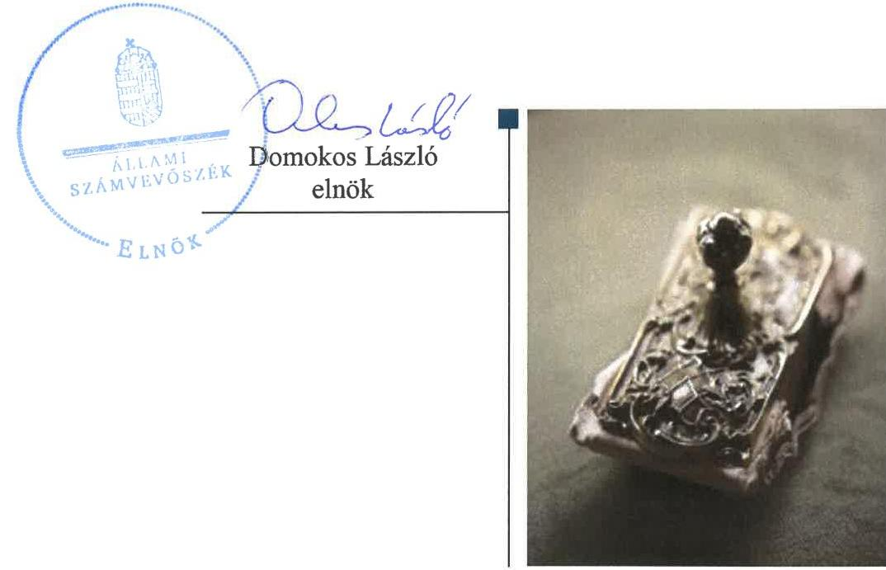
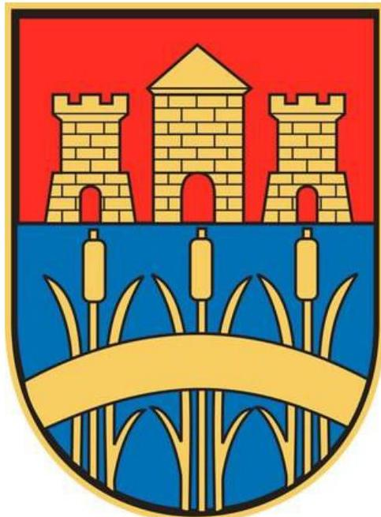

# Jelentés 

## Az önkormányzatok gazdasági társaságai

Az önkormányzatok többségi tulajdonában lévő gazdasági társaságok gazdálkodásának ellenőrzése - Dombóvári Város- és Lakásgazdálkodási Nonprofit Kft.
2018. szeptember 14. nap

---

# AZ ELLENŐRZÉST FELÜGYELTE:

- **KLINGA LÁSZLÓ** felügyeleti vezető
- **AZ ELLENŐRZÉST VEZETTE ÉS A VÉGREHAJTÁSÁÉRT FELELŐS:**
  - **HOFMEISTER LÁSZLÓ** ellenőrzésvezető
  - **A PROGRAM ÖSSZEÁLLÍTÁSÁÉRT FELELŐS:**
    - **TÓTPÁL SZABOLCS** osztályvezető

**IKTATÓSZÁM:** EL-0155-058/2018

**TÉMASZÁM:** 2447

**ELLENŐRZÉS-AZONOSÍTÓ SZÁM:** V-079345

---

**Jelentéseink az Országgyűlés számítógépes hálózatán és az Interneten a www.asz.hu címen is olvashatóak.**

---

# TARTALOMJEGYZÉK 

■ ÖSSZEGZÉS ..... 5
■ AZ ELLENŐRZÉS CÉLJA ..... 6
■ AZ ELLENŐRZÉS TERÜLETE ..... 7
■ AZ ELLENŐRZÉS HÁTTERE, INDOKOLTSÁGA ..... 8
■ A JELENTÉS LÉNYEGES KÉRDÉSKÖREI ..... 9
■ AZ ELLENŐRZÉS HATÓKÖRE ÉS MÓDSZEREI ..... 10
■ MEGÁLLAPÍTÁSOK ..... 12
■ JAVASLATOK ..... 15
■ MELLÉKLETEK ..... 17
I. sz. melléklet: Értelmező szótár ..... 17
■ FÜGGELÉK: ÉSZREVÉTELEK ..... 19
■ RÖVIDÍTÉSEK JEGYZÉKE ..... 21

---

.

---

# ÖSSZEGZÉS 

A Dombóvári Város- és Lakásgazdálkodási Nonprofit Kft. számviteli szabályozottsága nem felelt meg a jogszabályi előírásoknak, gazdálkodása, vagyongazdálkodása nem volt szabályszerű. A beszámolók hiteles és megbízható alátámasztásáról nem gondoskodtak. Nem volt biztosítva a működés és a gazdálkodás átláthatósága.

## Az ellenőrzés társadalmi indokoltsága

Magyarországon az önkormányzatok kötelező és önként vállalt feladataik ellátása során egyre szélesebb körben alkalmazzák a költségvetési szerveken kívüli feladatellátást, ezáltal az önkormányzati tulajdonú gazdasági társaságok is kiemelt fontosságú szerephez jutnak a lakossági szolgáltatások biztosításában. Az önkormányzatok többségi tulajdonában álló gazdasági társaságok ellenőrzése kiemelt jelentőségű, mivel működésük hatással van a tulajdonos önkormányzat gazdálkodására, gazdálkodásának egyes elemei befolyásolják az önkormányzati alszektor hiányát és az államadósságot.

Az Állami Számvevőszék stratégiájában célul tűzte ki az államháztartáson kívül működő szervezetek ellenőrzését, mely hozzájárul a közpénzek szabályos, átlátható, elszámoltatható és eredményes felhasználásához. A Dombóvári Város- és Lakásgazdálkodási Nonprofit Kft.-vel az általa ellátott feladaton keresztül a városban élő lakosság széles rétege került kapcsolatba.

## Főbb megállapítások, következtetések, javaslatok

Az Önkormányzat a Társaság feletti tulajdonosi joggyakorlásának kereteit a jogszabályoknak megfelelően alakította ki, a tulajdonosi jogait szabályszerűen gyakorolta.

A Társaság számviteli szabályozottsága az ellenőrzött időszakban nem volt szabályszerű, mivel nem rendelkezett számlarenddel.

A vagyongazdálkodása nem volt szabályszerű, mert a beszámolók mérlegének leltárral való alátámasztottsága nem volt szabályszerű, továbbá a jogszabályi előírás ellenére a vagyonkezelt eszközöket a beszámoló mérlegében nem szerepeltette.

A bevételek és ráfordítások elszámolása nem volt szabályszerű, mert a számvitelről szóló törvény előírásai ellenére a könyvviteli elszámolást közvetlenül alátámasztó bizonylatok nem tartalmazták az érintett könyvviteli számlákra történő hivatkozást.

A Társaság a közérdekű adatokra vonatkozó közzétételi kötelezettségének nem tett eleget, ezzel működése átláthatóságát nem biztosította. Kormányzati szektorba sorolt társaságként a jogszabályban előírt adatszolgáltatási kötelezettségeit nem teljesítette.

A megállapítások alapján az Állami Számvevőszék a Dombóvári Város- és Lakásgazdálkodási Nonprofit Kft. ügyvezetőjének hét javaslatot fogalmazott meg.

---

# AZ ELLENŐRZÉS CÉLJA 

Az ellenőrzés célja annak értékelése volt, hogy az önkormányzat vagyongazdálkodási tevékenysége során szabályszerűen gyakorolta-e tulajdonosi jogait, a gazdasági társaság szabályozottsága, gazdálkodása és vagyongazdálkodási tevékenysége, bevételeinek és ráfordításainak elszámolása megfelelt-e a jogszabályi és tulajdonosi előírásoknak; a gazdasági társaság kötelezettségállománya jelentett-e kockázatot a működésre, valamint a gazdálkodás átláthatósága és elszámoltathatósága érdekében biztosított volt-e a szolgáltatás díjának megalapozottsága szabályszerű önköltségszámítással. Az ellenőrzés célja továbbá annak megítélése, hogy a kormányzati szektorba sorolt önkormányzati tulajdonban lévő gazdálkodó szervezet gazdálkodásának a kormányzati szektor hiányára és az államadósságra befolyással bíró elemei a jogszabályi előírásoknak megfeleltek-e.

---

# AZ ELLENŐRZÉS TERÜLETE

## Dombóvár Város Önkormányzata és a kizárólagos tulajdonában lévő Dombóvári Város- és Lakásgazdálkodási Nonprofit Korlátolt Felelősségű Társaság

A Társaság1 2009-ben alakult a Dombóvári Kht.2 jogutódjaként 10,1 M Ft törzstőkével, alapítója az Önkormányzat3 volt.

A Társaság közhasznú jogállású, közfeladatot ellátó gazdasági társaság, fő tevékenysége az ingatlankezelés volt. A Társaság közhasznú feladatai voltak: helyi közfoglalkoztatás szervezése, helyi közútkezelői feladatok ellátása, városi köztemetők üzemeltetése, ingatlankezelés, bérlakás-gazdálkodás, gyepmesteri feladatok ellátása, nyilvános WC-k fenntartása.

A Társaság feladatellátásához szükséges infrastruktúrát az Önkormányzat vagyontárgyak ingyenes használatba adásával biztosította. Az Önkormányzat 2015. március 12-én és 2016. november 8-án Vagyonkezelési szerződés4 alapján vagyonkezelésbe adott 312,6, illetve 55,7 aranykorona értékű szántót a közfoglalkoztatottak mezőgazdasági programban történő foglalkoztatása céljából. A Társaság feladatellátásához tartozó Vagyonkezelési-, Kegyeleti5- és Közszolgáltatási szerződés6-ek tartalmazták a feladatellátásra vonatkozó szabályokat.

A Társaság 2015. december 30-tól tartozott a kormányzati szektorba sorolt egyéb szervezetek körébe. A Társaság önköltségszámítási szabályzat készítésére a Számv. tv.7 alapján nem volt kötelezett.

A közhasznú tevékenység ellátására támogatásokat elsősorban központi költségvetési forrásból kapott a Társaság, melynek összege az ellenőrzött időszakban 0,8 Mrd Ft-ot tett ki.

A Társaság a 2013-2016. években veszteségesen működött az egyszerűsített éves beszámolók adatai alapján. Az átlagos állományi létszáma a 2013. évi 290 főről 2016. évre 232 főre csökkent.

A Társaságot irányító ügyvezető személye a 2015. évben háromszor változott. Az ellenőrzött időszakban a polgármester személye nem változott. A jegyző 2013. február 1-jétől töltötte be hivatalát.

---

# AZ ELLENŐRZÉS HÁTTERE, INDOKOLTSÁGA 

Az önkormányzatok többségi tulajdonában álló gazdasági társaságok ellenőrzése kiemelten fontos a vagyon megőrzése, megóvása érdekében, valamint a kormányzati szektor elszámolásaiban megjelenő önkormányzati tulajdonú gazdálkodó szervezetek esetében, amelyekkel szemben alapvető követelmény, hogy gazdálkodásuk, működésük szabályszerű, az általuk szolgáltatott adatok minél megbízhatóbbak legyenek.

A feladatellátás költségeinek, ráfordításainak alakulása a lakosság széles rétegét érinti. Az ellenőrzés várható hasznosulásaként ellenőrzéseink feltárhatják, hogy az önkormányzat a feladatellátásához rendelt vagyon működtetését a tulajdonostól elvárható gondossággal végezte-e, a feladatot ellátó gazdasági társaság a létesítő okiratban, szolgáltatási szerződésben foglaltak betartásával biztosította-e a feladat ellátását. Az ellenőrzés rávilágíthat arra, hogy a gazdasági társaság a vagyon használatával biztosította-e a szolgáltatás folytatásának feltételeit, az önkormányzat tulajdonosi felügyelete hozzájárult-e a szabályszerű gazdálkodáshoz és feladatellátáshoz.

A megállapítások alapján megfogalmazott számvevőszéki javaslatok hasznosítása elősegítheti a meglévő hibák megszüntetését. A jó gyakorlatok bemutatásával az ÁSZ hozzájárul a követendő megoldások megismertetéséhez, terjesztéséhez.

---

# A JELENTÉS LÉNYEGES KÉRDÉSKÖREI 

1. A tulajdonosi jogok gyakorlása szabályszerű volt-e?
2. A Társaság szabályozottsága, gazdálkodása és vagyongazdálkodása megfelelt-e az előírásoknak?

---

# AZ ELLENŐRZÉS HATÓKÖRE ÉS MÓDSZEREI 

## Az ellenőrzés típusa

Megfelelőségi ellenőrzés

## Az ellenőrzött időszak

2013. január 1-jétől 2016. december 31-ig

## Az ellenőrzés tárgya

Az önkormányzatok - többségi tulajdonában lévő gazdasági társaságok feletti - tulajdonosi joggyakorlása, valamint a gazdasági társaságok gazdálkodásának szabályozottsága és szabályszerűsége.

Az ellenőrzés kiterjedt minden olyan körülményre és adatra, amely az ÁSZ8 jogszabályban meghatározott feladatainak teljesítéséhez, valamint a program végrehajtása folyamán felmerült újabb összefüggések feltárásához szükséges volt.

## Az ellenőrzött szervezet

Dombóvár Város Önkormányzata és a Dombóvári Város- és Lakásgazdálkodási Nonprofit Korlátolt Felelősségű Társaság

## Az ellenőrzés jogalapja

Az ellenőrzés jogalapját az ÁSZ tv.9 1. § (3) bekezdése és 5. § (3)-(5) bekezdései képezik.

## Az ellenőrzés módszerei

Az ellenőrzést a nemzetközi standardokat irányadónak tekintve az ellenőrzési program ellenőrzési kérdései, az ellenőrzött időszakban hatályos jogszabályok, az ellenőrzés szakmai szabályok és módszertanok figyelembe vételével végeztük.

Az ellenőrzés ideje alatt az ellenőrzött szervezettel történő kapcsolattartást az ÁSZ Szervezeti és Működési Szabályzatának vonatkozó előírásai alapján biztosítottuk.

Az ellenőrzés a kizárólagos tulajdonosi jogokat gyakorló önkormányzatra, és az ellenőrzött gazdasági társaságra terjedt ki.

---

Az ellenőrzési kérdések megválaszolásához szükséges bizonyítékok megszerzése a következő ellenőrzési eljárások alkalmazásával történt: megfigyelés, kérdésfeltevés (információkérés), összehasonlítás, valamint elemző eljárás. Az ellenőrzési bizonyítékként felhasználható adatforrások közé tartoztak egyrészt az ellenőrzési programban felsorolt adatforrások, másrészt adatforrás lehet még minden - az ellenőrzés folyamán - feltárt, az ellenőrzés szempontjából információkat tartalmazó dokumentum.

Az ellenőrzést a kérdésekre adott válaszok kiértékelésével, valamint a megjelölt adatforrások, a csatolt tanúsítványok felhasználásával, továbbá az adott időszakban hatályos jogszabályok figyelembe vételével folytattuk le.

A bevételek és ráfordítások elszámolása, valamint a vagyonnyilvántartás terén a szabályszerű működést véletlen mintavétellel ellenőriztük. A mintavétellel ellenőrzött területek esetében minden egyes tétel vonatkozásában a szabályszerűségre vonatkozó kérdéseket tettünk fel, amelyek eredménye összesítésre került. Megfelelőnek értékeltünk egy ellenőrzött területet, amennyiben 95%-os bizonyossággal a teljes sokaságban az átlagos hibaarány legfeljebb 10%, nem megfelelőnek, amennyiben 10%-nál magasabb arányt képviselt. Abban az esetben, ha a teljes sokaság tekintetében a 10%-os hibaarányhoz való viszony megítélésének megbízhatósága nem érte el a 95%-ot, annak elérése érdekében értékelésünket további szempontokkal egészítettük ki, és figyelembe vettük a feltárt hibák típusát és súlyát. A ráfordítások elszámolására és a vagyonnyilvántartásra vonatkozó véletlen mintavételt kockázati alapú kiválasztással egészítettük ki, amelynek során évente a három legnagyobb összegű tételt értékeltük.

---

# 1. A tulajdonosi jogok gyakorlása szabályszerű volt-e? 

Összegző megállapítás

A tulajdonosi jogok gyakorlása szabályszerű volt.
A TULAJDONOSI JOGOK GYAKORLÁSA a Vagyongazdálkodási rendelet10-ben előírtaknak megfelelően történt az Alapító11 által. Az Alapító okirat12 rögzítette az Alapító kizárólagos hatáskörébe tartozó feladatokat, szabályozta a tulajdonosi joggyakorlás elemeit és kereteit, tartalmazta a könyvvizsgáló személyével, működésével kapcsolatos hatásköröket, feladatokat. A háromtagú FB13-t a Társaságnál a Gt.14-ben előírtak szerint hozták létre.

A Taktv.15-ben előírtak szerint az Alapító megalkotta és hatályba helyezte a Társaság Javadalmazási szabályzat16-át.

ÜZLETI TERV készítésének kötelezettségét az Alapító okirat tartalmazta. Az üzleti terveket az Alapító minden évben határozatában jóváhagyta.

RENDELETALKOTÁSI KÖTELEZETTSÉGÉNEK az Önkormányzat a Ttv.17 41. § (3) bekezdés előírása alapján a Temetkezési rendelet18, valamint az Ltv.19 előírásai alapján a Lakásbérleti rendelet20 megalkotásával eleget tett.

A SZÁMVITELI BESZÁMOLÓT az Alapító megtárgyalta a könyvvizsgáló írásos véleménye, valamint az FB írásbeli határozata birtokában - a 2013. évi egyszerűsített éves beszámoló kivételével -, és annak, valamint a közhasznúsági melléklet elfogadásáról határozatot hozott. Az Alapító a 2013. évi egyszerűsített éves beszámoló elfogadásakor nem a Ptk.21 3:120. § (2) bekezdésében foglaltak alapján járt el, mert az FB írásbeli vélemény hiányában döntött.

## 2. A Társaság szabályozottsága, gazdálkodása és vagyongazdálkodása megfelelt-e az előírásoknak?

Összegző megállapítás

A Társaság szabályozottsága, gazdálkodása és vagyongazdálkodása nem volt szabályszerű.
2.1. számú megállapítás

A Társaság számviteli szabályozottsága nem volt szabályszerű.
A Társaság rendelkezett a Számv. tv.-ben előírt számviteli szabályzatokkal, Számviteli politika22-val, valamint az annak keretében elkészítendő Értékelési szabályzat23-tal, Leltározási szabályzat24-tal és Pénzkezelési szabályzat25-tal, melyek tartalma megfelelt a jogszabály előírásainak.

---

# Megállapítások 

Számlarenddel a Társaság nem rendelkezett a Számv. tv. 161. § (1) bekezdés előírása ellenére, így a könyvvezetés nem biztosította a szabályszerű beszámoló elkészítésének feltételét.

A Társaság bevételeinek és ráfordításainak elszámolása nem volt szabályszerű. A számviteli beszámolók mérlegtételeit leltárral nem támasztották alá. A közérdekű adatokra vonatkozó közzétételi kötelezettségnek nem tettek eleget.

A BEVÉTELEK ÉS RÁFORDÍTÁSOK elszámolása nem volt szabályszerű, mert azok elszámolásánál a Számv. tv. 167. § (1) bekezdés h) pont előírása ellenére a könyvviteli elszámolást közvetlenül alátámasztó bizonylatok nem tartalmazták a könyvelés módjára, az érintett könyvviteli

 számlákra történő hivatkozást.

AZ EGYSZERŰSÍTETT ÉVES BESZÁMOLÓT a Társaság a Számv. tv. előírásának megfelelően a letétbe helyezési és közzétételi kötelezettséget szabályszerűen teljesítette.

A Társaságnál a tárgyi eszközök mérlegben kimutatott értékét a 2013–2016. évek egyikében sem támasztották alá mennyiségi felvétellel történő leltározással, ezzel nem tettek eleget a Számv. tv. 69. § (3) bekezdésében előírt, legalább háromévente mennyiségi felvétellel történő leltározási kötelezettségnek.

A 2013–2016. években nem támasztották alá leltárral a mérleget a Számv. tv. 69. § (1) bekezdésében előírtak ellenére.

A Társaság a vagyonkezelt vagyont eszközként a Számv. tv. 23. § (2) bekezdésében előírtak ellenére, a kezelésbevételéhez kapcsolódó kötelezettséget egyéb hosszú lejáratú kötelezettségként a Számv. tv. 42. § (5) bekezdésében előírtak ellenére nem mutatta ki a 2015. és a 2016. évi beszámolók mérlegében.

A könyvvizsgáló a hiányosságok ellenére a 2013–2015. évi egyszerűsített éves beszámolókat a korlátozás nélküli hitelesítő záradékkal látta el.

A 2016. évi egyszerűsített éves beszámolójáról készített könyvvizsgálói jelentés könyvvizsgálói záradékot, vagy a záradék megadásának elutasítását nem tartalmazta, mely ellentétes volt a Számv. tv. 156. § (5) bekezdés f) pontjával.

A KÖZÉRDEKŰ ADATOK nyilvánosságra hozatalával kapcsolatos kötelezettségeinek a Társaság nem tett eleget. A Társaság az Info. tv. ${ }^{26}$ 37. § (1) bekezdésben előírtak ellenére nem teljesítette a kötelező elektronikus közzététel alá eső, az Info. tv. 1. mellékletében foglalt II. tevékenységre, működésre és a III. gazdálkodási adatokra vonatkozó közzétételét. A közérdekű adatok szabályozásával kapcsolatos kötelezettségeinek a Társaság eleget tett.

A Társaság a Stabilitási tv. ${ }^{27}$ szerinti, adósságot keletkeztető ügyletet nem kötött.

A Társaság mint kormányzati szektorba sorolt egyéb szervezet nem teljesítette az Áht. ${ }^{28}$ 107. § (1) bekezdésében és az Ávr. ${ }^{29}$ 167/M. § (1) bekezdésében előírt, az Ávr. 5. melléklet 23. pontja szerinti adatszolgáltatási kötelezettségét.

---

A Társaság az árait a Temetkezési és a Lakásbérleti rendelettel összhangban alakította ki.

---

# JAVASLATOK 

Az ÁSZ tv. 33. § (1) bekezdésében foglaltak értelmében az ellenőrzött szervezet vezetője köteles a jelentésben foglalt megállapításokhoz kapcsolódó intézkedési tervet összeállítani és azt a jelentés kézhezvételétől számított 30 napon belül az ÁSZ részére megküldeni. Amennyiben az ellenőrzött szervezet vezetője nem küldi meg határidőben az intézkedési tervet, vagy továbbra sem elfogadható intézkedési tervet küld, az Állami Számvevőszék elnöke az ÁSZ tv. 33. § (3) bekezdése a) és b) pontjaiban foglaltakat érvényesítheti.

## Dombóvári Város- és Lakásgazdálkodási Nonprofit Kft. ügyvezetőjének

1. Intézkedjen a Számv. tv.-ben foglaltaknak megfelelően a számlarend elkészítéséről.
(2.1. sz. megállapítás 2. bekezdése alapján)
2. Gondoskodjon arról, hogy a bevételek és ráfordítások könyvviteli elszámolását közvetlenül alátámasztó bizonylatok a Számv. tv. előírásainak megfelelően tartalmazzák a könyvelés módjára, az érintett könyvviteli számlákra történő hivatkozást.
(2.2. sz. megállapítás 1. bekezdése alapján)
3. Intézkedjen a tárgyi eszközök mennyiségi felvétellel történő leltározásának Számv. tv.-ben előírt gyakorisággal történő elvégzéséről.
(2.2. sz. megállapítás 3. bekezdése alapján)
4. Intézkedjen a beszámoló mérlegének Számv. tv. előírásainak megfelelő leltárral történő teljes körű alátámasztásáról.
(2.2. sz. megállapítás 4. bekezdése alapján)
5. Intézkedjen a vagyonkezelésbe vett eszközök értékének és a kezelésbevételhez kapcsolódó kötelezettségeknek mérlegben történő kimutatásáról a Számv. tv. előírásainak megfelelően.
(2.2. sz. megállapítás 5. bekezdése alapján)
6. Intézkedjen az Info tv.-ben előírt közzétételi kötelezettség teljes körű teljesítéséről.
(2.2. sz. megállapítás 8. bekezdés 2. mondata alapján)

---

7. Gondoskodjon a kormányzati szektorba sorolt egyéb szervezetek számára előírt adatszolgáltatási kötelezettség Ávr. előírásainak megfelelő teljesítéséről.
(2.2. sz. megállapítás 10. bekezdése alapján)

---

# MELLÉKLETEK 

- I. SZ. MELLÉKLET: ÉRTELMEZŐ SZÓTÁR
gazdasági társaság
nemzeti vagyon
a) az állam vagy a helyi önkormányzat kizárólagos tulajdonában álló dolgok,
b) az a) pont hatálya alá nem tartozó, állam vagy a helyi önkormányzat tulajdonában lévő dolog,
c) az állam vagy a helyi önkormányzat tulajdonában lévő pénzügyi eszközök, továbbá az államot vagy a helyi önkormányzatot megillető társasági részesedések,
d) az államot vagy a helyi önkormányzatot megillető bármely vagyoni értékkel rendelkező jogosultság, amelyet jogszabály vagyoni értékű jogként nevesít,
e) Magyarország határa által körbezárt terület feletti légtér,
f) az üvegházhatású gázok kibocsátási egységeinek kereskedelméről szóló törvény szerint kibocsátási egység és légiközlekedési kibocsátási egység, valamint az ENSZ Éghajlatváltozási Keretegyezménye és annak Kiotói Jegyzőkönyvének végrehajtási keretrendszeréről szóló törvény szerinti kiotói egység,
g) állami vagy helyi önkormányzati fenntartású közgyűjtemény (muzeális intézmény, levéltár, közgyűjteményként működő kép és hangarchívum, valamint könyvtár) saját gyűjteményében nyilvántartott kulturális javak körébe tartozó dolog, kivéve, ha az állami vagy önkormányzati tulajdon jogszerű létrejötte kétséget kizáró módon nem bizonyítható és a dologra nézve más a tulajdonjogát bizonyítja vagy a kulturális javakra vonatkozó jogszabályokban meghatározott eljárás keretében valószínűsíti (g. pont módosult 2013. december 7-től),
h) a régészeti lelet,
i) a nemzeti adatvagyon körébe tartozó állami nyilvántartások fokozottabb védelméről szóló törvény szerinti nemzeti adatvagyon.
Forrás: Nvtv. ${ }^{30}$ 1. § (2)
2006. évi V. tv (Ctv. 9/F. § (2) bekezdése szerint: „az a gazdasági társaság minősül nonprofit gazdasági társaságnak és cégnevében az a gazdasági társaság tüntetheti fel a nonprofit jelleget, amelynek létesítő okirata tartalmazza, hogy a gazdasági társaság tevékenységéből származó nyereség a tagok között nem osztható fel, hanem az a gazdasági társaság vagyonát gyarapítja." (hatályos 2006. január 4-től)
Az Áht. 3. § (2) és (3) bekezdésében foglaltakon kívül az Európai Közösséget létrehozó szerződéshez csatolt, a túlzott hiány esetén követendő eljárásról szóló jegyzőkönyv alkalmazásáról szóló 2009. május 25-i 479/2009/EK rendelet (a továbbiakban: 479/2009/EK rendelet) szerint a kormányzati szektorba sorolt szervezet (Áht. 1. § (12))
minden olyan tevékenység, amely a létesítő okiratban megjelölt közfeladat teljesítését közvetlenül vagy közvetve szolgálja, ezzel hozzájárulva a társadalom és az egyén közös szükségleteinek kielégítéséhez

---

.

---

# FÜGGELÉK: ÉSZREVÉTELEK 

A jelentéstervezetet a Számvevőszék 15 napos észrevételezésre megküldte az ellenőrzött szervezetek vezetőinek az ÁSZ tv. 29. §* (1) bekezdése előírásának megfelelően.

Dombóvár Város Önkormányzata polgármestere és a Dombóvári Város- és Lakásgazdálkodási Nonprofit Kft. ügyvezetője az ÁSZ tv. 29. § (2) bekezdésében foglalt észrevételezési jogával nem élt, a jelentéstervezetre észrevételt nem tett.

[^0]
[^0]:    * 29. § (1) Az Állami Számvevőszék az ellenőrzési megállapításait megküldi az ellenőrzött szervezet vezetőjének vagy az általa megbízott személynek, és annak, akinek személyes felelősségét állapította meg.
    (2) Az ellenőrzött szervezet vezetője és a felelősként megjelölt személy az ellenőrzés megállapításaira tizenöt napon belül írásban észrevételt tehet.
    (3) Az Állami Számvevőszék az észrevételre a beérkezésétől számított harminc napon belül írásban válaszol. A figyelembe nem vett észrevételeket köteles a jelentésben feltüntetni, és megindokolni, hogy azokat miért nem fogadta el.

---

.

---

# RÖVIDÍTÉSEK JEGYZÉKE 

${ }^{1}$ Társaság
${ }^{2}$ Dombóvári Kht.
${ }^{3}$ Önkormányzat
${ }^{4}$ Vagyonkezelési szerződés1-2
${ }^{5}$ Kegyeleti szerződés
${ }^{6}$ Közszolgáltatási szerződés
${ }^{7}$ Szám. tv.
${ }^{8}$ ÁSZ
${ }^{9}$ ÁSZ tv.
${ }^{10}$ Vagyongazdálkodási rendelet
${ }^{11}$ Alapító
${ }^{12}$ Alapító okirat1-5
${ }^{13} \mathrm{FB}$
${ }^{14} \mathrm{Gt}$.
${ }^{15}$ Taktv.
${ }^{16}$ Javadalmazási szabályzat ${ }_{1-2}$
${ }^{17}$ Ttv.
${ }^{18}$ Temetkezési rendelet
${ }^{19}$ Ltv.
${ }^{20}$ Lakásbérleti rendelet ${ }_{1-2}$

Dombóvári Város- és Lakásgazdálkodási Nonprofit Kft.
Dombóvári Város- és Lakásgazdálkodási Kht., a Dombóvári Város- és Lakásgazdálkodási Nonprofit Kft. jogelődje
Dombóvár Város Önkormányzata
Vagyonkezelési szerződés1: Az Önkormányzat és a Társaság között 2015. március 12-én megkötött szerződés a dombóvári 4583 hrsz-ű ingatlanról
Vagyonkezelési szerződés2: Az Önkormányzat és a Társaság között 2016. november 8-án megkötött szerződés a dombóvári 4591 hrsz-ű ingatlanról
Az Önkormányzat és a Társaság között 2012. december 28-án megkötött szerződés a Hetényi úti és a Gorkij úti köztemetők üzemeltetésére (módosítva: 2016. november 11.)

Az Önkormányzat és a Társaság között 2015. december 29-én megkötött szerződés a közfeladatok ellátására (módosítva: 2016. február 15.)
2000. évi C. törvény a számvitelről (hatályos 2001. január 1-jétől)

Állami Számvevőszék
2011. évi LXVI. törvény az Állami Számvevőszékről (hatályos 2011. július 1-jétől) 10/2011. (III. 4.) sz. önkormányzati rendelet Dombóvár Város Önkormányzatának vagyonáról és a vagyongazdálkodás szabályairól (hatályos 2011. április 1-jétől, módosítások: 2013. március 6.; 2013. március 12.; 2013. április 30.; 2013, augusztus 28.; 2014. február 4.; 2014. november 14.; 2014. december 19.; 2015. április 30.; 2015. augusztus 31.; 2015. december 18.; 2016. január 29.; 2016. február 29.; 2016. március 31.; 2016. szeptember 30.; 2016. október 28.; 2016. december 21.)
Dombóvár Város Önkormányzatának Képviselő-testülete
Dombóvári Város- és Lakásgazdálkodási Nonprofit Kft. Alapító okirata egységes szerkezetben (hatályos 2011. január 17-től, módosítások: 2014. május 29; 2015. január 13; 2015. május 28; 2015. július 07.)
Dombóvári Város- és Lakásgazdálkodási Nonprofit Kft. felügyelőbizottsága
2006. évi IV. törvény a gazdasági társaságokról (hatálytalan 2014. március 15-től)
2009. évi CXXII. törvény a köztulajdonban álló gazdasági társaságok takarékosabb működéséről (hatályos 2009. november 26-tól)
Javadalmazási szabályzat1: Dombóvár Város- és Lakásgazdálkodási Nonprofit Kft Javadalmazási szabályzata (hatályos 2010. március 30-tól)
Javadalmazási szabályzat2: Dombóvár Város- és Lakásgazdálkodási Nonprofit Kft Javadalmazási szabályzata (hatályos 2016. március 31-től)
1999. évi XLIII. törvény a temetőkről és a temetkezésekről (hatályos 1999. április 23-től)
A temetőkről és a temetkezés rendjéről szóló 25/2001. (VI. 28.) számú önkormányzati rendelet (hatályos 2001. július 15-től)
1993. évi LXXVIII. törvény a lakások és helyiségek bérletére, valamint az elidegenítésükre vonatkozó egyes szabályokról (hatályos: 1993. július 30-tól)
Lakásbérleti rendelet1: az önkormányzat tulajdonában lévő lakások és helyiségek bérletére vonatkozó szabályokról szóló 46/2006. számú önkormányzati rendelet (hatályos 2006. december 20-tól, az ellenőrzött időszakban módosítások: 2013.

---

21 Ptk.
${ }^{22}$ Számviteli politika
${ }^{23}$ Értékelési szabályzat
${ }^{24}$ Leltározási szabályzat
${ }^{25}$ Pénzkezelési szabályzat ${ }_{1-2}$
${ }^{26}$ Info tv.
${ }^{27}$ Stabilitási tv.
${ }^{28}$ Áht.
${ }^{29}$ Ávr.
${ }^{30} \mathrm{Nvtv}$. február 20.; 2013. június 28.; 2013. október 14.; 2013. november 11.; 2014. június 4.; 2015. január 30.)
Lakásbérleti rendelet2: az önkormányzat tulajdonában lévő lakások és helyiségek bérletére vonatkozó szabályokról szóló 22/2015. számú önkormányzati rendelet (hatályos 2015. június 29-től, módosítások: 2015. augusztus 31.; 2015. október 1.; 2015. december 18.; 2016. május 9.; 2016. június 30.; 2016. szeptember 30.; 2016. december 21.)
2013. évi V. törvény a Polgári Törvénykönyvről (hatályos 2014. március 15-től)

Dombóvári Város- és Lakásgazdálkodási Nonprofit Kft. Számviteli politikája (hatályos 2004. december 15-től)
Dombóvári Város- és Lakásgazdálkodási Nonprofit Kft. Értékelési szabályzata (hatályos 2004. december 15-től)
Dombóvári Város- és Lakásgazdálkodási Nonprofit Kft. Leltározási és selejtezési szabályzata (hatályos 2004. december 15-től)
Pénzkezelési szabályzat1: Dombóvári Város- és Lakásgazdálkodási Nonprofit Kft. Pénzkezelési szabályzata (hatályos 2004. december 15-től)
Pénzkezelési szabályzat2: Dombóvári Város- és Lakásgazdálkodási Nonprofit Kft. Pénzkezelési szabályzata (hatályos 2015. szeptember 15-től)
2011. évi CXII. törvény az információs önrendelkezési jogról és az információszabadságról (hatályos 2011. július 11-től)
2011. évi CXCIV. törvény Magyarország gazdasági stabilitásáról (hatályos 2011. december 30-tól)
2011. évi CXCV. törvény az államháztartásról (hatályos 2012. január 1-jétől)

368/2011. (XII.31.) Korm. rendelet az államháztartásról szóló törvény végrehajtásáról (hatályos 2012. január 1-jétől)
2011. évi CXCVI. törvény a nemzeti vagyonról (hatályos 2012. január 1-jétől)

---

# ÁLLAMI SZÁMVEVŐSZÉK 

1052 Budapest, Apáczai Csere János utca 10.
Levélcím: 1364 Budapest 4. Pf. 54
Telefon: +36 14849100 Telefax: +36 14849200
www.asz.hu
