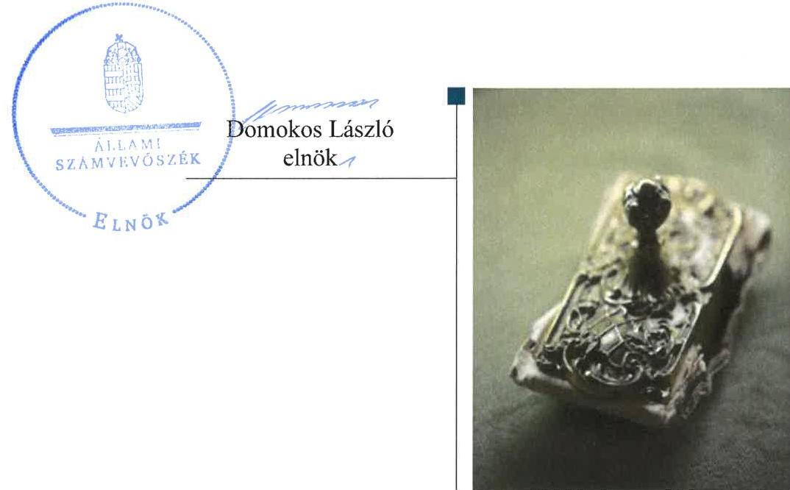
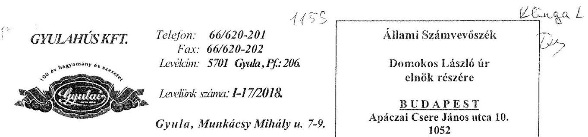
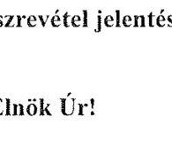
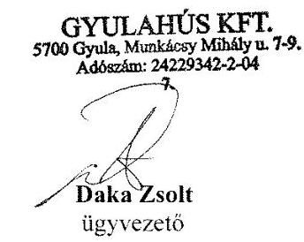
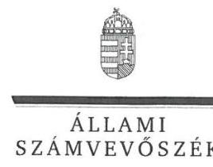
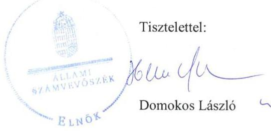
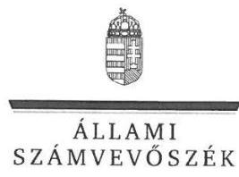
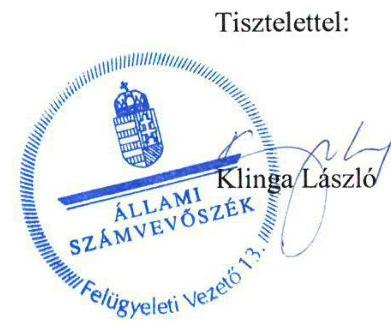

# Jelentés 

## Az önkormányzatok gazdasági társaságai

Az önkormányzatok többségi tulajdonában lévő gazdasági társaságok gazdálkodásának ellenőrzése - GYULAHÚS Kft.
2018.

---

# Jelentés 

## Az önkormányzatok gazdasági társaságai

Az önkormányzatok többségi tulajdonában lévő gazdasági társaságok gazdálkodásának ellenőrzése - GYULAHÚS Kft.
2018. szeptember hó 14. nap

---

# AZ ELLENŐRZÉST FELÜGYELTE:

- **KLINGA LÁSZLÓ** felügyeleti vezető
- **AZ ELLENŐRZÉST VEZETTE ÉS A VÉGREHAJTÁSÁÉRT FELELŐS:**
  - **HOFMEISTER LÁSZLÓ** ellenőrzésvezető
  - **A PROGRAM ÖSSZEÁLLÍTÁSÁÉRT FELELŐS:**
    - **TÓTPÁL SZABOLCS** osztályvezető

**IKTATÓSZÁM:** EL-0203-055/2018

**TÉMASZÁM:** 2447

**ELLENŐRZÉS-AZONOSÍTÓ SZÁM:** V-079370

---

Jelentéseink az Országgyűlés számítógépes hálózatán és az Interneten a www.asz.hu címen is olvashatóak.

---

# TARTALOMJEGYZÉK 

- ÖSSZEGZÉS ..... 5
- AZ ELLENŐRZÉS CÉLJA ..... 6
- AZ ELLENŐRZÉS TERÜLETE ..... 7
- AZ ELLENŐRZÉS HÁTTERE, INDOKOLTSÁGA ..... 8
- A JELENTÉS LÉNYEGES KÉRDÉSKÖREI ..... 9
- AZ ELLENŐRZÉS HATÓKÖRE ÉS MÓDSZEREI ..... 10
- MEGÁLLAPÍTÁSOK ..... 12
- JAVASLATOK ..... 14
- MELLÉKLETEK ..... 15
I. sz. melléklet: Értelmező szótár ..... 15
- FÜGGELÉK: ÉSZREVÉTELEK ..... 17
- RÖVIDÍTÉSEK JEGYZÉKE ..... 23

---

.

---

# ÖSSZEGZÉS 

A GYULAHÚS Kft. feletti tulajdonosi joggyakorlás kialakításával és szabályszerű gyakorlásával Gyula Város Önkormányzata megteremtette a Társaság szabályszerű működésének feltételeit. A Társaság számviteli szabályozottsága és gazdálkodása szabályszerű volt, vagyongazdálkodása nem volt szabályszerű. A Társaság a közérdekű adatok nyilvánosságra hozataláról gondoskodott.

## Az ellenőrzés társadalmi indokoltsága

Magyarországon az önkormányzatok kötelező és önként vállalt feladataik ellátása során egyre szélesebb körben alkalmazzák a költségvetési szerveken kívüli feladatellátást, ezáltal az önkormányzati tulajdonú gazdasági társaságok is kiemelt fontosságú szerephez jutnak a lakossági szolgáltatások biztosításában. Az önkormányzatok többségi tulajdonában álló gazdasági társaságok ellenőrzése kiemelt jelentőségű, mivel működésük hatással van a tulajdonos önkormányzat gazdálkodására, gazdálkodásának egyes elemei befolyásolják az önkormányzati alszektor hiányát és az államadósságot.

Az Állami Számvevőszék stratégiájában célul tűzte ki az államháztartáson kívül működő szervezetek ellenőrzését, mely hozzájárul a közpénzek szabályos, átlátható, elszámoltatható és eredményes felhasználásához. A GYULAHÚS Kft.-vel az általa ellátott feladaton keresztül a lakosság széles rétege került kapcsolatba.

## Főbb megállapítások, következtetések, javaslatok

Az Önkormányzat a Társaság feletti tulajdonosi joggyakorlásának kereteit a jogszabályoknak megfelelően alakította ki, a tulajdonosi jogait szabályszerűen gyakorolta.

A Társaság szabályozottsága megfelelt a jogszabályi előírásoknak, azonban számlarenddel nem rendelkezett.
A Társaság bevételeinek és ráfordításainak elszámolása szabályszerű volt. A vagyongazdálkodása nem volt szabályszerű, mert a tárgyi eszközöket a Számv. tv. előírása ellenére, legalább háromévente mennyiségi felvétellel nem leltározták, továbbá nem támasztották alá leltárral az aktív időbeli elhatárolások, a passzív időbeli elhatárolások, valamint a saját tőke mérlegsorokat.

Beszámolási és a közérdekű adatokra vonatkozó közzétételi kötelezettségének a Társaság eleget tett.
A megállapítások alapján az Állami Számvevőszék a GYULAHÚS Kft. ügyvezetőjének három javaslatot fogalmazott meg.

---

# AZ ELLENŐRZÉS CÉLJA 

Az ellenőrzés célja annak értékelése volt, hogy az önkormányzat vagyongazdálkodási tevékenysége során szabályszerűen gyakorolta-e tulajdonosi jogait, a gazdasági társaság szabályozottsága, gazdálkodása és vagyongazdálkodási tevékenysége, bevételeinek és ráfordításainak elszámolása megfelelt-e a jogszabályi és tulajdonosi előírásoknak; a gazdasági társaság kötelezettségállománya jelentett-e kockázatot a működésre, valamint a gazdálkodás átláthatósága és elszámoltathatósága érdekében biztosított volt-e a szolgáltatás díjának megalapozottsága szabályszerű önköltségszámítással.

---

# AZ ELLENŐRZÉS TERÜLETE 

## Gyula Város Önkormányzata és a kizárólagos tulajdonában lévő GYULAHÚS Korlátolt Felelősségű Társaság

A TÁRSASÁGOT ${ }^{1}$ az Önkormányzat ${ }^{2}$ alapította egyedüli tagként a 2013. évben. A Társaság alapításkori törzstőkéje 2,0 M Ft volt. Az ellenőrzött időszak során az Önkormányzat a törzstőkét háromszor emelte meg, melynek következtében a Társaság jegyzett tőkéje 2014. december 18-tól 852,7 M Ft-ra növekedett, mely 738,7 M Ft pénzbeli hozzájárulásból és 114,0 M Ft apportból állt.

A Társaság nem látott el közfeladatot, nem volt kormányzati szektorba sorolt egyéb szervezet. A Társaság által ellátandó feladatot az Alapító Okirat ${ }^{3}$-ban határozták meg, mely szerint a Társaság fő tevékenysége húsfeldolgozás és -tartósítás volt. Az Önkormányzat a feladatellátást szolgáló vagyont a Bérleti szerződés ${ }_{1-6}{ }^{4}$ keretében biztosította a Társaság számára. A Társaság vagyonkezelésbe vagyont nem vett át.

A Társaság vagyona az ellenőrzött időszakban mintegy kétszeresére nőtt az éves beszámolókban szereplő adatok alapján. A Társaság minden ellenőrzött évben nyereségesen működött, a 2013-2016. években több mint 1 Mrd Ft nyereséget ért el, osztalékfizetésre nem került sor egyik évben sem. Az átlagos állományi létszáma a 2013. évi 268 főről 2016. évre 300 főre emelkedett.

Az ellenőrzött időszakban a polgármester, a jegyző és a Társaság ügyvezetőjének személye nem változott.

---

# AZ ELLENŐRZÉS HÁTTERE, INDOKOLTSÁGA 

Az önkormányzatok többségi tulajdonában álló gazdasági társaságok ellenőrzése kiemelten fontos a vagyon megőrzése, megóvása érdekében, alapvető követelmény, hogy gazdálkodásuk, működésük szabályszerű, az általuk szolgáltatott adatok minél megbízhatóbbak legyenek.

A feladatellátás költségeinek, ráfordításainak alakulása a lakosság széles rétegét érinti. Az ellenőrzés várható hasznosulásaként ellenőrzéseink feltárhatják, hogy az önkormányzat a feladatellátásához rendelt vagyon működtetését a tulajdonostól elvárható gondossággal végezte-e, a feladatot ellátó gazdasági társaság a létesítő okiratban, szolgáltatási szerződésben foglaltak betartásával biztosította-e a feladat ellátását. Az ellenőrzés rávilágíthat arra, hogy a gazdasági társaság a vagyon használatával biztosította-e a szolgáltatás folytatásának feltételeit, az önkormányzat tulajdonosi felügyelete hozzájárult-e a szabályszerű gazdálkodáshoz és feladatellátáshoz.

A megállapítások alapján megfogalmazott számvevőszéki javaslatok hasznosítása elősegítheti a meglévő hibák megszüntetését. A jó gyakorlatok bemutatásával az Állami Számvevőszék hozzájárul a követendő megoldások megismertetéséhez, terjesztéséhez.

---

# A JELENTÉS LÉNYEGES KÉRDÉSKÖREI 

1. A tulajdonosi jogok gyakorlása szabályszerű volt-e?
2. A Társaság szabályozottsága, gazdálkodása és vagyongazdálkodása megfelelt az előírásoknak?

---

# AZ ELLENŐRZÉS HATÓKÖRE ÉS MÓDSZEREI 

## Az ellenőrzés típusa

Megfelelőségi ellenőrzés

## Az ellenőrzött időszak

2013. január 1-jétől 2016. december 31-ig

## Az ellenőrzés tárgya

Gyula Város Önkormányzatának tulajdonosi joggyakorlása, valamint a GYULAHÚS Korlátolt Felelősségű Társaság gazdálkodásának szabályozottsága és szabályszerűsége volt az ellenőrzés tárgya.

Az ellenőrzés kiterjedt minden olyan körülményre és adatra, amely az ÁSZ ${ }^{5}$ jogszabályban meghatározott feladatainak teljesítéséhez, valamint a program végrehajtása folyamán felmerült újabb összefüggések feltárásához szükséges volt.

## Az ellenőrzött szervezet

Gyula Város Önkormányzata és a GYULAHÚS Korlátolt Felelősségű Társaság.

## Az ellenőrzés jogalapja

Az ellenőrzés jogalapját az ÁSZ tv. ${ }^{6}$ 1. § (3) bekezdése és 5. § (3)-(5) bekezdései képezik.

## Az ellenőrzés módszerei

Az ellenőrzést a nemzetközi standardokat irányadónak tekintve az ellenőrzési program ellenőrzési kérdései, az ellenőrzött időszakban hatályos jogszabályok, az ellenőrzés szakmai szabályok és módszertanok figyelembe vételével végeztük.

Az ellenőrzés ideje alatt az ellenőrzött szervezettel történő kapcsolattartást az ÁSZ Szervezeti és Működési Szabályzatának vonatkozó előírásai alapján biztosítottuk.

Az ellenőrzési kérdések megválaszolásához szükséges bizonyítékok megszerzése a következő ellenőrzési eljárások alkalmazásával történt:

---

megfigyelés, kérdésfeltevés (információkérés), összehasonlítás, valamint elemző eljárás. Az ellenőrzési bizonyítékként felhasználható adatforrások közé tartoztak egyrészt az ellenőrzési programban felsorolt adatforrások, másrészt adatforrás lehet még minden - az ellenőrzés folyamán - feltárt, az ellenőrzés szempontjából információkat tartalmazó dokumentum.

Az ellenőrzést a kérdésekre adott válaszok kiértékelésével, valamint a megjelölt adatforrások, a csatolt tanúsítványok felhasználásával, továbbá az adott időszakban hatályos jogszabályok figyelembe vételével folytattuk le.

A bevételek és ráfordítások elszámolása, valamint a vagyonnyilvántartás terén a szabályszerű működést véletlen mintavétellel ellenőriztük. A mintavétellel ellenőrzött területek esetében minden egyes tétel vonatkozásában a szabályszerűségre vonatkozó kérdéseket tettünk fel, amelyek eredménye összesítésre került. Megfelelőnek értékeltünk egy ellenőrzött területet, amennyiben 95%-os bizonyossággal a teljes sokaságban az átlagos hibaarány legfeljebb 10%, nem megfelelőnek, amennyiben 10%-nál magasabb arányt képviselt. Abban az esetben, ha a teljes sokaság tekintetében a 10%-os hibaarányhoz való viszony megítélésének megbízhatósága nem érte el a 95%-ot, annak elérése érdekében értékelésünket további szempontokkal egészítettük ki, és figyelembe vettük a feltárt hibák típusát és súlyát. A ráfordítások elszámolására és a vagyonnyilvántartásra vonatkozó véletlen mintavételt kockázati alapú kiválasztással egészítettük ki, amelynek során évente a három legnagyobb összegű tételt értékeltük.

---

# 1. A tulajdonosi jogok gyakorlása szabályszerű volt-e? 

## Összegző megállapítás

A tulajdonosi jogok gyakorlása szabályszerű volt.
A TULAJDONOSI JOGOK GYAKORLÁSA a Vagyongazdálkodási rendelet ${ }_{1-2}{ }^{7}$-ben előírtaknak megfelelően történt az Alapító ${ }^{8}$ által. Az Alapító okirat az Alapító kizárólagos hatáskörébe tartozó feladatokat rögzítette, szabályozta a tulajdonosi joggyakorlás elemeit és kereteit, tartalmazta a könyvvizsgáló személyével, működésével kapcsolatos hatásköröket, feladatokat.

A háromtagú $\mathrm{FB}^{9}$-t a Társaságnál a Gt. ${ }^{10}$-ben és a Taktv. ${ }^{11}$-ben előírtak szerint hozták létre. Az FB a Társaság üzleti terveit megtárgyalta, a Számv. tv. ${ }^{12}$ szerinti beszámolóira vonatkozó döntéseiről írásbeli jelentést készített.

A Taktv.-ben előírtak szerint az Alapító megalkotta és 2013. november 21-én hatályba helyezte Javadalmazási szabályzat ${ }^{13}$-át.

ÜZLETI TERV készítésének kötelezettségét a Társaság SZMSZ ${ }^{14}$-e rögzítette. Az éves üzleti tervet az Alapító minden évben határozatával jóváhagyta.

A TÁRSASÁG SZÁMVITELI BESZÁMOLÓIT az Alapító megtárgyalta a könyvvizsgáló írásos véleménye, valamint az FB jelentése birtokában és elfogadásáról határozatot hozott. Az Alapító a Társaság a 2013-2016. évi nyereségét eredménytartalékba helyezte.

## 2. A Társaság szabályozottsága, gazdálkodása és vagyongazdálkodása megfelelt-e az előírásoknak?

## Összegző megállapítás

2.1. számú megállapítás

A Társaság szabályozottsága, gazdálkodása szabályszerű volt, a vagyongazdálkodása nem volt szabályszerű.

A Társaság számviteli szabályozottsága szabályszerű volt.
A Társaság rendelkezett a Számv. tv. által előírt Számviteli politika ${ }^{15}$-val, valamint az annak keretében elkészítendő Leltározási szabályzat ${ }^{16}$-tal, Értékelési szabályzat ${ }^{17}$-tal, Önköltségszámítási szabályzat ${ }^{18}$-tal és Pénzkezelési szabályzat ${ }^{19}$-tal, melyek tartalma megfelelt a jogszabály előírásának.

Számlarenddel a Társaság nem rendelkezett a Számv. tv. 161. § (1) bekezdés előírása ellenére.

A Társaságnál alkalmazott számlatükör tartalmazta Számv. tv.-ben előírtaknak megfelelően az alkalmazásra kijelölt számlák számát és megnevezését.

---

# 2.2. számú megállapítás 

A Társaság bevételeinek és ráfordításainak elszámolása szabályszerű volt. A Társaság vagyongazdálkodása a leltár hiányosságai miatt nem volt szabályszerű. A közzétételi kötelezettségnek eleget tettek.

A BEVÉTELEK ÉS RÁFORDÍTÁSOK elszámolása szabályszerű volt.

AZ ÉVES BESZÁMOLÓT a Társaság a Számv. tv. előírásának megfelelő határidőben elkészítette, a letétbe helyezési és közzétételi kötelezettséget szabályszerűen teljesítette.

A Társaságnál a tárgyi eszközök mérlegben kimutatott értékét a 2013-2016. évek egyikében sem támasztották alá mennyiségi felvétellel történő leltározással, ezzel nem tettek eleget a Számv. tv. 69. § (3) bekezdésében előírt, legalább háromévente mennyiségi felvétellel történő leltározási kötelezettségének. A jelentős arányt képviselő készletek mérlegben kimutatott értékét szabályszerűen alátámasztották mennyiségi felvétellel történő leltározással.

A 2013-2016. években nem támasztották alá leltárral az aktív időbeli elhatárolások, a passzív időbeli elhatárolások, valamint a saját tőke mérlegsorokat a Számv. tv. 69. § (1) bekezdésében előírtak ellenére.

A KÖNYVVIZSGÁLÓ a leltározás hiányossága ellenére a beszámolót minden évben korlátozás nélküli hitelesítő záradékkal látta el.

A KÖZÉRDEKŰ ADATOK nyilvánosságra hozatalával kapcsolatos kötelezettségeinek a Társaság eleget tett.

---

# JAVASLATOK 

Az ÁSZ tv. 33. § (1) bekezdésében foglaltak értelmében az ellenőrzött szervezet vezetője köteles a jelentésben foglalt megállapításokhoz kapcsolódó intézkedési tervet összeállítani és azt a jelentés kézhezvételétől számított 30 napon belül az ÁSZ részére megküldeni. Amennyiben az ellenőrzött szervezet vezetője nem küldi meg határidőben az intézkedési tervet, vagy továbbra sem elfogadható intézkedési tervet küld, az Állami Számvevőszék elnöke az ÁSZ tv. 33. § (3) bekezdés a) és b) pontjaiban foglaltakat érvényesítheti.

##
 GYULAHÚS Kft. ügyvezetőjének

1. Intézkedjen a jogszabályi előírásoknak megfelelően a számlarend elkészítéséről.
(2.1. sz. megállapítás 2. bekezdése alapján)
2. Intézkedjen a tárgyi eszközök mérlegben kimutatott értékének alátámasztásához a jogszabályban előírt mennyiségi leltározás végrehajtására.
(2.2. sz. megállapítás 3. bekezdés 1. mondata alapján)
3. Intézkedjen az aktív időbeli elhatárolások, a passzív időbeli elhatárolások, valamint a saját tőke mérlegsorok jogszabályi előírásoknak megfelelő leltárral történő alátámasztásáról.
(2.2. sz. megállapítás 4. bekezdése alapján)

---

# MELLÉKLETEK 

- I. SZ. MELLÉKLET: ÉRTELMEZŐ SZÓTÁR
gazdasági társaság
kormányzati szektorba sorolt egyéb szervezet
nemzeti vagyon

A Ptk. 3:88. § (1) bekezdése szerint „a gazdasági társaságok üzletszerű közös gazdasági tevékenység folytatására, a tagok vagyoni hozzájárulásával létrehozott, jogi személyiséggel rendelkező vállalkozások, amelyekben a tagok a nyereségből közösen részesednek, és a veszteséget közösen viselik".
az Áht. ${ }^{20}$ 3. § (2) és (3) bekezdésében foglaltakon kívül az Európai Közösséget létrehozó szerződéshez csatolt, a túlzott hiány esetén követendő eljárásról szóló jegyzőkönyv alkalmazásáról szóló 2009. május 25-i 479/2009/EK rendelet (a továbbiakban: 479/2009/EK rendelet) szerint a kormányzati szektorba sorolt szervezet (Áht. 1. § (12))
Nvtv. ${ }^{21}$ 1. § (2) bekezdése szerint többek között:
„az állam vagy a helyi önkormányzat kizárólagos tulajdonában álló dolgok, az a) pont hatálya alá nem tartozó, állam vagy a helyi önkormányzat tulajdonában lévő dolog,
az állam vagy a helyi önkormányzat tulajdonában lévő pénzügyi eszközök, továbbá az államot vagy a helyi önkormányzatot megillető társasági részesedések, az államot vagy a helyi önkormányzatot megillető bármely vagyoni értékkel rendelkező jogosultság, amelyet jogszabály vagyoni értékű jogként nevesít."

---

.

---

# FÜGGELÉK: ÉSZREVÉTELEK 

A jelentéstervezetet a Számvevőszék 15 napos észrevételezésre megküldte az ellenőrzött szervezetek vezetőinek az ÁSZ tv. 29. § (1) bekezdése előírásának megfelelően.

Gyula Város Önkormányzat polgármestere az ÁSZ tv. 29. § (2) bekezdésében foglalt észrevételezési jogával nem élt, a jelentéstervezetre észrevételt nem tett. A GYULAHÚS Kft. ügyvezetőjének észrevételét és az arra adott választ a függelék tartalmazza.

[^0]
[^0]:    * 29. § (1) Az Állami Számvevőszék az ellenőrzési megállapításait megküldi az ellenőrzött szervezet vezetőjének vagy az általa megbízott személynek, és annak, akinek személyes felelősségét állapította meg.
    (2) Az ellenőrzött szervezet vezetője és a felelősként megjelölt személy az ellenőrzés megállapításaira tizenöt napon belül írásban észrevételt tehet.
    (3) Az Állami Számvevőszék az észrevételre a beérkezésétől számított harminc napon belül írásban válaszol. A figyelembe nem vett észrevételeket köteles a jelentésben feltüntetni, és megindokolni, hogy azokat miért nem fogadta el.

---

Tárgy: Észrevétel jelentés-tervezetre

Tisztelt Elnök Úr!

Hivatkozással a 2018.07.09-én kelt, EL-0565-009/2018. iktatószámon érkezett Számvevőszéki jelentéstervezetre, a következő észrevételeket tesszük:

A jelentéstervezet a vagyongazdálkodást illetően fogalmazott meg szabálytalanságokat, egészen konkrétan a tárgyi eszközök, az aktív és passzív időbeli elhatárolások, valamint a saját tőke leltárazásával kapcsolatosan. A tárgyi eszközök esetében a tényleges mennyiségi felvételezést, az aktív és passzív, továbbá a saját tőke esetében pedig az egyeztetéssel történő leltározás hiányát.

Véleményünk szerint a vagyongazdálkodásról sommásan kijelenteni, hogy az nem volt szabályszerű: eltúlzott és félreérthető.

A kifogásolt részek csak a vagyongazdálkodás kis részét érintik, ezen nyilvántartások, adatok a teljes vagyongazdálkodás mikéntjét, megfelelőségét legfeljebb részlegesen érintik, de ahogyan az alábbiak szerint látható, ezen kérdések is megfelelően és megnyugtatóan rendezettek. Mindezek alapján nem tartjuk jogosnak a teljes vagyongazdálkodásra kimondani, hogy nem szabályszerű. A társaság vagyonának kezelése, gyarapítása - a tulajdonos megelégedésére -, az esetleges kisebb hibákat leszámítva, ami az egész gazdálkodást érdemben nem érinti, véleményünk szerint megfelelő.

Rátérve a konkrét szakmai észrevételekre:

# 1.) Tárgyi eszközök 

Még az első kiértesítést követően, ahol a várható bekérendő adatokat közölték, a gazdasági vezető telefonon felvette a kapcsolatot az Állami Számvevőszékkel. A kérdés az volt, hogy a leltárakat milyen mélységig kell feltölteni. Ez azért volt kérdés, mert ha a legalsó szintig szerettünk volna a bizonylatokat feltölteni, óriási mennyiségű adat keletkezett volna. Az Számvevőszéktől telefonon azt az információt kapták, hogy elegendőek az összesítők is, ha azok cégszerűen alá vannak írva és lebélyegezve. Így jártunk el a tárgyi eszközök esetében, a többi mennyiségi felvétellel leltározandó eszközökhöz hasonlóan. Valamennyi vizsgált évre benyújtottuk a tárgyi eszközök részletes értékbeli kimutatását, a vagyonleltár dokumentumai közé. Az egyedi leltárkartonok feltöltésének hiányában az Állami Számvevőszék jelentésében azt írta, hogy nem történt meg a tényleges mennyiségi felvétellel történő leltározás. Ezzel a megállapítással nem értünk egyet, mivel a leltár a leltározási szabályzat előírásának megfelelően megtörtént, tényleges mennyiségi felvétellel. Ennek bizonyítékaként csatolunk néhány leltárfelvételi ívet. A számviteli törvény előírásainak megfelelően 3 évente leltározzuk a tárgyi eszközöket. Egyszerre az önkormányzat tulajdonában lévő bérelt eszközökkel.

---

# 2.) Aktív és passzív elhatárolások 

A következő mérlegsorok, az aktív és passzív időbeli elhatárolások esetében részletező kimutatás készült a könyvvizsgáló részére az éves beszámoló alátámasztása érdekében, amely analitikus nyilvántartásnak tekintendő. Ennek elkészítésével megvalósult a főkönyvi és analitikus nyilvántartás egyeztetése, leltárként funkcionál. Feltöltve ugyan nem lett az Állami Számvevőszék adatállományai közé, de minden évre rendelkezünk a dokumentációval, amit ezen levelünk mellé csatolunk is. A szóban forgó mérlegsorok a kiegészítő melléklet kötelező tartalmi elemeinek részét képezik, táblázat formában megtalálhatók a beszámolókban.

## 3.) Saját tőke

Hasonló a helyzet saját tőke esetében is. Véleményünk szerint ennél transzparensebb mérlegsor nincs, mivel minden tőkeelem szerepel a kiegészítő mellékletben külön táblázatok formájában, ahol egyértelműen látható a nyitóérték, záró érték, valamint a változások, kiegészítve magyarázatokkal. Talán a jegyzett tőke sora az, aminél az egyeztetés megvalósítható, a többi tőkeelem egymásból következik. Ráadásul a mérlegszerinti eredmény, amely a saját tőke egyik legfontosabb eleme, az eredmény-kimutatásból származik, egy soron mutatja a társaság tevékenységének eredményét és az éves könyvvizsgálat szerves részét képezi.

Véleményünk szerint a könyvvizsgáló kellően meggyőződött a mérleg leltárral való alátámasztásáról minden eszköz és forrás tekintetében, ezért az éves beszámolót jogosan, látta el korlátozás nélküli hitelesítő záradékkal.

A társaság mindent szabályosan végez a leltározása során, összhangban a számviteli törvénnyel és az érvényben lévő leltározási szabályzat előírásaival, ezért nem értünk egyet azzal, hogy a vagyongazdálkodásunk nem volt szabályszerű.

A jelentéstervezet más pontjához észrevételt nem kívánunk tenni.

Gyula, 2018. július 25.

---

ELNÖK

Ikt.szám: EL-0565-015/2018.

# Daka Zsolt Attila úr 

ügyvezető
GYULAHÚS Kft.

## Gyula

## Tisztelt Ügyvezető Úr!

Köszönettel vettem „Az önkormányzatok gazdasági társaságai - Az önkormányzatok többségi tulajdonában lévő gazdasági társaságok gazdálkodásának ellenőrzése - GYULAHÚS Kft." című ellenőrzésről készített számvevőszéki jelentéstervezetre megküldött észrevételeit.
Az Állami Számvevőszék észrevételekre vonatkozó álláspontját a felügyeleti vezető által készített részletes tájékoztatás tartalmazza, amelyet levelemhez mellékeltem.
Tájékoztatom Ügyvezető urat, hogy az Állami Számvevőszék a figyelembe nem vett észrevételeket az Állami Számvevőszékről szóló 2011. évi LXVI. törvény 29. § (3) bekezdésében előírtak szerint köteles a jelentésében feltüntetni és megindokolni, hogy azokat miért nem fogadta el.

Budapest, 2018. 08 hó 29 nap

Melléklet: Tájékoztatás az észrevételek kezeléséről

---

FELÜGYELETI VEZETŐ

# Tájékoztatás az észrevétel kezeléséről 

Megköszönöm Ügyvezető úrnak „Az önkormányzatok gazdasági társaságai - Az önkormányzatok többségi tulajdonában lévő gazdasági társaságok gazdálkodásának ellenőrzése GYULAHÚS Kft." címmel készített jelentés-tervezetre tett észrevételét. Az észrevétel kezeléséről az alábbi tájékoztatást adom:

Az Állami Számvevőszék (továbbiakban: ÁSZ) az ellenőrzését a megküldött programnak megfelelően, az ellenőrzés-szakmai szabályok és módszertanok figyelembe vételével, a rendelkezésre bocsátott adatok és dokumentumok (bizonyítékok) alapján végezte. A vagyongazdálkodás szabályszerűségére tett összegző megállapítást a részletes megállapítások alapozták meg. A vagyongazdálkodást, mint azt a jelentéstervezet 2. számú megállapítása is tartalmazza a leltár hiányosságai miatt értékeltük nem szabályszerűnek.

Az Állami Számvevőszékről szóló 2011. évi LXVI. törvény (továbbiakban: ÁSZ tv.) 28. § (2) bekezdése alapján a közreműködésre felhívott szervezet az ÁSZ részére - annak kérésére soron kívül, de legkésőbb öt munkanapon belül - az ellenőrzés lefolytatása érdekében a szükséges adatokat és dokumentumokat rendelkezésre bocsátja.

Az Állami Számvevőszék törvényi felhatalmazáson alapuló, szabályos adatbekérést követően folytatta le az ellenőrzést. Ügyvezető úr a teljességi és hitelességi nyilatkozatban kijelentette, hogy az átadott dokumentumok, adatok, hitelesek, valódiak, hiánytalanok és hatályosak. Az ÁSZ ennek megfelelően a Társaság által rendelkezésre bocsátott dokumentumok alapján, a teljességi és hitelességi nyilatkozatban rögzítetteket figyelembe véve folytatta le az ellenőrzést, és tette meg megállapításait, melyek a tényeknek megfelelően kerültek minősítésre és a számvevőszéki jelentésben rögzítésre. Az adatszolgáltatási szakasz a teljességi és hitelességi nyilatkozattal lezárult, ezért az észrevételéhez csatolt dokumentumok ellenőrzési bizonyítékként már nem felhasználhatóak, így a megállapításokat azok alapján nem áll módomban módosítani.

---

Tájékoztatom, hogy az ÁSZ tv. 33. § (1) bekezdésében foglaltak értelmében az ellenőrzött szervezet vezetője köteles a jelentésben foglalt megállapításokhoz kapcsolódó intézkedési tervet összeállítani és azt a jelentés kézhezvételétől számított 30 napon belül az ÁSZ részére megküldeni.

Budapest, 2018. augusztus " 28 ".

---

# RÖVIDÍTÉSEK JEGYZÉKE 

${ }^{1}$ Társaság
${ }^{2}$ Önkormányzat
${ }^{3}$ Alapító Okirat
${ }^{4}$ Bérleti szerződés ${ }_{1}$
Bérleti szerződés ${ }_{2}$
Bérleti szerződés ${ }_{3}$
Bérleti szerződés ${ }_{4}$
Bérleti szerződés ${ }_{5}$
${ }^{5}$ ÁSZ
${ }^{6}$ ÁSZ tv.
${ }^{7}$ Vagyongazdálkodási rendelet ${ }_{1}$
Vagyongazdálkodási rendelet ${ }_{2}$
${ }^{8}$ Alapító
${ }^{9}$ FB
${ }^{10}$ Gt.
${ }^{11}$ Taktv.
${ }^{12}$ Számv. tv.
${ }^{13}$ Javadalmazási szabályzat
${ }^{14}$ társasági SZMSZ
${ }^{15}$ Számviteli politika
${ }^{16}$ Leltározási szabályzat
${ }^{17}$ Értékelési szabályzat
${ }^{18}$ Önköltségszámítási szabályzat
${ }^{19}$ Pénzkezelési szabályzat
${ }^{20}$ Áht.

GYULAHÚS Korlátolt Felelősségű Társaság
Gyula Város Önkormányzata
GYULAHÚS Korlátolt Felelősségű Társaság Alapító okirata módosításokkal egységes szerkezetben (hatályos: 2014. december 18-tól)
Bérleti szerződés Gyula Város Önkormányzata és GYULAHÚS Korlátolt Felelősségű Társaság között ingatlanokra, ingóságokra (hatályos 2014. január 24-től)
Bérleti szerződés 1. számú módosítása Gyula Város Önkormányzata és GYULAHÚS Korlátolt Felelősségű Társaság között ingatlanokra, ingóságokra (hatályos 2014. június 26-tól)
Bérleti szerződés 2. számú módosítása Gyula Város Önkormányzata és GYULAHÚS Korlátolt Felelősségű Társaság között ingatlanokra, ingóságokra (hatályos 2015. április 1-jétől)
Bérleti szerződés 3. számú módosítása Gyula Város Önkormányzata és GYULAHÚS Korlátolt Felelősségű Társaság között ingatlanokra, ingóságokra (hatályos 2015. október 1-jétől)
Bérleti szerződés 4. számú módosítása Gyula Város Önkormányzata és GYULAHÚS Korlátolt Felelősségű Társaság között ingatlanokra, ingóságokra (hatályos 2015. november 19-től)
Állami Számvevőszék
Az Állami Számvevőszékről szóló 2011. évi LXVI. törvény (hatályos 2011. július 1-jétől)
Gyula Város Önkormányzata Képviselő-testületének az önkormányzat vagyonáról és a vagyonhasznosítás szabályairól szóló 11/2003. (III.28.) számú rendelete
Gyula Város Önkormányzata Képviselő-testületének az önkormányzat vagyonáról és a vagyongazdálkodásról szóló 31/2013. (XII.23) számú rendelete
Gyula Város Önkormányzatának Képviselő-testülete
GYULAHÚS Korlátolt Felelősségű Társaság felügyelőbizottsága
2006. évi IV. törvény a gazdasági társaságokról (hatálytalan 2014. március 15-től)
2009. évi CXXII. törvény a köztulajdonban álló gazdasági társaságok takarékosabb működéséről (hatályos 2009. december 4-től)
2000. évi C. törvény a számvitelről (hatályos 2001. január 1-jétől)

Szabályzat a köztulajdonban álló gazdasági társaságok takarékosabb működéséről szóló 2009. évi CXXII. törvényben meghatározott, Gyula Város Önkormányzata többségi befolyása alatt álló gazdasági társaságok ügyvezetőire és felügyelő bizottsági tagjaira, valamint a munka törvénykönyvéről szóló 2012. évi I. tv. 208. § hatálya alá tartozó munkavállalókra vonatkozó javadalmazás elveiről (hatályos 2013. november 21-től, majd 2015. április 23-ától)
GYULAHÚS Kft. szervezeti és működési szabályzata (hatályos 2013.
 május 23-tól)
GYULAHÚS Kft. Számviteli politikája (hatályos 2013. január 14-től)
GYULAHÚS Kft. Leltározási szabályzata (hatályos 2013. január 14-től)
A Számviteli politika 3. pontjában szereplő eszközök és források értékelési szabályzata (hatályos 2013. január 14-től)
GYULAHÚS Kft. Önköltségszámítási szabályzata (hatályos 2013. január 14-től)
GYULAHÚS Kft. Pénzkezelési szabályzata (hatályos 2013. február 14-től)
2011. évi CXCV. törvény az államháztartásról (hatályos 2012. január 1-jétől)

---

${ }^{21}$ Nvtv.
2011. évi CXCVI. törvény a nemzeti vagyonról (hatályos 2012. január 1-jétől)

---

# ÁLLAMI SZÁMVEVŐSZÉK 

1052 Budapest, Apáczai Csere János utca 10.
Levélcím: 1364 Budapest Pf. 54
Telefon: +36 1 4849100 Telefax: +36 1 4849200
www.asz.hu
